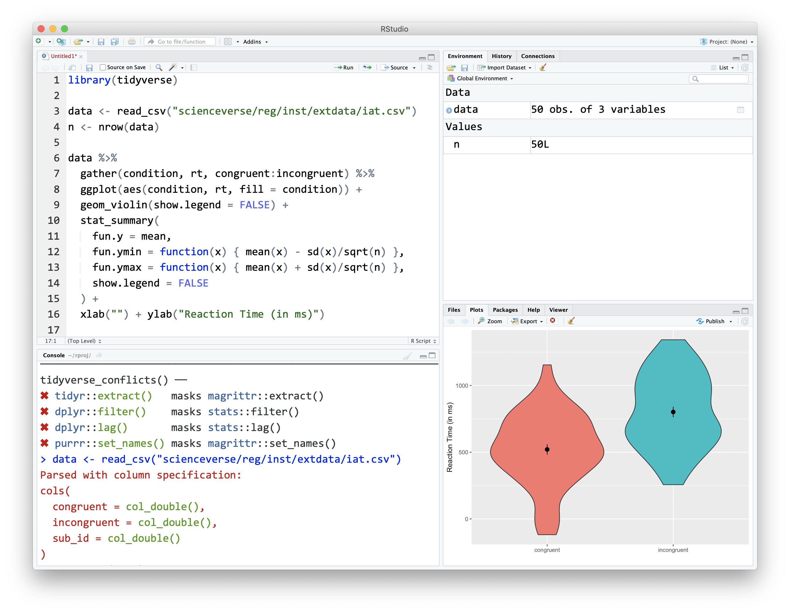

# Intro to R and RStudio {#intro}

## Intended Learning Outcomes {#ilo-intro}

* Install R and RStudio
* Be able to install add-on packages
* Be able to get help for packages and functions

## Installing R and RStudio {#intro-installing-r}

Appendix\ \@ref(installing-r) has technical details on installing R and RStudio on your computer. Here, we'll concentrate on introducing you to RStudio's interface and getting it configured.

### RStudio {#rstudio_ide}

When you installed R, that gave your computer the ability to process the R programming language, and also installed an app called "R". We will never use that app. Instead, we will use [RStudio](http://www.rstudio.com){target="_blank"}, which is an Integrated Development Environment (`r glossary("IDE")`): a program that serves as a text editor, file manager, spreadsheet viewer, and more. RStudio is arranged with four window `r glossary("panes")`.

```{r img-rstudio, echo=FALSE, fig.cap="The RStudio IDE"}

``` 

By default, the upper left pane is the **source pane**, where you view and edit source code from files and view data tables in a spreadsheet format. 

The lower left pane is the **console pane**, where you can type in commands and view output messages. 

The right panes have several different tabs that show you information about your code. The most common tabs in the upper right pane are the **Environment** tab and the **Help** tab. The environment tab lists some information about of the `r glossary("object", "objects")` that you have defined in your code. We'll learn more about the Help tab in Section\ \@ref(function-help). 

In the lower right pane, the most used tabs are the **Files** tab for directory structure, the **Plots** tab for plots made in a script, the **Packages** tab for managing add-on packages (see Section\ \@ref(packages)), and the **Viewer*** tab to display reports created by your scripts. You can change the location of panes and what tabs are shown under **`Preferences > Pane Layout`**.

### Reproducibility {#intro-reproducibility}

In this class, you will be learning how to make `r glossary("reproducibility", "reproducible")` reports. This involves writing scripts that transform data, create summaries and visualisations, and embed them in a report in a way that always gives you the same results.

When you do things reproducibly, others (and future you) can understand and check your work. You can also reuse your work more easily. For example, if you need to create a report every month with the social media analytics for your company, a reproducible report allows you to download a new month's data and create the report within seconds. It might take a little longer to set up the report in the first instance with reproducible methods, but the time it saves you in the long run is invaluable.

::: {.try data-latex=""}
Appendix\ \@ref(rstudio-settings) shows you how to change two important settings in the global Options to increase reproducibility. Your settings should have:

* Restore .RData into workspace at startup: `r mcq(c("Checked", answer = "Not Checked"))`
* Save workspace to .RData on exit: `r mcq(c("Always", answer = "Never", "Ask"))`
:::

## Add-on packages {#packages}

One of the great things about R is that it is **user extensible**: anyone can create a new add-on that extends its functionality. There are currently thousands of `r glossary("package", "packages")` that R users have created to solve many different kinds of problems, or just simply to have fun. For example, there are packages for data visualisation, machine learning, interactive dashboards, web scraping, and playing games such as Sudoku.

Add-on packages are not distributed with `r glossary("base R")`, but have to be downloaded and installed from an archive, in the same way that you would, for instance, download and install PokemonGo on your smartphone. The main repository where packages reside is called `r glossary("CRAN")`, the Comprehensive R Archive Network.

There is an important distinction between **installing** a package and **loading** a package.

### Installing a package {#install-package}

<div class="small_right"></div>

This is done using `r hl(install.packages())`. This is like installing an app on your phone: you only have to do it once and the app will remain installed until you remove it. For instance, if you want to use PokemonGo on your phone, you install it once from the App Store or Play Store; you don't have to re-install it each time you want to use it. Once you launch the app, it will run in the background until you close it or restart your phone. Likewise, when you install a package, the package will be available (but not *loaded*) every time you open up R.

Install the `r pkg("esquisse")` package on your system. This package lets you create plots interactively and copy the code needed to make them reproducibly.

```{r install-pckg, eval = FALSE}
# type this in the console pane
install.packages("esquisse")
```

If you don't already have packages like `r pkg("ggplot2")` and `r pkg("shiny")` installed, it will also install these **dependencies** for you. If you don't get an error message at the end, the installation was successful. 

::: {.dangerous data-latex=""}
Never install a package from inside a script. Only do this from the console pane.
:::

You can also install multiple packages at once. Here is the command to install all of the packages we'll be using in this class. This will take a while, so don't try this in the middle of a tutorial!

```{r install-all-packages, eval = FALSE}
install.packages(
  "tidyverse",      # for everything
  "rio",            # for data import
  "kableExtra",     # for nice tables
  "ggwordcloud",    # for word clouds
  "tidytext",       # for parsing text for word clouds
  "patchwork",      # for multi-part plots
  "ggthemes",       # for themed plots
  "glue",           # for text manipulation
  "flexdashboard"   # for dashboard presentations
)
```

### Loading a package

This is done using `r hl(library(package_name))`. This is like **launching** an app on your phone: the functionality is only there where the app is launched and remains there until you close the app or restart. For example, when you run `r hl(library(glue))` within a session, the functions in the package referred to by `glue` will be made available for your R session. The next time you start R, you will need to run `r hl(library(glue))` again if you want to access that package.

You can load the `r pkg("esquisse")` package for your current R session as follows:

```{r library-pckg}
library(esquisse)
```

You might get some red text when you load a package, this is normal. It is usually warning you that this package has functions that have the same name as other packages you've already loaded.

::: {.info data-latex=""}
You can use the convention `package::function()` to indicate in which add-on package a function resides. For instance, if you see `r hl(readr::read_csv())`, that refers to the function `r hl(read_csv())` in the `r pkg("readr")` add-on package. If the package is loaded using `library()`, you don't have to specify the package name before a function unless there is a conflict (e.g., you have two packages loaded that have a function with the same name).
:::

### Using a function

Now you can run the function `r hl(esquisser())`, which starts up an interactive plotting example.

```{r esquisser-demo, eval = FALSE}
# type this in the console pane
esquisser(data = ggplot2::diamonds)
```

::: {.warning data-latex=""}
If you see the error message: `Error in esquisser(data = ggplot2::diamonds) : could not find function "esquisser"`, that just means that you forgot to load the `r pkg("esquisse")` package using `library(esquisse)`. Either run the code to load the package first, or preface the function with the package name like `esquisse::esquisser()` to use it without loading the package.
:::

A `r glossary("function")` is a name that refers to some code you can reuse. We'll start by using functions that are provided for you in packages, but you can also write your own functions. After the function name, there is a pair of parentheses, which contain zero or more `r glossary("argument", "arguments")`. These are options that you can set. In the example above, the `data` argument is set to `ggplot2::diamonds`, which refers to the built-in dataset `diamonds` from the `r pkg("ggplot2")` package.

If you type a function into the console pane, it will run as soon as you hit enter. If you put the function in a `r glossary("script")` or `r glossary("R Markdown")` document in the `r glossary("panes", "source pane")`, it won't run until you run the script, `r glossary("knit")` the R Markdown file, or run a code `r glossary("chunk")`. You'll learn more about this in Chapter\ \@ref(reports).


### Tidyverse

`r pkg("tidyverse")`is a meta-package that loads several packages we'll be using in almost every report:

- `r pkg("ggplot2")`, for data visualisation (Chapter\ \@ref(viz))
- `r pkg("readr")`, for data import (Chapter\ \@ref(data))
- `r pkg("tibble")`, for tables (Chapter\ \@ref(data))
- `r pkg("tidyr")`, for data tidying (Chapter\ \@ref(tidy))
- `r pkg("dplyr")`, for data manipulation (Chapter\ \@ref(wrangle))
- `r pkg("stringr")`, for `r glossary("string", "strings")`
- `r pkg("forcats")`, for `r glossary("factor", "factors")`
- `r pkg("purrr")`, for repeating things

When you install `r pkg("tidyverse")`, it also installs some other useful packages that you can load individually. You can get the full list using `tidyverse_packages()`, but the packages we'll be using in this book are:

- `r pkg("googlesheets4")`, for working with Google spreadsheets
- `r pkg("readxl")`, for Excel files
- `r pkg("lubridate")`, for working with dates
- `r pkg("hms")`, for working with times
- `r pkg("rvest")`, for web scraping


## Getting help {#help}

You will feel like you need a *lot* of help when you're starting to learn. This won't really go away; it's impossible to memorise everything. The goal is to learn enough about the structure of R that you can look things up quickly. This is why we'll introduce specialised jargon in the glossary for each chapter; it's easier to google "convert `r glossary("character")` to `r glossary("numeric")` in R" than "make numbers in quotes be actual numbers not words".

Start up help in a browser by entering `help.start()` in the console. Click on "Packages" under "Reference" to see a list of packages. Scroll down to the `readxl` package and click on it to see a list of the functions that are available in that package. 

### Function Help

If a `r glossary("function")` is in `r glossary("base R")` or a loaded package, you can type `?function_name` in the console to access the help file. If the package isn't loaded, use `?package_name::function_name` or specify the package in the `help()` function. When you aren't sure what package the function is in, use the shortcut `??function_name`.

```{r help, eval = FALSE}
# if the package is loaded
?esquisser
help("esquisser")

# works whether or not the package is loaded
?esquisse::esquisser
help("esquisser", package="esquisse") 

# shows a list of potentially matching functions
??esquisser
```

<div class="small_right" style="width: 50%; max-width: 400px;"></div>

Function help is always organised in the same way. For example, look at the help for `?glue::trim`. At the top, it tells you the name of the function and its package in curly brackets, then a short description of the function, followed by a longer description. The **Usage** section shows the function with all of its `r glossary("argument", "arguments")`. If any of those arguments have default values, they will be shown like `function(arg = default)`. The **Arguments** section lists each argument with an explanation. There may be a **Details** section after this with even more detail about the functions. The **Examples** section is last, and shows examples that you can run in your console window to see how the function works.


::: {.try data-latex=""}

* What is the first argument to the `mean` function? `r mcq(c("trim", "na.rm", "mean", answer="x"))`
* What package is `read_excel` in? `r mcq(c("readr", answer="readxl", "base", "stats"))`
:::

### Googling

If the function help doesn't help, or you're not even sure what function you need, try Googling your question. It will take some practice to be able to use the right jargon in your search terms to get what you want. It helps to put "R" or "tidyverse" in the search text, or the name of the relevant package, like `r pkg("ggplot2")`. 

### Vignettes

Many packages, especially [tidyverse](https://www.tidyverse.org/packages/){target="_blank"} ones, have helpful websites with vignettes explaining how to use their functions. Some of the vignettes are also available inside R. You can access them from a package's help page or with the `vignette()` function.

```{r, eval = FALSE}
# opens a list of available vignettes
vignette(package = "ggplot2")

# opens a specific vignette in the Help pane
vignette("ggplot2-specs", package = "ggplot2")
```


## Glossary {#glossary-intro}

`r glossary_table()`

## Further Resources {#resources-intro}

* [RStudio IDE Cheatsheet](https://github.com/rstudio/cheatsheets/raw/master/rstudio-ide.pdf)
* [RStudio Cloud](https://rstudio.cloud/){target="_blank"}


