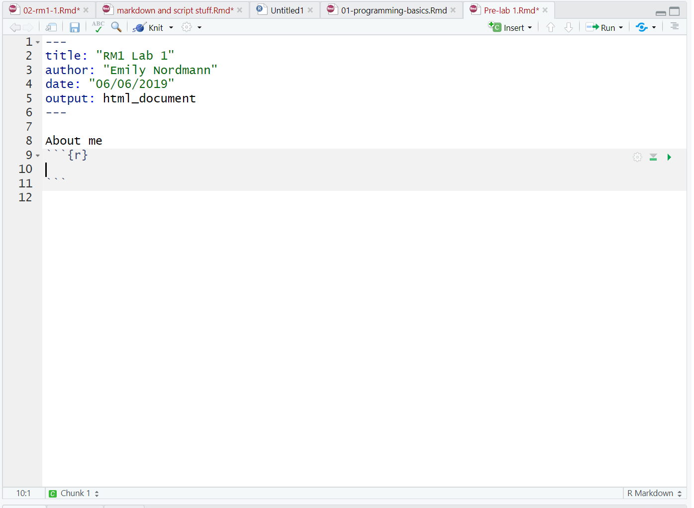
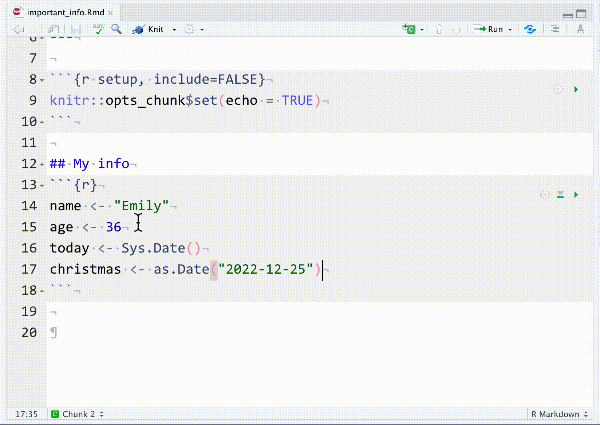
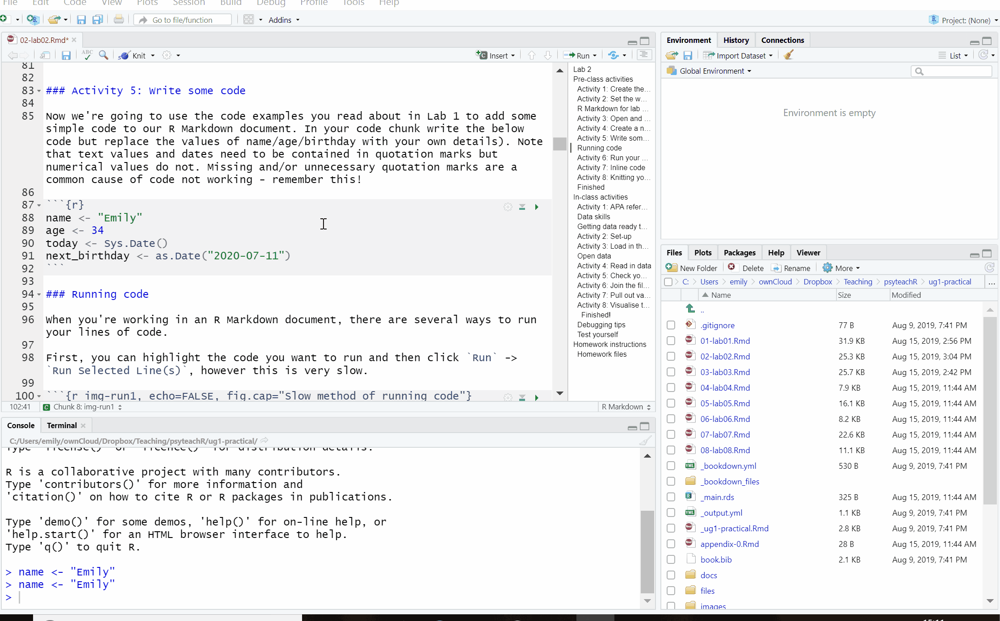
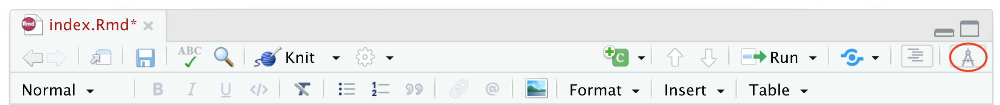
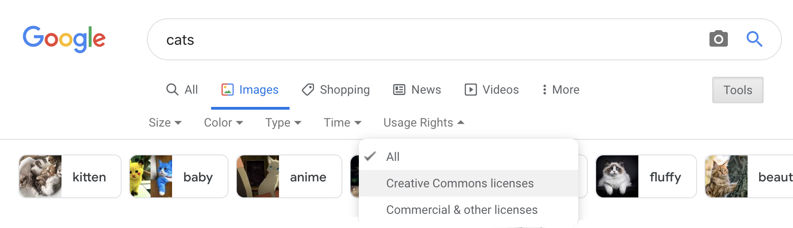

# Reports with R Markdown {#reports}

## Intended Learning Outcomes {#ilo-reports}

-   Be able to structure a project
-   Be able to knit a simple reproducible report with R Markdown
-   Be able to create code chunks, tables, images, and inline R in an R Markdown document

For reference, here are the packages we will use in this chapter.

```{r setup-reports, message=FALSE}
library(tidyverse)  # various data manipulation functions
library(knitr)      # for rendering a report from a script
library(kableExtra) # for styling tables
```

## Organising a project {#projects}

Before we write any code, first, we need to get organised. `r glossary("project", "Projects")` in RStudio are a way to group all the files you need for one project. Most projects include scripts, data files, and output files like the PDF report created by the script or images.

First, make a new folder on your computer where you will keep all of your materials for this class, we'd suggest renaming it something like `ADS-22`. The folder that R will look in by default to find and save files is known as the `r glossary("working directory")`. You can set the working directory manually to the folder you want to work in with menu commands:

-   **`Session > Set Working Directory > Choose Directory...`**

However, there's a better way of organising your files by using Projects in RStudio.

### Start a Project {#project-start}

To create a new project for the work we'll do in this chapter:

-   **`File > New Project...`**
-   Name the project `r path("02-reports")`
-   Save it inside the directory you just made.

RStudio will restart itself and open with this new project directory as the working directory.

```{r, echo = FALSE, fig.cap="Starting a new project.", fig.show="hold", out.width = "32%"}
include_graphics(c("images/reports/new_proj_1.png",
                   "images/reports/new_proj_2.png",
                   "images/reports/new_proj_3.png"))
```

Click on the Files tab in the lower right pane to see the contents of the project directory. You will see a file called `02-reports.Rproj`, which is a file that contains all of the project information. You can double-click on it to open up the project.

::: {.info data-latex=""}
Depending on your settings, you may also see a directory called `.Rproj.user`, which contains your specific user settings. You can ignore this and other "invisible" files that start with a full stop.
:::

### Naming Things {#naming}

Before we start creating new files, it's important to review how to name your files. This might seem a bit pedantic, but following clear naming rules so that both people and computers can easily find things will make your life much easier in the long run. Here are some important principles:

-   file and directory names should only contain letters, numbers, dashes, and underscores, with a full stop (`.`) between the file name and `r glossary("extension")` (that means no spaces!)
-   be consistent with capitalisation (set a rule to make it easy to remember, like always use lowercase)
-   use underscores (`_`) to separate parts of the file name, like the title and date, and dashes (`-`) to separate words in each part (e.g., `social-media-report_2021-10.Rmd`)
-   name files with a pattern that alphabetises in a sensible order and makes it easy for you to find the file you're looking for
-   prefix a file name with an underscore to move it to the top of the list, or prefix all files with numbers to control their order

For example, these file names are a mess:

-   `r path("report.doc")`
-   `r path("report final.doc")`
-   `r path("Data (Customers) 11-15.xls")`
-   `r path("Customers Data Nov 12.xls")`
-   `r path("final report2.doc")`
-   `r path("project notes.txt")`
-   `r path("Vendor Data November 15.xls")`

Here is one way to structure them so that similar files have the same structure and it's easy for a human to scan the list or to use code to find relevant files. See if you can figure out what the last one should be.

-   `r path("_project-notes.txt")`
-   `r path("report_v1.doc")`
-   `r path("report_v2.doc")`
-   `r path("report_v3.doc")`
-   `r path("data_customer_2021-11-12.xls")`
-   `r path("data_customer_2021-11-15.xls")`
-   `r mcq(c("vendor-data_2021-11-15.xls", "data-vendor-2021_11_15.xls", answer = "data_vendor_2021-11-15.xls", "data_2021-11-15_vendor.xls"))`

::: {.try data-latex=""}
Think of other ways to name the files above. Look at some of your own project files and see what you can improve.
:::

## R Markdown {#rmarkdown}

Throughout this course we will use `r glossary("R Markdown")` to create reproducible reports with a table of contents, text, tables, images, and code. The text can be written using `r glossary("markdown")`, which is a way to specify formatting, such as headers, paragraphs, lists, bolding, and links.

### New document

To open a new R Markdown document click:

-   **`File > New File > R Markdown`**

You will be prompted to give it a title; call the document `Important Info`. You can also change the author name. Keep the output format as HTML.

Once you've opened a new document be sure to save it by clicking **`File > Save As...`**. You should name this file `important_info` (if you are on a Mac and can see the file `r glossary("extension")`, name it `important_info.Rmd`). This file will automatically be saved in your project folder, i.e., your working directory, so you should now see this file appear in your file viewer pane.

When you first open a new R Markdown document you will see a bunch of welcome text that looks like this:

```{r img-markdown-default, echo=FALSE, fig.cap="New R Markdown text"}

knitr::include_graphics("images/reports/markdown-default.png")

```

Do the following steps:

-   Delete **everything** from line 12 onwards
-   On line 12 type "## My info" (with the hashtags but without the quotation marks)\
-   Click the insert new code menu (a green box with a C and a plus sign) then **`R`**

Your Markdown document should now look something like this:

```{r img-new-chunk, echo=FALSE, fig.cap="New R chunk"}



```

### Code chunks {#code-chunks}

What you have created is a subtitle and a **code chunk**. In R Markdown, anything written in a grey code chunk is assumed to be code, and anything written in the white space (between the code chunks) is regarded as normal text (the actual colours will depend on which theme you have applied, but we will refer to the default white and grey). This makes it easy to combine both text and code in one document.

::: {.dangerous data-latex=""}
When you create a new code chunk you should notice that the grey box starts and ends with three back ticks \`\`\`. One common mistake is to accidentally delete these back ticks. Remember, code chunks and text entry are different colours - if the colour of certain parts of your Markdown doesn't look right, check that you haven't deleted the back ticks.
:::


In your code chunk, write the code you created in Chapter\ \@ref(objects).

```{r}
name <- "Emily"
age <- 36
today <- Sys.Date()
christmas <- as.Date("2022-12-25")
```

### Running code

When you're working in an R Markdown document, there are several ways to run your lines of code.

First, you can highlight the code you want to run and then click `Run` -> `Run Selected Line(s)`, however this is tedious and can cause problems if you don't highlight *exactly* the code you want to run.

```{r img-run1, echo=FALSE, fig.cap="Tedious method of running code"}



```

Alternatively, you can press the green "play" button at the top-right of the code chunk and this will run **all** lines of code in that chunk.

```{r img-run2, echo=FALSE, fig.cap="Slightly better method of running code"}



```

Even better is to learn some of the keyboard short cuts for R Studio. To run a single line of code, make sure that the cursor is in the line of code you want to run (it can be anywhere) and press `ctrl + enter` or `Cmd + enter` if you're on a Mac. If you want to run all of the code in the code chunk, press `ctrl/cmd + shift + enter`. Learn these short cuts, they will make your life easier!

Run your code using each of the methods above. You should see the variables `name`, `age`, `today`, and `christmas` appear in the environment pane.

### Inline code {#rmd-inline-r }

We keep talking about using R Markdown for reproducible reports but it's easier to show you than tell you why this is so powerful and to give you an insight into how this course will (hopefully!) change the way you work with data forever!

One important feature of R Markdown is that you can combine text and code to insert values into your writing using **inline coding**. If you've ever had to copy and paste a value or text from one file to another, you'll know how easy it can be to make mistakes. Inline code avoids this. Again it's easier to show you what inline code does rather than to explain it so let's have a go.

First, copy and paste this text to the **white space underneath** your code chunk. If you used a different variable name than `christmas` you should update this with the name of the object you created, but otherwise don't change anything else.

```{r, eval = FALSE}
My name is `r name` and I am `r age` years old. 
It is `r christmas - today` days until Christmas, 
which is my favourite holiday.
```

### Knitting your file {#rmd-knit}

Now we are going to `r glossary("knit")`, or compile, the file into a document type of our choosing. In this case we'll create a default html file, but you will learn how to create other files like Word and PDF throughout this course. To knit your file click:

-   **`Knit > Knit to HMTL`**

R Markdown will create and display a new HTML document, but it will also automatically save this file in your working directory.

As if by magic, that slightly odd bit of text you copied and pasted now appears as a normal sentence with the values pulled in from the objects you created.

**My name is `r name` and I am `r age` years old. It is `r christmas - today` days until Christmas, which is my favourite holiday.**

::: {.info data-latex=""}
You can also knit by typing the following code into the console. Never put this in an Rmd script itself, or it will try to knit itself in an infinite loop.

```{r, eval = FALSE}
knitr::knit2html("important_info.Rmd")
```
:::

## Loading data

Now let's try another example of using Markdown but this time rather than using objects we have created from scratch, we will read in a data file.

Save and close your `important_info.Rmd` document. Then open and save a new Markdown document, this time named `sales_data.Rmd`. You can again get rid of everything from line 12 onwards.

### Online sources {#loading-online}

First, let's try loading data that is stored online. Create a code chunk in your document and copy, paste, and run the below code. This code loads some simulated sales data.

-   The data is stored in a `.csv` file so we're going to use the `readr::read_csv()` function to load it in.
-   The package `readr` is part of the `tidyverse` that you installed in Chapter\ \@ref(intro) and we load this package with `library()`\
-   Note that the url is contained within double quotation marks - it won't work without this.

```{r, message=FALSE}
# Data from https://www.kaggle.com/kyanyoga/sample-sales-data
library(tidyverse)
sales_online <- readr::read_csv("https://psyteachr.github.io/ads-v1/data/sales_data_sample.csv")
```

This dataset is simulated sales data for different types of vehicles where each line of data is a single order. There are multiple ways to view and check a dataset in R. Do each of the following and make a note of what information each approach seems to give you. If you'd like more information about each of these functions, you can look up the help documentation with `?function`:

-   Click on the `sales_online` object in the environment pane
-   Run `head(sales_online)` in the console
-   Run `summary(sales_online)` in the console
-   Run `str(sales_online)` in the console
-   Run `View(sales_online)` in the console

### Local data files

More commonly, you will be working from data files that are stored locally on your computer. But where should you put all of your files? You usually want to have all your scripts and data files for a single project inside one folder on your computer, the `r glossary("working directory")`, and we have already set up the main directory `r path("02-reports")`for this chapter.

But you can also organise files in subdirectories inside this main project directory, such as putting all raw data files in a directory called `r path("data")` and saving any image files to a directory called `r path("images")`. Using subdirectories helps avoid one single folder becoming too cluttered, which is important if you're working on big projects.

::: {.try data-latex=""}
In your `r path("02-reports")` directory, create a new folder named `r path("data")`, then, [download a copy of the sales data file](https://psyteachr.github.io/ads-v1/data/sales_data_sample.csv) and save it in this new subdirectory.
:::

To load in data from a local file, again we can use the `read_csv()` function but this time rather than specifying a url, give it the subdirectory and file name.

```{r read-csv, eval = FALSE}
sales_local <- read_csv("data/sales_data_sample.csv") 
```

Things to note:

-   You must include the file extension (in this case `.csv`)
-   The subdirectory folder name (`data`) and the file name are separated by a forward slash `/`
-   Precision is important, if you have a typo in the file name it won't be able to find your file; remember that R is case sensitive - `Sales_Data.csv` is a completely different file to `sales_data.csv` as far as R is concerned.

::: {.try data-latex=""}
Run `head()`, `summary()`, `str()`, and `View()` on `sales_local` to confirm that the data is the same as `sales_online`.
:::

## Writing a report

We're going to write a basic report for this sales dataset using R Markdown to show you some of the features. We'll be expanding on almost every bit of what we're about to show you throughout this course; the most important outcome is that you start to get comfortable with how R Markdown works and what you can use it to do. 

### Data analysis

For this report we're just going to present some simple sales stats for three types of vehicles: planes, motorcycles, and classic cars. We'll come back to how to write this kind of code yourself in Chapter\ \@ref(summary). For now, see if you can follow the logic of what the code is doing via the code comments.

Create a new code chunk, then copy, paste and run the following code and then view `sales_counts` by clicking on the object in the environment pane.

```{r sales_counts}
# start with the sale_online data and then
sales_counts <- sales_online %>% 
  # keep only the data from planes, motorcycles, and cars and then
  filter(PRODUCTLINE %in% c("Planes", "Motorcycles", "Classic Cars")) %>% 
  # count how many are in each PRODUCTLINE
  count(PRODUCTLINE)
```

Because each row of the dataset is a sale, this code gives us a nice and easy way of seeing how many sales were made of each type of vehicle; it just counts the number of rows in each group.

```{r sales_counts_show, echo = FALSE}
sales_counts %>%
  knitr::kable(align = "c")
```

### Text formatting {#markdown}

You can use the visual `r glossary("markdown")` editor if you have RStudio version 1.4 or higher. This will be a button at the top of the source pane with a pen tip and the menu options should be very familiar to anyone who has worked with software like Microsoft Word.

```{r visual-editor, echo = FALSE, fig.cap="The visual editor."}

```

This is useful for complex styling, but you can also use these common plain-text style markups:

-   Headers are created by prefacing subtitles with one or more hashes (`#`) and a space (do not exclude the space). If you include a table of contents, this will be created from your document headers.
-   Format text with *italics* or **bold** by surrounding the text with one or two asterisks or underscores.
-   Make lists using numbers, asterisks or dashes before items. Indent items to make nested lists.
-   Make links like this: `[psyTeachR](https://psyteachr.github.io/)`
-   Download the [R Markdown Cheat Sheet](http://www.rstudio.com/wp-content/uploads/2016/03/rmarkdown-cheatsheet-2.0.pdf) to learn more.

Copy and paste the below text into the white space below the code chunk that loads in the data. Save the file and then click knit to view the results. It will look a bit messy for now as it contains the code and messages from loading the data but don't worry, we'll get rid of that soon.

```{r, echo = FALSE, results='asis'}
cat('<pre><code>## Sample sales report

This report summarises the sales data for different types of vehicles sold between 2003 and 2005. Thie data is from [Kaggle](https://www.kaggle.com/kyanyoga/sample-sales-data).

### Sales by type

The *total* number of **planes** sold was `r sales_counts$n[3]`

The *total* number of **classic cars** sold was `r sales_counts$n[1]`.</code></pre>')
```


Try and match up the inline code with what is in the `sales_counts` table. Of note:

* The `$` sign is used to indicate specific variables (or columns)  in an object using the `object$variable` syntax. 
* Square brackets with a number e.g., `[3]` indicate a particular observation
* So `sales_counts$n[3]` asks the inline code to display the third observation of the variable `n` in the dataset `sales_online`.

::: {.try data-latex=""}
Add another line that reports the total numbers of **motorcycles** using inline code. Using either the visual editor or text markups, add in bold and italics so that it matches the others.
:::

```{r, webex.hide = TRUE, echo = FALSE, results='asis'}
cat("<pre><code>The *total* number of **motorcycles** sold was `r sales_counts$n[2]`.</code></pre>")
```

### Code comments {#comments}

In the above code we've used code **comments** and it's important to highlight how useful these are. You can add comments inside R chunks with the hash symbol (`#`). R will ignore characters from the hash to the end of the line.

```{r}
# important numbers

n <- nrow(sales_online) # the total number of sales (number of rows)
first <- min(sales_online$YEAR_ID) # the first (minimum) year
last <- max(sales_online$YEAR_ID) # the last (maximum) year
```

It's usually good practice to start a code chunk with a comment that explains what you're doing there, especially if the code is not explained in the text of the report.

If you name your objects clearly, you often don't need to add clarifying comments. For example, if I'd named the three objects above `total_number_of_sales`, `first_year` and `last_year`, I would omit the comments. It's a bit of an art to comment your code well but try to add comments as you're working through this book - it will help consolidate your learning and when future you comes to review your code, you'll thank past you for being so clear.

### Images {#rmd-images}

As the saying goes, a picture paints a thousand words and sometimes you will want to communicate your data using visualisations. 

Create a code chunk to display a graph of the data in your document after the text we've written so far. We'll use some code that you'll learn more about in Chapter\ \@ref(viz) to make a simple bar chart that represents the sales data -  focus on trying to follow how bits of the code map on to the plot that is created.

Copy and paste the below code. Run the code in your Markdown to see the plot it creates and then knit the file to see how it is displayed in your document. Notice how the figure caption is formatted in the chunk options.

```{r, eval = FALSE, verbatim = "r, fig.cap= \"Sales visualisation\""}
ggplot(data = sales_counts, 
       mapping = aes(x = PRODUCTLINE, y = n, fill = PRODUCTLINE)) +
  geom_bar(stat = "identity", show.legend = FALSE) +
  labs(x = "Type of vehicle",
       y = "Number of sales",
       title = "Sales by vehicle type",
       subtitle = "2003 - 2005")
```

```{r, echo = FALSE, fig.cap= "Sales visualisation"}
ggplot(data = sales_counts, 
       mapping = aes(x = PRODUCTLINE, y = n, fill = PRODUCTLINE)) +
  geom_bar(stat = "identity", show.legend = FALSE) +
  labs(x = "Type of vehicle",
       y = "Number of sales",
       title = "Sales by vehicle type",
       subtitle = "2003 - 2005")
```

You can also include images that you did not create in R using the markdown syntax for images. This is very similar to loading data in that you can either use an image that is stored on your computer, or via a url using `knitr::include_graphics()`.

Create a new code chunk underneath each of the sales figures for planes, classic cars, and motorcycles and add in an image from Google or Wikipedia for each (right click on an image and select copy image address to get a url). See the section on [chunk defaults](#rmd-setup) to see how to change the display size.

```{r img-example, eval = FALSE}
knitr::include_graphics("https://upload.wikimedia.org/wikipedia/commons/3/3f/P-51_Mustang_edit1.jpg")
```

::: {.info data-latex=""}
Most images on Wikipedia are public domain or have an open license. You can search for images by license on Google Images by clicking on the **`Tools`** button and choosing "Creative Commons licenses" from the "Usage Rights" menu.

```{r, echo=FALSE, fig.alt="Screenshot of Google Images interface with Usage Rights selections open."}

```
:::

### Tables {#rmd-tables}

Rather than a figure, we might want to display our data in a table. 

* Add a new level 2 heading (two hashtags) to your document, name the heading "Data in table form" and then create a new code chunk below this. 

First, let's see what the table looks like if we don't make any edits. Simply write the name of the table you want to display in the code chunk (in our case `sales_counts`) and then click knit to see what it looks like.

```{r, eval = FALSE}
sales_counts
```

```
## # A tibble: 3 × 2
## # Groups:   PRODUCTLINE [3]
##   PRODUCTLINE      n
##   <chr>        <int>
## 1 Classic Cars   967
## 2 Motorcycles    331
## 3 Planes         306
```

It's just about readable but it's not great. To customise tables we're going to use the function `kable()` from the `kableExtra` package.

Amend your code to load the `kableExtra` package and apply the `kable()` function to the table. Once you've done this, knit the file again to see the output.

```{r}
library(kableExtra) # for table display

sales_counts %>% # start with the sales_count table and then
  kable() # apply the kable function
```

It's better, but it's still not amazing. So let's make a few adjustments. We can change the names of the columns, add a caption, and also change the alignment of the cell contents using arguments to `kable()`. 

We can also add a theme to change the overall style. In this example we've used `kable_classic` but there are 5 others: `kable_paper`, `kable_classic_2`, `kable_minimal`, `kable_material` and `kable_material_dark`. Try them all and see which one you prefer.

Finally, we can change the formatting of the first row using `row_spec`. Look up the help documentation for `row_spec` to see what other options are available. Try changing the value of  any of the arguments below to figure out what they do.

```{r}
sales_counts %>%
  kable(col.names = c("Product", "Sales"),
      caption = "Number of sales per product line.", 
      align = "c") %>% 
  kable_classic(full_width = FALSE) %>% 
  row_spec(row = 0, bold = TRUE, color = "red") 
```

::: {.info data-latex=""}
The appearance and placement of the table caption depends on the type of document you are creating. Your captions may look different to those in this book because you are creating a single-page `html_document`, while this book uses the `bs4_book` style from the `r pkg("bookdown")` package. You'll learn more about other document output types in Chapter\ \@ref(present).
:::


If you're feeling confident with what we have covered so far, the [kableExtra vignette](https://haozhu233.github.io/kableExtra/awesome_table_in_html.html){target="_blank"} gives a lot more detail on how you can edit your tables using `kableExtra`. 

::: {.try data-latex=""}
You can also explore the [gt](https://gt.rstudio.com/){target="_blank"} package, which is complex, but allows you to create beautiful customised tables. [Riding tables with {gt} and {gtExtras}](https://bjnnowak.netlify.app/2021/10/04/r-beautiful-tables-with-gt-and-gtextras/){target="_blank"} is an outstanding tutorial.
:::

## Refining your report

### Chunk defaults {#rmd-setup}

Let's finish by tidying up the report and organising our code a bit better. When you create a new R Markdown file in RStudio, a setup chunk is automatically created - we've ignored this chunk until now.

```{r knitr-setup, eval=FALSE, verbatim="r setup, include=FALSE"}
knitr::opts_chunk$set(echo = TRUE)
```

You can set more default options for your document here. Type `str(knitr::opts_chunk$get())` into the console to see the full list of options that you can set and their default values, however, the most useful and common options to change for the purposes of writing reports revolve around whether you want to show your code and the size of your images.

Replace the code in your setup chunk with the below code and then try changing each option from `FALSE` to `TRUE` and changing the numeric values then knit the file again to see the difference it makes.

```{r knitr-setup2, eval=FALSE, verbatim="r setup, include=FALSE"}
knitr::opts_chunk$set(
  echo       = FALSE,     # whether to show code chunks
  message    = FALSE,     # whether to show messages from your code
  warning    = FALSE,     # whether to show warnings from your code
  fig.width  = 8,         # figure width in inches (at 96 dpi)
  fig.height = 5,         # figure height in inches (at 96 dpi)
  out.width = "50%"      # figures/images span 50% of the page width
)
```

::: {.warning data-latex=""}
Note that `fig.width` and `fig.height` control the original size and aspect ratio of images generated by R, such as plots. This will affect the relative size of text and other elements in plots. It does not affect the size of existing images at all. However, `out.width` controls the **display** size of both existing images and figures generated by R. This is usually set as a percentage  of the page width.

```{r img-full-100, echo = FALSE, fig.width=8, fig.height=5, out.width="100%", fig.cap="A plot with the default values of fig.width = 8, fig.height = 5, out.width = \"100%\""}
ggplot(diamonds, aes(color, fill = cut)) + geom_bar()
```

```{r img-half-100, echo = FALSE, fig.width=4, fig.height=2.5, out.width="100%", fig.cap="The same plot with half the default width and height: fig.width = 4, fig.height = 2.5, out.width = \"100%\""}
ggplot(diamonds, aes(color, fill = cut)) + geom_bar()
```

```{r img-half-50, echo = FALSE, fig.width=4, fig.height=2.5, out.width="50%", fig.cap="The same plot as above at half the output width: fig.width = 4, fig.height = 2.5, out.width = \"50%\""}
ggplot(diamonds, aes(color, fill = cut)) + geom_bar()
```

:::

### Override defaults

These setup options change the behaviour for the entire document, however, you can override the behaviour for individual code chunks. 

For example, by default you might want to hide your code but there might be an occasion where you want to show the code you used to analyse your data. You can set `echo = FALSE` in your setup chunk to make hiding code the default but in the individual code chunk for your plot set `echo = TRUE`. Try this now and knit the file to see the results.

```{r show-code, eval=FALSE, verbatim = "r, echo = TRUE"}
ggplot(data = sales_counts, 
       mapping = aes(x = PRODUCTLINE, y = n, fill = PRODUCTLINE)) +
  geom_bar(stat = "identity", show.legend = FALSE) +
  labs(x = "Type of vehicle",
       y = "Number of sales",
       title = "Sales by vehicle type",
       subtitle = "2003 - 2005")
```

Additionally, you can also override the default image display size or dimensions.

```{r change-image, eval = FALSE, verbatim = "r, out.width='25%'"}
knitr::include_graphics("https://upload.wikimedia.org/wikipedia/commons/3/3f/P-51_Mustang_edit1.jpg")
```

```{r change-image2, eval=FALSE, verbatim = "r, fig.width = 10, fig.height = 20"}
ggplot(data = sales_counts, 
       mapping = aes(x = PRODUCTLINE, y = n, fill = PRODUCTLINE)) +
  geom_bar(stat = "identity", show.legend = FALSE) +
  labs(x = "Type of vehicle",
       y = "Number of sales",
       title = "Sales by vehicle type",
       subtitle = "2003 - 2005")
```

### Loading packages

You can also add the packages you need in your setup chunk using `r hl(library())`. Often when you are working on a script, you will realize that you need to load another add-on package. Don't bury the call to `r hl(library(package_I_need))` way down in the script. Put it in the top, so the user has an overview of what packages are needed.

::: {.try data-latex=""}
Move the code that loads the `tidyverse` and `kableExtra` to the setup chunk.
:::

### YAML header {#yaml}

Finally, the `r glossary("YAML")` header is the bit at the very top of your Markdown document. You can set several options here as well. 

    ---
    title: "Sales Data Report"
    author: "Your name"
    output:
      html_document:
        df_print: kable
        theme: 
          version: 4
          bootswatch: yeti
        toc: true
        toc_float:
          collapsed: false
          smooth_scroll: false
        toc_depth: 3
        number_sections: false
    ---

::: {.info data-latex=""}
Try changing the values from `false` to `true` to see what the options do.
:::

The `df_print: kable` option prints data frames using `knitr::kable` automatically. 

The built-in bootswatch themes are: default, cerulean, cosmo, darkly, flatly, journal, lumen, paper, readable, sandstone, simplex, spacelab, united, and yeti. You can [view and download more themes](https://bootswatch.com/4/). Try changing the theme to see which one you like best.

```{r img-bootswatch, echo=FALSE, fig.cap="Light themes in versions 3 and 4."}
knitr::include_graphics("images/reports/bootswatch.png")
```

::: {.warning data-latex=""}
YAML headers can be very picky about spaces and semicolons (the rest of R Markdown is much more forgiving). For example, if you put a space before "author", you will get an error that looks like:

```
Error in yaml::yaml.load(..., eval.expr = TRUE) : 
  Parser error: while parsing a block mapping at line 1, column 1 did not find expected key at line 2, column 2
```

The error message will tell you exactly where the problem is (the second character of the second line of the YAML header), and it's usually a matter of fixing typos or making sure that the indenting is exactly right.
:::

### Summary

This chapter has covered a lot but hopefully now you have a much better idea of what Markdown is able to do. Whilst working in Markdown takes longer in the initial set-up stage, once you have a fully reproducible report you can plug in new data each week or month and simply click knit, reducing duplication of effort, and the human error that comes with it.

As you continue to work through the book you will learn how to wrangle and analyse your data and how to use Markdown to present it. We'll slowly build on the available customisation options so over the course of next few weeks, you'll find your Markdown reports start to look more polished and professional.

## Exercises {#exercises-reports}

Below are some additional exercises that will let you apply what you have learned in this chapter. We would suggest taking a break before you do these - it might feel slightly more effortful, but spreading out your practice will help you learn more in the long run.

### New project {#exercises-reports-project}

Create a new project called "demo_report" [\@ref(projects)]

### New script {#exercises-reports-setup}

In the "demo_report" project, create a new Rmarkdown document called "job.Rmd" [\@ref(rmarkdown)]. Edit the YAML header to output tables using kable and set a custom theme [\@ref(yaml)].

`r hide()`
    ---
    title: "My Job"
    author: "Me"
    output:
      html_document:
        df_print: kable
        theme: 
          version: 4
          bootswatch: sandstone
    ---
`r unhide()`

### R Markdown {#exercises-reports-rmarkdown}

Write a short paragraph describing your job or a job you might like to have in the future [\@ref(markdown)]. Include a bullet-point list of links to websites that are useful for that job [\@ref(markdown)].

`r hide()`

```
I am a research psychologist who is interested in open science 
and teaching computational skills.

* [psyTeachR books](https://psyteachr.github.io/)
* [Google Scholar](https://scholar.google.com/)
```

`r unhide()`


### Tables {#exercises-reports-tables}

Use the following code to load a small table of tasks [\@ref(code-chunks)]. Edit it to be relevant to your job (you can change the categories entirely if you want).  

```{r}
tasks <- tibble::tribble(
  ~task,                   ~category,      ~frequency,
  "Respond to tweets",     "social media", "daily",
  "Create a twitter poll", "social media", "weekly",
  "Make the sales report", "reporting",    "montly"
)
```

Figure out how to make it so that code chunks don't show in your knitted document [\@ref(rmd-setup)]

`r hide()`

You can set the default to `echo = FALSE` in the setup chunk at the top of the script.

```{r, eval = FALSE}
knitr::opts_chunk$set(echo = FALSE)
```

To set visibility for a specific code chunk, put `echo = FALSE` inside the curly brackets.

```{r, verbatim = "r, echo=FALSE"}
# code to hide
```

`r unhide()`

Display the table with purple italic column headers. Try different styles using `r pkg("kableExtra")` [\@ref(rmd-tables)]

```{r, webex.hide=T}
kableExtra::kable(tasks) %>%
  kableExtra::kable_minimal() %>%
  kableExtra::row_spec(row = 0, italic = TRUE, color = "purple")
```

### Images {#exercises-reports-images}

Add an image of anything relevant [\@ref(rmd-images)]

`r hide()`

You can add an image from the web using its URL:

``
    
Or save an image into your project directory (e.g., in the images folder) and add it using the relative path:

``
    
`r unhide()`

### Inline R {#exercises-reports-inline}

Use inline R to include the version of R you are using in the following sentence: "This report was created using `r R.version.string`." You can get the version using the object `R.version.string`. [\@ref(rmd-inline-r)]

`r hide()`

This report was created using `r backtick("r R.version.string")`.

`r unhide()`

### Knit {#exercises-reports-knit}

Knit this document to html [\@ref(rmd-knit)]

`r hide()`
Click on the knit button or run the following code in the console. (Do not put it the Rmd script!)

```{r, eval = FALSE}
knitr::knit2html("job.Rmd")
```

`r unhide()`

## Glossary {#glossary-reports}

`r glossary_table()`

## Further Resources {#resources-reports}

-   [R Markdown Cheat Sheet](https://www.rstudio.org/links/r_markdown_cheat_sheet)
<!--
-   [R Markdown reference Guide](https://www.rstudio.com/wp-content/uploads/2015/03/rmarkdown-reference.pdf)
-->
-   [R Markdown Tutorial](https://rmarkdown.rstudio.com/lesson-1.html)
-   [R Markdown: The Definitive Guide](https://bookdown.org/yihui/rmarkdown/) by Yihui Xie, J. J. Allaire, & Garrett Grolemund
-   [Chapter 27: R Markdown](https://r4ds.had.co.nz/r-markdown.html) of *R for Data Science*
-   [Project Structure](https://slides.djnavarro.net/project-structure/) by Danielle Navarro
-   [How to name files](https://speakerdeck.com/jennybc/how-to-name-files) by Jenny Bryan
-   [kableExtra](https://haozhu233.github.io/kableExtra/awesome_table_in_html.html)
-   [gt](https://gt.rstudio.com/)


