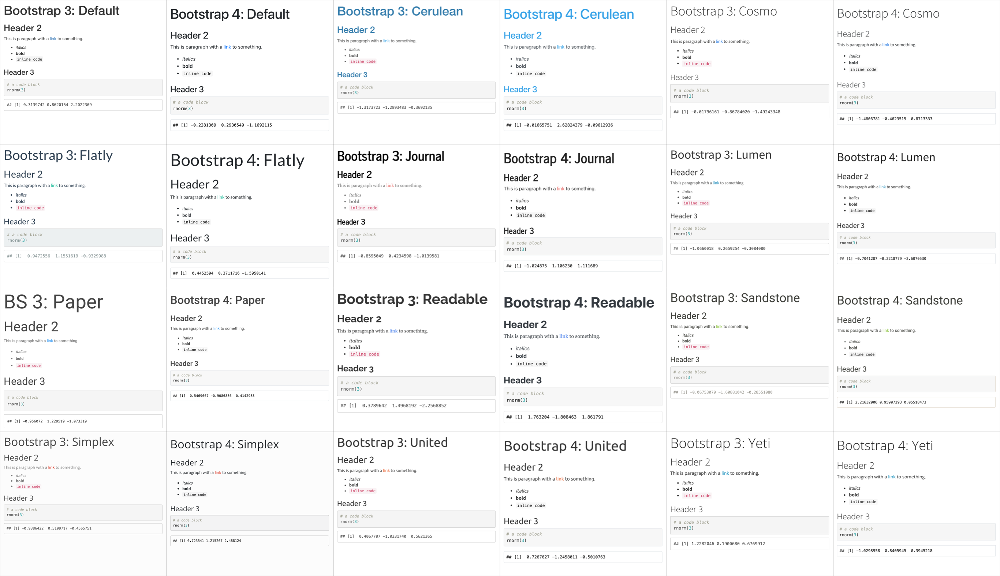

### YAML Header {#yaml}

The `r glossary("YAML")` header is where you can set several options.

    ---
    title: "My Demo Document"
    author: "Me"
    output:
      html_document:
        df_print: kable
        theme: 
          version: 4
          bootswatch: yeti
        toc: true
        toc_float:
          collapsed: false
          smooth_scroll: false
        toc_depth: 3
        number_sections: false
    ---

::: {.info data-latex=""}
Try changing the values from `false` to `true` to see what the options do.
:::

The `df_print: kable` option prints data frames using `knitr::kable`. You'll learn below how to further customise tables.

The built-in bootswatch themes are: default, cerulean, cosmo, darkly, flatly, journal, lumen, paper, readable, sandstone, simplex, spacelab, united, and yeti. You can [view and download more themes](https://bootswatch.com/4/).

```{r img-bootswatch, echo=FALSE, fig.cap="Light themes in versions 3 and 4."}

```

::: {.warning data-latex=""}
YAML headers can be very picky about spaces and semicolons (the rest of R Markdown is much more forgiving). For example, if you put a space before "author", you will get an error that looks like:

```
Error in yaml::yaml.load(..., eval.expr = TRUE) : 
  Parser error: while parsing a block mapping at line 1, column 1 did not find expected key at line 2, column 2
```

The error message will tell you exactly where the problem is (the second character of the second line of the YAML header), and it's usually a matter of fixing typos or making sure that the indenting is exactly right.
:::


### Tables {#rmd-tables}

Next, create a code chunk where you want to display a summary table. We'll use tidyverse functions you will learn in the [data wrangling lectures](#tidyr) to count the number of products per year for each product line.

```{r}
# make a table with the number of each product sold per year

summary_table <- sales_online %>%
  group_by(YEAR_ID, PRODUCTLINE) %>%
  count() %>%
  pivot_wider(id_cols = PRODUCTLINE,
              names_from = YEAR_ID, 
              values_from = n)

kable(summary_table)
```

The table above is OK, but it could be more reader-friendly by changing the column labels and adding a caption. You can also use more specialised functions from `r pkg("kableExtra")` to format your tables. These are very powerful, but take practice.

```{r}
# format the table

kable(summary_table, 
      col.names = c("", "2003", "2004", "2005"),
      caption = "Number of sales per product line each year.") %>%
  add_header_above(c("Product Lines" = 1, "Sales" = 3), line = F, bold = T) %>%
  # change the header style
  row_spec(0, color = "grey") %>%
  # change the table style
  kable_classic(full_width = F) %>%
  # make the first column bold with a border to the right
  column_spec(1, bold = T, border_right = T) %>%
  # highlight sales over 200 in red
  column_spec(2, color = ifelse(summary_table$`2003` > 200, "red", "black")) %>%
  column_spec(3, color = ifelse(summary_table$`2004` > 200, "red", "black")) %>%
  column_spec(4, color = ifelse(summary_table$`2005` > 200, "red", "black")) 
```

::: {.try data-latex=""}
See how many different ways you can style the table above. Use the [kableExtra vignette](https://haozhu233.github.io/kableExtra/awesome_table_in_html.html){target="_blank"} for inspiration.
:::


You can also include images that you did not create in R using the markdown syntax for images:

    


### Output Formats

You can knit your file to PDF or Word if you have the right packages installed on your computer, although you'll lose some of the interactivity that an HTML report provides. You can also create presentations, dashboards, websites, and even books with R markdown, which we'll learn more about in Chapter\ \@ref(present). In fact, the book you are reading right now was created using R markdown.


## Glossary {#glossary-reports}

`r glossary_table()`

## Further Resources {#resources-reports}

-   [R Markdown Cheat Sheet](https://www.rstudio.org/links/r_markdown_cheat_sheet)
-   [kableExtra](https://haozhu233.github.io/kableExtra/awesome_table_in_html.html)
-   [R Markdown reference Guide](https://www.rstudio.com/wp-content/uploads/2015/03/rmarkdown-reference.pdf)
-   [R Markdown Tutorial](https://rmarkdown.rstudio.com/lesson-1.html)
-   [R Markdown: The Definitive Guide](https://bookdown.org/yihui/rmarkdown/) by Yihui Xie, J. J. Allaire, & Garrett Grolemund
-   [Chapter 27: R Markdown](https://r4ds.had.co.nz/r-markdown.html) of *R for Data Science*
-   [Project Structure](https://slides.djnavarro.net/project-structure/) by Danielle Navarro
-   [How to name files](https://speakerdeck.com/jennybc/how-to-name-files) by Jenny Bryan

## Exercises {#exercises-reports}

### New project {#exercises-reports-project}

Create a new project called "demo_report" [\@ref(projects)]

### Set up an R Markdown script {#exercises-reports-setup}

In the "demo_report" project, create a new Rmarkdown document called "job.Rmd" [\@ref(rmarkdown)]. Edit the YAML header to output tables using kable. Set a custom theme. [\@ref(yaml)]

`r hide()`
    ---
    title: "My Job"
    author: "Me"
    output:
      html_document:
        df_print: kable
        theme: 
          version: 4
          bootswatch: sandstone
    ---
`r unhide()`

### R Markdown {#exercises-reports-rmarkdown}

Write a short paragraph describing your job [\@ref(markdown)]. Include a bullet-point list of links to websites that are useful for your job [\@ref(markdown)].

`r hide()`

```
I am a research psychologist who is interested in open science 
and teaching computational skills.

* [psyTeachR books](https://psyteachr.github.io/)
* [Google Scholar](https://scholar.google.com/)
```

`r unhide()`


### Tables {#exercises-reports-tables}

Use the following code to load a small table of tasks [\@ref(code-chunks)]. Edit it to be relevant to your job (you can change the categories entirely if you want).  

```{r}
tasks <- tibble::tribble(
  ~task,                   ~category,      ~frequency,
  "Respond to tweets",     "social media", "daily",
  "Create a twitter poll", "social media", "weekly",
  "Make the sales report", "reporting",    "montly"
)
```

Figure out how to make it so that code chunks don't show in your knitted document [\@ref(rmd-setup)]

`r hide()`

You can set the default to `echo = FALSE` in the setup chunk at the top of the script.

```{r, eval = FALSE}
knitr::opts_chunk$set(echo = FALSE)
```

To set visibility for a specific code chunk, put `echo = FALSE` inside the curly brackets.

```{r, verbatim = "r, echo=FALSE"}
# code to hide
```

`r unhide()`

Display the table with purple italic column headers. Try different styles using `r pkg("kableExtra")` [\@ref(rmd-tables)]

```{r, webex.hide=T}
kableExtra::kable(tasks) %>%
  kableExtra::kable_minimal() %>%
  kableExtra::row_spec(row = 0, italic = TRUE, color = "purple")
```

### Images {#exercises-reports-images}

Add an image of anything relevant [\@ref(rmd-images)]

`r hide()`

You can add an image from the web using its URL:

``
    
Or save an image into your project directory (e.g., in the images folder) and add it using the relative path:

``
    
`r unhide()`

### Inline R {#exercises-reports-inline}

Use inline R to include the version of R you are using in the following sentence: "This report was created using `r R.version.string`." You can get the version using the object `R.version.string`. [\@ref(rmd-inline-r)]

`r hide()`

This report was created using `r backtick("r R.version.string")`.

`r unhide()`

### Knit {#exercises-reports-knit}

Knit this document to html [\@ref(rmd-knit)]

`r hide()`
Click on the knit button or run the following code in the console. (Do not put it the Rmd script!)

```{r, eval = FALSE}
knitr::knit2html("job.Rmd")
```

`r unhide()`

