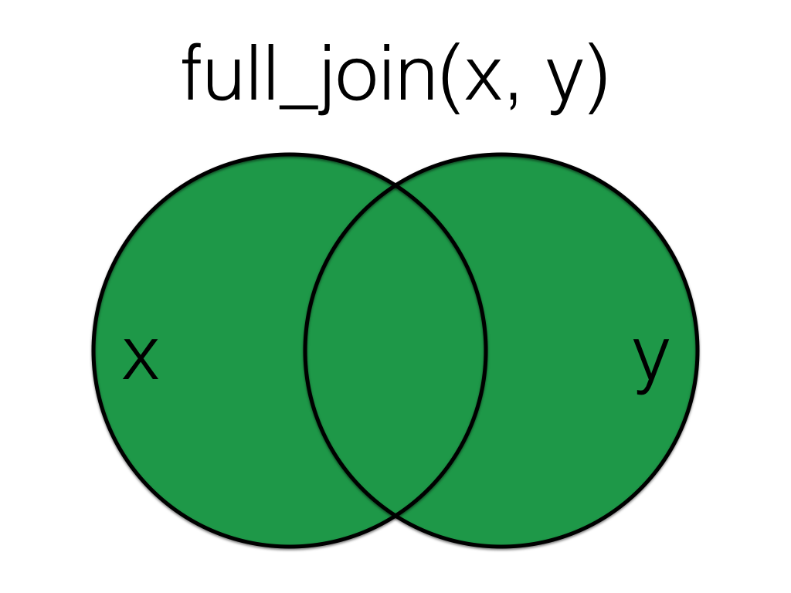

# Data Relations {#joins}

<div class="incomplete-chapter"></div>

## Intended Learning Outcomes {#ilo-joins}

-   Be able to match related data across multiple tables
-   Be able to combine data from multiple files

In this chapter we'll use the following packages:

In this chapter we'll use the following packages:

```{r setup-joins, message=FALSE}
library(tidyverse)     # includes readr & tibble
```

The data you want to report on or visualise are often in more than one file (or more than one tab of an excel file or googlesheet). You might need to join up a table of customer information with a table of orders, or combine the monthly social media reports across several months.

## Set-up

First, create a new project for the work we'll do in this chapter named `r path("06-relations")`. Second, open and save and new R Markdown document named `relations`.Rmd\`, delete the welcome text and load the required packages for this chapter.

For this demo, rather than loading in data, we'll create two small data tables from scratch using the `tibble()` function.

`customers` has id, city and postcode for five customers 1-5.

-   `1:5` will fill the variable `id` with all integers between 1 and 5.
-   `city` and `code` both using the `c()` function to enter multiple strings. Note that each entry is contained within its own quotation marks, apart from missing data which is recorded as `NA`.
-   When entering data like this, it's important that the order of each variable matches up. So number 1 will correspond to "Port Ellen" and "PA42 7DU".

```{r subject}
customers <- tibble(
  id = 1:5,
  city = c("Port Ellen", "Dufftown", NA, "Aberlour", "Tobermory"),
  postcode = c("PA42 7DU", "AB55 4DH", NA, "AB38 7RY", "PA75 6NR")
)
```

`r knitr::kable(customers)`

`orders` has customer id and the number of items ordered. Some customers have no orders, some have more than one order, and some are not in the customer table.

```{r orders}
orders <- tibble(
  id = c(2, 3, 4, 4, 5, 5, 6, 6, 7),
  items = c(10, 18, 21, 23, 9, 11, 11, 12, 3)
)
```

`r knitr::kable(orders)`

## Mutating Joins

`r glossary("Mutating joins")` act like the `r hl(dplyr::mutate())` function in that they add new columns to one table based on values in another table. (We'll learn more about the `mutate()` function in Chapter \@ref(tidy).)

All the mutating joins have this basic syntax:

`****_join(x, y, by = NULL, suffix = c(".x", ".y")`

-   `x` = the first (left) table
-   `y` = the second (right) table
-   `by` = what columns to match on. If you leave this blank, it will match on all columns with the same names in the two tables.
-   `suffix` = if columns have the same name in the two tables, but you aren't joining by them, they get a suffix to make them unambiguous. This defaults to ".x" and ".y", but you can change it to something more meaningful.

::: {.info data-latex=""}
You can leave out the `by` argument if you're matching on all of the columns with the same name, but it's good practice to always specify it so your code is robust to changes in the loaded data.
:::

### left_join() {#left_join}

::: join

:::

A `left_join` keeps all the data from the first (left) table and joins anything that matches from the second (right) table. If the right table has more than one match for a row in the right table, there will be more than one row in the joined table (see ids 4 and 5).

```{r left_join}
left_join(customers, orders, by = "id")
```

::: join

:::

The order you specify the tables matters, in the below code we have reversed the order and so the result is all rows from the `orders` table joined to any matching rows from the `customers` table.

```{r left_join-2}
left_join(orders, customers, by = "id")
```

### right_join() {#right_join}

::: join

:::

A `right_join` keeps all the data from the second (right) table and joins anything that matches from the first (left) table.

```{r right_join}
right_join(customers, orders, by = "id")
```

::: {.info data-latex=""}
This table has the same information as `left_join(orders, customers, by = "id")`, but the columns are in a different order (left table, then right table).
:::

### inner_join() {#inner_join}

::: join

:::

An `inner_join` returns all the rows that have a match in the other table.

```{r inner_join}
inner_join(customers, orders, by = "id")
```

### full_join() {#full_join}

::: join

:::

A `full_join` lets you join up rows in two tables while keeping all of the information from both tables. If a row doesn't have a match in the other table, the other table's column values are set to `NA`.

```{r full_join}
full_join(customers, orders, by = "id")
```

## Filtering Joins

`r glossary("Filtering joins")` act like the `filter()` function in that they remove rows from the data in one table based on the values in another table. The result of a filtering join will only contain rows from the left table and have the same number or fewer rows than the left table. (We'll learn more about the `filter()` function in Chapter \@ref(wrangle).)

### semi_join() {#semi_join}

::: join

:::

A `semi_join` returns all rows from the left table where there are matching values in the right table, keeping just columns from the left table.

```{r semi_join}
semi_join(customers, orders, by = "id")
```

::: {.info data-latex=""}
Unlike an inner join, a semi join will never duplicate the rows in the left table if there is more than one matching row in the right table.
:::

::: join

:::

Order matters in a semi join.

```{r semi_join-2}
semi_join(orders, customers, by = "id")
```

### anti_join() {#anti_join}

::: join

:::

An `anti_join` return all rows from the left table where there are *not* matching values in the right table, keeping just columns from the left table.

```{r anti_join}
anti_join(customers, orders, by = "id")
```

::: join

:::

Order matters in an anti join.

```{r anti_join-2}
anti_join(orders, customers, by = "id")
```

## Multiple joins

The `****_join()` functions are all **two-table verbs**, that is, you can only join together two tables at a time. However, you may often need to join together multiple tables. To do so, you simply need to add on additional joins. You can do this by creating an intermediate object or more efficiently by using a pipe.

Note that because the second join has multiple columns that need to be matched, we use `c()` to list them all (try removing the `c()` and see what happens).

```{r}
# create a table of overall customer satisfaction scores

satisfaction <- tibble(
  id = 1:5,
  items = c(4, 3, 2, 3, 1)
)

# perform the initial join
join_1 <- left_join(customers, orders, by = "id")

# perform the second join on the new object
join_2 <- left_join(join_1, satisfaction, 
                    by = c("id", "items"))

# more efficient method using the pipe

pipe_join <- customers %>%
  left_join(orders, by = "id") %>%
  left_join(satisfaction, by = c("id","items"))

```

::: {.warning data-latex=""}
At every stage of any analysis you should **check your output** to ensure that what you created is what you intended to create but this is particularly true of joins. You should be familiar enough with your data through routine checks using functions like `glimpse()`, `str()`, and `summary()` to have a rough idea of what the join should result in. At the very least, you should know whether the joined object should result in more or fewer variables and observations.

If you have a multi-line join like in the above piped example, build up the code and check the output at each stage.
:::


## Binding Joins

`r glossary("Binding joins")` bind one table to another by adding their rows or columns together.

### bind_rows() {#bind_rows}

You can combine the rows of two tables with `bind_rows`.

Here we'll add customer data for customers 6-9 and bind that to the original customer table.

```{r bind_rows}
new_customers <- tibble(
  id = 6:9,
  city = c("Falkirk", "Ardbeg", "Doogal", "Kirkwall"),
  postcode = c("FK1 4RS", "PA42 7EA", "G81 4SJ", "KW15 1SE")
)

bind_rows(customers, new_customers)
```

The columns just have to have the same names, they don't have to be in the same order. Any columns that differ between the two tables will just have `NA` values for entries from the other table.

If a row is duplicated between the two tables (like id 5 below), the row will also be duplicated in the resulting table. If your tables have the exact same columns, you can use `union()` (see Section\ \@ref(union)) to avoid duplicates.

```{r bind-rows-union}
new_customers <- tibble(
  id = 5:9,
  postcode = c("PA75 6NR", "FK1 4RS", "PA42 7EA", "G81 4SJ", "KW15 1SE"),
  city = c("Tobermory", "Falkirk", "Ardbeg", "Doogal", "Kirkwall"),
  new = c(1,2,3,4,5)
)

bind_rows(customers, new_customers)
```

### bind_cols() {#bind_cols}

You can merge two tables with the same number of rows using `bind_cols`. This is only useful if the two tables have their rows in the exact same order. The only advantage over a left join is when the tables don't have any IDs to join by and you have to rely solely on their order.

```{r bind_cols}
new_info <- tibble(
  colour = c("red", "orange", "yellow", "green", "blue")
)

bind_cols(customers, new_info)
```

### Importing multiple files

If you need to import and bind a whole folder full of files that have the same structure, get a list of all the files you want to combine. It's easiest if they're all in the same directory, although you can use a pattern to select the files you want if they have a systematic naming structure.

```{r}
# write our data to a new folder for the demo
write_csv(x = customers, file = "data/customers1.csv")
write_csv(x = new_customers, file = "data/customers2.csv")

# retrieves a list of all file names in the data folder that contain the string "customers"

files <- list.files(
  path = "data", 
  pattern = "customers", 
  full.names = TRUE
)

files
```

### Iteration

Whilst this won't be something we cover in detail in the core resources of this course, iteration is an important concept to know about. Iteration is where you perform the same task on multiple different inputs. As a general rule of thumb, if you find yourself copying and pasting the same thing more than twice, there's a more efficient and less error-prone way to do it although these functions do typically require a stronger grasp of programming.

The `r pkg("purrr")` package contains functions to help with iteration. `purrr::map_df()` maps a function to a list of data frames.  

* `.x` is the list of file paths 
* `.f` specifies the function to map to each of those file paths.
* The resulting object `all_files` will be a data frame that combines all the files together, similar to if you had imported them separately and then used `bind_rows()`. Note that `map_df()` will only work in this way if the structure of all files is identical.


```{r, message=FALSE}
all_files <- purrr::map_df(.x = files, .f = read_csv)
```

```{r, echo=FALSE, results='hide'}
# clean up temporary files
file.remove("data/customers1.csv")
file.remove("data/customers2.csv")
```


## Set Operations

`r glossary("Set operations")` compare two tables and return rows that match (intersect), are in either table (union), or are in one table but not the other (setdiff).

### intersect() {#intersect}

`intersect()` returns all rows in two tables that match exactly. The columns don't have to be in the same order.

```{r intersect}
new_customers <- tibble(
  id = 5:9,
  postcode = c("PA75 6NR", "FK1 4RS", "PA42 7EA", "G81 4SJ", "KW15 1SE"),
  city = c("Tobermory", "Falkirk", "Ardbeg", "Doogal", "Kirkwall")
)

intersect(customers, new_customers)

```

::: {.warning data-latex=""}
If you've forgotten to load dplyr or the tidyverse, `r glossary("base R")` also has an `intersect()` function. The error message can be confusing and looks something like this:

```{r base-intersect, error = TRUE}
base::intersect(customers, new_customers)
```
:::

### union() {#union}

`union()` returns all the rows from both tables, removing duplicate rows, unlike `bind_rows()`.

```{r union}
union(customers, new_customers)
```

::: {.warning data-latex=""}
If you've forgotten to load dplyr or the tidyverse, `r glossary("base R")` also has a `union()` function. You usually won't get an error message, but the output won't be what you expect.

```{r base-union}
base::union(customers, new_customers)
```
:::

### setdiff() {#setdiff}

`setdiff` returns rows that are in the first table, but not in the second table.

```{r setdiff}
setdiff(customers, new_customers)
```

Order matters for `setdiff`.

```{r setdiff-order}
setdiff(new_customers, customers)
```

::: {.warning data-latex=""}
If you've forgotten to load dplyr or the tidyverse, `r glossary("base R")` also has a `setdiff()` function. You usually won't get an error message, but the output might not be what you expect because the base R `setdiff()` expects columns to be in the same order, so id 5 here registers as different between the two tables.

```{r base-setdiff}
base::setdiff(customers, new_customers)
```
:::

## Exercises

There's lots of different use cases for the `****_join()` functions. These exercises will allow you to practice different joins. If you have any examples of where joins might be helpful in your own work, please post them on Teams in the week 6 channel, as having many concrete examples can help distinguish between the different joins.

### Grade data

The University of Glasgow's Schedule A grading scheme uses a 22-point alphanumeric scale (there's more information in your summative report [assessment information sheet](https://sway.office.com/k0CnXGd6RjbVokkR?ref=Link)). Each alphanumeric grade (e.g., B2) has an underlying numeric Grade Point (e.g., 16). 

Often when we're working with student grades they are provided to us in only one of these forms but we need to be able to go between the two, for example, we need the numeric form in order to be able to calculate descriptive statistics about the mean grade but we need the alphanumeric form to release to student records.

* Download <a href="data/grade_data1.csv" download>grade_data.csv</a>, <a href="data/grade_data2.csv" download>grade_data2.csv</a> and <a href="data/scheduleA.csv" download>scheduleA.csv</a> into your data folder.

* Read in `scheduleA.csv` and save it to an object named `schedule`.
* Read in `grade_data1.csv` and save it to an object named `grades1`.
* Read in `grade_data2.csv` and save it to an object named `grades2`.


```{r, warning=FALSE, webex.hide = TRUE}
schedule <- read_csv("data/scheduleA.csv")
grades1 <- read_csv("data/grade_data1.csv") 
grades2 <- read_csv("data/grade_data2.csv")
```


### Complete records

In this example, we want to join the grade data to schedule A so that each student with a grade has both the grade and the grade point. But, we also want a complete record of all students on the course so students with missing grades should still be included in the data.

* Join `grades1` and `scheduleA` and store this table in an object named `exam_all`. T
* Do the same for `grades2` and save it in `essay_grades`.
* Both `exam_grades` and `essay_all` should have 100 observations of 4 variables.

`r hide("Hint")`

You want to keep all of the data from `grade_data1` and `grade_data2` but you only want the alphanumeric grades from `schedule` for the Grade Point values that exist in `grades`. E.g., if no-one was awarded an F1, your final dataset shouldn't have that in it.

`r unhide()`

```{r, webex.hide = TRUE}
exam_all <- left_join(grades1, schedule, by = "Points")
essay_all <- left_join(grades2, schedule, by = "Points")
```


### Missing data

Alternatively, you may wish to have a dataset that only contains data for students who submitted each assessment and have a grade. First, run `summary()` on both `exam_all` and `essay_all`. 

* How many exam grades are missing? `r fitb(17)`
* How many essay grades are missing? `r fitb(23)`

Now, create an object `exam_grades` that joins together `grades1` and `schedule` but this time the resulting object should only contain data from students who have a grade. Do the same but for `grades2` and store it in `essay_grades`.

Before you do this, given what you know about how many data points are missing in each data set:

* How many observations should `essay_grades` have? `r fitb(83)`
* How many observations should `essay_grades` have? `r fitb(77)`

```{r, webex.hide = TRUE}
exam_grades <- inner_join(grades1, schedule, by = "Points")
essay_grades <- inner_join(grades2, schedule, by = "Points")
```

`r hide("Alternative solution")`

It's worth noting that in reality you wouldn't actually go back to the raw data and do another join to get this dataset, you could just remove all the missing response by adding `%>% drop_na()` to `exam_all` and `essay_all`. However, this isn't reality and for the purposes of teaching joins we'll do it this slightly artificial way.

`r unhide()`

Now, create a dataset `completes` that joins the grades for students who have a grade for **both** the essay and the exam.  

* Because both `exam_grade` and `essay_grade` have the variables `Points` and that are named the same but have different data, you should amend the suffix so that the resulting variables are named `Points_exam` and `Points_essay` etc. You may need to consult the help documentation to see an example to figure this out. 
* Clean up the file with `select()` and only keep the variables `id`, `Grade_exam`, and `Grade_essay`

```{r, webex.hide = TRUE}
completes <- inner_join(exam_grades, essay_grades, 
                        by = "id", 
                        suffix = c("_exam", "_essay")) %>%
  select(id, Grade_exam, Grade_essay)
```

* How many students have a grade for both the exam and the essay? `r fitb(62)`

Now create a dataset `no_essay` that contains students that have a grade for the exam, but not the essay.

-   How many students have a grade for the exam but not the essay? `r fitb(23)`

```{r, webex.hide = TRUE}
no_essay <- anti_join(exam_grades, essay_grades, by = "id")
```


Finally, now make a dataset `no_exam` that contains students have have a grade for the essay but not the exam

```{r, webex.hide = TRUE}
no_exam <- anti_join(essay_grades,exam_grades, by = "id")
```

-   How many students have a grade for the exam but not the essay? `r fitb(15)`

### Report

For the final exercise in this chapter, create a report in R Markdown named `Assessment Report`. Assume that you need to present this report at an exam board and you're likely to be asked for the following information:

-   How many students submitted each assessment?
-   What was the average performance in each assessment?
-   What was the distribution of grades for each assessment?

In preparation for the summative assessment, how you do this is and what information you present is up to you. When you're done, post your code and knitted html document in the week 6 Teams channel.

## Glossary {#glossary-joins}

`r glossary_table()`

## Further resources {#resources-joins}

* [Data transformation cheatsheet](https://github.com/rstudio/cheatsheets/raw/master/data-transformation.pdf)
* [Chapter 13: Relational Data](http://r4ds.had.co.nz/relational-data.html) in *R for Data Science*
* [Chapter 21: Iteration](https://r4ds.had.co.nz/iteration.html) in *R for Data Science*.

```{r, include = FALSE}
# clean up temp datasets
files <- c("data/avatar_na.csv", "data/family.csv")

file.exists(files) %>%
  `[`(files, .) %>%
  file.remove()
```
