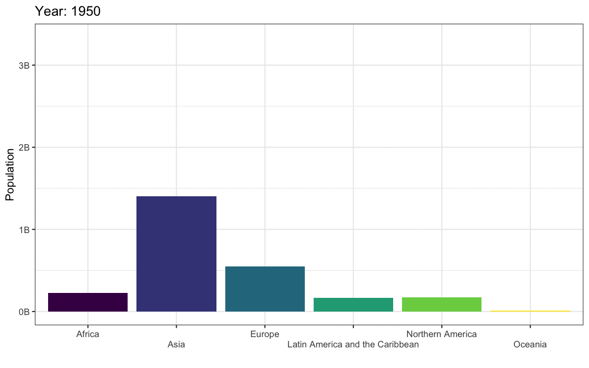

# Advanced Visualisations & Reports {#advanced}

<div class="incomplete-chapter"></div>

## Intended Learning Outcomes {#ilo-advanced}

The final chapter of ADS moves beyond the core skills needed to complete the course. Our aim in this chapter is to give you a sense of what is now available to you with your new-found R skills. There's a lot in this chapter as we wanted to present an overview of the possibilities, although there are no exercises at the end. If you're enrolled on ADS, you may wish to prioritise the summative assessment this week and come back to this chapter at a later date.

* Create and customise advanced types of plots
* Structure data in report, presentation, and dashboard formats
* Include linked figures, tables, and references

## Set-up (visualisation)

First, create a new project for the work we'll do in this chapter named `r path("09-advanced")`. Second, open and save a new R Markdown document named `visualisations.Rmd`, delete the welcome text and load the required packages for this section

```{r setup-custom, message=FALSE, warning = FALSE}
library(tidyverse)   # data wrangling functions
library(ggthemes)    # for themes
library(patchwork)   # for combining plots
library(plotly)      # for interactive plots
# devtools::install_github("hrbrmstr/waffle")
library(waffle)      # for waffle plots
library(ggbump)      # for bump plots
library(treemap)     # for treemap plots
library(ggwordcloud) # for word clouds
library(tidytext)    # for manipulating text for word clouds
library(sf)          # for mapping geoms
library(rnaturalearth) # for map data
library(rnaturalearthdata) # extra mapping data
library(gganimate)   # for animated plots

theme_set(theme_light())
```

You'll need to make a folder called "data" and download a data file into it: 
<a href="https://psyteachr.github.io/ads-v1/data/survey_data.csv" download>survey_data.csv</a>.

Download the [ggplot2 cheat sheet](https://raw.githubusercontent.com/rstudio/cheatsheets/main/data-visualization.pdf).


## Defaults

The code below creates two familiar plots from Chapter\ \@ref(viz), using the default (light) theme and palettes

```{r, message=FALSE}
# update column specification
ct <- cols(issue_category = col_factor(levels = c("tech", "returns", "sales", "other")))

# load data
survey_data <- read_csv(file = "data/survey_data.csv",
                        col_types = ct)

# create bar plot
bar <- ggplot(data = survey_data, 
              mapping = aes(x = issue_category,
                            fill = issue_category)) +
  geom_bar(show.legend = FALSE) +
  labs(x = "Issue Category", 
       y = "Count",
       title = "Calls by Issue Category")
#create scatterplot
point <- ggplot(data = survey_data, 
                mapping = aes(x = wait_time, 
                              y = call_time,
                              color = issue_category)) +
  geom_point(alpha = 0.5) +
  geom_smooth(method = lm, formula = y~x) +
  labs(x = "Wait Time",
       y = "Call Time",
       color = "Issue Category",
       title = "Wait Time by Call Time")
```


```{r, fig.cap="Default plot styles."}
bar + point
```


## Annotations

It's often useful to add annotation to a plot to, for example, highlight an important part of the plot or add labels. The `annotate()` function creates a specific geom at x- and y-coordinates you specify. 

### Text annotations

Add a text annotation by setting the `geom` argument to "text" or "label" and adding a `label`. Labels have padding and a background, while text is just text.

* The backslashes `\` in the label text control where the line breaks are. Try removing or changing the position of these to see what happens. 
* `x` and `y` control the coordinates of the label. You will likely have to play around with these values to get them right.
* The argument `hjust` is the horizontal justification of text, and `vjust` is the vertical justification. The default values are 0.5, where the text is centred on the x and y coordinates. 0 will justify to the left and bottom, while 1 justifies to the right and top. 
* You can  change the `angle` of text, but not labels.

```{r annotate-text, fig.cap = "An example of annotation text and label."}
bar +
  # add left-justified text to the second bar
  annotate(geom = "text",
           label = "Our goal is to\nreduce this\ncategory",
           x = 1.65, y = 180,
           hjust = 0, vjust = 1, 
           color = "white", fontface = "bold",
           angle = 45) +
  # add a centred label to the third bar
  annotate(geom = "label",
           label = "Our goal is\nto increase this\ncategory",
           x = 3, y = 75,
           hjust = 0.5, vjust = 1, 
           color = " darkturquoise", fontface = "bold")
```


::: {.try data-latex=""}

See if you can work out how to make the figure below, starting with the following:

```{r, eval = FALSE}
tibble(x = c(0, 0, 1, 1),
       y = c(0, 1, 0, 1)) %>%
  ggplot(aes(x, y)) +
  geom_point(alpha = 0.25, size = 4, color = "red")
```


```{r, echo = FALSE}
tibble(x = c(0, 0, 1, 1),
       y = c(0, 1, 0, 1)) %>%
  ggplot(aes(x, y)) +
  geom_point(alpha = 0.25, size = 4, color = "red") +
  annotate("label", label = "In the\nmiddle",
           x = 0.5, y = 0.5,
           fill = "dodgerblue", color = "white",
           label.padding = unit(1, "lines"),
           label.r = unit(1.5, "lines")) +
  annotate("text", label = "Bottom\nLeft",
           x = 0, y = 0, hjust = 0, vjust = 0) +
  annotate("text", label = "Top\nLeft", 
           x = 0, y = 1, hjust = 0, vjust = 1) +
  annotate("text", label = "Bottom\nRight",
           x = 1, y = 0, hjust = 1, vjust = 0) +
  annotate("text", label = "Top\nRight",
           x = 1, y = 1, hjust = 1, vjust = 1) +
  annotate("text", label = "45 degrees",
           x = 0, y = 0.5, hjust = 0, angle = 45) +
  annotate("text", label = "90 degrees",
           x = 0.25, y = 0.5, angle = 90) +
  annotate("text", label = "270 degrees",
           x = 0.75, y = 0.5, angle = 270)+
  annotate("text", label = "-45 degrees",
           x = 1, y = 0.5, hjust = 1, angle = -45)
```


```{r, eval = FALSE, webex.hide = TRUE}
tibble(x = c(0, 0, 1, 1),
       y = c(0, 1, 0, 1)) %>%
  ggplot(aes(x, y)) +
  geom_point(alpha = 0.25, size = 4, color = "red") +
  annotate("label", label = "In the\nmiddle",
           x = 0.5, y = 0.5,
           fill = "dodgerblue", color = "white",
           label.padding = unit(1, "lines"),
           label.r = unit(1.5, "lines")) +
  annotate("text", label = "Bottom\nLeft",
           x = 0, y = 0, hjust = 0, vjust = 0) +
  annotate("text", label = "Top\nLeft", 
           x = 0, y = 1, hjust = 0, vjust = 1) +
  annotate("text", label = "Bottom\nRight",
           x = 1, y = 0, hjust = 1, vjust = 0) +
  annotate("text", label = "Top\nRight",
           x = 1, y = 1, hjust = 1, vjust = 1) +
  annotate("text", label = "45 degrees",
           x = 0, y = 0.5, hjust = 0, angle = 45) +
  annotate("text", label = "90 degrees",
           x = 0.25, y = 0.5, angle = 90) +
  annotate("text", label = "270 degrees",
           x = 0.75, y = 0.5, angle = 270)+
  annotate("text", label = "-45 degrees",
           x = 1, y = 0.5, hjust = 1, angle = -45)
```
:::

### Other annotations

You can add other geoms to highlight parts of a plot. The example below adds a rectangle around a group of points, a text label, a straight arrow from the label to the rectangle, and a curved arrow from the label to an individual point.

```{r annotation-other, fig.cap="Example of annotatins with the rect, text, segment, and curve geoms."}
point +
  # add a rectangle surrounding long call times
  annotate(geom = "rect",
           xmin = 100, xmax = 275,
           ymin = 140, ymax = 180,
           fill = "transparent", color = "red") +
  # add a text label
  annotate("text",
           x = 260, y = 120,
           label = "outliers") +
  # add an line with an arrow from the text to the box
  annotate(geom = "segment", 
           x = 240, y = 120, 
           xend = 200, yend = 135,
           arrow = arrow(length = unit(0.5, "lines"))) +
  # add a curved line with an arrow 
  # from the text to a wait time outlier
  annotate(geom = "curve", 
          x = 280, y = 120, 
          xend = 320, yend = 45,
          curvature = -0.5,
          arrow = arrow(length = unit(0.5, "lines")))
```

See the `r pkg("ggforce", "https://ggforce.data-imaginist.com/")` package for more sophisticated options, such as highlighting a group of points with an ellipse. 

## Other Plots

### Interactive Plots

The `r pkg("plotly")` package can be used to make interactive graphs. Assign your ggplot to a variable and then use the function `ggplotly()` on the plot object. Note that interactive plots only work in HTML files, not PDFs or Word files.

```{r plotly, message = FALSE, fig.cap="Interactive graph using plotly"}
ggplotly(point)
```

::: {.info data-latex=""}
Hover over the data points above and click on the legend items.
:::

### Waffle Plots

In Chapter\ \@ref(viz), we mentioned that pie charts are such a poor way to visualise proportions that we refused to even show you how to make one. Waffle plots are a delicious alternative. 

::: {.warning data-latex=""}
Use `r pkg("waffle")` by [hrbrmstr on GitHub](https://github.com/hrbrmstr/waffle/) using the `install_github()` function below, rather than the one on CRAN you get from using `install.packages()`.

```{r, eval = FALSE}
devtools::install_github("hrbrmstr/waffle")
```

:::

By default, `geom_waffle()` represents each observation with a tile and splits these across 10 rows. You can play about with the `n_rows` argument to determine what works better for your data.

```{r, fig.cap = "Waffle plot."}
survey_data %>% 
  count(issue_category) %>%
  ggplot(aes(fill = issue_category, values = n)) +
  geom_waffle(n_rows = 23, # try setting this to 10 (the default)
              size = 0.33,       # line size
    make_proportional = FALSE, # whether to compute proportions from the raw values
    colour = "white",  # line colour
    flip = FALSE,      # bottom-top or left-right
    radius = grid::unit(0.1, "npc") # set to 0.5 for circles
  ) +
  theme_enhance_waffle() + # gets rid of axes
  scale_fill_colorblind(name = "Issue Category")
```

The waffle plot can also be used to display the counts as proportions To achieve these, set `n_rows = 10` and `make_proportional = TRUE`. Now, rather than each tile representing one observation, each tile represents 1% of the data. 

```{r, fig.cap = "Proportional waffle plot."}
survey_data %>% 
  count(issue_category) %>%
  ggplot(aes(fill = issue_category, values = n)) +
  geom_waffle(n_rows = 10, 
              size = 0.33,       
    make_proportional = TRUE, # whether to compute proportions from the raw values
    colour = "white",  
    flip = FALSE,      
    radius = grid::unit(0.1, "npc") 
  ) +
  theme_enhance_waffle() + 
  scale_fill_colorblind(name = "Issue Category")
```

### Treemap

Treemap plots are another way to visualise proportions. Like the waffle plots, you need to count the data by category first. You can use any [brewer palette](https://www.datanovia.com/en/blog/the-a-z-of-rcolorbrewer-palette/) for the fill. 

```{r, fig.cap = "Treemap plot."}
survey_data %>% 
  count(issue_category) %>%
  treemap(
    index="issue_category", # variable that determines the number of rectangles
    vSize="n", # variable that determines size of rectangle
    title = "",
    palette = "BuPu",
    inflate.labels = TRUE # expand labels to size of rectangle
  )
```

You can also represent multiple categories with treemaps

```{r, fig.cap = "Treemap with two variables"}

survey_data %>% 
  count(issue_category, employee_id) %>%
  arrange(employee_id) %>%
  treemap(
    index=c("employee_id", "issue_category"), # use c() to specify two variables
    vSize="n", 
    title = "",
    palette = "Dark2",
    fontsize.labels = c(30, 10), # set different label sizes for each type of label
    align.labels = list(c("left", "top"), c("center", "center")) # set different alignments for two label types
  )

```


### Bump Plots

Bump plots are very useful for visualising how rankings change over time. So first, we need to get some ranking data. Let's start with a more typical raw data table, containing an identifying column of `person` and three columns for their scores each week

```{r}
# make a small dataset of scores for 3 people over 3 weeks
score_data <- tribble(
  ~person, ~week_1, ~week_2, ~week_3,
  "Abeni",      80,     75,       90,
  "Beth",       75,     85,       75,
  "Carmen",     60,     70,       80
)
```

Now we make the table long, group by week, and use the `rank()` function to find the rank of each person's score each week. Use `n() - rank(score) + 1` to reverse the ranks so that the highest score gets rank 1. We also need to make the `week` variable a number.

```{r}
# calculate ranks
rank_data <- score_data %>%
  pivot_longer(cols = -person,
               names_to = "week",
               values_to = "score") %>%
  group_by(week) %>%
  mutate(rank = n() - rank(score) + 1) %>%
  ungroup() %>%
  arrange(week, rank) %>%
  mutate(week = str_replace(week, "week_", "") %>% as.integer())

rank_data
```

A typical mapping for a bump plot puts the time variable in the x-axis, the rank variable on the y-axis, and sets colour to the identifying variable.

```{r basic-bump, fig.width = 8, fig.height=3, fig.cap = "Basic bump plot"}
ggplot(data = rank_data, 
       mapping = aes(x = week, 
                     y = rank, 
                     colour = person)) +
  ggbump::geom_bump()
```

We can make this more attractive by customising the axes and adding text labels. Try running each line of this code to see how it builds up.

* Add `label = person` to the mapping so we can add in text labels.
* Increase the size of the lines with the `size` argument to `geom_bump()`
* We don't need labels for weeks 1.5 and 2.5, so change the x-axis `breaks`
* The `expand` argument for the two scale_ functions expands the plot area so we can fit text labels to the right.
* It makes more sense to have first place at the top so reverse the order of the y-axis with `scale_y_reverse()` and fix the breaks and expansion.
* Add text labels with `geom_text()`, but just for week 3, so set `data =  filter(rank_data, week == 3)` for this geom. 
* Set `x = 3.05` to move the text labels just to the right of week 3, and set `hjust = 0` to right-justify the text labels (the default is `hjust = 0.5`, which would center them on 3.05).
* Remove the legend and grid lines. Increase the x-axis text size.

```{r bump-example, fig.width = 8, fig.height=3, fig.cap = "Bump plot with added features."}
ggplot(data = rank_data, 
       mapping = aes(x = week, 
                     y = rank, 
                     colour = person,
                     label = person)) +
  ggbump::geom_bump(size = 10) +
  scale_x_continuous(name = "",
                     breaks = 1:3, 
                     labels = c("Week 1", "Week 2", "Week 3"),
                     expand = expansion(c(.05, .2))) +
  scale_y_reverse(name = "Ranking",
                  breaks = 1:3, 
                  expand = expansion(.2)) +
  geom_text(data = filter(rank_data, week == 3),
            color = "black", x = 3.05, hjust = 0) +
  theme(legend.position = "none",
        panel.grid.major = element_blank(),
        panel.grid.minor = element_blank(),
        axis.text.x = element_text(size = 12))
```


### Word Clouds

Word clouds are a common way to summarise text data. First, download <a href="https://psyteachr.github.io/ads-v1/data/amazon_alexa.csv" download>amazon_alexa.csv</a> into your data folder and then load it into an object. This dataset contains  text reviews as well as the 1-5 rating from customers who bought an Alexa device on Amazon.

```{r}
# https://www.kaggle.com/sid321axn/amazon-alexa-reviews
# extracted from Amazon by Manu Siddhartha & Anurag Bhatt
alexa <- rio::import("data/amazon_alexa.csv")
```

We can use this data to look at how the words used differ depending on the rating given. To make the text data easy to work with, the function `tidytext::unnest_tokens()` splits the words in the `input` column into individual words in a new `output` column. `unnnest_tokens()` is particularly helpful because it also does things like removes punctuation and transforms all words to lower case to make it easier to work with. Compare `words` and `alexa` to see how the map on to each other.

```{r}
words <- alexa %>%
  unnest_tokens(output = "word", input = "verified_reviews")
```

We can then add another line of code using a pipe that counts how many instances of each word there is by rating to give us the most popular words.

```{r}
words <- alexa %>%
  unnest_tokens(output = "word", input = "verified_reviews") %>%
  count(word, rating, sort = TRUE) 
```

```{r echo = FALSE}
head(words)
```

The problem is that the most common words are all function words rather than content words, which makes sense because these words have the highest word frequency in natural language.

Helpfully, `tidytext` contains a list of common "stop words", i.e., words that you want to ignore, that are stored in an object named `stop_words`.  It is also very useful to define a list of custom stop words based upon the unique properties of your data (it can sometimes take a few attempts to identify what's appropriate for your dataset). This dataset contains a lot of numbers which aren't informative, and it also contains "https" from website links so we'll get rid of both with a custom stop list.

Once you have defined your stop words, you can then use `anti_join()`  to remove any `word` that is present in the stop word list.

To get the top 25 words, we then group by rating and use `dplyr::slice_max()`, ordered by the column `n`. 

```{r}
custom_stop <- tibble(word = c(0:9, "https", 34))

words <- alexa %>%
  unnest_tokens(output = "word", input = "verified_reviews") %>%
  count(word, rating) %>%
  anti_join(stop_words, by = "word") %>%
  anti_join(custom_stop, by = "word") %>%
  group_by(rating) %>%
  slice_max(order_by = n, n = 25, with_ties = FALSE)
```

First, let's make a word cloud for customers who gave a 1-star rating:

* Filter retains only the data for 1-star ratings. 
* `label` comes from the `word` column and is the data to plot (i.e., the words).
* `colour` makes the words red (you could also set this to `word` to give each word a different colour).
* `size` makes the size of the word proportional to `n`, the number of times the word appeared.
* `r hl(ggwordcloud::geom_text_wordcloud_area())` is the word cloud geom. 
* `r hl(ggwordcloud::scale_size_area())` controls how big the word cloud is (this usually takes some trial-and-error).  

```{r}
rating1 <- filter(words, rating == 1) %>%
  ggplot(aes(label = word, colour = "red", size = n)) +
  geom_text_wordcloud_area() +
  scale_size_area(max_size = 10) +
  ggtitle("Rating = 1") +
  theme_minimal(base_size = 14)

rating1
```

We can now do the same but for 5-star ratings and paste the plots together with `patchwork` (word clouds don't play well with facets). 

```{r, fig.height = 3, fig.cap="Word cloud."}
rating5 <- filter(words, rating == 5) %>%
  ggplot(aes(label = word, size = n)) +
  geom_text_wordcloud_area(colour = "darkolivegreen3") +
  scale_size_area(max_size = 12) +
  ggtitle("Rating = 5") +
  theme_minimal(base_size = 14)

rating1 + rating5
```

It's worth highlighting that whilst word clouds are very common, they're really the equivalent of pie charts for text data because we're not very good at making accurate comparisons based on size. You might be able to see what's the most popular word, but can you accurately determine the 2nd, 3rd, 4th or 5th most popular word based on the clouds alone? There's also the issue that just because it's text data doesn't make it a qualitative analysis and just because something is said a lot doesn't mean it's useful or important. But, this argument is outwith the scope of this book, even it is a recurring part of Emily's life thanks to her qualitative wife. 

### Maps

Working with maps can be tricky. The `r pkg("sf")` package provides functions that work with `r pkg("ggplot2")`, such as `geom_sf()`. The `r pkg("rnaturalearth")` package (and associated data packages that you may be prompted to download) provide high-quality mapping coordinates.

* `ne_countries()` returns world country polygons (i.e., a world map). We specify the object should be returned as a "simple feature" class `sf` so that it will work with `geom_sf()`. If you would like a deep dive on simple feature objects, check out a [vignette](https://r-spatial.github.io/sf/articles/sf1.html) from the `r pkg("sf")` package.
* It's worth checking out the object `ne_countries()` returns to see just how much information is available.
* Try changing the values and colours below to get a sense of how the code works.


```{r map-world, fig.width = 7, fig.height = 3.4}
# get the world map coordinates
world_sf <- ne_countries(returnclass = "sf", scale = "medium")

# plot them on a light blue background
ggplot() + 
  geom_sf(data = world_sf, size = 0.3) +
  theme(panel.background = element_rect(fill = "lightskyblue2"))
```

You can combine multiple countries using `bind_rows()` and visualise them with different colours for each country.

```{r map-islands, fig.width = 6, fig.height = 6, fig.cap="Map coloured by country."}
# get and bind country data
uk_sf <- ne_states(country = "united kingdom", returnclass = "sf")
ireland_sf <- ne_states(country = "ireland", returnclass = "sf")
islands <- bind_rows(uk_sf, ireland_sf) %>%
  filter(!is.na(geonunit))

# set colours
country_colours <- c("Scotland" = "#0962BA",
                     "Wales" = "#00AC48",
                     "England" = "#FF0000",
                     "Northern Ireland" = "#FFCD2C",
                     "Ireland" = "#F77613")

ggplot() + 
  geom_sf(data = islands,
          mapping = aes(fill = geonunit),
          colour = NA,
          alpha = 0.75) +
  coord_sf(crs = sf::st_crs(4326),
           xlim = c(-10.7, 2.1), 
           ylim = c(49.7, 61)) +
  scale_fill_manual(name = "Country", 
                    values = country_colours)
```


You can join data to the map table to visualise data on the map using colours or labels.

```{r}
# load map data
scotland_sf <- ne_states(geounit = "Scotland", 
                         returnclass = "sf")

# load population data from
# https://www.indexmundi.com/facts/united-kingdom/quick-facts/scotland/population
scotpop <- read_csv("data/scottish_population.csv", 
                    show_col_types = FALSE)

# join data and fix typo in the map
scotmap_pop <- scotland_sf %>%
  mutate(name = ifelse(name == "North Ayshire", 
                       yes = "North Ayrshire", 
                       no = name)) %>%
  left_join(scotpop, by = "name") %>%
  select(name, population, geometry)
```

::: {.warning data-latex=""}
There is a typo in the data from `r pkg("rnaturalearth")`, so you need to change "North Ayshire" to "North Ayrshire" before you join the population data.
:::

* Setting the fill to population in `geom_sf()` gives each region a colour based on its population. 
* The colours are customised with `scale_fill_viridis_c()`. The breaks of the fill scale are set to increments of 100K (1e5 in scientific notation) and the scale is set to span 0 to 600K. 
* `paste0()` creates the labels by taking the numbers 0 through 6 and adding "00 k" to them.
* Finally, the position of the legend is moved into the sea using `legend.position()`.

```{r map-scotland, fig.width = 5, fig.height = 7, fig.cap="Map coloured by population."}
# plot
ggplot() + 
  geom_sf(data = scotmap_pop,
          mapping = aes(fill = population),
          color = "white", 
          size = .1) +
  coord_sf(xlim = c(-8, 0), ylim = c(54, 61)) +
  scale_fill_viridis_c(name = "Population",
                       breaks = seq(from = 0, to = 6e5, by = 1e5), 
                       limits = c(0, 6e5),
                       labels = paste0(0:6, "00 K")) +
  theme(legend.position = c(0.16, 0.84))
```

### Animated Plots

Animated plots are a great way to add a wow factor to your reports, but they can be complex to make, distracting, and not very accessible, so use them sparingly and only for data visualisation where the animation really adds something. The package `r pkg("gganimate", "https://gganimate.com/")` has many functions for animating ggplots.

Here, we'll load some population data from the United Nations. <a href="data/WPP2019_POP_F01_1_TOTAL_POPULATION_BOTH_SEXES.xlsx" download>Download the file</a> into your data folder and open it in Excel first to see what it looks like. The code below gets the data from the first tab, filters it to just the 6 world regions, makes the data long, and makes sure the `year` column is numeric and the `pop` column shows population in whole numbers (the original data is in 1000s).

```{r}
# load and process data
worldpop <- readxl::read_excel("data/WPP2019_POP_F01_1_TOTAL_POPULATION_BOTH_SEXES.xlsx", skip = 16) %>%
  filter(Type == "Region") %>%
  select(region = 3, `1950`:`1992`) %>%
  pivot_longer(cols = -region, 
               names_to = "year",
               values_to = "pop") %>%
  mutate(year = as.integer(year),
         pop = round(1000 * as.numeric(pop)))
```

Let's make an animated plot showing how the population in each region changes with year. First, make a static plot. Filter the data to the most recent year so you can see what a single frame of the animation will look like.

```{r}
worldpop %>%
  filter(year == 1992) %>%
  ggplot(aes(x = region, y = pop, fill = region)) +
  geom_col(show.legend = FALSE) +
  scale_fill_viridis_d() +
  scale_x_discrete(name = "", 
                   guide = guide_axis(n.dodge=2))+
  scale_y_continuous(name = "Population",
                     breaks = seq(0, 3e9, 1e9),
                     labels = paste0(0:3, "B")) +
  ggtitle('Year: 1992')
```

To convert this to an animated plot that shows the data from multiple years:

* Remove the filter and add `transition_time(year)`. 
* Use the `{}` syntax to include the `frame_time` in the title. 
* Use `anim_save()` to save the animation to a GIF file and set this code chunk to `eval = FALSE` because creating an animation takes a long time and you don't want to have to run it every time you knit your report.

```{r, eval = FALSE}
anim <- worldpop %>%
  ggplot(aes(x = region, y = pop, fill = region)) +
  geom_col(show.legend = FALSE) +
  scale_fill_viridis_d() +
  scale_x_discrete(name = "",
                   guide = guide_axis(n.dodge=2))+
  scale_y_continuous(name = "Population",
                     breaks = seq(0, 3e9, 1e9),
                     labels = paste0(0:3, "B")) +
  ggtitle('Year: {frame_time}') +
  transition_time(year)
  

anim_save(filename = "images/gganim-demo.gif",
          animation = anim,
          width = 8, height = 5, units = "in", res = 150)
```

You can show your animated gif in an html report (animations don't work in Word or a PDF) using `include_graphics()`, or include the GIF in a dynamic document like PowerPoint.

```{r anim-demo, fig.cap="Animated gif."}

```


## Visualisation Resources  {#resources-custom}

There are so many more options for data visualisation in R than we have time to cover here. The following resources will get you started on your journey to informative, intuitive visualisations.

* [The R Graph Gallery](http://www.r-graph-gallery.com/) (this is really useful)
* [Look at Data](http://socviz.co/look-at-data.html) from [Data Vizualization for Social Science](http://socviz.co/)
* [Graphs](http://www.cookbook-r.com/Graphs) in *Cookbook for R*
* [Top 50 ggplot2 Visualizations](http://r-statistics.co/Top50-Ggplot2-Visualizations-MasterList-R-Code.html)
* [R Graphics Cookbook](http://www.cookbook-r.com/Graphs/) by Winston Chang
* [ggplot extensions](https://www.ggplot2-exts.org/)
* [plotly](https://plot.ly/ggplot2/) for creating interactive graphs
* [Drawing Beautiful Maps Programmatically](https://r-spatial.org/r/2018/10/25/ggplot2-sf.html)
* [gganimate](https://gganimate.com/)

## Set-up (reports)

Close your visualisation Markdown and open and save an new R Markdown document named `reports`.Rmd`, delete the welcome text and load the required packages for this section.

```{r setup-reports, message=FALSE}
library(tidyverse)     # data wrangling functions
library(bookdown)      # for chaptered reports
library(flexdashboard) # for dashboards
library(DT)            # for interactive tables
```

## Linked documents

If you need to create longer reports with links between sections, you can edit the YAML to use a bookdown format. `bookdown::html_document2` is a useful one that adds figure and table numbers automatically to any figures or tables with a caption and allows you to link to these by reference.

To create links to tables and figures, you need to name the code chunk that created your figures or tables, and then call those names in your inline coding:

```{r, eval = FALSE, verbatim="r my-table"}
# table code here
```

```{r, eval = FALSE, verbatim="r my-figure"}
# figure code here
```

```
See Table\ \@ref(tab:my-table) or Figure\ \@ref(fig:my-figure).
```

::: {.warning data-latex=""}
The code chunk names can only contain letters, numbers and dashes. If they contain other characters like spaces or underscores, the referencing will not work.
:::

You can also link to different sections of your report by naming your headings with `{#}`:

```
# My first heading {#heading-1}

## My second heading {#heading-2}

See Section\ \@ref(heading-1) and Section\ \@ref(heading-2)

```
The code below shows how to link text to figures or tables in a full report using the built-in `diamonds` dataset - use your `reports.Rmd` to create this document now. You can see the [HTML output here](demos/html_document2.html).

`r hide("Linked document code")`

```{embed, file = "demos/html_document2.Rmd"}
# readLines("demos/html_document2.Rmd") %>% 
#   paste(collapse = "\n") %>%
#   paste0("<code style='font-size: smaller;'><pre>\n", ., "\n</pre></code>") %>%
#   cat()
```

`r unhide()`

This format defaults to numbered sections, so set `number_sections: false` in the `r glossary("YAML")` header if you don't want this.

## References

There are several ways to do in-text references and automatically generate a [bibliography](https://bookdown.org/yihui/rmarkdown-cookbook/bibliography.html){target="_blank"} in R Markdown. Markdown files need to link to a BibTex file (a plain text file with references in a specific format) that contains the references you need to cite. You specify the name of this file in the YAML header, like `bibliography: filename.bib` and cite references in text using an at symbol and a shortname, like `[@tidyverse]`.

### Creating a BibTeX file

Most reference software like EndNote, Zotero or Mendeley have exporting options that can export to BibTeX format. You just need to check the shortnames in the resulting file.

You can also make a BibTeX file and add references manually. In RStudio, go to **`File`** > **`New File...`** > **`Text File`** and save the file as "bibliography.bib".

Next, add the line `bibliography: bibliography.bib` to your YAML header.

### Adding references

You can add references to a journal article in the following format:

```
@article{shortname,
  author = {Author One and Author Two and Author Three},
  title = {Paper Title},
  journal = {Journal Title},
  volume = {vol},
  number = {issue},
  pages = {startpage--endpage},
  year = {year},
  doi = {doi}
}
```

See [A complete guide to the BibTeX format](https://www.bibtex.com/g/bibtex-format/){target="_blank"} for instructions on citing books, technical reports, and more.

You can get the reference for an R package using the functions `citation()` and `toBibtex()`. You can paste the bibtex entry into your bibliography.bib file. Make sure to add a short name (e.g., "ggplot2") before the first comma to refer to the reference.

```{r}
citation(package="ggplot2") %>% toBibtex()
```


[Google Scholar](https://scholar.google.com/) entries have a BibTeX citation option. This is usually the easiest way to get the relevant values, although you have to add the DOI yourself. You can keep the suggested shortname or change it to something that makes more sense to you.

### Citing references

You can cite references in text like this: 

```
This tutorial uses several R packages [@tidyverse;@rmarkdown].
```

This tutorial uses several R packages [@tidyverse;@rmarkdown].

Put a minus in front of the @ if you just want the year:

```
Franconeri and colleagues [-@franconeri2021science] review research-backed guidelines for creating effective and intuitive visualizations.
```

Franconeri and colleagues [-@franconeri2021science] review research-backed guidelines for creating effective and intuitive visualizations.

### Citation styles

You can search a [list of style files](https://www.zotero.org/styles){target="_blank"} (e.g., APA, MLA, Harvard) and download a file that will format your bibliography. You'll need to add the line `csl: filename.csl` to your YAML header. 

### Reference section

By default, the reference section is added to the end of the document. If you want to change the position (e.g., to add figures and tables after the references), include `<div id="refs"></div>` where you want the references. 

Try adding in-text citations and a reference list to your `diamonds` report now.

## Interactive tables

One way to make your reports more exciting is to use interactive tables. The `DT::datatable()` function displays a table with some extra interactive elements to allow readers to search and reorder the data, as well as controlling the number of rows shown at once. This can be especially helpful. This only works with HTML output types. The [DT website](https://rstudio.github.io/DT/){target="_blank"} has extensive tutorials, but we'll cover the basics here.

```{r}
library(DT)

scotpop <- read_csv("data/scottish_population.csv", 
                    show_col_types = FALSE)

datatable(data = scotpop)
```


You can customise the display, such as changing column names, adding a caption, moving the location of the filter boxes, removing row names, applying [classes](https://datatables.net/manual/styling/classes){target="_blank"} to change table appearance, and applying [advanced options](https://datatables.net/reference/option/){target="_blank"}.

```{r}
# https://datatables.net/reference/option/
my_options <- list(
  pageLength = 5, # how many rows are displayed
  lengthChange = FALSE, # whether pageLength can change
  info = TRUE, # text with the total number of rows
  paging = TRUE, # if FALSE, the whole table displays
  ordering = FALSE, # whether you can reorder columns
  searching = FALSE # whether you can search the table
)

datatable(
  data = scotpop,
  colnames = c("County", "Population"),
  caption = "The population of Scottish counties.",
  filter = "none", # "none", "bottom" or "top"
  rownames = FALSE, # removes the number at the left
  class = "cell-border hover stripe", # default is "display"
  options = my_options
)
```


## Other formats

You can create more than just reports with R Markdown. You can also create presentations, interactive dashboards, books, websites, and web applications.

### Presentations

You can choose a presentation template when you create a new R Markdown document. We'll use ioslides for this example, but the other formats work similarly.

```{r img-ioslides-template, echo=FALSE, fig.cap="Ioslides RMarkdown template."}
knitr::include_graphics("images/present/new-ioslides.png")
```

The main differences between this and the Rmd files you've been working with until now are that the `output` type in the `r glossary("YAML")` header is `ioslides_presentation` instead of `html_document` and this format requires a specific title structure. Each slide starts with a level-2 header.

The template provides you with examples of text, bullet point, code, and plot slides. You can knit this template to create an `r glossary("HTML")` document with your presentation. It often looks odd in the RStudio built-in browser, so click the button to open it in a web browser. You can use the space bar or arrow keys to advance slides.

The code below shows how to load some packages and display text, a table, and a plot. You can see the [HTML output here](demos/ioslides.html).

`r hide()`

```{embed, file = "demos/ioslides.Rmd"}
# readLines("demos/ioslides.Rmd") %>% 
#   paste(collapse = "\n") %>%
#   paste0("<code style='font-size: smaller;'><pre>\n", ., "\n</pre></code>") %>%
#   cat()
```

`r unhide()`

### Dashboards

Dashboards are a way to display text, tables, and plots with dynamic formatting. After you install `r pkg("flexdashboard")`, you can choose a flexdashboard template when you create a new R Markdown document. 

```{r img-flx-template, echo=FALSE, fig.cap="Flexdashboard RMarkdown template."}
knitr::include_graphics("images/present/flexdashboard-template.png")
```

The code below shows how to load some packages, display two tables in a tabset, and display two plots in a column. You can see the [HTML output here](demos/flexdashboard.html).

`r hide()`

```{embed, file = "demos/flexdashboard.Rmd"}
# readLines("demos/flexdashboard.Rmd") %>% 
#   paste(collapse = "\n") %>%
#   paste0("<code style='font-size: smaller;'><pre>\n", ., "\n</pre></code>") %>%
#   cat()
```

`r unhide()`

Change the size of your web browser to see how the boxes, tables and figures change.

The best way to figure out how to format a dashboard is trial and error, but you can also look at some [sample layouts](https://pkgs.rstudio.com/flexdashboard/articles/layouts.html){target="_blank"}.

### Books

You can create online books with `r pkg("bookdown")`. In fact, the book you're reading was created using bookdown. After you download the package, start a new project and choose "Book project using bookdown" from the list of project templates. 

```{r img-bookdown-template, echo=FALSE, fig.cap="Bookdown project template."}
knitr::include_graphics("images/present/bookdown.png")
```

Each chapter is written in a separate .Rmd file and the general book settings can be changed in the `_bookdown.yml` and `_output.yml` files. 

### Websites

You can create a simple website the same way you create any R Markdown document. Choose "Simple R Markdown Website" from the project templates to get started. See Appendix\ \@ref(webpages) for a step-by-step tutorial.

For more complex, blog-style websites, you can investigate [`r pkg("blogdown")`](https://bookdown.org/yihui/blogdown/). After you install this package, you will also be able to crate template blogdown projects to get you started.

### Shiny

To get truly interactive, you can take your R coding to the next level and learn Shiny. Shiny apps let your R code react to user input. You can do things like [make a word cloud](https://shiny.psy.gla.ac.uk/debruine/wordcloud/), [search a google spreadsheet](https://shiny.psy.gla.ac.uk/debruine/seen/), or [conduct a survey](https://shiny.psy.gla.ac.uk/debruine/question/).

This is well outside the scope of this class, but the skills you've learned here provide a good start. The free book [Building Web Apps with R Shiny](https://debruine.github.io/shinyintro/) by one of the authors of this book can get you started creating shiny apps.

## Report Resources {#resources-report}

* [RStudio Formats](https://rmarkdown.rstudio.com/formats.html)
* [R Markdown Cookbook](https://bookdown.org/yihui/rmarkdown-cookbook)
* [DT](https://rstudio.github.io/DT/)
* [Flexdashboard](https://pkgs.rstudio.com/flexdashboard/)
* [Bookdown](https://bookdown.org/yihui/bookdown/)
* [Blogdown](https://bookdown.org/yihui/blogdown/)
* [Shiny](https://shiny.rstudio.com/)
* [Building Web Apps with R Shiny](https://debruine.github.io/shinyintro/)

## Course Complete

And so, we are done. We've covered a huge amount over the course of Applied Data Skills, and whilst you're likely more comfortable with some bits than others, the skills you have developed are truly impressive. Even if you go no further than what you've learned in this book, you can now work reproducibly to produce informative summaries and visualisations that provide new insights into your data and reduce human error. 

But it's also important to recognise that your knowledge of R will never be complete. In the course of writing this book, the entire ADS team have learned new functions, new arguments, new approaches, and new reasons to love or loathe certain data visualisations. The flexibility and possibility of R is what makes it frustrating and empowering in equal measure. What we hope more than anything is that Applied Data Skills is the start of your journey with R, not the end. Please keep in touch, we'd love to see where it takes you.

Emily Nordmann
Lisa DeBruine
Gaby Mahrholz
Jaimie Torrance
