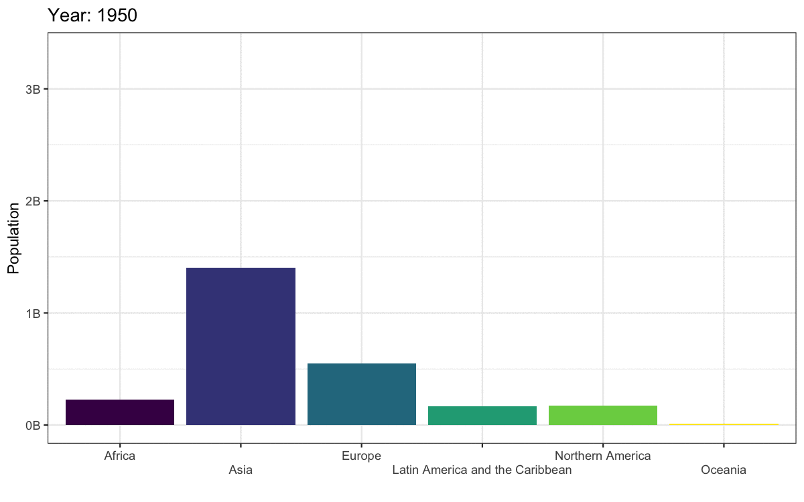

# Customising Visualisations {#custom}

<div class="incomplete-chapter"></div>

## Intended Learning Outcomes {#ilo-custom}

* Customise plots with a consistent style
* Create high quality plots like BBC, NYT, 538

## Set-up

First, create a new project for the work we'll do in this chapter named `r path("09-custom")`. Second, open and save and new R Markdown document named `custom.Rmd`, delete the welcome text and load the required packages for this chapter.

```{r setup-custom, message=FALSE, warning = FALSE}
library(tidyverse)   # data wrangling functions
library(ggthemes)    # for themes
library(patchwork)   # for combining plots
library(plotly)      # for interactive plots
# devtools::install_github("hrbrmstr/waffle")
library(waffle)      # for waffle plots
library(ggbump)      # for bump plots
library(treemap)     # for treemap plots
library(ggwordcloud) # for word clouds
library(tidytext)    # for manipulating text for word clouds
library(sf)          # for mapping geoms
library(rnaturalearth) # for map data
library(rnaturalearthdata) # extra mapping data
library(gganimate)   # for animated plots

theme_set(theme_light())
```

You'll need to make a folder called "data" and download a data file into it: 
<a href="https://psyteachr.github.io/ads-v1/data/survey_data.csv" download>survey_data.csv</a>.

Download the [ggplot2 cheat sheet](https://raw.githubusercontent.com/rstudio/cheatsheets/main/data-visualization.pdf).


## Defaults

The code below creates two familiar plots from Chapter\ \@ref(viz), using the default (light) theme and palettes

```{r, message=FALSE}
ct <- cols(issue_category = col_factor(levels = c("tech", "returns", "sales", "other")))
survey_data <- read_csv(file = "data/survey_data.csv",
                        col_types = ct)

bar <- ggplot(data = survey_data, 
              mapping = aes(x = issue_category,
                            fill = issue_category)) +
  geom_bar(show.legend = FALSE) +
  labs(x = "Issue Category", 
       y = "Count",
       title = "Calls by Issue Category")

point <- ggplot(data = survey_data, 
                mapping = aes(x = wait_time, 
                              y = call_time,
                              color = issue_category)) +
  geom_point(alpha = 0.5) +
  geom_smooth(method = lm, formula = y~x) +
  labs(x = "Wait Time",
       y = "Call Time",
       color = "Issue Category",
       title = "Wait Time by Call Time")
```


```{r, fig.cap="Default plot styles."}
bar + point
```

## R Markdown Options

### Image Size

You can set the image size in the `r glossary("chunk")` headers.

```{r, eval=FALSE, verbatim="r, fig.width = 10, fig.height = 5"}
bar + point
```

```{r figdim-demo, echo = FALSE, fig.width = 10, fig.height = 5, fig.cap="Image size altered to fig.width = 10, fig.height = 5"}
bar + point
```


::: {.warning data-latex=""}
If you're using a MacBook with a Retina display, you may notice that the figures you see in RStudio when you're editing interactively are different from what you see when you render the file. This is an annoying but known bug in [RStudio](https://github.com/rstudio/rstudio/issues/4521){target="_blank"}. Until it's fixed, you can set fig.width and fig.height to their value/2 when checking a plot, and set it back before you knit.
:::

### Output 

The option `out.width` controls how much space the figure takes up relative to the width of the output. The default value is "100%". You can also set alignment with `fig.align`.


```{r, eval = FALSE, varbatim='out.width = "75%", fig.align = "center"'}
bar
```


```{r outwidth-demo, echo = FALSE, out.width = "75%", fig.align = "center",  fig.cap = "Output display altered with out.width = \"75%\""}
bar
```

### Captions

Figures should usually get a caption with `fig.cap` and alt text to describe the figure to people with impaired vision using `fig.alt`. You can use the pattern below to spread the chunk options over multiple lines in a way that makes them easier to read. 

```{r, eval = FALSE, verbatim = "r"}
#| reference-name, 
#| echo = FALSE, 
#| fig.width = 8, fig.height = 5, out.width = "100%", 
#| fig.cap = "As wait time increases, so does call time.", 
#| fig.alt = "Wait time on the x-axis and Call time on the y-axis. Shows scatterplots and regression lines for each of 4 issue categories: other, returns, sales, and tech. All 4 wait times increase with call time. At 50 seconds wait time, call time is about 25 seconds. At 250 seconds wait time, call time is about 60 seconds."

point
```

```{r}
#| caption-demo, 
#| echo = FALSE, 
#| fig.width = 8, fig.height = 5, out.width = "100%", 
#| fig.cap = "As wait time increases, so does call time.", 
#| fig.alt = "Wait time on the x-axis and Call time on the y-axis. Shows scatterplots and regression lines for each of 4 issue categories: other, returns, sales, and tech. All 4 wait times increase with call time. At 50 seconds wait time, call time is about 25 seconds. At 250 seconds wait time, call time is about 60 seconds."
point
```


### Setup Chunk

You can also set default values in the setup chunk like this.

```{r, eval = FALSE}
knitr::opts_chunk$set(
  fig.width = 10,
  fig.height = 5,
  out.width = "75%",
  fig.align = "center"
)
```

::: {.warning data-latex=""}
When you set the default figure width and height in the setup chunk, images you  make interactively while setting up your script will have the right aspect ratio, but you will only be able to see the `out.width`, `fig.align`, and `fig.cap` when you `r glossary("knit")` the file.
:::


## Themes and Colours

Use the scale functions to customise fill and colour. Appendix\ \@ref(plotstyle) has more extensive detail on this.

```{r, fig.cap="Plots with the classic theme and Dark2 palette."}
bar2 <- bar + 
  theme_classic() + 
  scale_fill_brewer(palette = "Dark2")

point2 <- point + 
  theme_classic() + 
  scale_color_brewer(palette = "Dark2")

bar2 + point2
```

You can download extra themes with packages like `r pkg("ggthemes")`.

```{r, fig.cap="Plots with the economist styles from ggthemes."}
bar_econ <- bar + 
  theme_economist() +
  scale_fill_economist()

point_econ <- point + 
  theme_economist() +
  scale_color_economist() +
  guides(color = "none")

bar_econ + point_econ
```

## Annotations

It's often useful to add annotation to a plot to, for example, highlight an important part of the plot or add labels. The `annotate()` function creates a specific geom at x- and y-coordinates you specify. 

### Text annotations

Add a text annotation by setting the `geom` argument to "text" or "label" and adding a `label`. Labels have padding and a background, while text is just text.

```{r annotate-text, fig.cap = "An example of annotation text and label."}
bar +
  # add left-justified text to the second bar
  annotate(geom = "text",
           label = "Our goal is to\nreduce this\ncategory",
           x = 1.65, y = 215,
           hjust = 0, vjust = 1, 
           color = "white", fontface = "bold") +
  # add a centred label to the third bar
  annotate(geom = "label",
           label = "Our goal is\nto increase this\ncategory",
           x = 3, y = 75,
           hjust = 0.5, vjust = 1, 
           color = " darkturquoise", fontface = "bold")
```
::: {.try data-latex=""}

The argument `hjust` is the horizontal justification of text, and `vjust` is the vertical justification. The default values are 0.5, where the text is centred on the x and y coordinates. 0 will justify to the left and bottom, while 1 justifies to the right and top. You can also change the `angle` of text, but not labels.

See if you can work out how to make the figure below, starting with the following:

```{r, eval = FALSE}
tibble(x = c(0, 0, 1, 1),
       y = c(0, 1, 0, 1)) %>%
  ggplot(aes(x, y)) +
  geom_point(alpha = 0.25, size = 4, color = "red")
```


```{r, echo = FALSE}
tibble(x = c(0, 0, 1, 1),
       y = c(0, 1, 0, 1)) %>%
  ggplot(aes(x, y)) +
  geom_point(alpha = 0.25, size = 4, color = "red") +
  annotate("label", label = "In the\nmiddle",
           x = 0.5, y = 0.5,
           fill = "dodgerblue", color = "white",
           label.padding = unit(1, "lines"),
           label.r = unit(1.5, "lines")) +
  annotate("text", label = "Bottom\nLeft",
           x = 0, y = 0, hjust = 0, vjust = 0) +
  annotate("text", label = "Top\nLeft", 
           x = 0, y = 1, hjust = 0, vjust = 1) +
  annotate("text", label = "Bottom\nRight",
           x = 1, y = 0, hjust = 1, vjust = 0) +
  annotate("text", label = "Top\nRight",
           x = 1, y = 1, hjust = 1, vjust = 1) +
  annotate("text", label = "45 degrees",
           x = 0, y = 0.5, hjust = 0, angle = 45) +
  annotate("text", label = "90 degrees",
           x = 0.25, y = 0.5, angle = 90) +
  annotate("text", label = "270 degrees",
           x = 0.75, y = 0.5, angle = 270)+
  annotate("text", label = "-45 degrees",
           x = 1, y = 0.5, hjust = 1, angle = -45)
```


```{r, eval = FALSE, webex.hide = TRUE}
tibble(x = c(0, 0, 1, 1),
       y = c(0, 1, 0, 1)) %>%
  ggplot(aes(x, y)) +
  geom_point(alpha = 0.25, size = 4, color = "red") +
  annotate("label", label = "In the\nmiddle",
           x = 0.5, y = 0.5,
           fill = "dodgerblue", color = "white",
           label.padding = unit(1, "lines"),
           label.r = unit(1.5, "lines")) +
  annotate("text", label = "Bottom\nLeft",
           x = 0, y = 0, hjust = 0, vjust = 0) +
  annotate("text", label = "Top\nLeft", 
           x = 0, y = 1, hjust = 0, vjust = 1) +
  annotate("text", label = "Bottom\nRight",
           x = 1, y = 0, hjust = 1, vjust = 0) +
  annotate("text", label = "Top\nRight",
           x = 1, y = 1, hjust = 1, vjust = 1) +
  annotate("text", label = "45 degrees",
           x = 0, y = 0.5, hjust = 0, angle = 45) +
  annotate("text", label = "90 degrees",
           x = 0.25, y = 0.5, angle = 90) +
  annotate("text", label = "270 degrees",
           x = 0.75, y = 0.5, angle = 270)+
  annotate("text", label = "-45 degrees",
           x = 1, y = 0.5, hjust = 1, angle = -45)
```
:::

### Other annotations

You can add other geoms to highlight parts of a plot. The example below adds a rectangle around a group of points, a text label, a straight arrow from the label to the rectangle, and a curved arrow from the label to an individual point.

```{r annotation-other, fig.cap="Example of annotatins with the rect, text, segment, and curve geoms."}
point +
  # add a rectangle surrounding long call times
  annotate(geom = "rect",
           xmin = 100, xmax = 275,
           ymin = 140, ymax = 180,
           fill = "transparent", color = "red") +
  # add a text label
  annotate("text",
           x = 260, y = 120,
           label = "outliers") +
  # add an line with an arrow from the text to the box
  annotate("segment", 
           x = 240, y = 120, 
           xend = 200, yend = 135,
           arrow = arrow(length = unit(0.5, "lines"))) +
  # add a curved line with an arrow 
  # from the text to a wait time outlier
  annotate("curve", 
          x = 280, y = 120, 
          xend = 320, yend = 45,
          curvature = -0.5,
          arrow = arrow(length = unit(0.5, "lines")))
```

See the `r pkg("ggforce", "https://ggforce.data-imaginist.com/")` package for more sophisticated options, such as highlighting a group of points with an ellipse. 

## Other Plots

### Interactive Plots

Use the `r pkg("plotly")` package to make interactive graphs. Assign your ggplot to a variable and use the function `ggplotly()`. Interactive plots only work in HTML files, not PDFs or Word files.

```{r plotly, message = FALSE, fig.cap="Interactive graph using plotly"}
ggplotly(point_econ)
```

::: {.info data-latex=""}
Hover over the data points above and click on the legend items.
:::


### Waffle Plots

In Chapter\ \@ref(viz), we mentioned that pie charts are such a poor way to visualise proportions that we refused to even show you how to make one. Waffle plots are a delicious alternative. 

::: {.warning data-latex=""}
Use `r pkg("waffle")` by [hrbrmstr on GitHub](https://github.com/hrbrmstr/waffle/), not the one on CRAN.

```{r, eval = FALSE}
devtools::install_github("hrbrmstr/waffle")
```

:::

```{r, fig.cap = "Waffle plot."}
survey_data %>% 
  count(issue_category) %>%
  ggplot(aes(fill = issue_category, values = n)) +
  geom_waffle(
    n_rows = 23,
    size = 0.33,       # line size
    colour = "white",  # line colour
    flip = FALSE,      # bottom-top or left-right
    radius = grid::unit(0.1, "npc") # set to 0.5 for circles
  ) +
  theme_enhance_waffle() + # gets rid of axes
  scale_fill_colorblind(name = "Issue Category")
```

You can also make the boxes into icons using `geom_pictogram()`. Use `fa_list()` to browse the available icons.

```{r, fig.cap = "Waffle plot with pictograms."}
survey_data %>% 
  count(issue_category) %>%
  ggplot(aes(label = issue_category, 
             values = n, 
             color = issue_category)) +
  geom_pictogram(n_rows = 23,
                 size = 3) +
  scale_label_pictogram(
    name = NULL,
    values = c("asterisk", 
               "recycle", 
               "pound-sign", 
               "calculator")
  ) +
  scale_color_manual(
    name = NULL,
    values = c("darkorchid3", 
               "dodgerblue2", 
               "springgreen4", 
               "darkred")
  ) +
  theme_enhance_waffle() # gets rid of axes
  
```

### Lollipop Plots

Lollipop plots are another sweet alternative to pie charts for representing relative counts. They're just a combination of `geom_linerange()` and `geom_point()`. Use `coord_flip()` to make them horizontal.

```{r, fig.cap = "Lollipop plot."}
survey_data %>% 
  count(issue_category) %>%
  ggplot(aes(x = issue_category)) +
  geom_linerange(mapping = aes(ymin = 0, ymax = n),
                 size = 2) +
  geom_point(mapping = aes(y = n, colour = issue_category),
             shape = 21,
             size = 8,
             stroke = 4,
             fill = "white",
             show.legend = FALSE) +
  geom_text(aes(label = issue_category), 
            y = 1, hjust = 0, size = 6, 
            position = position_nudge(x = 0.2)) +
  scale_x_discrete(labels = NULL) +
  scale_color_colorblind() +
  labs(x = "", y = "") +
  coord_flip(ylim = c(0, 400))
  
```

The example above uses `geom_text()` to put the labels on the plot and removes the default axis labels with `scale_x_discrete(labels = NULL)` (remember the labels are on the x-axis before the coordinates are flipped).

### Treemap

Treemap plots are another way to visualise proportions. Like the waffle plots, you need to count the data by category first. You can use any brewer palette for the fill.

```{r, fig.cap = "Treemap plot."}
survey_data %>% 
  count(issue_category) %>%
  treemap(
    index="issue_category",
    vSize="n",
    title = "",
    palette = "BuPu",
    inflate.labels = TRUE
  )
```

### Bump Plots

Bump plots are very useful for visualising how rankings change over time. So first, we need to get some ranking data. Let's start with a more typical raw data table, containing an identifying column of `person` and three columns for their scores each week

```{r}
# make a small dataset of scores for 3 people over 3 weeks
score_data <- tribble(
  ~person, ~week_1, ~week_2, ~week_3,
  "Abeni",      80,     75,       90,
  "Beth",       75,     85,       75,
  "Carmen",     60,     70,       80
)
```

Now we make the table long, group by week, and use the `rank()` function to find the rank of each person's score each week. Use `n() - rank(score) + 1` to reverse the ranks so that the highest score gets rank 1. We also need to make the `week` variable a number.

```{r}
# calculate ranks
rank_data <- score_data %>%
  pivot_longer(cols = -person,
               names_to = "week",
               values_to = "score") %>%
  group_by(week) %>%
  mutate(rank = n() - rank(score) + 1) %>%
  ungroup() %>%
  arrange(week, rank) %>%
  mutate(week = str_replace(week, "week_", "") %>% as.integer())

rank_data
```

A typical mapping for a bump plot puts the time variable in the x-axis, the rank variable on the y-axis, and sets colour to the identifying variable.

```{r basic-bump, fig.width = 8, fig.height=3, fig.cap = "Basic bump plot"}
ggplot(data = rank_data, 
       mapping = aes(x = week, 
                     y = rank, 
                     colour = person)) +
  ggbump::geom_bump()
```

We can make this more attractive by customising the axes and adding text labels. 

* Add `label = person` to the mapping so we can add in text labels.
* Increase the size of the lines with the `size` argument to `geom_bump()`
* We don't need labels for weeks 1.5 and 2.5, so change the x-axis `breaks`
* The `expand` argument for the two scale_ functions expands the plot area so we can fit text labels to the right.
* It makes more sense to have first place at the top so reverse the order of the y-axis with `scale_y_reverse()` and fix the breaks and expansion.
* Add text labels with `geom_text()`, but just for week 3, so set `data =  filter(rank_data, week == 3)` for this geom. 
* Set `x = 3.05` to move the text labels just to the right of week 3, and set `hjust = 0` to right-justify the text labels (the default is `hjust = 0.5`, which would center them on 3.05).
* Remove the legend and grid lines. Increase the x-axis text size.

```{r bump-example, fig.width = 8, fig.height=3, fig.cap = "Bump plot with added features."}
ggplot(data = rank_data, 
       mapping = aes(x = week, 
                     y = rank, 
                     colour = person,
                     label = person)) +
  ggbump::geom_bump(size = 10) +
  scale_x_continuous(name = "",
                     breaks = 1:3, 
                     labels = c("Week 1", "Week 2", "Week 3"),
                     expand = expansion(c(.05, .2))) +
  scale_y_reverse(name = "Ranking",
                  breaks = 1:3, 
                  expand = expansion(.2)) +
  geom_text(data = filter(rank_data, week == 3),
            color = "black", x = 3.05, hjust = 0) +
  theme(legend.position = "none",
        panel.grid.major = element_blank(),
        panel.grid.minor = element_blank(),
        axis.text.x = element_text(size = 12))
```


### Word Clouds

Word clouds are an interesting way to summarise qualitative data. First, load some data from Amazon Alexa reviews.

```{r}
# https://www.kaggle.com/sid321axn/amazon-alexa-reviews
# extracted from Amazon by Manu Siddhartha & Anurag Bhatt
alexa <- rio::import("data/amazon_alexa.csv")
```

Next, make a table of the number of times each individual word appears per rating  The function `tidytext::unnest_tokens()` does this for you by splitting the words in the `input` column into individual words in a new `output` column.

Then get rid of common "stop words" and integers by filtering only words that are not in our `omitted` list.

To get the top 25 words, group by rating and use `dplyr::slice_max()`, ordered by the column `n`. 


```{r}
omitted <- c(stop_words$word, 0:9)

words <- alexa %>%
  unnest_tokens(output = "word", input = "verified_reviews") %>%
  count(word, rating) %>%
  filter(!word %in% omitted) %>%
  group_by(rating) %>%
  slice_max(order_by = n, n = 25, with_ties = FALSE)
```

Now make two word clouds and paste them together (word clouds don't play well with facets). Filter the `words` table to get one rating, then set up a ggplot with the aesthetics `label`, `colour`, and `size`. The `label` will come from the `word` column, while the `colour` will be different for each `word` and the `size` of the word will be proportional to `n`, the number of times the word appeared.

The visualisation geom is `r hl(ggwordcloud::geom_text_wordcloud_area())`. Control how big the cloud is with `r hl(ggwordcloud::scale_size_area())` (this usually takes some trial-and-error). Then add a title and a minimal theme to get rid of the axes and grid lines. 

```{r}
rating1 <- filter(words, rating == 1) %>%
  ggplot(aes(label = word, colour = word, size = n)) +
  geom_text_wordcloud_area() +
  scale_size_area(max_size = 10) +
  ggtitle("Rating = 1") +
  theme_minimal(base_size = 14)
```

Make another plot for a different rating and paste them together with `+`.

```{r, fig.height = 3, fig.cap="Word cloud."}
rating5 <- filter(words, rating == 5) %>%
  ggplot(aes(label = word, colour = word, size = n)) +
  geom_text_wordcloud_area() +
  scale_size_area(max_size = 10) +
  ggtitle("Rating = 5") +
  theme_minimal(base_size = 14)

rating1 + rating5
```


### Maps

Working with maps can be tricky. The `r pkg("sf")` package provides functions that work with `r pkg("ggplot2")`, such as `geom_sf()`. The `r pkg("rnaturalearth")` package (and associated data packages that you may be prompted to download) provide high-quality mapping coordinates.

```{r map-world, fig.width = 7, fig.height = 3.4}
# get the world map coordinates
world_sf <- ne_countries(returnclass = "sf", scale = "medium")

# plot them on a light blue background
ggplot() + 
  geom_sf(data = world_sf, size = 0.2) +
  theme(panel.background = element_rect(fill = "lightskyblue2"))
```

You can combine multiple countries using `bind_rows()` and visualise them with different colours for each country.

```{r map-islands, fig.width = 6, fig.height = 6, fig.cap="Map coloured by country."}
# get and bind country data
uk_sf <- ne_states(country = "united kingdom", returnclass = "sf")
ireland_sf <- ne_states(country = "ireland", returnclass = "sf")
islands <- bind_rows(uk_sf, ireland_sf) %>%
  filter(!is.na(geonunit))

# set colours
country_colours <- c("Scotland" = "#0962BA",
                     "Wales" = "#00AC48",
                     "England" = "#FF0000",
                     "Northern Ireland" = "#FFCD2C",
                     "Ireland" = "#F77613")

ggplot() + 
  geom_sf(data = islands,
          mapping = aes(fill = geonunit),
          colour = NA,
          alpha = 0.75) +
  coord_sf(crs = sf::st_crs(4326),
           xlim = c(-10.7, 2.1), 
           ylim = c(49.7, 61)) +
  scale_fill_manual(name = "Country", 
                    values = country_colours)
```


You can join data to the map table to visualise data on the map using colours or labels.

```{r}
# load map data
scotland_sf <- ne_states(geounit = "Scotland", 
                         returnclass = "sf")

# load population data from
# https://www.indexmundi.com/facts/united-kingdom/quick-facts/scotland/population
scotpop <- read_csv("data/scottish_population.csv", 
                    show_col_types = FALSE)

# join data and fix typo in the map
scotmap_pop <- scotland_sf %>%
  mutate(name = ifelse(name == "North Ayshire", 
                       yes = "North Ayrshire", 
                       no = name)) %>%
  left_join(scotpop, by = "name") %>%
  select(name, population, geometry)
```

::: {.warning data-latex=""}
There is a typo in the data from `r pkg("rnaturalearth")`, so you need to change "North Ayshire" to "North Ayrshire" before you join the population data.
:::

Set the fill to population in `geom_sf()`. Customise the colours with `scale_fill_viridis_c()`, setting the breaks every 100K (1e5 in scientific notation) and making the scale span 0 to 600K. Set the labels to "000 K" through "600 K" to make the legend easier to read. Finally, move the position of the legend into the sea.

```{r map-scotland, fig.width = 5, fig.height = 7, fig.cap="Map coloured by population."}
# plot
ggplot() + 
  geom_sf(data = scotmap_pop,
          mapping = aes(fill = population),
          color = "white", 
          size = .1) +
  coord_sf(xlim = c(-8, 0), ylim = c(54, 61)) +
  scale_fill_viridis_c(name = "Population",
                       breaks = seq(0, 6e5, 1e5), 
                       limits = c(0, 6e5),
                       labels = paste0(0:6, "00 K")) +
  theme(legend.position = c(0.16, 0.84))
```

### Animated Plots

Animated plots are a great way to add a wow factor to your reports, but they can be complex to make, distracting, and not very accessible, so use them sparingly and only for data visualisation where the animation really adds something. The package `r pkg("gganimate", "https://gganimate.com/")` has many functions for animating ggplots.

Here, we'll load some population data from the United Nations. <a href="data/WPP2019_POP_F01_1_TOTAL_POPULATION_BOTH_SEXES.xlsx" download>Download the file</a> into your data folder and open it in Excel first to see what it looks like. The code below gets the data from the first tab, filters it to just the 6 world regions, makes the data long, and makes sure the `year` column is numeric and the `pop` column shows population in whole numbers (the original data is in 1000s).

```{r}
# load and process data
worldpop <- readxl::read_excel("data/WPP2019_POP_F01_1_TOTAL_POPULATION_BOTH_SEXES.xlsx", skip = 16) %>%
  filter(Type == "Region") %>%
  select(region = 3, `1950`:`1992`) %>%
  pivot_longer(cols = -region, 
               names_to = "year",
               values_to = "pop") %>%
  mutate(year = as.integer(year),
         pop = round(1000 * as.numeric(pop)))
```

Let's make an animated plot showing how the population in each region changes with year. First, make a static plot. Filter the data to the most recent year so you can see what a single frame of the animation will look like.

```{r}
worldpop %>%
  filter(year == 1992) %>%
  ggplot(aes(x = region, y = pop, fill = region)) +
  geom_col(show.legend = FALSE) +
  scale_fill_viridis_d() +
  scale_x_discrete(name = "", 
                   guide = guide_axis(n.dodge=2))+
  scale_y_continuous(name = "Population",
                     breaks = seq(0, 3e9, 1e9),
                     labels = paste0(0:3, "B")) +
  ggtitle('Year: 1992')
```

Remove the filter and add `transition_time(year)`. You can use glue syntax to include the `frame_time` in the title. Use `anim_save()` to save the animation to a GIF file and set this code chunk to `eval = FALSE` because creating an animation takes a long time and you don't want to have to run it every time you knit your report.

```{r, eval = FALSE}
anim <- worldpop %>%
  ggplot(aes(x = region, y = pop, fill = region)) +
  geom_col(show.legend = FALSE) +
  scale_fill_viridis_d() +
  scale_x_discrete(name = "",
                   guide = guide_axis(n.dodge=2))+
  scale_y_continuous(name = "Population",
                     breaks = seq(0, 3e9, 1e9),
                     labels = paste0(0:3, "B")) +
  ggtitle('Year: {frame_time}') +
  transition_time(year)
  

anim_save(filename = "images/gganim-demo.gif",
          animation = anim,
          width = 8, height = 5, units = "in", res = 150)
```

You can show your animated gif in an html report (animations don't work in Word or a PDF) using `include_graphics()`, or include the GIF in a dynamic document like PowerPoint.

```{r anim-demo, fig.cap="Animated gif."}

```


## Further Resources {#resources-custom}

There are so many more options for data visualisation in R than we have time to cover here. The following resources will get you started on your journey to informative, intuitive visualisations.

* [The R Graph Gallery](http://www.r-graph-gallery.com/) (this is really useful)
* [Look at Data](http://socviz.co/look-at-data.html) from [Data Vizualization for Social Science](http://socviz.co/)
* [Graphs](http://www.cookbook-r.com/Graphs) in *Cookbook for R*
* [Top 50 ggplot2 Visualizations](http://r-statistics.co/Top50-Ggplot2-Visualizations-MasterList-R-Code.html)
* [R Graphics Cookbook](http://www.cookbook-r.com/Graphs/) by Winston Chang
* [ggplot extensions](https://www.ggplot2-exts.org/)
* [plotly](https://plot.ly/ggplot2/) for creating interactive graphs
* [Drawing Beautiful Maps Programmatically](https://r-spatial.org/r/2018/10/25/ggplot2-sf.html)
* [gganimate](https://gganimate.com/)
