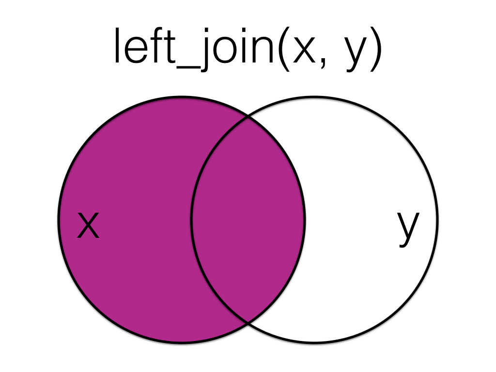

--- 
title: "Applied Data Skills"
subtitle: "Processing & Presenting Data"
author: "Emily Nordmann and Lisa DeBruine"
date: "`r Sys.Date()`"
site: bookdown::bookdown_site
documentclass: book
bibliography: [book.bib, packages.bib]
csl: include/apa.csl
link-citations: yes
description: |
  This book provides an overview of the basic skills needed to turn raw data into informative summaries and visualisations presented in professional reports, presentations, and dashboards. The book will introduce learners to R, a programming language that can help automate working with data. The book will cover importing and processing data from spreadsheets, producing data summaries of descriptive statistics in tables, creating beautiful and informative visualisations, and constructing reports, presentations, and dashboards that automatically update when the underlying data changes.
url: https://psyteachr.github.io/ads-v1
github-repo: psyteachr/ads-v1
cover-image: images/logos/logo
apple-touch-icon: images/logos/apple-touch-icon.png
apple-touch-icon-size: 180
favicon: images/logos/favicon.ico
---
```{r include=FALSE, cache=FALSE}
# psyTeachR styles and functions
# do not edit!!!!!

suppressPackageStartupMessages({
  library(tidyverse)
  library(glossary)
  library(patchwork)
})

# default knitr options
knitr::opts_chunk$set(
  echo       = TRUE,
  results    = "hold",
  out.width  = '100%',
  fig.width  = 8,
  fig.height = 5,
  fig.align  = 'center',
  dpi = 96
)

## set global theme options for figures
theme_set(theme_bw())


## set class for a chunk using class="className"
knitr::knit_hooks$set(class = function(before, options, envir) {
  if (before) {
    sprintf("<div class = '%s'>", options$class)
  } else {
    "</div>"
  }
})

## verbatim code chunks
knitr::knit_hooks$set(verbatim = function(before, options, envir) {
  if (before) {
    sprintf("<div class='verbatim'><pre class='sourceCode r'><code class='sourceCode R'>&#96;&#96;&#96;{%s}</code></pre>", options$verbatim)
  } else {
    "<pre class='sourceCode r'><code class='sourceCode R'>&#96;&#96;&#96;</code></pre></div>"
  }
})

## verbatim inline R in backticks
backtick <- function(code) {
  #warning("The backtick() function is deprecated. Use two backticks and a space to surround text with verbatim backticks, e.g. `` `in_backticks` ``")
  # removes inline math coding when you use >1 $ in a line
  code <- gsub("\\$", "\\\\$", code)
  paste0("<code>&#096;", code, "&#096;</code>")
}

## palette with psyTeachR logo colour
psyteachr_colours <- function(vals = 1:6) {
  ptrc <- c(
    "pink" = "#983E82",
    "orange" = "#E2A458",
    "yellow" = "#F5DC70",
    "green" = "#59935B",
    "blue" = "#467AAC",
    "purple" = "#61589C"
  )

  unname(ptrc[vals])
}
psyteachr_colors <- psyteachr_colours

# inline code highlighting and styles

hl <- function(code) {
  txt <- rlang::enexpr(code) %>% rlang::as_label()

  downlit::highlight(txt, classes = downlit::classes_pandoc()) %>%
    gsub("a href", "a target='_blank' href", .) %>%
    paste0("<code>", . , "</code>")
}

path <- function(txt) {
  sprintf("<code class='path'>%s</code>", txt)
}

pkg <- function(txt, url = NULL) {
  if (is.null(url)) {
    sprintf("<code class='package'>%s</code>", txt)
  } else {
    sprintf("<code class='package'><a href='%s' target='_blank'>%s</a></code>", url, txt)
  }
}
suppressPackageStartupMessages({
  library(webexercises)
})

knitr::knit_hooks$set(webex.hide = function(before, options, envir) {
  if (before) {
    if (is.character(options$webex.hide)) {
      hide(options$webex.hide)
    } else {
      hide()
    }
  } else {
    unhide()
  }
})
# book-specific code to include on every page

suppressPackageStartupMessages({
  library(kableExtra)
  # to get the function linking for tidyverse packages
  library(dplyr)
  library(tidyr)
  library(ggplot2)
  library(readr)
  library(tibble)
  library(stringr)
  library(purrr)
  library(forcats)
})
```

```{r cite-packages, include = FALSE}
# automatically create a bib database for R packages
# add any packages you want to cite here
knitr::write_bib(c(
  .packages(), 'bookdown', 'tidyverse', 'tinytex'
), 'packages.bib')

```

# Overview {-}

This book provides an overview of the basic skills needed to turn raw data into informative summaries and visualisations presented in professional reports, presentations, and dashboards. The book will introduce learners to R [@R-base], a programming language that can help automate working with data. The book will cover importing and processing data from spreadsheets, producing data summaries of descriptive statistics in tables, creating beautiful and informative visualisations, and constructing reports, presentations, and dashboards that automatically update when the underlying data changes.

<div class="small_right"></div>

By the end of this book, you will be able to use R to:

* clean and process data
* summarise data
* informatively visualise data
* create reusable report templates

## Structure of the course

This book accompanies a 10-week course, covering one chapter per week. Each chapter will introduce you to some new skills and concepts using concrete examples. At various points, there will be multiple-choice or fill-in-the-blank questions for you to check your understanding. Each chapter has accompanying walk-through videos, where an instructor demonstrates the skills covered in the chapter. Each chapter also has accompanying exercises that you should do to reinforce your learning.

## How to learn data skills

<div class="small_right"></div>

Learning data skills is kind of like having a gym membership (HT to [Phil McAleer](https://twitter.com/McAleerP) for the analogy). You'll be given state-of-the-art equipment to use and instructions for how to use them, but your data skills won't get any stronger unless you practice. 

<div class="small_left"></div>

Data skills do not require you to memorise lots of code. You will be introduced to many different functions, but the main skill to learn is how to efficiently find the information you need. This will require getting used to the structure of help files and [cheat sheets](https://www.rstudio.com/resources/cheatsheets/){target="_blank"}, learning how to Goggle your problem and choose a helpful solution, and learning how to read error messages.

<div class="small_right"></div>
     
Learning to code involves making a **lot** of mistakes. These mistakes are completely essential to the process, so try not to feel too frustrated. Many of the chapter exercises will give you broken code to fix so you get experience seeing what common errors look like. As you become a more experienced coder, you might not make fewer errors, but you'll recover from them much faster.


<!--chapter:end:index.Rmd-->

```{r include=FALSE, cache=FALSE}
# psyTeachR styles and functions
# do not edit!!!!!

suppressPackageStartupMessages({
  library(tidyverse)
  library(glossary)
  library(patchwork)
})

# default knitr options
knitr::opts_chunk$set(
  echo       = TRUE,
  results    = "hold",
  out.width  = '100%',
  fig.width  = 8,
  fig.height = 5,
  fig.align  = 'center',
  dpi = 96
)

## set global theme options for figures
theme_set(theme_bw())


## set class for a chunk using class="className"
knitr::knit_hooks$set(class = function(before, options, envir) {
  if (before) {
    sprintf("<div class = '%s'>", options$class)
  } else {
    "</div>"
  }
})

## verbatim code chunks
knitr::knit_hooks$set(verbatim = function(before, options, envir) {
  if (before) {
    sprintf("<div class='verbatim'><pre class='sourceCode r'><code class='sourceCode R'>&#96;&#96;&#96;{%s}</code></pre>", options$verbatim)
  } else {
    "<pre class='sourceCode r'><code class='sourceCode R'>&#96;&#96;&#96;</code></pre></div>"
  }
})

## verbatim inline R in backticks
backtick <- function(code) {
  #warning("The backtick() function is deprecated. Use two backticks and a space to surround text with verbatim backticks, e.g. `` `in_backticks` ``")
  # removes inline math coding when you use >1 $ in a line
  code <- gsub("\\$", "\\\\$", code)
  paste0("<code>&#096;", code, "&#096;</code>")
}

## palette with psyTeachR logo colour
psyteachr_colours <- function(vals = 1:6) {
  ptrc <- c(
    "pink" = "#983E82",
    "orange" = "#E2A458",
    "yellow" = "#F5DC70",
    "green" = "#59935B",
    "blue" = "#467AAC",
    "purple" = "#61589C"
  )

  unname(ptrc[vals])
}
psyteachr_colors <- psyteachr_colours

# inline code highlighting and styles

hl <- function(code) {
  txt <- rlang::enexpr(code) %>% rlang::as_label()

  downlit::highlight(txt, classes = downlit::classes_pandoc()) %>%
    gsub("a href", "a target='_blank' href", .) %>%
    paste0("<code>", . , "</code>")
}

path <- function(txt) {
  sprintf("<code class='path'>%s</code>", txt)
}

pkg <- function(txt, url = NULL) {
  if (is.null(url)) {
    sprintf("<code class='package'>%s</code>", txt)
  } else {
    sprintf("<code class='package'><a href='%s' target='_blank'>%s</a></code>", url, txt)
  }
}
suppressPackageStartupMessages({
  library(webexercises)
})

knitr::knit_hooks$set(webex.hide = function(before, options, envir) {
  if (before) {
    if (is.character(options$webex.hide)) {
      hide(options$webex.hide)
    } else {
      hide()
    }
  } else {
    unhide()
  }
})
# book-specific code to include on every page

suppressPackageStartupMessages({
  library(kableExtra)
  # to get the function linking for tidyverse packages
  library(dplyr)
  library(tidyr)
  library(ggplot2)
  library(readr)
  library(tibble)
  library(stringr)
  library(purrr)
  library(forcats)
})
```

```{r echo = FALSE}
set.seed(12042016)
```


# Intro to R and RStudio {#intro}

## Intended Learning Outcomes {#ilo-intro}

* Install R and RStudio
* Be able to install add-on packages
* Be able to get help for packages and functions
* Be able to create objects by writing and running code in the console

## Walkthrough video

There is a walkthrough video of this chapter available via Echo360. We recommend first trying to work through each section of the book on your own and then watching the video if you get stuck, or if you would like more information. This will feel slower than just starting with the video, but you will learn more in the long-run. 

## R and RStudio {#intro-r-rstudio}

R is a programming language that you will write code in and RStudio is an Integrated Development Environment (`r glossary("IDE")`) which makes working in  R easier. Think of it as knowing English and using a plain text editor like NotePad to write a book versus using a word processor like Microsoft Word. You could do it, but it would be much harder without things like spell-checking and formatting and you wouldn't be able to use some of the advanced features that Word has developed. In a similar way, you can use R without R Studio but we wouldn't recommend it. RStudio serves as a text editor, file manager, spreadsheet viewer, and more. The key thing to remember is that although you will do all of your work using RStudio for this course, you are actually using two pieces of software which means that from time-to-time, both of them may have separate updates.

## Installing R and RStudio {#intro-installing-r}

Appendix\ \@ref(installing-r) has technical details on installing R and RStudio on your computer. If you need any help installing R, please ask on Teams or attend office hours. Once you have installed R and RStudio come back to this chapter. If you already had R and/or RStudio installed, we recommend updating to the latest version before you work through this course. Appendix\ \@ref(appendix-updating-r) has more details on how to do that. Here, we'll concentrate on introducing you to RStudio's interface and getting it configured.

### RStudio {#rstudio_ide}

When you installed R, that gave your computer the ability to process the R programming language, and also installed an app called "R". We will never use that app. Instead, we will use [RStudio](http://www.rstudio.com){target="_blank"}.  RStudio is arranged with four window `r glossary("panes")`.

```{r img-rstudio, echo=FALSE, fig.cap="The RStudio IDE"}
knitr::include_graphics("images/intro/rstudio.png")
``` 

By default, the upper left pane is the **source pane**, where you view, write, and edit code from files and view data tables in a spreadsheet format. When you first open RStudio, this pane won't display until we open a document or load in some data - don't worry, we'll get to that soon.

The lower left pane is the **console pane**, where you can type in commands and view output messages. You can write code in the console to test it out, but it won't save anywhere. 

The right panes have several different tabs that show you information about your code. The most used tabs in the upper right pane are the **Environment** tab and the **Help** tab. The environment tab lists some information about the `r glossary("object", "objects")` that you have defined in your code. We'll learn more about the Help tab in Section\ \@ref(function-help). 

In the lower right pane, the most used tabs are the **Files** tab for directory structure, the **Plots** tab for plots made in a script, the **Packages** tab for managing add-on packages (see Section\ \@ref(packages)), and the **Viewer** tab to display reports created by your scripts. You can change the location of panes and what tabs are shown under **`Preferences > Pane Layout`**.

### Reproducibility {#intro-reproducibility}

In this class, you will be learning how to make `r glossary("reproducibility", "reproducible")` reports. This involves writing scripts that transform data, create summaries and visualisations, and embed them in a report in a way that always gives you the same results.

When you do things reproducibly, others (and future you) can understand and check your work. You can also reuse your work more easily. For example, if you need to create a report every month with the social media analytics for your company, a reproducible report allows you to download a new month's data and create the report within seconds. It might take a little longer to set up the report in the first instance with reproducible methods, but the time it saves you in the long run is invaluable.

::: {.try data-latex=""}
Appendix\ \@ref(rstudio-settings) shows you how to change two important settings in the global Options to increase reproducibility. Your settings should have:

* Restore .RData into workspace at startup: `r mcq(c("Checked", answer = "Not Checked"))`
* Save workspace to .RData on exit: `r mcq(c("Always", answer = "Never", "Ask"))`
:::

### Themes and accessiblilty

You can customise how R Studio looks to make it work for you. Click `Tools` - `Global Options` - `Appearance`. You can change the default font, font size, and general appearance of R Studio, including using dark mode. Play around with the settings and see what you prefer - you're going to spend a lot of time with R, it might as well look nice!


## Sessions {#intro-sessions}

If you have the above settings configured correctly, when you open up RStudio and start writing code, loading packages, and creating objects, you will be doing so in a new session and your Environment tab should be completely empty. If you find that your code isn't working and you can't figure out why, it might be worth restarting your R session. This will clear the environment and detach all loaded packages - think of it like restarting your phone. There are several ways that you can restart R:

* Menu: Session > Restart R
* <span class=\"apple\">Cmd-Shift-F10</span> or <span class=\"windows\">Ctl-Shift-F10</span>
* type `.rs.restartR()` in the console

Try doing each of these now. Additionally, now would be a good time to create a notebook where you can keep a record of useful hints and tips and things to try when your code isn't working. Add "restart R session" to this notebook as your first item. 

## Packages and functions {#packages}

When you install R you will have access to a range of functions including options for data wrangling and statistical analysis. The functions that are included in the default installation are typically referred to as `r glossary("base R")` and you can think of them like the default apps that come pre-loaded on your phone. 

One of the great things about R, however, is that it is **user extensible**: anyone can create a new add-on that extends its functionality. There are currently thousands of `r glossary("package", "packages")` that R users have created to solve many different kinds of problems, or just simply to have fun. For example, there are packages for data visualisation, machine learning, interactive dashboards, web scraping, and playing games such as Sudoku.

Add-on packages are not distributed with base R, but have to be downloaded and installed from an archive, in the same way that you would, for instance, download and install PokemonGo on your smartphone. The main repository where packages reside is called `r glossary("CRAN")`, the Comprehensive R Archive Network.

There is an important distinction between **installing** a package and **loading** a package.

### Installing a package {#install-package}

<div class="small_right"></div>

This is done using `r hl(install.packages())`. This is like installing an app on your phone: you only have to do it once and the app will remain installed until you remove it. For instance, if you want to use PokemonGo on your phone, you install it once from the App Store or Play Store; you don't have to re-install it each time you want to use it. Once you launch the app, it will run in the background until you close it or restart your phone. Likewise, when you install a package, the package will be available (but not *loaded*) every time you open up R.

Install the `r pkg("esquisse")` package on your system. This package lets you create plots interactively and copy the code needed to make them reproducibly.

```{r install-pckg, eval = FALSE}
# type this in the console pane
install.packages("esquisse")
```

If you don't already have packages like `r pkg("ggplot2")` and `r pkg("shiny")` installed, it will also install these **dependencies** for you. If you get a message that says something like `package ‘esquisse’ successfully unpacked and MD5 sums checked`, the installation was successful. 

::: {.dangerous data-latex=""}
Never install a package from inside a script. Only do this from the console pane.
:::

You can also install multiple packages at once. Here is the command to install all of the packages we'll be using in this class. This will take a while, so don't try this in the middle of a tutorial!

```{r install-all-packages, eval = FALSE}
install.packages(
  "tidyverse",      # for everything
  "rio",            # for data import
  "kableExtra",     # for nice tables
  "ggwordcloud",    # for word clouds
  "tidytext",       # for parsing text for word clouds
  "patchwork",      # for multi-part plots
  "ggthemes",       # for themed plots
  "glue",           # for text manipulation
  "flexdashboard"   # for dashboard presentations
)
```

### Loading a package

This is done using `r hl(library(package_name))`. This is like **launching** an app on your phone: the functionality is only there where the app is launched and remains there until you close the app or restart. For example, when you run `r hl(library(glue))` within a session, the functions in the package referred to by `glue` will be made available for your R session. The next time you start R, you will need to run `r hl(library(glue))` again if you want to access that package.

You can load the `r pkg("esquisse")` package for your current R session as follows:

```{r library-pckg}
library(esquisse)
```

You might get some red text when you load a package, this is normal. It is usually warning you that this package has functions that have the same name as other packages you've already loaded.

::: {.info data-latex=""}
You can use the convention `package::function()` to indicate in which add-on package a function resides. For instance, if you see `r hl(readr::read_csv())`, that refers to the function `r hl(read_csv())` in the `r pkg("readr")` add-on package. If the package is loaded using `library()`, you don't have to specify the package name before a function unless there is a conflict (e.g., you have two packages loaded that have a function with the same name).
:::

### Using a function

Now you can run the function `r hl(esquisser())`, which starts up an interactive plotting example.

```{r esquisser-demo, eval = FALSE}
# type this in the console pane and press enter
esquisser(data = ggplot2::diamonds)
```

::: {.warning data-latex=""}
If you see the error message: `Error in esquisser(data = ggplot2::diamonds) : could not find function "esquisser"`, that just means that you forgot to load the `r pkg("esquisse")` package using `library(esquisse)`. Either run the code to load the package first, or preface the function with the package name like `esquisse::esquisser()` to use it without loading the package.
:::

A `r glossary("function")` is a name that refers to some code you can reuse. We'll start by using functions that are provided for you in packages, but you can also write your own functions. After the function name, there is a pair of parentheses, which contain zero or more `r glossary("argument", "arguments")`. These are options that you can set. In the example above, the `data` argument is set to `ggplot2::diamonds`, which refers to a built-in dataset `diamonds` from the `r pkg("ggplot2")` package.

If you type a function into the console pane, it will run as soon as you hit enter. If you put the function in a `r glossary("script")` or `r glossary("R Markdown")` document in the `r glossary("panes", "source pane")`, it won't run until you run the script, `r glossary("knit")` the R Markdown file, or run a code `r glossary("chunk")`. You'll learn more about this in Chapter\ \@ref(reports).

### Tidyverse

`r pkg("tidyverse")`is a meta-package that loads several packages we'll be using in almost every chapter in this book:

- `r pkg("ggplot2")`, for data visualisation (Chapter\ \@ref(viz))
- `r pkg("readr")`, for data import (Chapter\ \@ref(data))
- `r pkg("tibble")`, for tables (Chapter\ \@ref(data))
- `r pkg("tidyr")`, for data tidying (Chapter\ \@ref(tidy))
- `r pkg("dplyr")`, for data manipulation (Chapter\ \@ref(wrangle))
- `r pkg("stringr")`, for `r glossary("string", "strings")`
- `r pkg("forcats")`, for `r glossary("factor", "factors")`
- `r pkg("purrr")`, for repeating things

When you install `r pkg("tidyverse")`, it also installs some other useful packages that you can load individually. You can get the full list using `tidyverse_packages()`, but the packages we'll be using in this book are:

- `r pkg("googlesheets4")`, for working with Google spreadsheets
- `r pkg("readxl")`, for Excel files
- `r pkg("lubridate")`, for working with dates
- `r pkg("hms")`, for working with times
- `r pkg("rvest")`, for web scraping

### Function Help

When you load the `r pkg("tidyverse")` it automatically loads all of the above packages, however, it can be helpful to know which package a function comes from if you need to Google it. If a `r glossary("function")` is in `r glossary("base R")` or a loaded package, you can type `?function_name` in the console to access the help file. At the top of the help it will give you the function and package name. 

If the package isn't loaded, use `?package_name::function_name` or specify the package in the `help()` function. When you aren't sure what package the function is in, use the shortcut `??function_name`.

```{r help, eval = FALSE}
# if the package is loaded
?esquisser
help("esquisser")

# works whether or not the package is loaded
?esquisse::esquisser
help("esquisser", package="esquisse") 

# shows a list of potentially matching functions
??esquisser
```

<div class="small_right" style="width: 50%; max-width: 400px;"></div>

Function help is always organised in the same way. For example, look at the help for `?glue::trim`. At the top, it tells you the name of the function and its package in curly brackets, then a short description of the function, followed by a longer description. The **Usage** section shows the function with all of its `r glossary("argument", "arguments")`. If any of those arguments have default values, they will be shown like `function(arg = default)`. The **Arguments** section lists each argument with an explanation. There may be a **Details** section after this with even more detail about the functions. The **Examples** section is last, and shows examples that you can run in your console window to see how the function works.


::: {.try data-latex=""}

* What is the first argument to the `mean` function? `r mcq(c("trim", "na.rm", "mean", answer="x"))`
* What package is `read_excel` in? `r mcq(c("readr", answer="readxl", "base", "stats"))`
:::


### Arguments

You can look up the arguments/options that a function has by using the help documentation. Some arguments are required, and some are optional. Optional arguments will often use a default (normally specified in the help documentation) if you do not enter any value.

As an example, look at the help documentation for the function `sample()` which randomly samples items from a list. 

```{r help-doc, eval=FALSE}
?sample
```

The help documentation for `sample()` should appear in the bottom right help panel. In the usage section, we see that `sample()` takes the following form:

```{r arguments, eval = FALSE}
sample(x, size, replace = FALSE, prob = NULL)
```

In the arguments section, there are explanations for each of the arguments. `x` is the list of items we want to choose from, `size` is the number of items we want to choose, `replace` is whether or not the chosen item should be "replaced" into the pool so that each item might be selected more than once, and `prob` gives the probability that each item is chosen. In the details section it notes that if no values are entered for `replace` or `prob` it will use defaults of `FALSE` (items can only be chosen once) and `NULL` (all items will have equal probability of being chosen). Because there is no default value for `x` or `size`, they must be specified otherwise the code won't run.

Let's try an example and just change the required arguments to `x` and `size` to ask R to choose 5 random letters (`letters` is a built-in `r glossary("vector")` of the 26 lower-case Latin letters). 

```{r, echo = FALSE}
# make sure values are the same
set.seed(1242016)
```

```{r rnorm-n}
sample(x = letters, size = 5)
```

`r hide("Why are my letters different to your letters?")`

`sample()` generates a random sample. Each time you run the code, you'll generate a different set of random letters (try it). The function `set.seed()` controls the random number generator - if you're using any functions that use randomness (such as `sample()`), running `set.seed()` will ensure that you get the same result (in many cases this may not be what you want to do). To get the same numbers we do, run `set.seed(1242016)` in the console, and then run `sample(x = letters, size = 5)` again.

`r unhide()`

Now we can change the default value for the `replace` argument to produce a set of letters that is allowed to have duplicates.

```{r}
set.seed(8675309)
sample(x = letters, size = 5, replace = TRUE)
```

This time R has still produced 5 random letters, but now this set of letters has two instances of "k". Always remember to use the help documentation to help you understand what arguments a function requires.

### Argument names

In the above examples, we have written out the argument names in our code (i.e., `x`, `size`, `replace`), however, this is not strictly necessary. The following two lines of code would both produce the same result (although each time you run `sample()` it will produce a slightly different result, because it's random, but they would still work the same):

```{r argument-names, eval = FALSE}

sample(x = letters, size = 5, replace = TRUE)
sample(letters, 5, TRUE)

```

Importantly, if you do not write out the argument names, R will use the default order of arguments. That is for `sample` it will assume that the first value you enter is `x`. the second value is `size` and the third value is `replace`. 

If you write out the argument names then you can write the arguments in whatever order you like:

```{r argument-order, eval = FALSE}

sample(size = 5, replace = TRUE, x = letters)

```

When you are first learning R, you may find it useful to write out the argument names as it can help you remember and understand what each part of the function is doing. However, as your skills progress you may find it quicker to omit the argument names and you will also see examples of code online that do not use argument names, so it is important to be able to understand which argument each bit of code is referring to (or look up the help documentation to check).

In this course, we will always write out the argument names the first time we use each function. However, in subsequent uses they may be omitted.

### Tab auto-complete

One very useful feature of R Studio is  tab auto-complete for functions (see Figure \@ref(fig:img-autocomplete)). If you write the name of the function and then press the tab key, R Studio will show you the arguments that function takes along with a brief description. If you press enter on the argument name it will fill in the name for you, just like auto-complete on your phone. This is incredibly useful when you are first learning R and you should remember to use this feature frequently. 

```{r img-autocomplete, echo=FALSE, fig.cap="Tab auto-complete"}

knitr::include_graphics("images/intro/autocomplete.png")

```

## Objects

A large part of your coding will involve creating and manipulating objects. Objects contain stuff. That stuff can be numbers, words, or the result of operations and analyses. You assign content to an object using `<-`.

Run the following code in the console, but change the values of `name` and `age` to your own details and change `christmas` to a holiday or date you care about.

```{r objects}
name <- "Emily"
age <- 36
today <- Sys.Date()
christmas <- as.Date("2022-12-25")
```

You'll see that four objects now appear in the environment pane:

* `name` is `r glossary("character")` (text) data. In order for R to recognise it as character data, it **must** be enclosed in double quotation marks `" "`.
* `age` is `r glossary("numeric")` data. In order for R to recognise this as a number, it **must not** be enclosed in quotation marks.
* `today` stores the result of the function `Sys.Date()`. This function returns your computer system's date. Unlike `name` and `age`, which are hard-coded (i.e., they will always return the values you enter), the contents of the object `today` will change dynamically with the date. That is, if you run that function tomorrow, it will update the date to tomorrow's date.
* `christmas` is also a date but it's hard-coded as a very specific date. It's wrapped within the `as.Date()` function that tells R to interpret the character string you provide as date rather than text.

::: {.try data-latex=""}

To print the contents of an object, type the object's name in the console and press enter. Try printing all four objects now.

:::

Finally, a key concept to understand is that objects can interact and you can save the results of those interactions in new object. Edit and run the following code to create these new objects, and then print the contents of each new object. 

```{r intro-objects}
decade <- age + 10
full_name <- paste(name, "Nordmann")
how_long <- christmas - today
```


## Getting help {#help}

You will feel like you need a *lot* of help when you're starting to learn. This won't really go away; it's impossible to memorise everything. The goal is to learn enough about the structure of R that you can look things up quickly. This is why we'll introduce specialised jargon in the glossary for each chapter; it's easier to google "convert `r glossary("character")` to `r glossary("numeric")` in R" than "make numbers in quotes be actual numbers not words". In addition to the function help described above, here's some additional resources you should use often.

### Package reference manuals

Start up help in a browser by entering `help.start()` in the console. Click on "Packages" under "Reference" to see a list of packages. Scroll down to the `readxl` package and click on it to see a list of the functions that are available in that package. 


### Googling

If the function help doesn't help, or you're not even sure what function you need, try Googling your question. It will take some practice to be able to use the right jargon in your search terms to get what you want. It helps to put "R" or "tidyverse" in the search text, or the name of the relevant package, like `r pkg("ggplot2")`. 

### Vignettes

Many packages, especially [tidyverse](https://www.tidyverse.org/packages/){target="_blank"} ones, have helpful websites with vignettes explaining how to use their functions. Some of the vignettes are also available inside R. You can access them from a package's help page or with the `vignette()` function.

```{r, eval = FALSE}
# opens a list of available vignettes
vignette(package = "ggplot2")

# opens a specific vignette in the Help pane
vignette("ggplot2-specs", package = "ggplot2")
```


## Glossary {#glossary-intro}

`r glossary_table()`

## Further Resources {#resources-intro}

* [RStudio IDE Cheatsheet](https://github.com/rstudio/cheatsheets/raw/master/rstudio-ide.pdf)
* [RStudio Cloud](https://rstudio.cloud/){target="_blank"}


<!--chapter:end:01-intro.Rmd-->

```{r include=FALSE, cache=FALSE}
# psyTeachR styles and functions
# do not edit!!!!!

suppressPackageStartupMessages({
  library(tidyverse)
  library(glossary)
  library(patchwork)
})

# default knitr options
knitr::opts_chunk$set(
  echo       = TRUE,
  results    = "hold",
  out.width  = '100%',
  fig.width  = 8,
  fig.height = 5,
  fig.align  = 'center',
  dpi = 96
)

## set global theme options for figures
theme_set(theme_bw())


## set class for a chunk using class="className"
knitr::knit_hooks$set(class = function(before, options, envir) {
  if (before) {
    sprintf("<div class = '%s'>", options$class)
  } else {
    "</div>"
  }
})

## verbatim code chunks
knitr::knit_hooks$set(verbatim = function(before, options, envir) {
  if (before) {
    sprintf("<div class='verbatim'><pre class='sourceCode r'><code class='sourceCode R'>&#96;&#96;&#96;{%s}</code></pre>", options$verbatim)
  } else {
    "<pre class='sourceCode r'><code class='sourceCode R'>&#96;&#96;&#96;</code></pre></div>"
  }
})

## verbatim inline R in backticks
backtick <- function(code) {
  #warning("The backtick() function is deprecated. Use two backticks and a space to surround text with verbatim backticks, e.g. `` `in_backticks` ``")
  # removes inline math coding when you use >1 $ in a line
  code <- gsub("\\$", "\\\\$", code)
  paste0("<code>&#096;", code, "&#096;</code>")
}

## palette with psyTeachR logo colour
psyteachr_colours <- function(vals = 1:6) {
  ptrc <- c(
    "pink" = "#983E82",
    "orange" = "#E2A458",
    "yellow" = "#F5DC70",
    "green" = "#59935B",
    "blue" = "#467AAC",
    "purple" = "#61589C"
  )

  unname(ptrc[vals])
}
psyteachr_colors <- psyteachr_colours

# inline code highlighting and styles

hl <- function(code) {
  txt <- rlang::enexpr(code) %>% rlang::as_label()

  downlit::highlight(txt, classes = downlit::classes_pandoc()) %>%
    gsub("a href", "a target='_blank' href", .) %>%
    paste0("<code>", . , "</code>")
}

path <- function(txt) {
  sprintf("<code class='path'>%s</code>", txt)
}

pkg <- function(txt, url = NULL) {
  if (is.null(url)) {
    sprintf("<code class='package'>%s</code>", txt)
  } else {
    sprintf("<code class='package'><a href='%s' target='_blank'>%s</a></code>", url, txt)
  }
}
suppressPackageStartupMessages({
  library(webexercises)
})

knitr::knit_hooks$set(webex.hide = function(before, options, envir) {
  if (before) {
    if (is.character(options$webex.hide)) {
      hide(options$webex.hide)
    } else {
      hide()
    }
  } else {
    unhide()
  }
})
# book-specific code to include on every page

suppressPackageStartupMessages({
  library(kableExtra)
  # to get the function linking for tidyverse packages
  library(dplyr)
  library(tidyr)
  library(ggplot2)
  library(readr)
  library(tibble)
  library(stringr)
  library(purrr)
  library(forcats)
})
```
# Reports with R Markdown {#reports}

## Intended Learning Outcomes {#ilo-reports}

-   Be able to structure a project
-   Be able to knit a simple reproducible report with R Markdown
-   Be able to create code chunks, tables, images, and inline R in an R Markdown document

For reference, here are the packages we will use in this chapter.

```{r setup-reports, message=FALSE}
library(tidyverse)  # various data manipulation functions
library(knitr)      # for rendering a report from a script
library(kableExtra) # for styling tables
```

## Organising a project {#projects}

Before we write any code, first, we need to get organised. `r glossary("project", "Projects")` in RStudio are a way to group all the files you need for one project. Most projects include scripts, data files, and output files like the PDF report created by the script or images.

First, make a new folder on your computer where you will keep all of your materials for this class, we'd suggest renaming it something like `ADS-22`. The folder that R will look in by default to find and save files is known as the `r glossary("working directory")`. You can set the working directory manually to the folder you want to work in with menu commands:

-   **`Session > Set Working Directory > Choose Directory...`**

However, there's a better way of organising your files by using Projects in RStudio.

### Start a Project {#project-start}

To create a new project for the work we'll do in this chapter:

-   **`File > New Project...`**
-   Name the project `r path("02-reports")`
-   Save it inside the directory you just made.

RStudio will restart itself and open with this new project directory as the working directory.

```{r, echo = FALSE, fig.cap="Starting a new project.", fig.show="hold", out.width = "32%"}
include_graphics(c("images/reports/new_proj_1.png",
                   "images/reports/new_proj_2.png",
                   "images/reports/new_proj_3.png"))
```

Click on the Files tab in the lower right pane to see the contents of the project directory. You will see a file called `02-reports.Rproj`, which is a file that contains all of the project information. You can double-click on it to open up the project.

::: {.info data-latex=""}
Depending on your settings, you may also see a directory called `.Rproj.user`, which contains your specific user settings. You can ignore this and other "invisible" files that start with a full stop.
:::

### Naming Things {#naming}

Before we start creating new files, it's important to review how to name your files. This might seem a bit pedantic, but following clear naming rules so that both people and computers can easily find things will make your life much easier in the long run. Here are some important principles:

-   file and directory names should only contain letters, numbers, dashes, and underscores, with a full stop (`.`) between the file name and `r glossary("extension")` (that means no spaces!)
-   be consistent with capitalisation (set a rule to make it easy to remember, like always use lowercase)
-   use underscores (`_`) to separate parts of the file name, like the title and date, and dashes (`-`) to separate words in each part (e.g., `social-media-report_2021-10.Rmd`)
-   name files with a pattern that alphabetises in a sensible order and makes it easy for you to find the file you're looking for
-   prefix a file name with an underscore to move it to the top of the list, or prefix all files with numbers to control their order

For example, these file names are a mess:

-   `r path("report.doc")`
-   `r path("report final.doc")`
-   `r path("Data (Customers) 11-15.xls")`
-   `r path("Customers Data Nov 12.xls")`
-   `r path("final report2.doc")`
-   `r path("project notes.txt")`
-   `r path("Vendor Data November 15.xls")`

Here is one way to structure them so that similar files have the same structure and it's easy for a human to scan the list or to use code to find relevant files. See if you can figure out what the last one should be.

-   `r path("_project-notes.txt")`
-   `r path("report_v1.doc")`
-   `r path("report_v2.doc")`
-   `r path("report_v3.doc")`
-   `r path("data_customer_2021-11-12.xls")`
-   `r path("data_customer_2021-11-15.xls")`
-   `r mcq(c("vendor-data_2021-11-15.xls", "data-vendor-2021_11_15.xls", answer = "data_vendor_2021-11-15.xls", "data_2021-11-15_vendor.xls"))`

::: {.try data-latex=""}
Think of other ways to name the files above. Look at some of your own project files and see what you can improve.
:::

## R Markdown {#rmarkdown}

Throughout this course we will use `r glossary("R Markdown")` to create reproducible reports with a table of contents, text, tables, images, and code. The text can be written using `r glossary("markdown")`, which is a way to specify formatting, such as headers, paragraphs, lists, bolding, and links.

To open a new R Markdown document click:

-   **`File > New File > R Markdown`**

You will be prompted to give it a title; call the document `Important Info`. You can also change the author name. Keep the output format as HTML.

Once you've opened a new document be sure to save it by clicking **`File > Save As...`**. You should name this file `important_info` (if you are on a Mac and can see the file `r glossary("extension")`, name it `important_info.Rmd`). This file will automatically be saved in your project folder, i.e., your working directory, so you should now see this file appear in your file viewer pane.

### Using R Markdown for the first time {#code-chunks}

When you first open a new R Markdown document you will see a bunch of welcome text that looks like this:

```{r img-markdown-default, echo=FALSE, fig.cap="New R Markdown text"}

knitr::include_graphics("images/reports/markdown-default.png")

```

Do the following steps:

-   Delete **everything** from line 12 onwards
-   On line 12 type "## My info" (with the hashtags but without the quotation marks)\
-   Click the insert new code menu (a green box with a C and a plus sign) then **`R`**

Your Markdown document should now look something like this:

```{r img-new-chunk, echo=FALSE, fig.cap="New R chunk"}

knitr::include_graphics("images/reports/new-chunk.png")

```

What you have created is a subtitle and a **code chunk**. In R Markdown, anything written in the white space is regarded as normal text, and anything written in a grey code chunk is assumed to be code (the actual colours will depend on which theme you have applied but we will refer to the default white and grey). This makes it easy to combine both text and code in one document.

::: {.dangerous data-latex=""}
When you create a new code chunk you should notice that the grey box starts and ends with three back ticks \`\`\`. One common mistake is to accidentally delete these back ticks. Remember, code chunks are grey and text entry is white - if the colour of certain parts of your Markdown doesn't look right, check that you haven't deleted the back ticks.
:::

### Writing code in R Markdown

In your code chunk, write the code you created in Chapter  \@ref(objects).

```{r}
name <- "Emily"
age <- 36
today <- Sys.Date()
christmas <- as.Date("2022-12-25")
```

### Running code in R Markdown

When you're working in an R Markdown document, there are several ways to run your lines of code.

First, you can highlight the code you want to run and then click `Run` -> `Run Selected Line(s)`, however this is tedious and can cause problems if you don't highlight *exactly* the code you want to run.

```{r img-run1, echo=FALSE, fig.cap="Tedious method of running code"}

knitr::include_graphics("images/reports/run1.gif")

```

Alternatively, you can press the green "play" button at the top-right of the code chunk and this will run **all** lines of code in that chunk.

```{r img-run2, echo=FALSE, fig.cap="Slightly better method of running code"}

knitr::include_graphics("images/reports/run2.gif")

```

Even better is to learn some of the keyboard short cuts for R Studio. To run a single line of code, make sure that the cursor is in the line of code you want to run (it can be anywhere) and press `ctrl + enter` or `Cmd + enter` if you're on a Mac. If you want to run all of the code in the code chunk, press `ctrl/cmd + shift + enter`. Learn these short cuts, they will make your life easier!

Run your code using each of the methods above. You should see the variables `name`, `age`, `today`, and `christmas` appear in the environment pane.

### Inline code {#rmd-inline-r }

We keep talking about using R Markdown for reproducible reports but it's easier to show you than tell you why this is so powerful and to give you an insight into how this course will (hopefully!) change the way you work with data forever!

One important feature of R Markdown is that you can combine text and code to insert values into your writing using **inline coding**. If you've ever had to copy and paste a value or text from one file to another, you'll know how easy it can be to make mistakes. Inline code avoids this. Again it's easier to show you what inline code does rather than to explain it so let's have a go.

First, copy and paste this text to the **white space underneath** your code chunk. If you used a different variable name than `christmas` you should update this with the name of the object you created, but otherwise don't change anything else.

```{r, eval = FALSE}
My name is `r name` and I am `r age` years old. 
It is `r christmas - today` days until Christmas, 
which is my favourite holiday.
```

### Knitting your file {#rmd-knit}

Now we are going to `r glossary("knit")`, or compile, the file into a document type of our choosing. In this case we'll create a default html file, but you will learn how to create other files like Word and PDF throughout this course. To knit your file click:

-   **`Knit > Knit to HMTL`**

R Markdown will create and display a new HTML document, but it will also automatically save this file in your working directory.

As if by magic, that slightly odd bit of text you copied and pasted now appears as a normal sentence with the values pulled in from the objects you created.

**My name is `r name` and I am `r age` years old. It is `r christmas - today` days until Christmas, which is my favourite holiday.**

::: {.info data-latex=""}
You can also type the following code into the console. Never put this in an Rmd script itself, or it will try to knit itself in an infinite loop.

```{r, eval = FALSE}
knitr::knit2html("important_info.Rmd")
```
:::

## Loading data

Now let's try another example of using Markdown but this time rather than using objects we have created from scratch, we will read in a data file.

Save and close your `important_info.Rmd` document. Then open and save a new Markdown document, this time named `sales_data.Rmd`. You can again get rid of everything from line 12 onwards.

### Loading data from an online source {#loading-online}

First, let's try loading data that is stored online. Create a code chunk in your document and copy, paste, and run the below code. This code loads some simulated sales data.

-   The data is stored in a `.csv` file so we're going to use the `readr::read_csv()` function to load it in.
-   The package `readr` is part of the `tidyverse` that you installed in Chapter\ \@ref(intro) and we load this package with `library()`\
-   Note that the url is contained within double quotation marks - it won't work without this.

```{r, message=FALSE}
# Data from https://www.kaggle.com/kyanyoga/sample-sales-data
library(tidyverse)
sales_online <- readr::read_csv("https://psyteachr.github.io/ads-v1/data/sales_data_sample.csv")
```

This dataset is simulated sales data for different types of vehicles where each line of data is a single order. There are multiple ways to view and check a dataset in R. Do each of the following and make a note of what information each approach seems to give you. If you'd like more information about each of these functions, you can look up the help documentation with `?function`:

-   Click on the `sales_online` object in the environment pane
-   Run `head(sales_online)` in the console
-   Run `summary(sales_online)` in the console
-   Run `str(sales_online)` in the console
-   Run `View(sales_online)` in the console

### Loading data from your computer

More commonly, you will be working from data files that are stored locally on your computer. But where should you put all of your files? You usually want to have all your scripts and data files for a single project inside one folder on your computer, the `r glossary("working directory")`, and we have already set up the main directory `r path("02-reports")`for this chapter.

But you can also organise files in subdirectories inside this main project directory, such as putting all raw data files in a directory called `r path("data")` and saving any image files to a directory called `r path("images")`. Using subdirectories helps avoid one single folder becoming too cluttered, which is important if you're working on big projects.

::: {.try data-latex=""}
In your `r path("02-reports")` directory, create a new folder named `r path("data")`, then, [download a copy of the sales data file](https://psyteachr.github.io/ads-v1/data/sales_data_sample.csv) and save it in this new subdirectory.
:::

To load in data from a local file, again we can use the `read_csv()` function but this time rather than specifying a url, give it the subdirectory and file name.

```{r read-csv, eval = FALSE}
sales_local <- read_csv("data/sales_data_sample.csv") 
```

Things to note:

-   You must include the file extension (in this case `.csv`)
-   The subdirectory folder name (`data`) and the file name are separated by a forward slash `/`
-   Precision is important, if you have a typo in the file name it won't be able to find your file; remember that R is case sensitive - `Sales_Data.csv` is a completely different file to `sales_data.csv` as far as R is concerned.

::: {.try data-latex=""}
Run `head()`, `summary()`, `str()`, and `View()` on `sales_local` to confirm that the data is the same as `sales_online`.
:::

## Writing a report

We're going to write a basic report for this sales dataset using R Markdown to show you some of the features. We'll be expanding on almost every bit of what we're about to show you throughout this course; the most important outcome is that you start to get comfortable with how R Markdown works and what you can use it to do. 

### Data analysis

For this report we're just going to present some simple sales stats for three types of vehicles: planes, motorcycles, and classic cars. We'll come back to how to write this kind of code yourself in Chapter\ \@ref(#summary). For now, see if you can follow the logic of what the code is doing via the code comments.

Create a new code chunk, then copy, paste and run the following code and then view `sales_counts` by clicking on the object in the environment pane.

```{r sales_counts}
# start with the sale_online data and then
sales_counts <- sales_online %>% 
  # keep only the data from planes, motorcycles, and cars and then
  filter(PRODUCTLINE %in% c("Planes", "Motorcycles", "Classic Cars")) %>% 
  # group it by type of vehicle and then
  group_by(PRODUCTLINE) %>% 
  # count how many are in each group
  count() 
```

Because each row of the dataset is a sale, this code gives us a nice and easy way of seeing how many sales were made of each type of vehicle; it just counts the number of rows in each group.

```{r sales_counts_show, echo = FALSE}
sales_counts %>%
  knitr::kable(align = "c")
```

### Text formatting {#markdown}

You can use the visual `r glossary("markdown")` editor if you have RStudio version 1.4 or higher. This will be a button at the top of the source pane with a pen tip and the menu options should be very familiar to anyone who has worked with software like Microsoft Word.

```{r visual-editor, echo = FALSE, fig.cap="The visual editor."}
include_graphics("images/reports/visual-editor.png")
```

This is useful for complex styling, but you can also use these common plain-text style markups:

-   Headers are created by prefacing subtitles with one or more hashes (`#`) and a space (do not exclude the space). If you include a table of contents, this will be created from your document headers.
-   Format text with *italics* or **bold** by surrounding the text with one or two asterisks or underscores.
-   Make lists using numbers, asterisks or dashes before items. Indent items to make nested lists.
-   Make links like this: `[psyTeachR](https://psyteachr.github.io/)`
-   Download the [R Markdown Cheat Sheet](http://www.rstudio.com/wp-content/uploads/2016/03/rmarkdown-cheatsheet-2.0.pdf) to learn more.

Copy and paste the below text into the white space below the code chunk that loads in the data. Save the file and then click knit to view the results. It will look a bit messy for now as it contains the code and messages from loading the data but don't worry, we'll get rid of that soon.

```{r, echo = FALSE, results='asis'}
cat('<pre><code>## Sample sales report

This report summarises the sales data for different types of vehicles sold between 2003 and 2005. Thie data is from [Kaggle](https://www.kaggle.com/kyanyoga/sample-sales-data).

### Sales by type

The *total* number of **planes** sold was `r sales_counts$n[3]`

The *total* number of **classic cars** sold was `r sales_counts$n[1]`.</code></pre>')
```


Try and match up the inline code with what is in the `sales_counts` table. Of note:

* The `$` sign is used to indicate specific variables (or columns)  in an object using the `object$variable` syntax. 
* Square brackets with a number e.g., `[3]` indicate a particular observation
* So `sales_counts$n[3]` asks the inline code to display the third observation of the variable `n` in the dataset `sales_online`.

::: {.try data-latex=""}
Add another line that reports the total numbers of **motorcycles** using inline code. Using either the visual editor or text markups, add in bold and italics so that it matches the others.
:::

```{r, webex.hide = TRUE, echo = FALSE, results='asis'}
cat("<pre><code>The *total* number of **motorcycles** sold was `r sales_counts$n[2]`.</code></pre>")
```

### Code comments {#comments}

In the above code we've used code **comments** and it's important to highlight how useful these are. You can add comments inside R chunks with the hash symbol (`#`). R will ignore characters from the hash to the end of the line.

```{r}
# important numbers

n <- nrow(sales_online) # the total number of sales (number of rows)
first <- min(sales_online$YEAR_ID) # the first (minimum) year in the table
last <- max(sales_online$YEAR_ID) # the last (maximum) year in the table
```

It's usually good practice to start a code chunk with a comment that explains what you're doing there, especially if the code is not explained in the text of the report.

If you name your objects clearly, you often don't need to add clarifying comments. For example, if I'd named the three objects above `total_number_of_sales`, `first_year` and `last_year`, I would omit the comments. It's a bit of an art to comment your code well but try to add comments as you're working through this book - it will help consolidate your learning and when future you comes to review your code, you'll thank past you for being so clear.

### Images {#rmd-images}

As the saying goes, a picture paints a thousand words and sometimes you will want to communicate your data using visualisations. 

Create a code chunk to display a graph of the data in your document after the text we've written so far. We'll use some code that you'll learn more about in Chapter\ \@ref(viz) to make a simple bar chart that represents the sales data -  focus on trying to follow how bits of the code map on to the plot that is created.

Copy and paste the below code. Run the code in your Markdown to see the plot it creates and then knit the file to see how it is displayed in your document. Notice how the figure caption is formatted in the chunk options.

```{r, eval = FALSE, verbatim = "r, fig.cap= \"Sales visualisation\""}
ggplot(data = sales_counts, 
       mapping = aes(x = PRODUCTLINE, y = n, fill = PRODUCTLINE)) +
  geom_bar(stat = "identity", show.legend = FALSE) +
  labs(x = "Type of vehicle",
       y = "Number of sales",
       title = "Sales by vehicle type",
       subtitle = "2003 - 2005")
```

```{r, echo = FALSE, fig.cap= "Sales visualisation"}
ggplot(data = sales_counts, 
       mapping = aes(x = PRODUCTLINE, y = n, fill = PRODUCTLINE)) +
  geom_bar(stat = "identity", show.legend = FALSE) +
  labs(x = "Type of vehicle",
       y = "Number of sales",
       title = "Sales by vehicle type",
       subtitle = "2003 - 2005")
```

You can also include images that you did not create in R using the markdown syntax for images. This is very similar to loading data in that you can either use an image that is stored on your computer, or via a url using `knitr::include_graphics()`.

Create a new code chunk underneath each of the sales figures for planes, classic cars, and motorcycles and add in an image from Google for each (right click on an image and select copy image address to get a url). We will resize them in the final section of this chapter.

```{r eval = FALSE}
knitr::include_graphics("https://cdn.britannica.com/q:60/69/155469-131-14083F59/airplane-flight.jpg")
```

### Tables {#rmd-tables}

Rather than a figure, we might want to display our data in a table. 

* Add a new level 2 heading (two hashtags) to your document, name the heading "Data in table form" and then create a new code chunk below this. 

First, let's see what the table looks like if we don't make any edits. Simply write the name of the table you want to display in the code chunk (in our case `sales_counts`) and then click knit to see what it looks like.

```{r, eval = FALSE}
sales_counts
```

```
## # A tibble: 3 × 2
## # Groups:   PRODUCTLINE [3]
##   PRODUCTLINE      n
##   <chr>        <int>
## 1 Classic Cars   967
## 2 Motorcycles    331
## 3 Planes         306
```

It's just about readable but it's not great. To customise tables we're going to use the function `kable()` from the `kableExtra` package.

Amend your code to load the `kableExtra` package and apply the `kable()` function to the table. Once you've done this, knit the file again to see the output.

```{r}
library(kableExtra) # load the package
sales_counts %>% # start with the sales_count table and then
  kable() # apply the kable function
```

It's better, but it's still not amazing. So let's make a few adjustments. We can change the names of the columns, add a caption, and also change the alignment of the cell contents using arguments to `kable()`. 

We can also add a theme which changes the overall style. In this example we've used `kable_classic` but there are 5 others: `kable_paper`, `kable_classic_2`, `kable_minimal`, `kable_material` and `kable_material_dark`. Try them all and see which one you prefer.

Finally, we can change the formatting of the first row using `row_spec`. Look up the help documentation for `row_spec` to see what other options are available.

```{r}
sales_counts %>%
  kable(col.names = c("Product", "Sales"),
      caption = "Number of sales per product line.", 
      align = "c") %>% #try changing this to l or r
  kable_classic(full_width = FALSE) %>% # try changing this to true
  row_spec(row = 0, bold = TRUE, color = "red") # try changing these values
```

If you're feeling confident with what we have covered so far, the [kableExtra vignette](https://haozhu233.github.io/kableExtra/awesome_table_in_html.html){target="_blank"} gives a lot more detail on how you can edit your tables using `kableExtra`. 

## Refining your report

### Adjusting the default setup {#rmd-setup}

Let's finish by tidying up the report and organising our code a bit better. When you create a new R Markdown file in RStudio, a setup chunk is automatically created - we've ignored this chunk until now.

```{r knitr-setup, eval=FALSE, verbatim="r setup, include=FALSE"}
knitr::opts_chunk$set(echo = TRUE)
```

You can set more default options for your document here. Type `str(knitr::opts_chunk$get())` into the console to see the full list of options that you can set and their default values, however, the most useful and common options to change for the purposes of writing reports revolve around whether you want to show your code and the size of your images.

Replace the code in your setup chunk with the below code and then try changing each option from `FALSE` to `TRUE` and changing the numeric values then knit the file again to see the difference it makes. To note:

* `fig.width` and `fig.height` only control the size of images generated by R, i.e., plots.
* `out.width` controls the size of both existing images and figures generated by R.

```{r knitr-setup2, eval=FALSE, verbatim="r setup, include=FALSE"}
knitr::opts_chunk$set(
  echo       = FALSE,     # whether to show code chunks
  message    = FALSE,     # whether to show messages from your code
  warning    = FALSE,     # whether to show warnings from your code
  fig.width  = 8,         # figure width in inches (at 96 dpi)
  fig.height = 5,         # figure height in inches (at 96 dpi)
  out.width = "50%"      # figures/images should take up 100% of the page width
)
```

These setup options change the behaviour for the entire document, however, you can override the behaviour for individual code chunks. 

For example, by default you might want to hide your code but there might be an occasion where you want to show the code you used to analyse your data. You can set `echo = FALSE` in your setup chunk to make hiding code the default but in the individual code chunk for your plot set `echo = TRUE`. Try this now and knit the file to see the results.

```{r show_code, eval=FALSE, verbatim = "r, echo = TRUE"}
ggplot(data = sales_counts, 
       mapping = aes(x = PRODUCTLINE, y = n, fill = PRODUCTLINE)) +
  geom_bar(stat = "identity", show.legend = FALSE) +
  labs(x = "Type of vehicle",
       y = "Number of sales",
       title = "Sales by vehicle type",
       subtitle = "2003 - 2005")
```

Additionally, you can also override the default image size.

```{r change_image, eval = FALSE, verbatim = "r, out.width='25%'"}
knitr::include_graphics("https://cdn.britannica.com/q:60/69/155469-131-14083F59/airplane-flight.jpg")
```

```{r change_image2, eval=FALSE, verbatim = "r, fig.width = 10, fig.height = 20"}
ggplot(data = sales_counts, 
       mapping = aes(x = PRODUCTLINE, y = n, fill = PRODUCTLINE)) +
  geom_bar(stat = "identity", show.legend = FALSE) +
  labs(x = "Type of vehicle",
       y = "Number of sales",
       title = "Sales by vehicle type",
       subtitle = "2003 - 2005")
```

You can also add the packages you need in your setup chunk using `r hl(library())`. Often when you are working on a script, you will realize that you need to load another add-on package. Don't bury the call to `r hl(library(package_I_need))` way down in the script. Put it in the top, so the user has an overview of what packages are needed.

::: {.try data-latex=""}
Move the code that loads the `tidyverse` and `kableExtra` to the setup chunk.
:::

### YAML Header {#yaml}

Finally, the `r glossary("YAML")` header is the bit at the very top of your Markdown document and you can set several options here as well. 

    ---
    title: "Sales Data Report"
    author: "Your name"
    output:
      html_document:
        df_print: kable
        theme: 
          version: 4
          bootswatch: yeti
        toc: true
        toc_float:
          collapsed: false
          smooth_scroll: false
        toc_depth: 3
        number_sections: false
    ---

::: {.info data-latex=""}
Try changing the values from `false` to `true` to see what the options do.
:::

The `df_print: kable` option prints data frames using `knitr::kable` automatically. 

The built-in bootswatch themes are: default, cerulean, cosmo, darkly, flatly, journal, lumen, paper, readable, sandstone, simplex, spacelab, united, and yeti. You can [view and download more themes](https://bootswatch.com/4/). Try changing the theme to see which one you like best.

```{r img-bootswatch, echo=FALSE, fig.cap="Light themes in versions 3 and 4."}
knitr::include_graphics("images/reports/bootswatch.png")
```

::: {.warning data-latex=""}
YAML headers can be very picky about spaces and semicolons (the rest of R Markdown is much more forgiving). For example, if you put a space before "author", you will get an error that looks like:

```
Error in yaml::yaml.load(..., eval.expr = TRUE) : 
  Parser error: while parsing a block mapping at line 1, column 1 did not find expected key at line 2, column 2
```

The error message will tell you exactly where the problem is (the second character of the second line of the YAML header), and it's usually a matter of fixing typos or making sure that the indenting is exactly right.
:::

## Chapter summary

This chapter covered a lot but hopefully now you have a much better idea of what Markdown is able to do. Whilst working in Markdown takes longer in the initial set-up stage, once you have a fully reproducible report you can plug in new data each week or month and simply click knit, reducing duplication of effort, and the human error that comes with it.

As you continue to work through the book you will learn how to wrangle and analyse your data and how to use Markdown to present it. We'll slowly build on the available customisation options so over the course of next few weeks, you'll find your Markdown reports start to look more polished and professional.

## Glossary {#glossary-reports}

`r glossary_table()`

## Further Resources {#resources-reports}

-   [R Markdown Cheat Sheet](https://www.rstudio.org/links/r_markdown_cheat_sheet)
-   [kableExtra](https://haozhu233.github.io/kableExtra/awesome_table_in_html.html)
-   [R Markdown reference Guide](https://www.rstudio.com/wp-content/uploads/2015/03/rmarkdown-reference.pdf)
-   [R Markdown Tutorial](https://rmarkdown.rstudio.com/lesson-1.html)
-   [R Markdown: The Definitive Guide](https://bookdown.org/yihui/rmarkdown/) by Yihui Xie, J. J. Allaire, & Garrett Grolemund
-   [Chapter 27: R Markdown](https://r4ds.had.co.nz/r-markdown.html) of *R for Data Science*
-   [Project Structure](https://slides.djnavarro.net/project-structure/) by Danielle Navarro
-   [How to name files](https://speakerdeck.com/jennybc/how-to-name-files) by Jenny Bryan

## Exercises {#exercises-reports}

Below are some additional exercises that will let you apply what you have learned in this chapter. We would suggest taking a break before you do these - it might feel slightly more effortful but spreading out your practice will help you learn more in the long run.

### New project {#exercises-reports-project}

Create a new project called "demo_report" [\@ref(projects)]

### Set up an R Markdown script {#exercises-reports-setup}

In the "demo_report" project, create a new Rmarkdown document called "job.Rmd" [\@ref(rmarkdown)]. Edit the YAML header to output tables using kable. Set a custom theme. [\@ref(yaml)]

`r hide()`
    ---
    title: "My Job"
    author: "Me"
    output:
      html_document:
        df_print: kable
        theme: 
          version: 4
          bootswatch: sandstone
    ---
`r unhide()`

### R Markdown {#exercises-reports-rmarkdown}

Write a short paragraph describing your job or a job you might like to have in the future [\@ref(markdown)]. Include a bullet-point list of links to websites that are useful for that job [\@ref(markdown)].

`r hide()`

```
I am a research psychologist who is interested in open science 
and teaching computational skills.

* [psyTeachR books](https://psyteachr.github.io/)
* [Google Scholar](https://scholar.google.com/)
```

`r unhide()`


### Tables {#exercises-reports-tables}

Use the following code to load a small table of tasks [\@ref(code-chunks)]. Edit it to be relevant to your job (you can change the categories entirely if you want).  

```{r}
tasks <- tibble::tribble(
  ~task,                   ~category,      ~frequency,
  "Respond to tweets",     "social media", "daily",
  "Create a twitter poll", "social media", "weekly",
  "Make the sales report", "reporting",    "montly"
)
```

Figure out how to make it so that code chunks don't show in your knitted document [\@ref(rmd-setup)]

`r hide()`

You can set the default to `echo = FALSE` in the setup chunk at the top of the script.

```{r, eval = FALSE}
knitr::opts_chunk$set(echo = FALSE)
```

To set visibility for a specific code chunk, put `echo = FALSE` inside the curly brackets.

```{r, verbatim = "r, echo=FALSE"}
# code to hide
```

`r unhide()`

Display the table with purple italic column headers. Try different styles using `r pkg("kableExtra")` [\@ref(rmd-tables)]

```{r, webex.hide=T}
kableExtra::kable(tasks) %>%
  kableExtra::kable_minimal() %>%
  kableExtra::row_spec(row = 0, italic = TRUE, color = "purple")
```

### Images {#exercises-reports-images}

Add an image of anything relevant [\@ref(rmd-images)]

`r hide()`

You can add an image from the web using its URL:

``
    
Or save an image into your project directory (e.g., in the images folder) and add it using the relative path:

``
    
`r unhide()`

### Inline R {#exercises-reports-inline}

Use inline R to include the version of R you are using in the following sentence: "This report was created using `r R.version.string`." You can get the version using the object `R.version.string`. [\@ref(rmd-inline-r)]

`r hide()`

This report was created using `r backtick("r R.version.string")`.

`r unhide()`

### Knit {#exercises-reports-knit}

Knit this document to html [\@ref(rmd-knit)]

`r hide()`
Click on the knit button or run the following code in the console. (Do not put it the Rmd script!)

```{r, eval = FALSE}
knitr::knit2html("job.Rmd")
```

`r unhide()`


<!--chapter:end:02-reports.Rmd-->

```{r include=FALSE, cache=FALSE}
# psyTeachR styles and functions
# do not edit!!!!!

suppressPackageStartupMessages({
  library(tidyverse)
  library(glossary)
  library(patchwork)
})

# default knitr options
knitr::opts_chunk$set(
  echo       = TRUE,
  results    = "hold",
  out.width  = '100%',
  fig.width  = 8,
  fig.height = 5,
  fig.align  = 'center',
  dpi = 96
)

## set global theme options for figures
theme_set(theme_bw())


## set class for a chunk using class="className"
knitr::knit_hooks$set(class = function(before, options, envir) {
  if (before) {
    sprintf("<div class = '%s'>", options$class)
  } else {
    "</div>"
  }
})

## verbatim code chunks
knitr::knit_hooks$set(verbatim = function(before, options, envir) {
  if (before) {
    sprintf("<div class='verbatim'><pre class='sourceCode r'><code class='sourceCode R'>&#96;&#96;&#96;{%s}</code></pre>", options$verbatim)
  } else {
    "<pre class='sourceCode r'><code class='sourceCode R'>&#96;&#96;&#96;</code></pre></div>"
  }
})

## verbatim inline R in backticks
backtick <- function(code) {
  #warning("The backtick() function is deprecated. Use two backticks and a space to surround text with verbatim backticks, e.g. `` `in_backticks` ``")
  # removes inline math coding when you use >1 $ in a line
  code <- gsub("\\$", "\\\\$", code)
  paste0("<code>&#096;", code, "&#096;</code>")
}

## palette with psyTeachR logo colour
psyteachr_colours <- function(vals = 1:6) {
  ptrc <- c(
    "pink" = "#983E82",
    "orange" = "#E2A458",
    "yellow" = "#F5DC70",
    "green" = "#59935B",
    "blue" = "#467AAC",
    "purple" = "#61589C"
  )

  unname(ptrc[vals])
}
psyteachr_colors <- psyteachr_colours

# inline code highlighting and styles

hl <- function(code) {
  txt <- rlang::enexpr(code) %>% rlang::as_label()

  downlit::highlight(txt, classes = downlit::classes_pandoc()) %>%
    gsub("a href", "a target='_blank' href", .) %>%
    paste0("<code>", . , "</code>")
}

path <- function(txt) {
  sprintf("<code class='path'>%s</code>", txt)
}

pkg <- function(txt, url = NULL) {
  if (is.null(url)) {
    sprintf("<code class='package'>%s</code>", txt)
  } else {
    sprintf("<code class='package'><a href='%s' target='_blank'>%s</a></code>", url, txt)
  }
}
suppressPackageStartupMessages({
  library(webexercises)
})

knitr::knit_hooks$set(webex.hide = function(before, options, envir) {
  if (before) {
    if (is.character(options$webex.hide)) {
      hide(options$webex.hide)
    } else {
      hide()
    }
  } else {
    unhide()
  }
})
# book-specific code to include on every page

suppressPackageStartupMessages({
  library(kableExtra)
  # to get the function linking for tidyverse packages
  library(dplyr)
  library(tidyr)
  library(ggplot2)
  library(readr)
  library(tibble)
  library(stringr)
  library(purrr)
  library(forcats)
})
```
# Basic Data Visualisation {#viz}

## Intended Learning Outcomes {#ilo-viz}

* Identify categorical versus continuous data
* Create plots in layers using ggplot
* Be able to choose appropriate plots for data

```{r setup-viz, message=FALSE}
library(tidyverse) # includes ggplot2
library(patchwork) # for multi-part plots
library(ggthemes)  # for plot themes
library(lubridate) # for manipulating dates
```


## Variable Types

If a spreadsheet is in a ` r glossary("tidy data")` format, each row is an `r glossary("observation")`, each column is a `r glossary("variable")`, and the information in each cell is a `r glossary("value")`. We'll learn more about how to get our data into this format in Chapter\ \@ref(tidy), but to get started we'll use built-in datasets with the right format.

For example, the table below lists pets owned by members of the psyTeachR team. Each row is an observation of one pet. There are 6 variables for each pet, their `name`, `owner`, `species`, `birthdate`, `weight` (in kg), and `rating` (on a 5-point scale from "very evil" to "very good").

```{r, echo = FALSE}
pets <- tribble(
  ~name,      ~owner,  ~species, ~birthdate,   ~weight, ~rating,
  "Darwin",   "Lisa",  "ferret", "1998-04-02",  1.2,    "a little evil",
  "Oy",       "Lisa",  "ferret", NA          ,  2.9,    "very good",
  "Khaleesi", "Emily", "cat",    "2014-10-01",  4.5,    "very good",
  "Bernie",   "Phil",  "dog",    "2017-06-01", 32.0,    "very good"
) %>%
  mutate(species = factor(species, c("dog", "cat", "ferret")),
         birthdate = as.Date(birthdate),
         rating = factor(rating, c("very evil", 
                                   "a little evil", 
                                   "neutral",
                                   "mostly good", 
                                   "very good")))

pets
```

Variables can be classified as `r glossary("continuous")` (numbers) or `r glossary("categorical")` (labels). When you're plotting data, it's important to know what kind of variables you have, which can help you decide what types of plots are most appropriate. Each variable also has a `r glossary("data type")`, such as `r glossary("numeric")` (numbers), `r glossary("character")` (text), or `r glossary("logical")` (TRUE/FALSE values). Some plots can only work on some data types. Appendix\ \@ref(data-types) has more details, as this concept will be relevant repeatedly.

```{r excel-format-cells, echo = FALSE, fig.cap="Data types are like the categories when you format cells in Excel."}
include_graphics("images/appx/excel-format-cells.png")
```

### Continuous

`r glossary("Continuous")` variables are properties you can measure, like weight. You can use continuous variables in mathematical operations, like calculating the sum total of a column of prices or the average number of social media likes per day. They may be rounded to the nearest whole number, but it should make sense to have a measurement halfway between.

Continuous variables always have a `r glossary("numeric")` data type. They are either `r glossary("integer", "integers")` like `r hl(42)` or `r glossary("double", "doubles")` like `r hl(3.14159)`. 

### Categorical

`r glossary("Categorical")` variables are properties you can count, like the species of pet. Categorical variables can be `r glossary("nominal")`, where the categories don't really have an order, like cats, dogs and ferrets (even though ferrets are obviously best), or `r glossary("ordinal")`, where they have a clear order but the distance between the categories isn't something you could exactly equate, like points on a `r glossary("Likert")` rating scale. Even if a data table uses numbers like 1-7 to represent ordinal variables, you shouldn't treat them like continuous variables.

Categorical data can have a `r glossary("character")` data type, also called `r glossary("string", "strings")`. These are made by putting text inside of quotes. That text can be letters, punctuation, or even numbers. For example, `r hl("January")` is a character string, but so is `r hl("1")` if you put it in quotes. The character data type is best for variables that can have a lot of different values that you can't predict ahead of time.

Categorical data can also be `r glossary("factor", "factors")`, a specific type of integer that lets you specify the category names and their order. This is useful for making plots display with categories in the order you want (otherwise they default to alphabetical order). The factor data type is best for categories that have a specific number of levels.

Sometimes people represent categorical variables with numbers that correspond to names, like 0 = "no" and 1 = "yes", but values in between don't have a clear interpretation. If you have control over how the data are recorded, it's better to use the character names for clarity, but you'll learn how to recode columns in Chapter\ \@ref(wrangle).

### Dates and Times

Dates and times are a special case of variable. They can act like categorical or continuous variables, and there are special ways to plot them. Dates and times can be hard to work with, but the `r pkg("lubridate", "https://lubridate.tidyverse.org/")` package provides functions to help you with this.

```{r}
lubridate::today()
lubridate::now(tzone = "GMT")
```

### Test your understanding

Coming back to the pets dataset, what type of variable is in each column? You can use the function `glimpse()` to show a list of the column names, their data types, and the first few values in each column.

```{r}
glimpse(pets)
```

::: {.try data-latex=""}

```{r, include = FALSE}
num <- c(answer = "numeric", x = "character", x = "factor", x = "date")
chr <- c(x = "numeric", answer = "character", x = "factor",  x = "date")
fctr <- c(x = "numeric", x = "character", answer = "factor", x = "date")
date <- c(x = "numeric", x = "character", x = "factor", answer = "date")

cont <- c(answer = "continuous", x = "nominal", x = "ordinal", x = "date")
nom <- c(x = "continuous", answer = "nominal", x = "ordinal", x = "date")
ord <- c(x = "continuous", x = "nominal", answer = "ordinal", x = "date")
date <- c(x = "continuous", x = "nominal", x = "ordinal", answer = "date")
```

| Column      | Variable type | Data type     |
|:------------|:--------------|:--------------|
| `name`      | `r mcq(nom)`  | `r mcq(chr)`  |
| `owner`     | `r mcq(nom)`  | `r mcq(chr)`  |
| `species`   | `r mcq(nom)`  | `r mcq(fctr)` |
| `birthdate` | `r mcq(date)` | `r mcq(date)` |
| `weight`    | `r mcq(cont)` | `r mcq(num)`  |
| `rating`    | `r mcq(ord)`  | `r mcq(fctr)` |

:::


## Building Plots

```{r sim-survey, include = FALSE}
library(faux)
set.seed(8765309)

issues <- c(
  tech = 0, 
  sales = 2, 
  returns = 1,
  other = 1
)

survey_data <- add_random(employee_id = 10) %>%
  add_random(caller_id = sample(50:100, 10), 
             .nested_in = "employee_id") %>%
  add_between("caller_id", issue_category = names(issues), 
              .prob = c(.4, .1, .3, .1)) %>%
  add_ranef("caller_id", 
            wait_time = 1, 
            call_time = 1, 
            .cors = 0.5) %>%
  add_ranef("employee_id", 
            employee_quality = 1, 
            employee_time = 1, 
            .cors = -.5) %>%
  add_ranef(error = 1) %>%
  mutate(call_start = runif(nrow(.), 2020, 2021) %>% date_decimal()) %>%
  mutate(wait_time = norm2beta(wait_time, 2, 4, ncp=10) * 5,
         call_time = norm2beta(call_time + employee_time, 2, 4, ncp=0) * 2 + 0.1,
         # round and add outliers
         wait_time = round(wait_time * 60) + 
           sample(c(0, 100), nrow(.), T, c(99, 1)),
         call_time = round(call_time * 60) + 
           sample(c(0, 100), nrow(.), T, c(99, 1))
  ) %>%
  mutate(satisfaction = (employee_quality + 
           recode(issue_category, !!!issues) -
           (wait_time * .1) +
           (month(call_start) * -.05) +
           error) %>% norm2likert(prob = c(1,3,4,5,2))) %>%
  select(caller_id, employee_id, call_start, wait_time, call_time,
         issue_category, satisfaction)

write_csv(survey_data, "data/survey_data.csv")
```


### Layered Plots

Figure\ \@ref(fig:layers) displays the evolution of a simple scatterplot using this layered approach. First, the plot space is built (layer 1); the variables are specified (layer 2); the type of visualisation (known as a `geom`) that is desired for these variables is specified (layer 3) - in this case `geom_point()` is called to visualise individual data points; a second geom is added to include a line of best fit (layer 4), the axis labels are edited for readability (layer 5), and finally, a theme is applied to change the overall appearance of the plot (layer 6).

```{r layers, fig.cap="Evolution of a layered plot", echo = FALSE, message=FALSE}
survey_data <- read_csv(file = "data/survey_data.csv",
                        show_col_types = FALSE)

x_breaks <- seq(from = 0, to = 600, by = 60)
y_breaks <- seq(from = 0, to = 600, by = 30)

a <- ggplot() + labs(subtitle = "Layer 1")
b <- ggplot(survey_data, aes(x = wait_time, y = call_time)) + 
  labs(subtitle = "Layer 2")
c <- b + geom_point(alpha = 0.2, color = "dodgerblue") + 
  labs(subtitle = "Layer 3")
d <- c + geom_smooth(method = "lm", color = rgb(0, .5, .8)) + 
  labs(subtitle = "Layer 4")
e <- d + scale_x_continuous(name = "Wait Time (seconds)", breaks = x_breaks) +
  scale_y_continuous(name = "Call time (seconds)", breaks = y_breaks) + 
  coord_cartesian(xlim = c(0, 360), ylim = c(0, 180)) +
  labs(subtitle = "Layer 5")
f <- e + ggthemes::theme_gdocs(base_size = 11, base_family = "Times") + 
  theme(axis.line.x = element_blank(),
        plot.background = element_blank()) +
  labs(subtitle = "Layer 6") +
  theme(plot.subtitle =  element_text(family = "Arial", color = "black"))

a + b + c + d + e + f + plot_layout(nrow = 2)
```

Importantly, each layer is independent and independently customisable. For example, the size, colour and position of each component can be adjusted, or one could, for example, remove the first geom (the data points) to only visualise the line of best fit, simply by removing the layer that draws the data points (Figure\ \@ref(fig:remove-layer)). The use of layers makes it easy to build up complex plots step-by-step, and to adapt or extend plots from existing code.

```{r remove-layer, fig.cap="Plot with scatterplot layer removed.", echo = FALSE}
ggplot(survey_data, aes(x = wait_time, y = call_time)) + 
  #geom_point(alpha = 0.15, color = "dodgerblue") +
  geom_smooth(method = "lm", formula = y~x, color = rgb(0, .5, .8)) +
  scale_x_continuous(name = "Wait Time (seconds)", breaks = x_breaks) +
  scale_y_continuous(name = "Call time (seconds)", breaks = y_breaks) + 
  coord_cartesian(xlim = c(0, 360), ylim = c(0, 180)) +
  theme_minimal(base_family = "Arial") + 
  theme(panel.grid.minor = element_blank())
```

### Loading Data

Let's build up the plot above, layer by layer. First we need to get the data. We'll learn how to load data in Chapter\ \@ref(data), but you can copy the code below to create a data table object. The "column specification" tells you what each column is named and what type of data it is. The abbreviation "chr" is for `r glossary("character")` columns, "dbl" is for `r glossary("double")` columns, and "dttm" is a date/time column.

```{r}
survey_data <- read_csv(file = "data/survey_data.csv")
```

This data is simulated data for a call centre customer satisfaction survey. The first thing you should do when you need to plot data is to get familiar with what all of the rows (observations) and columns (variables) mean. Sometimes this is obvious, and sometimes it requires help from the data provider. Here, each row represents one call to the centre.

* `caller_id` is a unique ID for each caller
* `employee_id` is a unique ID for each employee taking calls
* `call_start` is the date and time that the call arrived
* `wait_time` is the number of seconds the caller had to wait
* `call_time` is the number of seconds the call lasted after the employee picked up
* `issue_category` is whether the issue was `r paste(names(issues), collapse = ", ")`
* `satisfaction` is the customer satisfaction rating on a scale from 1 (very unsatisfied) to 5 (very satisfied)

Unless you specify the column types, data importing functions will just guess the types and usually default to double for columns with numbers and character for columns with letters. Use the function `spec()` to find out all of the column types and edit them if needed.

```{r}
spec(survey_data)
```

Let's set `issue_category` as a factor and set the order of the levels. After you update the column types, you have to re-import the data setting the `col_types` argument to the new column types.

```{r}
# updated column types
survey_col_types <- cols(
  caller_id = col_character(),
  employee_id = col_character(),
  call_start = col_datetime(format = ""),
  wait_time = col_double(),
  call_time = col_double(),
  issue_category = col_factor(levels = c("tech", "sales", "returns", "other")),
  satisfaction = col_integer()
)

# re-import data with correct column  types
survey_data <- read_csv(file = "data/survey_data.csv",
                        col_types = survey_col_types)
```


### Plot setup

Every plot starts with the `ggplot()` function and a data table. If your data are not loaded or you have a typo in your code, this will give you an error message. It's best to check your plot after each step so you can figure out where errors are more easily.

```{r build-plot-setup, fig.cap = "A blank ggplot."}
ggplot(data = survey_data)
```

### Mapping

The next `r glossary("argument")` to `ggplot()` is the `mapping`. This tells the plot which columns in the data should be represented by different "aesthetics" of the plot, such as the x-axis, y-axis, line colour, object fill, or line style.

The `mapping` argument requires the result of an `aes()` function. We can define the mapping first and then use that `r glossary("object")` in the `ggplot()` function. Set the arguments `x` and `y` to the names of the columns you want to be plotted on those axes. Here, we want to plot the wait time on the x-axis and the call time on the y-axis.

```{r build-plot-mapping, fig.cap = "A blank plot with x- and y- axes mapped."}
# set up the mapping
wait_vs_call <- aes(x = wait_time, 
                    y = call_time)

# set up the plot
ggplot(data = survey_data, mapping = wait_vs_call)
```


::: {.info data-latex=""}
You will often see the two steps above (setting up the mapping and setting up the plot) combined like below. If you put arguments in the right order, you don't need to use their names, and you can put the `aes()` function directly in the second argument. Once you're very familiar with plotting, this shortcut will make sense, but we'll use the longer, clearer version to start.

```{r, eval = FALSE}
ggplot(survey_data, aes(x = wait_time, y = call_time))
```

:::

### Geoms

Now we can add our plot elements in layers. These are referred to as `r glossary("geom", "geoms")` and their functions start with `geom_`. You **add** layers onto the base plot created by `ggplot()` with a plus (`+`). 

```{r build-plot-geoms, fig.cap="Adding a scatterplot with geom_point()."}
ggplot(data = survey_data, mapping = wait_vs_call) +
  geom_point() # scatterplot
```

::: {.warning data-latex=""}
Somewhat annoyingly, the plus has to be on the end of the previous line, not at the start of the next line. If you do make this mistake, you will get the following error message.

```{r, error = TRUE}
g <- ggplot(data = survey_data, mapping = wait_vs_call)
  + geom_point() # scatterplot
```
:::

### Multiple Geoms

You can add more than one geom. They display in the order you set them up. In the code below, we make two different plots and assign them to `r glossary("object", "objects")` that we can add together using the `plot_layout()` function from the `r pkg("patchwork")` package.

```{r build-plot-geom2, fig.cap="Points first versus line first.", message = FALSE}
point_first <- 
  ggplot(data = survey_data, mapping = wait_vs_call) +
  geom_point() + # scatterplot
  geom_smooth(method = lm) # line of best fit
  
line_first <-
  ggplot(data = survey_data, mapping = wait_vs_call) +
  geom_smooth(method = lm) + # line of best fit
  geom_point() # scatterplot

# add plots together in 1 row
point_first + line_first + plot_layout(nrow = 1)
```


### Styling Geoms

We should definitely put the line in front of the points, but the points are still a bit dark. If you want to change the overall style of a geom (not use it to represent different levels of a variable), you can set arguments inside the geom function. See Appendix\ \@ref(plotstyle) for more information about the ways to style plot aesthetics.


```{r build-plot-style, fig.cap="Changing geom styles."}
ggplot(data = survey_data, mapping = wait_vs_call) +
  geom_point(colour = "dodgerblue", 
             alpha = 0.2,
             shape = 18,
             size = 2) + 
  geom_smooth(method = lm, 
              formula = y~x, # default value; avoids annoying message
              colour = rgb(0, .5, .8),
              linetype = 3) 
```


::: {.try data-latex=""}
Play around with different values for the aesthetics above. Figure out what the default values are for `shape` and `size`.
:::

### Format Axes

Now we need to make the axes look neater. There are several functions you can use to change the axis labels, but the most powerful ones are the `scale_` functions. You need to use a scale function that matches the data you're plotting on that axis. Both of the axes here are `r glossary("continuous")`, so we'll use `scale_x_continuous()` and `scale_y_continuous()`.

The `name` argument changes the axis label. The `breaks` argument sets the major units and needs a `r glossary("vector")` of possible values, which can extend beyond the range of the data (e.g., `wait time` only goes up to 350, but we can specify breaks up to 600 to make the maths easier). The `seq()` function creates a sequence of numbers `from` one `to` another `by` specified steps.

```{r build-plot-axes, fig.cap="Formatting plot axes with scale_ functions."}
# set the breaks
x_breaks <- seq(from = 0, to = 600, by = 60)
y_breaks <- seq(from = 0, to = 600, by = 30)

ggplot(data = survey_data, mapping = wait_vs_call) +
  geom_point(colour = "dodgerblue", 
             alpha = 0.2) + 
  geom_smooth(method = lm, 
              formula = y~x, 
              colour = rgb(0, .5, .8)) +
  scale_x_continuous(name = "Wait Time (seconds)", 
                     breaks = x_breaks) +
  scale_y_continuous(name = "Call time (seconds)",
                     breaks = y_breaks)
```

::: {.try data-latex=""}
Check the help for `?scale_x_continuous` to see how you would set the minor units or specify how many breaks you want instead.
:::


### Axis Limits

If you want to change the minimum and maximum values on an axis, use the `coord_cartesian()` function. Many plots make more sense if the minimum and maximum values represent the range of possible values, even if those values aren't present in the data. Here, wait and call times can't be less than 0 seconds, so we'll set the minimum values to 0 and the maximum values to the first breaks above the maximum values.

```{r build-plot-limits, fig.cap="Changing the axis limits."}
ggplot(data = survey_data, mapping = wait_vs_call) +
  geom_point(colour = "dodgerblue", 
             alpha = 0.2) + 
  geom_smooth(method = lm, 
              formula = y~x, 
              colour = rgb(0, .5, .8)) +
  scale_x_continuous(name = "Wait Time (seconds)", 
                     breaks = x_breaks) +
  scale_y_continuous(name = "Call time (seconds)",
                     breaks = y_breaks) +
  coord_cartesian(xlim = c(0, 360), 
                  ylim = c(0, 180))
```

::: {.dangerous data-latex=""}
You can also set the `limits` argument inside  the `scale_` functions, but this actually removes any data that falls outside these limits, rather than cropping your plot, and this can change the appearance of certain types of plots like violin plots and density plots.
:::

### Themes

`r pkg("ggplot2")` comes with several built-in themes, such as `theme_minimal()` and `theme_bw()`, but the `r pkg("ggthemes", "https://yutannihilation.github.io/allYourFigureAreBelongToUs/ggthemes/")` package provides even more themes that match different software, such as GoogleDocs or Stata, or publications, such as the Economist or the Wall Street Journal. Let's add the GoogleDocs theme, but change the font size to 11 with the `base_size` argument and change the font to "Times" with the `base_family` argument.

```{r build-plot-theme, fig.cap="Changing the theme."}
ggplot(data = survey_data, mapping = wait_vs_call) +
  geom_point(colour = "dodgerblue", 
             alpha = 0.2) + 
  geom_smooth(method = lm, 
              formula = y~x, 
              colour = rgb(0, .5, .8)) +
  scale_x_continuous(name = "Wait Time (seconds)", 
                     breaks = x_breaks) +
  scale_y_continuous(name = "Call time (seconds)",
                     breaks = y_breaks) +
  coord_cartesian(xlim = c(0, 360), 
                  ylim = c(0, 180)) +
  theme_gdocs(base_size = 11, base_family = "Times")
```

::: {.warning data-latex=""}
If you don't that the font "Times" on your computer, you'll get an error message. Try another font that you do have installed.
:::

### Theme Tweaks

If you're still not quite happy with a theme, you can customise it even further with the `themes()` function. Check the help for this function to see all of the possible options. The most common thing you'll want to do is to remove an element entirely. You do this by setting the relevant argument to `element_blank()`. Below, we're getting rid of the x-axis line and the plot background, which removes the line around the plot.

```{r build-plot-custom-theme, fig.cap="Customising the theme."}
ggplot(data = survey_data, mapping = wait_vs_call) +
  geom_point(colour = "dodgerblue", 
             alpha = 0.2) + 
  geom_smooth(method = lm, 
              formula = y~x, 
              colour = rgb(0, .5, .8)) +
  scale_x_continuous(name = "Wait Time (seconds)", 
                     breaks = x_breaks) +
  scale_y_continuous(name = "Call time (seconds)",
                     breaks = y_breaks) +
  coord_cartesian(xlim = c(0, 360), 
                  ylim = c(0, 180)) +
  theme_gdocs(base_size = 11, base_family = "Times") +
  theme(axis.line.x = element_blank(),
        plot.background = element_blank())
```


## Appropriate Plots

The [ggplot2 cheat sheet](https://github.com/rstudio/cheatsheets/raw/master/data-visualization-2.1.pdf) is a great resource to help you find plots appropriate to your data, based on how many variables you're plotting and what type they are. The examples below all use the same customer satisfaction data, but each plot communicates something different. 

We don't expect you to memorise all of the plot types or the methods for customising them, but it will be helpful to try out the code in the examples below for yourself, changing values to test your understanding.

### Counting Categories

#### Bar Plot

If you want to count the number of things per category, you can use `geom_bar()`.

```{r}
#set up mapping
count_issues <- aes(x = issue_category)

ggplot(data = survey_data, mapping = count_issues) +
  geom_bar()
```

::: {.try data-latex=""}

You probably want to customise some things, like the colours, order of the columns, and their labels. Inspect the code below to figure out where these things change. The functions `scale_fill_manual()` and `scale_x_discrete()` are new, but work in the same way as the other `scale_` functions. You'll learn more about this in Chapter\ \@ref(custom).

```{r custom-bar, webex.hide = "Code"}
# gives each issue a different colour
count_issues <- aes(x = issue_category,
                    fill = issue_category) 

# change the default order and colours
new_colors <- c(tech = "goldenrod", 
                returns = "darkgreen", 
                sales = "dodgerblue3", 
                other = "purple3")
new_order <- c("tech", "returns", "sales", "other")
new_labels <- c("Technical", "Returns", "Sales", "Other")

ggplot(data = survey_data, mapping = count_issues) +
  geom_bar() +
  scale_x_discrete(
    name = "Issue Category", # change axis title
    limits = new_order, # change order
    labels = new_labels # change labels
  ) +
  scale_fill_manual(
    values = new_colors, # change colours
    guide = "none" # remove the legend
  ) +
  scale_y_continuous(
    name = "", # remove axis title
    # remove the space above and below the y-axis
    expand = expansion(add = 0)
  ) +
  coord_cartesian(ylim = c(0, 350)) + # minimum = 0, maximum = 350
  ggtitle("Number of issues per category") # add a title
```
:::

#### Column Plot

If your data already have a column with the count you want to plot, you can use `geom_col()` to plot it. We can use the `count()` function to make a table with a row for each `issue_category` and a column called `n` with the number of observations in that category.

```{r}
count_data <- count(x = survey_data, issue_category)
```

`r count_data`

The mapping for `geom_col()` requires you to set both the `x` and `y` aesthetics. Set `y = n` because we want to plot the number of issues in each category, and that information is in the column called `n`.

```{r}
count_mapping <- aes(x = issue_category, 
                     y = n)

ggplot(data = count_data, mapping = count_mapping) +
  geom_col()
```


#### Pie Chart

Pie charts are a [misleading form of data visualisation](https://www.data-to-viz.com/caveat/pie.html){target="_blank"}, so we won't cover them. We'll cover options for visualising proportions, like lollipop and treemap plots, in Chapter\ \@ref(custom).


#### Test your understanding

```{r, include = FALSE}
bar <- c(answer = "geom_bar", x = "geom_col")
col <- c(x = "geom_bar", answer = "geom_col")
```


Here is a small data table.

country             | population      | island
:-------------------|----------------:|:--------------
Northern Ireland    | 1,895,510       | Ireland
Wales               | 3,169,586       | Great Britain
Republic of Ireland | 4,937,786       | Ireland
Scotland            | 5,466,000       | Great Britain
England             | 56,550,138      | Great Britain

::: {.try data-latex=""}

* What geom would you use to plot the population for each of the 5 countries? `r mcq(col)`
```{r test-counting-categories, echo = FALSE, results='asis'}
opt <- c(answer = "aes(x = country, y = population)",
         x = "aes(x = population, y = country)",
         x = "aes(x = country)",
         x = "aes(x = island)",
         x = "aes(y = population)")
cat("* What mapping would you use? ", longmcq(opt))
```
* What geom would you use to plot the number of countries on each island? `r mcq(bar)`
```{r, echo = FALSE, results='asis'}
opt <- c(x = "aes(x = country, y = population)",
         x = "aes(x = population, y = country)",
         x = "aes(x = country)",
         answer = "aes(x = island)",
         x = "aes(y = population)")
cat("* What mapping would you use? ", longmcq(opt))
```
:::

### One Continuous Variable

If you have a continuous variable, like the number of seconds callers have to wait, you can use `geom_histogram()` or `geom_density()` to show the distribution. 

#### Histogram

A histogram splits the data into "bins" along the x-axis and shows the count of how many observations are in each bin along the y-axis.

```{r, fig.cap="Histogram of wait times."}
ggplot(data = survey_data, mapping = aes(x = wait_time)) +
  geom_histogram()
```

You should always set the `binwidth` or number of `bins` to something meaningful for your data (otherwise you get that annoying message). You might need to try a few options before you find something that looks good and conveys the meaning of your plot; `binwidth = 15` seems to work well here. 

By default, the bars start *centered* on 0, so the first bar would include -7.5 to 7.5 seconds, which doesn't make much sense. We can set `boundary = 0` so that each bar represents increments of 15 seconds *starting* from 0. 

The default style of grey bars is ugly, so you can change that by setting the `fill` and `colour`. 

We can also set up a base plot object called `g`, since we'll be making several plots with the same data table with the same mapping, and a custom the x-axis called `wait_x` so we can reuse it in other plots

```{r, fig.cap="Histogram with custom styles."}
# set up base plot 
g <- ggplot(data = survey_data, mapping = aes(x = wait_time))

# set up x-axis for wait_time
wait_x <- scale_x_continuous(
  name = "Wait time (seconds)",
  breaks = seq(0, 600, 60)
)

# style histogram
g + wait_x +
  geom_histogram(boundary = 0, binwidth = 15, 
                 fill = "white", color = "black")
```

#### Frequency Plot

Rather than plotting each bin as a bar, you can connect a line across the top of each bin using a frequency plot. The function `geom_freqpoly()` works the same as `geom_histogram()`, except it can't take a `fill` argument because it's just a line.

```{r}
g + wait_x +
  geom_freqpoly(boundary = 0, binwidth = 15, 
                color = "black")
```


#### Density Plot

If the distribution is smooth, a density plot is often a better way to show the distribution. A density plot doesn't need the `binwidth` or `boundary` arguments because it doesn't split the data into bins, but it can have `fill`.

```{r}
g + wait_x +
  geom_density(fill = "purple", color = "black")
```

#### Test your understanding

Imagine you have a table of the [population for each country in the world](https://population.un.org/wpp/Download/Standard/Population/){target="_blank"} with the columns `country` and `population`. We'll just look at the 76 countries with populations of less than a million.

```{r test-one-continuous, echo = FALSE}
# set up quiz answers
hist <- c(answer = "geom_histogram", x = "geom_freqpoly", x = "geom_density")
freq <- c(x = "geom_histogram", answer = "geom_freqpoly", x = "geom_density")
dens <- c(x = "geom_histogram", x = "geom_freqpoly", answer = "geom_density")

# load data
pop_data <- readxl::read_excel("data/WPP2019_POP_F01_1_TOTAL_POPULATION_BOTH_SEXES.xlsx",
                               skip = 16) %>%
  filter(Type == "Country/Area") %>%
  select(country = 3, population = `2020`) %>%
  mutate(population = round(as.numeric(population) * 1000)) %>%
  filter(population < 1e6)
  
# make plots
g <- ggplot(pop_data, aes(x = population)) +
  scale_x_continuous(breaks = seq(0, 1e6, 1e5),
                     labels = c(paste0(0:9*100, "K"), "1M")) +
  scale_y_continuous(name = "")

hist_plot <- g + geom_histogram(binwidth = 1e5, boundary = 0, fill = "white", color = "black")
freq_plot <- g + geom_freqpoly(binwidth = 1e5, boundary = 0, color = "black") +
  coord_cartesian(xlim = c(0, 1e6))
dens_plot <- g + geom_density(color = "black", fill = "white")

dens_plot + hist_plot + freq_plot + 
  plot_layout(nrow = 3) +
  plot_annotation(tag_levels = "A")

```

::: {.try data-latex=""}

* What kind of plot is A? `r mcq(dens)`
* What kind of plot is B? `r mcq(hist)`
* What kind of plot is C? `r mcq(freq)`
```{r, echo = FALSE, results='asis'}
opts <- c(x = "aes(x = country, y = population)",
          x = "aes(x = population, y = country)",
          answer = "aes(x = population)",
          x = "aes(x = population, y = count)")
cat("* How would you set the mapping for these plots? ", longmcq(opts))
```
* What is the `binwidth` of the histogram? `r mcq(c("1", "100", answer = "100K", "1M"))`
:::

### Grouped Continuous Variables

There are several ways to compare continuous data across groups. Which you choose depends on what point you are trying to make with the plot.

#### Subdividing Distributions

You can set the `fill` aesthetic in the mapping to show what proportion of each bin comes from each category. By default, the categories are positioned stacked on top of each other. The function `geom_area()` gives a similar effect when `stat = "bin"`. 

```{r, fig.height = 3, fig.width = 8, fig.cap="Stacked histogram versus area plot."}
# set fill by issue category
wait_by_issue <- aes(x = wait_time, fill = issue_category)
g <- ggplot(data = survey_data, mapping = wait_by_issue)

# stacked histogram
histogram_stack <- g + wait_x +
  geom_histogram(boundary = 0, 
                 binwidth = 15, 
                 color = "black") +
  ggtitle("Stacked Histogram")

# area plot
area_plot <- g + wait_x +
  geom_area(stat = "bin", 
            boundary = 0, 
            binwidth = 15, 
            color = "black") +
  ggtitle("Area")

# put plots together
histogram_stack + area_plot + 
  plot_layout(nrow = 1, guides = "collect")
```

::: {.warning data-latex=""}
Make sure to remove the `fill` argument from `geom_histogram()`, or it will overwrite the colours set in the mapping.
:::

#### Comparing Distributions

If you want to compare more than one distribution, you can set the `position` argument of `geom_histogram()` to "dodge" to put the bars for each group next to each other instead of stacking them. However, this can look confusing with several categories. You can use`geom_freqpoly()` to plot a line connecting the top of each bin. 

```{r, fig.height = 3, fig.width = 8, fig.cap = "Different ways to plot the distribution of a continuous variable for multiple groups."}
# set both fill and colour to differ by issue category
wait_by_issue <- aes(x = wait_time, 
                     fill = issue_category, 
                     colour = issue_category)
g <- ggplot(data = survey_data, mapping = wait_by_issue)

# dodged histogram
histogram_dodge <- g + wait_x +
  geom_histogram(boundary = 0, 
                 binwidth = 15, 
                 position = "dodge") +
  ggtitle("Dodged Histogram")

# frequency plot
freqpoly_plot <- g + wait_x +
  geom_freqpoly(binwidth = 15, 
                boundary = 0,
                size = 1) +
  ggtitle("Frequency")

# put plots together
histogram_dodge + freqpoly_plot + 
  plot_layout(nrow = 1, guides = "collect")
```

#### Violin Plot

Another way to compare groups of continuous variables is the violin plot. This is like a density plot, but rotated 90 degrees and mirrored.

```{r violin-plot, fig.cap = "Basic violin plot."}
wait_by_issue <- aes(x = issue_category, 
                     y = wait_time)
g <- ggplot(data = survey_data, mapping = wait_by_issue)

g + geom_violin()
```

#### Boxplot

Boxplots serve a similar purpose to violin plots (without the giggles from the back row). They don't show you the shape of the distribution, but rather some statistics about it. The middle line represents the `r glossary("median")`; half the data are above this line and half below it. The box encloses the 25th to 75th percentiles of the data, so 50% of the data falls inside the box. The "whiskers" extending above and below the box extend 1.5 times the height of the box, although you can change this with the `coef` argument. The points show `r glossary("outlier", "outliers")` -- individual data points that fall outside of this range.

```{r box-plot, fig.cap = "Basic boxplot."}
g + geom_boxplot()
```


#### Combo Plots

Violin plots are frequently layered with other geoms that represent the mean or median values in the data.

```{r violin-combos, fig.height = 3/2, fig.width=12/2, fig.cap="Violin plots combined with different methods to represent means and medians."}
# add fill and colour to the mapping
wait_by_issue <- aes(x = issue_category, 
                     y = wait_time,
                     fill = issue_category,
                     colour = issue_category)

# set up default plot
g <- ggplot(data = survey_data, mapping = wait_by_issue) +
  scale_x_discrete(name = "Issue Category") +
  scale_y_continuous(name = "Wait Time (seconds)",
                     breaks = seq(0, 600, 60)) +
  coord_cartesian(ylim = c(0, 360)) +
  guides(fill = "none", colour = "none") # remove legends

median <- g + geom_violin(alpha = 0.4, draw_quantiles = 0.5) +
  ggtitle("Median line (default trim)")

mean_point <- g + geom_violin(alpha = 0.4, trim = FALSE) + 
 stat_summary(fun = mean, geom = "point", size = 2) +
  ggtitle("Mean point (no trim)")
  
violinbox <- g + geom_violin(alpha = 0.4) + 
  geom_boxplot(width = 0.25, 
               fill = "white", 
               alpha = 0.75, 
               outlier.alpha = 0) +
  ggtitle("ViolinBox")

median + mean_point + violinbox
```

::: {.dangerous data-latex=""}

The column plot below demonstrates just how misleading this common type of plot is. It communicates the mean value for each category, but the bars hide the distribution of the actual data. You can't tell if most wait times are close to 3 minutes, or spread from 0 to 6 minutes, or if the vast majority are less than 2 minutes, but the mean is pulled up by some very high outliers.

```{r col-plot-bad, message=FALSE, fig.cap="Don't plot continuous data with column plots."}
# stat_summary applies a function ("mean") to the data 
# and plots the results using the specified geom ("col")

g + stat_summary(fun = "mean", geom = "col", alpha = 0.5) +
  # sets the y-axis limits automatically
  coord_cartesian(ylim = NULL) 
```
:::

#### Test your understanding

```{r test-grouped-continuous, echo=FALSE, fig.height = 3}
box <- c(x = "geom_box()",
         answer = "geom_boxplot()",
         x = "geom_violin()",
         x = "geom_violinplot()")

violin <- c(x = "geom_box()",
         x = "geom_boxplot()",
         answer = "geom_violin()",
         x = "geom_violinplot()")

median <- c(x = "mean",
            answer = "median",
            x = "mode")

e04 <- setNames(faux::make_id(10, "e", 2), rep("x", 10))
e07 <- e04
names(e04)[4] <- "answer"
names(e07)[7] <- "answer"

aes <- sample(c(
  answer = "aes(x = employee_id, y = call_time, fill = employee_id)",
  x = "aes(x = employee_id, y = call_time, fill = call_time)",
  x = "aes(x = employee_id, y = call_time, colour = call_time)",
  x = "aes(x = employee_id, y = call_time, colour = employee_id)"
))

g <- ggplot(survey_data, aes(x = employee_id, y = call_time, fill = employee_id)) +
  guides(fill = "none")
  
v <- g + geom_violin(draw_quantiles = 0.5)
b <- g + geom_boxplot()

v + b + plot_annotation(tag_levels = "A")
```

::: {.try data-latex=""}
* How would you create plot A? `r mcq(violin)`
* How would you create plot B? `r mcq(box)`
* What do the horizontal lines in the middle of the shapes represent? `r mcq(median)`
* What does the mapping look like for both plots? `r longmcq(aes)`
* Which employee tends to have the longest calls? `r mcq(e04)`
* Which employee has the record longest call? `r mcq(e07)`
:::


### Two Continuous Variables

When you want to see how two continuous variables are related, set one as the x-axis and the other as the y-axis. Usually, if one variable causes the other, you plot the cause on the x-axis and the effect on the y-axis. Here, we want to see if longer wait times cause the calls to be longer. 

```{r}
wait_by_call <- aes(x = wait_time,
                    y = call_time)

# assign the base plot to a variable to use later
g <- ggplot(data = survey_data, mapping = wait_by_call)
```

#### Scatterplot

The function to create a scatterplot is called `geom_point()`.

```{r demo-point, fig.cap="Scatterplot with geom_point()."}
g + geom_point()
```

#### Trendlines

In Figure\ \@ref(fig:layers), we emphasised the relationship between wait time and call time with a trendline created by `geom_smooth()` using the argument `method = lm` ("lm" stands for "linear model"). You can also set `method = loess` to visualise a non-linear relationship.

```{r, fig.cap="Different ways to show the relationship between two continuous variables."}

lm_plot <- g +
  geom_point(alpha = 0.2) +
  geom_smooth(method = lm, formula = y~x) +
  ggtitle("method = lm")

loess_plot <- g +
  geom_point(alpha = 0.2) +
  geom_smooth(method = "loess", formula = y~x) +
  ggtitle("method = loess")

lm_plot + loess_plot
```

::: {.warning data-latex=""}
If there isn't much data at the extremes of the x-axis, the curve can be very uncertain. This is represented by the wider shaded area, which means that the true relationship might be anywhere within that area.
:::


#### Dates

The `call_start` column contains both a date and a time, so use the `date()` function from `r pkg("lubridate")` to convert it to just a date. We'll need it in this format to be able to transform the x-axis below.

```{r}
satisfaction_by_date <- aes(x = lubridate::date(call_start),
                            y = satisfaction)

# assign the base plot to a variable to use later
g <- ggplot(data = survey_data, mapping = satisfaction_by_date)

g + geom_smooth(method = lm, formula = y~x)
```

We can use `scale_x_date()` to set the `date_breaks` to be "1 month" apart. The `date_labels` use a code for different date formats, which you can see in the help for `?strptime`. For example, you can change the dates to a format like "2020/01/31" with the formatting string `"%Y/%m/%d"`.

```{r}
g + geom_smooth(method = lm,  formula = y~x) +
  scale_x_date(name = "",
               date_breaks = "1 month", 
               date_labels = "%b") +
  scale_y_continuous(name = "Caller Satisfaction") +
  ggtitle("2020 Caller Satisfaction")
```

::: {.try data-latex=""}
It looks like customer satisfaction declined across the year, but is this change meaningful? See what the plot looks like when the y-axis spans the full range of possible satisfaction values from 1 to 5. You can also plot the individual data points to emphasise the range of values. 

```{r, webex.hide = TRUE}
g + 
  geom_jitter(width = 0, height = .1, alpha = 0.2) +
  geom_smooth(method = lm,  formula = y~x) +
  scale_x_date(name = "",
               date_breaks = "1 month", 
               date_labels = "%b") +
  scale_y_continuous(name = "Caller Satisfaction",
                     breaks = 1:5) +
  coord_cartesian(ylim = c(1, 5)) +
  ggtitle("2020 Caller Satisfaction")
```

:::


### Ordinal Variables

When you have a limited range of numeric values, such as an ordinal rating scale, sometimes overlapping data makes it difficult to see what is going on in a point plot. In this section, we'll explore a few options for dealing with this.

```{r over-plot, fig.cap="Overlapping data."}
sat_call <- aes(x = call_time, y = satisfaction)
g <- ggplot(data = survey_data, mapping = sat_call)

g + geom_point()
```

#### Jitter Plot

You can use `geom_jitter()` to move the points around a bit to make them easier to see. You can also set alpha transparency. Here, the x-axis is continuous, so there is no need to jitter the `width`, but the y-axis is ordinal categories, so the `height` is jittered between -0.2 and +0.2 away from the true y-value.

```{r jitter-plot, fig.cap = "Jitter plot."}
g + geom_jitter(width = 0, height = .2, alpha = 0.5)
```

#### Facets

Alternatively, you can use `facet_wrap()` to create a separate plot for each level of satisfaction.

```{r fact-plot, fig.height = 8, fig.cap = "A histogram with facets."}
ggplot(data = survey_data, mapping = aes(x = call_time)) +
  geom_histogram(binwidth = 10, 
                 boundary = 0, 
                 fill = "dodgerblue", 
                 color = "black") +
  facet_wrap(~satisfaction, ncol = 1, labeller = label_both) +
  scale_x_continuous(name = "Call Time (seconds)",
                     breaks = seq(0, 600, 30))
```

::: {.info data-latex=""}
These are not, by any means, all the plot types that you can make in R. This chapter just gave you a basic overview, and we will go into more detail in Chapter\ \@ref(custom). The [further resources](#resources-viz) section at the end of this chapter lists many resources, but the [R Graph Gallery](http://www.r-graph-gallery.com/){target="_blank"} is an especially useful one to get inspiration for the kinds of beautiful plots you can make in R. 
:::

## Glossary {#glossary-viz}

`r glossary_table()`

## Further Resources {#resources-viz}

* [Data visualisation using R, for researchers who don't use R](https://psyteachr.github.io/introdataviz/) [@nordmann_2021]
* [Chapter 3: Data Visualisation](http://r4ds.had.co.nz/data-visualisation.html) of *R for Data Science*
* [ggplot2 cheat sheet](https://github.com/rstudio/cheatsheets/raw/master/data-visualization-2.1.pdf)
* [ggplot2 FAQs](https://ggplot2.tidyverse.org/articles/)
* [ggplot2 documentation](https://ggplot2.tidyverse.org/reference/)
* [Hack Your Data Beautiful](https://psyteachr.github.io/hack-your-data/) workshop by University of Glasgow postgraduate students
* [Chapter 28: Graphics for communication](http://r4ds.had.co.nz/graphics-for-communication.html) of *R for Data Science*

<!--chapter:end:03-viz.Rmd-->

```{r include=FALSE, cache=FALSE}
# psyTeachR styles and functions
# do not edit!!!!!

suppressPackageStartupMessages({
  library(tidyverse)
  library(glossary)
  library(patchwork)
})

# default knitr options
knitr::opts_chunk$set(
  echo       = TRUE,
  results    = "hold",
  out.width  = '100%',
  fig.width  = 8,
  fig.height = 5,
  fig.align  = 'center',
  dpi = 96
)

## set global theme options for figures
theme_set(theme_bw())


## set class for a chunk using class="className"
knitr::knit_hooks$set(class = function(before, options, envir) {
  if (before) {
    sprintf("<div class = '%s'>", options$class)
  } else {
    "</div>"
  }
})

## verbatim code chunks
knitr::knit_hooks$set(verbatim = function(before, options, envir) {
  if (before) {
    sprintf("<div class='verbatim'><pre class='sourceCode r'><code class='sourceCode R'>&#96;&#96;&#96;{%s}</code></pre>", options$verbatim)
  } else {
    "<pre class='sourceCode r'><code class='sourceCode R'>&#96;&#96;&#96;</code></pre></div>"
  }
})

## verbatim inline R in backticks
backtick <- function(code) {
  #warning("The backtick() function is deprecated. Use two backticks and a space to surround text with verbatim backticks, e.g. `` `in_backticks` ``")
  # removes inline math coding when you use >1 $ in a line
  code <- gsub("\\$", "\\\\$", code)
  paste0("<code>&#096;", code, "&#096;</code>")
}

## palette with psyTeachR logo colour
psyteachr_colours <- function(vals = 1:6) {
  ptrc <- c(
    "pink" = "#983E82",
    "orange" = "#E2A458",
    "yellow" = "#F5DC70",
    "green" = "#59935B",
    "blue" = "#467AAC",
    "purple" = "#61589C"
  )

  unname(ptrc[vals])
}
psyteachr_colors <- psyteachr_colours

# inline code highlighting and styles

hl <- function(code) {
  txt <- rlang::enexpr(code) %>% rlang::as_label()

  downlit::highlight(txt, classes = downlit::classes_pandoc()) %>%
    gsub("a href", "a target='_blank' href", .) %>%
    paste0("<code>", . , "</code>")
}

path <- function(txt) {
  sprintf("<code class='path'>%s</code>", txt)
}

pkg <- function(txt, url = NULL) {
  if (is.null(url)) {
    sprintf("<code class='package'>%s</code>", txt)
  } else {
    sprintf("<code class='package'><a href='%s' target='_blank'>%s</a></code>", url, txt)
  }
}
suppressPackageStartupMessages({
  library(webexercises)
})

knitr::knit_hooks$set(webex.hide = function(before, options, envir) {
  if (before) {
    if (is.character(options$webex.hide)) {
      hide(options$webex.hide)
    } else {
      hide()
    }
  } else {
    unhide()
  }
})
# book-specific code to include on every page

suppressPackageStartupMessages({
  library(kableExtra)
  # to get the function linking for tidyverse packages
  library(dplyr)
  library(tidyr)
  library(ggplot2)
  library(readr)
  library(tibble)
  library(stringr)
  library(purrr)
  library(forcats)
})
```
# Data Import {#data}

## Intended Learning Outcomes {#ilo-data}

* Be able to inspect data
* Be able to import data from a range of sources
* Be able to identify and handle common problems with data import

```{r setup-data, message=FALSE}
library(tidyverse)     # includes readr & tibble
library(rio)           # for almost any data import/export
library(haven)         # for SPSS, Stata,and SAS files
library(readxl)        # for Excel files
library(googlesheets4) # for Google Sheets
```


## Built-in data {#builtin}

R comes with built-in datasets. Some packages, like `r pkg("tidyr")`, also contain data. The `r hl(data())` function lists the datasets available in a `r glossary("package")`.

```{r built-in-data, eval = FALSE}
# lists datasets in tidyr
data(package = "tidyr")
```

Type the name of a dataset into the `r glossary("console")` to see the data. Type `?table1` into the console to see the dataset description.

```{r}
?table1
```

You can also use the `r hl(data())` function to load a dataset into your `r glossary("global environment")`.

```{r}
# loads table1 into the environment
data("table1")
```


## Looking at data

Now that you've loaded some data, look the upper right hand window of RStudio, under the Environment tab. You will see the objects listed, along with their number of observations (rows) and variables (columns). This is your first check that everything went OK.

Always, always, always, look at your data once you've created or loaded a table. Also look at it after each step that transforms your table. There are three main ways to look at your table: `r hl(View())`, `r hl(print())`, `r hl(tibble::glimpse())`. 

### View() 

A familiar way to look at the table is given by `r hl(View())` (uppercase 'V'), which opens a data table up in a viewer that looks a bit like Excel. This command can be useful in the console, but don't ever put this one in a script because it will create an annoying pop-up window when the user runs it. Or you can click on an object in the  `r glossary("panes", "environment pane")`. You can close the tab when you're done looking at it; it won't remove the object.

```{r, eval = FALSE}
View(table1)
```


### print() 

The `r hl(print())` method can be run explicitly, but is more commonly called by just typing the variable name on a blank line. The default is not to print the entire table, but just the first 10 rows. 

Let's look at the `table1` table that we loaded above. Depending on how wide your screen is, you might need to click on an arrow at the right of the table to see the last column. 

```{r print}
table1
```

### glimpse() 

The function `r hl(tibble::glimpse())` gives a sideways version of the table. This is useful if the table is very wide and you can't see all of the columns. It also tells you the `r glossary("data type")` of each column in angled brackets after each column name. 

```{r sw_glimpse}
glimpse(table1)
```

### summary() {#summary-function}

You can get a quick summary of a dataset with the `r hl(summary())` function.

```{r}
summary(table1)
```


## Importing data {#import_data}

Built-in data are nice for examples, but you're probably more interested in your own data. There are many different types of files that you might work with when doing data analysis. These different file types are usually distinguished by the three letter `r glossary("extension")` following a period at the end of the file name. 

Please download a [directory of data files used in this class](data/data.zip) and save the `data` directory in the same directory that your Rmd file is in.

```{r importing-data-setup, include=FALSE}
demo <- tibble(
  character = LETTERS[1:6],
  factor = factor(rep(c("high", "low", "med"), 2), 
                  levels = c("low", "med", "high")),
  integer = 1:6,
  double = 1.5:6.5,
  logical = c(T, T, F, F, NA, T),
  date = lubridate::today() - 0:5
)

export(demo, "data/demo.csv")
export(demo, "data/demo.tsv")
export(demo, "data/demo.xlsx", overwrite = TRUE)
export(demo, "data/demo.sav")
export(demo, "data/demo.json")
```


### rio::import()  

The `r pkg("rio")` package has very straightforward functions for reading and saving data: `r hl(rio::import())` and `r hl(rio::export())`.

```{r}
demo_tsv  <- import("data/demo.tsv")  # tab-separated values
demo_csv  <- import("data/demo.csv")  # comma-separated values
demo_xls  <- import("data/demo.xlsx") # Excel format
demo_sav  <- import("data/demo.sav")  # SPSS format
```


### File type specific import 

However, it is also useful to know the specific functions that are used to import different file types because they tend to have more features to deal with complicated cases, such as when you need to skip rows, rename columns, or choose which Excel sheet to use.

```{r, message=FALSE}
demo_tsv <- readr::read_tsv("data/demo.tsv")
demo_csv <- readr::read_csv("data/demo.csv")
demo_xls <- readxl::read_excel("data/demo.xlsx")
demo_sav <- haven::read_sav("data/demo.sav")
```

If you keep data in Google Sheets, you can access it directly from R using `r pkg("googlesheets4", "https://googlesheets4.tidyverse.org/")`. The code below imports data from a [public sheet](https://docs.google.com/spreadsheets/d/1yhAPP0hk6fNssL9UdpJ7m_vx00VY5PQKHspx6DNQNSY/){target="_blank"}.

```{r, message = FALSE}
gs4_deauth() # skip authorisation for public data

demo_gs4  <- googlesheets4::read_sheet(
  ss = "1yhAPP0hk6fNssL9UdpJ7m_vx00VY5PQKHspx6DNQNSY"
)
```


### Column data types {#col_types}

Use `glimpse()` to see how these different functions imported the data with slightly different data types. This is because the different file types store data slightly differently.

```{r}
glimpse(demo_csv)
```

```{r}
glimpse(demo_xls)
```

```{r}
glimpse(demo_sav)
```

```{r}
glimpse(demo_gs4)
```

The `r pkg("readr")` functions display a message when you import data explaining what `r glossary("data type")` each column is.

```{r}
demo <- readr::read_csv("data/demo.csv")
```

The "Column specification" tells you which `r glossary("data type")` each column is. You can review data types in Appendix\ \@ref(data-types). Options are:

* `chr`: `r glossary("character")`
* `dbl`: `r glossary("double")`
* `lgl`: `r glossary("logical")`
* `int`: `r glossary("integer")`
* `date`: date
* `dttm`: date/time

If it makes a mistake, such as reading the "date" column as a `r glossary("character")`, you can manually set the column data types. Copy the code that is printed when you run `spec(demo)`, and make any changes you need.

```{r}
spec(demo)
```

Factor columns will always import as character data types, so you have to set their data type manually with `col_factor()` and set the order of levels with the `levels` argument. Otherwise, the order defaults to the order they appear in the dataset.

```{r}
ct <- cols(
  character = col_character(),
  factor = col_factor(levels = c("low", "med", "high")),
  integer = col_integer(),
  double = col_double(),
  logical = col_logical(),
  date = col_date(format = "%Y-%m-%d")
)

demo <- readr::read_csv("data/demo.csv", col_types = ct)
```

::: {.info data-latex=""}
For dates, you might need to set the format your dates are in. See `?strptime` for a list of the codes used to represent different date formats. For example, `r hl("%d-%b-%y")` means that the dates are formatted like `31-Jan-21`. 
:::

The functions from `r pkg("readxl")` have a different, more limited way to specify the column types. You will have to convert factor columns and dates using `mutate()`, which you'll learn about in Chapter\ \@ref(wrangle), so most people let `read_excel()` guess data types and don't set the `col_types` argument.

The function `read_sav()` from `r pkg("haven")` has an advantage over `rio::import()` for factor data, which will just read the numeric values of factors and not their labels. However, you then have to convert factors from a haven-specific "labelled double" to a factor (I have no idea why haven doesn't do this for you).

```{r}
demo_sav$factor <- haven::as_factor(demo_sav$factor)

glimpse(demo_sav)
```


::: {.info data-latex=""}
The way you specify column types for `r pkg("googlesheets4")` is a little different from `r pkg("readr")`, although you can also use the shortcodes described in the help for `read_sheet()` with `r pkg("readr")` functions. There is currently no column specification for factors.
:::


## Creating data 

If you need to create a small data table from scratch, use the `r hl(tibble::tibble())` function, and type the data right in. The `tibble` package is part of the `r glossary("tidyverse")` package that we loaded at the start of this chapter. 

Let's create a small table with the names of three Avatar characters and their bending type. The `r hl(tibble())` function takes `r glossary("argument", "arguments")` with the names that you want your columns to have. The values are `r glossary("vector", "vectors")` that list the column values in order.

If you don't know the value for one of the cells, you can enter `r glossary("NA")`, which we have to do for Sokka because he doesn't have any bending ability. If all the values in the column are the same, you can just enter one value and it will be copied for each row.

```{r tibble-define}    
avatar <- tibble(
  name = c("Katara", "Toph", "Sokka"),
  bends = c("water", "earth", NA),
  friendly = TRUE
)

# print it
avatar
```

You can also use the `r hl(tibble::tribble())` function to create a table by row, rather than by column. You start by listing the column names, each preceded by a tilde (`~`), then you list the values for each column, row by row, separated by commas (don't forget a comma at the end of each row).

```{r tribble-define}
avatar_by_row <- tribble(
  ~name,    ~bends,  ~friendly,
  "Katara", "water", TRUE,
  "Toph",   "earth", TRUE,
  "Sokka",  NA,      TRUE
)
```

::: {.info data-latex=""}
You don't have to line up the columns in a tribble, but it can make it easier to spot errors.
:::

## Writing data

If you have data that you want to save to a CSV file, use `r hl(rio::export())`, as follows.

```{r write_csv, eval = FALSE}
export(avatar, "data/avatar.csv")
```

This will save the data in CSV format to your working directory.

Writing to Google Sheets is a little trickier. Even if a Google Sheet is publicly editable, you can't add data to it without authorising your account. 

You can authorise interactively using the following code (and your own email), which will prompt you to authorise "Tidyverse API Packages" the first time you do this.

```{r, eval = FALSE}
gs4_auth(email = "debruine@gmail.com")
sheet_id <- gs4_create("demo-file", sheets = demo)

new_data <- tibble(
  character = "Z",
  integer = 0L,
  double = 0.5,
  logical = FALSE,
  date = "01-Jan-00"
)

sheet_append(sheet_id, new_data)
demo <- read_sheet(sheet_id)
```


::: {.try data-latex=""}
* Create a new table called `family` with the first name, last name, and age of your family members. 
* Save it to a CSV file called "family.csv". 
* Clear the object from your environment by restarting R or with the code `remove(family)`.
* Load the data back in and view it.

```{r, eval = FALSE, webex.hide="Solution"}
# create the table
family <- tribble(
  ~first_name, ~last_name, ~age,
  "Lisa", "DeBruine", 45,
  "Robbie", "Jones", 14
)

# save the data to CSV
export(family, "data/family.csv")

# remove the object from the environment
remove(family)

# load the data
family <- import("data/family.csv")
```
:::

We'll be working with `r glossary("tabular data")` a lot in this class, but tabular data is made up of `r glossary("vector", "vectors")`, which groups together data with the same basic `r glossary("data type")`. Appendix\ \@ref(data-types) explains some of this terminology to help you understand the functions we'll be learning to process and analyse data.


## Troubleshooting

What if you import some data and it guesses the wrong column type? The most common reason is that a numeric column has some non-numbers in it somewhere. Maybe someone wrote a note in an otherwise numeric column. Columns have to be all one data type, so if there are any characters, the whole column is converted to character strings, and numbers like `r hl(1.2)` get represented as `r hl("1.2")`, which will cause very weird errors like `"100" < "9" == TRUE`. You can catch this by using `r hl(glimpse())` to check your data.

The data directory you downloaded contains a file called "mess.csv". Let's try loading this dataset.

```{r}
mess <- import("data/mess.csv")
```

When importing goes wrong, it's often easier to fix it using the  specific importing function for that file type. This is because the problems tend to be specific to the file format and you can look up the help for these functions more easily. For CSV files, the import function is `r hl(readr::read_csv)`.

```{r}
# lazy = FALSE loads the data right away so you can see error messages
# this default changed in late 2021 and might change back soon
mess <- read_csv("data/mess.csv", lazy = FALSE)
```


You'll get a warning with many parsing errors and the data table is just a single column. View the file `data/mess.csv` by clicking on it in the File pane, and choosing "View File". Here are the first 10 lines. What went wrong?

```
This is my messy dataset

junk,order,score,letter,good,min_max,date
junk,1,-1,a,1,1 - 2,2020-01-1

junk,missing,0.72,b,1,2 - 3,2020-01-2

junk,3,-0.62,c,FALSE,3 - 4,2020-01-3

junk,4,2.03,d,T,4 - 5,2020-01-4
```

First, the file starts with a note: "This is my messy dataset". We want to skip the first two lines. You can do this with the argument `skip` in `read_csv()`.

```{r mess}
mess <- read_csv("data/mess.csv", 
                 skip = 2,
                 lazy = FALSE)
glimpse(mess)
```

OK, that's a little better, but this table is still a serious mess in several ways:

* `junk` is a column that we don't need
* `order` should be an integer column
* `good` should be a logical column
* `good` uses all kinds of different ways to record TRUE and FALSE values
* `min_max` contains two pieces of numeric information, but is a character column
* `date` should be a date column

We'll learn how to deal with this mess in Chapters\ \@ref(tidy) and \@ref(wrangle), but we can fix a few things by setting the `col_types` argument in `read_csv()` to specify the column types for our two columns that were guessed wrong and skip the "junk" column. The argument `col_types` takes a list where the name of each item in the list is a column name and the value is from the table below. You can use the function, like `col_double()` or the abbreviation, like `r hl("l")`. Omitted column names are guessed.

| function | |abbreviation | type |
|:---------|:--------------|:-----|
| col_logical()   | l | logical values |
| col_integer()   | i | integer values |
| col_double()    | d | numeric values |
| col_character() | c | strings |
| col_factor(levels, ordered) | f | a fixed set of values |
| col_date(format = "")     | D | with the locale's date_format |
| col_time(format = "")     | t | with the locale's time_format |
| col_datetime(format = "") | T | ISO8601 date time |
| col_number()    | n | numbers containing the grouping_mark |
| col_skip()      | _, - | don't import this column |
| col_guess()     | ? | parse using the "best" type based on the input |

```{r tidier}
# omitted values are guessed
# ?col_date for format options
ct <- list(
  junk = "-", # skip this column
  order = "i",
  good = "l",
  date = col_date(format = "%Y-%m-%d")
)

tidier <- read_csv("data/mess.csv", 
                   skip = 2,
                   col_types = ct,
                   lazy = FALSE)
```

You will get a message about parsing issues when you run this that tells you to run the `problems()` function to see a table of the problems. Warnings look scary at first, but always start by reading the message.

```{r}
problems()
```


The table tells you what row (`3`) and column (`2`) the error was found in, what kind of data was expected (`integer`), and what the actual value was (`missing`). If you specifically tell `read_csv()` to import a column as an integer, any characters in the column will produce a warning like this and then be recorded as `NA`. You can manually set what the missing values were recorded as with the `na` argument.

```{r}
tidiest <- read_csv("data/mess.csv", 
                   skip = 2,
                   na = "missing",
                   col_types = ct,
                   lazy = FALSE)
```


Now `order` is an integer where "missing" is now `NA`, `good` is a logical value, where `r hl(0)` and `r hl(F)` are converted to `r hl(FALSE)` and `r hl(1)` and `r hl(T)` are converted to `r hl(TRUE)`, and `date` is a date type (adding leading zeros to the day). We'll learn in later chapters how to fix other problems, such as the `min_max` column containing two different types of data.

```{r tidiest-table}
head(tidiest)
```


## Glossary {#glossary-data}

`r glossary_table()`

## Further resources {#resources-data}

* [Data import cheatsheet](https://github.com/rstudio/cheatsheets/raw/master/data-import.pdf)
* [Chapter 11: Data Import](http://r4ds.had.co.nz/data-import.html) in *R for Data Science*


```{r, include = FALSE}
# clean up temp datasets
files <- c("data/avatar_na.csv", "data/family.csv")

file.exists(files) %>%
  `[`(files, .) %>%
  file.remove()
```

<!--chapter:end:04-data.Rmd-->

```{r include=FALSE, cache=FALSE}
# psyTeachR styles and functions
# do not edit!!!!!

suppressPackageStartupMessages({
  library(tidyverse)
  library(glossary)
  library(patchwork)
})

# default knitr options
knitr::opts_chunk$set(
  echo       = TRUE,
  results    = "hold",
  out.width  = '100%',
  fig.width  = 8,
  fig.height = 5,
  fig.align  = 'center',
  dpi = 96
)

## set global theme options for figures
theme_set(theme_bw())


## set class for a chunk using class="className"
knitr::knit_hooks$set(class = function(before, options, envir) {
  if (before) {
    sprintf("<div class = '%s'>", options$class)
  } else {
    "</div>"
  }
})

## verbatim code chunks
knitr::knit_hooks$set(verbatim = function(before, options, envir) {
  if (before) {
    sprintf("<div class='verbatim'><pre class='sourceCode r'><code class='sourceCode R'>&#96;&#96;&#96;{%s}</code></pre>", options$verbatim)
  } else {
    "<pre class='sourceCode r'><code class='sourceCode R'>&#96;&#96;&#96;</code></pre></div>"
  }
})

## verbatim inline R in backticks
backtick <- function(code) {
  #warning("The backtick() function is deprecated. Use two backticks and a space to surround text with verbatim backticks, e.g. `` `in_backticks` ``")
  # removes inline math coding when you use >1 $ in a line
  code <- gsub("\\$", "\\\\$", code)
  paste0("<code>&#096;", code, "&#096;</code>")
}

## palette with psyTeachR logo colour
psyteachr_colours <- function(vals = 1:6) {
  ptrc <- c(
    "pink" = "#983E82",
    "orange" = "#E2A458",
    "yellow" = "#F5DC70",
    "green" = "#59935B",
    "blue" = "#467AAC",
    "purple" = "#61589C"
  )

  unname(ptrc[vals])
}
psyteachr_colors <- psyteachr_colours

# inline code highlighting and styles

hl <- function(code) {
  txt <- rlang::enexpr(code) %>% rlang::as_label()

  downlit::highlight(txt, classes = downlit::classes_pandoc()) %>%
    gsub("a href", "a target='_blank' href", .) %>%
    paste0("<code>", . , "</code>")
}

path <- function(txt) {
  sprintf("<code class='path'>%s</code>", txt)
}

pkg <- function(txt, url = NULL) {
  if (is.null(url)) {
    sprintf("<code class='package'>%s</code>", txt)
  } else {
    sprintf("<code class='package'><a href='%s' target='_blank'>%s</a></code>", url, txt)
  }
}
suppressPackageStartupMessages({
  library(webexercises)
})

knitr::knit_hooks$set(webex.hide = function(before, options, envir) {
  if (before) {
    if (is.character(options$webex.hide)) {
      hide(options$webex.hide)
    } else {
      hide()
    }
  } else {
    unhide()
  }
})
# book-specific code to include on every page

suppressPackageStartupMessages({
  library(kableExtra)
  # to get the function linking for tidyverse packages
  library(dplyr)
  library(tidyr)
  library(ggplot2)
  library(readr)
  library(tibble)
  library(stringr)
  library(purrr)
  library(forcats)
})
```
# Data Relations {#joins}

## Intended Learning Outcomes {#ilo-joins}

* Be able to match related data across multiple tables
* Be able to combine data from multiple files

```{r setup-joins, message=FALSE}
library(tidyverse)     # includes readr & tibble
library(rio)           # for almost any data import/export
library(haven)         # for SPSS, Stata,and SAS files
library(readxl)        # for Excel files
library(googlesheets4) # for Google Sheets
```


The data you want to report on or visualise are often in more than one file (or more than one tab of an excel file or googlesheet). You might need to join up a table of customer information with a table of orders, or combine the monthly social media reports across several months.

For this demo, first we'll create two small data tables. 

`customer` has id, city and postcode for customers 1-5. City and postcode are missing for customer 3.

```{r subject}
customers <- tibble(
  id = 1:5,
  city = c("Port Ellen", "Dufftown", NA, "Aberlour", "Tobermory"),
  postcode = c("PA42 7DU", "AB55 4DH", NA, "AB38 7RY", "PA75 6NR")
)
```

`r knitr::kable(customers)`

`orders` has customer id and the number of items ordered. Some customers have no orders, some have more than one order, and some are not in the customer table.

```{r orders}
orders <- tibble(
  id = c(2, 3, 4, 4, 5, 5, 6, 6, 7),
  items = c(10, 18, 21, 23, 9, 11, 11, 12, 3)
)
```

`r knitr::kable(orders)`


## Mutating Joins

`r glossary("Mutating joins")` act like the `r hl(dplyr::mutate())` function in that they add new columns to one table based on values in another table. (We'll learn more about the `mutate()` function in Chapter\ \@ref(tidy).)

All the mutating joins have this basic syntax:

`****_join(x, y, by = NULL, suffix = c(".x", ".y")`

* `x` = the first (left) table
* `y` = the second (right) table
* `by` = what columns to match on. If you leave this blank, it will match on all columns with the same names in the two tables.
* `suffix` = if columns have the same name in the two tables, but you aren't joining by them, they get a suffix to make them unambiguous. This defaults to ".x" and ".y", but you can change it to something more meaningful.

::: {.info data-latex=""}
You can leave out the `by` argument if you're matching on all of the columns with the same name, but it's good practice to always specify it so your code is robust to changes in the loaded data.
:::

### left_join() {#left_join}

<div class="join"></div>

A `left_join` keeps all the data from the first (left) table and joins anything that matches from the second (right) table. If the right table has more than one match for a row in the right table, there will be more than one row in the joined table (see ids 4 and 5).

```{r left_join}
left_join(customers, orders, by = "id")
```

<div class="join"></div>

The order of tables is swapped here, so the result is all rows from the `orders` table joined to any matching rows from the `customers` table.

```{r left_join-2}
left_join(orders, customers, by = "id")
```

### right_join() {#right_join}

<div class="join"></div>

A `right_join` keeps all the data from the second (right) table and joins anything that matches from the first (left) table. 

```{r right_join}
right_join(customers, orders, by = "id")
```

::: {.info data-latex=""}
This table has the same information as `left_join(orders, customers, by = "id")`, but the columns are in a different order (left table, then right table).
:::

### inner_join() {#inner_join}

<div class="join"></div>

An `inner_join` returns all the rows that have a match in the other table.

```{r inner_join}
inner_join(customers, orders, by = "id")
```


### full_join() {#full_join}

<div class="join"></div>

A `full_join` lets you join up rows in two tables while keeping all of the information from both tables. If a row doesn't have a match in the other table, the other table's column values are set to `NA`.

```{r full_join}
full_join(customers, orders, by = "id")
```


## Filtering Joins

`r glossary("Filtering joins")` act like the `filter()` function in that they remove rows from the data in one table based on the values in another table. The result of a filtering join will only contain rows from the left table and have the same number or fewer rows than the left table. (We'll learn more about the `filter()` function in Chapter\ \@ref(wrangle).)

### semi_join() {#semi_join}

<div class="join"></div>

A `semi_join` returns all rows from the left table where there are matching values in the right table, keeping just columns from the left table.

```{r semi_join}
semi_join(customers, orders, by = "id")
```

::: {.info data-latex=""}
Unlike an inner join, a semi join will never duplicate the rows in the left table if there is more than one matching row in the right table.
:::

<div class="join"></div>

Order matters in a semi join.

```{r semi_join-2}
semi_join(orders, customers, by = "id")
```

### anti_join() {#anti_join}

<div class="join"></div>

An `anti_join` return all rows from the left table where there are *not* matching values in the right table, keeping just columns from the left table.

```{r anti_join}
anti_join(customers, orders, by = "id")
```

<div class="join"></div>

Order matters in an anti join.

```{r anti_join-2}
anti_join(orders, customers, by = "id")
```

## Binding Joins

`r glossary("Binding joins")` bind one table to another by adding their rows or columns together.

### bind_rows() {#bind_rows}

You can combine the rows of two tables with `bind_rows`.

Here we'll add customer data for customers 6-9 and bind that to the original customer table.

```{r bind_rows}
new_customers <- tibble(
  id = 6:9,
  city = c("Falkirk", "Ardbeg", "Doogal", "Kirkwall"),
  postcode = c("FK1 4RS", "PA42 7EA", "G81 4SJ", "KW15 1SE")
)

bind_rows(customers, new_customers)
```

The columns just have to have the same names, they don't have to be in the same order. Any columns that differ between the two tables will just have `NA` values for entries from the other table.

If a row is duplicated between the two tables (like id 5 below), the row will also be duplicated in the resulting table. If your tables have the exact same columns, you can use `union()` (see below) to avoid duplicates.

```{r bind-rows-union}
new_customers <- tibble(
  id = 5:9,
  postcode = c("PA75 6NR", "FK1 4RS", "PA42 7EA", "G81 4SJ", "KW15 1SE"),
  city = c("Tobermory", "Falkirk", "Ardbeg", "Doogal", "Kirkwall"),
  new = c(1,2,3,4,5)
)

bind_rows(customers, new_customers)
```

### bind_cols() {#bind_cols}

You can merge two tables with the same number of rows using `bind_cols`. This is only useful if the two tables have their rows in the exact same order. The only advantage over a left join is when the tables don't have any IDs to join by and you have to rely solely on their order.

```{r bind_cols}
new_info <- tibble(
  colour = c("red", "orange", "yellow", "green", "blue")
)

bind_cols(customers, new_info)
```

### Importing folders

If you need to import and bind a whole folder full of files that have the same structure, get a list of all the files you want to combine. It's easiest if they're all in the same directory, although you can use a pattern to select the files you want if they have a systematic naming structure.

```{r}
# write our data to a new folder for the demo
write_csv(x = customers, file = "data/customers1.csv")
write_csv(x = new_customers, file = "data/customers2.csv")

files <- list.files(
  path = "data", 
  pattern = "customers",
  full.names = TRUE
)

files
```

Now we can use `purrr::map_df()` to map over the list of file paths, open them with `read_csv()`, and return a table with all the combined data.

```{r, message=FALSE}
purrr::map_df(files, read_csv)
```

```{r, inlcude=FALSE}
# clean up temporary files
file.remove("data/customers1.csv")
file.remove("data/customers2.csv")
```


## Set Operations

`r glossary("Set operations")` compare two tables and return rows that match (intersect), are in either table (union), or are in one table but not the other (setdiff).

### intersect() {#intersect}

`intersect()` returns all rows in two tables that match exactly. The columns don't have to be in the same order.

```{r intersect}
new_customers <- tibble(
  id = 5:9,
  postcode = c("PA75 6NR", "FK1 4RS", "PA42 7EA", "G81 4SJ", "KW15 1SE"),
  city = c("Tobermory", "Falkirk", "Ardbeg", "Doogal", "Kirkwall")
)

intersect(customers, new_customers)

```

::: {.warning data-latex=""}
If you've forgotten to load dplyr or the tidyverse, `r glossary("base R")` also has an `intersect()` function. The error message can be confusing and looks something like this:

```{r base-intersect, error = TRUE}
base::intersect(customers, new_customers)
```
:::

### union() {#union}

`union()` returns all the rows from both tables, removing duplicate rows.

```{r union}
union(customers, new_customers)
```


::: {.warning data-latex=""}
If you've forgotten to load dplyr or the tidyverse, `r glossary("base R")` also has a `union()` function. You usually won't get an error message, but the output won't be what you expect.

```{r base-union}
base::union(customers, new_customers)
```
:::

### setdiff() {#setdiff}

`setdiff` returns rows that are in the first table, but not in the second table.

```{r setdiff}
setdiff(customers, new_customers)
```

Order matters for `setdiff`.

```{r setdiff-order}
setdiff(new_customers, customers)
```

::: {.warning data-latex=""}
If you've forgotten to load dplyr or the tidyverse, `r glossary("base R")` also has a `setdiff()` function. You usually won't get an error message, but the output might not be what you expect because the base R `setdiff()` expects columns to be in the same order, so id 5 here registers as different between the two tables.

```{r base-setdiff}
base::setdiff(customers, new_customers)
```
:::


## Glossary {#glossary-joins}

`r glossary_table()`

## Further resources {#resources-joins}

* [Data transformation cheatsheet](https://github.com/rstudio/cheatsheets/raw/master/data-transformation.pdf)

* [Chapter 13: Relational Data](http://r4ds.had.co.nz/relational-data.html) in *R for Data Science*


```{r, include = FALSE}
# clean up temp datasets
files <- c("data/avatar_na.csv", "data/family.csv")

file.exists(files) %>%
  `[`(files, .) %>%
  file.remove()
```

<!--chapter:end:05-joins.Rmd-->

```{r include=FALSE, cache=FALSE}
# psyTeachR styles and functions
# do not edit!!!!!

suppressPackageStartupMessages({
  library(tidyverse)
  library(glossary)
  library(patchwork)
})

# default knitr options
knitr::opts_chunk$set(
  echo       = TRUE,
  results    = "hold",
  out.width  = '100%',
  fig.width  = 8,
  fig.height = 5,
  fig.align  = 'center',
  dpi = 96
)

## set global theme options for figures
theme_set(theme_bw())


## set class for a chunk using class="className"
knitr::knit_hooks$set(class = function(before, options, envir) {
  if (before) {
    sprintf("<div class = '%s'>", options$class)
  } else {
    "</div>"
  }
})

## verbatim code chunks
knitr::knit_hooks$set(verbatim = function(before, options, envir) {
  if (before) {
    sprintf("<div class='verbatim'><pre class='sourceCode r'><code class='sourceCode R'>&#96;&#96;&#96;{%s}</code></pre>", options$verbatim)
  } else {
    "<pre class='sourceCode r'><code class='sourceCode R'>&#96;&#96;&#96;</code></pre></div>"
  }
})

## verbatim inline R in backticks
backtick <- function(code) {
  #warning("The backtick() function is deprecated. Use two backticks and a space to surround text with verbatim backticks, e.g. `` `in_backticks` ``")
  # removes inline math coding when you use >1 $ in a line
  code <- gsub("\\$", "\\\\$", code)
  paste0("<code>&#096;", code, "&#096;</code>")
}

## palette with psyTeachR logo colour
psyteachr_colours <- function(vals = 1:6) {
  ptrc <- c(
    "pink" = "#983E82",
    "orange" = "#E2A458",
    "yellow" = "#F5DC70",
    "green" = "#59935B",
    "blue" = "#467AAC",
    "purple" = "#61589C"
  )

  unname(ptrc[vals])
}
psyteachr_colors <- psyteachr_colours

# inline code highlighting and styles

hl <- function(code) {
  txt <- rlang::enexpr(code) %>% rlang::as_label()

  downlit::highlight(txt, classes = downlit::classes_pandoc()) %>%
    gsub("a href", "a target='_blank' href", .) %>%
    paste0("<code>", . , "</code>")
}

path <- function(txt) {
  sprintf("<code class='path'>%s</code>", txt)
}

pkg <- function(txt, url = NULL) {
  if (is.null(url)) {
    sprintf("<code class='package'>%s</code>", txt)
  } else {
    sprintf("<code class='package'><a href='%s' target='_blank'>%s</a></code>", url, txt)
  }
}
suppressPackageStartupMessages({
  library(webexercises)
})

knitr::knit_hooks$set(webex.hide = function(before, options, envir) {
  if (before) {
    if (is.character(options$webex.hide)) {
      hide(options$webex.hide)
    } else {
      hide()
    }
  } else {
    unhide()
  }
})
# book-specific code to include on every page

suppressPackageStartupMessages({
  library(kableExtra)
  # to get the function linking for tidyverse packages
  library(dplyr)
  library(tidyr)
  library(ggplot2)
  library(readr)
  library(tibble)
  library(stringr)
  library(purrr)
  library(forcats)
})
```
# Data Tidying {#tidy}

## Intended Learning Outcomes {#ilo-tidy}

* Be able to reshape data between long and wide formats
* Separate, add, change, reorder, and rename columns
* Use pipes to chain together functions

```{r setup-tidy, message=FALSE}
library(tidyverse) # for data wrangling
library(readxl)    # for reading excel files
```


## Data Structure

An `r glossary("observation")` is all the information about a single "thing" at a single point in time. These things can be customers, sales, orders, feedback questionnaires, tweets, or really anything. Observations should have a way to identify them, such as a unique ID or combination of variable values.

A `r glossary("variable")` is one type of information about the observation. For example, if the observation is a sale, the variables you might have about the sale are the sale ID, the customer's ID, the date of the sale, the price paid, and method of payment. 

A `r glossary("value")` is the data for one variable for one observation. For example, the value of the date variable from the observation of a sale might be `2021-08-20`.

There are three rules for "tidy data", which is data in a format that makes it easier to combine data from different tables, create summary tables, and visualise your data.

* Each observation must have its own row
* Each variable must have its own column
* Each value must have its own cell


```{r, include=FALSE}
set.seed(90210)

tidy_data <- crossing(
  customer_id = 1:5,
  year = 2018:2020
) %>%
  mutate(items = sample(0:10, nrow(.), T)) %>%
  group_by(year) %>%
  mutate(price_per_item = round(rnorm(1, 5, 2), 2)) %>%
  ungroup() %>%
  mutate(totalprice = items * price_per_item)

untidy_data <- tidy_data %>%
  mutate(itemsprice = glue::glue("{items} ({price_per_item})")) %>%
  select(-items, -price_per_item) %>%
  pivot_wider(id_cols = customer_id,
              names_from = year,
              values_from = c(itemsprice, totalprice)
              )

write_csv(tidy_data, "data/tidy_data.csv")
write_csv(untidy_data, "data/untidy_data.csv")

```


### Untidy data

The table below has three observations per row (one customer's orders from 2018, 2019, and 2020) and the `itemsprice_{year}` columns contain two values (number of items and price per item). 

`r kable(untidy_data, caption = "Untidy table")`

Let's say you wanted to calculate the total price per customer over the three years and the total number of items bought per customer. You can't perform mathematical operations on the `itemsprice_{year}` columns because they are `r glossary("character")` `r glossary("data type", "data types")`.

You would probably normally use Excel to 

1. split `itemsprice_2018` column into `item_2018` and `price_2018` columns
2. split `itemsprice_2019` column into `item_2019` and `price_2019` columns
3. split `itemsprice_2020` column into `item_2018` and `price_2020` columns
4. add `item_2018 + item_2019 + item_2020` to get the total number of items bought per customer
5. add `totalprice_2018 + totalprice_2019 + totalprice_2020` to get the total price per customer

::: {.try data-latex=""}
Think about how many steps in Excel this would be if there were 10 years in the table, or a different number of years each time you encountered data like this.
:::

### Tidy data

This is the tidy version, where each row is a customer's orders in a particular year. The number of items (`items`) and price per item (`price_per_item`) are in separate columns, so now you can perform mathematical operations on them.

`r kable(tidy_data, caption = "Tidy table")`

To calculate the total price per customer over the three years and the total number of items bought per customer in R, you would need to:

1. group the table by customer_id
2. sum the `items` column to get the total number of items bought per customer
3. sum the `totalprice` column to get the total price per customer

```{r, message=FALSE}
tidy_data <- read_csv("data/tidy_data.csv")

# we'll learn about these functions later
tidy_data %>%
  group_by(customer_id) %>%
  summarise(
    total_items = sum(items),
    total_price = sum(totalprice)
  )
```

::: {.info data-latex=""}
If there were 10 years in the table, or a different number of years each time you encountered data like this, the code for producing the table above never changes.
:::

If you have control over how the data are recorded, it will make your life easier to record it in a tidy format from the start. However, we don't always have control, so this class will also teach you how to convert untidy tables into tidy tables.

## Reshaping Data

Data tables can be in `r glossary("wide")` format or `r glossary("long")` format (or a mix of the two). Wide data are where all of the observations about one thing are in the same row, while long data are where each observation is on a separate row. You often need to convert between these formats to do different types of summaries or visualisation. You may have done something similar using pivot tables in Excel.

```{r img-pivot-table, echo=FALSE, fig.cap="Converting between wide and long formats using pivot tables in Excel."}

knitr::include_graphics("images/tidy/excel_pivot_table.png")

```

Let's look again at just the `totalprice` data from the untidy table above. We can select just the columns we want using the `dplyr::select()` function. This function's first argument is the data table you want to select from, then each argument after that is either the name of a column in that table, or `new_name = old_name`. This is a useful function for changing the column names and order of columns, as well as selecting a subset of columns.

```{r}
# select just the customer ID and 3 total price columns
untidy_price <- select(
  .data = untidy_data,
  customer_id, 
  `2018` = totalprice_2018,
  `2019` = totalprice_2019,
  `2020` = totalprice_2020
)
```

```{r wide-data, echo = FALSE}
kable(untidy_price, caption = "Wide data")
```

This is in wide format, where each row is a customer, and represents the data from several years. This is a really intuitive way for humans to read a table, but it's not as easy for a computer to process it.

The same data can be represented in a long format by creating a new column that specifies what `year` the observation is from and a new column that specifies the `totalprice` of that observation. This is easier to use to make summaries and plots.

```{r long-data, echo = FALSE}
untidy_price %>%
  gather("year", "totalprice", 2:4) %>%
  kable(caption = "Long data")
```

::: {.try data-latex=""}

Create a long version of the following table of how many million followers each band has on different social media platforms. You don't need to use code, just sketch it in a notebook or make a table in a spreadsheet.

| band               | twitter | instagram |
|:-------------------|:--------|:----------|
| The Beatles        | 3.8     | 3.8       |
| The Rolling Stones | 3.4     | 3.1       |
| One Direction      | 31.3    | 22.8      |


`r hide("Answer")`
Your answer doesn't need to have the same column headers or be in the same order.

| account            | social_media | followers |
|:-------------------|:-------------|:----------|
| The Beatles        | twitter      | 3.8       |
| The Beatles        | instagram    | 3.8       |
| The Rolling Stones | twitter      | 3.4       | 
| The Rolling Stones | instagram    | 3.1       |
| One Direction      | twitter      | 31.3      | 
| One Direction      | instagram    | 322.8     |

`r unhide()`

:::


The pivot functions allow you to transform a data table from wide to long or long to wide.


#### Wide to long

The function `pivot_longer()` converts a wide data table to a longer format by converting the headers from specified columns into the values of new columns, and combining the values of those columns into a new condensed column.

This function has several arguments:

* `cols`: the columns you want to make long; you can refer to them by their names, like `` c(`2018`, `2019`, `2020`) `` or `` `2018`:`2020` `` or by their numbers, like `c(2, 3, 4)` or `2:4`
* `names_to`: what you want to call the new columns that the `cols` column header names will go into
* `values_to`: what you want to call the new column that contains the values in the `cols` 

```{r pivot-longer}
untidy_price_long <- pivot_longer(
  data = untidy_price, 
  cols = `2018`:`2020`, # columns to make long 
  names_to = "year", # new column name for headers
  values_to = "totalprice" # new column name for values
)
```

`r kable(untidy_price_long, caption = "Data made longer with pivot_longer()")`

#### Long to wide

We can also go from long to wide format using the `pivot_wider()` function.

* `names_from`: the columns that contain your new column headers.
* `values_from`: the column that contains the values for the new columns.
* `names_sep`:the character string used to join names if `names_from` is more than one column.

```{r pivot-wider}
untidy_price_wide <- pivot_wider(
  data = untidy_price_long,
  names_from = year,
  values_from = totalprice
)
```

`r kable(untidy_price_wide, caption = "Data made wider with pivot_wider()")`

## Multi-step tidying

You often need to go from wide, to long, to an intermediate shape in order to get your data into a format that is useful for plotting, where there is a column for each variable that you want to represent with an aesthetic.

Our full `untidy_data` table has seven columns: a customer ID, three columns for `itemsprice` and 3 columns for `totalprice`.

`r untidy_data`

We want to get it into the tidy format where each row is an observation of one customer per year, with the columns of `customer_id`, `year`, `item`, `price_per_item` and `totalprice`.

`r tidy_data`

### One observation per row

The original table has observations from each customer over three years. This is too many observations per row, so first we'll start by making the table long. We need to make 6 rows for each customer, one for each variable-year combo, with columns for the customer ID, year, variable, and value. 

Because we'll be combining columns with numeric and character data type, we need to  make the new `value` column a character data type using `values_transform`, since numbers can be represented as characters (like `r hl("3.5")`), but character strings can't be represented as numbers.

```{r}
longer_data <- pivot_longer(
  data = untidy_data, 
  cols = itemsprice_2018:totalprice_2020, # columns to make long 
  names_to = c("category", "year"),       # new column names for cols
  names_sep = "_",                        # how to split cols into new columns
  # names_pattern = "(.*)_(.*)", # alternative to names_sep
  values_to = "value", # new column name for values
  
  # make sure new columns are the right data type
  names_transform = list(year = as.integer),
  values_transform = list(value = as.character) 
)
```

`r kable(longer_data, caption = "Untidy data converted from wide to long.")`

### One variable per column

Now the `value` column contains data from two different variables. We need to make the table wider, but not as wide as before. We want to keep the `year` column and make new columns called `itemsprice` and `totalprice` with the relevant customer's `value` for that variable and year.

```{r}
wider_data <- pivot_wider(
  data = longer_data,
  id_cols = c(customer_id, year),
  names_from = category,
  values_from = value
)
```

`r kable(wider_data, caption = "Data converted from long to an intermediate shape.")`


### One value per cell

The cells in the `itemsprice` column actually contain two different values. We need to split it into two columns for the variables `items`, and `price_per_item`. You can split a column into parts with the function `tidyr::separate()`. 

```{r}
split_data <- separate(
  data = wider_data, 
  col = itemsprice, # the column to split
  into = c("items", "price_per_item"), # the new columns to create
  sep = " ", # how to split col
  remove = TRUE, # whether to remove to old col
  convert = TRUE # whether to fix the data type of the new columns
)
```

`r kable(split_data, caption = "The itemsprice column split into items and price_per_item using separate()")`

::: {.warning data-latex=""}
If the new columns should have a different `r glossary("data type")` from the old column, set `convert = TRUE` to automatically fix them. This is common when you have columns that contain multiple numbers, separated by commas or semicolons. These are character types before they are separated, but should be numeric types after so that you can do mathematical operations like sum them.
:::


### Altering data

The column `price_per_item` is still a character column because it has parentheses. There are a few ways to fix this. You can use the `dplyr::mutate()` function to change a column or add a new one.

Here, we'll use `stringr::str_replace_all()` to replace all of the "(" and ")" with "".

```{r}
mutated_data <- mutate(
  .data = split_data,
  price_per_item = stringr::str_replace_all(
    string = price_per_item, 
    pattern = "[()]", 
    replacement = ""
  )
)
```

`r kable(mutated_data, caption = "Mutating data to remove the parentheses from price_per_item.")`

### Fixing data types

The `price_per_item` and `totalprice` columns are still characters, so you can't do things like calculate the sum of `totalprice`.

```{r}
# check the data types
glimpse(mutated_data)
```

Once the data are clean and tidy, you can fix all of your column data types in one step using `readr::type_convert()`. This is good practice when you've finished cleaning a data set. If the automatic type detection doesn't work as expected, this usually means that you still have non-numeric characters in a column where there were only supposed to be numbers. You can also manually set the column types in the same way as for `readr::read_csv()` (see Chapter\ \@ref(col_types)).

```{r, message = FALSE}
tidy_data <- type_convert(
  df = mutated_data,
  trim_ws = TRUE # removes spaces before and after values
)

# check the data types
glimpse(tidy_data)
```


## Pipes {#pipes}

<div style="width: 200px; float: right;"></div>

Pipes are a way to order your code in a more readable format. 

You can always create a new object at every step and use that object in the next step, like we did above. This is pretty clear, but you've created several unnecessary data objects in your environment. This can get confusing in very long scripts. 

```{r}
untidy_data <- read_csv(file = "data/untidy_data.csv")

longer_data <- pivot_longer(
  data = untidy_data,
  cols = itemsprice_2018:totalprice_2020,
  names_to = c("category", "year"),
  names_sep = "_", 
  values_to = "value", 
  names_transform = list(year = as.integer),
  values_transform = list(value = as.character) 
) 

wider_data <- pivot_wider(
  data = longer_data,
  id_cols = c(customer_id, year),
  names_from = category,
  values_from = value
)

split_data <- separate(
  data = wider_data,
  col = itemsprice,
  into = c("items", "price_per_item"),
  sep = " ", 
  remove = TRUE, 
  convert = TRUE
) 

mutated_data <- mutate(
  .data = split_data,
  price_per_item = stringr::str_replace_all(
    string = price_per_item, 
    pattern = "[()]", 
    replacement = ""
  )
) 

tidy_data <- type_convert(
  df = mutated_data,
  trim_ws = TRUE
)
```


::: {.warning data-latex=""}
You *can* give each object the same name and keep replacing the old data object with the new one at each step. This will keep your environment clean, but I don't recommend it because it makes it too easy to accidentally run your code out of order when you are running line-by-line for development or debugging.
:::

One way to avoid extra objects is to nest your functions, literally replacing each data object with the code that generated it in the previous step. This can be fine for very short chains.

```{r ok-chain}
mean_total_price <- round(mean(tidy_data$totalprice), 2)
```

But it gets extremely confusing for long chains:

```{r, message = FALSE}
# do not ever do this!!!!!!

tidy_data <- type_convert(
  df = mutate(
    .data = separate(
      data = pivot_wider(
        data = pivot_longer(
          data = read_csv(file = "data/untidy_data.csv"),
          cols = itemsprice_2018:totalprice_2020,
          names_to = c("category", "year"),
          names_sep = "_",
          values_to = "value",
          names_transform = list(year = as.integer),
          values_transform = list(value = as.character)
        ) ,
        id_cols = c(customer_id, year),
        names_from = category,
        values_from = value
      ),
      col = itemsprice,
      into = c("items", "price_per_item"),
      sep = " ",
      remove = TRUE,
      convert = TRUE
    ) ,
    price_per_item = stringr::str_replace_all(
      string = price_per_item,
      pattern = "[()]",
      replacement = ""
    )
  ),
  trim_ws = TRUE
)
```


The pipe lets you "pipe" the result of each function into the next function, allowing you to put your code in a logical order without creating too many extra objects. By default, the result of the previous function becomes the first `r glossary("argument")` to the next function. Most tidyverse functions take a data table as their first argument, so they pipe together easily.

For example, instead of making a table called `untidy_data` by reading a csv file, and then making a new table called `totalprice_data` by selecting the `customer_id` and `totalprice_{year}` columns from `untidy_data`...

```{r, message = FALSE}
untidy_data <- read_csv(file = "data/untidy_data.csv")

totalprice_data <- select(
  .data = untidy_data,
  customer_id, 
  starts_with("totalprice") # selects all columns that start with a string
)
```

... you can just make one table called `totalprice_data` by reading the csv file and **piping** the resulting table into the `select()` function.  

```{r}
totalprice_data <- read_csv(file = "data/untidy_data.csv") %>%
  select(
    customer_id, 
    starts_with("totalprice") 
  )
```

::: {.info data-latex=""}
Notice how we no longer need to specify the `.data` argument. Add it back in and see what happens. This is a common error when you're converting code from using separate variables to using a pipeline, but you'll learn to identify it quickly.
:::

For longer series of steps like the one above, using pipes can eliminate many intermediate objects. This also makes it easier to add an intermediate step to your process without having to think of a new table name and edit the table input to the next step.


```{r, message = FALSE}
tidy_data <- read_csv(file = "data/untidy_data.csv") %>%
  pivot_longer(
    cols = itemsprice_2018:totalprice_2020,
    names_to = c("category", "year"),
    names_sep = "_", 
    values_to = "value", 
    names_transform = list(year = as.integer),
    values_transform = list(value = as.character) 
  ) %>%
  pivot_wider(
    id_cols = c(customer_id, year),
    names_from = category,
    values_from = value
  ) %>%
  separate(
    col = itemsprice,
    into = c("items", "price_per_item"),
    sep = " ", 
    remove = TRUE, 
    convert = TRUE
  ) %>%
  mutate(
    price_per_item = stringr::str_replace_all(
      string = price_per_item, 
      pattern = "[()]", 
      replacement = ""
    )
  ) %>%
  type_convert(
    trim_ws = TRUE
  )
```

You can read the code above like this:

1. Read the data (`read_csv()`)
    * `file`: from the file at r path("data/untidy_data.csv")`; **and then**
2. Reshape the data longer (`pivot_longer()`)
    * `cols`: take the columns from `itemsprice_2018` to `totalprice_2020`,
    * `names_to`: create new columns called "category" and "year" from the `cols` header names,
    * `names_sep`: separate the column names using "_"
    * `values_to`: create a new column called "value" from the `cols` values, 
    * `names_transform` = transform the `year` column to integers,
    * `values_transform` = transform the `value` column to characters; **and then**
3. Reshape the data wider (`pivot_wider()`)
    * `id_cols`: each row should be an observation of a unique `customer_id` and `year`,
    * `names_from`: get the new column names from the values in the `category` column,
    * `values_from`: get the new column values from the values in the `value` column; **and then**
4. Split multiple values in the same column (`separate()`)
    * `col`: separate the column `itemsprice`,
    * `into`: into new columns called "items" and "price_per_item",
    * `sep`: separate the values at each " ", 
    * `remove`: do remove the old column, 
    * `convert`: do convert the new columns into the right data types; **and then**
5. Change a column (`mutate()`)
    * `price_per_item`: replace the existing column `price_per_item` with the result of a search and replace:
        * `string`: the strings to modify come from the `price_per_item` columns, 
        * `pattern`: search for left or right parentheses, 
        * `replacement`: replace them with ""; **and then**,
6. Fix data types (`type_convert()`)
    * `trim_ws`: remove spaces, tabs, and line breaks from the start and end of each value


Don't feel like you always need to get all of your data wrangling code into a single pipeline. You should make intermediate objects whenever you need to break up your code because it's getting too complicated or if you need to debug something.

::: {.info data-latex=""}
You can debug a pipe by highlighting from the beginning to just before the pipe you want to stop at. Try this by highlighting from `data <-` to the end of the `separate` function and typing cmd-return. What does `data` look like now?
:::

## Glossary {#glossary-tidy}

`r glossary_table()`

## Further resources {#resources-tidy}

* [Tidy Data](http://vita.had.co.nz/papers/tidy-data.html)
* [Chapter 12: Tidy Data](http://r4ds.had.co.nz/tidy-data.html) in *R for Data Science*
* [Chapter 18: Pipes](http://r4ds.had.co.nz/pipes.html) in *R for Data Science*
* [Data wrangling cheat sheet](https://www.rstudio.com/wp-content/uploads/2015/02/data-wrangling-cheatsheet.pdf)


<!--chapter:end:06-tidy.Rmd-->

```{r include=FALSE, cache=FALSE}
# psyTeachR styles and functions
# do not edit!!!!!

suppressPackageStartupMessages({
  library(tidyverse)
  library(glossary)
  library(patchwork)
})

# default knitr options
knitr::opts_chunk$set(
  echo       = TRUE,
  results    = "hold",
  out.width  = '100%',
  fig.width  = 8,
  fig.height = 5,
  fig.align  = 'center',
  dpi = 96
)

## set global theme options for figures
theme_set(theme_bw())


## set class for a chunk using class="className"
knitr::knit_hooks$set(class = function(before, options, envir) {
  if (before) {
    sprintf("<div class = '%s'>", options$class)
  } else {
    "</div>"
  }
})

## verbatim code chunks
knitr::knit_hooks$set(verbatim = function(before, options, envir) {
  if (before) {
    sprintf("<div class='verbatim'><pre class='sourceCode r'><code class='sourceCode R'>&#96;&#96;&#96;{%s}</code></pre>", options$verbatim)
  } else {
    "<pre class='sourceCode r'><code class='sourceCode R'>&#96;&#96;&#96;</code></pre></div>"
  }
})

## verbatim inline R in backticks
backtick <- function(code) {
  #warning("The backtick() function is deprecated. Use two backticks and a space to surround text with verbatim backticks, e.g. `` `in_backticks` ``")
  # removes inline math coding when you use >1 $ in a line
  code <- gsub("\\$", "\\\\$", code)
  paste0("<code>&#096;", code, "&#096;</code>")
}

## palette with psyTeachR logo colour
psyteachr_colours <- function(vals = 1:6) {
  ptrc <- c(
    "pink" = "#983E82",
    "orange" = "#E2A458",
    "yellow" = "#F5DC70",
    "green" = "#59935B",
    "blue" = "#467AAC",
    "purple" = "#61589C"
  )

  unname(ptrc[vals])
}
psyteachr_colors <- psyteachr_colours

# inline code highlighting and styles

hl <- function(code) {
  txt <- rlang::enexpr(code) %>% rlang::as_label()

  downlit::highlight(txt, classes = downlit::classes_pandoc()) %>%
    gsub("a href", "a target='_blank' href", .) %>%
    paste0("<code>", . , "</code>")
}

path <- function(txt) {
  sprintf("<code class='path'>%s</code>", txt)
}

pkg <- function(txt, url = NULL) {
  if (is.null(url)) {
    sprintf("<code class='package'>%s</code>", txt)
  } else {
    sprintf("<code class='package'><a href='%s' target='_blank'>%s</a></code>", url, txt)
  }
}
suppressPackageStartupMessages({
  library(webexercises)
})

knitr::knit_hooks$set(webex.hide = function(before, options, envir) {
  if (before) {
    if (is.character(options$webex.hide)) {
      hide(options$webex.hide)
    } else {
      hide()
    }
  } else {
    unhide()
  }
})
# book-specific code to include on every page

suppressPackageStartupMessages({
  library(kableExtra)
  # to get the function linking for tidyverse packages
  library(dplyr)
  library(tidyr)
  library(ggplot2)
  library(readr)
  library(tibble)
  library(stringr)
  library(purrr)
  library(forcats)
})
```
# Data Wrangling {#wrangle}

## Intended Learning Outcomes {#ilo-wrangle}

* Be able to select and filter data for relevance
* Be able to create new columns and edit existing ones

```{r setup-wrangle, message=FALSE}
library(tidyverse)   # data wrangling functions
library(lubridate)   # for handling dates and times
```

## Twitter Example

### Export Data

You can export your organisations' twitter data from <https://analytics.twitter.com/>. Go to the Tweets tab, choose a time period, and export the last month's data by day (or use the files from the class data).

### Import Data

```{r, message=FALSE}
file <- "data/tweets/daily_tweet_activity_metrics_LisaDeBruine_20210801_20210901_en.csv"

daily_tweets <- read_csv(file)
```

### Select Relevant Data

The file contains a bunch of columns about "promoted" tweets that will be blank unless your organisation pays for those. Let's get rid of them. We can use the select helper `dplyr::starts_with()` to get all the columns that start with "promoted" and remove them by prefacing the function with `!`. Now there should be 20 columns, which we can inspect with `glimpse()`. 

```{r, message=FALSE}
daily_tweets <- read_csv(file) %>%
  select(!starts_with("promoted")) %>%
  glimpse()
```

### Plot Likes per Day

Now let's plot likes per day. The `ggplot2::scale_x_date()` function lets you formats an x-axis with dates.

```{r likes-per-day-plot, fig.cap="Likes per day."}
ggplot(daily_tweets, aes(x = Date, y = likes)) +
  geom_line() +
  scale_x_date(name = "", 
               date_breaks = "1 day",
               date_labels = "%d",
               expand = expansion(add = c(.5, .5))) +
  ggtitle("Likes: August 2021")
```


### Plot Multiple Engagements

What if we want to plot likes, retweets, and replies on the same plot? We need to get all of the numbers in the same columns so we have a column that contains the "engagement type" that we can use to determine different line colours. When you have data in different columns that you need to get into the same column, it's wide and you need to pivot the data longer.

```{r}
long_tweets <- daily_tweets %>%
  select(Date, likes, retweets, replies) %>%
  pivot_longer(cols = c(likes, retweets, replies),
               names_to = "engage_type",
               values_to = "n")

head(long_tweets)
```

Now we can plot the number of engagements per day by engagement type by making the line colour determined by the value of the `engage_type` column. 

```{r eng-per-day-plot, fig.cap="Engagements per day by engagement type."}
ggplot(long_tweets, aes(x = Date, y = n, colour = engage_type)) +
  geom_line() +
  scale_y_continuous(name = "Likes per Day") + 
  scale_x_date(name = "", 
               date_breaks = "1 day",
               date_labels = "%d",
               expand = expansion(add = c(.5, .5))) +
  ggtitle("August 2021")
  
```

When you have data on very different scales, such as likes, which are much higher than replies and retweets, it can sometimes help to change the y-axis to a log scale. `ggplot2::scale_y_continuous()` lets you transform the axis with the `trans` argument.

```{r log-eng-plot, fig.cap="Engagements per day with a log-transformed y-axis."}
ggplot(long_tweets, aes(x = Date, y = n, colour = engage_type)) +
  geom_line() +
  scale_x_date(name = "", 
               date_breaks = "1 day",
               date_labels = "%d",
               expand = expansion(add = c(.5, .5))) +
  scale_y_continuous(name = "Number per Day",
                     breaks = c(0, 10, 100, 1000),
                     trans = "pseudo_log") +
  ggtitle("August 2021")
  
```


### Multiple Data Files

Maybe now you want to compare the data from several months. First, get a list of all the files you want to combine. It's easiest if they're all in the same directory, although you can use a pattern to select the files you want if they have a systematic naming structure.

```{r}
files <- list.files(
  path = "data/tweets", 
  pattern = "daily_tweet_activity_metrics_LisaDeBruine",
  full.names = TRUE
)
```

Then use `purrr::map_df()` to map over the list of file paths, open them with `read_csv()`, and return a big data frame with all the combined data. Then we can pipe that to the `select()` function to get rid of the "promoted" columns.

```{r, message=FALSE}
all_daily_tweets <- purrr::map_df(files, read_csv) %>%
  select(!starts_with("promoted"))
```

Now you can make a plot of likes per day for all of the months.

```{r}
ggplot(all_daily_tweets, aes(x = Date, y = likes)) +
  geom_line() +
  scale_y_continuous(name = "Likes per Day") + 
  scale_x_date(name = "", 
               date_breaks = "1 month",
               date_labels = "%B",
               expand = expansion(add = c(.5, .5))) +
  ggtitle("Likes 2021")
  
```


::: {.info data-latex=""}
Notice that we changed the date breaks and labels for the x-axis. `%B` is the date code for the full month name. See `?strptime` for all of the date codes.
:::


### Likes by Month

If you want to plot likes by month, first you need a column for the month. Use `mutate()` to make a new column, using `lubridate::month()` to extract the month name from the `Date` column. 

Then group by the new `month` column and calculate the sum of `likes`. The `group_by()` function causes all of the subsequent functions to operate inside of groups, until you call `ungroup()`. In the example below, the `sum(likes)` function calculates the sum total of the `likes` column separately for each month.

```{r}
likes_by_month <- all_daily_tweets %>%
  mutate(month = month(Date, label = TRUE)) %>%
  group_by(month) %>%
  summarise(total_likes = sum(likes)) %>%
  ungroup()

likes_by_month
```

::: {.warning data-latex=""}
Make sure you call the `ungroup()` function when you are done with grouped functions. Failing to do this can cause all sorts of mysterious problems if you use that data table later assuming it isn't grouped.
:::

A column plot might make more sense than a line plot for this summary.

```{r likes-by-month-plot, fig.cap = "Likes by month."}
ggplot(likes_by_month, aes(x = month, y = total_likes, fill = month)) +
  geom_col(show.legend = FALSE) +
  scale_fill_brewer(palette = "Spectral") +
  scale_y_continuous(name = "Total Likes per Month",
                     breaks = seq(0, 10000, 1000),
                     labels = paste0(0:10, "K")) +
  scale_x_discrete(name = "")
```


::: {.try data-latex=""}
How would you change the code in this section to plot the number of tweets published per week? 

Hint: if the `r pkg("lubridate")` function for the month is `month()`, what is the function for getting the week likely to be?

```{r, webex.hide="Summarise Data"}
tweets_by_week <- all_daily_tweets %>%
  mutate(week = week(Date)) %>%
  group_by(week) %>%
  summarise(start_date = min(Date),
            total_tweets = sum(`Tweets published`)) %>%
  ungroup()
```

```{r, webex.hide="Plot Data"}
ggplot(tweets_by_week, aes(x = start_date, y = total_tweets)) +
  geom_col(fill = "hotpink") +
  scale_fill_brewer(palette = "Spectral") +
  scale_y_continuous(name = "Total Tweets per Week") +
  scale_x_date(name = "",
               date_breaks = "1 month", 
               date_labels = "%B")
```

:::


### Data by Tweet

You can also download your twitter data by tweet instead of by day. This usually takes a little longer to download. We can use the same pattern to read and combine all of the tweet data files.

The `^` at the start of the pattern means that the file name has to start with this. This means it won't match the "daily_tweet..." files.

```{r}
tweet_files <- list.files(
  path = "data/tweets", 
  pattern = "^tweet_activity_metrics_LisaDeBruine",
  full.names = TRUE
)
```

First, let's open only the first file and see if we need to do anything to it.

```{r, message=FALSE}
tweets <- read_csv(tweet_files[1])
```

If you look at the file in the Viewer, you can set that the `Tweet id` column is using scientific notation (`1.355500e+18`) instead of the full 18-digit tweet ID. We won't ever want to *add* ID numbers, so it's safe to represent these as characters. Now we can set up the map over all the files, then get rid of all the promoted columns and add a `month` column (reading the date from the `time` column in these data).

```{r, warning=FALSE}
ct <- cols("Tweet id" = col_character())
all_tweets <- purrr::map_df(tweet_files, read_csv, col_types = ct, ) %>%
  select(!starts_with("promoted")) %>%
  mutate(month = lubridate::month(time, label = TRUE))
```

Now we can look at the distribution of impressions per tweet for each month.

```{r imp-month-plot, fig.cap="Impressions per tweet per month."}
ggplot(all_tweets, aes(x = month, y = impressions, fill = month)) +
  geom_violin(show.legend = FALSE, alpha = 0.8) +
  scale_fill_brewer(palette = "Spectral") +
  scale_x_discrete(name = "") +
  scale_y_continuous(name = "Impressions per Tweet",
                     breaks = c(0, 10^(2:7)),
                     labels = c(0, 10, 100, "1K", "10K", "100K", "1M"),
                     trans = "pseudo_log") +
  ggtitle("Distribution of Twitter Impressions per Tweet in 2021")
```

You can display Lisa's top tweet for the year.

```{r, results='asis'}
top_tweet <- all_tweets %>%
  slice_max(order_by = likes, n = 1)

glue::glue("[Top tweet]({top_tweet$`Tweet permalink`}) with {top_tweet$likes} likes:

---------------------------
{top_tweet$`Tweet text`}
---------------------------
") %>% cat()
```

Or you can make a word cloud of the top words they tweet about. (You'll learn how to do this in Chapter\ \@ref(custom)).

```{r, echo = FALSE, message=FALSE}
library(tidytext)
library(ggwordcloud)

omitted <- c(stop_words$word, 0:9, 
             "=", "+", "lt", "gt",
             "im", "id", "ill", "ive", "isnt", 
             "doesnt", "dont", "youre", "didnt")

words <- all_tweets %>%
  unnest_tokens(output = "word", 
                input = "Tweet text", 
                token = "tweets") %>%
  count(word) %>%
  filter(!word %in% omitted) %>%
  slice_max(order_by = n, n = 50, with_ties = FALSE)

ggplot(words, aes(label = word, colour = word, size = n)) +
  geom_text_wordcloud_area() +
  scale_size_area(max_size = 17) +
  theme_minimal(base_size = 14) +
  scale_color_hue(h = c(100, 420), l = 50)
```


<!--chapter:end:07-wrangle.Rmd-->

```{r include=FALSE, cache=FALSE}
# psyTeachR styles and functions
# do not edit!!!!!

suppressPackageStartupMessages({
  library(tidyverse)
  library(glossary)
  library(patchwork)
})

# default knitr options
knitr::opts_chunk$set(
  echo       = TRUE,
  results    = "hold",
  out.width  = '100%',
  fig.width  = 8,
  fig.height = 5,
  fig.align  = 'center',
  dpi = 96
)

## set global theme options for figures
theme_set(theme_bw())


## set class for a chunk using class="className"
knitr::knit_hooks$set(class = function(before, options, envir) {
  if (before) {
    sprintf("<div class = '%s'>", options$class)
  } else {
    "</div>"
  }
})

## verbatim code chunks
knitr::knit_hooks$set(verbatim = function(before, options, envir) {
  if (before) {
    sprintf("<div class='verbatim'><pre class='sourceCode r'><code class='sourceCode R'>&#96;&#96;&#96;{%s}</code></pre>", options$verbatim)
  } else {
    "<pre class='sourceCode r'><code class='sourceCode R'>&#96;&#96;&#96;</code></pre></div>"
  }
})

## verbatim inline R in backticks
backtick <- function(code) {
  #warning("The backtick() function is deprecated. Use two backticks and a space to surround text with verbatim backticks, e.g. `` `in_backticks` ``")
  # removes inline math coding when you use >1 $ in a line
  code <- gsub("\\$", "\\\\$", code)
  paste0("<code>&#096;", code, "&#096;</code>")
}

## palette with psyTeachR logo colour
psyteachr_colours <- function(vals = 1:6) {
  ptrc <- c(
    "pink" = "#983E82",
    "orange" = "#E2A458",
    "yellow" = "#F5DC70",
    "green" = "#59935B",
    "blue" = "#467AAC",
    "purple" = "#61589C"
  )

  unname(ptrc[vals])
}
psyteachr_colors <- psyteachr_colours

# inline code highlighting and styles

hl <- function(code) {
  txt <- rlang::enexpr(code) %>% rlang::as_label()

  downlit::highlight(txt, classes = downlit::classes_pandoc()) %>%
    gsub("a href", "a target='_blank' href", .) %>%
    paste0("<code>", . , "</code>")
}

path <- function(txt) {
  sprintf("<code class='path'>%s</code>", txt)
}

pkg <- function(txt, url = NULL) {
  if (is.null(url)) {
    sprintf("<code class='package'>%s</code>", txt)
  } else {
    sprintf("<code class='package'><a href='%s' target='_blank'>%s</a></code>", url, txt)
  }
}
suppressPackageStartupMessages({
  library(webexercises)
})

knitr::knit_hooks$set(webex.hide = function(before, options, envir) {
  if (before) {
    if (is.character(options$webex.hide)) {
      hide(options$webex.hide)
    } else {
      hide()
    }
  } else {
    unhide()
  }
})
# book-specific code to include on every page

suppressPackageStartupMessages({
  library(kableExtra)
  # to get the function linking for tidyverse packages
  library(dplyr)
  library(tidyr)
  library(ggplot2)
  library(readr)
  library(tibble)
  library(stringr)
  library(purrr)
  library(forcats)
})
```
# Data Summaries {#summary}

## Intended Learning Outcomes {#ilo-summary}

* Summarise data by groups
* Produce well-formatted tables

```{r setup-summary, message=FALSE}
library(tidyverse)   # data wrangling functions
library(rtweet) # for searching tweets
library(kableExtra)  # for nice tables
library(glue) # for pasting strings
```

## Summary functions

We'll use the `search_tweets()` function from `r pkg("rtweet")` to find the last (up to) 30K tweets from the past 6-9 days (this depends on Twitter) with the hashtag #NationalComingOutDay.

```{r, eval = FALSE}
tweets <- search_tweets(q = "#NationalComingOutDay", 
                        n = 30000, 
                        include_rts = FALSE)
# saveRDS(tweets, file = "data/ncod_tweets.rds")
```

This is mainly interesting around October 11th, so we've provided the relevant data for you that we scraped then, although you can follow along with any hashtag that interests you. 

```{r}
tweets <- readRDS("data/ncod_tweets.rds")
```


Now let's create a series of summary tables and plots with these data.

### Summarising

What date range is represented in these data? How many tweets were there? First, run `glimpse(tweets)` to find out what information is in the downloaded data. 

The `created_at` column should give us the date they were created. We can use the `min()` and `max()` functions to get the range of dates. The `n()` function counts the number of rows in the data.

```{r}
tweet_summary <- tweets %>%
  summarise(
    n = n(),
    min_date = min(created_at),
    max_date = max(created_at)
  )

tweet_summary
```


There are a few ways to insert those values into the text of a report. First, you can use `glue()` to create a block of text that uses the objects you just created. Use the `format()` function to format the dates for our report.

```{r}
date_from <- tweet_summary$min_date %>% format("%d %B, %Y")
date_to <- tweet_summary$max_date %>% format("%d %B, %Y")

text <- glue("There were {tweet_summary$n} tweets between {date_from} and {date_to}.")
```

Then you can display that text in an `r glossary("R Markdown")` report with inline r like this, `r backtick("r text")`, which will produce the following:

> `r text`

Or you can insert individual objects into markdown text with inline r:

There were `r backtick("r tweet_summary$n")` tweets between `r backtick("r date_from")` and `r backtick("r date_to")`.

```{r, echo=FALSE}
mcq1 <- c(answer = "`tweets %>% summarise(max_retweets = max(retweets))`",
          x = "`tweets %>% summarise(max = retweets)`",
          x = "`tweets %>% summarise(max_retweets)`", 
          x = "`tweets %>% max(retweets)`") %>%
  sample() %>% longmcq()

mcq2 <- c(answer = "`summarise(width = mean(display_text_width))`",
          x = "`width(mean(display_text_width))`",
          x = "`summarise(display_text_width = mean)`",
          x = "`group_by(display_text_width)`") %>%
  sample() %>% longmcq()
```


::: {.try data-latex=""}
* How would you find the largest number of retweets?
    `r mcq1`
* How would you calculate the mean `display_text_width`? 
    `r mcq2`
:::


### Grouping

You can also create summary values by group. The `source` column tells us where the tweet came from. How did the average number of favourites and retweets differ by source?

```{r}
sources <- tweets %>%
  group_by(source) %>%
  summarise(mean_favs = mean(favorite_count),
            mean_retweets = mean(retweet_count)) %>%
  arrange(desc(mean_favs))

head(sources)
```

```{r, echo = FALSE}
mcq3 <- c(answer = "`group_by(screen_name)`",
          x = "`summarise(screen_name)`",
          x = "`count(screen_name)`",
          x = "`mean(screen_name)`") %>%
  sample() %>% longmcq()
```


::: {.try data-latex=""}
* What would you change to calculate the mean favourites and retweets by `screen_name` instead of by `source`? 
    `r mcq3`
:::

### Counting

How many different accounts tweeted? Who tweeted most?

You can count categories with the `count()` function. Since each row is a tweet, you can count the number of rows per `screen_name` to get the number of tweets per user. This will give you a new table with each combination of the counted columns and a column called `n` containing the number of observations from that group. Set `sort = TRUE` to sort the table by `n` in descending order.

```{r}
tweets_per_user <- tweets %>%
  count(screen_name, sort = TRUE)

head(tweets_per_user)
```

If you set a code chunk option to `results='asis'`, you can pipe the glued text to `cat()` to display it.

```{r, results='asis'}
unique_users <- nrow(tweets_per_user)
most_prolific <- slice(tweets_per_user, 1) %>% pull(screen_name)
most_prolific_n <- slice(tweets_per_user, 1) %>% pull(n)

glue("There were {unique_users} unique accounts 
     tweeting about #NationalComingOutDay. 
     {most_prolific} was the most prolific tweeter, 
     with {most_prolific_n} tweets.") %>% cat()
```


```{r, echo = FALSE}
mcq1 <- c(answer = "`tweets %>% count(is_quote, is_retweet)`", 
          x = "`tweets %>% count(is_quote) %>% count(is_retweet)`", 
          x = "`tweets %>% count(c(is_quote, is_retweet))`", 
          x = "`tweets %>% select(is_quote, is_retweet) %>% count()`") %>%
  sample() %>% longmcq()
```

::: {.try data-latex=""}
* How would you count the number of tweets that are quotes or not and are retweets or not? 
    `r mcq1`
:::

### Filtering

What was the most favourited tweet? Use `filter()` to keep just the rows where the value in the `favorite_count` column is equal to its maximum value. Just in case there was a tie, choose a random one with `sample_n(size = 1)`.

```{r}
most_fav <- tweets %>%
  filter(favorite_count == max(favorite_count)) %>%
  sample_n(size = 1)
```

Remember that you can access the value in each column with the `$` operator. 

```{r, results='asis'}
glue("
The most favourited ({most_fav$favorite_count}) tweet was by 
[{most_fav$screen_name}]({most_fav$status_url}):

--------------------------------------------------
{most_fav$text}

{{width='100%'}}
--------------------------------------------------
") %>% 
  # replace @ with \@ so @ doesn't trigger referencing
  gsub("@", "\\\\@", .) %>%
  # prints results into document, not as code
  cat()
```


```{r, echo = FALSE}
mcq1 <- c(answer = "`tweets %>% group_by(source) %>% filter(n() >= 10)`", 
          x = "`tweets %>% group_by(source) %>% select(n() >= 10)`", 
          x = "`tweets %>% group_by(source) %>% filter(count() >= 10)`", 
          x = "`tweets %>% group_by(source) %>% select(count() >= 10)`") %>%
  sample() %>% longmcq()
```

::: {.try data-latex=""}
* How would you limit the results to sources with 10 or more rows?
    `r mcq1`
:::


## Putting it together

Let's make a table of the top five hashtags used in conjunction with #NationalComingOutDay, the total number of tweets in each hashtag, the total number of likes, and the top tweet for each hashtag.

First, select just the relevant columns and expand the `hashtags` column. This is a column of lists, so you can create a row for each value using `unnest()`.

```{r}
tweets_with_hashtags <- tweets %>%
  select(hashtags, text, favorite_count, media_url) %>%
  unnest(cols = hashtags)
```

Now, count the number of tweets for each hashtag using `count()`, then get the top five values using `slice_max()` and ordering by the `n` column.

```{r}
top5_hashtags <- tweets_with_hashtags %>%
  count(hashtags) %>%
  filter(!is.na(hashtags)) %>%  # get rid of the blank value
  slice_max(order_by = n, n = 5)

top5_hashtags
```

Two of the hashtags are the same, but with different case. We can fix this by grouping by the lowercase version of the hashtag instead, using the `tolower()` function.

```{r}
top5_hashtags <- tweets_with_hashtags %>%
  count(hashtags = tolower(hashtags)) %>%
  filter(!is.na(hashtags)) %>%  # get rid of the blank value
  slice_max(order_by = n, n = 5)

top5_hashtags
```


Next, get the top tweet for each hashtag using `filter()`. Use `group_by()` before you filter to select the most-liked tweet in each hashtag, rather than the one with most likes overall. Don't forget to group by the lowercase version and `ungroup()` when you're done.

```{r}
top_tweet_per_hashtag <- tweets_with_hashtags %>%
  group_by(hashtags = tolower(hashtags)) %>%
  filter(favorite_count == max(favorite_count)) %>%
  sample_n(size = 1) %>%
  ungroup()
```

Get the total number of likes per hashtag by grouping and summarising with `sum()`.

```{r}
likes_per_hashtag <- tweets_with_hashtags %>%
  group_by(hashtags = tolower(hashtags)) %>%
  summarise(total_likes = sum(favorite_count)) %>%
  ungroup()
```


Finally, put everything together using `left_join()`, `select()` the columns you want to keep in the right order, and print the table.

```{r}
top5 <- top5_hashtags %>%
  left_join(top_tweet_per_hashtag, by = "hashtags") %>%
  left_join(likes_per_hashtag, by = "hashtags") %>%
  # replace @ with \@ so @ doesn't trigger referencing
  mutate(text = gsub("@", "\\\\@", text)) %>%
  # media_url can be a list if there is more than one image
  mutate(image = unlist(media_url)) %>%
  # put the columns you want to display in order
  select(hashtags, n, total_likes, text, image)

top5
```

The table isn't great, aesthetically. The `r pkg("kableExtra")` package has functions that will improve the presentation of tables. First, we'll combine the first three columns into a single column and add some `r glossary("HTML")` formatting to make the hashtag bold (`<strong>`) and insert line breaks (`<br>`). We'll also change the image column to display the image using html if there is an image.

```{r}
top5 %>%
  mutate(col1 = glue("<strong>#{hashtags}</strong>
                     <br>
                     tweets: {n}
                     <br>
                     likes: {total_likes}"),
         img = ifelse(!is.na(image),
                      glue(""),
                      "")) %>%
  select(col1, text, img) %>%
  kable(
    escape = FALSE, # allows HTML in the table
    col.names = c("Hashtag", "Top Tweet", ""),
    caption = "Stats and the top tweet for the top five hashtags.") %>%
  column_spec(1:2, extra_css = "vertical-align: top;") %>%
  row_spec(0, extra_css = "vertical-align: bottom;") %>%
  kable_paper()
```


<!--chapter:end:08-summary.Rmd-->

```{r include=FALSE, cache=FALSE}
# psyTeachR styles and functions
# do not edit!!!!!

suppressPackageStartupMessages({
  library(tidyverse)
  library(glossary)
  library(patchwork)
})

# default knitr options
knitr::opts_chunk$set(
  echo       = TRUE,
  results    = "hold",
  out.width  = '100%',
  fig.width  = 8,
  fig.height = 5,
  fig.align  = 'center',
  dpi = 96
)

## set global theme options for figures
theme_set(theme_bw())


## set class for a chunk using class="className"
knitr::knit_hooks$set(class = function(before, options, envir) {
  if (before) {
    sprintf("<div class = '%s'>", options$class)
  } else {
    "</div>"
  }
})

## verbatim code chunks
knitr::knit_hooks$set(verbatim = function(before, options, envir) {
  if (before) {
    sprintf("<div class='verbatim'><pre class='sourceCode r'><code class='sourceCode R'>&#96;&#96;&#96;{%s}</code></pre>", options$verbatim)
  } else {
    "<pre class='sourceCode r'><code class='sourceCode R'>&#96;&#96;&#96;</code></pre></div>"
  }
})

## verbatim inline R in backticks
backtick <- function(code) {
  #warning("The backtick() function is deprecated. Use two backticks and a space to surround text with verbatim backticks, e.g. `` `in_backticks` ``")
  # removes inline math coding when you use >1 $ in a line
  code <- gsub("\\$", "\\\\$", code)
  paste0("<code>&#096;", code, "&#096;</code>")
}

## palette with psyTeachR logo colour
psyteachr_colours <- function(vals = 1:6) {
  ptrc <- c(
    "pink" = "#983E82",
    "orange" = "#E2A458",
    "yellow" = "#F5DC70",
    "green" = "#59935B",
    "blue" = "#467AAC",
    "purple" = "#61589C"
  )

  unname(ptrc[vals])
}
psyteachr_colors <- psyteachr_colours

# inline code highlighting and styles

hl <- function(code) {
  txt <- rlang::enexpr(code) %>% rlang::as_label()

  downlit::highlight(txt, classes = downlit::classes_pandoc()) %>%
    gsub("a href", "a target='_blank' href", .) %>%
    paste0("<code>", . , "</code>")
}

path <- function(txt) {
  sprintf("<code class='path'>%s</code>", txt)
}

pkg <- function(txt, url = NULL) {
  if (is.null(url)) {
    sprintf("<code class='package'>%s</code>", txt)
  } else {
    sprintf("<code class='package'><a href='%s' target='_blank'>%s</a></code>", url, txt)
  }
}
suppressPackageStartupMessages({
  library(webexercises)
})

knitr::knit_hooks$set(webex.hide = function(before, options, envir) {
  if (before) {
    if (is.character(options$webex.hide)) {
      hide(options$webex.hide)
    } else {
      hide()
    }
  } else {
    unhide()
  }
})
# book-specific code to include on every page

suppressPackageStartupMessages({
  library(kableExtra)
  # to get the function linking for tidyverse packages
  library(dplyr)
  library(tidyr)
  library(ggplot2)
  library(readr)
  library(tibble)
  library(stringr)
  library(purrr)
  library(forcats)
})
```
# Customising Visualisations {#custom}

## Intended Learning Outcomes {#ilo-custom}

* Customise plots with a consistent style
* Create high quality plots like BBC, NYT, 538


```{r setup-custom, message=FALSE}
library(tidyverse)   # data wrangling functions
library(ggwordcloud) # for word clouds
library(tidytext)    # for manipulating text for word clouds
library(patchwork)   # for combining plots
library(plotly)      # for interactive plots
library(treemap)     # for treemap plots
library(ggthemes)    # for themes
library(sf)          # for mapping geoms
library(rnaturalearth) # for map data
library(rnaturalearthdata) # extra mapping data

theme_set(theme_light())
```


## Defaults

The code below creates two familiar plots from Chapter\ \@ref(viz), using the default (light) theme and palettes

```{r, message=FALSE}
survey_data <- read_csv(file = "data/survey_data.csv")

bar <- ggplot(data = survey_data, 
              mapping = aes(x = issue_category,
                            fill = issue_category)) +
  geom_bar(show.legend = FALSE) +
  ggtitle("Calls by Issue Category")

point <- lm_plot <- ggplot(data = survey_data, 
                           mapping = aes(x = wait_time, 
                                         y = call_time,
                                         color = issue_category)) +
  geom_point(alpha = 0.5) +
  geom_smooth(method = lm, formula = y~x) +
  ggtitle("Wait Time by Call Time")
```


```{r, fig.cap="Default plot styles."}
bar + point
```

## R Markdown Options

### Image Size

You can set the image size in the `r glossary("chunk")` headers.

```{r, eval = FALSE, verbatim = "r, fig.width = 10, fig.height = 5"}
bar + point
```

```{r, fig.width = 10, fig.height = 5, echo = FALSE, fig.cap="Image size altered to fig.width = 10, fig.height = 5"}
bar + point
```

::: {.warning data-latex=""}
If you're using a MacBook with a Retina display, you may notice that the figures you see in RStudio when you're editing interactively are different from what you see when you render the file. This is an annoying but known bug in [RStudio](https://github.com/rstudio/rstudio/issues/4521){target="_blank"}. Until it's fixed, you can set fig.width and fig.height to their value/2 when checking a plot, and set it back before you knit.
:::

### Output 

The option `out.width` controls how much space the figure takes up relative to the width of the output. The default value is "100%". You can also set alignment with `fig.alig`.

```{r, eval = FALSE, verbatim = "r, out.width = \"75%\", fig.align = \"center\""}
bar
```

```{r, out.width = "75%", fig.align = "center", echo = FALSE, fig.cap = "Output display altered with out.width = \"75%\", fig.align = \"center\""}
bar
```

### Captions

Figures should usually get a caption with `fig.cap` and alt text to describe the figure to people with impaired vision using `fig.alt`.

```{r, eval = FALSE, verbatim = "r, fig.cap = \"As wait time increases, so does call time.\", fig.alt = \"Wait time on the x-axis and Call time on the y-axis. Shows scatterplots and regression lines for each of 4 issue categories: other, returns, sales, and tech. All 4 wait times increase with call time. At 50 seconds wait time, call time is about 25 seconds. At 250 seconds wait time, call time is about 60 seconds.\""}
point
```

```{r, echo = FALSE, fig.cap = "As wait time increases, so does call time.", fig.alt="Wait time on the x-axis and Call time on the y-axis. Shows scatterplots and regression lines for each of 4 issue categories: other, returns, sales, and tech. All 4 wait times increase with call time. At 50 seconds wait time, call time is about 25 seconds. At 250 seconds wait time, call time is about 60 seconds."}
point
```


### Setup Chunk

You can also set default values in the setup chunk like this.

```{r, eval = FALSE}
knitr::opts_chunk$set(
  fig.width = 10,
  fig.height = 5,
  out.width = "75%",
  fig.align = "center"
)
```

::: {.warning data-latex=""}
When you set the default figure width and height in the setup chunk, images you  make interactively while setting up your script will have the right aspect ratio, but you will only be able to see the `out.width`, `fig.align`, and `fig.cap` when you `r glossary("knit")` the file.
:::


## Themes and Colours

```{r, fig.cap="Plots with the classic theme and Dark2 palette."}
bar2 <- bar + 
  theme_classic() + 
  scale_fill_brewer(palette = "Dark2")

point2 <- point + 
  theme_classic() + 
  scale_color_brewer(palette = "Dark2")

bar2 + point2
```

You can download extra themes with packages like `r pkg("ggthemes")`.

```{r, fig.cap="Plots with the economist styles from ggthemes."}
bar_econ <- bar + 
  theme_economist() +
  scale_fill_economist()

point_econ <- point + 
  theme_economist() +
  scale_color_economist()

bar_econ + point_econ
```

## Other Plots

### Interactive Plots

You can use the `r pkg("plotly")` package to make interactive graphs. Just assign your ggplot to a variable and use the function `ggplotly()`.

```{r plotly, message = FALSE, fig.cap="Interactive graph using plotly"}
ggplotly(point_econ)
```

::: {.info data-latex=""}
Hover over the data points above and click on the legend items.
:::

### Treemap

```{r, fig.height = 10, fig.cap = "Treemap plot of 2020 population by country, for countries with more than 10M."}
pop_data <- readxl::read_excel("data/WPP2019_POP_F01_1_TOTAL_POPULATION_BOTH_SEXES.xlsx",
                               skip = 16) %>%
  filter(Type == "Country/Area") %>%
  select(country = 3, population = `2020`) %>%
  mutate(population = round(as.numeric(population) * 1000)) %>%
  filter(population > 10000000)

treemap(pop_data,
  index="country",
  vSize="population",
  title = "",
  palette = "BuPu",
  inflate.labels = TRUE
)
```


### Word Clouds

```{r}
# https://www.kaggle.com/sid321axn/amazon-alexa-reviews
# extracted from Amazon by Manu Siddhartha & Anurag Bhatt
alexa <- rio::import("data/amazon_alexa.csv")
```

Next, we need to make a table of the number of times each individual word appears per rating  The function `tidytext::unnest_tokens()` does this for you by splitting the words in the `input` column into individual words in a new `output` column.

Then we can get rid of common "stop words" and integers by filtering only words that are not in our `omitted` list.

Then we group by rating and use `dplyr::slice_max()` to get the top 25 words, ordered by the column `n`. 


```{r}
omitted <- c(stop_words$word, 0:9)

words <- alexa %>%
  unnest_tokens(output = "word", input = "verified_reviews") %>%
  count(word, rating) %>%
  filter(!word %in% omitted) %>%
  group_by(rating) %>%
  slice_max(order_by = n, n = 25, with_ties = FALSE)
```

Now we can make two word clouds and paste them together (word clouds don't play well with facets). So we filter the `words` table to get one rating, then set up a ggplot with the aesthetics `label`, `colour`, and `size`. The `label` will come from the `word` column, while the `colour` will be different for each `word` and the `size` of the word will be proportional to `n`, the number of times the word appeared.

The visualisation we'll use is `r hl(ggwordcloud::geom_text_wordcloud_area())`. We can control how big the cloud is with `r hl(ggwordcloud::scale_size_area())` (this usually takes some trial-and-error). Then add a title and a minimal theme to get rid of the axes and grid lines. 

```{r}
rating1 <- filter(words, rating == 1) %>%
  ggplot(aes(label = word, colour = word, size = n)) +
  geom_text_wordcloud_area() +
  scale_size_area(max_size = 10) +
  ggtitle("Rating = 1") +
  theme_minimal(base_size = 14)
```

Make another plot for a different rating and paste them together with `+`.

```{r, fig.height = 3}
rating5 <- filter(words, rating == 5) %>%
  ggplot(aes(label = word, colour = word, size = n)) +
  geom_text_wordcloud_area() +
  scale_size_area(max_size = 10) +
  ggtitle("Rating = 5") +
  theme_minimal(base_size = 14)

rating1 + rating5
```

### Maps

Working with maps can be tricky. The `r pkg("sf")` package provides functions that work with `r pkg("ggplot2")`, such as `geom_sf()`. The `r pkg("rnaturalearth")` package (and associated data packages that you may be prompted to download) provide high-quality mapping coordinates.

```{r map-world, fig.width = 7, fig.height = 3.4}
# get the world map coordinates
world_sf <- ne_countries(returnclass = "sf", scale = "medium")

# plot them on a light blue background
ggplot() + 
  geom_sf(data = world_sf, size = 0.2) +
  theme(panel.background = element_rect(fill = "lightskyblue2"))
```

You can combine multiple countries using `bind_rows()` and visualise them with different colours for each country.

```{r map-islands, fig.width = 6, fig.height = 6}
# get and bind country data
uk_sf <- ne_states(country = "united kingdom", returnclass = "sf")
ireland_sf <- ne_states(country = "ireland", returnclass = "sf")
islands <- bind_rows(uk_sf, ireland_sf) %>%
  filter(!is.na(geonunit))

# set colours
country_colours <- c("Scotland" = "#0962BA",
                     "Wales" = "#00AC48",
                     "England" = "#FF0000",
                     "Northern Ireland" = "#FFCD2C",
                     "Ireland" = "#F77613")

ggplot() + 
  geom_sf(data = islands,
          mapping = aes(fill = geonunit),
          colour = NA,
          alpha = 0.75) +
  coord_sf(crs = sf::st_crs(4326),
           xlim = c(-10.7, 2.1), 
           ylim = c(49.7, 61)) +
  scale_fill_manual(name = "Country", 
                    values = country_colours)
```


You can join data to the map table to visualise data on the map using colours or labels.

```{r map-scotland, fig.width = 5, fig.height = 7}
# load map data
scotland_sf <- ne_states(geounit = "Scotland", returnclass = "sf")
# load population data from
# https://www.indexmundi.com/facts/united-kingdom/quick-facts/scotland/population
scotpop <- read_csv("data/scottish_population.csv", show_col_types = FALSE)

# join data and fix typo in the map
scotmap_pop <- scotland_sf %>%
  mutate(name = ifelse(name == "North Ayshire", "North Ayrshire", name)) %>%
  left_join(scotpop, by = "name") %>%
  select(name, population, geometry)

# plot
ggplot() + 
  geom_sf(data = scotmap_pop,
          mapping = aes(fill = population),
          color = "white", 
          size = .1) +
  coord_sf(xlim = c(-8, 0), ylim = c(54, 61)) +
  scale_fill_viridis_c(name = "Population",
                       breaks = seq(0, 6e5, 1e5), 
                       limits = c(0, 6e5),
                       labels = paste0(0:6, "00 K")) +
  theme(legend.position = c(0.16, 0.84))
```


## Further Resources {#resources-custom}

* [The R Graph Gallery](http://www.r-graph-gallery.com/) (this is really useful)
* [Look at Data](http://socviz.co/look-at-data.html) from [Data Vizualization for Social Science](http://socviz.co/)
* [Graphs](http://www.cookbook-r.com/Graphs) in *Cookbook for R*
* [Top 50 ggplot2 Visualizations](http://r-statistics.co/Top50-Ggplot2-Visualizations-MasterList-R-Code.html)
* [R Graphics Cookbook](http://www.cookbook-r.com/Graphs/) by Winston Chang
* [ggplot extensions](https://www.ggplot2-exts.org/)
* [plotly](https://plot.ly/ggplot2/) for creating interactive graphs
* [Drawing Beautiful Maps Programmatically](https://r-spatial.org/r/2018/10/25/ggplot2-sf.html)

<!--chapter:end:09-custom.Rmd-->

```{r include=FALSE, cache=FALSE}
# psyTeachR styles and functions
# do not edit!!!!!

suppressPackageStartupMessages({
  library(tidyverse)
  library(glossary)
  library(patchwork)
})

# default knitr options
knitr::opts_chunk$set(
  echo       = TRUE,
  results    = "hold",
  out.width  = '100%',
  fig.width  = 8,
  fig.height = 5,
  fig.align  = 'center',
  dpi = 96
)

## set global theme options for figures
theme_set(theme_bw())


## set class for a chunk using class="className"
knitr::knit_hooks$set(class = function(before, options, envir) {
  if (before) {
    sprintf("<div class = '%s'>", options$class)
  } else {
    "</div>"
  }
})

## verbatim code chunks
knitr::knit_hooks$set(verbatim = function(before, options, envir) {
  if (before) {
    sprintf("<div class='verbatim'><pre class='sourceCode r'><code class='sourceCode R'>&#96;&#96;&#96;{%s}</code></pre>", options$verbatim)
  } else {
    "<pre class='sourceCode r'><code class='sourceCode R'>&#96;&#96;&#96;</code></pre></div>"
  }
})

## verbatim inline R in backticks
backtick <- function(code) {
  #warning("The backtick() function is deprecated. Use two backticks and a space to surround text with verbatim backticks, e.g. `` `in_backticks` ``")
  # removes inline math coding when you use >1 $ in a line
  code <- gsub("\\$", "\\\\$", code)
  paste0("<code>&#096;", code, "&#096;</code>")
}

## palette with psyTeachR logo colour
psyteachr_colours <- function(vals = 1:6) {
  ptrc <- c(
    "pink" = "#983E82",
    "orange" = "#E2A458",
    "yellow" = "#F5DC70",
    "green" = "#59935B",
    "blue" = "#467AAC",
    "purple" = "#61589C"
  )

  unname(ptrc[vals])
}
psyteachr_colors <- psyteachr_colours

# inline code highlighting and styles

hl <- function(code) {
  txt <- rlang::enexpr(code) %>% rlang::as_label()

  downlit::highlight(txt, classes = downlit::classes_pandoc()) %>%
    gsub("a href", "a target='_blank' href", .) %>%
    paste0("<code>", . , "</code>")
}

path <- function(txt) {
  sprintf("<code class='path'>%s</code>", txt)
}

pkg <- function(txt, url = NULL) {
  if (is.null(url)) {
    sprintf("<code class='package'>%s</code>", txt)
  } else {
    sprintf("<code class='package'><a href='%s' target='_blank'>%s</a></code>", url, txt)
  }
}
suppressPackageStartupMessages({
  library(webexercises)
})

knitr::knit_hooks$set(webex.hide = function(before, options, envir) {
  if (before) {
    if (is.character(options$webex.hide)) {
      hide(options$webex.hide)
    } else {
      hide()
    }
  } else {
    unhide()
  }
})
# book-specific code to include on every page

suppressPackageStartupMessages({
  library(kableExtra)
  # to get the function linking for tidyverse packages
  library(dplyr)
  library(tidyr)
  library(ggplot2)
  library(readr)
  library(tibble)
  library(stringr)
  library(purrr)
  library(forcats)
})
```
# Advanced Reports  {#present}

## Intended Learning Outcomes {#ilo-present}

* Structure data in report, dashboard, and presentation formats
* Include table of contents, figure and table captions, and references in longer reports

```{r setup-present, message=FALSE}
library(tidyverse)     # data wrangling functions
library(flexdashboard) # for dashboards
```


## Reports


## Presentations


## Dashboards

After you install `r pkg("flexdashboard")`, you can choose a flexdashboard template when you create a new RMarkdown document. 

```{r img-flx-template, echo=FALSE, fig.cap="Flexdashbard RMarkdown template."}
knitr::include_graphics("images/present/flexdashboard-template.png")
```


```{r, echo = FALSE, results='asis'}
readLines("demos/flexdashboard.Rmd") %>% 
  paste(collapse = "\n") %>%
  paste0("<code style='font-size: smaller;'><pre>\n", ., "\n</pre></code>") %>%
  cat()
```


## Resources {#resources-present}

* [RStudio Formats](https://rmarkdown.rstudio.com/formats.html)
* [Flexdashboard](https://pkgs.rstudio.com/flexdashboard/)


<!--chapter:end:10-present.Rmd-->

```{r include=FALSE, cache=FALSE}
# psyTeachR styles and functions
# do not edit!!!!!

suppressPackageStartupMessages({
  library(tidyverse)
  library(glossary)
  library(patchwork)
})

# default knitr options
knitr::opts_chunk$set(
  echo       = TRUE,
  results    = "hold",
  out.width  = '100%',
  fig.width  = 8,
  fig.height = 5,
  fig.align  = 'center',
  dpi = 96
)

## set global theme options for figures
theme_set(theme_bw())


## set class for a chunk using class="className"
knitr::knit_hooks$set(class = function(before, options, envir) {
  if (before) {
    sprintf("<div class = '%s'>", options$class)
  } else {
    "</div>"
  }
})

## verbatim code chunks
knitr::knit_hooks$set(verbatim = function(before, options, envir) {
  if (before) {
    sprintf("<div class='verbatim'><pre class='sourceCode r'><code class='sourceCode R'>&#96;&#96;&#96;{%s}</code></pre>", options$verbatim)
  } else {
    "<pre class='sourceCode r'><code class='sourceCode R'>&#96;&#96;&#96;</code></pre></div>"
  }
})

## verbatim inline R in backticks
backtick <- function(code) {
  #warning("The backtick() function is deprecated. Use two backticks and a space to surround text with verbatim backticks, e.g. `` `in_backticks` ``")
  # removes inline math coding when you use >1 $ in a line
  code <- gsub("\\$", "\\\\$", code)
  paste0("<code>&#096;", code, "&#096;</code>")
}

## palette with psyTeachR logo colour
psyteachr_colours <- function(vals = 1:6) {
  ptrc <- c(
    "pink" = "#983E82",
    "orange" = "#E2A458",
    "yellow" = "#F5DC70",
    "green" = "#59935B",
    "blue" = "#467AAC",
    "purple" = "#61589C"
  )

  unname(ptrc[vals])
}
psyteachr_colors <- psyteachr_colours

# inline code highlighting and styles

hl <- function(code) {
  txt <- rlang::enexpr(code) %>% rlang::as_label()

  downlit::highlight(txt, classes = downlit::classes_pandoc()) %>%
    gsub("a href", "a target='_blank' href", .) %>%
    paste0("<code>", . , "</code>")
}

path <- function(txt) {
  sprintf("<code class='path'>%s</code>", txt)
}

pkg <- function(txt, url = NULL) {
  if (is.null(url)) {
    sprintf("<code class='package'>%s</code>", txt)
  } else {
    sprintf("<code class='package'><a href='%s' target='_blank'>%s</a></code>", url, txt)
  }
}
suppressPackageStartupMessages({
  library(webexercises)
})

knitr::knit_hooks$set(webex.hide = function(before, options, envir) {
  if (before) {
    if (is.character(options$webex.hide)) {
      hide(options$webex.hide)
    } else {
      hide()
    }
  } else {
    unhide()
  }
})
# book-specific code to include on every page

suppressPackageStartupMessages({
  library(kableExtra)
  # to get the function linking for tidyverse packages
  library(dplyr)
  library(tidyr)
  library(ggplot2)
  library(readr)
  library(tibble)
  library(stringr)
  library(purrr)
  library(forcats)
})
```
# (APPENDIX) Appendices {-} 

<!--chapter:end:appendix-0.Rmd-->

```{r include=FALSE, cache=FALSE}
# psyTeachR styles and functions
# do not edit!!!!!

suppressPackageStartupMessages({
  library(tidyverse)
  library(glossary)
  library(patchwork)
})

# default knitr options
knitr::opts_chunk$set(
  echo       = TRUE,
  results    = "hold",
  out.width  = '100%',
  fig.width  = 8,
  fig.height = 5,
  fig.align  = 'center',
  dpi = 96
)

## set global theme options for figures
theme_set(theme_bw())


## set class for a chunk using class="className"
knitr::knit_hooks$set(class = function(before, options, envir) {
  if (before) {
    sprintf("<div class = '%s'>", options$class)
  } else {
    "</div>"
  }
})

## verbatim code chunks
knitr::knit_hooks$set(verbatim = function(before, options, envir) {
  if (before) {
    sprintf("<div class='verbatim'><pre class='sourceCode r'><code class='sourceCode R'>&#96;&#96;&#96;{%s}</code></pre>", options$verbatim)
  } else {
    "<pre class='sourceCode r'><code class='sourceCode R'>&#96;&#96;&#96;</code></pre></div>"
  }
})

## verbatim inline R in backticks
backtick <- function(code) {
  #warning("The backtick() function is deprecated. Use two backticks and a space to surround text with verbatim backticks, e.g. `` `in_backticks` ``")
  # removes inline math coding when you use >1 $ in a line
  code <- gsub("\\$", "\\\\$", code)
  paste0("<code>&#096;", code, "&#096;</code>")
}

## palette with psyTeachR logo colour
psyteachr_colours <- function(vals = 1:6) {
  ptrc <- c(
    "pink" = "#983E82",
    "orange" = "#E2A458",
    "yellow" = "#F5DC70",
    "green" = "#59935B",
    "blue" = "#467AAC",
    "purple" = "#61589C"
  )

  unname(ptrc[vals])
}
psyteachr_colors <- psyteachr_colours

# inline code highlighting and styles

hl <- function(code) {
  txt <- rlang::enexpr(code) %>% rlang::as_label()

  downlit::highlight(txt, classes = downlit::classes_pandoc()) %>%
    gsub("a href", "a target='_blank' href", .) %>%
    paste0("<code>", . , "</code>")
}

path <- function(txt) {
  sprintf("<code class='path'>%s</code>", txt)
}

pkg <- function(txt, url = NULL) {
  if (is.null(url)) {
    sprintf("<code class='package'>%s</code>", txt)
  } else {
    sprintf("<code class='package'><a href='%s' target='_blank'>%s</a></code>", url, txt)
  }
}
suppressPackageStartupMessages({
  library(webexercises)
})

knitr::knit_hooks$set(webex.hide = function(before, options, envir) {
  if (before) {
    if (is.character(options$webex.hide)) {
      hide(options$webex.hide)
    } else {
      hide()
    }
  } else {
    unhide()
  }
})
# book-specific code to include on every page

suppressPackageStartupMessages({
  library(kableExtra)
  # to get the function linking for tidyverse packages
  library(dplyr)
  library(tidyr)
  library(ggplot2)
  library(readr)
  library(tibble)
  library(stringr)
  library(purrr)
  library(forcats)
})
```
# Installing `R` {#installing-r}

Installing R and RStudio is usually straightforward. The sections below explain how and [there is a helpful YouTube video here](https://www.youtube.com/watch?v=lVKMsaWju8w){target="_blank"}.

## Installing Base R

[Install base R](https://cran.rstudio.com/){target="_blank"}. Choose the download link for your operating system (Linux, Mac OS X, or Windows).

If you have a Mac, install the latest release from the newest `R-x.x.x.pkg` link (or a legacy version if you have an older operating system). After you install R, you should also install [XQuartz](http://xquartz.macosforge.org/){target="_blank"} to be able to use some visualisation packages.

If you are installing the Windows version, choose the "[base](https://cran.rstudio.com/bin/windows/base/)" subdirectory and click on the download link at the top of the page. After you install R, you should also install [RTools](https://cran.rstudio.com/bin/windows/Rtools/){target="_blank"}; use the "recommended" version highlighted near the top of the list.

If you are using Linux, choose your specific operating system and follow the installation instructions.

## Installing RStudio

Go to [rstudio.com](https://www.rstudio.com/products/rstudio/download/#download){target="_blank"} and download the RStudio Desktop (Open Source License) version for your operating system under the list titled **Installers for Supported Platforms**.

## RStudio Settings {#rstudio-settings}

There are a few settings you should fix immediately after updating RStudio. Go to **`Global Options...`** under the **`Tools`** menu (&#8984;,), and in the General tab, uncheck the box that says **`Restore .RData into workspace at startup`**.  If you keep things around in your workspace, things will get messy, and unexpected things will happen. You should always start with a clear workspace. This also means that you never want to save your workspace when you exit, so set this to **`Never`**. The only thing you want to save are your scripts.

You may also want to change the appearance of your code. Different fonts and themes can sometimes help with visual difficulties or [dyslexia](https://datacarpentry.org/blog/2017/09/coding-and-dyslexia){target="_blank"}. 

```{r settings-general, eval = TRUE, echo=FALSE, fig.cap = "RStudio General and Appearance settings"}
knitr::include_graphics('images/appx/rstudio_settings_general_appearance.png')
```

You may also want to change the settings in the Code tab. For example, Lisa prefers two spaces instead of tabs for my code and likes to be able to see the `r glossary("whitespace")` characters. But these are all a matter of personal preference.

```{r settings-code, eval = TRUE, echo=FALSE, fig.cap = 'RStudio Code settings'}
knitr::include_graphics("images/appx/rstudio_settings_code.png")
```


## Installing LaTeX

You can install the LaTeX typesetting system to produce PDF reports from RStudio. Without this additional installation, you will be able to produce reports in HTML but not PDF. This course will not require you to make PDFs. To generate PDF reports, you will additionally need to install `r pkg("tinytex")` [@R-tinytex] and run the following code:

```{r eval=FALSE}
# run this in the console
install.packages("tinytex")
tinytex::install_tinytex()
```

<!--chapter:end:appendix-a-installing-r.Rmd-->

```{r include=FALSE, cache=FALSE}
# psyTeachR styles and functions
# do not edit!!!!!

suppressPackageStartupMessages({
  library(tidyverse)
  library(glossary)
  library(patchwork)
})

# default knitr options
knitr::opts_chunk$set(
  echo       = TRUE,
  results    = "hold",
  out.width  = '100%',
  fig.width  = 8,
  fig.height = 5,
  fig.align  = 'center',
  dpi = 96
)

## set global theme options for figures
theme_set(theme_bw())


## set class for a chunk using class="className"
knitr::knit_hooks$set(class = function(before, options, envir) {
  if (before) {
    sprintf("<div class = '%s'>", options$class)
  } else {
    "</div>"
  }
})

## verbatim code chunks
knitr::knit_hooks$set(verbatim = function(before, options, envir) {
  if (before) {
    sprintf("<div class='verbatim'><pre class='sourceCode r'><code class='sourceCode R'>&#96;&#96;&#96;{%s}</code></pre>", options$verbatim)
  } else {
    "<pre class='sourceCode r'><code class='sourceCode R'>&#96;&#96;&#96;</code></pre></div>"
  }
})

## verbatim inline R in backticks
backtick <- function(code) {
  #warning("The backtick() function is deprecated. Use two backticks and a space to surround text with verbatim backticks, e.g. `` `in_backticks` ``")
  # removes inline math coding when you use >1 $ in a line
  code <- gsub("\\$", "\\\\$", code)
  paste0("<code>&#096;", code, "&#096;</code>")
}

## palette with psyTeachR logo colour
psyteachr_colours <- function(vals = 1:6) {
  ptrc <- c(
    "pink" = "#983E82",
    "orange" = "#E2A458",
    "yellow" = "#F5DC70",
    "green" = "#59935B",
    "blue" = "#467AAC",
    "purple" = "#61589C"
  )

  unname(ptrc[vals])
}
psyteachr_colors <- psyteachr_colours

# inline code highlighting and styles

hl <- function(code) {
  txt <- rlang::enexpr(code) %>% rlang::as_label()

  downlit::highlight(txt, classes = downlit::classes_pandoc()) %>%
    gsub("a href", "a target='_blank' href", .) %>%
    paste0("<code>", . , "</code>")
}

path <- function(txt) {
  sprintf("<code class='path'>%s</code>", txt)
}

pkg <- function(txt, url = NULL) {
  if (is.null(url)) {
    sprintf("<code class='package'>%s</code>", txt)
  } else {
    sprintf("<code class='package'><a href='%s' target='_blank'>%s</a></code>", url, txt)
  }
}
suppressPackageStartupMessages({
  library(webexercises)
})

knitr::knit_hooks$set(webex.hide = function(before, options, envir) {
  if (before) {
    if (is.character(options$webex.hide)) {
      hide(options$webex.hide)
    } else {
      hide()
    }
  } else {
    unhide()
  }
})
# book-specific code to include on every page

suppressPackageStartupMessages({
  library(kableExtra)
  # to get the function linking for tidyverse packages
  library(dplyr)
  library(tidyr)
  library(ggplot2)
  library(readr)
  library(tibble)
  library(stringr)
  library(purrr)
  library(forcats)
})
```
# Updating R, RStudio, and packages {#appendix-updating-r}

From time-to-time, updated version of R, RStudio, and the packages you use (e.g., ggplot) will become available. Remember that each of these are separate, so they each have a different process and come with different considerations. We recommend updating to the latest version of all three at the start of each academic year.

## Updating RStudio

RStudio is the easiest component to update. Typically, updates to RStudio won't affect your code, instead they add in new features, like spell-check or upgrades to what RStudio can do. There's usually very little downside to updating RStudio and it's easy to do.

Click `Help - Check for updates`

```{r img-updaterstudio, echo=FALSE, fig.cap="Updating RStudio"}
knitr::include_graphics("images/appx/update_rstudio.jpg")
```

If an update is available, it will prompt you to download it and you can install it as usual.

## Updating packages

Package developers will occasionally release updates to their packages. This is typically to add in new functions to the package, or to fix or amend existing functions. **Be aware that some package updates may cause your previous code to stop working**. This does not tend to happen with minor updates to packages, but occasionally with major updates, you can have serious issues if the developer has made fundamental changes to how the code works. For this reason, we recommend updating all your packages once at the beginning of each academic year (or semester) - don't do it before an assessment or deadline just in case!

To update an individual package, the easiest way is to use the `install.packages()` function, as this always installs the most recent version of the package.

```{r update_one, eval = FALSE}
install.packages("tidyverse")
```

To update multiple packages, or indeed all packages, RStudio provides helpful tools. Click `Tools - Check for Package Updates`. A dialogue box will appear and you can select the packages you wish to update. Be aware that if you select all packages, this may take some time and you will be unable to use R whilst the process completes.

```{r img-updateall, echo=FALSE, fig.cap="Updating packages with RStudio"}
knitr::include_graphics("images/appx/update_packages.jpg")
```

Occasionally, you might have a few problem packages that seemingly refuse to update, for me, `rlang` and `vctrs` cause me no end of trouble. These aren't packages that you will likely every explicitly load, but they're required beneath the surface for R to do things like knit your Markdown files etc.

If you try to update a package and get an error message that says something like `Warning in install.packages : installation of package ‘vctrs’ had non-zero exit status` or perhaps `Error in loadNamespace(i, c(lib.loc, .libPaths()), versionCheck = vI[[i]]) :  namespace 'rlang' 0.4.9 is being loaded, but >= 0.4.10 is required` one solution I have found is to manually uninstall the package, restart R, and then install the package new, rather than trying to update an existing version. The `installr` package also has a useful function for uninstalling packages.

```{r problem_packages, eval = FALSE}
# Load installr
library(installr)

# Uninstall the problem package
uninstall.packages("package_name")

# Then restart R using session - restart R
# Then install the package fresh

install.packages("package")

```

## Updating R

Finally, you may also wish to update R itself. The key thing to be aware of is that when you update R, if you just download the latest version from the website, you will lose all your packages. The easiest way to update R and not cause yourself a huge headache is to use the `installr` package. When you use the `updateR()` function, a series of dialogue boxes will appear. These should be fairly self-explanatory but there is a [full step-by-step guide available](https://www.r-statistics.com/2015/06/a-step-by-step-screenshots-tutorial-for-upgrading-r-on-windows/) for how to use `installr`, the important bit is to select "Yes" when it asked if you would like to copy your packages from the older version of R.

```{r installr, eval = FALSE}
# Install the installr package
install.packages("installr")

# Load installr
library(installr)

# Run the update function
updateR()
```

As always, if you're having issues, please ask on Teams or come to office hours.

<!--chapter:end:appendix-b-updating-r.Rmd-->

```{r include=FALSE, cache=FALSE}
# psyTeachR styles and functions
# do not edit!!!!!

suppressPackageStartupMessages({
  library(tidyverse)
  library(glossary)
  library(patchwork)
})

# default knitr options
knitr::opts_chunk$set(
  echo       = TRUE,
  results    = "hold",
  out.width  = '100%',
  fig.width  = 8,
  fig.height = 5,
  fig.align  = 'center',
  dpi = 96
)

## set global theme options for figures
theme_set(theme_bw())


## set class for a chunk using class="className"
knitr::knit_hooks$set(class = function(before, options, envir) {
  if (before) {
    sprintf("<div class = '%s'>", options$class)
  } else {
    "</div>"
  }
})

## verbatim code chunks
knitr::knit_hooks$set(verbatim = function(before, options, envir) {
  if (before) {
    sprintf("<div class='verbatim'><pre class='sourceCode r'><code class='sourceCode R'>&#96;&#96;&#96;{%s}</code></pre>", options$verbatim)
  } else {
    "<pre class='sourceCode r'><code class='sourceCode R'>&#96;&#96;&#96;</code></pre></div>"
  }
})

## verbatim inline R in backticks
backtick <- function(code) {
  #warning("The backtick() function is deprecated. Use two backticks and a space to surround text with verbatim backticks, e.g. `` `in_backticks` ``")
  # removes inline math coding when you use >1 $ in a line
  code <- gsub("\\$", "\\\\$", code)
  paste0("<code>&#096;", code, "&#096;</code>")
}

## palette with psyTeachR logo colour
psyteachr_colours <- function(vals = 1:6) {
  ptrc <- c(
    "pink" = "#983E82",
    "orange" = "#E2A458",
    "yellow" = "#F5DC70",
    "green" = "#59935B",
    "blue" = "#467AAC",
    "purple" = "#61589C"
  )

  unname(ptrc[vals])
}
psyteachr_colors <- psyteachr_colours

# inline code highlighting and styles

hl <- function(code) {
  txt <- rlang::enexpr(code) %>% rlang::as_label()

  downlit::highlight(txt, classes = downlit::classes_pandoc()) %>%
    gsub("a href", "a target='_blank' href", .) %>%
    paste0("<code>", . , "</code>")
}

path <- function(txt) {
  sprintf("<code class='path'>%s</code>", txt)
}

pkg <- function(txt, url = NULL) {
  if (is.null(url)) {
    sprintf("<code class='package'>%s</code>", txt)
  } else {
    sprintf("<code class='package'><a href='%s' target='_blank'>%s</a></code>", url, txt)
  }
}
suppressPackageStartupMessages({
  library(webexercises)
})

knitr::knit_hooks$set(webex.hide = function(before, options, envir) {
  if (before) {
    if (is.character(options$webex.hide)) {
      hide(options$webex.hide)
    } else {
      hide()
    }
  } else {
    unhide()
  }
})
# book-specific code to include on every page

suppressPackageStartupMessages({
  library(kableExtra)
  # to get the function linking for tidyverse packages
  library(dplyr)
  library(tidyr)
  library(ggplot2)
  library(readr)
  library(tibble)
  library(stringr)
  library(purrr)
  library(forcats)
})
```
# Symbols {#symbols}

| Symbol | psyTeachR Term    | Also Known As     |
|:------:|:------------------|:------------------|
| ()     | (round) brackets  | parentheses       |
| []     | square brackets   | brackets          |
| {}     | curly brackets    | squiggly brackets |
| <>     | chevrons          | angled brackets / guillemets |
| <      | less than         |                   |
| >      | greater than      |                   |
| &      | ampersand         | "and" symbol      |
| #      | hash              | pound / octothorpe|
| /      | slash             | forward slash     |
| \\     | backslash         |                   |
| -      | dash              | hyphen / minus    |
| _      | underscore        |                   |
| *      | asterisk          | star              |
| ^      | caret             | power symbol      |
| ~      | tilde             | twiddle / squiggle|
| =      | equal sign        |                   |
| ==     | double equal sign |                   |
| .      | full stop         | period / point    |
| !      | exclamation mark  | bang / not        |
| ?      | question mark     |                   |
| '      | single quote      | quote / apostrophe|
| "      | double quote      | quote             |
| %>%    | pipe              | magrittr pipe     |
| \|     | vertical bar      | pipe              |
| ,      | comma             |                   |
| ;      | semi-colon        |                   |
| :      | colon             |                   |
| @      | "at" symbol       | [various hilarious regional terms](https://www.theguardian.com/notesandqueries/query/0,5753,-1773,00.html) |
| ...    | `glossary("ellipsis")`| dots     |


```{r img-soundimals-hash, echo=FALSE, fig.cap="[Image by James Chapman/Soundimals](https://soundimals.tumblr.com/post/167354564886/chapmangamo-the-symbol-has-too-many-names)"}

knitr::include_graphics("images/appx/soundimals_hash.png")

```


<!--chapter:end:appendix-c-symbols.Rmd-->

```{r include=FALSE, cache=FALSE}
# psyTeachR styles and functions
# do not edit!!!!!

suppressPackageStartupMessages({
  library(tidyverse)
  library(glossary)
  library(patchwork)
})

# default knitr options
knitr::opts_chunk$set(
  echo       = TRUE,
  results    = "hold",
  out.width  = '100%',
  fig.width  = 8,
  fig.height = 5,
  fig.align  = 'center',
  dpi = 96
)

## set global theme options for figures
theme_set(theme_bw())


## set class for a chunk using class="className"
knitr::knit_hooks$set(class = function(before, options, envir) {
  if (before) {
    sprintf("<div class = '%s'>", options$class)
  } else {
    "</div>"
  }
})

## verbatim code chunks
knitr::knit_hooks$set(verbatim = function(before, options, envir) {
  if (before) {
    sprintf("<div class='verbatim'><pre class='sourceCode r'><code class='sourceCode R'>&#96;&#96;&#96;{%s}</code></pre>", options$verbatim)
  } else {
    "<pre class='sourceCode r'><code class='sourceCode R'>&#96;&#96;&#96;</code></pre></div>"
  }
})

## verbatim inline R in backticks
backtick <- function(code) {
  #warning("The backtick() function is deprecated. Use two backticks and a space to surround text with verbatim backticks, e.g. `` `in_backticks` ``")
  # removes inline math coding when you use >1 $ in a line
  code <- gsub("\\$", "\\\\$", code)
  paste0("<code>&#096;", code, "&#096;</code>")
}

## palette with psyTeachR logo colour
psyteachr_colours <- function(vals = 1:6) {
  ptrc <- c(
    "pink" = "#983E82",
    "orange" = "#E2A458",
    "yellow" = "#F5DC70",
    "green" = "#59935B",
    "blue" = "#467AAC",
    "purple" = "#61589C"
  )

  unname(ptrc[vals])
}
psyteachr_colors <- psyteachr_colours

# inline code highlighting and styles

hl <- function(code) {
  txt <- rlang::enexpr(code) %>% rlang::as_label()

  downlit::highlight(txt, classes = downlit::classes_pandoc()) %>%
    gsub("a href", "a target='_blank' href", .) %>%
    paste0("<code>", . , "</code>")
}

path <- function(txt) {
  sprintf("<code class='path'>%s</code>", txt)
}

pkg <- function(txt, url = NULL) {
  if (is.null(url)) {
    sprintf("<code class='package'>%s</code>", txt)
  } else {
    sprintf("<code class='package'><a href='%s' target='_blank'>%s</a></code>", url, txt)
  }
}
suppressPackageStartupMessages({
  library(webexercises)
})

knitr::knit_hooks$set(webex.hide = function(before, options, envir) {
  if (before) {
    if (is.character(options$webex.hide)) {
      hide(options$webex.hide)
    } else {
      hide()
    }
  } else {
    unhide()
  }
})
# book-specific code to include on every page

suppressPackageStartupMessages({
  library(kableExtra)
  # to get the function linking for tidyverse packages
  library(dplyr)
  library(tidyr)
  library(ggplot2)
  library(readr)
  library(tibble)
  library(stringr)
  library(purrr)
  library(forcats)
})
```
# Conventions

This book will use the following conventions:

* Generic code: `list(number = 1, letter = "A")`
* Highlighted code: `r hl(list(number = 1, letter = "A"))`
* File paths: `r path("data/sales.csv")`
* R Packages: `r pkg("tidyverse")`
* Functions: `r hl(paste())`
* Strings: `r hl("Lisa")`, `r hl("Emily")`
* Numbers: `r hl(100)`, `r hl(3.14)`
* Logical values: `r hl(TRUE)`, `r hl(FALSE)`
* Glossary items: `r glossary("ordinal")`
* Citations: @R-tidyverse
* Internal links: Chapter\ \@ref(viz)
* External links: [Mastering Shiny](https://mastering-shiny.org/){target="_blank"}
* Menu/interface options: **`New File...`**
* Quiz question: I am going to learn a lot: `r torf(TRUE)`

```{r, echo=FALSE, results='asis'}
opts <- c(
   "the probability that the null hypothesis is true",
   answer = "the probability of the observed, or more extreme, data, under the assumption that the null-hypothesis is true",
   "the probability of making an error in your conclusion"
)

cat("* What is a p-value?", longmcq(opts))
```


```{block, webex.hide="Hidden Solutions"}
You found it!
```

::: {.info data-latex=""}
Informational asides.
:::

::: {.warning data-latex=""}
Notes to warn you about something.
:::

::: {.dangerous data-latex=""}
Notes about things that could cause serious errors.
:::

::: {.try data-latex=""}
Try it yourself.
:::

```{r}
# code chunks
paste("Applied", "Data", "Skills", 1, sep = " ")
```

<!--chapter:end:appendix-d-conventions.Rmd-->

```{r include=FALSE, cache=FALSE}
# psyTeachR styles and functions
# do not edit!!!!!

suppressPackageStartupMessages({
  library(tidyverse)
  library(glossary)
  library(patchwork)
})

# default knitr options
knitr::opts_chunk$set(
  echo       = TRUE,
  results    = "hold",
  out.width  = '100%',
  fig.width  = 8,
  fig.height = 5,
  fig.align  = 'center',
  dpi = 96
)

## set global theme options for figures
theme_set(theme_bw())


## set class for a chunk using class="className"
knitr::knit_hooks$set(class = function(before, options, envir) {
  if (before) {
    sprintf("<div class = '%s'>", options$class)
  } else {
    "</div>"
  }
})

## verbatim code chunks
knitr::knit_hooks$set(verbatim = function(before, options, envir) {
  if (before) {
    sprintf("<div class='verbatim'><pre class='sourceCode r'><code class='sourceCode R'>&#96;&#96;&#96;{%s}</code></pre>", options$verbatim)
  } else {
    "<pre class='sourceCode r'><code class='sourceCode R'>&#96;&#96;&#96;</code></pre></div>"
  }
})

## verbatim inline R in backticks
backtick <- function(code) {
  #warning("The backtick() function is deprecated. Use two backticks and a space to surround text with verbatim backticks, e.g. `` `in_backticks` ``")
  # removes inline math coding when you use >1 $ in a line
  code <- gsub("\\$", "\\\\$", code)
  paste0("<code>&#096;", code, "&#096;</code>")
}

## palette with psyTeachR logo colour
psyteachr_colours <- function(vals = 1:6) {
  ptrc <- c(
    "pink" = "#983E82",
    "orange" = "#E2A458",
    "yellow" = "#F5DC70",
    "green" = "#59935B",
    "blue" = "#467AAC",
    "purple" = "#61589C"
  )

  unname(ptrc[vals])
}
psyteachr_colors <- psyteachr_colours

# inline code highlighting and styles

hl <- function(code) {
  txt <- rlang::enexpr(code) %>% rlang::as_label()

  downlit::highlight(txt, classes = downlit::classes_pandoc()) %>%
    gsub("a href", "a target='_blank' href", .) %>%
    paste0("<code>", . , "</code>")
}

path <- function(txt) {
  sprintf("<code class='path'>%s</code>", txt)
}

pkg <- function(txt, url = NULL) {
  if (is.null(url)) {
    sprintf("<code class='package'>%s</code>", txt)
  } else {
    sprintf("<code class='package'><a href='%s' target='_blank'>%s</a></code>", url, txt)
  }
}
suppressPackageStartupMessages({
  library(webexercises)
})

knitr::knit_hooks$set(webex.hide = function(before, options, envir) {
  if (before) {
    if (is.character(options$webex.hide)) {
      hide(options$webex.hide)
    } else {
      hide()
    }
  } else {
    unhide()
  }
})
# book-specific code to include on every page

suppressPackageStartupMessages({
  library(kableExtra)
  # to get the function linking for tidyverse packages
  library(dplyr)
  library(tidyr)
  library(ggplot2)
  library(readr)
  library(tibble)
  library(stringr)
  library(purrr)
  library(forcats)
})
```
# Data Types {#data-types}

## Basic data types 

Data can be numbers, words, true/false values or combinations of these. The basic `r glossary("data type", "data types")` in R are: `r glossary("numeric")`, `r glossary("character")`, and `r glossary("logical")`, as well as the special classes of `r glossary("factor")` and date/times.

```{r excel-format-cells-e, echo = FALSE, fig.cap="Data types are like the categories when you format cells in Excel."}
include_graphics("images/appx/excel-format-cells.png")
```


### Numeric data

All of the numbers are `r glossary("numeric")` data types. There are two types of numeric data, `r glossary("integer")` and `r glossary("double")`. Integers are the whole numbers, like -1, 0 and 1. Doubles are numbers that can have fractional amounts. If you just type a plain number such as `10`, it is stored as a double, even if it doesn't have a decimal point. If you want it to be an exact integer, you can use the `L` suffix (10L), but this distinction doesn't make much difference in practice.

If you ever want to know the data type of something, use the `typeof` function.

```{r numeric-data}
typeof(10)   # double
typeof(10.0) # double
typeof(10L)  # integer
```

If you want to know if something is numeric (a double or an integer), you can use the function `is.numeric()` and it will tell you if it is numeric (`TRUE`) or not (`FALSE`).

```{r}
is.numeric(10L)
is.numeric(10.0)
is.numeric("Not a number")
```

### Character data

`r glossary("character", "Characters")` (also called "strings") are any text between quotation marks. 

```{r character-data}
typeof("This is a character string")
typeof('You can use double or single quotes')
```

This can include quotes, but you have to `r glossary("escape")` quotes using a backslash to signal that the quote isn't meant to be the end of the string.

```{r quote}
my_string <- "The instructor said, \"R is cool,\" and the class agreed."
cat(my_string) # cat() prints the arguments
```

### Logical Data

`r glossary("logical", "Logical")` data (also sometimes called "boolean" values) is one of two values: true or false. In R, we always write them in uppercase: `r hl(TRUE)` and `r hl(FALSE)`.

```{r logical-data}
class(TRUE)
class(FALSE)
```

When you compare two values with an `r glossary("operator")`, such as checking to see if 10 is greater than 5, the resulting value is logical.

```{r logical-operator}
is.logical(10 > 5)
```

::: {.info data-latex=""}
You might also see logical values abbreviated as `T` and `F`, or `0` and `1`. This can cause some problems down the road, so we will always spell out the whole thing.
:::

### Factors

A `r glossary("factor")` is a specific type of integer that lets you specify the categories and their order. This is useful in data tables to make plots display with categories in the correct order.

```{r}
myfactor <- factor("B", levels = c("A", "B","C"))
myfactor
```

Factors are a type of integer, but you can tell that they are factors by checking their `class()`.

```{r}
typeof(myfactor)
class(myfactor)
```

### Dates and Times

Dates and times are represented by doubles with special classes. Dates and times are very hard to work with, but the `r pkg("lubridate", "https://lubridate.tidyverse.org/")` package provides functions to help you with this.

```{r}
today <- lubridate::today()
now <- lubridate::now(tzone = "GMT")
```

Date and datetimes are a type of double, but you can tell that they are dates by checking their `class()`. Datetimes can have one or more of a few classes that start with `POSIX`.

```{r}
typeof(today)
typeof(now)
class(today)
class(now)
```


```{r, include = FALSE}
int <- c(answer = "integer", "double", "character", "logical", "factor")
dbl <- c("integer", answer = "double", "character", "logical", "factor")
chr <- c("integer", "double", answer = "character", "logical", "factor")
logi <- c("integer", "double", "character", answer = "logical", "factor")
fac <- c("integer", "double", "character", "logical", answer = "factor")
```

::: {.try data-latex=""}
What data types are these:

* `100` `r mcq(dbl)`
* `100L` `r mcq(int)`
* `"100"` `r mcq(chr)`
* `100.0` `r mcq(dbl)`
* `-100L` `r mcq(int)`
* `factor(100)` `r mcq(fac)`
* `TRUE` `r mcq(logi)`
* `"TRUE"` `r mcq(chr)`
* `FALSE` `r mcq(logi)`
* `1 == 2` `r mcq(logi)`

:::


## Basic container types {#containers}

Individual data values can be grouped together into containers. The main types of containers we'll work with are vectors, lists, and data tables.

### Vectors {#vectors}

A `r glossary("vector")` in R is a set of items (or 'elements') in a specific order. All of the elements in a vector must be of the same **data type** (numeric, character, logical). You can create a vector by enclosing the elements in the function `r hl(c())`.

```{r vectors}
## put information into a vector using c(...)
c(1, 2, 3, 4)
c("this", "is", "cool")
1:6 # shortcut to make a vector of all integers x:y
```

::: {.try data-latex=""}
What happens when you mix types? What class is the variable `mixed`?
```{r}
mixed <- c(2, "good", 2L, "b", TRUE)
```

```{r, webex.hide="Solution"}
typeof(mixed)
```

:::

::: {.warning data-latex=""}
You can't mix data types in a vector; all elements of the vector must be the same data type. If you mix them, R will `r glossary("coercion", "coerce")` them so that they are all the same. If you mix doubles and integers, the integers will be changed to doubles. If you mix characters and numeric types, the numbers will be coerced to characters, so `r `hl(10)` would turn into `r hl("10")`.
:::

#### Selecting values from a vector

If we wanted to pick specific values out of a vector by position, we can use square brackets (an `r glossary("extract operator")`, or `[]`) after the vector.

```{r vec_select}
values <- c(10, 20, 30, 40, 50)
values[2] # selects the second value
```

You can select more than one value from the vector by putting a vector of numbers inside the square brackets. For example, you can select the 18th, 19th, 20th, 21st, 4th, 9th and 15th letter from the built-in vector `LETTERS` (which gives all the uppercase letters in the Latin alphabet).

```{r vec_index}
word <- c(18, 19, 20, 21, 4, 9, 15)
LETTERS[word]
```

::: {.try data-latex=""}

Can you decode the secret message?
```{r}
secret <- c(14, 5, 22, 5, 18, 7, 15, 14, 14, 1, 7, 9, 22, 5, 25, 15, 21, 21, 16)
```

```{r, webex.hide="Solution"}
LETTERS[secret]
```
:::

You can also create 'named' vectors, where each element has a name. For example:

```{r vec_named}
vec <- c(first = 77.9, second = -13.2, third = 100.1)
vec
```

We can then access elements by name using a character vector within the square brackets. We can put them in any order we want, and we can repeat elements:

```{r vec_named2}
vec[c("third", "second", "second")]
```

::: {.info data-latex=""}
We can get the vector of names using the `names()` function, and we can set or change them using something like `names(vec2) <- c("n1", "n2", "n3")`.
:::

Another way to access elements is by using a logical vector within the square brackets. This will pull out the elements of the vector for which the corresponding element of the logical vector is `TRUE`. If the logical vector doesn't have the same length as the original, it will repeat. You can find out how long a vector is using the `length()` function.

```{r vec_len}
length(LETTERS)
LETTERS[c(TRUE, FALSE)]
```

#### Repeating Sequences {#rep_seq}

Here are some useful tricks to save typing when creating vectors.

In the command `x:y` the `:` operator would give you the sequence of number starting at `x`, and going to `y` in increments of 1. 

```{r colon}
1:10
15.3:20.5
0:-10
```

What if you want to create a sequence but with something other than integer steps? You can use the `r hl(seq())` function. Look at the examples below and work out what the arguments do.

```{r seq}
seq(from = -1, to = 1, by = 0.2)
seq(0, 100, length.out = 11)
seq(0, 10, along.with = LETTERS)
```

What if you want to repeat a vector many times? You could either type it out (painful) or use the `r hl(rep())` function, which can repeat vectors in different ways.

```{r rep1}
rep(0, 10)                      # ten zeroes
rep(c(1L, 3L), times = 7)       # alternating 1 and 3, 7 times
rep(c("A", "B", "C"), each = 2) # A to C, 2 times each
```

The `r hl(rep())` function is useful to create a vector of logical values (`TRUE`/`FALSE` or `1`/`0`) to select values from another vector.

```{r eiko}
# Get IDs in the pattern Y Y N N ...
ids <- 1:40
yynn <- rep(c(TRUE, FALSE), each = 2, 
            length.out = length(ids))
ids[yynn]
```


### Lists

Recall that vectors can contain data of only one type. What if you want to store a collection of data of different data types? For that purpose you would use a `r glossary("list")`. Define a list using the `list()` function.

```{r list-define}   

data_types <- list(
  double = 10.0,
  integer = 10L,
  character = "10",
  logical = TRUE
)

str(data_types) # str() prints lists in a condensed format
```

You can refer to elements of a list using square brackets like a vector, but you can also use the dollar sign notation (`$`) if the list items have names.

```{r}
data_types$logical
```

::: {.try data-latex=""}

Explore the 5 ways shown below to extract a value from a list. What data type is each object? What is the difference between the single and double brackets? Which one is the same as the dollar sign?

```{r}
bracket1 <- data_types[1]
bracket2 <- data_types[[1]]
name1    <- data_types["double"]
name2    <- data_types[["double"]]
dollar   <- data_types$double
```

:::

The single brackets (`bracket1` and `name1`) return a list with the subset of items inside the brackets. In this case, that's just one item, but can be more (try `data_types[1:2]`). The items keep their names if they have them, so the returned value is `r `hl(list(double = 10))`.

The double brackets (`bracket2` and `name2` return a single item as a vector. You can't select more than one item; `data_types[[1:2]]` will give you a "subscript out of bounds" error. 

The dollar-sign notation is the same as double-brackets. If the name has spaces or any characters other than letters, numbers, underscores, and full stops, you need to surround the name with backticks (e.g., `` sales$`Customer ID` ``).


### Tables {#tables-data}

`r glossary("Tabular data")` structures allow for a collection of data of different types (characters, integers, logical, etc.) but subject to the constraint that each "column" of the table (element of the list) must have the same number of elements. The base R version of a table is called a `data.frame`, while the 'tidyverse' version is called a `tibble`.  Tibbles are far easier to work with, so we'll be using those. To learn more about differences between these two data structures, see `vignette("tibble")`.

```{r avatar}
# construct a table by column with tibble
avatar <- tibble(
  name = c("Katara", "Toph", "Sokka"),
  bends = c("water", "earth", NA),
  friendly = TRUE
)

# or by row with tribble
avatar <- tribble(
  ~name,    ~bends,  ~friendly,
  "Katara", "water", TRUE,
  "Toph",   "earth", TRUE,
  "Sokka",  NA,      TRUE
)
```

```{r, eval = FALSE}
# export the data to a file
rio::export(avatar, "data/avatar.csv")

# or by importing data from a file
avatar <- rio::import("data/avatar.csv")
```

Tabular data becomes especially important for when we talk about `r glossary("tidy data")` in Chapter\ \@ref(tidy), which consists of a set of simple principles for structuring data.

#### Table info

We can get information about the table using the following functions.

* `ncol()`: number of columns
* `nrow()`: number of rows
* `dim()`: the number of rows and number of columns 
* `name()`: the column names
* `glimpse()`: the column types

```{r}
nrow(avatar)
ncol(avatar)
dim(avatar)
names(avatar)
glimpse(avatar)
```

#### Accessing rows and columns {#row-col-access}

There are various ways of accessing specific columns or rows from a table. The ones below are from `r glossary("base R")` and are useful to know about, but you'll be learning easier (and more readable) ways in Chapters\ \@ref(tidy) and \@ref(wrangle). Examples of these base R accessing functions are provided here for reference, since you might see them in other people's scripts.

```{r dataframe-access}
katara     <- avatar[1, ] # first row
type       <- avatar[, 2] # second column (bends)
benders    <- avatar[c(1, 2), ] # selected rows (by number)
bends_name <- avatar[, c("bends", "name")] # selected columns (by name)
friendly   <- avatar$friendly  # by column name
```

## Glossary {#glossary-datatypes}

`r glossary_table()`

<!--chapter:end:appendix-e-datatypes.Rmd-->

```{r include=FALSE, cache=FALSE}
# psyTeachR styles and functions
# do not edit!!!!!

suppressPackageStartupMessages({
  library(tidyverse)
  library(glossary)
  library(patchwork)
})

# default knitr options
knitr::opts_chunk$set(
  echo       = TRUE,
  results    = "hold",
  out.width  = '100%',
  fig.width  = 8,
  fig.height = 5,
  fig.align  = 'center',
  dpi = 96
)

## set global theme options for figures
theme_set(theme_bw())


## set class for a chunk using class="className"
knitr::knit_hooks$set(class = function(before, options, envir) {
  if (before) {
    sprintf("<div class = '%s'>", options$class)
  } else {
    "</div>"
  }
})

## verbatim code chunks
knitr::knit_hooks$set(verbatim = function(before, options, envir) {
  if (before) {
    sprintf("<div class='verbatim'><pre class='sourceCode r'><code class='sourceCode R'>&#96;&#96;&#96;{%s}</code></pre>", options$verbatim)
  } else {
    "<pre class='sourceCode r'><code class='sourceCode R'>&#96;&#96;&#96;</code></pre></div>"
  }
})

## verbatim inline R in backticks
backtick <- function(code) {
  #warning("The backtick() function is deprecated. Use two backticks and a space to surround text with verbatim backticks, e.g. `` `in_backticks` ``")
  # removes inline math coding when you use >1 $ in a line
  code <- gsub("\\$", "\\\\$", code)
  paste0("<code>&#096;", code, "&#096;</code>")
}

## palette with psyTeachR logo colour
psyteachr_colours <- function(vals = 1:6) {
  ptrc <- c(
    "pink" = "#983E82",
    "orange" = "#E2A458",
    "yellow" = "#F5DC70",
    "green" = "#59935B",
    "blue" = "#467AAC",
    "purple" = "#61589C"
  )

  unname(ptrc[vals])
}
psyteachr_colors <- psyteachr_colours

# inline code highlighting and styles

hl <- function(code) {
  txt <- rlang::enexpr(code) %>% rlang::as_label()

  downlit::highlight(txt, classes = downlit::classes_pandoc()) %>%
    gsub("a href", "a target='_blank' href", .) %>%
    paste0("<code>", . , "</code>")
}

path <- function(txt) {
  sprintf("<code class='path'>%s</code>", txt)
}

pkg <- function(txt, url = NULL) {
  if (is.null(url)) {
    sprintf("<code class='package'>%s</code>", txt)
  } else {
    sprintf("<code class='package'><a href='%s' target='_blank'>%s</a></code>", url, txt)
  }
}
suppressPackageStartupMessages({
  library(webexercises)
})

knitr::knit_hooks$set(webex.hide = function(before, options, envir) {
  if (before) {
    if (is.character(options$webex.hide)) {
      hide(options$webex.hide)
    } else {
      hide()
    }
  } else {
    unhide()
  }
})
# book-specific code to include on every page

suppressPackageStartupMessages({
  library(kableExtra)
  # to get the function linking for tidyverse packages
  library(dplyr)
  library(tidyr)
  library(ggplot2)
  library(readr)
  library(tibble)
  library(stringr)
  library(purrr)
  library(forcats)
})
```
# Styling Plots {#plotstyle}

```{r, include = FALSE}
knitr::opts_chunk$set(
  echo = FALSE,
  warning = FALSE
)
library(ggthemes)
```


## Aesthetics

### Colour/Fill

The `colour` argument changes the point and line colour, while the `fill` argument changes the interior colour of shapes. Type `colours()` into the console to see a list of all the named colours in R. Alternatively, you can use hexadecimal colours like `"#FF8000"` or the `rgb()` function to set red, green, and blue values on a scale from 0 to 1.

Hover over a colour to see its R name.

<style>
  .colordemo { list-item-style: none; padding: 0; margin: 0;}
  
  .colordemo li, main ul.colordemo > li:first-child { 
    display: inline-block; 
    border: 0.25px solid black; 
    margin: 0px; 
    padding: 1.3em 0.2em 0.2em 1.2em; 
  }
  
  .colordemo li span { 
    display: none; 
    background-color: white; 
    border: 0.25px solid black; 
    padding: 0.25em 0.5em; 
    border-radius: 0 1em 1em 1em;
  }
  .colordemo li:hover span { 
    display: inline; 
    position: absolute;
  }
</style>

```{r colour-demo, echo = FALSE, results='asis'}

name <- colours(TRUE)
rgb <- col2rgb(name) 
hsv <- rgb2hsv(rgb)
hex <- as.hexmode(rgb) %>% as.character() %>% 
  apply(2, paste, collapse = "")

colors <- tibble(name = name,
       hue = hsv[1, ] %>% round(2),
       sat = hsv[2, ] %>% round(2),
       val = hsv[3, ] %>% round(2),
       hex = hex) %>%
  arrange(hue, sat, val)

glue::glue("    <li style='background-color: #{colors$hex};'><span>{colors$name}</span></li>") %>%
  paste(collapse = "\n") %>%
  paste0("\n<ul class='colordemo'>\n", ., "\n</ul>\n") %>%
  cat()
```

### Alpha

The `alpha` argument changes transparency (0 = totally transparent, 1 = totally opaque). 

```{r alpha-demo, echo = FALSE, fig.height = 3, fig.width = 10, fig.cap="Varying alpha values."}
alphas <- crossing(alpha = seq(0, 1, .1), y = 0:1)
ggplot(alphas, aes(x = alpha, y = y, alpha = I(alpha), 
                   color = as.factor(y))) +
  geom_hline(yintercept = 0, size = 5, color = "dodgerblue") +
  geom_hline(yintercept = 1, size = 5, color = "black") +
  geom_point(size = 20, show.legend = FALSE) +
  scale_x_continuous("alpha", breaks = alphas$alpha) +
  scale_y_continuous("", breaks = -1:2, limits = c(-1, 2)) +
  scale_color_manual(values = c("black", "dodgerblue")) +
  theme_minimal(base_size = 20) +
  theme(axis.text.y = element_blank(),
        panel.grid.minor = element_blank())
```

### Shape

The `shape` argument changes the shape of points. 

```{r shape-demo, echo = FALSE, fig.height = 2, fig.width = 10, fig.cap="The 25 shape values"}
shapes <- tibble(shape = 1:25, y = 0)
ggplot(shapes, aes(x = shape, y = y, shape = I(shape))) +
  geom_point(size = 8) +
  scale_x_continuous("", breaks = shapes$shape) +
  scale_y_continuous("", breaks = 0) +
  theme_minimal(base_size = 20) +
  theme(axis.text.y = element_blank(),
        panel.grid.minor = element_blank())
```

### Linetype

You can probably guess what the `linetype` argument does.


```{r linetype-demo, echo = FALSE, fig.height = 4, fig.width = 10, fig.cap="The 6 linetype values at different sizes."}
lines <- crossing(linetype = 1:6, size = c(0.25, 0.5, 1, 2)) %>% 
  mutate(x = linetype)
ggplot(lines) +
  geom_vline(aes(xintercept = linetype, 
                 linetype = I(linetype),
                 size = I(size))) +
  scale_x_continuous("linetype", breaks = 1:6, 
                     expand = expansion(add = 1)) +
  facet_wrap(~size, nrow = 1, labeller = label_both) +
  theme_minimal(base_size = 20) +
  theme(axis.text.y = element_blank(),
        panel.grid.minor = element_blank())
```

## Palettes

```{r, include = FALSE}
palette_demo <- function(levels, seed = 8675309) {
  set.seed(seed)
  
  dat <- faux::sim_design(
    within = list(level = 1:levels),
    between = list(condition= c("control", "experimental")),
    n = 50, dv = "score",
    plot = FALSE, long = TRUE)
  
  ggplot(dat, aes(x = level, 
                  y = score, 
                  color = level, 
                  fill = level)) + 
    geom_violin(alpha = 0.8, color = "black") +
    stat_summary(fun = mean) +
    scale_x_discrete(name = "") +
    guides(color = "none", fill = "none") +
     theme(axis.text.y = element_blank(),
           axis.title.y = element_blank(),
           axis.ticks.y = element_blank())
}

palette_plot <- function(g, p) { 
  g + scale_color_brewer(palette = p) +
    scale_fill_brewer(palette = p) +
    ggtitle(glue::glue("palette = \"{p}\""))
}

viridis_d_plot <- function(g, option = "viridis") { 
  g + scale_color_viridis_d(option = option) +
    scale_fill_viridis_d(option = option) +
    ggtitle(glue::glue("option = \"{option}\""))
}


```

Discrete palettes change depending on the number of categories. 

```{r, fig.width = 8, fig.height = 10, fig.cap="Default discrete palette with different numbers of levels."}
plots <- lapply(1:8, palette_demo)
wrap_plots(plots, ncol = 2)
```


### Viridis Palettes

Viridis palettes are very good for colourblind-safe and greyscale-safe plots. The work with any number of categories, but are best for larger numbers of categories or continuous colours.

#### Discrete Viridis Palettes

Set `r glossary("discrete")` viridis colours with `scale_colour_viridis_d()` or `scale_fill_viridis_d()` and set the `option` argument to one of the options below. Set `direction = -1` to reverse the order of colours.


```{r, fig.width = 8, fig.height = 10, fig.cap="Discrete viridis palettes."}
options <- list("magma", "inferno", "plasma", "viridis", "cividis")

g <- palette_demo(5)
plots5 <- lapply(options, viridis_d_plot, g = g)

g <- palette_demo(15)
plots15 <- lapply(options, viridis_d_plot, g = g)

( wrap_plots(plots5, ncol = 1) | 
  wrap_plots(plots15, ncol = 1)) +
  plot_layout(widths = c(1, 3))
```


::: {.info data-latex=""}
If the end colour is too light for your plot or the start colour too dark, you can set the `begin` and `end` arguments to values between 0 and 1, such as `r hl(scale_colour_viridis_c(begin = .1, end = .9))`.
:::

#### Continuous Viridis Palettes

Set `r glossary("continuous")` viridis colours with `scale_colour_viridis_c()` or `scale_fill_viridis_c()` and set the `option` argument to one of the options below. Set `direction = -1` to reverse the order of colours.

```{r, warning=FALSE, echo = FALSE, fig.width = 8, fig.height = 8, fig.cap="Continuous viridis palettes."}
options <- list("magma", "inferno", "plasma", "viridis", "cividis")

set.seed(8675309)
g <- faux::rnorm_multi(
    n = 10000,
    vars = 2, 
    r = 0.5) %>%
  ggplot(aes(X1, X2)) + 
  theme(axis.text.y = element_blank(),
        axis.title.y = element_blank(),
        axis.ticks.y = element_blank(), 
        axis.text.x = element_blank(),
        axis.title.x = element_blank(),
        axis.ticks.x = element_blank())


viridis_c_plot <- function(g, option, geom = geom_hex) {
  g + scale_color_viridis_c(option = option) +
    geom() +
    scale_fill_viridis_c(option = option) +
    ggtitle(glue::glue("option = \"{option}\""))
}

hex_plots <- lapply(options, viridis_c_plot, g = g)
wrap_plots(hex_plots, nrow = 3)
    
```

### Brewer Palettes

Brewer palettes give you a lot of control over plot colour and fill. You set them with `scale_color_brewer()` or `scale_fill_brewer()` and set the `palette` argument to one of the palettes below. Set `direction = -1` to reverse the order of colours.

#### Qualitative Brewer Palettes

These palettes are good for `r glossary("categorical")` data with up to 8 categories (some palettes can handle up to 12). The "Paired" palette is useful if your categories are arranged in pairs.

```{r, warning=FALSE, echo = FALSE, fig.width = 8, fig.height = 8, fig.cap="Qualitative brewer palettes."}
palettes <- list("Accent", "Dark2", "Paired", "Pastel1", "Pastel2", "Set1", "Set2", "Set3")

g <- palette_demo(12)
plots <- lapply(palettes, palette_plot, g = g)
wrap_plots(plots, ncol = 2)
```

#### Sequential Brewer Palettes

These palettes are good for up to 9 `r glossary("ordinal")` categories with a lot of categories.

```{r, warning=FALSE, echo = FALSE, fig.width = 8, fig.height = 18, fig.cap="Sequential brewer palettes."}
palettes <- c("Reds", "RdPu",
              "Oranges", "OrRd", 
              "YlOrRd", "YlOrBr", "YlGn", "YlGnBu",
              "Greens", "GnBu",
              "Blues", "BuGn", "BuPu", 
              "Purples", "PuRd", "PuBu", "PuBuGn",
              "Greys")

g <- palette_demo(9)
plots <- lapply(palettes, palette_plot, g = g)
wrap_plots(plots, ncol = 2)
```

#### Diverging Brewer Palettes

These palettes are good for `r glossary("ordinal")` categories with up to 11 levels where the centre level is a neutral or baseline category and the levels above and below it differ in an important way, such as agree versus disagree options.

```{r, warning=FALSE, echo = FALSE, fig.width = 8, fig.height = 10, fig.cap="Diverging brewer palettes."}
palettes <- c("BrBG", "PiYG", "PRGn", "PuOr", "RdBu", "RdGy", "RdYlBu", "RdYlGn", "Spectral")

g <- palette_demo(11)
plots <- lapply(palettes, palette_plot, g = g)
wrap_plots(plots, ncol = 2)
```

## Themes

`r pkg("ggplot2")` has 8 built-in themes that you can add to a plot like `plot + theme_bw()` or set as the default theme at the top of your script like `theme_set(theme_bw())`.

```{r, fig.width = 8, fig.height = 8, fig.cap="{ggplot2} themes."}
g <- palette_demo(2) + facet_wrap(~condition)

themes <- c("theme_bw", "theme_classic", "theme_dark", "theme_gray", "theme_light", "theme_linedraw", "theme_minimal", "theme_void")

plots <- lapply(themes, function(f) {
  g + get(f)() + ggtitle(glue::glue("{f}()"))
})
wrap_plots(plots, ncol = 2)
```

### ggthemes

You can get more themes from add-on packages, like `r pkg("ggthemes", "https://yutannihilation.github.io/allYourFigureAreBelongToUs/ggthemes/")`. Most of the themes also have custom `scale_` functions like `scale_colour_economist()`. Their website has extensive examples and instructions for alternate or dark versions of these themes.

```{r, fig.width = 8, fig.height = 18, fig.cap="{ggthemes} themes."}
g <- palette_demo(2) + facet_wrap(~condition)

themes <- c("theme_wsj", "theme_tufte", "theme_stata", "theme_gdocs", "theme_fivethirtyeight", "theme_economist", "theme_igray", "theme_hc", "theme_few", "theme_map", "theme_excel", "theme_calc", "theme_economist_white", "theme_excel_new", "theme_pander", "theme_solarized", "theme_solarized_2") %>% sort() %>% setNames(., .)

plots <- lapply(themes, function(f) {
  scale_colour <- tryCatch({
    get(gsub("theme_","scale_colour_", gsub("_(2|white)", "", f)))()
  }, error = function(e) {
    return(NULL)
  })
  
  scale_fill <- tryCatch({
    get(gsub("theme_","scale_fill_", gsub("_(2|white)", "", f)))()
  }, error = function(e) {
    return(NULL)
  })
  
  g + get(f)() + 
    ggtitle(glue::glue("{f}()")) + 
    scale_colour + 
    scale_fill
})

wrap_plots(plots, ncol = 2)
```

<!--chapter:end:appendix-f-styling.Rmd-->

```{r include=FALSE, cache=FALSE}
# psyTeachR styles and functions
# do not edit!!!!!

suppressPackageStartupMessages({
  library(tidyverse)
  library(glossary)
  library(patchwork)
})

# default knitr options
knitr::opts_chunk$set(
  echo       = TRUE,
  results    = "hold",
  out.width  = '100%',
  fig.width  = 8,
  fig.height = 5,
  fig.align  = 'center',
  dpi = 96
)

## set global theme options for figures
theme_set(theme_bw())


## set class for a chunk using class="className"
knitr::knit_hooks$set(class = function(before, options, envir) {
  if (before) {
    sprintf("<div class = '%s'>", options$class)
  } else {
    "</div>"
  }
})

## verbatim code chunks
knitr::knit_hooks$set(verbatim = function(before, options, envir) {
  if (before) {
    sprintf("<div class='verbatim'><pre class='sourceCode r'><code class='sourceCode R'>&#96;&#96;&#96;{%s}</code></pre>", options$verbatim)
  } else {
    "<pre class='sourceCode r'><code class='sourceCode R'>&#96;&#96;&#96;</code></pre></div>"
  }
})

## verbatim inline R in backticks
backtick <- function(code) {
  #warning("The backtick() function is deprecated. Use two backticks and a space to surround text with verbatim backticks, e.g. `` `in_backticks` ``")
  # removes inline math coding when you use >1 $ in a line
  code <- gsub("\\$", "\\\\$", code)
  paste0("<code>&#096;", code, "&#096;</code>")
}

## palette with psyTeachR logo colour
psyteachr_colours <- function(vals = 1:6) {
  ptrc <- c(
    "pink" = "#983E82",
    "orange" = "#E2A458",
    "yellow" = "#F5DC70",
    "green" = "#59935B",
    "blue" = "#467AAC",
    "purple" = "#61589C"
  )

  unname(ptrc[vals])
}
psyteachr_colors <- psyteachr_colours

# inline code highlighting and styles

hl <- function(code) {
  txt <- rlang::enexpr(code) %>% rlang::as_label()

  downlit::highlight(txt, classes = downlit::classes_pandoc()) %>%
    gsub("a href", "a target='_blank' href", .) %>%
    paste0("<code>", . , "</code>")
}

path <- function(txt) {
  sprintf("<code class='path'>%s</code>", txt)
}

pkg <- function(txt, url = NULL) {
  if (is.null(url)) {
    sprintf("<code class='package'>%s</code>", txt)
  } else {
    sprintf("<code class='package'><a href='%s' target='_blank'>%s</a></code>", url, txt)
  }
}
suppressPackageStartupMessages({
  library(webexercises)
})

knitr::knit_hooks$set(webex.hide = function(before, options, envir) {
  if (before) {
    if (is.character(options$webex.hide)) {
      hide(options$webex.hide)
    } else {
      hide()
    }
  } else {
    unhide()
  }
})
# book-specific code to include on every page

suppressPackageStartupMessages({
  library(kableExtra)
  # to get the function linking for tidyverse packages
  library(dplyr)
  library(tidyr)
  library(ggplot2)
  library(readr)
  library(tibble)
  library(stringr)
  library(purrr)
  library(forcats)
})
```
# License {-}

This book is licensed under Creative Commons Attribution-ShareAlike 4.0 International License [(CC-BY-SA 4.0)](https://creativecommons.org/licenses/by-sa/4.0/){target="_blank"}. You are free to share and adapt this book. You must give appropriate credit, provide a link to the license, and indicate if changes were made. If you adapt the material, you must distribute your contributions under the same license as the original. 

<!--chapter:end:appendix-y-license.Rmd-->

```{r include=FALSE, cache=FALSE}
# psyTeachR styles and functions
# do not edit!!!!!

suppressPackageStartupMessages({
  library(tidyverse)
  library(glossary)
  library(patchwork)
})

# default knitr options
knitr::opts_chunk$set(
  echo       = TRUE,
  results    = "hold",
  out.width  = '100%',
  fig.width  = 8,
  fig.height = 5,
  fig.align  = 'center',
  dpi = 96
)

## set global theme options for figures
theme_set(theme_bw())


## set class for a chunk using class="className"
knitr::knit_hooks$set(class = function(before, options, envir) {
  if (before) {
    sprintf("<div class = '%s'>", options$class)
  } else {
    "</div>"
  }
})

## verbatim code chunks
knitr::knit_hooks$set(verbatim = function(before, options, envir) {
  if (before) {
    sprintf("<div class='verbatim'><pre class='sourceCode r'><code class='sourceCode R'>&#96;&#96;&#96;{%s}</code></pre>", options$verbatim)
  } else {
    "<pre class='sourceCode r'><code class='sourceCode R'>&#96;&#96;&#96;</code></pre></div>"
  }
})

## verbatim inline R in backticks
backtick <- function(code) {
  #warning("The backtick() function is deprecated. Use two backticks and a space to surround text with verbatim backticks, e.g. `` `in_backticks` ``")
  # removes inline math coding when you use >1 $ in a line
  code <- gsub("\\$", "\\\\$", code)
  paste0("<code>&#096;", code, "&#096;</code>")
}

## palette with psyTeachR logo colour
psyteachr_colours <- function(vals = 1:6) {
  ptrc <- c(
    "pink" = "#983E82",
    "orange" = "#E2A458",
    "yellow" = "#F5DC70",
    "green" = "#59935B",
    "blue" = "#467AAC",
    "purple" = "#61589C"
  )

  unname(ptrc[vals])
}
psyteachr_colors <- psyteachr_colours

# inline code highlighting and styles

hl <- function(code) {
  txt <- rlang::enexpr(code) %>% rlang::as_label()

  downlit::highlight(txt, classes = downlit::classes_pandoc()) %>%
    gsub("a href", "a target='_blank' href", .) %>%
    paste0("<code>", . , "</code>")
}

path <- function(txt) {
  sprintf("<code class='path'>%s</code>", txt)
}

pkg <- function(txt, url = NULL) {
  if (is.null(url)) {
    sprintf("<code class='package'>%s</code>", txt)
  } else {
    sprintf("<code class='package'><a href='%s' target='_blank'>%s</a></code>", url, txt)
  }
}
suppressPackageStartupMessages({
  library(webexercises)
})

knitr::knit_hooks$set(webex.hide = function(before, options, envir) {
  if (before) {
    if (is.character(options$webex.hide)) {
      hide(options$webex.hide)
    } else {
      hide()
    }
  } else {
    unhide()
  }
})
# book-specific code to include on every page

suppressPackageStartupMessages({
  library(kableExtra)
  # to get the function linking for tidyverse packages
  library(dplyr)
  library(tidyr)
  library(ggplot2)
  library(readr)
  library(tibble)
  library(stringr)
  library(purrr)
  library(forcats)
})
```
`r if (knitr::is_html_output()) '# References {-}'`


<!--chapter:end:appendix-z-refs.Rmd-->

