# Overview {.unnumbered}

This book provides an overview of the basic skills needed to turn raw data into informative summaries and visualisations presented in professional reports and presentations. The book will introduce learners to R [@R-base], a programming language that can help automate working with data. The book will cover importing and processing data from spreadsheets, producing data summaries of <a class='glossary' target='_blank' title='Statistics that describe an aspect of data (e.g., mean, median, mode, variance, range)' href='https://psyteachr.github.io/glossary/d#descriptive'>descriptive</a> statistics in tables, creating beautiful and informative visualisations, and constructing reports and presentations that automatically update when the underlying data changes.

::: {.small_right}

:::

By the end of this book, you will be able to use R to:

-   clean and process data
-   summarise data
-   informatively visualise data
-   create reusable report templates

## Structure of the course

This book accompanies a 10-week course, covering one chapter per week. Each chapter will introduce you to some new skills and concepts using concrete examples. At various points, there will be multiple-choice or fill-in-the-blank questions for you to check your understanding. Each chapter has accompanying walk-through videos, where an instructor demonstrates the skills covered in the chapter. Each chapter also has accompanying exercises that you should do to reinforce your learning.

## How to learn data skills

<!--
::: {.small_right}

:::
-->

Learning data skills is kind of like having a gym membership (thanks to [Phil McAleer](https://twitter.com/McAleerP) for the analogy). You'll be given state-of-the-art equipment to use and instructions for how to use them, but your data skills won't get any stronger unless you practice.

<!--
::: {.small_left}

:::
-->

Data skills do not require you to memorise lots of code. You will be introduced to many different functions, but the main skill to learn is how to efficiently find the information you need. This will require getting used to the structure of help files and [cheat sheets](https://www.rstudio.com/resources/cheatsheets/){target="_blank"}, learning how to Goggle your problem and choose a helpful solution, and learning how to read error messages.

<!--
::: {.small_right}

:::
-->

Learning to code involves making a **lot** of mistakes. These mistakes are completely essential to the process, so try not to feel too frustrated. Many of the chapter exercises will give you broken code to fix so you get experience seeing what common errors look like. As you become a more experienced coder, you might not make fewer errors, but you'll recover from them much faster.

<!--chapter:end:index.Rmd-->


# Intro to R and RStudio {#intro}

## Intended Learning Outcomes {#ilo-intro}

* Install R and RStudio
* Be able to install add-on packages
* Be able to get help for packages and functions
* Be able to create objects by writing and running code in the console

## Walkthrough video

There is a walkthrough video of this chapter available via Echo360. We recommend first trying to work through each section of the book on your own and then watching the video if you get stuck, or if you would like more information. This will feel slower than just starting with the video, but you will learn more in the long-run. 

## R and RStudio {#intro-r-rstudio}

R is a programming language that you will write code in and RStudio is an Integrated Development Environment (<a class='glossary' target='_blank' title='Integrated Development Environment: a program that serves as a text editor, file manager, and provides functions to help you read and write code. RStudio is an IDE for R.' href='https://psyteachr.github.io/glossary/i#ide'>IDE</a>) which makes working in  R easier. Think of it as knowing English and using a plain text editor like NotePad to write a book versus using a word processor like Microsoft Word. You could do it, but it would be much harder without things like spell-checking and formatting and you wouldn't be able to use some of the advanced features that Word has developed. In a similar way, you can use R without R Studio but we wouldn't recommend it. RStudio serves as a text editor, file manager, spreadsheet viewer, and more. The key thing to remember is that although you will do all of your work using RStudio for this course, you are actually using two pieces of software which means that from time-to-time, both of them may have separate updates.

## Installing R and RStudio {#intro-installing-r}

Appendix\ \@ref(installing-r) has technical details on installing R and RStudio on your computer. If you need any help installing R, please ask on Teams or attend office hours. Once you have installed R and RStudio come back to this chapter. If you already had R and/or RStudio installed, we recommend updating to the latest version before you work through this course. Appendix\ \@ref(appendix-updating-r) has more details on how to do that. Here, we'll concentrate on introducing you to RStudio's interface and getting it configured.

### RStudio {#rstudio_ide}

When you installed R, that gave your computer the ability to process the R programming language, and also installed an app called "R". We will never use that app. Instead, we will use [RStudio](http://www.rstudio.com){target="_blank"}.  RStudio is arranged with four window <a class='glossary' target='_blank' title='RStudio is arranged with four window "panes".' href='https://psyteachr.github.io/glossary/p#panes'>panes</a>.

<div class="figure" style="text-align: center">

<p class="caption">(\#fig:img-rstudio)The RStudio IDE</p>
</div>

By default, the upper left pane is the **source pane**, where you view, write, and edit code from files and view data tables in a spreadsheet format. When you first open RStudio, this pane won't display until we open a document or load in some data - don't worry, we'll get to that soon.

The lower left pane is the **console pane**, where you can type in commands and view output messages. You can write code in the console to test it out. The code will run and can create objects in the environment, but the code itself won't be saved. You need to write your code into a script in the source pane to save it.

The right panes have several different tabs that show you information about your code. The most used tabs in the upper right pane are the **Environment** tab and the **Help** tab. The environment tab lists some information about the <a class='glossary' target='_blank' title='A word that identifies and stores the value of some data for later use.' href='https://psyteachr.github.io/glossary/o#object'>objects</a> that you have defined in your code. We'll learn more about the Help tab in Section\ \@ref(function-help). 

In the lower right pane, the most used tabs are the **Files** tab for directory structure, the **Plots** tab for plots made in a script, the **Packages** tab for managing add-on packages (see Section\ \@ref(packages)), and the **Viewer** tab to display reports created by your scripts. You can change the location of panes and what tabs are shown under **`Preferences > Pane Layout`**.

### Reproducibility {#intro-reproducibility}

In this class, you will be learning how to make <a class='glossary' target='_blank' title='The extent to which the findings of a study can be repeated in some other context' href='https://psyteachr.github.io/glossary/r#reproducibility'>reproducible</a> reports. This involves writing scripts that transform data, create summaries and visualisations, and embed them in a report in a way that always gives you the same results.

When you do things reproducibly, others (and future you) can understand and check your work. You can also reuse your work more easily. For example, if you need to create a report every month with the social media analytics for your company, a reproducible report allows you to download a new month's data and create the report within seconds. It might take a little longer to set up the report in the first instance with reproducible methods, but the time it saves you in the long run is invaluable.

::: {.try data-latex=""}
Appendix\ \@ref(rstudio-settings) shows you how to change two important settings in the global Options to increase reproducibility. Your settings should have:

* Restore .RData into workspace at startup: <select class='webex-select'><option value='blank'></option><option value=''>Checked</option><option value='answer'>Not Checked</option></select>
* Save workspace to .RData on exit: <select class='webex-select'><option value='blank'></option><option value=''>Always</option><option value='answer'>Never</option><option value=''>Ask</option></select>
:::

### Themes and accessiblilty

You can customise how R Studio looks to make it work for you. Click `Tools` - `Global Options` - `Appearance`. You can change the default font, font size, and general appearance of R Studio, including using dark mode. Play around with the settings and see what you prefer - you're going to spend a lot of time with R, it might as well look nice!


## Sessions {#intro-sessions}

If you have the above settings configured correctly, when you open up RStudio and start writing code, loading packages, and creating objects, you will be doing so in a new session and your Environment tab should be completely empty. If you find that your code isn't working and you can't figure out why, it might be worth restarting your R session. This will clear the environment and detach all loaded packages - think of it like restarting your phone. There are several ways that you can restart R:

* Menu: Session > Restart R
* <span class=\"apple\">Cmd-Shift-F10</span> or <span class=\"windows\">Ctl-Shift-F10</span>
* type `.rs.restartR()` in the console

Try doing each of these now. Additionally, now would be a good time to create a notebook where you can keep a record of useful hints and tips and things to try when your code isn't working. Add "restart R session" to this notebook as your first item. 

## Packages and functions {#packages}

When you install R you will have access to a range of <a class='glossary' target='_blank' title='A named section of code that can be reused.' href='https://psyteachr.github.io/glossary/f#function'>functions</a> including options for <a class='glossary' target='_blank' title='The process of preparing data for visualisation and statistical analysis.' href='https://psyteachr.github.io/glossary/d#data-wrangling'>data wrangling</a> and statistical analysis. The functions that are included in the default installation are typically referred to as <a class='glossary' target='_blank' title='The set of R functions that come with a basic installation of R, before you add external packages' href='https://psyteachr.github.io/glossary/b#base-r'>base R</a> and you can think of them like the default apps that come pre-loaded on your phone. 

One of the great things about R, however, is that it is **user extensible**: anyone can create a new add-on that extends its functionality. There are currently thousands of <a class='glossary' target='_blank' title='A group of R functions.' href='https://psyteachr.github.io/glossary/p#package'>packages</a> that R users have created to solve many different kinds of problems, or just simply to have fun. For example, there are packages for data visualisation, machine learning, interactive dashboards, web scraping, and playing games such as Sudoku.

Add-on packages are not distributed with base R, but have to be downloaded and installed from an archive, in the same way that you would, for instance, download and install PokemonGo on your smartphone. The main repository where packages reside is called <a class='glossary' target='_blank' title='The Comprehensive R Archive Network: a network of ftp and web servers around the world that store identical, up-to-date, versions of code and documentation for R.' href='https://psyteachr.github.io/glossary/c#cran'>CRAN</a>, the Comprehensive R Archive Network.

There is an important distinction between **installing** a package and **loading** a package.

### Installing a package {#install-package}

<!--
<div class="small_right"></div>
-->

This is done using <code><span class='fu'><a target='_blank' href='https://rdrr.io/r/utils/install.packages.html'>install.packages</a></span><span class='op'>(</span><span class='op'>)</span></code>. This is like installing an app on your phone: you only have to do it once and the app will remain installed until you remove it. For instance, if you want to use PokemonGo on your phone, you install it once from the App Store or Play Store; you don't have to re-install it each time you want to use it. Once you launch the app, it will run in the background until you close it or restart your phone. Likewise, when you install a package, the package will be available (but not *loaded*) every time you open up R.

Install the <code class='package'>tidyverse</code> package on your system. This package is the main package we will use throughout this book for data wrangling, summaries, and visualisation.


```r
# type this in the console pane
install.packages("tidyverse")
```

If you get a message that says something like `package ‘tidyverse’ successfully unpacked and MD5 sums checked`, the installation was successful. 

::: {.dangerous data-latex=""}
Never install a package from inside a script. Only do this from the console pane.
:::

You can also install multiple packages at once. Here is the command to install all of the packages we'll be using in this class. This will take a while, so don't try this in the middle of a tutorial!


```r
install.packages(c(
  "tidyverse",      # for everything
  "rio",            # for data import
  "kableExtra",     # for nice tables
  "devtools",       # for installing extra packages
  "ggwordcloud",    # for word clouds
  "tidytext",       # for parsing text for word clouds
  "patchwork",      # for multi-part plots
  "ggthemes",       # for themed plots
  "glue",           # for text manipulation
  "flexdashboard",  # for dashboard presentations
  "treemap",        # for treemap plots
  "sf",             # for mapping geoms
  "rnaturalearth",  # for map data
  "rnatrualearthdata" # extra mapping data
))

# install waffle package 

devtools::install_github("hrbrmstr/waffle")
```

### Loading a package

This is done using `(library(package_name))`. This is like **launching** an app on your phone: the functionality is only there where the app is launched and remains there until you close the app or restart. For example, when you run <code><span class='kw'><a target='_blank' href='https://rdrr.io/r/base/library.html'>library</a></span><span class='op'>(</span><span class='va'><a target='_blank' href='https://github.com/tidyverse/glue'>glue</a></span><span class='op'>)</span></code> within a session, the functions in the package referred to by `glue` will be made available for your R session. The next time you start R, you will need to run <code><span class='kw'><a target='_blank' href='https://rdrr.io/r/base/library.html'>library</a></span><span class='op'>(</span><span class='va'><a target='_blank' href='https://github.com/tidyverse/glue'>glue</a></span><span class='op'>)</span></code> again if you want to access that package.

You can load the <code class='package'>esquisse</code> package for your current R session as follows:


```r
library(esquisse)
```

```
## Warning: package 'esquisse' was built under R version 4.1.2
```

You might get some red text when you load a package, this is normal. It is usually warning you that this package has functions that have the same name as other packages you've already loaded.

::: {.info data-latex=""}
You can use the convention `package::function()` to indicate in which add-on package a function resides. For instance, if you see <code><span class='fu'>readr</span><span class='fu'>::</span><span class='fu'><a target='_blank' href='https://rdrr.io/pkg/readr/man/read_delim.html'>read_csv</a></span><span class='op'>(</span><span class='op'>)</span></code>, that refers to the function <code><span class='fu'>read_csv</span><span class='op'>(</span><span class='op'>)</span></code> in the <code class='package'>readr</code> add-on package. If the package is loaded using `library()`, you don't have to specify the package name before a function unless there is a conflict (e.g., you have two packages loaded that have a function with the same name).
:::

### Using a function

Now you can run the function <code><span class='fu'>esquisser</span><span class='op'>(</span><span class='op'>)</span></code>, which starts up an interactive plotting example.


```r
# type this in the console pane and press enter
esquisser(data = ggplot2::diamonds)
```

::: {.warning data-latex=""}
If you see the error message: `Error in esquisser(data = ggplot2::diamonds) : could not find function "esquisser"`, that just means that you forgot to load the <code class='package'>esquisse</code> package using `library(esquisse)`. Either run the code to load the package first, or preface the function with the package name like `esquisse::esquisser()` to use it without loading the package.
:::

A <a class='glossary' target='_blank' title='A named section of code that can be reused.' href='https://psyteachr.github.io/glossary/f#function'>function</a> is a name that refers to some code you can reuse. We'll start by using functions that are provided for you in packages, but you can also write your own functions. After the function name, there is a pair of parentheses, which contain zero or more <a class='glossary' target='_blank' title='A variable that provides input to a function.' href='https://psyteachr.github.io/glossary/a#argument'>arguments</a>. These are options that you can set. In the example above, the `data` argument is set to `ggplot2::diamonds`, which refers to a built-in dataset `diamonds` from the <code class='package'>ggplot2</code> package.

If you type a function into the console pane, it will run as soon as you hit enter. If you put the function in a <a class='glossary' target='_blank' title='A plain-text file that contains commands in a coding language, such as R.' href='https://psyteachr.github.io/glossary/s#script'>script</a> or <a class='glossary' target='_blank' title='The R-specific version of markdown: a way to specify formatting, such as headers, paragraphs, lists, bolding, and links, as well as code blocks and inline code.' href='https://psyteachr.github.io/glossary/r#r-markdown'>R Markdown</a> document in the <a class='glossary' target='_blank' title='RStudio is arranged with four window "panes".' href='https://psyteachr.github.io/glossary/p#panes'>source pane</a>, it won't run until you run the script, <a class='glossary' target='_blank' title='To create an HTML, PDF, or Word document from an R Markdown (Rmd) document' href='https://psyteachr.github.io/glossary/k#knit'>knit</a> the R Markdown file, or run a code <a class='glossary' target='_blank' title='A section of code in an R Markdown file' href='https://psyteachr.github.io/glossary/c#chunk'>chunk</a>. You'll learn more about this in Chapter\ \@ref(reports).

### Tidyverse

<code class='package'>tidyverse</code>is a meta-package that loads several packages we'll be using in almost every chapter in this book:

- <code class='package'>ggplot2</code>, for data visualisation (Chapter\ \@ref(viz))
- <code class='package'>readr</code>, for data import (Chapter\ \@ref(data))
- <code class='package'>tibble</code>, for tables (Chapter\ \@ref(data))
- <code class='package'>tidyr</code>, for data tidying (Chapter\ \@ref(tidy))
- <code class='package'>dplyr</code>, for data manipulation (Chapter\ \@ref(wrangle))
- <code class='package'>stringr</code>, for <a class='glossary' target='_blank' title='A piece of text inside of quotes.' href='https://psyteachr.github.io/glossary/s#string'>strings</a>
- <code class='package'>forcats</code>, for <a class='glossary' target='_blank' title='A data type where a specific set of values are stored with labels; An explanatory variable manipulated by the experimenter' href='https://psyteachr.github.io/glossary/f#factor'>factors</a>
- <code class='package'>purrr</code>, for repeating things

When you install <code class='package'>tidyverse</code>, it also installs some other useful packages that you can load individually. You can get the full list using `tidyverse_packages()`, but the packages we'll be using in this book are:

- <code class='package'>googlesheets4</code>, for working with Google spreadsheets
- <code class='package'>readxl</code>, for Excel files
- <code class='package'>lubridate</code>, for working with dates
- <code class='package'>hms</code>, for working with times
- <code class='package'>rvest</code>, for web scraping

### Function Help

When you load the <code class='package'>tidyverse</code> it automatically loads all of the above packages, however, it can be helpful to know which package a function comes from if you need to Google it. If a <a class='glossary' target='_blank' title='A named section of code that can be reused.' href='https://psyteachr.github.io/glossary/f#function'>function</a> is in <a class='glossary' target='_blank' title='The set of R functions that come with a basic installation of R, before you add external packages' href='https://psyteachr.github.io/glossary/b#base-r'>base R</a> or a loaded package, you can type `?function_name` in the console to access the help file. At the top of the help it will give you the function and package name. 

If the package isn't loaded, use `?package_name::function_name` or specify the package in the `help()` function. When you aren't sure what package the function is in, use the shortcut `??function_name`.


```r
# if the package is loaded
?esquisser
help("esquisser")

# works whether or not the package is loaded
?esquisse::esquisser
help("esquisser", package="esquisse") 

# shows a list of potentially matching functions
??esquisser
```

<div class="small_right" style="width: 50%; max-width: 400px;"></div>

Function help is always organised in the same way. For example, look at the help for `?glue::trim`. At the top, it tells you the name of the function and its package in curly brackets, then a short description of the function, followed by a longer description. The **Usage** section shows the function with all of its <a class='glossary' target='_blank' title='A variable that provides input to a function.' href='https://psyteachr.github.io/glossary/a#argument'>arguments</a>. If any of those arguments have default values, they will be shown like `function(arg = default)`. The **Arguments** section lists each argument with an explanation. There may be a **Details** section after this with even more detail about the functions. The **Examples** section is last, and shows examples that you can run in your console window to see how the function works.


::: {.try data-latex=""}

* What is the first argument to the `mean` function? <select class='webex-select'><option value='blank'></option><option value=''>trim</option><option value=''>na.rm</option><option value=''>mean</option><option value='answer'>x</option></select>
* What package is `read_excel` in? <select class='webex-select'><option value='blank'></option><option value=''>readr</option><option value='answer'>readxl</option><option value=''>base</option><option value=''>stats</option></select>
:::


### Arguments

You can look up the arguments/options that a function has by using the help documentation. Some arguments are required, and some are optional. Optional arguments will often use a default (normally specified in the help documentation) if you do not enter any value.

As an example, look at the help documentation for the function `sample()` which randomly samples items from a list. 


```r
?sample
```

The help documentation for `sample()` should appear in the bottom right help panel. In the usage section, we see that `sample()` takes the following form:


```r
sample(x, size, replace = FALSE, prob = NULL)
```

In the arguments section, there are explanations for each of the arguments. `x` is the list of items we want to choose from, `size` is the number of items we want to choose, `replace` is whether or not each item may be selected more than once, and `prob` gives the probability that each item is chosen. In the details section it notes that if no values are entered for `replace` or `prob` it will use defaults of `FALSE` (each item can only be chosen once) and `NULL` (all items will have equal probability of being chosen). Because there is no default value for `x` or `size`, they must be specified otherwise the code won't run.

Let's try an example and just change the required arguments to `x` and `size` to ask R to choose 5 random letters (`letters` is a built-in <a class='glossary' target='_blank' title='A type of data structure that collects values with the same data type, like T/F values, numbers, or strings.' href='https://psyteachr.github.io/glossary/v#vector'>vector</a> of the 26 lower-case Latin letters). 


```r
sample(x = letters, size = 5)
```

```
## [1] "z" "v" "y" "w" "j"
```


<div class='webex-solution'><button>Why are my letters different to your letters?</button>


`sample()` generates a random sample. Each time you run the code, you'll generate a different set of random letters (try it). The function `set.seed()` controls the random number generator - if you're using any functions that use randomness (such as `sample()`), running `set.seed()` will ensure that you get the same result (in many cases this may not be what you want to do). To get the same numbers we do, run `set.seed(1242016)` in the console, and then run `sample(x = letters, size = 5)` again.


</div>


Now we can change the default value for the `replace` argument to produce a set of letters that is allowed to have duplicates.


```r
set.seed(8675309)
sample(x = letters, size = 5, replace = TRUE)
```

```
## [1] "t" "k" "j" "k" "m"
```

This time R has still produced 5 random letters, but now this set of letters has two instances of "k". Always remember to use the help documentation to help you understand what arguments a function requires.

### Argument names

In the above examples, we have written out the argument names in our code (i.e., `x`, `size`, `replace`), however, this is not strictly necessary. The following two lines of code would both produce the same result (although each time you run `sample()` it will produce a slightly different result, because it's random, but they would still work the same):


```r
sample(x = letters, size = 5, replace = TRUE)
sample(letters, 5, TRUE)
```

Importantly, if you do not write out the argument names, R will use the default order of arguments. That is for `sample` it will assume that the first value you enter is `x`. the second value is `size` and the third value is `replace`. 

If you write out the argument names then you can write the arguments in whatever order you like:


```r
sample(size = 5, replace = TRUE, x = letters)
```

When you are first learning R, you may find it useful to write out the argument names as it can help you remember and understand what each part of the function is doing. However, as your skills progress you may find it quicker to omit the argument names and you will also see examples of code online that do not use argument names, so it is important to be able to understand which argument each bit of code is referring to (or look up the help documentation to check).

In this course, we will always write out the argument names the first time we use each function. However, in subsequent uses they may be omitted.

### Tab auto-complete

One very useful feature of R Studio is  tab auto-complete for functions (see Figure \@ref(fig:img-autocomplete)). If you write the name of the function and then press the tab key, R Studio will show you the arguments that function takes along with a brief description. If you press enter on the argument name it will fill in the name for you, just like auto-complete on your phone. This is incredibly useful when you are first learning R and you should remember to use this feature frequently. 

<div class="figure" style="text-align: center">

<p class="caption">(\#fig:img-autocomplete)Tab auto-complete</p>
</div>

## Objects

A large part of your coding will involve creating and manipulating objects. Objects contain stuff. That stuff can be numbers, words, or the result of operations and analyses. You assign content to an object using `<-`.

Run the following code in the console, but change the values of `name` and `age` to your own details and change `christmas` to a holiday or date you care about.


```r
name <- "Emily"
age <- 36
today <- Sys.Date()
christmas <- as.Date("2022-12-25")
```

You'll see that four objects now appear in the environment pane:

* `name` is <a class='glossary' target='_blank' title='A data type representing strings of text.' href='https://psyteachr.github.io/glossary/c#character'>character</a> (text) data. In order for R to recognise it as character data, it **must** be enclosed in double quotation marks `" "`.
* `age` is <a class='glossary' target='_blank' title='A data type representing a real decimal number or integer.' href='https://psyteachr.github.io/glossary/n#numeric'>numeric</a> data. In order for R to recognise this as a number, it **must not** be enclosed in quotation marks.
* `today` stores the result of the function `Sys.Date()`. This function returns your computer system's date. Unlike `name` and `age`, which are hard-coded (i.e., they will always return the values you enter), the contents of the object `today` will change dynamically with the date. That is, if you run that function tomorrow, it will update the date to tomorrow's date.
* `christmas` is also a date but it's hard-coded as a very specific date. It's wrapped within the `as.Date()` function that tells R to interpret the character string you provide as date rather than text.

::: {.try data-latex=""}

To print the contents of an object, type the object's name in the console and press enter. Try printing all four objects now.

:::

Finally, a key concept to understand is that objects can interact and you can save the results of those interactions in new object. Edit and run the following code to create these new objects, and then print the contents of each new object. 


```r
decade <- age + 10
full_name <- paste(name, "Nordmann")
how_long <- christmas - today
```


## Getting help {#help}

You will feel like you need a *lot* of help when you're starting to learn. This won't really go away; it's impossible to memorise everything. The goal is to learn enough about the structure of R that you can look things up quickly. This is why we'll introduce specialised jargon in the glossary for each chapter; it's easier to google "convert <a class='glossary' target='_blank' title='A data type representing strings of text.' href='https://psyteachr.github.io/glossary/c#character'>character</a> to <a class='glossary' target='_blank' title='A data type representing a real decimal number or integer.' href='https://psyteachr.github.io/glossary/n#numeric'>numeric</a> in R" than "make numbers in quotes be actual numbers not words". In addition to the function help described above, here's some additional resources you should use often.

### Package reference manuals

Start up help in a browser by entering `help.start()` in the console. Click on "Packages" under "Reference" to see a list of packages. Scroll down to the `readxl` package and click on it to see a list of the functions that are available in that package. 


### Googling

If the function help doesn't help, or you're not even sure what function you need, try Googling your question. It will take some practice to be able to use the right jargon in your search terms to get what you want. It helps to put "R" or "tidyverse" in the search text, or the name of the relevant package, like <code class='package'>ggplot2</code>. 

### Vignettes

Many packages, especially [tidyverse](https://www.tidyverse.org/packages/){target="_blank"} ones, have helpful websites with vignettes explaining how to use their functions. Some of the vignettes are also available inside R. You can access them from a package's help page or with the `vignette()` function.


```r
# opens a list of available vignettes
vignette(package = "ggplot2")

# opens a specific vignette in the Help pane
vignette("ggplot2-specs", package = "ggplot2")
```


## Glossary {#glossary-intro}

<table>
 <thead>
  <tr>
   <th style="text-align:left;"> term </th>
   <th style="text-align:left;"> definition </th>
  </tr>
 </thead>
<tbody>
  <tr>
   <td style="text-align:left;"> [argument](https://psyteachr.github.io/glossary/a.html#argument){class="glossary" target="_blank"} </td>
   <td style="text-align:left;"> A variable that provides input to a function. </td>
  </tr>
  <tr>
   <td style="text-align:left;"> [base r](https://psyteachr.github.io/glossary/b.html#base-r){class="glossary" target="_blank"} </td>
   <td style="text-align:left;"> The set of R functions that come with a basic installation of R, before you add external packages </td>
  </tr>
  <tr>
   <td style="text-align:left;"> [character](https://psyteachr.github.io/glossary/c.html#character){class="glossary" target="_blank"} </td>
   <td style="text-align:left;"> A data type representing strings of text. </td>
  </tr>
  <tr>
   <td style="text-align:left;"> [chunk](https://psyteachr.github.io/glossary/c.html#chunk){class="glossary" target="_blank"} </td>
   <td style="text-align:left;"> A section of code in an R Markdown file </td>
  </tr>
  <tr>
   <td style="text-align:left;"> [cran](https://psyteachr.github.io/glossary/c.html#cran){class="glossary" target="_blank"} </td>
   <td style="text-align:left;"> The Comprehensive R Archive Network: a network of ftp and web servers around the world that store identical, up-to-date, versions of code and documentation for R. </td>
  </tr>
  <tr>
   <td style="text-align:left;"> [data wrangling](https://psyteachr.github.io/glossary/d.html#data-wrangling){class="glossary" target="_blank"} </td>
   <td style="text-align:left;"> The process of preparing data for visualisation and statistical analysis. </td>
  </tr>
  <tr>
   <td style="text-align:left;"> [factor](https://psyteachr.github.io/glossary/f.html#factor){class="glossary" target="_blank"} </td>
   <td style="text-align:left;"> A data type where a specific set of values are stored with labels; An explanatory variable manipulated by the experimenter </td>
  </tr>
  <tr>
   <td style="text-align:left;"> [function](https://psyteachr.github.io/glossary/f.html#function){class="glossary" target="_blank"} </td>
   <td style="text-align:left;"> A named section of code that can be reused. </td>
  </tr>
  <tr>
   <td style="text-align:left;"> [ide](https://psyteachr.github.io/glossary/i.html#ide){class="glossary" target="_blank"} </td>
   <td style="text-align:left;"> Integrated Development Environment: a program that serves as a text editor, file manager, and provides functions to help you read and write code. RStudio is an IDE for R. </td>
  </tr>
  <tr>
   <td style="text-align:left;"> [knit](https://psyteachr.github.io/glossary/k.html#knit){class="glossary" target="_blank"} </td>
   <td style="text-align:left;"> To create an HTML, PDF, or Word document from an R Markdown (Rmd) document </td>
  </tr>
  <tr>
   <td style="text-align:left;"> [numeric](https://psyteachr.github.io/glossary/n.html#numeric){class="glossary" target="_blank"} </td>
   <td style="text-align:left;"> A data type representing a real decimal number or integer. </td>
  </tr>
  <tr>
   <td style="text-align:left;"> [object](https://psyteachr.github.io/glossary/o.html#object){class="glossary" target="_blank"} </td>
   <td style="text-align:left;"> A word that identifies and stores the value of some data for later use. </td>
  </tr>
  <tr>
   <td style="text-align:left;"> [package](https://psyteachr.github.io/glossary/p.html#package){class="glossary" target="_blank"} </td>
   <td style="text-align:left;"> A group of R functions. </td>
  </tr>
  <tr>
   <td style="text-align:left;"> [panes](https://psyteachr.github.io/glossary/p.html#panes){class="glossary" target="_blank"} </td>
   <td style="text-align:left;"> RStudio is arranged with four window "panes". </td>
  </tr>
  <tr>
   <td style="text-align:left;"> [r markdown](https://psyteachr.github.io/glossary/r.html#r-markdown){class="glossary" target="_blank"} </td>
   <td style="text-align:left;"> The R-specific version of markdown: a way to specify formatting, such as headers, paragraphs, lists, bolding, and links, as well as code blocks and inline code. </td>
  </tr>
  <tr>
   <td style="text-align:left;"> [reproducibility](https://psyteachr.github.io/glossary/r.html#reproducibility){class="glossary" target="_blank"} </td>
   <td style="text-align:left;"> The extent to which the findings of a study can be repeated in some other context </td>
  </tr>
  <tr>
   <td style="text-align:left;"> [script](https://psyteachr.github.io/glossary/s.html#script){class="glossary" target="_blank"} </td>
   <td style="text-align:left;"> A plain-text file that contains commands in a coding language, such as R. </td>
  </tr>
  <tr>
   <td style="text-align:left;"> [string](https://psyteachr.github.io/glossary/s.html#string){class="glossary" target="_blank"} </td>
   <td style="text-align:left;"> A piece of text inside of quotes. </td>
  </tr>
  <tr>
   <td style="text-align:left;"> [vector](https://psyteachr.github.io/glossary/v.html#vector){class="glossary" target="_blank"} </td>
   <td style="text-align:left;"> A type of data structure that collects values with the same data type, like T/F values, numbers, or strings. </td>
  </tr>
</tbody>
</table>


## Further Resources {#resources-intro}

* [RStudio IDE Cheatsheet](https://raw.githubusercontent.com/rstudio/cheatsheets/main/rstudio-ide.pdf)
* [RStudio Cloud](https://rstudio.cloud/){target="_blank"}


<!--chapter:end:01-intro.Rmd-->

# Reports with R Markdown {#reports}

## Intended Learning Outcomes {#ilo-reports}

-   Be able to structure a project
-   Be able to knit a simple reproducible report with R Markdown
-   Be able to create code chunks, tables, images, and inline R in an R Markdown document

For reference, here are the packages we will use in this chapter.


```r
library(tidyverse)  # various data manipulation functions
library(knitr)      # for rendering a report from a script
library(kableExtra) # for styling tables
```

## Organising a project {#projects}

Before we write any code, first, we need to get organised. <a class='glossary' target='_blank' title='A way to organise related files in RStudio' href='https://psyteachr.github.io/glossary/p#project'>Projects</a> in RStudio are a way to group all the files you need for one project. Most projects include scripts, data files, and output files like the PDF report created by the script or images.

First, make a new folder on your computer where you will keep all of your materials for this class, we'd suggest renaming it something like `ADS-22`. The folder that R will look in by default to find and save files is known as the <a class='glossary' target='_blank' title='The filepath where R is currently reading and writing files.' href='https://psyteachr.github.io/glossary/w#working-directory'>working directory</a>. You can set the working directory manually to the folder you want to work in with menu commands:

-   **`Session > Set Working Directory > Choose Directory...`**

However, there's a better way of organising your files by using Projects in RStudio.

### Start a Project {#project-start}

To create a new project for the work we'll do in this chapter:

-   **`File > New Project...`**
-   Name the project <code class='path'>02-reports</code>
-   Save it inside the directory you just made.

RStudio will restart itself and open with this new project directory as the working directory.

<div class="figure" style="text-align: center">

<p class="caption">(\#fig:unnamed-chunk-1)Starting a new project.</p>
</div>

Click on the Files tab in the lower right pane to see the contents of the project directory. You will see a file called `02-reports.Rproj`, which is a file that contains all of the project information. You can double-click on it to open up the project.

::: {.info data-latex=""}
Depending on your settings, you may also see a directory called `.Rproj.user`, which contains your specific user settings. You can ignore this and other "invisible" files that start with a full stop.
:::

### Naming Things {#naming}

Before we start creating new files, it's important to review how to name your files. This might seem a bit pedantic, but following clear naming rules so that both people and computers can easily find things will make your life much easier in the long run. Here are some important principles:

-   file and directory names should only contain letters, numbers, dashes, and underscores, with a full stop (`.`) between the file name and <a class='glossary' target='_blank' title='The end part of a file name that tells you what type of file it is (e.g., .R or .Rmd).' href='https://psyteachr.github.io/glossary/e#extension'>extension</a> (that means no spaces!)
-   be consistent with capitalisation (set a rule to make it easy to remember, like always use lowercase)
-   use underscores (`_`) to separate parts of the file name, like the title and date, and dashes (`-`) to separate words in each part (e.g., `social-media-report_2021-10.Rmd`)
-   name files with a pattern that alphabetises in a sensible order and makes it easy for you to find the file you're looking for
-   prefix a file name with an underscore to move it to the top of the list, or prefix all files with numbers to control their order

For example, these file names are a mess:

-   <code class='path'>report.doc</code>
-   <code class='path'>report final.doc</code>
-   <code class='path'>Data (Customers) 11-15.xls</code>
-   <code class='path'>Customers Data Nov 12.xls</code>
-   <code class='path'>final report2.doc</code>
-   <code class='path'>project notes.txt</code>
-   <code class='path'>Vendor Data November 15.xls</code>

Here is one way to structure them so that similar files have the same structure and it's easy for a human to scan the list or to use code to find relevant files. See if you can figure out what the last one should be.

-   <code class='path'>_project-notes.txt</code>
-   <code class='path'>report_v1.doc</code>
-   <code class='path'>report_v2.doc</code>
-   <code class='path'>report_v3.doc</code>
-   <code class='path'>data_customer_2021-11-12.xls</code>
-   <code class='path'>data_customer_2021-11-15.xls</code>
-   <select class='webex-select'><option value='blank'></option><option value=''>vendor-data_2021-11-15.xls</option><option value=''>data-vendor-2021_11_15.xls</option><option value='answer'>data_vendor_2021-11-15.xls</option><option value=''>data_2021-11-15_vendor.xls</option></select>

::: {.try data-latex=""}
Think of other ways to name the files above. Look at some of your own project files and see what you can improve.
:::

## R Markdown {#rmarkdown}

Throughout this course we will use <a class='glossary' target='_blank' title='The R-specific version of markdown: a way to specify formatting, such as headers, paragraphs, lists, bolding, and links, as well as code blocks and inline code.' href='https://psyteachr.github.io/glossary/r#r-markdown'>R Markdown</a> to create reproducible reports with a table of contents, text, tables, images, and code. The text can be written using <a class='glossary' target='_blank' title='A way to specify formatting, such as headers, paragraphs, lists, bolding, and links.' href='https://psyteachr.github.io/glossary/m#markdown'>markdown</a>, which is a way to specify formatting, such as headers, paragraphs, lists, bolding, and links.

### New document

To open a new R Markdown document click:

-   **`File > New File > R Markdown`**

You will be prompted to give it a title; call the document `Important Info`. You can also change the author name. Keep the output format as HTML.

Once you've opened a new document be sure to save it by clicking **`File > Save As...`**. You should name this file `important_info` (if you are on a Mac and can see the file <a class='glossary' target='_blank' title='The end part of a file name that tells you what type of file it is (e.g., .R or .Rmd).' href='https://psyteachr.github.io/glossary/e#extension'>extension</a>, name it `important_info.Rmd`). This file will automatically be saved in your project folder, i.e., your working directory, so you should now see this file appear in your file viewer pane.

When you first open a new R Markdown document you will see a bunch of welcome text that looks like this:

<div class="figure" style="text-align: center">

<p class="caption">(\#fig:img-markdown-default)New R Markdown text</p>
</div>

Do the following steps:

-   Change the title to "Important Information" and the author to your name
-   Delete **everything** after the setup chunk
-   Skip a line after the setup chunk and type "## My info" (with the hashes but without the quotation marks); make sure there are no spaces before the hashes and at least one space after the hashes before the subtitle
-   Skip a line and click the insert new code menu (a green box with a C and a plus sign) then **`R`**

Your Markdown document should now look something like this:

<div class="figure" style="text-align: center">

<p class="caption">(\#fig:img-new-chunk)New R chunk</p>
</div>

### Code chunks {#code-chunks}

What you have created is a subtitle and a **code chunk**. In R Markdown, anything written in a grey code chunk is assumed to be code, and anything written in the white space (between the code chunks) is regarded as normal text (the actual colours will depend on which theme you have applied, but we will refer to the default white and grey). This makes it easy to combine both text and code in one document.

::: {.dangerous data-latex=""}
When you create a new code chunk you should notice that the grey box starts and ends with three back ticks \`\`\`. One common mistake is to accidentally delete these back ticks. Remember, code chunks and text entry are different colours - if the colour of certain parts of your Markdown doesn't look right, check that you haven't deleted the back ticks.
:::


In your code chunk, write the code you created in Chapter\ \@ref(objects).


```r
name <- "Emily"
age <- 36
today <- Sys.Date()
christmas <- as.Date("2022-12-25")
```

### Running code

When you're working in an R Markdown document, there are several ways to run your lines of code.

First, you can highlight the code you want to run and then click `Run` -> `Run Selected Line(s)`, however this is tedious and can cause problems if you don't highlight *exactly* the code you want to run.

<div class="figure" style="text-align: center">

<p class="caption">(\#fig:img-run1)Tedious method of running code</p>
</div>

Alternatively, you can press the green "play" button at the top-right of the code chunk and this will run **all** lines of code in that chunk.

<div class="figure" style="text-align: center">

<p class="caption">(\#fig:img-run2)Slightly better method of running code</p>
</div>

Even better is to learn some of the keyboard short cuts for R Studio. To run a single line of code, make sure that the cursor is in the line of code you want to run (it can be anywhere) and press `ctrl + enter` or `Cmd + enter` if you're on a Mac. If you want to run all of the code in the code chunk, press `ctrl/cmd + shift + enter`. Learn these short cuts, they will make your life easier!

Run your code using each of the methods above. You should see the variables `name`, `age`, `today`, and `christmas` appear in the environment pane.

### Inline code {#rmd-inline-r }

We keep talking about using R Markdown for reproducible reports but it's easier to show you than tell you why this is so powerful and to give you an insight into how this course will (hopefully!) change the way you work with data forever!

One important feature of R Markdown is that you can combine text and code to insert values into your writing using **inline coding**. If you've ever had to copy and paste a value or text from one file to another, you'll know how easy it can be to make mistakes. Inline code avoids this. Again it's easier to show you what inline code does rather than to explain it so let's have a go.

First, copy and paste this text to the **white space underneath** your code chunk. If you used a different variable name than `christmas` you should update this with the name of the object you created, but otherwise don't change anything else.


```md
My name is `r name` and I am `r age` years old. 
It is `r christmas - today` days until Christmas, 
which is my favourite holiday.
```

### Knitting your file {#rmd-knit}

Now we are going to <a class='glossary' target='_blank' title='To create an HTML, PDF, or Word document from an R Markdown (Rmd) document' href='https://psyteachr.github.io/glossary/k#knit'>knit</a>, or compile, the file into a document type of our choosing. In this case we'll create a default html file, but you will learn how to create other files like Word and PDF throughout this course. To knit your file click:

-   **`Knit > Knit to HMTL`**

R Markdown will create and display a new HTML document, but it will also automatically save this file in your working directory.

As if by magic, that slightly odd bit of text you copied and pasted now appears as a normal sentence with the values pulled in from the objects you created.

**My name is Emily and I am 36 years old. It is 323 days until Christmas, which is my favourite holiday.**

::: {.info data-latex=""}
You can also knit by typing the following code into the console. Never put this in an Rmd script itself, or it will try to knit itself in an infinite loop.


```r
rmarkdown::render("important_info.Rmd")

# alternatively, you can use this, but may get a warning
knitr::knit2html("important_info.Rmd")
```
:::

## Loading data

Now let's try another example of using Markdown but this time rather than using objects we have created from scratch, we will read in a data file.

Save and close your `important_info.Rmd` document. Then open and save a new Markdown document, this time named `sales_data.Rmd`. You can again get rid of everything after the setup chunk.  Add `library(tidyverse)` to the setup chunk so that tidyverse functions are available to your script.

<div class='verbatim'><pre class='sourceCode r'><code class='sourceCode R'>&#96;&#96;&#96;{r setup, include=FALSE}</code></pre>

```r
knitr::opts_chunk$set(echo = TRUE)
library(tidyverse)
```

<pre class='sourceCode r'><code class='sourceCode R'>&#96;&#96;&#96;</code></pre></div>


### Online sources {#loading-online}

First, let's try loading data that is stored online. Create a code chunk in your document and copy, paste, and run the below code. This code loads some simulated sales data.

-   The data is stored in a `.csv` file so we're going to use the `read_csv()` function to load it in.
-   Note that the url is contained within double quotation marks - it won't work without this.


```r
# Data from https://www.kaggle.com/kyanyoga/sample-sales-data
sales_online <- read_csv("https://psyteachr.github.io/ads-v1/data/sales_data_sample.csv")
```

::: {.warning data-latex=""}
If you get an error message that looks like:

> Error in read_csv("https://psyteachr.github.io/ads-v1/data/sales_data_sample.csv") :  
>  could not find function "read_csv"

This means that you have not loaded tidyverse. Check that `library(tidyverse)` is in the setup chunk and that you have run the setup chunk.
:::

This dataset is simulated sales data for different types of vehicles where each line of data is a single order. There are multiple ways to view and check a dataset in R. Do each of the following and make a note of what information each approach seems to give you. If you'd like more information about each of these functions, you can look up the help documentation with `?function`:

-   Click on the `sales_online` object in the environment pane
-   Run `head(sales_online)` in the console
-   Run `summary(sales_online)` in the console
-   Run `str(sales_online)` in the console
-   Run `View(sales_online)` in the console

### Local data files

More commonly, you will be working from data files that are stored locally on your computer. But where should you put all of your files? You usually want to have all your scripts and data files for a single project inside one folder on your computer, the <a class='glossary' target='_blank' title='The filepath where R is currently reading and writing files.' href='https://psyteachr.github.io/glossary/w#working-directory'>working directory</a>, and we have already set up the main directory <code class='path'>02-reports</code>for this chapter.

But you can also organise files in subdirectories inside this main project directory, such as putting all raw data files in a directory called <code class='path'>data</code> and saving any image files to a directory called <code class='path'>images</code>. Using subdirectories helps avoid one single folder becoming too cluttered, which is important if you're working on big projects.

::: {.try data-latex=""}
In your <code class='path'>02-reports</code> directory, create a new folder named <code class='path'>data</code>, then, [download a copy of the sales data file](https://psyteachr.github.io/ads-v1/data/sales_data_sample.csv) and save it in this new subdirectory.
:::

To load in data from a local file, again we can use the `read_csv()` function but this time rather than specifying a url, give it the subdirectory and file name.


```r
sales_local <- read_csv("data/sales_data_sample.csv") 
```

Things to note:

-   You must include the file extension (in this case `.csv`)
-   The subdirectory folder name (`data`) and the file name are separated by a forward slash `/`
-   Precision is important, if you have a typo in the file name it won't be able to find your file; remember that R is case sensitive - `Sales_Data.csv` is a completely different file to `sales_data.csv` as far as R is concerned.

::: {.try data-latex=""}
Run `head()`, `summary()`, `str()`, and `View()` on `sales_local` to confirm that the data is the same as `sales_online`.
:::

## Writing a report

We're going to write a basic report for this sales dataset using R Markdown to show you some of the features. We'll be expanding on almost every bit of what we're about to show you throughout this course; the most important outcome is that you start to get comfortable with how R Markdown works and what you can use it to do. 

### Data analysis

For this report we're just going to present some simple sales stats for three types of vehicles: planes, motorcycles, and classic cars. We'll come back to how to write this kind of code yourself in Chapter\ \@ref(summary). For now, see if you can follow the logic of what the code is doing via the code comments.

Create a new code chunk, then copy, paste and run the following code and then view `sales_counts` by clicking on the object in the environment pane. Note that it doesn't really matter whether you use `sales_local` or `sales_online` in the first line as they're identical.


```r
# start with the sale_online data and then
sales_counts <- sales_online %>% 
  # keep only the data from planes, motorcycles, and cars and then
  filter(PRODUCTLINE %in% c("Planes", "Motorcycles", "Classic Cars")) %>% 
  # count how many are in each PRODUCTLINE
  count(PRODUCTLINE)
```

Because each row of the dataset is a sale, this code gives us a nice and easy way of seeing how many sales were made of each type of vehicle; it just counts the number of rows in each group.

<table>
 <thead>
  <tr>
   <th style="text-align:center;"> PRODUCTLINE </th>
   <th style="text-align:center;"> n </th>
  </tr>
 </thead>
<tbody>
  <tr>
   <td style="text-align:center;"> Classic Cars </td>
   <td style="text-align:center;"> 967 </td>
  </tr>
  <tr>
   <td style="text-align:center;"> Motorcycles </td>
   <td style="text-align:center;"> 331 </td>
  </tr>
  <tr>
   <td style="text-align:center;"> Planes </td>
   <td style="text-align:center;"> 306 </td>
  </tr>
</tbody>
</table>

### Text formatting {#markdown}

You can use the visual <a class='glossary' target='_blank' title='A way to specify formatting, such as headers, paragraphs, lists, bolding, and links.' href='https://psyteachr.github.io/glossary/m#markdown'>markdown</a> editor if you have RStudio version 1.4 or higher. This will be a button at the top of the source pane with a pen tip and the menu options should be very familiar to anyone who has worked with software like Microsoft Word.

<div class="figure" style="text-align: center">

<p class="caption">(\#fig:visual-editor)The visual editor.</p>
</div>

This is useful for complex styling, but you can also use these common plain-text style markups:

-   Headers are created by prefacing subtitles with one or more hashes (`#`) and a space (do not exclude the space). If you include a table of contents, this will be created from your document headers.
-   Format text with *italics* or **bold** by surrounding the text with one or two asterisks or underscores.
-   Make lists using numbers, asterisks or dashes before items. Indent items to make nested lists.
-   Make links like this: `[psyTeachR](https://psyteachr.github.io/)`
-   Download the [R Markdown Cheat Sheet](https://www.rstudio.org/links/r_markdown_cheat_sheet) to learn more.

Copy and paste the below text into the white space below the code chunk that loads in the data. Save the file and then click knit to view the results. It will look a bit messy for now as it contains the code and messages from loading the data but don't worry, we'll get rid of that soon.


```md
## Sample sales report

This report summarises the sales data for different types of vehicles sold between 2003 and 2005. Thie data is from [Kaggle](https://www.kaggle.com/kyanyoga/sample-sales-data).

### Sales by type

The *total* number of **planes** sold was `r sales_counts$n[3]`

The *total* number of **classic cars** sold was `r sales_counts$n[1]`.
```


Try and match up the inline code with what is in the `sales_counts` table. Of note:

* The `$` sign is used to indicate specific variables (or columns)  in an object using the `object$variable` syntax. 
* Square brackets with a number e.g., `[3]` indicate a particular observation
* So `sales_counts$n[3]` asks the inline code to display the third observation of the variable `n` in the dataset `sales_online`.

::: {.try data-latex=""}
Add another line that reports the total numbers of **motorcycles** using inline code. Using either the visual editor or text markups, add in bold and italics so that it matches the others.


<div class='webex-solution'><button>Solution</button>


```md
The *total* number of **motorcycles** sold was `r sales_counts$n[2]`.
```

</div>


:::

### Code comments {#comments}

In the above code we've used code **comments** and it's important to highlight how useful these are. You can add comments inside R chunks with the hash symbol (`#`). R will ignore characters from the hash to the end of the line.


```r
# important numbers

n <- nrow(sales_online) # the total number of sales (number of rows)
first <- min(sales_online$YEAR_ID) # the first (minimum) year
last <- max(sales_online$YEAR_ID) # the last (maximum) year
```

It's usually good practice to start a code chunk with a comment that explains what you're doing there, especially if the code is not explained in the text of the report.

If you name your objects clearly, you often don't need to add clarifying comments. For example, if I'd named the three objects above `total_number_of_sales`, `first_year` and `last_year`, I would omit the comments. It's a bit of an art to comment your code well but try to add comments as you're working through this book - it will help consolidate your learning and when future you comes to review your code, you'll thank past you for being so clear.

### Images {#rmd-images}

As the saying goes, a picture paints a thousand words and sometimes you will want to communicate your data using visualisations. 

Create a code chunk to display a graph of the data in your document after the text we've written so far. We'll use some code that you'll learn more about in Chapter\ \@ref(viz) to make a simple bar chart that represents the sales data -  focus on trying to follow how bits of the code map on to the plot that is created.

Copy and paste the below code. Run the code in your Markdown to see the plot it creates and then knit the file to see how it is displayed in your document.


```r
ggplot(data = sales_counts, 
       mapping = aes(x = PRODUCTLINE, y = n, fill = PRODUCTLINE)) +
  geom_bar(stat = "identity", show.legend = FALSE) +
  labs(x = "Type of vehicle",
       y = "Number of sales",
       title = "Sales by vehicle type",
       subtitle = "2003 - 2005")
```

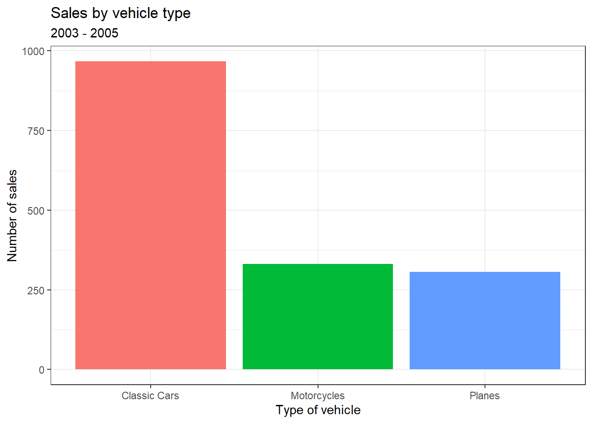

You can also include images that you did not create in R using the markdown syntax for images. This is very similar to loading data in that you can either use an image that is stored on your computer, or via a url using `knitr::include_graphics()`.

Create a new code chunk underneath each of the sales figures for planes, classic cars, and motorcycles and add in an image from Google or Wikipedia for each (right click on an image and select copy image address to get a url). See the section on [chunk defaults](#rmd-setup) to see how to change the display size.


```r
knitr::include_graphics("https://upload.wikimedia.org/wikipedia/commons/3/3f/P-51_Mustang_edit1.jpg")
```

::: {.info data-latex=""}
Most images on Wikipedia are public domain or have an open license. You can search for images by license on Google Images by clicking on the **`Tools`** button and choosing "Creative Commons licenses" from the "Usage Rights" menu.


:::

### Tables {#rmd-tables}

Rather than a figure, we might want to display our data in a table. 

* Add a new level 2 heading (two hashtags) to your document, name the heading "Data in table form" and then create a new code chunk below this. 

First, let's see what the table looks like if we don't make any edits. Simply write the name of the table you want to display in the code chunk (in our case `sales_counts`) and then click knit to see what it looks like.


```r
sales_counts
```

```
## # A tibble: 3 × 2
## # Groups:   PRODUCTLINE [3]
##   PRODUCTLINE      n
##   <chr>        <int>
## 1 Classic Cars   967
## 2 Motorcycles    331
## 3 Planes         306
```

It's just about readable but it's not great. To customise tables we're going to use the function `kable()` from the `kableExtra` package.

Amend your code to load the `kableExtra` package and apply the `kable()` function to the table. Once you've done this, knit the file again to see the output.


```r
library(kableExtra) # for table display

sales_counts %>% # start with the sales_count table and then
  kable() # apply the kable function
```

<table>
 <thead>
  <tr>
   <th style="text-align:left;"> PRODUCTLINE </th>
   <th style="text-align:right;"> n </th>
  </tr>
 </thead>
<tbody>
  <tr>
   <td style="text-align:left;"> Classic Cars </td>
   <td style="text-align:right;"> 967 </td>
  </tr>
  <tr>
   <td style="text-align:left;"> Motorcycles </td>
   <td style="text-align:right;"> 331 </td>
  </tr>
  <tr>
   <td style="text-align:left;"> Planes </td>
   <td style="text-align:right;"> 306 </td>
  </tr>
</tbody>
</table>

It's better, but it's still not amazing. So let's make a few adjustments. We can change the names of the columns, add a caption, and also change the alignment of the cell contents using arguments to `kable()`. 

We can also add a theme to change the overall style. In this example we've used `kable_classic` but there are 5 others: `kable_paper`, `kable_classic_2`, `kable_minimal`, `kable_material` and `kable_material_dark`. Try them all and see which one you prefer.

Finally, we can change the formatting of the first row using `row_spec`. Look up the help documentation for `row_spec` to see what other options are available. Try changing the value of  any of the arguments below to figure out what they do.


```r
sales_counts %>%
  kable(col.names = c("Product", "Sales"),
      caption = "Number of sales per product line.", 
      align = "c") %>% 
  kable_classic(full_width = FALSE) %>% 
  row_spec(row = 0, bold = TRUE, color = "red") 
```

<table class=" lightable-classic" style='font-family: "Arial Narrow", "Source Sans Pro", sans-serif; width: auto !important; margin-left: auto; margin-right: auto;'>
<caption>(\#tab:unnamed-chunk-14)Number of sales per product line.</caption>
 <thead>
  <tr>
   <th style="text-align:center;font-weight: bold;color: red !important;"> Product </th>
   <th style="text-align:center;font-weight: bold;color: red !important;"> Sales </th>
  </tr>
 </thead>
<tbody>
  <tr>
   <td style="text-align:center;"> Classic Cars </td>
   <td style="text-align:center;"> 967 </td>
  </tr>
  <tr>
   <td style="text-align:center;"> Motorcycles </td>
   <td style="text-align:center;"> 331 </td>
  </tr>
  <tr>
   <td style="text-align:center;"> Planes </td>
   <td style="text-align:center;"> 306 </td>
  </tr>
</tbody>
</table>

::: {.info data-latex=""}
The appearance and placement of the table caption depends on the type of document you are creating. Your captions may look different to those in this book because you are creating a single-page `html_document`, while this book uses the `bs4_book` style from the <code class='package'>bookdown</code> package. You'll learn more about other document output types in Chapter\ \@ref(present).
:::


If you're feeling confident with what we have covered so far, the [kableExtra vignette](https://haozhu233.github.io/kableExtra/awesome_table_in_html.html){target="_blank"} gives a lot more detail on how you can edit your tables using `kableExtra`. 

::: {.try data-latex=""}
You can also explore the [gt](https://gt.rstudio.com/){target="_blank"} package, which is complex, but allows you to create beautiful customised tables. [Riding tables with {gt} and {gtExtras}](https://bjnnowak.netlify.app/2021/10/04/r-beautiful-tables-with-gt-and-gtextras/){target="_blank"} is an outstanding tutorial.
:::

## Refining your report

### Chunk defaults {#rmd-setup}

Let's finish by tidying up the report and organising our code a bit better. When you create a new R Markdown file in RStudio, a setup chunk is automatically created - we've ignored this chunk until now.

<div class='verbatim'><pre class='sourceCode r'><code class='sourceCode R'>&#96;&#96;&#96;{r setup, include=FALSE}</code></pre>

```r
knitr::opts_chunk$set(echo = TRUE)
```

<pre class='sourceCode r'><code class='sourceCode R'>&#96;&#96;&#96;</code></pre></div>

You can set more default options for your document here. Type `str(knitr::opts_chunk$get())` into the console to see the full list of options that you can set and their default values, however, the most useful and common options to change for the purposes of writing reports revolve around whether you want to show your code and the size of your images.

Replace the code in your setup chunk with the below code and then try changing each option from `FALSE` to `TRUE` and changing the numeric values then knit the file again to see the difference it makes.

<div class='verbatim'><pre class='sourceCode r'><code class='sourceCode R'>&#96;&#96;&#96;{r setup, include=FALSE}</code></pre>

```r
knitr::opts_chunk$set(
  echo       = FALSE,     # whether to show code chunks
  message    = FALSE,     # whether to show messages from your code
  warning    = FALSE,     # whether to show warnings from your code
  fig.width  = 8,         # figure width in inches (at 96 dpi)
  fig.height = 5,         # figure height in inches (at 96 dpi)
  out.width = "50%"      # figures/images span 50% of the page width
)
```

<pre class='sourceCode r'><code class='sourceCode R'>&#96;&#96;&#96;</code></pre></div>

::: {.warning data-latex=""}
Note that `fig.width` and `fig.height` control the original size and aspect ratio of images generated by R, such as plots. This will affect the relative size of text and other elements in plots. It does not affect the size of existing images at all. However, `out.width` controls the **display** size of both existing images and figures generated by R. This is usually set as a percentage  of the page width.

<div class="figure" style="text-align: center">
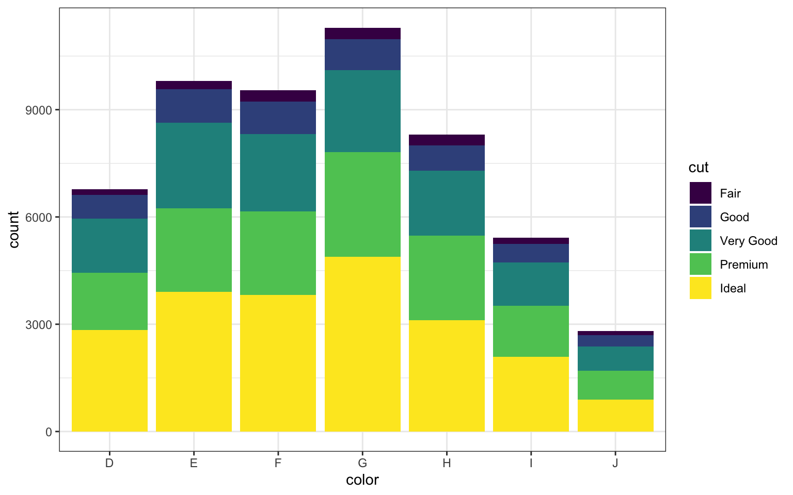
<p class="caption">(\#fig:img-full-100)A plot with the default values of fig.width = 8, fig.height = 5, out.width = "100%"</p>
</div>

<div class="figure" style="text-align: center">
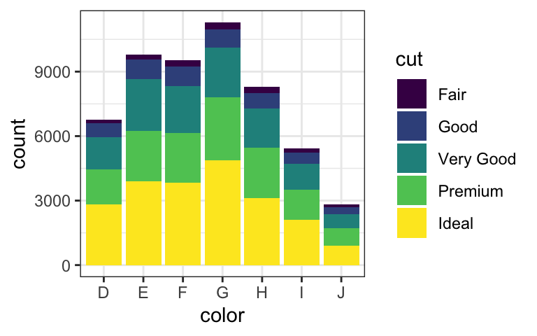
<p class="caption">(\#fig:img-half-100)The same plot with half the default width and height: fig.width = 4, fig.height = 2.5, out.width = "100%"</p>
</div>

<div class="figure" style="text-align: center">

<p class="caption">(\#fig:img-half-50)The same plot as above at half the output width: fig.width = 4, fig.height = 2.5, out.width = "50%"</p>
</div>

:::

### Override defaults

These setup options change the behaviour for the entire document, however, you can override the behaviour for individual code chunks. 

For example, by default you might want to hide your code but there also might be an occasion where you want to show the code you used to analyse your data. You can set `echo = FALSE` in your setup chunk to make hiding code the default but in the individual code chunk for your plot set `echo = TRUE`. Try this now and knit the file to see the results.

<div class='verbatim'><pre class='sourceCode r'><code class='sourceCode R'>&#96;&#96;&#96;{r, echo = TRUE}</code></pre>

```r
ggplot(data = sales_counts, 
       mapping = aes(x = PRODUCTLINE, y = n, fill = PRODUCTLINE)) +
  geom_bar(stat = "identity", show.legend = FALSE) +
  labs(x = "Type of vehicle",
       y = "Number of sales",
       title = "Sales by vehicle type",
       subtitle = "2003 - 2005")
```

<pre class='sourceCode r'><code class='sourceCode R'>&#96;&#96;&#96;</code></pre></div>

Additionally, you can also override the default image display size or dimensions.

<div class='verbatim'><pre class='sourceCode r'><code class='sourceCode R'>&#96;&#96;&#96;{r, out.width='25%'}</code></pre>

```r
knitr::include_graphics("https://upload.wikimedia.org/wikipedia/commons/3/3f/P-51_Mustang_edit1.jpg")
```

<pre class='sourceCode r'><code class='sourceCode R'>&#96;&#96;&#96;</code></pre></div>

<div class='verbatim'><pre class='sourceCode r'><code class='sourceCode R'>&#96;&#96;&#96;{r, fig.width = 10, fig.height = 20}</code></pre>

```r
ggplot(data = sales_counts, 
       mapping = aes(x = PRODUCTLINE, y = n, fill = PRODUCTLINE)) +
  geom_bar(stat = "identity", show.legend = FALSE) +
  labs(x = "Type of vehicle",
       y = "Number of sales",
       title = "Sales by vehicle type",
       subtitle = "2003 - 2005")
```

<pre class='sourceCode r'><code class='sourceCode R'>&#96;&#96;&#96;</code></pre></div>

### Loading packages

You can also add the packages you need in your setup chunk using <code><span class='kw'><a target='_blank' href='https://rdrr.io/r/base/library.html'>library</a></span><span class='op'>(</span><span class='op'>)</span></code>. Often when you are working on a script, you will realize that you need to load another add-on package. Don't bury the call to `library(package_I_need)` way down in the script. Put it in the top, so the user has an overview of what packages are needed.

::: {.try data-latex=""}
Move the code that loads the `tidyverse` and `kableExtra` to the setup chunk.
:::

### YAML header {#yaml}

Finally, the <a class='glossary' target='_blank' title='A structured format for information' href='https://psyteachr.github.io/glossary/y#yaml'>YAML</a> header is the bit at the very top of your Markdown document. You can set several options here as well. 

    ---
    title: "Sales Data Report"
    author: "Your name"
    output:
      html_document:
        df_print: kable
        theme: 
          version: 4
          bootswatch: yeti
        toc: true
        toc_float:
          collapsed: false
          smooth_scroll: false
        toc_depth: 3
        number_sections: false
    ---

::: {.info data-latex=""}
Try changing the values from `false` to `true` to see what the options do.
:::

The `df_print: kable` option prints data frames using `knitr::kable` automatically. 

The built-in bootswatch themes are: default, cerulean, cosmo, darkly, flatly, journal, lumen, paper, readable, sandstone, simplex, spacelab, united, and yeti. You can [view and download more themes](https://bootswatch.com/4/). Try changing the theme to see which one you like best.

<div class="figure" style="text-align: center">

<p class="caption">(\#fig:img-bootswatch)Light themes in versions 3 and 4.</p>
</div>

::: {.warning data-latex=""}
YAML headers can be very picky about spaces and semicolons (the rest of R Markdown is much more forgiving). For example, if you put a space before "author", you will get an error that looks like:

```
Error in yaml::yaml.load(..., eval.expr = TRUE) : 
  Parser error: while parsing a block mapping at line 1, column 1 did not find expected key at line 2, column 2
```

The error message will tell you exactly where the problem is (the second character of the second line of the YAML header), and it's usually a matter of fixing typos or making sure that the indenting is exactly right.
:::

### Summary {#reports-summary}

This chapter has covered a lot but hopefully now you have a much better idea of what Markdown is able to do. Whilst working in Markdown takes longer in the initial set-up stage, once you have a fully reproducible report you can plug in new data each week or month and simply click knit, reducing duplication of effort, and the human error that comes with it.

As you continue to work through the book you will learn how to wrangle and analyse your data and how to use Markdown to present it. We'll slowly build on the available customisation options so over the course of next few weeks, you'll find your Markdown reports start to look more polished and professional.

## Exercises {#exercises-reports}

Below are some additional exercises that will let you apply what you have learned in this chapter. We would suggest taking a break before you do these - it might feel slightly more effortful, but spreading out your practice will help you learn more in the long run.

### New project {#exercises-reports-project}

Create a new project called "demo_report" [\@ref(projects)]

### New script {#exercises-reports-setup}

In the "demo_report" project, create a new Rmarkdown document called "job.Rmd" [\@ref(rmarkdown)]. Edit the YAML header to output tables using kable and set a custom theme [\@ref(yaml)].


<div class='webex-solution'><button>Solution</button>

    ---
    title: "My Job"
    author: "Me"
    output:
      html_document:
        df_print: kable
        theme: 
          version: 4
          bootswatch: sandstone
    ---

</div>


### R Markdown {#exercises-reports-rmarkdown}

Write a short paragraph describing your job or a job you might like to have in the future [\@ref(markdown)]. Include a bullet-point list of links to websites that are useful for that job [\@ref(markdown)].


<div class='webex-solution'><button>Solution</button>


```
I am a research psychologist who is interested in open science 
and teaching computational skills.

* [psyTeachR books](https://psyteachr.github.io/)
* [Google Scholar](https://scholar.google.com/)
```


</div>


### Tables {#exercises-reports-tables}

Use the following code to load a small table of tasks [\@ref(code-chunks)]. Edit it to be relevant to your job (you can change the categories entirely if you want).  


```r
tasks <- tibble::tribble(
  ~task,                   ~category,      ~frequency,
  "Respond to tweets",     "social media", "daily",
  "Create a twitter poll", "social media", "weekly",
  "Make the sales report", "reporting",    "montly"
)
```

Figure out how to make it so that code chunks don't show in your knitted document [\@ref(rmd-setup)]


<div class='webex-solution'><button>Solution</button>


You can set the default to `echo = FALSE` in the setup chunk at the top of the script.


```r
knitr::opts_chunk$set(echo = FALSE)
```

To set visibility for a specific code chunk, put `echo = FALSE` inside the curly brackets.

<div class='verbatim'><pre class='sourceCode r'><code class='sourceCode R'>&#96;&#96;&#96;{r, echo=FALSE}</code></pre>

```r
# code to hide
```

<pre class='sourceCode r'><code class='sourceCode R'>&#96;&#96;&#96;</code></pre></div>


</div>


Display the table with purple italic column headers. Try different styles using <code class='package'>kableExtra</code> [\@ref(rmd-tables)]


<div class='webex-solution'><button>Solution</button>

```r
kableExtra::kable(tasks) %>%
  kableExtra::kable_minimal() %>%
  kableExtra::row_spec(row = 0, italic = TRUE, color = "purple")
```

<table class=" lightable-minimal" style='font-family: "Trebuchet MS", verdana, sans-serif; margin-left: auto; margin-right: auto;'>
 <thead>
  <tr>
   <th style="text-align:left;font-style: italic;color: purple !important;"> task </th>
   <th style="text-align:left;font-style: italic;color: purple !important;"> category </th>
   <th style="text-align:left;font-style: italic;color: purple !important;"> frequency </th>
  </tr>
 </thead>
<tbody>
  <tr>
   <td style="text-align:left;"> Respond to tweets </td>
   <td style="text-align:left;"> social media </td>
   <td style="text-align:left;"> daily </td>
  </tr>
  <tr>
   <td style="text-align:left;"> Create a twitter poll </td>
   <td style="text-align:left;"> social media </td>
   <td style="text-align:left;"> weekly </td>
  </tr>
  <tr>
   <td style="text-align:left;"> Make the sales report </td>
   <td style="text-align:left;"> reporting </td>
   <td style="text-align:left;"> montly </td>
  </tr>
</tbody>
</table>


</div>

### Images {#exercises-reports-images}

Add an image of anything relevant [\@ref(rmd-images)]


<div class='webex-solution'><button>Solution</button>


You can add an image from the web using its URL:

```

```
    
Or save an image into your project directory (e.g., in the images folder) and add it using the relative path:

```

```
    

</div>


### Inline R {#exercises-reports-inline}

Use inline R to include the version of R you are using in the following sentence: "This report was created using R version 4.1.0 (2021-05-18)." You can get the version using the object `R.version.string`. [\@ref(rmd-inline-r)]


<div class='webex-solution'><button>Solution</button>


This report was created using <code>&#096;r R.version.string&#096;</code>.


</div>


### Knit {#exercises-reports-knit}

Knit this document to html [\@ref(rmd-knit)]


<div class='webex-solution'><button>Solution</button>

Click on the knit button or run the following code in the console. (Do not put it the Rmd script!)


```r
rmarkdown::render("job.Rmd")
```


</div>


## Glossary {#glossary-reports}

<table>
 <thead>
  <tr>
   <th style="text-align:left;"> term </th>
   <th style="text-align:left;"> definition </th>
  </tr>
 </thead>
<tbody>
  <tr>
   <td style="text-align:left;"> [extension](https://psyteachr.github.io/glossary/e.html#extension){class="glossary" target="_blank"} </td>
   <td style="text-align:left;"> The end part of a file name that tells you what type of file it is (e.g., .R or .Rmd). </td>
  </tr>
  <tr>
   <td style="text-align:left;"> [knit](https://psyteachr.github.io/glossary/k.html#knit){class="glossary" target="_blank"} </td>
   <td style="text-align:left;"> To create an HTML, PDF, or Word document from an R Markdown (Rmd) document </td>
  </tr>
  <tr>
   <td style="text-align:left;"> [markdown](https://psyteachr.github.io/glossary/m.html#markdown){class="glossary" target="_blank"} </td>
   <td style="text-align:left;"> A way to specify formatting, such as headers, paragraphs, lists, bolding, and links. </td>
  </tr>
  <tr>
   <td style="text-align:left;"> [project](https://psyteachr.github.io/glossary/p.html#project){class="glossary" target="_blank"} </td>
   <td style="text-align:left;"> A way to organise related files in RStudio </td>
  </tr>
  <tr>
   <td style="text-align:left;"> [r markdown](https://psyteachr.github.io/glossary/r.html#r-markdown){class="glossary" target="_blank"} </td>
   <td style="text-align:left;"> The R-specific version of markdown: a way to specify formatting, such as headers, paragraphs, lists, bolding, and links, as well as code blocks and inline code. </td>
  </tr>
  <tr>
   <td style="text-align:left;"> [working directory](https://psyteachr.github.io/glossary/w.html#working-directory){class="glossary" target="_blank"} </td>
   <td style="text-align:left;"> The filepath where R is currently reading and writing files. </td>
  </tr>
  <tr>
   <td style="text-align:left;"> [yaml](https://psyteachr.github.io/glossary/y.html#yaml){class="glossary" target="_blank"} </td>
   <td style="text-align:left;"> A structured format for information </td>
  </tr>
</tbody>
</table>


## Further Resources {#resources-reports}

-   [R Markdown Cheat Sheet](https://www.rstudio.org/links/r_markdown_cheat_sheet)
<!--
-   [R Markdown reference Guide](https://www.rstudio.com/wp-content/uploads/2015/03/rmarkdown-reference.pdf)
-->
-   [R Markdown Tutorial](https://rmarkdown.rstudio.com/lesson-1.html)
-   [R Markdown: The Definitive Guide](https://bookdown.org/yihui/rmarkdown/) by Yihui Xie, J. J. Allaire, & Garrett Grolemund
-   [Chapter 27: R Markdown](https://r4ds.had.co.nz/r-markdown.html) of *R for Data Science*
-   [Project Structure](https://slides.djnavarro.net/project-structure/) by Danielle Navarro
-   [How to name files](https://speakerdeck.com/jennybc/how-to-name-files) by Jenny Bryan
-   [kableExtra](https://haozhu233.github.io/kableExtra/awesome_table_in_html.html)
-   [gt](https://gt.rstudio.com/)


<!--chapter:end:02-reports.Rmd-->

# Basic Data Visualisation {#viz}

## Intended Learning Outcomes {#ilo-viz}

* Be able to identify categorical versus continuous data
* Be able to create plots in layers using ggplot
* Be able to choose appropriate plots for data

## Set-up

Create a new project for the work we'll do in this chapter:

-   **`File > New Project...`**
-   Name the project <code class='path'>03-visualisation</code>
-   Save it inside your ADS directory.

Then, create and save a new <a class='glossary' target='_blank' title='The R-specific version of markdown: a way to specify formatting, such as headers, paragraphs, lists, bolding, and links, as well as code blocks and inline code.' href='https://psyteachr.github.io/glossary/r#r-markdown'>R Markdown</a> document named `plots.Rmd`, get rid of the default template text, and load the packages in the set-up code <a class='glossary' target='_blank' title='A section of code in an R Markdown file' href='https://psyteachr.github.io/glossary/c#chunk'>chunk</a>. You should have all of these packages installed already, but if you get the message `Error in library(x) : there is no package called ‘x’`, please refer to Chapter\ \@ref(install-package).

<div class='verbatim'><pre class='sourceCode r'><code class='sourceCode R'>&#96;&#96;&#96;{r setup, include=FALSE}</code></pre>

```r
library(tidyverse) # includes ggplot2
library(patchwork) # for multi-part plots
library(ggthemes)  # for plot themes
library(lubridate) # for manipulating dates
```

<pre class='sourceCode r'><code class='sourceCode R'>&#96;&#96;&#96;</code></pre></div>

We'd recommend making a new code chunk for each different activity, and using the white space to make notes on any errors you make, things you find interesting, or questions you'd like to ask the course team.

## Variable types

If a spreadsheet is in a <a class='glossary' target='_blank' title='A format for data that maps the meaning onto the structure.' href='https://psyteachr.github.io/glossary/t#tidy-data'>tidy data</a> format, each row is an <a class='glossary' target='_blank' title='All of the data about a single trial or question.' href='https://psyteachr.github.io/glossary/o#observation'>observation</a>, each column is a <a class='glossary' target='_blank' title='A word that identifies and stores the value of some data for later use.' href='https://psyteachr.github.io/glossary/v#variable'>variable</a>, and the information in each cell is a <a class='glossary' target='_blank' title='A single number or piece of data.' href='https://psyteachr.github.io/glossary/v#value'>value</a>. We'll learn more about how to get our data into this format in Chapter\ \@ref(tidy), but to get started we'll use datasets with the right format.

For example, the table below lists pets owned by members of the psyTeachR team. Each row is an observation of one pet. There are 6 variables for each pet, their `name`, `owner`, `species`, `birthdate`, `weight` (in kg), and `rating` (on a 5-point scale from "very evil" to "very good").

<div data-pagedtable="false">
  <script data-pagedtable-source type="application/json">
{"columns":[{"label":["name"],"name":[1],"type":["chr"],"align":["left"]},{"label":["owner"],"name":[2],"type":["chr"],"align":["left"]},{"label":["species"],"name":[3],"type":["fct"],"align":["left"]},{"label":["birthdate"],"name":[4],"type":["date"],"align":["right"]},{"label":["weight"],"name":[5],"type":["dbl"],"align":["right"]},{"label":["rating"],"name":[6],"type":["fct"],"align":["left"]}],"data":[{"1":"Darwin","2":"Lisa","3":"ferret","4":"1998-04-02","5":"1.2","6":"a little evil"},{"1":"Oy","2":"Lisa","3":"ferret","4":"<NA>","5":"2.9","6":"very good"},{"1":"Khaleesi","2":"Emily","3":"cat","4":"2014-10-01","5":"4.5","6":"very good"},{"1":"Bernie","2":"Phil","3":"dog","4":"2017-06-01","5":"32.0","6":"very good"}],"options":{"columns":{"min":{},"max":[10]},"rows":{"min":[10],"max":[10]},"pages":{}}}
  </script>
</div>

Variables can be classified as <a class='glossary' target='_blank' title='Data that can take on any values between other existing values.' href='https://psyteachr.github.io/glossary/c#continuous'>continuous</a> (numbers) or <a class='glossary' target='_blank' title='Data that can only take certain values, such as types of pet.' href='https://psyteachr.github.io/glossary/c#categorical'>categorical</a> (labels). When you're plotting data, it's important to know what kind of variables you have, which can help you decide what types of plots are most appropriate. Each variable also has a <a class='glossary' target='_blank' title='The kind of data represented by an object.' href='https://psyteachr.github.io/glossary/d#data-type'>data type</a>, such as <a class='glossary' target='_blank' title='A data type representing a real decimal number or integer.' href='https://psyteachr.github.io/glossary/n#numeric'>numeric</a> (numbers), <a class='glossary' target='_blank' title='A data type representing strings of text.' href='https://psyteachr.github.io/glossary/c#character'>character</a> (text), or <a class='glossary' target='_blank' title='A data type representing TRUE or FALSE values.' href='https://psyteachr.github.io/glossary/l#logical'>logical</a> (TRUE/FALSE values). Some plots can only work on some data types. Make sure you have watched the mini-lecture on types of data from last week before you work through this chapter. Additionally, Appendix\ \@ref(data-types) has more details, as this concept will be relevant repeatedly.

<div class="figure" style="text-align: center">

<p class="caption">(\#fig:excel-format-cells)Data types are like the categories when you format cells in Excel.</p>
</div>

### Continuous

<a class='glossary' target='_blank' title='Data that can take on any values between other existing values.' href='https://psyteachr.github.io/glossary/c#continuous'>Continuous</a> variables are properties you can measure, like weight. You can use continuous variables in mathematical operations, like calculating the sum total of a column of prices or the average number of social media likes per day. They may be rounded to the nearest whole number, but it should make sense to have a measurement halfway between.

Continuous variables always have a <a class='glossary' target='_blank' title='A data type representing a real decimal number or integer.' href='https://psyteachr.github.io/glossary/n#numeric'>numeric</a> data type. They are either <a class='glossary' target='_blank' title='A data type representing whole numbers.' href='https://psyteachr.github.io/glossary/i#integer'>integers</a> like <code><span class='fl'>42</span></code> or <a class='glossary' target='_blank' title='A data type representing a real decimal number' href='https://psyteachr.github.io/glossary/d#double'>doubles</a> like <code><span class='fl'>3.14159</span></code>. 

### Categorical

<a class='glossary' target='_blank' title='Data that can only take certain values, such as types of pet.' href='https://psyteachr.github.io/glossary/c#categorical'>Categorical</a> variables are properties you can count, like the species of pet. Categorical variables can be <a class='glossary' target='_blank' title='Categorical variables that don&#39;t have an inherent order, such as types of animal.' href='https://psyteachr.github.io/glossary/n#nominal'>nominal</a>, where the categories don't really have an order, like cats, dogs and ferrets (even though ferrets are obviously best), or <a class='glossary' target='_blank' title='Discrete variables that have an inherent order, such as number of legs' href='https://psyteachr.github.io/glossary/o#ordinal'>ordinal</a>, where they have a clear order but the distance between the categories isn't something you could exactly equate, like points on a <a class='glossary' target='_blank' title='A rating scale with a small number of discrete points in order' href='https://psyteachr.github.io/glossary/l#likert'>Likert</a> rating scale. Even if a data table uses numbers like 1-7 to represent ordinal variables, you shouldn't treat them like continuous variables.

Categorical data can have a <a class='glossary' target='_blank' title='A data type representing strings of text.' href='https://psyteachr.github.io/glossary/c#character'>character</a> data type, also called <a class='glossary' target='_blank' title='A piece of text inside of quotes.' href='https://psyteachr.github.io/glossary/s#string'>strings</a>. These are made by putting text inside of quotes. That text can be letters, punctuation, or even numbers. For example, <code><span class='st'>"January"</span></code> is a character string, but so is <code><span class='st'>"1"</span></code> if you put it in quotes. The character data type is best for variables that can have a lot of different values that you can't predict ahead of time.

Categorical data can also be <a class='glossary' target='_blank' title='A data type where a specific set of values are stored with labels; An explanatory variable manipulated by the experimenter' href='https://psyteachr.github.io/glossary/f#factor'>factors</a>, a specific type of integer that lets you specify the category names and their order. This is useful for making plots display with categories in the order you want (otherwise they default to alphabetical order). The factor data type is best for categories that have a specific number of levels.

Sometimes people represent categorical variables with numbers that correspond to names, like 0 = "no" and 1 = "yes", but values in between don't have a clear interpretation. If you have control over how the data are recorded, it's better to use the character names for clarity. You'll learn how to recode columns in Chapter\ \@ref(wrangle).

### Dates and times

Dates and times are a special case of variable. They can act like categorical or continuous variables, and there are special ways to plot them. Dates and times can be hard to work with, but the <code class='package'><a href='https://lubridate.tidyverse.org/' target='_blank'>lubridate</a></code> package provides functions to help you with this.


```r
# the current date
lubridate::today()
```

```
## [1] "2022-02-05"
```


```r
# the current date and time in the GMT timezone
lubridate::now(tzone = "GMT")
```

```
## [1] "2022-02-05 19:31:36 GMT"
```

### Test your understanding

Coming back to the pets dataset, what type of variable is in each column? You can use the function `glimpse()` to show a list of the column names, their data types, and the first few values in each column - here is the output of running `glimpse()` on the pets dataset.


```r
glimpse(pets)
```

```
## Rows: 4
## Columns: 6
## $ name      <chr> "Darwin", "Oy", "Khaleesi", "Bernie"
## $ owner     <chr> "Lisa", "Lisa", "Emily", "Phil"
## $ species   <fct> ferret, ferret, cat, dog
## $ birthdate <date> 1998-04-02, NA, 2014-10-01, 2017-06-01
## $ weight    <dbl> 1.2, 2.9, 4.5, 32.0
## $ rating    <fct> a little evil, very good, very good, very good
```

::: {.try data-latex=""}


| Column      | Variable type | Data type     |
|:------------|:--------------|:--------------|
| `name`      | <select class='webex-select'><option value='blank'></option><option value='x'>continuous</option><option value='answer'>nominal</option><option value='x'>ordinal</option><option value='x'>date</option></select>  | <select class='webex-select'><option value='blank'></option><option value='x'>numeric</option><option value='answer'>character</option><option value='x'>factor</option><option value='x'>date</option></select>  |
| `owner`     | <select class='webex-select'><option value='blank'></option><option value='x'>continuous</option><option value='answer'>nominal</option><option value='x'>ordinal</option><option value='x'>date</option></select>  | <select class='webex-select'><option value='blank'></option><option value='x'>numeric</option><option value='answer'>character</option><option value='x'>factor</option><option value='x'>date</option></select>  |
| `species`   | <select class='webex-select'><option value='blank'></option><option value='x'>continuous</option><option value='answer'>nominal</option><option value='x'>ordinal</option><option value='x'>date</option></select>  | <select class='webex-select'><option value='blank'></option><option value='x'>numeric</option><option value='x'>character</option><option value='answer'>factor</option><option value='x'>date</option></select> |
| `birthdate` | <select class='webex-select'><option value='blank'></option><option value='x'>continuous</option><option value='x'>nominal</option><option value='x'>ordinal</option><option value='answer'>date</option></select> | <select class='webex-select'><option value='blank'></option><option value='x'>continuous</option><option value='x'>nominal</option><option value='x'>ordinal</option><option value='answer'>date</option></select> |
| `weight`    | <select class='webex-select'><option value='blank'></option><option value='answer'>continuous</option><option value='x'>nominal</option><option value='x'>ordinal</option><option value='x'>date</option></select> | <select class='webex-select'><option value='blank'></option><option value='answer'>numeric</option><option value='x'>character</option><option value='x'>factor</option><option value='x'>date</option></select>  |
| `rating`    | <select class='webex-select'><option value='blank'></option><option value='x'>continuous</option><option value='x'>nominal</option><option value='answer'>ordinal</option><option value='x'>date</option></select>  | <select class='webex-select'><option value='blank'></option><option value='x'>numeric</option><option value='x'>character</option><option value='answer'>factor</option><option value='x'>date</option></select> |

:::


## Building plots


There are multiple approaches to data visualisation in R; in this course we will use the popular package <code class='package'>ggplot2</code>, which is part of the larger `tidyverse` collection of packages. A grammar of graphics (the "gg" in "ggplot") is a standardised way to describe the components of a graphic. <code class='package'>ggplot2</code> uses a layered grammar of graphics, in which plots are built up in a series of layers. It may be helpful to think about any picture as having multiple elements that sit semi-transparently over each other. A good analogy is old Disney movies where artists would create a background and then add moveable elements on top of the background via transparencies.

Figure\ \@ref(fig:layers) displays the evolution of a simple scatterplot using this layered approach. First, the plot space is built (layer 1); the variables are specified (layer 2); the type of visualisation (known as a `geom`) that is desired for these variables is specified (layer 3) - in this case `geom_point()` is called to visualise individual data points; a second geom is added to include a line of best fit (layer 4), the axis labels are edited for readability (layer 5), and finally, a theme is applied to change the overall appearance of the plot (layer 6).

<div class="figure" style="text-align: center">
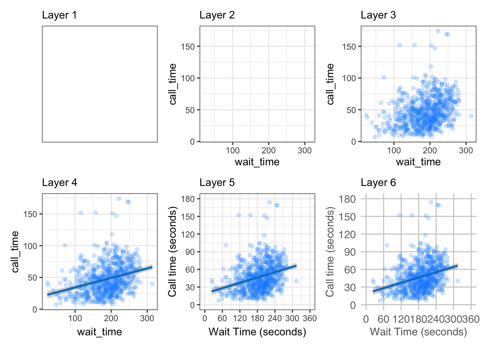
<p class="caption">(\#fig:layers)Evolution of a layered plot</p>
</div>

Importantly, each layer is independent and independently customisable. For example, the size, colour and position of each component can be adjusted, or one could, for example, remove the first geom (the data points) to only visualise the line of best fit, simply by removing the layer that draws the data points (Figure\ \@ref(fig:remove-layer)). The use of layers makes it easy to build up complex plots step-by-step, and to adapt or extend plots from existing code.


<div class="figure" style="text-align: center">

<p class="caption">(\#fig:remove-layer)Final plot with scatterplot layer removed.</p>
</div>

### Plot Data {#plots-loading-data}

Let's build up the plot above, layer by layer. First we need to get the data. We'll learn how to load data from different sources in Chapter\ \@ref(data), but this time we'll use the same method as we did in Chapter\ \@ref(loading-online) and load it from an online source. 

When you load the data, `read_csv()` will produce a message that gives you information about the data it has imported and what assumptions it has made. The "column specification" tells you what each column is named and what type of data R has categorised each variable as. The abbreviation "chr" is for <a class='glossary' target='_blank' title='A data type representing strings of text.' href='https://psyteachr.github.io/glossary/c#character'>character</a> columns, "dbl" is for <a class='glossary' target='_blank' title='A data type representing a real decimal number' href='https://psyteachr.github.io/glossary/d#double'>double</a> columns, and "dttm" is a date/time column.


```r
survey_data <- read_csv("https://psyteachr.github.io/ads-v1/data/survey_data.csv")
```

```
## Rows: 707 Columns: 7
```

```
## ── Column specification ────────────────────────────────────────────────────────
## Delimiter: ","
## chr  (3): caller_id, employee_id, issue_category
## dbl  (3): wait_time, call_time, satisfaction
## dttm (1): call_start
```

```
## 
## ℹ Use `spec()` to retrieve the full column specification for this data.
## ℹ Specify the column types or set `show_col_types = FALSE` to quiet this message.
```

This data is simulated data for a call centre customer satisfaction survey. The first thing you should do when you need to plot data is to get familiar with what all of the rows (observations) and columns (variables) mean. Sometimes this is obvious, and sometimes it requires help from the data provider. Here, each row represents one call to the centre.

* `caller_id` is a unique ID for each caller
* `employee_id` is a unique ID for each employee taking calls
* `call_start` is the date and time that the call arrived
* `wait_time` is the number of seconds the caller had to wait
* `call_time` is the number of seconds the call lasted after the employee picked up
* `issue_category` is whether the issue was tech, sales, returns, or other
* `satisfaction` is the customer satisfaction rating on a scale from 1 (very unsatisfied) to 5 (very satisfied)

Unless you specify the column types, data importing functions will just guess the types and usually default to double for columns with numbers and character for columns with letters. Use the function `spec()` to find out all of the column types and edit them if needed.


```r
spec(survey_data)
```

```
## cols(
##   caller_id = col_character(),
##   employee_id = col_character(),
##   call_start = col_datetime(format = ""),
##   wait_time = col_double(),
##   call_time = col_double(),
##   issue_category = col_character(),
##   satisfaction = col_double()
## )
```

Let's set `issue_category` as a factor and set the order of the levels. By default, R will order the levels of a factor alphanumerically, however in many cases you will want or need to set your own order. For example, in this data, it makes most sense for the category "other" to come at the end of the list. After you update the column types, you have to re-import the data by adjusting the `read_csv()` code to set the `col_types` argument to the new column types.

Note that because `read_csv()` is going to use the object `survey_col_types`, you must create `survey_col_types` before you run the adjusted `read_csv()` code. If you ever need to adjust your code, try to think about the order that the code will run in if you start from scratch and make sure it's organised appropriately.


```r
# updated column types
survey_col_types <- cols(
  caller_id = col_character(),
  employee_id = col_character(),
  call_start = col_datetime(format = ""),
  wait_time = col_double(),
  call_time = col_double(),
  issue_category = col_factor(levels = c("tech", "sales", "returns", "other")),
  satisfaction = col_integer()
)

# re-import data with correct column  types
survey_data <- read_csv("https://psyteachr.github.io/ads-v1/data/survey_data.csv",
                        col_types = survey_col_types)
```


### Plot setup

#### Default theme

Plots in this book use the black-and-white theme, not the default grey theme, so set your default theme to the same so your plots will look like the examples below. At the top of your script, in the setup chunk after you've loaded the tidyverse package, add the following code and run it. You'll learn more ways to customise your theme in Section\ \@ref(themes) and Appendix\ \@ref(themes-appendix).


```r
theme_set(theme_bw()) # set the default theme
```

#### Data {#plot-setup-data}

Every plot starts with the `ggplot()` function and a data table. If your data are not loaded or you have a typo in your code, this will give you an error message. It's best to check your plot after each step, so that you can figure out where errors are more easily.


```r
ggplot(data = survey_data)
```

<div class="figure" style="text-align: center">

<p class="caption">(\#fig:build-plot-setup)A blank ggplot.</p>
</div>

#### Mapping

The next <a class='glossary' target='_blank' title='A variable that provides input to a function.' href='https://psyteachr.github.io/glossary/a#argument'>argument</a> to `ggplot()` is the `mapping`. This tells the plot which columns in the data should be represented by, or "mapped" to, different aspects of the plot, such as the x-axis, y-axis, line colour, object fill, or line style. These aspects, or "aesthetics", are listing inside the `aes()` function.

Set the arguments `x` and `y` to the names of the columns you want to be plotted on those axes. Here, we want to plot the wait time on the x-axis and the call time on the y-axis.


```r
# set up the plot with mapping
ggplot(
  data = survey_data, 
  mapping = aes(x = wait_time, y = call_time)
)
```

<div class="figure" style="text-align: center">

<p class="caption">(\#fig:build-plot-mapping)A blank plot with x- and y- axes mapped.</p>
</div>

::: {.info data-latex=""}
In the example above, we wrote out the names of the <a class='glossary' target='_blank' title='A variable that provides input to a function.' href='https://psyteachr.github.io/glossary/a#argument'>arguments</a> `data` and `mapping`, but in practice, almost everyone omits them. Just make sure you put the data and mapping in the right order.


```r
ggplot(survey_data,  aes(x = wait_time, y = call_time))
```
:::

#### Geoms

Now we can add our plot elements in layers. These are referred to as <a class='glossary' target='_blank' title='The geometric style in which data are displayed, such as boxplot, density, or histogram.' href='https://psyteachr.github.io/glossary/g#geom'>geoms</a> and their functions start with `geom_`. You **add** layers onto the base plot created by `ggplot()` with a plus (`+`). 


```r
ggplot(survey_data, aes(x = wait_time, y = call_time)) +
  geom_point() # scatterplot
```

<div class="figure" style="text-align: center">

<p class="caption">(\#fig:build-plot-geoms)Adding a scatterplot with geom_point().</p>
</div>

::: {.warning data-latex=""}
Somewhat annoyingly, the plus has to be on the end of the previous line, not at the start of the next line. If you do make this mistake, it will run the first line of code to produce the base layer but then you will get the following error message rather than adding on `geom_point()`.


```r
ggplot(survey_data, aes(x = wait_time, y = call_time))
```


```r
+ geom_point() # scatterplot
```

```
## Error: Cannot use `+.gg()` with a single argument. Did you accidentally put + on a new line?
```
:::

#### Multiple geoms

Part of the power of <code class='package'>ggplot2</code> is that you can add more than one geom to a plot by adding on extra layers and so it quickly becomes possible to make complex and informative visualisation. Importantly, the layers display in the order you set them up. The code below uses the same geoms to produce a scatterplot with a line of best fit but orders them differently.


```r
# Points first
ggplot(survey_data, aes(x = wait_time, y = call_time)) +
  geom_point() + # scatterplot
  geom_smooth(method = lm) # line of best fit

# Line first
ggplot(survey_data, aes(x = wait_time, y = call_time)) +
  geom_smooth(method = lm) + # line of best fit
  geom_point() # scatterplot
```


<div class="figure" style="text-align: center">

<p class="caption">(\#fig:build-plot-geom2)Points first versus line first.</p>
</div>

#### Saving plots

Just like you can save numbers and data tables to objects, you can also save the output of `ggplot()`. The code below produces the same plots we created above but saves them to objects named `point_first` and `line_first`. If you run this code, the plots won't display like they have done before. Instead, you'll see the object names appear in the environment pane.


```r
point_first <- 
  ggplot(survey_data, aes(x = wait_time, y = call_time)) +
  geom_point() + # scatterplot
  geom_smooth(method = lm) # line of best fit
  
line_first <-
  ggplot(survey_data, aes(x = wait_time, y = call_time)) +
  geom_smooth(method = lm) + # line of best fit
  geom_point() # scatterplot
```

To view the plots, call the objects by name. This will output each plot separately.


```r
point_first # view first plot
line_first # view second plot
```

#### Combining plots

One of the reasons to save your plots to objects is so that you can combine multiple plots using functions from the `patchwork` package. The below code produces the above plot by combining the two plots with `+` and then specifying that we want the plots produced on a single row with the `nrow` argument in `plot_layout()`. 


```r
# add plots together in 1 row; try changing nrow to 2
point_first + line_first + plot_layout(nrow = 1)
```

<div class="figure" style="text-align: center">

<p class="caption">(\#fig:build-plot-geom2b)Combining plots with patchwork.</p>
</div>

### Customising plots

#### Styling geoms

We should definitely put the line in front of the points, but the points are still a bit dark. If you want to change the overall style of a geom, you can set the arguments `colour`, `alpha`, `shape`, `size` and `linetype` inside the geom function. There are many different values that you can set these to; Appendix\ \@ref(plotstyle) gives details of these. Play around with different values below and figure out what the <a class='glossary' target='_blank' title='A value that a function uses for an argument if it is skipped.' href='https://psyteachr.github.io/glossary/d#default-value'>default values</a> are for `shape` and `size`. 


```r
ggplot(survey_data, aes(x = wait_time, y = call_time)) +
  geom_point(colour = "dodgerblue", 
             alpha = 0.2, # 20% transparency
             shape = 18,  # solid diamond
             size = 2) + 
  geom_smooth(method = lm, 
              formula = y~x, # formula used to draw line, 
              # setting the default formula avoids an annoying message
              colour = rgb(0, .5, .8),
              linetype = 3) 
```

<div class="figure" style="text-align: center">

<p class="caption">(\#fig:build-plot-style)Changing geom styles.</p>
</div>

::: {.warning data-latex=""}
This method is only for changing the style of *all* the shapes made with that geom. If you want, for example, points to have different colours depending on which issue category they are from, you set the argument `colour = issue_category` inside the `aes()` function for the mapping. You can customise the colours used with `scale_` functions, which you will learn about below and in Chapter\ \@ref(themes-and-colours).
:::

#### Format axes

Now we need to make the axes look neater. There are several functions you can use to change the axis labels, but the most powerful ones are the `scale_` functions. You need to use a scale function that matches the data you're plotting on that axis and this is where it becomes particularly important to know what type of data you're working with. Both of the axes here are <a class='glossary' target='_blank' title='Data that can take on any values between other existing values.' href='https://psyteachr.github.io/glossary/c#continuous'>continuous</a>, so we'll use `scale_x_continuous()` and `scale_y_continuous()`.

The `name` argument changes the axis label. The `breaks` argument sets the major units and needs a <a class='glossary' target='_blank' title='A type of data structure that collects values with the same data type, like T/F values, numbers, or strings.' href='https://psyteachr.github.io/glossary/v#vector'>vector</a> of possible values, which can extend beyond the range of the data (e.g., `wait time` only goes up to 350, but we can specify breaks up to 600 to make the maths easier). The `seq()` function creates a sequence of numbers `from` one `to` another `by` specified steps.


```r
ggplot(survey_data, aes(x = wait_time, y = call_time)) +
  geom_point(colour = "dodgerblue", 
             alpha = 0.2) + 
  geom_smooth(method = lm, 
              formula = y~x, 
              colour = rgb(0, .5, .8)) +
  scale_x_continuous(name = "Wait Time (seconds)", 
                     breaks = seq(from = 0, to = 600, by = 60)) +
  scale_y_continuous(name = "Call time (seconds)",
                     breaks = seq(from = 0, to = 600, by = 30))
```

<div class="figure" style="text-align: center">

<p class="caption">(\#fig:build-plot-axes)Formatting plot axes with scale_ functions.</p>
</div>

::: {.try data-latex=""}
Check the help for `?scale_x_continuous` to see how you would set the minor units or specify how many breaks you want instead.
:::


#### Axis limits

If you want to change the minimum and maximum values on an axis, use the `coord_cartesian()` function. Many plots make more sense if the minimum and maximum values represent the range of possible values, even if those values aren't present in the data. Here, wait and call times can't be less than 0 seconds, so we'll set the minimum values to 0 and the maximum values to the first break above the highest value.


```r
ggplot(survey_data, aes(x = wait_time, y = call_time)) +
  geom_point(colour = "dodgerblue", 
             alpha = 0.2) + 
  geom_smooth(method = lm, 
              formula = y~x, 
              colour = rgb(0, .5, .8)) +
  scale_x_continuous(name = "Wait Time (seconds)", 
                     breaks = seq(from = 0, to = 600, by = 60)) +
  scale_y_continuous(name = "Call time (seconds)",
                     breaks = seq(from = 0, to = 600, by = 30)) +
  coord_cartesian(xlim = c(0, 360), 
                  ylim = c(0, 180))
```

<div class="figure" style="text-align: center">
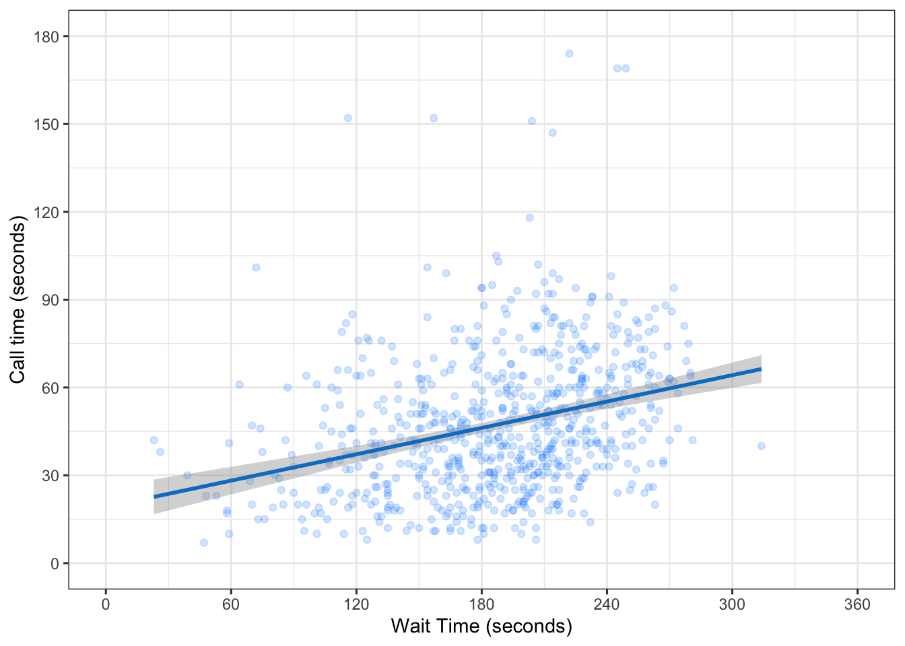
<p class="caption">(\#fig:build-plot-limits)Changing the axis limits.</p>
</div>

::: {.dangerous data-latex=""}
You can also set the `limits` argument inside  the `scale_` functions, but this actually removes any data that falls outside these limits, rather than cropping your plot, and this can change the appearance of certain types of plots like violin plots and density plots.
:::

#### Themes

<code class='package'>ggplot2</code> comes with several built-in themes, such as `theme_minimal()` and `theme_bw()`, but the <code class='package'><a href='https://yutannihilation.github.io/allYourFigureAreBelongToUs/ggthemes/' target='_blank'>ggthemes</a></code> package provides even more themes to match different software, such as GoogleDocs or Stata, or publications, such as the Economist or the Wall Street Journal. Let's add the GoogleDocs theme, but change the font size to 20 with the `base_size` argument.

It's also worth highlighting that this code is starting to look quite complicated because of the number of layers, but because we've built it up slowly it should (hopefully!) make sense. If you see examples of <code class='package'>ggplot2</code> code online that you'd like to adapt, build the plot up layer by layer and it will make it easier to understand what each layer adds.


```r
ggplot(survey_data, aes(x = wait_time, y = call_time)) +
  geom_point(colour = "dodgerblue", 
             alpha = 0.2) + 
  geom_smooth(method = lm, 
              formula = y~x, 
              colour = rgb(0, .5, .8)) +
  scale_x_continuous(name = "Wait Time (seconds)", 
                     breaks = seq(from = 0, to = 600, by = 60)) +
  scale_y_continuous(name = "Call time (seconds)",
                     breaks = seq(from = 0, to = 600, by = 30)) +
  coord_cartesian(xlim = c(0, 360), 
                  ylim = c(0, 180)) +
  ggthemes::theme_gdocs(base_size = 20)
```

<div class="figure" style="text-align: center">

<p class="caption">(\#fig:build-plot-theme)Changing the theme.</p>
</div>


#### Theme tweaks

If you're still not quite happy with a theme, you can customise it even further with the `themes()` function. Check the help for this function to see all of the possible options. The most common thing you'll want to do is to remove an element entirely. You do this by setting the relevant argument to `element_blank()`. Below, we're getting rid of the x-axis line and the plot background, which removes the line around the plot.


```r
ggplot(survey_data, aes(x = wait_time, y = call_time)) +
  geom_point(colour = "dodgerblue", 
             alpha = 0.2) + 
  geom_smooth(method = lm, 
              formula = y~x, 
              colour = rgb(0, .5, .8)) +
  scale_x_continuous(name = "Wait Time (seconds)", 
                     breaks = x_breaks) +
  scale_y_continuous(name = "Call time (seconds)",
                     breaks = y_breaks) +
  coord_cartesian(xlim = c(0, 360), 
                  ylim = c(0, 180)) +
  theme_gdocs(base_size = 11) +
  theme(axis.line.x = element_blank(),
        plot.background = element_blank())
```

<div class="figure" style="text-align: center">

<p class="caption">(\#fig:build-plot-custom-theme)Customising the theme.</p>
</div>


## Appropriate plots

Now that you know how to build up a plot by layers and customise its appearance, you're ready to learn about some more plot types. Different types of data require different types of plots, so this section is organised by data type. 

The [ggplot2 cheat sheet](https://raw.githubusercontent.com/rstudio/cheatsheets/main/data-visualization.pdf) is a great resource to help you find plots appropriate to your data, based on how many variables you're plotting and what type they are. The examples below all use the same customer satisfaction data, but each plot communicates something different. 

We don't expect you to memorise all of the plot types or the methods for customising them, but it will be helpful to try out the code in the examples below for yourself, changing values to test your understanding.

### Counting categories

#### Bar plot

If you want to count the number of things per category, you can use `geom_bar()`. You only need to provide a `x` mapping to `geom_bar()` because by default `geom_bar()` uses the number of observations in each group of `x` and the value for `y`, so you don't need to tell it what to put on the y-axis.


```r
ggplot(survey_data, aes(x = issue_category)) +
  geom_bar()
```

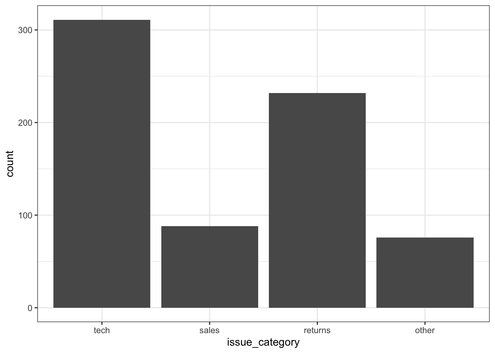

::: {.try data-latex=""}

You probably want to customise some things, like the colours, order of the columns, and their labels. Inspect the code below and try running it layer by layer to figure out where these things change. The functions `scale_fill_manual()` and `scale_x_discrete()` are new, but work in the same way as the other `scale_` functions. You'll learn more about this in Chapter\ \@ref(custom).


<div class='webex-solution'><button>Code</button>

```r
ggplot(survey_data, aes(x = issue_category, 
                        fill = issue_category)) +
  geom_bar() +
  scale_x_discrete(
    # change axis title
    name = "Issue Category", 
    # change order
    limits = c("tech", "returns", "sales", "other"), 
    # change labels
    labels = c("Technical", "Returns", "Sales", "Other") 
  ) +
  scale_fill_manual(
    # change colours
    values = c(tech = "goldenrod", 
                returns = "darkgreen", 
                sales = "dodgerblue3", 
                other = "purple3"),
    # remove the legend
    guide = "none" 
  ) +
  scale_y_continuous(
    name = "", # remove axis title
    # remove the space above and below the y-axis
    expand = expansion(add = 0)
  ) +
  # minimum = 0, maximum = 350
  coord_cartesian(ylim = c(0, 350)) + 
  ggtitle("Number of issues per category") # add a title
```


</div>
:::

#### Column plot

If your data already have a column with the number you want to plot, you can use `geom_col()` to plot it. We can use the `count()` function to make a table with a row for each `issue_category` and a column called `n` with the number of observations in that category.


```r
count_data <- count(x = survey_data, issue_category)
```

<div data-pagedtable="false">
  <script data-pagedtable-source type="application/json">
{"columns":[{"label":["issue_category"],"name":[1],"type":["fct"],"align":["left"]},{"label":["n"],"name":[2],"type":["int"],"align":["right"]}],"data":[{"1":"tech","2":"311"},{"1":"sales","2":"88"},{"1":"returns","2":"232"},{"1":"other","2":"76"}],"options":{"columns":{"min":{},"max":[10]},"rows":{"min":[10],"max":[10]},"pages":{}}}
  </script>
</div>

The mapping for `geom_col()` requires you to set both the `x` and `y` aesthetics. Set `y = n` because we want to plot the number of issues in each category, and that information is in the column called `n`.


```r
ggplot(count_data, aes(x = issue_category, y = n)) +
  geom_col()
```

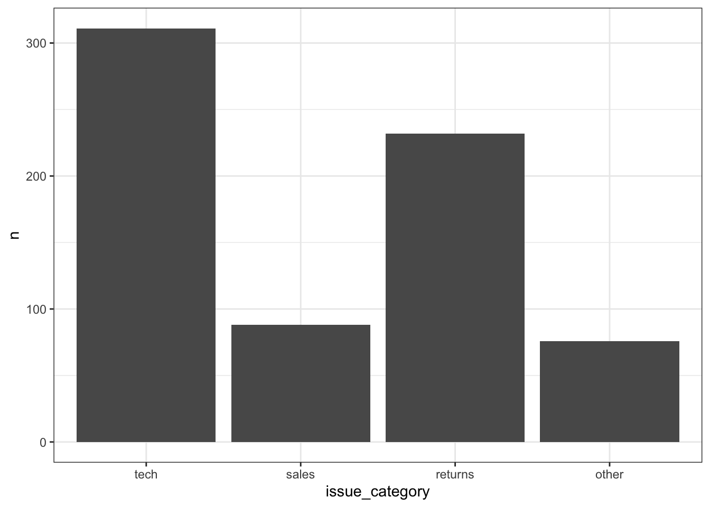


#### Pie chart

Pie charts are a [misleading form of data visualisation](https://www.data-to-viz.com/caveat/pie.html){target="_blank"}, so we won't cover them. We'll cover options for visualising proportions, like waffle, lollipop and treemap plots, in Chapter\ \@ref(other-plots).

#### Test your understanding


Here is a small data table.

country             | population      | island
:-------------------|----------------:|:--------------
Northern Ireland    | 1,895,510       | Ireland
Wales               | 3,169,586       | Great Britain
Republic of Ireland | 4,937,786       | Ireland
Scotland            | 5,466,000       | Great Britain
England             | 56,550,138      | Great Britain

::: {.try data-latex=""}

* What geom would you use to plot the population for each of the 5 countries? <select class='webex-select'><option value='blank'></option><option value='x'>geom_bar</option><option value='answer'>geom_col</option></select>
* What mapping would you use?  <div class='webex-radiogroup' id='radio_QNHFYATOBP'><label><input type="radio" autocomplete="off" name="radio_QNHFYATOBP" value="answer"></input> <span>aes(x = country, y = population)</span></label><label><input type="radio" autocomplete="off" name="radio_QNHFYATOBP" value="x"></input> <span>aes(x = population, y = country)</span></label><label><input type="radio" autocomplete="off" name="radio_QNHFYATOBP" value="x"></input> <span>aes(x = country)</span></label><label><input type="radio" autocomplete="off" name="radio_QNHFYATOBP" value="x"></input> <span>aes(x = island)</span></label><label><input type="radio" autocomplete="off" name="radio_QNHFYATOBP" value="x"></input> <span>aes(y = population)</span></label></div>
* What geom would you use to plot the number of countries on each island? <select class='webex-select'><option value='blank'></option><option value='answer'>geom_bar</option><option value='x'>geom_col</option></select>
* What mapping would you use?  <div class='webex-radiogroup' id='radio_XNLEQSGCZF'><label><input type="radio" autocomplete="off" name="radio_XNLEQSGCZF" value="x"></input> <span>aes(x = country, y = population)</span></label><label><input type="radio" autocomplete="off" name="radio_XNLEQSGCZF" value="x"></input> <span>aes(x = population, y = country)</span></label><label><input type="radio" autocomplete="off" name="radio_XNLEQSGCZF" value="x"></input> <span>aes(x = country)</span></label><label><input type="radio" autocomplete="off" name="radio_XNLEQSGCZF" value="answer"></input> <span>aes(x = island)</span></label><label><input type="radio" autocomplete="off" name="radio_XNLEQSGCZF" value="x"></input> <span>aes(y = population)</span></label></div>
:::

### One continuous variable

If you have a continuous variable, like the number of seconds callers have to wait, you can use `geom_histogram()` or `geom_density()` to show the distribution. Just like `geom_bar()` you are only required to specify the `x` variable.

#### Histogram

A histogram splits the data into "bins" along the x-axis and shows the count of how many observations are in each bin along the y-axis.


```r
ggplot(survey_data, aes(x = wait_time)) +
  geom_histogram()
```

```
## `stat_bin()` using `bins = 30`. Pick better value with `binwidth`.
```

<div class="figure" style="text-align: center">

<p class="caption">(\#fig:unnamed-chunk-19)Histogram of wait times.</p>
</div>

You should always set the `binwidth` or number of `bins` to something meaningful for your data (otherwise you get an annoying message). You might need to try a few options before you find something that looks good and conveys the meaning of your plot -- try changing the values of `binwidth` and `bins` below to see what works best.


```r
# adjust width of each bar
ggplot(survey_data, aes(x = wait_time)) +
  geom_histogram(binwidth = 15)

# adjust number of bars
ggplot(survey_data, aes(x = wait_time)) +
  geom_histogram(bins = 5)
```


By default, the bars start *centered* on 0, so if `binwidth` is set to 15, the first bar would include -7.5 to 7.5 seconds, which doesn't make much sense. We can set `boundary = 0` so that each bar represents increments of 15 seconds *starting* from 0. 


```r
ggplot(survey_data, aes(x = wait_time)) +
  geom_histogram(binwidth = 15, boundary = 0)
```

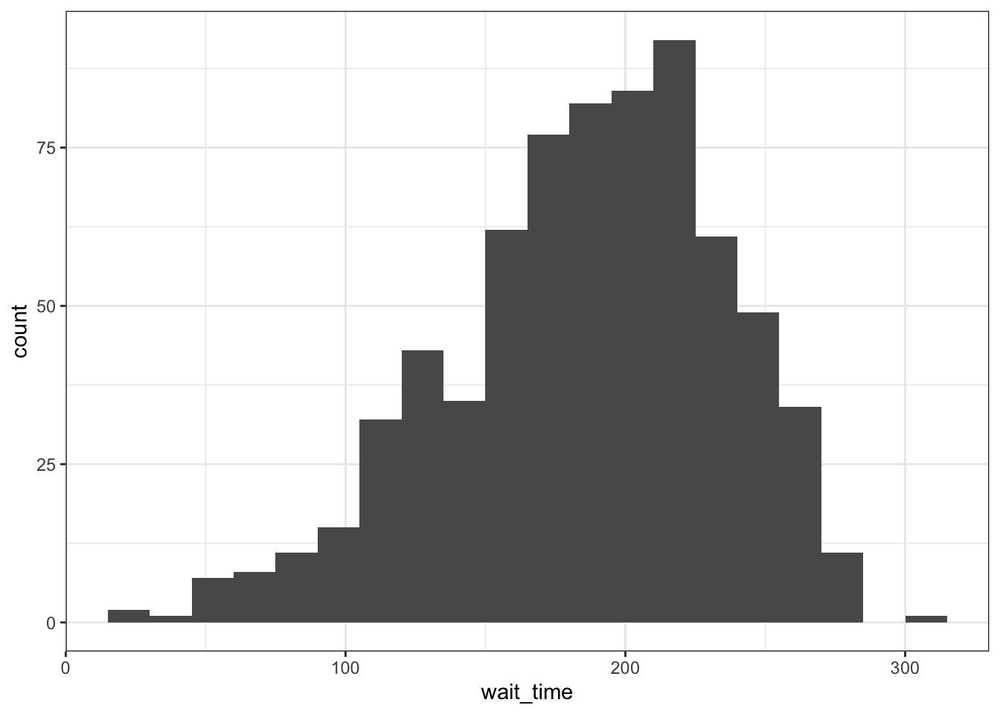


Finally, the default style of grey bars is ugly, so you can change that by setting the `fill` and `colour`, as well as using `scale_x_continuous()` to update the axis labels. 


```r
ggplot(survey_data, aes(x = wait_time)) +
  geom_histogram(binwidth = 15, 
                 boundary = 0, 
                 fill = "white", 
                 color = "black") +
  scale_x_continuous(name = "Wait time (seconds)",
                     breaks = seq(0, 600, 60))
```

<div class="figure" style="text-align: center">

<p class="caption">(\#fig:unnamed-chunk-22)Histogram with custom styles.</p>
</div>

#### Frequency plot

Rather than plotting each bin as a bar, you can connect a line across the top of each bin using a frequency plot. The function `geom_freqpoly()` works the same as `geom_histogram()`, except it can't take a `fill` argument because it's just a line. 


```r
ggplot(survey_data, aes(x = wait_time)) +
  scale_x_continuous(name = "Wait time (seconds)",
                     breaks = seq(0, 600, 60)) +
  geom_freqpoly(boundary = 0, binwidth = 15, 
                color = "black")
```


#### Density plot

If the distribution is smooth, a density plot is often a better way to show the distribution. A density plot doesn't need the `binwidth` or `boundary` arguments because it doesn't split the data into bins, but it can have `fill`.


```r
ggplot(survey_data, aes(x = wait_time)) +
  scale_x_continuous(name = "Wait time (seconds)",
                     breaks = seq(0, 600, 60)) +
  geom_density(fill = "purple", color = "black")
```


#### Test your understanding

Imagine you have a table of the [population for each country in the world](https://population.un.org/wpp/Download/Standard/Population/){target="_blank"} with the columns `country` and `population`. We'll just look at the 76 countries with populations of less than a million.


::: {.try data-latex=""}

* What kind of plot is A? <select class='webex-select'><option value='blank'></option><option value='x'>geom_histogram</option><option value='x'>geom_freqpoly</option><option value='answer'>geom_density</option></select>
* What kind of plot is B? <select class='webex-select'><option value='blank'></option><option value='answer'>geom_histogram</option><option value='x'>geom_freqpoly</option><option value='x'>geom_density</option></select>
* What kind of plot is C? <select class='webex-select'><option value='blank'></option><option value='x'>geom_histogram</option><option value='answer'>geom_freqpoly</option><option value='x'>geom_density</option></select>
* How would you set the mapping for these plots?  <div class='webex-radiogroup' id='radio_DCXRMFEIXV'><label><input type="radio" autocomplete="off" name="radio_DCXRMFEIXV" value="x"></input> <span>aes(x = country, y = population)</span></label><label><input type="radio" autocomplete="off" name="radio_DCXRMFEIXV" value="x"></input> <span>aes(x = population, y = country)</span></label><label><input type="radio" autocomplete="off" name="radio_DCXRMFEIXV" value="answer"></input> <span>aes(x = population)</span></label><label><input type="radio" autocomplete="off" name="radio_DCXRMFEIXV" value="x"></input> <span>aes(x = population, y = count)</span></label></div>
* What is the `binwidth` of the histogram? <select class='webex-select'><option value='blank'></option><option value=''>1</option><option value=''>100</option><option value='answer'>100K</option><option value=''>1M</option></select>
:::

### Grouped continuous variables

There are several ways to compare continuous data across groups. Which you choose depends on what point you are trying to make with the plot.

#### Subdividing distributions

In previous plots, we have used `fill` purely for visual reasons, e.g., we have changed the colour of the histogram bars to make them look nicer. However, you can also use `fill` to represent another variable so that the colours become meaningful. 

Setting the `fill` aesthetic in the mapping will produce different coloured bars for each category of the `fill` variable, in this case `issue_category`. 


```r
ggplot(survey_data, aes(x = wait_time, fill = issue_category)) +
  geom_histogram(boundary = 0, 
                 binwidth = 15,
                 color = "black")
```

<div class="figure" style="text-align: center">
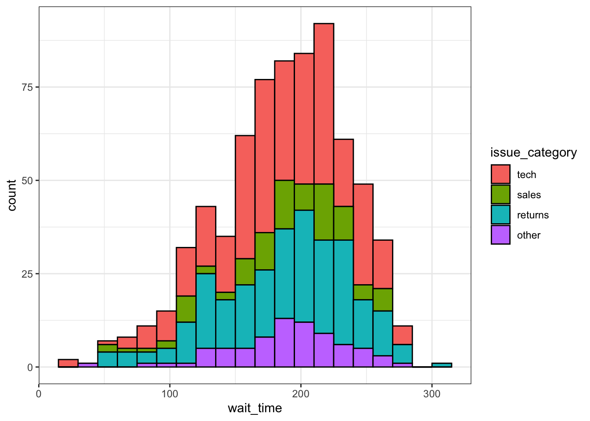
<p class="caption">(\#fig:unnamed-chunk-26)Histogram with categories represented by fill.</p>
</div>


::: {.warning data-latex=""}
When you set an aspect to represent the data, you do this inside the `aes()` function for the mapping, not as an argument to the geom. If you try to set this in a geom, you'll get the following error (unless you coincidentally have an object named `issue_category` that is a colour word).


```r
ggplot(survey_data, aes(x = wait_time)) +
  geom_histogram(boundary = 0, 
                 binwidth = 15, 
                 color = "black",
                 fill = issue_category)
```

```
## Error in layer(data = data, mapping = mapping, stat = stat, geom = GeomBar, : object 'issue_category' not found
```

:::

By default, the categories are positioned stacked on top of each other. The function `geom_area()` gives a similar effect when `stat = "bin"`. 


```r
# area plot
ggplot(survey_data, mapping = aes(x = wait_time, fill = issue_category)) +
  geom_area(stat = "bin", 
            boundary = 0, 
            binwidth = 15, 
            color = "black")
```

<div class="figure" style="text-align: center">
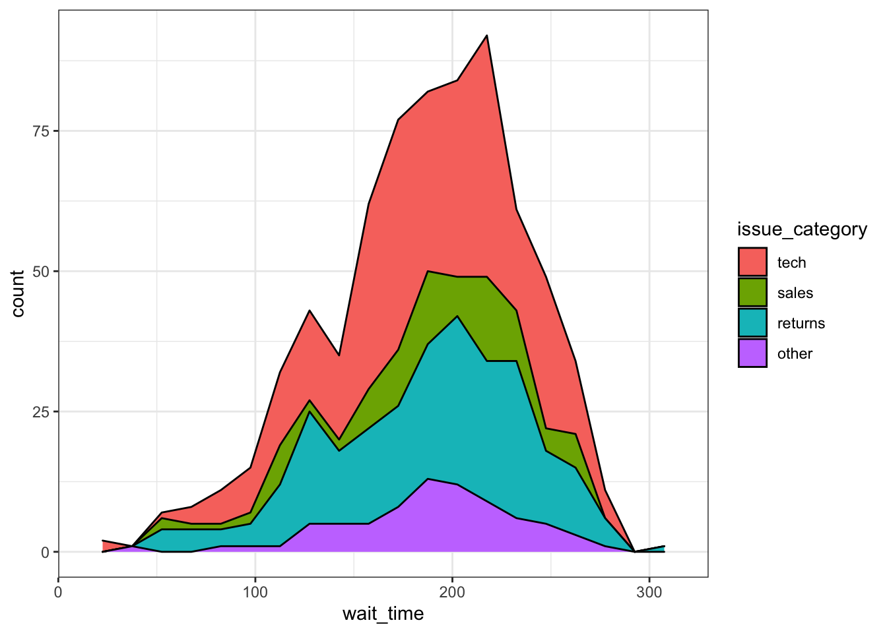
<p class="caption">(\#fig:unnamed-chunk-28)Stacked area plot.</p>
</div>

#### Comparing distributions

If you want to compare more than one distribution, you can set the `position` argument of `geom_histogram()` to "dodge" to put the bars for each group next to each other instead of stacking them. However, this can look confusing with several categories. Instead, use`geom_freqpoly()` to plot a line connecting the top of each bin. 


```r
# dodged histogram
histogram_dodge <- 
  ggplot(survey_data, aes(x = wait_time, 
                          fill = issue_category,
                          colour = issue_category))+
  geom_histogram(boundary = 0, 
                 binwidth = 15, 
                 position = "dodge") +
  scale_x_continuous(name = "Wait time (seconds)",
                     breaks = seq(0, 600, 60)) +
  ggtitle("Dodged Histogram")

# frequency plot
freqpoly_plot <- 
  ggplot(survey_data, aes(x = wait_time,
                          fill = issue_category,
                          colour = issue_category)) +
  geom_freqpoly(binwidth = 15, 
                boundary = 0,
                size = 1) +
  scale_x_continuous(name = "Wait time (seconds)",
                     breaks = seq(0, 600, 60)) +
  ggtitle("Frequency")

# put plots together
histogram_dodge + freqpoly_plot + 
  plot_layout(nrow = 1, guides = "collect") # collects the legends together, try removing this
```

<div class="figure" style="text-align: center">

<p class="caption">(\#fig:unnamed-chunk-29)Different ways to plot the distribution of a continuous variable for multiple groups.</p>
</div>

#### Violin plot

Another way to compare groups of continuous variables is the violin plot. This is like a density plot, but rotated 90 degrees and mirrored - the fatter the violin, the larger proportion of data points there are at that value.


```r
violin_area <- 
  ggplot(survey_data, aes(x = issue_category, y = wait_time)) +
  geom_violin() +
  ggtitle('scale = "area"')

violin_count <- 
  ggplot(survey_data, aes(x = issue_category, y = wait_time)) +
  geom_violin(scale = "count") +
  ggtitle('scale = "count"')

violin_area + violin_count
```

<div class="figure" style="text-align: center">
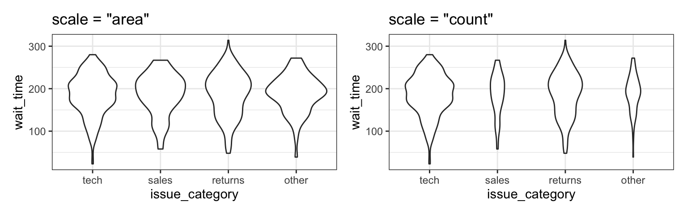
<p class="caption">(\#fig:violin-plot)The default violin plot gives each shape the same area. Set scale='count' to make the size proportional to the number of observations.</p>
</div>

#### Boxplot

Boxplots serve a similar purpose to violin plots (without the giggles from the back row). They don't show you the shape of the distribution, but rather some statistics about it. The middle line represents the <a class='glossary' target='_blank' title='The middle number in a distribution where half of the values are larger and half are smaller.' href='https://psyteachr.github.io/glossary/m#median'>median</a>; half the data are above this line and half below it. The box encloses the 25th to 75th percentiles of the data, so 50% of the data falls inside the box. The "whiskers" extending above and below the box extend 1.5 times the height of the box, although you can change this with the `coef` argument. The points show <a class='glossary' target='_blank' title='A data point that is extremely distant from most of the other data points' href='https://psyteachr.github.io/glossary/o#outlier'>outliers</a> -- individual data points that fall outside of this range.


```r
ggplot(survey_data, aes(x = issue_category, y = wait_time)) +
 geom_boxplot()
```

<div class="figure" style="text-align: center">
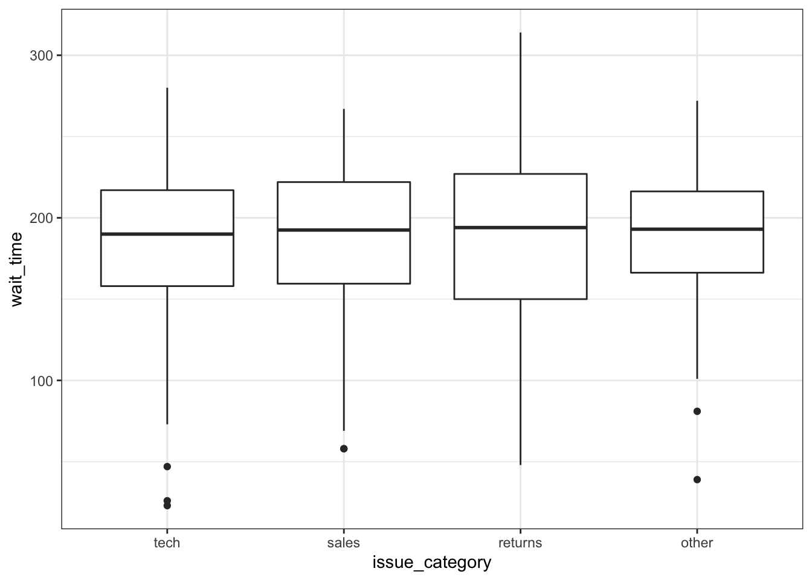
<p class="caption">(\#fig:box-plot)Basic boxplot.</p>
</div>


#### Combo plots

Violin plots are frequently layered with other geoms that represent the mean or median values in the data. This is a lot of code, to help your understanding a) run it layer by layer to see how it builds up and b) change the values throughout the code


```r
# add fill and colour to the mapping

ggplot(survey_data,  aes(x = issue_category, 
                         y = wait_time,
                         fill = issue_category,
                         colour = issue_category)) +
  scale_x_discrete(name = "Issue Category") +
  scale_y_continuous(name = "Wait Time (seconds)",
                     breaks = seq(0, 600, 60)) +
  coord_cartesian(ylim = c(0, 360)) +
  guides(fill = "none", colour = "none") + 
  # add a line at median (50%) score
  geom_violin(alpha = 0.4, 
              draw_quantiles = 0.5) + 
  # add a boxplot
  geom_boxplot(width = 0.25, 
               fill = "white", 
               alpha = 0.75, 
               outlier.alpha = 0) + 
  # add a point that represents the mean
  stat_summary(fun = mean, 
               geom = "point", 
               size = 2) + 
  ggtitle("ViolinBox")
```

<div class="figure" style="text-align: center">

<p class="caption">(\#fig:violin-combos)Violin plots combined with different methods to represent means and medians.</p>
</div>

::: {.dangerous data-latex=""}

A very common type of plot is to produce a bar chart of means, however, the example below demonstrates just how misleading this is. It communicates the mean value for each category, but the bars hide the distribution of the actual data. You can't tell if most wait times are close to 3 minutes, or spread from 0 to 6 minutes, or if the vast majority are less than 2 minutes, but the mean is pulled up by some very high outliers.

<div class="figure" style="text-align: center">
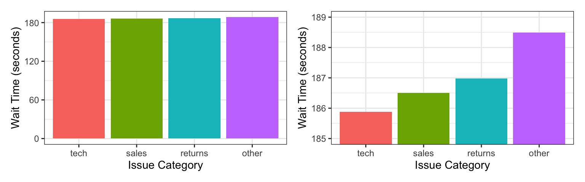
<p class="caption">(\#fig:col-plot-bad)Don't plot continuous data with column plots. They are only appropriate for count data.</p>
</div>

Column plots can also be very misleading. The plot on the left starts the y-axis at 0, which makes the bar heights proportional, showing almost no difference in average wait times. Since the differences are hard to see, you may be tempted to start the y-axis higher, but that makes it look like the average wait time for returns is double that for tech.
:::

#### Test your understanding


::: {.try data-latex=""}
* How would you create plot A? <select class='webex-select'><option value='blank'></option><option value='x'>geom_box()</option><option value='x'>geom_boxplot()</option><option value='answer'>geom_violin()</option><option value='x'>geom_violinplot()</option></select>
* How would you create plot B? <select class='webex-select'><option value='blank'></option><option value='x'>geom_box()</option><option value='answer'>geom_boxplot()</option><option value='x'>geom_violin()</option><option value='x'>geom_violinplot()</option></select>
* What does the mapping look like for both plots? <div class='webex-radiogroup' id='radio_RXPOJVXFZD'><label><input type="radio" autocomplete="off" name="radio_RXPOJVXFZD" value="answer"></input> <span>aes(x = employee_id, y = call_time, fill = employee_id)</span></label><label><input type="radio" autocomplete="off" name="radio_RXPOJVXFZD" value="x"></input> <span>aes(x = employee_id, y = call_time, colour = employee_id)</span></label><label><input type="radio" autocomplete="off" name="radio_RXPOJVXFZD" value="x"></input> <span>aes(x = employee_id, y = call_time, colour = call_time)</span></label><label><input type="radio" autocomplete="off" name="radio_RXPOJVXFZD" value="x"></input> <span>aes(x = employee_id, y = call_time, fill = call_time)</span></label></div>

* Which employee tends to have the longest calls? <select class='webex-select'><option value='blank'></option><option value='x'>e01</option><option value='x'>e02</option><option value='x'>e03</option><option value='answer'>e04</option><option value='x'>e05</option><option value='x'>e06</option><option value='x'>e07</option><option value='x'>e08</option><option value='x'>e09</option><option value='x'>e10</option></select>
* Which employee has the record longest call? <select class='webex-select'><option value='blank'></option><option value='x'>e01</option><option value='x'>e02</option><option value='x'>e03</option><option value='x'>e04</option><option value='x'>e05</option><option value='x'>e06</option><option value='answer'>e07</option><option value='x'>e08</option><option value='x'>e09</option><option value='x'>e10</option></select>
:::


### Two continuous variables

When you want to see how two continuous variables are related, set one as the x-axis and the other as the y-axis. Usually, if one variable causes the other, you plot the cause on the x-axis and the effect on the y-axis. Here, we want to see if longer wait times cause the calls to be longer. 

#### Scatterplot

The function to create a scatterplot is called `geom_point()`.


```r
ggplot(survey_data, aes(x = wait_time, y = call_time)) +
  geom_point()
```

<div class="figure" style="text-align: center">

<p class="caption">(\#fig:demo-point)Scatterplot with geom_point().</p>
</div>

#### Trendlines

In Figure\ \@ref(fig:layers), we emphasised the relationship between wait time and call time with a trendline created by `geom_smooth()` using the argument `method = lm` ("lm" stands for "linear model" or a straight line relationship). You can also set `method = loess` to visualise a non-linear relationship.


```r
lm_plot <- 
  ggplot(survey_data, aes(x = wait_time, y = call_time)) +
  geom_point(alpha = 0.2) +
  geom_smooth(method = lm, formula = y~x) +
  ggtitle("method = lm")

loess_plot <- 
  ggplot(survey_data, aes(x = wait_time, y = call_time)) +
  geom_point(alpha = 0.2) +
  geom_smooth(method = loess, formula = y~x) +
  ggtitle("method = loess")

lm_plot + loess_plot
```

<div class="figure" style="text-align: center">
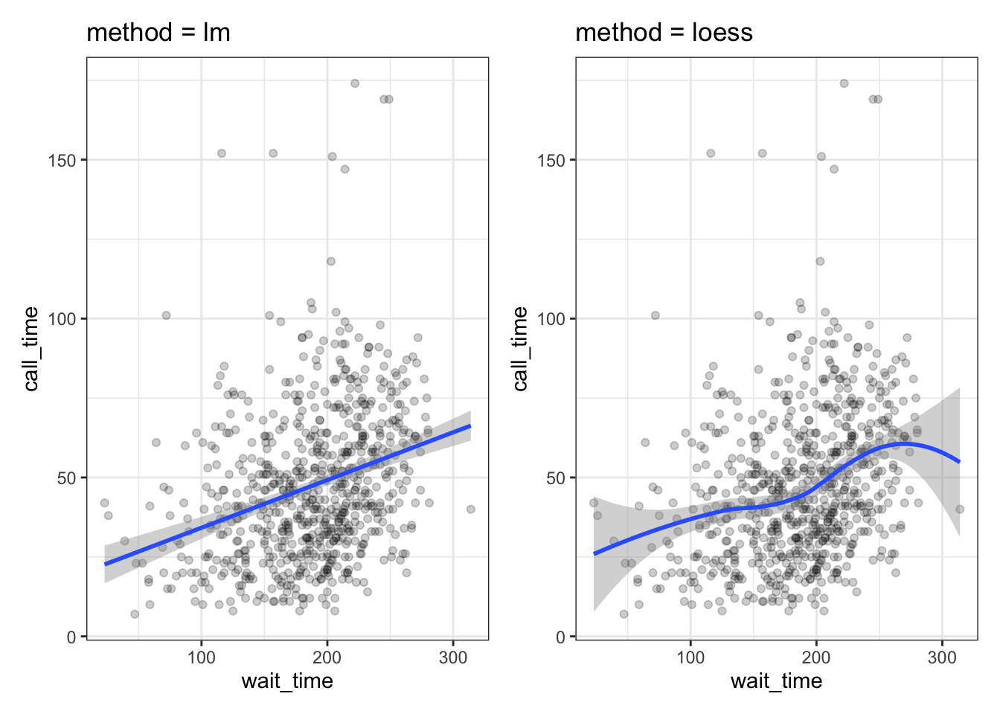
<p class="caption">(\#fig:unnamed-chunk-30)Different ways to show the relationship between two continuous variables.</p>
</div>

::: {.warning data-latex=""}
If there isn't much data at the extremes of the x-axis, the curve can be very uncertain. This is represented by the wider shaded area, which means that the true relationship might be anywhere within that area. Add the argument `se = FALSE` to `geom_smooth()` to remove this "standard error" shading.
:::


#### Dates

The `call_start` column contains both a date and a time, so use the `date()` function from <code class='package'>lubridate</code> to convert it to just a date. We'll need it in this format to be able to transform the x-axis below.


```r
ggplot(survey_data, aes(x = lubridate::date(call_start), 
                        y = satisfaction)) + 
  geom_smooth(method = lm, formula = y~x)
```

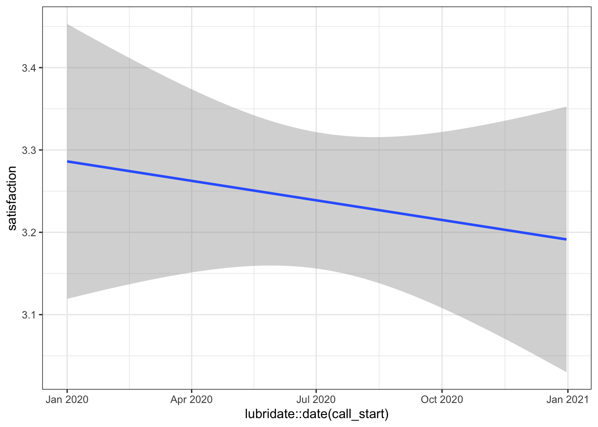

We can use `scale_x_date()` to set the `date_breaks` to be "1 month" apart. The `date_labels` argument uses a code for different date formats; you can see the full list of possibilities in the help for `?strptime`. For example, `%b` means "Abbreviated month name", whilst if you wanted to use a format like "2020/01/31" you could try `"%Y/%m/%d"`.


```r
ggplot(survey_data, aes(x = lubridate::date(call_start), 
                        y = satisfaction)) +
  geom_smooth(method = lm, formula = y~x) +
  scale_x_date(name = "",
               date_breaks = "1 month", 
               date_labels = "%b") +
  scale_y_continuous(name = "Caller Satisfaction") +
  ggtitle("2020 Caller Satisfaction")
```

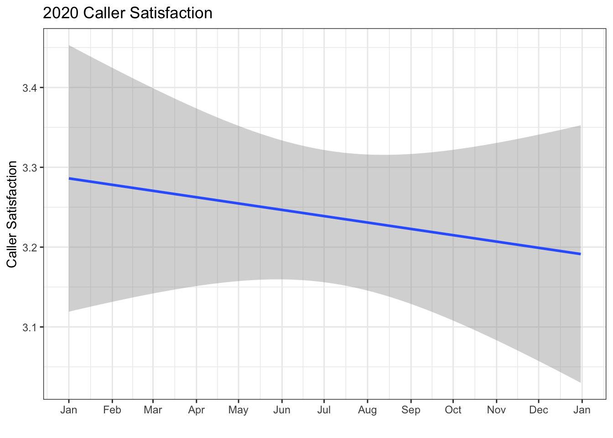

::: {.try data-latex=""}
It looks like customer satisfaction declined across the year, but is this change meaningful? See what the plot looks like when the y-axis spans the full range of possible satisfaction values from 1 to 5. You can also plot the individual data points to emphasise the range of values. 


<div class='webex-solution'><button>Solution</button>

```r
ggplot(survey_data, aes(x = lubridate::date(call_start), 
                        y = satisfaction)) +
  # show individual data, jitter the height to avoid overlap
  geom_jitter(width = 0, height = .1, alpha = 0.2) + 
  geom_smooth(method = lm,  formula = y~x) +
  scale_x_date(name = "",
               date_breaks = "1 month", 
               date_labels = "%b") +
  scale_y_continuous(name = "Caller Satisfaction",
                     breaks = 1:5) +
  coord_cartesian(ylim = c(1, 5)) + # changes limits
  ggtitle("2020 Caller Satisfaction")
```

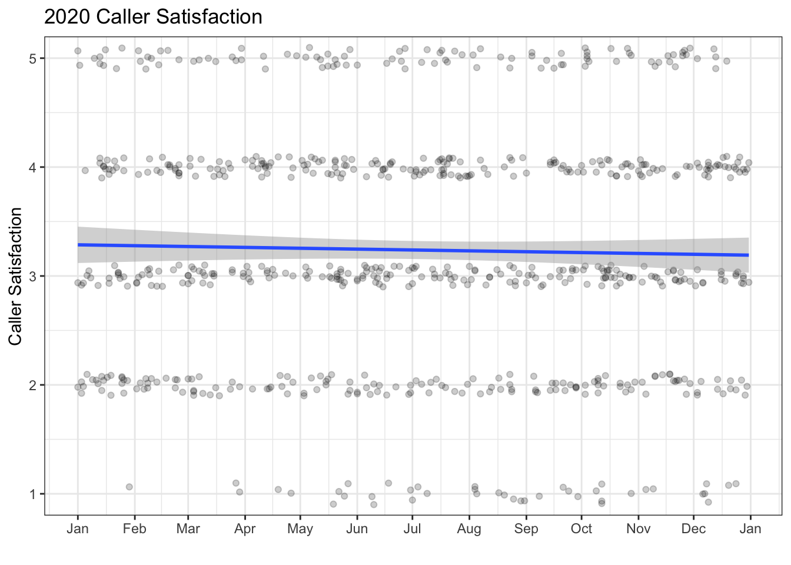
</div>

:::


### Ordinal variables

When you have a limited range of numeric values, such as an ordinal rating scale, sometimes overlapping data makes it difficult to see what is going on in a point plot. For example, the plot below shows satisfaction ratings by call time but because all the ratings are 1, 2, 3, 4 or 5, it makes it hard to see exactly how many data points there are at each point.

In this section, we'll explore a few options for dealing with this.


```r
ggplot(survey_data, aes(x = call_time, y = satisfaction)) + 
  geom_point()
```

<div class="figure" style="text-align: center">

<p class="caption">(\#fig:over-plot)Overlapping data.</p>
</div>

#### Jitter plot

You can use `geom_jitter()` to move the points around a bit to make them easier to see. You can also set alpha transparency. Here, the x-axis is continuous, so there is no need to jitter the `width`, but the y-axis is ordinal categories, so the `height` is jittered between -0.2 and +0.2 away from the true y-value. It can help to play around with these values to understand what the jitter is doing.


```r
ggplot(survey_data, aes(x = call_time, y = satisfaction)) +
  geom_jitter(width = 0, height = .2, alpha = 0.5)
```

<div class="figure" style="text-align: center">
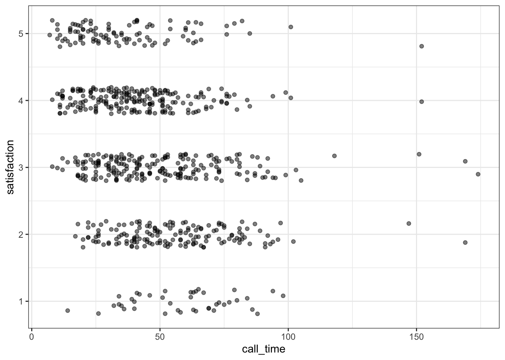
<p class="caption">(\#fig:jitter-plot)Jitter plot.</p>
</div>

#### Facets

Alternatively, you can use `facet_wrap()` to create a separate plot for each level of satisfaction. `facet_wrap()` uses the tilde (~) symbol, which you can roughly translate as "by", e.g., facet the plot *by* satisfaction rating. The `labeller` function controls the labels above each plot. `label_both` specifies that we want both the variable name (satisfaction) and the value (e.g., 1) printed on the plot to make it easier to read.


```r
ggplot(survey_data, aes(x = call_time)) +
  geom_histogram(binwidth = 10, 
                 boundary = 0, 
                 fill = "dodgerblue", 
                 color = "black") +
  facet_wrap(~satisfaction, 
             ncol = 1, # try changing this to 2 
             labeller = label_both) +
  scale_x_continuous(name = "Call Time (seconds)",
                     breaks = seq(0, 600, 30))
```

<div class="figure" style="text-align: center">

<p class="caption">(\#fig:fact-plot)A histogram with facets.</p>
</div>

::: {.info data-latex=""}
These are not, by any means, all the plot types that you can make in R. This chapter just gave you a basic overview, and we will go into more detail in Chapter\ \@ref(custom). The [further resources](#resources-viz) section at the end of this chapter lists many resources, but the [R Graph Gallery](http://www.r-graph-gallery.com/){target="_blank"} is an especially useful one to get inspiration for the kinds of beautiful plots you can make in R. 
:::

## Exercises

For the final step in this chapter, we will create a report of data visualisations. You may need to refer back to Chapter\ \@ref(reports) to help you complete these exercises and you may also want to take a break before you work through this section. We'd also recommend you <a class='glossary' target='_blank' title='To create an HTML, PDF, or Word document from an R Markdown (Rmd) document' href='https://psyteachr.github.io/glossary/k#knit'>knit</a> at every step so that you can see how your output changes.

### New Markdown {#exercises-new-rmd-3}

Create and save a new R Markdown document named `plots_report.Rmd` and give it the title "Customer satisfaction report". Remove the default template text and then load the packages and code below in the set-up code chunk:


```r
library(tidyverse) 
library(patchwork) 
library(ggthemes)  
library(lubridate) 
library(knitr)
library(kableExtra)

survey_data <- read_csv("https://psyteachr.github.io/ads-v1/data/survey_data.csv")
```

### Summary {#exercises-summary}

Create a level 1 heading titled "Overview". Underneath this heading, write a short summary of what the data set contains and what each of the variables means (you can use the information from Section\ \@ref(plots-loading-data) if you like).

### Presenting plots

Pick your two favourites plots from all the examples we've made in this chapter. For each plot:

* Create a level 2 heading in your R Markdown document and give it an informative title.
* Write a short summary that interprets the data shown in the plots - it's not enough just to present visualisations, effective reports will also help the reader understand the conclusions they should draw from the plots you've presented.
* Look through the different themes available with [ggtheme](https://yutannihilation.github.io/allYourFigureAreBelongToUs/ggthemes/) and  choose one to apply to your plots.
* Make sure each plot has a figure caption (either by adding this to the `ggplot()` code or adding it to the code chunk options).
* Organise your Markdown so that the plots are shown **after** the text summary.

### Combining plots

Now, pick your two least favourite plots:

* Adjust the visual aesthetics to make them look as bad and as difficult to read as possible.
* Combine the plots using patchwork functions.
* Write a short summary that explains why you think these plots are so bad.
* Organise your Markdown so that the plots are shown **after** the text summary.

### Editing your Markdown display

Adjust the set-up of your Markdown so that your knitted report does not show any code, messages, or warnings, and all figures are 8 x 5 (see Chapter\ \@ref(rmd-setup)).

### Change the output

So far we've just knitted to html. To generate PDF reports, you need to install <code class='package'>tinytex</code> [@R-tinytex] and run the following code in the console (do **not** add this to your Rmd file):


```r
# run this in the console
install.packages("tinytex")
tinytex::install_tinytex()
```

Once you've done this, update your YAML heading to include the following:

    ---
    title: "Customer Satisfaction Report"
    author: "Your name"
    output:
      pdf_document:
    ---

This will knit a PDF document. You will likely encounter errors - knitting to pdf really is the seventh circle of hell. If this happens, ask on Teams for help.

As an alternative, you can also knit to a Word document.

    ---
    title: "Customer Satisfaction Report"
    author: "Your name"
    output:
      word_document:
    ---

### Share your work

Once you've completed this activity, post it in the Week 3 channel on Teams so that you can compare which plots you chose and visual style with other learners on the course.

## Glossary {#glossary-viz}

<table>
 <thead>
  <tr>
   <th style="text-align:left;"> term </th>
   <th style="text-align:left;"> definition </th>
  </tr>
 </thead>
<tbody>
  <tr>
   <td style="text-align:left;"> [argument](https://psyteachr.github.io/glossary/a.html#argument){class="glossary" target="_blank"} </td>
   <td style="text-align:left;"> A variable that provides input to a function. </td>
  </tr>
  <tr>
   <td style="text-align:left;"> [categorical](https://psyteachr.github.io/glossary/c.html#categorical){class="glossary" target="_blank"} </td>
   <td style="text-align:left;"> Data that can only take certain values, such as types of pet. </td>
  </tr>
  <tr>
   <td style="text-align:left;"> [character](https://psyteachr.github.io/glossary/c.html#character){class="glossary" target="_blank"} </td>
   <td style="text-align:left;"> A data type representing strings of text. </td>
  </tr>
  <tr>
   <td style="text-align:left;"> [chunk](https://psyteachr.github.io/glossary/c.html#chunk){class="glossary" target="_blank"} </td>
   <td style="text-align:left;"> A section of code in an R Markdown file </td>
  </tr>
  <tr>
   <td style="text-align:left;"> [continuous](https://psyteachr.github.io/glossary/c.html#continuous){class="glossary" target="_blank"} </td>
   <td style="text-align:left;"> Data that can take on any values between other existing values. </td>
  </tr>
  <tr>
   <td style="text-align:left;"> [data type](https://psyteachr.github.io/glossary/d.html#data-type){class="glossary" target="_blank"} </td>
   <td style="text-align:left;"> The kind of data represented by an object. </td>
  </tr>
  <tr>
   <td style="text-align:left;"> [default value](https://psyteachr.github.io/glossary/d.html#default-value){class="glossary" target="_blank"} </td>
   <td style="text-align:left;"> A value that a function uses for an argument if it is skipped. </td>
  </tr>
  <tr>
   <td style="text-align:left;"> [double](https://psyteachr.github.io/glossary/d.html#double){class="glossary" target="_blank"} </td>
   <td style="text-align:left;"> A data type representing a real decimal number </td>
  </tr>
  <tr>
   <td style="text-align:left;"> [factor](https://psyteachr.github.io/glossary/f.html#factor){class="glossary" target="_blank"} </td>
   <td style="text-align:left;"> A data type where a specific set of values are stored with labels; An explanatory variable manipulated by the experimenter </td>
  </tr>
  <tr>
   <td style="text-align:left;"> [geom](https://psyteachr.github.io/glossary/g.html#geom){class="glossary" target="_blank"} </td>
   <td style="text-align:left;"> The geometric style in which data are displayed, such as boxplot, density, or histogram. </td>
  </tr>
  <tr>
   <td style="text-align:left;"> [integer](https://psyteachr.github.io/glossary/i.html#integer){class="glossary" target="_blank"} </td>
   <td style="text-align:left;"> A data type representing whole numbers. </td>
  </tr>
  <tr>
   <td style="text-align:left;"> [knit](https://psyteachr.github.io/glossary/k.html#knit){class="glossary" target="_blank"} </td>
   <td style="text-align:left;"> To create an HTML, PDF, or Word document from an R Markdown (Rmd) document </td>
  </tr>
  <tr>
   <td style="text-align:left;"> [likert](https://psyteachr.github.io/glossary/l.html#likert){class="glossary" target="_blank"} </td>
   <td style="text-align:left;"> A rating scale with a small number of discrete points in order </td>
  </tr>
  <tr>
   <td style="text-align:left;"> [logical](https://psyteachr.github.io/glossary/l.html#logical){class="glossary" target="_blank"} </td>
   <td style="text-align:left;"> A data type representing TRUE or FALSE values. </td>
  </tr>
  <tr>
   <td style="text-align:left;"> [median](https://psyteachr.github.io/glossary/m.html#median){class="glossary" target="_blank"} </td>
   <td style="text-align:left;"> The middle number in a distribution where half of the values are larger and half are smaller. </td>
  </tr>
  <tr>
   <td style="text-align:left;"> [nominal](https://psyteachr.github.io/glossary/n.html#nominal){class="glossary" target="_blank"} </td>
   <td style="text-align:left;"> Categorical variables that don&#39;t have an inherent order, such as types of animal. </td>
  </tr>
  <tr>
   <td style="text-align:left;"> [numeric](https://psyteachr.github.io/glossary/n.html#numeric){class="glossary" target="_blank"} </td>
   <td style="text-align:left;"> A data type representing a real decimal number or integer. </td>
  </tr>
  <tr>
   <td style="text-align:left;"> [observation](https://psyteachr.github.io/glossary/o.html#observation){class="glossary" target="_blank"} </td>
   <td style="text-align:left;"> All of the data about a single trial or question. </td>
  </tr>
  <tr>
   <td style="text-align:left;"> [ordinal](https://psyteachr.github.io/glossary/o.html#ordinal){class="glossary" target="_blank"} </td>
   <td style="text-align:left;"> Discrete variables that have an inherent order, such as number of legs </td>
  </tr>
  <tr>
   <td style="text-align:left;"> [outlier](https://psyteachr.github.io/glossary/o.html#outlier){class="glossary" target="_blank"} </td>
   <td style="text-align:left;"> A data point that is extremely distant from most of the other data points </td>
  </tr>
  <tr>
   <td style="text-align:left;"> [r markdown](https://psyteachr.github.io/glossary/r.html#r-markdown){class="glossary" target="_blank"} </td>
   <td style="text-align:left;"> The R-specific version of markdown: a way to specify formatting, such as headers, paragraphs, lists, bolding, and links, as well as code blocks and inline code. </td>
  </tr>
  <tr>
   <td style="text-align:left;"> [string](https://psyteachr.github.io/glossary/s.html#string){class="glossary" target="_blank"} </td>
   <td style="text-align:left;"> A piece of text inside of quotes. </td>
  </tr>
  <tr>
   <td style="text-align:left;"> [tidy data](https://psyteachr.github.io/glossary/t.html#tidy-data){class="glossary" target="_blank"} </td>
   <td style="text-align:left;"> A format for data that maps the meaning onto the structure. </td>
  </tr>
  <tr>
   <td style="text-align:left;"> [value](https://psyteachr.github.io/glossary/v.html#value){class="glossary" target="_blank"} </td>
   <td style="text-align:left;"> A single number or piece of data. </td>
  </tr>
  <tr>
   <td style="text-align:left;"> [variable](https://psyteachr.github.io/glossary/v.html#variable){class="glossary" target="_blank"} </td>
   <td style="text-align:left;"> A word that identifies and stores the value of some data for later use. </td>
  </tr>
  <tr>
   <td style="text-align:left;"> [vector](https://psyteachr.github.io/glossary/v.html#vector){class="glossary" target="_blank"} </td>
   <td style="text-align:left;"> A type of data structure that collects values with the same data type, like T/F values, numbers, or strings. </td>
  </tr>
</tbody>
</table>


## Further Resources {#resources-viz}

* [Data visualisation using R, for researchers who don't use R](https://psyteachr.github.io/introdataviz/) [@nordmann_2021]
* [Chapter 3: Data Visualisation](http://r4ds.had.co.nz/data-visualisation.html) of *R for Data Science*
* [ggplot2 cheat sheet](https://raw.githubusercontent.com/rstudio/cheatsheets/main/data-visualization.pdf)
* [ggplot2 FAQs](https://ggplot2.tidyverse.org/articles/)
* [ggplot2 documentation](https://ggplot2.tidyverse.org/reference/)
* [Hack Your Data Beautiful](https://psyteachr.github.io/hack-your-data/) workshop by University of Glasgow postgraduate students
* [Chapter 28: Graphics for communication](http://r4ds.had.co.nz/graphics-for-communication.html) of *R for Data Science*

<!--chapter:end:03-viz.Rmd-->

# Data Import {#data}

## Intended Learning Outcomes {#ilo-data}

* Be able to inspect data
* Be able to import data from a range of sources
* Be able to identify and handle common problems with data import

## Set-up

Create a new project for the work we'll do in this chapter named <code class='path'>04-data</code>. Then, create and save a new R Markdown document named `data.Rmd`, get rid of the default template text, and load the packages in the set-up code chunk. You should have all of these packages installed already, but if you get the message `Error in library(x) : there is no package called ‘x’`, please refer to Chapter\ \@ref(install-package).

<div class='verbatim'><pre class='sourceCode r'><code class='sourceCode R'>&#96;&#96;&#96;{r setup, include=FALSE}</code></pre>

```r
library(tidyverse)     # includes readr & tibble
library(rio)           # for almost any data import/export
library(haven)         # for SPSS, Stata,and SAS files
library(readxl)        # for Excel files
library(googlesheets4) # for Google Sheets
```

<pre class='sourceCode r'><code class='sourceCode R'>&#96;&#96;&#96;</code></pre></div>

We'd recommend making a new code chunk for each different activity, and using the white space to make notes on any errors you make, things you find interesting, or questions you'd like to ask the course team.

## Built-in data {#builtin}

You'll likely want to import you own data to work with, however, Base R also comes with built-in datasets and these can be very useful for learning new functions and packages. Additionally, some packages, like <code class='package'>tidyr</code>, also contain data. The <code><span class='fu'><a target='_blank' href='https://rdrr.io/r/utils/data.html'>data</a></span><span class='op'>(</span><span class='op'>)</span></code> function lists the datasets available.


```r
# list datasets built in to base R
data()

# lists datasets in a specific package
data(package = "tidyr")
```

Type the name of a dataset into the <a class='glossary' target='_blank' title='The pane in RStudio where you can type in commands and view output messages.' href='https://psyteachr.github.io/glossary/c#console'>console</a> to see the data. For example, type `?table1` into the console to see the dataset description for `table1`, which is a dataset included with <code class='package'>tidyr</code>.


```r
?table1
```

You can also use the <code><span class='fu'><a target='_blank' href='https://rdrr.io/r/utils/data.html'>data</a></span><span class='op'>(</span><span class='op'>)</span></code> function to load a dataset into your <a class='glossary' target='_blank' title='The interactive workspace where your script runs' href='https://psyteachr.github.io/glossary/g#global-environment'>global environment</a>.


```r
# loads table1 into the environment
data("table1")
```


## Looking at data

Now that you've loaded some data, look the upper right hand window of RStudio, under the Environment tab. You will see the object `table1` listed, along with the number of observations (rows) and variables (columns). This is your first check that everything went OK.

**Always, always, always, look at your data once you've created or loaded a table**. Also look at it after each step that transforms your table. There are three main ways to look at your table: <code><span class='fu'><a target='_blank' href='https://rdrr.io/r/utils/View.html'>View</a></span><span class='op'>(</span><span class='op'>)</span></code>, <code><span class='fu'><a target='_blank' href='https://rdrr.io/r/base/print.html'>print</a></span><span class='op'>(</span><span class='op'>)</span></code>, <code><span class='fu'>tibble</span><span class='fu'>::</span><span class='fu'><a target='_blank' href='https://rdrr.io/pkg/pillar/man/glimpse.html'>glimpse</a></span><span class='op'>(</span><span class='op'>)</span></code>. 

### View() 

A familiar way to look at the table is given by <code><span class='fu'><a target='_blank' href='https://rdrr.io/r/utils/View.html'>View</a></span><span class='op'>(</span><span class='op'>)</span></code> (uppercase 'V'), which opens up a data table in the console pane using a viewer that looks a bit like Excel. This command can be useful in the console, but don't ever put this one in a script because it will create an annoying pop-up window when the user runs it. You can also click on an object in the  <a class='glossary' target='_blank' title='RStudio is arranged with four window "panes".' href='https://psyteachr.github.io/glossary/p#panes'>environment pane</a> to open it in the same interface. You can close the tab when you're done looking at it; it won't remove the object.


```r
View(table1)
```


### print() 

The <code><span class='fu'><a target='_blank' href='https://rdrr.io/r/base/print.html'>print</a></span><span class='op'>(</span><span class='op'>)</span></code> method can be run explicitly, but is more commonly called by just typing the variable name on a blank line. The default is not to print the entire table, but just the first 10 rows. 

Let's look at the `table1` table that we loaded above. Depending on how wide your screen is, you might need to click on an arrow at the right of the table to see the last column. 


```r
# call print explicitly
print(table1)

# more common method of just calling object name
table1
```

<div data-pagedtable="false">
  <script data-pagedtable-source type="application/json">
{"columns":[{"label":["country"],"name":[1],"type":["chr"],"align":["left"]},{"label":["year"],"name":[2],"type":["int"],"align":["right"]},{"label":["cases"],"name":[3],"type":["int"],"align":["right"]},{"label":["population"],"name":[4],"type":["int"],"align":["right"]}],"data":[{"1":"Afghanistan","2":"1999","3":"745","4":"19987071"},{"1":"Afghanistan","2":"2000","3":"2666","4":"20595360"},{"1":"Brazil","2":"1999","3":"37737","4":"172006362"},{"1":"Brazil","2":"2000","3":"80488","4":"174504898"},{"1":"China","2":"1999","3":"212258","4":"1272915272"},{"1":"China","2":"2000","3":"213766","4":"1280428583"}],"options":{"columns":{"min":{},"max":[10]},"rows":{"min":[10],"max":[10]},"pages":{}}}
  </script>
</div>

### glimpse() 

The function <code><span class='fu'>tibble</span><span class='fu'>::</span><span class='fu'><a target='_blank' href='https://rdrr.io/pkg/pillar/man/glimpse.html'>glimpse</a></span><span class='op'>(</span><span class='op'>)</span></code> gives a sideways version of the table. This is useful if the table is very wide and you can't easily see all of the columns. It also tells you the <a class='glossary' target='_blank' title='The kind of data represented by an object.' href='https://psyteachr.github.io/glossary/d#data-type'>data type</a> of each column in angled brackets after each column name. 


```r
glimpse(table1)
```

```
## Rows: 6
## Columns: 4
## $ country    <chr> "Afghanistan", "Afghanistan", "Brazil", "Brazil", "China", …
## $ year       <int> 1999, 2000, 1999, 2000, 1999, 2000
## $ cases      <int> 745, 2666, 37737, 80488, 212258, 213766
## $ population <int> 19987071, 20595360, 172006362, 174504898, 1272915272, 12804…
```

### summary() {#summary-function}

You can get a quick summary of a dataset with the <code><span class='fu'><a target='_blank' href='https://rdrr.io/r/base/summary.html'>summary</a></span><span class='op'>(</span><span class='op'>)</span></code> function, which can be useful for spotting things like if the minimum or maximum values are clearly wrong, or if R thinks that a <a class='glossary' target='_blank' title='Categorical variables that don&#39;t have an inherent order, such as types of animal.' href='https://psyteachr.github.io/glossary/n#nominal'>nominal</a> variable is <a class='glossary' target='_blank' title='A data type representing a real decimal number or integer.' href='https://psyteachr.github.io/glossary/n#numeric'>numeric</a>. For example, if you had labelled gender as 1, 2, and 3 rather than male, female, and non-binary, `summary()` would calculate a mean and median even though this isn't appropriate for the data. This can be a useful flag that you need to take further steps to correct your data. 

Note that because `population` is a very, very large number, R will use [scientific notation](https://courses.lumenlearning.com/waymakerintermediatealgebra/chapter/read-writing-scientific-notation-2/). 


```r
summary(table1)
```

```
##    country               year          cases          population       
##  Length:6           Min.   :1999   Min.   :   745   Min.   :1.999e+07  
##  Class :character   1st Qu.:1999   1st Qu.: 11434   1st Qu.:5.845e+07  
##  Mode  :character   Median :2000   Median : 59112   Median :1.733e+08  
##                     Mean   :2000   Mean   : 91277   Mean   :4.901e+08  
##                     3rd Qu.:2000   3rd Qu.:179316   3rd Qu.:9.983e+08  
##                     Max.   :2000   Max.   :213766   Max.   :1.280e+09
```


## Importing data {#import_data}

Built-in data are nice for examples, but you're probably more interested in your own data. There are many different types of files that you might work with when doing data analysis. These different file types are usually distinguished by the three-letter <a class='glossary' target='_blank' title='The end part of a file name that tells you what type of file it is (e.g., .R or .Rmd).' href='https://psyteachr.github.io/glossary/e#extension'>extension</a> following a period at the end of the file name (e.g., `.xls`). 

Download this [directory of data files](data/data.zip), unzip the folder, and save the `data` directory in the `04-data` project directory.


### rio::import()  

The type of data files you have to work with will likely depend on the software that you typically use in your workflow. The <code class='package'>rio</code> package has very straightforward functions for reading and saving data in most common formats: <code><span class='fu'>rio</span><span class='fu'>::</span><span class='fu'><a target='_blank' href='https://rdrr.io/pkg/rio/man/import.html'>import</a></span><span class='op'>(</span><span class='op'>)</span></code> and <code><span class='fu'>rio</span><span class='fu'>::</span><span class='fu'><a target='_blank' href='https://rdrr.io/pkg/rio/man/export.html'>export</a></span><span class='op'>(</span><span class='op'>)</span></code>. 


```r
demo_tsv  <- import("data/demo.tsv")  # tab-separated values
demo_csv  <- import("data/demo.csv")  # comma-separated values
demo_xls  <- import("data/demo.xlsx") # Excel format
demo_sav  <- import("data/demo.sav")  # SPSS format
```


### File type specific import 

However, it is also useful to know the specific functions that are used to import different file types because it is easier to discover features to deal with complicated cases, such as when you need to skip rows, rename columns, or choose which Excel sheet to use.


```r
demo_tsv <- readr::read_tsv("data/demo.tsv")
demo_csv <- readr::read_csv("data/demo.csv")
demo_xls <- readxl::read_excel("data/demo.xlsx")
demo_sav <- haven::read_sav("data/demo.sav")
```

::: {.try data-latex=""}
Look at the help for each function above and read through the Arguments section to see how you can customise import.
:::

If you keep data in Google Sheets, you can access it directly from R using <code class='package'><a href='https://googlesheets4.tidyverse.org/' target='_blank'>googlesheets4</a></code>. The code below imports data from a [public sheet](https://docs.google.com/spreadsheets/d/16dkq0YL0J7fyAwT1pdgj1bNNrheckAU_2-DKuuM6aGI){target="_blank"}. You can set the `ss` argument to the entire <a class='glossary' target='_blank' title='' href='https://psyteachr.github.io/glossary/u#url'>URL</a> for the target sheet, or just the section after "https://docs.google.com/spreadsheets/d/".


```r
gs4_deauth() # skip authorisation for public data

demo_gs4  <- googlesheets4::read_sheet(
  ss = "16dkq0YL0J7fyAwT1pdgj1bNNrheckAU_2-DKuuM6aGI"
)
```


### Column data types {#col_types}

Use `glimpse()` to see how these different functions imported the data with slightly different data types. This is because the different file types store data slightly differently. For example, SPSS stores factors as numbers, so the `factor` column contains the values 1, 2, 3 rather than `low`, `med`, `high`. It also stores <a class='glossary' target='_blank' title='A data type representing TRUE or FALSE values.' href='https://psyteachr.github.io/glossary/l#logical'>logical</a> values as 0 and 1 instead or TRUE and FALSE.


```r
glimpse(demo_csv)
```

```
## Rows: 6
## Columns: 6
## $ character <chr> "A", "B", "C", "D", "E", "F"
## $ factor    <chr> "high", "low", "med", "high", "low", "med"
## $ integer   <dbl> 1, 2, 3, 4, 5, 6
## $ double    <dbl> 1.5, 2.5, 3.5, 4.5, 5.5, 6.5
## $ logical   <lgl> TRUE, TRUE, FALSE, FALSE, NA, TRUE
## $ date      <date> 2022-02-05, 2022-02-04, 2022-02-03, 2022-02-02, 2022-02-01, …
```


```r
glimpse(demo_xls)
```

```
## Rows: 6
## Columns: 6
## $ character <chr> "A", "B", "C", "D", "E", "F"
## $ factor    <chr> "high", "low", "med", "high", "low", "med"
## $ integer   <dbl> 1, 2, 3, 4, 5, 6
## $ double    <dbl> 1.5, 2.5, 3.5, 4.5, 5.5, 6.5
## $ logical   <lgl> TRUE, TRUE, FALSE, FALSE, NA, TRUE
## $ date      <dttm> 2022-02-05, 2022-02-04, 2022-02-03, 2022-02-02, 2022-02-01, …
```


```r
glimpse(demo_sav)
```

```
## Rows: 6
## Columns: 6
## $ character <chr> "A", "B", "C", "D", "E", "F"
## $ factor    <dbl+lbl> 3, 1, 2, 3, 1, 2
## $ integer   <dbl> 1, 2, 3, 4, 5, 6
## $ double    <dbl> 1.5, 2.5, 3.5, 4.5, 5.5, 6.5
## $ logical   <dbl> 1, 1, 0, 0, NA, 1
## $ date      <date> 2022-02-05, 2022-02-04, 2022-02-03, 2022-02-02, 2022-02-01, …
```


```r
glimpse(demo_gs4)
```

```
## Rows: 6
## Columns: 6
## $ character <chr> "A", "B", "C", "D", "E", "F"
## $ factor    <chr> "high", "low", "med", "high", "low", "med"
## $ integer   <dbl> 1, 2, 3, 4, 5, 6
## $ double    <dbl> 1.5, 2.5, 3.5, 4.5, 5.5, 6.5
## $ logical   <lgl> TRUE, TRUE, FALSE, FALSE, NA, TRUE
## $ date      <dttm> 2021-11-22, 2021-11-21, 2021-11-20, 2021-11-19, 2021-11-18, …
```

The <code class='package'>readr</code> functions display a message when you import data explaining what <a class='glossary' target='_blank' title='The kind of data represented by an object.' href='https://psyteachr.github.io/glossary/d#data-type'>data type</a> each column is.


```r
demo <- readr::read_csv("data/demo.csv")
```

```
## Rows: 6 Columns: 6
```

```
## ── Column specification ────────────────────────────────────────────────────────
## Delimiter: ","
## chr  (2): character, factor
## dbl  (2): integer, double
## lgl  (1): logical
## date (1): date
```

```
## 
## ℹ Use `spec()` to retrieve the full column specification for this data.
## ℹ Specify the column types or set `show_col_types = FALSE` to quiet this message.
```

The "Column specification" tells you which <a class='glossary' target='_blank' title='The kind of data represented by an object.' href='https://psyteachr.github.io/glossary/d#data-type'>data type</a> each column is. You can review data types in Appendix\ \@ref(data-types). Options are:

* `chr`: <a class='glossary' target='_blank' title='A data type representing strings of text.' href='https://psyteachr.github.io/glossary/c#character'>character</a>
* `dbl`: <a class='glossary' target='_blank' title='A data type representing a real decimal number' href='https://psyteachr.github.io/glossary/d#double'>double</a>
* `lgl`: <a class='glossary' target='_blank' title='A data type representing TRUE or FALSE values.' href='https://psyteachr.github.io/glossary/l#logical'>logical</a>
* `int`: <a class='glossary' target='_blank' title='A data type representing whole numbers.' href='https://psyteachr.github.io/glossary/i#integer'>integer</a>
* `date`: date
* `dttm`: date/time

`read_csv()` will guess what type of data each variable is and normally it is pretty good at this. However, if it makes a mistake, such as reading the "date" column as a <a class='glossary' target='_blank' title='A data type representing strings of text.' href='https://psyteachr.github.io/glossary/c#character'>character</a>, you can manually set the column data types. 

First, run `spec()` on the dataset which will give you the full column specification that you can copy and paste:


```r
spec(demo)
```

```
## cols(
##   character = col_character(),
##   factor = col_character(),
##   integer = col_double(),
##   double = col_double(),
##   logical = col_logical(),
##   date = col_date(format = "")
## )
```

Then, we create an object using the code we just copied that lists the correct column types. Factor columns will always import as character data types, so you have to set their data type manually with `col_factor()` and set the order of levels with the `levels` argument. Otherwise, the order defaults to the order they appear in the dataset. For our `demo` dataset, we will tell R that the `factor` variable is a factor by using `col_factor()` and we can also specify the order of the levels so that they don't just appear alphabetically. Additionally, we can also specify exactly what format our `date` variable is in using `%Y-%m-%d`.

We then save this column specification to an object, and then add this to the `col_types` argument when we call `read_csv()`.


```r
corrected_cols <- cols(
  character = col_character(),
  factor = col_factor(levels = c("low", "med", "high")),
  integer = col_integer(),
  double = col_double(),
  logical = col_logical(),
  date = col_date(format = "%Y-%m-%d")
)

demo <- readr::read_csv("data/demo.csv", col_types = corrected_cols)
```

::: {.info data-latex=""}
For dates, you might need to set the format your dates are in. See `?strptime` for a list of the codes used to represent different date formats. For example, <code><span class='st'>"%d-%b-%y"</span></code> means that the dates are formatted like `31-Jan-21`. 
:::

The functions from <code class='package'>readxl</code> for loading `.xlsx` sheets have a different, more limited way to specify the column types. You will have to convert factor columns and dates using `mutate()`, which you'll learn about in Chapter\ \@ref(wrangle), so most people let `read_excel()` guess data types and don't set the `col_types` argument.

For SPSS data, whilst `rio::import()` will just read the numeric values of factors and not their labels, the function `read_sav()` from <code class='package'>haven</code> reads both. However, you have to convert factors from a haven-specific "labelled double" to a factor (we have no idea why haven doesn't do this for you).


```r
demo_sav$factor <- haven::as_factor(demo_sav$factor)

glimpse(demo_sav)
```

```
## Rows: 6
## Columns: 6
## $ character <chr> "A", "B", "C", "D", "E", "F"
## $ factor    <fct> high, low, med, high, low, med
## $ integer   <dbl> 1, 2, 3, 4, 5, 6
## $ double    <dbl> 1.5, 2.5, 3.5, 4.5, 5.5, 6.5
## $ logical   <dbl> 1, 1, 0, 0, NA, 1
## $ date      <date> 2022-02-05, 2022-02-04, 2022-02-03, 2022-02-02, 2022-02-01, …
```


::: {.info data-latex=""}
The way you specify column types for <code class='package'>googlesheets4</code> is a little different from <code class='package'>readr</code>, although you can also use the shortcodes described in the help for `read_sheet()` with <code class='package'>readr</code> functions. There is currently no column specification for factors.
:::

## Creating data 

If you need to create a small data table from scratch in R, use the <code><span class='fu'>tibble</span><span class='fu'>::</span><span class='fu'><a target='_blank' href='https://rdrr.io/pkg/tibble/man/tibble.html'>tibble</a></span><span class='op'>(</span><span class='op'>)</span></code> function, and type the data right in. The `tibble` package is part of the <a class='glossary' target='_blank' title='A set of R packages that help you create and work with tidy data' href='https://psyteachr.github.io/glossary/t#tidyverse'>tidyverse</a> package that we loaded at the start of this chapter. 

Let's create a small table with the names of three [Avatar](https://en.wikipedia.org/wiki/Avatar:_The_Last_Airbender) characters and their bending type. The <code><span class='fu'>tibble</span><span class='op'>(</span><span class='op'>)</span></code> function takes <a class='glossary' target='_blank' title='A variable that provides input to a function.' href='https://psyteachr.github.io/glossary/a#argument'>arguments</a> with the names that you want your columns to have. The values are <a class='glossary' target='_blank' title='A type of data structure that collects values with the same data type, like T/F values, numbers, or strings.' href='https://psyteachr.github.io/glossary/v#vector'>vectors</a> that list the column values in order.

If you don't know the value for one of the cells, you can enter <a class='glossary' target='_blank' title='A missing value that is "Not Available"' href='https://psyteachr.github.io/glossary/n#na'>NA</a>, which we have to do for Sokka because he doesn't have any bending ability. If all the values in the column are the same, you can just enter one value and it will be copied for each row.


```r
avatar <- tibble(
  name = c("Katara", "Toph", "Sokka"),
  bends = c("water", "earth", NA),
  friendly = TRUE
)

# print it
avatar
```

<div data-pagedtable="false">
  <script data-pagedtable-source type="application/json">
{"columns":[{"label":["name"],"name":[1],"type":["chr"],"align":["left"]},{"label":["bends"],"name":[2],"type":["chr"],"align":["left"]},{"label":["friendly"],"name":[3],"type":["lgl"],"align":["right"]}],"data":[{"1":"Katara","2":"water","3":"TRUE"},{"1":"Toph","2":"earth","3":"TRUE"},{"1":"Sokka","2":"NA","3":"TRUE"}],"options":{"columns":{"min":{},"max":[10]},"rows":{"min":[10],"max":[10]},"pages":{}}}
  </script>
</div>

You can also use the <code><span class='fu'>tibble</span><span class='fu'>::</span><span class='fu'><a target='_blank' href='https://rdrr.io/pkg/tibble/man/tribble.html'>tribble</a></span><span class='op'>(</span><span class='op'>)</span></code> function to create a table by row, rather than by column. You start by listing the column names, each preceded by a tilde (`~`), then you list the values for each column, row by row, separated by commas (don't forget a comma at the end of each row).


```r
avatar_by_row <- tribble(
  ~name,    ~bends,  ~friendly,
  "Katara", "water", TRUE,
  "Toph",   "earth", TRUE,
  "Sokka",  NA,      TRUE
)
```

::: {.info data-latex=""}
You don't have to line up the columns in a tribble, but it can make it easier to spot errors.
:::

You may not need to do this very often if you are primarily working with data that you import from spreadsheets, but it is useful to know how to do it anyway.

## Writing data

If you have data that you want to save, use <code><span class='fu'>rio</span><span class='fu'>::</span><span class='fu'><a target='_blank' href='https://rdrr.io/pkg/rio/man/export.html'>export</a></span><span class='op'>(</span><span class='op'>)</span></code>, as follows.


```r
export(avatar, "data/avatar.csv")
```

This will save the data in CSV format to your working directory.

Writing to Google Sheets is a little trickier (if you never use Google Sheets feel free to skip this section). Even if a Google Sheet is publicly editable, you can't add data to it without authorising your account. 

You can authorise interactively using the following code (and your own email), which will prompt you to authorise "Tidyverse API Packages" the first time you do this. If you don't tick the checkbox authorising it to "See, edit, create, and delete all your Google Sheets spreadsheets", the next steps will fail.


```r
# authorise your account 
# this only needs to be done once per script
gs4_auth(email = "myemail@gmail.com")

# create a new sheet
sheet_id <- gs4_create(name = "demo-file", 
                       sheets = "letters")

# define the data table to save
letter_data <- tibble(
  character = LETTERS[1:5],
  integer = 1:5,
  double = c(1.1, 2.2, 3.3, 4.4, 5.5),
  logical = c(T, F, T, F, T),
  date = lubridate::today()
)

write_sheet(data = letter_data, 
            ss = sheet_id, 
            sheet = "letters")

## append some data
new_data <- tibble(
  character = "F",
  integer = 6L,
  double = 6.6,
  logical = FALSE,
  date = lubridate::today()
)
sheet_append(data = new_data,
             ss = sheet_id,
             sheet = "letters")

# read the data
demo <- read_sheet(ss = sheet_id, sheet = "letters")
```


::: {.try data-latex=""}
* Create a new table called `family` with the first name, last name, and age of your family members (biological, adopted, or chosen). 
* Save it to a CSV file called "family.csv". 
* Clear the object from your environment by restarting R or with the code `remove(family)`.
* Load the data back in and view it.


<div class='webex-solution'><button>Solution</button>

```r
# create the table
family <- tribble(
  ~first_name, ~last_name, ~age,
  "Lisa", "DeBruine", 45,
  "Robbie", "Jones", 14
)

# save the data to CSV
export(family, "data/family.csv")

# remove the object from the environment
remove(family)

# load the data
family <- import("data/family.csv")
```


</div>
:::

We'll be working with <a class='glossary' target='_blank' title='Data in a rectangular table format, where each row has an entry for each column.' href='https://psyteachr.github.io/glossary/t#tabular-data'>tabular data</a> a lot in this class, but tabular data is made up of <a class='glossary' target='_blank' title='A type of data structure that collects values with the same data type, like T/F values, numbers, or strings.' href='https://psyteachr.github.io/glossary/v#vector'>vectors</a>, which groups together data with the same basic <a class='glossary' target='_blank' title='The kind of data represented by an object.' href='https://psyteachr.github.io/glossary/d#data-type'>data type</a>. Appendix\ \@ref(data-types) explains some of this terminology to help you understand the functions we'll be learning to process and analyse data.


## Troubleshooting

What if you import some data and it guesses the wrong column type? The most common reason is that a numeric column has some non-numbers in it somewhere. Maybe someone wrote a note in an otherwise numeric column. Columns have to be all one data type, so if there are any characters, the whole column is converted to character strings, and numbers like <code><span class='fl'>1.2</span></code> get represented as <code><span class='st'>"1.2"</span></code>, which will cause very weird errors like `"100" < "9" == TRUE`. You can catch this by using <code><span class='fu'>glimpse</span><span class='op'>(</span><span class='op'>)</span></code> to check your data.

The data directory you downloaded contains a file called "mess.csv". Let's try loading this dataset.


```r
mess <- rio::import("data/mess.csv")
```

```
## Warning in (function (input = "", file = NULL, text = NULL, cmd = NULL, :
## Stopped early on line 5. Expected 7 fields but found 0. Consider fill=TRUE
## and comment.char=. First discarded non-empty line: <<junk,missing,0.72,b,1,2 -
## 3,2020-01-2>>
```

When importing goes wrong, it's often easier to fix it using the  specific importing function for that file type (e.g., use `read_csv()` rather than `rio::import()`. This is because the problems tend to be specific to the file format and you can look up the help for these functions more easily. For CSV files, the import function is <code><span class='fu'>readr</span><span class='fu'>::</span><span class='va'><a target='_blank' href='https://rdrr.io/pkg/readr/man/read_delim.html'>read_csv</a></span></code>.


```r
# lazy = FALSE loads the data right away so you can see error messages
# this default changed in late 2021 and might change back soon
mess <- read_csv("data/mess.csv", lazy = FALSE)
```

```
## Warning: One or more parsing issues, see `problems()` for details
```

```
## Rows: 27 Columns: 1
```

```
## ── Column specification ────────────────────────────────────────────────────────
## Delimiter: ","
## chr (1): This is my messy dataset
```

```
## 
## ℹ Use `spec()` to retrieve the full column specification for this data.
## ℹ Specify the column types or set `show_col_types = FALSE` to quiet this message.
```

<div data-pagedtable="false">
  <script data-pagedtable-source type="application/json">
{"columns":[{"label":["This is my messy dataset"],"name":[1],"type":["chr"],"align":["left"]}],"data":[{"1":"junk,order,score,letter,good,min_max,date"},{"1":"junk,1,-1,a,1,1 - 2,2020-01-1"},{"1":"junk,missing,0.72,b,1,2 - 3,2020-01-2"},{"1":"junk,3,-0.62,c,FALSE,3 - 4,2020-01-3"},{"1":"junk,4,2.03,d,T,4 - 5,2020-01-4"},{"1":"junk,5,NA,e,1,5 - 6,2020-01-5"}],"options":{"columns":{"min":{},"max":[10]},"rows":{"min":[10],"max":[10]},"pages":{}}}
  </script>
</div>

You'll get a warning about parsing issues and the data table is just a single column. View the file `data/mess.csv` by clicking on it in the File pane, and choosing "View File". Here are the first 10 lines. What went wrong?

```
This is my messy dataset

junk,order,score,letter,good,min_max,date
junk,1,-1,a,1,1 - 2,2020-01-1

junk,missing,0.72,b,1,2 - 3,2020-01-2

junk,3,-0.62,c,FALSE,3 - 4,2020-01-3

junk,4,2.03,d,T,4 - 5,2020-01-4
```

First, the file starts with a note: "This is my messy dataset" and then a blank line. The first line of data should be the column headings, so we want to skip the first two lines. You can do this with the argument `skip` in `read_csv()`.


```r
mess <- read_csv("data/mess.csv", 
                 skip = 2,
                 lazy = FALSE)
```

```
## Rows: 26 Columns: 7
```

```
## ── Column specification ────────────────────────────────────────────────────────
## Delimiter: ","
## chr (6): junk, order, letter, good, min_max, date
## dbl (1): score
```

```
## 
## ℹ Use `spec()` to retrieve the full column specification for this data.
## ℹ Specify the column types or set `show_col_types = FALSE` to quiet this message.
```

```r
glimpse(mess)
```

```
## Rows: 26
## Columns: 7
## $ junk    <chr> "junk", "junk", "junk", "junk", "junk", "junk", "junk", "junk"…
## $ order   <chr> "1", "missing", "3", "4", "5", "6", "7", "8", "9", "10", "11",…
## $ score   <dbl> -1.00, 0.72, -0.62, 2.03, NA, 0.99, 0.03, 0.67, 0.57, 0.90, -1…
## $ letter  <chr> "a", "b", "c", "d", "e", "f", "g", "h", "i", "j", "k", "l", "m…
## $ good    <chr> "1", "1", "FALSE", "T", "1", "0", "T", "TRUE", "1", "T", "F", …
## $ min_max <chr> "1 - 2", "2 - 3", "3 - 4", "4 - 5", "5 - 6", "6 - 7", "7 - 8",…
## $ date    <chr> "2020-01-1", "2020-01-2", "2020-01-3", "2020-01-4", "2020-01-5…
```

OK, that's a little better, but this table is still a serious mess in several ways:

* `junk` is a column that we don't need
* `order` should be an integer column
* `good` should be a logical column
* `good` uses all kinds of different ways to record TRUE and FALSE values
* `min_max` contains two pieces of numeric information, but is a character column
* `date` should be a date column

We'll learn how to deal with this mess in Chapters\ \@ref(tidy) and \@ref(wrangle), but we can fix a few things by setting the `col_types` argument in `read_csv()` to specify the column types for our two columns that were guessed wrong and skip the "junk" column. The argument `col_types` takes a list where the name of each item in the list is a column name and the value is from the table below. You can use the function, like `col_double()` or the abbreviation, like <code><span class='st'>"d"</span></code>; for consistency with earlier in this chapter we will use the function names. Omitted column names are guessed.

| function | |abbreviation | type |
|:---------|:--------------|:-----|
| col_logical()   | l | logical values |
| col_integer()   | i | integer values |
| col_double()    | d | numeric values |
| col_character() | c | strings |
| col_factor(levels, ordered) | f | a fixed set of values |
| col_date(format = "")     | D | with the locale's date_format |
| col_time(format = "")     | t | with the locale's time_format |
| col_datetime(format = "") | T | ISO8601 date time |
| col_number()    | n | numbers containing the grouping_mark |
| col_skip()      | _, - | don't import this column |
| col_guess()     | ? | parse using the "best" type based on the input |


```r
# omitted values are guessed
# ?col_date for format options
ct <- cols(
  junk = col_skip(), # skip this column
  order = col_integer(),
  good = col_logical(),
  date = col_date(format = "%Y-%m-%d")
)

tidier <- read_csv("data/mess.csv", 
                   skip = 2,
                   col_types = ct,
                   lazy = FALSE)
```

```
## Warning: One or more parsing issues, see `problems()` for details
```

You will get a message about parsing issues when you run this that tells you to run the `problems()` function to see a table of the problems. Warnings look scary at first, but always start by reading the message.


```r
problems()
```


<div data-pagedtable="false">
  <script data-pagedtable-source type="application/json">
{"columns":[{"label":["row"],"name":[1],"type":["int"],"align":["right"]},{"label":["col"],"name":[2],"type":["int"],"align":["right"]},{"label":["expected"],"name":[3],"type":["chr"],"align":["left"]},{"label":["actual"],"name":[4],"type":["chr"],"align":["left"]},{"label":["file"],"name":[5],"type":["chr"],"align":["left"]}],"data":[{"1":"3","2":"2","3":"an integer","4":"missing","5":"data/mess.csv"}],"options":{"columns":{"min":{},"max":[10]},"rows":{"min":[10],"max":[10]},"pages":{}}}
  </script>
</div>


The output of `problems()` tells you what row (3) and column (2) the error was found in, what kind of data was expected (an integer), and what the actual value was (missing). If you specifically tell `read_csv()` to import a column as an integer, any characters (i.e., not numbers) in the column will produce a warning like this and then be recorded as `NA`. You can manually set what missing values are recorded as with the `na` argument.


```r
tidiest <- read_csv("data/mess.csv", 
                   skip = 2,
                   na = "missing",
                   col_types = ct,
                   lazy = FALSE)
```


Now `order` is an integer variable where any empty cells contain `NA`. The variable `good` is a logical value, where <code><span class='fl'>0</span></code> and <code><span class='cn'>F</span></code> are converted to <code><span class='cn'>FALSE</span></code> and <code><span class='fl'>1</span></code> and <code><span class='cn'>T</span></code> are converted to <code><span class='cn'>TRUE</span></code>. The variable `date` is a date type (adding leading zeros to the day). We'll learn in later chapters how to fix other problems, such as the `min_max` column containing two different types of data.

<div data-pagedtable="false">
  <script data-pagedtable-source type="application/json">
{"columns":[{"label":["order"],"name":[1],"type":["int"],"align":["right"]},{"label":["score"],"name":[2],"type":["chr"],"align":["left"]},{"label":["letter"],"name":[3],"type":["chr"],"align":["left"]},{"label":["good"],"name":[4],"type":["lgl"],"align":["right"]},{"label":["min_max"],"name":[5],"type":["chr"],"align":["left"]},{"label":["date"],"name":[6],"type":["date"],"align":["right"]}],"data":[{"1":"1","2":"-1","3":"a","4":"TRUE","5":"1 - 2","6":"2020-01-01"},{"1":"NA","2":"0.72","3":"b","4":"TRUE","5":"2 - 3","6":"2020-01-02"},{"1":"3","2":"-0.62","3":"c","4":"FALSE","5":"3 - 4","6":"2020-01-03"},{"1":"4","2":"2.03","3":"d","4":"TRUE","5":"4 - 5","6":"2020-01-04"},{"1":"5","2":"__NA__","3":"e","4":"TRUE","5":"5 - 6","6":"2020-01-05"},{"1":"6","2":"0.99","3":"f","4":"FALSE","5":"6 - 7","6":"2020-01-06"}],"options":{"columns":{"min":{},"max":[10]},"rows":{"min":[10],"max":[10]},"pages":{}}}
  </script>
</div>


## Working with real data

It's worth highlighting at this point that working with real data can be difficult because each dataset can be messy in its own way. Throughout this course we will show you common errors and how to fix them, but be prepared that when you start with working your own data, you'll likely come across problems we don't cover in the course and that's just part of joy of learning programming. You'll also get better at looking up solutions using sites like [Stack Overflow](https://stackoverflow.com/) and there's a fantastic [#rstats](https://twitter.com/hashtag/rstats) community on Twitter you can ask for help.

You may also be tempted to fix messy datasets by, for example, opening up Excel and editing them there. Whilst this might seem easier in the short term, there's two serious issues with doing this. First, you will likely work with datasets that have recurring messy problems. By taking the time to solve these problems with code, you can apply the same solutions to a large number of future datasets so it's more efficient in the long run. Second, if you edit the spreadsheet, there's no record of what you did. By solving these problems with code, you do so reproducibly and you don't edit the original data file. This means that if you make an error, you haven't lost the original data and can recover.

## Exercises

For the final step in this chapter, we will create a report using one of the in-built datasets to practice the skills you have used so far. You may need to refer back to previous chapters to help you complete these exercises and you may also want to take a break before you work through this section. We'd also recommend you knit at every step so that you can see how your output changes.

### New Markdown {#exercises-new-rmd-4}

Create and save a new R Markdown document named `starwars_report.Rmd`. In the set-up code chunk load the packages `tidyverse` and `rio`.

We're going to use the built-in `starwars` dataset that contains data about Star Wars characters. You can learn more about the dataset by using the `?help` function.

### Import and export the dataset {#exercises-load}

* First, load the in-built dataset into the environment. Type and run the code to do this in the console; do not save it in your Markdown.  
* Then, export the dataset to a .csv file and save it in your `data` directory. Again, do this in the console.
* Finally, import this version of the dataset using `read_csv()` to an object named `starwars` - you can put this code in your Markdown.


<div class='webex-solution'><button>Solution</button>


```r
data(starwars)
export(starwars, "data/starwars.csv")
starwars <- read_csv("data/starwars.csv")
```


</div>


### Convert column types

* Check the column specification of `starwars`.
* Create a new column specification that lists the following columns as factors: `hair_color`, `skin_color`, `eye_color`, `sex`, `gender`, `homeworld`, and `species` and skips the following columns: `films`, `vehicles`, and `starships` (this is because these columns contain multiple values and are stored as lists, which we haven't covered how to work with). You do not have to set the factor orders (although you can if you wish).
* Re-import the dataset, this time with the corrected column types.


<div class='webex-solution'><button>Solution</button>


```r
spec(starwars)
corrected_cols <- cols(
  name = col_character(),
  height = col_double(),
  mass = col_double(),
  hair_color = col_factor(),
  skin_color = col_factor(),
  eye_color = col_factor(),
  birth_year = col_double(),
  sex = col_factor(),
  gender = col_factor(),
  homeworld = col_factor(),
  species = col_factor(),
  films = col_skip(),
  vehicles = col_skip(),
  starships = col_skip()
)

starwars <- read_csv("data/starwars.csv", col_types = corrected_cols)
```


</div>


### Plots {#exercises-plots}

Produce the following plots and one plot of your own choosing. Write a brief summary of what each plot shows and any conclusions you might reach from the data. 

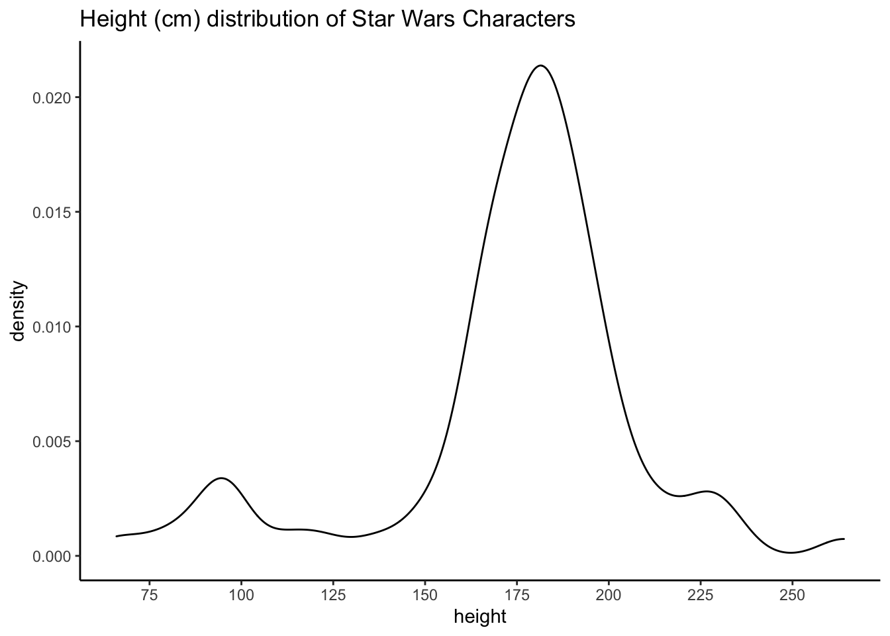


<div class='webex-solution'><button>Solution</button>


```r
ggplot(starwars, aes(height)) +
  geom_density(colour = "black", alpha = .3) +
  scale_x_continuous(breaks = seq(from = 50, to = 300, by = 25)) +
  labs(title = "Height (cm) distribution of Star Wars Characters") +
  theme_classic()
```


```r
ggplot(starwars, aes(mass)) +
  geom_histogram(colour = "black", binwidth = 10) +
  scale_x_continuous(breaks = seq(from = 0, to = 2000, by = 100)) +
  labs(title = "Weight (kg) distribution of Star Wars Characters") +
  theme_classic()
```


```r
ggplot(starwars, aes(x = gender, fill = gender)) +
  geom_bar(show.legend = FALSE, colour = "black") +
  scale_x_discrete(name = "Gender of character", labels = (c("Masculine", "Feminine", "Missing"))) +
  scale_fill_brewer(palette = 2) +
  labs(title = "Number of Star Wars characters of each gender") +
  theme_bw()
```


</div>


### Make it look nice

* Add at least one Star Wars related image from an online source
* Hide the code and any messages from the knitted output
* Resize any images as you see fit


<div class='webex-solution'><button>Solution</button>


<div class='verbatim'><pre class='sourceCode r'><code class='sourceCode R'>&#96;&#96;&#96;{r, echo = FALSE, out.width = "50%", fig.cap="Adaptation of Star Wars logo created by Weweje; original logo by Suzy Rice, 1976. CC-BY-3.0"}</code></pre>

```r
knitr::include_graphics("https://upload.wikimedia.org/wikipedia/commons/thumb/c/ce/Star_wars2.svg/2880px-Star_wars2.svg.png")
```

<pre class='sourceCode r'><code class='sourceCode R'>&#96;&#96;&#96;</code></pre></div>

<div class="figure" style="text-align: center">

<p class="caption">(\#fig:unnamed-chunk-32)Adaptation of Star Wars logo created by Weweje; original logo by Suzy Rice, 1976. CC-BY-3.0</p>
</div>


</div>


### Share your work

Once you're done, share your knitted html file on the Week 4 Teams channel so other learners on the course can see how you approached the task. 


## Glossary {#glossary-data}

<table>
 <thead>
  <tr>
   <th style="text-align:left;"> term </th>
   <th style="text-align:left;"> definition </th>
  </tr>
 </thead>
<tbody>
  <tr>
   <td style="text-align:left;"> [argument](https://psyteachr.github.io/glossary/a.html#argument){class="glossary" target="_blank"} </td>
   <td style="text-align:left;"> A variable that provides input to a function. </td>
  </tr>
  <tr>
   <td style="text-align:left;"> [character](https://psyteachr.github.io/glossary/c.html#character){class="glossary" target="_blank"} </td>
   <td style="text-align:left;"> A data type representing strings of text. </td>
  </tr>
  <tr>
   <td style="text-align:left;"> [console](https://psyteachr.github.io/glossary/c.html#console){class="glossary" target="_blank"} </td>
   <td style="text-align:left;"> The pane in RStudio where you can type in commands and view output messages. </td>
  </tr>
  <tr>
   <td style="text-align:left;"> [data type](https://psyteachr.github.io/glossary/d.html#data-type){class="glossary" target="_blank"} </td>
   <td style="text-align:left;"> The kind of data represented by an object. </td>
  </tr>
  <tr>
   <td style="text-align:left;"> [double](https://psyteachr.github.io/glossary/d.html#double){class="glossary" target="_blank"} </td>
   <td style="text-align:left;"> A data type representing a real decimal number </td>
  </tr>
  <tr>
   <td style="text-align:left;"> [extension](https://psyteachr.github.io/glossary/e.html#extension){class="glossary" target="_blank"} </td>
   <td style="text-align:left;"> The end part of a file name that tells you what type of file it is (e.g., .R or .Rmd). </td>
  </tr>
  <tr>
   <td style="text-align:left;"> [global environment](https://psyteachr.github.io/glossary/g.html#global-environment){class="glossary" target="_blank"} </td>
   <td style="text-align:left;"> The interactive workspace where your script runs </td>
  </tr>
  <tr>
   <td style="text-align:left;"> [integer](https://psyteachr.github.io/glossary/i.html#integer){class="glossary" target="_blank"} </td>
   <td style="text-align:left;"> A data type representing whole numbers. </td>
  </tr>
  <tr>
   <td style="text-align:left;"> [logical](https://psyteachr.github.io/glossary/l.html#logical){class="glossary" target="_blank"} </td>
   <td style="text-align:left;"> A data type representing TRUE or FALSE values. </td>
  </tr>
  <tr>
   <td style="text-align:left;"> [na](https://psyteachr.github.io/glossary/n.html#na){class="glossary" target="_blank"} </td>
   <td style="text-align:left;"> A missing value that is "Not Available" </td>
  </tr>
  <tr>
   <td style="text-align:left;"> [nominal](https://psyteachr.github.io/glossary/n.html#nominal){class="glossary" target="_blank"} </td>
   <td style="text-align:left;"> Categorical variables that don&#39;t have an inherent order, such as types of animal. </td>
  </tr>
  <tr>
   <td style="text-align:left;"> [numeric](https://psyteachr.github.io/glossary/n.html#numeric){class="glossary" target="_blank"} </td>
   <td style="text-align:left;"> A data type representing a real decimal number or integer. </td>
  </tr>
  <tr>
   <td style="text-align:left;"> [panes](https://psyteachr.github.io/glossary/p.html#panes){class="glossary" target="_blank"} </td>
   <td style="text-align:left;"> RStudio is arranged with four window "panes". </td>
  </tr>
  <tr>
   <td style="text-align:left;"> [tabular data](https://psyteachr.github.io/glossary/t.html#tabular-data){class="glossary" target="_blank"} </td>
   <td style="text-align:left;"> Data in a rectangular table format, where each row has an entry for each column. </td>
  </tr>
  <tr>
   <td style="text-align:left;"> [tidyverse](https://psyteachr.github.io/glossary/t.html#tidyverse){class="glossary" target="_blank"} </td>
   <td style="text-align:left;"> A set of R packages that help you create and work with tidy data </td>
  </tr>
  <tr>
   <td style="text-align:left;"> [url](https://psyteachr.github.io/glossary/u.html#url){class="glossary" target="_blank"} </td>
   <td style="text-align:left;">  </td>
  </tr>
  <tr>
   <td style="text-align:left;"> [vector](https://psyteachr.github.io/glossary/v.html#vector){class="glossary" target="_blank"} </td>
   <td style="text-align:left;"> A type of data structure that collects values with the same data type, like T/F values, numbers, or strings. </td>
  </tr>
</tbody>
</table>


## Further resources {#resources-data}

* [Data import cheatsheet](https://github.com/rstudio/cheatsheets/raw/master/data-import.pdf)
* [Chapter 11: Data Import](http://r4ds.had.co.nz/data-import.html) in *R for Data Science*
* [Multi-row headers](https://psyteachr.github.io/tutorials/multi-row-headers.html)


<!--chapter:end:04-data.Rmd-->

# Data Summaries {#summary}

## Intended Learning Outcomes {#ilo-summary}

* Be able to summarise data by groups
* Be able to produce well-formatted tables


## Set-up

First, create a new project for the work we'll do in this chapter named <code class='path'>05-summary</code>. Second, download the data for this chapter (<a href="data/ncod_tweets.rds" download>ncod_tweets.rds</a>) and save it in your project data folder. Finally, open and save and new R Markdown document named `summary.Rmd`, delete the welcome text and load the required packages for this chapter.

<div class='verbatim'><pre class='sourceCode r'><code class='sourceCode R'>&#96;&#96;&#96;{r setup, include=FALSE}</code></pre>

```r
library(tidyverse)   # data wrangling functions
library(rtweet) # for searching tweets
library(kableExtra)  # for nice tables
```

<pre class='sourceCode r'><code class='sourceCode R'>&#96;&#96;&#96;</code></pre></div>

## Social media data

In this chapter we're going to analyse social media data, specifically data from Twitter. There are two broad types of data you can obtain from Twitter; data scraped from Twitter using purpose-built packages such as <code class='package'>rtweet</code>, and data provided via [Twitter Analytics](https://analytics.twitter.com/) for any accounts for which you have access. 

For this chapter, we'll use data scraped from Twitter using <code class='package'>rtweet</code>. In order to use these functions, you need to have a Twitter account. Don't worry if you don't have one; we'll provide the data in the examples below for you.

<code class='package'>rtweet</code> has a lot of flexibility, for example, you can search for tweets that contain a certain hashtag or word, tweets by a specific user, or tweets that meet certain conditions like location or whether the user is verified. 

For the dataset for this chapter, we used the `search_tweets()` function  to find the last 30K tweets with the hashtag [#NationalComingOutDay](https://en.wikipedia.org/wiki/National_Coming_Out_Day). This is mainly interesting around October 11th (the date of National Coming Out Day), so we've provided the relevant data for you that we scraped at that time. 

If you have a Twitter account, you can complete this chapter using your own data and any hashtag that interests you. When you run the `search_tweets()` function, you will be asked to sign in to your Twitter account.


```r
tweets <- search_tweets(q = "#NationalComingOutDay", 
                        n = 30000, 
                        include_rts = FALSE)
```

### R objects

If you're working with live social media data, every time you run a query it's highly likely you will get a different set of data as new tweets are added. Additionally, the Twitter API places limits on how much data you can download and searches are limited to data from the last 6-9 days. Consequently, it can be useful to save the results of your initial search. `saveRDS` is a useful function that allows you to save any object in your environment to disk.


```r
saveRDS(tweets, file = "data/ncod_tweets.rds")
```

After you run `search_tweets()` and save the results, set that code chunk to `eval = FALSE` or comment out that code so your script doesn't run the search and overwrite your saved data every time you knit it.

To load an `.rds` file, you can use the `readRDS()` function. If you don't have access to a Twitter account, or to ensure that you get the same output as the rest of this chapter, you can download <a href="data/ncod_tweets.rds" download>ncod_tweets.rds</a> and load it using this function.


```r
tweets <- readRDS("data/ncod_tweets.rds")
```


First, run `glimpse(tweets)` or click on the object in the environment to find out what information is in the downloaded data (it's a lot!). Now let's create a series of summary tables and plots with these data.

## Summarise {#summary-summarise}

The `summarise()` function from the <code class='package'>dplyr</code> package is loaded as part of the tidyverse and creates summary statistics. It creates a new table with columns that summarise the data from a larger table using summary functions. Check the [Data Transformation Cheat Sheet](https://raw.githubusercontent.com/rstudio/cheatsheets/main/data-transformation.pdf) for various summary functions. Some common ones are: `n()`, `min()`, `max()`, `sum()`, `mean()`, and `quantile()`.

::: {.warning data-latex=""}
If you get the answer `NA` from a summary function, that usually means that there are missing values in the columns you were summarising. We'll discuss this more in Chapter\ \@ref(missing-values), but you can ignore missing values for many functions by adding the argument `na.rm = TRUE`.


```r
values <- c(1, 2, 4, 3, NA, 2)
mean(values) # is NA
mean(values, na.rm = TRUE) # removes NAs first
```

```
## [1] NA
## [1] 2.4
```
:::

This function can be used to answer questions like: How many tweets were there? What date range is represented in these data? What are the <a class='glossary' target='_blank' title='A descriptive statistic that measures the average value of a set of numbers.' href='https://psyteachr.github.io/glossary/m#mean'>mean</a> and <a class='glossary' target='_blank' title='The middle number in a distribution where half of the values are larger and half are smaller.' href='https://psyteachr.github.io/glossary/m#median'>median</a> number of favourites per tweet? Let's start with a very simple example to calculate the mean, median, min, and max number of favourites (Twitter's version of a "like"):

* The first argument that `summarise()` takes is the data table you wish to summarise, in this case the object `tweets`.
* `summarise()` will create a new table. The column names of this new table will be the left hand-side arguments, i.e., `mean_favs`, `median_favs`, `min_favs` and `max_favs`. 
* The values of these columns are the result of the summary operation on the right hand-side.


```r
favourite_summary <- summarise(tweets,
                           mean_favs = mean(favorite_count),
                           median_favs = median(favorite_count),
                           min_favs = min(favorite_count),
                           max_favs = max(favorite_count))
```

<table>
 <thead>
  <tr>
   <th style="text-align:center;"> mean_favs </th>
   <th style="text-align:center;"> median_favs </th>
   <th style="text-align:center;"> min_favs </th>
   <th style="text-align:center;"> max_favs </th>
  </tr>
 </thead>
<tbody>
  <tr>
   <td style="text-align:center;"> 29.71732 </td>
   <td style="text-align:center;"> 3 </td>
   <td style="text-align:center;"> 0 </td>
   <td style="text-align:center;"> 22935 </td>
  </tr>
</tbody>
</table>

The mean number of favourites is substantially higher than the median and the range is huge, suggesting there are ` r glossary("outlier", "outliers")`. A quick histogram confirms this - most tweets have few favourites but there are a few  with a lot of likes  that skew the mean.


```r
ggplot(tweets, aes(x = favorite_count)) +
  geom_histogram(bins = 25) +
  scale_x_continuous(trans = "pseudo_log", 
                     breaks = c(0, 1, 10, 100, 1000, 10000))
```


::: {.info data-latex=""}
Plotting the logarithm of a very skewed value can often give you a better idea of what's going on. Use `scale_x_continuous(trans = "pseudo_log")` to include zeros on the plot (just "log" converts 0 to negative infinity and removes it from the plot).
:::

You can add multiple operations to a single call to `summarise()` so let's try a few different operations. The `n()` function counts the number of rows in the data. The `created_at` column gives us the date each tweet were created, so we can use the `min()` and `max()` functions to get the range of dates. 


```r
tweet_summary <- tweets %>%
  summarise(mean_favs = mean(favorite_count),
            median_favs = quantile(favorite_count, .5),
            n = n(),
            min_date = min(created_at),
            max_date = max(created_at))

glimpse(tweet_summary)
```

```
## Rows: 1
## Columns: 5
## $ mean_favs   <dbl> 29.71732
## $ median_favs <dbl> 3
## $ n           <int> 28626
## $ min_date    <dttm> 2021-10-10 00:10:02
## $ max_date    <dttm> 2021-10-12 20:12:27
```

::: {.info data-latex=""}
<a class='glossary' target='_blank' title='Cutoffs dividing the range of a distribution into continuous intervals with equal probabilities.' href='https://psyteachr.github.io/glossary/q#quantile'>Quantiles</a> are like percentiles. Use `quantile(x, .50)` to find the median (the number where 50% of values in `x` are above it and 50% are below it). This can be useful when you need a value like "90% of tweets get *X* favourites or fewer".


```r
quantile(tweets$favorite_count, 0.90)
```

```
## 90% 
##  31
```

:::


::: {.try data-latex=""}
* How would you find the largest number of retweets?
    <div class='webex-radiogroup' id='radio_PXYOENYHQK'><label><input type="radio" autocomplete="off" name="radio_PXYOENYHQK" value="x"></input> <span>`tweets %>% summarise(max_retweets)`</span></label><label><input type="radio" autocomplete="off" name="radio_PXYOENYHQK" value="x"></input> <span>`tweets %>% summarise(max = retweets)`</span></label><label><input type="radio" autocomplete="off" name="radio_PXYOENYHQK" value="x"></input> <span>`tweets %>% max(retweets)`</span></label><label><input type="radio" autocomplete="off" name="radio_PXYOENYHQK" value="answer"></input> <span>`tweets %>% summarise(max_retweets = max(retweets))`</span></label></div>

* How would you calculate the mean `display_text_width`? 
    <div class='webex-radiogroup' id='radio_HUXWUDBMSB'><label><input type="radio" autocomplete="off" name="radio_HUXWUDBMSB" value="answer"></input> <span>`summarise(width = mean(display_text_width))`</span></label><label><input type="radio" autocomplete="off" name="radio_HUXWUDBMSB" value="x"></input> <span>`summarise(display_text_width = mean)`</span></label><label><input type="radio" autocomplete="off" name="radio_HUXWUDBMSB" value="x"></input> <span>`group_by(display_text_width)`</span></label><label><input type="radio" autocomplete="off" name="radio_HUXWUDBMSB" value="x"></input> <span>`width(mean(display_text_width))`</span></label></div>

:::

### The $ operator

We need to take a couple of brief detours to introduce some additional coding conventions. First, let's clear up what that `$` notation is doing. The dollar sign allows you to select items from an object, such as columns from a table. The left-hand side is the object, and the right-hand side is the item. When you call a column like this, R will print all the observations in that column. 


```r
tweet_summary$mean_favs
```

```
## [1] 29.71732
```

If your item has multiple observations, you can specify which ones to return using square brackets `[]` and the row number or a <a class='glossary' target='_blank' title='A type of data structure that collects values with the same data type, like T/F values, numbers, or strings.' href='https://psyteachr.github.io/glossary/v#vector'>vector</a> of row numbers.


```r
tweets$source[1] # select one observation
tweets$display_text_width[c(20,30,40)] # select multiple with c()
```

```
## [1] "Twitter for Android"
## [1]  78 287 107
```

### Pipes {#pipes-first}

For our second detour, let's formally introduce the <a class='glossary' target='_blank' title='A way to order your code in a more readable format using the symbol %>%' href='https://psyteachr.github.io/glossary/p#pipe'>pipe</a>, that weird `%>%` symbol we've used occasionally. Pipes allow you to send the output from one function straight into another function. Specifically, they send the result of the function before `%>%` to be the first argument of the function after `%>%`. It can be useful to translate the pipe as "**and then**". It's easier to show than tell, so let's look at an example.

We could write the above code using a pipe as follows:


```r
tweet_summary <- tweets %>% # start with the object tweets and then
  summarise(mean_favs = mean(favorite_count), #summarise it
            median_favs = median(favorite_count))
```

Notice that `summarise()` no longer needs the first argument to be the data table, it is pulled in from the pipe. The power of the pipe may not be obvious now, but it will soon prove its worth. 

### Inline coding

To insert those values into the text of a report you can use inline coding. First. we'll create another set of objects that contain the first and last date of the tweets in our dataset. `format()` formats the dates to day/month/year.


```r
date_from <- tweet_summary$min_date %>% 
  format("%d %B, %Y")
date_to <- tweet_summary$max_date %>% 
  format("%d %B, %Y")
```

Then you can insert values from these objects and the tables you created with `summarise()` using inline R (note the dollar sign notation to get the value of the `n` column from the table `tweet_summary`). 


```md
There were `r tweet_summary$n` tweets between `r date_from` and `r date_to`.
```

Knit your Markdown to see how the variables inside the inline code get replaced by their values. 

> There were 28626 tweets between 10 October, 2021 and 12 October, 2021.

Ok, let's get back on track.

## Counting

How many different accounts tweeted using the hashtag? Who tweeted most?

You can count categorical data with the `count()` function. Since each row is a tweet, you can count the number of rows per each different `screen_name` to get the number of tweets per user. This will give you a new table with each combination of the counted columns and a column called `n` containing the number of observations from that group. 

The argument `sort = TRUE` will sort the table by `n` in descending order, whilst `head()` returns the first six lines of a data table and is a useful function to call when you have a very large dataset and just want to see the top values.


```r
tweets_per_user <- tweets %>%
  count(screen_name, sort = TRUE)

head(tweets_per_user)
```

<div data-pagedtable="false">
  <script data-pagedtable-source type="application/json">
{"columns":[{"label":["screen_name"],"name":[1],"type":["chr"],"align":["left"]},{"label":["n"],"name":[2],"type":["int"],"align":["right"]}],"data":[{"1":"interest_outfit","2":"35"},{"1":"LeoShir2","2":"33"},{"1":"dr_stack","2":"32"},{"1":"NRArchway","2":"32"},{"1":"bhavna_95","2":"25"},{"1":"WipeHomophobia","2":"23"}],"options":{"columns":{"min":{},"max":[10]},"rows":{"min":[10],"max":[10]},"pages":{}}}
  </script>
</div>


::: {.try data-latex=""}
How would you create the table of counts below? 

<div data-pagedtable="false">
  <script data-pagedtable-source type="application/json">
{"columns":[{"label":["is_quote"],"name":[1],"type":["lgl"],"align":["right"]},{"label":["is_retweet"],"name":[2],"type":["lgl"],"align":["right"]},{"label":["n"],"name":[3],"type":["int"],"align":["right"]}],"data":[{"1":"FALSE","2":"FALSE","3":"26301"},{"1":"TRUE","2":"FALSE","3":"2325"}],"options":{"columns":{"min":{},"max":[10]},"rows":{"min":[10],"max":[10]},"pages":{}}}
  </script>
</div>

<div class='webex-radiogroup' id='radio_QVCEXEBBAQ'><label><input type="radio" autocomplete="off" name="radio_QVCEXEBBAQ" value="answer"></input> <span>`tweets %>% count(is_quote, is_retweet)`</span></label><label><input type="radio" autocomplete="off" name="radio_QVCEXEBBAQ" value="x"></input> <span>`tweets %>% count(is_quote) %>% count(is_retweet)`</span></label><label><input type="radio" autocomplete="off" name="radio_QVCEXEBBAQ" value="x"></input> <span>`tweets %>% count(c(is_quote, is_retweet))`</span></label><label><input type="radio" autocomplete="off" name="radio_QVCEXEBBAQ" value="x"></input> <span>`tweets %>% select(is_quote, is_retweet) %>% count()`</span></label></div>

:::

### Inline coding 2

Let's do another example of inline coding that writes up a summary of the most prolific tweeters to demonstrate a few additional functions. First, we need to create some additional objects to use with inline R:

* `nrow()` simply counts the number of rows in a dataset so if you have one user/participant/customer per row, this is an easy way to do a head count.
* `slice()` chooses a particular row of data, in this case the first row. Because we sorted our data, this will therefore be the user with the most tweets.
* `pull()` pulls out a single variable. 
* The combination of `slice()` and `pull()` allows you to choose a single observation from a single variable.


```r
unique_users <- nrow(tweets_per_user)
most_prolific <- slice(tweets_per_user, 1) %>% 
  pull(screen_name)
most_prolific_n <- slice(tweets_per_user, 1) %>% 
  pull(n)
```

Then add the inline code to your report...


```md
There were `r unique_users` unique accounts tweeting about #NationalComingOutDay. `r most_prolific` was the most prolific tweeter, with `r most_prolific_n` tweets.
```

...and knit your Markdown to see the output:

There were 25189 unique accounts tweeting about #NationalComingOutDay. interest_outfit was the most prolific tweeter, with 35 tweets.

## Grouping

You can also create summary values by group. The combination of `group_by()` and `summarise()` is incredibly powerful, and it is also a good demonstration of why pipes are so useful.

The function `group_by()` takes an existing data table and converts it into a grouped table, where any operations that are performed on it are done "by group".

The first line of code creates an object named `tweets_grouped`, that groups the dataset according to whether the user is a verified user. On the surface, `tweets_grouped` doesn't look any different to the original `tweets`. However, the underlying structure has changed and so when we run `summarise()`, we now get our requested summaries for each group (in this case verified or not). 


```r
tweets_grouped <- tweets %>%
  group_by(verified)

verified <- tweets_grouped %>%
  summarise(count = n(),
            mean_favs = mean(favorite_count),
            mean_retweets = mean(retweet_count)) %>%
  ungroup()

verified
```

<div data-pagedtable="false">
  <script data-pagedtable-source type="application/json">
{"columns":[{"label":["verified"],"name":[1],"type":["lgl"],"align":["right"]},{"label":["count"],"name":[2],"type":["int"],"align":["right"]},{"label":["mean_favs"],"name":[3],"type":["dbl"],"align":["right"]},{"label":["mean_retweets"],"name":[4],"type":["dbl"],"align":["right"]}],"data":[{"1":"FALSE","2":"26676","3":"18.40576","4":"1.825649"},{"1":"TRUE","2":"1950","3":"184.45949","4":"21.511282"}],"options":{"columns":{"min":{},"max":[10]},"rows":{"min":[10],"max":[10]},"pages":{}}}
  </script>
</div>

::: {.warning data-latex=""}
Make sure you call the `ungroup()` function when you are done with grouped functions. Failing to do this can cause all sorts of mysterious problems if you use that data table later assuming it isn't grouped.
:::

Whilst the above code is functional, it adds an unnecessary object to the environment - `tweets_grouped` is taking up space and increases the risk we'll use this grouped object by mistake. Enter... the pipe.

Rather than creating an intermediate object, we can use the pipe to string our code together.


```r
verified <- 
  tweets_grouped %>% # Start with the original dataset; and then
  group_by(verified) %>% # group it; and then
  summarise(count = n(), # summarise it by those groups
            mean_favs = mean(favorite_count),
            mean_retweets = mean(retweet_count)) %>%
  ungroup()
```


::: {.try data-latex=""}
* What would you change to calculate the mean favourites and retweets by `screen_name` instead of by `verified`? 
    <div class='webex-radiogroup' id='radio_CTRWOYTSDS'><label><input type="radio" autocomplete="off" name="radio_CTRWOYTSDS" value="x"></input> <span>`count(screen_name)`</span></label><label><input type="radio" autocomplete="off" name="radio_CTRWOYTSDS" value="x"></input> <span>`summarise(screen_name)`</span></label><label><input type="radio" autocomplete="off" name="radio_CTRWOYTSDS" value="answer"></input> <span>`group_by(screen_name)`</span></label><label><input type="radio" autocomplete="off" name="radio_CTRWOYTSDS" value="x"></input> <span>`mean(screen_name)`</span></label></div>

:::

### Multiple groupings

You can add multiple variables to `group_by()` to further break down your data. For example, the below gives us the number of likes and retweets broken down by verified status and the device the person was tweeting from (`source`). 

* Reverse the order of `verified` and `source` in `group_by()` to see how it changed the output.


```r
verified_source <- tweets %>%
  group_by(verified, source) %>%
  summarise(count = n(),
            mean_favs = mean(favorite_count),
            mean_retweets = mean(retweet_count)) %>%
  ungroup() %>%
  arrange(desc(count))

head(verified_source)
```

<div data-pagedtable="false">
  <script data-pagedtable-source type="application/json">
{"columns":[{"label":["verified"],"name":[1],"type":["lgl"],"align":["right"]},{"label":["source"],"name":[2],"type":["chr"],"align":["left"]},{"label":["count"],"name":[3],"type":["int"],"align":["right"]},{"label":["mean_favs"],"name":[4],"type":["dbl"],"align":["right"]},{"label":["mean_retweets"],"name":[5],"type":["dbl"],"align":["right"]}],"data":[{"1":"FALSE","2":"Twitter for iPhone","3":"12943","4":"25.40493","5":"2.304643"},{"1":"FALSE","2":"Twitter for Android","3":"5807","4":"11.90839","5":"1.155846"},{"1":"FALSE","2":"Twitter Web App","3":"5795","4":"13.54737","5":"1.611217"},{"1":"TRUE","2":"Twitter for iPhone","3":"691","4":"323.24457","5":"29.010130"},{"1":"TRUE","2":"Twitter Web App","3":"560","4":"131.44643","5":"21.717857"},{"1":"FALSE","2":"Twitter for iPad","3":"374","4":"13.85027","5":"2.042781"}],"options":{"columns":{"min":{},"max":[10]},"rows":{"min":[10],"max":[10]},"pages":{}}}
  </script>
</div>

::: {.warning data-latex=""}
You may get the following message when using `summarise()` after `group_by()`.

> `summarise()` has grouped output by 'verified'. You can override using the `.groups` argument.

Tidyverse recently added a message to remind you whether the `summarise()` function automatically ungroups grouped data or not (it may do different things depending on how it's used). You can set the argument `.groups` to "drop", "drop_last", "keep", or "rowwise" (see the help for `?summarise`), but it's good practice to explicitly use `ungroup()` when you're done working by groups, regardless. 
:::

### Filter and mutate

You can also use additional functions like `filter()` or `mutate()` after `group_by`. You'll learn more about these in Chapter \ \@ref(wrangle) but briefly:

* `filter()` keeps observations (rows) according to specified criteria, e.g., all values above 5, or all verified users.
* `mutate()` creates new variables (columns), or overwrites existing ones.

You can combine functions like this to get detailed insights into your data. For example, what were the most favourited original and quoted tweets? 

* The variable `is_quote` tells us whether the tweet in question was an original tweet or a quote tweet. Because we want our output to treat these separately, we pass this variable to `group_by()`. 
* We want the most favourited tweets, i.e., the maximum value of `favourite_count`, so we can use `filter()` to only return rows where `favourite_count` is equal to the maximum value in the variable `favourite_count`. Note the use of `==` rather than a single `=`.
* Just in case there was a tie, choose a random one with `sample_n(size = 1)`.


```r
most_fav <- tweets %>%
  group_by(is_quote) %>%
  filter(favorite_count == max(favorite_count)) %>%
  sample_n(size = 1) %>%
  ungroup()
```


::: {.try data-latex=""}
* How would you limit the results to sources with 10 or more rows?
    <div class='webex-radiogroup' id='radio_BZGWYVYNVM'><label><input type="radio" autocomplete="off" name="radio_BZGWYVYNVM" value="answer"></input> <span>`tweets %>% group_by(source) %>% filter(n() >= 10)`</span></label><label><input type="radio" autocomplete="off" name="radio_BZGWYVYNVM" value="x"></input> <span>`tweets %>% group_by(source) %>% filter(count() >= 10)`</span></label><label><input type="radio" autocomplete="off" name="radio_BZGWYVYNVM" value="x"></input> <span>`tweets %>% group_by(source) %>% select(n() >= 10)`</span></label><label><input type="radio" autocomplete="off" name="radio_BZGWYVYNVM" value="x"></input> <span>`tweets %>% group_by(source) %>% select(count() >= 10)`</span></label></div>

:::

### Inline coding 3

There's a huge amount of data reported for each tweet, including things like the URLs of the tweets and any media attached to  them. This means we can produce output like the below reproducibly and using inline coding.


The most favourited 22935 original tweet was by [jackrooke](https://twitter.com/jackrooke/status/1447541093260795904):

--------------------------------------------------

> it’s #nationalcomingoutday 🎉 here’s a pic of how I came out back in 2003 xx https://t.co/spBmHhF6p4


------------------------------------------------

To produce this, first we split `most_fav`, so that we have one object that contains the data from the original tweet and one object that contains the data from the quote tweet.


```r
orig <- filter(most_fav,is_quote == FALSE)
quote <- filter(most_fav,is_quote == TRUE)
```

The inline code is then as follows:


```md
The most favourited `r orig$favorite_count` original tweet was by [`r orig$screen_name`](`r orig$status_url`):

--------------------------------------------------
  
> `r orig$text`


--------------------------------------------------
```

This is quite complicated so let's break it down. 

* The first bit of inline coding is fairly standard and is what you have used before.
* The second bit of inline coding inserts a URL. The content of the `[]` is the text that will be displayed. The content of `()` is the underlying URL. In both cases, the content is being pulled from the dataset. In this case, the text is `screen_name` and `status_url` links to the tweet.
* The line of dashes creates the solid line in the knitted output.
* The `>` symbol changes the format to a block quote.
* The image is then included using the format ``, which is an alternative method of including images in Markdown. 


## Exercises

That was an intensive chapter! Take a break and then try one (or more) of the following and post your knitted HTML files on Teams so that other learners on the course can see what you did.

* Work through the further examples in Appendix\ \@ref(twitter-hashtags).
* If you have your own Twitter account, conduct a similar analysis of a different hashtag.
* Look through the rest of the variables in `tweets`; what other insights can you generate about this data?
* Read through the [kableExtra](https://cran.r-project.org/web/packages/kableExtra/vignettes/awesome_table_in_html.html) vignettes and apply your own preferred table style.
* Work through the first few chapters of [Tidy Text](https://www.tidytextmining.com/index.html){target="_blank"} to see how you can work with and analyse text. In particular, see if you can conduct a sentiment analysis on the tweet data.

## Glossary {#glossary-summary}

<table>
 <thead>
  <tr>
   <th style="text-align:left;"> term </th>
   <th style="text-align:left;"> definition </th>
  </tr>
 </thead>
<tbody>
  <tr>
   <td style="text-align:left;"> [mean](https://psyteachr.github.io/glossary/m.html#mean){class="glossary" target="_blank"} </td>
   <td style="text-align:left;"> A descriptive statistic that measures the average value of a set of numbers. </td>
  </tr>
  <tr>
   <td style="text-align:left;"> [median](https://psyteachr.github.io/glossary/m.html#median){class="glossary" target="_blank"} </td>
   <td style="text-align:left;"> The middle number in a distribution where half of the values are larger and half are smaller. </td>
  </tr>
  <tr>
   <td style="text-align:left;"> [pipe](https://psyteachr.github.io/glossary/p.html#pipe){class="glossary" target="_blank"} </td>
   <td style="text-align:left;"> A way to order your code in a more readable format using the symbol %>% </td>
  </tr>
  <tr>
   <td style="text-align:left;"> [quantile](https://psyteachr.github.io/glossary/q.html#quantile){class="glossary" target="_blank"} </td>
   <td style="text-align:left;"> Cutoffs dividing the range of a distribution into continuous intervals with equal probabilities. </td>
  </tr>
  <tr>
   <td style="text-align:left;"> [vector](https://psyteachr.github.io/glossary/v.html#vector){class="glossary" target="_blank"} </td>
   <td style="text-align:left;"> A type of data structure that collects values with the same data type, like T/F values, numbers, or strings. </td>
  </tr>
</tbody>
</table>


## Further resources {#resources-summary}

* [Data transformation cheat sheet](https://raw.githubusercontent.com/rstudio/cheatsheets/main/data-transformation.pdf)
* [Chapter 5: Data Transformation ](http://r4ds.had.co.nz/transform.html) in *R for Data Science*
* [Intro to rtweet](https://docs.ropensci.org/rtweet/articles/rtweet.html)
* [Tidy Text](https://www.tidytextmining.com/index.html)
* [kableExtra vignettes](https://cran.r-project.org/web/packages/kableExtra/vignettes/awesome_table_in_html.html)

<!--chapter:end:05-summary.Rmd-->

# Data Relations {#joins}

<div class="incomplete-chapter"></div>

## Intended Learning Outcomes {#ilo-joins}

-   Be able to match related data across multiple tables
-   Be able to combine data from multiple files

## Set-up

First, create a new project for the work we'll do in this chapter named <code class='path'>06-relations</code>. Second, open and save and new R Markdown document named `relations`.Rmd\`, delete the welcome text and load the required packages for this chapter.

<div class='verbatim'><pre class='sourceCode r'><code class='sourceCode R'>&#96;&#96;&#96;{r setup, include=FALSE}</code></pre>

```r
library(tidyverse)     # includes readr & tibble
```

<pre class='sourceCode r'><code class='sourceCode R'>&#96;&#96;&#96;</code></pre></div>

## Loading data {#joins-data}

The data you want to report on or visualise are often in more than one file (or more than one tab of an excel file or googlesheet). You might need to join up a table of customer information with a table of orders, or combine the monthly social media reports across several months.

For this demo, rather than loading in data, we'll create two small data tables from scratch using the `tibble()` function.

`customers` has id, city and postcode for five customers 1-5.

-   `1:5` will fill the variable `id` with all integers between 1 and 5.
-   `city` and `code` both using the `c()` function to enter multiple strings. Note that each entry is contained within its own quotation marks, apart from missing data which is recorded as `NA`.
-   When entering data like this, it's important that the order of each variable matches up. So number 1 will correspond to "Port Ellen" and "PA42 7DU".


```r
customers <- tibble(
  id = 1:5,
  city = c("Port Ellen", "Dufftown", NA, "Aberlour", "Tobermory"),
  postcode = c("PA42 7DU", "AB55 4DH", NA, "AB38 7RY", "PA75 6NR")
)
```

<table>
 <thead>
  <tr>
   <th style="text-align:right;"> id </th>
   <th style="text-align:left;"> city </th>
   <th style="text-align:left;"> postcode </th>
  </tr>
 </thead>
<tbody>
  <tr>
   <td style="text-align:right;"> 1 </td>
   <td style="text-align:left;"> Port Ellen </td>
   <td style="text-align:left;"> PA42 7DU </td>
  </tr>
  <tr>
   <td style="text-align:right;"> 2 </td>
   <td style="text-align:left;"> Dufftown </td>
   <td style="text-align:left;"> AB55 4DH </td>
  </tr>
  <tr>
   <td style="text-align:right;"> 3 </td>
   <td style="text-align:left;"> NA </td>
   <td style="text-align:left;"> NA </td>
  </tr>
  <tr>
   <td style="text-align:right;"> 4 </td>
   <td style="text-align:left;"> Aberlour </td>
   <td style="text-align:left;"> AB38 7RY </td>
  </tr>
  <tr>
   <td style="text-align:right;"> 5 </td>
   <td style="text-align:left;"> Tobermory </td>
   <td style="text-align:left;"> PA75 6NR </td>
  </tr>
</tbody>
</table>


`orders` has customer id and the number of items ordered. Some customers have no orders, some have more than one order, and some are not in the customer table.


```r
orders <- tibble(
  id = c(2, 3, 4, 4, 5, 5, 6, 6, 7),
  items = c(10, 18, 21, 23, 9, 11, 11, 12, 3)
)
```

<table>
<caption>(\#tab:orders)Demo orders table.</caption>
 <thead>
  <tr>
   <th style="text-align:right;"> id </th>
   <th style="text-align:right;"> items </th>
  </tr>
 </thead>
<tbody>
  <tr>
   <td style="text-align:right;"> 2 </td>
   <td style="text-align:right;"> 10 </td>
  </tr>
  <tr>
   <td style="text-align:right;"> 3 </td>
   <td style="text-align:right;"> 18 </td>
  </tr>
  <tr>
   <td style="text-align:right;"> 4 </td>
   <td style="text-align:right;"> 21 </td>
  </tr>
  <tr>
   <td style="text-align:right;"> 4 </td>
   <td style="text-align:right;"> 23 </td>
  </tr>
  <tr>
   <td style="text-align:right;"> 5 </td>
   <td style="text-align:right;"> 9 </td>
  </tr>
  <tr>
   <td style="text-align:right;"> 5 </td>
   <td style="text-align:right;"> 11 </td>
  </tr>
  <tr>
   <td style="text-align:right;"> 6 </td>
   <td style="text-align:right;"> 11 </td>
  </tr>
  <tr>
   <td style="text-align:right;"> 6 </td>
   <td style="text-align:right;"> 12 </td>
  </tr>
  <tr>
   <td style="text-align:right;"> 7 </td>
   <td style="text-align:right;"> 3 </td>
  </tr>
</tbody>
</table>


## Mutating Joins

<a class='glossary' target='_blank' title='Joins that act like the dplyr::mutate() function in that they add new columns to one table based on values in another table.' href='https://psyteachr.github.io/glossary/m#mutating-joins'>Mutating joins</a> act like the <code><span class='fu'>dplyr</span><span class='fu'>::</span><span class='fu'><a target='_blank' href='https://rdrr.io/pkg/dplyr/man/mutate.html'>mutate</a></span><span class='op'>(</span><span class='op'>)</span></code> function in that they add new columns to one table based on values in another table. (We'll learn more about the `mutate()` function in Chapter\ \@ref(tidy).)

All the mutating joins have this basic syntax:

`****_join(x, y, by = NULL, suffix = c(".x", ".y")`

-   `x` = the first (left) table
-   `y` = the second (right) table
-   `by` = what columns to match on. If you leave this blank, it will match on all columns with the same names in the two tables.
-   `suffix` = if columns have the same name in the two tables, but you aren't joining by them, they get a suffix to make them unambiguous. This defaults to ".x" and ".y", but you can change it to something more meaningful.

::: {.info data-latex=""}
You can leave out the `by` argument if you're matching on all of the columns with the same name, but it's good practice to always specify it so your code is robust to changes in the loaded data.
:::

### left_join() {#left_join}

::: join

:::

A `left_join` keeps all the data from the first (left) table and joins anything that matches from the second (right) table. If the right table has more than one match for a row in the right table, there will be more than one row in the joined table (see ids 4 and 5).


```r
left_data <- left_join(customers, orders, by = "id")
left_data
```

<div data-pagedtable="false">
  <script data-pagedtable-source type="application/json">
{"columns":[{"label":["id"],"name":[1],"type":["dbl"],"align":["right"]},{"label":["city"],"name":[2],"type":["chr"],"align":["left"]},{"label":["postcode"],"name":[3],"type":["chr"],"align":["left"]},{"label":["items"],"name":[4],"type":["dbl"],"align":["right"]}],"data":[{"1":"1","2":"Port Ellen","3":"PA42 7DU","4":"NA"},{"1":"2","2":"Dufftown","3":"AB55 4DH","4":"10"},{"1":"3","2":"NA","3":"NA","4":"18"},{"1":"4","2":"Aberlour","3":"AB38 7RY","4":"21"},{"1":"4","2":"Aberlour","3":"AB38 7RY","4":"23"},{"1":"5","2":"Tobermory","3":"PA75 6NR","4":"9"},{"1":"5","2":"Tobermory","3":"PA75 6NR","4":"11"}],"options":{"columns":{"min":{},"max":[10]},"rows":{"min":[10],"max":[10]},"pages":{}}}
  </script>
</div>

::: join

:::

The order you specify the tables matters, in the below code we have reversed the order and so the result is all rows from the `orders` table joined to any matching rows from the `customers` table.


```r
left2_data <- left_join(orders, customers, by = "id")
left2_data
```

<div data-pagedtable="false">
  <script data-pagedtable-source type="application/json">
{"columns":[{"label":["id"],"name":[1],"type":["dbl"],"align":["right"]},{"label":["items"],"name":[2],"type":["dbl"],"align":["right"]},{"label":["city"],"name":[3],"type":["chr"],"align":["left"]},{"label":["postcode"],"name":[4],"type":["chr"],"align":["left"]}],"data":[{"1":"2","2":"10","3":"Dufftown","4":"AB55 4DH"},{"1":"3","2":"18","3":"NA","4":"NA"},{"1":"4","2":"21","3":"Aberlour","4":"AB38 7RY"},{"1":"4","2":"23","3":"Aberlour","4":"AB38 7RY"},{"1":"5","2":"9","3":"Tobermory","4":"PA75 6NR"},{"1":"5","2":"11","3":"Tobermory","4":"PA75 6NR"},{"1":"6","2":"11","3":"NA","4":"NA"},{"1":"6","2":"12","3":"NA","4":"NA"},{"1":"7","2":"3","3":"NA","4":"NA"}],"options":{"columns":{"min":{},"max":[10]},"rows":{"min":[10],"max":[10]},"pages":{}}}
  </script>
</div>

### right_join() {#right_join}

::: join
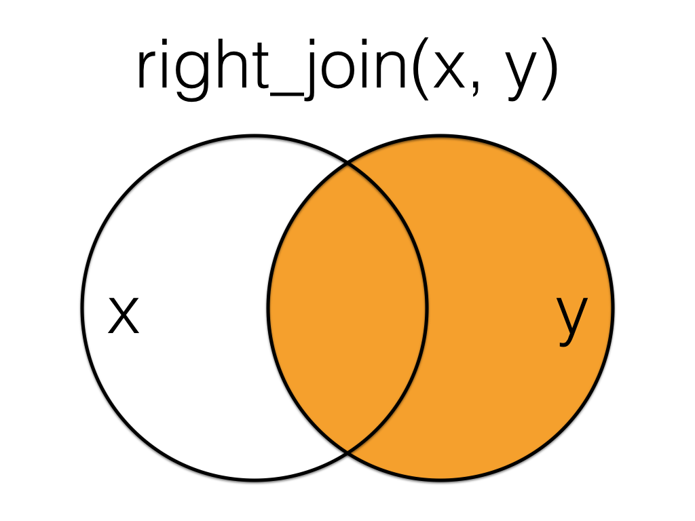
:::

A `right_join` keeps all the data from the second (right) table and joins anything that matches from the first (left) table.


```r
right_data <- right_join(customers, orders, by = "id")
right_data
```

<div data-pagedtable="false">
  <script data-pagedtable-source type="application/json">
{"columns":[{"label":["id"],"name":[1],"type":["dbl"],"align":["right"]},{"label":["city"],"name":[2],"type":["chr"],"align":["left"]},{"label":["postcode"],"name":[3],"type":["chr"],"align":["left"]},{"label":["items"],"name":[4],"type":["dbl"],"align":["right"]}],"data":[{"1":"2","2":"Dufftown","3":"AB55 4DH","4":"10"},{"1":"3","2":"NA","3":"NA","4":"18"},{"1":"4","2":"Aberlour","3":"AB38 7RY","4":"21"},{"1":"4","2":"Aberlour","3":"AB38 7RY","4":"23"},{"1":"5","2":"Tobermory","3":"PA75 6NR","4":"9"},{"1":"5","2":"Tobermory","3":"PA75 6NR","4":"11"},{"1":"6","2":"NA","3":"NA","4":"11"},{"1":"6","2":"NA","3":"NA","4":"12"},{"1":"7","2":"NA","3":"NA","4":"3"}],"options":{"columns":{"min":{},"max":[10]},"rows":{"min":[10],"max":[10]},"pages":{}}}
  </script>
</div>

::: {.info data-latex=""}
This table has the same information as `left_join(orders, customers, by = "id")`, but the columns are in a different order (left table, then right table).
:::

### inner_join() {#inner_join}

::: join

:::

An `inner_join` returns all the rows that have a match in the other table.


```r
inner_data <- inner_join(customers, orders, by = "id")
inner_data
```

<div data-pagedtable="false">
  <script data-pagedtable-source type="application/json">
{"columns":[{"label":["id"],"name":[1],"type":["dbl"],"align":["right"]},{"label":["city"],"name":[2],"type":["chr"],"align":["left"]},{"label":["postcode"],"name":[3],"type":["chr"],"align":["left"]},{"label":["items"],"name":[4],"type":["dbl"],"align":["right"]}],"data":[{"1":"2","2":"Dufftown","3":"AB55 4DH","4":"10"},{"1":"3","2":"NA","3":"NA","4":"18"},{"1":"4","2":"Aberlour","3":"AB38 7RY","4":"21"},{"1":"4","2":"Aberlour","3":"AB38 7RY","4":"23"},{"1":"5","2":"Tobermory","3":"PA75 6NR","4":"9"},{"1":"5","2":"Tobermory","3":"PA75 6NR","4":"11"}],"options":{"columns":{"min":{},"max":[10]},"rows":{"min":[10],"max":[10]},"pages":{}}}
  </script>
</div>

### full_join() {#full_join}

::: join

:::

A `full_join` lets you join up rows in two tables while keeping all of the information from both tables. If a row doesn't have a match in the other table, the other table's column values are set to `NA`.


```r
full_data <- full_join(customers, orders, by = "id")
full_data
```

<div data-pagedtable="false">
  <script data-pagedtable-source type="application/json">
{"columns":[{"label":["id"],"name":[1],"type":["dbl"],"align":["right"]},{"label":["city"],"name":[2],"type":["chr"],"align":["left"]},{"label":["postcode"],"name":[3],"type":["chr"],"align":["left"]},{"label":["items"],"name":[4],"type":["dbl"],"align":["right"]}],"data":[{"1":"1","2":"Port Ellen","3":"PA42 7DU","4":"NA"},{"1":"2","2":"Dufftown","3":"AB55 4DH","4":"10"},{"1":"3","2":"NA","3":"NA","4":"18"},{"1":"4","2":"Aberlour","3":"AB38 7RY","4":"21"},{"1":"4","2":"Aberlour","3":"AB38 7RY","4":"23"},{"1":"5","2":"Tobermory","3":"PA75 6NR","4":"9"},{"1":"5","2":"Tobermory","3":"PA75 6NR","4":"11"},{"1":"6","2":"NA","3":"NA","4":"11"},{"1":"6","2":"NA","3":"NA","4":"12"},{"1":"7","2":"NA","3":"NA","4":"3"}],"options":{"columns":{"min":{},"max":[10]},"rows":{"min":[10],"max":[10]},"pages":{}}}
  </script>
</div>

## Filtering Joins

<a class='glossary' target='_blank' title='Joins that act like the dplyr::filter() function in that they remove rows from the data in one table based on the values in another table.' href='https://psyteachr.github.io/glossary/f#filtering-joins'>Filtering joins</a> act like the `filter()` function in that they remove rows from the data in one table based on the values in another table. The result of a filtering join will only contain rows from the left table and have the same number or fewer rows than the left table. (We'll learn more about the `filter()` function in Chapter \@ref(wrangle).)

### semi_join() {#semi_join}

::: join

:::

A `semi_join` returns all rows from the left table where there are matching values in the right table, keeping just columns from the left table.


```r
semi_data <- semi_join(customers, orders, by = "id")
semi_data
```

<div data-pagedtable="false">
  <script data-pagedtable-source type="application/json">
{"columns":[{"label":["id"],"name":[1],"type":["int"],"align":["right"]},{"label":["city"],"name":[2],"type":["chr"],"align":["left"]},{"label":["postcode"],"name":[3],"type":["chr"],"align":["left"]}],"data":[{"1":"2","2":"Dufftown","3":"AB55 4DH"},{"1":"3","2":"NA","3":"NA"},{"1":"4","2":"Aberlour","3":"AB38 7RY"},{"1":"5","2":"Tobermory","3":"PA75 6NR"}],"options":{"columns":{"min":{},"max":[10]},"rows":{"min":[10],"max":[10]},"pages":{}}}
  </script>
</div>

::: {.info data-latex=""}
Unlike an inner join, a semi join will never duplicate the rows in the left table if there is more than one matching row in the right table.
:::

::: join

:::

Order matters in a semi join.


```r
semi2_data <- semi_join(orders, customers, by = "id")
semi2_data
```

<div data-pagedtable="false">
  <script data-pagedtable-source type="application/json">
{"columns":[{"label":["id"],"name":[1],"type":["dbl"],"align":["right"]},{"label":["items"],"name":[2],"type":["dbl"],"align":["right"]}],"data":[{"1":"2","2":"10"},{"1":"3","2":"18"},{"1":"4","2":"21"},{"1":"4","2":"23"},{"1":"5","2":"9"},{"1":"5","2":"11"}],"options":{"columns":{"min":{},"max":[10]},"rows":{"min":[10],"max":[10]},"pages":{}}}
  </script>
</div>

### anti_join() {#anti_join}

::: join

:::

An `anti_join` return all rows from the left table where there are *not* matching values in the right table, keeping just columns from the left table.


```r
anti_data <- anti_join(customers, orders, by = "id")
anti_data
```

<div data-pagedtable="false">
  <script data-pagedtable-source type="application/json">
{"columns":[{"label":["id"],"name":[1],"type":["int"],"align":["right"]},{"label":["city"],"name":[2],"type":["chr"],"align":["left"]},{"label":["postcode"],"name":[3],"type":["chr"],"align":["left"]}],"data":[{"1":"1","2":"Port Ellen","3":"PA42 7DU"}],"options":{"columns":{"min":{},"max":[10]},"rows":{"min":[10],"max":[10]},"pages":{}}}
  </script>
</div>

::: join

:::

Order matters in an anti join.


```r
anti2_data <- anti_join(orders, customers, by = "id")
anti_data
```

<div data-pagedtable="false">
  <script data-pagedtable-source type="application/json">
{"columns":[{"label":["id"],"name":[1],"type":["int"],"align":["right"]},{"label":["city"],"name":[2],"type":["chr"],"align":["left"]},{"label":["postcode"],"name":[3],"type":["chr"],"align":["left"]}],"data":[{"1":"1","2":"Port Ellen","3":"PA42 7DU"}],"options":{"columns":{"min":{},"max":[10]},"rows":{"min":[10],"max":[10]},"pages":{}}}
  </script>
</div>

## Multiple joins

The `****_join()` functions are all **two-table verbs**, that is, you can only join together two tables at a time. However, you may often need to join together multiple tables. To do so, you simply need to add on additional joins. You can do this by creating an intermediate object or more efficiently by using a pipe.

Note that because the second join has multiple columns that need to be matched, we use `c()` to list them all (try removing the `c()` and see what happens).


```r
# create a table of overall customer satisfaction scores

satisfaction <- tibble(
  id = 1:5,
  items = c(4, 3, 2, 3, 1)
)

# perform the initial join
join_1 <- left_join(customers, orders, by = "id")

# perform the second join on the new object
join_2 <- left_join(join_1, satisfaction, 
                    by = c("id", "items"))

# more efficient method using the pipe

pipe_join <- customers %>%
  left_join(orders, by = "id") %>%
  left_join(satisfaction, by = c("id","items"))
```

::: {.warning data-latex=""}
At every stage of any analysis you should **check your output** to ensure that what you created is what you intended to create but this is particularly true of joins. You should be familiar enough with your data through routine checks using functions like `glimpse()`, `str()`, and `summary()` to have a rough idea of what the join should result in. At the very least, you should know whether the joined object should result in more or fewer variables and observations.

If you have a multi-line join like in the above piped example, build up the code and check the output at each stage.
:::


## Binding Joins

<a class='glossary' target='_blank' title='Joins that bind one table to another by adding their rows or columns together.' href='https://psyteachr.github.io/glossary/b#binding-joins'>Binding joins</a> bind one table to another by adding their rows or columns together.

### bind_rows() {#bind_rows}

You can combine the rows of two tables with `bind_rows`.

Here we'll add customer data for customers 6-9 and bind that to the original customer table.


```r
new_customers <- tibble(
  id = 6:9,
  city = c("Falkirk", "Ardbeg", "Doogal", "Kirkwall"),
  postcode = c("FK1 4RS", "PA42 7EA", "G81 4SJ", "KW15 1SE")
)

bindr_data <- bind_rows(customers, new_customers)
bindr_data
```

<div data-pagedtable="false">
  <script data-pagedtable-source type="application/json">
{"columns":[{"label":["id"],"name":[1],"type":["int"],"align":["right"]},{"label":["city"],"name":[2],"type":["chr"],"align":["left"]},{"label":["postcode"],"name":[3],"type":["chr"],"align":["left"]}],"data":[{"1":"1","2":"Port Ellen","3":"PA42 7DU"},{"1":"2","2":"Dufftown","3":"AB55 4DH"},{"1":"3","2":"NA","3":"NA"},{"1":"4","2":"Aberlour","3":"AB38 7RY"},{"1":"5","2":"Tobermory","3":"PA75 6NR"},{"1":"6","2":"Falkirk","3":"FK1 4RS"},{"1":"7","2":"Ardbeg","3":"PA42 7EA"},{"1":"8","2":"Doogal","3":"G81 4SJ"},{"1":"9","2":"Kirkwall","3":"KW15 1SE"}],"options":{"columns":{"min":{},"max":[10]},"rows":{"min":[10],"max":[10]},"pages":{}}}
  </script>
</div>

The columns just have to have the same names, they don't have to be in the same order. Any columns that differ between the two tables will just have `NA` values for entries from the other table.

If a row is duplicated between the two tables (like id 5 below), the row will also be duplicated in the resulting table. If your tables have the exact same columns, you can use `union()` (see Section\ \@ref(union)) to avoid duplicates.


```r
new_customers <- tibble(
  id = 5:9,
  postcode = c("PA75 6NR", "FK1 4RS", "PA42 7EA", "G81 4SJ", "KW15 1SE"),
  city = c("Tobermory", "Falkirk", "Ardbeg", "Doogal", "Kirkwall"),
  new = c(1,2,3,4,5)
)

bindr2_data <- bind_rows(customers, new_customers)
bindr2_data
```

<div data-pagedtable="false">
  <script data-pagedtable-source type="application/json">
{"columns":[{"label":["id"],"name":[1],"type":["int"],"align":["right"]},{"label":["city"],"name":[2],"type":["chr"],"align":["left"]},{"label":["postcode"],"name":[3],"type":["chr"],"align":["left"]},{"label":["new"],"name":[4],"type":["dbl"],"align":["right"]}],"data":[{"1":"1","2":"Port Ellen","3":"PA42 7DU","4":"NA"},{"1":"2","2":"Dufftown","3":"AB55 4DH","4":"NA"},{"1":"3","2":"NA","3":"NA","4":"NA"},{"1":"4","2":"Aberlour","3":"AB38 7RY","4":"NA"},{"1":"5","2":"Tobermory","3":"PA75 6NR","4":"NA"},{"1":"5","2":"Tobermory","3":"PA75 6NR","4":"1"},{"1":"6","2":"Falkirk","3":"FK1 4RS","4":"2"},{"1":"7","2":"Ardbeg","3":"PA42 7EA","4":"3"},{"1":"8","2":"Doogal","3":"G81 4SJ","4":"4"},{"1":"9","2":"Kirkwall","3":"KW15 1SE","4":"5"}],"options":{"columns":{"min":{},"max":[10]},"rows":{"min":[10],"max":[10]},"pages":{}}}
  </script>
</div>

### bind_cols() {#bind_cols}

You can merge two tables with the same number of rows using `bind_cols`. This is only useful if the two tables have their rows in the exact same order. The only advantage over a left join is when the tables don't have any IDs to join by and you have to rely solely on their order.


```r
new_info <- tibble(
  colour = c("red", "orange", "yellow", "green", "blue")
)

bindc_data <- bind_cols(customers, new_info)
bindc_data 
```

<div data-pagedtable="false">
  <script data-pagedtable-source type="application/json">
{"columns":[{"label":["id"],"name":[1],"type":["int"],"align":["right"]},{"label":["city"],"name":[2],"type":["chr"],"align":["left"]},{"label":["postcode"],"name":[3],"type":["chr"],"align":["left"]},{"label":["colour"],"name":[4],"type":["chr"],"align":["left"]}],"data":[{"1":"1","2":"Port Ellen","3":"PA42 7DU","4":"red"},{"1":"2","2":"Dufftown","3":"AB55 4DH","4":"orange"},{"1":"3","2":"NA","3":"NA","4":"yellow"},{"1":"4","2":"Aberlour","3":"AB38 7RY","4":"green"},{"1":"5","2":"Tobermory","3":"PA75 6NR","4":"blue"}],"options":{"columns":{"min":{},"max":[10]},"rows":{"min":[10],"max":[10]},"pages":{}}}
  </script>
</div>

### Importing multiple files

If you need to import and bind a whole folder full of files that have the same structure, get a list of all the files you want to combine. It's easiest if they're all in the same directory, although you can use a pattern to select the files you want if they have a systematic naming structure.


```r
# write our data to a new folder for the demo
write_csv(x = customers, file = "data/customers1.csv")
write_csv(x = new_customers, file = "data/customers2.csv")

# retrieves a list of all file names in the data folder that contain the string "customers"

files <- list.files(
  path = "data", 
  pattern = "customers", 
  full.names = TRUE
)

files
```

```
## [1] "data/customers1.csv" "data/customers2.csv"
```

### Iteration

Whilst this won't be something we cover in detail in the core resources of this course, iteration is an important concept to know about. Iteration is where you perform the same task on multiple different inputs. As a general rule of thumb, if you find yourself copying and pasting the same thing more than twice, there's a more efficient and less error-prone way to do it although these functions do typically require a stronger grasp of programming.

The <code class='package'>purrr</code> package contains functions to help with iteration. `purrr::map_df()` maps a function to a list of data frames.  

* `.x` is the list of file paths 
* `.f` specifies the function to map to each of those file paths.
* The resulting object `all_files` will be a data frame that combines all the files together, similar to if you had imported them separately and then used `bind_rows()`. Note that `map_df()` will only work in this way if the structure of all files is identical.


```r
all_files <- purrr::map_df(.x = files, .f = read_csv)
```


## Set Operations

<a class='glossary' target='_blank' title='Functions that compare two tables and return rows that match (intersect), are in either table (union), or are in one table but not the other (setdiff).' href='https://psyteachr.github.io/glossary/s#set-operations'>Set operations</a> compare two tables and return rows that match (intersect), are in either table (union), or are in one table but not the other (setdiff).

### intersect() {#intersect}

`intersect()` returns all rows in two tables that match exactly. The columns don't have to be in the same order.


```r
new_customers <- tibble(
  id = 5:9,
  postcode = c("PA75 6NR", "FK1 4RS", "PA42 7EA", "G81 4SJ", "KW15 1SE"),
  city = c("Tobermory", "Falkirk", "Ardbeg", "Doogal", "Kirkwall")
)

intersect_data <- intersect(customers, new_customers)
intersect_data
```

<div data-pagedtable="false">
  <script data-pagedtable-source type="application/json">
{"columns":[{"label":["id"],"name":[1],"type":["int"],"align":["right"]},{"label":["city"],"name":[2],"type":["chr"],"align":["left"]},{"label":["postcode"],"name":[3],"type":["chr"],"align":["left"]}],"data":[{"1":"5","2":"Tobermory","3":"PA75 6NR"}],"options":{"columns":{"min":{},"max":[10]},"rows":{"min":[10],"max":[10]},"pages":{}}}
  </script>
</div>

::: {.warning data-latex=""}
If you've forgotten to load dplyr or the tidyverse, <a class='glossary' target='_blank' title='The set of R functions that come with a basic installation of R, before you add external packages' href='https://psyteachr.github.io/glossary/b#base-r'>base R</a> also has an `intersect()` function. The error message can be confusing and looks something like this:


```r
base::intersect(customers, new_customers)
```

```
## Error: Must subset rows with a valid subscript vector.
## ℹ Logical subscripts must match the size of the indexed input.
## x Input has size 5 but subscript `!duplicated(x, fromLast = fromLast, ...)` has size 0.
```
:::

### union() {#union}

`union()` returns all the rows from both tables, removing duplicate rows, unlike `bind_rows()`.


```r
union_data <- union(customers, new_customers)
union_data
```

<div data-pagedtable="false">
  <script data-pagedtable-source type="application/json">
{"columns":[{"label":["id"],"name":[1],"type":["int"],"align":["right"]},{"label":["city"],"name":[2],"type":["chr"],"align":["left"]},{"label":["postcode"],"name":[3],"type":["chr"],"align":["left"]}],"data":[{"1":"1","2":"Port Ellen","3":"PA42 7DU"},{"1":"2","2":"Dufftown","3":"AB55 4DH"},{"1":"3","2":"NA","3":"NA"},{"1":"4","2":"Aberlour","3":"AB38 7RY"},{"1":"5","2":"Tobermory","3":"PA75 6NR"},{"1":"6","2":"Falkirk","3":"FK1 4RS"},{"1":"7","2":"Ardbeg","3":"PA42 7EA"},{"1":"8","2":"Doogal","3":"G81 4SJ"},{"1":"9","2":"Kirkwall","3":"KW15 1SE"}],"options":{"columns":{"min":{},"max":[10]},"rows":{"min":[10],"max":[10]},"pages":{}}}
  </script>
</div>

::: {.warning data-latex=""}
If you've forgotten to load dplyr or the tidyverse, <a class='glossary' target='_blank' title='The set of R functions that come with a basic installation of R, before you add external packages' href='https://psyteachr.github.io/glossary/b#base-r'>base R</a> also has a `union()` function. You usually won't get an error message, but the output won't be what you expect.


```r
base::union(customers, new_customers)
```

```
## [[1]]
## [1] 1 2 3 4 5
## 
## [[2]]
## [1] "Port Ellen" "Dufftown"   NA           "Aberlour"   "Tobermory" 
## 
## [[3]]
## [1] "PA42 7DU" "AB55 4DH" NA         "AB38 7RY" "PA75 6NR"
## 
## [[4]]
## [1] 5 6 7 8 9
## 
## [[5]]
## [1] "PA75 6NR" "FK1 4RS"  "PA42 7EA" "G81 4SJ"  "KW15 1SE"
## 
## [[6]]
## [1] "Tobermory" "Falkirk"   "Ardbeg"    "Doogal"    "Kirkwall"
```
:::

### setdiff() {#setdiff}

`setdiff` returns rows that are in the first table, but not in the second table.


```r
setdiff_data <- setdiff(customers, new_customers)
setdiff_data
```

<div data-pagedtable="false">
  <script data-pagedtable-source type="application/json">
{"columns":[{"label":["id"],"name":[1],"type":["int"],"align":["right"]},{"label":["city"],"name":[2],"type":["chr"],"align":["left"]},{"label":["postcode"],"name":[3],"type":["chr"],"align":["left"]}],"data":[{"1":"1","2":"Port Ellen","3":"PA42 7DU"},{"1":"2","2":"Dufftown","3":"AB55 4DH"},{"1":"3","2":"NA","3":"NA"},{"1":"4","2":"Aberlour","3":"AB38 7RY"}],"options":{"columns":{"min":{},"max":[10]},"rows":{"min":[10],"max":[10]},"pages":{}}}
  </script>
</div>

Order matters for `setdiff`.


```r
setdiff2_data <- setdiff(new_customers, customers)
```

::: {.warning data-latex=""}
If you've forgotten to load dplyr or the tidyverse, <a class='glossary' target='_blank' title='The set of R functions that come with a basic installation of R, before you add external packages' href='https://psyteachr.github.io/glossary/b#base-r'>base R</a> also has a `setdiff()` function. You usually won't get an error message, but the output might not be what you expect because the base R `setdiff()` expects columns to be in the same order, so id 5 here registers as different between the two tables.


```r
base::setdiff(customers, new_customers)
```

<div data-pagedtable="false">
  <script data-pagedtable-source type="application/json">
{"columns":[{"label":["id"],"name":[1],"type":["int"],"align":["right"]},{"label":["city"],"name":[2],"type":["chr"],"align":["left"]},{"label":["postcode"],"name":[3],"type":["chr"],"align":["left"]}],"data":[{"1":"1","2":"Port Ellen","3":"PA42 7DU"},{"1":"2","2":"Dufftown","3":"AB55 4DH"},{"1":"3","2":"NA","3":"NA"},{"1":"4","2":"Aberlour","3":"AB38 7RY"},{"1":"5","2":"Tobermory","3":"PA75 6NR"}],"options":{"columns":{"min":{},"max":[10]},"rows":{"min":[10],"max":[10]},"pages":{}}}
  </script>
</div>
:::

## Conflicting variable types

As we covered in Chapter\ \@ref(col_types), when you import or create data, R will do its best to set each column to an appropriate data type. However, sometimes it gets it wrong or sometimes there's something in the way the data has been encoded in the original spreadsheet that causes the data type to be different than expected. When joining datasets by common columns, it's important that not only are the variable names identical, but the data type of those variables is identical.

Let's recreate our `new_customers` dataset but this time, we'll specify that `id` is a character <a class='glossary' target='_blank' title='A data type representing strings of text.' href='https://psyteachr.github.io/glossary/c#character'>character</a> variable.


```r
new_customers2 <- tibble(
  id = as.character(5:9),
  postcode = c("PA75 6NR", "FK1 4RS", "PA42 7EA", "G81 4SJ", "KW15 1SE"),
  city = c("Tobermory", "Falkirk", "Ardbeg", "Doogal", "Kirkwall")
)
str(new_customers2)
```

```
## tibble [5 × 3] (S3: tbl_df/tbl/data.frame)
##  $ id      : chr [1:5] "5" "6" "7" "8" ...
##  $ postcode: chr [1:5] "PA75 6NR" "FK1 4RS" "PA42 7EA" "G81 4SJ" ...
##  $ city    : chr [1:5] "Tobermory" "Falkirk" "Ardbeg" "Doogal" ...
```

If you try to join this dataset to any of the other datasets where `id` is stored as a <a class='glossary' target='_blank' title='A data type representing a real decimal number or integer.' href='https://psyteachr.github.io/glossary/n#numeric'>numeric</a> variable, it will produce the error 


```r
inner_join(customers, new_customers2)
```

```
## Joining, by = c("id", "city", "postcode")
```

```
## Error: Can't join on `x$id` x `y$id` because of incompatible types.
## ℹ `x$id` is of type <integer>>.
## ℹ `y$id` is of type <character>>.
```

The same goes for `bind_rows()`:


```r
bind_rows(customers, new_customers2)
```

```
## Error: Can't combine `..1$id` <integer> and `..2$id` <character>.
```


As alternative method to change variable types from what we showed you in Chapter\ \@ref(col_types) is to use the `as.***` functions. If you type `as.` into a code chunk, you will see that there a huge number of these functions for transforming variables and datasets to different types. Exactly which one you need will depend on the data you have but a few commonly used ones are:

* `as.numeric()` - convert a variable to numeric. Useful for when you have a variable of real numbers that have been encoded as character. Any values that are not numeric (e.g., if you have the word "missing" in cells that you have no data for), will be returned as `NA`.
* `as.factor()` - convert a variable to a factor. You can set the factor levels and labels manually, or use the default order (alphabetical).
* `as.character()` - convert a variable to character data.
* `as.tibble()` and `as.data.frame()` - convert an object to a tibble data frame. This isn't actually relevant to what we're discussing here but it's a useful one to be aware of because sometimes you'll run into issues where you get an error that specifically requests your data is a tibble or data frame type and you can use this function to overwrite your object. 

To use these functions on a variable we can use `mutate()` to overwrite the variable with that variable as the new data type:


```r
new_customers2 <- new_customers2 %>%
  mutate(id = as.numeric(id))
```

Once you've done this, the joins will now work:


```r
inner_join(orders, new_customers2)
```

```
## Joining, by = "id"
```

<div data-pagedtable="false">
  <script data-pagedtable-source type="application/json">
{"columns":[{"label":["id"],"name":[1],"type":["dbl"],"align":["right"]},{"label":["items"],"name":[2],"type":["dbl"],"align":["right"]},{"label":["postcode"],"name":[3],"type":["chr"],"align":["left"]},{"label":["city"],"name":[4],"type":["chr"],"align":["left"]}],"data":[{"1":"5","2":"9","3":"PA75 6NR","4":"Tobermory"},{"1":"5","2":"11","3":"PA75 6NR","4":"Tobermory"},{"1":"6","2":"11","3":"FK1 4RS","4":"Falkirk"},{"1":"6","2":"12","3":"FK1 4RS","4":"Falkirk"},{"1":"7","2":"3","3":"PA42 7EA","4":"Ardbeg"}],"options":{"columns":{"min":{},"max":[10]},"rows":{"min":[10],"max":[10]},"pages":{}}}
  </script>
</div>


## Exercises

There's lots of different use cases for the `****_join()` functions. These exercises will allow you to practice different joins. If you have any examples of where joins might be helpful in your own work, please post them on Teams in the week 6 channel, as having many concrete examples can help distinguish between the different joins.

### Grade data

The University of Glasgow's Schedule A grading scheme uses a 22-point alphanumeric scale (there's more information in your summative report [assessment information sheet](https://sway.office.com/k0CnXGd6RjbVokkR?ref=Link)). Each alphanumeric grade (e.g., B2) has an underlying numeric Grade Point (e.g., 16). 

Often when we're working with student grades they are provided to us in only one of these forms but we need to be able to go between the two, for example, we need the numeric form in order to be able to calculate descriptive statistics about the mean grade but we need the alphanumeric form to release to student records.

* Download <a href="data/grade_data1.csv" download>grade_data.csv</a>, <a href="data/grade_data2.csv" download>grade_data2.csv</a> and <a href="data/scheduleA.csv" download>scheduleA.csv</a> into your data folder.

* Read in `scheduleA.csv` and save it to an object named `schedule`.
* Read in `grade_data1.csv` and save it to an object named `grades1`.
* Read in `grade_data2.csv` and save it to an object named `grades2`.


<div class='webex-solution'><button>Solution</button>

```r
schedule <- read_csv("data/scheduleA.csv")
```

```
## Rows: 23 Columns: 2
```

```
## ── Column specification ────────────────────────────────────────────────────────
## Delimiter: ","
## chr (1): Grade
## dbl (1): Points
```

```
## 
## ℹ Use `spec()` to retrieve the full column specification for this data.
## ℹ Specify the column types or set `show_col_types = FALSE` to quiet this message.
```

```r
grades1 <- read_csv("data/grade_data1.csv") 
```

```
## Rows: 100 Columns: 3
```

```
## ── Column specification ────────────────────────────────────────────────────────
## Delimiter: ","
## chr (2): assessment, id
## dbl (1): Points
```

```
## 
## ℹ Use `spec()` to retrieve the full column specification for this data.
## ℹ Specify the column types or set `show_col_types = FALSE` to quiet this message.
```

```r
grades2 <- read_csv("data/grade_data2.csv")
```

```
## Rows: 100 Columns: 3
```

```
## ── Column specification ────────────────────────────────────────────────────────
## Delimiter: ","
## chr (1): assessment
## dbl (2): id, Points
```

```
## 
## ℹ Use `spec()` to retrieve the full column specification for this data.
## ℹ Specify the column types or set `show_col_types = FALSE` to quiet this message.
```


</div>


### Matching the variable types

At UofG, all students are given a GUID, a numeric ID number. However, that ID number is also then combined with the first letter from your surname to create your username that is used with your email address. For example, if your ID is 1234567 and your surname is Nordmann, your username would be 1234567n. From a data wrangling perspective this is very annoying because the numeric ID will be stored as numeric data, but the username will be stored as character because of the letter at the end. `grades1` has a numeric id whilst `grades2` has the additional letter. In order to join these datasets, we need to standardise the variables.

First, remove the letter character from `id` using the function `str_sub()` which returns a subset of a string.


```r
grades1 <- grades1 %>%
  mutate(id = str_sub(id, # the variable you want to subset
                      start = 1, # when the subset should start, in this case, the 1st character
                      end = nchar(id)-1)) # when the subset should end, in this case, 1 less than the number of characters 
```


Now, transform the data type of `id` so that it matches the data type in `grades2`.


<div class='webex-solution'><button>Solution</button>

```r
str(grades1)
str(grades2) # check variable types
grades1 <- grades1 %>%
  mutate(id = as.numeric(id))
```

```
## spec_tbl_df [100 × 3] (S3: spec_tbl_df/tbl_df/tbl/data.frame)
##  $ assessment: chr [1:100] "Exam" "Exam" "Exam" "Exam" ...
##  $ id        : chr [1:100] "1" "2" "3" "4" ...
##  $ Points    : num [1:100] NA 16 12 15 16 NA 16 13 15 NA ...
##  - attr(*, "spec")=
##   .. cols(
##   ..   assessment = col_character(),
##   ..   id = col_character(),
##   ..   Points = col_double()
##   .. )
##  - attr(*, "problems")=<externalptr> 
## spec_tbl_df [100 × 3] (S3: spec_tbl_df/tbl_df/tbl/data.frame)
##  $ id        : num [1:100] 1 2 3 4 5 6 7 8 9 10 ...
##  $ Points    : num [1:100] 12 16 15 NA 14 NA 8 NA 16 14 ...
##  $ assessment: chr [1:100] "Essay" "Essay" "Essay" "Essay" ...
##  - attr(*, "spec")=
##   .. cols(
##   ..   id = col_double(),
##   ..   Points = col_double(),
##   ..   assessment = col_character()
##   .. )
##  - attr(*, "problems")=<externalptr>
```


</div>


### Complete records

In this example, we want to join the grade data to schedule A so that each student with a grade has both the grade and the grade point. But, we also want a complete record of all students on the course so students with missing grades should still be included in the data.

* Join `grades1` and `scheduleA` and store this table in an object named `exam_all`. T
* Do the same for `grades2` and save it in `essay_grades`.
* Both `exam_grades` and `essay_all` should have 100 observations of 4 variables.


<div class='webex-solution'><button>Hint</button>


You want to keep all of the data from `grade_data1` and `grade_data2` but you only want the alphanumeric grades from `schedule` for the Grade Point values that exist in `grades`. E.g., if no-one was awarded an F1, your final dataset shouldn't have that in it.


</div>


<div class='webex-solution'><button>Solution</button>

```r
exam_all <- left_join(grades1, schedule, by = "Points")
essay_all <- left_join(grades2, schedule, by = "Points")
```


</div>


### Missing data

Alternatively, you may wish to have a dataset that only contains data for students who submitted each assessment and have a grade. First, run `summary()` on both `exam_all` and `essay_all`. 

* How many exam grades are missing? <input class='webex-solveme nospaces' size='2' data-answer='["17"]'/>
* How many essay grades are missing? <input class='webex-solveme nospaces' size='2' data-answer='["23"]'/>

Now, create an object `exam_grades` that joins together `grades1` and `schedule` but this time the resulting object should only contain data from students who have a grade. Do the same but for `grades2` and store it in `essay_grades`.

Before you do this, given what you know about how many data points are missing in each data set:

* How many observations should `essay_grades` have? <input class='webex-solveme nospaces' size='2' data-answer='["83"]'/>
* How many observations should `essay_grades` have? <input class='webex-solveme nospaces' size='2' data-answer='["77"]'/>


<div class='webex-solution'><button>Solution</button>

```r
exam_grades <- inner_join(grades1, schedule, by = "Points")
essay_grades <- inner_join(grades2, schedule, by = "Points")
```


</div>


<div class='webex-solution'><button>Alternative solution</button>


It's worth noting that in reality you wouldn't actually go back to the raw data and do another join to get this dataset, you could just remove all the missing response by adding `%>% drop_na()` to `exam_all` and `essay_all`. However, this isn't reality and for the purposes of teaching joins we'll do it this slightly artificial way.


</div>


Now, create a dataset `completes` that joins the grades for students who have a grade for **both** the essay and the exam.  

* Because both `exam_grade` and `essay_grade` have the variables `Points` and that are named the same but have different data, you should amend the suffix so that the resulting variables are named `Points_exam` and `Points_essay` etc. You may need to consult the help documentation to see an example to figure this out. 
* Clean up the file with `select()` and only keep the variables `id`, `Grade_exam`, and `Grade_essay`


<div class='webex-solution'><button>Solution</button>

```r
completes <- inner_join(exam_grades, essay_grades, 
                        by = "id", 
                        suffix = c("_exam", "_essay")) %>%
  select(id, Grade_exam, Grade_essay)
```


</div>

* How many students have a grade for both the exam and the essay? <input class='webex-solveme nospaces' size='2' data-answer='["62"]'/>

Now create a dataset `no_essay` that contains students that have a grade for the exam, but not the essay.

-   How many students have a grade for the exam but not the essay? <input class='webex-solveme nospaces' size='2' data-answer='["23"]'/>


<div class='webex-solution'><button>Solution</button>

```r
no_essay <- anti_join(exam_grades, essay_grades, by = "id")
```


</div>


Finally, now make a dataset `no_exam` that contains students have have a grade for the essay but not the exam


<div class='webex-solution'><button>Solution</button>

```r
no_exam <- anti_join(essay_grades,exam_grades, by = "id")
```


</div>

-   How many students have a grade for the exam but not the essay? <input class='webex-solveme nospaces' size='2' data-answer='["15"]'/>

### Report

For the final exercise in this chapter, create a report in R Markdown named `Assessment Report`. Assume that you need to present this report at an exam board and you're likely to be asked for the following information:

-   How many students submitted each assessment?
-   What was the average performance in each assessment?
-   What was the distribution of grades for each assessment?

In preparation for the summative assessment, how you do this is and what information you present is up to you. When you're done, post your code and knitted html document in the week 6 Teams channel.

## Glossary {#glossary-joins}

<table>
 <thead>
  <tr>
   <th style="text-align:left;"> term </th>
   <th style="text-align:left;"> definition </th>
  </tr>
 </thead>
<tbody>
  <tr>
   <td style="text-align:left;"> [base r](https://psyteachr.github.io/glossary/b.html#base-r){class="glossary" target="_blank"} </td>
   <td style="text-align:left;"> The set of R functions that come with a basic installation of R, before you add external packages </td>
  </tr>
  <tr>
   <td style="text-align:left;"> [binding joins](https://psyteachr.github.io/glossary/b.html#binding-joins){class="glossary" target="_blank"} </td>
   <td style="text-align:left;"> Joins that bind one table to another by adding their rows or columns together. </td>
  </tr>
  <tr>
   <td style="text-align:left;"> [character](https://psyteachr.github.io/glossary/c.html#character){class="glossary" target="_blank"} </td>
   <td style="text-align:left;"> A data type representing strings of text. </td>
  </tr>
  <tr>
   <td style="text-align:left;"> [filtering joins](https://psyteachr.github.io/glossary/f.html#filtering-joins){class="glossary" target="_blank"} </td>
   <td style="text-align:left;"> Joins that act like the dplyr::filter() function in that they remove rows from the data in one table based on the values in another table. </td>
  </tr>
  <tr>
   <td style="text-align:left;"> [mutating joins](https://psyteachr.github.io/glossary/m.html#mutating-joins){class="glossary" target="_blank"} </td>
   <td style="text-align:left;"> Joins that act like the dplyr::mutate() function in that they add new columns to one table based on values in another table. </td>
  </tr>
  <tr>
   <td style="text-align:left;"> [numeric](https://psyteachr.github.io/glossary/n.html#numeric){class="glossary" target="_blank"} </td>
   <td style="text-align:left;"> A data type representing a real decimal number or integer. </td>
  </tr>
  <tr>
   <td style="text-align:left;"> [set operations](https://psyteachr.github.io/glossary/s.html#set-operations){class="glossary" target="_blank"} </td>
   <td style="text-align:left;"> Functions that compare two tables and return rows that match (intersect), are in either table (union), or are in one table but not the other (setdiff). </td>
  </tr>
</tbody>
</table>


## Further resources {#resources-joins}

* [Data transformation cheatsheet](https://github.com/rstudio/cheatsheets/raw/master/data-transformation.pdf)
* [Chapter 13: Relational Data](http://r4ds.had.co.nz/relational-data.html) in *R for Data Science*
* [Chapter 21: Iteration](https://r4ds.had.co.nz/iteration.html) in *R for Data Science*.


<!--chapter:end:06-joins.Rmd-->

# Data Tidying {#tidy}

<div class="incomplete-chapter"></div>


## Intended Learning Outcomes {#ilo-tidy}

-   Be able to reshape data between long and wide formats
-   Separate, change, reorder, and rename columns
-   Use pipes to chain together functions

## Set-up

First, create a new project for the work we'll do in this chapter named <code class='path'>07-tidy</code>. Second, open and save and new R Markdown document named `tidy.Rmd`, delete the welcome text and load the required packages for this chapter.

<div class='verbatim'><pre class='sourceCode r'><code class='sourceCode R'>&#96;&#96;&#96;{r setup, include=FALSE}</code></pre>

```r
library(tidyverse) # for data wrangling
```

<pre class='sourceCode r'><code class='sourceCode R'>&#96;&#96;&#96;</code></pre></div>

## Data Structures

The data you work with will likely come in many different formats and structures. Some of these structures may be driven by how the software you use outputs the data, but data structures may also differ because of human intervention or attempts at organisation, some of which may not be particularly helpful.

Data cleaning and tidying will likely be the most time consuming and difficult task you perform. Whilst you can create code recipes for analyses and visualisations, as Hadley Whickham puts it ["every messy dataset is messy in its own way"](https://vita.had.co.nz/papers/tidy-data.pdf) which means that you will often have to solve new problems that are specific to the dataset. Additionally, moving between data structures that are intuitive to read by humans and those that are useful for a computer requires a conceptual shift that only comes with practice. This is all a verbose way of saying that what lies ahead in this chapter is unlikely to sink in on the first attempt and you will need to practice with different examples (preferably with data you know well) before you truly feel comfortable with it.

First, some terminology.

An <a class='glossary' target='_blank' title='All of the data about a single trial or question.' href='https://psyteachr.github.io/glossary/o#observation'>observation</a> is all the information about a single "thing" in a single condition, such as at one point in time. These things can be customers, sales, orders, feedback questionnaires, tweets, or really anything. Observations should have a way to identify them, such as a unique ID or a unique combination of values like country and year.

A <a class='glossary' target='_blank' title='A word that identifies and stores the value of some data for later use.' href='https://psyteachr.github.io/glossary/v#variable'>variable</a> is one type of information about the observation. For example, if the observation is a sale, the variables you might have about the sale are the sale ID, the customer's ID, the date of the sale, the price paid, and method of payment.

A <a class='glossary' target='_blank' title='A single number or piece of data.' href='https://psyteachr.github.io/glossary/v#value'>value</a> is the data for one variable for one observation. For example, the value of the date variable from the observation of a sale might be `2021-08-20`.

::: {.try data-latex=""}
The following table is data that shows the number of items each customer bought each year.

<div data-pagedtable="false">
  <script data-pagedtable-source type="application/json">
{"columns":[{"label":["customer_id"],"name":[1],"type":["dbl"],"align":["right"]},{"label":["year"],"name":[2],"type":["dbl"],"align":["right"]},{"label":["items"],"name":[3],"type":["dbl"],"align":["right"]}],"data":[{"1":"1","2":"2018","3":"2"},{"1":"1","2":"2019","3":"8"},{"1":"1","2":"2020","3":"10"},{"1":"2","2":"2018","3":"1"},{"1":"2","2":"2019","3":"6"},{"1":"2","2":"2020","3":"1"}],"options":{"columns":{"min":{},"max":[10]},"rows":{"min":[10],"max":[10]},"pages":{}}}
  </script>
</div>


-   What is `items`? <select class='webex-select'><option value='blank'></option><option value='x'>Observation</option><option value='answer'>Variable</option><option value='x'>Value</option></select>
-   How many observations are there in this dataset? <input class='webex-solveme nospaces' size='1' data-answer='["6"]'/>
-   What is `8`? <select class='webex-select'><option value='blank'></option><option value='x'>Observation</option><option value='x'>Variable</option><option value='answer'>Value</option></select>


<div class='webex-solution'><button>Explain these answers</button>


-   There are three variables, `customer_id`, `year`, and `items`.
-   There are six observations, one for each of two customers for each of three years.
-   `8` is a value because it is a single data point for one variable for one observation. 


</div>

:::

### Untidy data

First, let's have a look at an example of a messy, or untidy, dataset. Each row has all of the data relating to one customer.

* The `itemsprice_{year}` columns contain two values (number of items and price per item)
* The `totalprice_{year}` columns contain the total amount spent by that customer that year, i.e., item * price.
* There is data for three different years in the dataset.

<table>
<caption>(\#tab:unnamed-chunk-2)Untidy table</caption>
 <thead>
  <tr>
   <th style="text-align:right;"> customer_id </th>
   <th style="text-align:left;"> itemsprice_2018 </th>
   <th style="text-align:left;"> itemsprice_2019 </th>
   <th style="text-align:left;"> itemsprice_2020 </th>
   <th style="text-align:right;"> totalprice_2018 </th>
   <th style="text-align:right;"> totalprice_2019 </th>
   <th style="text-align:right;"> totalprice_2020 </th>
  </tr>
 </thead>
<tbody>
  <tr>
   <td style="text-align:right;"> 1 </td>
   <td style="text-align:left;"> 2 (3.91) </td>
   <td style="text-align:left;"> 8 (4.72) </td>
   <td style="text-align:left;"> 10 (5.59) </td>
   <td style="text-align:right;"> 7.82 </td>
   <td style="text-align:right;"> 37.76 </td>
   <td style="text-align:right;"> 55.90 </td>
  </tr>
  <tr>
   <td style="text-align:right;"> 2 </td>
   <td style="text-align:left;"> 1 (3.91) </td>
   <td style="text-align:left;"> 6 (4.72) </td>
   <td style="text-align:left;"> 1 (5.59) </td>
   <td style="text-align:right;"> 3.91 </td>
   <td style="text-align:right;"> 28.32 </td>
   <td style="text-align:right;"> 5.59 </td>
  </tr>
  <tr>
   <td style="text-align:right;"> 3 </td>
   <td style="text-align:left;"> 4 (3.91) </td>
   <td style="text-align:left;"> 5 (4.72) </td>
   <td style="text-align:left;"> 5 (5.59) </td>
   <td style="text-align:right;"> 15.64 </td>
   <td style="text-align:right;"> 23.60 </td>
   <td style="text-align:right;"> 27.95 </td>
  </tr>
  <tr>
   <td style="text-align:right;"> 4 </td>
   <td style="text-align:left;"> 10 (3.91) </td>
   <td style="text-align:left;"> 1 (4.72) </td>
   <td style="text-align:left;"> 3 (5.59) </td>
   <td style="text-align:right;"> 39.10 </td>
   <td style="text-align:right;"> 4.72 </td>
   <td style="text-align:right;"> 16.77 </td>
  </tr>
  <tr>
   <td style="text-align:right;"> 5 </td>
   <td style="text-align:left;"> 3 (3.91) </td>
   <td style="text-align:left;"> 9 (4.72) </td>
   <td style="text-align:left;"> 8 (5.59) </td>
   <td style="text-align:right;"> 11.73 </td>
   <td style="text-align:right;"> 42.48 </td>
   <td style="text-align:right;"> 44.72 </td>
  </tr>
</tbody>
</table>


Let's say you wanted to calculate the total price per customer over the three years and the total number of items bought per customer. You can't perform mathematical operations on the `itemsprice_{year}` columns because they are <a class='glossary' target='_blank' title='A data type representing strings of text.' href='https://psyteachr.github.io/glossary/c#character'>character</a> <a class='glossary' target='_blank' title='The kind of data represented by an object.' href='https://psyteachr.github.io/glossary/d#data-type'>data types</a>.

You would probably normally use Excel to

1.  split `itemsprice_2018` column into `item_2018` and `price_2018` columns
2.  split `itemsprice_2019` column into `item_2019` and `price_2019` columns
3.  split `itemsprice_2020` column into `item_2018` and `price_2020` columns
4.  add `item_2018 + item_2019 + item_2020` to get the total number of items bought per customer
5.  add `totalprice_2018 + totalprice_2019 + totalprice_2020` to get the total price per customer

::: {.try data-latex=""}
Think about how many steps in Excel this would be if there were 10 years in the table, or a different number of years each time you encountered data like this.
:::

### Tidy data

There are three rules for "tidy data", which is data in a format that makes it easier to combine data from different tables, create summary tables, and visualise your data.

-   Each observation must have its own row
-   Each variable must have its own column
-   Each value must have its own cell

This is the tidy version:

* There are now five variables (columns) because there are five different types of information we have for each observation: the customer id, the year, number of items bought, price per item, and total price. 
* Each row is a customer's orders in a particular year. 
* The number of items (`items`) and price per item (`price_per_item`) are in separate columns, so now you can perform mathematical operations on them.

<table>
<caption>(\#tab:unnamed-chunk-2)Tidy table</caption>
 <thead>
  <tr>
   <th style="text-align:right;"> customer_id </th>
   <th style="text-align:right;"> year </th>
   <th style="text-align:right;"> items </th>
   <th style="text-align:right;"> price_per_item </th>
   <th style="text-align:right;"> totalprice </th>
  </tr>
 </thead>
<tbody>
  <tr>
   <td style="text-align:right;"> 1 </td>
   <td style="text-align:right;"> 2018 </td>
   <td style="text-align:right;"> 2 </td>
   <td style="text-align:right;"> 3.91 </td>
   <td style="text-align:right;"> 7.82 </td>
  </tr>
  <tr>
   <td style="text-align:right;"> 1 </td>
   <td style="text-align:right;"> 2019 </td>
   <td style="text-align:right;"> 8 </td>
   <td style="text-align:right;"> 4.72 </td>
   <td style="text-align:right;"> 37.76 </td>
  </tr>
  <tr>
   <td style="text-align:right;"> 1 </td>
   <td style="text-align:right;"> 2020 </td>
   <td style="text-align:right;"> 10 </td>
   <td style="text-align:right;"> 5.59 </td>
   <td style="text-align:right;"> 55.90 </td>
  </tr>
  <tr>
   <td style="text-align:right;"> 2 </td>
   <td style="text-align:right;"> 2018 </td>
   <td style="text-align:right;"> 1 </td>
   <td style="text-align:right;"> 3.91 </td>
   <td style="text-align:right;"> 3.91 </td>
  </tr>
  <tr>
   <td style="text-align:right;"> 2 </td>
   <td style="text-align:right;"> 2019 </td>
   <td style="text-align:right;"> 6 </td>
   <td style="text-align:right;"> 4.72 </td>
   <td style="text-align:right;"> 28.32 </td>
  </tr>
  <tr>
   <td style="text-align:right;"> 2 </td>
   <td style="text-align:right;"> 2020 </td>
   <td style="text-align:right;"> 1 </td>
   <td style="text-align:right;"> 5.59 </td>
   <td style="text-align:right;"> 5.59 </td>
  </tr>
  <tr>
   <td style="text-align:right;"> 3 </td>
   <td style="text-align:right;"> 2018 </td>
   <td style="text-align:right;"> 4 </td>
   <td style="text-align:right;"> 3.91 </td>
   <td style="text-align:right;"> 15.64 </td>
  </tr>
  <tr>
   <td style="text-align:right;"> 3 </td>
   <td style="text-align:right;"> 2019 </td>
   <td style="text-align:right;"> 5 </td>
   <td style="text-align:right;"> 4.72 </td>
   <td style="text-align:right;"> 23.60 </td>
  </tr>
  <tr>
   <td style="text-align:right;"> 3 </td>
   <td style="text-align:right;"> 2020 </td>
   <td style="text-align:right;"> 5 </td>
   <td style="text-align:right;"> 5.59 </td>
   <td style="text-align:right;"> 27.95 </td>
  </tr>
  <tr>
   <td style="text-align:right;"> 4 </td>
   <td style="text-align:right;"> 2018 </td>
   <td style="text-align:right;"> 10 </td>
   <td style="text-align:right;"> 3.91 </td>
   <td style="text-align:right;"> 39.10 </td>
  </tr>
  <tr>
   <td style="text-align:right;"> 4 </td>
   <td style="text-align:right;"> 2019 </td>
   <td style="text-align:right;"> 1 </td>
   <td style="text-align:right;"> 4.72 </td>
   <td style="text-align:right;"> 4.72 </td>
  </tr>
  <tr>
   <td style="text-align:right;"> 4 </td>
   <td style="text-align:right;"> 2020 </td>
   <td style="text-align:right;"> 3 </td>
   <td style="text-align:right;"> 5.59 </td>
   <td style="text-align:right;"> 16.77 </td>
  </tr>
  <tr>
   <td style="text-align:right;"> 5 </td>
   <td style="text-align:right;"> 2018 </td>
   <td style="text-align:right;"> 3 </td>
   <td style="text-align:right;"> 3.91 </td>
   <td style="text-align:right;"> 11.73 </td>
  </tr>
  <tr>
   <td style="text-align:right;"> 5 </td>
   <td style="text-align:right;"> 2019 </td>
   <td style="text-align:right;"> 9 </td>
   <td style="text-align:right;"> 4.72 </td>
   <td style="text-align:right;"> 42.48 </td>
  </tr>
  <tr>
   <td style="text-align:right;"> 5 </td>
   <td style="text-align:right;"> 2020 </td>
   <td style="text-align:right;"> 8 </td>
   <td style="text-align:right;"> 5.59 </td>
   <td style="text-align:right;"> 44.72 </td>
  </tr>
</tbody>
</table>


To calculate the total price per customer over the three years and the total number of items bought per customer in R, you could then:

1.  group the table by customer_id
2.  sum the `items` column to get the total number of items bought per customer
3.  sum the `totalprice` column to get the total price per customer


```r
tidy_data <- read_csv("data/tidy_data.csv")

tidy_data %>%
  group_by(customer_id) %>%
  summarise(
    total_items = sum(items),
    total_price = sum(totalprice)
  )
```

<div data-pagedtable="false">
  <script data-pagedtable-source type="application/json">
{"columns":[{"label":["customer_id"],"name":[1],"type":["dbl"],"align":["right"]},{"label":["total_items"],"name":[2],"type":["dbl"],"align":["right"]},{"label":["total_price"],"name":[3],"type":["dbl"],"align":["right"]}],"data":[{"1":"1","2":"20","3":"101.48"},{"1":"2","2":"8","3":"37.82"},{"1":"3","2":"14","3":"67.19"},{"1":"4","2":"14","3":"60.59"},{"1":"5","2":"20","3":"98.93"}],"options":{"columns":{"min":{},"max":[10]},"rows":{"min":[10],"max":[10]},"pages":{}}}
  </script>
</div>

It also makes it very easy to use with `ggplot()` - try running each of the following plots. 


```r
# all years
ggplot(tidy_data, aes(x = totalprice)) +
  geom_histogram(binwidth = 10, colour = "black")

# different fill on one plot for each year
ggplot(tidy_data, aes(x = totalprice, fill = as.factor(year))) +
  geom_histogram(binwidth = 10, colour = "black")

ggplot(tidy_data, aes(x = totalprice, fill = as.factor(year))) +
  geom_histogram(binwidth = 10, 
                 colour = "black",
                 show.legend = FALSE) +
  facet_wrap(~year)
```


::: {.info data-latex=""}
If there were 10 years in the table, or a different number of years each time you encountered data like this, the code for producing the tables and plots above never changes.
:::

If you have control over how the data are recorded, it will make your life easier to record it in a tidy format from the start. However, we don't always have control, so this class will also teach you how to convert untidy tables into tidy tables.

## Reshaping Data

Data tables can be in <a class='glossary' target='_blank' title='Data where all of the observations about one subject are in the same row' href='https://psyteachr.github.io/glossary/w#wide'>wide</a> format or <a class='glossary' target='_blank' title='Data where each observation is on a separate row' href='https://psyteachr.github.io/glossary/l#long'>long</a> format (or a mix of the two). Wide data are where all of the observations about one thing are in the same row, while long data are where each observation is on a separate row. You often need to convert between these formats to do different types of summaries or visualisation. You may have done something similar using pivot tables in Excel.

<div class="figure" style="text-align: center">

<p class="caption">(\#fig:img-pivot-table)Converting between wide and long formats using pivot tables in Excel.</p>
</div>

It can be easier to just consider one type of measurement at a time. `untidy_data` has two types of measurements, total price and price per item. Let's look at just the `totalprice` data first. 

We can select just the columns we want using the `dplyr::select()` function. This function's first argument is the data table you want to select from, then each argument after that is either the name of a column in that table, or `new_name = old_name`. This is a useful function for changing the column names and order of columns, as well as selecting a subset of columns. 

::: {.warning data-latex=""}
Note that because the names of the columns are numbers, they need to be wrapped in backticks otherwise you'll get an error like:
```
Error: unexpected '=' in:
"  customer_id, 
  2018 ="
```
:::


```r
# select just the customer ID and 3 total price columns
untidy_price <- select(
  .data = untidy_data,
  customer_id, 
  `2018` = totalprice_2018,
  `2019` = totalprice_2019,
  `2020` = totalprice_2020
)
```


<table>
<caption>(\#tab:wide-data)Wide data</caption>
 <thead>
  <tr>
   <th style="text-align:right;"> customer_id </th>
   <th style="text-align:right;"> 2018 </th>
   <th style="text-align:right;"> 2019 </th>
   <th style="text-align:right;"> 2020 </th>
  </tr>
 </thead>
<tbody>
  <tr>
   <td style="text-align:right;"> 1 </td>
   <td style="text-align:right;"> 7.82 </td>
   <td style="text-align:right;"> 37.76 </td>
   <td style="text-align:right;"> 55.90 </td>
  </tr>
  <tr>
   <td style="text-align:right;"> 2 </td>
   <td style="text-align:right;"> 3.91 </td>
   <td style="text-align:right;"> 28.32 </td>
   <td style="text-align:right;"> 5.59 </td>
  </tr>
  <tr>
   <td style="text-align:right;"> 3 </td>
   <td style="text-align:right;"> 15.64 </td>
   <td style="text-align:right;"> 23.60 </td>
   <td style="text-align:right;"> 27.95 </td>
  </tr>
  <tr>
   <td style="text-align:right;"> 4 </td>
   <td style="text-align:right;"> 39.10 </td>
   <td style="text-align:right;"> 4.72 </td>
   <td style="text-align:right;"> 16.77 </td>
  </tr>
  <tr>
   <td style="text-align:right;"> 5 </td>
   <td style="text-align:right;"> 11.73 </td>
   <td style="text-align:right;"> 42.48 </td>
   <td style="text-align:right;"> 44.72 </td>
  </tr>
</tbody>
</table>

This is in wide format, where each row is a customer, and represents the data from several years. This is a really intuitive way for humans to read a table, but it's not as easy to process with code.

The same data can be represented in a long format by creating a new column that specifies what `year` the observation is from and a new column that specifies the `totalprice` of that observation. This is easier to use to make summaries and plots.

<table>
<caption>(\#tab:long-data)Long data</caption>
 <thead>
  <tr>
   <th style="text-align:right;"> customer_id </th>
   <th style="text-align:left;"> year </th>
   <th style="text-align:right;"> totalprice </th>
  </tr>
 </thead>
<tbody>
  <tr>
   <td style="text-align:right;"> 1 </td>
   <td style="text-align:left;"> 2018 </td>
   <td style="text-align:right;"> 7.82 </td>
  </tr>
  <tr>
   <td style="text-align:right;"> 2 </td>
   <td style="text-align:left;"> 2018 </td>
   <td style="text-align:right;"> 3.91 </td>
  </tr>
  <tr>
   <td style="text-align:right;"> 3 </td>
   <td style="text-align:left;"> 2018 </td>
   <td style="text-align:right;"> 15.64 </td>
  </tr>
  <tr>
   <td style="text-align:right;"> 4 </td>
   <td style="text-align:left;"> 2018 </td>
   <td style="text-align:right;"> 39.10 </td>
  </tr>
  <tr>
   <td style="text-align:right;"> 5 </td>
   <td style="text-align:left;"> 2018 </td>
   <td style="text-align:right;"> 11.73 </td>
  </tr>
  <tr>
   <td style="text-align:right;"> 1 </td>
   <td style="text-align:left;"> 2019 </td>
   <td style="text-align:right;"> 37.76 </td>
  </tr>
  <tr>
   <td style="text-align:right;"> 2 </td>
   <td style="text-align:left;"> 2019 </td>
   <td style="text-align:right;"> 28.32 </td>
  </tr>
  <tr>
   <td style="text-align:right;"> 3 </td>
   <td style="text-align:left;"> 2019 </td>
   <td style="text-align:right;"> 23.60 </td>
  </tr>
  <tr>
   <td style="text-align:right;"> 4 </td>
   <td style="text-align:left;"> 2019 </td>
   <td style="text-align:right;"> 4.72 </td>
  </tr>
  <tr>
   <td style="text-align:right;"> 5 </td>
   <td style="text-align:left;"> 2019 </td>
   <td style="text-align:right;"> 42.48 </td>
  </tr>
  <tr>
   <td style="text-align:right;"> 1 </td>
   <td style="text-align:left;"> 2020 </td>
   <td style="text-align:right;"> 55.90 </td>
  </tr>
  <tr>
   <td style="text-align:right;"> 2 </td>
   <td style="text-align:left;"> 2020 </td>
   <td style="text-align:right;"> 5.59 </td>
  </tr>
  <tr>
   <td style="text-align:right;"> 3 </td>
   <td style="text-align:left;"> 2020 </td>
   <td style="text-align:right;"> 27.95 </td>
  </tr>
  <tr>
   <td style="text-align:right;"> 4 </td>
   <td style="text-align:left;"> 2020 </td>
   <td style="text-align:right;"> 16.77 </td>
  </tr>
  <tr>
   <td style="text-align:right;"> 5 </td>
   <td style="text-align:left;"> 2020 </td>
   <td style="text-align:right;"> 44.72 </td>
  </tr>
</tbody>
</table>

::: {.try data-latex=""}
Create a long version of the following table of how many million followers each band has on different social media platforms. You don't need to use code, just sketch it in a notebook or make a table in a spreadsheet.

| band               | twitter | instagram |
|:-------------------|:--------|:----------|
| The Beatles        | 3.8     | 3.8       |
| The Rolling Stones | 3.4     | 3.1       |
| One Direction      | 31.3    | 22.8      |


<div class='webex-solution'><button>Answer</button>

Your answer doesn't need to have the same column headers or be in the same order.

| account            | social_media | followers |
|:-------------------|:-------------|:----------|
| The Beatles        | twitter      | 3.8       |
| The Beatles        | instagram    | 3.8       |
| The Rolling Stones | twitter      | 3.4       |
| The Rolling Stones | instagram    | 3.1       |
| One Direction      | twitter      | 31.3      |
| One Direction      | instagram    | 322.8     |


</div>

:::

::: {.info data-latex=""}
If you're a researcher and you're used to thinking about IVs and DVs, you may find it easier to remember that each IV and DV should have its own column, rather than a column for each level of the IV. 
:::


The pivot functions allow you to transform a data table from wide to long or long to wide.

#### Wide to long

The function `pivot_longer()` converts a wide data table to a longer format by converting the headers from specified columns into the values of new columns, and combining the values of those columns into a new condensed column.

This function has several arguments:

-   `cols`: the columns you want to make long; you can refer to them by their names, like `` c(`2018`, `2019`, `2020`) `` or `` `2018`:`2020` `` or by their numbers, like `c(2, 3, 4)` or `2:4`
-   `names_to`: what you want to call the new columns that the `cols` column header names will go into
-   `values_to`: what you want to call the new column that contains the values in the `cols`

With the pivot functions, it can be easier to show than tell - run the below code and then compare `untidy_price` with `untidy_price_long` and the pivot code and try to map each argument to what has changed. 


```r
untidy_price_long <- pivot_longer(
  data = untidy_price, 
  cols = `2018`:`2020`, # columns to make long 
  names_to = "year", # new column name for headers
  values_to = "totalprice" # new column name for values
)
```

<table>
<caption>(\#tab:pivot-longer)Data made longer with pivot_longer()</caption>
 <thead>
  <tr>
   <th style="text-align:right;"> customer_id </th>
   <th style="text-align:left;"> year </th>
   <th style="text-align:right;"> totalprice </th>
  </tr>
 </thead>
<tbody>
  <tr>
   <td style="text-align:right;"> 1 </td>
   <td style="text-align:left;"> 2018 </td>
   <td style="text-align:right;"> 7.82 </td>
  </tr>
  <tr>
   <td style="text-align:right;"> 1 </td>
   <td style="text-align:left;"> 2019 </td>
   <td style="text-align:right;"> 37.76 </td>
  </tr>
  <tr>
   <td style="text-align:right;"> 1 </td>
   <td style="text-align:left;"> 2020 </td>
   <td style="text-align:right;"> 55.90 </td>
  </tr>
  <tr>
   <td style="text-align:right;"> 2 </td>
   <td style="text-align:left;"> 2018 </td>
   <td style="text-align:right;"> 3.91 </td>
  </tr>
  <tr>
   <td style="text-align:right;"> 2 </td>
   <td style="text-align:left;"> 2019 </td>
   <td style="text-align:right;"> 28.32 </td>
  </tr>
  <tr>
   <td style="text-align:right;"> 2 </td>
   <td style="text-align:left;"> 2020 </td>
   <td style="text-align:right;"> 5.59 </td>
  </tr>
  <tr>
   <td style="text-align:right;"> 3 </td>
   <td style="text-align:left;"> 2018 </td>
   <td style="text-align:right;"> 15.64 </td>
  </tr>
  <tr>
   <td style="text-align:right;"> 3 </td>
   <td style="text-align:left;"> 2019 </td>
   <td style="text-align:right;"> 23.60 </td>
  </tr>
  <tr>
   <td style="text-align:right;"> 3 </td>
   <td style="text-align:left;"> 2020 </td>
   <td style="text-align:right;"> 27.95 </td>
  </tr>
  <tr>
   <td style="text-align:right;"> 4 </td>
   <td style="text-align:left;"> 2018 </td>
   <td style="text-align:right;"> 39.10 </td>
  </tr>
  <tr>
   <td style="text-align:right;"> 4 </td>
   <td style="text-align:left;"> 2019 </td>
   <td style="text-align:right;"> 4.72 </td>
  </tr>
  <tr>
   <td style="text-align:right;"> 4 </td>
   <td style="text-align:left;"> 2020 </td>
   <td style="text-align:right;"> 16.77 </td>
  </tr>
  <tr>
   <td style="text-align:right;"> 5 </td>
   <td style="text-align:left;"> 2018 </td>
   <td style="text-align:right;"> 11.73 </td>
  </tr>
  <tr>
   <td style="text-align:right;"> 5 </td>
   <td style="text-align:left;"> 2019 </td>
   <td style="text-align:right;"> 42.48 </td>
  </tr>
  <tr>
   <td style="text-align:right;"> 5 </td>
   <td style="text-align:left;"> 2020 </td>
   <td style="text-align:right;"> 44.72 </td>
  </tr>
</tbody>
</table>


#### Long to wide

We can also go from long to wide format using the `pivot_wider()` function.

-   `names_from`: the columns that contain your new column headers.
-   `values_from`: the column that contains the values for the new columns.
-   `names_sep`: the character string used to join names if `names_from` is more than one column.


```r
untidy_price_wide <- pivot_wider(
  data = untidy_price_long,
  names_from = year,
  values_from = totalprice
)
```

<table>
<caption>(\#tab:pivot-wider)Data made wider with pivot_wider()</caption>
 <thead>
  <tr>
   <th style="text-align:right;"> customer_id </th>
   <th style="text-align:right;"> 2018 </th>
   <th style="text-align:right;"> 2019 </th>
   <th style="text-align:right;"> 2020 </th>
  </tr>
 </thead>
<tbody>
  <tr>
   <td style="text-align:right;"> 1 </td>
   <td style="text-align:right;"> 7.82 </td>
   <td style="text-align:right;"> 37.76 </td>
   <td style="text-align:right;"> 55.90 </td>
  </tr>
  <tr>
   <td style="text-align:right;"> 2 </td>
   <td style="text-align:right;"> 3.91 </td>
   <td style="text-align:right;"> 28.32 </td>
   <td style="text-align:right;"> 5.59 </td>
  </tr>
  <tr>
   <td style="text-align:right;"> 3 </td>
   <td style="text-align:right;"> 15.64 </td>
   <td style="text-align:right;"> 23.60 </td>
   <td style="text-align:right;"> 27.95 </td>
  </tr>
  <tr>
   <td style="text-align:right;"> 4 </td>
   <td style="text-align:right;"> 39.10 </td>
   <td style="text-align:right;"> 4.72 </td>
   <td style="text-align:right;"> 16.77 </td>
  </tr>
  <tr>
   <td style="text-align:right;"> 5 </td>
   <td style="text-align:right;"> 11.73 </td>
   <td style="text-align:right;"> 42.48 </td>
   <td style="text-align:right;"> 44.72 </td>
  </tr>
</tbody>
</table>


## Multi-step tidying {#multistep}

You often need to go from wide, to long, to an intermediate shape in order to get your data into a format that is useful for plotting, where there is a column for each variable that you want to represent with an aesthetic.

Our full `untidy_data` table has seven columns: a customer ID, three columns for `itemsprice` and 3 columns for `totalprice`.

<div data-pagedtable="false">
  <script data-pagedtable-source type="application/json">
{"columns":[{"label":["customer_id"],"name":[1],"type":["dbl"],"align":["right"]},{"label":["itemsprice_2018"],"name":[2],"type":["chr"],"align":["left"]},{"label":["itemsprice_2019"],"name":[3],"type":["chr"],"align":["left"]},{"label":["itemsprice_2020"],"name":[4],"type":["chr"],"align":["left"]},{"label":["totalprice_2018"],"name":[5],"type":["dbl"],"align":["right"]},{"label":["totalprice_2019"],"name":[6],"type":["dbl"],"align":["right"]},{"label":["totalprice_2020"],"name":[7],"type":["dbl"],"align":["right"]}],"data":[{"1":"1","2":"2 (3.91)","3":"8 (4.72)","4":"10 (5.59)","5":"7.82","6":"37.76","7":"55.90"},{"1":"2","2":"1 (3.91)","3":"6 (4.72)","4":"1 (5.59)","5":"3.91","6":"28.32","7":"5.59"},{"1":"3","2":"4 (3.91)","3":"5 (4.72)","4":"5 (5.59)","5":"15.64","6":"23.60","7":"27.95"},{"1":"4","2":"10 (3.91)","3":"1 (4.72)","4":"3 (5.59)","5":"39.10","6":"4.72","7":"16.77"},{"1":"5","2":"3 (3.91)","3":"9 (4.72)","4":"8 (5.59)","5":"11.73","6":"42.48","7":"44.72"}],"options":{"columns":{"min":{},"max":[10]},"rows":{"min":[10],"max":[10]},"pages":{}}}
  </script>
</div>

We want to get it into the tidy format below where each row is an observation of one customer per year, with the columns of `customer_id`, `year`, `item`, `price_per_item` and `totalprice`. Before trying to reshape any dataset, you should be able to visualise what it will look like. Sketching out your tables on a piece of paper can really help make these transformations make sense.

<div data-pagedtable="false">
  <script data-pagedtable-source type="application/json">
{"columns":[{"label":["customer_id"],"name":[1],"type":["dbl"],"align":["right"]},{"label":["year"],"name":[2],"type":["dbl"],"align":["right"]},{"label":["items"],"name":[3],"type":["dbl"],"align":["right"]},{"label":["price_per_item"],"name":[4],"type":["dbl"],"align":["right"]},{"label":["totalprice"],"name":[5],"type":["dbl"],"align":["right"]}],"data":[{"1":"1","2":"2018","3":"2","4":"3.91","5":"7.82"},{"1":"1","2":"2019","3":"8","4":"4.72","5":"37.76"},{"1":"1","2":"2020","3":"10","4":"5.59","5":"55.90"},{"1":"2","2":"2018","3":"1","4":"3.91","5":"3.91"},{"1":"2","2":"2019","3":"6","4":"4.72","5":"28.32"},{"1":"2","2":"2020","3":"1","4":"5.59","5":"5.59"},{"1":"3","2":"2018","3":"4","4":"3.91","5":"15.64"},{"1":"3","2":"2019","3":"5","4":"4.72","5":"23.60"},{"1":"3","2":"2020","3":"5","4":"5.59","5":"27.95"},{"1":"4","2":"2018","3":"10","4":"3.91","5":"39.10"},{"1":"4","2":"2019","3":"1","4":"4.72","5":"4.72"},{"1":"4","2":"2020","3":"3","4":"5.59","5":"16.77"},{"1":"5","2":"2018","3":"3","4":"3.91","5":"11.73"},{"1":"5","2":"2019","3":"9","4":"4.72","5":"42.48"},{"1":"5","2":"2020","3":"8","4":"5.59","5":"44.72"}],"options":{"columns":{"min":{},"max":[10]},"rows":{"min":[10],"max":[10]},"pages":{}}}
  </script>
</div>

### One observation per row

The original table has observations from each customer over three years. This is too many observations per row, so first we'll start by making the table long. We need to make 6 rows for each customer, one for each category (item price/total price) and year combination, with columns for the customer ID, year, category, and value.

Because we'll be combining columns with numeric (`totalprice`) and character (`itemsprice`) data, we need to make the new `value` column a character data type using `values_transform`, since numbers can be represented as characters (like <code><span class='st'>"3.5"</span></code>), but character strings can't be represented as numbers.


```r
longer_data <- pivot_longer(
  data = untidy_data, 
  cols = itemsprice_2018:totalprice_2020, # columns to make long 
  names_to = c("category", "year"),       # new column names for cols
  names_sep = "_",                        # how to split cols into new columns
  # names_pattern = "(.*)_(.*)", # alternative to names_sep
  values_to = "value", # new column name for values
  
  # make sure new columns are the right data type
  names_transform = list(year = as.integer),
  values_transform = list(value = as.character) 
)
```

<table>
<caption>(\#tab:unnamed-chunk-6)Untidy data converted from wide to long.</caption>
 <thead>
  <tr>
   <th style="text-align:right;"> customer_id </th>
   <th style="text-align:left;"> category </th>
   <th style="text-align:right;"> year </th>
   <th style="text-align:left;"> value </th>
  </tr>
 </thead>
<tbody>
  <tr>
   <td style="text-align:right;"> 1 </td>
   <td style="text-align:left;"> itemsprice </td>
   <td style="text-align:right;"> 2018 </td>
   <td style="text-align:left;"> 2 (3.91) </td>
  </tr>
  <tr>
   <td style="text-align:right;"> 1 </td>
   <td style="text-align:left;"> itemsprice </td>
   <td style="text-align:right;"> 2019 </td>
   <td style="text-align:left;"> 8 (4.72) </td>
  </tr>
  <tr>
   <td style="text-align:right;"> 1 </td>
   <td style="text-align:left;"> itemsprice </td>
   <td style="text-align:right;"> 2020 </td>
   <td style="text-align:left;"> 10 (5.59) </td>
  </tr>
  <tr>
   <td style="text-align:right;"> 1 </td>
   <td style="text-align:left;"> totalprice </td>
   <td style="text-align:right;"> 2018 </td>
   <td style="text-align:left;"> 7.82 </td>
  </tr>
  <tr>
   <td style="text-align:right;"> 1 </td>
   <td style="text-align:left;"> totalprice </td>
   <td style="text-align:right;"> 2019 </td>
   <td style="text-align:left;"> 37.76 </td>
  </tr>
  <tr>
   <td style="text-align:right;"> 1 </td>
   <td style="text-align:left;"> totalprice </td>
   <td style="text-align:right;"> 2020 </td>
   <td style="text-align:left;"> 55.9 </td>
  </tr>
  <tr>
   <td style="text-align:right;"> 2 </td>
   <td style="text-align:left;"> itemsprice </td>
   <td style="text-align:right;"> 2018 </td>
   <td style="text-align:left;"> 1 (3.91) </td>
  </tr>
  <tr>
   <td style="text-align:right;"> 2 </td>
   <td style="text-align:left;"> itemsprice </td>
   <td style="text-align:right;"> 2019 </td>
   <td style="text-align:left;"> 6 (4.72) </td>
  </tr>
  <tr>
   <td style="text-align:right;"> 2 </td>
   <td style="text-align:left;"> itemsprice </td>
   <td style="text-align:right;"> 2020 </td>
   <td style="text-align:left;"> 1 (5.59) </td>
  </tr>
  <tr>
   <td style="text-align:right;"> 2 </td>
   <td style="text-align:left;"> totalprice </td>
   <td style="text-align:right;"> 2018 </td>
   <td style="text-align:left;"> 3.91 </td>
  </tr>
  <tr>
   <td style="text-align:right;"> 2 </td>
   <td style="text-align:left;"> totalprice </td>
   <td style="text-align:right;"> 2019 </td>
   <td style="text-align:left;"> 28.32 </td>
  </tr>
  <tr>
   <td style="text-align:right;"> 2 </td>
   <td style="text-align:left;"> totalprice </td>
   <td style="text-align:right;"> 2020 </td>
   <td style="text-align:left;"> 5.59 </td>
  </tr>
  <tr>
   <td style="text-align:right;"> 3 </td>
   <td style="text-align:left;"> itemsprice </td>
   <td style="text-align:right;"> 2018 </td>
   <td style="text-align:left;"> 4 (3.91) </td>
  </tr>
  <tr>
   <td style="text-align:right;"> 3 </td>
   <td style="text-align:left;"> itemsprice </td>
   <td style="text-align:right;"> 2019 </td>
   <td style="text-align:left;"> 5 (4.72) </td>
  </tr>
  <tr>
   <td style="text-align:right;"> 3 </td>
   <td style="text-align:left;"> itemsprice </td>
   <td style="text-align:right;"> 2020 </td>
   <td style="text-align:left;"> 5 (5.59) </td>
  </tr>
  <tr>
   <td style="text-align:right;"> 3 </td>
   <td style="text-align:left;"> totalprice </td>
   <td style="text-align:right;"> 2018 </td>
   <td style="text-align:left;"> 15.64 </td>
  </tr>
  <tr>
   <td style="text-align:right;"> 3 </td>
   <td style="text-align:left;"> totalprice </td>
   <td style="text-align:right;"> 2019 </td>
   <td style="text-align:left;"> 23.6 </td>
  </tr>
  <tr>
   <td style="text-align:right;"> 3 </td>
   <td style="text-align:left;"> totalprice </td>
   <td style="text-align:right;"> 2020 </td>
   <td style="text-align:left;"> 27.95 </td>
  </tr>
  <tr>
   <td style="text-align:right;"> 4 </td>
   <td style="text-align:left;"> itemsprice </td>
   <td style="text-align:right;"> 2018 </td>
   <td style="text-align:left;"> 10 (3.91) </td>
  </tr>
  <tr>
   <td style="text-align:right;"> 4 </td>
   <td style="text-align:left;"> itemsprice </td>
   <td style="text-align:right;"> 2019 </td>
   <td style="text-align:left;"> 1 (4.72) </td>
  </tr>
  <tr>
   <td style="text-align:right;"> 4 </td>
   <td style="text-align:left;"> itemsprice </td>
   <td style="text-align:right;"> 2020 </td>
   <td style="text-align:left;"> 3 (5.59) </td>
  </tr>
  <tr>
   <td style="text-align:right;"> 4 </td>
   <td style="text-align:left;"> totalprice </td>
   <td style="text-align:right;"> 2018 </td>
   <td style="text-align:left;"> 39.1 </td>
  </tr>
  <tr>
   <td style="text-align:right;"> 4 </td>
   <td style="text-align:left;"> totalprice </td>
   <td style="text-align:right;"> 2019 </td>
   <td style="text-align:left;"> 4.72 </td>
  </tr>
  <tr>
   <td style="text-align:right;"> 4 </td>
   <td style="text-align:left;"> totalprice </td>
   <td style="text-align:right;"> 2020 </td>
   <td style="text-align:left;"> 16.77 </td>
  </tr>
  <tr>
   <td style="text-align:right;"> 5 </td>
   <td style="text-align:left;"> itemsprice </td>
   <td style="text-align:right;"> 2018 </td>
   <td style="text-align:left;"> 3 (3.91) </td>
  </tr>
  <tr>
   <td style="text-align:right;"> 5 </td>
   <td style="text-align:left;"> itemsprice </td>
   <td style="text-align:right;"> 2019 </td>
   <td style="text-align:left;"> 9 (4.72) </td>
  </tr>
  <tr>
   <td style="text-align:right;"> 5 </td>
   <td style="text-align:left;"> itemsprice </td>
   <td style="text-align:right;"> 2020 </td>
   <td style="text-align:left;"> 8 (5.59) </td>
  </tr>
  <tr>
   <td style="text-align:right;"> 5 </td>
   <td style="text-align:left;"> totalprice </td>
   <td style="text-align:right;"> 2018 </td>
   <td style="text-align:left;"> 11.73 </td>
  </tr>
  <tr>
   <td style="text-align:right;"> 5 </td>
   <td style="text-align:left;"> totalprice </td>
   <td style="text-align:right;"> 2019 </td>
   <td style="text-align:left;"> 42.48 </td>
  </tr>
  <tr>
   <td style="text-align:right;"> 5 </td>
   <td style="text-align:left;"> totalprice </td>
   <td style="text-align:right;"> 2020 </td>
   <td style="text-align:left;"> 44.72 </td>
  </tr>
</tbody>
</table>


### One variable per column

Now this table is long, but not tidy. The `value` column contains data from two different variables.We need to make the table wider, but not as wide as before. We want to keep the `year` column and make new columns called `itemsprice` and `totalprice` with the relevant customer's `value` for that variable and year.


```r
wider_data <- pivot_wider(
  data = longer_data,
  id_cols = c(customer_id, year),
  names_from = category,
  values_from = value
)
```

<table>
<caption>(\#tab:unnamed-chunk-7)Data converted from long to an intermediate shape.</caption>
 <thead>
  <tr>
   <th style="text-align:right;"> customer_id </th>
   <th style="text-align:right;"> year </th>
   <th style="text-align:left;"> itemsprice </th>
   <th style="text-align:left;"> totalprice </th>
  </tr>
 </thead>
<tbody>
  <tr>
   <td style="text-align:right;"> 1 </td>
   <td style="text-align:right;"> 2018 </td>
   <td style="text-align:left;"> 2 (3.91) </td>
   <td style="text-align:left;"> 7.82 </td>
  </tr>
  <tr>
   <td style="text-align:right;"> 1 </td>
   <td style="text-align:right;"> 2019 </td>
   <td style="text-align:left;"> 8 (4.72) </td>
   <td style="text-align:left;"> 37.76 </td>
  </tr>
  <tr>
   <td style="text-align:right;"> 1 </td>
   <td style="text-align:right;"> 2020 </td>
   <td style="text-align:left;"> 10 (5.59) </td>
   <td style="text-align:left;"> 55.9 </td>
  </tr>
  <tr>
   <td style="text-align:right;"> 2 </td>
   <td style="text-align:right;"> 2018 </td>
   <td style="text-align:left;"> 1 (3.91) </td>
   <td style="text-align:left;"> 3.91 </td>
  </tr>
  <tr>
   <td style="text-align:right;"> 2 </td>
   <td style="text-align:right;"> 2019 </td>
   <td style="text-align:left;"> 6 (4.72) </td>
   <td style="text-align:left;"> 28.32 </td>
  </tr>
  <tr>
   <td style="text-align:right;"> 2 </td>
   <td style="text-align:right;"> 2020 </td>
   <td style="text-align:left;"> 1 (5.59) </td>
   <td style="text-align:left;"> 5.59 </td>
  </tr>
  <tr>
   <td style="text-align:right;"> 3 </td>
   <td style="text-align:right;"> 2018 </td>
   <td style="text-align:left;"> 4 (3.91) </td>
   <td style="text-align:left;"> 15.64 </td>
  </tr>
  <tr>
   <td style="text-align:right;"> 3 </td>
   <td style="text-align:right;"> 2019 </td>
   <td style="text-align:left;"> 5 (4.72) </td>
   <td style="text-align:left;"> 23.6 </td>
  </tr>
  <tr>
   <td style="text-align:right;"> 3 </td>
   <td style="text-align:right;"> 2020 </td>
   <td style="text-align:left;"> 5 (5.59) </td>
   <td style="text-align:left;"> 27.95 </td>
  </tr>
  <tr>
   <td style="text-align:right;"> 4 </td>
   <td style="text-align:right;"> 2018 </td>
   <td style="text-align:left;"> 10 (3.91) </td>
   <td style="text-align:left;"> 39.1 </td>
  </tr>
  <tr>
   <td style="text-align:right;"> 4 </td>
   <td style="text-align:right;"> 2019 </td>
   <td style="text-align:left;"> 1 (4.72) </td>
   <td style="text-align:left;"> 4.72 </td>
  </tr>
  <tr>
   <td style="text-align:right;"> 4 </td>
   <td style="text-align:right;"> 2020 </td>
   <td style="text-align:left;"> 3 (5.59) </td>
   <td style="text-align:left;"> 16.77 </td>
  </tr>
  <tr>
   <td style="text-align:right;"> 5 </td>
   <td style="text-align:right;"> 2018 </td>
   <td style="text-align:left;"> 3 (3.91) </td>
   <td style="text-align:left;"> 11.73 </td>
  </tr>
  <tr>
   <td style="text-align:right;"> 5 </td>
   <td style="text-align:right;"> 2019 </td>
   <td style="text-align:left;"> 9 (4.72) </td>
   <td style="text-align:left;"> 42.48 </td>
  </tr>
  <tr>
   <td style="text-align:right;"> 5 </td>
   <td style="text-align:right;"> 2020 </td>
   <td style="text-align:left;"> 8 (5.59) </td>
   <td style="text-align:left;"> 44.72 </td>
  </tr>
</tbody>
</table>


::: {.info data-latex=""}
Techinically, you can skip setting the `id_cols` argument, because all of the columns apart from the `names_from` column and the `values_from` column identify the observation (e.g., each observation is identified by the unique combination of `customer_id` and `year`). You only have to set the `id_cols` argument when this is not the case.
:::

### One value per cell

The cells in the `itemsprice` column actually contain two different values. We need to split it into two columns for the variables `items`, and `price_per_item`. You can split a column into parts with the function `tidyr::separate()`. There is a space between the number of items and the brackets, so we can split it along this space - if you are in charge of how data is stored, ensuring data is entered consistently makes this much easier.


```r
split_data <- separate(
  data = wider_data, 
  col = itemsprice, # the column to split
  into = c("items", "price_per_item"), # the new columns to create
  sep = " ", # split col by space
  remove = TRUE, # whether to remove to old col
  convert = TRUE # whether to fix the data type of the new columns
)
```

<table>
<caption>(\#tab:unnamed-chunk-8)The itemsprice column split into items and price_per_item using separate()</caption>
 <thead>
  <tr>
   <th style="text-align:right;"> customer_id </th>
   <th style="text-align:right;"> year </th>
   <th style="text-align:right;"> items </th>
   <th style="text-align:left;"> price_per_item </th>
   <th style="text-align:left;"> totalprice </th>
  </tr>
 </thead>
<tbody>
  <tr>
   <td style="text-align:right;"> 1 </td>
   <td style="text-align:right;"> 2018 </td>
   <td style="text-align:right;"> 2 </td>
   <td style="text-align:left;"> (3.91) </td>
   <td style="text-align:left;"> 7.82 </td>
  </tr>
  <tr>
   <td style="text-align:right;"> 1 </td>
   <td style="text-align:right;"> 2019 </td>
   <td style="text-align:right;"> 8 </td>
   <td style="text-align:left;"> (4.72) </td>
   <td style="text-align:left;"> 37.76 </td>
  </tr>
  <tr>
   <td style="text-align:right;"> 1 </td>
   <td style="text-align:right;"> 2020 </td>
   <td style="text-align:right;"> 10 </td>
   <td style="text-align:left;"> (5.59) </td>
   <td style="text-align:left;"> 55.9 </td>
  </tr>
  <tr>
   <td style="text-align:right;"> 2 </td>
   <td style="text-align:right;"> 2018 </td>
   <td style="text-align:right;"> 1 </td>
   <td style="text-align:left;"> (3.91) </td>
   <td style="text-align:left;"> 3.91 </td>
  </tr>
  <tr>
   <td style="text-align:right;"> 2 </td>
   <td style="text-align:right;"> 2019 </td>
   <td style="text-align:right;"> 6 </td>
   <td style="text-align:left;"> (4.72) </td>
   <td style="text-align:left;"> 28.32 </td>
  </tr>
  <tr>
   <td style="text-align:right;"> 2 </td>
   <td style="text-align:right;"> 2020 </td>
   <td style="text-align:right;"> 1 </td>
   <td style="text-align:left;"> (5.59) </td>
   <td style="text-align:left;"> 5.59 </td>
  </tr>
  <tr>
   <td style="text-align:right;"> 3 </td>
   <td style="text-align:right;"> 2018 </td>
   <td style="text-align:right;"> 4 </td>
   <td style="text-align:left;"> (3.91) </td>
   <td style="text-align:left;"> 15.64 </td>
  </tr>
  <tr>
   <td style="text-align:right;"> 3 </td>
   <td style="text-align:right;"> 2019 </td>
   <td style="text-align:right;"> 5 </td>
   <td style="text-align:left;"> (4.72) </td>
   <td style="text-align:left;"> 23.6 </td>
  </tr>
  <tr>
   <td style="text-align:right;"> 3 </td>
   <td style="text-align:right;"> 2020 </td>
   <td style="text-align:right;"> 5 </td>
   <td style="text-align:left;"> (5.59) </td>
   <td style="text-align:left;"> 27.95 </td>
  </tr>
  <tr>
   <td style="text-align:right;"> 4 </td>
   <td style="text-align:right;"> 2018 </td>
   <td style="text-align:right;"> 10 </td>
   <td style="text-align:left;"> (3.91) </td>
   <td style="text-align:left;"> 39.1 </td>
  </tr>
  <tr>
   <td style="text-align:right;"> 4 </td>
   <td style="text-align:right;"> 2019 </td>
   <td style="text-align:right;"> 1 </td>
   <td style="text-align:left;"> (4.72) </td>
   <td style="text-align:left;"> 4.72 </td>
  </tr>
  <tr>
   <td style="text-align:right;"> 4 </td>
   <td style="text-align:right;"> 2020 </td>
   <td style="text-align:right;"> 3 </td>
   <td style="text-align:left;"> (5.59) </td>
   <td style="text-align:left;"> 16.77 </td>
  </tr>
  <tr>
   <td style="text-align:right;"> 5 </td>
   <td style="text-align:right;"> 2018 </td>
   <td style="text-align:right;"> 3 </td>
   <td style="text-align:left;"> (3.91) </td>
   <td style="text-align:left;"> 11.73 </td>
  </tr>
  <tr>
   <td style="text-align:right;"> 5 </td>
   <td style="text-align:right;"> 2019 </td>
   <td style="text-align:right;"> 9 </td>
   <td style="text-align:left;"> (4.72) </td>
   <td style="text-align:left;"> 42.48 </td>
  </tr>
  <tr>
   <td style="text-align:right;"> 5 </td>
   <td style="text-align:right;"> 2020 </td>
   <td style="text-align:right;"> 8 </td>
   <td style="text-align:left;"> (5.59) </td>
   <td style="text-align:left;"> 44.72 </td>
  </tr>
</tbody>
</table>


::: {.warning data-latex=""}
If the new columns should have a different <a class='glossary' target='_blank' title='The kind of data represented by an object.' href='https://psyteachr.github.io/glossary/d#data-type'>data type</a> from the old column, set `convert = TRUE` to automatically fix them. This is common when you have columns that contain multiple numbers, separated by commas or semicolons. These are character types before they are separated, but should be numeric types after so that you can do mathematical operations like sum them.
:::

### Altering data

The column `price_per_item` is still a character column because it has parentheses. There are a few ways to fix this. You can use the `dplyr::mutate()` function to change a column or add a new one.

Here, we'll use `stringr::str_replace_all()` to replace all of the "(" and ")" with "".


```r
mutated_data <- mutate(
  .data = split_data,
  price_per_item = stringr::str_replace_all(
    string = price_per_item, 
    pattern = "[()]", 
    replacement = ""
  )
)
```

<table>
<caption>(\#tab:unnamed-chunk-9)Mutating data to remove the parentheses from price_per_item.</caption>
 <thead>
  <tr>
   <th style="text-align:right;"> customer_id </th>
   <th style="text-align:right;"> year </th>
   <th style="text-align:right;"> items </th>
   <th style="text-align:left;"> price_per_item </th>
   <th style="text-align:left;"> totalprice </th>
  </tr>
 </thead>
<tbody>
  <tr>
   <td style="text-align:right;"> 1 </td>
   <td style="text-align:right;"> 2018 </td>
   <td style="text-align:right;"> 2 </td>
   <td style="text-align:left;"> 3.91 </td>
   <td style="text-align:left;"> 7.82 </td>
  </tr>
  <tr>
   <td style="text-align:right;"> 1 </td>
   <td style="text-align:right;"> 2019 </td>
   <td style="text-align:right;"> 8 </td>
   <td style="text-align:left;"> 4.72 </td>
   <td style="text-align:left;"> 37.76 </td>
  </tr>
  <tr>
   <td style="text-align:right;"> 1 </td>
   <td style="text-align:right;"> 2020 </td>
   <td style="text-align:right;"> 10 </td>
   <td style="text-align:left;"> 5.59 </td>
   <td style="text-align:left;"> 55.9 </td>
  </tr>
  <tr>
   <td style="text-align:right;"> 2 </td>
   <td style="text-align:right;"> 2018 </td>
   <td style="text-align:right;"> 1 </td>
   <td style="text-align:left;"> 3.91 </td>
   <td style="text-align:left;"> 3.91 </td>
  </tr>
  <tr>
   <td style="text-align:right;"> 2 </td>
   <td style="text-align:right;"> 2019 </td>
   <td style="text-align:right;"> 6 </td>
   <td style="text-align:left;"> 4.72 </td>
   <td style="text-align:left;"> 28.32 </td>
  </tr>
  <tr>
   <td style="text-align:right;"> 2 </td>
   <td style="text-align:right;"> 2020 </td>
   <td style="text-align:right;"> 1 </td>
   <td style="text-align:left;"> 5.59 </td>
   <td style="text-align:left;"> 5.59 </td>
  </tr>
  <tr>
   <td style="text-align:right;"> 3 </td>
   <td style="text-align:right;"> 2018 </td>
   <td style="text-align:right;"> 4 </td>
   <td style="text-align:left;"> 3.91 </td>
   <td style="text-align:left;"> 15.64 </td>
  </tr>
  <tr>
   <td style="text-align:right;"> 3 </td>
   <td style="text-align:right;"> 2019 </td>
   <td style="text-align:right;"> 5 </td>
   <td style="text-align:left;"> 4.72 </td>
   <td style="text-align:left;"> 23.6 </td>
  </tr>
  <tr>
   <td style="text-align:right;"> 3 </td>
   <td style="text-align:right;"> 2020 </td>
   <td style="text-align:right;"> 5 </td>
   <td style="text-align:left;"> 5.59 </td>
   <td style="text-align:left;"> 27.95 </td>
  </tr>
  <tr>
   <td style="text-align:right;"> 4 </td>
   <td style="text-align:right;"> 2018 </td>
   <td style="text-align:right;"> 10 </td>
   <td style="text-align:left;"> 3.91 </td>
   <td style="text-align:left;"> 39.1 </td>
  </tr>
  <tr>
   <td style="text-align:right;"> 4 </td>
   <td style="text-align:right;"> 2019 </td>
   <td style="text-align:right;"> 1 </td>
   <td style="text-align:left;"> 4.72 </td>
   <td style="text-align:left;"> 4.72 </td>
  </tr>
  <tr>
   <td style="text-align:right;"> 4 </td>
   <td style="text-align:right;"> 2020 </td>
   <td style="text-align:right;"> 3 </td>
   <td style="text-align:left;"> 5.59 </td>
   <td style="text-align:left;"> 16.77 </td>
  </tr>
  <tr>
   <td style="text-align:right;"> 5 </td>
   <td style="text-align:right;"> 2018 </td>
   <td style="text-align:right;"> 3 </td>
   <td style="text-align:left;"> 3.91 </td>
   <td style="text-align:left;"> 11.73 </td>
  </tr>
  <tr>
   <td style="text-align:right;"> 5 </td>
   <td style="text-align:right;"> 2019 </td>
   <td style="text-align:right;"> 9 </td>
   <td style="text-align:left;"> 4.72 </td>
   <td style="text-align:left;"> 42.48 </td>
  </tr>
  <tr>
   <td style="text-align:right;"> 5 </td>
   <td style="text-align:right;"> 2020 </td>
   <td style="text-align:right;"> 8 </td>
   <td style="text-align:left;"> 5.59 </td>
   <td style="text-align:left;"> 44.72 </td>
  </tr>
</tbody>
</table>


### Fixing data types

The `price_per_item` and `totalprice` columns are still characters, so you can't do things like calculate the sum of `totalprice`.


```r
# check the data types
glimpse(mutated_data)
```

```
## Rows: 15
## Columns: 5
## $ customer_id    <dbl> 1, 1, 1, 2, 2, 2, 3, 3, 3, 4, 4, 4, 5, 5, 5
## $ year           <int> 2018, 2019, 2020, 2018, 2019, 2020, 2018, 2019, 2020, 2…
## $ items          <int> 2, 8, 10, 1, 6, 1, 4, 5, 5, 10, 1, 3, 3, 9, 8
## $ price_per_item <chr> "3.91", "4.72", "5.59", "3.91", "4.72", "5.59", "3.91",…
## $ totalprice     <chr> "7.82", "37.76", "55.9", "3.91", "28.32", "5.59", "15.6…
```

Once the data are clean and tidy, you can fix all of your column data types in one step using `readr::type_convert()`. This is good practice when you've finished cleaning a data set. If the automatic type detection doesn't work as expected, this usually means that you still have non-numeric characters in a column where there were only supposed to be numbers. You can also manually set the column types in the same way as for `readr::read_csv()` (see Chapter \@ref(data)).


```r
tidy_data <- type_convert(
  df = mutated_data,
  trim_ws = TRUE # removes spaces before and after values
)

# check the data types
glimpse(tidy_data)
```

```
## Rows: 15
## Columns: 5
## $ customer_id    <dbl> 1, 1, 1, 2, 2, 2, 3, 3, 3, 4, 4, 4, 5, 5, 5
## $ year           <int> 2018, 2019, 2020, 2018, 2019, 2020, 2018, 2019, 2020, 2…
## $ items          <int> 2, 8, 10, 1, 6, 1, 4, 5, 5, 10, 1, 3, 3, 9, 8
## $ price_per_item <dbl> 3.91, 4.72, 5.59, 3.91, 4.72, 5.59, 3.91, 4.72, 5.59, 3…
## $ totalprice     <dbl> 7.82, 37.76, 55.90, 3.91, 28.32, 5.59, 15.64, 23.60, 27…
```

## Pipes {#pipes}

::: {style="width: 200px; float: right;"}

:::

We've already introduced pipes in Chapter\ \@ref(pipes-first) but this type of data processing is where they really start to shine as they can significantly reduce the amount of code you write.  

As a recap, a pipe takes the result of the previous function and sends it to the next function as its first argument, which means that you do not need to create intermediate objects. Below is all the code we've used in this chapter, and in the process we created five objects. This can get very confusing in longer scripts.


```r
untidy_data <- read_csv(file = "data/untidy_data.csv")

longer_data <- pivot_longer(
  data = untidy_data,
  cols = itemsprice_2018:totalprice_2020,
  names_to = c("category", "year"),
  names_sep = "_", 
  values_to = "value", 
  names_transform = list(year = as.integer),
  values_transform = list(value = as.character) 
) 

wider_data <- pivot_wider(
  data = longer_data,
  id_cols = c(customer_id, year),
  names_from = category,
  values_from = value
)

split_data <- separate(
  data = wider_data,
  col = itemsprice,
  into = c("items", "price_per_item"),
  sep = " ", 
  remove = TRUE, 
  convert = TRUE
) 

mutated_data <- mutate(
  .data = split_data,
  price_per_item = stringr::str_replace_all(
    string = price_per_item, 
    pattern = "[()]", 
    replacement = ""
  )
) 

tidy_data <- type_convert(
  df = mutated_data,
  trim_ws = TRUE
)
```

::: {.warning data-latex=""}
You *can* give each object the same name and keep replacing the old data object with the new one at each step. This will keep your environment clean, but it makes debugging code much harder.
:::

For longer series of steps like the one above, using pipes can eliminate many intermediate objects. This also makes it easier to add an intermediate step to your process without having to think of a new table name and edit the table input to the next step.


```r
tidy_data <- read_csv(file = "data/untidy_data.csv") %>%
  pivot_longer(
    cols = itemsprice_2018:totalprice_2020,
    names_to = c("category", "year"),
    names_sep = "_", 
    values_to = "value", 
    names_transform = list(year = as.integer),
    values_transform = list(value = as.character) 
  ) %>%
  pivot_wider(
    id_cols = c(customer_id, year),
    names_from = category,
    values_from = value
  ) %>%
  separate(
    col = itemsprice,
    into = c("items", "price_per_item"),
    sep = " ", 
    remove = TRUE, 
    convert = TRUE
  ) %>%
  mutate(
    price_per_item = stringr::str_replace_all(
      string = price_per_item, 
      pattern = "[()]", 
      replacement = ""
    )
  ) %>%
  type_convert(
    trim_ws = TRUE
  )
```

You can read the code above like this:

1.  Read the data (`read_csv()`)

    -   `file`: from the file at r path("data/untidy_data.csv")\`; **and then**

2.  Reshape the data longer (`pivot_longer()`)

    -   `cols`: take the columns from `itemsprice_2018` to `totalprice_2020`,
    -   `names_to`: create new columns called "category" and "year" from the `cols` header names,
    -   `names_sep`: separate the column names using "\_"
    -   `values_to`: create a new column called "value" from the `cols` values,
    -   `names_transform` = transform the `year` column to integers,
    -   `values_transform` = transform the `value` column to characters; **and then**

3.  Reshape the data wider (`pivot_wider()`)

    -   `id_cols`: each row should be an observation of a unique `customer_id` and `year`,
    -   `names_from`: get the new column names from the values in the `category` column,
    -   `values_from`: get the new column values from the values in the `value` column; **and then**

4.  Split multiple values in the same column (`separate()`)

    -   `col`: separate the column `itemsprice`,
    -   `into`: into new columns called "items" and "price_per_item",
    -   `sep`: separate the values at each " ",
    -   `remove`: do remove the old column,
    -   `convert`: do convert the new columns into the right data types; **and then**

5.  Change a column (`mutate()`)

    -   `price_per_item`: replace the existing column `price_per_item` with the result of a search and replace:

        -   `string`: the strings to modify come from the `price_per_item` columns,
        -   `pattern`: search for left or right parentheses,
        -   `replacement`: replace them with ""; **and then**,

6.  Fix data types (`type_convert()`)

    -   `trim_ws`: remove spaces, tabs, and line breaks from the start and end of each value

Don't feel like you always need to get all of your data wrangling code into a single pipeline. You should make intermediate objects whenever you need to break up your code because it's getting too complicated or if you need to debug something.

::: {.info data-latex=""}
You can debug a pipe by highlighting from the beginning to just before the pipe you want to stop at. Try this by highlighting from `data <-` to the end of the `separate` function and typing cmd-return. What does `data` look like now?
:::

## Exercises

Let's try a couple of examples. 

* Save your current Markdown, close it, and open a new named "Patient survey".
* Download a copy of [wide_excercise-1.csv](https://psyteachr.github.io/ads-v1/data/wide_excercise-1.csv) and [wide_excercise-2.csv](https://psyteachr.github.io/ads-v1/data/wide_excercise-2.csv) and store them in your data folder.
* In the set-up code chunk, load the <code class='package'>tidyverse</code> then load the two data files in using `read_csv()` and name the objects `wide1` and `wide2`


<div class='webex-solution'><button>Solution</button>

```r
library(tidyverse)
wide1 <- read_csv("data/wide_excercise-1.csv")
wide2 <- read_csv("data/wide_excercise-2.csv")
```


</div>

The two datasets represent simulated data from a patient satisfaction survey. We'll do them one at a time as they differ in complexity.

### Survey 1

`wide1` has data from 50 patients who were asked five questions about their most recent experience at a health centre. The results from this questionnaire are typically reported as a single overall satisfaction score, which is calculated by taking the mean of the five responses. Additionally, the survey also records whether the patient was attending the clinic for the first time, or as a repeat patient. 

* Use your method of choice to look at the dataset and familiarise yourself with its structure and data. 

As noted, it's important to think through what your tidied data should look like. Often, the problem with data wrangling in R isn't actually the code, it's a lack of understanding of the data that's being worked on. 

1. How many **variables** should the long-form version of `wide` have? <input class='webex-solveme nospaces' size='1' data-answer='["4"]'/>
2. How many **observations** should the long-form version of `wide1` have? <input class='webex-solveme nospaces' size='3' data-answer='["250"]'/>


<div class='webex-solution'><button>Explain these answers</button>


1. There should be four variables, as there are 4 types of data: patient id, whether they are a repeat patient, the question they were asked, and their response.
2. There will be 250 observations or rows of data because each patient will have 5 rows of data (one per question) and there are 50 patients (50 * 5 = 250).


</div>


### Tidy 1

Transform `wide1` to long-form using `pivot_longer()` and store it in an object named `tidy1`


<div class='webex-solution'><button>Solution</button>

```r
tidy1 <- wide1 %>%
  pivot_longer(cols = q1:q5,
               names_to = "question", 
               values_to = "response")
```


</div>


### Survey 2

`wide2` also has data from 50 patients, however, there are now two measures included in the questionnaire. There are still five questions that relate to satisfaction, but there are also five questions that relate to whether the patient would recommend the medical practice to a friend. Both measures are typically reported by calculating an overall mean for each of the five items. 

* Use your method of choice to look at the dataset and familiarise yourself with its structure and data. 

This is not as simple as the first exercise because there's actually two potential ways you might tidy this data, depending on what you want to do with it and how you conceptualise the two different measurements. It's important to recognise that many of your coding problems will not have just one solution.

#### Tidy 2a

For the first option, we're going to treat the "satisfaction" and "recommendation" measurements as two categories of the same variable. This will be a fully long-form data set with five variables `id`, `repeat_patient`, `question` (the question number), `category` (whether it's `sat` or `rec`), and `response` (the numerical rating). 

* How many **observations** should the fully long-form version of `wide2` have? <input class='webex-solveme nospaces' size='3' data-answer='["500"]'/>


<div class='webex-solution'><button>Explain this answer</button>


There will be 500 rows of data because each participant will have 10 rows: 5 for the satisfaction questions and five for the recommendation questions.


</div>


Transform `wide2` to full long-form using `pivot_longer()` and store it in an object named `tidy2a`.

This exercise requires multiple steps and you may need to look at the help documentation.


<div class='webex-solution'><button>Hint 1</button>


`data %>% pivot_longer() %>% separate()`


</div>


<div class='webex-solution'><button>Hint 2</button>


`into  = c("col1", "col2")`


</div>


<div class='webex-solution'><button>Solution</button>

```r
tidy2a <- wide2 %>%
  pivot_longer(cols = q1_sat:q5_rec,
               names_to = "question", 
               values_to = "response") %>%
  separate(col = "question", into = c("question", "category"))
```


</div>


<div class='webex-solution'><button>Alternative solution</button>

```r
# combine pivot_longer and separate by setting two values for names_to
# must include names_sep to determine how to separate the column names
tidy2a <- wide2 %>%
  pivot_longer(cols = q1_sat:q5_rec,
               names_to = c("question", "category"), 
               names_sep = "_",
               values_to = "response")
```


</div>

#### Tidy 2b

The second option is  to treat the satisfaction and recommendation scores as two distinct variables. This version should also have five variables, but it won't be fully long-form, it'll be a slight mix of the two that we're going to call "semi-long". The variables in the semi-long version will be `id`, `repeat`, `question` (the question number), `sat` (the response for the satisfaction question), and `rec` (the response for the recommendation question). 

* How many **observations** should the semi-long version of `wide2` have? <input class='webex-solveme nospaces' size='3' data-answer='["250"]'/>


<div class='webex-solution'><button>Explain this answer</button>


There will be 250 rows of data because, just like `tidy1`, each participant will have 5 rows, one for each of the five questions. The different responses to the satisfaction and recommendation questions are in different variables. 


</div>


This also takes multiple steps.


<div class='webex-solution'><button>Hint 1</button>


You can reuse the code from `tidy2a`, you just need to add on an extra line that makes the data slightly wider.


</div>


<div class='webex-solution'><button>Hint 2</button>


`data %>% pivot_longer() %>% separate() %>% pivot_wider()`


</div>


<div class='webex-solution'><button>Solution</button>

```r
tidy2b <- wide2 %>%
  pivot_longer(cols = q1_sat:q5_rec,
               names_to = "question", 
               values_to = "response") %>%
  separate(col = "question", into = c("question", "category")) %>%
  pivot_wider(names_from = "category", values_from = "response")
```


</div>

### Analysis and visualisation

Using `group_by()` and `summarise()`, calculate the mean score for each participant for both satisfaction and recommendation. Do this for both versions of the dataset so that you can see how the structure of the dataset changes the approach you need to take.


<div class='webex-solution'><button>Solution</button>

```r
tidy2a %>%
  group_by(id, category) %>%
  summarise(mean = mean(response),
            .groups = "drop")

tidy2b %>%
  group_by(id) %>%
  summarise(mean_satisfaction = mean(sat),
            mean_rec = mean(rec))
```


</div>

Replicate the following:

#### Plot 1

Scatterplot showing the relationship between satisfaction and recommendation scores, by whether the patient is a repeat patient.


<div class='webex-solution'><button>Hint</button>


`geom_jitter()`


</div>


<div class='webex-solution'><button>Solution</button>

```r
ggplot(tidy2b, aes(x = sat, y = rec, colour = repeat_patient)) +
  geom_jitter() +
  geom_smooth(method = "lm") +
  labs(x = "Satisfaction score", y = "Recommendation score", title = "Satisfaction and recommendation scores") +
  theme_classic()
```


</div>


#### Plot 2

Boxplots showing satisfaction and recommends scores for new and repeat patients separately.


<div class='webex-solution'><button>Solution</button>

```r
ggplot(tidy2a, aes(x = repeat_patient, y = response, fill = repeat_patient)) +
  geom_boxplot(show.legend = FALSE) +
  facet_wrap(~category)+
  theme_bw() +
  scale_fill_brewer(palette = "Dark2")
```


</div>

#### Plot 3

Histogram showing the distribution of all responses, across questions and categories.


<div class='webex-solution'><button>Solution</button>

```r
ggplot(tidy2a, aes(x = response)) +
  geom_histogram(binwidth = 1, colour = "black", fill = "Grey") +
  labs(x = "Responses across all questions and categories") +
  theme_bw()
```


</div>

### Your data

Finally, find a wide-form dataset of your own and try and tidy it into long-form. If you get stuck or you just want to check your solution, post it on Teams - just remember to be careful about sharing confidential data if it's your own dataset. 

If your head hurts a bit at this point, rest assured it's absolutely normal. As we said at the start, reshaping and tidying data is a conceptual leap and there's no shortcut to the fact it just takes a bit of time and practice with different datasets - you will get there eventually!

## Glossary {#glossary-tidy}

<table>
 <thead>
  <tr>
   <th style="text-align:left;"> term </th>
   <th style="text-align:left;"> definition </th>
  </tr>
 </thead>
<tbody>
  <tr>
   <td style="text-align:left;"> [character](https://psyteachr.github.io/glossary/c.html#character){class="glossary" target="_blank"} </td>
   <td style="text-align:left;"> A data type representing strings of text. </td>
  </tr>
  <tr>
   <td style="text-align:left;"> [data type](https://psyteachr.github.io/glossary/d.html#data-type){class="glossary" target="_blank"} </td>
   <td style="text-align:left;"> The kind of data represented by an object. </td>
  </tr>
  <tr>
   <td style="text-align:left;"> [long](https://psyteachr.github.io/glossary/l.html#long){class="glossary" target="_blank"} </td>
   <td style="text-align:left;"> Data where each observation is on a separate row </td>
  </tr>
  <tr>
   <td style="text-align:left;"> [observation](https://psyteachr.github.io/glossary/o.html#observation){class="glossary" target="_blank"} </td>
   <td style="text-align:left;"> All of the data about a single trial or question. </td>
  </tr>
  <tr>
   <td style="text-align:left;"> [value](https://psyteachr.github.io/glossary/v.html#value){class="glossary" target="_blank"} </td>
   <td style="text-align:left;"> A single number or piece of data. </td>
  </tr>
  <tr>
   <td style="text-align:left;"> [variable](https://psyteachr.github.io/glossary/v.html#variable){class="glossary" target="_blank"} </td>
   <td style="text-align:left;"> A word that identifies and stores the value of some data for later use. </td>
  </tr>
  <tr>
   <td style="text-align:left;"> [wide](https://psyteachr.github.io/glossary/w.html#wide){class="glossary" target="_blank"} </td>
   <td style="text-align:left;"> Data where all of the observations about one subject are in the same row </td>
  </tr>
</tbody>
</table>


## Further resources {#resources-tidy}

-   [Data tidying cheat sheet](https://raw.githubusercontent.com/rstudio/cheatsheets/main/tidyr.pdf)
-   [Tidy Data](http://vita.had.co.nz/papers/tidy-data.html)
-   [Chapter 12: Tidy Data](http://r4ds.had.co.nz/tidy-data.html) in *R for Data Science*
-   [Chapter 18: Pipes](http://r4ds.had.co.nz/pipes.html) in *R for Data Science*

<!--chapter:end:07-tidy.Rmd-->

# Data Wrangling {#wrangle}

<div class="incomplete-chapter"></div>

## Intended Learning Outcomes {#ilo-wrangle}

* Be able to select and filter data for relevance
* Be able to create new columns and edit existing ones
* Be able to handle missing data


```r
library(tidyverse)   # data wrangling functions
```

## Wrangling functions

Most <a class='glossary' target='_blank' title='The process of preparing data for visualisation and statistical analysis.' href='https://psyteachr.github.io/glossary/d#data-wrangling'>data wrangling</a> involves the reshaping functions you learned in Chapter\ \@ref(tidy) and these six functions: `select`, `filter`, `arrange`, `mutate`, `summarise`, and `group_by`. You'll remember the last two from Chapter\ \@ref(summary), so we'll only cover them briefly.


We'll use a small example table with the sales and expenses for two years from four regions over two products.


```r
budget <- read_csv("data/budget.csv", show_col_types = FALSE)
```

<div data-pagedtable="false">
  <script data-pagedtable-source type="application/json">
{"columns":[{"label":["region"],"name":[1],"type":["chr"],"align":["left"]},{"label":["product"],"name":[2],"type":["chr"],"align":["left"]},{"label":["sales_2019"],"name":[3],"type":["dbl"],"align":["right"]},{"label":["sales_2020"],"name":[4],"type":["dbl"],"align":["right"]},{"label":["expenses_2019"],"name":[5],"type":["dbl"],"align":["right"]},{"label":["expenses_2020"],"name":[6],"type":["dbl"],"align":["right"]}],"data":[{"1":"North","2":"widgets","3":"12029","4":"9383","5":"10722","6":"9003"},{"1":"North","2":"gadgets","3":"5673","4":"5027","5":"5987","6":"6065"},{"1":"South","2":"widgets","3":"11023","4":"8450","5":"10904","6":"10572"},{"1":"South","2":"gadgets","3":"6972","4":"4005","5":"4340","6":"5150"},{"1":"East","2":"widgets","3":"9172","4":"9849","5":"9099","6":"9558"},{"1":"East","2":"gadgets","3":"4527","4":"4596","5":"5044","6":"6986"},{"1":"West","2":"widgets","3":"10533","4":"10690","5":"10683","6":"9585"},{"1":"West","2":"gadgets","3":"6154","4":"5376","5":"5383","6":"4814"}],"options":{"columns":{"min":{},"max":[10]},"rows":{"min":[10],"max":[10]},"pages":{}}}
  </script>
</div>


### Select

Select columns by name or number.

You can select each column individually, separated by commas (e.g., `region, sales_2019`). You can also select all columns from one to another by separating them with a colon (e.g., `sales_2019:expenses_2020`).


```r
budget2020 <- budget %>% select(region, sales_2020, expenses_2020)
names(budget2020)
```

```
## [1] "region"        "sales_2020"    "expenses_2020"
```

You can select columns by number, which can be useful when the column names are long or complicated. You even rename them by setting `new_name = old_col`. 


```r
regions <- budget %>% select(`Sales Region` = 1, 3:6)
names(regions)
```

```
## [1] "Sales Region"  "sales_2019"    "sales_2020"    "expenses_2019"
## [5] "expenses_2020"
```

You can use a minus symbol to un-select columns, leaving all of the other columns. If you want to exclude a span of columns, put parentheses around the span first, e.g., `-(sales_2019:expenses_2020)`, not `-sales_2019:expenses_2020`.


```r
sales <- budget %>% select(-(expenses_2019:expenses_2020))
names(sales)
```

```
## [1] "region"     "product"    "sales_2019" "sales_2020"
```

You can select columns based on criteria about the column names.

| function | definition |
|----------|------------|
| `starts_with()` | select columns that start with a character string|
| `ends_with()` | elect columns that end with a character string |
| `contains()` | select columns that contain a character string |
| `num_range()` | select columns with a name that matches the pattern `prefix` |

::: {.info data-latex=""}
Use `width` to set the number of digits with leading
zeros. For example, `num_range('var_', 8:10, width=2)` selects columns `var_08`, `var_09`, and `var_10`.
:::


::: {.try data-latex=""}
What are the resulting columns for these four examples?

* `budget %>% select(starts_with("sales"))`
    <select class='webex-select'><option value='blank'></option><option value='x'>expenses_2019, expenses_2020</option><option value='x'>sales_2019, sales_2020, expenses_2019, expenses_2020</option><option value='x'>sales_2020, expenses_2020</option><option value='answer'>sales_2019, sales_2020</option></select> 
* `budget %>% select(ends_with("2020"))`
    <select class='webex-select'><option value='blank'></option><option value='x'>expenses_2019, expenses_2020</option><option value='answer'>sales_2020, expenses_2020</option><option value='x'>sales_2019, sales_2020, expenses_2019, expenses_2020</option><option value='x'>sales_2019, sales_2020</option></select>
* `budget %>% select(contains("_"))`
    <select class='webex-select'><option value='blank'></option><option value='answer'>sales_2019, sales_2020, expenses_2019, expenses_2020</option><option value='x'>expenses_2019, expenses_2020</option><option value='x'>sales_2020, expenses_2020</option><option value='x'>sales_2019, sales_2020</option></select>
* `budget %>% select(num_range("expenses_", 2019:2020))`
    <select class='webex-select'><option value='blank'></option><option value='x'>sales_2019, sales_2020</option><option value='x'>sales_2019, sales_2020, expenses_2019, expenses_2020</option><option value='x'>sales_2020, expenses_2020</option><option value='answer'>expenses_2019, expenses_2020</option></select>
:::


### Filter

Select rows by matching column criteria.


```r
# select all rows from the North region
budget %>% filter(region == "North")
```

<div data-pagedtable="false">
  <script data-pagedtable-source type="application/json">
{"columns":[{"label":["region"],"name":[1],"type":["chr"],"align":["left"]},{"label":["product"],"name":[2],"type":["chr"],"align":["left"]},{"label":["sales_2019"],"name":[3],"type":["dbl"],"align":["right"]},{"label":["sales_2020"],"name":[4],"type":["dbl"],"align":["right"]},{"label":["expenses_2019"],"name":[5],"type":["dbl"],"align":["right"]},{"label":["expenses_2020"],"name":[6],"type":["dbl"],"align":["right"]}],"data":[{"1":"North","2":"widgets","3":"12029","4":"9383","5":"10722","6":"9003"},{"1":"North","2":"gadgets","3":"5673","4":"5027","5":"5987","6":"6065"}],"options":{"columns":{"min":{},"max":[10]},"rows":{"min":[10],"max":[10]},"pages":{}}}
  </script>
</div>

::: {.warning data-latex=""}
Remember to use `==` and not `=` to check if two things are equivalent. A single `=` assigns the right-hand value to the left-hand variable.
:::

You can select on multiple criteria by separating them with commas.


```r
budget %>% filter(
  region == "North",
  product == "widgets"
)
```

<div data-pagedtable="false">
  <script data-pagedtable-source type="application/json">
{"columns":[{"label":["region"],"name":[1],"type":["chr"],"align":["left"]},{"label":["product"],"name":[2],"type":["chr"],"align":["left"]},{"label":["sales_2019"],"name":[3],"type":["dbl"],"align":["right"]},{"label":["sales_2020"],"name":[4],"type":["dbl"],"align":["right"]},{"label":["expenses_2019"],"name":[5],"type":["dbl"],"align":["right"]},{"label":["expenses_2020"],"name":[6],"type":["dbl"],"align":["right"]}],"data":[{"1":"North","2":"widgets","3":"12029","4":"9383","5":"10722","6":"9003"}],"options":{"columns":{"min":{},"max":[10]},"rows":{"min":[10],"max":[10]},"pages":{}}}
  </script>
</div>

You can use the symbols `&`, `|`, and `!` to mean "and", "or", and "not". You can also use other operators to make equations. The equation is checked for each row, and if the result is FALSE, the row is removed.


```r
# regions and products with profit in both 2019 and 2020
profit_both <- budget %>% 
  filter(
    sales_2019 > expenses_2019 &
    sales_2020 > expenses_2020
  )

# regions and products with profit in 2019 or 2020
profit_either <- budget %>% 
  filter(
    sales_2019 > expenses_2019 |
    sales_2020 > expenses_2020
  )

# everything but the North
not_north <- budget %>%
  filter(region != "North")

# 2020 profit greater than 1000
profit_1000 <- budget %>%
  filter(sales_2020 - expenses_2020 > 1000)
```

The <a class='glossary' target='_blank' title='A binary operator (%in%) that returns a logical vector indicating if there is a match or not for its left operand.' href='https://psyteachr.github.io/glossary/m#match-operator'>match operator</a> (`%in%`) is useful here for testing if a column value is in a list.


```r
budget %>%
  filter(region %in% c("North", "South"),
         product == "widgets")
```

<div data-pagedtable="false">
  <script data-pagedtable-source type="application/json">
{"columns":[{"label":["region"],"name":[1],"type":["chr"],"align":["left"]},{"label":["product"],"name":[2],"type":["chr"],"align":["left"]},{"label":["sales_2019"],"name":[3],"type":["dbl"],"align":["right"]},{"label":["sales_2020"],"name":[4],"type":["dbl"],"align":["right"]},{"label":["expenses_2019"],"name":[5],"type":["dbl"],"align":["right"]},{"label":["expenses_2020"],"name":[6],"type":["dbl"],"align":["right"]}],"data":[{"1":"North","2":"widgets","3":"12029","4":"9383","5":"10722","6":"9003"},{"1":"South","2":"widgets","3":"11023","4":"8450","5":"10904","6":"10572"}],"options":{"columns":{"min":{},"max":[10]},"rows":{"min":[10],"max":[10]},"pages":{}}}
  </script>
</div>


### Arrange

Sort your dataset using `arrange()`. You will find yourself needing to sort data in R much less than you do in Excel, since you don't need to have rows next to each other in order to, for example, calculate group means. But `arrange()` can be useful when preparing data for display in tables. Reverse the order using `desc()`.


```r
budget %>%
  arrange(product, desc(region))
```

<div data-pagedtable="false">
  <script data-pagedtable-source type="application/json">
{"columns":[{"label":["region"],"name":[1],"type":["chr"],"align":["left"]},{"label":["product"],"name":[2],"type":["chr"],"align":["left"]},{"label":["sales_2019"],"name":[3],"type":["dbl"],"align":["right"]},{"label":["sales_2020"],"name":[4],"type":["dbl"],"align":["right"]},{"label":["expenses_2019"],"name":[5],"type":["dbl"],"align":["right"]},{"label":["expenses_2020"],"name":[6],"type":["dbl"],"align":["right"]}],"data":[{"1":"West","2":"gadgets","3":"6154","4":"5376","5":"5383","6":"4814"},{"1":"South","2":"gadgets","3":"6972","4":"4005","5":"4340","6":"5150"},{"1":"North","2":"gadgets","3":"5673","4":"5027","5":"5987","6":"6065"},{"1":"East","2":"gadgets","3":"4527","4":"4596","5":"5044","6":"6986"},{"1":"West","2":"widgets","3":"10533","4":"10690","5":"10683","6":"9585"},{"1":"South","2":"widgets","3":"11023","4":"8450","5":"10904","6":"10572"},{"1":"North","2":"widgets","3":"12029","4":"9383","5":"10722","6":"9003"},{"1":"East","2":"widgets","3":"9172","4":"9849","5":"9099","6":"9558"}],"options":{"columns":{"min":{},"max":[10]},"rows":{"min":[10],"max":[10]},"pages":{}}}
  </script>
</div>


::: {.try data-latex=""}
If you want to sort categories in a specific order, turn the column into a <a class='glossary' target='_blank' title='A data type where a specific set of values are stored with labels; An explanatory variable manipulated by the experimenter' href='https://psyteachr.github.io/glossary/f#factor'>factor</a> and set the `levels` in the desired order.


```r
budget %>%
  mutate(region = factor(region, levels = c("North", "South", "East", "West"))) %>%
  filter(product == "gadgets") %>%
  arrange(region)
```

<div data-pagedtable="false">
  <script data-pagedtable-source type="application/json">
{"columns":[{"label":["region"],"name":[1],"type":["fct"],"align":["left"]},{"label":["product"],"name":[2],"type":["chr"],"align":["left"]},{"label":["sales_2019"],"name":[3],"type":["dbl"],"align":["right"]},{"label":["sales_2020"],"name":[4],"type":["dbl"],"align":["right"]},{"label":["expenses_2019"],"name":[5],"type":["dbl"],"align":["right"]},{"label":["expenses_2020"],"name":[6],"type":["dbl"],"align":["right"]}],"data":[{"1":"North","2":"gadgets","3":"5673","4":"5027","5":"5987","6":"6065"},{"1":"South","2":"gadgets","3":"6972","4":"4005","5":"4340","6":"5150"},{"1":"East","2":"gadgets","3":"4527","4":"4596","5":"5044","6":"6986"},{"1":"West","2":"gadgets","3":"6154","4":"5376","5":"5383","6":"4814"}],"options":{"columns":{"min":{},"max":[10]},"rows":{"min":[10],"max":[10]},"pages":{}}}
  </script>
</div>

:::

### Mutate

Add new columns or change existing ones. Refer to other columns by their names (unquoted). You can add more than one column in the same mutate function, just separate the columns with a comma. Once you make a new column, you can use it in further column definitions (e.g., `profit` below).


```r
budget2 <- budget %>%
  mutate(
    sales = sales_2019 + sales_2020,
    expenses = expenses_2019 + expenses_2020,
    profit = sales - expenses,
    region = paste(region, "Office")
  )
```


::: {.warning data-latex=""}
You can overwrite a column by giving a new column the same name as the old column (see `region`) above. Make sure that you mean to do this and that you aren't trying to use the old column value after you redefine it.
:::


### Summarise {#dplyr-summarise}

You were introduced to the `summarise()` function in Chapter\ @\ref({#summary-summarise}). This applies summary functions to an entire table (or groups, as you'll see in the next section).

Let's say we want to determine the mean sales and expenses, plus the minimum and maximum profit, for any region, product and year. First, we need to reshape the data like we learned in Chapter\ \@ref(tidy), so that there is a column for year and one column each for sales and expenses, instead of separate columns for each year.


```r
budget3 <- budget %>%
  pivot_longer(cols = sales_2019:expenses_2020,
               names_to = c("type", "year"),
               names_sep = "_",
               values_to = "value") %>%
  pivot_wider(names_from = type,
              values_from = value)

head(budget3) # check the format
```

<div data-pagedtable="false">
  <script data-pagedtable-source type="application/json">
{"columns":[{"label":["region"],"name":[1],"type":["chr"],"align":["left"]},{"label":["product"],"name":[2],"type":["chr"],"align":["left"]},{"label":["year"],"name":[3],"type":["chr"],"align":["left"]},{"label":["sales"],"name":[4],"type":["dbl"],"align":["right"]},{"label":["expenses"],"name":[5],"type":["dbl"],"align":["right"]}],"data":[{"1":"North","2":"widgets","3":"2019","4":"12029","5":"10722"},{"1":"North","2":"widgets","3":"2020","4":"9383","5":"9003"},{"1":"North","2":"gadgets","3":"2019","4":"5673","5":"5987"},{"1":"North","2":"gadgets","3":"2020","4":"5027","5":"6065"},{"1":"South","2":"widgets","3":"2019","4":"11023","5":"10904"},{"1":"South","2":"widgets","3":"2020","4":"8450","5":"10572"}],"options":{"columns":{"min":{},"max":[10]},"rows":{"min":[10],"max":[10]},"pages":{}}}
  </script>
</div>

Now we can create summary statistics for the table.


```r
budget3 %>%
  summarise(
    mean_sales = mean(sales),
    mean_expenses = mean(expenses),
    min_profit = min(expenses - sales),
    max_profit = max(expenses - sales)
  )
```

<div data-pagedtable="false">
  <script data-pagedtable-source type="application/json">
{"columns":[{"label":["mean_sales"],"name":[1],"type":["dbl"],"align":["right"]},{"label":["mean_expenses"],"name":[2],"type":["dbl"],"align":["right"]},{"label":["min_profit"],"name":[3],"type":["dbl"],"align":["right"]},{"label":["max_profit"],"name":[4],"type":["dbl"],"align":["right"]}],"data":[{"1":"7716.188","2":"7743.438","3":"-2632","4":"2390"}],"options":{"columns":{"min":{},"max":[10]},"rows":{"min":[10],"max":[10]},"pages":{}}}
  </script>
</div>


### Group By {#dplyr-groupby}

You were introduced to the `group_by()` function in Chapter\ \@ref(grouping). For example, you can break down the summary statistics above by year and product.


```r
year_prod <- budget3 %>%
  group_by(year, product) %>%
  summarise(
    mean_sales = mean(sales),
    mean_expenses = mean(expenses),
    min_profit = min(expenses - sales),
    max_profit = max(expenses - sales),
    .groups = "drop"
  )

year_prod
```

<div data-pagedtable="false">
  <script data-pagedtable-source type="application/json">
{"columns":[{"label":["year"],"name":[1],"type":["chr"],"align":["left"]},{"label":["product"],"name":[2],"type":["chr"],"align":["left"]},{"label":["mean_sales"],"name":[3],"type":["dbl"],"align":["right"]},{"label":["mean_expenses"],"name":[4],"type":["dbl"],"align":["right"]},{"label":["min_profit"],"name":[5],"type":["dbl"],"align":["right"]},{"label":["max_profit"],"name":[6],"type":["dbl"],"align":["right"]}],"data":[{"1":"2019","2":"gadgets","3":"5831.50","4":"5188.50","5":"-2632","6":"517"},{"1":"2019","2":"widgets","3":"10689.25","4":"10352.00","5":"-1307","6":"150"},{"1":"2020","2":"gadgets","3":"4751.00","4":"5753.75","5":"-562","6":"2390"},{"1":"2020","2":"widgets","3":"9593.00","4":"9679.50","5":"-1105","6":"2122"}],"options":{"columns":{"min":{},"max":[10]},"rows":{"min":[10],"max":[10]},"pages":{}}}
  </script>
</div>

::: {.try data-latex=""}
How would you find out the maximum sales for each region?

<div class='webex-radiogroup' id='radio_JWHMVTEWPN'><label><input type="radio" autocomplete="off" name="radio_JWHMVTEWPN" value="answer"></input> <span><pre>budget3 %>%
  group_by(region) %>%
  summarise(max_sales = max(sales)</pre></span></label><label><input type="radio" autocomplete="off" name="radio_JWHMVTEWPN" value="x"></input> <span><pre>budget3 %>%
  group_by(region) %>%
  summarise(max_sales = max(region)</pre></span></label><label><input type="radio" autocomplete="off" name="radio_JWHMVTEWPN" value="x"></input> <span><pre>budget3 %>%
  group_by(sales) %>%
  summarise(max_sales = max(sales)</pre></span></label><label><input type="radio" autocomplete="off" name="radio_JWHMVTEWPN" value="x"></input> <span><pre>budget3 %>%
  group_by(sales) %>%
  summarise(max_sales = max(region)</pre></span></label></div>

:::

## Complications

### Rounding

Let's say we want to round all the values to the nearest pound. The pattern below uses the `across()` function to apply the `round()` function to the columns from `mean_sales` to `max_profit`.


```r
year_prod %>%
  mutate(across(.cols = mean_sales:max_profit, 
                .fns = round))
```

<div data-pagedtable="false">
  <script data-pagedtable-source type="application/json">
{"columns":[{"label":["year"],"name":[1],"type":["chr"],"align":["left"]},{"label":["product"],"name":[2],"type":["chr"],"align":["left"]},{"label":["mean_sales"],"name":[3],"type":["dbl"],"align":["right"]},{"label":["mean_expenses"],"name":[4],"type":["dbl"],"align":["right"]},{"label":["min_profit"],"name":[5],"type":["dbl"],"align":["right"]},{"label":["max_profit"],"name":[6],"type":["dbl"],"align":["right"]}],"data":[{"1":"2019","2":"gadgets","3":"5832","4":"5188","5":"-2632","6":"517"},{"1":"2019","2":"widgets","3":"10689","4":"10352","5":"-1307","6":"150"},{"1":"2020","2":"gadgets","3":"4751","4":"5754","5":"-562","6":"2390"},{"1":"2020","2":"widgets","3":"9593","4":"9680","5":"-1105","6":"2122"}],"options":{"columns":{"min":{},"max":[10]},"rows":{"min":[10],"max":[10]},"pages":{}}}
  </script>
</div>

If you compare this table to the one in Section\ \@ref(dplyr-groupby), you'll see that the 2019 gadgets mean sales rounded up from 5831.5 to 5832, while the mean expenses rounded from 5188.5 to 5188. What's going on!?

This may seem like a mistake, but R rounds .5 to the nearest even number, rather than always up, like you were probably taught in school. This prevents overestimation biases, since x.5 is *exactly* halfway between x and x+1, so there is no reason it should always round up.


```r
round(0.5)
round(1.5)
```

```
## [1] 0
## [1] 2
```

However, this might throw a monkey wrench into your own systems. For example, our school policy is to round up for course marks at x.5. The solution is to define your own version of `round()` (modified from [Andrew Landgraf's blog](http://andrewlandgraf.com/2012/06/15/rounding-in-r/){target="_blank"}). Put it in a hidden code block at the top of your script, with a clear warning that this is changing the way `round()` normally works. You don't need to understand how this function works, just how to use it.


```r
#!!!!!! redefining round so 5s round up !!!!!! 
round <- function(x, digits = 0) {
  posneg = sign(x)
  z = abs(x)*10^digits
  z = z + 0.5 + sqrt(.Machine$double.eps)
  z = trunc(z)
  z = z/10^digits
  z*posneg
}
```

Now `round()` should work as you'd expect.


```r
round(0.5)
round(1.5)
```

```
## [1] 1
## [1] 2
```

Just remove your version if you want R to go back to the original method. Remember that you have to define the new round method in any script that uses it, and run the definition code before you use it interactively. You can check your Environment pane to see whether `round` is listed under "Functions".


```r
# remove new round() method
rm(round)
```


### Missing values

What if the North region hasn't returned their sales data for 2020 yet?


```r
# set sales values to NA for North 2020 rows
budget_missing <- budget3 %>%
  mutate(sales = ifelse(region == "North" & year == 2020, NA, sales))

# check
filter(budget_missing, region == "North")
```

<div data-pagedtable="false">
  <script data-pagedtable-source type="application/json">
{"columns":[{"label":["region"],"name":[1],"type":["chr"],"align":["left"]},{"label":["product"],"name":[2],"type":["chr"],"align":["left"]},{"label":["year"],"name":[3],"type":["chr"],"align":["left"]},{"label":["sales"],"name":[4],"type":["dbl"],"align":["right"]},{"label":["expenses"],"name":[5],"type":["dbl"],"align":["right"]}],"data":[{"1":"North","2":"widgets","3":"2019","4":"12029","5":"10722"},{"1":"North","2":"widgets","3":"2020","4":"NA","5":"9003"},{"1":"North","2":"gadgets","3":"2019","4":"5673","5":"5987"},{"1":"North","2":"gadgets","3":"2020","4":"NA","5":"6065"}],"options":{"columns":{"min":{},"max":[10]},"rows":{"min":[10],"max":[10]},"pages":{}}}
  </script>
</div>

Now, if we try to calculate the mean sales and profits, we get missing values for any summary value that used one of the North 2020 sales values.


```r
budget_missing %>%
  group_by(year, product) %>%
  summarise(
    mean_sales = mean(sales),
    mean_expenses = mean(expenses),
    min_profit = min(expenses - sales),
    max_profit = max(expenses - sales),
    .groups = "drop"
  )
```

<div data-pagedtable="false">
  <script data-pagedtable-source type="application/json">
{"columns":[{"label":["year"],"name":[1],"type":["chr"],"align":["left"]},{"label":["product"],"name":[2],"type":["chr"],"align":["left"]},{"label":["mean_sales"],"name":[3],"type":["dbl"],"align":["right"]},{"label":["mean_expenses"],"name":[4],"type":["dbl"],"align":["right"]},{"label":["min_profit"],"name":[5],"type":["dbl"],"align":["right"]},{"label":["max_profit"],"name":[6],"type":["dbl"],"align":["right"]}],"data":[{"1":"2019","2":"gadgets","3":"5831.50","4":"5188.50","5":"-2632","6":"517"},{"1":"2019","2":"widgets","3":"10689.25","4":"10352.00","5":"-1307","6":"150"},{"1":"2020","2":"gadgets","3":"NA","4":"5753.75","5":"NA","6":"NA"},{"1":"2020","2":"widgets","3":"NA","4":"9679.50","5":"NA","6":"NA"}],"options":{"columns":{"min":{},"max":[10]},"rows":{"min":[10],"max":[10]},"pages":{}}}
  </script>
</div>

This is because `NA` basically means "I don't know", and the sum of 100 and "I don't know" is "I don't know", not 100. However, when you're calculating means, you often want to just ignore missing values. Set `na.rm = TRUE` in the summary function to remove missing values before calculating.


```r
budget_missing %>%
  group_by(year, product) %>%
  summarise(
    mean_sales = mean(sales, na.rm = TRUE),
    mean_expenses = mean(expenses, na.rm = TRUE),
    min_profit = min(expenses - sales, na.rm = TRUE),
    max_profit = max(expenses - sales, na.rm = TRUE),
    .groups = "drop"
  )
```

<div data-pagedtable="false">
  <script data-pagedtable-source type="application/json">
{"columns":[{"label":["year"],"name":[1],"type":["chr"],"align":["left"]},{"label":["product"],"name":[2],"type":["chr"],"align":["left"]},{"label":["mean_sales"],"name":[3],"type":["dbl"],"align":["right"]},{"label":["mean_expenses"],"name":[4],"type":["dbl"],"align":["right"]},{"label":["min_profit"],"name":[5],"type":["dbl"],"align":["right"]},{"label":["max_profit"],"name":[6],"type":["dbl"],"align":["right"]}],"data":[{"1":"2019","2":"gadgets","3":"5831.50","4":"5188.50","5":"-2632","6":"517"},{"1":"2019","2":"widgets","3":"10689.25","4":"10352.00","5":"-1307","6":"150"},{"1":"2020","2":"gadgets","3":"4659.00","4":"5753.75","5":"-562","6":"2390"},{"1":"2020","2":"widgets","3":"9663.00","4":"9679.50","5":"-1105","6":"2122"}],"options":{"columns":{"min":{},"max":[10]},"rows":{"min":[10],"max":[10]},"pages":{}}}
  </script>
</div>

If you want to find out how many missing or non-missing values there are in a column, use the `is.na()` function to get a <a class='glossary' target='_blank' title='A data type representing TRUE or FALSE values.' href='https://psyteachr.github.io/glossary/l#logical'>logical</a> vector of whether or not each value is missing, and use `sum()` to count how many values are TRUE or `mean()` to calculate the proportion of TRUE values.


```r
budget_missing %>%
  group_by(year, product) %>%
  summarise(
    n_valid = sum(!is.na(sales)),
    n_missing = sum(is.na(sales)),
    prop_missing = mean(is.na(sales)),
    .groups = "drop"
  )
```

<div data-pagedtable="false">
  <script data-pagedtable-source type="application/json">
{"columns":[{"label":["year"],"name":[1],"type":["chr"],"align":["left"]},{"label":["product"],"name":[2],"type":["chr"],"align":["left"]},{"label":["n_valid"],"name":[3],"type":["int"],"align":["right"]},{"label":["n_missing"],"name":[4],"type":["int"],"align":["right"]},{"label":["prop_missing"],"name":[5],"type":["dbl"],"align":["right"]}],"data":[{"1":"2019","2":"gadgets","3":"4","4":"0","5":"0.00"},{"1":"2019","2":"widgets","3":"4","4":"0","5":"0.00"},{"1":"2020","2":"gadgets","3":"3","4":"1","5":"0.25"},{"1":"2020","2":"widgets","3":"3","4":"1","5":"0.25"}],"options":{"columns":{"min":{},"max":[10]},"rows":{"min":[10],"max":[10]},"pages":{}}}
  </script>
</div>


## Putting it together {#together-wrangle}

Load some demo data we first used in Chapter\ \@ref(data). Use `glimpse()` or another method to get familiar with the data set.


```r
# from https://www.kaggle.com/kyanyoga/sample-sales-data
sales <- read_csv("data/sales_data_sample.csv",
                  show_col_types = FALSE)
```


Double check that the `SALES` column does equal the `QUANTITYORDERED` column times the `PRICEEACH`. You can select just the columns you need and rename them when selecting to make the code more readable.


```r
sales_check <- sales %>%
  select(SALES, n = QUANTITYORDERED, price = PRICEEACH) %>%
  mutate(total = n * price)
```

Make a table of any rows where the value of `total` doesn't equal `SALES`.


```r
errors <- sales_check %>%
  filter(SALES != total)

head(errors)
```

<div data-pagedtable="false">
  <script data-pagedtable-source type="application/json">
{"columns":[{"label":["SALES"],"name":[1],"type":["dbl"],"align":["right"]},{"label":["n"],"name":[2],"type":["dbl"],"align":["right"]},{"label":["price"],"name":[3],"type":["dbl"],"align":["right"]},{"label":["total"],"name":[4],"type":["dbl"],"align":["right"]}],"data":[{"1":"2765.90","2":"34","3":"81.35","4":"2765.90"},{"1":"3884.34","2":"41","3":"94.74","4":"3884.34"},{"1":"3746.70","2":"45","3":"83.26","4":"3746.70"},{"1":"5205.27","2":"49","3":"100.00","4":"4900.00"},{"1":"3479.76","2":"36","3":"96.66","4":"3479.76"},{"1":"5512.32","2":"48","3":"100.00","4":"4800.00"}],"options":{"columns":{"min":{},"max":[10]},"rows":{"min":[10],"max":[10]},"pages":{}}}
  </script>
</div>

If you check the `errors` table, you'll see that 1697 of the original 2823 rows have "errors", even though many of the values in the `SALES` and `sales_check` columns look identical. You can fix this by rounding the value of `total` to 2 decimal places.

::: {.info data-latex=""}
This is due to the way values with decimal places are represented by a computer. You use base 10 to count, and have to represent some numbers with a repeating decimal, like 1/3 is .0333 repeating, while a computer uses binary to count, and has to represent different numbers using repeats. This can lead to very small differences when you divide or multiply some numbers.


```r
options(scipen = 20) # avoids scientific notation
x = (1/49 * 49)
x # prints as 1
1-x # but is actually very slightly smaller
```

```
## [1] 1
## [1] 0.0000000000000001110223
```

:::


```r
errors <- sales_check %>%
  filter(SALES != round(total, 2))
```

There are still 1304 errors! Lets look at the 10 smallest. We can do this by calculating the difference, arranging from smallest to largest, and filtering for the first 10 rows. 


```r
errors %>%
  mutate(diff = SALES - total) %>%
  arrange(diff) %>%
  filter(row_number() <= 10)
```

Alternatively, we can use a `slice` function.


```r
errors %>%
  mutate(diff = SALES - total) %>%
  slice_min(order_by = diff, n = 10)
```

<div data-pagedtable="false">
  <script data-pagedtable-source type="application/json">
{"columns":[{"label":["SALES"],"name":[1],"type":["dbl"],"align":["right"]},{"label":["n"],"name":[2],"type":["dbl"],"align":["right"]},{"label":["price"],"name":[3],"type":["dbl"],"align":["right"]},{"label":["total"],"name":[4],"type":["dbl"],"align":["right"]},{"label":["diff"],"name":[5],"type":["dbl"],"align":["right"]}],"data":[{"1":"2600.26","2":"26","3":"100","4":"2600","5":"0.26"},{"1":"3602.16","2":"36","3":"100","4":"3600","5":"2.16"},{"1":"2504.75","2":"25","3":"100","4":"2500","5":"4.75"},{"1":"4607.36","2":"46","3":"100","4":"4600","5":"7.36"},{"1":"3711.10","2":"37","3":"100","4":"3700","5":"11.10"},{"1":"3912.09","2":"39","3":"100","4":"3900","5":"12.09"},{"1":"2612.48","2":"26","3":"100","4":"2600","5":"12.48"},{"1":"4613.80","2":"46","3":"100","4":"4600","5":"13.80"},{"1":"4814.40","2":"48","3":"100","4":"4800","5":"14.40"},{"1":"2915.66","2":"29","3":"100","4":"2900","5":"15.66"}],"options":{"columns":{"min":{},"max":[10]},"rows":{"min":[10],"max":[10]},"pages":{}}}
  </script>
</div>

If we plot the data, it looks like all of the errors are in one direction.


```r
ggplot(errors, aes(x = SALES, y = total)) + 
  geom_point(alpha = 0.5) +
  geom_abline(slope = 1, intercept = 0) +
  coord_cartesian(xlim = c(0, 15000), ylim = c(0, 8000))
```


Let's have a look at the data separately for products with a price of exactly 100 versus other products.


```r
sales_check %>%
  mutate(price100 = price == 100) %>%
  ggplot(aes(x = SALES, y = total, color = price100)) + 
  geom_point(alpha = 0.5) +
  geom_abline(slope = 1, intercept = 0) +
  coord_cartesian(xlim = c(0, 15000), ylim = c(0, 8000))
```


It looks like that's the problem with this dataset: the `PRICEEACH` column doesn't go above 100. Let's fix that by dividing the total sale price by the quantity ordered.


```r
fixed_sales <- sales %>%
  mutate(PRICEEACH = round(SALES / QUANTITYORDERED, 2))
```

Now we can re-run the code from before to find any errors. We're adding in the `ORDERNUMBER` for the next step.


```r
sales_check <- fixed_sales %>%
  select(ORDERNUMBER, 
         SALES, 
         n = QUANTITYORDERED, 
         price = PRICEEACH) %>%
  mutate(total = n * price)

errors <- sales_check %>%
  filter(SALES != round(total, 2))

errors
```

<div data-pagedtable="false">
  <script data-pagedtable-source type="application/json">
{"columns":[{"label":["ORDERNUMBER"],"name":[1],"type":["dbl"],"align":["right"]},{"label":["SALES"],"name":[2],"type":["dbl"],"align":["right"]},{"label":["n"],"name":[3],"type":["dbl"],"align":["right"]},{"label":["price"],"name":[4],"type":["dbl"],"align":["right"]},{"label":["total"],"name":[5],"type":["dbl"],"align":["right"]}],"data":[{"1":"10304","2":"10172.7","3":"47","4":"216.44","5":"10172.68"},{"1":"10312","2":"11623.7","3":"48","4":"242.16","5":"11623.68"},{"1":"10405","2":"11739.7","3":"76","4":"154.47","5":"11739.72"},{"1":"10375","2":"10039.6","3":"43","4":"233.48","5":"10039.64"},{"1":"10388","2":"10066.6","3":"46","4":"218.84","5":"10066.64"}],"options":{"columns":{"min":{},"max":[10]},"rows":{"min":[10],"max":[10]},"pages":{}}}
  </script>
</div>

There are 5 instances where the quantity ordered doesn't divide into the total price in a way that produces prices that round to the nearest cent. These might require further investigation, but let's just set the value of `SALES` to missing for the orders in the `errors` tables.


```r
fixed_sales <- fixed_sales %>%
  mutate(SALES = ifelse(
    test = ORDERNUMBER %in% errors$ORDERNUMBER,
    yes = NA,
    no = SALES)
  )
```


Now that you've fixed (most of) the problems with the dataset, see if you can figure out how to make the table below. It should take you 5 steps.

<div data-pagedtable="false">
  <script data-pagedtable-source type="application/json">
{"columns":[{"label":["PRODUCTLINE"],"name":[1],"type":["chr"],"align":["left"]},{"label":["2003"],"name":[2],"type":["dbl"],"align":["right"]},{"label":["2004"],"name":[3],"type":["dbl"],"align":["right"]},{"label":["2005"],"name":[4],"type":["dbl"],"align":["right"]}],"data":[{"1":"Planes","2":"272258","3":"502672","4":"159051"},{"1":"Ships","2":"244821","3":"341438","4":"128178"},{"1":"Trains","2":"72802","3":"116524","4":"36917"}],"options":{"columns":{"min":{},"max":[10]},"rows":{"min":[10],"max":[10]},"pages":{}}}
  </script>
</div>


<div class='webex-solution'><button>Solution</button>

```r
fixed_sales %>%
  filter(PRODUCTLINE %in% c("Planes", "Ships", "Trains")) %>%
  group_by(YEAR_ID, PRODUCTLINE) %>%
  summarise(total = sum(SALES, na.rm = TRUE),
            .groups = "drop") %>%
  mutate(total = round(total)) %>%
  pivot_wider(names_from = YEAR_ID,
              values_from = total)
```


</div>

## Exercises

### Mutate

Load some data about the [population of the Scottish counties](https://psyteachr.github.io/ads-v1/data/scottish_population.csv). 


```r
scotpop <- read_csv("data/scottish_population.csv",
                    show_col_types = FALSE)
```

Transform the population value to the nearest thousands (e.g., 3433 would be "3K"), order from most to least populous, put the columns in the order `population` (in K) then `county`, and show only the counties with populations greater than 200K. 

<div data-pagedtable="false">
  <script data-pagedtable-source type="application/json">
{"columns":[{"label":["population"],"name":[1],"type":["chr"],"align":["left"]},{"label":["county"],"name":[2],"type":["chr"],"align":["left"]}],"data":[{"1":"593K","2":"Glasgow"},{"1":"486K","2":"Edinburgh"},{"1":"365K","2":"Fife"},{"1":"326K","2":"North Lanarkshire"},{"1":"312K","2":"South Lanarkshire"},{"1":"246K","2":"Aberdeenshire"},{"1":"222K","2":"Highland"},{"1":"217K","2":"Aberdeen"}],"options":{"columns":{"min":{},"max":[10]},"rows":{"min":[10],"max":[10]},"pages":{}}}
  </script>
</div>

::: {.try data-latex=""}
There are several different ways you could make the table above. Some functions could be in a different order and some couldn't. See where you can move the `filter()` and `arrange()` functions.
:::


<div class='webex-solution'><button>Solution</button>

```r
scotpop %>%
  arrange(desc(population)) %>%
  filter(population > 200000) %>%
  mutate(kpop = round(population/1000) %>% paste0("K")) %>%
  select(population = kpop, 
         county = name)
```


</div>

## Glossary {#glossary-wrangle}

<table>
 <thead>
  <tr>
   <th style="text-align:left;"> term </th>
   <th style="text-align:left;"> definition </th>
  </tr>
 </thead>
<tbody>
  <tr>
   <td style="text-align:left;"> [data wrangling](https://psyteachr.github.io/glossary/d.html#data-wrangling){class="glossary" target="_blank"} </td>
   <td style="text-align:left;"> The process of preparing data for visualisation and statistical analysis. </td>
  </tr>
  <tr>
   <td style="text-align:left;"> [factor](https://psyteachr.github.io/glossary/f.html#factor){class="glossary" target="_blank"} </td>
   <td style="text-align:left;"> A data type where a specific set of values are stored with labels; An explanatory variable manipulated by the experimenter </td>
  </tr>
  <tr>
   <td style="text-align:left;"> [logical](https://psyteachr.github.io/glossary/l.html#logical){class="glossary" target="_blank"} </td>
   <td style="text-align:left;"> A data type representing TRUE or FALSE values. </td>
  </tr>
  <tr>
   <td style="text-align:left;"> [match operator](https://psyteachr.github.io/glossary/m.html#match-operator){class="glossary" target="_blank"} </td>
   <td style="text-align:left;"> A binary operator (%in%) that returns a logical vector indicating if there is a match or not for its left operand. </td>
  </tr>
</tbody>
</table>


## Further resources {#resources-wrangle}

* [Data transformation cheat sheet](https://raw.githubusercontent.com/rstudio/cheatsheets/main/data-transformation.pdf)
* [Chapter 5: Data Transformation ](http://r4ds.had.co.nz/transform.html) in *R for Data Science*


<!--chapter:end:08-wrangle.Rmd-->

# Customising Visualisations {#custom}

<div class="incomplete-chapter"></div>

## Intended Learning Outcomes {#ilo-custom}

* Customise plots with a consistent style
* Create high quality plots like BBC, NYT, 538


```r
library(tidyverse)   # data wrangling functions
library(ggwordcloud) # for word clouds
library(tidytext)    # for manipulating text for word clouds
library(patchwork)   # for combining plots
library(plotly)      # for interactive plots
# devtools::install_github("hrbrmstr/waffle")
library(waffle)      # for waffle plots
library(treemap)     # for treemap plots
library(ggthemes)    # for themes
library(sf)          # for mapping geoms
library(rnaturalearth) # for map data
library(rnaturalearthdata) # extra mapping data

theme_set(theme_light())
```


## Defaults

The code below creates two familiar plots from Chapter\ \@ref(viz), using the default (light) theme and palettes


```r
survey_data <- read_csv(file = "data/survey_data.csv")

bar <- ggplot(data = survey_data, 
              mapping = aes(x = issue_category,
                            fill = issue_category)) +
  geom_bar(show.legend = FALSE) +
  labs(x = "Issue Category", 
       y = "Count",
       title = "Calls by Issue Category")

point <- lm_plot <- ggplot(data = survey_data, 
                           mapping = aes(x = wait_time, 
                                         y = call_time,
                                         color = issue_category)) +
  geom_point(alpha = 0.5) +
  geom_smooth(method = lm, formula = y~x) +
  labs(x = "Wait Time",
       y = "Call Time",
       color = "Issue Category",
       title = "Wait Time by Call Time")
```


```r
bar + point
```

<div class="figure" style="text-align: center">
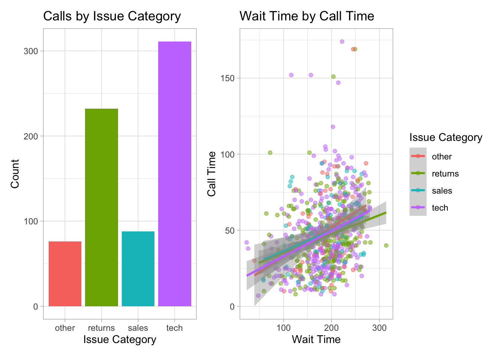
<p class="caption">(\#fig:unnamed-chunk-2)Default plot styles.</p>
</div>

## R Markdown Options

### Image Size

You can set the image size in the <a class='glossary' target='_blank' title='A section of code in an R Markdown file' href='https://psyteachr.github.io/glossary/c#chunk'>chunk</a> headers.


````default
```{r, fig.width = 10, fig.height = 5}
bar + point
```
````

<div class="figure" style="text-align: center">

<p class="caption">(\#fig:figdim-demo)Image size altered to fig.width = 10, fig.height = 5</p>
</div>


::: {.warning data-latex=""}
If you're using a MacBook with a Retina display, you may notice that the figures you see in RStudio when you're editing interactively are different from what you see when you render the file. This is an annoying but known bug in [RStudio](https://github.com/rstudio/rstudio/issues/4521){target="_blank"}. Until it's fixed, you can set fig.width and fig.height to their value/2 when checking a plot, and set it back before you knit.
:::

### Output 

The option `out.width` controls how much space the figure takes up relative to the width of the output. The default value is "100%". You can also set alignment with `fig.align`.


````default
```{r, out.width = "75%", fig.align = "center"}
bar
```
````

<div class="figure" style="text-align: center">
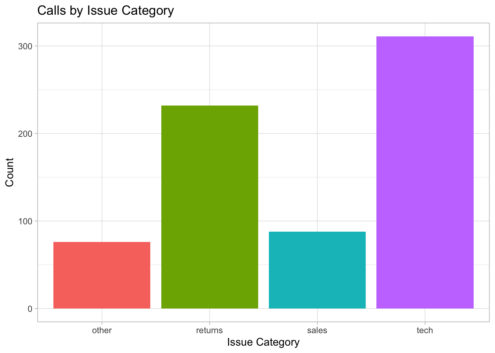
<p class="caption">(\#fig:outwidth-demo)Output display altered with out.width = "75%"</p>
</div>

### Captions

Figures should usually get a caption with `fig.cap` and alt text to describe the figure to people with impaired vision using `fig.alt`. You can use the pattern below to spread the chunk options over multiple lines in a way that makes them easier to read. 


````default
```{r}
#| reference-name, 
#| echo = FALSE, 
#| fig.width = 8, fig.height = 5, out.width = "100%", 
#| fig.cap = "As wait time increases, so does call time.", 
#| fig.alt = "Wait time on the x-axis and Call time on the y-axis. Shows scatterplots and regression lines for each of 4 issue categories: other, returns, sales, and tech. All 4 wait times increase with call time. At 50 seconds wait time, call time is about 25 seconds. At 250 seconds wait time, call time is about 60 seconds."

point
```
````

<div class="figure" style="text-align: center">
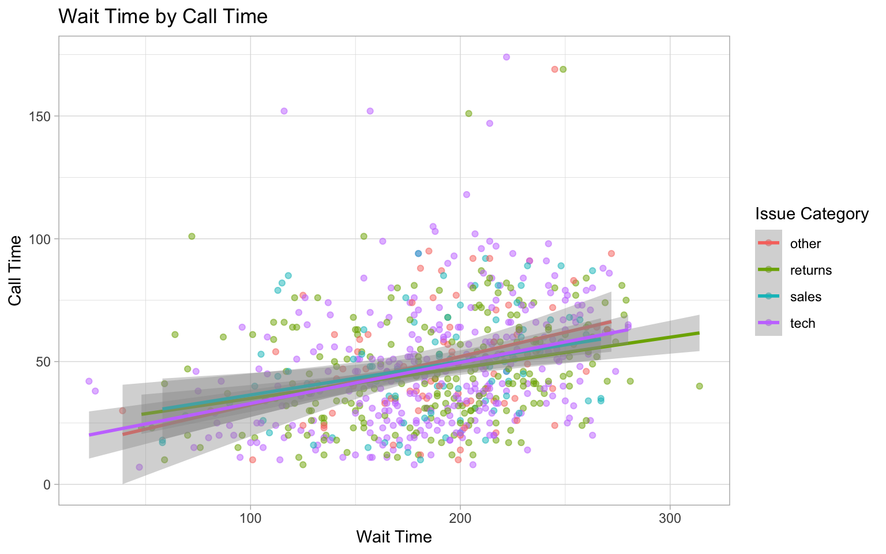
<p class="caption">(\#fig:caption-demo)As wait time increases, so does call time.</p>
</div>


### Setup Chunk

You can also set default values in the setup chunk like this.


```r
knitr::opts_chunk$set(
  fig.width = 10,
  fig.height = 5,
  out.width = "75%",
  fig.align = "center"
)
```

::: {.warning data-latex=""}
When you set the default figure width and height in the setup chunk, images you  make interactively while setting up your script will have the right aspect ratio, but you will only be able to see the `out.width`, `fig.align`, and `fig.cap` when you <a class='glossary' target='_blank' title='To create an HTML, PDF, or Word document from an R Markdown (Rmd) document' href='https://psyteachr.github.io/glossary/k#knit'>knit</a> the file.
:::


## Themes and Colours

Use the scale functions to customise fill and colour. Appendix\ \@ref(plotstyle) has more extensive detail on this.


```r
bar2 <- bar + 
  theme_classic() + 
  scale_fill_brewer(palette = "Dark2")

point2 <- point + 
  theme_classic() + 
  scale_color_brewer(palette = "Dark2")

bar2 + point2
```

<div class="figure" style="text-align: center">
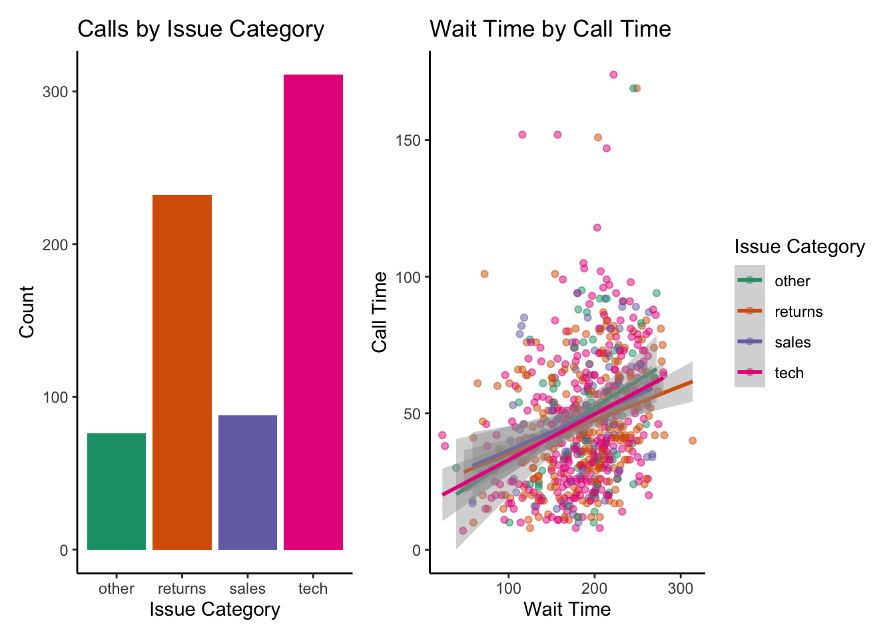
<p class="caption">(\#fig:unnamed-chunk-10)Plots with the classic theme and Dark2 palette.</p>
</div>

You can download extra themes with packages like <code class='package'>ggthemes</code>.


```r
bar_econ <- bar + 
  theme_economist() +
  scale_fill_economist()

point_econ <- point + 
  theme_economist() +
  scale_color_economist() +
  guides(color = "none")

bar_econ + point_econ
```

<div class="figure" style="text-align: center">

<p class="caption">(\#fig:unnamed-chunk-11)Plots with the economist styles from ggthemes.</p>
</div>

## Other Plots

### Interactive Plots

Use the <code class='package'>plotly</code> package to make interactive graphs. Assign your ggplot to a variable and use the function `ggplotly()`. Interactive plots only work in HTML files, not PDFs or Word files.


```r
ggplotly(point_econ)
```

<div class="figure" style="text-align: center">

```{=html}
<div id="htmlwidget-900bbfd4f5c198e6c3c1" style="width:100%;height:480px;" class="plotly html-widget"></div>
<script type="application/json" data-for="htmlwidget-900bbfd4f5c198e6c3c1">{"x":{"data":[{"x":[244,216,176,180,182,194,228,195,155,144,156,185,188,221,81,179,216,232,213,199,260,200,101,227,227,168,191,140,125,181,186,129,223,151,199,192,199,135,184,254,152,233,196,139,214,198,112,265,272,245,149,205,173,216,196,217,203,135,206,177,187,164,244,270,39,141,226,181,245,190,168,217,125,167,200,202],"y":[39,34,38,30,36,57,63,64,47,47,61,95,43,33,30,38,45,49,39,10,46,14,10,26,61,45,87,61,77,88,42,41,73,54,49,58,37,24,35,83,59,91,54,29,92,77,54,64,94,169,40,34,48,58,52,71,33,23,92,74,76,33,72,63,30,43,35,12,24,40,16,21,24,35,20,23],"text":["wait_time: 244<br />call_time:  39<br />issue_category: other","wait_time: 216<br />call_time:  34<br />issue_category: other","wait_time: 176<br />call_time:  38<br />issue_category: other","wait_time: 180<br />call_time:  30<br />issue_category: other","wait_time: 182<br />call_time:  36<br />issue_category: other","wait_time: 194<br />call_time:  57<br />issue_category: other","wait_time: 228<br />call_time:  63<br />issue_category: other","wait_time: 195<br />call_time:  64<br />issue_category: other","wait_time: 155<br />call_time:  47<br />issue_category: other","wait_time: 144<br />call_time:  47<br />issue_category: other","wait_time: 156<br />call_time:  61<br />issue_category: other","wait_time: 185<br />call_time:  95<br />issue_category: other","wait_time: 188<br />call_time:  43<br />issue_category: other","wait_time: 221<br />call_time:  33<br />issue_category: other","wait_time:  81<br />call_time:  30<br />issue_category: other","wait_time: 179<br />call_time:  38<br />issue_category: other","wait_time: 216<br />call_time:  45<br />issue_category: other","wait_time: 232<br />call_time:  49<br />issue_category: other","wait_time: 213<br />call_time:  39<br />issue_category: other","wait_time: 199<br />call_time:  10<br />issue_category: other","wait_time: 260<br />call_time:  46<br />issue_category: other","wait_time: 200<br />call_time:  14<br />issue_category: other","wait_time: 101<br />call_time:  10<br />issue_category: other","wait_time: 227<br />call_time:  26<br />issue_category: other","wait_time: 227<br />call_time:  61<br />issue_category: other","wait_time: 168<br />call_time:  45<br />issue_category: other","wait_time: 191<br />call_time:  87<br />issue_category: other","wait_time: 140<br />call_time:  61<br />issue_category: other","wait_time: 125<br />call_time:  77<br />issue_category: other","wait_time: 181<br />call_time:  88<br />issue_category: other","wait_time: 186<br />call_time:  42<br />issue_category: other","wait_time: 129<br />call_time:  41<br />issue_category: other","wait_time: 223<br />call_time:  73<br />issue_category: other","wait_time: 151<br />call_time:  54<br />issue_category: other","wait_time: 199<br />call_time:  49<br />issue_category: other","wait_time: 192<br />call_time:  58<br />issue_category: other","wait_time: 199<br />call_time:  37<br />issue_category: other","wait_time: 135<br />call_time:  24<br />issue_category: other","wait_time: 184<br />call_time:  35<br />issue_category: other","wait_time: 254<br />call_time:  83<br />issue_category: other","wait_time: 152<br />call_time:  59<br />issue_category: other","wait_time: 233<br />call_time:  91<br />issue_category: other","wait_time: 196<br />call_time:  54<br />issue_category: other","wait_time: 139<br />call_time:  29<br />issue_category: other","wait_time: 214<br />call_time:  92<br />issue_category: other","wait_time: 198<br />call_time:  77<br />issue_category: other","wait_time: 112<br />call_time:  54<br />issue_category: other","wait_time: 265<br />call_time:  64<br />issue_category: other","wait_time: 272<br />call_time:  94<br />issue_category: other","wait_time: 245<br />call_time: 169<br />issue_category: other","wait_time: 149<br />call_time:  40<br />issue_category: other","wait_time: 205<br />call_time:  34<br />issue_category: other","wait_time: 173<br />call_time:  48<br />issue_category: other","wait_time: 216<br />call_time:  58<br />issue_category: other","wait_time: 196<br />call_time:  52<br />issue_category: other","wait_time: 217<br />call_time:  71<br />issue_category: other","wait_time: 203<br />call_time:  33<br />issue_category: other","wait_time: 135<br />call_time:  23<br />issue_category: other","wait_time: 206<br />call_time:  92<br />issue_category: other","wait_time: 177<br />call_time:  74<br />issue_category: other","wait_time: 187<br />call_time:  76<br />issue_category: other","wait_time: 164<br />call_time:  33<br />issue_category: other","wait_time: 244<br />call_time:  72<br />issue_category: other","wait_time: 270<br />call_time:  63<br />issue_category: other","wait_time:  39<br />call_time:  30<br />issue_category: other","wait_time: 141<br />call_time:  43<br />issue_category: other","wait_time: 226<br />call_time:  35<br />issue_category: other","wait_time: 181<br />call_time:  12<br />issue_category: other","wait_time: 245<br />call_time:  24<br />issue_category: other","wait_time: 190<br />call_time:  40<br />issue_category: other","wait_time: 168<br />call_time:  16<br />issue_category: other","wait_time: 217<br />call_time:  21<br />issue_category: other","wait_time: 125<br />call_time:  24<br />issue_category: other","wait_time: 167<br />call_time:  35<br />issue_category: other","wait_time: 200<br />call_time:  20<br />issue_category: other","wait_time: 202<br />call_time:  23<br />issue_category: other"],"type":"scatter","mode":"markers","marker":{"autocolorscale":false,"color":"rgba(103,148,167,1)","opacity":0.5,"size":5.66929133858268,"symbol":"circle","line":{"width":1.88976377952756,"color":"rgba(103,148,167,1)"}},"hoveron":"points","name":"other","legendgroup":"other","showlegend":true,"xaxis":"x","yaxis":"y","hoverinfo":"text","frame":null},{"x":[178,230,136,224,135,118,212,210,229,314,170,230,154,258,159,186,274,230,217,212,96,212,169,255,189,213,153,157,279,149,208,263,101,164,194,200,111,189,265,245,117,152,198,217,162,211,125,180,260,102,135,242,150,193,128,120,202,48,206,197,236,169,149,235,199,210,235,270,151,230,180,121,228,207,116,72,260,222,170,64,178,154,117,230,141,249,122,269,236,207,183,112,176,128,227,242,250,228,186,131,87,206,192,197,188,148,94,227,76,278,132,154,219,179,183,213,141,146,53,252,223,255,194,204,206,70,220,167,120,70,238,111,107,132,140,209,205,128,194,189,213,186,89,270,277,133,167,235,129,151,190,190,145,236,150,207,223,206,201,224,204,235,236,252,174,204,238,181,118,59,228,165,235,205,180,218,242,134,214,224,237,176,254,184,233,225,179,186,261,152,127,222,154,249,205,195,159,218,196,240,129,217,59,170,153,260,194,146,183,223,263,252,135,135,209,172,232,200,121,123,211,205,209,141,238,165,261,191,227,188,281,196],"y":[20,46,20,22,25,23,48,72,17,40,46,31,25,24,39,27,58,42,18,39,20,52,35,82,37,63,54,52,75,68,54,60,61,28,68,57,59,45,52,80,32,32,43,35,49,37,8,50,64,19,27,42,30,33,45,41,29,23,12,20,58,20,23,58,32,87,33,42,61,40,12,76,75,72,66,101,84,82,80,61,81,101,46,73,48,169,64,74,41,47,31,35,23,37,69,63,61,64,62,33,60,51,29,35,32,33,15,44,15,69,41,39,58,44,64,82,34,51,23,45,47,77,30,17,80,47,53,57,64,20,58,66,35,76,50,73,46,30,43,36,70,31,37,63,81,52,76,74,26,63,53,79,34,54,63,31,41,43,32,80,24,41,59,40,45,151,39,55,20,41,63,66,42,26,52,78,64,27,84,69,55,67,57,31,45,41,21,18,54,37,20,30,23,44,30,40,19,44,58,37,30,25,10,11,27,26,37,13,41,17,49,52,12,18,33,41,53,25,33,11,56,30,36,18,33,12,65,17,58,43,42,12],"text":["wait_time: 178<br />call_time:  20<br />issue_category: returns","wait_time: 230<br />call_time:  46<br />issue_category: returns","wait_time: 136<br />call_time:  20<br />issue_category: returns","wait_time: 224<br />call_time:  22<br />issue_category: returns","wait_time: 135<br />call_time:  25<br />issue_category: returns","wait_time: 118<br />call_time:  23<br />issue_category: returns","wait_time: 212<br />call_time:  48<br />issue_category: returns","wait_time: 210<br />call_time:  72<br />issue_category: returns","wait_time: 229<br />call_time:  17<br />issue_category: returns","wait_time: 314<br />call_time:  40<br />issue_category: returns","wait_time: 170<br />call_time:  46<br />issue_category: returns","wait_time: 230<br />call_time:  31<br />issue_category: returns","wait_time: 154<br />call_time:  25<br />issue_category: returns","wait_time: 258<br />call_time:  24<br />issue_category: returns","wait_time: 159<br />call_time:  39<br />issue_category: returns","wait_time: 186<br />call_time:  27<br />issue_category: returns","wait_time: 274<br />call_time:  58<br />issue_category: returns","wait_time: 230<br />call_time:  42<br />issue_category: returns","wait_time: 217<br />call_time:  18<br />issue_category: returns","wait_time: 212<br />call_time:  39<br />issue_category: returns","wait_time:  96<br />call_time:  20<br />issue_category: returns","wait_time: 212<br />call_time:  52<br />issue_category: returns","wait_time: 169<br />call_time:  35<br />issue_category: returns","wait_time: 255<br />call_time:  82<br />issue_category: returns","wait_time: 189<br />call_time:  37<br />issue_category: returns","wait_time: 213<br />call_time:  63<br />issue_category: returns","wait_time: 153<br />call_time:  54<br />issue_category: returns","wait_time: 157<br />call_time:  52<br />issue_category: returns","wait_time: 279<br />call_time:  75<br />issue_category: returns","wait_time: 149<br />call_time:  68<br />issue_category: returns","wait_time: 208<br />call_time:  54<br />issue_category: returns","wait_time: 263<br />call_time:  60<br />issue_category: returns","wait_time: 101<br />call_time:  61<br />issue_category: returns","wait_time: 164<br />call_time:  28<br />issue_category: returns","wait_time: 194<br />call_time:  68<br />issue_category: returns","wait_time: 200<br />call_time:  57<br />issue_category: returns","wait_time: 111<br />call_time:  59<br />issue_category: returns","wait_time: 189<br />call_time:  45<br />issue_category: returns","wait_time: 265<br />call_time:  52<br />issue_category: returns","wait_time: 245<br />call_time:  80<br />issue_category: returns","wait_time: 117<br />call_time:  32<br />issue_category: returns","wait_time: 152<br />call_time:  32<br />issue_category: returns","wait_time: 198<br />call_time:  43<br />issue_category: returns","wait_time: 217<br />call_time:  35<br />issue_category: returns","wait_time: 162<br />call_time:  49<br />issue_category: returns","wait_time: 211<br />call_time:  37<br />issue_category: returns","wait_time: 125<br />call_time:   8<br />issue_category: returns","wait_time: 180<br />call_time:  50<br />issue_category: returns","wait_time: 260<br />call_time:  64<br />issue_category: returns","wait_time: 102<br />call_time:  19<br />issue_category: returns","wait_time: 135<br />call_time:  27<br />issue_category: returns","wait_time: 242<br />call_time:  42<br />issue_category: returns","wait_time: 150<br />call_time:  30<br />issue_category: returns","wait_time: 193<br />call_time:  33<br />issue_category: returns","wait_time: 128<br />call_time:  45<br />issue_category: returns","wait_time: 120<br />call_time:  41<br />issue_category: returns","wait_time: 202<br />call_time:  29<br />issue_category: returns","wait_time:  48<br />call_time:  23<br />issue_category: returns","wait_time: 206<br />call_time:  12<br />issue_category: returns","wait_time: 197<br />call_time:  20<br />issue_category: returns","wait_time: 236<br />call_time:  58<br />issue_category: returns","wait_time: 169<br />call_time:  20<br />issue_category: returns","wait_time: 149<br />call_time:  23<br />issue_category: returns","wait_time: 235<br />call_time:  58<br />issue_category: returns","wait_time: 199<br />call_time:  32<br />issue_category: returns","wait_time: 210<br />call_time:  87<br />issue_category: returns","wait_time: 235<br />call_time:  33<br />issue_category: returns","wait_time: 270<br />call_time:  42<br />issue_category: returns","wait_time: 151<br />call_time:  61<br />issue_category: returns","wait_time: 230<br />call_time:  40<br />issue_category: returns","wait_time: 180<br />call_time:  12<br />issue_category: returns","wait_time: 121<br />call_time:  76<br />issue_category: returns","wait_time: 228<br />call_time:  75<br />issue_category: returns","wait_time: 207<br />call_time:  72<br />issue_category: returns","wait_time: 116<br />call_time:  66<br />issue_category: returns","wait_time:  72<br />call_time: 101<br />issue_category: returns","wait_time: 260<br />call_time:  84<br />issue_category: returns","wait_time: 222<br />call_time:  82<br />issue_category: returns","wait_time: 170<br />call_time:  80<br />issue_category: returns","wait_time:  64<br />call_time:  61<br />issue_category: returns","wait_time: 178<br />call_time:  81<br />issue_category: returns","wait_time: 154<br />call_time: 101<br />issue_category: returns","wait_time: 117<br />call_time:  46<br />issue_category: returns","wait_time: 230<br />call_time:  73<br />issue_category: returns","wait_time: 141<br />call_time:  48<br />issue_category: returns","wait_time: 249<br />call_time: 169<br />issue_category: returns","wait_time: 122<br />call_time:  64<br />issue_category: returns","wait_time: 269<br />call_time:  74<br />issue_category: returns","wait_time: 236<br />call_time:  41<br />issue_category: returns","wait_time: 207<br />call_time:  47<br />issue_category: returns","wait_time: 183<br />call_time:  31<br />issue_category: returns","wait_time: 112<br />call_time:  35<br />issue_category: returns","wait_time: 176<br />call_time:  23<br />issue_category: returns","wait_time: 128<br />call_time:  37<br />issue_category: returns","wait_time: 227<br />call_time:  69<br />issue_category: returns","wait_time: 242<br />call_time:  63<br />issue_category: returns","wait_time: 250<br />call_time:  61<br />issue_category: returns","wait_time: 228<br />call_time:  64<br />issue_category: returns","wait_time: 186<br />call_time:  62<br />issue_category: returns","wait_time: 131<br />call_time:  33<br />issue_category: returns","wait_time:  87<br />call_time:  60<br />issue_category: returns","wait_time: 206<br />call_time:  51<br />issue_category: returns","wait_time: 192<br />call_time:  29<br />issue_category: returns","wait_time: 197<br />call_time:  35<br />issue_category: returns","wait_time: 188<br />call_time:  32<br />issue_category: returns","wait_time: 148<br />call_time:  33<br />issue_category: returns","wait_time:  94<br />call_time:  15<br />issue_category: returns","wait_time: 227<br />call_time:  44<br />issue_category: returns","wait_time:  76<br />call_time:  15<br />issue_category: returns","wait_time: 278<br />call_time:  69<br />issue_category: returns","wait_time: 132<br />call_time:  41<br />issue_category: returns","wait_time: 154<br />call_time:  39<br />issue_category: returns","wait_time: 219<br />call_time:  58<br />issue_category: returns","wait_time: 179<br />call_time:  44<br />issue_category: returns","wait_time: 183<br />call_time:  64<br />issue_category: returns","wait_time: 213<br />call_time:  82<br />issue_category: returns","wait_time: 141<br />call_time:  34<br />issue_category: returns","wait_time: 146<br />call_time:  51<br />issue_category: returns","wait_time:  53<br />call_time:  23<br />issue_category: returns","wait_time: 252<br />call_time:  45<br />issue_category: returns","wait_time: 223<br />call_time:  47<br />issue_category: returns","wait_time: 255<br />call_time:  77<br />issue_category: returns","wait_time: 194<br />call_time:  30<br />issue_category: returns","wait_time: 204<br />call_time:  17<br />issue_category: returns","wait_time: 206<br />call_time:  80<br />issue_category: returns","wait_time:  70<br />call_time:  47<br />issue_category: returns","wait_time: 220<br />call_time:  53<br />issue_category: returns","wait_time: 167<br />call_time:  57<br />issue_category: returns","wait_time: 120<br />call_time:  64<br />issue_category: returns","wait_time:  70<br />call_time:  20<br />issue_category: returns","wait_time: 238<br />call_time:  58<br />issue_category: returns","wait_time: 111<br />call_time:  66<br />issue_category: returns","wait_time: 107<br />call_time:  35<br />issue_category: returns","wait_time: 132<br />call_time:  76<br />issue_category: returns","wait_time: 140<br />call_time:  50<br />issue_category: returns","wait_time: 209<br />call_time:  73<br />issue_category: returns","wait_time: 205<br />call_time:  46<br />issue_category: returns","wait_time: 128<br />call_time:  30<br />issue_category: returns","wait_time: 194<br />call_time:  43<br />issue_category: returns","wait_time: 189<br />call_time:  36<br />issue_category: returns","wait_time: 213<br />call_time:  70<br />issue_category: returns","wait_time: 186<br />call_time:  31<br />issue_category: returns","wait_time:  89<br />call_time:  37<br />issue_category: returns","wait_time: 270<br />call_time:  63<br />issue_category: returns","wait_time: 277<br />call_time:  81<br />issue_category: returns","wait_time: 133<br />call_time:  52<br />issue_category: returns","wait_time: 167<br />call_time:  76<br />issue_category: returns","wait_time: 235<br />call_time:  74<br />issue_category: returns","wait_time: 129<br />call_time:  26<br />issue_category: returns","wait_time: 151<br />call_time:  63<br />issue_category: returns","wait_time: 190<br />call_time:  53<br />issue_category: returns","wait_time: 190<br />call_time:  79<br />issue_category: returns","wait_time: 145<br />call_time:  34<br />issue_category: returns","wait_time: 236<br />call_time:  54<br />issue_category: returns","wait_time: 150<br />call_time:  63<br />issue_category: returns","wait_time: 207<br />call_time:  31<br />issue_category: returns","wait_time: 223<br />call_time:  41<br />issue_category: returns","wait_time: 206<br />call_time:  43<br />issue_category: returns","wait_time: 201<br />call_time:  32<br />issue_category: returns","wait_time: 224<br />call_time:  80<br />issue_category: returns","wait_time: 204<br />call_time:  24<br />issue_category: returns","wait_time: 235<br />call_time:  41<br />issue_category: returns","wait_time: 236<br />call_time:  59<br />issue_category: returns","wait_time: 252<br />call_time:  40<br />issue_category: returns","wait_time: 174<br />call_time:  45<br />issue_category: returns","wait_time: 204<br />call_time: 151<br />issue_category: returns","wait_time: 238<br />call_time:  39<br />issue_category: returns","wait_time: 181<br />call_time:  55<br />issue_category: returns","wait_time: 118<br />call_time:  20<br />issue_category: returns","wait_time:  59<br />call_time:  41<br />issue_category: returns","wait_time: 228<br />call_time:  63<br />issue_category: returns","wait_time: 165<br />call_time:  66<br />issue_category: returns","wait_time: 235<br />call_time:  42<br />issue_category: returns","wait_time: 205<br />call_time:  26<br />issue_category: returns","wait_time: 180<br />call_time:  52<br />issue_category: returns","wait_time: 218<br />call_time:  78<br />issue_category: returns","wait_time: 242<br />call_time:  64<br />issue_category: returns","wait_time: 134<br />call_time:  27<br />issue_category: returns","wait_time: 214<br />call_time:  84<br />issue_category: returns","wait_time: 224<br />call_time:  69<br />issue_category: returns","wait_time: 237<br />call_time:  55<br />issue_category: returns","wait_time: 176<br />call_time:  67<br />issue_category: returns","wait_time: 254<br />call_time:  57<br />issue_category: returns","wait_time: 184<br />call_time:  31<br />issue_category: returns","wait_time: 233<br />call_time:  45<br />issue_category: returns","wait_time: 225<br />call_time:  41<br />issue_category: returns","wait_time: 179<br />call_time:  21<br />issue_category: returns","wait_time: 186<br />call_time:  18<br />issue_category: returns","wait_time: 261<br />call_time:  54<br />issue_category: returns","wait_time: 152<br />call_time:  37<br />issue_category: returns","wait_time: 127<br />call_time:  20<br />issue_category: returns","wait_time: 222<br />call_time:  30<br />issue_category: returns","wait_time: 154<br />call_time:  23<br />issue_category: returns","wait_time: 249<br />call_time:  44<br />issue_category: returns","wait_time: 205<br />call_time:  30<br />issue_category: returns","wait_time: 195<br />call_time:  40<br />issue_category: returns","wait_time: 159<br />call_time:  19<br />issue_category: returns","wait_time: 218<br />call_time:  44<br />issue_category: returns","wait_time: 196<br />call_time:  58<br />issue_category: returns","wait_time: 240<br />call_time:  37<br />issue_category: returns","wait_time: 129<br />call_time:  30<br />issue_category: returns","wait_time: 217<br />call_time:  25<br />issue_category: returns","wait_time:  59<br />call_time:  10<br />issue_category: returns","wait_time: 170<br />call_time:  11<br />issue_category: returns","wait_time: 153<br />call_time:  27<br />issue_category: returns","wait_time: 260<br />call_time:  26<br />issue_category: returns","wait_time: 194<br />call_time:  37<br />issue_category: returns","wait_time: 146<br />call_time:  13<br />issue_category: returns","wait_time: 183<br />call_time:  41<br />issue_category: returns","wait_time: 223<br />call_time:  17<br />issue_category: returns","wait_time: 263<br />call_time:  49<br />issue_category: returns","wait_time: 252<br />call_time:  52<br />issue_category: returns","wait_time: 135<br />call_time:  12<br />issue_category: returns","wait_time: 135<br />call_time:  18<br />issue_category: returns","wait_time: 209<br />call_time:  33<br />issue_category: returns","wait_time: 172<br />call_time:  41<br />issue_category: returns","wait_time: 232<br />call_time:  53<br />issue_category: returns","wait_time: 200<br />call_time:  25<br />issue_category: returns","wait_time: 121<br />call_time:  33<br />issue_category: returns","wait_time: 123<br />call_time:  11<br />issue_category: returns","wait_time: 211<br />call_time:  56<br />issue_category: returns","wait_time: 205<br />call_time:  30<br />issue_category: returns","wait_time: 209<br />call_time:  36<br />issue_category: returns","wait_time: 141<br />call_time:  18<br />issue_category: returns","wait_time: 238<br />call_time:  33<br />issue_category: returns","wait_time: 165<br />call_time:  12<br />issue_category: returns","wait_time: 261<br />call_time:  65<br />issue_category: returns","wait_time: 191<br />call_time:  17<br />issue_category: returns","wait_time: 227<br />call_time:  58<br />issue_category: returns","wait_time: 188<br />call_time:  43<br />issue_category: returns","wait_time: 281<br />call_time:  42<br />issue_category: returns","wait_time: 196<br />call_time:  12<br />issue_category: returns"],"type":"scatter","mode":"markers","marker":{"autocolorscale":false,"color":"rgba(1,77,100,1)","opacity":0.5,"size":5.66929133858268,"symbol":"circle","line":{"width":1.88976377952756,"color":"rgba(1,77,100,1)"}},"hoveron":"points","name":"returns","legendgroup":"returns","showlegend":true,"xaxis":"x","yaxis":"y","hoverinfo":"text","frame":null},{"x":[267,248,267,156,58,200,105,178,214,212,230,200,192,212,248,69,216,58,102,166,139,243,217,118,263,113,174,229,188,160,115,170,194,225,222,200,183,207,173,109,193,207,230,238,261,90,252,157,226,180,158,215,184,154,218,189,118,223,149,130,106,216,232,153,127,192,227,221,257,199,229,212,190,171,198,164,113,170,260,175,228,217,195,190,169,181,222,186],"y":[34,58,35,15,17,21,53,66,48,92,63,73,40,34,89,28,58,18,40,36,19,67,67,85,87,79,76,81,58,42,82,47,68,52,46,26,27,81,25,21,19,31,45,54,34,33,68,48,51,94,48,42,46,63,81,40,46,42,51,16,26,30,89,53,41,85,74,50,67,39,60,18,53,16,60,17,44,43,61,13,29,52,51,52,36,10,36,29],"text":["wait_time: 267<br />call_time:  34<br />issue_category: sales","wait_time: 248<br />call_time:  58<br />issue_category: sales","wait_time: 267<br />call_time:  35<br />issue_category: sales","wait_time: 156<br />call_time:  15<br />issue_category: sales","wait_time:  58<br />call_time:  17<br />issue_category: sales","wait_time: 200<br />call_time:  21<br />issue_category: sales","wait_time: 105<br />call_time:  53<br />issue_category: sales","wait_time: 178<br />call_time:  66<br />issue_category: sales","wait_time: 214<br />call_time:  48<br />issue_category: sales","wait_time: 212<br />call_time:  92<br />issue_category: sales","wait_time: 230<br />call_time:  63<br />issue_category: sales","wait_time: 200<br />call_time:  73<br />issue_category: sales","wait_time: 192<br />call_time:  40<br />issue_category: sales","wait_time: 212<br />call_time:  34<br />issue_category: sales","wait_time: 248<br />call_time:  89<br />issue_category: sales","wait_time:  69<br />call_time:  28<br />issue_category: sales","wait_time: 216<br />call_time:  58<br />issue_category: sales","wait_time:  58<br />call_time:  18<br />issue_category: sales","wait_time: 102<br />call_time:  40<br />issue_category: sales","wait_time: 166<br />call_time:  36<br />issue_category: sales","wait_time: 139<br />call_time:  19<br />issue_category: sales","wait_time: 243<br />call_time:  67<br />issue_category: sales","wait_time: 217<br />call_time:  67<br />issue_category: sales","wait_time: 118<br />call_time:  85<br />issue_category: sales","wait_time: 263<br />call_time:  87<br />issue_category: sales","wait_time: 113<br />call_time:  79<br />issue_category: sales","wait_time: 174<br />call_time:  76<br />issue_category: sales","wait_time: 229<br />call_time:  81<br />issue_category: sales","wait_time: 188<br />call_time:  58<br />issue_category: sales","wait_time: 160<br />call_time:  42<br />issue_category: sales","wait_time: 115<br />call_time:  82<br />issue_category: sales","wait_time: 170<br />call_time:  47<br />issue_category: sales","wait_time: 194<br />call_time:  68<br />issue_category: sales","wait_time: 225<br />call_time:  52<br />issue_category: sales","wait_time: 222<br />call_time:  46<br />issue_category: sales","wait_time: 200<br />call_time:  26<br />issue_category: sales","wait_time: 183<br />call_time:  27<br />issue_category: sales","wait_time: 207<br />call_time:  81<br />issue_category: sales","wait_time: 173<br />call_time:  25<br />issue_category: sales","wait_time: 109<br />call_time:  21<br />issue_category: sales","wait_time: 193<br />call_time:  19<br />issue_category: sales","wait_time: 207<br />call_time:  31<br />issue_category: sales","wait_time: 230<br />call_time:  45<br />issue_category: sales","wait_time: 238<br />call_time:  54<br />issue_category: sales","wait_time: 261<br />call_time:  34<br />issue_category: sales","wait_time:  90<br />call_time:  33<br />issue_category: sales","wait_time: 252<br />call_time:  68<br />issue_category: sales","wait_time: 157<br />call_time:  48<br />issue_category: sales","wait_time: 226<br />call_time:  51<br />issue_category: sales","wait_time: 180<br />call_time:  94<br />issue_category: sales","wait_time: 158<br />call_time:  48<br />issue_category: sales","wait_time: 215<br />call_time:  42<br />issue_category: sales","wait_time: 184<br />call_time:  46<br />issue_category: sales","wait_time: 154<br />call_time:  63<br />issue_category: sales","wait_time: 218<br />call_time:  81<br />issue_category: sales","wait_time: 189<br />call_time:  40<br />issue_category: sales","wait_time: 118<br />call_time:  46<br />issue_category: sales","wait_time: 223<br />call_time:  42<br />issue_category: sales","wait_time: 149<br />call_time:  51<br />issue_category: sales","wait_time: 130<br />call_time:  16<br />issue_category: sales","wait_time: 106<br />call_time:  26<br />issue_category: sales","wait_time: 216<br />call_time:  30<br />issue_category: sales","wait_time: 232<br />call_time:  89<br />issue_category: sales","wait_time: 153<br />call_time:  53<br />issue_category: sales","wait_time: 127<br />call_time:  41<br />issue_category: sales","wait_time: 192<br />call_time:  85<br />issue_category: sales","wait_time: 227<br />call_time:  74<br />issue_category: sales","wait_time: 221<br />call_time:  50<br />issue_category: sales","wait_time: 257<br />call_time:  67<br />issue_category: sales","wait_time: 199<br />call_time:  39<br />issue_category: sales","wait_time: 229<br />call_time:  60<br />issue_category: sales","wait_time: 212<br />call_time:  18<br />issue_category: sales","wait_time: 190<br />call_time:  53<br />issue_category: sales","wait_time: 171<br />call_time:  16<br />issue_category: sales","wait_time: 198<br />call_time:  60<br />issue_category: sales","wait_time: 164<br />call_time:  17<br />issue_category: sales","wait_time: 113<br />call_time:  44<br />issue_category: sales","wait_time: 170<br />call_time:  43<br />issue_category: sales","wait_time: 260<br />call_time:  61<br />issue_category: sales","wait_time: 175<br />call_time:  13<br />issue_category: sales","wait_time: 228<br />call_time:  29<br />issue_category: sales","wait_time: 217<br />call_time:  52<br />issue_category: sales","wait_time: 195<br />call_time:  51<br />issue_category: sales","wait_time: 190<br />call_time:  52<br />issue_category: sales","wait_time: 169<br />call_time:  36<br />issue_category: sales","wait_time: 181<br />call_time:  10<br />issue_category: sales","wait_time: 222<br />call_time:  36<br />issue_category: sales","wait_time: 186<br />call_time:  29<br />issue_category: sales"],"type":"scatter","mode":"markers","marker":{"autocolorscale":false,"color":"rgba(1,162,217,1)","opacity":0.5,"size":5.66929133858268,"symbol":"circle","line":{"width":1.88976377952756,"color":"rgba(1,162,217,1)"}},"hoveron":"points","name":"sales","legendgroup":"sales","showlegend":true,"xaxis":"x","yaxis":"y","hoverinfo":"text","frame":null},{"x":[169,206,207,132,193,222,213,170,176,209,201,226,208,201,250,130,165,80,232,118,262,206,103,244,242,211,144,189,240,223,231,168,193,190,151,113,194,241,217,249,256,162,210,225,255,178,250,108,74,212,75,107,122,242,138,195,204,184,251,227,168,195,181,211,179,131,249,203,257,157,176,216,183,207,200,274,96,204,250,246,177,224,186,192,140,214,214,176,251,268,138,163,133,137,211,217,199,217,83,215,242,167,225,187,173,23,225,187,207,260,133,190,123,178,180,157,242,188,272,154,194,148,151,241,214,155,127,205,280,171,209,168,180,217,165,115,92,271,214,175,165,146,115,172,212,229,180,116,162,218,178,147,214,170,150,210,205,178,207,224,212,215,211,222,152,161,163,185,254,171,198,158,190,257,245,191,227,150,257,162,189,247,114,219,183,120,176,137,124,194,230,157,222,171,126,214,233,157,129,164,262,167,250,148,222,269,239,166,258,108,200,166,205,220,104,241,207,244,170,212,199,234,147,203,184,165,192,130,240,211,161,166,215,116,246,180,228,214,73,26,261,164,232,184,185,129,197,203,263,158,85,254,249,164,157,236,90,191,209,203,183,129,214,165,203,243,196,178,280,252,214,198,229,158,112,175,195,124,240,218,179,176,150,105,197,86,135,95,100,232,163,178,215,157,186,165,84,169,103,178,263,152,172,106,162,200,216,179,47,189,138],"y":[34,52,41,16,46,46,40,44,52,37,22,26,22,19,34,26,26,19,41,37,26,8,25,36,41,50,11,22,56,66,71,14,49,72,51,40,90,91,75,67,73,65,96,60,66,69,75,60,46,52,38,34,51,54,40,28,52,26,25,28,51,18,22,47,26,14,40,53,42,25,55,20,42,26,33,46,64,57,63,51,61,49,12,60,56,50,20,74,77,88,69,99,38,74,86,97,35,60,29,84,81,80,78,63,46,42,94,105,102,79,56,65,70,76,94,70,98,103,62,84,31,42,46,65,41,35,65,38,65,18,36,24,59,33,19,32,20,86,36,52,46,42,37,25,58,73,35,19,48,33,53,55,25,48,46,48,81,37,62,66,45,57,33,38,51,28,23,36,68,49,36,31,63,48,85,25,55,29,69,51,48,50,10,81,44,24,37,46,36,61,84,152,60,26,76,58,91,21,37,34,71,42,79,41,174,62,47,30,73,45,64,50,72,41,47,33,39,59,32,31,64,73,38,24,31,46,59,54,60,38,18,68,72,152,55,71,62,99,15,38,53,43,14,51,24,21,93,40,80,51,20,32,52,30,41,66,24,41,30,34,20,40,147,33,118,78,25,50,64,27,39,21,29,11,24,15,18,22,39,53,40,19,12,25,32,42,19,11,17,37,16,19,29,11,30,11,25,33,17,8,20,33,29,15,39,21,20,25,7,26,18],"text":["wait_time: 169<br />call_time:  34<br />issue_category: tech","wait_time: 206<br />call_time:  52<br />issue_category: tech","wait_time: 207<br />call_time:  41<br />issue_category: tech","wait_time: 132<br />call_time:  16<br />issue_category: tech","wait_time: 193<br />call_time:  46<br />issue_category: tech","wait_time: 222<br />call_time:  46<br />issue_category: tech","wait_time: 213<br />call_time:  40<br />issue_category: tech","wait_time: 170<br />call_time:  44<br />issue_category: tech","wait_time: 176<br />call_time:  52<br />issue_category: tech","wait_time: 209<br />call_time:  37<br />issue_category: tech","wait_time: 201<br />call_time:  22<br />issue_category: tech","wait_time: 226<br />call_time:  26<br />issue_category: tech","wait_time: 208<br />call_time:  22<br />issue_category: tech","wait_time: 201<br />call_time:  19<br />issue_category: tech","wait_time: 250<br />call_time:  34<br />issue_category: tech","wait_time: 130<br />call_time:  26<br />issue_category: tech","wait_time: 165<br />call_time:  26<br />issue_category: tech","wait_time:  80<br />call_time:  19<br />issue_category: tech","wait_time: 232<br />call_time:  41<br />issue_category: tech","wait_time: 118<br />call_time:  37<br />issue_category: tech","wait_time: 262<br />call_time:  26<br />issue_category: tech","wait_time: 206<br />call_time:   8<br />issue_category: tech","wait_time: 103<br />call_time:  25<br />issue_category: tech","wait_time: 244<br />call_time:  36<br />issue_category: tech","wait_time: 242<br />call_time:  41<br />issue_category: tech","wait_time: 211<br />call_time:  50<br />issue_category: tech","wait_time: 144<br />call_time:  11<br />issue_category: tech","wait_time: 189<br />call_time:  22<br />issue_category: tech","wait_time: 240<br />call_time:  56<br />issue_category: tech","wait_time: 223<br />call_time:  66<br />issue_category: tech","wait_time: 231<br />call_time:  71<br />issue_category: tech","wait_time: 168<br />call_time:  14<br />issue_category: tech","wait_time: 193<br />call_time:  49<br />issue_category: tech","wait_time: 190<br />call_time:  72<br />issue_category: tech","wait_time: 151<br />call_time:  51<br />issue_category: tech","wait_time: 113<br />call_time:  40<br />issue_category: tech","wait_time: 194<br />call_time:  90<br />issue_category: tech","wait_time: 241<br />call_time:  91<br />issue_category: tech","wait_time: 217<br />call_time:  75<br />issue_category: tech","wait_time: 249<br />call_time:  67<br />issue_category: tech","wait_time: 256<br />call_time:  73<br />issue_category: tech","wait_time: 162<br />call_time:  65<br />issue_category: tech","wait_time: 210<br />call_time:  96<br />issue_category: tech","wait_time: 225<br />call_time:  60<br />issue_category: tech","wait_time: 255<br />call_time:  66<br />issue_category: tech","wait_time: 178<br />call_time:  69<br />issue_category: tech","wait_time: 250<br />call_time:  75<br />issue_category: tech","wait_time: 108<br />call_time:  60<br />issue_category: tech","wait_time:  74<br />call_time:  46<br />issue_category: tech","wait_time: 212<br />call_time:  52<br />issue_category: tech","wait_time:  75<br />call_time:  38<br />issue_category: tech","wait_time: 107<br />call_time:  34<br />issue_category: tech","wait_time: 122<br />call_time:  51<br />issue_category: tech","wait_time: 242<br />call_time:  54<br />issue_category: tech","wait_time: 138<br />call_time:  40<br />issue_category: tech","wait_time: 195<br />call_time:  28<br />issue_category: tech","wait_time: 204<br />call_time:  52<br />issue_category: tech","wait_time: 184<br />call_time:  26<br />issue_category: tech","wait_time: 251<br />call_time:  25<br />issue_category: tech","wait_time: 227<br />call_time:  28<br />issue_category: tech","wait_time: 168<br />call_time:  51<br />issue_category: tech","wait_time: 195<br />call_time:  18<br />issue_category: tech","wait_time: 181<br />call_time:  22<br />issue_category: tech","wait_time: 211<br />call_time:  47<br />issue_category: tech","wait_time: 179<br />call_time:  26<br />issue_category: tech","wait_time: 131<br />call_time:  14<br />issue_category: tech","wait_time: 249<br />call_time:  40<br />issue_category: tech","wait_time: 203<br />call_time:  53<br />issue_category: tech","wait_time: 257<br />call_time:  42<br />issue_category: tech","wait_time: 157<br />call_time:  25<br />issue_category: tech","wait_time: 176<br />call_time:  55<br />issue_category: tech","wait_time: 216<br />call_time:  20<br />issue_category: tech","wait_time: 183<br />call_time:  42<br />issue_category: tech","wait_time: 207<br />call_time:  26<br />issue_category: tech","wait_time: 200<br />call_time:  33<br />issue_category: tech","wait_time: 274<br />call_time:  46<br />issue_category: tech","wait_time:  96<br />call_time:  64<br />issue_category: tech","wait_time: 204<br />call_time:  57<br />issue_category: tech","wait_time: 250<br />call_time:  63<br />issue_category: tech","wait_time: 246<br />call_time:  51<br />issue_category: tech","wait_time: 177<br />call_time:  61<br />issue_category: tech","wait_time: 224<br />call_time:  49<br />issue_category: tech","wait_time: 186<br />call_time:  12<br />issue_category: tech","wait_time: 192<br />call_time:  60<br />issue_category: tech","wait_time: 140<br />call_time:  56<br />issue_category: tech","wait_time: 214<br />call_time:  50<br />issue_category: tech","wait_time: 214<br />call_time:  20<br />issue_category: tech","wait_time: 176<br />call_time:  74<br />issue_category: tech","wait_time: 251<br />call_time:  77<br />issue_category: tech","wait_time: 268<br />call_time:  88<br />issue_category: tech","wait_time: 138<br />call_time:  69<br />issue_category: tech","wait_time: 163<br />call_time:  99<br />issue_category: tech","wait_time: 133<br />call_time:  38<br />issue_category: tech","wait_time: 137<br />call_time:  74<br />issue_category: tech","wait_time: 211<br />call_time:  86<br />issue_category: tech","wait_time: 217<br />call_time:  97<br />issue_category: tech","wait_time: 199<br />call_time:  35<br />issue_category: tech","wait_time: 217<br />call_time:  60<br />issue_category: tech","wait_time:  83<br />call_time:  29<br />issue_category: tech","wait_time: 215<br />call_time:  84<br />issue_category: tech","wait_time: 242<br />call_time:  81<br />issue_category: tech","wait_time: 167<br />call_time:  80<br />issue_category: tech","wait_time: 225<br />call_time:  78<br />issue_category: tech","wait_time: 187<br />call_time:  63<br />issue_category: tech","wait_time: 173<br />call_time:  46<br />issue_category: tech","wait_time:  23<br />call_time:  42<br />issue_category: tech","wait_time: 225<br />call_time:  94<br />issue_category: tech","wait_time: 187<br />call_time: 105<br />issue_category: tech","wait_time: 207<br />call_time: 102<br />issue_category: tech","wait_time: 260<br />call_time:  79<br />issue_category: tech","wait_time: 133<br />call_time:  56<br />issue_category: tech","wait_time: 190<br />call_time:  65<br />issue_category: tech","wait_time: 123<br />call_time:  70<br />issue_category: tech","wait_time: 178<br />call_time:  76<br />issue_category: tech","wait_time: 180<br />call_time:  94<br />issue_category: tech","wait_time: 157<br />call_time:  70<br />issue_category: tech","wait_time: 242<br />call_time:  98<br />issue_category: tech","wait_time: 188<br />call_time: 103<br />issue_category: tech","wait_time: 272<br />call_time:  62<br />issue_category: tech","wait_time: 154<br />call_time:  84<br />issue_category: tech","wait_time: 194<br />call_time:  31<br />issue_category: tech","wait_time: 148<br />call_time:  42<br />issue_category: tech","wait_time: 151<br />call_time:  46<br />issue_category: tech","wait_time: 241<br />call_time:  65<br />issue_category: tech","wait_time: 214<br />call_time:  41<br />issue_category: tech","wait_time: 155<br />call_time:  35<br />issue_category: tech","wait_time: 127<br />call_time:  65<br />issue_category: tech","wait_time: 205<br />call_time:  38<br />issue_category: tech","wait_time: 280<br />call_time:  65<br />issue_category: tech","wait_time: 171<br />call_time:  18<br />issue_category: tech","wait_time: 209<br />call_time:  36<br />issue_category: tech","wait_time: 168<br />call_time:  24<br />issue_category: tech","wait_time: 180<br />call_time:  59<br />issue_category: tech","wait_time: 217<br />call_time:  33<br />issue_category: tech","wait_time: 165<br />call_time:  19<br />issue_category: tech","wait_time: 115<br />call_time:  32<br />issue_category: tech","wait_time:  92<br />call_time:  20<br />issue_category: tech","wait_time: 271<br />call_time:  86<br />issue_category: tech","wait_time: 214<br />call_time:  36<br />issue_category: tech","wait_time: 175<br />call_time:  52<br />issue_category: tech","wait_time: 165<br />call_time:  46<br />issue_category: tech","wait_time: 146<br />call_time:  42<br />issue_category: tech","wait_time: 115<br />call_time:  37<br />issue_category: tech","wait_time: 172<br />call_time:  25<br />issue_category: tech","wait_time: 212<br />call_time:  58<br />issue_category: tech","wait_time: 229<br />call_time:  73<br />issue_category: tech","wait_time: 180<br />call_time:  35<br />issue_category: tech","wait_time: 116<br />call_time:  19<br />issue_category: tech","wait_time: 162<br />call_time:  48<br />issue_category: tech","wait_time: 218<br />call_time:  33<br />issue_category: tech","wait_time: 178<br />call_time:  53<br />issue_category: tech","wait_time: 147<br />call_time:  55<br />issue_category: tech","wait_time: 214<br />call_time:  25<br />issue_category: tech","wait_time: 170<br />call_time:  48<br />issue_category: tech","wait_time: 150<br />call_time:  46<br />issue_category: tech","wait_time: 210<br />call_time:  48<br />issue_category: tech","wait_time: 205<br />call_time:  81<br />issue_category: tech","wait_time: 178<br />call_time:  37<br />issue_category: tech","wait_time: 207<br />call_time:  62<br />issue_category: tech","wait_time: 224<br />call_time:  66<br />issue_category: tech","wait_time: 212<br />call_time:  45<br />issue_category: tech","wait_time: 215<br />call_time:  57<br />issue_category: tech","wait_time: 211<br />call_time:  33<br />issue_category: tech","wait_time: 222<br />call_time:  38<br />issue_category: tech","wait_time: 152<br />call_time:  51<br />issue_category: tech","wait_time: 161<br />call_time:  28<br />issue_category: tech","wait_time: 163<br />call_time:  23<br />issue_category: tech","wait_time: 185<br />call_time:  36<br />issue_category: tech","wait_time: 254<br />call_time:  68<br />issue_category: tech","wait_time: 171<br />call_time:  49<br />issue_category: tech","wait_time: 198<br />call_time:  36<br />issue_category: tech","wait_time: 158<br />call_time:  31<br />issue_category: tech","wait_time: 190<br />call_time:  63<br />issue_category: tech","wait_time: 257<br />call_time:  48<br />issue_category: tech","wait_time: 245<br />call_time:  85<br />issue_category: tech","wait_time: 191<br />call_time:  25<br />issue_category: tech","wait_time: 227<br />call_time:  55<br />issue_category: tech","wait_time: 150<br />call_time:  29<br />issue_category: tech","wait_time: 257<br />call_time:  69<br />issue_category: tech","wait_time: 162<br />call_time:  51<br />issue_category: tech","wait_time: 189<br />call_time:  48<br />issue_category: tech","wait_time: 247<br />call_time:  50<br />issue_category: tech","wait_time: 114<br />call_time:  10<br />issue_category: tech","wait_time: 219<br />call_time:  81<br />issue_category: tech","wait_time: 183<br />call_time:  44<br />issue_category: tech","wait_time: 120<br />call_time:  24<br />issue_category: tech","wait_time: 176<br />call_time:  37<br />issue_category: tech","wait_time: 137<br />call_time:  46<br />issue_category: tech","wait_time: 124<br />call_time:  36<br />issue_category: tech","wait_time: 194<br />call_time:  61<br />issue_category: tech","wait_time: 230<br />call_time:  84<br />issue_category: tech","wait_time: 157<br />call_time: 152<br />issue_category: tech","wait_time: 222<br />call_time:  60<br />issue_category: tech","wait_time: 171<br />call_time:  26<br />issue_category: tech","wait_time: 126<br />call_time:  76<br />issue_category: tech","wait_time: 214<br />call_time:  58<br />issue_category: tech","wait_time: 233<br />call_time:  91<br />issue_category: tech","wait_time: 157<br />call_time:  21<br />issue_category: tech","wait_time: 129<br />call_time:  37<br />issue_category: tech","wait_time: 164<br />call_time:  34<br />issue_category: tech","wait_time: 262<br />call_time:  71<br />issue_category: tech","wait_time: 167<br />call_time:  42<br />issue_category: tech","wait_time: 250<br />call_time:  79<br />issue_category: tech","wait_time: 148<br />call_time:  41<br />issue_category: tech","wait_time: 222<br />call_time: 174<br />issue_category: tech","wait_time: 269<br />call_time:  62<br />issue_category: tech","wait_time: 239<br />call_time:  47<br />issue_category: tech","wait_time: 166<br />call_time:  30<br />issue_category: tech","wait_time: 258<br />call_time:  73<br />issue_category: tech","wait_time: 108<br />call_time:  45<br />issue_category: tech","wait_time: 200<br />call_time:  64<br />issue_category: tech","wait_time: 166<br />call_time:  50<br />issue_category: tech","wait_time: 205<br />call_time:  72<br />issue_category: tech","wait_time: 220<br />call_time:  41<br />issue_category: tech","wait_time: 104<br />call_time:  47<br />issue_category: tech","wait_time: 241<br />call_time:  33<br />issue_category: tech","wait_time: 207<br />call_time:  39<br />issue_category: tech","wait_time: 244<br />call_time:  59<br />issue_category: tech","wait_time: 170<br />call_time:  32<br />issue_category: tech","wait_time: 212<br />call_time:  31<br />issue_category: tech","wait_time: 199<br />call_time:  64<br />issue_category: tech","wait_time: 234<br />call_time:  73<br />issue_category: tech","wait_time: 147<br />call_time:  38<br />issue_category: tech","wait_time: 203<br />call_time:  24<br />issue_category: tech","wait_time: 184<br />call_time:  31<br />issue_category: tech","wait_time: 165<br />call_time:  46<br />issue_category: tech","wait_time: 192<br />call_time:  59<br />issue_category: tech","wait_time: 130<br />call_time:  54<br />issue_category: tech","wait_time: 240<br />call_time:  60<br />issue_category: tech","wait_time: 211<br />call_time:  38<br />issue_category: tech","wait_time: 161<br />call_time:  18<br />issue_category: tech","wait_time: 166<br />call_time:  68<br />issue_category: tech","wait_time: 215<br />call_time:  72<br />issue_category: tech","wait_time: 116<br />call_time: 152<br />issue_category: tech","wait_time: 246<br />call_time:  55<br />issue_category: tech","wait_time: 180<br />call_time:  71<br />issue_category: tech","wait_time: 228<br />call_time:  62<br />issue_category: tech","wait_time: 214<br />call_time:  99<br />issue_category: tech","wait_time:  73<br />call_time:  15<br />issue_category: tech","wait_time:  26<br />call_time:  38<br />issue_category: tech","wait_time: 261<br />call_time:  53<br />issue_category: tech","wait_time: 164<br />call_time:  43<br />issue_category: tech","wait_time: 232<br />call_time:  14<br />issue_category: tech","wait_time: 184<br />call_time:  51<br />issue_category: tech","wait_time: 185<br />call_time:  24<br />issue_category: tech","wait_time: 129<br />call_time:  21<br />issue_category: tech","wait_time: 197<br />call_time:  93<br />issue_category: tech","wait_time: 203<br />call_time:  40<br />issue_category: tech","wait_time: 263<br />call_time:  80<br />issue_category: tech","wait_time: 158<br />call_time:  51<br />issue_category: tech","wait_time:  85<br />call_time:  20<br />issue_category: tech","wait_time: 254<br />call_time:  32<br />issue_category: tech","wait_time: 249<br />call_time:  52<br />issue_category: tech","wait_time: 164<br />call_time:  30<br />issue_category: tech","wait_time: 157<br />call_time:  41<br />issue_category: tech","wait_time: 236<br />call_time:  66<br />issue_category: tech","wait_time:  90<br />call_time:  24<br />issue_category: tech","wait_time: 191<br />call_time:  41<br />issue_category: tech","wait_time: 209<br />call_time:  30<br />issue_category: tech","wait_time: 203<br />call_time:  34<br />issue_category: tech","wait_time: 183<br />call_time:  20<br />issue_category: tech","wait_time: 129<br />call_time:  40<br />issue_category: tech","wait_time: 214<br />call_time: 147<br />issue_category: tech","wait_time: 165<br />call_time:  33<br />issue_category: tech","wait_time: 203<br />call_time: 118<br />issue_category: tech","wait_time: 243<br />call_time:  78<br />issue_category: tech","wait_time: 196<br />call_time:  25<br />issue_category: tech","wait_time: 178<br />call_time:  50<br />issue_category: tech","wait_time: 280<br />call_time:  64<br />issue_category: tech","wait_time: 252<br />call_time:  27<br />issue_category: tech","wait_time: 214<br />call_time:  39<br />issue_category: tech","wait_time: 198<br />call_time:  21<br />issue_category: tech","wait_time: 229<br />call_time:  29<br />issue_category: tech","wait_time: 158<br />call_time:  11<br />issue_category: tech","wait_time: 112<br />call_time:  24<br />issue_category: tech","wait_time: 175<br />call_time:  15<br />issue_category: tech","wait_time: 195<br />call_time:  18<br />issue_category: tech","wait_time: 124<br />call_time:  22<br />issue_category: tech","wait_time: 240<br />call_time:  39<br />issue_category: tech","wait_time: 218<br />call_time:  53<br />issue_category: tech","wait_time: 179<br />call_time:  40<br />issue_category: tech","wait_time: 176<br />call_time:  19<br />issue_category: tech","wait_time: 150<br />call_time:  12<br />issue_category: tech","wait_time: 105<br />call_time:  25<br />issue_category: tech","wait_time: 197<br />call_time:  32<br />issue_category: tech","wait_time:  86<br />call_time:  42<br />issue_category: tech","wait_time: 135<br />call_time:  19<br />issue_category: tech","wait_time:  95<br />call_time:  11<br />issue_category: tech","wait_time: 100<br />call_time:  17<br />issue_category: tech","wait_time: 232<br />call_time:  37<br />issue_category: tech","wait_time: 163<br />call_time:  16<br />issue_category: tech","wait_time: 178<br />call_time:  19<br />issue_category: tech","wait_time: 215<br />call_time:  29<br />issue_category: tech","wait_time: 157<br />call_time:  11<br />issue_category: tech","wait_time: 186<br />call_time:  30<br />issue_category: tech","wait_time: 165<br />call_time:  11<br />issue_category: tech","wait_time:  84<br />call_time:  25<br />issue_category: tech","wait_time: 169<br />call_time:  33<br />issue_category: tech","wait_time: 103<br />call_time:  17<br />issue_category: tech","wait_time: 178<br />call_time:   8<br />issue_category: tech","wait_time: 263<br />call_time:  20<br />issue_category: tech","wait_time: 152<br />call_time:  33<br />issue_category: tech","wait_time: 172<br />call_time:  29<br />issue_category: tech","wait_time: 106<br />call_time:  15<br />issue_category: tech","wait_time: 162<br />call_time:  39<br />issue_category: tech","wait_time: 200<br />call_time:  21<br />issue_category: tech","wait_time: 216<br />call_time:  20<br />issue_category: tech","wait_time: 179<br />call_time:  25<br />issue_category: tech","wait_time:  47<br />call_time:   7<br />issue_category: tech","wait_time: 189<br />call_time:  26<br />issue_category: tech","wait_time: 138<br />call_time:  18<br />issue_category: tech"],"type":"scatter","mode":"markers","marker":{"autocolorscale":false,"color":"rgba(173,173,173,1)","opacity":0.5,"size":5.66929133858268,"symbol":"circle","line":{"width":1.88976377952756,"color":"rgba(173,173,173,1)"}},"hoveron":"points","name":"tech","legendgroup":"tech","showlegend":true,"xaxis":"x","yaxis":"y","hoverinfo":"text","frame":null},{"x":[39,41.9493670886076,44.8987341772152,47.8481012658228,50.7974683544304,53.746835443038,56.6962025316456,59.6455696202532,62.5949367088608,65.5443037974684,68.4936708860759,71.4430379746835,74.3924050632911,77.3417721518987,80.2911392405063,83.2405063291139,86.1898734177215,89.1392405063291,92.0886075949367,95.0379746835443,97.9873417721519,100.936708860759,103.886075949367,106.835443037975,109.784810126582,112.73417721519,115.683544303797,118.632911392405,121.582278481013,124.53164556962,127.481012658228,130.430379746835,133.379746835443,136.329113924051,139.278481012658,142.227848101266,145.177215189873,148.126582278481,151.075949367089,154.025316455696,156.974683544304,159.924050632911,162.873417721519,165.822784810127,168.772151898734,171.721518987342,174.670886075949,177.620253164557,180.569620253165,183.518987341772,186.46835443038,189.417721518987,192.367088607595,195.316455696203,198.26582278481,201.215189873418,204.164556962025,207.113924050633,210.063291139241,213.012658227848,215.962025316456,218.911392405063,221.860759493671,224.810126582278,227.759493670886,230.708860759494,233.658227848101,236.607594936709,239.556962025316,242.506329113924,245.455696202532,248.405063291139,251.354430379747,254.303797468354,257.253164556962,260.20253164557,263.151898734177,266.101265822785,269.050632911392,272],"y":[20.3237391927368,20.9050964970111,21.4864538012855,22.0678111055599,22.6491684098342,23.2305257141086,23.8118830183829,24.3932403226573,24.9745976269316,25.555954931206,26.1373122354804,26.7186695397547,27.3000268440291,27.8813841483034,28.4627414525778,29.0440987568522,29.6254560611265,30.2068133654009,30.7881706696752,31.3695279739496,31.9508852782239,32.5322425824983,33.1135998867726,33.694957191047,34.2763144953214,34.8576717995957,35.4390291038701,36.0203864081444,36.6017437124188,37.1831010166932,37.7644583209675,38.3458156252419,38.9271729295162,39.5085302337906,40.0898875380649,40.6712448423393,41.2526021466137,41.833959450888,42.4153167551624,42.9966740594367,43.5780313637111,44.1593886679854,44.7407459722598,45.3221032765342,45.9034605808085,46.4848178850829,47.0661751893572,47.6475324936316,48.2288897979059,48.8102471021803,49.3916044064547,49.972961710729,50.5543190150034,51.1356763192777,51.7170336235521,52.2983909278264,52.8797482321008,53.4611055363752,54.0424628406495,54.6238201449239,55.2051774491982,55.7865347534726,56.3678920577469,56.9492493620213,57.5306066662957,58.11196397057,58.6933212748444,59.2746785791187,59.8560358833931,60.4373931876674,61.0187504919418,61.6001077962162,62.1814651004905,62.7628224047649,63.3441797090392,63.9255370133136,64.5068943175879,65.0882516218623,65.6696089261367,66.250966230411],"text":["wait_time:  39.00000<br />call_time: 20.32374<br />issue_category: other","wait_time:  41.94937<br />call_time: 20.90510<br />issue_category: other","wait_time:  44.89873<br />call_time: 21.48645<br />issue_category: other","wait_time:  47.84810<br />call_time: 22.06781<br />issue_category: other","wait_time:  50.79747<br />call_time: 22.64917<br />issue_category: other","wait_time:  53.74684<br />call_time: 23.23053<br />issue_category: other","wait_time:  56.69620<br />call_time: 23.81188<br />issue_category: other","wait_time:  59.64557<br />call_time: 24.39324<br />issue_category: other","wait_time:  62.59494<br />call_time: 24.97460<br />issue_category: other","wait_time:  65.54430<br />call_time: 25.55595<br />issue_category: other","wait_time:  68.49367<br />call_time: 26.13731<br />issue_category: other","wait_time:  71.44304<br />call_time: 26.71867<br />issue_category: other","wait_time:  74.39241<br />call_time: 27.30003<br />issue_category: other","wait_time:  77.34177<br />call_time: 27.88138<br />issue_category: other","wait_time:  80.29114<br />call_time: 28.46274<br />issue_category: other","wait_time:  83.24051<br />call_time: 29.04410<br />issue_category: other","wait_time:  86.18987<br />call_time: 29.62546<br />issue_category: other","wait_time:  89.13924<br />call_time: 30.20681<br />issue_category: other","wait_time:  92.08861<br />call_time: 30.78817<br />issue_category: other","wait_time:  95.03797<br />call_time: 31.36953<br />issue_category: other","wait_time:  97.98734<br />call_time: 31.95089<br />issue_category: other","wait_time: 100.93671<br />call_time: 32.53224<br />issue_category: other","wait_time: 103.88608<br />call_time: 33.11360<br />issue_category: other","wait_time: 106.83544<br />call_time: 33.69496<br />issue_category: other","wait_time: 109.78481<br />call_time: 34.27631<br />issue_category: other","wait_time: 112.73418<br />call_time: 34.85767<br />issue_category: other","wait_time: 115.68354<br />call_time: 35.43903<br />issue_category: other","wait_time: 118.63291<br />call_time: 36.02039<br />issue_category: other","wait_time: 121.58228<br />call_time: 36.60174<br />issue_category: other","wait_time: 124.53165<br />call_time: 37.18310<br />issue_category: other","wait_time: 127.48101<br />call_time: 37.76446<br />issue_category: other","wait_time: 130.43038<br />call_time: 38.34582<br />issue_category: other","wait_time: 133.37975<br />call_time: 38.92717<br />issue_category: other","wait_time: 136.32911<br />call_time: 39.50853<br />issue_category: other","wait_time: 139.27848<br />call_time: 40.08989<br />issue_category: other","wait_time: 142.22785<br />call_time: 40.67124<br />issue_category: other","wait_time: 145.17722<br />call_time: 41.25260<br />issue_category: other","wait_time: 148.12658<br />call_time: 41.83396<br />issue_category: other","wait_time: 151.07595<br />call_time: 42.41532<br />issue_category: other","wait_time: 154.02532<br />call_time: 42.99667<br />issue_category: other","wait_time: 156.97468<br />call_time: 43.57803<br />issue_category: other","wait_time: 159.92405<br />call_time: 44.15939<br />issue_category: other","wait_time: 162.87342<br />call_time: 44.74075<br />issue_category: other","wait_time: 165.82278<br />call_time: 45.32210<br />issue_category: other","wait_time: 168.77215<br />call_time: 45.90346<br />issue_category: other","wait_time: 171.72152<br />call_time: 46.48482<br />issue_category: other","wait_time: 174.67089<br />call_time: 47.06618<br />issue_category: other","wait_time: 177.62025<br />call_time: 47.64753<br />issue_category: other","wait_time: 180.56962<br />call_time: 48.22889<br />issue_category: other","wait_time: 183.51899<br />call_time: 48.81025<br />issue_category: other","wait_time: 186.46835<br />call_time: 49.39160<br />issue_category: other","wait_time: 189.41772<br />call_time: 49.97296<br />issue_category: other","wait_time: 192.36709<br />call_time: 50.55432<br />issue_category: other","wait_time: 195.31646<br />call_time: 51.13568<br />issue_category: other","wait_time: 198.26582<br />call_time: 51.71703<br />issue_category: other","wait_time: 201.21519<br />call_time: 52.29839<br />issue_category: other","wait_time: 204.16456<br />call_time: 52.87975<br />issue_category: other","wait_time: 207.11392<br />call_time: 53.46111<br />issue_category: other","wait_time: 210.06329<br />call_time: 54.04246<br />issue_category: other","wait_time: 213.01266<br />call_time: 54.62382<br />issue_category: other","wait_time: 215.96203<br />call_time: 55.20518<br />issue_category: other","wait_time: 218.91139<br />call_time: 55.78653<br />issue_category: other","wait_time: 221.86076<br />call_time: 56.36789<br />issue_category: other","wait_time: 224.81013<br />call_time: 56.94925<br />issue_category: other","wait_time: 227.75949<br />call_time: 57.53061<br />issue_category: other","wait_time: 230.70886<br />call_time: 58.11196<br />issue_category: other","wait_time: 233.65823<br />call_time: 58.69332<br />issue_category: other","wait_time: 236.60759<br />call_time: 59.27468<br />issue_category: other","wait_time: 239.55696<br />call_time: 59.85604<br />issue_category: other","wait_time: 242.50633<br />call_time: 60.43739<br />issue_category: other","wait_time: 245.45570<br />call_time: 61.01875<br />issue_category: other","wait_time: 248.40506<br />call_time: 61.60011<br />issue_category: other","wait_time: 251.35443<br />call_time: 62.18147<br />issue_category: other","wait_time: 254.30380<br />call_time: 62.76282<br />issue_category: other","wait_time: 257.25316<br />call_time: 63.34418<br />issue_category: other","wait_time: 260.20253<br />call_time: 63.92554<br />issue_category: other","wait_time: 263.15190<br />call_time: 64.50689<br />issue_category: other","wait_time: 266.10127<br />call_time: 65.08825<br />issue_category: other","wait_time: 269.05063<br />call_time: 65.66961<br />issue_category: other","wait_time: 272.00000<br />call_time: 66.25097<br />issue_category: other"],"type":"scatter","mode":"lines","name":"other","line":{"width":3.77952755905512,"color":"rgba(103,148,167,1)","dash":"solid"},"hoveron":"points","legendgroup":"other","showlegend":false,"xaxis":"x","yaxis":"y","hoverinfo":"text","frame":null},{"x":[48,51.3670886075949,54.7341772151899,58.1012658227848,61.4683544303797,64.8354430379747,68.2025316455696,71.5696202531646,74.9367088607595,78.3037974683544,81.6708860759494,85.0379746835443,88.4050632911392,91.7721518987342,95.1392405063291,98.5063291139241,101.873417721519,105.240506329114,108.607594936709,111.974683544304,115.341772151899,118.708860759494,122.075949367089,125.443037974684,128.810126582278,132.177215189873,135.544303797468,138.911392405063,142.278481012658,145.645569620253,149.012658227848,152.379746835443,155.746835443038,159.113924050633,162.481012658228,165.848101265823,169.215189873418,172.582278481013,175.949367088608,179.316455696203,182.683544303797,186.050632911392,189.417721518987,192.784810126582,196.151898734177,199.518987341772,202.886075949367,206.253164556962,209.620253164557,212.987341772152,216.354430379747,219.721518987342,223.088607594937,226.455696202532,229.822784810127,233.189873417722,236.556962025316,239.924050632911,243.291139240506,246.658227848101,250.025316455696,253.392405063291,256.759493670886,260.126582278481,263.493670886076,266.860759493671,270.227848101266,273.594936708861,276.962025316456,280.329113924051,283.696202531646,287.063291139241,290.430379746835,293.79746835443,297.164556962025,300.53164556962,303.898734177215,307.26582278481,310.632911392405,314],"y":[28.5216428645678,28.9412344295476,29.3608259945274,29.7804175595072,30.2000091244869,30.6196006894667,31.0391922544465,31.4587838194263,31.878375384406,32.2979669493858,32.7175585143656,33.1371500793454,33.5567416443251,33.9763332093049,34.3959247742847,34.8155163392645,35.2351079042443,35.654699469224,36.0742910342038,36.4938825991836,36.9134741641634,37.3330657291431,37.7526572941229,38.1722488591027,38.5918404240825,39.0114319890622,39.431023554042,39.8506151190218,40.2702066840016,40.6897982489813,41.1093898139611,41.5289813789409,41.9485729439207,42.3681645089004,42.7877560738802,43.20734763886,43.6269392038398,44.0465307688196,44.4661223337993,44.8857138987791,45.3053054637589,45.7248970287387,46.1444885937184,46.5640801586982,46.983671723678,47.4032632886578,47.8228548536375,48.2424464186173,48.6620379835971,49.0816295485769,49.5012211135566,49.9208126785364,50.3404042435162,50.759995808496,51.1795873734757,51.5991789384555,52.0187705034353,52.4383620684151,52.8579536333948,53.2775451983746,53.6971367633544,54.1167283283342,54.536319893314,54.9559114582937,55.3755030232735,55.7950945882533,56.2146861532331,56.6342777182128,57.0538692831926,57.4734608481724,57.8930524131522,58.3126439781319,58.7322355431117,59.1518271080915,59.5714186730713,59.991010238051,60.4106018030308,60.8301933680106,61.2497849329904,61.6693764979701],"text":["wait_time:  48.00000<br />call_time: 28.52164<br />issue_category: returns","wait_time:  51.36709<br />call_time: 28.94123<br />issue_category: returns","wait_time:  54.73418<br />call_time: 29.36083<br />issue_category: returns","wait_time:  58.10127<br />call_time: 29.78042<br />issue_category: returns","wait_time:  61.46835<br />call_time: 30.20001<br />issue_category: returns","wait_time:  64.83544<br />call_time: 30.61960<br />issue_category: returns","wait_time:  68.20253<br />call_time: 31.03919<br />issue_category: returns","wait_time:  71.56962<br />call_time: 31.45878<br />issue_category: returns","wait_time:  74.93671<br />call_time: 31.87838<br />issue_category: returns","wait_time:  78.30380<br />call_time: 32.29797<br />issue_category: returns","wait_time:  81.67089<br />call_time: 32.71756<br />issue_category: returns","wait_time:  85.03797<br />call_time: 33.13715<br />issue_category: returns","wait_time:  88.40506<br />call_time: 33.55674<br />issue_category: returns","wait_time:  91.77215<br />call_time: 33.97633<br />issue_category: returns","wait_time:  95.13924<br />call_time: 34.39592<br />issue_category: returns","wait_time:  98.50633<br />call_time: 34.81552<br />issue_category: returns","wait_time: 101.87342<br />call_time: 35.23511<br />issue_category: returns","wait_time: 105.24051<br />call_time: 35.65470<br />issue_category: returns","wait_time: 108.60759<br />call_time: 36.07429<br />issue_category: returns","wait_time: 111.97468<br />call_time: 36.49388<br />issue_category: returns","wait_time: 115.34177<br />call_time: 36.91347<br />issue_category: returns","wait_time: 118.70886<br />call_time: 37.33307<br />issue_category: returns","wait_time: 122.07595<br />call_time: 37.75266<br />issue_category: returns","wait_time: 125.44304<br />call_time: 38.17225<br />issue_category: returns","wait_time: 128.81013<br />call_time: 38.59184<br />issue_category: returns","wait_time: 132.17722<br />call_time: 39.01143<br />issue_category: returns","wait_time: 135.54430<br />call_time: 39.43102<br />issue_category: returns","wait_time: 138.91139<br />call_time: 39.85062<br />issue_category: returns","wait_time: 142.27848<br />call_time: 40.27021<br />issue_category: returns","wait_time: 145.64557<br />call_time: 40.68980<br />issue_category: returns","wait_time: 149.01266<br />call_time: 41.10939<br />issue_category: returns","wait_time: 152.37975<br />call_time: 41.52898<br />issue_category: returns","wait_time: 155.74684<br />call_time: 41.94857<br />issue_category: returns","wait_time: 159.11392<br />call_time: 42.36816<br />issue_category: returns","wait_time: 162.48101<br />call_time: 42.78776<br />issue_category: returns","wait_time: 165.84810<br />call_time: 43.20735<br />issue_category: returns","wait_time: 169.21519<br />call_time: 43.62694<br />issue_category: returns","wait_time: 172.58228<br />call_time: 44.04653<br />issue_category: returns","wait_time: 175.94937<br />call_time: 44.46612<br />issue_category: returns","wait_time: 179.31646<br />call_time: 44.88571<br />issue_category: returns","wait_time: 182.68354<br />call_time: 45.30531<br />issue_category: returns","wait_time: 186.05063<br />call_time: 45.72490<br />issue_category: returns","wait_time: 189.41772<br />call_time: 46.14449<br />issue_category: returns","wait_time: 192.78481<br />call_time: 46.56408<br />issue_category: returns","wait_time: 196.15190<br />call_time: 46.98367<br />issue_category: returns","wait_time: 199.51899<br />call_time: 47.40326<br />issue_category: returns","wait_time: 202.88608<br />call_time: 47.82285<br />issue_category: returns","wait_time: 206.25316<br />call_time: 48.24245<br />issue_category: returns","wait_time: 209.62025<br />call_time: 48.66204<br />issue_category: returns","wait_time: 212.98734<br />call_time: 49.08163<br />issue_category: returns","wait_time: 216.35443<br />call_time: 49.50122<br />issue_category: returns","wait_time: 219.72152<br />call_time: 49.92081<br />issue_category: returns","wait_time: 223.08861<br />call_time: 50.34040<br />issue_category: returns","wait_time: 226.45570<br />call_time: 50.76000<br />issue_category: returns","wait_time: 229.82278<br />call_time: 51.17959<br />issue_category: returns","wait_time: 233.18987<br />call_time: 51.59918<br />issue_category: returns","wait_time: 236.55696<br />call_time: 52.01877<br />issue_category: returns","wait_time: 239.92405<br />call_time: 52.43836<br />issue_category: returns","wait_time: 243.29114<br />call_time: 52.85795<br />issue_category: returns","wait_time: 246.65823<br />call_time: 53.27755<br />issue_category: returns","wait_time: 250.02532<br />call_time: 53.69714<br />issue_category: returns","wait_time: 253.39241<br />call_time: 54.11673<br />issue_category: returns","wait_time: 256.75949<br />call_time: 54.53632<br />issue_category: returns","wait_time: 260.12658<br />call_time: 54.95591<br />issue_category: returns","wait_time: 263.49367<br />call_time: 55.37550<br />issue_category: returns","wait_time: 266.86076<br />call_time: 55.79509<br />issue_category: returns","wait_time: 270.22785<br />call_time: 56.21469<br />issue_category: returns","wait_time: 273.59494<br />call_time: 56.63428<br />issue_category: returns","wait_time: 276.96203<br />call_time: 57.05387<br />issue_category: returns","wait_time: 280.32911<br />call_time: 57.47346<br />issue_category: returns","wait_time: 283.69620<br />call_time: 57.89305<br />issue_category: returns","wait_time: 287.06329<br />call_time: 58.31264<br />issue_category: returns","wait_time: 290.43038<br />call_time: 58.73224<br />issue_category: returns","wait_time: 293.79747<br />call_time: 59.15183<br />issue_category: returns","wait_time: 297.16456<br />call_time: 59.57142<br />issue_category: returns","wait_time: 300.53165<br />call_time: 59.99101<br />issue_category: returns","wait_time: 303.89873<br />call_time: 60.41060<br />issue_category: returns","wait_time: 307.26582<br />call_time: 60.83019<br />issue_category: returns","wait_time: 310.63291<br />call_time: 61.24978<br />issue_category: returns","wait_time: 314.00000<br />call_time: 61.66938<br />issue_category: returns"],"type":"scatter","mode":"lines","name":"returns","line":{"width":3.77952755905512,"color":"rgba(1,77,100,1)","dash":"solid"},"hoveron":"points","legendgroup":"returns","showlegend":false,"xaxis":"x","yaxis":"y","hoverinfo":"text","frame":null},{"x":[58,60.6455696202532,63.2911392405063,65.9367088607595,68.5822784810127,71.2278481012658,73.873417721519,76.5189873417721,79.1645569620253,81.8101265822785,84.4556962025316,87.1012658227848,89.746835443038,92.3924050632911,95.0379746835443,97.6835443037975,100.329113924051,102.974683544304,105.620253164557,108.26582278481,110.911392405063,113.556962025316,116.20253164557,118.848101265823,121.493670886076,124.139240506329,126.784810126582,129.430379746835,132.075949367089,134.721518987342,137.367088607595,140.012658227848,142.658227848101,145.303797468354,147.949367088608,150.594936708861,153.240506329114,155.886075949367,158.53164556962,161.177215189873,163.822784810127,166.46835443038,169.113924050633,171.759493670886,174.405063291139,177.050632911392,179.696202531646,182.341772151899,184.987341772152,187.632911392405,190.278481012658,192.924050632911,195.569620253165,198.215189873418,200.860759493671,203.506329113924,206.151898734177,208.79746835443,211.443037974684,214.088607594937,216.73417721519,219.379746835443,222.025316455696,224.670886075949,227.316455696203,229.962025316456,232.607594936709,235.253164556962,237.898734177215,240.544303797468,243.189873417722,245.835443037975,248.481012658228,251.126582278481,253.772151898734,256.417721518987,259.063291139241,261.708860759494,264.354430379747,267],"y":[30.696144029874,31.0561406705435,31.416137311213,31.7761339518825,32.136130592552,32.4961272332215,32.856123873891,33.2161205145605,33.57611715523,33.9361137958995,34.2961104365689,34.6561070772384,35.0161037179079,35.3761003585774,35.7360969992469,36.0960936399164,36.4560902805859,36.8160869212554,37.1760835619249,37.5360802025943,37.8960768432638,38.2560734839333,38.6160701246028,38.9760667652723,39.3360634059418,39.6960600466113,40.0560566872808,40.4160533279503,40.7760499686198,41.1360466092892,41.4960432499587,41.8560398906282,42.2160365312977,42.5760331719672,42.9360298126367,43.2960264533062,43.6560230939757,44.0160197346452,44.3760163753146,44.7360130159841,45.0960096566536,45.4560062973231,45.8160029379926,46.1759995786621,46.5359962193316,46.8959928600011,47.2559895006706,47.6159861413401,47.9759827820096,48.335979422679,48.6959760633485,49.055972704018,49.4159693446875,49.775965985357,50.1359626260265,50.495959266696,50.8559559073655,51.215952548035,51.5759491887044,51.9359458293739,52.2959424700434,52.6559391107129,53.0159357513824,53.3759323920519,53.7359290327214,54.0959256733909,54.4559223140604,54.8159189547299,55.1759155953993,55.5359122360688,55.8959088767383,56.2559055174078,56.6159021580773,56.9758987987468,57.3358954394163,57.6958920800858,58.0558887207553,58.4158853614247,58.7758820020942,59.1358786427637],"text":["wait_time:  58.00000<br />call_time: 30.69614<br />issue_category: sales","wait_time:  60.64557<br />call_time: 31.05614<br />issue_category: sales","wait_time:  63.29114<br />call_time: 31.41614<br />issue_category: sales","wait_time:  65.93671<br />call_time: 31.77613<br />issue_category: sales","wait_time:  68.58228<br />call_time: 32.13613<br />issue_category: sales","wait_time:  71.22785<br />call_time: 32.49613<br />issue_category: sales","wait_time:  73.87342<br />call_time: 32.85612<br />issue_category: sales","wait_time:  76.51899<br />call_time: 33.21612<br />issue_category: sales","wait_time:  79.16456<br />call_time: 33.57612<br />issue_category: sales","wait_time:  81.81013<br />call_time: 33.93611<br />issue_category: sales","wait_time:  84.45570<br />call_time: 34.29611<br />issue_category: sales","wait_time:  87.10127<br />call_time: 34.65611<br />issue_category: sales","wait_time:  89.74684<br />call_time: 35.01610<br />issue_category: sales","wait_time:  92.39241<br />call_time: 35.37610<br />issue_category: sales","wait_time:  95.03797<br />call_time: 35.73610<br />issue_category: sales","wait_time:  97.68354<br />call_time: 36.09609<br />issue_category: sales","wait_time: 100.32911<br />call_time: 36.45609<br />issue_category: sales","wait_time: 102.97468<br />call_time: 36.81609<br />issue_category: sales","wait_time: 105.62025<br />call_time: 37.17608<br />issue_category: sales","wait_time: 108.26582<br />call_time: 37.53608<br />issue_category: sales","wait_time: 110.91139<br />call_time: 37.89608<br />issue_category: sales","wait_time: 113.55696<br />call_time: 38.25607<br />issue_category: sales","wait_time: 116.20253<br />call_time: 38.61607<br />issue_category: sales","wait_time: 118.84810<br />call_time: 38.97607<br />issue_category: sales","wait_time: 121.49367<br />call_time: 39.33606<br />issue_category: sales","wait_time: 124.13924<br />call_time: 39.69606<br />issue_category: sales","wait_time: 126.78481<br />call_time: 40.05606<br />issue_category: sales","wait_time: 129.43038<br />call_time: 40.41605<br />issue_category: sales","wait_time: 132.07595<br />call_time: 40.77605<br />issue_category: sales","wait_time: 134.72152<br />call_time: 41.13605<br />issue_category: sales","wait_time: 137.36709<br />call_time: 41.49604<br />issue_category: sales","wait_time: 140.01266<br />call_time: 41.85604<br />issue_category: sales","wait_time: 142.65823<br />call_time: 42.21604<br />issue_category: sales","wait_time: 145.30380<br />call_time: 42.57603<br />issue_category: sales","wait_time: 147.94937<br />call_time: 42.93603<br />issue_category: sales","wait_time: 150.59494<br />call_time: 43.29603<br />issue_category: sales","wait_time: 153.24051<br />call_time: 43.65602<br />issue_category: sales","wait_time: 155.88608<br />call_time: 44.01602<br />issue_category: sales","wait_time: 158.53165<br />call_time: 44.37602<br />issue_category: sales","wait_time: 161.17722<br />call_time: 44.73601<br />issue_category: sales","wait_time: 163.82278<br />call_time: 45.09601<br />issue_category: sales","wait_time: 166.46835<br />call_time: 45.45601<br />issue_category: sales","wait_time: 169.11392<br />call_time: 45.81600<br />issue_category: sales","wait_time: 171.75949<br />call_time: 46.17600<br />issue_category: sales","wait_time: 174.40506<br />call_time: 46.53600<br />issue_category: sales","wait_time: 177.05063<br />call_time: 46.89599<br />issue_category: sales","wait_time: 179.69620<br />call_time: 47.25599<br />issue_category: sales","wait_time: 182.34177<br />call_time: 47.61599<br />issue_category: sales","wait_time: 184.98734<br />call_time: 47.97598<br />issue_category: sales","wait_time: 187.63291<br />call_time: 48.33598<br />issue_category: sales","wait_time: 190.27848<br />call_time: 48.69598<br />issue_category: sales","wait_time: 192.92405<br />call_time: 49.05597<br />issue_category: sales","wait_time: 195.56962<br />call_time: 49.41597<br />issue_category: sales","wait_time: 198.21519<br />call_time: 49.77597<br />issue_category: sales","wait_time: 200.86076<br />call_time: 50.13596<br />issue_category: sales","wait_time: 203.50633<br />call_time: 50.49596<br />issue_category: sales","wait_time: 206.15190<br />call_time: 50.85596<br />issue_category: sales","wait_time: 208.79747<br />call_time: 51.21595<br />issue_category: sales","wait_time: 211.44304<br />call_time: 51.57595<br />issue_category: sales","wait_time: 214.08861<br />call_time: 51.93595<br />issue_category: sales","wait_time: 216.73418<br />call_time: 52.29594<br />issue_category: sales","wait_time: 219.37975<br />call_time: 52.65594<br />issue_category: sales","wait_time: 222.02532<br />call_time: 53.01594<br />issue_category: sales","wait_time: 224.67089<br />call_time: 53.37593<br />issue_category: sales","wait_time: 227.31646<br />call_time: 53.73593<br />issue_category: sales","wait_time: 229.96203<br />call_time: 54.09593<br />issue_category: sales","wait_time: 232.60759<br />call_time: 54.45592<br />issue_category: sales","wait_time: 235.25316<br />call_time: 54.81592<br />issue_category: sales","wait_time: 237.89873<br />call_time: 55.17592<br />issue_category: sales","wait_time: 240.54430<br />call_time: 55.53591<br />issue_category: sales","wait_time: 243.18987<br />call_time: 55.89591<br />issue_category: sales","wait_time: 245.83544<br />call_time: 56.25591<br />issue_category: sales","wait_time: 248.48101<br />call_time: 56.61590<br />issue_category: sales","wait_time: 251.12658<br />call_time: 56.97590<br />issue_category: sales","wait_time: 253.77215<br />call_time: 57.33590<br />issue_category: sales","wait_time: 256.41772<br />call_time: 57.69589<br />issue_category: sales","wait_time: 259.06329<br />call_time: 58.05589<br />issue_category: sales","wait_time: 261.70886<br />call_time: 58.41589<br />issue_category: sales","wait_time: 264.35443<br />call_time: 58.77588<br />issue_category: sales","wait_time: 267.00000<br />call_time: 59.13588<br />issue_category: sales"],"type":"scatter","mode":"lines","name":"sales","line":{"width":3.77952755905512,"color":"rgba(1,162,217,1)","dash":"solid"},"hoveron":"points","legendgroup":"sales","showlegend":false,"xaxis":"x","yaxis":"y","hoverinfo":"text","frame":null},{"x":[23,26.253164556962,29.506329113924,32.7594936708861,36.0126582278481,39.2658227848101,42.5189873417722,45.7721518987342,49.0253164556962,52.2784810126582,55.5316455696203,58.7848101265823,62.0379746835443,65.2911392405063,68.5443037974684,71.7974683544304,75.0506329113924,78.3037974683544,81.5569620253165,84.8101265822785,88.0632911392405,91.3164556962025,94.5696202531646,97.8227848101266,101.075949367089,104.329113924051,107.582278481013,110.835443037975,114.088607594937,117.341772151899,120.594936708861,123.848101265823,127.101265822785,130.354430379747,133.607594936709,136.860759493671,140.113924050633,143.367088607595,146.620253164557,149.873417721519,153.126582278481,156.379746835443,159.632911392405,162.886075949367,166.139240506329,169.392405063291,172.645569620253,175.898734177215,179.151898734177,182.405063291139,185.658227848101,188.911392405063,192.164556962025,195.417721518987,198.670886075949,201.924050632911,205.177215189873,208.430379746835,211.683544303797,214.936708860759,218.189873417722,221.443037974684,224.696202531646,227.949367088608,231.20253164557,234.455696202532,237.708860759494,240.962025316456,244.215189873418,247.46835443038,250.721518987342,253.974683544304,257.227848101266,260.481012658228,263.73417721519,266.987341772152,270.240506329114,273.493670886076,276.746835443038,280],"y":[20.0972251940229,20.6401533349316,21.1830814758402,21.7260096167488,22.2689377576575,22.8118658985661,23.3547940394748,23.8977221803834,24.4406503212921,24.9835784622007,25.5265066031094,26.069434744018,26.6123628849266,27.1552910258353,27.6982191667439,28.2411473076526,28.7840754485612,29.3270035894699,29.8699317303785,30.4128598712872,30.9557880121958,31.4987161531044,32.0416442940131,32.5845724349217,33.1275005758304,33.670428716739,34.2133568576477,34.7562849985563,35.299213139465,35.8421412803736,36.3850694212822,36.9279975621909,37.4709257030995,38.0138538440082,38.5567819849168,39.0997101258255,39.6426382667341,40.1855664076428,40.7284945485514,41.27142268946,41.8143508303687,42.3572789712773,42.900207112186,43.4431352530946,43.9860633940033,44.5289915349119,45.0719196758205,45.6148478167292,46.1577759576378,46.7007040985465,47.2436322394551,47.7865603803638,48.3294885212724,48.8724166621811,49.4153448030897,49.9582729439983,50.501201084907,51.0441292258156,51.5870573667243,52.1299855076329,52.6729136485416,53.2158417894502,53.7587699303589,54.3016980712675,54.8446262121761,55.3875543530848,55.9304824939934,56.4734106349021,57.0163387758107,57.5592669167194,58.102195057628,58.6451231985367,59.1880513394453,59.730979480354,60.2739076212626,60.8168357621712,61.3597639030799,61.9026920439885,62.4456201848972,62.9885483258058],"text":["wait_time:  23.00000<br />call_time: 20.09723<br />issue_category: tech","wait_time:  26.25316<br />call_time: 20.64015<br />issue_category: tech","wait_time:  29.50633<br />call_time: 21.18308<br />issue_category: tech","wait_time:  32.75949<br />call_time: 21.72601<br />issue_category: tech","wait_time:  36.01266<br />call_time: 22.26894<br />issue_category: tech","wait_time:  39.26582<br />call_time: 22.81187<br />issue_category: tech","wait_time:  42.51899<br />call_time: 23.35479<br />issue_category: tech","wait_time:  45.77215<br />call_time: 23.89772<br />issue_category: tech","wait_time:  49.02532<br />call_time: 24.44065<br />issue_category: tech","wait_time:  52.27848<br />call_time: 24.98358<br />issue_category: tech","wait_time:  55.53165<br />call_time: 25.52651<br />issue_category: tech","wait_time:  58.78481<br />call_time: 26.06943<br />issue_category: tech","wait_time:  62.03797<br />call_time: 26.61236<br />issue_category: tech","wait_time:  65.29114<br />call_time: 27.15529<br />issue_category: tech","wait_time:  68.54430<br />call_time: 27.69822<br />issue_category: tech","wait_time:  71.79747<br />call_time: 28.24115<br />issue_category: tech","wait_time:  75.05063<br />call_time: 28.78408<br />issue_category: tech","wait_time:  78.30380<br />call_time: 29.32700<br />issue_category: tech","wait_time:  81.55696<br />call_time: 29.86993<br />issue_category: tech","wait_time:  84.81013<br />call_time: 30.41286<br />issue_category: tech","wait_time:  88.06329<br />call_time: 30.95579<br />issue_category: tech","wait_time:  91.31646<br />call_time: 31.49872<br />issue_category: tech","wait_time:  94.56962<br />call_time: 32.04164<br />issue_category: tech","wait_time:  97.82278<br />call_time: 32.58457<br />issue_category: tech","wait_time: 101.07595<br />call_time: 33.12750<br />issue_category: tech","wait_time: 104.32911<br />call_time: 33.67043<br />issue_category: tech","wait_time: 107.58228<br />call_time: 34.21336<br />issue_category: tech","wait_time: 110.83544<br />call_time: 34.75628<br />issue_category: tech","wait_time: 114.08861<br />call_time: 35.29921<br />issue_category: tech","wait_time: 117.34177<br />call_time: 35.84214<br />issue_category: tech","wait_time: 120.59494<br />call_time: 36.38507<br />issue_category: tech","wait_time: 123.84810<br />call_time: 36.92800<br />issue_category: tech","wait_time: 127.10127<br />call_time: 37.47093<br />issue_category: tech","wait_time: 130.35443<br />call_time: 38.01385<br />issue_category: tech","wait_time: 133.60759<br />call_time: 38.55678<br />issue_category: tech","wait_time: 136.86076<br />call_time: 39.09971<br />issue_category: tech","wait_time: 140.11392<br />call_time: 39.64264<br />issue_category: tech","wait_time: 143.36709<br />call_time: 40.18557<br />issue_category: tech","wait_time: 146.62025<br />call_time: 40.72849<br />issue_category: tech","wait_time: 149.87342<br />call_time: 41.27142<br />issue_category: tech","wait_time: 153.12658<br />call_time: 41.81435<br />issue_category: tech","wait_time: 156.37975<br />call_time: 42.35728<br />issue_category: tech","wait_time: 159.63291<br />call_time: 42.90021<br />issue_category: tech","wait_time: 162.88608<br />call_time: 43.44314<br />issue_category: tech","wait_time: 166.13924<br />call_time: 43.98606<br />issue_category: tech","wait_time: 169.39241<br />call_time: 44.52899<br />issue_category: tech","wait_time: 172.64557<br />call_time: 45.07192<br />issue_category: tech","wait_time: 175.89873<br />call_time: 45.61485<br />issue_category: tech","wait_time: 179.15190<br />call_time: 46.15778<br />issue_category: tech","wait_time: 182.40506<br />call_time: 46.70070<br />issue_category: tech","wait_time: 185.65823<br />call_time: 47.24363<br />issue_category: tech","wait_time: 188.91139<br />call_time: 47.78656<br />issue_category: tech","wait_time: 192.16456<br />call_time: 48.32949<br />issue_category: tech","wait_time: 195.41772<br />call_time: 48.87242<br />issue_category: tech","wait_time: 198.67089<br />call_time: 49.41534<br />issue_category: tech","wait_time: 201.92405<br />call_time: 49.95827<br />issue_category: tech","wait_time: 205.17722<br />call_time: 50.50120<br />issue_category: tech","wait_time: 208.43038<br />call_time: 51.04413<br />issue_category: tech","wait_time: 211.68354<br />call_time: 51.58706<br />issue_category: tech","wait_time: 214.93671<br />call_time: 52.12999<br />issue_category: tech","wait_time: 218.18987<br />call_time: 52.67291<br />issue_category: tech","wait_time: 221.44304<br />call_time: 53.21584<br />issue_category: tech","wait_time: 224.69620<br />call_time: 53.75877<br />issue_category: tech","wait_time: 227.94937<br />call_time: 54.30170<br />issue_category: tech","wait_time: 231.20253<br />call_time: 54.84463<br />issue_category: tech","wait_time: 234.45570<br />call_time: 55.38755<br />issue_category: tech","wait_time: 237.70886<br />call_time: 55.93048<br />issue_category: tech","wait_time: 240.96203<br />call_time: 56.47341<br />issue_category: tech","wait_time: 244.21519<br />call_time: 57.01634<br />issue_category: tech","wait_time: 247.46835<br />call_time: 57.55927<br />issue_category: tech","wait_time: 250.72152<br />call_time: 58.10220<br />issue_category: tech","wait_time: 253.97468<br />call_time: 58.64512<br />issue_category: tech","wait_time: 257.22785<br />call_time: 59.18805<br />issue_category: tech","wait_time: 260.48101<br />call_time: 59.73098<br />issue_category: tech","wait_time: 263.73418<br />call_time: 60.27391<br />issue_category: tech","wait_time: 266.98734<br />call_time: 60.81684<br />issue_category: tech","wait_time: 270.24051<br />call_time: 61.35976<br />issue_category: tech","wait_time: 273.49367<br />call_time: 61.90269<br />issue_category: tech","wait_time: 276.74684<br />call_time: 62.44562<br />issue_category: tech","wait_time: 280.00000<br />call_time: 62.98855<br />issue_category: tech"],"type":"scatter","mode":"lines","name":"tech","line":{"width":3.77952755905512,"color":"rgba(173,173,173,1)","dash":"solid"},"hoveron":"points","legendgroup":"tech","showlegend":false,"xaxis":"x","yaxis":"y","hoverinfo":"text","frame":null},{"x":[39,41.9493670886076,44.8987341772152,47.8481012658228,50.7974683544304,53.746835443038,56.6962025316456,59.6455696202532,62.5949367088608,65.5443037974684,68.4936708860759,71.4430379746835,74.3924050632911,77.3417721518987,80.2911392405063,83.2405063291139,86.1898734177215,89.1392405063291,92.0886075949367,95.0379746835443,97.9873417721519,100.936708860759,103.886075949367,106.835443037975,109.784810126582,112.73417721519,115.683544303797,118.632911392405,121.582278481013,124.53164556962,127.481012658228,130.430379746835,133.379746835443,136.329113924051,139.278481012658,142.227848101266,145.177215189873,148.126582278481,151.075949367089,154.025316455696,156.974683544304,159.924050632911,162.873417721519,165.822784810127,168.772151898734,171.721518987342,174.670886075949,177.620253164557,180.569620253165,183.518987341772,186.46835443038,189.417721518987,192.367088607595,195.316455696203,198.26582278481,201.215189873418,204.164556962025,207.113924050633,210.063291139241,213.012658227848,215.962025316456,218.911392405063,221.860759493671,224.810126582278,227.759493670886,230.708860759494,233.658227848101,236.607594936709,239.556962025316,242.506329113924,245.455696202532,248.405063291139,251.354430379747,254.303797468354,257.253164556962,260.20253164557,263.151898734177,266.101265822785,269.050632911392,272,272,269.050632911392,266.101265822785,263.151898734177,260.20253164557,257.253164556962,254.303797468354,251.354430379747,248.405063291139,245.455696202532,242.506329113924,239.556962025316,236.607594936709,233.658227848101,230.708860759494,227.759493670886,224.810126582278,221.860759493671,218.911392405063,215.962025316456,213.012658227848,210.063291139241,207.113924050633,204.164556962025,201.215189873418,198.26582278481,195.316455696203,192.367088607595,189.417721518987,186.46835443038,183.518987341772,180.569620253165,177.620253164557,174.670886075949,171.721518987342,168.772151898734,165.822784810127,162.873417721519,159.924050632911,156.974683544304,154.025316455696,151.075949367089,148.126582278481,145.177215189873,142.227848101266,139.278481012658,136.329113924051,133.379746835443,130.430379746835,127.481012658228,124.53164556962,121.582278481013,118.632911392405,115.683544303797,112.73417721519,109.784810126582,106.835443037975,103.886075949367,100.936708860759,97.9873417721519,95.0379746835443,92.0886075949367,89.1392405063291,86.1898734177215,83.2405063291139,80.2911392405063,77.3417721518987,74.3924050632911,71.4430379746835,68.4936708860759,65.5443037974684,62.5949367088608,59.6455696202532,56.6962025316456,53.746835443038,50.7974683544304,47.8481012658228,44.8987341772152,41.9493670886076,39,39],"y":[0.0783497259996331,1.0277336464001,1.97651907799963,2.92467155908148,3.87215399693947,4.81892641895732,5.76494569579506,6.71016523310739,7.65453462771164,8.59799928353776,9.54049998201852,10.4819724008018,11.4223465737708,12.3615462843288,13.2994883827179,14.2360820167815,15.1712277640206,16.1048166510152,17.0367290442574,17.9668333941627,18.8949848114668,19.821023452386,20.7447726858356,21.6660370127187,22.584599703915,23.5002201202959,24.4126306751575,25.3215333973379,26.2265960526495,27.1274477831019,28.0236742291453,28.9148121118398,29.8003432722282,30.6796881979659,31.5521991172461,32.4171528132021,33.2737434151287,34.1210755631607,34.9581585262404,35.7839020809365,36.5971152237233,37.3965090690062,38.180705533049,38.9482535422749,39.6976544218315,40.4273976827425,41.1360075096293,41.8220988025917,42.4844397420033,43.1220158324568,43.7340887601656,44.3202427742176,44.8804121388352,45.4148855626859,45.9242869262565,46.4095352245174,46.8717894716893,47.3123857333381,47.73277332826,48.1344559198012,48.5189412787591,48.8877015199091,49.2421439833904,49.5835918196891,49.913272735078,50.232314156937,50.5417431498222,50.8424896315064,51.1353917130822,51.4212022613859,51.7005960249784,51.9741768647029,52.2424847854189,52.5060025815671,52.7651619925994,53.0203493220816,53.2719105127802,53.5201556945011,53.7653632359632,54.0077833396575,78.4941491211646,77.5738546163101,76.6563475492235,75.7418781223957,74.8307247045456,73.9231974254791,73.0196422279626,72.1204454155621,71.2260387277294,70.3369049589052,69.453584113949,68.576680053704,67.7068675267311,66.8448993998665,65.9916137842031,65.1479405975133,64.3149069043535,63.4936401321035,62.6853679870361,61.8914136196374,61.1131843700465,60.3521523530391,59.6098253394122,58.8877069925123,58.1872466311355,57.5097803208477,56.8564670758696,56.2282258911716,55.6256806472405,55.0491200527437,54.4984783719038,53.9733398538086,53.4729661846715,52.9963428690852,52.5422380874233,52.1092667397855,51.6959530107934,51.3007864114706,50.9222682669646,50.5589475036988,50.209446037937,49.8724749840844,49.5468433386153,49.2314608780986,48.9253368714765,48.6275759588838,48.3373722696153,48.0540025868042,47.7768191386439,47.5052424127897,47.2387542502844,46.9768913721881,46.719239418951,46.4654275325827,46.2151234788955,45.9680292867277,45.7238773693753,45.4824270877097,45.2434617126106,45.0067857449811,44.7722225537365,44.5396122950931,44.3088100797865,44.0796843582324,43.8521154969228,43.6259945224376,43.401222012278,43.1777071142874,42.9553666787077,42.7341244889422,42.5139105788743,42.2946606261517,42.0763154122072,41.8588203409708,41.6421250092598,41.426182822729,41.2109506520382,40.9963885245714,40.7824593476222,40.5691286594739,0.0783497259996331],"text":["wait_time:  39.00000<br />call_time: 20.32374<br />issue_category: other","wait_time:  41.94937<br />call_time: 20.90510<br />issue_category: other","wait_time:  44.89873<br />call_time: 21.48645<br />issue_category: other","wait_time:  47.84810<br />call_time: 22.06781<br />issue_category: other","wait_time:  50.79747<br />call_time: 22.64917<br />issue_category: other","wait_time:  53.74684<br />call_time: 23.23053<br />issue_category: other","wait_time:  56.69620<br />call_time: 23.81188<br />issue_category: other","wait_time:  59.64557<br />call_time: 24.39324<br />issue_category: other","wait_time:  62.59494<br />call_time: 24.97460<br />issue_category: other","wait_time:  65.54430<br />call_time: 25.55595<br />issue_category: other","wait_time:  68.49367<br />call_time: 26.13731<br />issue_category: other","wait_time:  71.44304<br />call_time: 26.71867<br />issue_category: other","wait_time:  74.39241<br />call_time: 27.30003<br />issue_category: other","wait_time:  77.34177<br />call_time: 27.88138<br />issue_category: other","wait_time:  80.29114<br />call_time: 28.46274<br />issue_category: other","wait_time:  83.24051<br />call_time: 29.04410<br />issue_category: other","wait_time:  86.18987<br />call_time: 29.62546<br />issue_category: other","wait_time:  89.13924<br />call_time: 30.20681<br />issue_category: other","wait_time:  92.08861<br />call_time: 30.78817<br />issue_category: other","wait_time:  95.03797<br />call_time: 31.36953<br />issue_category: other","wait_time:  97.98734<br />call_time: 31.95089<br />issue_category: other","wait_time: 100.93671<br />call_time: 32.53224<br />issue_category: other","wait_time: 103.88608<br />call_time: 33.11360<br />issue_category: other","wait_time: 106.83544<br />call_time: 33.69496<br />issue_category: other","wait_time: 109.78481<br />call_time: 34.27631<br />issue_category: other","wait_time: 112.73418<br />call_time: 34.85767<br />issue_category: other","wait_time: 115.68354<br />call_time: 35.43903<br />issue_category: other","wait_time: 118.63291<br />call_time: 36.02039<br />issue_category: other","wait_time: 121.58228<br />call_time: 36.60174<br />issue_category: other","wait_time: 124.53165<br />call_time: 37.18310<br />issue_category: other","wait_time: 127.48101<br />call_time: 37.76446<br />issue_category: other","wait_time: 130.43038<br />call_time: 38.34582<br />issue_category: other","wait_time: 133.37975<br />call_time: 38.92717<br />issue_category: other","wait_time: 136.32911<br />call_time: 39.50853<br />issue_category: other","wait_time: 139.27848<br />call_time: 40.08989<br />issue_category: other","wait_time: 142.22785<br />call_time: 40.67124<br />issue_category: other","wait_time: 145.17722<br />call_time: 41.25260<br />issue_category: other","wait_time: 148.12658<br />call_time: 41.83396<br />issue_category: other","wait_time: 151.07595<br />call_time: 42.41532<br />issue_category: other","wait_time: 154.02532<br />call_time: 42.99667<br />issue_category: other","wait_time: 156.97468<br />call_time: 43.57803<br />issue_category: other","wait_time: 159.92405<br />call_time: 44.15939<br />issue_category: other","wait_time: 162.87342<br />call_time: 44.74075<br />issue_category: other","wait_time: 165.82278<br />call_time: 45.32210<br />issue_category: other","wait_time: 168.77215<br />call_time: 45.90346<br />issue_category: other","wait_time: 171.72152<br />call_time: 46.48482<br />issue_category: other","wait_time: 174.67089<br />call_time: 47.06618<br />issue_category: other","wait_time: 177.62025<br />call_time: 47.64753<br />issue_category: other","wait_time: 180.56962<br />call_time: 48.22889<br />issue_category: other","wait_time: 183.51899<br />call_time: 48.81025<br />issue_category: other","wait_time: 186.46835<br />call_time: 49.39160<br />issue_category: other","wait_time: 189.41772<br />call_time: 49.97296<br />issue_category: other","wait_time: 192.36709<br />call_time: 50.55432<br />issue_category: other","wait_time: 195.31646<br />call_time: 51.13568<br />issue_category: other","wait_time: 198.26582<br />call_time: 51.71703<br />issue_category: other","wait_time: 201.21519<br />call_time: 52.29839<br />issue_category: other","wait_time: 204.16456<br />call_time: 52.87975<br />issue_category: other","wait_time: 207.11392<br />call_time: 53.46111<br />issue_category: other","wait_time: 210.06329<br />call_time: 54.04246<br />issue_category: other","wait_time: 213.01266<br />call_time: 54.62382<br />issue_category: other","wait_time: 215.96203<br />call_time: 55.20518<br />issue_category: other","wait_time: 218.91139<br />call_time: 55.78653<br />issue_category: other","wait_time: 221.86076<br />call_time: 56.36789<br />issue_category: other","wait_time: 224.81013<br />call_time: 56.94925<br />issue_category: other","wait_time: 227.75949<br />call_time: 57.53061<br />issue_category: other","wait_time: 230.70886<br />call_time: 58.11196<br />issue_category: other","wait_time: 233.65823<br />call_time: 58.69332<br />issue_category: other","wait_time: 236.60759<br />call_time: 59.27468<br />issue_category: other","wait_time: 239.55696<br />call_time: 59.85604<br />issue_category: other","wait_time: 242.50633<br />call_time: 60.43739<br />issue_category: other","wait_time: 245.45570<br />call_time: 61.01875<br />issue_category: other","wait_time: 248.40506<br />call_time: 61.60011<br />issue_category: other","wait_time: 251.35443<br />call_time: 62.18147<br />issue_category: other","wait_time: 254.30380<br />call_time: 62.76282<br />issue_category: other","wait_time: 257.25316<br />call_time: 63.34418<br />issue_category: other","wait_time: 260.20253<br />call_time: 63.92554<br />issue_category: other","wait_time: 263.15190<br />call_time: 64.50689<br />issue_category: other","wait_time: 266.10127<br />call_time: 65.08825<br />issue_category: other","wait_time: 269.05063<br />call_time: 65.66961<br />issue_category: other","wait_time: 272.00000<br />call_time: 66.25097<br />issue_category: other","wait_time: 272.00000<br />call_time: 66.25097<br />issue_category: other","wait_time: 269.05063<br />call_time: 65.66961<br />issue_category: other","wait_time: 266.10127<br />call_time: 65.08825<br />issue_category: other","wait_time: 263.15190<br />call_time: 64.50689<br />issue_category: other","wait_time: 260.20253<br />call_time: 63.92554<br />issue_category: other","wait_time: 257.25316<br />call_time: 63.34418<br />issue_category: other","wait_time: 254.30380<br />call_time: 62.76282<br />issue_category: other","wait_time: 251.35443<br />call_time: 62.18147<br />issue_category: other","wait_time: 248.40506<br />call_time: 61.60011<br />issue_category: other","wait_time: 245.45570<br />call_time: 61.01875<br />issue_category: other","wait_time: 242.50633<br />call_time: 60.43739<br />issue_category: other","wait_time: 239.55696<br />call_time: 59.85604<br />issue_category: other","wait_time: 236.60759<br />call_time: 59.27468<br />issue_category: other","wait_time: 233.65823<br />call_time: 58.69332<br />issue_category: other","wait_time: 230.70886<br />call_time: 58.11196<br />issue_category: other","wait_time: 227.75949<br />call_time: 57.53061<br />issue_category: other","wait_time: 224.81013<br />call_time: 56.94925<br />issue_category: other","wait_time: 221.86076<br />call_time: 56.36789<br />issue_category: other","wait_time: 218.91139<br />call_time: 55.78653<br />issue_category: other","wait_time: 215.96203<br />call_time: 55.20518<br />issue_category: other","wait_time: 213.01266<br />call_time: 54.62382<br />issue_category: other","wait_time: 210.06329<br />call_time: 54.04246<br />issue_category: other","wait_time: 207.11392<br />call_time: 53.46111<br />issue_category: other","wait_time: 204.16456<br />call_time: 52.87975<br />issue_category: other","wait_time: 201.21519<br />call_time: 52.29839<br />issue_category: other","wait_time: 198.26582<br />call_time: 51.71703<br />issue_category: other","wait_time: 195.31646<br />call_time: 51.13568<br />issue_category: other","wait_time: 192.36709<br />call_time: 50.55432<br />issue_category: other","wait_time: 189.41772<br />call_time: 49.97296<br />issue_category: other","wait_time: 186.46835<br />call_time: 49.39160<br />issue_category: other","wait_time: 183.51899<br />call_time: 48.81025<br />issue_category: other","wait_time: 180.56962<br />call_time: 48.22889<br />issue_category: other","wait_time: 177.62025<br />call_time: 47.64753<br />issue_category: other","wait_time: 174.67089<br />call_time: 47.06618<br />issue_category: other","wait_time: 171.72152<br />call_time: 46.48482<br />issue_category: other","wait_time: 168.77215<br />call_time: 45.90346<br />issue_category: other","wait_time: 165.82278<br />call_time: 45.32210<br />issue_category: other","wait_time: 162.87342<br />call_time: 44.74075<br />issue_category: other","wait_time: 159.92405<br />call_time: 44.15939<br />issue_category: other","wait_time: 156.97468<br />call_time: 43.57803<br />issue_category: other","wait_time: 154.02532<br />call_time: 42.99667<br />issue_category: other","wait_time: 151.07595<br />call_time: 42.41532<br />issue_category: other","wait_time: 148.12658<br />call_time: 41.83396<br />issue_category: other","wait_time: 145.17722<br />call_time: 41.25260<br />issue_category: other","wait_time: 142.22785<br />call_time: 40.67124<br />issue_category: other","wait_time: 139.27848<br />call_time: 40.08989<br />issue_category: other","wait_time: 136.32911<br />call_time: 39.50853<br />issue_category: other","wait_time: 133.37975<br />call_time: 38.92717<br />issue_category: other","wait_time: 130.43038<br />call_time: 38.34582<br />issue_category: other","wait_time: 127.48101<br />call_time: 37.76446<br />issue_category: other","wait_time: 124.53165<br />call_time: 37.18310<br />issue_category: other","wait_time: 121.58228<br />call_time: 36.60174<br />issue_category: other","wait_time: 118.63291<br />call_time: 36.02039<br />issue_category: other","wait_time: 115.68354<br />call_time: 35.43903<br />issue_category: other","wait_time: 112.73418<br />call_time: 34.85767<br />issue_category: other","wait_time: 109.78481<br />call_time: 34.27631<br />issue_category: other","wait_time: 106.83544<br />call_time: 33.69496<br />issue_category: other","wait_time: 103.88608<br />call_time: 33.11360<br />issue_category: other","wait_time: 100.93671<br />call_time: 32.53224<br />issue_category: other","wait_time:  97.98734<br />call_time: 31.95089<br />issue_category: other","wait_time:  95.03797<br />call_time: 31.36953<br />issue_category: other","wait_time:  92.08861<br />call_time: 30.78817<br />issue_category: other","wait_time:  89.13924<br />call_time: 30.20681<br />issue_category: other","wait_time:  86.18987<br />call_time: 29.62546<br />issue_category: other","wait_time:  83.24051<br />call_time: 29.04410<br />issue_category: other","wait_time:  80.29114<br />call_time: 28.46274<br />issue_category: other","wait_time:  77.34177<br />call_time: 27.88138<br />issue_category: other","wait_time:  74.39241<br />call_time: 27.30003<br />issue_category: other","wait_time:  71.44304<br />call_time: 26.71867<br />issue_category: other","wait_time:  68.49367<br />call_time: 26.13731<br />issue_category: other","wait_time:  65.54430<br />call_time: 25.55595<br />issue_category: other","wait_time:  62.59494<br />call_time: 24.97460<br />issue_category: other","wait_time:  59.64557<br />call_time: 24.39324<br />issue_category: other","wait_time:  56.69620<br />call_time: 23.81188<br />issue_category: other","wait_time:  53.74684<br />call_time: 23.23053<br />issue_category: other","wait_time:  50.79747<br />call_time: 22.64917<br />issue_category: other","wait_time:  47.84810<br />call_time: 22.06781<br />issue_category: other","wait_time:  44.89873<br />call_time: 21.48645<br />issue_category: other","wait_time:  41.94937<br />call_time: 20.90510<br />issue_category: other","wait_time:  39.00000<br />call_time: 20.32374<br />issue_category: other","wait_time:  39.00000<br />call_time: 20.32374<br />issue_category: other"],"type":"scatter","mode":"lines","line":{"width":3.77952755905512,"color":"transparent","dash":"solid"},"fill":"toself","fillcolor":"rgba(153,153,153,0.4)","hoveron":"points","hoverinfo":"x+y","name":"other","legendgroup":"other","showlegend":false,"xaxis":"x","yaxis":"y","frame":null},{"x":[48,51.3670886075949,54.7341772151899,58.1012658227848,61.4683544303797,64.8354430379747,68.2025316455696,71.5696202531646,74.9367088607595,78.3037974683544,81.6708860759494,85.0379746835443,88.4050632911392,91.7721518987342,95.1392405063291,98.5063291139241,101.873417721519,105.240506329114,108.607594936709,111.974683544304,115.341772151899,118.708860759494,122.075949367089,125.443037974684,128.810126582278,132.177215189873,135.544303797468,138.911392405063,142.278481012658,145.645569620253,149.012658227848,152.379746835443,155.746835443038,159.113924050633,162.481012658228,165.848101265823,169.215189873418,172.582278481013,175.949367088608,179.316455696203,182.683544303797,186.050632911392,189.417721518987,192.784810126582,196.151898734177,199.518987341772,202.886075949367,206.253164556962,209.620253164557,212.987341772152,216.354430379747,219.721518987342,223.088607594937,226.455696202532,229.822784810127,233.189873417722,236.556962025316,239.924050632911,243.291139240506,246.658227848101,250.025316455696,253.392405063291,256.759493670886,260.126582278481,263.493670886076,266.860759493671,270.227848101266,273.594936708861,276.962025316456,280.329113924051,283.696202531646,287.063291139241,290.430379746835,293.79746835443,297.164556962025,300.53164556962,303.898734177215,307.26582278481,310.632911392405,314,314,314,310.632911392405,307.26582278481,303.898734177215,300.53164556962,297.164556962025,293.79746835443,290.430379746835,287.063291139241,283.696202531646,280.329113924051,276.962025316456,273.594936708861,270.227848101266,266.860759493671,263.493670886076,260.126582278481,256.759493670886,253.392405063291,250.025316455696,246.658227848101,243.291139240506,239.924050632911,236.556962025316,233.189873417722,229.822784810127,226.455696202532,223.088607594937,219.721518987342,216.354430379747,212.987341772152,209.620253164557,206.253164556962,202.886075949367,199.518987341772,196.151898734177,192.784810126582,189.417721518987,186.050632911392,182.683544303797,179.316455696203,175.949367088608,172.582278481013,169.215189873418,165.848101265823,162.481012658228,159.113924050633,155.746835443038,152.379746835443,149.012658227848,145.645569620253,142.278481012658,138.911392405063,135.544303797468,132.177215189873,128.810126582278,125.443037974684,122.075949367089,118.708860759494,115.341772151899,111.974683544304,108.607594936709,105.240506329114,101.873417721519,98.5063291139241,95.1392405063291,91.7721518987342,88.4050632911392,85.0379746835443,81.6708860759494,78.3037974683544,74.9367088607595,71.5696202531646,68.2025316455696,64.8354430379747,61.4683544303797,58.1012658227848,54.7341772151899,51.3670886075949,48,48],"y":[20.5142545841442,21.1037424568452,21.6926897547152,22.2810598547498,22.8688128921574,23.4559054117921,24.0422899764903,24.6279147265073,25.2127228834607,25.7966521913113,26.3796342859455,26.9615939838779,27.5424484794741,28.1221064389518,28.7004669782775,29.2774185110462,29.8528374516221,30.4265867584212,30.998514302512,31.5684510480862,32.1362090343486,32.7015791537575,33.2643287302978,33.8241989149145,34.3809019349927,34.9341182628356,35.4834938066314,36.0286372785911,36.5691179603649,37.1044641656421,37.6341627912309,38.1576604432674,38.6743667096491,39.1836601990884,39.6848979470371,40.1774286576235,40.6606099686006,41.133829470669,41.5965286005162,42.0482278358382,42.4885509941422,42.9172460624923,43.3342000363175,43.739445806275,44.1331601388294,44.5156530332286,44.88734990549,45.248768874964,45.6004957592294,45.9431592254363,46.2774080345587,46.6038916380474,46.9232447168339,47.236075705232,47.5429589653184,47.8444300673215,48.1409835555765,48.4330725954654,48.7211099654887,49.0054699503593,49.2864907859321,49.564477393573,49.8397042150459,50.112418017903,50.3828405866272,50.6511712483379,50.917589205943,51.1822556683226,51.4453157782837,51.7069003461229,51.967127400835,52.2261035732015,52.4839253258184,52.7406800450732,52.9964470094668,53.2512982477512,53.5052992992576,53.7585098876448,54.010984518158,54.262773007401,54.262773007401,69.0759799885393,68.4885853478227,67.9018768483764,67.315904306804,66.7307222283509,66.1463903366757,65.5629741711098,64.980545760405,64.3991843830624,63.8189774254693,63.2400213502219,62.6624227881015,62.0862997681031,61.5117831005231,60.9390179281687,60.3681654599198,59.7994048986844,59.232935571582,58.6689792630954,58.1077827407767,57.54962044639,56.994797301301,56.4436515413648,55.8965574512941,55.3539278095896,54.8162157816331,54.28391591176,53.7575637701984,53.2377337190254,52.7250341925546,52.2200998717174,51.7235802079648,51.2361239622707,50.7583598017851,50.2908735440869,49.8341833085266,49.3887145111214,48.9547771511194,48.532547994985,48.1220599333756,47.72319996172,47.3357160670825,46.9592320669701,46.593268439079,46.2372666200965,45.8906142007233,45.5526688187125,45.2227791781922,44.9003023146144,44.5846168366913,44.2751323323206,43.9712954076382,43.6725929594524,43.3785533014526,43.0887457152889,42.8027789131722,42.5202988032908,42.240985857948,41.9645523045288,41.6907392939781,41.419314150281,41.1500677658956,40.8828121800269,40.6173783568664,40.3536141674828,40.0913825702919,39.830559979658,39.5710348091762,39.3127061748129,39.0554827427856,38.7992817074604,38.5440278853514,38.2896529123452,38.0360945324026,37.7832959671413,37.5312053568164,37.2797752642645,37.0289622343396,36.7787264022501,36.5290311449914,20.5142545841442],"text":["wait_time:  48.00000<br />call_time: 28.52164<br />issue_category: returns","wait_time:  51.36709<br />call_time: 28.94123<br />issue_category: returns","wait_time:  54.73418<br />call_time: 29.36083<br />issue_category: returns","wait_time:  58.10127<br />call_time: 29.78042<br />issue_category: returns","wait_time:  61.46835<br />call_time: 30.20001<br />issue_category: returns","wait_time:  64.83544<br />call_time: 30.61960<br />issue_category: returns","wait_time:  68.20253<br />call_time: 31.03919<br />issue_category: returns","wait_time:  71.56962<br />call_time: 31.45878<br />issue_category: returns","wait_time:  74.93671<br />call_time: 31.87838<br />issue_category: returns","wait_time:  78.30380<br />call_time: 32.29797<br />issue_category: returns","wait_time:  81.67089<br />call_time: 32.71756<br />issue_category: returns","wait_time:  85.03797<br />call_time: 33.13715<br />issue_category: returns","wait_time:  88.40506<br />call_time: 33.55674<br />issue_category: returns","wait_time:  91.77215<br />call_time: 33.97633<br />issue_category: returns","wait_time:  95.13924<br />call_time: 34.39592<br />issue_category: returns","wait_time:  98.50633<br />call_time: 34.81552<br />issue_category: returns","wait_time: 101.87342<br />call_time: 35.23511<br />issue_category: returns","wait_time: 105.24051<br />call_time: 35.65470<br />issue_category: returns","wait_time: 108.60759<br />call_time: 36.07429<br />issue_category: returns","wait_time: 111.97468<br />call_time: 36.49388<br />issue_category: returns","wait_time: 115.34177<br />call_time: 36.91347<br />issue_category: returns","wait_time: 118.70886<br />call_time: 37.33307<br />issue_category: returns","wait_time: 122.07595<br />call_time: 37.75266<br />issue_category: returns","wait_time: 125.44304<br />call_time: 38.17225<br />issue_category: returns","wait_time: 128.81013<br />call_time: 38.59184<br />issue_category: returns","wait_time: 132.17722<br />call_time: 39.01143<br />issue_category: returns","wait_time: 135.54430<br />call_time: 39.43102<br />issue_category: returns","wait_time: 138.91139<br />call_time: 39.85062<br />issue_category: returns","wait_time: 142.27848<br />call_time: 40.27021<br />issue_category: returns","wait_time: 145.64557<br />call_time: 40.68980<br />issue_category: returns","wait_time: 149.01266<br />call_time: 41.10939<br />issue_category: returns","wait_time: 152.37975<br />call_time: 41.52898<br />issue_category: returns","wait_time: 155.74684<br />call_time: 41.94857<br />issue_category: returns","wait_time: 159.11392<br />call_time: 42.36816<br />issue_category: returns","wait_time: 162.48101<br />call_time: 42.78776<br />issue_category: returns","wait_time: 165.84810<br />call_time: 43.20735<br />issue_category: returns","wait_time: 169.21519<br />call_time: 43.62694<br />issue_category: returns","wait_time: 172.58228<br />call_time: 44.04653<br />issue_category: returns","wait_time: 175.94937<br />call_time: 44.46612<br />issue_category: returns","wait_time: 179.31646<br />call_time: 44.88571<br />issue_category: returns","wait_time: 182.68354<br />call_time: 45.30531<br />issue_category: returns","wait_time: 186.05063<br />call_time: 45.72490<br />issue_category: returns","wait_time: 189.41772<br />call_time: 46.14449<br />issue_category: returns","wait_time: 192.78481<br />call_time: 46.56408<br />issue_category: returns","wait_time: 196.15190<br />call_time: 46.98367<br />issue_category: returns","wait_time: 199.51899<br />call_time: 47.40326<br />issue_category: returns","wait_time: 202.88608<br />call_time: 47.82285<br />issue_category: returns","wait_time: 206.25316<br />call_time: 48.24245<br />issue_category: returns","wait_time: 209.62025<br />call_time: 48.66204<br />issue_category: returns","wait_time: 212.98734<br />call_time: 49.08163<br />issue_category: returns","wait_time: 216.35443<br />call_time: 49.50122<br />issue_category: returns","wait_time: 219.72152<br />call_time: 49.92081<br />issue_category: returns","wait_time: 223.08861<br />call_time: 50.34040<br />issue_category: returns","wait_time: 226.45570<br />call_time: 50.76000<br />issue_category: returns","wait_time: 229.82278<br />call_time: 51.17959<br />issue_category: returns","wait_time: 233.18987<br />call_time: 51.59918<br />issue_category: returns","wait_time: 236.55696<br />call_time: 52.01877<br />issue_category: returns","wait_time: 239.92405<br />call_time: 52.43836<br />issue_category: returns","wait_time: 243.29114<br />call_time: 52.85795<br />issue_category: returns","wait_time: 246.65823<br />call_time: 53.27755<br />issue_category: returns","wait_time: 250.02532<br />call_time: 53.69714<br />issue_category: returns","wait_time: 253.39241<br />call_time: 54.11673<br />issue_category: returns","wait_time: 256.75949<br />call_time: 54.53632<br />issue_category: returns","wait_time: 260.12658<br />call_time: 54.95591<br />issue_category: returns","wait_time: 263.49367<br />call_time: 55.37550<br />issue_category: returns","wait_time: 266.86076<br />call_time: 55.79509<br />issue_category: returns","wait_time: 270.22785<br />call_time: 56.21469<br />issue_category: returns","wait_time: 273.59494<br />call_time: 56.63428<br />issue_category: returns","wait_time: 276.96203<br />call_time: 57.05387<br />issue_category: returns","wait_time: 280.32911<br />call_time: 57.47346<br />issue_category: returns","wait_time: 283.69620<br />call_time: 57.89305<br />issue_category: returns","wait_time: 287.06329<br />call_time: 58.31264<br />issue_category: returns","wait_time: 290.43038<br />call_time: 58.73224<br />issue_category: returns","wait_time: 293.79747<br />call_time: 59.15183<br />issue_category: returns","wait_time: 297.16456<br />call_time: 59.57142<br />issue_category: returns","wait_time: 300.53165<br />call_time: 59.99101<br />issue_category: returns","wait_time: 303.89873<br />call_time: 60.41060<br />issue_category: returns","wait_time: 307.26582<br />call_time: 60.83019<br />issue_category: returns","wait_time: 310.63291<br />call_time: 61.24978<br />issue_category: returns","wait_time: 314.00000<br />call_time: 61.66938<br />issue_category: returns","wait_time: 314.00000<br />call_time: 61.66938<br />issue_category: returns","wait_time: 314.00000<br />call_time: 61.66938<br />issue_category: returns","wait_time: 310.63291<br />call_time: 61.24978<br />issue_category: returns","wait_time: 307.26582<br />call_time: 60.83019<br />issue_category: returns","wait_time: 303.89873<br />call_time: 60.41060<br />issue_category: returns","wait_time: 300.53165<br />call_time: 59.99101<br />issue_category: returns","wait_time: 297.16456<br />call_time: 59.57142<br />issue_category: returns","wait_time: 293.79747<br />call_time: 59.15183<br />issue_category: returns","wait_time: 290.43038<br />call_time: 58.73224<br />issue_category: returns","wait_time: 287.06329<br />call_time: 58.31264<br />issue_category: returns","wait_time: 283.69620<br />call_time: 57.89305<br />issue_category: returns","wait_time: 280.32911<br />call_time: 57.47346<br />issue_category: returns","wait_time: 276.96203<br />call_time: 57.05387<br />issue_category: returns","wait_time: 273.59494<br />call_time: 56.63428<br />issue_category: returns","wait_time: 270.22785<br />call_time: 56.21469<br />issue_category: returns","wait_time: 266.86076<br />call_time: 55.79509<br />issue_category: returns","wait_time: 263.49367<br />call_time: 55.37550<br />issue_category: returns","wait_time: 260.12658<br />call_time: 54.95591<br />issue_category: returns","wait_time: 256.75949<br />call_time: 54.53632<br />issue_category: returns","wait_time: 253.39241<br />call_time: 54.11673<br />issue_category: returns","wait_time: 250.02532<br />call_time: 53.69714<br />issue_category: returns","wait_time: 246.65823<br />call_time: 53.27755<br />issue_category: returns","wait_time: 243.29114<br />call_time: 52.85795<br />issue_category: returns","wait_time: 239.92405<br />call_time: 52.43836<br />issue_category: returns","wait_time: 236.55696<br />call_time: 52.01877<br />issue_category: returns","wait_time: 233.18987<br />call_time: 51.59918<br />issue_category: returns","wait_time: 229.82278<br />call_time: 51.17959<br />issue_category: returns","wait_time: 226.45570<br />call_time: 50.76000<br />issue_category: returns","wait_time: 223.08861<br />call_time: 50.34040<br />issue_category: returns","wait_time: 219.72152<br />call_time: 49.92081<br />issue_category: returns","wait_time: 216.35443<br />call_time: 49.50122<br />issue_category: returns","wait_time: 212.98734<br />call_time: 49.08163<br />issue_category: returns","wait_time: 209.62025<br />call_time: 48.66204<br />issue_category: returns","wait_time: 206.25316<br />call_time: 48.24245<br />issue_category: returns","wait_time: 202.88608<br />call_time: 47.82285<br />issue_category: returns","wait_time: 199.51899<br />call_time: 47.40326<br />issue_category: returns","wait_time: 196.15190<br />call_time: 46.98367<br />issue_category: returns","wait_time: 192.78481<br />call_time: 46.56408<br />issue_category: returns","wait_time: 189.41772<br />call_time: 46.14449<br />issue_category: returns","wait_time: 186.05063<br />call_time: 45.72490<br />issue_category: returns","wait_time: 182.68354<br />call_time: 45.30531<br />issue_category: returns","wait_time: 179.31646<br />call_time: 44.88571<br />issue_category: returns","wait_time: 175.94937<br />call_time: 44.46612<br />issue_category: returns","wait_time: 172.58228<br />call_time: 44.04653<br />issue_category: returns","wait_time: 169.21519<br />call_time: 43.62694<br />issue_category: returns","wait_time: 165.84810<br />call_time: 43.20735<br />issue_category: returns","wait_time: 162.48101<br />call_time: 42.78776<br />issue_category: returns","wait_time: 159.11392<br />call_time: 42.36816<br />issue_category: returns","wait_time: 155.74684<br />call_time: 41.94857<br />issue_category: returns","wait_time: 152.37975<br />call_time: 41.52898<br />issue_category: returns","wait_time: 149.01266<br />call_time: 41.10939<br />issue_category: returns","wait_time: 145.64557<br />call_time: 40.68980<br />issue_category: returns","wait_time: 142.27848<br />call_time: 40.27021<br />issue_category: returns","wait_time: 138.91139<br />call_time: 39.85062<br />issue_category: returns","wait_time: 135.54430<br />call_time: 39.43102<br />issue_category: returns","wait_time: 132.17722<br />call_time: 39.01143<br />issue_category: returns","wait_time: 128.81013<br />call_time: 38.59184<br />issue_category: returns","wait_time: 125.44304<br />call_time: 38.17225<br />issue_category: returns","wait_time: 122.07595<br />call_time: 37.75266<br />issue_category: returns","wait_time: 118.70886<br />call_time: 37.33307<br />issue_category: returns","wait_time: 115.34177<br />call_time: 36.91347<br />issue_category: returns","wait_time: 111.97468<br />call_time: 36.49388<br />issue_category: returns","wait_time: 108.60759<br />call_time: 36.07429<br />issue_category: returns","wait_time: 105.24051<br />call_time: 35.65470<br />issue_category: returns","wait_time: 101.87342<br />call_time: 35.23511<br />issue_category: returns","wait_time:  98.50633<br />call_time: 34.81552<br />issue_category: returns","wait_time:  95.13924<br />call_time: 34.39592<br />issue_category: returns","wait_time:  91.77215<br />call_time: 33.97633<br />issue_category: returns","wait_time:  88.40506<br />call_time: 33.55674<br />issue_category: returns","wait_time:  85.03797<br />call_time: 33.13715<br />issue_category: returns","wait_time:  81.67089<br />call_time: 32.71756<br />issue_category: returns","wait_time:  78.30380<br />call_time: 32.29797<br />issue_category: returns","wait_time:  74.93671<br />call_time: 31.87838<br />issue_category: returns","wait_time:  71.56962<br />call_time: 31.45878<br />issue_category: returns","wait_time:  68.20253<br />call_time: 31.03919<br />issue_category: returns","wait_time:  64.83544<br />call_time: 30.61960<br />issue_category: returns","wait_time:  61.46835<br />call_time: 30.20001<br />issue_category: returns","wait_time:  58.10127<br />call_time: 29.78042<br />issue_category: returns","wait_time:  54.73418<br />call_time: 29.36083<br />issue_category: returns","wait_time:  51.36709<br />call_time: 28.94123<br />issue_category: returns","wait_time:  48.00000<br />call_time: 28.52164<br />issue_category: returns","wait_time:  48.00000<br />call_time: 28.52164<br />issue_category: returns"],"type":"scatter","mode":"lines","line":{"width":3.77952755905512,"color":"transparent","dash":"solid"},"fill":"toself","fillcolor":"rgba(153,153,153,0.4)","hoveron":"points","hoverinfo":"x+y","name":"returns","legendgroup":"returns","showlegend":false,"xaxis":"x","yaxis":"y","frame":null},{"x":[58,60.6455696202532,63.2911392405063,65.9367088607595,68.5822784810127,71.2278481012658,73.873417721519,76.5189873417721,79.1645569620253,81.8101265822785,84.4556962025316,87.1012658227848,89.746835443038,92.3924050632911,95.0379746835443,97.6835443037975,100.329113924051,102.974683544304,105.620253164557,108.26582278481,110.911392405063,113.556962025316,116.20253164557,118.848101265823,121.493670886076,124.139240506329,126.784810126582,129.430379746835,132.075949367089,134.721518987342,137.367088607595,140.012658227848,142.658227848101,145.303797468354,147.949367088608,150.594936708861,153.240506329114,155.886075949367,158.53164556962,161.177215189873,163.822784810127,166.46835443038,169.113924050633,171.759493670886,174.405063291139,177.050632911392,179.696202531646,182.341772151899,184.987341772152,187.632911392405,190.278481012658,192.924050632911,195.569620253165,198.215189873418,200.860759493671,203.506329113924,206.151898734177,208.79746835443,211.443037974684,214.088607594937,216.73417721519,219.379746835443,222.025316455696,224.670886075949,227.316455696203,229.962025316456,232.607594936709,235.253164556962,237.898734177215,240.544303797468,243.189873417722,245.835443037975,248.481012658228,251.126582278481,253.772151898734,256.417721518987,259.063291139241,261.708860759494,264.354430379747,267,267,264.354430379747,261.708860759494,259.063291139241,256.417721518987,253.772151898734,251.126582278481,248.481012658228,245.835443037975,243.189873417722,240.544303797468,237.898734177215,235.253164556962,232.607594936709,229.962025316456,227.316455696203,224.670886075949,222.025316455696,219.379746835443,216.73417721519,214.088607594937,211.443037974684,208.79746835443,206.151898734177,203.506329113924,200.860759493671,198.215189873418,195.569620253165,192.924050632911,190.278481012658,187.632911392405,184.987341772152,182.341772151899,179.696202531646,177.050632911392,174.405063291139,171.759493670886,169.113924050633,166.46835443038,163.822784810127,161.177215189873,158.53164556962,155.886075949367,153.240506329114,150.594936708861,147.949367088608,145.303797468354,142.658227848101,140.012658227848,137.367088607595,134.721518987342,132.075949367089,129.430379746835,126.784810126582,124.139240506329,121.493670886076,118.848101265823,116.20253164557,113.556962025316,110.911392405063,108.26582278481,105.620253164557,102.974683544304,100.329113924051,97.6835443037975,95.0379746835443,92.3924050632911,89.746835443038,87.1012658227848,84.4556962025316,81.8101265822785,79.1645569620253,76.5189873417721,73.873417721519,71.2278481012658,68.5822784810127,65.9367088607595,63.2911392405063,60.6455696202532,58,58],"y":[18.2993665377153,18.8821126146464,19.4642471095725,20.0457352779674,20.6265398058851,21.2066205799311,21.7859344336209,22.3644348674885,22.9420717400134,23.5187909261056,24.0945339395371,24.6692375153249,25.242833147665,25.81524657859,26.3863972320863,26.9561975879688,27.5245524893995,28.0913583775701,28.6565024467983,29.2198617131566,29.781301989854,30.3406767630091,30.8978259623386,31.4525746228126,32.0047314357198,32.5540871911485,33.1004131189719,33.6434591424727,34.1829520682702,34.7185937487967,35.2500592698069,35.7769952358651,36.2990182518334,36.8157137281303,37.3266351713944,37.8313041586264,38.3292112289515,38.8198179580226,39.3025604986948,39.77685486855,40.2421042289453,40.6977083199334,41.1430750814185,41.5776343001657,42.0008528823645,42.412251084451,42.8114187786087,43.1980306336842,43.5718590096271,43.9327834347718,44.2807957743908,44.6160005835313,44.9386106090021,45.2489378833945,45.5473812554373,45.8344114632622,46.1105549523882,46.3763775776558,46.6324691457629,46.8794295042126,47.1178566143525,47.3483368006478,47.571437169756,47.7877000508302,47.9976392209186,48.2017376377388,48.400446395057,48.5941846320306,48.7833401574792,48.9682705857223,49.1493048172242,49.3267447316445,49.5008669912853,49.6719248786787,49.840150113166,50.0057546081291,50.1689321436083,50.3298599389672,50.4887001176368,50.6456010613091,67.6261562242183,67.0630638865517,66.5019107838823,65.9428452979022,65.3860295520424,64.8316407656666,64.2798727188149,63.7309373248693,63.1850663031711,62.6425129362525,62.1035538864153,61.5684910333195,61.0376532774292,60.5113982330637,59.990113709043,59.4742188445242,58.9641647332736,58.4604343330088,57.9635414207781,57.4740283257343,56.9924621545353,56.519429231646,56.0555275184141,55.6013568623427,55.1575070701297,54.7245439966156,54.3029940873195,53.8933280803729,53.4959448245047,53.1111563523062,52.7391754105863,52.380106554392,52.0339416489959,51.7005602227325,51.3797346355512,51.0711395562987,50.7743648571585,50.4889307945667,50.2143042747128,49.949915084362,49.6951711634183,49.4494722519345,49.2122215112677,48.9828349589998,48.7607487479859,48.545424453879,48.3363526158042,48.133054810762,47.9350845453913,47.7420272301106,47.5534994697818,47.3691478689693,47.1886475134278,47.0117002555896,46.8380329020741,46.6673953761638,46.499558907732,46.334314286867,46.1714702048576,46.0108516966736,45.8522986920321,45.6956646770514,45.5408154649406,45.3876280717723,45.235989691864,45.0857967664075,44.9369541385648,44.7893742881509,44.6429766391519,44.4976869336008,44.3534366656933,44.2101625704466,44.0678061616325,43.9263133141611,43.7856338865119,43.6457213792189,43.5065326257976,43.3680275128535,43.2301687264407,43.0929215220328,18.2993665377153],"text":["wait_time:  58.00000<br />call_time: 30.69614<br />issue_category: sales","wait_time:  60.64557<br />call_time: 31.05614<br />issue_category: sales","wait_time:  63.29114<br />call_time: 31.41614<br />issue_category: sales","wait_time:  65.93671<br />call_time: 31.77613<br />issue_category: sales","wait_time:  68.58228<br />call_time: 32.13613<br />issue_category: sales","wait_time:  71.22785<br />call_time: 32.49613<br />issue_category: sales","wait_time:  73.87342<br />call_time: 32.85612<br />issue_category: sales","wait_time:  76.51899<br />call_time: 33.21612<br />issue_category: sales","wait_time:  79.16456<br />call_time: 33.57612<br />issue_category: sales","wait_time:  81.81013<br />call_time: 33.93611<br />issue_category: sales","wait_time:  84.45570<br />call_time: 34.29611<br />issue_category: sales","wait_time:  87.10127<br />call_time: 34.65611<br />issue_category: sales","wait_time:  89.74684<br />call_time: 35.01610<br />issue_category: sales","wait_time:  92.39241<br />call_time: 35.37610<br />issue_category: sales","wait_time:  95.03797<br />call_time: 35.73610<br />issue_category: sales","wait_time:  97.68354<br />call_time: 36.09609<br />issue_category: sales","wait_time: 100.32911<br />call_time: 36.45609<br />issue_category: sales","wait_time: 102.97468<br />call_time: 36.81609<br />issue_category: sales","wait_time: 105.62025<br />call_time: 37.17608<br />issue_category: sales","wait_time: 108.26582<br />call_time: 37.53608<br />issue_category: sales","wait_time: 110.91139<br />call_time: 37.89608<br />issue_category: sales","wait_time: 113.55696<br />call_time: 38.25607<br />issue_category: sales","wait_time: 116.20253<br />call_time: 38.61607<br />issue_category: sales","wait_time: 118.84810<br />call_time: 38.97607<br />issue_category: sales","wait_time: 121.49367<br />call_time: 39.33606<br />issue_category: sales","wait_time: 124.13924<br />call_time: 39.69606<br />issue_category: sales","wait_time: 126.78481<br />call_time: 40.05606<br />issue_category: sales","wait_time: 129.43038<br />call_time: 40.41605<br />issue_category: sales","wait_time: 132.07595<br />call_time: 40.77605<br />issue_category: sales","wait_time: 134.72152<br />call_time: 41.13605<br />issue_category: sales","wait_time: 137.36709<br />call_time: 41.49604<br />issue_category: sales","wait_time: 140.01266<br />call_time: 41.85604<br />issue_category: sales","wait_time: 142.65823<br />call_time: 42.21604<br />issue_category: sales","wait_time: 145.30380<br />call_time: 42.57603<br />issue_category: sales","wait_time: 147.94937<br />call_time: 42.93603<br />issue_category: sales","wait_time: 150.59494<br />call_time: 43.29603<br />issue_category: sales","wait_time: 153.24051<br />call_time: 43.65602<br />issue_category: sales","wait_time: 155.88608<br />call_time: 44.01602<br />issue_category: sales","wait_time: 158.53165<br />call_time: 44.37602<br />issue_category: sales","wait_time: 161.17722<br />call_time: 44.73601<br />issue_category: sales","wait_time: 163.82278<br />call_time: 45.09601<br />issue_category: sales","wait_time: 166.46835<br />call_time: 45.45601<br />issue_category: sales","wait_time: 169.11392<br />call_time: 45.81600<br />issue_category: sales","wait_time: 171.75949<br />call_time: 46.17600<br />issue_category: sales","wait_time: 174.40506<br />call_time: 46.53600<br />issue_category: sales","wait_time: 177.05063<br />call_time: 46.89599<br />issue_category: sales","wait_time: 179.69620<br />call_time: 47.25599<br />issue_category: sales","wait_time: 182.34177<br />call_time: 47.61599<br />issue_category: sales","wait_time: 184.98734<br />call_time: 47.97598<br />issue_category: sales","wait_time: 187.63291<br />call_time: 48.33598<br />issue_category: sales","wait_time: 190.27848<br />call_time: 48.69598<br />issue_category: sales","wait_time: 192.92405<br />call_time: 49.05597<br />issue_category: sales","wait_time: 195.56962<br />call_time: 49.41597<br />issue_category: sales","wait_time: 198.21519<br />call_time: 49.77597<br />issue_category: sales","wait_time: 200.86076<br />call_time: 50.13596<br />issue_category: sales","wait_time: 203.50633<br />call_time: 50.49596<br />issue_category: sales","wait_time: 206.15190<br />call_time: 50.85596<br />issue_category: sales","wait_time: 208.79747<br />call_time: 51.21595<br />issue_category: sales","wait_time: 211.44304<br />call_time: 51.57595<br />issue_category: sales","wait_time: 214.08861<br />call_time: 51.93595<br />issue_category: sales","wait_time: 216.73418<br />call_time: 52.29594<br />issue_category: sales","wait_time: 219.37975<br />call_time: 52.65594<br />issue_category: sales","wait_time: 222.02532<br />call_time: 53.01594<br />issue_category: sales","wait_time: 224.67089<br />call_time: 53.37593<br />issue_category: sales","wait_time: 227.31646<br />call_time: 53.73593<br />issue_category: sales","wait_time: 229.96203<br />call_time: 54.09593<br />issue_category: sales","wait_time: 232.60759<br />call_time: 54.45592<br />issue_category: sales","wait_time: 235.25316<br />call_time: 54.81592<br />issue_category: sales","wait_time: 237.89873<br />call_time: 55.17592<br />issue_category: sales","wait_time: 240.54430<br />call_time: 55.53591<br />issue_category: sales","wait_time: 243.18987<br />call_time: 55.89591<br />issue_category: sales","wait_time: 245.83544<br />call_time: 56.25591<br />issue_category: sales","wait_time: 248.48101<br />call_time: 56.61590<br />issue_category: sales","wait_time: 251.12658<br />call_time: 56.97590<br />issue_category: sales","wait_time: 253.77215<br />call_time: 57.33590<br />issue_category: sales","wait_time: 256.41772<br />call_time: 57.69589<br />issue_category: sales","wait_time: 259.06329<br />call_time: 58.05589<br />issue_category: sales","wait_time: 261.70886<br />call_time: 58.41589<br />issue_category: sales","wait_time: 264.35443<br />call_time: 58.77588<br />issue_category: sales","wait_time: 267.00000<br />call_time: 59.13588<br />issue_category: sales","wait_time: 267.00000<br />call_time: 59.13588<br />issue_category: sales","wait_time: 264.35443<br />call_time: 58.77588<br />issue_category: sales","wait_time: 261.70886<br />call_time: 58.41589<br />issue_category: sales","wait_time: 259.06329<br />call_time: 58.05589<br />issue_category: sales","wait_time: 256.41772<br />call_time: 57.69589<br />issue_category: sales","wait_time: 253.77215<br />call_time: 57.33590<br />issue_category: sales","wait_time: 251.12658<br />call_time: 56.97590<br />issue_category: sales","wait_time: 248.48101<br />call_time: 56.61590<br />issue_category: sales","wait_time: 245.83544<br />call_time: 56.25591<br />issue_category: sales","wait_time: 243.18987<br />call_time: 55.89591<br />issue_category: sales","wait_time: 240.54430<br />call_time: 55.53591<br />issue_category: sales","wait_time: 237.89873<br />call_time: 55.17592<br />issue_category: sales","wait_time: 235.25316<br />call_time: 54.81592<br />issue_category: sales","wait_time: 232.60759<br />call_time: 54.45592<br />issue_category: sales","wait_time: 229.96203<br />call_time: 54.09593<br />issue_category: sales","wait_time: 227.31646<br />call_time: 53.73593<br />issue_category: sales","wait_time: 224.67089<br />call_time: 53.37593<br />issue_category: sales","wait_time: 222.02532<br />call_time: 53.01594<br />issue_category: sales","wait_time: 219.37975<br />call_time: 52.65594<br />issue_category: sales","wait_time: 216.73418<br />call_time: 52.29594<br />issue_category: sales","wait_time: 214.08861<br />call_time: 51.93595<br />issue_category: sales","wait_time: 211.44304<br />call_time: 51.57595<br />issue_category: sales","wait_time: 208.79747<br />call_time: 51.21595<br />issue_category: sales","wait_time: 206.15190<br />call_time: 50.85596<br />issue_category: sales","wait_time: 203.50633<br />call_time: 50.49596<br />issue_category: sales","wait_time: 200.86076<br />call_time: 50.13596<br />issue_category: sales","wait_time: 198.21519<br />call_time: 49.77597<br />issue_category: sales","wait_time: 195.56962<br />call_time: 49.41597<br />issue_category: sales","wait_time: 192.92405<br />call_time: 49.05597<br />issue_category: sales","wait_time: 190.27848<br />call_time: 48.69598<br />issue_category: sales","wait_time: 187.63291<br />call_time: 48.33598<br />issue_category: sales","wait_time: 184.98734<br />call_time: 47.97598<br />issue_category: sales","wait_time: 182.34177<br />call_time: 47.61599<br />issue_category: sales","wait_time: 179.69620<br />call_time: 47.25599<br />issue_category: sales","wait_time: 177.05063<br />call_time: 46.89599<br />issue_category: sales","wait_time: 174.40506<br />call_time: 46.53600<br />issue_category: sales","wait_time: 171.75949<br />call_time: 46.17600<br />issue_category: sales","wait_time: 169.11392<br />call_time: 45.81600<br />issue_category: sales","wait_time: 166.46835<br />call_time: 45.45601<br />issue_category: sales","wait_time: 163.82278<br />call_time: 45.09601<br />issue_category: sales","wait_time: 161.17722<br />call_time: 44.73601<br />issue_category: sales","wait_time: 158.53165<br />call_time: 44.37602<br />issue_category: sales","wait_time: 155.88608<br />call_time: 44.01602<br />issue_category: sales","wait_time: 153.24051<br />call_time: 43.65602<br />issue_category: sales","wait_time: 150.59494<br />call_time: 43.29603<br />issue_category: sales","wait_time: 147.94937<br />call_time: 42.93603<br />issue_category: sales","wait_time: 145.30380<br />call_time: 42.57603<br />issue_category: sales","wait_time: 142.65823<br />call_time: 42.21604<br />issue_category: sales","wait_time: 140.01266<br />call_time: 41.85604<br />issue_category: sales","wait_time: 137.36709<br />call_time: 41.49604<br />issue_category: sales","wait_time: 134.72152<br />call_time: 41.13605<br />issue_category: sales","wait_time: 132.07595<br />call_time: 40.77605<br />issue_category: sales","wait_time: 129.43038<br />call_time: 40.41605<br />issue_category: sales","wait_time: 126.78481<br />call_time: 40.05606<br />issue_category: sales","wait_time: 124.13924<br />call_time: 39.69606<br />issue_category: sales","wait_time: 121.49367<br />call_time: 39.33606<br />issue_category: sales","wait_time: 118.84810<br />call_time: 38.97607<br />issue_category: sales","wait_time: 116.20253<br />call_time: 38.61607<br />issue_category: sales","wait_time: 113.55696<br />call_time: 38.25607<br />issue_category: sales","wait_time: 110.91139<br />call_time: 37.89608<br />issue_category: sales","wait_time: 108.26582<br />call_time: 37.53608<br />issue_category: sales","wait_time: 105.62025<br />call_time: 37.17608<br />issue_category: sales","wait_time: 102.97468<br />call_time: 36.81609<br />issue_category: sales","wait_time: 100.32911<br />call_time: 36.45609<br />issue_category: sales","wait_time:  97.68354<br />call_time: 36.09609<br />issue_category: sales","wait_time:  95.03797<br />call_time: 35.73610<br />issue_category: sales","wait_time:  92.39241<br />call_time: 35.37610<br />issue_category: sales","wait_time:  89.74684<br />call_time: 35.01610<br />issue_category: sales","wait_time:  87.10127<br />call_time: 34.65611<br />issue_category: sales","wait_time:  84.45570<br />call_time: 34.29611<br />issue_category: sales","wait_time:  81.81013<br />call_time: 33.93611<br />issue_category: sales","wait_time:  79.16456<br />call_time: 33.57612<br />issue_category: sales","wait_time:  76.51899<br />call_time: 33.21612<br />issue_category: sales","wait_time:  73.87342<br />call_time: 32.85612<br />issue_category: sales","wait_time:  71.22785<br />call_time: 32.49613<br />issue_category: sales","wait_time:  68.58228<br />call_time: 32.13613<br />issue_category: sales","wait_time:  65.93671<br />call_time: 31.77613<br />issue_category: sales","wait_time:  63.29114<br />call_time: 31.41614<br />issue_category: sales","wait_time:  60.64557<br />call_time: 31.05614<br />issue_category: sales","wait_time:  58.00000<br />call_time: 30.69614<br />issue_category: sales","wait_time:  58.00000<br />call_time: 30.69614<br />issue_category: sales"],"type":"scatter","mode":"lines","line":{"width":3.77952755905512,"color":"transparent","dash":"solid"},"fill":"toself","fillcolor":"rgba(153,153,153,0.4)","hoveron":"points","hoverinfo":"x+y","name":"sales","legendgroup":"sales","showlegend":false,"xaxis":"x","yaxis":"y","frame":null},{"x":[23,26.253164556962,29.506329113924,32.7594936708861,36.0126582278481,39.2658227848101,42.5189873417722,45.7721518987342,49.0253164556962,52.2784810126582,55.5316455696203,58.7848101265823,62.0379746835443,65.2911392405063,68.5443037974684,71.7974683544304,75.0506329113924,78.3037974683544,81.5569620253165,84.8101265822785,88.0632911392405,91.3164556962025,94.5696202531646,97.8227848101266,101.075949367089,104.329113924051,107.582278481013,110.835443037975,114.088607594937,117.341772151899,120.594936708861,123.848101265823,127.101265822785,130.354430379747,133.607594936709,136.860759493671,140.113924050633,143.367088607595,146.620253164557,149.873417721519,153.126582278481,156.379746835443,159.632911392405,162.886075949367,166.139240506329,169.392405063291,172.645569620253,175.898734177215,179.151898734177,182.405063291139,185.658227848101,188.911392405063,192.164556962025,195.417721518987,198.670886075949,201.924050632911,205.177215189873,208.430379746835,211.683544303797,214.936708860759,218.189873417722,221.443037974684,224.696202531646,227.949367088608,231.20253164557,234.455696202532,237.708860759494,240.962025316456,244.215189873418,247.46835443038,250.721518987342,253.974683544304,257.227848101266,260.481012658228,263.73417721519,266.987341772152,270.240506329114,273.493670886076,276.746835443038,280,280,276.746835443038,273.493670886076,270.240506329114,266.987341772152,263.73417721519,260.481012658228,257.227848101266,253.974683544304,250.721518987342,247.46835443038,244.215189873418,240.962025316456,237.708860759494,234.455696202532,231.20253164557,227.949367088608,224.696202531646,221.443037974684,218.189873417722,214.936708860759,211.683544303797,208.430379746835,205.177215189873,201.924050632911,198.670886075949,195.417721518987,192.164556962025,188.911392405063,185.658227848101,182.405063291139,179.151898734177,175.898734177215,172.645569620253,169.392405063291,166.139240506329,162.886075949367,159.632911392405,156.379746835443,153.126582278481,149.873417721519,146.620253164557,143.367088607595,140.113924050633,136.860759493671,133.607594936709,130.354430379747,127.101265822785,123.848101265823,120.594936708861,117.341772151899,114.088607594937,110.835443037975,107.582278481013,104.329113924051,101.075949367089,97.8227848101266,94.5696202531646,91.3164556962025,88.0632911392405,84.8101265822785,81.5569620253165,78.3037974683544,75.0506329113924,71.7974683544304,68.5443037974684,65.2911392405063,62.0379746835443,58.7848101265823,55.5316455696203,52.2784810126582,49.0253164556962,45.7721518987342,42.5189873417722,39.2658227848101,36.0126582278481,32.7594936708861,29.506329113924,26.253164556962,23,23],"y":[10.4957442796768,11.2149601684035,11.9338779004121,12.6524801266009,13.3707481601614,14.0886618488537,14.8061994328519,15.5233373863002,16.2400502404509,16.9563103859532,17.6720878515071,18.387350055691,19.1020615283055,19.8161835970376,20.5296740346318,21.2424866610464,21.9545708942682,22.6658712425342,23.3763267296716,24.0858702440988,24.794427800731,25.5019177036131,26.2082495955761,26.9133233796242,27.6170279951707,28.3192400307814,29.0198221539253,29.718621337657,30.4154668645801,31.1101680904572,31.8025119542936,32.4922602298021,33.1791465264443,33.8628730688269,34.54310731372,35.2194785074786,35.891574346543,36.5589379830271,37.2210657178223,37.877405843515,38.5273592310461,39.17028237997,39.8054937413677,40.432284127986,41.0499318875575,41.6577231698425,42.2549770244905,42.8410742403452,43.4154878836495,43.9778126236689,44.5277894305443,45.0653223501662,45.5904849165279,46.1035152280121,46.6048004371329,47.0948529277573,47.574281403512,48.043760327031,48.5040007159668,48.9557244644458,49.3996434023902,49.8364434533682,50.2667736246596,50.6912391863541,51.1103982336226,51.5247608163418,51.9347899013728,52.340903555964,52.7434778728848,53.1428502799468,53.5393229797697,53.9331663477404,54.3246221784353,54.7139067162724,55.1012134381948,55.4867155779232,55.8705683954447,56.2529112040723,56.63386917228,57.0135549198045,68.9635417318071,68.2573711975144,67.5524728839048,66.848959410715,66.1469559464192,65.4466018043304,64.7480522444355,64.0514805004553,63.357080049333,62.6650671354863,61.9756835534919,61.2891996787366,60.6059177138402,59.9261750866141,59.2503478898277,58.5788541907296,57.9121569561809,57.2507662360581,56.5952401255322,55.9461838946929,55.30424655082,54.6701140174818,54.0444981246002,53.4281207663019,52.8216929602394,52.2258891690465,51.64131809635,51.0684921260169,50.5077984105613,49.9594750483659,49.4235955734241,48.9000640316262,48.3886213931132,47.8888623271506,47.4002598999813,46.922194900449,46.4539863782032,45.9949204830043,45.5442755625847,45.1013424296912,44.6654395354051,44.2359233792805,43.8121948322584,43.3937021869252,42.9799417441723,42.5704566561136,42.1648346191894,41.7627048797547,41.3637348945797,40.9676268882708,40.57411447029,40.1829594143499,39.7939486594556,39.40689156137,39.0216174026966,38.63797315649,38.2558214902192,37.8750389924501,37.4955146025958,37.1171482236605,36.7398494984755,36.3635367310855,35.9881359364056,35.6135800028542,35.2398079542588,34.8667642988561,34.4943984546329,34.1226642415478,33.751519432345,33.3809253547116,33.0108465384482,32.6412504021332,32.2721069744666,31.9033886460976,31.5350699482786,31.1671273551536,30.7995391068968,30.4322850512683,30.0653465014596,29.698706108369,10.4957442796768],"text":["wait_time:  23.00000<br />call_time: 20.09723<br />issue_category: tech","wait_time:  26.25316<br />call_time: 20.64015<br />issue_category: tech","wait_time:  29.50633<br />call_time: 21.18308<br />issue_category: tech","wait_time:  32.75949<br />call_time: 21.72601<br />issue_category: tech","wait_time:  36.01266<br />call_time: 22.26894<br />issue_category: tech","wait_time:  39.26582<br />call_time: 22.81187<br />issue_category: tech","wait_time:  42.51899<br />call_time: 23.35479<br />issue_category: tech","wait_time:  45.77215<br />call_time: 23.89772<br />issue_category: tech","wait_time:  49.02532<br />call_time: 24.44065<br />issue_category: tech","wait_time:  52.27848<br />call_time: 24.98358<br />issue_category: tech","wait_time:  55.53165<br />call_time: 25.52651<br />issue_category: tech","wait_time:  58.78481<br />call_time: 26.06943<br />issue_category: tech","wait_time:  62.03797<br />call_time: 26.61236<br />issue_category: tech","wait_time:  65.29114<br />call_time: 27.15529<br />issue_category: tech","wait_time:  68.54430<br />call_time: 27.69822<br />issue_category: tech","wait_time:  71.79747<br />call_time: 28.24115<br />issue_category: tech","wait_time:  75.05063<br />call_time: 28.78408<br />issue_category: tech","wait_time:  78.30380<br />call_time: 29.32700<br />issue_category: tech","wait_time:  81.55696<br />call_time: 29.86993<br />issue_category: tech","wait_time:  84.81013<br />call_time: 30.41286<br />issue_category: tech","wait_time:  88.06329<br />call_time: 30.95579<br />issue_category: tech","wait_time:  91.31646<br />call_time: 31.49872<br />issue_category: tech","wait_time:  94.56962<br />call_time: 32.04164<br />issue_category: tech","wait_time:  97.82278<br />call_time: 32.58457<br />issue_category: tech","wait_time: 101.07595<br />call_time: 33.12750<br />issue_category: tech","wait_time: 104.32911<br />call_time: 33.67043<br />issue_category: tech","wait_time: 107.58228<br />call_time: 34.21336<br />issue_category: tech","wait_time: 110.83544<br />call_time: 34.75628<br />issue_category: tech","wait_time: 114.08861<br />call_time: 35.29921<br />issue_category: tech","wait_time: 117.34177<br />call_time: 35.84214<br />issue_category: tech","wait_time: 120.59494<br />call_time: 36.38507<br />issue_category: tech","wait_time: 123.84810<br />call_time: 36.92800<br />issue_category: tech","wait_time: 127.10127<br />call_time: 37.47093<br />issue_category: tech","wait_time: 130.35443<br />call_time: 38.01385<br />issue_category: tech","wait_time: 133.60759<br />call_time: 38.55678<br />issue_category: tech","wait_time: 136.86076<br />call_time: 39.09971<br />issue_category: tech","wait_time: 140.11392<br />call_time: 39.64264<br />issue_category: tech","wait_time: 143.36709<br />call_time: 40.18557<br />issue_category: tech","wait_time: 146.62025<br />call_time: 40.72849<br />issue_category: tech","wait_time: 149.87342<br />call_time: 41.27142<br />issue_category: tech","wait_time: 153.12658<br />call_time: 41.81435<br />issue_category: tech","wait_time: 156.37975<br />call_time: 42.35728<br />issue_category: tech","wait_time: 159.63291<br />call_time: 42.90021<br />issue_category: tech","wait_time: 162.88608<br />call_time: 43.44314<br />issue_category: tech","wait_time: 166.13924<br />call_time: 43.98606<br />issue_category: tech","wait_time: 169.39241<br />call_time: 44.52899<br />issue_category: tech","wait_time: 172.64557<br />call_time: 45.07192<br />issue_category: tech","wait_time: 175.89873<br />call_time: 45.61485<br />issue_category: tech","wait_time: 179.15190<br />call_time: 46.15778<br />issue_category: tech","wait_time: 182.40506<br />call_time: 46.70070<br />issue_category: tech","wait_time: 185.65823<br />call_time: 47.24363<br />issue_category: tech","wait_time: 188.91139<br />call_time: 47.78656<br />issue_category: tech","wait_time: 192.16456<br />call_time: 48.32949<br />issue_category: tech","wait_time: 195.41772<br />call_time: 48.87242<br />issue_category: tech","wait_time: 198.67089<br />call_time: 49.41534<br />issue_category: tech","wait_time: 201.92405<br />call_time: 49.95827<br />issue_category: tech","wait_time: 205.17722<br />call_time: 50.50120<br />issue_category: tech","wait_time: 208.43038<br />call_time: 51.04413<br />issue_category: tech","wait_time: 211.68354<br />call_time: 51.58706<br />issue_category: tech","wait_time: 214.93671<br />call_time: 52.12999<br />issue_category: tech","wait_time: 218.18987<br />call_time: 52.67291<br />issue_category: tech","wait_time: 221.44304<br />call_time: 53.21584<br />issue_category: tech","wait_time: 224.69620<br />call_time: 53.75877<br />issue_category: tech","wait_time: 227.94937<br />call_time: 54.30170<br />issue_category: tech","wait_time: 231.20253<br />call_time: 54.84463<br />issue_category: tech","wait_time: 234.45570<br />call_time: 55.38755<br />issue_category: tech","wait_time: 237.70886<br />call_time: 55.93048<br />issue_category: tech","wait_time: 240.96203<br />call_time: 56.47341<br />issue_category: tech","wait_time: 244.21519<br />call_time: 57.01634<br />issue_category: tech","wait_time: 247.46835<br />call_time: 57.55927<br />issue_category: tech","wait_time: 250.72152<br />call_time: 58.10220<br />issue_category: tech","wait_time: 253.97468<br />call_time: 58.64512<br />issue_category: tech","wait_time: 257.22785<br />call_time: 59.18805<br />issue_category: tech","wait_time: 260.48101<br />call_time: 59.73098<br />issue_category: tech","wait_time: 263.73418<br />call_time: 60.27391<br />issue_category: tech","wait_time: 266.98734<br />call_time: 60.81684<br />issue_category: tech","wait_time: 270.24051<br />call_time: 61.35976<br />issue_category: tech","wait_time: 273.49367<br />call_time: 61.90269<br />issue_category: tech","wait_time: 276.74684<br />call_time: 62.44562<br />issue_category: tech","wait_time: 280.00000<br />call_time: 62.98855<br />issue_category: tech","wait_time: 280.00000<br />call_time: 62.98855<br />issue_category: tech","wait_time: 276.74684<br />call_time: 62.44562<br />issue_category: tech","wait_time: 273.49367<br />call_time: 61.90269<br />issue_category: tech","wait_time: 270.24051<br />call_time: 61.35976<br />issue_category: tech","wait_time: 266.98734<br />call_time: 60.81684<br />issue_category: tech","wait_time: 263.73418<br />call_time: 60.27391<br />issue_category: tech","wait_time: 260.48101<br />call_time: 59.73098<br />issue_category: tech","wait_time: 257.22785<br />call_time: 59.18805<br />issue_category: tech","wait_time: 253.97468<br />call_time: 58.64512<br />issue_category: tech","wait_time: 250.72152<br />call_time: 58.10220<br />issue_category: tech","wait_time: 247.46835<br />call_time: 57.55927<br />issue_category: tech","wait_time: 244.21519<br />call_time: 57.01634<br />issue_category: tech","wait_time: 240.96203<br />call_time: 56.47341<br />issue_category: tech","wait_time: 237.70886<br />call_time: 55.93048<br />issue_category: tech","wait_time: 234.45570<br />call_time: 55.38755<br />issue_category: tech","wait_time: 231.20253<br />call_time: 54.84463<br />issue_category: tech","wait_time: 227.94937<br />call_time: 54.30170<br />issue_category: tech","wait_time: 224.69620<br />call_time: 53.75877<br />issue_category: tech","wait_time: 221.44304<br />call_time: 53.21584<br />issue_category: tech","wait_time: 218.18987<br />call_time: 52.67291<br />issue_category: tech","wait_time: 214.93671<br />call_time: 52.12999<br />issue_category: tech","wait_time: 211.68354<br />call_time: 51.58706<br />issue_category: tech","wait_time: 208.43038<br />call_time: 51.04413<br />issue_category: tech","wait_time: 205.17722<br />call_time: 50.50120<br />issue_category: tech","wait_time: 201.92405<br />call_time: 49.95827<br />issue_category: tech","wait_time: 198.67089<br />call_time: 49.41534<br />issue_category: tech","wait_time: 195.41772<br />call_time: 48.87242<br />issue_category: tech","wait_time: 192.16456<br />call_time: 48.32949<br />issue_category: tech","wait_time: 188.91139<br />call_time: 47.78656<br />issue_category: tech","wait_time: 185.65823<br />call_time: 47.24363<br />issue_category: tech","wait_time: 182.40506<br />call_time: 46.70070<br />issue_category: tech","wait_time: 179.15190<br />call_time: 46.15778<br />issue_category: tech","wait_time: 175.89873<br />call_time: 45.61485<br />issue_category: tech","wait_time: 172.64557<br />call_time: 45.07192<br />issue_category: tech","wait_time: 169.39241<br />call_time: 44.52899<br />issue_category: tech","wait_time: 166.13924<br />call_time: 43.98606<br />issue_category: tech","wait_time: 162.88608<br />call_time: 43.44314<br />issue_category: tech","wait_time: 159.63291<br />call_time: 42.90021<br />issue_category: tech","wait_time: 156.37975<br />call_time: 42.35728<br />issue_category: tech","wait_time: 153.12658<br />call_time: 41.81435<br />issue_category: tech","wait_time: 149.87342<br />call_time: 41.27142<br />issue_category: tech","wait_time: 146.62025<br />call_time: 40.72849<br />issue_category: tech","wait_time: 143.36709<br />call_time: 40.18557<br />issue_category: tech","wait_time: 140.11392<br />call_time: 39.64264<br />issue_category: tech","wait_time: 136.86076<br />call_time: 39.09971<br />issue_category: tech","wait_time: 133.60759<br />call_time: 38.55678<br />issue_category: tech","wait_time: 130.35443<br />call_time: 38.01385<br />issue_category: tech","wait_time: 127.10127<br />call_time: 37.47093<br />issue_category: tech","wait_time: 123.84810<br />call_time: 36.92800<br />issue_category: tech","wait_time: 120.59494<br />call_time: 36.38507<br />issue_category: tech","wait_time: 117.34177<br />call_time: 35.84214<br />issue_category: tech","wait_time: 114.08861<br />call_time: 35.29921<br />issue_category: tech","wait_time: 110.83544<br />call_time: 34.75628<br />issue_category: tech","wait_time: 107.58228<br />call_time: 34.21336<br />issue_category: tech","wait_time: 104.32911<br />call_time: 33.67043<br />issue_category: tech","wait_time: 101.07595<br />call_time: 33.12750<br />issue_category: tech","wait_time:  97.82278<br />call_time: 32.58457<br />issue_category: tech","wait_time:  94.56962<br />call_time: 32.04164<br />issue_category: tech","wait_time:  91.31646<br />call_time: 31.49872<br />issue_category: tech","wait_time:  88.06329<br />call_time: 30.95579<br />issue_category: tech","wait_time:  84.81013<br />call_time: 30.41286<br />issue_category: tech","wait_time:  81.55696<br />call_time: 29.86993<br />issue_category: tech","wait_time:  78.30380<br />call_time: 29.32700<br />issue_category: tech","wait_time:  75.05063<br />call_time: 28.78408<br />issue_category: tech","wait_time:  71.79747<br />call_time: 28.24115<br />issue_category: tech","wait_time:  68.54430<br />call_time: 27.69822<br />issue_category: tech","wait_time:  65.29114<br />call_time: 27.15529<br />issue_category: tech","wait_time:  62.03797<br />call_time: 26.61236<br />issue_category: tech","wait_time:  58.78481<br />call_time: 26.06943<br />issue_category: tech","wait_time:  55.53165<br />call_time: 25.52651<br />issue_category: tech","wait_time:  52.27848<br />call_time: 24.98358<br />issue_category: tech","wait_time:  49.02532<br />call_time: 24.44065<br />issue_category: tech","wait_time:  45.77215<br />call_time: 23.89772<br />issue_category: tech","wait_time:  42.51899<br />call_time: 23.35479<br />issue_category: tech","wait_time:  39.26582<br />call_time: 22.81187<br />issue_category: tech","wait_time:  36.01266<br />call_time: 22.26894<br />issue_category: tech","wait_time:  32.75949<br />call_time: 21.72601<br />issue_category: tech","wait_time:  29.50633<br />call_time: 21.18308<br />issue_category: tech","wait_time:  26.25316<br />call_time: 20.64015<br />issue_category: tech","wait_time:  23.00000<br />call_time: 20.09723<br />issue_category: tech","wait_time:  23.00000<br />call_time: 20.09723<br />issue_category: tech"],"type":"scatter","mode":"lines","line":{"width":3.77952755905512,"color":"transparent","dash":"solid"},"fill":"toself","fillcolor":"rgba(153,153,153,0.4)","hoveron":"points","hoverinfo":"x+y","name":"tech","legendgroup":"tech","showlegend":false,"xaxis":"x","yaxis":"y","frame":null}],"layout":{"margin":{"t":53.8580323785803,"r":13.2835201328352,"b":38.5222083852221,"l":43.1714404317144},"plot_bgcolor":"transparent","paper_bgcolor":"rgba(213,228,235,1)","font":{"color":"rgba(0,0,0,1)","family":"","size":14.6118721461187},"title":{"text":"<b> Wait Time by Call Time <\/b>","font":{"color":"rgba(0,0,0,1)","family":"","size":21.9178082191781},"x":0,"xref":"paper"},"xaxis":{"domain":[0,1],"automargin":true,"type":"linear","autorange":false,"range":[8.45,328.55],"tickmode":"array","ticktext":["100","200","300"],"tickvals":[100,200,300],"categoryorder":"array","categoryarray":["100","200","300"],"nticks":null,"ticks":"outside","tickcolor":"rgba(0,0,0,1)","ticklen":-6.6417600664176,"tickwidth":0.66417600664176,"showticklabels":true,"tickfont":{"color":"rgba(0,0,0,1)","family":"","size":14.6118721461187},"tickangle":-0,"showline":true,"linecolor":"rgba(0,0,0,1)","linewidth":0.531340805313408,"showgrid":false,"gridcolor":null,"gridwidth":0,"zeroline":false,"anchor":"y","title":{"text":"Wait Time","font":{"color":"rgba(0,0,0,1)","family":"","size":14.6118721461187}},"hoverformat":".2f"},"yaxis":{"domain":[0,1],"automargin":true,"type":"linear","autorange":false,"range":[-8.61773278770039,182.6960825137],"tickmode":"array","ticktext":["0","50","100","150"],"tickvals":[0,50,100,150],"categoryorder":"array","categoryarray":["0","50","100","150"],"nticks":null,"ticks":"","tickcolor":null,"ticklen":-6.6417600664176,"tickwidth":0,"showticklabels":true,"tickfont":{"color":"rgba(0,0,0,1)","family":"","size":14.6118721461187},"tickangle":-0,"showline":false,"linecolor":null,"linewidth":0,"showgrid":true,"gridcolor":"rgba(255,255,255,1)","gridwidth":1.16230801162308,"zeroline":false,"anchor":"x","title":{"text":"Call Time","font":{"color":"rgba(0,0,0,1)","family":"","size":14.6118721461187}},"hoverformat":".2f"},"shapes":[{"type":"rect","fillcolor":null,"line":{"color":null,"width":0,"linetype":[]},"yref":"paper","xref":"paper","x0":0,"x1":1,"y0":0,"y1":1}],"showlegend":true,"legend":{"bgcolor":"transparent","bordercolor":"transparent","borderwidth":1.88976377952756,"font":{"color":"rgba(0,0,0,1)","family":"","size":18.2648401826484},"title":{"text":"","font":{"color":"rgba(0,0,0,1)","family":"","size":14.6118721461187}}},"hovermode":"closest","barmode":"relative"},"config":{"doubleClick":"reset","modeBarButtonsToAdd":["hoverclosest","hovercompare"],"showSendToCloud":false},"source":"A","attrs":{"d2371b6c7de3":{"x":{},"y":{},"colour":{},"type":"scatter"},"d2376fbcd025":{"x":{},"y":{},"colour":{}}},"cur_data":"d2371b6c7de3","visdat":{"d2371b6c7de3":["function (y) ","x"],"d2376fbcd025":["function (y) ","x"]},"highlight":{"on":"plotly_click","persistent":false,"dynamic":false,"selectize":false,"opacityDim":0.2,"selected":{"opacity":1},"debounce":0},"shinyEvents":["plotly_hover","plotly_click","plotly_selected","plotly_relayout","plotly_brushed","plotly_brushing","plotly_clickannotation","plotly_doubleclick","plotly_deselect","plotly_afterplot","plotly_sunburstclick"],"base_url":"https://plot.ly"},"evals":[],"jsHooks":[]}</script>
```

<p class="caption">(\#fig:plotly)Interactive graph using plotly</p>
</div>

::: {.info data-latex=""}
Hover over the data points above and click on the legend items.
:::

### Waffle Plots

In Chapter\ \@ref(viz), we mentioned that pie charts are such a poor way to visualise proportions that we refused to even show you how to make one. Waffle plots are a delicious alternative. 

::: {.warning data-latex=""}
Use <code class='package'>waffle</code> by [hrbrmstr on GitHub](https://github.com/hrbrmstr/waffle/), not the one on CRAN.


```r
devtools::install_github("hrbrmstr/waffle")
```

:::


```r
survey_data %>% 
  count(issue_category) %>%
  ggplot(aes(fill = issue_category, values = n)) +
  geom_waffle(
    n_rows = 23,
    size = 0.33,       # line size
    colour = "white",  # line colour
    flip = FALSE,      # bottom-top or left-right
    radius = grid::unit(0.1, "npc") # set to 0.5 for circles
  ) +
  theme_enhance_waffle() + # gets rid of axes
  scale_fill_colorblind(name = "Issue Category")
```

<div class="figure" style="text-align: center">

<p class="caption">(\#fig:unnamed-chunk-13)Waffle plot.</p>
</div>

You can also make the boxes into icons using `geom_pictogram()`. Use `fa_list()` to browse the available icons.


```r
survey_data %>% 
  count(issue_category) %>%
  ggplot(aes(label = issue_category, 
             values = n, 
             color = issue_category)) +
  geom_pictogram(n_rows = 23,
                 size = 3) +
  scale_label_pictogram(
    name = NULL,
    values = c("asterisk", 
               "recycle", 
               "pound-sign", 
               "calculator")
  ) +
  scale_color_manual(
    name = NULL,
    values = c("darkorchid3", 
               "dodgerblue2", 
               "springgreen4", 
               "darkred")
  ) +
  theme_enhance_waffle() # gets rid of axes
```

<div class="figure" style="text-align: center">
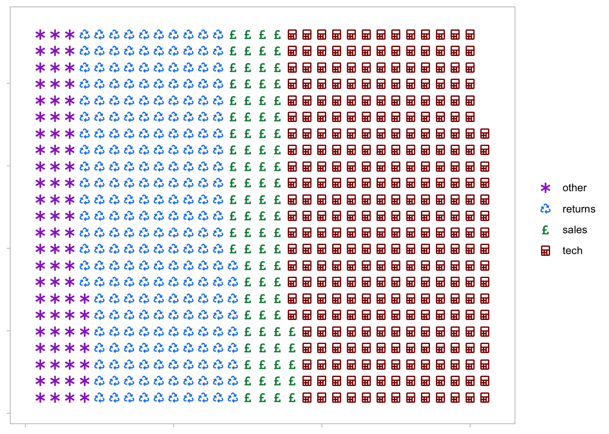
<p class="caption">(\#fig:unnamed-chunk-14)Waffle plot with pictograms.</p>
</div>

### Lollipop Plots

Lollipop plots are another sweet alternative to pie charts for representing relative counts. They're just a combination of `geom_linerange()` and `geom_point()`. Use `coord_flip()` to make them horizontal.


```r
survey_data %>% 
  count(issue_category) %>%
  ggplot(aes(x = issue_category)) +
  geom_linerange(mapping = aes(ymin = 0, ymax = n),
                 size = 2) +
  geom_point(mapping = aes(y = n, colour = issue_category),
             shape = 21,
             size = 8,
             stroke = 4,
             fill = "white",
             show.legend = FALSE) +
  geom_text(aes(label = issue_category), 
            y = 1, hjust = 0, size = 6, 
            position = position_nudge(x = 0.2)) +
  scale_x_discrete(labels = NULL) +
  scale_color_colorblind() +
  labs(x = "", y = "") +
  coord_flip(ylim = c(0, 400))
```

<div class="figure" style="text-align: center">

<p class="caption">(\#fig:unnamed-chunk-15)Lollipop plot.</p>
</div>

The example above uses `geom_text()` to put the labels on the plot and removes the default axis labels with `scale_x_discrete(labels = NULL)` (remember the labels are on the x-axis before the coordinates are flipped).

### Treemap

Treemap plots are another way to visualise proportions. Like the waffle plots, you need to count the data by category first. You can use any brewer palette for the fill.


```r
survey_data %>% 
  count(issue_category) %>%
  treemap(
    index="issue_category",
    vSize="n",
    title = "",
    palette = "BuPu",
    inflate.labels = TRUE
  )
```

<div class="figure" style="text-align: center">
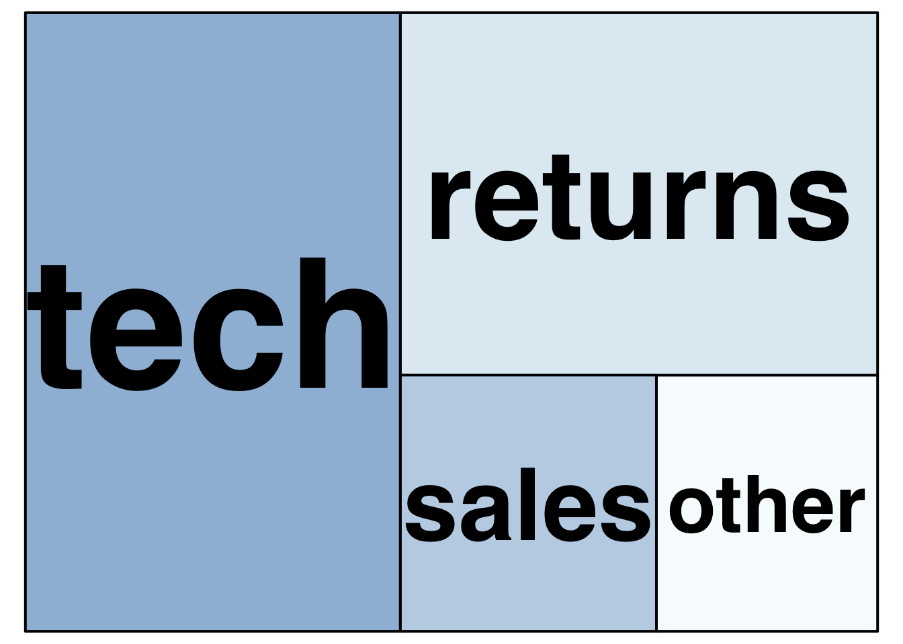
<p class="caption">(\#fig:unnamed-chunk-16)Treemap plot.</p>
</div>


### Word Clouds

Word clouds are an interesting way to summarise qualitative data. First, load some data from Amazon Alexa reviews.


```r
# https://www.kaggle.com/sid321axn/amazon-alexa-reviews
# extracted from Amazon by Manu Siddhartha & Anurag Bhatt
alexa <- rio::import("data/amazon_alexa.csv")
```

Next, make a table of the number of times each individual word appears per rating  The function `tidytext::unnest_tokens()` does this for you by splitting the words in the `input` column into individual words in a new `output` column.

Then get rid of common "stop words" and integers by filtering only words that are not in our `omitted` list.

To get the top 25 words, group by rating and use `dplyr::slice_max()`, ordered by the column `n`. 


```r
omitted <- c(stop_words$word, 0:9)

words <- alexa %>%
  unnest_tokens(output = "word", input = "verified_reviews") %>%
  count(word, rating) %>%
  filter(!word %in% omitted) %>%
  group_by(rating) %>%
  slice_max(order_by = n, n = 25, with_ties = FALSE)
```

Now make two word clouds and paste them together (word clouds don't play well with facets). Filter the `words` table to get one rating, then set up a ggplot with the aesthetics `label`, `colour`, and `size`. The `label` will come from the `word` column, while the `colour` will be different for each `word` and the `size` of the word will be proportional to `n`, the number of times the word appeared.

The visualisation geom is <code><span class='fu'>ggwordcloud</span><span class='fu'>::</span><span class='fu'><a target='_blank' href='https://lepennec.github.io/ggwordcloud/reference/geom_text_wordcloud.html'>geom_text_wordcloud_area</a></span><span class='op'>(</span><span class='op'>)</span></code>. Control how big the cloud is with <code><span class='fu'>ggwordcloud</span><span class='fu'>::</span><span class='fu'>scale_size_area</span><span class='op'>(</span><span class='op'>)</span></code> (this usually takes some trial-and-error). Then add a title and a minimal theme to get rid of the axes and grid lines. 


```r
rating1 <- filter(words, rating == 1) %>%
  ggplot(aes(label = word, colour = word, size = n)) +
  geom_text_wordcloud_area() +
  scale_size_area(max_size = 10) +
  ggtitle("Rating = 1") +
  theme_minimal(base_size = 14)
```

Make another plot for a different rating and paste them together with `+`.


```r
rating5 <- filter(words, rating == 5) %>%
  ggplot(aes(label = word, colour = word, size = n)) +
  geom_text_wordcloud_area() +
  scale_size_area(max_size = 10) +
  ggtitle("Rating = 5") +
  theme_minimal(base_size = 14)

rating1 + rating5
```

<div class="figure" style="text-align: center">
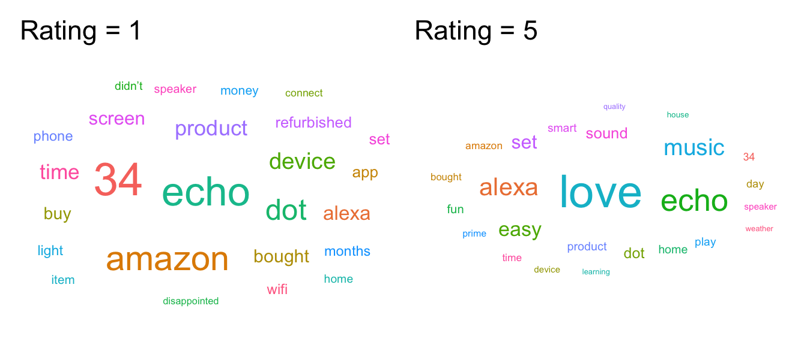
<p class="caption">(\#fig:unnamed-chunk-20)Word cloud.</p>
</div>


### Maps

Working with maps can be tricky. The <code class='package'>sf</code> package provides functions that work with <code class='package'>ggplot2</code>, such as `geom_sf()`. The <code class='package'>rnaturalearth</code> package (and associated data packages that you may be prompted to download) provide high-quality mapping coordinates.


```r
# get the world map coordinates
world_sf <- ne_countries(returnclass = "sf", scale = "medium")

# plot them on a light blue background
ggplot() + 
  geom_sf(data = world_sf, size = 0.2) +
  theme(panel.background = element_rect(fill = "lightskyblue2"))
```

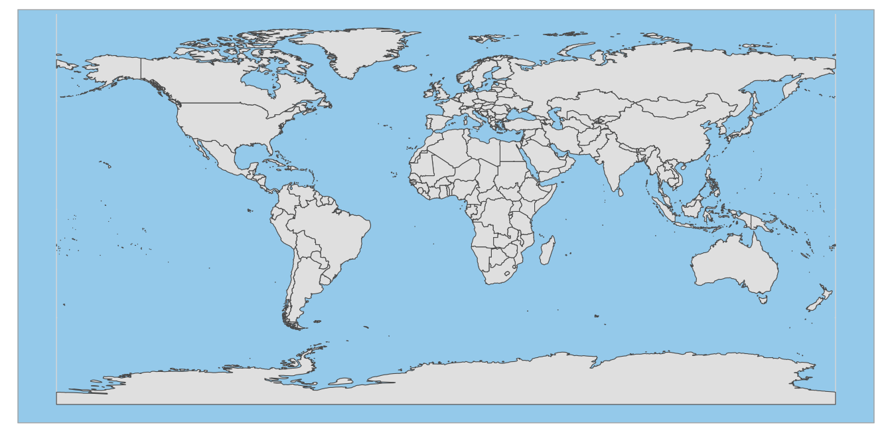

You can combine multiple countries using `bind_rows()` and visualise them with different colours for each country.


```r
# get and bind country data
uk_sf <- ne_states(country = "united kingdom", returnclass = "sf")
ireland_sf <- ne_states(country = "ireland", returnclass = "sf")
islands <- bind_rows(uk_sf, ireland_sf) %>%
  filter(!is.na(geonunit))

# set colours
country_colours <- c("Scotland" = "#0962BA",
                     "Wales" = "#00AC48",
                     "England" = "#FF0000",
                     "Northern Ireland" = "#FFCD2C",
                     "Ireland" = "#F77613")

ggplot() + 
  geom_sf(data = islands,
          mapping = aes(fill = geonunit),
          colour = NA,
          alpha = 0.75) +
  coord_sf(crs = sf::st_crs(4326),
           xlim = c(-10.7, 2.1), 
           ylim = c(49.7, 61)) +
  scale_fill_manual(name = "Country", 
                    values = country_colours)
```

<div class="figure" style="text-align: center">

<p class="caption">(\#fig:map-islands)Map coloured by country.</p>
</div>


You can join data to the map table to visualise data on the map using colours or labels.


```r
# load map data
scotland_sf <- ne_states(geounit = "Scotland", 
                         returnclass = "sf")

# load population data from
# https://www.indexmundi.com/facts/united-kingdom/quick-facts/scotland/population
scotpop <- read_csv("data/scottish_population.csv", 
                    show_col_types = FALSE)

# join data and fix typo in the map
scotmap_pop <- scotland_sf %>%
  mutate(name = ifelse(name == "North Ayshire", 
                       yes = "North Ayrshire", 
                       no = name)) %>%
  left_join(scotpop, by = "name") %>%
  select(name, population, geometry)
```

::: {.warning data-latex=""}
There is a typo in the data from <code class='package'>rnaturalearth</code>, so you need to change "North Ayshire" to "North Ayrshire" before you join the population data.
:::

Set the fill to population in `geom_sf()`. Customise the colours with `scale_fill_viridis_c()`, setting the breaks every 100K (1e5 in scientific notation) and making the scale span 0 to 600K. Set the labels to "000 K" through "600 K" to make the legend easier to read. Finally, move the position of the legend into the sea.


```r
# plot
ggplot() + 
  geom_sf(data = scotmap_pop,
          mapping = aes(fill = population),
          color = "white", 
          size = .1) +
  coord_sf(xlim = c(-8, 0), ylim = c(54, 61)) +
  scale_fill_viridis_c(name = "Population",
                       breaks = seq(0, 6e5, 1e5), 
                       limits = c(0, 6e5),
                       labels = paste0(0:6, "00 K")) +
  theme(legend.position = c(0.16, 0.84))
```

<div class="figure" style="text-align: center">

<p class="caption">(\#fig:map-scotland)Map coloured by population.</p>
</div>


## Further Resources {#resources-custom}

There are so many more options for data visualisation in R than we have time to cover here. The following resources will get you started on your journey to informative, intuitive visualisations.

* [The R Graph Gallery](http://www.r-graph-gallery.com/) (this is really useful)
* [Look at Data](http://socviz.co/look-at-data.html) from [Data Vizualization for Social Science](http://socviz.co/)
* [Graphs](http://www.cookbook-r.com/Graphs) in *Cookbook for R*
* [Top 50 ggplot2 Visualizations](http://r-statistics.co/Top50-Ggplot2-Visualizations-MasterList-R-Code.html)
* [R Graphics Cookbook](http://www.cookbook-r.com/Graphs/) by Winston Chang
* [ggplot extensions](https://www.ggplot2-exts.org/)
* [plotly](https://plot.ly/ggplot2/) for creating interactive graphs
* [Drawing Beautiful Maps Programmatically](https://r-spatial.org/r/2018/10/25/ggplot2-sf.html)

<!--chapter:end:09-custom.Rmd-->

# Advanced Reports  {#present}

<div class="incomplete-chapter"></div>

## Intended Learning Outcomes {#ilo-present}

* Structure data in report, presentation, and dashboard formats
* Include linked figures, tables, and references


```r
library(tidyverse)     # data wrangling functions
library(bookdown)      # for chaptered reports
library(flexdashboard) # for dashboards
library(DT)            # for interactive tables
```

Until now, we've only used the default `html_document` output format in an <a class='glossary' target='_blank' title='The R-specific version of markdown: a way to specify formatting, such as headers, paragraphs, lists, bolding, and links, as well as code blocks and inline code.' href='https://psyteachr.github.io/glossary/r#r-markdown'>R markdown</a> report, but there are several other [output formats](https://rmarkdown.rstudio.com/formats.html){target="_blank"} that you can try.

## Reports

### Word documents

In the <a class='glossary' target='_blank' title='A structured format for information' href='https://psyteachr.github.io/glossary/y#yaml'>YAML</a> header of an R Markdown document, you can change output to `word_document` to create a Microsoft Word file. Make sure you carefully check your file; images and tables can often look odd or page breaks can happen in strange ways.

You can add page breaks by adding `\newpage` on a line by itself with blank lines above and below.

### PDF documents

If you have a latex installation (see Appendix\ \@ref(installing-r)), you can create a PDF by setting output to `pdf_document`. 

Note that this can sometimes cause problems with <code class='package'>kableExtra</code> tables and you can't use some elements like interactive plots. Additionally, the figures and tables are likely to shift from their position in text to the top or bottom of pages. 

See the [PDF section](https://bookdown.org/yihui/rmarkdown/pdf-document.html){target="_blank"} of *R Markdown: The Definitive Guide* [@rmarkdown_definitive] for more advanced customisation options.

### Linked documents

If you need to create longer reports with links between sections, you can use one of the bookdown formats. `bookdown::html_document2` is a useful one that adds figure and table numbers automatically to any figures or tables with a caption and allows you to link to these by reference.

Refer to figures and tables like the code below. Figures start with "fig:" and tables with "tab:", then the code <a class='glossary' target='_blank' title='A section of code in an R Markdown file' href='https://psyteachr.github.io/glossary/c#chunk'>chunk</a> name that created the figure or table.

```
See Table\ \@ref(tab:table-name) or Figure\ \@ref(fig:fig-name).
```

::: {.warning data-latex=""}
The code chunk names can only contain letters, numbers and dashes. If they contain other characters like spaces or underscores, the referencing will not work.
:::

The code below shows how to link text to figures or tables. You can see the [HTML output here](demos/html_document2.html).


<div class='webex-solution'><button>Solution</button>


````md
---
title: "Linked Document Demo"
output: 
  bookdown::html_document2:
    number_sections: false
---

```{r setup, include=FALSE}
knitr::opts_chunk$set(echo = FALSE,
                      message = FALSE,
                      warning = FALSE)
library(tidyverse)
library(kableExtra)
theme_set(theme_minimal())
```

Diamond price depends on many features, such as:

- cut (See Table\ \@ref(tab:by-cut))
- colour (See Table\ \@ref(tab:by-colour))
- clarity (See Figure\ \@ref(fig:by-clarity))
- carats (See Figure\ \@ref(fig:by-carat))

## Tables

### Cut

```{r by-cut}
diamonds %>%
  group_by(cut) %>%
  summarise(avg = mean(price),
            .groups = "drop") %>%
  kable(digits = 0, 
        col.names = c("Cut", "Average Price"),
        caption = "Mean diamond price by cut.") %>%
  kable_material()
```

### Colour

```{r by-colour}
diamonds %>%
  group_by(color) %>%
  summarise(avg = mean(price),
            .groups = "drop") %>%
  kable(digits = 0, 
        col.names = c("Cut", "Average Price"),
        caption = "Mean diamond price by colour.") %>%
  kable_material()
```

## Plots

### Clarity

```{r by-clarity, fig.cap = "Diamond price by clarity"}
ggplot(diamonds, aes(x = clarity, y = price)) +
  geom_boxplot() 
```

### Carats

```{r by-carat, fig.cap = "Diamond price by carat"}
ggplot(diamonds, aes(x = carat, y = price)) +
  stat_smooth()
```

````


</div>


This format defaults to numbered sections, so set `number_sections: false` in the <a class='glossary' target='_blank' title='A structured format for information' href='https://psyteachr.github.io/glossary/y#yaml'>YAML</a> header if you don't want this.

### References

There are several ways to do in-text references and automatically generate a [bibliography](https://bookdown.org/yihui/rmarkdown-cookbook/bibliography.html){target="_blank"} in R Markdown. Markdown files need to link to a BibTex file (a plain text file with references in a specific format) that contains the references you need to cite. You specify the name of this file in the YAML header, like `bibliography: filename.bib` and cite references in text using an at symbol and a shortname, like `[@tidyverse]`.

#### Creating a BibTeX file

Most reference software like EndNote, Zotero or Mendeley have exporting options that can export to BibTeX format. You just need to check the shortnames in the resulting file.

You can also make a BibTeX file and add references manually. In RStudio, go to **`File`** > **`New File...`** > **`Text File`** and save the file as "bibliography.bib".

Next, add the line `bibliography: bibliography.bib` to your YAML header.

#### Adding references

You can add references to a journal article in the following format:

```
@article{shortname,
  author = {Author One and Author Two and Author Three},
  title = {Paper Title},
  journal = {Journal Title},
  volume = {vol},
  number = {issue},
  pages = {startpage--endpage},
  year = {year},
  doi = {doi}
}
```

See [A complete guide to the BibTeX format](https://www.bibtex.com/g/bibtex-format/){target="_blank"} for instructions on citing books, techincal reports, and more.

You can get the reference for an R package using the functions `citation()` and `toBibtex()`. You can paste the bibtex entry into your bibliography.bib file. Make sure to add a short name (e.g., "ggplot2") before the first comma to refer to the reference.


```r
citation(package="ggplot2") %>% toBibtex()
```

```
## @Book{,
##   author = {Hadley Wickham},
##   title = {ggplot2: Elegant Graphics for Data Analysis},
##   publisher = {Springer-Verlag New York},
##   year = {2016},
##   isbn = {978-3-319-24277-4},
##   url = {https://ggplot2.tidyverse.org},
## }
```


[Google Scholar](https://scholar.google.com/) entries have a BibTeX citation option. This is usually the easiest way to get the relevant values, although you have to add the DOI yourself. You can keep the suggested shortname or change it to something that makes more sense to you.

#### Citing references

You can cite references in text like this: 

```
This tutorial uses several R packages [@tidyverse;@rmarkdown].
```

This tutorial uses several R packages [@tidyverse;@rmarkdown].

Put a minus in front of the @ if you just want the year:

```
Franconeri and colleagues [-@franconeri2021science] review research-backed guidelines for creating effective and intuitive visualizations.
```

Franconeri and colleagues [-@franconeri2021science] review research-backed guidelines for creating effective and intuitive visualizations.


If you want to add an item to the reference section without citing it, add it to the YAML header like this:

```
nocite: |
  @ref1, @ref2, @ref3
```

Or add all of the items in the .bib file like this:

```
nocite: '@*'
```

#### Citation styles

You can search a [list of style files](https://www.zotero.org/styles){target="_blank"} (e.g., APA, MLA, Harvard) and download a file that will format your bibliography. You'll need to add the line `csl: filename.csl` to your YAML header. 

#### Reference section

By default, the reference section is added to the end of the document. If you want to change the position (e.g., to add figures and tables after the references), include `<div id="refs"></div>` where you want the references. 

### Interactive tables

One way to make your reports more exciting is to use interactive tables. The `DT::datatable()` function displays a table with some extra interactive elements to allow readers to search and reorder the data, as well as controlling the number of rows shown at once. This can be especially helpful. This only works with HTML output types. The [DT website](https://rstudio.github.io/DT/){target="_blank"} has extensive tutorials, but we'll cover the basics here.


```r
library(DT)

scotpop <- read_csv("data/scottish_population.csv", 
                    show_col_types = FALSE)

datatable(data = scotpop)
```

```{=html}
<div id="htmlwidget-23a2493a9050d7df5bbc" style="width:100%;height:auto;" class="datatables html-widget"></div>
<script type="application/json" data-for="htmlwidget-23a2493a9050d7df5bbc">{"x":{"filter":"none","vertical":false,"data":[["1","2","3","4","5","6","7","8","9","10","11","12","13","14","15","16","17","18","19","20","21","22","23","24","25","26","27","28","29","30","31","32"],["Aberdeen","Aberdeenshire","Angus","Argyll and Bute","Edinburgh","Clackmannanshire","Dumfries and Galloway","Dundee","East Ayrshire","East Dunbartonshire","East Lothian","East Renfrewshire","Eilean Siar","Falkirk","Fife","Glasgow","Highland","Inverclyde","Midlothian","Moray","North Ayrshire","North Lanarkshire","Orkney","Perthshire and Kinross","Renfrewshire","Scottish Borders","Shetland Islands","South Ayrshire","South Lanarkshire","Stirling","West Dunbartonshire","West Lothian"],[217120,245780,110570,89200,486120,50630,148190,144290,120240,104580,97500,89540,26190,153280,365020,592820,221630,79770,81140,87720,135180,326360,20110,147780,170250,112870,22400,111440,311880,89850,90570,172080]],"container":"<table class=\"display\">\n  <thead>\n    <tr>\n      <th> <\/th>\n      <th>name<\/th>\n      <th>population<\/th>\n    <\/tr>\n  <\/thead>\n<\/table>","options":{"columnDefs":[{"className":"dt-right","targets":2},{"orderable":false,"targets":0}],"order":[],"autoWidth":false,"orderClasses":false}},"evals":[],"jsHooks":[]}</script>
```


You can customise the display, such as changing column names, adding a caption, moving the location of the filter boxes, removing row names, applying [classes](https://datatables.net/manual/styling/classes){target="_blank"} to change table appearance, and applying [advanced options](https://datatables.net/reference/option/){target="_blank"}.


```r
# https://datatables.net/reference/option/
my_options <- list(
  pageLength = 5, # how many rows are displayed
  lengthChange = FALSE, # whether pageLength can change
  info = TRUE, # text with the total number of rows
  paging = TRUE, # if FALSE, the whole table displays
  ordering = FALSE, # whether you can reorder columns
  searching = FALSE # whether you can search the table
)

datatable(
  data = scotpop,
  colnames = c("County", "Population"),
  caption = "The population of Scottish counties.",
  filter = "none", # "none", "bottom" or "top"
  rownames = FALSE, # removes the number at the left
  class = "cell-border hover stripe", # default is "display"
  options = my_options
)
```

```{=html}
<div id="htmlwidget-636df058d1d915fa64f2" style="width:100%;height:auto;" class="datatables html-widget"></div>
<script type="application/json" data-for="htmlwidget-636df058d1d915fa64f2">{"x":{"filter":"none","vertical":false,"caption":"<caption>The population of Scottish counties.<\/caption>","data":[["Aberdeen","Aberdeenshire","Angus","Argyll and Bute","Edinburgh","Clackmannanshire","Dumfries and Galloway","Dundee","East Ayrshire","East Dunbartonshire","East Lothian","East Renfrewshire","Eilean Siar","Falkirk","Fife","Glasgow","Highland","Inverclyde","Midlothian","Moray","North Ayrshire","North Lanarkshire","Orkney","Perthshire and Kinross","Renfrewshire","Scottish Borders","Shetland Islands","South Ayrshire","South Lanarkshire","Stirling","West Dunbartonshire","West Lothian"],[217120,245780,110570,89200,486120,50630,148190,144290,120240,104580,97500,89540,26190,153280,365020,592820,221630,79770,81140,87720,135180,326360,20110,147780,170250,112870,22400,111440,311880,89850,90570,172080]],"container":"<table class=\"cell-border hover stripe\">\n  <thead>\n    <tr>\n      <th>County<\/th>\n      <th>Population<\/th>\n    <\/tr>\n  <\/thead>\n<\/table>","options":{"pageLength":5,"lengthChange":false,"info":true,"paging":true,"ordering":false,"searching":false,"columnDefs":[{"className":"dt-right","targets":1}],"order":[],"autoWidth":false,"orderClasses":false}},"evals":[],"jsHooks":[]}</script>
```


## Other formats

You can create more than just reports with R Markdown. You can also create presentations, interactive dashboards, books, websites, and web applications.

### Presentations

You can choose a presentation template when you create a new R Markdown document. We'll use ioslides for this example, but the other formats work similarly.

<div class="figure" style="text-align: center">

<p class="caption">(\#fig:img-ioslides-template)Ioslides RMarkdown template.</p>
</div>

The main differences between this and the Rmd files you've been working with until now are that the `output` type in the <a class='glossary' target='_blank' title='A structured format for information' href='https://psyteachr.github.io/glossary/y#yaml'>YAML</a> header is `ioslides_presentation` instead of `html_document` and this format requires a specific title structure. Each slide starts with a level-2 header.

The template provides you with examples of text, bullet point, code, and plot slides. You can knit this template to create an <a class='glossary' target='_blank' title='Hyper-Text Markup Language: A system for semantically tagging structure and information on web pages.' href='https://psyteachr.github.io/glossary/h#html'>HTML</a> document with your presentation. It often looks odd in the RStudio built-in browser, so click the button to open it in a web browser. You can use the space bar or arrow keys to advance slides.

The code below shows how to load some packages and display text, a table, and a plot. You can see the [HTML output here](demos/ioslides.html).


<div class='webex-solution'><button>Solution</button>


````md
---
title: "Presentation Demo"
author: "Lisa DeBruine"
output: ioslides_presentation
---

```{r setup, include=FALSE}
knitr::opts_chunk$set(echo = FALSE)
library(tidyverse)
library(kableExtra)
```

## Slide with Markdown

The following slides will present some data from the `diamonds` dataset from **ggplot2**.

Diamond price depends on many features, such as:

- cut
- colour
- clarity
- carats

## Slide with a Table

```{r}
diamonds %>%
  group_by(cut, color) %>%
  summarise(avg_price = mean(price),
            .groups = "drop") %>%
  pivot_wider(names_from = cut, values_from = avg_price) %>%
  kable(digits = 0, caption = "Mean diamond price by cut and colour.") %>%
  kable_material()
```

## Slide with a Plot

```{r pressure}
ggplot(diamonds, aes(x = cut, y = price, color = color)) +
  stat_summary(fun = mean, geom = "point") +
  stat_summary(aes(x = as.integer(cut)), 
               fun = mean, geom = "line") +
  scale_x_discrete(position = "top") +
  scale_color_viridis_d(guide = guide_legend(reverse = TRUE)) +
  theme_minimal() 
```

````


</div>


### Dashboards

Dashboards are a way to display text, tables, and plots with dynamic formatting. After you install <code class='package'>flexdashboard</code>, you can choose a flexdashboard template when you create a new R Markdown document. 

<div class="figure" style="text-align: center">

<p class="caption">(\#fig:img-flx-template)Flexdashboard RMarkdown template.</p>
</div>

The code below shows how to load some packages, display two tables in a tabset, and display two plots in a column. You can see the [HTML output here](demos/flexdashboard.html).


<div class='webex-solution'><button>Solution</button>


````md
---
title: "Flexdashboard Demo"
output: 
  flexdashboard::flex_dashboard:
    social: [ "twitter", "facebook", "linkedin", "pinterest" ]
    source_code: embed
    orientation: columns
    vertical_layout: fill
---

```{r setup, include=FALSE}
library(flexdashboard)
library(tidyverse)
library(kableExtra)
library(DT) # for interactive tables
theme_set(theme_minimal())
```

Column {data-width=350, .tabset}
--------------------------------

### By Cut

This table uses `kableExtra` to render the table with a specific theme.

```{r}
diamonds %>%
  group_by(cut) %>%
  summarise(avg = mean(price),
            .groups = "drop") %>%
  kable(digits = 0, 
        col.names = c("Cut", "Average Price"),
        caption = "Mean diamond price by cut.") %>%
  kable_classic()
```

### By Colour

This table uses `DT::datatable()` to render the table with a searchable interface.

```{r}
diamonds %>%
  group_by(color) %>%
  summarise(avg = mean(price),
            .groups = "drop") %>%
  DT::datatable(colnames = c("Colour", "Average Price"), 
                caption = "Mean diamond price by colour",
                options = list(pageLength = 5),
                rownames = FALSE) %>%
  DT::formatRound(columns=2, digits=0)
```

Column {data-width=350}
-----------------------

### By Clarity

```{r by-clarity, fig.cap = "Diamond price by clarity"}
ggplot(diamonds, aes(x = clarity, y = price)) +
  geom_boxplot() 
```


### By Carats

```{r by-carat, fig.cap = "Diamond price by carat"}
ggplot(diamonds, aes(x = carat, y = price)) +
  stat_smooth()
```

````


</div>


Change the size of your web browser to see how the boxes, tables and figures change.

The best way to figure out how to format a dashboard is trial and error, but you can also look at some [sample layouts](https://pkgs.rstudio.com/flexdashboard/articles/layouts.html){target="_blank"}.

### Books

You can create online books with <code class='package'>bookdown</code>. In fact, the book you're reading was created using bookdown. After you download the package, start a new project and choose "Book project using bookdown" from the list of project templates. 

<div class="figure" style="text-align: center">

<p class="caption">(\#fig:img-bookdown-template)Bookdown project template.</p>
</div>

Each chapter is written in a separate .Rmd file and the general book settings can be changed in the `_bookdown.yml` and `_output.yml` files. 

### Websites

You can create a simple website the same way you create any R Markdown document. Choose "Simple R Markdown Website" from the project templates to get started. See Appendix\ \@ref(webpages) for a step-by-step tutorial.

For more complex, blog-style websites, you can investigate [<code class='package'>blogdown</code>](https://bookdown.org/yihui/blogdown/). After you install this package, you will also be able to crate template blogdown projects to get you started.

### Shiny

To get truly interactive, you can take your R coding to the next level and learn Shiny. Shiny apps let your R code react to user input. You can do things like [make a word cloud](https://shiny.psy.gla.ac.uk/debruine/wordcloud/), [search a google spreadsheet](https://shiny.psy.gla.ac.uk/debruine/seen/), or [conduct a survey](https://shiny.psy.gla.ac.uk/debruine/question/).

This is well outside the scope of this class, but the skills you've learned here provide a good start. The free book [Building Web Apps with R Shiny](https://debruine.github.io/shinyintro/) by one of the authors of this book can get you started creating shiny apps.

## Further resources {#resources-present}

* [RStudio Formats](https://rmarkdown.rstudio.com/formats.html)
* [R Markdown Cookbook](https://bookdown.org/yihui/rmarkdown-cookbook)
* [DT](https://rstudio.github.io/DT/)
* [Flexdashboard](https://pkgs.rstudio.com/flexdashboard/)
* [Bookdown](https://bookdown.org/yihui/bookdown/)
* [Blogdown](https://bookdown.org/yihui/blogdown/)
* [Shiny](https://shiny.rstudio.com/)
* [Building Web Apps with R Shiny](https://debruine.github.io/shinyintro/)


<!--chapter:end:10-present.Rmd-->

# (APPENDIX) Appendices {-} 

<!--chapter:end:appendix-0.Rmd-->

# Installing `R` {#installing-r}

Installing R and RStudio is usually straightforward. The sections below explain how and [there is a helpful YouTube video here](https://www.youtube.com/watch?v=lVKMsaWju8w){target="_blank"}.

## Installing Base R

[Install base R](https://cran.rstudio.com/){target="_blank"}. Choose the download link for your operating system (Linux, Mac OS X, or Windows).

If you have a Mac, install the latest release from the newest `R-x.x.x.pkg` link (or a legacy version if you have an older operating system). You may also need to install [XQuartz](http://xquartz.macosforge.org/){target="_blank"} to be able to use some visualisation packages.

If you are installing the Windows version, choose the "[base](https://cran.rstudio.com/bin/windows/base/)" subdirectory and click on the download link at the top of the page. 

If you are using Linux, choose your specific operating system and follow the installation instructions.

## Installing RStudio

Go to [rstudio.com](https://www.rstudio.com/products/rstudio/download/#download){target="_blank"} and download the RStudio Desktop (Open Source License) version for your operating system under the list titled **Installers for Supported Platforms**.

## Installing RTools

If you are using Windows, after you install R, you should also install [RTools](https://cran.rstudio.com/bin/windows/Rtools/){target="_blank"}; use the "recommended" version highlighted near the top of the list. RTools is used for installing and loading some packages. You can get started without installing RTools, but if you're having problems with installing and loading some packages, this should be the first thing you try.

RTools will require you to put it "on the PATH". The instructions for this can seem a bit vague - the easiest way to do it is to open RStudio, run the below code in the console:


```r
write('PATH="${RTOOLS40_HOME}\\usr\\bin;${PATH}"', file = "~/.Renviron", append = TRUE)
```

Once you've done that, restart R by clicking `Session - Restart R` and then run the below code in the console which should give you the path to your RTools installation:


```r
Sys.which("make")
```

```
##            make 
## "/usr/bin/make"
```


## RStudio Settings {#rstudio-settings}

There are a few settings you should fix immediately after updating RStudio. Go to **`Global Options...`** under the **`Tools`** menu (&#8984;,), and in the General tab, uncheck the box that says **`Restore .RData into workspace at startup`**.  If you keep things around in your workspace, things will get messy, and unexpected things will happen. You should always start with a clear workspace. This also means that you never want to save your workspace when you exit, so set this to **`Never`**. The only thing you want to save are your scripts.

You may also want to change the appearance of your code. Different fonts and themes can sometimes help with visual difficulties or [dyslexia](https://datacarpentry.org/blog/2017/09/coding-and-dyslexia){target="_blank"}. 

<div class="figure" style="text-align: center">

<p class="caption">(\#fig:settings-general)RStudio General and Appearance settings</p>
</div>

You may also want to change the settings in the Code tab. For example, Lisa prefers two spaces instead of tabs for my code and likes to be able to see the <a class='glossary' target='_blank' title='Spaces, tabs and line breaks' href='https://psyteachr.github.io/glossary/w#whitespace'>whitespace</a> characters. But these are all a matter of personal preference.

<div class="figure" style="text-align: center">

<p class="caption">(\#fig:settings-code)RStudio Code settings</p>
</div>


## Installing LaTeX

You can install the LaTeX typesetting system to produce PDF reports from RStudio. Without this additional installation, you will be able to produce reports in HTML but not PDF. To generate PDF reports, you will additionally need to install <code class='package'>tinytex</code> [@R-tinytex] and run the following code:


```r
# run this in the console
install.packages("tinytex")
tinytex::install_tinytex()
```

<!--chapter:end:appendix-a-installing-r.Rmd-->

# Updating R, RStudio, and packages {#appendix-updating-r}

From time-to-time, updated version of R, RStudio, and the packages you use (e.g., ggplot) will become available. Remember that each of these are separate, so they each have a different process and come with different considerations. We recommend updating to the latest version of all three at the start of each academic year.

## Updating RStudio

RStudio is the easiest component to update. Typically, updates to RStudio won't affect your code, instead they add in new features, like spell-check or upgrades to what RStudio can do. There's usually very little downside to updating RStudio and it's easy to do.

Click `Help - Check for updates`

<div class="figure" style="text-align: center">

<p class="caption">(\#fig:img-updaterstudio)Updating RStudio</p>
</div>

If an update is available, it will prompt you to download it and you can install it as usual.

## Updating packages

Package developers will occasionally release updates to their packages. This is typically to add in new functions to the package, or to fix or amend existing functions. **Be aware that some package updates may cause your previous code to stop working**. This does not tend to happen with minor updates to packages, but occasionally with major updates, you can have serious issues if the developer has made fundamental changes to how the code works. For this reason, we recommend updating all your packages once at the beginning of each academic year (or semester) - don't do it before an assessment or deadline just in case!

To update an individual package, the easiest way is to use the `install.packages()` function, as this always installs the most recent version of the package.


```r
install.packages("tidyverse")
```

To update multiple packages, or indeed all packages, RStudio provides helpful tools. Click `Tools - Check for Package Updates`. A dialogue box will appear and you can select the packages you wish to update. Be aware that if you select all packages, this may take some time and you will be unable to use R whilst the process completes.

<div class="figure" style="text-align: center">

<p class="caption">(\#fig:img-updateall)Updating packages with RStudio</p>
</div>

Occasionally, you might have a few problem packages that seemingly refuse to update, for me, `rlang` and `vctrs` cause me no end of trouble. These aren't packages that you will likely every explicitly load, but they're required beneath the surface for R to do things like knit your Markdown files etc.

If you try to update a package and get an error message that says something like `Warning in install.packages : installation of package ‘vctrs’ had non-zero exit status` or perhaps `Error in loadNamespace(i, c(lib.loc, .libPaths()), versionCheck = vI[[i]]) :  namespace 'rlang' 0.4.9 is being loaded, but >= 0.4.10 is required` one solution I have found is to manually uninstall the package, restart R, and then install the package new, rather than trying to update an existing version. The `installr` package also has a useful function for uninstalling packages.


```r
# Load installr
library(installr)

# Uninstall the problem package
uninstall.packages("package_name")

# Then restart R using session - restart R
# Then install the package fresh

install.packages("package")
```

## Updating R

Finally, you may also wish to update R itself. The key thing to be aware of is that when you update R, if you just download the latest version from the website, you will lose all your packages. The easiest way to update R and not cause yourself a huge headache is to use the `installr` package. When you use the `updateR()` function, a series of dialogue boxes will appear. These should be fairly self-explanatory but there is a [full step-by-step guide available](https://www.r-statistics.com/2015/06/a-step-by-step-screenshots-tutorial-for-upgrading-r-on-windows/) for how to use `installr`, the important bit is to select "Yes" when it asked if you would like to copy your packages from the older version of R.


```r
# Install the installr package
install.packages("installr")

# Load installr
library(installr)

# Run the update function
updateR()
```

As always, if you're having issues, please ask on Teams or come to office hours.

<!--chapter:end:appendix-b-updating-r.Rmd-->

# Symbols {#symbols}

| Symbol | psyTeachR Term    | Also Known As     |
|:------:|:------------------|:------------------|
| ()     | (round) brackets  | parentheses       |
| []     | square brackets   | brackets          |
| {}     | curly brackets    | squiggly brackets |
| <>     | chevrons          | angled brackets / guillemets |
| <      | less than         |                   |
| >      | greater than      |                   |
| &      | ampersand         | "and" symbol      |
| #      | hash              | pound / octothorpe|
| /      | slash             | forward slash     |
| \\     | backslash         |                   |
| -      | dash              | hyphen / minus    |
| _      | underscore        |                   |
| *      | asterisk          | star              |
| ^      | caret             | power symbol      |
| ~      | tilde             | twiddle / squiggle|
| =      | equal sign        |                   |
| ==     | double equal sign |                   |
| .      | full stop         | period / point    |
| !      | exclamation mark  | bang / not        |
| ?      | question mark     |                   |
| '      | single quote      | quote / apostrophe|
| "      | double quote      | quote             |
| %>%    | pipe              | magrittr pipe     |
| \|     | vertical bar      | pipe              |
| ,      | comma             |                   |
| ;      | semi-colon        |                   |
| :      | colon             |                   |
| @      | "at" symbol       | [various hilarious regional terms](https://www.theguardian.com/notesandqueries/query/0,5753,-1773,00.html) |
| ...    | `glossary("ellipsis")`| dots     |


<div class="figure" style="text-align: center">

<p class="caption">(\#fig:img-soundimals-hash)[Image by James Chapman/Soundimals](https://soundimals.tumblr.com/post/167354564886/chapmangamo-the-symbol-has-too-many-names)</p>
</div>


<!--chapter:end:appendix-c-symbols.Rmd-->

# Conventions

This book will use the following conventions:

* Generic code: `list(number = 1, letter = "A")`
* Highlighted code: <code><span class='fu'><a target='_blank' href='https://rdrr.io/r/base/list.html'>list</a></span><span class='op'>(</span>number <span class='op'>=</span> <span class='fl'>1</span>, letter <span class='op'>=</span> <span class='st'>"A"</span><span class='op'>)</span></code>
* File paths: <code class='path'>data/sales.csv</code>
* R Packages: <code class='package'>tidyverse</code>
* Functions: <code><span class='fu'><a target='_blank' href='https://rdrr.io/r/base/paste.html'>paste</a></span><span class='op'>(</span><span class='op'>)</span></code>
* Strings: <code><span class='st'>"Lisa"</span></code>, <code><span class='st'>"Emily"</span></code>
* Numbers: <code><span class='fl'>100</span></code>, <code><span class='fl'>3.14</span></code>
* Logical values: <code><span class='cn'>TRUE</span></code>, <code><span class='cn'>FALSE</span></code>
* Glossary items: <a class='glossary' target='_blank' title='Discrete variables that have an inherent order, such as number of legs' href='https://psyteachr.github.io/glossary/o#ordinal'>ordinal</a>
* Citations: @R-tidyverse
* Internal links: Chapter\ \@ref(viz)
* External links: [Mastering Shiny](https://mastering-shiny.org/){target="_blank"}
* Menu/interface options: **`New File...`**
* Quiz question: I am going to learn a lot: <select class='webex-select'><option value='blank'></option><option value='answer'>TRUE</option><option value=''>FALSE</option></select>

* What is a p-value? <div class='webex-radiogroup' id='radio_CKSZSEKMNO'><label><input type="radio" autocomplete="off" name="radio_CKSZSEKMNO" value=""></input> <span>the probability that the null hypothesis is true</span></label><label><input type="radio" autocomplete="off" name="radio_CKSZSEKMNO" value="answer"></input> <span>the probability of the observed, or more extreme, data, under the assumption that the null-hypothesis is true</span></label><label><input type="radio" autocomplete="off" name="radio_CKSZSEKMNO" value=""></input> <span>the probability of making an error in your conclusion</span></label></div>


<div class='webex-solution'><button>Hidden Solutions</button>
You found it!
</div>

::: {.info data-latex=""}
Informational asides.
:::

::: {.warning data-latex=""}
Notes to warn you about something.
:::

::: {.dangerous data-latex=""}
Notes about things that could cause serious errors.
:::

::: {.try data-latex=""}
Try it yourself.
:::


```r
# code chunks
paste("Code", "Output", 1, sep = " ")
```

```
## [1] "Code Output 1"
```

<div class='verbatim'><pre class='sourceCode r'><code class='sourceCode R'>&#96;&#96;&#96;{r, fig.width = 2, fig.height = 2}</code></pre>

```r
# code chunks with headers
hist(rnorm(100000))
```

<pre class='sourceCode r'><code class='sourceCode R'>&#96;&#96;&#96;</code></pre></div>


```md
## Markdown Example

* Inline code: `r nrow(iris)`
* *Italics*
* **Bold**
```


<!--chapter:end:appendix-d-conventions.Rmd-->

# Using Teams {#teams}

## What is the best way to share R code on Microsoft Teams?

You have run into a problem and need to get help on MS Teams. What is the right way to share your code?

Please do *not* share a screenshot unless you are asked, or if it is not the code that is giving you problems, but something weird is happening with the RStudio IDE.

If it's your code that is not working, it is almost always better to copy and paste the code, because then people who are trying to help you can copy and paste the code *exactly* to try it out, rather than having to re-type everything from the image. Let's look at an example. Below is a screenshot of how the RStudio IDE might look when your code throws an error. Here the code block labelled `cars` is causing the error.


The particular error that our code threw was

    Error in mtcars %>% filter(mpg > 20) : could not find function "%>%"

And the code that threw it was


```r
mtcars %>%
  filter(mpg > 20)
```

Note that you can select and copy the code above if you wanted to run it yourself, but you could not do that if all you had to rely on was the screenshot.

Copying the code and/or error in RStudio is easy; just highlight the code using the mouse and press Ctrl-C.

If you just paste the code into a Teams channel, the formatting is not so nice; you lose the formatting that allows you to read the code easily.


Here are two ways to get your code into Teams, one that is quick and easy but not very flexible, and another that is far more flexible but requires more steps.

### Quick and easy method

First, if it is just a short function call, a single line, or an error, you can signal that text is meant to appear as code by surrounding it by single backticks---i.e., putting a backtick (\`) right before and right after the text that you want to be formatted as code. Teams will automatically format it for you.

For multi-line code, the easiest and fastest way is just to type three backticks inside your message at the beginning of a line. Any subsequent text you enter will be treated as code. To get to the beginning of a line without submitting your post, press Ctrl-Enter while typing your message. Then type the three backticks, and paste your code right into the gray box that automatically appears. Press Enter twice in a row to get back out of the code entry box. So your message might look like this. 

Above, I surrounded the error message `Error in mtcars %>% filter(mpg > 20) : could not find function "%>%"` with single backticks to indicate code, and we typed triple backticks at the start of the line to create a code chunk. (The next method might be easier for making multi-line posts.)

### More flexible method

There is a more flexible (and possibly easier) way. Before pasting any text, click on the icon that looks like the letter "A", highlighted below.

 

This will open up options for text formatting and will allow you to easily create a multi-line post. From those options, select the icon that looks like `</>`, which stands for code. 

 

The code icon will open a window where you can paste your code. In the dropdown menu on the top right, select 'R' as the type of code. This will give you syntax highlighting. 

 

Here is how you might begin your post. 

 

### Reprex

You might see people in coding forums like StackOverflow asking for a "reprex", or a reproducible example. This is the smallest, completely self-contained example of your problem or question. 

For example, you may have a question about how to figure out how to select rows that contain the value "test" in a certain column, but it isn't working. It's clearer if you can provide a concrete example, but you don't want to have to type out the whole table you're using or all the code that got you to this point in your script. 

You can include a very small table with just the basics or a smaller version of your problem. Make comments at each step about what you expect and what you actually got. 

Which version is easier for you to figure out the solution?


```r
# this doesn't work
no_test_data <- data %>%
  filter(!str_detect(type, "test"))
```


```r
# with a minimal example table
data <- tribble(
  ~id, ~type, ~x,
  1, "test", 12,
  2, "testosterone", 15,
  3, "estrogen", 10
)

# this should keep IDs 2 and 3, but removes ID 2
no_test_data <- data %>%
  filter(!str_detect(type, "test"))
```

One of the big benefits to creating a reprex is that you often solve your own problem while you're trying to break it down to explain to someone else.

If you really want to go down the rabbit hole, you can create a reproducible example using the [reprex](https://www.tidyverse.org/help/#reprex) package from tidyverse.

## Screenshots

If you do need to take a screenshot, for example, if something goes wrong during installation, please use the screenshot functions built-in to your computer rather than taking a photo of your screen using your phone.

### Taking a screenshot on Windows

-   Use the Windows search function to search for "Snip & Sketch"

-   Click "New" then "Snip now"

-   Use the tool to select the area on the screen you want to take a screenshot of. This photo will automatically be copied to your clipboard, so you can paste it into e.g., a Teams chat or a document using Ctrl + V but you can also click the Save icon in the top right to save the screenshot as an image file.

-   The shortcut for the snipping tool is Win + Shift + S.

### Taking a screenshot on Mac

-   Press Shift + Command (⌘) + 4 to bring up the Screenshot app.

-   Use the tool to select the area on the screen you want to take a screenshot of.

-   If you see a thumbnail in the corner of your screen, click it to edit the screenshot or drag it into e.g., a Teams chat.

-   This photo will also automatically save to your desktop.

<!--chapter:end:appendix-e-teams.Rmd-->

# Data Types {#data-types}

## Basic data types 

Data can be numbers, words, true/false values or combinations of these. The basic <a class='glossary' target='_blank' title='The kind of data represented by an object.' href='https://psyteachr.github.io/glossary/d#data-type'>data types</a> in R are: <a class='glossary' target='_blank' title='A data type representing a real decimal number or integer.' href='https://psyteachr.github.io/glossary/n#numeric'>numeric</a>, <a class='glossary' target='_blank' title='A data type representing strings of text.' href='https://psyteachr.github.io/glossary/c#character'>character</a>, and <a class='glossary' target='_blank' title='A data type representing TRUE or FALSE values.' href='https://psyteachr.github.io/glossary/l#logical'>logical</a>, as well as the special classes of <a class='glossary' target='_blank' title='A data type where a specific set of values are stored with labels; An explanatory variable manipulated by the experimenter' href='https://psyteachr.github.io/glossary/f#factor'>factor</a> and date/times.

<div class="figure" style="text-align: center">

<p class="caption">(\#fig:excel-format-cells-e)Data types are like the categories when you format cells in Excel.</p>
</div>


### Numeric data

All of the numbers are <a class='glossary' target='_blank' title='A data type representing a real decimal number or integer.' href='https://psyteachr.github.io/glossary/n#numeric'>numeric</a> data types. There are two types of numeric data, <a class='glossary' target='_blank' title='A data type representing whole numbers.' href='https://psyteachr.github.io/glossary/i#integer'>integer</a> and <a class='glossary' target='_blank' title='A data type representing a real decimal number' href='https://psyteachr.github.io/glossary/d#double'>double</a>. Integers are the whole numbers, like -1, 0 and 1. Doubles are numbers that can have fractional amounts. If you just type a plain number such as `10`, it is stored as a double, even if it doesn't have a decimal point. If you want it to be an exact integer, you can use the `L` suffix (10L), but this distinction doesn't make much difference in practice.

If you ever want to know the data type of something, use the `typeof` function.


```r
typeof(10)   # double
typeof(10.0) # double
typeof(10L)  # integer
```

```
## [1] "double"
## [1] "double"
## [1] "integer"
```

If you want to know if something is numeric (a double or an integer), you can use the function `is.numeric()` and it will tell you if it is numeric (`TRUE`) or not (`FALSE`).


```r
is.numeric(10L)
is.numeric(10.0)
is.numeric("Not a number")
```

```
## [1] TRUE
## [1] TRUE
## [1] FALSE
```

### Character data

<a class='glossary' target='_blank' title='A data type representing strings of text.' href='https://psyteachr.github.io/glossary/c#character'>Characters</a> (also called "strings") are any text between quotation marks. 


```r
typeof("This is a character string")
typeof('You can use double or single quotes')
```

```
## [1] "character"
## [1] "character"
```

This can include quotes, but you have to <a class='glossary' target='_blank' title='Include special characters like " inside of a string by prefacing them with a backslash.' href='https://psyteachr.github.io/glossary/e#escape'>escape</a> quotes using a backslash to signal that the quote isn't meant to be the end of the string.


```r
my_string <- "The instructor said, \"R is cool,\" and the class agreed."
cat(my_string) # cat() prints the arguments
```

```
## The instructor said, "R is cool," and the class agreed.
```

### Logical Data

<a class='glossary' target='_blank' title='A data type representing TRUE or FALSE values.' href='https://psyteachr.github.io/glossary/l#logical'>Logical</a> data (also sometimes called "boolean" values) is one of two values: true or false. In R, we always write them in uppercase: <code><span class='cn'>TRUE</span></code> and <code><span class='cn'>FALSE</span></code>.


```r
class(TRUE)
class(FALSE)
```

```
## [1] "logical"
## [1] "logical"
```

When you compare two values with an <a class='glossary' target='_blank' title='A symbol that performs a mathematical operation, such as +, -, *, /' href='https://psyteachr.github.io/glossary/o#operator'>operator</a>, such as checking to see if 10 is greater than 5, the resulting value is logical.


```r
is.logical(10 > 5)
```

```
## [1] TRUE
```

::: {.info data-latex=""}
You might also see logical values abbreviated as `T` and `F`, or `0` and `1`. This can cause some problems down the road, so we will always spell out the whole thing.
:::

### Factors

A <a class='glossary' target='_blank' title='A data type where a specific set of values are stored with labels; An explanatory variable manipulated by the experimenter' href='https://psyteachr.github.io/glossary/f#factor'>factor</a> is a specific type of integer that lets you specify the categories and their order. This is useful in data tables to make plots display with categories in the correct order.


```r
myfactor <- factor("B", levels = c("A", "B","C"))
myfactor
```

```
## [1] B
## Levels: A B C
```

Factors are a type of integer, but you can tell that they are factors by checking their `class()`.


```r
typeof(myfactor)
class(myfactor)
```

```
## [1] "integer"
## [1] "factor"
```

### Dates and Times

Dates and times are represented by doubles with special classes. Although `typeof()` will tell you they are a double, you can tell that they are dates by checking their `class()`. Datetimes can have one or more of a few classes that start with `POSIX`.


```r
date <- as.Date("2022-01-24")
datetime <- ISOdatetime(2022, 1, 24, 10, 35, 00, "GMT")
typeof(date)
typeof(datetime)
class(date)
class(datetime)
```

```
## [1] "double"
## [1] "double"
## [1] "Date"
## [1] "POSIXct" "POSIXt"
```

See Appendix\ \@ref(dates-times) for how to use <code class='package'>lubridate</code> to work with dates and times.


::: {.try data-latex=""}
What data types are these:

* `100` <select class='webex-select'><option value='blank'></option><option value=''>integer</option><option value='answer'>double</option><option value=''>character</option><option value=''>logical</option><option value=''>factor</option></select>
* `100L` <select class='webex-select'><option value='blank'></option><option value='answer'>integer</option><option value=''>double</option><option value=''>character</option><option value=''>logical</option><option value=''>factor</option></select>
* `"100"` <select class='webex-select'><option value='blank'></option><option value=''>integer</option><option value=''>double</option><option value='answer'>character</option><option value=''>logical</option><option value=''>factor</option></select>
* `100.0` <select class='webex-select'><option value='blank'></option><option value=''>integer</option><option value='answer'>double</option><option value=''>character</option><option value=''>logical</option><option value=''>factor</option></select>
* `-100L` <select class='webex-select'><option value='blank'></option><option value='answer'>integer</option><option value=''>double</option><option value=''>character</option><option value=''>logical</option><option value=''>factor</option></select>
* `factor(100)` <select class='webex-select'><option value='blank'></option><option value=''>integer</option><option value=''>double</option><option value=''>character</option><option value=''>logical</option><option value='answer'>factor</option></select>
* `TRUE` <select class='webex-select'><option value='blank'></option><option value=''>integer</option><option value=''>double</option><option value=''>character</option><option value='answer'>logical</option><option value=''>factor</option></select>
* `"TRUE"` <select class='webex-select'><option value='blank'></option><option value=''>integer</option><option value=''>double</option><option value='answer'>character</option><option value=''>logical</option><option value=''>factor</option></select>
* `FALSE` <select class='webex-select'><option value='blank'></option><option value=''>integer</option><option value=''>double</option><option value=''>character</option><option value='answer'>logical</option><option value=''>factor</option></select>
* `1 == 2` <select class='webex-select'><option value='blank'></option><option value=''>integer</option><option value=''>double</option><option value=''>character</option><option value='answer'>logical</option><option value=''>factor</option></select>

:::


## Basic container types {#containers}

Individual data values can be grouped together into containers. The main types of containers we'll work with are vectors, lists, and data tables.

### Vectors {#vectors}

A <a class='glossary' target='_blank' title='A type of data structure that collects values with the same data type, like T/F values, numbers, or strings.' href='https://psyteachr.github.io/glossary/v#vector'>vector</a> in R is a set of items (or 'elements') in a specific order. All of the elements in a vector must be of the same **data type** (numeric, character, logical). You can create a vector by enclosing the elements in the function <code><span class='fu'><a target='_blank' href='https://rdrr.io/r/base/c.html'>c</a></span><span class='op'>(</span><span class='op'>)</span></code>.


```r
## put information into a vector using c(...)
c(1, 2, 3, 4)
c("this", "is", "cool")
1:6 # shortcut to make a vector of all integers x:y
```

```
## [1] 1 2 3 4
## [1] "this" "is"   "cool"
## [1] 1 2 3 4 5 6
```

::: {.try data-latex=""}
What happens when you mix types? What class is the variable `mixed`?

```r
mixed <- c(2, "good", 2L, "b", TRUE)
```


<div class='webex-solution'><button>Solution</button>

```r
typeof(mixed)
```

```
## [1] "character"
```


</div>

:::

::: {.warning data-latex=""}
You can't mix data types in a vector; all elements of the vector must be the same data type. If you mix them, R will <a class='glossary' target='_blank' title='Changing the data type of values in a vector to a single compatible type.' href='https://psyteachr.github.io/glossary/c#coercion'>coerce</a> them so that they are all the same. If you mix doubles and integers, the integers will be changed to doubles. If you mix characters and numeric types, the numbers will be coerced to characters, so <code><span class='fl'>10</span></code> would turn into <code><span class='st'>"10"</span></code>.
:::

#### Selecting values from a vector

If we wanted to pick specific values out of a vector by position, we can use square brackets (an <a class='glossary' target='_blank' title='A symbol used to get values from a container object, such as [, [[, or $' href='https://psyteachr.github.io/glossary/e#extract-operator'>extract operator</a>, or `[]`) after the vector.


```r
values <- c(10, 20, 30, 40, 50)
values[2] # selects the second value
```

```
## [1] 20
```

You can select more than one value from the vector by putting a vector of numbers inside the square brackets. For example, you can select the 18th, 19th, 20th, 21st, 4th, 9th and 15th letter from the built-in vector `LETTERS` (which gives all the uppercase letters in the Latin alphabet).


```r
word <- c(18, 19, 20, 21, 4, 9, 15)
LETTERS[word]
```

```
## [1] "R" "S" "T" "U" "D" "I" "O"
```

::: {.try data-latex=""}

Can you decode the secret message?

```r
secret <- c(14, 5, 22, 5, 18, 7, 15, 14, 14, 1, 7, 9, 22, 5, 25, 15, 21, 21, 16)
```


<div class='webex-solution'><button>Solution</button>

```r
LETTERS[secret]
```

```
##  [1] "N" "E" "V" "E" "R" "G" "O" "N" "N" "A" "G" "I" "V" "E" "Y" "O" "U" "U" "P"
```


</div>
:::

You can also create 'named' vectors, where each element has a name. For example:


```r
vec <- c(first = 77.9, second = -13.2, third = 100.1)
vec
```

```
##  first second  third 
##   77.9  -13.2  100.1
```

We can then access elements by name using a character vector within the square brackets. We can put them in any order we want, and we can repeat elements:


```r
vec[c("third", "second", "second")]
```

```
##  third second second 
##  100.1  -13.2  -13.2
```

::: {.info data-latex=""}
We can get the vector of names using the `names()` function, and we can set or change them using something like `names(vec2) <- c("n1", "n2", "n3")`.
:::

Another way to access elements is by using a logical vector within the square brackets. This will pull out the elements of the vector for which the corresponding element of the logical vector is `TRUE`. If the logical vector doesn't have the same length as the original, it will repeat. You can find out how long a vector is using the `length()` function.


```r
length(LETTERS)
LETTERS[c(TRUE, FALSE)]
```

```
## [1] 26
##  [1] "A" "C" "E" "G" "I" "K" "M" "O" "Q" "S" "U" "W" "Y"
```

#### Repeating Sequences {#rep_seq}

Here are some useful tricks to save typing when creating vectors.

In the command `x:y` the `:` operator would give you the sequence of number starting at `x`, and going to `y` in increments of 1. 


```r
1:10
15.3:20.5
0:-10
```

```
##  [1]  1  2  3  4  5  6  7  8  9 10
## [1] 15.3 16.3 17.3 18.3 19.3 20.3
##  [1]   0  -1  -2  -3  -4  -5  -6  -7  -8  -9 -10
```

What if you want to create a sequence but with something other than integer steps? You can use the <code><span class='fu'><a target='_blank' href='https://rdrr.io/r/base/seq.html'>seq</a></span><span class='op'>(</span><span class='op'>)</span></code> function. Look at the examples below and work out what the arguments do.


```r
seq(from = -1, to = 1, by = 0.2)
seq(0, 100, length.out = 11)
seq(0, 10, along.with = LETTERS)
```

```
##  [1] -1.0 -0.8 -0.6 -0.4 -0.2  0.0  0.2  0.4  0.6  0.8  1.0
##  [1]   0  10  20  30  40  50  60  70  80  90 100
##  [1]  0.0  0.4  0.8  1.2  1.6  2.0  2.4  2.8  3.2  3.6  4.0  4.4  4.8  5.2  5.6
## [16]  6.0  6.4  6.8  7.2  7.6  8.0  8.4  8.8  9.2  9.6 10.0
```

What if you want to repeat a vector many times? You could either type it out (painful) or use the <code><span class='fu'><a target='_blank' href='https://rdrr.io/r/base/rep.html'>rep</a></span><span class='op'>(</span><span class='op'>)</span></code> function, which can repeat vectors in different ways.


```r
rep(0, 10)                      # ten zeroes
rep(c(1L, 3L), times = 7)       # alternating 1 and 3, 7 times
rep(c("A", "B", "C"), each = 2) # A to C, 2 times each
```

```
##  [1] 0 0 0 0 0 0 0 0 0 0
##  [1] 1 3 1 3 1 3 1 3 1 3 1 3 1 3
## [1] "A" "A" "B" "B" "C" "C"
```

The <code><span class='fu'><a target='_blank' href='https://rdrr.io/r/base/rep.html'>rep</a></span><span class='op'>(</span><span class='op'>)</span></code> function is useful to create a vector of logical values (`TRUE`/`FALSE` or `1`/`0`) to select values from another vector.


```r
# Get IDs in the pattern Y Y N N ...
ids <- 1:40
yynn <- rep(c(TRUE, FALSE), each = 2, 
            length.out = length(ids))
ids[yynn]
```

```
##  [1]  1  2  5  6  9 10 13 14 17 18 21 22 25 26 29 30 33 34 37 38
```


### Lists

Recall that vectors can contain data of only one type. What if you want to store a collection of data of different data types? For that purpose you would use a <a class='glossary' target='_blank' title='A container data type that allows items with different data types to be grouped together.' href='https://psyteachr.github.io/glossary/l#list'>list</a>. Define a list using the `list()` function.


```r
data_types <- list(
  double = 10.0,
  integer = 10L,
  character = "10",
  logical = TRUE
)

str(data_types) # str() prints lists in a condensed format
```

```
## List of 4
##  $ double   : num 10
##  $ integer  : int 10
##  $ character: chr "10"
##  $ logical  : logi TRUE
```

You can refer to elements of a list using square brackets like a vector, but you can also use the dollar sign notation (`$`) if the list items have names.


```r
data_types$logical
```

```
## [1] TRUE
```

::: {.try data-latex=""}

Explore the 5 ways shown below to extract a value from a list. What data type is each object? What is the difference between the single and double brackets? Which one is the same as the dollar sign?


```r
bracket1 <- data_types[1]
bracket2 <- data_types[[1]]
name1    <- data_types["double"]
name2    <- data_types[["double"]]
dollar   <- data_types$double
```

:::

The single brackets (`bracket1` and `name1`) return a list with the subset of items inside the brackets. In this case, that's just one item, but can be more (try `data_types[1:2]`). The items keep their names if they have them, so the returned value is <code><span class='fu'><a target='_blank' href='https://rdrr.io/r/base/list.html'>list</a></span><span class='op'>(</span>double <span class='op'>=</span> <span class='fl'>10</span><span class='op'>)</span></code>.

The double brackets (`bracket2` and `name2` return a single item as a vector. You can't select more than one item; `data_types[[1:2]]` will give you a "subscript out of bounds" error. 

The dollar-sign notation is the same as double-brackets. If the name has spaces or any characters other than letters, numbers, underscores, and full stops, you need to surround the name with backticks (e.g., `` sales$`Customer ID` ``).


### Tables {#tables-data}

<a class='glossary' target='_blank' title='Data in a rectangular table format, where each row has an entry for each column.' href='https://psyteachr.github.io/glossary/t#tabular-data'>Tabular data</a> structures allow for a collection of data of different types (characters, integers, logical, etc.) but subject to the constraint that each "column" of the table (element of the list) must have the same number of elements. The base R version of a table is called a `data.frame`, while the 'tidyverse' version is called a `tibble`.  Tibbles are far easier to work with, so we'll be using those. To learn more about differences between these two data structures, see `vignette("tibble")`.


```r
# construct a table by column with tibble
avatar <- tibble(
  name = c("Katara", "Toph", "Sokka"),
  bends = c("water", "earth", NA),
  friendly = TRUE
)

# or by row with tribble
avatar <- tribble(
  ~name,    ~bends,  ~friendly,
  "Katara", "water", TRUE,
  "Toph",   "earth", TRUE,
  "Sokka",  NA,      TRUE
)
```


```r
# export the data to a file
rio::export(avatar, "data/avatar.csv")

# or by importing data from a file
avatar <- rio::import("data/avatar.csv")
```

Tabular data becomes especially important for when we talk about <a class='glossary' target='_blank' title='A format for data that maps the meaning onto the structure.' href='https://psyteachr.github.io/glossary/t#tidy-data'>tidy data</a> in Chapter\ \@ref(tidy), which consists of a set of simple principles for structuring data.

#### Table info

We can get information about the table using the following functions.

* `ncol()`: number of columns
* `nrow()`: number of rows
* `dim()`: the number of rows and number of columns 
* `name()`: the column names
* `glimpse()`: the column types


```r
nrow(avatar)
ncol(avatar)
dim(avatar)
names(avatar)
glimpse(avatar)
```

```
## [1] 3
## [1] 3
## [1] 3 3
## [1] "name"     "bends"    "friendly"
## Rows: 3
## Columns: 3
## $ name     <chr> "Katara", "Toph", "Sokka"
## $ bends    <chr> "water", "earth", NA
## $ friendly <lgl> TRUE, TRUE, TRUE
```

#### Accessing rows and columns {#row-col-access}

There are various ways of accessing specific columns or rows from a table. You'll be learning more about this in Chapters\ \@ref(tidy) and \@ref(wrangle). 


```r
siblings   <- avatar %>% slice(1, 3) # rows (by number)
bends      <- avatar %>% pull(2) # column vector (by number)
friendly   <- avatar %>% pull(friendly) # column vector (by name)
bends_name <- avatar %>% select(bends, name) # subset table (by name)
toph       <- avatar %>% pull(name) %>% pluck(2) # single cell
```

The code below uses <a class='glossary' target='_blank' title='The set of R functions that come with a basic installation of R, before you add external packages' href='https://psyteachr.github.io/glossary/b#base-r'>base R</a> to produce the same subsets as the functions above. This format is useful to know about, since you might see them in other people's scripts.


```r
# base R access

siblings   <- avatar[c(1, 3), ] # rows (by number)
bends      <- avatar[, 2] # column vector (by number)
friendly   <- avatar$friendly  # column vector (by name)
bends_name <- avatar[, c("bends", "name")] # subset table (by name)
toph       <- avatar[[2, 1]] # single cell (row, col)
```

## Glossary {#glossary-datatypes}

<table>
 <thead>
  <tr>
   <th style="text-align:left;"> term </th>
   <th style="text-align:left;"> definition </th>
  </tr>
 </thead>
<tbody>
  <tr>
   <td style="text-align:left;"> [base r](https://psyteachr.github.io/glossary/b.html#base-r){class="glossary" target="_blank"} </td>
   <td style="text-align:left;"> The set of R functions that come with a basic installation of R, before you add external packages </td>
  </tr>
  <tr>
   <td style="text-align:left;"> [character](https://psyteachr.github.io/glossary/c.html#character){class="glossary" target="_blank"} </td>
   <td style="text-align:left;"> A data type representing strings of text. </td>
  </tr>
  <tr>
   <td style="text-align:left;"> [coercion](https://psyteachr.github.io/glossary/c.html#coercion){class="glossary" target="_blank"} </td>
   <td style="text-align:left;"> Changing the data type of values in a vector to a single compatible type. </td>
  </tr>
  <tr>
   <td style="text-align:left;"> [data type](https://psyteachr.github.io/glossary/d.html#data-type){class="glossary" target="_blank"} </td>
   <td style="text-align:left;"> The kind of data represented by an object. </td>
  </tr>
  <tr>
   <td style="text-align:left;"> [double](https://psyteachr.github.io/glossary/d.html#double){class="glossary" target="_blank"} </td>
   <td style="text-align:left;"> A data type representing a real decimal number </td>
  </tr>
  <tr>
   <td style="text-align:left;"> [escape](https://psyteachr.github.io/glossary/e.html#escape){class="glossary" target="_blank"} </td>
   <td style="text-align:left;"> Include special characters like " inside of a string by prefacing them with a backslash. </td>
  </tr>
  <tr>
   <td style="text-align:left;"> [extract operator](https://psyteachr.github.io/glossary/e.html#extract-operator){class="glossary" target="_blank"} </td>
   <td style="text-align:left;"> A symbol used to get values from a container object, such as [, [[, or $ </td>
  </tr>
  <tr>
   <td style="text-align:left;"> [factor](https://psyteachr.github.io/glossary/f.html#factor){class="glossary" target="_blank"} </td>
   <td style="text-align:left;"> A data type where a specific set of values are stored with labels; An explanatory variable manipulated by the experimenter </td>
  </tr>
  <tr>
   <td style="text-align:left;"> [integer](https://psyteachr.github.io/glossary/i.html#integer){class="glossary" target="_blank"} </td>
   <td style="text-align:left;"> A data type representing whole numbers. </td>
  </tr>
  <tr>
   <td style="text-align:left;"> [list](https://psyteachr.github.io/glossary/l.html#list){class="glossary" target="_blank"} </td>
   <td style="text-align:left;"> A container data type that allows items with different data types to be grouped together. </td>
  </tr>
  <tr>
   <td style="text-align:left;"> [logical](https://psyteachr.github.io/glossary/l.html#logical){class="glossary" target="_blank"} </td>
   <td style="text-align:left;"> A data type representing TRUE or FALSE values. </td>
  </tr>
  <tr>
   <td style="text-align:left;"> [numeric](https://psyteachr.github.io/glossary/n.html#numeric){class="glossary" target="_blank"} </td>
   <td style="text-align:left;"> A data type representing a real decimal number or integer. </td>
  </tr>
  <tr>
   <td style="text-align:left;"> [operator](https://psyteachr.github.io/glossary/o.html#operator){class="glossary" target="_blank"} </td>
   <td style="text-align:left;"> A symbol that performs a mathematical operation, such as +, -, *, / </td>
  </tr>
  <tr>
   <td style="text-align:left;"> [tabular data](https://psyteachr.github.io/glossary/t.html#tabular-data){class="glossary" target="_blank"} </td>
   <td style="text-align:left;"> Data in a rectangular table format, where each row has an entry for each column. </td>
  </tr>
  <tr>
   <td style="text-align:left;"> [tidy data](https://psyteachr.github.io/glossary/t.html#tidy-data){class="glossary" target="_blank"} </td>
   <td style="text-align:left;"> A format for data that maps the meaning onto the structure. </td>
  </tr>
  <tr>
   <td style="text-align:left;"> [vector](https://psyteachr.github.io/glossary/v.html#vector){class="glossary" target="_blank"} </td>
   <td style="text-align:left;"> A type of data structure that collects values with the same data type, like T/F values, numbers, or strings. </td>
  </tr>
</tbody>
</table>


<!--chapter:end:appendix-f-datatypes.Rmd-->

# Dates and Times {#dates-times}

Working with dates and times can be a little tricky, but the <code class='package'><a href='https://lubridate.tidyverse.org/' target='_blank'>lubridate</a></code> package is there to help. Their website has a helpful [cheatsheet](https://rawgit.com/rstudio/cheatsheets/main/lubridate.pdf) and you can view a tutorial by typing `vignette("lubridate")` in the console pane. The [Dates and Times](https://r4ds.had.co.nz/dates-and-times.html){target="_blank"} in R for Data Science also gives a helpful overview.

This appendix is a quick intro to some of the most useful functions for making reproducible reports.


```r
# packages needed for this appendix
library(tidyverse)
library(lubridate)
```

## Parsing

Dates can be in many formats. The `ymd` functions can deal with almost all of them, regardless of the punctuation used in the format. All of the examples below produce a date in the standard format "2022-01-03".


```r
# year-month-day orders
ymd("22 Jan 3")
ymd("2022 January 3rd")

# month-day-year orders
mdy("January 3, 2022")
mdy("Jan/03/22")

# day-month-year orders
dmy("3JAN22")
dmy("3rd of January in the year 2022")
```

::: {.try data-latex=""}
See if you can make a date format that one of the parsers *can't* handle.
:::

There are similar functions for date/times, too.


```r
ymd_hms("2022 Jan 3, 6:05 and 20s pm")
mdy_h("January 3rd, 2022 at 6pm")
```

```
## [1] "2022-01-03 18:05:20 UTC"
## [1] "2022-01-03 18:00:00 UTC"
```

The date/time functions can also take a timezone argument. If you don't specify it, it defaults to "UTC".


```r
ymd_hm("2022-01-03 18:05", tz = "GMT")
```

```
## [1] "2022-01-03 18:05:00 GMT"
```


## Get Parts

You frequently need to extract parts of a date/time for plotting. The following functions extract specific parts of a date or datetime object. This is a godsend for those of us who never have a clue what week of the year it is today.


```r
# get the date and time when this function is run
now <- now(tzone = "GMT")

# get separate parts
time_parts <- list(
  second  = second(now),
  minute  = minute(now),
  hour    = hour(now),
  day     = day(now),  # day of the month (same as mday())
  wday    = wday(now), # day of the week
  yday    = yday(now), # day of the year
  week    = week(now),
  isoweek = isoweek(now), # ISO 8501 week calendar (Monday start)
  epiweek = epiweek(now), # CDC epidemiological week (Sunday Start)
  month   = month(now),
  year    = year(now),
  tz      = tz(now)
)

str(time_parts)
```

```
## List of 12
##  $ second : num 24.7
##  $ minute : int 33
##  $ hour   : int 19
##  $ day    : int 5
##  $ wday   : num 7
##  $ yday   : num 36
##  $ week   : num 6
##  $ isoweek: num 5
##  $ epiweek: num 5
##  $ month  : num 2
##  $ year   : num 2022
##  $ tz     : chr "GMT"
```


The `month()` and `wday()` functions can return factor labels.


```r
jan1 <- ymd(20220101)
wday(jan1, label = TRUE)
wday(jan1, label = TRUE, abbr = TRUE)
month(jan1, label = TRUE)
month(jan1, label = TRUE, abbr = TRUE)
```

```
## [1] Sat
## Levels: Sun < Mon < Tue < Wed < Thu < Fri < Sat
## [1] Sat
## Levels: Sun < Mon < Tue < Wed < Thu < Fri < Sat
## [1] Jan
## 12 Levels: Jan < Feb < Mar < Apr < May < Jun < Jul < Aug < Sep < ... < Dec
## [1] Jan
## 12 Levels: Jan < Feb < Mar < Apr < May < Jun < Jul < Aug < Sep < ... < Dec
```

::: {.try data-latex=""}
What day of the week were you born?


<div class='webex-solution'><button>Solution</button>

```r
birthdate <- ymd(19761118) # put your own birthdate here
wday(birthdate, label = TRUE)
```

```
## [1] Thu
## Levels: Sun < Mon < Tue < Wed < Thu < Fri < Sat
```


</div>
:::


## Date Arithmetic

You can add and subtract dates. For example, you can get the dates two weeks from today by adding `weeks(2)` to `today()`. You can probably guess how to add and subtract seconds, minutes, days, months, and years.


```r
today() + weeks(1)
```

```
## [1] "2022-02-12"
```

::: {.try data-latex=""}
What day of the week will your 100th birthday be? 


<div class='webex-solution'><button>Solution</button>

```r
birthdate <- ymd(19761118) # put your own birthdate here
centennial <- birthdate + years(100)
wday(centennial, label = TRUE, abbr = FALSE)
```

```
## [1] Wednesday
## 7 Levels: Sunday < Monday < Tuesday < Wednesday < Thursday < ... < Saturday
```


</div>
:::

::: {.warning data-latex=""}
What do you think will happen if you subtract one month from March 31st? You get NA, since February doesn't have a 31st day.


```r
ymd(20220331) - months(1)
```

```
## [1] NA
```

Use the special date operators `%m+%` and `%m-%` to add and subtract months without risking an impossible date.


```r
ymd(20220331) %m-% months(1)
```

```
## [1] "2022-02-28"
```
:::

### First and last of month

For things like billing, you might need to find the first or last days of the current, previous, or next month. The `rollback()` and `rollforward()` functions are easier than trying to parse dates.


```r
d <- ymd("2022-01-24")
rollback(d)                          # last day of the previous month
rollforward(d)                       # last day of the current month
rollback(d, roll_to_first = TRUE)    # first day of the current month
rollforward(d, roll_to_first = TRUE) # first day of the next month
```

```
## [1] "2021-12-31"
## [1] "2022-01-31"
## [1] "2022-01-01"
## [1] "2022-02-01"
```


### Rounding

You can round dates and times to the nearest unit. This can be useful when you have, for example, time measured to the nearest second, but want to group data by the nearest hour, rather than extract the hour component. 


```r
ymd_hm("2022-01-24 10:25") %>% round_date(unit = "hour")
ymd_hm("2022-01-24 10:30") %>% round_date(unit = "hour")
ymd_hm("2022-01-24 10:35") %>% round_date(unit = "hour")
```

```
## [1] "2022-01-24 10:00:00 UTC"
## [1] "2022-01-24 11:00:00 UTC"
## [1] "2022-01-24 11:00:00 UTC"
```

## Internationalisation

You may need to work with dates from a different locale than your computer's defaults, such as dates written in French or Russian. Or your computer may have a non-English locale. Set the `locale` argument to the relevant language code.


```r
ymd("2022 January 24", locale = "en_GB")
ymd("2022 Janvier 24", locale = "fr_FR")
wday("2022-01-03", label = TRUE, locale = "ru_RU")
```

```
## [1] "2022-01-24"
## [1] "2022-01-24"
## [1] пн
## Levels: вс < пн < вт < ср < чт < пт < сб
```


```r
# check which locales are available on your computer
# doesn't work for Windows
system("locale -a")
```

## Example

Let's work through some examples with tweets from Appendix\ \@ref(twitter-data). Download the [class data](data/data.zip).


```r
# read all metrics files in data/tweets/
tweets <- list.files(
  path = "data/tweets", 
  pattern = "^tweet_activity_metrics",
  full.names = TRUE
) %>%
  map_df(read_csv) %>%
  select(!starts_with("promoted"))
```

The `time` column is already in date/time (POSIXct) format, but what if we wanted to plot tweets by hour for each day of the week? 


```r
tweets %>%
  mutate(weekday = wday(time, label = TRUE),
         hour = hour(time)) %>%
  ggplot(aes(x = hour, fill = weekday)) +
  geom_bar(size = 1, alpha = 0.5, show.legend = FALSE) +
  facet_grid(~weekday) +
  scale_fill_manual(values = rainbow(7)) +
  scale_x_continuous(breaks = seq(0, 24, 4))
```


A nice side-effect of using the lubridate function to get days of the week or months of the year is that the results are an ordered factor, so display correctly in a plot. Let's display the months in Greek (if that's available on your system).


```r
tweets %>%
  mutate(month = month(time, label = TRUE, abbr = FALSE, locale = "el_GR.UTF-8")) %>%
  ggplot(aes(x = month, fill = month)) +
  geom_bar(show.legend = FALSE) +
  scale_x_discrete(name = NULL, guide = guide_axis(n.dodge=2))
```


<!--chapter:end:appendix-g-dates.Rmd-->

# Styling Plots {#plotstyle}


## Aesthetics

### Colour/Fill

The `colour` argument changes the point and line colour, while the `fill` argument changes the interior colour of shapes. Type `colours()` into the console to see a list of all the named colours in R. Alternatively, you can use hexadecimal colours like `"#FF8000"` or the `rgb()` function to set red, green, and blue values on a scale from 0 to 1.

Hover over a colour to see its R name.

<style>
  .colordemo { list-item-style: none; padding: 0; margin: 0;}
  
  .colordemo li, main ul.colordemo > li:first-child { 
    display: inline-block; 
    border: 0.25px solid black; 
    margin: 0px; 
    padding: 1.3em 0.2em 0.2em 1.2em; 
  }
  
  .colordemo li span { 
    display: none; 
    background-color: white; 
    border: 0.25px solid black; 
    padding: 0.25em 0.5em; 
    border-radius: 0 1em 1em 1em;
  }
  .colordemo li:hover span { 
    display: inline; 
    position: absolute;
  }
</style>


<ul class='colordemo'>
    <li style='background-color: #000000;'><span>black</span></li>
    <li style='background-color: #030303;'><span>gray1</span></li>
    <li style='background-color: #050505;'><span>gray2</span></li>
    <li style='background-color: #080808;'><span>gray3</span></li>
    <li style='background-color: #0a0a0a;'><span>gray4</span></li>
    <li style='background-color: #0d0d0d;'><span>gray5</span></li>
    <li style='background-color: #0f0f0f;'><span>gray6</span></li>
    <li style='background-color: #121212;'><span>gray7</span></li>
    <li style='background-color: #141414;'><span>gray8</span></li>
    <li style='background-color: #171717;'><span>gray9</span></li>
    <li style='background-color: #1a1a1a;'><span>gray10</span></li>
    <li style='background-color: #1c1c1c;'><span>gray11</span></li>
    <li style='background-color: #1f1f1f;'><span>gray12</span></li>
    <li style='background-color: #212121;'><span>gray13</span></li>
    <li style='background-color: #242424;'><span>gray14</span></li>
    <li style='background-color: #262626;'><span>gray15</span></li>
    <li style='background-color: #292929;'><span>gray16</span></li>
    <li style='background-color: #2b2b2b;'><span>gray17</span></li>
    <li style='background-color: #2e2e2e;'><span>gray18</span></li>
    <li style='background-color: #303030;'><span>gray19</span></li>
    <li style='background-color: #333333;'><span>gray20</span></li>
    <li style='background-color: #363636;'><span>gray21</span></li>
    <li style='background-color: #383838;'><span>gray22</span></li>
    <li style='background-color: #3b3b3b;'><span>gray23</span></li>
    <li style='background-color: #3d3d3d;'><span>gray24</span></li>
    <li style='background-color: #404040;'><span>gray25</span></li>
    <li style='background-color: #424242;'><span>gray26</span></li>
    <li style='background-color: #454545;'><span>gray27</span></li>
    <li style='background-color: #474747;'><span>gray28</span></li>
    <li style='background-color: #4a4a4a;'><span>gray29</span></li>
    <li style='background-color: #4d4d4d;'><span>gray30</span></li>
    <li style='background-color: #4f4f4f;'><span>gray31</span></li>
    <li style='background-color: #525252;'><span>gray32</span></li>
    <li style='background-color: #545454;'><span>gray33</span></li>
    <li style='background-color: #575757;'><span>gray34</span></li>
    <li style='background-color: #595959;'><span>gray35</span></li>
    <li style='background-color: #5c5c5c;'><span>gray36</span></li>
    <li style='background-color: #5e5e5e;'><span>gray37</span></li>
    <li style='background-color: #616161;'><span>gray38</span></li>
    <li style='background-color: #636363;'><span>gray39</span></li>
    <li style='background-color: #666666;'><span>gray40</span></li>
    <li style='background-color: #696969;'><span>dimgray</span></li>
    <li style='background-color: #6b6b6b;'><span>gray42</span></li>
    <li style='background-color: #6e6e6e;'><span>gray43</span></li>
    <li style='background-color: #707070;'><span>gray44</span></li>
    <li style='background-color: #737373;'><span>gray45</span></li>
    <li style='background-color: #757575;'><span>gray46</span></li>
    <li style='background-color: #787878;'><span>gray47</span></li>
    <li style='background-color: #7a7a7a;'><span>gray48</span></li>
    <li style='background-color: #7d7d7d;'><span>gray49</span></li>
    <li style='background-color: #7f7f7f;'><span>gray50</span></li>
    <li style='background-color: #828282;'><span>gray51</span></li>
    <li style='background-color: #858585;'><span>gray52</span></li>
    <li style='background-color: #878787;'><span>gray53</span></li>
    <li style='background-color: #8a8a8a;'><span>gray54</span></li>
    <li style='background-color: #8c8c8c;'><span>gray55</span></li>
    <li style='background-color: #8f8f8f;'><span>gray56</span></li>
    <li style='background-color: #919191;'><span>gray57</span></li>
    <li style='background-color: #949494;'><span>gray58</span></li>
    <li style='background-color: #969696;'><span>gray59</span></li>
    <li style='background-color: #999999;'><span>gray60</span></li>
    <li style='background-color: #9c9c9c;'><span>gray61</span></li>
    <li style='background-color: #9e9e9e;'><span>gray62</span></li>
    <li style='background-color: #a1a1a1;'><span>gray63</span></li>
    <li style='background-color: #a3a3a3;'><span>gray64</span></li>
    <li style='background-color: #a6a6a6;'><span>gray65</span></li>
    <li style='background-color: #a9a9a9;'><span>darkgray</span></li>
    <li style='background-color: #a8a8a8;'><span>gray66</span></li>
    <li style='background-color: #ababab;'><span>gray67</span></li>
    <li style='background-color: #adadad;'><span>gray68</span></li>
    <li style='background-color: #b0b0b0;'><span>gray69</span></li>
    <li style='background-color: #b3b3b3;'><span>gray70</span></li>
    <li style='background-color: #b5b5b5;'><span>gray71</span></li>
    <li style='background-color: #b8b8b8;'><span>gray72</span></li>
    <li style='background-color: #bababa;'><span>gray73</span></li>
    <li style='background-color: #bdbdbd;'><span>gray74</span></li>
    <li style='background-color: #bebebe;'><span>gray</span></li>
    <li style='background-color: #bfbfbf;'><span>gray75</span></li>
    <li style='background-color: #c2c2c2;'><span>gray76</span></li>
    <li style='background-color: #c4c4c4;'><span>gray77</span></li>
    <li style='background-color: #c7c7c7;'><span>gray78</span></li>
    <li style='background-color: #c9c9c9;'><span>gray79</span></li>
    <li style='background-color: #cccccc;'><span>gray80</span></li>
    <li style='background-color: #cfcfcf;'><span>gray81</span></li>
    <li style='background-color: #d1d1d1;'><span>gray82</span></li>
    <li style='background-color: #d4d4d4;'><span>gray83</span></li>
    <li style='background-color: #d3d3d3;'><span>lightgray</span></li>
    <li style='background-color: #d6d6d6;'><span>gray84</span></li>
    <li style='background-color: #d9d9d9;'><span>gray85</span></li>
    <li style='background-color: #dcdcdc;'><span>gainsboro</span></li>
    <li style='background-color: #dbdbdb;'><span>gray86</span></li>
    <li style='background-color: #dedede;'><span>gray87</span></li>
    <li style='background-color: #e0e0e0;'><span>gray88</span></li>
    <li style='background-color: #e3e3e3;'><span>gray89</span></li>
    <li style='background-color: #e5e5e5;'><span>gray90</span></li>
    <li style='background-color: #e8e8e8;'><span>gray91</span></li>
    <li style='background-color: #ebebeb;'><span>gray92</span></li>
    <li style='background-color: #ededed;'><span>gray93</span></li>
    <li style='background-color: #f0f0f0;'><span>gray94</span></li>
    <li style='background-color: #f2f2f2;'><span>gray95</span></li>
    <li style='background-color: #f5f5f5;'><span>gray96</span></li>
    <li style='background-color: #f7f7f7;'><span>gray97</span></li>
    <li style='background-color: #fafafa;'><span>gray98</span></li>
    <li style='background-color: #fcfcfc;'><span>gray99</span></li>
    <li style='background-color: #ffffff;'><span>white</span></li>
    <li style='background-color: #8b8989;'><span>snow4</span></li>
    <li style='background-color: #cdc9c9;'><span>snow3</span></li>
    <li style='background-color: #eee9e9;'><span>snow2</span></li>
    <li style='background-color: #fffafa;'><span>snow</span></li>
    <li style='background-color: #8b6969;'><span>rosybrown4</span></li>
    <li style='background-color: #bc8f8f;'><span>rosybrown</span></li>
    <li style='background-color: #cd9b9b;'><span>rosybrown3</span></li>
    <li style='background-color: #eeb4b4;'><span>rosybrown2</span></li>
    <li style='background-color: #ffc1c1;'><span>rosybrown1</span></li>
    <li style='background-color: #f08080;'><span>lightcoral</span></li>
    <li style='background-color: #cd5c5c;'><span>indianred</span></li>
    <li style='background-color: #8b3a3a;'><span>indianred4</span></li>
    <li style='background-color: #ee6363;'><span>indianred2</span></li>
    <li style='background-color: #ff6a6a;'><span>indianred1</span></li>
    <li style='background-color: #cd5555;'><span>indianred3</span></li>
    <li style='background-color: #8b2323;'><span>brown4</span></li>
    <li style='background-color: #a52a2a;'><span>brown</span></li>
    <li style='background-color: #cd3333;'><span>brown3</span></li>
    <li style='background-color: #ee3b3b;'><span>brown2</span></li>
    <li style='background-color: #ff4040;'><span>brown1</span></li>
    <li style='background-color: #8b1a1a;'><span>firebrick4</span></li>
    <li style='background-color: #b22222;'><span>firebrick</span></li>
    <li style='background-color: #cd2626;'><span>firebrick3</span></li>
    <li style='background-color: #ff3030;'><span>firebrick1</span></li>
    <li style='background-color: #ee2c2c;'><span>firebrick2</span></li>
    <li style='background-color: #8b0000;'><span>darkred</span></li>
    <li style='background-color: #cd0000;'><span>red3</span></li>
    <li style='background-color: #ee0000;'><span>red2</span></li>
    <li style='background-color: #ff0000;'><span>red</span></li>
    <li style='background-color: #cdb7b5;'><span>mistyrose3</span></li>
    <li style='background-color: #8b7d7b;'><span>mistyrose4</span></li>
    <li style='background-color: #eed5d2;'><span>mistyrose2</span></li>
    <li style='background-color: #ffe4e1;'><span>mistyrose</span></li>
    <li style='background-color: #fa8072;'><span>salmon</span></li>
    <li style='background-color: #cd4f39;'><span>tomato3</span></li>
    <li style='background-color: #8b3e2f;'><span>coral4</span></li>
    <li style='background-color: #cd5b45;'><span>coral3</span></li>
    <li style='background-color: #ee6a50;'><span>coral2</span></li>
    <li style='background-color: #ff7256;'><span>coral1</span></li>
    <li style='background-color: #ee5c42;'><span>tomato2</span></li>
    <li style='background-color: #ff6347;'><span>tomato</span></li>
    <li style='background-color: #8b3626;'><span>tomato4</span></li>
    <li style='background-color: #e9967a;'><span>darksalmon</span></li>
    <li style='background-color: #8b4c39;'><span>salmon4</span></li>
    <li style='background-color: #cd7054;'><span>salmon3</span></li>
    <li style='background-color: #ee8262;'><span>salmon2</span></li>
    <li style='background-color: #ff8c69;'><span>salmon1</span></li>
    <li style='background-color: #ff7f50;'><span>coral</span></li>
    <li style='background-color: #8b2500;'><span>orangered4</span></li>
    <li style='background-color: #cd3700;'><span>orangered3</span></li>
    <li style='background-color: #ee4000;'><span>orangered2</span></li>
    <li style='background-color: #cd8162;'><span>lightsalmon3</span></li>
    <li style='background-color: #ee9572;'><span>lightsalmon2</span></li>
    <li style='background-color: #ffa07a;'><span>lightsalmon</span></li>
    <li style='background-color: #8b5742;'><span>lightsalmon4</span></li>
    <li style='background-color: #a0522d;'><span>sienna</span></li>
    <li style='background-color: #cd6839;'><span>sienna3</span></li>
    <li style='background-color: #ee7942;'><span>sienna2</span></li>
    <li style='background-color: #ff8247;'><span>sienna1</span></li>
    <li style='background-color: #8b4726;'><span>sienna4</span></li>
    <li style='background-color: #ff4500;'><span>orangered</span></li>
    <li style='background-color: #8b8682;'><span>seashell4</span></li>
    <li style='background-color: #cdc5bf;'><span>seashell3</span></li>
    <li style='background-color: #eee5de;'><span>seashell2</span></li>
    <li style='background-color: #fff5ee;'><span>seashell</span></li>
    <li style='background-color: #8b4513;'><span>chocolate4</span></li>
    <li style='background-color: #cd661d;'><span>chocolate3</span></li>
    <li style='background-color: #d2691e;'><span>chocolate</span></li>
    <li style='background-color: #ee7621;'><span>chocolate2</span></li>
    <li style='background-color: #ff7f24;'><span>chocolate1</span></li>
    <li style='background-color: #faf0e6;'><span>linen</span></li>
    <li style='background-color: #8b7765;'><span>peachpuff4</span></li>
    <li style='background-color: #cdaf95;'><span>peachpuff3</span></li>
    <li style='background-color: #eecbad;'><span>peachpuff2</span></li>
    <li style='background-color: #ffdab9;'><span>peachpuff</span></li>
    <li style='background-color: #f4a460;'><span>sandybrown</span></li>
    <li style='background-color: #8b5a2b;'><span>tan4</span></li>
    <li style='background-color: #cd853f;'><span>peru</span></li>
    <li style='background-color: #ee9a49;'><span>tan2</span></li>
    <li style='background-color: #ffa54f;'><span>tan1</span></li>
    <li style='background-color: #8b4500;'><span>darkorange4</span></li>
    <li style='background-color: #cd6600;'><span>darkorange3</span></li>
    <li style='background-color: #ee7600;'><span>darkorange2</span></li>
    <li style='background-color: #ff7f00;'><span>darkorange1</span></li>
    <li style='background-color: #cdc0b0;'><span>antiquewhite3</span></li>
    <li style='background-color: #eedfcc;'><span>antiquewhite2</span></li>
    <li style='background-color: #ffefdb;'><span>antiquewhite1</span></li>
    <li style='background-color: #8b7d6b;'><span>bisque4</span></li>
    <li style='background-color: #cdb79e;'><span>bisque3</span></li>
    <li style='background-color: #eed5b7;'><span>bisque2</span></li>
    <li style='background-color: #ffe4c4;'><span>bisque</span></li>
    <li style='background-color: #8b7355;'><span>burlywood4</span></li>
    <li style='background-color: #cdaa7d;'><span>burlywood3</span></li>
    <li style='background-color: #deb887;'><span>burlywood</span></li>
    <li style='background-color: #eec591;'><span>burlywood2</span></li>
    <li style='background-color: #ffd39b;'><span>burlywood1</span></li>
    <li style='background-color: #ff8c00;'><span>darkorange</span></li>
    <li style='background-color: #8b8378;'><span>antiquewhite4</span></li>
    <li style='background-color: #faebd7;'><span>antiquewhite</span></li>
    <li style='background-color: #ffefd5;'><span>papayawhip</span></li>
    <li style='background-color: #ffebcd;'><span>blanchedalmond</span></li>
    <li style='background-color: #8b795e;'><span>navajowhite4</span></li>
    <li style='background-color: #cdb38b;'><span>navajowhite3</span></li>
    <li style='background-color: #eecfa1;'><span>navajowhite2</span></li>
    <li style='background-color: #ffdead;'><span>navajowhite</span></li>
    <li style='background-color: #d2b48c;'><span>tan</span></li>
    <li style='background-color: #fffaf0;'><span>floralwhite</span></li>
    <li style='background-color: #fdf5e6;'><span>oldlace</span></li>
    <li style='background-color: #8b7e66;'><span>wheat4</span></li>
    <li style='background-color: #cdba96;'><span>wheat3</span></li>
    <li style='background-color: #eed8ae;'><span>wheat2</span></li>
    <li style='background-color: #f5deb3;'><span>wheat</span></li>
    <li style='background-color: #ffe7ba;'><span>wheat1</span></li>
    <li style='background-color: #ffe4b5;'><span>moccasin</span></li>
    <li style='background-color: #8b5a00;'><span>orange4</span></li>
    <li style='background-color: #cd8500;'><span>orange3</span></li>
    <li style='background-color: #ee9a00;'><span>orange2</span></li>
    <li style='background-color: #ffa500;'><span>orange</span></li>
    <li style='background-color: #daa520;'><span>goldenrod</span></li>
    <li style='background-color: #ffc125;'><span>goldenrod1</span></li>
    <li style='background-color: #8b6914;'><span>goldenrod4</span></li>
    <li style='background-color: #cd9b1d;'><span>goldenrod3</span></li>
    <li style='background-color: #eeb422;'><span>goldenrod2</span></li>
    <li style='background-color: #8b6508;'><span>darkgoldenrod4</span></li>
    <li style='background-color: #b8860b;'><span>darkgoldenrod</span></li>
    <li style='background-color: #cd950c;'><span>darkgoldenrod3</span></li>
    <li style='background-color: #eead0e;'><span>darkgoldenrod2</span></li>
    <li style='background-color: #ffb90f;'><span>darkgoldenrod1</span></li>
    <li style='background-color: #fff8dc;'><span>cornsilk</span></li>
    <li style='background-color: #8b8878;'><span>cornsilk4</span></li>
    <li style='background-color: #cdc8b1;'><span>cornsilk3</span></li>
    <li style='background-color: #eee8cd;'><span>cornsilk2</span></li>
    <li style='background-color: #8b814c;'><span>lightgoldenrod4</span></li>
    <li style='background-color: #cdbe70;'><span>lightgoldenrod3</span></li>
    <li style='background-color: #eedd82;'><span>lightgoldenrod</span></li>
    <li style='background-color: #eedc82;'><span>lightgoldenrod2</span></li>
    <li style='background-color: #ffec8b;'><span>lightgoldenrod1</span></li>
    <li style='background-color: #8b7500;'><span>gold4</span></li>
    <li style='background-color: #cdad00;'><span>gold3</span></li>
    <li style='background-color: #eec900;'><span>gold2</span></li>
    <li style='background-color: #ffd700;'><span>gold</span></li>
    <li style='background-color: #8b8970;'><span>lemonchiffon4</span></li>
    <li style='background-color: #cdc9a5;'><span>lemonchiffon3</span></li>
    <li style='background-color: #eee9bf;'><span>lemonchiffon2</span></li>
    <li style='background-color: #fffacd;'><span>lemonchiffon</span></li>
    <li style='background-color: #eee8aa;'><span>palegoldenrod</span></li>
    <li style='background-color: #f0e68c;'><span>khaki</span></li>
    <li style='background-color: #bdb76b;'><span>darkkhaki</span></li>
    <li style='background-color: #8b864e;'><span>khaki4</span></li>
    <li style='background-color: #cdc673;'><span>khaki3</span></li>
    <li style='background-color: #eee685;'><span>khaki2</span></li>
    <li style='background-color: #fff68f;'><span>khaki1</span></li>
    <li style='background-color: #8b8b83;'><span>ivory4</span></li>
    <li style='background-color: #cdcdc1;'><span>ivory3</span></li>
    <li style='background-color: #eeeee0;'><span>ivory2</span></li>
    <li style='background-color: #fffff0;'><span>ivory</span></li>
    <li style='background-color: #f5f5dc;'><span>beige</span></li>
    <li style='background-color: #8b8b7a;'><span>lightyellow4</span></li>
    <li style='background-color: #cdcdb4;'><span>lightyellow3</span></li>
    <li style='background-color: #eeeed1;'><span>lightyellow2</span></li>
    <li style='background-color: #ffffe0;'><span>lightyellow</span></li>
    <li style='background-color: #fafad2;'><span>lightgoldenrodyellow</span></li>
    <li style='background-color: #8b8b00;'><span>yellow4</span></li>
    <li style='background-color: #cdcd00;'><span>yellow3</span></li>
    <li style='background-color: #eeee00;'><span>yellow2</span></li>
    <li style='background-color: #ffff00;'><span>yellow</span></li>
    <li style='background-color: #6b8e23;'><span>olivedrab</span></li>
    <li style='background-color: #698b22;'><span>olivedrab4</span></li>
    <li style='background-color: #9acd32;'><span>olivedrab3</span></li>
    <li style='background-color: #b3ee3a;'><span>olivedrab2</span></li>
    <li style='background-color: #c0ff3e;'><span>olivedrab1</span></li>
    <li style='background-color: #556b2f;'><span>darkolivegreen</span></li>
    <li style='background-color: #6e8b3d;'><span>darkolivegreen4</span></li>
    <li style='background-color: #a2cd5a;'><span>darkolivegreen3</span></li>
    <li style='background-color: #bcee68;'><span>darkolivegreen2</span></li>
    <li style='background-color: #caff70;'><span>darkolivegreen1</span></li>
    <li style='background-color: #adff2f;'><span>greenyellow</span></li>
    <li style='background-color: #458b00;'><span>chartreuse4</span></li>
    <li style='background-color: #66cd00;'><span>chartreuse3</span></li>
    <li style='background-color: #76ee00;'><span>chartreuse2</span></li>
    <li style='background-color: #7cfc00;'><span>lawngreen</span></li>
    <li style='background-color: #7fff00;'><span>chartreuse</span></li>
    <li style='background-color: #838b83;'><span>honeydew4</span></li>
    <li style='background-color: #c1cdc1;'><span>honeydew3</span></li>
    <li style='background-color: #e0eee0;'><span>honeydew2</span></li>
    <li style='background-color: #f0fff0;'><span>honeydew</span></li>
    <li style='background-color: #698b69;'><span>darkseagreen4</span></li>
    <li style='background-color: #8fbc8f;'><span>darkseagreen</span></li>
    <li style='background-color: #9bcd9b;'><span>darkseagreen3</span></li>
    <li style='background-color: #b4eeb4;'><span>darkseagreen2</span></li>
    <li style='background-color: #c1ffc1;'><span>darkseagreen1</span></li>
    <li style='background-color: #90ee90;'><span>lightgreen</span></li>
    <li style='background-color: #98fb98;'><span>palegreen</span></li>
    <li style='background-color: #548b54;'><span>palegreen4</span></li>
    <li style='background-color: #7ccd7c;'><span>palegreen3</span></li>
    <li style='background-color: #9aff9a;'><span>palegreen1</span></li>
    <li style='background-color: #228b22;'><span>forestgreen</span></li>
    <li style='background-color: #32cd32;'><span>limegreen</span></li>
    <li style='background-color: #006400;'><span>darkgreen</span></li>
    <li style='background-color: #008b00;'><span>green4</span></li>
    <li style='background-color: #00cd00;'><span>green3</span></li>
    <li style='background-color: #00ee00;'><span>green2</span></li>
    <li style='background-color: #00ff00;'><span>green</span></li>
    <li style='background-color: #3cb371;'><span>mediumseagreen</span></li>
    <li style='background-color: #2e8b57;'><span>seagreen</span></li>
    <li style='background-color: #43cd80;'><span>seagreen3</span></li>
    <li style='background-color: #4eee94;'><span>seagreen2</span></li>
    <li style='background-color: #54ff9f;'><span>seagreen1</span></li>
    <li style='background-color: #f5fffa;'><span>mintcream</span></li>
    <li style='background-color: #008b45;'><span>springgreen4</span></li>
    <li style='background-color: #00cd66;'><span>springgreen3</span></li>
    <li style='background-color: #00ee76;'><span>springgreen2</span></li>
    <li style='background-color: #00ff7f;'><span>springgreen</span></li>
    <li style='background-color: #66cdaa;'><span>aquamarine3</span></li>
    <li style='background-color: #76eec6;'><span>aquamarine2</span></li>
    <li style='background-color: #7fffd4;'><span>aquamarine</span></li>
    <li style='background-color: #00fa9a;'><span>mediumspringgreen</span></li>
    <li style='background-color: #458b74;'><span>aquamarine4</span></li>
    <li style='background-color: #40e0d0;'><span>turquoise</span></li>
    <li style='background-color: #48d1cc;'><span>mediumturquoise</span></li>
    <li style='background-color: #20b2aa;'><span>lightseagreen</span></li>
    <li style='background-color: #838b8b;'><span>azure4</span></li>
    <li style='background-color: #c1cdcd;'><span>azure3</span></li>
    <li style='background-color: #e0eeee;'><span>azure2</span></li>
    <li style='background-color: #f0ffff;'><span>azure</span></li>
    <li style='background-color: #7a8b8b;'><span>lightcyan4</span></li>
    <li style='background-color: #b4cdcd;'><span>lightcyan3</span></li>
    <li style='background-color: #d1eeee;'><span>lightcyan2</span></li>
    <li style='background-color: #e0ffff;'><span>lightcyan</span></li>
    <li style='background-color: #afeeee;'><span>paleturquoise</span></li>
    <li style='background-color: #668b8b;'><span>paleturquoise4</span></li>
    <li style='background-color: #96cdcd;'><span>paleturquoise3</span></li>
    <li style='background-color: #aeeeee;'><span>paleturquoise2</span></li>
    <li style='background-color: #bbffff;'><span>paleturquoise1</span></li>
    <li style='background-color: #2f4f4f;'><span>darkslategray</span></li>
    <li style='background-color: #528b8b;'><span>darkslategray4</span></li>
    <li style='background-color: #79cdcd;'><span>darkslategray3</span></li>
    <li style='background-color: #8deeee;'><span>darkslategray2</span></li>
    <li style='background-color: #97ffff;'><span>darkslategray1</span></li>
    <li style='background-color: #008b8b;'><span>cyan4</span></li>
    <li style='background-color: #00cdcd;'><span>cyan3</span></li>
    <li style='background-color: #00ced1;'><span>darkturquoise</span></li>
    <li style='background-color: #00eeee;'><span>cyan2</span></li>
    <li style='background-color: #00ffff;'><span>cyan</span></li>
    <li style='background-color: #53868b;'><span>cadetblue4</span></li>
    <li style='background-color: #5f9ea0;'><span>cadetblue</span></li>
    <li style='background-color: #00868b;'><span>turquoise4</span></li>
    <li style='background-color: #00c5cd;'><span>turquoise3</span></li>
    <li style='background-color: #00e5ee;'><span>turquoise2</span></li>
    <li style='background-color: #00f5ff;'><span>turquoise1</span></li>
    <li style='background-color: #b0e0e6;'><span>powderblue</span></li>
    <li style='background-color: #7ac5cd;'><span>cadetblue3</span></li>
    <li style='background-color: #8ee5ee;'><span>cadetblue2</span></li>
    <li style='background-color: #98f5ff;'><span>cadetblue1</span></li>
    <li style='background-color: #68838b;'><span>lightblue4</span></li>
    <li style='background-color: #9ac0cd;'><span>lightblue3</span></li>
    <li style='background-color: #add8e6;'><span>lightblue</span></li>
    <li style='background-color: #b2dfee;'><span>lightblue2</span></li>
    <li style='background-color: #bfefff;'><span>lightblue1</span></li>
    <li style='background-color: #00688b;'><span>deepskyblue4</span></li>
    <li style='background-color: #009acd;'><span>deepskyblue3</span></li>
    <li style='background-color: #00b2ee;'><span>deepskyblue2</span></li>
    <li style='background-color: #00bfff;'><span>deepskyblue</span></li>
    <li style='background-color: #87ceeb;'><span>skyblue</span></li>
    <li style='background-color: #607b8b;'><span>lightskyblue4</span></li>
    <li style='background-color: #8db6cd;'><span>lightskyblue3</span></li>
    <li style='background-color: #a4d3ee;'><span>lightskyblue2</span></li>
    <li style='background-color: #b0e2ff;'><span>lightskyblue1</span></li>
    <li style='background-color: #87cefa;'><span>lightskyblue</span></li>
    <li style='background-color: #4a708b;'><span>skyblue4</span></li>
    <li style='background-color: #6ca6cd;'><span>skyblue3</span></li>
    <li style='background-color: #7ec0ee;'><span>skyblue2</span></li>
    <li style='background-color: #87ceff;'><span>skyblue1</span></li>
    <li style='background-color: #f0f8ff;'><span>aliceblue</span></li>
    <li style='background-color: #708090;'><span>slategray</span></li>
    <li style='background-color: #778899;'><span>lightslategray</span></li>
    <li style='background-color: #9fb6cd;'><span>slategray3</span></li>
    <li style='background-color: #b9d3ee;'><span>slategray2</span></li>
    <li style='background-color: #c6e2ff;'><span>slategray1</span></li>
    <li style='background-color: #36648b;'><span>steelblue4</span></li>
    <li style='background-color: #4682b4;'><span>steelblue</span></li>
    <li style='background-color: #4f94cd;'><span>steelblue3</span></li>
    <li style='background-color: #5cacee;'><span>steelblue2</span></li>
    <li style='background-color: #63b8ff;'><span>steelblue1</span></li>
    <li style='background-color: #104e8b;'><span>dodgerblue4</span></li>
    <li style='background-color: #1874cd;'><span>dodgerblue3</span></li>
    <li style='background-color: #1c86ee;'><span>dodgerblue2</span></li>
    <li style='background-color: #1e90ff;'><span>dodgerblue</span></li>
    <li style='background-color: #6e7b8b;'><span>lightsteelblue4</span></li>
    <li style='background-color: #a2b5cd;'><span>lightsteelblue3</span></li>
    <li style='background-color: #b0c4de;'><span>lightsteelblue</span></li>
    <li style='background-color: #bcd2ee;'><span>lightsteelblue2</span></li>
    <li style='background-color: #cae1ff;'><span>lightsteelblue1</span></li>
    <li style='background-color: #6c7b8b;'><span>slategray4</span></li>
    <li style='background-color: #6495ed;'><span>cornflowerblue</span></li>
    <li style='background-color: #4169e1;'><span>royalblue</span></li>
    <li style='background-color: #27408b;'><span>royalblue4</span></li>
    <li style='background-color: #3a5fcd;'><span>royalblue3</span></li>
    <li style='background-color: #436eee;'><span>royalblue2</span></li>
    <li style='background-color: #4876ff;'><span>royalblue1</span></li>
    <li style='background-color: #f8f8ff;'><span>ghostwhite</span></li>
    <li style='background-color: #e6e6fa;'><span>lavender</span></li>
    <li style='background-color: #191970;'><span>midnightblue</span></li>
    <li style='background-color: #000080;'><span>navy</span></li>
    <li style='background-color: #00008b;'><span>blue4</span></li>
    <li style='background-color: #0000cd;'><span>blue3</span></li>
    <li style='background-color: #0000ee;'><span>blue2</span></li>
    <li style='background-color: #0000ff;'><span>blue</span></li>
    <li style='background-color: #483d8b;'><span>darkslateblue</span></li>
    <li style='background-color: #6a5acd;'><span>slateblue</span></li>
    <li style='background-color: #7b68ee;'><span>mediumslateblue</span></li>
    <li style='background-color: #8470ff;'><span>lightslateblue</span></li>
    <li style='background-color: #836fff;'><span>slateblue1</span></li>
    <li style='background-color: #473c8b;'><span>slateblue4</span></li>
    <li style='background-color: #6959cd;'><span>slateblue3</span></li>
    <li style='background-color: #7a67ee;'><span>slateblue2</span></li>
    <li style='background-color: #5d478b;'><span>mediumpurple4</span></li>
    <li style='background-color: #8968cd;'><span>mediumpurple3</span></li>
    <li style='background-color: #9370db;'><span>mediumpurple</span></li>
    <li style='background-color: #9f79ee;'><span>mediumpurple2</span></li>
    <li style='background-color: #ab82ff;'><span>mediumpurple1</span></li>
    <li style='background-color: #551a8b;'><span>purple4</span></li>
    <li style='background-color: #7d26cd;'><span>purple3</span></li>
    <li style='background-color: #8a2be2;'><span>blueviolet</span></li>
    <li style='background-color: #9b30ff;'><span>purple1</span></li>
    <li style='background-color: #912cee;'><span>purple2</span></li>
    <li style='background-color: #a020f0;'><span>purple</span></li>
    <li style='background-color: #9932cc;'><span>darkorchid</span></li>
    <li style='background-color: #68228b;'><span>darkorchid4</span></li>
    <li style='background-color: #9a32cd;'><span>darkorchid3</span></li>
    <li style='background-color: #b23aee;'><span>darkorchid2</span></li>
    <li style='background-color: #bf3eff;'><span>darkorchid1</span></li>
    <li style='background-color: #9400d3;'><span>darkviolet</span></li>
    <li style='background-color: #7a378b;'><span>mediumorchid4</span></li>
    <li style='background-color: #b452cd;'><span>mediumorchid3</span></li>
    <li style='background-color: #ba55d3;'><span>mediumorchid</span></li>
    <li style='background-color: #d15fee;'><span>mediumorchid2</span></li>
    <li style='background-color: #e066ff;'><span>mediumorchid1</span></li>
    <li style='background-color: #8b7b8b;'><span>thistle4</span></li>
    <li style='background-color: #cdb5cd;'><span>thistle3</span></li>
    <li style='background-color: #d8bfd8;'><span>thistle</span></li>
    <li style='background-color: #eed2ee;'><span>thistle2</span></li>
    <li style='background-color: #ffe1ff;'><span>thistle1</span></li>
    <li style='background-color: #8b668b;'><span>plum4</span></li>
    <li style='background-color: #cd96cd;'><span>plum3</span></li>
    <li style='background-color: #eeaeee;'><span>plum2</span></li>
    <li style='background-color: #ffbbff;'><span>plum1</span></li>
    <li style='background-color: #dda0dd;'><span>plum</span></li>
    <li style='background-color: #ee82ee;'><span>violet</span></li>
    <li style='background-color: #8b008b;'><span>darkmagenta</span></li>
    <li style='background-color: #cd00cd;'><span>magenta3</span></li>
    <li style='background-color: #ee00ee;'><span>magenta2</span></li>
    <li style='background-color: #ff00ff;'><span>magenta</span></li>
    <li style='background-color: #8b4789;'><span>orchid4</span></li>
    <li style='background-color: #cd69c9;'><span>orchid3</span></li>
    <li style='background-color: #da70d6;'><span>orchid</span></li>
    <li style='background-color: #ee7ae9;'><span>orchid2</span></li>
    <li style='background-color: #ff83fa;'><span>orchid1</span></li>
    <li style='background-color: #8b1c62;'><span>maroon4</span></li>
    <li style='background-color: #d02090;'><span>violetred</span></li>
    <li style='background-color: #cd2990;'><span>maroon3</span></li>
    <li style='background-color: #ee30a7;'><span>maroon2</span></li>
    <li style='background-color: #ff34b3;'><span>maroon1</span></li>
    <li style='background-color: #c71585;'><span>mediumvioletred</span></li>
    <li style='background-color: #cd1076;'><span>deeppink3</span></li>
    <li style='background-color: #ee1289;'><span>deeppink2</span></li>
    <li style='background-color: #ff1493;'><span>deeppink</span></li>
    <li style='background-color: #8b0a50;'><span>deeppink4</span></li>
    <li style='background-color: #ee6aa7;'><span>hotpink2</span></li>
    <li style='background-color: #ff6eb4;'><span>hotpink1</span></li>
    <li style='background-color: #8b3a62;'><span>hotpink4</span></li>
    <li style='background-color: #ff69b4;'><span>hotpink</span></li>
    <li style='background-color: #8b2252;'><span>violetred4</span></li>
    <li style='background-color: #cd3278;'><span>violetred3</span></li>
    <li style='background-color: #ee3a8c;'><span>violetred2</span></li>
    <li style='background-color: #ff3e96;'><span>violetred1</span></li>
    <li style='background-color: #cd6090;'><span>hotpink3</span></li>
    <li style='background-color: #8b8386;'><span>lavenderblush4</span></li>
    <li style='background-color: #cdc1c5;'><span>lavenderblush3</span></li>
    <li style='background-color: #eee0e5;'><span>lavenderblush2</span></li>
    <li style='background-color: #fff0f5;'><span>lavenderblush</span></li>
    <li style='background-color: #b03060;'><span>maroon</span></li>
    <li style='background-color: #8b475d;'><span>palevioletred4</span></li>
    <li style='background-color: #cd6889;'><span>palevioletred3</span></li>
    <li style='background-color: #db7093;'><span>palevioletred</span></li>
    <li style='background-color: #ee799f;'><span>palevioletred2</span></li>
    <li style='background-color: #ff82ab;'><span>palevioletred1</span></li>
    <li style='background-color: #8b636c;'><span>pink4</span></li>
    <li style='background-color: #cd919e;'><span>pink3</span></li>
    <li style='background-color: #eea9b8;'><span>pink2</span></li>
    <li style='background-color: #ffb5c5;'><span>pink1</span></li>
    <li style='background-color: #ffc0cb;'><span>pink</span></li>
    <li style='background-color: #ffb6c1;'><span>lightpink</span></li>
    <li style='background-color: #8b5f65;'><span>lightpink4</span></li>
    <li style='background-color: #cd8c95;'><span>lightpink3</span></li>
    <li style='background-color: #eea2ad;'><span>lightpink2</span></li>
    <li style='background-color: #ffaeb9;'><span>lightpink1</span></li>
</ul>

### Alpha

The `alpha` argument changes transparency (0 = totally transparent, 1 = totally opaque). 

<div class="figure" style="text-align: center">

<p class="caption">(\#fig:alpha-demo)Varying alpha values.</p>
</div>

### Shape

The `shape` argument changes the shape of points. 

<div class="figure" style="text-align: center">

<p class="caption">(\#fig:shape-demo)The 25 shape values</p>
</div>

### Linetype

You can probably guess what the `linetype` argument does.


<div class="figure" style="text-align: center">

<p class="caption">(\#fig:linetype-demo)The 6 linetype values at different sizes.</p>
</div>

## Palettes


Discrete palettes change depending on the number of categories. 

<div class="figure" style="text-align: center">

<p class="caption">(\#fig:unnamed-chunk-3)Default discrete palette with different numbers of levels.</p>
</div>


### Viridis Palettes

Viridis palettes are very good for colourblind-safe and greyscale-safe plots. The work with any number of categories, but are best for larger numbers of categories or continuous colours.

#### Discrete Viridis Palettes

Set <a class='glossary' target='_blank' title='Data that can only take certain values, such as integers.' href='https://psyteachr.github.io/glossary/d#discrete'>discrete</a> viridis colours with `scale_colour_viridis_d()` or `scale_fill_viridis_d()` and set the `option` argument to one of the options below. Set `direction = -1` to reverse the order of colours.


<div class="figure" style="text-align: center">

<p class="caption">(\#fig:unnamed-chunk-4)Discrete viridis palettes.</p>
</div>


::: {.info data-latex=""}
If the end colour is too light for your plot or the start colour too dark, you can set the `begin` and `end` arguments to values between 0 and 1, such as <code><span class='fu'>scale_colour_viridis_c</span><span class='op'>(</span>begin <span class='op'>=</span> <span class='fl'>0.1</span>, end <span class='op'>=</span> <span class='fl'>0.9</span><span class='op'>)</span></code>.
:::

#### Continuous Viridis Palettes

Set <a class='glossary' target='_blank' title='Data that can take on any values between other existing values.' href='https://psyteachr.github.io/glossary/c#continuous'>continuous</a> viridis colours with `scale_colour_viridis_c()` or `scale_fill_viridis_c()` and set the `option` argument to one of the options below. Set `direction = -1` to reverse the order of colours.

<div class="figure" style="text-align: center">

<p class="caption">(\#fig:unnamed-chunk-5)Continuous viridis palettes.</p>
</div>

### Brewer Palettes

Brewer palettes give you a lot of control over plot colour and fill. You set them with `scale_color_brewer()` or `scale_fill_brewer()` and set the `palette` argument to one of the palettes below. Set `direction = -1` to reverse the order of colours.

#### Qualitative Brewer Palettes

These palettes are good for <a class='glossary' target='_blank' title='Data that can only take certain values, such as types of pet.' href='https://psyteachr.github.io/glossary/c#categorical'>categorical</a> data with up to 8 categories (some palettes can handle up to 12). The "Paired" palette is useful if your categories are arranged in pairs.

<div class="figure" style="text-align: center">

<p class="caption">(\#fig:unnamed-chunk-6)Qualitative brewer palettes.</p>
</div>

#### Sequential Brewer Palettes

These palettes are good for up to 9 <a class='glossary' target='_blank' title='Discrete variables that have an inherent order, such as number of legs' href='https://psyteachr.github.io/glossary/o#ordinal'>ordinal</a> categories with a lot of categories.

<div class="figure" style="text-align: center">

<p class="caption">(\#fig:unnamed-chunk-7)Sequential brewer palettes.</p>
</div>

#### Diverging Brewer Palettes

These palettes are good for <a class='glossary' target='_blank' title='Discrete variables that have an inherent order, such as number of legs' href='https://psyteachr.github.io/glossary/o#ordinal'>ordinal</a> categories with up to 11 levels where the centre level is a neutral or baseline category and the levels above and below it differ in an important way, such as agree versus disagree options.

<div class="figure" style="text-align: center">

<p class="caption">(\#fig:unnamed-chunk-8)Diverging brewer palettes.</p>
</div>

## Themes {#themes-appendix}

<code class='package'>ggplot2</code> has 8 built-in themes that you can add to a plot like `plot + theme_bw()` or set as the default theme at the top of your script like `theme_set(theme_bw())`.

<div class="figure" style="text-align: center">

<p class="caption">(\#fig:unnamed-chunk-9){ggplot2} themes.</p>
</div>

### ggthemes

You can get more themes from add-on packages, like <code class='package'><a href='https://yutannihilation.github.io/allYourFigureAreBelongToUs/ggthemes/' target='_blank'>ggthemes</a></code>. Most of the themes also have custom `scale_` functions like `scale_colour_economist()`. Their website has extensive examples and instructions for alternate or dark versions of these themes.

<div class="figure" style="text-align: center">

<p class="caption">(\#fig:unnamed-chunk-10){ggthemes} themes.</p>
</div>


### Fonts

You can customise the fonts used in themes. All computers should be able to recognise the families "sans", "serif", and "mono", and some computers will be able to access other installed fonts by name.


```r
sans <- g + theme_bw(base_family = "sans") + 
  ggtitle("Sans")
serif <- g + theme_bw(base_family = "serif") + 
  ggtitle("Serif")
mono <- g + theme_bw(base_family = "mono") + 
  ggtitle("Mono")
font <- g + theme_bw(base_family = "Comic Sans MS") + 
  ggtitle("Comic Sans MS")

sans + serif + mono + font + plot_layout(nrow = 1)
```

<div class="figure" style="text-align: center">

<p class="caption">(\#fig:theme-font-demo)Different fonts.</p>
</div>


::: {.warning data-latex=""}
If you are working on a Windows machine and get the error "font family not found in Windows font database", you may need to explicitly map the fonts. In your setup code chunk, add the following code, which should fix the error. You may need to do this for any fonts that you specify.


:::


The <code class='package'>showtext</code> package is a flexible way to add fonts.

If you have a .ttf file from a font site, like [Font Squirrel](https://www.fontsquirrel.com){target="_blank"}, you can load the file directly using `font_add()`. Set `regular` as the path to the file for the regular version of the font, and optionally add other versions. Set the `family` to the name you want to use for the font. You will need to include any local font files if you are sharing your script with others.


```r
library(showtext)

# font from https://www.fontsquirrel.com/fonts/SF-Cartoonist-Hand

font_add(
  regular = "fonts/cartoonist/SF_Cartoonist_Hand.ttf",
  bold = "fonts/cartoonist/SF_Cartoonist_Hand_Bold.ttf",
  italic = "fonts/cartoonist/SF_Cartoonist_Hand_Italic.ttf",
  bolditalic = "fonts/cartoonist/SF_Cartoonist_Hand_Bold_Italic.ttf",
  family = "cartoonist" 
)
```

To download fonts directly from [Google fonts](https://fonts.google.com/){target="_blank"}, use the function `font_add_google()`, set the `name` to the exact name from the site, and the `family` to the name you want to use for the font.


```r
# download fonts from Google
font_add_google(name = "Courgette", family = "courgette")
font_add_google(name = "Poiret One", family = "poiret")
```

After you've added fonts from local files or Google, you need to make them available to R using `showtext_auto()`. You will have to do these steps in each script where you want to use the custom fonts.


```r
showtext_auto() # load the fonts
```

To change the fonts used overall in a plot, use the `theme()` function and set `text` to `element_text(family = "new_font_family")`.


```r
a <- g + theme(text = element_text(family = "courgette")) +
  ggtitle("Courgette")
b <- g + theme(text = element_text(family = "cartoonist")) +
  ggtitle("Cartoonist Hand")
c <- g + theme(text = element_text(family = "poiret")) +
  ggtitle("Poiret One")

a + b + c
```

<div class="figure" style="text-align: center">

<p class="caption">(\#fig:font-demo)Custom Fonts.</p>
</div>

To set the fonts for individual elements in the plot, you need to find the specific argument for that element. You can use the argument `face` to choose "bold", "italic",  or "bolditalic" versions, if they are available.


```r
g + ggtitle("Cartoonist Hand") +
  theme(
    title = element_text(family = "cartoonist", face = "bold"),
    strip.text = element_text(family = "cartoonist", face = "italic"),
    axis.text = element_text(family = "sans")
  )
```

<div class="figure" style="text-align: center">

<p class="caption">(\#fig:demo-multi-text)Multiple custom fonts on the same plot.</p>
</div>


<!--chapter:end:appendix-h-styling.Rmd-->

# Twitter Hashtags

In this appendix, we will create a table of the top five hashtags used in conjunction with #NationalComingOutDay, the total number of tweets in each hashtag, the total number of likes, and the top tweet for each hashtag. 


```r
library(tidyverse)   # data wrangling functions
library(rtweet)      # for searching tweets
library(glue)        # for pasting strings
library(kableExtra)  # for nice tables
```


The example below uses the data from Chapter\ \@ref(summary) (<a href="data/ncod_tweets.rds" download>which you can download</a>), but we encourage you to try a hashtag that interests you.


```r
# load tweets
tweets <- search_tweets(q = "#NationalComingOutDay", 
                        n = 30000, 
                        include_rts = FALSE)

# save them to a file so you can skip this step in the future
saveRDS(tweets, file = "data/ncod_tweets.rds")
```


```r
# load tweets from the file
tweets <- readRDS("data/ncod_tweets.rds")
```

## Select relevant data

The function `select()` is useful for just keeping the variables (columns) you need to work with, which can make working with very large datasets easier. The arguments to `select()` are simply the names of the variables and the resulting table will present them in the order you specify.  


```r
tweets_with_hashtags <- tweets %>%
  select(hashtags, text, favorite_count, media_url)
```


## Unnest columns

Look at the dataset using `View(tweets_with_hashtags)` or clicking on it in the Environment tab. You'll notice that the variable `hashtags` has multiple values in each cell (i.e., when users used more than one hashtag in a single tweet). In order to work with this information, we need to separate each hashtag so that each row of data represents a single hashtag. We can do this using the function `unnest()` and adding a pipeline of code.


```r
tweets_with_hashtags <- tweets %>%
  select(hashtags, text, favorite_count, media_url)%>%
  unnest(cols = hashtags)
```

::: {.try data-latex=""}
Look at `tweets_with_hashtags` to see how it is different from the table `tweets`. WHy does it have more rows?
:::


## Top 5 hashtags

To get the top 5 hashtags we need to know how tweets used each one. This code uses pipes to build up the analysis. When you encounter multi-pipe code, it can be very useful to run each line of the pipeline to see how it builds up and to check the output at each step. This code:

* Starts with the object `tweets_with_hashtags` and then;
* Counts the number of tweets for each hashtag using `count()` and then;
* Filters out any blank cells using `!is.na()` (you can read this as "keep any row value where it is not true (`!`) that `hashtags` is missing") and then;
* Returns the top five values using `slice_max()` and orders them by the `n` column.


```r
top5_hashtags <- tweets_with_hashtags %>%
  count(hashtags) %>%
  filter(!is.na(hashtags)) %>%  # get rid of the blank value
  slice_max(order_by = n, n = 5)

top5_hashtags
```

<div data-pagedtable="false">
  <script data-pagedtable-source type="application/json">
{"columns":[{"label":["hashtags"],"name":[1],"type":["chr"],"align":["left"]},{"label":["n"],"name":[2],"type":["int"],"align":["right"]}],"data":[{"1":"NationalComingOutDay","2":"27308"},{"1":"nationalcomingoutday","2":"1343"},{"1":"LGBTQ","2":"829"},{"1":"IndigenousPeoplesDay","2":"811"},{"1":"ComingOutDay","2":"613"}],"options":{"columns":{"min":{},"max":[10]},"rows":{"min":[10],"max":[10]},"pages":{}}}
  </script>
</div>

Two of the hashtags are the same, but with different case. We can fix this by adding in an extra line of code that uses `mutate()` to overwrite the variable `hashtag` with the same data but transformed to lower case using `tolower()`. Since we're going to use the table `tweets_with_hashtags` a few more times, let's change that table first rather than having to fix this every time we use the table.


```r
tweets_with_hashtags <- tweets_with_hashtags %>%
  mutate(hashtags = tolower(hashtags))

top5_hashtags <- tweets_with_hashtags %>%
  count(hashtags) %>%
  filter(!is.na(hashtags)) %>%  # get rid of the blank value
  slice_max(order_by = n, n = 5)

top5_hashtags
```

<div data-pagedtable="false">
  <script data-pagedtable-source type="application/json">
{"columns":[{"label":["hashtags"],"name":[1],"type":["chr"],"align":["left"]},{"label":["n"],"name":[2],"type":["int"],"align":["right"]}],"data":[{"1":"nationalcomingoutday","2":"28698"},{"1":"lgbtq","2":"1036"},{"1":"indigenouspeoplesday","2":"837"},{"1":"comingoutday","2":"676"},{"1":"loveislove","2":"396"}],"options":{"columns":{"min":{},"max":[10]},"rows":{"min":[10],"max":[10]},"pages":{}}}
  </script>
</div>

## Top tweet per hashtag

Next, get the top tweet for each hashtag using `filter()`. Use `group_by()` before you filter to select the most-liked tweet in each hashtag, rather than the one with most likes overall. As you're getting used to writing and running this kind of multi-step code, it can be very useful to take out individual lines and see how it changes the output to strengthen your understanding of what each step is doing.


```r
top_tweet_per_hashtag <- tweets_with_hashtags %>%
  group_by(hashtags) %>%
  filter(favorite_count == max(favorite_count)) %>%
  sample_n(size = 1) %>%
  ungroup()
```

::: {.try data-latex=""}
The function `slice_max()` accomplishes the same thing as the `filter()` and `sample_n()` functions above. Look at the help for this function and see if you can figure out how to use it.


<div class='webex-solution'><button>Solution</button>

```r
top_tweet_per_hashtag <- tweets_with_hashtags %>%
  group_by(hashtags) %>%
  slice_max(
    order_by = favorite_count, 
    n = 1, # select the 1 top value
    with_ties = FALSE # don't include ties
  ) %>%
  ungroup()
```


</div>

:::

## Total likes per hashtag

Get the total number of likes per hashtag by grouping and summarising with `sum()`.


```r
likes_per_hashtag <- tweets_with_hashtags %>%
  group_by(hashtags) %>%
  summarise(total_likes = sum(favorite_count)) %>%
  ungroup()
```

## Put it together

We can put everything together using `left_join()` (see Chapter\ \@ref(left_join)). This will keep everything from the first table specified and then add on the relevant data from the second table specified. In this case, we add on the data in `top_tweet_per_hashtag` and `like_per_hashtag` but only for the tweets included in `top5_hashtags`


```r
top5 <- top5_hashtags %>%
  left_join(top_tweet_per_hashtag, by = "hashtags") %>%
  left_join(likes_per_hashtag, by = "hashtags") 
```

## Twitter data idiosyncrasies

Before we can finish up though, there's a couple of extra steps we need to add in to account for some of the idiosyncrasies of Twitter data. 

First,  the `@` symbol is used by R Markdown for referencing (see Chapter \ \@ref(references)). It's likely that some of the tweets will contain this symbol, so we can use mutate to find any instances of `@` and <a class='glossary' target='_blank' title='Include special characters like " inside of a string by prefacing them with a backslash.' href='https://psyteachr.github.io/glossary/e#escape'>escape</a> them using backslashes. Backslashes create a <a class='glossary' target='_blank' title='The actual character being typed, not the special meaning it has to code.' href='https://psyteachr.github.io/glossary/l#literal'>literal</a> version of characters that have a special meaning in R, so adding them means it will print the `@` symbol without trying to create a reference. Of course `\` also has a special meaning in R, which means we also need to backslash the backslash. Isn't programming fun? We can use the same code to tidy up any ampersands (&), which sometimes display as "&amp;".

Second, if there are multiple images associated with a single tweet, `media_url` will be a list, so we use `unlist()`. This might not be necessary for a different set of tweets; use `glimpse()` to check the data types.

Finally, we use `select()` to tidy up the table and just keep the columns we need.


```r
top5 <- top5_hashtags %>%
  left_join(top_tweet_per_hashtag, by = "hashtags") %>%
  left_join(likes_per_hashtag, by = "hashtags") %>%
  # replace @ with \@ so @ doesn't trigger referencing
  mutate(text = gsub("@", "\\\\@", text),
         text = gsub("&amp;", "&", text)) %>%
  # media_url can be a list if there is more than one image
  mutate(image = unlist(media_url)) %>%
  # put the columns you want to display in order
  select(hashtags, n, total_likes, text, image)

top5
```

<div data-pagedtable="false">
  <script data-pagedtable-source type="application/json">
{"columns":[{"label":["hashtags"],"name":[1],"type":["chr"],"align":["left"]},{"label":["n"],"name":[2],"type":["int"],"align":["right"]},{"label":["total_likes"],"name":[3],"type":["int"],"align":["right"]},{"label":["text"],"name":[4],"type":["chr"],"align":["left"]},{"label":["image"],"name":[5],"type":["chr"],"align":["left"]}],"data":[{"1":"nationalcomingoutday","2":"28698","3":"851510","4":"it’s #nationalcomingoutday 🎉 here’s a pic of how I came out back in 2003 xx https://t.co/spBmHhF6p4","5":"http://pbs.twimg.com/media/FBayvGYXsAY-5hZ.jpg"},{"1":"lgbtq","2":"1036","3":"13691","4":"It takes bravery to life an authentic life. While I was not able to come out as a member of the #LGBTQ community on my own terms, if you’re ready & can safely do so, then I support you! And if you’re not quite there yet, I support you exactly where you are. #NationalComingOutDay https://t.co/dr61oyhR3L","5":"http://pbs.twimg.com/media/FBcJiNUXIA4LTmr.jpg"},{"1":"indigenouspeoplesday","2":"837","3":"14073","4":"To all my Two Spirit brothers and sisters — I see you — I celebrate you. #NationalComingOutDay #IndigenousPeoplesDay https://t.co/KsZ5F3gBKO","5":"http://pbs.twimg.com/media/FBdQIf7UYAQjEAW.jpg"},{"1":"comingoutday","2":"676","3":"6977","4":"K—I’m out. Bi 👋🏼\\n\\n#ComingOutDay #NationalComingOutDay","5":"NA"},{"1":"loveislove","2":"396","3":"4033","4":"HAPPY NATIONAL COMING OUT DAY!! \\n\\n🏳️‍🌈❤️🧡💛💚💙💜🏳️‍🌈\\n\\n\\\\@msmadig #OutAndProud #Queer #loveislove #NationalComingOutDay https://t.co/DVfKJsCqNQ","5":"http://pbs.twimg.com/ext_tw_video_thumb/1447698152463626242/pu/img/pZor72nSNDPn8KiP.jpg"}],"options":{"columns":{"min":{},"max":[10]},"rows":{"min":[10],"max":[10]},"pages":{}}}
  </script>
</div>

## Make it prettier

Whilst this table now has all the information we want, it isn't great aesthetically. The <code class='package'>kableExtra</code> package has functions that will improve the presentation of tables. We're going to show you two examples of how you could format this table. 

The first is (relatively) simple and stays within the R programming language using functionality from <code class='package'>kableExtra</code>. The main aesthetic feature of the table is the incorporation of the pride flag colours for each row. Each row is set to a different colour of the pride flag and the text is set to be black and bold to improve the contrast. We've also removed the `image` column, as it just contains a URL.


```r
# the hex codes of the pride flag colours, obtained from https://www.schemecolor.com/lgbt-flag-colors.php

# the last two characters (80) make the colours semi-transparent.
# omitting them or setting to FF make them 100% opaque

pride_colours <- c("#FF001880", 
                   "#FFA52C80", 
                   "#FFFF4180", 
                   "#00801880", 
                   "#0000F980", 
                   "#86007D80")

top5 %>%
  select(-image) %>%
  kable(col.names = c("Hashtags", "No. tweets", "Likes", "Tweet"),
        caption = "Stats and the top tweet for the top five hashtags.",
        
        ) %>%
  kable_paper() %>%
  row_spec(row = 0:5, bold = T, color = "black") %>%
  row_spec(row = 0, font_size = 18,
           background = pride_colours[1]) %>%
  row_spec(row = 1, background = pride_colours[2])%>%
  row_spec(row = 2, background = pride_colours[3])%>%
  row_spec(row = 3, background = pride_colours[4])%>%
  row_spec(row = 4, background = pride_colours[5])%>%
  row_spec(row = 5, background = pride_colours[6])
```

<table class=" lightable-paper" style='font-family: "Arial Narrow", arial, helvetica, sans-serif; margin-left: auto; margin-right: auto;'>
<caption>(\#tab:unnamed-chunk-12)Stats and the top tweet for the top five hashtags.</caption>
 <thead>
  <tr>
   <th style="text-align:left;font-weight: bold;color: black !important;background-color: rgba(255, 0, 24, 0.5) !important;font-size: 18px;"> Hashtags </th>
   <th style="text-align:right;font-weight: bold;color: black !important;background-color: rgba(255, 0, 24, 0.5) !important;font-size: 18px;"> No. tweets </th>
   <th style="text-align:right;font-weight: bold;color: black !important;background-color: rgba(255, 0, 24, 0.5) !important;font-size: 18px;"> Likes </th>
   <th style="text-align:left;font-weight: bold;color: black !important;background-color: rgba(255, 0, 24, 0.5) !important;font-size: 18px;"> Tweet </th>
  </tr>
 </thead>
<tbody>
  <tr>
   <td style="text-align:left;font-weight: bold;color: black !important;background-color: rgba(255, 165, 44, 0.5) !important;"> nationalcomingoutday </td>
   <td style="text-align:right;font-weight: bold;color: black !important;background-color: rgba(255, 165, 44, 0.5) !important;"> 28698 </td>
   <td style="text-align:right;font-weight: bold;color: black !important;background-color: rgba(255, 165, 44, 0.5) !important;"> 851510 </td>
   <td style="text-align:left;font-weight: bold;color: black !important;background-color: rgba(255, 165, 44, 0.5) !important;"> it’s #nationalcomingoutday 🎉 here’s a pic of how I came out back in 2003 xx https://t.co/spBmHhF6p4 </td>
  </tr>
  <tr>
   <td style="text-align:left;font-weight: bold;color: black !important;background-color: rgba(255, 255, 65, 0.5) !important;"> lgbtq </td>
   <td style="text-align:right;font-weight: bold;color: black !important;background-color: rgba(255, 255, 65, 0.5) !important;"> 1036 </td>
   <td style="text-align:right;font-weight: bold;color: black !important;background-color: rgba(255, 255, 65, 0.5) !important;"> 13691 </td>
   <td style="text-align:left;font-weight: bold;color: black !important;background-color: rgba(255, 255, 65, 0.5) !important;"> It takes bravery to life an authentic life. While I was not able to come out as a member of the #LGBTQ community on my own terms, if you’re ready &amp; can safely do so, then I support you! And if you’re not quite there yet, I support you exactly where you are. #NationalComingOutDay https://t.co/dr61oyhR3L </td>
  </tr>
  <tr>
   <td style="text-align:left;font-weight: bold;color: black !important;background-color: rgba(0, 128, 24, 0.5) !important;"> indigenouspeoplesday </td>
   <td style="text-align:right;font-weight: bold;color: black !important;background-color: rgba(0, 128, 24, 0.5) !important;"> 837 </td>
   <td style="text-align:right;font-weight: bold;color: black !important;background-color: rgba(0, 128, 24, 0.5) !important;"> 14073 </td>
   <td style="text-align:left;font-weight: bold;color: black !important;background-color: rgba(0, 128, 24, 0.5) !important;"> To all my Two Spirit brothers and sisters — I see you — I celebrate you. #NationalComingOutDay #IndigenousPeoplesDay https://t.co/KsZ5F3gBKO </td>
  </tr>
  <tr>
   <td style="text-align:left;font-weight: bold;color: black !important;background-color: rgba(0, 0, 249, 0.5) !important;"> comingoutday </td>
   <td style="text-align:right;font-weight: bold;color: black !important;background-color: rgba(0, 0, 249, 0.5) !important;"> 676 </td>
   <td style="text-align:right;font-weight: bold;color: black !important;background-color: rgba(0, 0, 249, 0.5) !important;"> 6977 </td>
   <td style="text-align:left;font-weight: bold;color: black !important;background-color: rgba(0, 0, 249, 0.5) !important;"> K—I’m out. Bi 👋🏼

#ComingOutDay #NationalComingOutDay </td>
  </tr>
  <tr>
   <td style="text-align:left;font-weight: bold;color: black !important;background-color: rgba(134, 0, 125, 0.5) !important;"> loveislove </td>
   <td style="text-align:right;font-weight: bold;color: black !important;background-color: rgba(134, 0, 125, 0.5) !important;"> 396 </td>
   <td style="text-align:right;font-weight: bold;color: black !important;background-color: rgba(134, 0, 125, 0.5) !important;"> 4033 </td>
   <td style="text-align:left;font-weight: bold;color: black !important;background-color: rgba(134, 0, 125, 0.5) !important;"> HAPPY NATIONAL COMING OUT DAY!! 

🏳️‍🌈❤️🧡💛💚💙💜🏳️‍🌈

\@msmadig #OutAndProud #Queer #loveislove #NationalComingOutDay https://t.co/DVfKJsCqNQ </td>
  </tr>
</tbody>
</table>

## Customise with HTML

An alternative approach incorporates <a class='glossary' target='_blank' title='Hyper-Text Markup Language: A system for semantically tagging structure and information on web pages.' href='https://psyteachr.github.io/glossary/h#html'>HTML</a> and also uses the package <code class='package'>glue</code> to combine information from multiple columns. 

First, we use `mutate()` to create a new column `col1` that combines the first three columns into a single column and adds some formatting to make the hashtag bold (`<strong>`) and insert line breaks (`<br>`). We'll also change the image column to display the image using html if there is an image.

If you're not familiar with HTML, don't worry if you don't understand the below code; the point is to show you the full extent of the flexibility available.


```r
top5 %>%
  mutate(col1 = glue("<strong>#{hashtags}</strong>
                     <br>
                     tweets: {n}
                     <br>
                     likes: {total_likes}"),
         img = ifelse(!is.na(image),
                      glue(""),
                      "")) %>%
  select(col1, text, img) %>%
  kable(
    escape = FALSE, # allows HTML in the table
    col.names = c("Hashtag", "Top Tweet", ""),
    caption = "Stats and the top tweet for the top five hashtags.") %>%
  column_spec(1:2, extra_css = "vertical-align: top;") %>%
  row_spec(0, extra_css = "vertical-align: bottom;") %>%
  kable_paper()
```

<table class=" lightable-paper" style='font-family: "Arial Narrow", arial, helvetica, sans-serif; margin-left: auto; margin-right: auto;'>
<caption>(\#tab:unnamed-chunk-13)Stats and the top tweet for the top five hashtags.</caption>
 <thead>
  <tr>
   <th style="text-align:left;vertical-align: bottom;"> Hashtag </th>
   <th style="text-align:left;vertical-align: bottom;"> Top Tweet </th>
   <th style="text-align:left;vertical-align: bottom;">  </th>
  </tr>
 </thead>
<tbody>
  <tr>
   <td style="text-align:left;vertical-align: top;"> <strong>#nationalcomingoutday</strong>
<br>
tweets: 28698
<br>
likes: 851510 </td>
   <td style="text-align:left;vertical-align: top;"> it’s #nationalcomingoutday 🎉 here’s a pic of how I came out back in 2003 xx https://t.co/spBmHhF6p4 </td>
   <td style="text-align:left;">  </td>
  </tr>
  <tr>
   <td style="text-align:left;vertical-align: top;"> <strong>#lgbtq</strong>
<br>
tweets: 1036
<br>
likes: 13691 </td>
   <td style="text-align:left;vertical-align: top;"> It takes bravery to life an authentic life. While I was not able to come out as a member of the #LGBTQ community on my own terms, if you’re ready &amp; can safely do so, then I support you! And if you’re not quite there yet, I support you exactly where you are. #NationalComingOutDay https://t.co/dr61oyhR3L </td>
   <td style="text-align:left;">  </td>
  </tr>
  <tr>
   <td style="text-align:left;vertical-align: top;"> <strong>#indigenouspeoplesday</strong>
<br>
tweets: 837
<br>
likes: 14073 </td>
   <td style="text-align:left;vertical-align: top;"> To all my Two Spirit brothers and sisters — I see you — I celebrate you. #NationalComingOutDay #IndigenousPeoplesDay https://t.co/KsZ5F3gBKO </td>
   <td style="text-align:left;">  </td>
  </tr>
  <tr>
   <td style="text-align:left;vertical-align: top;"> <strong>#comingoutday</strong>
<br>
tweets: 676
<br>
likes: 6977 </td>
   <td style="text-align:left;vertical-align: top;"> K—I’m out. Bi 👋🏼

#ComingOutDay #NationalComingOutDay </td>
   <td style="text-align:left;">  </td>
  </tr>
  <tr>
   <td style="text-align:left;vertical-align: top;"> <strong>#loveislove</strong>
<br>
tweets: 396
<br>
likes: 4033 </td>
   <td style="text-align:left;vertical-align: top;"> HAPPY NATIONAL COMING OUT DAY!! 

🏳️‍🌈❤️🧡💛💚💙💜🏳️‍🌈

\@msmadig #OutAndProud #Queer #loveislove #NationalComingOutDay https://t.co/DVfKJsCqNQ </td>
   <td style="text-align:left;">  </td>
  </tr>
</tbody>
</table>

<!--chapter:end:appendix-i-hashtags.Rmd-->

# Twitter Data

This appendix takes a problem-based approach to demonstrate how to use tidyverse functions to summarise and visualise twitter data.


```r
library(tidyverse)   # data wrangling functions
library(lubridate)   # for handling dates and times
```

## Single Data File

### Export Data

You can export your organisations' twitter data from <https://analytics.twitter.com/>. Go to the Tweets tab, choose a time period, and export the last month's data by day (or use the files from the [class data](data/data.zip)).

### Import Data


```r
file <- "data/tweets/daily_tweet_activity_metrics_LisaDeBruine_20210801_20210901_en.csv"

daily_tweets <- read_csv(file, show_col_types = FALSE)
```

### Select Relevant Data

The file contains a bunch of columns about "promoted" tweets that will be blank unless your organisation pays for those. Let's get rid of them. We can use the select helper `starts_with()` to get all the columns that start with <code><span class='st'>"promoted"</span></code> and remove them by prefacing the function with `!`. Now there should be 20 columns, which we can inspect with `glimpse()`. 


```r
daily_tweets <- read_csv(file) %>%
  select(!starts_with("promoted")) %>%
  glimpse()
```

```
## Rows: 31
## Columns: 20
## $ Date                  <date> 2021-08-01, 2021-08-02, 2021-08-03, 2021-08-04,…
## $ `Tweets published`    <dbl> 0, 2, 4, 15, 12, 11, 14, 17, 26, 17, 3, 9, 5, 17…
## $ impressions           <dbl> 1088, 1244, 3974, 22394, 23340, 316989, 694114, …
## $ engagements           <dbl> 13, 19, 76, 1290, 2051, 26249, 51494, 5988, 2964…
## $ `engagement rate`     <dbl> 0.01194853, 0.01527331, 0.01912431, 0.05760472, …
## $ retweets              <dbl> 0, 0, 0, 5, 15, 124, 130, 18, 13, 4, 2, 25, 1, 7…
## $ replies               <dbl> 0, 2, 5, 15, 16, 122, 123, 21, 52, 21, 4, 11, 9,…
## $ likes                 <dbl> 2, 3, 25, 96, 108, 628, 847, 93, 116, 68, 10, 10…
## $ `user profile clicks` <dbl> 1, 9, 10, 56, 36, 379, 550, 98, 78, 31, 17, 104,…
## $ `url clicks`          <dbl> 2, 0, 0, 45, 97, 10136, 19467, 1937, 681, 324, 1…
## $ `hashtag clicks`      <dbl> 0, 0, 0, 0, 0, 0, 1, 5, 1, 0, 0, 12, 1, 2, 3, 1,…
## $ `detail expands`      <dbl> 7, 5, 36, 412, 606, 10348, 21021, 2642, 1441, 79…
## $ `permalink clicks`    <dbl> 0, 0, 0, 0, 0, 0, 0, 0, 0, 0, 0, 0, 0, 0, 0, 0, …
## $ `app opens`           <dbl> 0, 0, 0, 0, 0, 0, 0, 0, 0, 0, 0, 0, 0, 0, 0, 0, …
## $ `app installs`        <dbl> 0, 0, 0, 0, 0, 0, 0, 0, 0, 0, 0, 0, 0, 0, 0, 0, …
## $ follows               <dbl> 0, 0, 0, 0, 0, 0, 0, 0, 0, 0, 0, 0, 0, 0, 0, 0, …
## $ `email tweet`         <dbl> 0, 0, 0, 0, 0, 0, 0, 0, 0, 0, 0, 0, 0, 0, 0, 0, …
## $ `dial phone`          <dbl> 0, 0, 0, 0, 0, 0, 0, 0, 0, 0, 0, 0, 0, 0, 0, 0, …
## $ `media views`         <dbl> 2, 2, 25, 710, 1187, 4474, 9356, 1176, 582, 334,…
## $ `media engagements`   <dbl> 1, 0, 0, 661, 1173, 4464, 9353, 1174, 582, 327, …
```


### Plot Likes per Day

Now let's plot likes per day. The `scale_x_date()` function lets you formats an x-axis with dates.


```r
ggplot(daily_tweets, aes(x = Date, y = likes)) +
  geom_line() +
  scale_x_date(name = "", 
               date_breaks = "1 day",
               date_labels = "%d",
               expand = expansion(add = c(.5, .5))) +
  ggtitle("Likes: August 2021")
```

<div class="figure" style="text-align: center">

<p class="caption">(\#fig:likes-per-day-plot)Likes per day.</p>
</div>


### Plot Multiple Engagements

What if we want to plot likes, retweets, and replies on the same plot? We need to get all of the numbers in the same column and a column that contains the "engagement type" that we can use to determine different line colours. When you have data in different columns that you need to get into the same column, it's wide and you need to pivot the data longer.


```r
long_tweets <- daily_tweets %>%
  select(Date, likes, retweets, replies) %>%
  pivot_longer(cols = c(likes, retweets, replies),
               names_to = "engage_type",
               values_to = "n")

head(long_tweets)
```

<div data-pagedtable="false">
  <script data-pagedtable-source type="application/json">
{"columns":[{"label":["Date"],"name":[1],"type":["date"],"align":["right"]},{"label":["engage_type"],"name":[2],"type":["chr"],"align":["left"]},{"label":["n"],"name":[3],"type":["dbl"],"align":["right"]}],"data":[{"1":"2021-08-01","2":"likes","3":"2"},{"1":"2021-08-01","2":"retweets","3":"0"},{"1":"2021-08-01","2":"replies","3":"0"},{"1":"2021-08-02","2":"likes","3":"3"},{"1":"2021-08-02","2":"retweets","3":"0"},{"1":"2021-08-02","2":"replies","3":"2"}],"options":{"columns":{"min":{},"max":[10]},"rows":{"min":[10],"max":[10]},"pages":{}}}
  </script>
</div>

Now we can plot the number of engagements per day by engagement type by making the line colour determined by the value of the `engage_type` column. 


```r
ggplot(long_tweets, aes(x = Date, y = n, colour = engage_type)) +
  geom_line() +
  scale_x_date(name = "", 
               date_breaks = "1 day",
               date_labels = "%d",
               expand = expansion(add = c(.5, .5))) +
  scale_y_continuous(name = "Engagements per Day") + 
  scale_colour_discrete(name = "") +
  ggtitle("August 2021") +
  theme(legend.position = c(.9, .8),
        panel.grid.minor = element_blank())
```

<div class="figure" style="text-align: center">

<p class="caption">(\#fig:eng-per-day-plot)Engagements per day by engagement type.</p>
</div>


## Multiple Data Files

Maybe now you want to compare the data from several months. First, get a list of all the files you want to combine. It's easiest if they're all in the same directory, although you can use a pattern to select the files you want if they have a systematic naming structure.


```r
files <- list.files(
  path = "data/tweets", 
  pattern = "daily_tweet_activity_metrics",
  full.names = TRUE
)
```

Then use `map_df()` to iterate over the list of file paths, open them with `read_csv()`, and return a big data frame with all the combined data. Then we can pipe that to the `select()` function to get rid of the "promoted" columns.


```r
all_daily_tweets <- purrr::map_df(files, read_csv) %>%
  select(!starts_with("promoted"))
```

Now you can make a plot of likes per day for all of the months.


```r
ggplot(all_daily_tweets, aes(x = Date, y = likes)) +
  geom_line(colour = "dodgerblue") +
  scale_y_continuous(name = "Likes per Day") + 
  scale_x_date(name = "", 
               date_breaks = "1 month",
               date_labels = "%B",
               expand = expansion(add = c(.5, .5))) +
  ggtitle("Likes 2021")
```


::: {.info data-latex=""}
Notice that we changed the date breaks and labels for the x-axis. `%B` is the date code for the full month name. See `?strptime` for all of the date codes.
:::


### Likes by Month

If you want to plot likes by month, first you need a column for the month. Use `mutate()` to make a new column, using `lubridate::month()` to extract the month name from the `Date` column. 

Then group by the new `month` column and calculate the sum of `likes`. The `group_by()` function causes all of the subsequent functions to operate inside of groups, until you call `ungroup()`. In the example below, the `sum(likes)` function calculates the sum total of the `likes` column separately for each month.


```r
likes_by_month <- all_daily_tweets %>%
  mutate(month = month(Date, label = TRUE)) %>%
  group_by(month) %>%
  summarise(total_likes = sum(likes)) %>%
  ungroup()

likes_by_month
```

<div data-pagedtable="false">
  <script data-pagedtable-source type="application/json">
{"columns":[{"label":["month"],"name":[1],"type":["ord"],"align":["right"]},{"label":["total_likes"],"name":[2],"type":["dbl"],"align":["right"]}],"data":[{"1":"Jan","2":"1981"},{"1":"Feb","2":"1603"},{"1":"Mar","2":"2238"},{"1":"Apr","2":"2912"},{"1":"May","2":"2083"},{"1":"Jun","2":"2303"},{"1":"Jul","2":"1534"},{"1":"Aug","2":"3535"},{"1":"Sep","2":"2480"},{"1":"Oct","2":"2196"},{"1":"Nov","2":"2497"},{"1":"Dec","2":"1679"}],"options":{"columns":{"min":{},"max":[10]},"rows":{"min":[10],"max":[10]},"pages":{}}}
  </script>
</div>


A column plot might make more sense than a line plot for this summary.


```r
ggplot(likes_by_month, aes(x = month, y = total_likes, fill = month)) +
  geom_col(color = "black", show.legend = FALSE) +
  scale_x_discrete(name = "") +
  scale_y_continuous(name = "Total Likes per Month",
                     breaks = seq(0, 10000, 1000),
                     labels = paste0(0:10, "K")) +
  scale_fill_brewer(palette = "Spectral")
```

```
## Warning in RColorBrewer::brewer.pal(n, pal): n too large, allowed maximum for palette Spectral is 11
## Returning the palette you asked for with that many colors
```

<div class="figure" style="text-align: center">

<p class="caption">(\#fig:likes-by-month-plot)Likes by month.</p>
</div>


::: {.try data-latex=""}
How would you change the code in this section to plot the number of tweets published per week? 

Hint: if the <code class='package'>lubridate</code> function for the month is `month()`, what is the function for getting the week likely to be?


<div class='webex-solution'><button>Summarise Data</button>

```r
tweets_by_week <- all_daily_tweets %>%
  mutate(week = week(Date)) %>%
  group_by(week) %>%
  summarise(start_date = min(Date),
            total_tweets = sum(`Tweets published`)) %>%
  ungroup()
```


</div>


<div class='webex-solution'><button>Plot Data</button>

```r
ggplot(tweets_by_week, aes(x = start_date, y = total_tweets)) +
  geom_col(fill = "hotpink") +
  scale_x_date(name = "",
               date_breaks = "1 month", 
               date_labels = "%B") +
  scale_y_continuous(name = "Total Tweets per Week")
```


</div>

:::


## Data by Tweet

You can also download your twitter data by tweet instead of by day. This usually takes a little longer to download. We can use the same pattern to read and combine all of the tweet data files.

The `^` at the start of the pattern means that the file name has to start with this. This means it won't match the "daily_tweet..." files.


```r
tweet_files <- list.files(
  path = "data/tweets", 
  pattern = "^tweet_activity_metrics",
  full.names = TRUE
)
```

First, let's open only the first file and see if we need to do anything to it.


```r
tweets <- read_csv(tweet_files[1])
```

If you look at the file in the Viewer, you can set that the `Tweet id` column is using scientific notation (`1.355500e+18`) instead of the full 18-digit tweet ID, which gives different IDs the same value. We won't ever want to *add* ID numbers,so it's safe to represent these as characters. Set up the map over all the files with the `col_types` specified, then get rid of all the promoted columns and add `month` and `hour` columns (reading the date from the `time` column in these data).


```r
ct <- cols("Tweet id" = col_character())
all_tweets <- map_df(tweet_files, read_csv, col_types = ct) %>%
  select(!starts_with("promoted")) %>%
  mutate(month = lubridate::month(time, label = TRUE),
         hour = lubridate::hour(time))
```

### Impressions per Tweet

Now we can look at the distribution of impressions per tweet for each month.


```r
ggplot(all_tweets, aes(x = month, y = impressions, fill = month)) +
  geom_violin(show.legend = FALSE, alpha = 0.8) +
  scale_fill_brewer(palette = "Spectral") +
  scale_x_discrete(name = "") +
  scale_y_continuous(name = "Impressions per Tweet",
                     breaks = c(0, 10^(2:7)),
                     labels = c(0, 10, 100, "1K", "10K", "100K", "1M"),
                     trans = "pseudo_log") +
  ggtitle("Distribution of Twitter Impressions per Tweet in 2021")
```

```
## Warning in RColorBrewer::brewer.pal(n, pal): n too large, allowed maximum for palette Spectral is 11
## Returning the palette you asked for with that many colors
```

<div class="figure" style="text-align: center">

<p class="caption">(\#fig:imp-month-plot)Impressions per tweet per month.</p>
</div>

::: {.try data-latex=""}
The y-axis has been transformed to "pseudo_log" to show very skewed data more clearly (most tweets get a few hundred impressions, but some a few can get thousands). See what the plot looks like if you change the y-axis transformation.
:::

### Top Tweet

You can display Lisa's top tweet for the year.


```r
top_tweet <- all_tweets %>%
  slice_max(order_by = likes, n = 1)

glue::glue("[Top tweet]({top_tweet$`Tweet permalink`}) with {top_tweet$likes} likes:

---------------------------
{top_tweet$`Tweet text`}
---------------------------
") %>% cat()
```

[Top tweet](https://twitter.com/LisaDeBruine/status/1423445172092866563) with 1190 likes:

---------------------------
Oh, this was fun! You think of the ten least-related nouns possible. I scored in the 94th percentile. 

https://t.co/FhR4DR38OU
---------------------------

### Word Cloud

Or you can make a word cloud of the top words they tweet about. (You'll learn how to do this in Chapter\ \@ref(custom)).


### Tweets by Hour

In order to make a plot of tweets by hour, colouring the data by wherther or not the sun is up, we can join data from a table of sunrise and sunset times by day for Glasgow (or [download the table for your region](https://www.schoolsobservatory.org/learn/astro/nightsky/sunrs_set){target="_blank"}).

The `Day` column originally read in as a character column, so convert it to a date on import using the `col_types` argument.


```r
sun <- read_csv("data/sunfact2021.csv", 
                col_types = cols(
                  Day = col_date(format="%d/%m/%Y"),
                  RiseTime = col_double(),
                  SetTime = col_double()
                ))
```

Create a matching `Day` column for `all_tweets`, plus an `hour` column for plotting (the factor structure starts the day at 8:00), and a `tweet_time` column for comparing to the `RiseTime` and `SetTime` columns, which are decimal hours.

Then join the `sun` table and create a `timeofday` column that equals "day" if the sun is up and "night" if the sun has set.


```r
sun_tweets <- all_tweets %>%
  select(time) %>%
  mutate(Day = date(time),
         hour = factor(hour(time), 
                       levels = c(8:23, 0:7)),
         tweet_time = hour(time) + minute(time)/60) %>%
  left_join(sun, by = "Day") %>%
  mutate(timeofday = ifelse(tweet_time>RiseTime & 
                            tweet_time<SetTime, 
                            yes = "day", 
                            no = "night"))
```

Check a few random rows to make sure you did everything correctly.


```r
slice_sample(sun_tweets, n = 10)
```

<div data-pagedtable="false">
  <script data-pagedtable-source type="application/json">
{"columns":[{"label":["time"],"name":[1],"type":["dttm"],"align":["right"]},{"label":["Day"],"name":[2],"type":["date"],"align":["right"]},{"label":["hour"],"name":[3],"type":["fct"],"align":["left"]},{"label":["tweet_time"],"name":[4],"type":["dbl"],"align":["right"]},{"label":["RiseTime"],"name":[5],"type":["dbl"],"align":["right"]},{"label":["SetTime"],"name":[6],"type":["dbl"],"align":["right"]},{"label":["timeofday"],"name":[7],"type":["chr"],"align":["left"]}],"data":[{"1":"2021-07-12 09:16:00","2":"2021-07-12","3":"9","4":"9.266667","5":"3.837","6":"20.871","7":"day"},{"1":"2021-05-17 12:34:00","2":"2021-05-17","3":"12","4":"12.566667","5":"4.034","6":"20.399","7":"day"},{"1":"2021-06-21 23:27:00","2":"2021-06-21","3":"23","4":"23.450000","5":"3.550","6":"21.044","7":"night"},{"1":"2021-02-08 15:46:00","2":"2021-02-08","3":"15","4":"15.766667","5":"7.910","6":"17.108","7":"day"},{"1":"2021-10-30 09:52:00","2":"2021-10-30","3":"9","4":"9.866667","5":"7.291","6":"16.682","7":"day"},{"1":"2021-08-18 07:47:00","2":"2021-08-18","3":"7","4":"7.783333","5":"4.913","6":"19.725","7":"day"},{"1":"2021-10-17 20:20:00","2":"2021-10-17","3":"20","4":"20.333333","5":"6.845","6":"17.182","7":"night"},{"1":"2021-04-12 19:28:00","2":"2021-04-12","3":"19","4":"19.466667","5":"5.314","6":"19.265","7":"night"},{"1":"2021-04-08 10:31:00","2":"2021-04-08","3":"10","4":"10.516667","5":"5.482","6":"19.132","7":"day"},{"1":"2021-07-22 22:09:00","2":"2021-07-22","3":"22","4":"22.150000","5":"4.087","6":"20.643","7":"night"}],"options":{"columns":{"min":{},"max":[10]},"rows":{"min":[10],"max":[10]},"pages":{}}}
  </script>
</div>

Plot the `hour` along the x-axis and set the fill and colour by `timeofday`. Use `scale_*_manual()` functions to set custom colours for day and night.


```r
map <- aes(x = hour, 
           fill = timeofday, 
           colour = timeofday)

ggplot(sun_tweets, mapping = map) +
  geom_bar(show.legend = FALSE) +
  labs(x = "", 
       y = "",
       title = "Number of tweets by hour of the day") +
  scale_x_discrete(breaks = c(8:23, 0:7)[c(T, F, F, F)],
                   drop = FALSE) +
  scale_y_continuous(expand = c(0, 0, .1, 0)) +
  scale_fill_manual(values = c("gold", "midnightblue")) +
  scale_colour_manual(values = c("darkgoldenrod1", "black")) +
  facet_wrap(~month(time, label = TRUE, abbr = FALSE), nrow = 3) +
  theme(strip.background = element_rect(fill = "white", 
                                        color = "transparent"),
        panel.grid = element_blank())
```

<div class="figure" style="text-align: center">

<p class="caption">(\#fig:hour-tweet-plot)Tweets per hour of the day</p>
</div>

::: {.try data-latex=""}
Go through each line of the plot above and work out what each function and argument does by changing or removing it.
:::

<!--chapter:end:appendix-j-twitter.Rmd-->

# Spotify Data

This appendix was inspired by [Michael Mullarkey's tutorial](https://mcmullarkey.github.io/mcm-blog/posts/2022-01-07-spotify-api-r/){target="_blank"}, which you can follow to make beautiful dot plots out of your own Spotify data. This tutorial doesn't require you to use Spotify; just to create a developer account so you can access their data API with <code class='package'><a href='https://www.rcharlie.com/spotifyr/' target='_blank'>spotifyr</a></code>.


```r
library(usethis)    # to set system environment variables
library(spotifyr)   # to access Spotify
library(tidyverse)  # for data wrangling
library(DT)         # for interactive tables
```

The package [spotifyr](https://www.rcharlie.com/spotifyr){target="_blank"} has instructions for setting up a developer account with Spotify and setting up an "app" so you can get authorisation codes.

Once you've set up the app, you can copy the client ID and secret to your R environment file. The easiest way to do this is with `edit_r_environ()` from <code class='package'>usethis</code>. Setting scope to "user" makes this available to any R project on your computer, while setting it to "project" makes it only available to this project.


```r
usethis::edit_r_environ(scope = "user")
```

Add the following text to your environment file (don't delete anything already there), replacing the zeros with your personal ID and secret. Save and close the file and restart R. 

```
SPOTIFY_CLIENT_ID="0000000000000000000000000000"
SPOTIFY_CLIENT_SECRET="0000000000000000000000000000"
```

Double check that it worked by typing the following into the console. Don't put it in your script unless you mean to share this confidential info.  You should see your values, not "", if it worked.


```r
# run in the console, don't save in a script
Sys.getenv("SPOTIFY_CLIENT_ID")
Sys.getenv("SPOTIFY_CLIENT_SECRET")
```

Now you're ready to get data from Spotify. There are several types of data that you can download. 


## By Artist

Choose your favourite artist and download their discography. Set `include_groups` to one or more of "album", "single", "appears_on", and "compilation".


```r
gaga <- get_artist_audio_features(
  artist = 'Lady Gaga',
  include_groups = "album"
)
```

Let's explore the data you get back. Use `glimpse()` to see what columns are available and what type of data they have. It looks like there is a row for each of this artist's tracks.

Let's answer a few simple questions first. 

### Tracks per Album

How many tracks are on each album? Some tracks have more than one entry in the table, so first select just the `album_name` and `track_name` columns and use `distinct()` to get rid of duplicates. Then `count()` the tracks per album. We're using `DT::datatable()` to make the table interactive. Try sorting the table by number of tracks. 


```r
gaga %>%
  select(album_name, track_name) %>%
  distinct() %>%
  count(album_name) %>%
  datatable(colnames = c("Albumn Name", "Number of Tracks"))
```

```{=html}
<div id="htmlwidget-68f4d48e9c6505846226" style="width:100%;height:auto;" class="datatables html-widget"></div>
<script type="application/json" data-for="htmlwidget-68f4d48e9c6505846226">{"x":{"filter":"none","vertical":false,"data":[["1","2","3","4","5","6","7","8","9","10","11","12","13","14","15","16","17","18","19","20","21","22","23","24","25"],["A Star Is Born Soundtrack","A Star Is Born Soundtrack (Without Dialogue)","ARTPOP","Born This Way","Born This Way - The Remix","Born This Way (International Special Edition Version)","Born This Way (International Standard Version)","Born This Way (Japan Special Edition Version)","Born This Way (Japan Standard Version)","Born This Way (Special Edition)","BORN THIS WAY THE TENTH ANNIVERSARY","Cheek To Cheek","Cheek To Cheek (Deluxe)","Chromatica","Dawn Of Chromatica","Joanne","Joanne (Deluxe)","Love For Sale (Deluxe)","The Fame","The Fame Monster","The Fame Monster (Deluxe Edition)","The Fame Monster (France FNAC Version)","The Fame Monster (France Virgin Version)","The Fame Monster (International Deluxe)","The Fame Monster (UK Deluxe)"],[36,19,17,14,16,23,15,24,16,22,15,11,17,16,14,14,14,12,15,8,23,25,25,24,24]],"container":"<table class=\"display\">\n  <thead>\n    <tr>\n      <th> <\/th>\n      <th>Albumn Name<\/th>\n      <th>Number of Tracks<\/th>\n    <\/tr>\n  <\/thead>\n<\/table>","options":{"columnDefs":[{"className":"dt-right","targets":2},{"orderable":false,"targets":0}],"order":[],"autoWidth":false,"orderClasses":false}},"evals":[],"jsHooks":[]}</script>
```

::: {.try data-latex=""}
Use `count()` to explore the columns `key_name`, `mode_name`, and any other non-numeric columns. 
:::

### Tempo

What sort of tempo is Lady Gaga's music? First, let's look at a very basic plot to get an overview.


```r
ggplot(gaga, aes(tempo)) +
  geom_histogram(binwidth = 1)
```


What's going on with the tracks with a tempo of 0?


```r
gaga %>% 
  filter(tempo == 0) %>%
  select(album_name, track_name)
```

<div data-pagedtable="false">
  <script data-pagedtable-source type="application/json">
{"columns":[{"label":["album_name"],"name":[1],"type":["chr"],"align":["left"]},{"label":["track_name"],"name":[2],"type":["chr"],"align":["left"]}],"data":[{"1":"A Star Is Born Soundtrack","2":"First Stop, Arizona - Dialogue"},{"1":"A Star Is Born Soundtrack","2":"How Do You Hear It? - Dialogue"},{"1":"A Star Is Born Soundtrack","2":"SNL - Dialogue"},{"1":"A Star Is Born Soundtrack","2":"First Stop, Arizona - Dialogue"},{"1":"A Star Is Born Soundtrack","2":"How Do You Hear It? - Dialogue"},{"1":"A Star Is Born Soundtrack","2":"SNL - Dialogue"}],"options":{"columns":{"min":{},"max":[10]},"rows":{"min":[10],"max":[10]},"pages":{}}}
  </script>
</div>

Looks like it's all dialogue, so we should omit these. Let's also check how variable the tempo is for multiple instances of the same track. A quick way to do this is to group by album and track, then check the <a class='glossary' target='_blank' title='A descriptive statistic that measures how spread out data are relative to the mean.' href='https://psyteachr.github.io/glossary/s#standard-deviation'>standard deviation</a> of the tempo. If it's 0, this means that all of the values are identical. The bigger it is, the more the values vary. If you have a lot of data with a <a class='glossary' target='_blank' title='A symmetric distribution of data where values near the centre are most probable.' href='https://psyteachr.github.io/glossary/n#normal-distribution'>normal distribution</a> (like a bell curve), then about 68% of the data are within one SD of the mean, and about 95% are within 2 SDs.

If we filter to tracks with SD greater than 0 (so any variation at all), we see that most tracks have a little variation. However, if we filter to tracks with an SD greater than 1, we see a few songs with slightly different tempo, and a few with wildly different tempo. 


```r
gaga %>%
  # omit tracks with "Dialogue" in the name
  filter(!str_detect(track_name, "Dialogue")) %>%
  # check for varying tempos for same track
  group_by(album_name, track_name) %>%
  filter(sd(tempo) > 1) %>%
  ungroup() %>%
  select(album_name, track_name, tempo) %>%
  arrange(album_name, track_name)
```

<div data-pagedtable="false">
  <script data-pagedtable-source type="application/json">
{"columns":[{"label":["album_name"],"name":[1],"type":["chr"],"align":["left"]},{"label":["track_name"],"name":[2],"type":["chr"],"align":["left"]},{"label":["tempo"],"name":[3],"type":["dbl"],"align":["right"]}],"data":[{"1":"BORN THIS WAY THE TENTH ANNIVERSARY","2":"The Edge Of Glory","3":"127.957"},{"1":"BORN THIS WAY THE TENTH ANNIVERSARY","2":"The Edge Of Glory","3":"124.004"},{"1":"BORN THIS WAY THE TENTH ANNIVERSARY","2":"Yoü And I","3":"127.073"},{"1":"BORN THIS WAY THE TENTH ANNIVERSARY","2":"Yoü And I","3":"124.428"},{"1":"Cheek To Cheek","2":"Sophisticated Lady","3":"75.221"},{"1":"Cheek To Cheek","2":"Sophisticated Lady","3":"138.475"},{"1":"Joanne","2":"Come To Mama","3":"179.911"},{"1":"Joanne","2":"Come To Mama","3":"179.911"},{"1":"Joanne","2":"Come To Mama","3":"119.962"},{"1":"Joanne (Deluxe)","2":"Come To Mama","3":"179.911"},{"1":"Joanne (Deluxe)","2":"Come To Mama","3":"119.962"}],"options":{"columns":{"min":{},"max":[10]},"rows":{"min":[10],"max":[10]},"pages":{}}}
  </script>
</div>

You can deal with these in any way you choose. Filter out some versions of the songs or listen to them to see which value you agree with and change the others. Here, we'll deal with it by averaging the values for each track. This will also remove the tiny differences in the majority of duplicate tracks. Now we're ready to plot.


```r
gaga %>%
  filter(tempo > 0) %>%
  group_by(album_name, track_name) %>%
  summarise(tempo = round(mean(tempo)),
            .groups = "drop") %>%
  ungroup() %>%
  ggplot(aes(x = tempo, fill = ..x..)) +
  geom_histogram(binwidth = 4, show.legend = FALSE) +
  scale_fill_gradient(low = "#521F64", high = "#E8889C") +
  labs(x = "Beats per minute",
       y = "Number of tracks",
       title = "Tempo of Lady Gaga Tracks")
```


::: {.try data-latex=""}
Can you see how we made the gradient fill for the histograms? Since the x-value of each bar depends on the binwidth, you have to use the code `..x..` in the mapping (not `tempo`) to make the fill correspond to each bar's value. 
:::

This looks OK, but maybe we want a more striking plot. Let's make a custom plot style and assign it to `gaga_style` in case we want to use it again. Then add it to the shortcut function, `last_plot()` to avoid having to retype the code for the last plot we created.


```r
# define style
gaga_style <- theme(
  plot.background = element_rect(fill = "black"),
  text = element_text(color = "white", size = 11),
  panel.background = element_rect(fill = "black"),
  panel.grid.major.x = element_blank(),
  panel.grid.minor.x = element_blank(),
  panel.grid.major.y = element_line(colour = "white", size = 0.2),
  panel.grid.minor.y = element_line(colour = "white", size = 0.2),
  axis.text = element_text(color = "white"),
  plot.title = element_text(hjust = 0.5)
)

## add it to the last plot created
last_plot() + gaga_style
```


## By Playlist

You need to know the "uri" of a public playlist to access data on it. You can get this by copying the link to the playlist and selecting the 22 characters between "https://open.spotify.com/playlist/" and "?si=...". Let's have a look at the Eurovision 2021 playlist.


```r
eurovision2021 <- get_playlist_audio_features(
  playlist_uris = "37i9dQZF1DWVCKO3xAlT1Q"
)
```

Use `glimpse()` and `count()` to explore the structure of this table.

### Track ratings

Each track has several ratings: danceability, energy, speechiness, acousticness, instrumentalness, liveness, and valence. I'm not sure how these are determined (almost certainly by an algorithm). Let's select the track names and these columns to have a look.


```r
eurovision2021 %>%
  select(track.name, danceability, energy, speechiness:valence) %>%
  datatable()
```

```{=html}
<div id="htmlwidget-0ddf63fb77441c513770" style="width:100%;height:auto;" class="datatables html-widget"></div>
<script type="application/json" data-for="htmlwidget-0ddf63fb77441c513770">{"x":{"filter":"none","vertical":false,"data":[["1","2","3","4","5","6","7","8","9","10","11","12","13","14","15","16","17","18","19","20","21","22","23","24","25","26","27","28","29","30","31","32","33","34","35","36","37","38","39"],["ZITTI E BUONI","Je me casse - Eurovision Official Entry","El Diablo","Voilà","Discoteque","Voices","10 Years","Adrenalina","Set Me Free","Tout l'univers","Last Dance","Embers","Mata Hari","SHUM","RUSSIAN WOMAN","Sugar","Loco Loco","growing up is getting old - Eurovision Version","The Wrong Place","Voy a quedarme","Fallen Angel","Dark Side","Karma","Birth Of A New Age","I Don't Feel Hate","Love Is On My Side","Tick-Tock","Technicolour","Maps","Amnesia","The lucky one","Omaga","The Ride","Øve Os På Hinanden","The Moon Is Rising - Original","Amen","Amen","You","Here I Stand"],[0.62,0.767,0.66,0.447,0.826,0.503,0.798,0.665,0.752,0.534,0.533,0.678,0.706,0.527,0.89,0.694,0.655,0.413,0.491,0.517,0.542,0.571,0.515,0.718,0.827,0.285,0.765,0.665,0.543,0.582,0.403,0.717,0.69,0.678,0.656,0.448,0.442,0.497,0.322],[0.944,0.871,0.664,0.337,0.799,0.759,0.621,0.886,0.664,0.365,0.91,0.819,0.675,0.737,0.701,0.76,0.747,0.193,0.728,0.72,0.647,0.955,0.627,0.718,0.837,0.419,0.758,0.567,0.833,0.693,0.639,0.872,0.771,0.867,0.628,0.397,0.384,0.367,0.195],[0.0863,0.1,0.134,0.0631,0.0594,0.0423,0.0391,0.082,0.0775,0.033,0.0435,0.0577,0.0386,0.0642,0.194,0.0464,0.0841,0.0296,0.0428,0.0488,0.0277,0.105,0.0448,0.0609,0.214,0.0286,0.0352,0.0338,0.0416,0.135,0.0739,0.033,0.0262,0.0268,0.144,0.0478,0.0397,0.0245,0.0365],[0.0014,0.153,0.00395,0.773,0.0477,0.00237,0.0141,0.00319,0.28,0.81,0.0213,0.00283,0.0128,0.05,0.204,0.00495,0.294,0.796,0.0479,0.214,0.071,0.00254,0.00371,0.479,0.19,0.338,0.0503,0.0656,0.0212,0.125,0.0386,0.109,0.403,0.0128,0.0387,0.476,0.0102,0.238,0.512],[0,1.27e-06,0,0,0.00206,1.06e-06,0.000148,1.22e-06,0,2.52e-06,0,2.67e-06,0.000355,7.85e-05,0,0.00566,0,1.09e-06,1.38e-06,0,0,1.55e-06,0,8.8e-06,9.72e-06,3.26e-06,0.00068,0,0,1.38e-06,0,0.00156,0,3.19e-05,0,0.000272,6.51e-05,0.0432,0],[0.733,0.277,0.832,0.298,0.125,0.13,0.0926,0.387,0.102,0.158,0.0699,0.112,0.263,0.105,0.0741,0.134,0.243,0.095,0.16,0.0839,0.108,0.274,0.127,0.234,0.0346,0.197,0.343,0.269,0.36,0.158,0.0918,0.344,0.25,0.344,0.142,0.149,0.0831,0.189,0.318],[0.592,0.79,0.621,0.603,0.628,0.396,0.443,0.529,0.468,0.237,0.393,0.722,0.463,0.499,0.652,0.511,0.594,0.312,0.246,0.355,0.281,0.437,0.192,0.539,0.752,0.244,0.76,0.274,0.547,0.245,0.409,0.886,0.926,0.961,0.331,0.206,0.0843,0.12,0.133]],"container":"<table class=\"display\">\n  <thead>\n    <tr>\n      <th> <\/th>\n      <th>track.name<\/th>\n      <th>danceability<\/th>\n      <th>energy<\/th>\n      <th>speechiness<\/th>\n      <th>acousticness<\/th>\n      <th>instrumentalness<\/th>\n      <th>liveness<\/th>\n      <th>valence<\/th>\n    <\/tr>\n  <\/thead>\n<\/table>","options":{"columnDefs":[{"className":"dt-right","targets":[2,3,4,5,6,7,8]},{"orderable":false,"targets":0}],"order":[],"autoWidth":false,"orderClasses":false}},"evals":[],"jsHooks":[]}</script>
```

What was the general mood of Eurovision songs in 2021? Let's use plots to assess. First, we need to get the data into long format to make it easier to plot multiple attributes.


```r
playlist_attributes <- eurovision2021 %>%
  select(track.name, danceability, energy, speechiness:valence) %>%
  pivot_longer(cols = danceability:valence,
               names_to = "attribute",
               values_to = "rating")
```

When we plot everything on the same plot, instrumentalness has such a consistently low value that all the other attributes disappear, 


```r
ggplot(playlist_attributes, aes(x = rating, colour = attribute)) +
  geom_density()
```


You can solve this by putting each attribute into its own facet and letting the y-axis differ between plots by setting `scales = "free_y"`. Now it's easier to see that Eurovision songs tend to have pretty high danceability and energy.


```r
ggplot(playlist_attributes, aes(x = rating, colour = attribute)) +
  geom_density(show.legend = FALSE) +
  facet_wrap(~attribute, scales = "free_y", nrow = 2)
```

<div class="figure" style="text-align: center">

<p class="caption">(\#fig:playlist-attributes-facet)Seven track attributes for the playlist 'Eurovision 2021'</p>
</div>

### Popularity

Let's look at how these attributes relate to track popularity. We'll exclude instrumentalness, since it doesn't have much variation.


```r
popularity <- eurovision2021 %>%
  select(track.name, track.popularity,
         acousticness, danceability, energy, 
         liveness, speechiness, valence) %>%
  pivot_longer(cols = acousticness:valence,
               names_to = "attribute",
               values_to = "rating")
```


```r
ggplot(popularity, aes(x = rating, y = track.popularity, colour = attribute)) +
  geom_point(alpha = 0.5, show.legend = FALSE) +
  geom_smooth(method = lm, formula = y~x, show.legend = FALSE) +
  facet_wrap(~attribute, scales = "free_x", nrow = 2) +
  labs(x = "Attribute Value",
       y = "Track Popularity")
```

<div class="figure" style="text-align: center">

<p class="caption">(\#fig:playlist-popularity)The relationship between track attributes and popularity.</p>
</div>


### Nested data

Some of the columns in this table contain more tables. For example, each entry in the `track.artist` column contains a table with columns `href`, `id`, `name`, `type`, `uri`, and `external_urls.spotify`. Use `unnest()` to extract these tables. If there is more than one artist for a track, this will expand the table. For example, the track "Adrenalina" has two rows now, one for Senhit and one for Flo Rida.


```r
eurovision2021 %>%
  unnest(track.artists) %>%
  select(track = track.name, 
         artist = name, 
         popularity = track.popularity) %>%
  datatable()
```

```{=html}
<div id="htmlwidget-8aba3ec60e5bd504019f" style="width:100%;height:auto;" class="datatables html-widget"></div>
<script type="application/json" data-for="htmlwidget-8aba3ec60e5bd504019f">{"x":{"filter":"none","vertical":false,"data":[["1","2","3","4","5","6","7","8","9","10","11","12","13","14","15","16","17","18","19","20","21","22","23","24","25","26","27","28","29","30","31","32","33","34","35","36","37","38","39","40"],["ZITTI E BUONI","Je me casse - Eurovision Official Entry","El Diablo","Voilà","Discoteque","Voices","10 Years","Adrenalina","Adrenalina","Set Me Free","Tout l'univers","Last Dance","Embers","Mata Hari","SHUM","RUSSIAN WOMAN","Sugar","Loco Loco","growing up is getting old - Eurovision Version","The Wrong Place","Voy a quedarme","Fallen Angel","Dark Side","Karma","Birth Of A New Age","I Don't Feel Hate","Love Is On My Side","Tick-Tock","Technicolour","Maps","Amnesia","The lucky one","Omaga","The Ride","Øve Os På Hinanden","The Moon Is Rising - Original","Amen","Amen","You","Here I Stand"],["Måneskin","Destiny","Elena Tsagrinou","Barbara Pravi","THE ROOP","Tusse","Daði Freyr","Senhit","Flo Rida","Eden Alene","Gjon's Tears","Stefania","James Newman","Efendi","Go_A","Manizha","Natalia Gordienko","Hurricane","VICTORIA","Hooverphonic","Blas Cantó","TIX","Blind Channel","Anxhela Peristeri","Jeangu Macrooy","Jendrik","The Black Mamba","Albina","Montaigne","Lesley Roy","Roxen","Uku Suviste","Benny Cristo","Rafał Brzozowski","Fyr Og Flamme","Samanta Tina","Ana Soklič","Vincent Bueno","Tornike Kipiani","Vasil Garvanliev"],[70,23,42,68,59,63,65,54,54,56,63,56,54,60,22,58,51,0,48,54,54,61,9,45,48,2,50,49,50,48,53,44,45,43,51,44,40,40,38,37]],"container":"<table class=\"display\">\n  <thead>\n    <tr>\n      <th> <\/th>\n      <th>track<\/th>\n      <th>artist<\/th>\n      <th>popularity<\/th>\n    <\/tr>\n  <\/thead>\n<\/table>","options":{"columnDefs":[{"className":"dt-right","targets":3},{"orderable":false,"targets":0}],"order":[],"autoWidth":false,"orderClasses":false}},"evals":[],"jsHooks":[]}</script>
```


::: {.try data-latex=""}
If you're a Eurovision nerd (like Emily), try downloading playlists from several previous years and visualise trends. See if you can find lists of the [scores for each year](https://en.wikipedia.org/wiki/Eurovision_Song_Contest_2021){target="_blank"} and join the data to see what attributes are most related to points.
:::

## By Genre

Select the first 20 artists in the genre "eurovision". So that people don't spam the Spotify API, you are limited to up to 50 artists per request.


```r
euro_genre <- get_genre_artists(
  genre = "eurovision",
  limit = 20,
  offset = 0
)
```


```r
euro_genre %>%
  select(name, popularity, followers.total) %>%
  datatable()
```

```{=html}
<div id="htmlwidget-cb42d5b1497ffde4621f" style="width:100%;height:auto;" class="datatables html-widget"></div>
<script type="application/json" data-for="htmlwidget-cb42d5b1497ffde4621f">{"x":{"filter":"none","vertical":false,"data":[["1","2","3","4","5","6","7","8","9","10","11","12","13","14","15","16","17","18","19","20"],["Alexander Rybak","Go_A","Netta","Blind Channel","Lena","Getter Jaani","Natalia Lacunza","Amir","Roxen","Carla","Paul Rey","Polina Gagarina","Barbara Pravi","Dima Bilan","Loïc Nottet","KEiiNO","Gjon's Tears","Amaia","Loreen","TIX"],[65,58,56,61,64,48,63,65,55,50,54,56,59,58,55,54,52,60,56,64],[212934,129801,114062,142931,669688,11656,179226,597922,42421,50024,30159,647298,96600,339235,199642,44231,35912,259295,799438,198288]],"container":"<table class=\"display\">\n  <thead>\n    <tr>\n      <th> <\/th>\n      <th>name<\/th>\n      <th>popularity<\/th>\n      <th>followers.total<\/th>\n    <\/tr>\n  <\/thead>\n<\/table>","options":{"columnDefs":[{"className":"dt-right","targets":[2,3]},{"orderable":false,"targets":0}],"order":[],"autoWidth":false,"orderClasses":false}},"evals":[],"jsHooks":[]}</script>
```

Now you can select the next 20 artists, incrementing the offset by 20, join that to the first table, and process the data.


```r
euro_genre2 <- get_genre_artists(
  genre = "eurovision",
  limit = 20,
  offset = 20
)
```


```r
bind_rows(euro_genre, euro_genre2) %>%
  select(name, popularity, followers.total) %>%
  datatable()
```

```{=html}
<div id="htmlwidget-91dbc8e3731944179ac8" style="width:100%;height:auto;" class="datatables html-widget"></div>
<script type="application/json" data-for="htmlwidget-91dbc8e3731944179ac8">{"x":{"filter":"none","vertical":false,"data":[["1","2","3","4","5","6","7","8","9","10","11","12","13","14","15","16","17","18","19","20","21","22","23","24","25","26","27","28","29","30","31","32","33","34","35","36","37","38","39","40"],["Alexander Rybak","Go_A","Netta","Blind Channel","Lena","Getter Jaani","Natalia Lacunza","Amir","Roxen","Carla","Paul Rey","Polina Gagarina","Barbara Pravi","Dima Bilan","Loïc Nottet","KEiiNO","Gjon's Tears","Amaia","Loreen","TIX","Patrik Jean","Helena Paparizou","Sergey Lazarev","Måns Zelmerlöw","Blas Cantó","Jorn","Sevak","Sunstroke Project","Mikolas Josef","Brinck","Dotter","Mustasch","Senhit","Maléna","Kristian Kostov","Eden Alene","Timebelle","Dami Im","Jüri Pootsmann","Ryan O'Shaughnessy"],[65,58,56,61,64,48,63,65,55,50,54,56,59,58,55,54,52,60,56,64,46,52,55,56,56,46,49,42,52,35,50,50,43,49,43,44,41,45,41,38],[212934,129801,114062,142931,669688,11656,179226,597922,42421,50024,30159,647298,96600,339235,199642,44231,35912,259295,799438,198288,5339,98363,120274,152020,228398,70914,18700,21914,67383,2191,34594,110601,5412,4631,36119,13224,5059,52070,8802,30213]],"container":"<table class=\"display\">\n  <thead>\n    <tr>\n      <th> <\/th>\n      <th>name<\/th>\n      <th>popularity<\/th>\n      <th>followers.total<\/th>\n    <\/tr>\n  <\/thead>\n<\/table>","options":{"columnDefs":[{"className":"dt-right","targets":[2,3]},{"orderable":false,"targets":0}],"order":[],"autoWidth":false,"orderClasses":false}},"evals":[],"jsHooks":[]}</script>
```

### Repeated calls

There is a programmatic way to make several calls to a function that limits you. You usually want to set this up so that you are waiting a few seconds or minutes between calls so that you don't get locked out (depending on how strict the API is). Use `map_df()` to automatically join the results into one big table.


```r
# create a slow version of get_genre_artists 
# delays 2 seconds after running
slow_get_genre_artists <- slowly(get_genre_artists, 
                                 rate = rate_delay(2))

# set 4 offsets from 0 to 150 by 50
offsets <- seq(0, 150, 50)

# run the slow function once for each offset
euro_genre200 <- map_df(.x = offsets, 
                       .f = ~slow_get_genre_artists("eurovision", 
                                                    limit = 50,
                                                    offset = .x))
```


```r
euro_genre200 %>%
  select(name, popularity, followers.total) %>%
  arrange(desc(followers.total)) %>%
  datatable()
```

```{=html}
<div id="htmlwidget-d05603544941d2d8d095" style="width:100%;height:auto;" class="datatables html-widget"></div>
<script type="application/json" data-for="htmlwidget-d05603544941d2d8d095">{"x":{"filter":"none","vertical":false,"data":[["1","2","3","4","5","6","7","8","9","10","11","12","13","14","15","16","17","18","19","20","21","22","23","24","25","26","27","28","29","30","31","32","33","34","35","36","37","38","39","40","41","42","43","44","45","46","47","48","49","50","51","52","53","54","55","56","57","58","59","60","61","62","63","64","65","66","67","68","69","70","71","72","73","74","75","76","77","78","79","80","81","82","83","84","85","86","87","88","89","90","91","92","93","94","95","96","97","98","99","100","101","102","103","104","105","106","107","108","109","110","111","112","113","114","115","116","117","118","119","120","121","122","123","124","125","126","127","128","129","130","131","132","133","134","135","136","137","138","139","140","141","142","143","144","145","146","147","148","149","150","151","152","153","154","155","156","157","158","159","160","161","162","163","164","165","166","167","168","169","170","171","172","173","174","175","176","177","178","179","180","181","182","183","184","185","186","187","188","189","190","191","192","193","194","195","196","197","198","199","200"],["Loreen","Lena","Polina Gagarina","Amir","Can Bonomo","Dima Bilan","Amaia","Blas Cantó","Alexander Rybak","Loïc Nottet","TIX","Eric Saade","Natalia Lacunza","Viki Gabor","Måns Zelmerlöw","Blind Channel","Go_A","Sergey Lazarev","Netta","Miki Núñez","Mustasch","Helena Paparizou","Barbara Pravi","Shiri Maimon","Bilal Hassani","Ivi Adamou","Chiara Galiazzo","Harel Skaat","Jorn","Mikolas Josef","Teflon Brothers","Voltaj","Jamala","Lillasyster","Dami Im","Nadav Guedj","Carla","Conchita Wurst","KEiiNO","Michal Szpak","Julia Medina","Roxen","Laura Tesoro","Madame Monsieur","Tony Cetinski","Emil Assergård","Valentina","Kristian Kostov","Gjon's Tears","Ruth Lorenzo","Dotter","Jedward","Željko Joksimović","Ryan O'Shaughnessy","María Escarmiento","Paul Rey","ZOË","THE ROOP","Ace Wilder","Daneliya Tuleshova","Saara Aalto","Emmelie de Forest","Robin Bengtsson","Sofi Marinova","Stavangerkameratene","Mandinga","Nina Badric","Demy","Anna Bergendahl","MÉLOVIN","Marija Šerifović","Sunstroke Project","Blanche","Charlotte Perrelli","Famous Oberogo","Jessica Andersson","Donny Montell","Ruslana","VICTORIA","Sevak","Zlata Ognevich","Marilia Monzón","Ilta","Gabriella","Manel Navarro","Mariette","Eden Alene","zalagasper","Tooji","Lake Malawi","Efendi","Eleftheria Eleftheriou","Berkes Olivér","Getter Jaani","Alma","Philippine","Ulrikke","Kalomira","Sirusho","Elena Tsagrinou","Fyr Og Flamme","Rasmussen","Gaitana","AYDAN","Klara Hammarström","Jüri Pootsmann","Nathan Trent","LMK","Elina Born","Brendan Murray","Sara James","Poli Genova","Aminata","Florina","Dana International","Raylee","Rambo Amadeus","Cesar Sampson","Stina Talling","Iveta Mukuchyan","Gabrielius Vagelis","Ira Losco","Kadiatou","Ieva Zasimauskaitė","Senhit","Patrik Jean","Boggie","KOIT TOOME","Timebelle","Kaliopi","Ryan Dolan","Naestro","Jakub Ondra","Maléna","Elina Nechayeva","Yianna Terzi","Sona","Albina","Kasia Moś","Dihaj","Samanta Tina","Alvaro Estrella","Joan Franka","Equinox","Safura","Inga &amp; Anush","Uku Suviste","Seemone","Greta Salóme","Izabo","Mørland","Natalia Gordienko","Franka","Bella Paige","Filip Rudan","Marta Jandová","Nina Sublatti","Betty Missiego","Jordan Anthony","François Deguelt","Ilinca","Brinck","Elhaida Dani","Andrei Zevakin","Nina Kraljic","Athena Manoukian","Ole Hartz","DoReDoS","Tijana Bogicevic","Serhat","Roberto Bellarosa","Rykka","Christina","Frida Green","Ana Soklič","Enzo","Aksel","21 Juin Le Duo","Bacchelli","Karl Killing","River","Gebrasy","Pasha Parfeni","Mekado","Dajte Muzika","Jasmin Rose","Таня Меженцева","Niko Kajaia","Tara Mobee","Elsie Bay","Vincenzo Cantiello","Wiiralt","Elina Konstantopoulou","Olena Usenko","Chanel","Subwoolfer","Elisabetta Lizza","Dora","Blanca Paloma Ramos Baeza","Marianna"],[55,64,55,65,65,58,60,56,66,55,64,50,62,51,56,61,58,55,56,54,49,52,59,42,45,47,43,45,46,51,55,39,43,48,44,38,50,42,54,36,43,55,41,47,41,53,43,42,51,34,50,31,39,38,40,53,38,47,33,32,37,40,46,36,48,38,42,40,49,40,40,42,41,45,32,42,37,39,42,49,31,34,48,36,39,36,44,35,22,33,46,33,42,48,35,47,46,31,32,51,44,35,27,32,44,41,32,41,36,23,49,32,30,32,34,38,23,39,44,31,34,29,46,28,43,46,23,34,41,22,30,41,33,50,29,36,32,36,35,24,34,41,18,27,24,24,33,31,24,19,31,37,29,22,28,43,21,31,26,26,25,35,23,30,22,28,47,23,27,32,31,26,47,42,26,39,26,20,22,30,35,26,27,19,32,29,32,30,23,38,20,17,18,26,37,35,28,22,34,14],[799600,667930,634791,594177,525257,332404,258103,227377,210594,198856,196734,182088,178681,157739,151858,141921,128750,117692,113384,112022,110443,97117,95644,93593,89503,82642,72770,72071,70671,67344,60941,60741,56445,54108,51900,49649,49287,46770,44415,42915,42246,41682,40334,38989,37957,37683,36385,35998,35457,35132,34347,33881,32643,31516,31353,30137,29120,28790,28775,28592,28408,27948,27881,27714,26958,26691,26093,25718,24300,22567,21925,21880,21727,21571,19451,19128,18503,18469,18187,17256,17130,16612,15239,14018,13840,13752,13086,12985,12970,12945,12745,12641,12236,11626,11601,11418,11239,10723,10217,10168,10138,9387,8991,8853,8786,8779,8706,7994,7955,7654,7622,7362,7350,7327,7153,7058,6501,6096,6037,5938,5763,5436,5433,5411,5389,5306,5269,5107,5010,4695,4417,4360,4356,4346,4242,4234,4190,4184,4107,3963,3831,3655,3603,3415,3344,3265,3212,3174,3107,3031,2975,2934,2840,2818,2816,2802,2782,2769,2519,2510,2205,2188,2174,2172,2151,2144,2135,2064,2002,1838,1800,1754,1567,1566,1359,1243,1209,1191,1124,937,806,772,622,592,571,547,497,448,447,380,340,326,266,261,221,202,192,171,122,112]],"container":"<table class=\"display\">\n  <thead>\n    <tr>\n      <th> <\/th>\n      <th>name<\/th>\n      <th>popularity<\/th>\n      <th>followers.total<\/th>\n    <\/tr>\n  <\/thead>\n<\/table>","options":{"columnDefs":[{"className":"dt-right","targets":[2,3]},{"orderable":false,"targets":0}],"order":[],"autoWidth":false,"orderClasses":false}},"evals":[],"jsHooks":[]}</script>
```


## By Track

You can get even more info about a specific track if you know its Spotify ID. You can get this from an artist, album, or playlist tables. 


```r
# get the ID for Born This Way from the original album
btw_id <- gaga %>%
  filter(track_name == "Born This Way", 
         album_name == "Born This Way") %>%
  pull(track_id)
```

### Features

Features are a list of summary attributes of the track. These are also included in the previous tables, so this function isn't very useful unless you are getting track IDs directly.


```r
btw_features <- get_track_audio_features(btw_id)
```


```
## tibble [1 × 18] (S3: tbl_df/tbl/data.frame)
##  $ danceability    : num 0.586
##  $ energy          : num 0.827
##  $ key             : int 11
##  $ loudness        : num -5.1
##  $ mode            : int 1
##  $ speechiness     : num 0.15
##  $ acousticness    : num 0.0037
##  $ instrumentalness: int 0
##  $ liveness        : num 0.328
##  $ valence         : num 0.508
##  $ tempo           : num 124
##  $ type            : chr "audio_features"
##  $ id              : chr "6aDi4gOE2Cfc6ecynvP81R"
##  $ uri             : chr "spotify:track:6aDi4gOE2Cfc6ecynvP81R"
##  $ track_href      : chr "https://api.spotify.com/v1/tracks/6aDi4gOE2Cfc6ecynvP81R"
##  $ analysis_url    : chr "https://api.spotify.com/v1/audio-analysis/6aDi4gOE2Cfc6ecynvP81R"
##  $ duration_ms     : int 260253
##  $ time_signature  : int 4
```

### Analysis

The analysis gives you seven different tables of details about the track. Use the `names()` function to see their names and look at each object to see what information it contains.


```r
btw_analysis <- get_track_audio_analysis(btw_id)
```


```
## [1] "meta"     "track"    "bars"     "beats"    "sections" "segments" "tatums"
```

* `meta` gives you a list of some info about the analysis.
* `track` gives you a list of attributes, including `duration`, `loudness`, `end_of_fade_in`, `start_of_fade_out`, and `time_signature`. Some of this info was available in the previous tables.
* `bars`, `beats`, and `tatums` are tables with the start, duration and confidence for each bar, beat, or tatum of music (whatever a "tatum" is).
* `sections` is a table with the start, duration, loudness, tempo, key, mode, time signature for each section of music, along with confidence measures of each. 
* `segments` is a table with information about loudness, pitch and timbre of segments of analysis, which tend to be around 0.2 (seconds?)

You can use this data to map a song. 


```r
ggplot(btw_analysis$segments, aes(x = start, 
                                  y = loudness_start, 
                                  color = loudness_start)) +
  geom_point(show.legend = FALSE) +
  scale_colour_gradient(low = "red", high = "purple") +
  scale_x_continuous(breaks = seq(0, 300, 30)) +
  labs(x = "Seconds",
       y = "Loudness",
       title = "Loudness Map for 'Born This Way'") +
  gaga_style
```

<div class="figure" style="text-align: center">

<p class="caption">(\#fig:track-segment-map)Use data from the segments table of a track analysis to plot loudness over time.</p>
</div>


<!--chapter:end:appendix-k-spotify.Rmd-->

# Webpages

In this tutorial, you will learn how to create a simple webpage using <a class='glossary' target='_blank' title='The R-specific version of markdown: a way to specify formatting, such as headers, paragraphs, lists, bolding, and links, as well as code blocks and inline code.' href='https://psyteachr.github.io/glossary/r#r-markdown'>R Markdown</a>, link multiple pages, and style your content using <a class='glossary' target='_blank' title='Cascading Style Sheet: A system for controlling the visual presentation of HTML in web pages.' href='https://psyteachr.github.io/glossary/c#css'>css</a>.

## Create a webpage {#webpage-create}

### Create a project 

1. Choose `New Project...` from the `File` menu (don't save any workspaces)
2. Choose `New Directory` > `Simple R Markdown Website` 
3. Set your project name to "mywebpage"

### Site header

This is where you can set options like whether to show a table of contents and what the navigation bar will look like. We'll edit this later to add a section menu.

1. Open the file `_site.yml`
2. Replace the text with the following:

    ```
    name: "mywebpage"  
    author: "YOUR NAME"  
    output_dir: "docs"  
    output:  
      html_document:  
        self_contained: no  
        theme: 
          version: 4
          bootswatch: yeti 
    navbar:  
      title: "My First Webpage"  
        left:
        - text: "Home"
          href: index.html
        - text: "About"
          href: about.html
    ```
    
3. Save the file (do not change the name)

### Edit the pages

Edit the text in the `index.Rmd` and `about.Rmd` pages. You can use R markdown, including code chunks.


### Render the site

In the upper right "Build" pane, click on the "Build website" hammer icon. This will render the website and automatically open it in a browser window. Alternatively, type the following into the Console pane:


```r
browseURL(rmarkdown::render_site(encoding = 'UTF-8'))
```

If you accidentally close the website and want to look at it again, you don't have to re-render it. Click on the `docs` directory in the `Files` tab of the lower right pane, then click on `index.html` and choose **`View in Web Browser`**

## Add pages {#webpage-pages}

1. Create a new .Rmd file for each webpage
2. Add content to the webpages using R Markdown
3. Re-render the site

If you include linked content like image files, make sure they are copied to your main project directory and linked using <a class='glossary' target='_blank' title='The location of a file in relation to the working directory.' href='https://psyteachr.github.io/glossary/r#relative-path'>relative paths</a>.

To get your webpage online, copy the contents of the `docs` directory to a web server. If you don't have access to a web server, you can make free websites using a GitHub repository and [GitHub Pages](https://pages.github.com/){target="_blank"}).


## Styles {#webpage-styles}

You can change the appearance of your website by changing the theme in the `_site.yml` file (see Appendix\ \@ref(plotstyle)), but the instructions below will help you to customise things even further.


### Add custom styles

You can add a custom style sheet (a document that determines how each element of your website should look) by adding the line `css: style.css` under `html_document:` in the `_site.yml` file.

```
output:  
  html_document:  
    self_contained: no  
    theme: 
      version: 4
      bootswatch: readable
    css: style.css
```

Then you need to create a file named `style.css` and add your custom styles there. The web has thousands of guides to CSS, but [codeacademy](https://www.codecademy.com/en/tracks/htmlcss) has great interactive tutorials for learning html, css, and even more advanced web coding like javascript.

However, the basics of css are easy to learn and it's best to just start playing around with it. Add the following text to your `style.css` file and re-render the website.

### Change global fonts and colours

```
body {
  font-size: 2em;
  font-family: "Times New Roman";
  color: white;
  background-color: #660000;
}
```

<style>
  #body-example * {
    font-size: 2em;
    font-family: "Times New Roman";
    color: white;
    background-color: #660000;
  }
</style>

<div id="body-example">

This will make the text on your website larger, a different font, and change the text and background colours.

</div>

The theme you're using might have css that blocks the styles you're trying to change. You can add `!important` before the end colon to override that.
    
### Change certain elements

Maybe you only want to change the font colour for your headings, not the rest of the text. You can apply a style to a specific *element* type by specifying the element name before the curly brackets. 

```
h1, h2, h3 {
  text-align: center;
  color: hsl(0, 100%, 20%);
}

h3 {
  font-style: italic;
}

p {
  border: 1px solid green;
  padding: 10px;
  line-height: 2;
}

ul {
  border: 3px dotted red;
  border-radius: 10px;
  padding: 10px 30px;
}
```

<style>
  #h-example h2, 
  #h-example h3, 
  #h-example h4 {
    text-align: center;
    color: hsl(0, 100%, 20%);
  }
  
  #h-example h4 {
    font-style: italic;
  }
  
  #h-example p {
    border: 1px solid green;
    padding: 10px;
    line-height: 2;
  }
  
  #h-example ul {
    border: 3px dotted red;
    border-radius: 10px;
    padding: 10px 30px;
  }
</style>

<div id="h-example">

## Example using the styles above

The CSS above changes the styles for three levels of headers (`h2`, `h3`, `h4`) and sets the third level to italics.

### Level 3 header

It also gives paragraphs (`p`) a green border and double-spacing.

#### Level 4 header

Unordered Lists (`ul`) get:

* dotted red border
* round corners
* increased padding on top (`10px`) and sides (`30px`)

</div>


<!--chapter:end:appendix-l-webpage.Rmd-->

# License {-}

This book is licensed under Creative Commons Attribution-ShareAlike 4.0 International License [(CC-BY-SA 4.0)](https://creativecommons.org/licenses/by-sa/4.0/){target="_blank"}. You are free to share and adapt this book. You must give appropriate credit, provide a link to the license, and indicate if changes were made. If you adapt the material, you must distribute your contributions under the same license as the original. 

Some material from this book was adapted from @reprores2 and @nordmann_2021.

## Reference

Nordmann, E. & DeBruine, L. (2022) Applied Data Skills: Processing & Presenting Data. v1.0. https://psyteachr.github.io/ads/ 

(DOI coming soon)

<!--chapter:end:appendix-y-license.Rmd-->

# References {-}


<!--chapter:end:appendix-z-refs.Rmd-->

