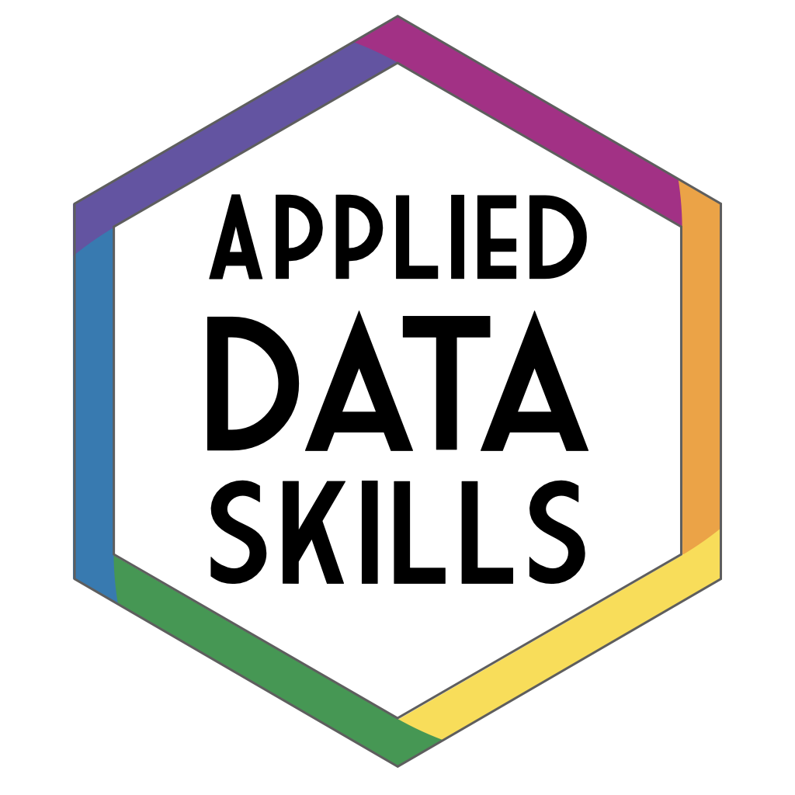

--- 
title: "Applied Data Skills"
subtitle: "Processing & Presenting Data"
author: "Emily Nordmann and Lisa DeBruine"
date: "`r Sys.Date()`"
site: bookdown::bookdown_site
documentclass: book
bibliography: [book.bib, packages.bib]
biblio-style: apa
csl: include/apa.csl
link-citations: yes
description: |
  This book provides an overview of the basic skills needed to turn raw data into informative summaries and visualisations presented in professional reports, presentations, and dashboards. The book will introduce learners to R, a programming language that can help automate working with data. The book will cover importing and processing data from spreadsheets, producing data summaries of descriptive statistics in tables, creating beautiful and informative visualisations, and constructing reports, presentations, and dashboards that automatically update when the underlying data changes.
url: https://psyteachr.github.io/ads-v1
github-repo: psyteachr/ads-v1
cover-image: images/twitter_card.png
apple-touch-icon: images/apple-touch-icon.png
apple-touch-icon-size: 180
favicon: images/favicon.ico
---

```{r cite-packages, include = FALSE}
# automatically create a bib database for R packages
# add any packages you want to cite here
knitr::write_bib(c(
  .packages(), 'bookdown', 'tidyverse', 'tinytex'
), 'packages.bib')

```

# Overview {-}

This book provides an overview of the basic skills needed to turn raw data into informative summaries and visualisations presented in professional reports, presentations, and dashboards. The book will introduce learners to R [@R-base], a programming language that can help automate working with data. The book will cover importing and processing data from spreadsheets, producing data summaries of descriptive statistics in tables, creating beautiful and informative visualisations, and constructing reports, presentations, and dashboards that automatically update when the underlying data changes.

<div style="float: right; width: 200px; max-width: 25%;"></div>

By the end of this book, you will be able to use R to:

* clean and process data
* summarise data
* informatively visualise data
* create reusable report templates


