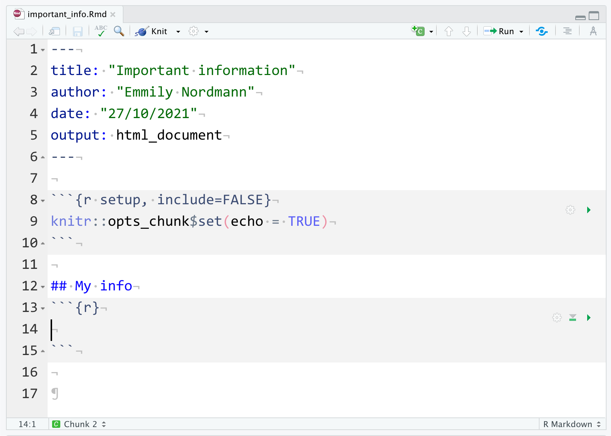

# Reports with R Markdown {#reports}

## Intended Learning Outcomes {#ilo-reports}

-   Be able to structure a project
-   Be able to knit a simple reproducible report with R Markdown
-   Be able to create code chunks, tables, images, and inline R in an R Markdown document

For reference, here are the packages we will use in this chapter.


```r
library(tidyverse)  # various data manipulation functions
library(knitr)      # for rendering a report from a script
library(kableExtra) # for styling tables
```

## Organising a project {#projects}

Before we write any code, first, we need to get organised. <a class='glossary' target='_blank' title='A way to organise related files in RStudio' href='https://psyteachr.github.io/glossary/p#project'>Projects</a> in RStudio are a way to group all the files you need for one project. Most projects include scripts, data files, and output files like the PDF report created by the script or images.

First, make a new folder on your computer where you will keep all of your materials for this class, we'd suggest renaming it something like `ADS-22`. The folder that R will look in by default to find and save files is known as the <a class='glossary' target='_blank' title='The filepath where R is currently reading and writing files.' href='https://psyteachr.github.io/glossary/w#working-directory'>working directory</a>. You can set the working directory manually to the folder you want to work in:

-   `Session`
-   `Set Working Directory`
-   `Choose Directory`

However, there's a better way of organising your files by using Projects in RStudio.

### Start a Project {#project-start}

To create a new project for the work we'll do in this chapter click:

-   Click `File`
-   Then `New project`
-   Name the project <code class='path'>02-reports</code>
-   Save it inside the directory you just made.

RStudio will restart itself and open with this new project directory as the working directory.

<div class="figure" style="text-align: center">

<p class="caption">(\#fig:unnamed-chunk-1)Starting a new project.</p>
</div>

Click on the Files tab in the lower right pane to see the contents of the project directory. You will see a file called `02-reports.Rproj`, which is a file that contains all of the project information.You can double-click on it to open up the project.

::: {.info data-latex=""}
Depending on your settings, you may also see a directory called `.Rproj.user`, which contains your specific user settings. You can ignore this and other "invisible" files that start with a full stop.
:::

### Naming Things {#naming}

Before we start creating new files, it's important to review how to name your files. This might seem a bit pedantic, but following clear naming rules so that both people and computers can easily find things will make your life much easier in the long-run. Here are some important principles:

-   file and directory names should only contain letters, numbers, dashes, and underscores, with a full stop (`.`) between the file name and <a class='glossary' target='_blank' title='The end part of a file name that tells you what type of file it is (e.g., .R or .Rmd).' href='https://psyteachr.github.io/glossary/e#extension'>extension</a> (that means no spaces!)
-   be consistent with capitalisation (set a rule to make it easy to remember, like always use lowercase)
-   use underscores (`_`) to separate parts of the file name, and dashes (`-`) to separate words in each part
-   name files with a pattern that alphabetises in a sensible order and makes it easy for you to find the file you're looking for
-   prefix a file name with an underscore to move it to the top of the list, or prefix all files with numbers to control their order

For example, these file names are a mess:

-   <code class='path'>report.doc</code>
-   <code class='path'>report final.doc</code>
-   <code class='path'>Data (Customers) 11-15.xls</code>
-   <code class='path'>Customers Data Nov 12.xls</code>
-   <code class='path'>final report2.doc</code>
-   <code class='path'>project notes.txt</code>
-   <code class='path'>Vendor Data November 15.xls</code>

Here is one way to structure them so that similar files have the same structure and it's easy for a human to scan the list or to use code to find relevant files. See if you can figure out what the last one should be.

-   <code class='path'>_project-notes.txt</code>
-   <code class='path'>report_v1.doc</code>
-   <code class='path'>report_v2.doc</code>
-   <code class='path'>report_v3.doc</code>
-   <code class='path'>data_customer_2021-11-12.xls</code>
-   <code class='path'>data_customer_2021-11-15.xls</code>
-   <select class='webex-select'><option value='blank'></option><option value=''>vendor-data_2021-11-15.xls</option><option value=''>data-vendor-2021_11_15.xls</option><option value='answer'>data_vendor_2021-11-15.xls</option><option value=''>data_2021-11-15_vendor.xls</option></select>

::: {.try data-latex=""}
Think of other ways to name the files above. Look at some of your own project files and see what you can improve.
:::

## R Markdown {#rmarkdown}

Throughout this course we will use <a class='glossary' target='_blank' title='The R-specific version of markdown: a way to specify formatting, such as headers, paragraphs, lists, bolding, and links, as well as code blocks and inline code.' href='https://psyteachr.github.io/glossary/r#r-markdown'>R Markdown</a> to create reproducible reports with a table of contents, text, tables, images, and code. The text can be written using <a class='glossary' target='_blank' title='A way to specify formatting, such as headers, paragraphs, lists, bolding, and links.' href='https://psyteachr.github.io/glossary/m#markdown'>markdown</a>, which is a way to specify formatting, such as headers, paragraphs, lists, bolding, and links.

To open a new R Markdown document click:

-   **`File`**
-   **`New file`**
-   **`R Markdown`**

You will be prompted to give it a title, call the document `important_info`. You can also change the author name. Keep the output format as HTML.

Once you've opened a new document be sure to save it by clicking `File` -> `Save as`. You should also name this file `important_info`. This file will automatically be saved in your project folder, i.e., your working directory, so you should now see this file appear in your file viewer pane.

<div class="figure" style="text-align: center">

<p class="caption">(\#fig:img-new-markdown)Opening a new R Markdown document</p>
</div>

### Using R Markdown for the first time

When you first open a new R Markdown document you will see a bunch of welcome text that looks like this:

<div class="figure" style="text-align: center">

<p class="caption">(\#fig:img-markdown-default)New R Markdown text</p>
</div>

Do the following steps:

-   Delete **everything** from line 12 onwards
-   On line 12 type "# Important information" (with the hashtag but without the quotation marks)\
-   Click the insert new code menu (a green box with a C and a plus sign) then **`R`**

Your Markdown document should now look something like this:

<div class="figure" style="text-align: center">

<p class="caption">(\#fig:img-new-chunk)New R chunk</p>
</div>

What you have created is a **code chunk**. In R Markdown, anything written in the white space is regarded as normal text, and anything written in a grey code chunk is assumed to be code (the actual colours will depend on which theme you have applied but we will refer to the default white and grey). This makes it easy to combine both text and code in one document.

::: {.dangerous data-latex=""}
When you create a new code chunk you should notice that the grey box starts and ends with three back ticks \`\`\`. One common mistake is to accidentally delete these back ticks. Remember, code chunks are grey and text entry is white - if the colour of certain parts of your Markdown doesn't look right, check that you haven't deleted the back ticks.
:::

### Writing code in R Markdown

In your code chunk, write the code you created in Chapter  \@ref(objects).


```r
name <- "Emily"
age <- 36
today <- Sys.Date()
christmas <- as.Date("2022-12-25")
```

### Running code in R Markdown

When you're working in an R Markdown document, there are several ways to run your lines of code.

First, you can highlight the code you want to run and then click `Run` -> `Run Selected Line(s)`, however this is very slow.

<div class="figure" style="text-align: center">

<p class="caption">(\#fig:img-run1)Slow method of running code</p>
</div>

Alternatively, you can press the green "play" button at the top-right of the code chunk and this will run **all** lines of code in that chunk.

<div class="figure" style="text-align: center">

<p class="caption">(\#fig:img-run2)Slightly better method of running code</p>
</div>

Even better is to learn some of the keyboard short cuts for R Studio. To run a single line of code, make sure that the cursor is in the line of code you want to run (it can be anywhere) and press `ctrl + enter` or `Cmd + enter` if you're on a Mac. If you want to run all of the code in the code chunk, press `ctrl/cmd + shift + enter`. Learn these short cuts, they will make your life easier!

Run your code using one of the methods above. You should see the variables `name`, `age`, `today`, and `christmas` appear in the environment pane.

### Inline code

We keep talking about using R Markdown for reproducible reports but it's easier to show you than tell you why this is so powerful and to give you an insight into how this course will (hopefully!) change the way you work with data forever!

One important feature of R Markdown is that you can combine text and code to insert values into your writing using **inline coding**. If you've ever had to copy and paste a value or text from one file to another, you'll know how easy it can be to make mistakes. Inline code avoids this. Again it's easier to show you what inline code does rather than to explain it so let's have a go.

First, copy and paste this text to the **white space underneath** your code chunk. If you used a different variable name than `christmas` you should update this with the name of the object you created but otherwise don't change anything else.


```r
My name is `r name` and I am `r age` years old. It is `r christmas - today` days until Christmas which is my favourite holiday.
```

### Knitting your file {#rmd-knit}

Now we are going to <a class='glossary' target='_blank' title='To create an HTML, PDF, or Word document from an R Markdown (Rmd) document' href='https://psyteachr.github.io/glossary/k#knit'>knit</a>, or compile, the file into a document type of our choosing. In this case we'll create a default html file but you will learn how to create other files like Word and PDF throughout this course. To knit your file click:

-   **`Knit`**
-   **`Knit to HMTL`**

R Markdown will create a new HTML document which it will display, but it will also automatically save this file in your working directory.

As if by magic, that slightly odd bit of text you copied and pasted now appears as a normal sentence with the values pulled in from the objects you created.

**My name is Emily and I am 36 years old. It is 425 days until Christmas which is my favourite holiday.**

::: {.info data-latex=""}
You can also type the following code into the console (substituting your specific file name). Never put this in an Rmd script itself, or it will try to knit itself in an infinite loop.


```r
knitr::knit2html("file.Rmd")
```
:::

## Loading data

Now let's try another example of using Markdown but this time rather than using objects we have created from scratch, we will read in a data file.

Save and close your `important_info.Rmd` document and open and save a new Markdown document, this time named `sales_data`. You can again get rid of everything from line 12 onwards.

### Loading data from an online source {#loading-online}

First, let's try loading data that is stored online. Create a code chunk in your document and copy, paste, and run the below code. This code loads some simulated sales data.

-   The data is stored in a `.csv` file so we're going to use the `readr::read_csv()` function to load it in.
-   The package `readr` is part of the `tidyverse` that you installed in Chapter @ref(install-package) and we load this package with `library()`\
-   Note that the url is contained within double quotation marks - it won't work without this.

<div class='verbatim'><pre class='sourceCode r'><code class='sourceCode R'>&#96;&#96;&#96;{r}</code></pre>

```r
# Data from https://www.kaggle.com/kyanyoga/sample-sales-data
library(tidyverse)
sales_online <- readr::read_csv("https://psyteachr.github.io/ads-v1/data/sales_data_sample.csv")
```

<pre class='sourceCode r'><code class='sourceCode R'>&#96;&#96;&#96;</code></pre></div>

This dataset is simulated sales data for different types of vehicles where each line of data is a single order. There are multiple ways to view and check a dataset in R. Do each of the following and make a note of what information each approach seems to give you. If you'd like more information about each of these functions, you can look up the help documentation with `?function`:

-   Click on the `sales_online` object in the environment pane
-   Run `head(sales_online)` in the console
-   Run `summary(sales_online)` in the console
-   Run `str(sales_online)` in the console
-   Run `View(sales_online)` in the console

### Loading data from your computer

More commonly, you will be working from data files that are stored locally on your computer. But where should you put all of your files? You usually want to have all your scripts and data files for a single project inside one folder on your computer, the <a class='glossary' target='_blank' title='The filepath where R is currently reading and writing files.' href='https://psyteachr.github.io/glossary/w#working-directory'>working directory</a>, and we have already set up the main directory <code class='path'>02-reports</code>for this chapter.

But you can also organise files in subdirectories inside this main project directory, such as putting all raw data files in a directory called <code class='path'>data</code> and saving any image files to a directory called <code class='path'>images</code>. Using subdirectories helps avoid one single folder becoming too cluttered, which is important if you're working on big projects.

::: {.try data-latex=""}
In your <code class='path'>02-reports</code> directory, create a new folder named <code class='path'>data</code>, then, [download a copy of the sales data file](https://psyteachr.github.io/ads-v1/data/sales_data_sample.csv) and save it in this new subdirectory.
:::

To load in data from a local file, again we can use the `read_csv()` function but this time rather than specifying a url, we simply give it the subdirectory and file name.


```r
sales_local <- read_csv("data/sales_data_sample.csv") 
```

Things to note:

-   You must include the file extension (in this case `.csv`)
-   The subdirectory folder name (`data`) and the file name are separated by a forward slash `/`
-   Precision is important, if you have a typo in the file name it won't be able to find your file and remember that R is case sensitive - `Sales_Data.csv` is a completely different file to `sales_data.csv` as far as R is concerned.

::: {.try data-latex=""}
Run `head()`, `summary()`, `str()`, and `View()` on `sales_local` to confirm that the data is the same as `sales_online`.
:::

## Writing a report

We're going to write a basic report for this sales dataset using Markdown to show you some of the features. We'll be expanding on almost every bit of what we're about to show you throughout this course, the most important outcome is that you start to get comfortable with how R Markdown works and what you can use it to do. 

### Data analysis

For this report we're just going to report some simple sales stats for three types of vehicles: planes, motorcycles, and classic cars. We'll come back to how to write this kind of code yourself in Chapter {#summary}, for now, try to see if you can follow the logic of what it is doing via the code comments.

Create a new code chunk, copy, paste and run the following code and then view `sales_counts` by clicking on the object in the environment pane.


```r
sales_counts<- sales_online %>% # take the sale_online data and then
  filter(PRODUCTLINE %in% c("Planes", "Motorcycles", "Classic Cars")) %>% # just keep the data from planes, motorcycles, and cars and then
  group_by(PRODUCTLINE) %>% # group it by type of vehicle and then
  count() # count how many are in each group
```

Because each row of the dataset is a sale, this code gives us a nice and easy way of seeing how many sales were made of each type of vehicle, it just counts the number of rows in each group.

### Text formatting

You can use the visual <a class='glossary' target='_blank' title='A way to specify formatting, such as headers, paragraphs, lists, bolding, and links.' href='https://psyteachr.github.io/glossary/m#markdown'>markdown</a> editor if you have RStudio version 1.4 or higher. This will be a button at the top of the source pane with a pen tip and the menu options should be very familiar to anyone who has worked with software like Microsoft Word.

<div class="figure" style="text-align: center">

<p class="caption">(\#fig:visual-editor)The visual editor.</p>
</div>

This is useful for complex styling, but you can also use these common plain-text style markups:

-   Headers are created by prefacing subtitles with one or more hashes (`#`). If you include a table of contents, this will be created from your document headers.
-   Format text with *italics* or **bold** by surrounding the text with one or two asterisks or underscores.
-   Make lists using numbers, asterisks or dashes before items. Indent items to make nested lists.
-   Make links like this: `[psyTeachR](https://psyteachr.github.io/)`

Download the [R Markdown Cheat Sheet](http://www.rstudio.com/wp-content/uploads/2016/03/rmarkdown-cheatsheet-2.0.pdf) to learn more.

Copy and paste the below text into the white space below the code chunk that loads in the data. Save the file and then click knit to view the results. It will look a bit messy for now as it contains the code and messages from loading the data but don't worry, we'll get rid of that soon.


```r
# Sample sales report

This report summarises the sales data for different types of vehicles sold between 2003 and 2005. Thie data is from [Kaggle](https://www.kaggle.com/kyanyoga/sample-sales-data)

## Sales by type

The *total* number of **planes** sold was `r sales_counts$n[3]`

The *total* number of **classic cars** sold was `r sales_counts$n[1]`.
```

Try and match up the inline code with what is in the `sales_counts` table. Of note:

* The `$` sign is used to indicate specific variables (or columns)  in an object using the `object$variable` syntax. 
* Square brackets with a number e.g., [3] indicate a particular observation so in this case, we ask the inline code to display the third observation of the variable `n` in the dataset `sales_online`.

::: {.try data-latex=""}
Add another line that reports the total numbers of **motorcycles** using inline code. Using either the visual editor or text markups, add in bold and italics so that it matches the others.
:::

### Code comments {#comments}

In the above code we've used code **comments** and it's important to highlight how useful these are. You can add comments inside R chunks with the hash symbol (`#`). R will ignore characters from the hash to the end of the line.


```r
# important numbers

n <- nrow(sales_online) # the total number of sales (number of rows)
first <- min(sales_online$YEAR_ID) # the first (minimum) year in the table
last <- max(sales_online$YEAR_ID) # the last (maximum) year in the table
```

It's usually good practice to start a code chunk with a comment that explains what you're doing there, especially if the code is not explained in the text of the report.

If you name your objects clearly, you often don't need to add clarifying comments. For example, if I'd named the three objects above `total_number_of_sales`, `first_year` and `last_year`, I would omit the comments. It's a bit of an art to comment your code well but try to add comments as you're working through this book - it will help consolidate your learning and when future you comes to review your code, you'll thank past you for being so clear.

### Setup {#rmd-setup}

Before we go any further, let's tidy up the our report a little. When you create a new R Markdown file in RStudio, a setup chunk is automatically created - we've ignored this chunk until now.

<div class='verbatim'><pre class='sourceCode r'><code class='sourceCode R'>&#96;&#96;&#96;{r setup, include=FALSE}</code></pre>

```r
knitr::opts_chunk$set(echo = TRUE)
```

<pre class='sourceCode r'><code class='sourceCode R'>&#96;&#96;&#96;</code></pre></div>

You can set more default options for your document here. Type `str(knitr::opts_chunk$get())` into the console to see the full list of options that you can set and their default values. You only need to change 

<div class='verbatim'><pre class='sourceCode r'><code class='sourceCode R'>&#96;&#96;&#96;{r setup, include=FALSE}</code></pre>

```r
knitr::opts_chunk$set(
  echo       = FALSE,     # don't show code chunks
  message    = FALSE,     # don't show messages from your code
  warning    = TRUE,      # do show warnings from your code
  fig.width  = 8,         # figure width in inches (at 96 dpi)
  fig.height = 5,         # figure height in inches (at 96 dpi)
  out.width = "100%"      # figures should take up 100% of the page width
)
```

<pre class='sourceCode r'><code class='sourceCode R'>&#96;&#96;&#96;</code></pre></div>

The code above sets the following options:

-   `fig.width  = 8` : default figure width is 8 inches (you can change this for individual figures)
-   `fig.height = 5` : default figure height is 5 inches
-   `fig.path   = 'images/'` : figures are saved in the directory "images"
-   `echo       = FALSE` : do not show code chunks in the rendered document
-   `warning    = FALSE` : do not show any function warnings
-   `message    = FALSE` : do not show any function messages
-   `cache      = FALSE` : run all the code to create all of the images and objects each time you knit (set to `TRUE` if you have time-consuming code)

Find a list of the current chunk options by typing <code><span class='fu'><a target='_blank' href='https://rdrr.io/r/utils/str.html'>str</a></span><span class='op'>(</span><span class='fu'>knitr</span><span class='fu'>::</span><span class='va'><a target='_blank' href='https://rdrr.io/pkg/knitr/man/opts_chunk.html'>opts_chunk</a></span><span class='op'>$</span><span class='fu'>get</span><span class='op'>(</span><span class='op'>)</span><span class='op'>)</span></code> in the console. See the [knitr options documentation](https://yihui.name/knitr/options/){target="_blank"} for explanations of the possible options.

You can also add the packages you need in this chunk using <code><span class='kw'><a target='_blank' href='https://rdrr.io/r/base/library.html'>library</a></span><span class='op'>(</span><span class='op'>)</span></code>. Often when you are working on a script, you will realize that you need to load another add-on package. Don't bury the call to <code><span class='kw'><a target='_blank' href='https://rdrr.io/r/base/library.html'>library</a></span><span class='op'>(</span><span class='va'>package_I_need</span><span class='op'>)</span></code> way down in the script. Put it in the top, so the user has an overview of what packages are needed.

::: {.try data-latex=""}
We'll frequently use functions from the package <code class='package'>tidyverse</code>, so load that in your setup chunk using the code <select class='webex-select'><option value='blank'></option><option value=''>install.packages("tidyverse")</option><option value='answer'>library(tidyverse)</option><option value=''>load(tidyverse)</option></select>
:::


### Images {#rmd-images}

As the saying goes, a picture paints a thousand words and sometimes you will want to communicate your data using visualisations. 

Create a code chunk where you want to display an image in your document. Let's put it after the text we've written so far. We'll use some code that you'll learn more about in Chapter\ \@ref(viz) to make a simple bar chart that represents the sales data.

Notice how the figure caption is formatted in the chunk options.


```r
ggplot(data = sales_counts, 
       mapping = aes(x = PRODUCTLINE, y = n, fill = PRODUCTLINE)) +
  geom_bar(stat = "identity", show.legend = FALSE) +
  labs(x = "Type of vehicle",
       y = "Number of sales")
```

<div class="figure" style="text-align: center">

<p class="caption">(\#fig:unnamed-chunk-8)Sales by vehicle type</p>
</div>

