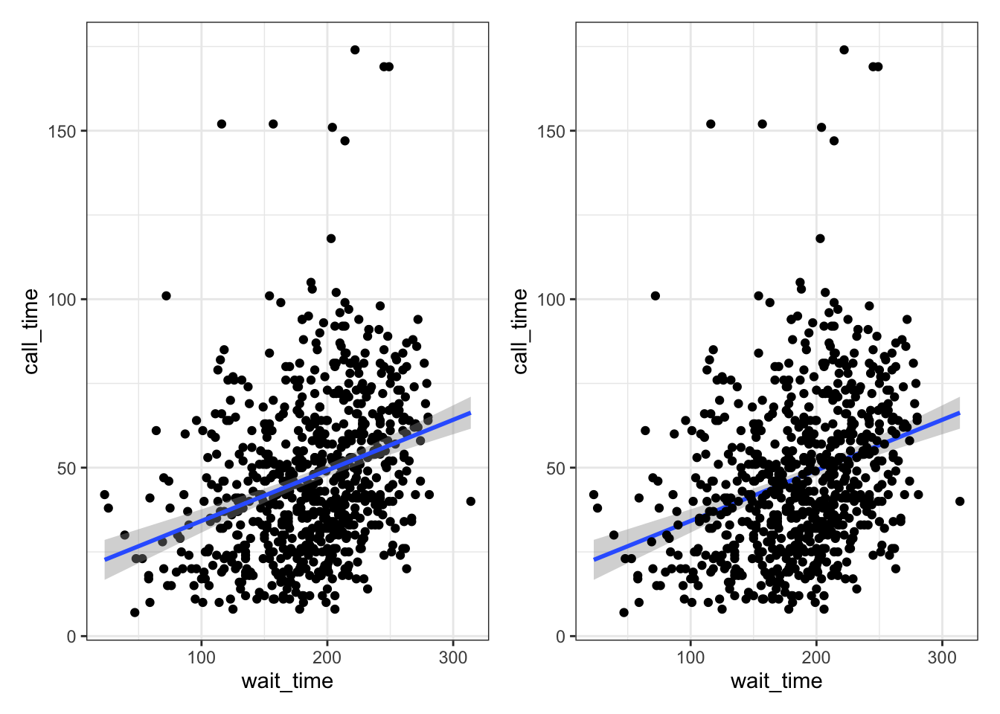

# Basic Data Visualisation {#viz}

## Intended Learning Outcomes {#ilo-viz}

* Understand the difference between categorical and continuous data
* Create plots in layers using ggplot
* Be able to choose appropriate plots for data


```r
library(tidyverse)
library(patchwork)
```


## Variable Types

If a spreadsheet is in a ` r glossary("tidy data")` format, each row is an <a class='glossary' target='_blank' title='All of the data about a single trial or question.' href='https://psyteachr.github.io/glossary/o#observation'>observation</a>, each column is a <a class='glossary' target='_blank' title='A word that identifies and stores the value of some data for later use.' href='https://psyteachr.github.io/glossary/v#variable'>variable</a>, and the information in each cell is a <a class='glossary' target='_blank' title='A single number or piece of data.' href='https://psyteachr.github.io/glossary/v#value'>value</a>. We'll learn more about how to get our data into this format in Chapter\ \@ref(tidy), but to get started we'll use built-in datasets with the right format.

For example, the table below lists pets owned by members of the psyTeachR team. Each row is an observation of one pet. There are 5 variables for each pet, their `name`, `owner`, `species`, `weight`, and `rating`.

<div class="kable-table">

<table>
 <thead>
  <tr>
   <th style="text-align:left;"> name </th>
   <th style="text-align:left;"> owner </th>
   <th style="text-align:left;"> species </th>
   <th style="text-align:right;"> weight </th>
   <th style="text-align:left;"> rating </th>
  </tr>
 </thead>
<tbody>
  <tr>
   <td style="text-align:left;"> Darwin </td>
   <td style="text-align:left;"> Lisa </td>
   <td style="text-align:left;"> ferret </td>
   <td style="text-align:right;"> 1.2 </td>
   <td style="text-align:left;"> a little evil </td>
  </tr>
  <tr>
   <td style="text-align:left;"> Oy </td>
   <td style="text-align:left;"> Lisa </td>
   <td style="text-align:left;"> ferret </td>
   <td style="text-align:right;"> 2.9 </td>
   <td style="text-align:left;"> very good </td>
  </tr>
  <tr>
   <td style="text-align:left;"> Khaleesi </td>
   <td style="text-align:left;"> Emily </td>
   <td style="text-align:left;"> cat </td>
   <td style="text-align:right;"> 4.5 </td>
   <td style="text-align:left;"> very good </td>
  </tr>
  <tr>
   <td style="text-align:left;"> Bernie </td>
   <td style="text-align:left;"> Phil </td>
   <td style="text-align:left;"> dog </td>
   <td style="text-align:right;"> 32.0 </td>
   <td style="text-align:left;"> very good </td>
  </tr>
</tbody>
</table>

</div>

When you're plotting data, it's important to know what type of variables you have.

### Continuous

<a class='glossary' target='_blank' title='Data that can take on any values between other existing values.' href='https://psyteachr.github.io/glossary/c#continuous'>Continuous</a> variables are properties you can measure, like weight. Continuous variables are always numbers. They may be rounded to the nearest whole number, but it should make sense to have a measurement halfway between.

### Categorical

<a class='glossary' target='_blank' title='Data that can only take certain values, such as types of pet.' href='https://psyteachr.github.io/glossary/c#categorical'>Categorical</a> variables are properties you can count, like the number of pets of each species. Categorical variables can be <a class='glossary' target='_blank' title='Categorical variables that don&#39;t have an inherent order, such as types of animal.' href='https://psyteachr.github.io/glossary/n#nominal'>nominal</a>, where the categories don't really have an order, like cats, dogs and ferrets (even though ferrets are obviously best). Sometimes people represent categorical variables with numbers that correspond to names, like 0 = "no" and 1 = "yes", but values in between don't have a clear interpretation. If you have control over how the data are recorded, it's better to use the text names for clarity, but you'll learn how to recode columns in Chapter\ \@ref(wrangle).

### Ordinal

<a class='glossary' target='_blank' title='Discrete variables that have an inherent order, such as number of legs' href='https://psyteachr.github.io/glossary/o#ordinal'>Ordinal</a> variables are a type of categorical variable with a clear order, but the distance between the categories isn't something you could exactly equate, like points on a <a class='glossary' target='_blank' title='A rating scale with a small number of discrete points in order' href='https://psyteachr.github.io/glossary/l#likert'>Likert</a> rating scale. Even if a data table uses numbers like 1-7 to represent ordinal variables, you shouldn't treat them like continuous variables.

### Dates and Times

Dates and times are a special case of variable. They can act like categorical or continuous variables, and there are special ways to plot them.


## Building Plots


### Layered Plots

Figure\ \@ref(fig:layers) displays the evolution of a simple scatterplot using this layered approach. First, the plot space is built (layer 1); the variables are specified (layer 2); the type of visualisation (known as a `geom`) that is desired for these variables is specified (layer 3) - in this case `geom_point()` is called to visualise individual data points; a second geom is added to include a line of best fit (layer 4), the axis labels are edited for readability (layer 5), and finally, a theme is applied to change the overall appearance of the plot (layer 6).

<div class="figure" style="text-align: center">

<p class="caption">(\#fig:layers)Evolution of a layered plot</p>
</div>

Importantly, each layer is independent and independently customisable. For example, the size, colour and position of each component can be adjusted, or one could, for example, remove the first geom (the data points) to only visualise the line of best fit, simply by removing the layer that draws the data points (Figure\ \@ref(fig:remove-layer)). The use of layers makes it easy to build up complex plots step-by-step, and to adapt or extend plots from existing code.

<div class="figure" style="text-align: center">

<p class="caption">(\#fig:remove-layer)Plot with scatterplot layer removed.</p>
</div>

### Loading Data

Let's build up a simple version of the plot above, layer by layer. First we need to get the data. We'll learn how to load data in Chapter\ \@ref(data), but you can copy the code below to create a data table object. The "column specification" tells you what each column is named and what type of data it is. A <a class='glossary' target='_blank' title='A data type representing a real decimal number' href='https://psyteachr.github.io/glossary/d#double'>double</a> is a kind of <a class='glossary' target='_blank' title='A data type representing a real decimal number or integer.' href='https://psyteachr.github.io/glossary/n#numeric'>numeric</a> value that can have decimal places.


```r
survey_data <- read_csv(file = "data/survey_data.csv")
```

```
## 
## ── Column specification ────────────────────────────────────────────────────────
## cols(
##   caller_id = col_character(),
##   employee_id = col_character(),
##   call_start = col_datetime(format = ""),
##   wait_time = col_double(),
##   call_time = col_double(),
##   issue_category = col_character(),
##   satisfaction = col_double()
## )
```

This data is simulated data for a call centre customer satisfaction survey. The first thing you should do when you need to plot data is to get familiar with what all of the rows (observations) and columns (variables) mean. Sometimes this is obvious, and sometimes it requires help from the data provider. Here, each row represents one call to the centre.

* `caller_id` is a unique ID for each caller
* `employee_id` is a unique ID for each employee taking calls
* `call_start` is the date and time that the call arrived
* `wait_time` is the number of seconds the caller had to wait
* `call_time` is the number of seconds the call lasted after the employee picked up
* `issue_category` is whether the issue was technical, sales, returns, other
* `satisfaction` is the customer satisfaction rating on a scale from 1 (very unsatisfied) to 5 (very satisfied)

### Plot setup

Every plot starts with the `ggplot()` function and a data table. If your data are not loaded or you have a typo in your code, this will give you an error message. It's best to check your plot after each step so you can figure out where errors are more easily.


```r
ggplot(data = survey_data)
```


### Mapping

The next <a class='glossary' target='_blank' title='A variable that provides input to a function.' href='https://psyteachr.github.io/glossary/a#argument'>argument</a> to `ggplot()` is the `mapping`. This tells the plot which columns in the data should be represented by different "aesthetics" of the plot, such as the x-axis, y-axis, line colour, object fill, or line style.

The `mapping` argument requires an `aes()` function that can take the arguments `x` and `y`. Set those to the names of the columns you want to be plotted on those axes. Here, we want to plot the wait time on the x-axis and the call time on the y-axis.


```r
# set up the mapping
wait_vs_call <- aes(x = wait_time, 
                    y = call_time)

# set up the plot
ggplot(data = survey_data, mapping = wait_vs_call)
```


::: {.info data-latex=""}
You will often see the two steps above (setting up the mapping and setting up the plot) combined like below. If you put arguments in the right order, you don't need to use their names, and you can put the `aes()` function directly in the second argument. Once you're very familiar with plotting, this shortcut will make sense, but we'll use the longer, clearer version to start.


```r
ggplot(survey_data, aes(x = wait_time, y = call_time))
```

:::

### Geoms

Now we can add our plot elements in layers. These are referred to as <a class='glossary' target='_blank' title='The geometric style in which data are displayed, such as boxplot, density, or histogram.' href='https://psyteachr.github.io/glossary/g#geom'>geoms</a> and their functions start with `geom_`. You **add** layers onto the base plot created by `ggplot()` with a plus (`+`). 


```r
ggplot(data = survey_data, mapping = wait_vs_call) +
  geom_point() # scatterplot
```


::: {.warning data-latex=""}
Somewhat annoyingly, the plus has to be on the end of the previous line, not at the start of the next line. If you do make this mistake, you will get the following error message.


```r
ggplot(data = survey_data, mapping = wait_vs_call)
```


```r
  + geom_point() # scatterplot
```

```
## Error: Cannot use `+.gg()` with a single argument. Did you accidentally put + on a new line?
```
:::

### Multiple Geoms

You can add more than one geom. They display in the order you set them up. In the code below, we make two different plots and assign them to <a class='glossary' target='_blank' title='A word that identifies and stores the value of some data for later use.' href='https://psyteachr.github.io/glossary/o#object'>objects</a> that we can add together using the `plot_layout()` function from the <code class='package'>patchwork</code> package.


```r
point_first <- 
  ggplot(data = survey_data, mapping = wait_vs_call) +
  geom_point() + # scatterplot
  geom_smooth(method = lm) # line of best fit
  
line_first <-
  ggplot(data = survey_data, mapping = wait_vs_call) +
  geom_smooth(method = lm) + # line of best fit
  geom_point() # scatterplot

# add plots together in 1 row
point_first + line_first + plot_layout(nrow = 1)
```

```
## `geom_smooth()` using formula 'y ~ x'
## `geom_smooth()` using formula 'y ~ x'
```


### Styling Geoms

We should definitely put the line in front of the points, but the points are still a bit dark. If you want to change the overall style of a geom (not use it to represent different levels of a variable), you can set arguments inside the geom function. See Appendix\ \@ref(plotstyle) for more information about the ways to style plot aesthetics.


```r
ggplot(data = survey_data, mapping = wait_vs_call) +
  geom_point(colour = "dodgerblue", 
             alpha = 0.15,
             shape = 18,
             size = 2) + 
  geom_smooth(method = lm, 
              formula = y~x, # default value; avoids annoying message
              colour = rgb(0, .5, .8),
              linetype = 4) 
```




::: {.try data-latex=""}
Play around with different values for the aesthetics above. Figure out what the default values are for `shape` and `size`.
:::


## Appropriate Plots


## Glossary {#glossary-viz}

<table>
 <thead>
  <tr>
   <th style="text-align:left;"> term </th>
   <th style="text-align:left;"> definition </th>
  </tr>
 </thead>
<tbody>
  <tr>
   <td style="text-align:left;"> [argument](https://psyteachr.github.io/glossary/a.html#argument){class="glossary" target="_blank"} </td>
   <td style="text-align:left;"> A variable that provides input to a function. </td>
  </tr>
  <tr>
   <td style="text-align:left;"> [categorical](https://psyteachr.github.io/glossary/c.html#categorical){class="glossary" target="_blank"} </td>
   <td style="text-align:left;"> Data that can only take certain values, such as types of pet. </td>
  </tr>
  <tr>
   <td style="text-align:left;"> [continuous](https://psyteachr.github.io/glossary/c.html#continuous){class="glossary" target="_blank"} </td>
   <td style="text-align:left;"> Data that can take on any values between other existing values. </td>
  </tr>
  <tr>
   <td style="text-align:left;"> [double](https://psyteachr.github.io/glossary/d.html#double){class="glossary" target="_blank"} </td>
   <td style="text-align:left;"> A data type representing a real decimal number </td>
  </tr>
  <tr>
   <td style="text-align:left;"> [geom](https://psyteachr.github.io/glossary/g.html#geom){class="glossary" target="_blank"} </td>
   <td style="text-align:left;"> The geometric style in which data are displayed, such as boxplot, density, or histogram. </td>
  </tr>
  <tr>
   <td style="text-align:left;"> [likert](https://psyteachr.github.io/glossary/l.html#likert){class="glossary" target="_blank"} </td>
   <td style="text-align:left;"> A rating scale with a small number of discrete points in order </td>
  </tr>
  <tr>
   <td style="text-align:left;"> [nominal](https://psyteachr.github.io/glossary/n.html#nominal){class="glossary" target="_blank"} </td>
   <td style="text-align:left;"> Categorical variables that don&#39;t have an inherent order, such as types of animal. </td>
  </tr>
  <tr>
   <td style="text-align:left;"> [numeric](https://psyteachr.github.io/glossary/n.html#numeric){class="glossary" target="_blank"} </td>
   <td style="text-align:left;"> A data type representing a real decimal number or integer. </td>
  </tr>
  <tr>
   <td style="text-align:left;"> [object](https://psyteachr.github.io/glossary/o.html#object){class="glossary" target="_blank"} </td>
   <td style="text-align:left;"> A word that identifies and stores the value of some data for later use. </td>
  </tr>
  <tr>
   <td style="text-align:left;"> [observation](https://psyteachr.github.io/glossary/o.html#observation){class="glossary" target="_blank"} </td>
   <td style="text-align:left;"> All of the data about a single trial or question. </td>
  </tr>
  <tr>
   <td style="text-align:left;"> [ordinal](https://psyteachr.github.io/glossary/o.html#ordinal){class="glossary" target="_blank"} </td>
   <td style="text-align:left;"> Discrete variables that have an inherent order, such as number of legs </td>
  </tr>
  <tr>
   <td style="text-align:left;"> [value](https://psyteachr.github.io/glossary/v.html#value){class="glossary" target="_blank"} </td>
   <td style="text-align:left;"> A single number or piece of data. </td>
  </tr>
  <tr>
   <td style="text-align:left;"> [variable](https://psyteachr.github.io/glossary/v.html#variable){class="glossary" target="_blank"} </td>
   <td style="text-align:left;"> A word that identifies and stores the value of some data for later use. </td>
  </tr>
</tbody>
</table>


## Further Resources {#resources-viz}

* [Data visualisation using R, for researchers who don't use R](https://psyteachr.github.io/introdataviz/) (-@nordmann_2021)
* [Chapter 3: Data Visualisation](http://r4ds.had.co.nz/data-visualisation.html) of *R for Data Science*
* [ggplot2 cheat sheet](https://github.com/rstudio/cheatsheets/raw/master/data-visualization-2.1.pdf)
* [ggplot2 FAQs](https://ggplot2.tidyverse.org/articles/)
* [Chapter 28: Graphics for communication](http://r4ds.had.co.nz/graphics-for-communication.html) of *R for Data Science*
* [Look at Data](http://socviz.co/look-at-data.html) from [Data Vizualization for Social Science](http://socviz.co/)
* [Hack Your Data Beautiful](https://psyteachr.github.io/hack-your-data/) workshop by University of Glasgow postgraduate students
* [Graphs](http://www.cookbook-r.com/Graphs) in *Cookbook for R*
* [ggplot2 documentation](https://ggplot2.tidyverse.org/reference/)
* [The R Graph Gallery](http://www.r-graph-gallery.com/) (this is really useful)
* [Top 50 ggplot2 Visualizations](http://r-statistics.co/Top50-Ggplot2-Visualizations-MasterList-R-Code.html)
* [R Graphics Cookbook](http://www.cookbook-r.com/Graphs/) by Winston Chang
* [ggplot extensions](https://www.ggplot2-exts.org/)
* [plotly](https://plot.ly/ggplot2/) for creating interactive graphs
