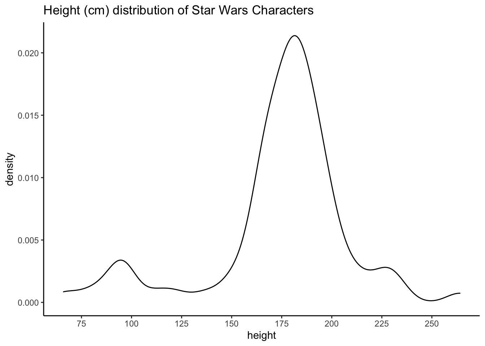
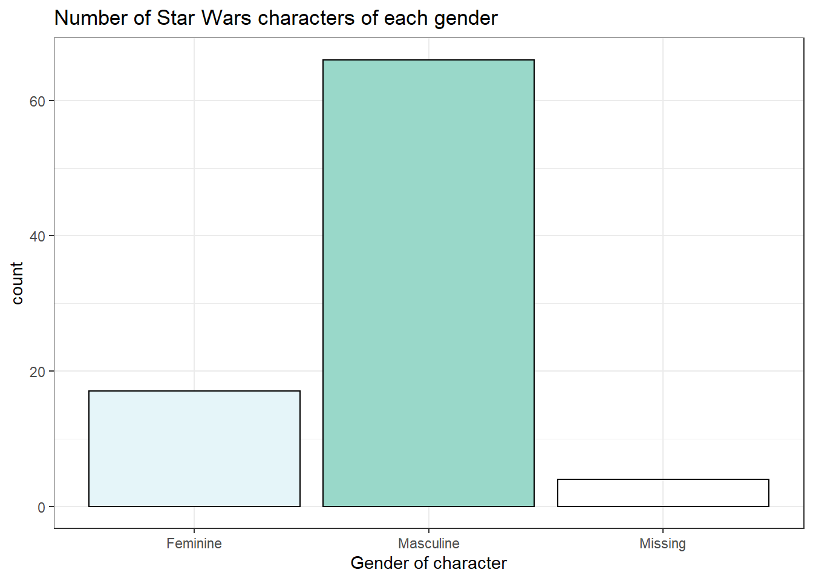

# Data Import {#data}

## Intended Learning Outcomes {#ilo-data}

* Be able to inspect data
* Be able to import data from a range of sources
* Be able to identify and handle common problems with data import

## Set-up

Create a new project for the work we'll do in this chapter named <code class='path'>04-data</code>. Then, create and save a new R Markdown document named `data.Rmd`, get rid of the default template text, and load the packages in the set-up code chunk. You should have all of these packages installed already, but if you get the message `Error in library(x) : there is no package called ‘x’`, please refer to Chapter\ \@ref(install-package).

<div class='verbatim'><pre class='sourceCode r'><code class='sourceCode R'>&#96;&#96;&#96;{r setup, include=FALSE}</code></pre>

```r
library(tidyverse)     # includes readr & tibble
library(rio)           # for almost any data import/export
library(haven)         # for SPSS, Stata,and SAS files
library(readxl)        # for Excel files
library(googlesheets4) # for Google Sheets
```

<pre class='sourceCode r'><code class='sourceCode R'>&#96;&#96;&#96;</code></pre></div>

We'd recommend making a new code chunk for each different activity, and using the white space to make notes on any errors you make, things you find interesting, or questions you'd like to ask the course team.

Download the [Data import cheatsheet](https://raw.githubusercontent.com/rstudio/cheatsheets/main/data-import.pdf).

## Built-in data {#builtin}

You'll likely want to import you own data to work with, however, Base R also comes with built-in datasets and these can be very useful for learning new functions and packages. Additionally, some packages, like <code class='package'>tidyr</code>, also contain data. The <code><span class='fu'><a target='_blank' href='https://rdrr.io/r/utils/data.html'>data</a></span><span class='op'>(</span><span class='op'>)</span></code> function lists the datasets available.


```r
# list datasets built in to base R
data()

# lists datasets in a specific package
data(package = "tidyr")
```

Type the name of a dataset into the <a class='glossary' target='_blank' title='The pane in RStudio where you can type in commands and view output messages.' href='https://psyteachr.github.io/glossary/c#console'>console</a> to see the data. For example, type `?table1` into the console to see the dataset description for `table1`, which is a dataset included with <code class='package'>tidyr</code>.


```r
?table1
```

You can also use the <code><span class='fu'><a target='_blank' href='https://rdrr.io/r/utils/data.html'>data</a></span><span class='op'>(</span><span class='op'>)</span></code> function to load a dataset into your <a class='glossary' target='_blank' title='The interactive workspace where your script runs' href='https://psyteachr.github.io/glossary/g#global-environment'>global environment</a>.


```r
# loads table1 into the environment
data("table1")
```


## Looking at data

Now that you've loaded some data, look the upper right hand window of RStudio, under the Environment tab. You will see the object `table1` listed, along with the number of observations (rows) and variables (columns). This is your first check that everything went OK.

**Always, always, always, look at your data once you've created or loaded a table**. Also look at it after each step that transforms your table. There are three main ways to look at your table: <code><span class='fu'><a target='_blank' href='https://rdrr.io/r/utils/View.html'>View</a></span><span class='op'>(</span><span class='op'>)</span></code>, <code><span class='fu'><a target='_blank' href='https://rdrr.io/r/base/print.html'>print</a></span><span class='op'>(</span><span class='op'>)</span></code>, <code><span class='fu'>tibble</span><span class='fu'>::</span><span class='fu'><a target='_blank' href='https://rdrr.io/pkg/pillar/man/glimpse.html'>glimpse</a></span><span class='op'>(</span><span class='op'>)</span></code>. 

### View() 

A familiar way to look at the table is given by <code><span class='fu'><a target='_blank' href='https://rdrr.io/r/utils/View.html'>View</a></span><span class='op'>(</span><span class='op'>)</span></code> (uppercase 'V'), which opens up a data table in the console pane using a viewer that looks a bit like Excel. This command can be useful in the console, but don't ever put this one in a script because it will create an annoying pop-up window when the user runs it. You can also click on an object in the  <a class='glossary' target='_blank' title='RStudio is arranged with four window "panes".' href='https://psyteachr.github.io/glossary/p#panes'>environment pane</a> to open it in the same interface. You can close the tab when you're done looking at it; it won't remove the object.


```r
View(table1)
```


### print() 

The <code><span class='fu'><a target='_blank' href='https://rdrr.io/r/base/print.html'>print</a></span><span class='op'>(</span><span class='op'>)</span></code> method can be run explicitly, but is more commonly called by just typing the variable name on a blank line. The default is not to print the entire table, but just the first 10 rows. 

Let's look at the `table1` table that we loaded above. Depending on how wide your screen is, you might need to click on an arrow at the right of the table to see the last column. 


```r
# call print explicitly
print(table1)

# more common method of just calling object name
table1
```

<div class="kable-table">

<table>
 <thead>
  <tr>
   <th style="text-align:left;"> country </th>
   <th style="text-align:right;"> year </th>
   <th style="text-align:right;"> cases </th>
   <th style="text-align:right;"> population </th>
  </tr>
 </thead>
<tbody>
  <tr>
   <td style="text-align:left;"> Afghanistan </td>
   <td style="text-align:right;"> 1999 </td>
   <td style="text-align:right;"> 745 </td>
   <td style="text-align:right;"> 19987071 </td>
  </tr>
  <tr>
   <td style="text-align:left;"> Afghanistan </td>
   <td style="text-align:right;"> 2000 </td>
   <td style="text-align:right;"> 2666 </td>
   <td style="text-align:right;"> 20595360 </td>
  </tr>
  <tr>
   <td style="text-align:left;"> Brazil </td>
   <td style="text-align:right;"> 1999 </td>
   <td style="text-align:right;"> 37737 </td>
   <td style="text-align:right;"> 172006362 </td>
  </tr>
  <tr>
   <td style="text-align:left;"> Brazil </td>
   <td style="text-align:right;"> 2000 </td>
   <td style="text-align:right;"> 80488 </td>
   <td style="text-align:right;"> 174504898 </td>
  </tr>
  <tr>
   <td style="text-align:left;"> China </td>
   <td style="text-align:right;"> 1999 </td>
   <td style="text-align:right;"> 212258 </td>
   <td style="text-align:right;"> 1272915272 </td>
  </tr>
  <tr>
   <td style="text-align:left;"> China </td>
   <td style="text-align:right;"> 2000 </td>
   <td style="text-align:right;"> 213766 </td>
   <td style="text-align:right;"> 1280428583 </td>
  </tr>
</tbody>
</table>

</div>

### glimpse() 

The function <code><span class='fu'>tibble</span><span class='fu'>::</span><span class='fu'><a target='_blank' href='https://rdrr.io/pkg/pillar/man/glimpse.html'>glimpse</a></span><span class='op'>(</span><span class='op'>)</span></code> gives a sideways version of the table. This is useful if the table is very wide and you can't easily see all of the columns. It also tells you the <a class='glossary' target='_blank' title='The kind of data represented by an object.' href='https://psyteachr.github.io/glossary/d#data-type'>data type</a> of each column in angled brackets after each column name. 


```r
glimpse(table1)
```

```
## Rows: 6
## Columns: 4
## $ country    <chr> "Afghanistan", "Afghanistan", "Brazil", "Brazil", "China", …
## $ year       <int> 1999, 2000, 1999, 2000, 1999, 2000
## $ cases      <int> 745, 2666, 37737, 80488, 212258, 213766
## $ population <int> 19987071, 20595360, 172006362, 174504898, 1272915272, 12804…
```

### summary() {#summary-function}

You can get a quick summary of a dataset with the <code><span class='fu'><a target='_blank' href='https://rdrr.io/r/base/summary.html'>summary</a></span><span class='op'>(</span><span class='op'>)</span></code> function, which can be useful for spotting things like if the minimum or maximum values are clearly wrong, or if R thinks that a <a class='glossary' target='_blank' title='Categorical variables that don&#39;t have an inherent order, such as types of animal.' href='https://psyteachr.github.io/glossary/n#nominal'>nominal</a> variable is <a class='glossary' target='_blank' title='A data type representing a real decimal number or integer.' href='https://psyteachr.github.io/glossary/n#numeric'>numeric</a>. For example, if you had labelled gender as 1, 2, and 3 rather than male, female, and non-binary, `summary()` would calculate a mean and median even though this isn't appropriate for the data. This can be a useful flag that you need to take further steps to correct your data. 

Note that because `population` is a very, very large number, R will use [scientific notation](https://courses.lumenlearning.com/waymakerintermediatealgebra/chapter/read-writing-scientific-notation-2/). 


```r
summary(table1)
```

```
##    country               year          cases          population       
##  Length:6           Min.   :1999   Min.   :   745   Min.   :1.999e+07  
##  Class :character   1st Qu.:1999   1st Qu.: 11434   1st Qu.:5.845e+07  
##  Mode  :character   Median :2000   Median : 59112   Median :1.733e+08  
##                     Mean   :2000   Mean   : 91277   Mean   :4.901e+08  
##                     3rd Qu.:2000   3rd Qu.:179316   3rd Qu.:9.983e+08  
##                     Max.   :2000   Max.   :213766   Max.   :1.280e+09
```


## Importing data {#import_data}

Built-in data are nice for examples, but you're probably more interested in your own data. There are many different types of files that you might work with when doing data analysis. These different file types are usually distinguished by the three-letter <a class='glossary' target='_blank' title='The end part of a file name that tells you what type of file it is (e.g., .R or .Rmd).' href='https://psyteachr.github.io/glossary/e#extension'>extension</a> following a period at the end of the file name (e.g., `.xls`). 

Download this [directory of data files](data/data.zip), unzip the folder, and save the `data` directory in the `04-data` project directory.


### rio::import()  

The type of data files you have to work with will likely depend on the software that you typically use in your workflow. The <code class='package'>rio</code> package has very straightforward functions for reading and saving data in most common formats: <code><span class='fu'>rio</span><span class='fu'>::</span><span class='fu'><a target='_blank' href='https://rdrr.io/pkg/rio/man/import.html'>import</a></span><span class='op'>(</span><span class='op'>)</span></code> and <code><span class='fu'>rio</span><span class='fu'>::</span><span class='fu'><a target='_blank' href='https://rdrr.io/pkg/rio/man/export.html'>export</a></span><span class='op'>(</span><span class='op'>)</span></code>. 


```r
demo_tsv  <- import("data/demo.tsv")  # tab-separated values
demo_csv  <- import("data/demo.csv")  # comma-separated values
demo_xls  <- import("data/demo.xlsx") # Excel format
demo_sav  <- import("data/demo.sav")  # SPSS format
```


### File type specific import 

However, it is also useful to know the specific functions that are used to import different file types because it is easier to discover features to deal with complicated cases, such as when you need to skip rows, rename columns, or choose which Excel sheet to use.


```r
demo_tsv <- readr::read_tsv("data/demo.tsv")
demo_csv <- readr::read_csv("data/demo.csv")
demo_xls <- readxl::read_excel("data/demo.xlsx")
demo_sav <- haven::read_sav("data/demo.sav")
```

::: {.try data-latex=""}
Look at the help for each function above and read through the Arguments section to see how you can customise import.
:::

If you keep data in Google Sheets, you can access it directly from R using <code class='package'><a href='https://googlesheets4.tidyverse.org/' target='_blank'>googlesheets4</a></code>. The code below imports data from a [public sheet](https://docs.google.com/spreadsheets/d/16dkq0YL0J7fyAwT1pdgj1bNNrheckAU_2-DKuuM6aGI){target="_blank"}. You can set the `ss` argument to the entire <a class='glossary' target='_blank' title='' href='https://psyteachr.github.io/glossary/u#url'>URL</a> for the target sheet, or just the section after "https://docs.google.com/spreadsheets/d/".


```r
gs4_deauth() # skip authorisation for public data

demo_gs4  <- googlesheets4::read_sheet(
  ss = "16dkq0YL0J7fyAwT1pdgj1bNNrheckAU_2-DKuuM6aGI"
)
```


### Column data types {#col_types}

Use `glimpse()` to see how these different functions imported the data with slightly different data types. This is because the different file types store data slightly differently. For example, SPSS stores factors as numbers, so the `factor` column contains the values 1, 2, 3 rather than `low`, `med`, `high`. It also stores <a class='glossary' target='_blank' title='A data type representing TRUE or FALSE values.' href='https://psyteachr.github.io/glossary/l#logical'>logical</a> values as 0 and 1 instead or TRUE and FALSE.


```r
glimpse(demo_csv)
```

```
## Rows: 6
## Columns: 6
## $ character <chr> "A", "B", "C", "D", "E", "F"
## $ factor    <chr> "high", "low", "med", "high", "low", "med"
## $ integer   <dbl> 1, 2, 3, 4, 5, 6
## $ double    <dbl> 1.5, 2.5, 3.5, 4.5, 5.5, 6.5
## $ logical   <lgl> TRUE, TRUE, FALSE, FALSE, NA, TRUE
## $ date      <date> 2022-02-07, 2022-02-06, 2022-02-05, 2022-02-04, 2022-02-03, …
```


```r
glimpse(demo_xls)
```

```
## Rows: 6
## Columns: 6
## $ character <chr> "A", "B", "C", "D", "E", "F"
## $ factor    <chr> "high", "low", "med", "high", "low", "med"
## $ integer   <dbl> 1, 2, 3, 4, 5, 6
## $ double    <dbl> 1.5, 2.5, 3.5, 4.5, 5.5, 6.5
## $ logical   <lgl> TRUE, TRUE, FALSE, FALSE, NA, TRUE
## $ date      <dttm> 2022-02-07, 2022-02-06, 2022-02-05, 2022-02-04, 2022-02-03, …
```


```r
glimpse(demo_sav)
```

```
## Rows: 6
## Columns: 6
## $ character <chr> "A", "B", "C", "D", "E", "F"
## $ factor    <dbl+lbl> 3, 1, 2, 3, 1, 2
## $ integer   <dbl> 1, 2, 3, 4, 5, 6
## $ double    <dbl> 1.5, 2.5, 3.5, 4.5, 5.5, 6.5
## $ logical   <dbl> 1, 1, 0, 0, NA, 1
## $ date      <date> 2022-02-07, 2022-02-06, 2022-02-05, 2022-02-04, 2022-02-03, …
```


```r
glimpse(demo_gs4)
```

```
## Rows: 6
## Columns: 6
## $ character <chr> "A", "B", "C", "D", "E", "F"
## $ factor    <chr> "high", "low", "med", "high", "low", "med"
## $ integer   <dbl> 1, 2, 3, 4, 5, 6
## $ double    <dbl> 1.5, 2.5, 3.5, 4.5, 5.5, 6.5
## $ logical   <lgl> TRUE, TRUE, FALSE, FALSE, NA, TRUE
## $ date      <dttm> 2021-11-22, 2021-11-21, 2021-11-20, 2021-11-19, 2021-11-18, …
```

The <code class='package'>readr</code> functions display a message when you import data explaining what <a class='glossary' target='_blank' title='The kind of data represented by an object.' href='https://psyteachr.github.io/glossary/d#data-type'>data type</a> each column is.


```r
demo <- readr::read_csv("data/demo.csv")
```

```
## Rows: 6 Columns: 6
```

```
## ── Column specification ────────────────────────────────────────────────────────
## Delimiter: ","
## chr  (2): character, factor
## dbl  (2): integer, double
## lgl  (1): logical
## date (1): date
```

```
## 
## ℹ Use `spec()` to retrieve the full column specification for this data.
## ℹ Specify the column types or set `show_col_types = FALSE` to quiet this message.
```

The "Column specification" tells you which <a class='glossary' target='_blank' title='The kind of data represented by an object.' href='https://psyteachr.github.io/glossary/d#data-type'>data type</a> each column is. You can review data types in Appendix\ \@ref(data-types). Options are:

* `chr`: <a class='glossary' target='_blank' title='A data type representing strings of text.' href='https://psyteachr.github.io/glossary/c#character'>character</a>
* `dbl`: <a class='glossary' target='_blank' title='A data type representing a real decimal number' href='https://psyteachr.github.io/glossary/d#double'>double</a>
* `lgl`: <a class='glossary' target='_blank' title='A data type representing TRUE or FALSE values.' href='https://psyteachr.github.io/glossary/l#logical'>logical</a>
* `int`: <a class='glossary' target='_blank' title='A data type representing whole numbers.' href='https://psyteachr.github.io/glossary/i#integer'>integer</a>
* `date`: date
* `dttm`: date/time

`read_csv()` will guess what type of data each variable is and normally it is pretty good at this. However, if it makes a mistake, such as reading the "date" column as a <a class='glossary' target='_blank' title='A data type representing strings of text.' href='https://psyteachr.github.io/glossary/c#character'>character</a>, you can manually set the column data types. 

First, run `spec()` on the dataset which will give you the full column specification that you can copy and paste:


```r
spec(demo)
```

```
## cols(
##   character = col_character(),
##   factor = col_character(),
##   integer = col_double(),
##   double = col_double(),
##   logical = col_logical(),
##   date = col_date(format = "")
## )
```

Then, we create an object using the code we just copied that lists the correct column types. Factor columns will always import as character data types, so you have to set their data type manually with `col_factor()` and set the order of levels with the `levels` argument. Otherwise, the order defaults to the order they appear in the dataset. For our `demo` dataset, we will tell R that the `factor` variable is a factor by using `col_factor()` and we can also specify the order of the levels so that they don't just appear alphabetically. Additionally, we can also specify exactly what format our `date` variable is in using `%Y-%m-%d`.

We then save this column specification to an object, and then add this to the `col_types` argument when we call `read_csv()`.


```r
corrected_cols <- cols(
  character = col_character(),
  factor = col_factor(levels = c("low", "med", "high")),
  integer = col_integer(),
  double = col_double(),
  logical = col_logical(),
  date = col_date(format = "%Y-%m-%d")
)

demo <- readr::read_csv("data/demo.csv", col_types = corrected_cols)
```

::: {.info data-latex=""}
For dates, you might need to set the format your dates are in. See `?strptime` for a list of the codes used to represent different date formats. For example, <code><span class='st'>"%d-%b-%y"</span></code> means that the dates are formatted like `31-Jan-21`. 
:::

The functions from <code class='package'>readxl</code> for loading `.xlsx` sheets have a different, more limited way to specify the column types. You will have to convert factor columns and dates using `mutate()`, which you'll learn about in Chapter\ \@ref(wrangle), so most people let `read_excel()` guess data types and don't set the `col_types` argument.

For SPSS data, whilst `rio::import()` will just read the numeric values of factors and not their labels, the function `read_sav()` from <code class='package'>haven</code> reads both. However, you have to convert factors from a haven-specific "labelled double" to a factor (we have no idea why haven doesn't do this for you).


```r
demo_sav$factor <- haven::as_factor(demo_sav$factor)

glimpse(demo_sav)
```

```
## Rows: 6
## Columns: 6
## $ character <chr> "A", "B", "C", "D", "E", "F"
## $ factor    <fct> high, low, med, high, low, med
## $ integer   <dbl> 1, 2, 3, 4, 5, 6
## $ double    <dbl> 1.5, 2.5, 3.5, 4.5, 5.5, 6.5
## $ logical   <dbl> 1, 1, 0, 0, NA, 1
## $ date      <date> 2022-02-07, 2022-02-06, 2022-02-05, 2022-02-04, 2022-02-03, …
```


::: {.info data-latex=""}
The way you specify column types for <code class='package'>googlesheets4</code> is a little different from <code class='package'>readr</code>, although you can also use the shortcodes described in the help for `read_sheet()` with <code class='package'>readr</code> functions. There is currently no column specification for factors.
:::

## Creating data 

If you need to create a small data table from scratch in R, use the <code><span class='fu'>tibble</span><span class='fu'>::</span><span class='fu'><a target='_blank' href='https://rdrr.io/pkg/tibble/man/tibble.html'>tibble</a></span><span class='op'>(</span><span class='op'>)</span></code> function, and type the data right in. The `tibble` package is part of the <a class='glossary' target='_blank' title='A set of R packages that help you create and work with tidy data' href='https://psyteachr.github.io/glossary/t#tidyverse'>tidyverse</a> package that we loaded at the start of this chapter. 

Let's create a small table with the names of three [Avatar](https://en.wikipedia.org/wiki/Avatar:_The_Last_Airbender) characters and their bending type. The <code><span class='fu'>tibble</span><span class='op'>(</span><span class='op'>)</span></code> function takes <a class='glossary' target='_blank' title='A variable that provides input to a function.' href='https://psyteachr.github.io/glossary/a#argument'>arguments</a> with the names that you want your columns to have. The values are <a class='glossary' target='_blank' title='A type of data structure that collects values with the same data type, like T/F values, numbers, or strings.' href='https://psyteachr.github.io/glossary/v#vector'>vectors</a> that list the column values in order.

If you don't know the value for one of the cells, you can enter <a class='glossary' target='_blank' title='A missing value that is "Not Available"' href='https://psyteachr.github.io/glossary/n#na'>NA</a>, which we have to do for Sokka because he doesn't have any bending ability. If all the values in the column are the same, you can just enter one value and it will be copied for each row.


```r
avatar <- tibble(
  name = c("Katara", "Toph", "Sokka"),
  bends = c("water", "earth", NA),
  friendly = TRUE
)

# print it
avatar
```

<div class="kable-table">

<table>
 <thead>
  <tr>
   <th style="text-align:left;"> name </th>
   <th style="text-align:left;"> bends </th>
   <th style="text-align:left;"> friendly </th>
  </tr>
 </thead>
<tbody>
  <tr>
   <td style="text-align:left;"> Katara </td>
   <td style="text-align:left;"> water </td>
   <td style="text-align:left;"> TRUE </td>
  </tr>
  <tr>
   <td style="text-align:left;"> Toph </td>
   <td style="text-align:left;"> earth </td>
   <td style="text-align:left;"> TRUE </td>
  </tr>
  <tr>
   <td style="text-align:left;"> Sokka </td>
   <td style="text-align:left;"> NA </td>
   <td style="text-align:left;"> TRUE </td>
  </tr>
</tbody>
</table>

</div>

You can also use the <code><span class='fu'>tibble</span><span class='fu'>::</span><span class='fu'><a target='_blank' href='https://rdrr.io/pkg/tibble/man/tribble.html'>tribble</a></span><span class='op'>(</span><span class='op'>)</span></code> function to create a table by row, rather than by column. You start by listing the column names, each preceded by a tilde (`~`), then you list the values for each column, row by row, separated by commas (don't forget a comma at the end of each row).


```r
avatar_by_row <- tribble(
  ~name,    ~bends,  ~friendly,
  "Katara", "water", TRUE,
  "Toph",   "earth", TRUE,
  "Sokka",  NA,      TRUE
)
```

::: {.info data-latex=""}
You don't have to line up the columns in a tribble, but it can make it easier to spot errors.
:::

You may not need to do this very often if you are primarily working with data that you import from spreadsheets, but it is useful to know how to do it anyway.

## Writing data

If you have data that you want to save, use <code><span class='fu'>rio</span><span class='fu'>::</span><span class='fu'><a target='_blank' href='https://rdrr.io/pkg/rio/man/export.html'>export</a></span><span class='op'>(</span><span class='op'>)</span></code>, as follows.


```r
export(avatar, "data/avatar.csv")
```

This will save the data in CSV format to your working directory.

Writing to Google Sheets is a little trickier (if you never use Google Sheets feel free to skip this section). Even if a Google Sheet is publicly editable, you can't add data to it without authorising your account. 

You can authorise interactively using the following code (and your own email), which will prompt you to authorise "Tidyverse API Packages" the first time you do this. If you don't tick the checkbox authorising it to "See, edit, create, and delete all your Google Sheets spreadsheets", the next steps will fail.


```r
# authorise your account 
# this only needs to be done once per script
gs4_auth(email = "myemail@gmail.com")

# create a new sheet
sheet_id <- gs4_create(name = "demo-file", 
                       sheets = "letters")

# define the data table to save
letter_data <- tibble(
  character = LETTERS[1:5],
  integer = 1:5,
  double = c(1.1, 2.2, 3.3, 4.4, 5.5),
  logical = c(T, F, T, F, T),
  date = lubridate::today()
)

write_sheet(data = letter_data, 
            ss = sheet_id, 
            sheet = "letters")

## append some data
new_data <- tibble(
  character = "F",
  integer = 6L,
  double = 6.6,
  logical = FALSE,
  date = lubridate::today()
)
sheet_append(data = new_data,
             ss = sheet_id,
             sheet = "letters")

# read the data
demo <- read_sheet(ss = sheet_id, sheet = "letters")
```


::: {.try data-latex=""}
* Create a new table called `family` with the first name, last name, and age of your family members (biological, adopted, or chosen). 
* Save it to a CSV file called "family.csv". 
* Clear the object from your environment by restarting R or with the code `remove(family)`.
* Load the data back in and view it.


<div class='webex-solution'><button>Solution</button>

```r
# create the table
family <- tribble(
  ~first_name, ~last_name, ~age,
  "Lisa", "DeBruine", 45,
  "Robbie", "Jones", 14
)

# save the data to CSV
export(family, "data/family.csv")

# remove the object from the environment
remove(family)

# load the data
family <- import("data/family.csv")
```


</div>
:::

We'll be working with <a class='glossary' target='_blank' title='Data in a rectangular table format, where each row has an entry for each column.' href='https://psyteachr.github.io/glossary/t#tabular-data'>tabular data</a> a lot in this class, but tabular data is made up of <a class='glossary' target='_blank' title='A type of data structure that collects values with the same data type, like T/F values, numbers, or strings.' href='https://psyteachr.github.io/glossary/v#vector'>vectors</a>, which groups together data with the same basic <a class='glossary' target='_blank' title='The kind of data represented by an object.' href='https://psyteachr.github.io/glossary/d#data-type'>data type</a>. Appendix\ \@ref(data-types) explains some of this terminology to help you understand the functions we'll be learning to process and analyse data.


## Troubleshooting

What if you import some data and it guesses the wrong column type? The most common reason is that a numeric column has some non-numbers in it somewhere. Maybe someone wrote a note in an otherwise numeric column. Columns have to be all one data type, so if there are any characters, the whole column is converted to character strings, and numbers like <code><span class='fl'>1.2</span></code> get represented as <code><span class='st'>"1.2"</span></code>, which will cause very weird errors like `"100" < "9" == TRUE`. You can catch this by using <code><span class='fu'>glimpse</span><span class='op'>(</span><span class='op'>)</span></code> to check your data.

The data directory you downloaded contains a file called "mess.csv". Let's try loading this dataset.


```r
mess <- rio::import("data/mess.csv")
```

```
## Warning in (function (input = "", file = NULL, text = NULL, cmd = NULL, :
## Stopped early on line 5. Expected 7 fields but found 0. Consider fill=TRUE
## and comment.char=. First discarded non-empty line: <<junk,missing,0.72,b,1,2 -
## 3,2020-01-2>>
```

When importing goes wrong, it's often easier to fix it using the  specific importing function for that file type (e.g., use `read_csv()` rather than `rio::import()`. This is because the problems tend to be specific to the file format and you can look up the help for these functions more easily. For CSV files, the import function is <code><span class='fu'>readr</span><span class='fu'>::</span><span class='va'><a target='_blank' href='https://rdrr.io/pkg/readr/man/read_delim.html'>read_csv</a></span></code>.


```r
# lazy = FALSE loads the data right away so you can see error messages
# this default changed in late 2021 and might change back soon
mess <- read_csv("data/mess.csv", lazy = FALSE)
```

```
## Warning: One or more parsing issues, see `problems()` for details
```

```
## Rows: 27 Columns: 1
```

```
## ── Column specification ────────────────────────────────────────────────────────
## Delimiter: ","
## chr (1): This is my messy dataset
```

```
## 
## ℹ Use `spec()` to retrieve the full column specification for this data.
## ℹ Specify the column types or set `show_col_types = FALSE` to quiet this message.
```

<div class="kable-table">

<table>
 <thead>
  <tr>
   <th style="text-align:left;"> This is my messy dataset </th>
  </tr>
 </thead>
<tbody>
  <tr>
   <td style="text-align:left;"> junk,order,score,letter,good,min_max,date </td>
  </tr>
  <tr>
   <td style="text-align:left;"> junk,1,-1,a,1,1 - 2,2020-01-1 </td>
  </tr>
  <tr>
   <td style="text-align:left;"> junk,missing,0.72,b,1,2 - 3,2020-01-2 </td>
  </tr>
  <tr>
   <td style="text-align:left;"> junk,3,-0.62,c,FALSE,3 - 4,2020-01-3 </td>
  </tr>
  <tr>
   <td style="text-align:left;"> junk,4,2.03,d,T,4 - 5,2020-01-4 </td>
  </tr>
  <tr>
   <td style="text-align:left;"> junk,5,NA,e,1,5 - 6,2020-01-5 </td>
  </tr>
</tbody>
</table>

</div>

You'll get a warning about parsing issues and the data table is just a single column. View the file `data/mess.csv` by clicking on it in the File pane, and choosing "View File". Here are the first 10 lines. What went wrong?

```
This is my messy dataset

junk,order,score,letter,good,min_max,date
junk,1,-1,a,1,1 - 2,2020-01-1

junk,missing,0.72,b,1,2 - 3,2020-01-2

junk,3,-0.62,c,FALSE,3 - 4,2020-01-3

junk,4,2.03,d,T,4 - 5,2020-01-4
```

First, the file starts with a note: "This is my messy dataset" and then a blank line. The first line of data should be the column headings, so we want to skip the first two lines. You can do this with the argument `skip` in `read_csv()`.


```r
mess <- read_csv("data/mess.csv", 
                 skip = 2,
                 lazy = FALSE)
```

```
## Rows: 26 Columns: 7
```

```
## ── Column specification ────────────────────────────────────────────────────────
## Delimiter: ","
## chr (6): junk, order, letter, good, min_max, date
## dbl (1): score
```

```
## 
## ℹ Use `spec()` to retrieve the full column specification for this data.
## ℹ Specify the column types or set `show_col_types = FALSE` to quiet this message.
```

```r
glimpse(mess)
```

```
## Rows: 26
## Columns: 7
## $ junk    <chr> "junk", "junk", "junk", "junk", "junk", "junk", "junk", "junk"…
## $ order   <chr> "1", "missing", "3", "4", "5", "6", "7", "8", "9", "10", "11",…
## $ score   <dbl> -1.00, 0.72, -0.62, 2.03, NA, 0.99, 0.03, 0.67, 0.57, 0.90, -1…
## $ letter  <chr> "a", "b", "c", "d", "e", "f", "g", "h", "i", "j", "k", "l", "m…
## $ good    <chr> "1", "1", "FALSE", "T", "1", "0", "T", "TRUE", "1", "T", "F", …
## $ min_max <chr> "1 - 2", "2 - 3", "3 - 4", "4 - 5", "5 - 6", "6 - 7", "7 - 8",…
## $ date    <chr> "2020-01-1", "2020-01-2", "2020-01-3", "2020-01-4", "2020-01-5…
```

OK, that's a little better, but this table is still a serious mess in several ways:

* `junk` is a column that we don't need
* `order` should be an integer column
* `good` should be a logical column
* `good` uses all kinds of different ways to record TRUE and FALSE values
* `min_max` contains two pieces of numeric information, but is a character column
* `date` should be a date column

We'll learn how to deal with this mess in Chapters\ \@ref(tidy) and \@ref(wrangle), but we can fix a few things by setting the `col_types` argument in `read_csv()` to specify the column types for our two columns that were guessed wrong and skip the "junk" column. The argument `col_types` takes a list where the name of each item in the list is a column name and the value is from the table below. You can use the function, like `col_double()` or the abbreviation, like <code><span class='st'>"d"</span></code>; for consistency with earlier in this chapter we will use the function names. Omitted column names are guessed.

| function | |abbreviation | type |
|:---------|:--------------|:-----|
| col_logical()   | l | logical values |
| col_integer()   | i | integer values |
| col_double()    | d | numeric values |
| col_character() | c | strings |
| col_factor(levels, ordered) | f | a fixed set of values |
| col_date(format = "")     | D | with the locale's date_format |
| col_time(format = "")     | t | with the locale's time_format |
| col_datetime(format = "") | T | ISO8601 date time |
| col_number()    | n | numbers containing the grouping_mark |
| col_skip()      | _, - | don't import this column |
| col_guess()     | ? | parse using the "best" type based on the input |


```r
# omitted values are guessed
# ?col_date for format options
ct <- cols(
  junk = col_skip(), # skip this column
  order = col_integer(),
  good = col_logical(),
  date = col_date(format = "%Y-%m-%d")
)

tidier <- read_csv("data/mess.csv", 
                   skip = 2,
                   col_types = ct,
                   lazy = FALSE)
```

```
## Warning: One or more parsing issues, see `problems()` for details
```

You will get a message about parsing issues when you run this that tells you to run the `problems()` function to see a table of the problems. Warnings look scary at first, but always start by reading the message.


```r
problems()
```


<div class="kable-table">

<table>
 <thead>
  <tr>
   <th style="text-align:right;"> row </th>
   <th style="text-align:right;"> col </th>
   <th style="text-align:left;"> expected </th>
   <th style="text-align:left;"> actual </th>
   <th style="text-align:left;"> file </th>
  </tr>
 </thead>
<tbody>
  <tr>
   <td style="text-align:right;"> 3 </td>
   <td style="text-align:right;"> 2 </td>
   <td style="text-align:left;"> an integer </td>
   <td style="text-align:left;"> missing </td>
   <td style="text-align:left;"> data/mess.csv </td>
  </tr>
</tbody>
</table>

</div>


The output of `problems()` tells you what row (3) and column (2) the error was found in, what kind of data was expected (an integer), and what the actual value was (missing). If you specifically tell `read_csv()` to import a column as an integer, any characters (i.e., not numbers) in the column will produce a warning like this and then be recorded as `NA`. You can manually set what missing values are recorded as with the `na` argument.


```r
tidiest <- read_csv("data/mess.csv", 
                   skip = 2,
                   na = "missing",
                   col_types = ct,
                   lazy = FALSE)
```


Now `order` is an integer variable where any empty cells contain `NA`. The variable `good` is a logical value, where <code><span class='fl'>0</span></code> and <code><span class='cn'>F</span></code> are converted to <code><span class='cn'>FALSE</span></code> and <code><span class='fl'>1</span></code> and <code><span class='cn'>T</span></code> are converted to <code><span class='cn'>TRUE</span></code>. The variable `date` is a date type (adding leading zeros to the day). We'll learn in later chapters how to fix other problems, such as the `min_max` column containing two different types of data.

<div class="kable-table">

<table>
 <thead>
  <tr>
   <th style="text-align:right;"> order </th>
   <th style="text-align:left;"> score </th>
   <th style="text-align:left;"> letter </th>
   <th style="text-align:left;"> good </th>
   <th style="text-align:left;"> min_max </th>
   <th style="text-align:left;"> date </th>
  </tr>
 </thead>
<tbody>
  <tr>
   <td style="text-align:right;"> 1 </td>
   <td style="text-align:left;"> -1 </td>
   <td style="text-align:left;"> a </td>
   <td style="text-align:left;"> TRUE </td>
   <td style="text-align:left;"> 1 - 2 </td>
   <td style="text-align:left;"> 2020-01-01 </td>
  </tr>
  <tr>
   <td style="text-align:right;"> NA </td>
   <td style="text-align:left;"> 0.72 </td>
   <td style="text-align:left;"> b </td>
   <td style="text-align:left;"> TRUE </td>
   <td style="text-align:left;"> 2 - 3 </td>
   <td style="text-align:left;"> 2020-01-02 </td>
  </tr>
  <tr>
   <td style="text-align:right;"> 3 </td>
   <td style="text-align:left;"> -0.62 </td>
   <td style="text-align:left;"> c </td>
   <td style="text-align:left;"> FALSE </td>
   <td style="text-align:left;"> 3 - 4 </td>
   <td style="text-align:left;"> 2020-01-03 </td>
  </tr>
  <tr>
   <td style="text-align:right;"> 4 </td>
   <td style="text-align:left;"> 2.03 </td>
   <td style="text-align:left;"> d </td>
   <td style="text-align:left;"> TRUE </td>
   <td style="text-align:left;"> 4 - 5 </td>
   <td style="text-align:left;"> 2020-01-04 </td>
  </tr>
  <tr>
   <td style="text-align:right;"> 5 </td>
   <td style="text-align:left;"> NA </td>
   <td style="text-align:left;"> e </td>
   <td style="text-align:left;"> TRUE </td>
   <td style="text-align:left;"> 5 - 6 </td>
   <td style="text-align:left;"> 2020-01-05 </td>
  </tr>
  <tr>
   <td style="text-align:right;"> 6 </td>
   <td style="text-align:left;"> 0.99 </td>
   <td style="text-align:left;"> f </td>
   <td style="text-align:left;"> FALSE </td>
   <td style="text-align:left;"> 6 - 7 </td>
   <td style="text-align:left;"> 2020-01-06 </td>
  </tr>
</tbody>
</table>

</div>


## Working with real data

It's worth highlighting at this point that working with real data can be difficult because each dataset can be messy in its own way. Throughout this course we will show you common errors and how to fix them, but be prepared that when you start with working your own data, you'll likely come across problems we don't cover in the course and that's just part of joy of learning programming. You'll also get better at looking up solutions using sites like [Stack Overflow](https://stackoverflow.com/) and there's a fantastic [#rstats](https://twitter.com/hashtag/rstats) community on Twitter you can ask for help.

You may also be tempted to fix messy datasets by, for example, opening up Excel and editing them there. Whilst this might seem easier in the short term, there's two serious issues with doing this. First, you will likely work with datasets that have recurring messy problems. By taking the time to solve these problems with code, you can apply the same solutions to a large number of future datasets so it's more efficient in the long run. Second, if you edit the spreadsheet, there's no record of what you did. By solving these problems with code, you do so reproducibly and you don't edit the original data file. This means that if you make an error, you haven't lost the original data and can recover.

## Exercises

For the final step in this chapter, we will create a report using one of the in-built datasets to practice the skills you have used so far. You may need to refer back to previous chapters to help you complete these exercises and you may also want to take a break before you work through this section. We'd also recommend you knit at every step so that you can see how your output changes.

### New Markdown {#exercises-new-rmd-4}

Create and save a new R Markdown document named `starwars_report.Rmd`. In the set-up code chunk load the packages `tidyverse` and `rio`.

We're going to use the built-in `starwars` dataset that contains data about Star Wars characters. You can learn more about the dataset by using the `?help` function.

### Import and export the dataset {#exercises-load}

* First, load the in-built dataset into the environment. Type and run the code to do this in the console; do not save it in your Markdown.  
* Then, export the dataset to a .csv file and save it in your `data` directory. Again, do this in the console.
* Finally, import this version of the dataset using `read_csv()` to an object named `starwars` - you can put this code in your Markdown.


<div class='webex-solution'><button>Solution</button>


```r
data(starwars)
export(starwars, "data/starwars.csv")
starwars <- read_csv("data/starwars.csv")
```


</div>


### Convert column types

* Check the column specification of `starwars`.
* Create a new column specification that lists the following columns as factors: `hair_color`, `skin_color`, `eye_color`, `sex`, `gender`, `homeworld`, and `species` and skips the following columns: `films`, `vehicles`, and `starships` (this is because these columns contain multiple values and are stored as lists, which we haven't covered how to work with). You do not have to set the factor orders (although you can if you wish).
* Re-import the dataset, this time with the corrected column types.


<div class='webex-solution'><button>Solution</button>


```r
spec(starwars)
corrected_cols <- cols(
  name = col_character(),
  height = col_double(),
  mass = col_double(),
  hair_color = col_factor(),
  skin_color = col_factor(),
  eye_color = col_factor(),
  birth_year = col_double(),
  sex = col_factor(),
  gender = col_factor(),
  homeworld = col_factor(),
  species = col_factor(),
  films = col_skip(),
  vehicles = col_skip(),
  starships = col_skip()
)

starwars <- read_csv("data/starwars.csv", col_types = corrected_cols)
```


</div>


### Plots {#exercises-plots}

Produce the following plots and one plot of your own choosing. Write a brief summary of what each plot shows and any conclusions you might reach from the data. 







<div class='webex-solution'><button>Solution</button>


```r
ggplot(starwars, aes(height)) +
  geom_density(colour = "black", alpha = .3) +
  scale_x_continuous(breaks = seq(from = 50, to = 300, by = 25)) +
  labs(title = "Height (cm) distribution of Star Wars Characters") +
  theme_classic()
```


```r
ggplot(starwars, aes(mass)) +
  geom_histogram(colour = "black", binwidth = 10) +
  scale_x_continuous(breaks = seq(from = 0, to = 2000, by = 100)) +
  labs(title = "Weight (kg) distribution of Star Wars Characters") +
  theme_classic()
```


```r
ggplot(starwars, aes(x = gender, fill = gender)) +
  geom_bar(show.legend = FALSE, colour = "black") +
  scale_x_discrete(name = "Gender of character", labels = (c("Masculine", "Feminine", "Missing"))) +
  scale_fill_brewer(palette = 2) +
  labs(title = "Number of Star Wars characters of each gender") +
  theme_bw()
```


</div>


### Make it look nice

* Add at least one Star Wars related image from an online source
* Hide the code and any messages from the knitted output
* Resize any images as you see fit


<div class='webex-solution'><button>Solution</button>


<div class='verbatim'><pre class='sourceCode r'><code class='sourceCode R'>&#96;&#96;&#96;{r, echo = FALSE, out.width = "50%", fig.cap="Adaptation of Star Wars logo created by Weweje; original logo by Suzy Rice, 1976. CC-BY-3.0"}</code></pre>

```r
knitr::include_graphics("https://upload.wikimedia.org/wikipedia/commons/thumb/c/ce/Star_wars2.svg/2880px-Star_wars2.svg.png")
```

<pre class='sourceCode r'><code class='sourceCode R'>&#96;&#96;&#96;</code></pre></div>

<div class="figure" style="text-align: center">

<p class="caption">(\#fig:unnamed-chunk-32)Adaptation of Star Wars logo created by Weweje; original logo by Suzy Rice, 1976. CC-BY-3.0</p>
</div>


</div>


### Share your work

Once you're done, share your knitted html file on the Week 4 Teams channel so other learners on the course can see how you approached the task. 


## Glossary {#glossary-data}

<table>
 <thead>
  <tr>
   <th style="text-align:left;"> term </th>
   <th style="text-align:left;"> definition </th>
  </tr>
 </thead>
<tbody>
  <tr>
   <td style="text-align:left;"> [argument](https://psyteachr.github.io/glossary/a.html#argument){class="glossary" target="_blank"} </td>
   <td style="text-align:left;"> A variable that provides input to a function. </td>
  </tr>
  <tr>
   <td style="text-align:left;"> [character](https://psyteachr.github.io/glossary/c.html#character){class="glossary" target="_blank"} </td>
   <td style="text-align:left;"> A data type representing strings of text. </td>
  </tr>
  <tr>
   <td style="text-align:left;"> [console](https://psyteachr.github.io/glossary/c.html#console){class="glossary" target="_blank"} </td>
   <td style="text-align:left;"> The pane in RStudio where you can type in commands and view output messages. </td>
  </tr>
  <tr>
   <td style="text-align:left;"> [data type](https://psyteachr.github.io/glossary/d.html#data-type){class="glossary" target="_blank"} </td>
   <td style="text-align:left;"> The kind of data represented by an object. </td>
  </tr>
  <tr>
   <td style="text-align:left;"> [double](https://psyteachr.github.io/glossary/d.html#double){class="glossary" target="_blank"} </td>
   <td style="text-align:left;"> A data type representing a real decimal number </td>
  </tr>
  <tr>
   <td style="text-align:left;"> [extension](https://psyteachr.github.io/glossary/e.html#extension){class="glossary" target="_blank"} </td>
   <td style="text-align:left;"> The end part of a file name that tells you what type of file it is (e.g., .R or .Rmd). </td>
  </tr>
  <tr>
   <td style="text-align:left;"> [global environment](https://psyteachr.github.io/glossary/g.html#global-environment){class="glossary" target="_blank"} </td>
   <td style="text-align:left;"> The interactive workspace where your script runs </td>
  </tr>
  <tr>
   <td style="text-align:left;"> [integer](https://psyteachr.github.io/glossary/i.html#integer){class="glossary" target="_blank"} </td>
   <td style="text-align:left;"> A data type representing whole numbers. </td>
  </tr>
  <tr>
   <td style="text-align:left;"> [logical](https://psyteachr.github.io/glossary/l.html#logical){class="glossary" target="_blank"} </td>
   <td style="text-align:left;"> A data type representing TRUE or FALSE values. </td>
  </tr>
  <tr>
   <td style="text-align:left;"> [na](https://psyteachr.github.io/glossary/n.html#na){class="glossary" target="_blank"} </td>
   <td style="text-align:left;"> A missing value that is "Not Available" </td>
  </tr>
  <tr>
   <td style="text-align:left;"> [nominal](https://psyteachr.github.io/glossary/n.html#nominal){class="glossary" target="_blank"} </td>
   <td style="text-align:left;"> Categorical variables that don&#39;t have an inherent order, such as types of animal. </td>
  </tr>
  <tr>
   <td style="text-align:left;"> [numeric](https://psyteachr.github.io/glossary/n.html#numeric){class="glossary" target="_blank"} </td>
   <td style="text-align:left;"> A data type representing a real decimal number or integer. </td>
  </tr>
  <tr>
   <td style="text-align:left;"> [panes](https://psyteachr.github.io/glossary/p.html#panes){class="glossary" target="_blank"} </td>
   <td style="text-align:left;"> RStudio is arranged with four window "panes". </td>
  </tr>
  <tr>
   <td style="text-align:left;"> [tabular data](https://psyteachr.github.io/glossary/t.html#tabular-data){class="glossary" target="_blank"} </td>
   <td style="text-align:left;"> Data in a rectangular table format, where each row has an entry for each column. </td>
  </tr>
  <tr>
   <td style="text-align:left;"> [tidyverse](https://psyteachr.github.io/glossary/t.html#tidyverse){class="glossary" target="_blank"} </td>
   <td style="text-align:left;"> A set of R packages that help you create and work with tidy data </td>
  </tr>
  <tr>
   <td style="text-align:left;"> [url](https://psyteachr.github.io/glossary/u.html#url){class="glossary" target="_blank"} </td>
   <td style="text-align:left;">  </td>
  </tr>
  <tr>
   <td style="text-align:left;"> [vector](https://psyteachr.github.io/glossary/v.html#vector){class="glossary" target="_blank"} </td>
   <td style="text-align:left;"> A type of data structure that collects values with the same data type, like T/F values, numbers, or strings. </td>
  </tr>
</tbody>
</table>


## Further resources {#resources-data}

* [Data import cheatsheet](https://raw.githubusercontent.com/rstudio/cheatsheets/main/data-import.pdf)
* [Chapter 11: Data Import](http://r4ds.had.co.nz/data-import.html) in *R for Data Science*
* [Multi-row headers](https://psyteachr.github.io/tutorials/multi-row-headers.html)


