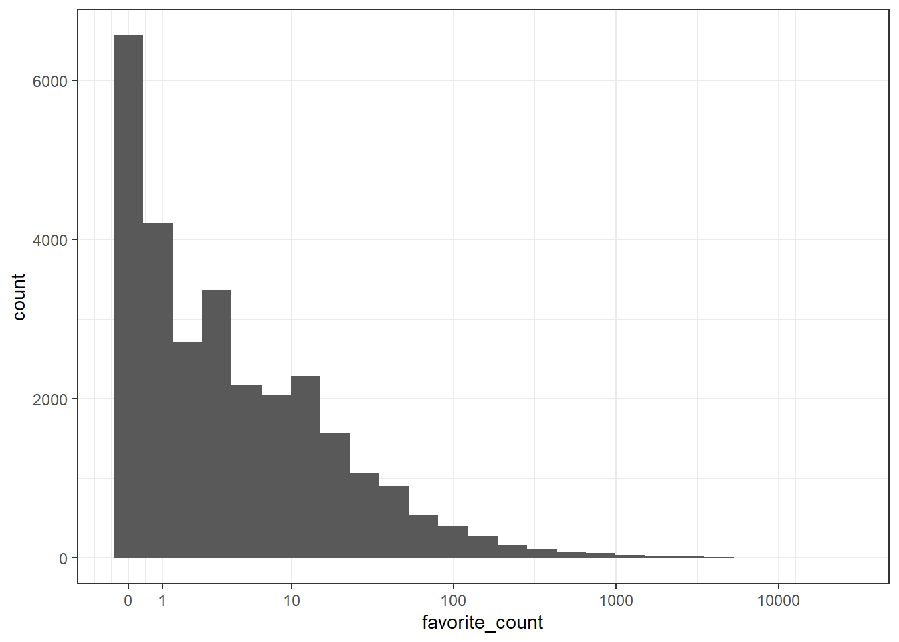

# Data Summaries {#summary}

## Intended Learning Outcomes {#ilo-summary}

* Be able to summarise data by groups
* Be able to produce well-formatted tables

In this chapter we'll use the following packages:


```r
library(tidyverse)   # data wrangling functions
library(rtweet) # for searching tweets
library(kableExtra)  # for nice tables
```

## Set-up

First, create a new project for the work we'll do in this chapter named <code class='path'>05-summary</code>. Second, download the data for this chapter (<a href="data/ncod_tweets.rds" download>ncod_tweets.rds</a>) and save it in your project data folder. Finally, open and save and new R Markdown document named `summary.Rmd`, delete the welcome text and load the required packages for this chapter.

## Social media data

In this chapter we're going to analyse social media data, specifically data from Twitter. There are two broad types of data you can obtain from Twitter; data scraped from Twitter using purpose-built packages such as <code class='package'>rtweet</code>, and data provided via [Twitter Analytics](https://analytics.twitter.com/) for any accounts for which you have access. 

For this chapter, we'll use data scraped from Twitter using <code class='package'>rtweet</code>. In order to use these functions, you need to have a Twitter account. Don't worry if you don't have one; we'll provide the data in the examples below for you.

<code class='package'>rtweet</code> has a lot of flexibility, for example, you can search for tweets that contain a certain hashtag or word, tweets by a specific user, or tweets that meet certain conditions like location or whether the user is verified. 

For the dataset for this chapter, we used the `search_tweets()` function  to find the last 30K tweets with the hashtag [#NationalComingOutDay](https://en.wikipedia.org/wiki/National_Coming_Out_Day). This is mainly interesting around October 11th (the date of National Coming Out Day), so we've provided the relevant data for you that we scraped at that time. 

If you have a Twitter account, you can complete this chapter using your own data and any hashtag that interests you. When you run the `search_tweets()` function, you will be asked to sign in to your Twitter account.


```r
tweets <- search_tweets(q = "#NationalComingOutDay", 
                        n = 30000, 
                        include_rts = FALSE)
```

### R objects

If you're working with live social media data, every time you run a query it's highly likely you will get a different set of data as new tweets are added. Additionally, the Twitter API places limits on how much data you can download and searches are limited to data from the last 6-9 days. Consequently, it can be useful to save the results of your initial search. `saveRDS` is a useful function that allows you to save any object in your environment to disk.


```r
saveRDS(tweets, file = "data/ncod_tweets.rds")
```

After you run `search_tweets()` and save the results, set that code chunk to `eval = FALSE` or comment out that code so your script doesn't run the search and overwrite your saved data every time you knit it.

To load an `.rds` file, you can use the `readRDS()` function. If you don't have access to a Twitter account, or to ensure that you get the same output as the rest of this chapter, you can download <a href="data/ncod_tweets.rds" download>ncod_tweets.rds</a> and load it using this function.


```r
tweets <- readRDS("data/ncod_tweets.rds")
```


First, run `glimpse(tweets)` or click on the object in the environment to find out what information is in the downloaded data (it's a lot!). Now let's create a series of summary tables and plots with these data.

## Summarise {#summary-summarise}

The `summarise()` function from the <code class='package'>dplyr</code> package is loaded as part of the tidyverse and creates summary statistics. It creates a new table with columns that summarise the data from a larger table using summary functions. Check the [Data Transformation Cheat Sheet](https://raw.githubusercontent.com/rstudio/cheatsheets/main/data-transformation.pdf) for various summary functions. Some common ones are: `n()`, `min()`, `max()`, `sum()`, `mean()`, and `quantile()`.

::: {.warning data-latex=""}
If you get the answer `NA` from a summary function, that usually means that there are missing values in the columns you were summarising. We'll discuss this more in Chapter\ \@ref(missing-values), but you can ignore missing values for many functions by adding the argument `na.rm = TRUE`.


```r
values <- c(1, 2, 4, 3, NA, 2)
mean(values) # is NA
mean(values, na.rm = TRUE) # removes NAs first
```

```
## [1] NA
## [1] 2.4
```
:::

This function can be used to answer questions like: How many tweets were there? What date range is represented in these data? What are the <a class='glossary' target='_blank' title='A descriptive statistic that measures the average value of a set of numbers.' href='https://psyteachr.github.io/glossary/m#mean'>mean</a> and <a class='glossary' target='_blank' title='The middle number in a distribution where half of the values are larger and half are smaller.' href='https://psyteachr.github.io/glossary/m#median'>median</a> number of favourites per tweet? Let's start with a very simple example to calculate the mean, median, min, and max number of favourites (Twitter's version of a "like"):

* The first argument that `summarise()` takes is the data table you wish to summarise, in this case the object `tweets`.
* `summarise()` will create a new table. The column names of this new table will be the left hand-side arguments, i.e., `mean_favs`, `median_favs`, `min_favs` and `max_favs`. 
* The values of these columns are the result of the summary operation on the right hand-side.


```r
favourite_summary <- summarise(tweets,
                           mean_favs = mean(favorite_count),
                           median_favs = median(favorite_count),
                           min_favs = min(favorite_count),
                           max_favs = max(favorite_count))
```

<table>
 <thead>
  <tr>
   <th style="text-align:center;"> mean_favs </th>
   <th style="text-align:center;"> median_favs </th>
   <th style="text-align:center;"> min_favs </th>
   <th style="text-align:center;"> max_favs </th>
  </tr>
 </thead>
<tbody>
  <tr>
   <td style="text-align:center;"> 29.71732 </td>
   <td style="text-align:center;"> 3 </td>
   <td style="text-align:center;"> 0 </td>
   <td style="text-align:center;"> 22935 </td>
  </tr>
</tbody>
</table>

The mean number of favourites is substantially higher than the median and the range is huge, suggesting there are ` r glossary("outlier", "outliers")`. A quick histogram confirms this - most tweets have few favourites but there are a few  with a lot of likes  that skew the mean.


```r
ggplot(tweets, aes(x = favorite_count)) +
  geom_histogram(bins = 25) +
  scale_x_continuous(trans = "pseudo_log", 
                     breaks = c(0, 1, 10, 100, 1000, 10000))
```



::: {.info data-latex=""}
Plotting the logarithm of a very skewed value can often give you a better idea of what's going on. Use `scale_x_continuous(trans = "pseudo_log")` to include zeros on the plot (just "log" converts 0 to negative infinity and removes it from the plot).
:::

You can add multiple operations to a single call to `summarise()` so let's try a few different operations. The `n()` function counts the number of rows in the data. The `created_at` column gives us the date each tweet were created, so we can use the `min()` and `max()` functions to get the range of dates. 


```r
tweet_summary <- tweets %>%
  summarise(mean_favs = mean(favorite_count),
            median_favs = quantile(favorite_count, .5),
            n = n(),
            min_date = min(created_at),
            max_date = max(created_at))

glimpse(tweet_summary)
```

```
## Rows: 1
## Columns: 5
## $ mean_favs   <dbl> 29.71732
## $ median_favs <dbl> 3
## $ n           <int> 28626
## $ min_date    <dttm> 2021-10-10 00:10:02
## $ max_date    <dttm> 2021-10-12 20:12:27
```

::: {.info data-latex=""}
<a class='glossary' target='_blank' title='Cutoffs dividing the range of a distribution into continuous intervals with equal probabilities.' href='https://psyteachr.github.io/glossary/q#quantile'>Quantiles</a> are like percentiles. Use `quantile(x, .50)` to find the median (the number where 50% of values in `x` are above it and 50% are below it). This can be useful when you need a value like "90% of tweets get *X* favourites or fewer".


```r
quantile(tweets$favorite_count, 0.90)
```

```
## 90% 
##  31
```

:::


::: {.try data-latex=""}
* How would you find the largest number of retweets?
    <div class='webex-radiogroup' id='radio_MSULZFCHWJ'><label><input type="radio" autocomplete="off" name="radio_MSULZFCHWJ" value="x"></input> <span>`tweets %>% max(retweets)`</span></label><label><input type="radio" autocomplete="off" name="radio_MSULZFCHWJ" value="x"></input> <span>`tweets %>% summarise(max_retweets)`</span></label><label><input type="radio" autocomplete="off" name="radio_MSULZFCHWJ" value="answer"></input> <span>`tweets %>% summarise(max_retweets = max(retweets))`</span></label><label><input type="radio" autocomplete="off" name="radio_MSULZFCHWJ" value="x"></input> <span>`tweets %>% summarise(max = retweets)`</span></label></div>

* How would you calculate the mean `display_text_width`? 
    <div class='webex-radiogroup' id='radio_QPSOBJTPRI'><label><input type="radio" autocomplete="off" name="radio_QPSOBJTPRI" value="answer"></input> <span>`summarise(width = mean(display_text_width))`</span></label><label><input type="radio" autocomplete="off" name="radio_QPSOBJTPRI" value="x"></input> <span>`width(mean(display_text_width))`</span></label><label><input type="radio" autocomplete="off" name="radio_QPSOBJTPRI" value="x"></input> <span>`group_by(display_text_width)`</span></label><label><input type="radio" autocomplete="off" name="radio_QPSOBJTPRI" value="x"></input> <span>`summarise(display_text_width = mean)`</span></label></div>

:::

### The $ operator

We need to take a couple of brief detours to introduce some additional coding conventions. First, let's clear up what that `$` notation is doing. The dollar sign allows you to select items from an object, such as columns from a table. The left-hand side is the object, and the right-hand side is the item. When you call a column like this, R will print all the observations in that column. 


```r
tweet_summary$mean_favs
```

```
## [1] 29.71732
```

If your item has multiple observations, you can specify which ones to return using square brackets `[]` and the row number or a <a class='glossary' target='_blank' title='A type of data structure that collects values with the same data type, like T/F values, numbers, or strings.' href='https://psyteachr.github.io/glossary/v#vector'>vector</a> of row numbers.


```r
tweets$source[1] # select one observation
tweets$display_text_width[c(20,30,40)] # select multiple with c()
```

```
## [1] "Twitter for Android"
## [1]  78 287 107
```

### Pipes {#pipes-first}

For our second detour, let's formally introduce the <a class='glossary' target='_blank' title='A way to order your code in a more readable format using the symbol %>%' href='https://psyteachr.github.io/glossary/p#pipe'>pipe</a>, that weird `%>%` symbol we've used occasionally. Pipes allow you to send the output from one function straight into another function. Specifically, they send the result of the function before `%>%` to be the first argument of the function after `%>%`. It can be useful to translate the pipe as "**and then**". It's easier to show than tell, so let's look at an example.

We could write the above code using a pipe as follows:


```r
tweet_summary <- tweets %>% # start with the object tweets and then
  summarise(mean_favs = mean(favorite_count), #summarise it
            median_favs = median(favorite_count))
```

Notice that `summarise()` no longer needs the first argument to be the data table, it is pulled in from the pipe. The power of the pipe may not be obvious now, but it will soon prove its worth. 

### Inline coding

To insert those values into the text of a report you can use inline coding. First. we'll create another set of objects that contain the first and last date of the tweets in our dataset. `format()` formats the dates to day/month/year.


```r
date_from <- tweet_summary$min_date %>% 
  format("%d %B, %Y")
date_to <- tweet_summary$max_date %>% 
  format("%d %B, %Y")
```

Then you can insert values from these objects and the tables you created with `summarise()` using inline R (note the dollar sign notation to get the value of the `n` column from the table `tweet_summary`). 


```md
There were `r tweet_summary$n` tweets between `r date_from` and `r date_to`.
```

Knit your Markdown to see how the variables inside the inline code get replaced by their values. 

> There were 28626 tweets between 10 October, 2021 and 12 October, 2021.

Ok, let's get back on track.

## Counting

How many different accounts tweeted using the hashtag? Who tweeted most?

You can count categorical data with the `count()` function. Since each row is a tweet, you can count the number of rows per each different `screen_name` to get the number of tweets per user. This will give you a new table with each combination of the counted columns and a column called `n` containing the number of observations from that group. 

The argument `sort = TRUE` will sort the table by `n` in descending order, whilst `head()` returns the first six lines of a data table and is a useful function to call when you have a very large dataset and just want to see the top values.


```r
tweets_per_user <- tweets %>%
  count(screen_name, sort = TRUE)

head(tweets_per_user)
```

<div class="kable-table">

<table>
 <thead>
  <tr>
   <th style="text-align:left;"> screen_name </th>
   <th style="text-align:right;"> n </th>
  </tr>
 </thead>
<tbody>
  <tr>
   <td style="text-align:left;"> interest_outfit </td>
   <td style="text-align:right;"> 35 </td>
  </tr>
  <tr>
   <td style="text-align:left;"> LeoShir2 </td>
   <td style="text-align:right;"> 33 </td>
  </tr>
  <tr>
   <td style="text-align:left;"> dr_stack </td>
   <td style="text-align:right;"> 32 </td>
  </tr>
  <tr>
   <td style="text-align:left;"> NRArchway </td>
   <td style="text-align:right;"> 32 </td>
  </tr>
  <tr>
   <td style="text-align:left;"> bhavna_95 </td>
   <td style="text-align:right;"> 25 </td>
  </tr>
  <tr>
   <td style="text-align:left;"> WipeHomophobia </td>
   <td style="text-align:right;"> 23 </td>
  </tr>
</tbody>
</table>

</div>


::: {.try data-latex=""}
How would you create the table of counts below? 

<div class="kable-table">

<table>
 <thead>
  <tr>
   <th style="text-align:left;"> is_quote </th>
   <th style="text-align:left;"> is_retweet </th>
   <th style="text-align:right;"> n </th>
  </tr>
 </thead>
<tbody>
  <tr>
   <td style="text-align:left;"> FALSE </td>
   <td style="text-align:left;"> FALSE </td>
   <td style="text-align:right;"> 26301 </td>
  </tr>
  <tr>
   <td style="text-align:left;"> TRUE </td>
   <td style="text-align:left;"> FALSE </td>
   <td style="text-align:right;"> 2325 </td>
  </tr>
</tbody>
</table>

</div>

<div class='webex-radiogroup' id='radio_FXHCUIIPPN'><label><input type="radio" autocomplete="off" name="radio_FXHCUIIPPN" value="answer"></input> <span>`tweets %>% count(is_quote, is_retweet)`</span></label><label><input type="radio" autocomplete="off" name="radio_FXHCUIIPPN" value="x"></input> <span>`tweets %>% count(is_quote) %>% count(is_retweet)`</span></label><label><input type="radio" autocomplete="off" name="radio_FXHCUIIPPN" value="x"></input> <span>`tweets %>% count(c(is_quote, is_retweet))`</span></label><label><input type="radio" autocomplete="off" name="radio_FXHCUIIPPN" value="x"></input> <span>`tweets %>% select(is_quote, is_retweet) %>% count()`</span></label></div>

:::

### Inline coding 2

Let's do another example of inline coding that writes up a summary of the most prolific tweeters to demonstrate a few additional functions. First, we need to create some additional objects to use with inline R:

* `nrow()` simply counts the number of rows in a dataset so if you have one user/participant/customer per row, this is an easy way to do a head count.
* `slice()` chooses a particular row of data, in this case the first row. Because we sorted our data, this will therefore be the user with the most tweets.
* `pull()` pulls out a single variable. 
* The combination of `slice()` and `pull()` allows you to choose a single observation from a single variable.


```r
unique_users <- nrow(tweets_per_user)
most_prolific <- slice(tweets_per_user, 1) %>% 
  pull(screen_name)
most_prolific_n <- slice(tweets_per_user, 1) %>% 
  pull(n)
```

Then add the inline code to your report...


```md
There were `r unique_users` unique accounts tweeting about #NationalComingOutDay. `r most_prolific` was the most prolific tweeter, with `r most_prolific_n` tweets.
```

...and knit your Markdown to see the output:

There were 25189 unique accounts tweeting about #NationalComingOutDay. interest_outfit was the most prolific tweeter, with 35 tweets.

## Grouping

You can also create summary values by group. The combination of `group_by()` and `summarise()` is incredibly powerful, and it is also a good demonstration of why pipes are so useful.

The function `group_by()` takes an existing data table and converts it into a grouped table, where any operations that are performed on it are done "by group".

The first line of code creates an object named `tweets_grouped`, that groups the dataset according to whether the user is a verified user. On the surface, `tweets_grouped` doesn't look any different to the original `tweets`. However, the underlying structure has changed and so when we run `summarise()`, we now get our requested summaries for each group (in this case verified or not). 


```r
tweets_grouped <- tweets %>%
  group_by(verified)

verified <- tweets_grouped %>%
  summarise(count = n(),
            mean_favs = mean(favorite_count),
            mean_retweets = mean(retweet_count)) %>%
  ungroup()

verified
```

<div class="kable-table">

<table>
 <thead>
  <tr>
   <th style="text-align:left;"> verified </th>
   <th style="text-align:right;"> count </th>
   <th style="text-align:right;"> mean_favs </th>
   <th style="text-align:right;"> mean_retweets </th>
  </tr>
 </thead>
<tbody>
  <tr>
   <td style="text-align:left;"> FALSE </td>
   <td style="text-align:right;"> 26676 </td>
   <td style="text-align:right;"> 18.40576 </td>
   <td style="text-align:right;"> 1.825649 </td>
  </tr>
  <tr>
   <td style="text-align:left;"> TRUE </td>
   <td style="text-align:right;"> 1950 </td>
   <td style="text-align:right;"> 184.45949 </td>
   <td style="text-align:right;"> 21.511282 </td>
  </tr>
</tbody>
</table>

</div>

::: {.warning data-latex=""}
Make sure you call the `ungroup()` function when you are done with grouped functions. Failing to do this can cause all sorts of mysterious problems if you use that data table later assuming it isn't grouped.
:::

Whilst the above code is functional, it adds an unnecessary object to the environment - `tweets_grouped` is taking up space and increases the risk we'll use this grouped object by mistake. Enter... the pipe.

Rather than creating an intermediate object, we can use the pipe to string our code together.


```r
verified <- 
  tweets_grouped %>% # Start with the original dataset; and then
  group_by(verified) %>% # group it; and then
  summarise(count = n(), # summarise it by those groups
            mean_favs = mean(favorite_count),
            mean_retweets = mean(retweet_count)) %>%
  ungroup()
```


::: {.try data-latex=""}
* What would you change to calculate the mean favourites and retweets by `screen_name` instead of by `verified`? 
    <div class='webex-radiogroup' id='radio_BCWPLSUQPL'><label><input type="radio" autocomplete="off" name="radio_BCWPLSUQPL" value="answer"></input> <span>`group_by(screen_name)`</span></label><label><input type="radio" autocomplete="off" name="radio_BCWPLSUQPL" value="x"></input> <span>`summarise(screen_name)`</span></label><label><input type="radio" autocomplete="off" name="radio_BCWPLSUQPL" value="x"></input> <span>`count(screen_name)`</span></label><label><input type="radio" autocomplete="off" name="radio_BCWPLSUQPL" value="x"></input> <span>`mean(screen_name)`</span></label></div>

:::

### Multiple groupings

You can add multiple variables to `group_by()` to further break down your data. For example, the below gives us the number of likes and retweets broken down by verified status and the device the person was tweeting from (`source`). 

* Reverse the order of `verified` and `source` in `group_by()` to see how it changed the output.


```r
verified_source <- tweets %>%
  group_by(verified, source) %>%
  summarise(count = n(),
            mean_favs = mean(favorite_count),
            mean_retweets = mean(retweet_count)) %>%
  ungroup() %>%
  arrange(desc(count))

head(verified_source)
```

<div class="kable-table">

<table>
 <thead>
  <tr>
   <th style="text-align:left;"> verified </th>
   <th style="text-align:left;"> source </th>
   <th style="text-align:right;"> count </th>
   <th style="text-align:right;"> mean_favs </th>
   <th style="text-align:right;"> mean_retweets </th>
  </tr>
 </thead>
<tbody>
  <tr>
   <td style="text-align:left;"> FALSE </td>
   <td style="text-align:left;"> Twitter for iPhone </td>
   <td style="text-align:right;"> 12943 </td>
   <td style="text-align:right;"> 25.40493 </td>
   <td style="text-align:right;"> 2.304643 </td>
  </tr>
  <tr>
   <td style="text-align:left;"> FALSE </td>
   <td style="text-align:left;"> Twitter for Android </td>
   <td style="text-align:right;"> 5807 </td>
   <td style="text-align:right;"> 11.90839 </td>
   <td style="text-align:right;"> 1.155846 </td>
  </tr>
  <tr>
   <td style="text-align:left;"> FALSE </td>
   <td style="text-align:left;"> Twitter Web App </td>
   <td style="text-align:right;"> 5795 </td>
   <td style="text-align:right;"> 13.54737 </td>
   <td style="text-align:right;"> 1.611217 </td>
  </tr>
  <tr>
   <td style="text-align:left;"> TRUE </td>
   <td style="text-align:left;"> Twitter for iPhone </td>
   <td style="text-align:right;"> 691 </td>
   <td style="text-align:right;"> 323.24457 </td>
   <td style="text-align:right;"> 29.010130 </td>
  </tr>
  <tr>
   <td style="text-align:left;"> TRUE </td>
   <td style="text-align:left;"> Twitter Web App </td>
   <td style="text-align:right;"> 560 </td>
   <td style="text-align:right;"> 131.44643 </td>
   <td style="text-align:right;"> 21.717857 </td>
  </tr>
  <tr>
   <td style="text-align:left;"> FALSE </td>
   <td style="text-align:left;"> Twitter for iPad </td>
   <td style="text-align:right;"> 374 </td>
   <td style="text-align:right;"> 13.85027 </td>
   <td style="text-align:right;"> 2.042781 </td>
  </tr>
</tbody>
</table>

</div>

::: {.warning data-latex=""}
You may get the following message when using `summarise()` after `group_by()`.

> `summarise()` has grouped output by 'verified'. You can override using the `.groups` argument.

Tidyverse recently added a message to remind you whether the `summarise()` function automatically ungroups grouped data or not (it may do different things depending on how it's used). You can set the argument `.groups` to "drop", "drop_last", "keep", or "rowwise" (see the help for `?summarise`), but it's good practice to explicitly use `ungroup()` when you're done working by groups, regardless. 
:::

### Filter and mutate

You can also use additional functions like `filter()` or `mutate()` after `group_by`. You'll learn more about these in Chapter \ \@ref(wrangle) but briefly:

* `filter()` keeps observations (rows) according to specified criteria, e.g., all values above 5, or all verified users.
* `mutate()` creates new variables (columns), or overwrites existing ones.

You can combine functions like this to get detailed insights into your data. For example, what were the most favourited original and quoted tweets? 

* The variable `is_quote` tells us whether the tweet in question was an original tweet or a quote tweet. Because we want our output to treat these separately, we pass this variable to `group_by()`. 
* We want the most favourited tweets, i.e., the maximum value of `favourite_count`, so we can use `filter()` to only return rows where `favourite_count` is equal to the maximum value in the variable `favourite_count`. Note the use of `==` rather than a single `=`.
* Just in case there was a tie, choose a random one with `sample_n(size = 1)`.


```r
most_fav <- tweets %>%
  group_by(is_quote) %>%
  filter(favorite_count == max(favorite_count)) %>%
  sample_n(size = 1) %>%
  ungroup()
```


::: {.try data-latex=""}
* How would you limit the results to sources with 10 or more rows?
    <div class='webex-radiogroup' id='radio_HQVENXYSEF'><label><input type="radio" autocomplete="off" name="radio_HQVENXYSEF" value="x"></input> <span>`tweets %>% group_by(source) %>% select(count() >= 10)`</span></label><label><input type="radio" autocomplete="off" name="radio_HQVENXYSEF" value="x"></input> <span>`tweets %>% group_by(source) %>% select(n() >= 10)`</span></label><label><input type="radio" autocomplete="off" name="radio_HQVENXYSEF" value="x"></input> <span>`tweets %>% group_by(source) %>% filter(count() >= 10)`</span></label><label><input type="radio" autocomplete="off" name="radio_HQVENXYSEF" value="answer"></input> <span>`tweets %>% group_by(source) %>% filter(n() >= 10)`</span></label></div>

:::

### Inline coding 3

There's a huge amount of data reported for each tweet, including things like the URLs of the tweets and any media attached to  them. This means we can produce output like the below reproducibly and using inline coding.


The most favourited 22935 original tweet was by [jackrooke](https://twitter.com/jackrooke/status/1447541093260795904):

--------------------------------------------------

> it’s #nationalcomingoutday 🎉 here’s a pic of how I came out back in 2003 xx https://t.co/spBmHhF6p4


------------------------------------------------

To produce this, first we split `most_fav`, so that we have one object that contains the data from the original tweet and one object that contains the data from the quote tweet.


```r
orig <- filter(most_fav,is_quote == FALSE)
quote <- filter(most_fav,is_quote == TRUE)
```

The inline code is then as follows:


```md
The most favourited `r orig$favorite_count` original tweet was by [`r orig$screen_name`](`r orig$status_url`):

--------------------------------------------------
  
> `r orig$text`


--------------------------------------------------
```

This is quite complicated so let's break it down. 

* The first bit of inline coding is fairly standard and is what you have used before.
* The second bit of inline coding inserts a URL. The content of the `[]` is the text that will be displayed. The content of `()` is the underlying URL. In both cases, the content is being pulled from the dataset. In this case, the text is `screen_name` and `status_url` links to the tweet.
* The line of dashes creates the solid line in the knitted output.
* The `>` symbol changes the format to a block quote.
* The image is then included using the format ``, which is an alternative method of including images in Markdown. 


## Exercises

That was an intensive chapter! Take a break and then try one (or more) of the following and post your knitted HTML files on Teams so that other learners on the course can see what you did.

* Work through the further examples in Appendix\ \@ref(twitter-hashtags).
* If you have your own Twitter account, conduct a similar analysis of a different hashtag.
* Look through the rest of the variables in `tweets`; what other insights can you generate about this data?
* Read through the [kableExtra](https://cran.r-project.org/web/packages/kableExtra/vignettes/awesome_table_in_html.html) vignettes and apply your own preferred table style.
* Work through the first few chapters of [Tidy Text](https://www.tidytextmining.com/index.html){target="_blank"} to see how you can work with and analyse text. In particular, see if you can conduct a sentiment analysis on the tweet data.

## Glossary {#glossary-summary}

<table>
 <thead>
  <tr>
   <th style="text-align:left;"> term </th>
   <th style="text-align:left;"> definition </th>
  </tr>
 </thead>
<tbody>
  <tr>
   <td style="text-align:left;"> [mean](https://psyteachr.github.io/glossary/m.html#mean){class="glossary" target="_blank"} </td>
   <td style="text-align:left;"> A descriptive statistic that measures the average value of a set of numbers. </td>
  </tr>
  <tr>
   <td style="text-align:left;"> [median](https://psyteachr.github.io/glossary/m.html#median){class="glossary" target="_blank"} </td>
   <td style="text-align:left;"> The middle number in a distribution where half of the values are larger and half are smaller. </td>
  </tr>
  <tr>
   <td style="text-align:left;"> [pipe](https://psyteachr.github.io/glossary/p.html#pipe){class="glossary" target="_blank"} </td>
   <td style="text-align:left;"> A way to order your code in a more readable format using the symbol %>% </td>
  </tr>
  <tr>
   <td style="text-align:left;"> [quantile](https://psyteachr.github.io/glossary/q.html#quantile){class="glossary" target="_blank"} </td>
   <td style="text-align:left;"> Cutoffs dividing the range of a distribution into continuous intervals with equal probabilities. </td>
  </tr>
  <tr>
   <td style="text-align:left;"> [vector](https://psyteachr.github.io/glossary/v.html#vector){class="glossary" target="_blank"} </td>
   <td style="text-align:left;"> A type of data structure that collects values with the same data type, like T/F values, numbers, or strings. </td>
  </tr>
</tbody>
</table>


## Further resources {#resources-summary}

* [Data transformation cheat sheet](https://raw.githubusercontent.com/rstudio/cheatsheets/main/data-transformation.pdf)
* [Chapter 5: Data Transformation ](http://r4ds.had.co.nz/transform.html) in *R for Data Science*
* [Intro to rtweet](https://docs.ropensci.org/rtweet/articles/rtweet.html)
* [Tidy Text](https://www.tidytextmining.com/index.html)
* [kableExtra vignettes](https://cran.r-project.org/web/packages/kableExtra/vignettes/awesome_table_in_html.html)
