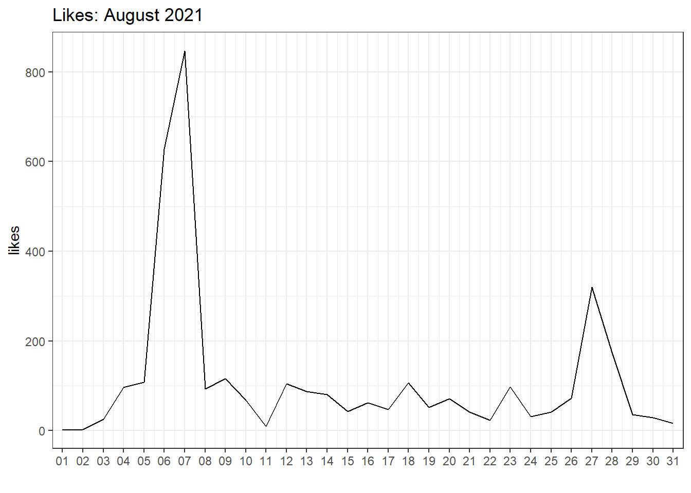
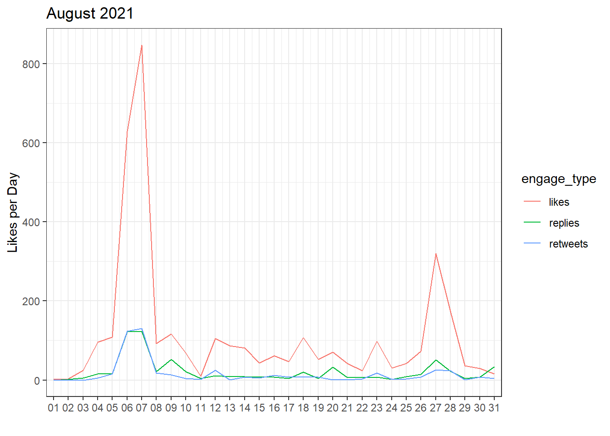
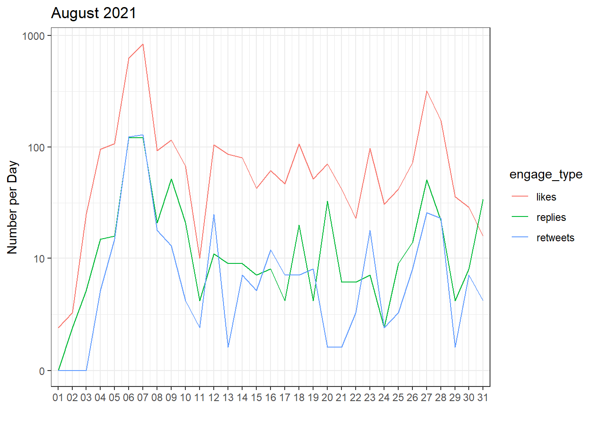
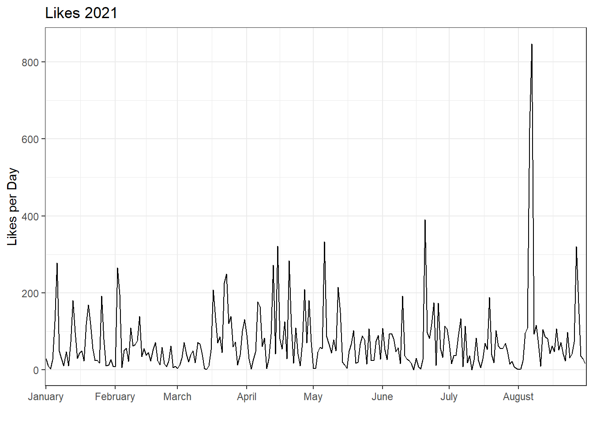
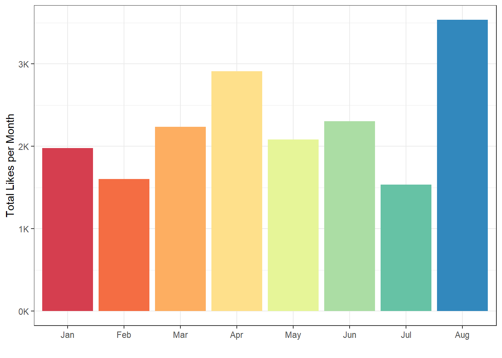
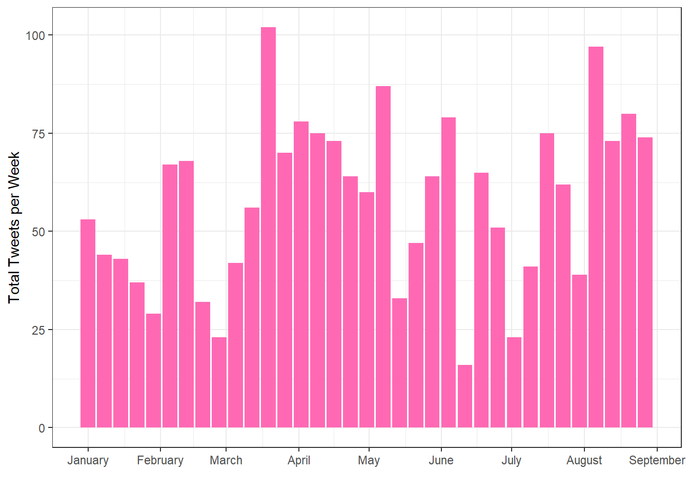
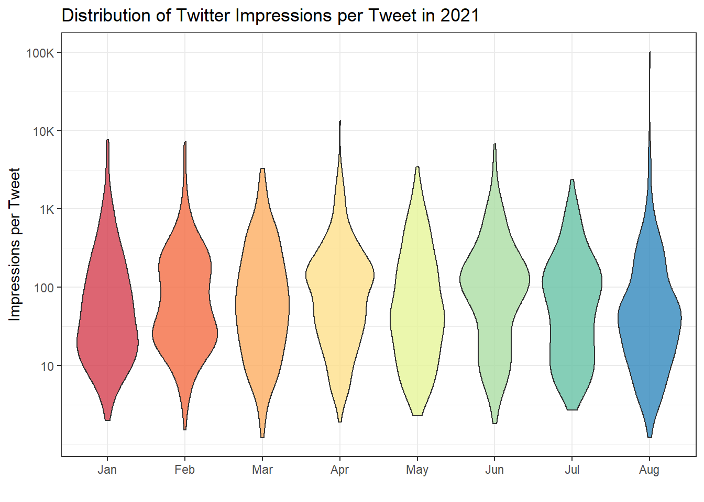

# Data Wrangling {#wrangle}

## Intended Learning Outcomes {#ilo-wrangle}

* Be able to select and filter data for relevance
* Be able to create new columns and edit existing ones


```r
library(tidyverse)   # data wrangling functions
library(lubridate)   # for handling dates and times
```

## Twitter Example

### Export Data

You can export your organisations' twitter data from <https://analytics.twitter.com/>. Go to the Tweets tab, choose a time period, and export the last month's data by day (or use the files from the class data).

### Import Data


```r
file <- "data/tweets/daily_tweet_activity_metrics_LisaDeBruine_20210801_20210901_en.csv"

daily_tweets <- read_csv(file)
```

### Select Relevant Data

The file contains a bunch of columns about "promoted" tweets that will be blank unless your organisation pays for those. Let's get rid of them. We can use the select helper `dplyr::starts_with()` to get all the columns that start with "promoted" and remove them by prefacing the function with `!`. Now there should be 20 columns, which we can inspect with `glimpse()`. 


```r
daily_tweets <- read_csv(file) %>%
  select(!starts_with("promoted")) %>%
  glimpse()
```

```
## Rows: 31
## Columns: 20
## $ Date                  <date> 2021-08-01, 2021-08-02, 2021-08-03, 2021-08-04,…
## $ `Tweets published`    <dbl> 0, 2, 4, 15, 12, 11, 14, 17, 26, 17, 3, 9, 5, 17…
## $ impressions           <dbl> 1088, 1244, 3974, 22394, 23340, 316989, 694114, …
## $ engagements           <dbl> 13, 19, 76, 1290, 2051, 26249, 51494, 5988, 2964…
## $ `engagement rate`     <dbl> 0.01194853, 0.01527331, 0.01912431, 0.05760472, …
## $ retweets              <dbl> 0, 0, 0, 5, 15, 124, 130, 18, 13, 4, 2, 25, 1, 7…
## $ replies               <dbl> 0, 2, 5, 15, 16, 122, 123, 21, 52, 21, 4, 11, 9,…
## $ likes                 <dbl> 2, 3, 25, 96, 108, 628, 847, 93, 116, 68, 10, 10…
## $ `user profile clicks` <dbl> 1, 9, 10, 56, 36, 379, 550, 98, 78, 31, 17, 104,…
## $ `url clicks`          <dbl> 2, 0, 0, 45, 97, 10136, 19467, 1937, 681, 324, 1…
## $ `hashtag clicks`      <dbl> 0, 0, 0, 0, 0, 0, 1, 5, 1, 0, 0, 12, 1, 2, 3, 1,…
## $ `detail expands`      <dbl> 7, 5, 36, 412, 606, 10348, 21021, 2642, 1441, 79…
## $ `permalink clicks`    <dbl> 0, 0, 0, 0, 0, 0, 0, 0, 0, 0, 0, 0, 0, 0, 0, 0, …
## $ `app opens`           <dbl> 0, 0, 0, 0, 0, 0, 0, 0, 0, 0, 0, 0, 0, 0, 0, 0, …
## $ `app installs`        <dbl> 0, 0, 0, 0, 0, 0, 0, 0, 0, 0, 0, 0, 0, 0, 0, 0, …
## $ follows               <dbl> 0, 0, 0, 0, 0, 0, 0, 0, 0, 0, 0, 0, 0, 0, 0, 0, …
## $ `email tweet`         <dbl> 0, 0, 0, 0, 0, 0, 0, 0, 0, 0, 0, 0, 0, 0, 0, 0, …
## $ `dial phone`          <dbl> 0, 0, 0, 0, 0, 0, 0, 0, 0, 0, 0, 0, 0, 0, 0, 0, …
## $ `media views`         <dbl> 2, 2, 25, 710, 1187, 4474, 9356, 1176, 582, 334,…
## $ `media engagements`   <dbl> 1, 0, 0, 661, 1173, 4464, 9353, 1174, 582, 327, …
```

### Plot Likes per Day

Now let's plot likes per day. The `ggplot2::scale_x_date()` function lets you formats an x-axis with dates.


```r
ggplot(daily_tweets, aes(x = Date, y = likes)) +
  geom_line() +
  scale_x_date(name = "", 
               date_breaks = "1 day",
               date_labels = "%d",
               expand = expansion(add = c(.5, .5))) +
  ggtitle("Likes: August 2021")
```

<div class="figure" style="text-align: center">

<p class="caption">(\#fig:likes-per-day-plot)Likes per day.</p>
</div>


### Plot Multiple Engagements

What if we want to plot likes, retweets, and replies on the same plot? We need to get all of the numbers in the same columns so we have a column that contains the "engagement type" that we can use to determine different line colours. When you have data in different columns that you need to get into the same column, it's wide and you need to pivot the data longer.


```r
long_tweets <- daily_tweets %>%
  select(Date, likes, retweets, replies) %>%
  pivot_longer(cols = c(likes, retweets, replies),
               names_to = "engage_type",
               values_to = "n")

head(long_tweets)
```

<div class="kable-table">

<table>
 <thead>
  <tr>
   <th style="text-align:left;"> Date </th>
   <th style="text-align:left;"> engage_type </th>
   <th style="text-align:right;"> n </th>
  </tr>
 </thead>
<tbody>
  <tr>
   <td style="text-align:left;"> 2021-08-01 </td>
   <td style="text-align:left;"> likes </td>
   <td style="text-align:right;"> 2 </td>
  </tr>
  <tr>
   <td style="text-align:left;"> 2021-08-01 </td>
   <td style="text-align:left;"> retweets </td>
   <td style="text-align:right;"> 0 </td>
  </tr>
  <tr>
   <td style="text-align:left;"> 2021-08-01 </td>
   <td style="text-align:left;"> replies </td>
   <td style="text-align:right;"> 0 </td>
  </tr>
  <tr>
   <td style="text-align:left;"> 2021-08-02 </td>
   <td style="text-align:left;"> likes </td>
   <td style="text-align:right;"> 3 </td>
  </tr>
  <tr>
   <td style="text-align:left;"> 2021-08-02 </td>
   <td style="text-align:left;"> retweets </td>
   <td style="text-align:right;"> 0 </td>
  </tr>
  <tr>
   <td style="text-align:left;"> 2021-08-02 </td>
   <td style="text-align:left;"> replies </td>
   <td style="text-align:right;"> 2 </td>
  </tr>
</tbody>
</table>

</div>

Now we can plot the number of engagements per day by engagement type by making the line colour determined by the value of the `engage_type` column. 


```r
ggplot(long_tweets, aes(x = Date, y = n, colour = engage_type)) +
  geom_line() +
  scale_y_continuous(name = "Likes per Day") + 
  scale_x_date(name = "", 
               date_breaks = "1 day",
               date_labels = "%d",
               expand = expansion(add = c(.5, .5))) +
  ggtitle("August 2021")
```

<div class="figure" style="text-align: center">

<p class="caption">(\#fig:eng-per-day-plot)Engagements per day by engagement type.</p>
</div>

When you have data on very different scales, such as likes, which are much higher than replies and retweets, it can sometimes help to change the y-axis to a log scale. `ggplot2::scale_y_continuous()` lets you transform the axis with the `trans` argument.


```r
ggplot(long_tweets, aes(x = Date, y = n, colour = engage_type)) +
  geom_line() +
  scale_x_date(name = "", 
               date_breaks = "1 day",
               date_labels = "%d",
               expand = expansion(add = c(.5, .5))) +
  scale_y_continuous(name = "Number per Day",
                     breaks = c(0, 10, 100, 1000),
                     trans = "pseudo_log") +
  ggtitle("August 2021")
```

<div class="figure" style="text-align: center">

<p class="caption">(\#fig:log-eng-plot)Engagements per day with a log-transformed y-axis.</p>
</div>


### Multiple Data Files

Maybe now you want to compare the data from several months. First, get a list of all the files you want to combine. It's easiest if they're all in the same directory, although you can use a pattern to select the files you want if they have a systematic naming structure.


```r
files <- list.files(
  path = "data/tweets", 
  pattern = "daily_tweet_activity_metrics_LisaDeBruine",
  full.names = TRUE
)
```

Then use `purrr::map_df()` to map over the list of file paths, open them with `read_csv()`, and return a big data frame with all the combined data. Then we can pipe that to the `select()` function to get rid of the "promoted" columns.


```r
all_daily_tweets <- purrr::map_df(files, read_csv) %>%
  select(!starts_with("promoted"))
```

Now you can make a plot of likes per day for all of the months.


```r
ggplot(all_daily_tweets, aes(x = Date, y = likes)) +
  geom_line() +
  scale_y_continuous(name = "Likes per Day") + 
  scale_x_date(name = "", 
               date_breaks = "1 month",
               date_labels = "%B",
               expand = expansion(add = c(.5, .5))) +
  ggtitle("Likes 2021")
```




::: {.info data-latex=""}
Notice that we changed the date breaks and labels for the x-axis. `%B` is the date code for the full month name. See `?strptime` for all of the date codes.
:::


### Likes by Month

If you want to plot likes by month, first you need a column for the month. Use `mutate()` to make a new column, using `lubridate::month()` to extract the month name from the `Date` column. 

Then group by the new `month` column and calculate the sum of `likes`. The `group_by()` function causes all of the subsequent functions to operate inside of groups, until you call `ungroup()`. In the example below, the `sum(likes)` function calculates the sum total of the `likes` column separately for each month.


```r
likes_by_month <- all_daily_tweets %>%
  mutate(month = month(Date, label = TRUE)) %>%
  group_by(month) %>%
  summarise(total_likes = sum(likes)) %>%
  ungroup()

likes_by_month
```

<div class="kable-table">

<table>
 <thead>
  <tr>
   <th style="text-align:left;"> month </th>
   <th style="text-align:right;"> total_likes </th>
  </tr>
 </thead>
<tbody>
  <tr>
   <td style="text-align:left;"> Jan </td>
   <td style="text-align:right;"> 1981 </td>
  </tr>
  <tr>
   <td style="text-align:left;"> Feb </td>
   <td style="text-align:right;"> 1603 </td>
  </tr>
  <tr>
   <td style="text-align:left;"> Mar </td>
   <td style="text-align:right;"> 2238 </td>
  </tr>
  <tr>
   <td style="text-align:left;"> Apr </td>
   <td style="text-align:right;"> 2912 </td>
  </tr>
  <tr>
   <td style="text-align:left;"> May </td>
   <td style="text-align:right;"> 2083 </td>
  </tr>
  <tr>
   <td style="text-align:left;"> Jun </td>
   <td style="text-align:right;"> 2303 </td>
  </tr>
  <tr>
   <td style="text-align:left;"> Jul </td>
   <td style="text-align:right;"> 1534 </td>
  </tr>
  <tr>
   <td style="text-align:left;"> Aug </td>
   <td style="text-align:right;"> 3535 </td>
  </tr>
</tbody>
</table>

</div>

::: {.warning data-latex=""}
Make sure you call the `ungroup()` function when you are done with grouped functions. Failing to do this can cause all sorts of mysterious problems if you use that data table later assuming it isn't grouped.
:::

A column plot might make more sense than a line plot for this summary.


```r
ggplot(likes_by_month, aes(x = month, y = total_likes, fill = month)) +
  geom_col(show.legend = FALSE) +
  scale_fill_brewer(palette = "Spectral") +
  scale_y_continuous(name = "Total Likes per Month",
                     breaks = seq(0, 10000, 1000),
                     labels = paste0(0:10, "K")) +
  scale_x_discrete(name = "")
```

<div class="figure" style="text-align: center">

<p class="caption">(\#fig:likes-by-month-plot)Likes by month.</p>
</div>


::: {.try data-latex=""}
How would you change the code in this section to plot the number of tweets published per week? 

Hint: if the <code class='package'>lubridate</code> function for the month is `month()`, what is the function for getting the week likely to be?


<div class='webex-solution'><button>Summarise Data</button>

```r
tweets_by_week <- all_daily_tweets %>%
  mutate(week = week(Date)) %>%
  group_by(week) %>%
  summarise(start_date = min(Date),
            total_tweets = sum(`Tweets published`)) %>%
  ungroup()
```


</div>


<div class='webex-solution'><button>Plot Data</button>

```r
ggplot(tweets_by_week, aes(x = start_date, y = total_tweets)) +
  geom_col(fill = "hotpink") +
  scale_fill_brewer(palette = "Spectral") +
  scale_y_continuous(name = "Total Tweets per Week") +
  scale_x_date(name = "",
               date_breaks = "1 month", 
               date_labels = "%B")
```


</div>

:::


### Data by Tweet

You can also download your twitter data by tweet instead of by day. This usually takes a little longer to download. We can use the same pattern to read and combine all of the tweet data files.

The `^` at the start of the pattern means that the file name has to start with this. This means it won't match the "daily_tweet..." files.


```r
tweet_files <- list.files(
  path = "data/tweets", 
  pattern = "^tweet_activity_metrics_LisaDeBruine",
  full.names = TRUE
)
```

First, let's open only the first file and see if we need to do anything to it.


```r
tweets <- read_csv(tweet_files[1])
```

If you look at the file in the Viewer, you can set that the `Tweet id` column is using scientific notation (`1.355500e+18`) instead of the full 18-digit tweet ID. We won't ever want to *add* ID numbers, so it's safe to represent these as characters. Now we can set up the map over all the files, then get rid of all the promoted columns and add a `month` column (reading the date from the `time` column in these data).


```r
ct <- cols("Tweet id" = col_character())
all_tweets <- purrr::map_df(tweet_files, read_csv, col_types = ct, ) %>%
  select(!starts_with("promoted")) %>%
  mutate(month = lubridate::month(time, label = TRUE))
```

Now we can look at the distribution of impressions per tweet for each month.


```r
ggplot(all_tweets, aes(x = month, y = impressions, fill = month)) +
  geom_violin(show.legend = FALSE, alpha = 0.8) +
  scale_fill_brewer(palette = "Spectral") +
  scale_x_discrete(name = "") +
  scale_y_continuous(name = "Impressions per Tweet",
                     breaks = c(0, 10^(2:7)),
                     labels = c(0, 10, 100, "1K", "10K", "100K", "1M"),
                     trans = "pseudo_log") +
  ggtitle("Distribution of Twitter Impressions per Tweet in 2021")
```

<div class="figure" style="text-align: center">

<p class="caption">(\#fig:imp-month-plot)Impressions per tweet per month.</p>
</div>

You can display Lisa's top tweet for the year.


```r
top_tweet <- all_tweets %>%
  slice_max(order_by = likes, n = 1)

glue::glue("[Top tweet]({top_tweet$`Tweet permalink`}) with {top_tweet$likes} likes:

---------------------------
{top_tweet$`Tweet text`}
---------------------------
") %>% cat()
```

[Top tweet](https://twitter.com/LisaDeBruine/status/1423445172092866563) with 1190 likes:

---------------------------
Oh, this was fun! You think of the ten least-related nouns possible. I scored in the 94th percentile. 

https://t.co/FhR4DR38OU
---------------------------

Or you can make a word cloud of the top words they tweet about. (You'll learn how to do this in Chapter\ \@ref(custom)).


