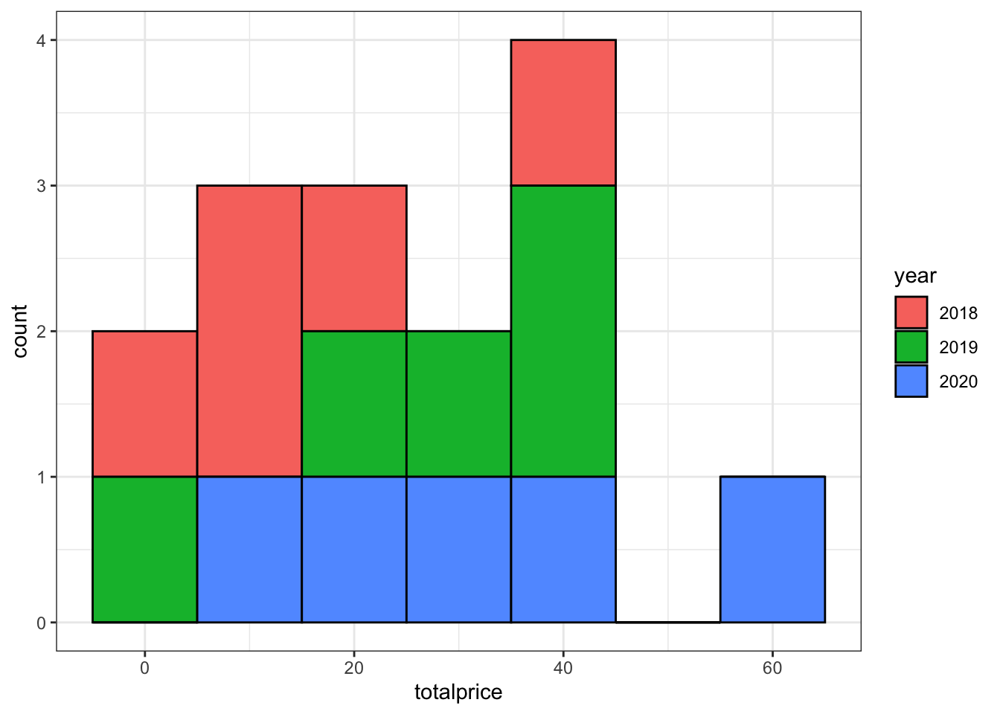
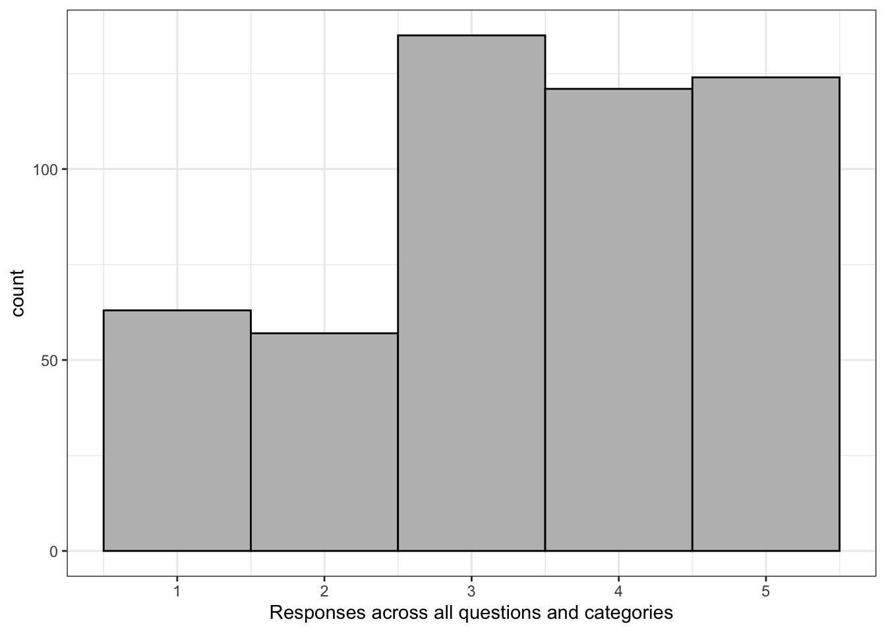

# Data Tidying {#tidy}


## Intended Learning Outcomes {#ilo-tidy}

-   Be able to reshape data between long and wide formats
-   Separate, change, reorder, and rename columns
-   Use pipes to chain together functions

## Set-up

First, create a new project for the work we'll do in this chapter named <code class='path'>07-tidy</code>. Second, open and save and new R Markdown document named `tidy.Rmd`, delete the welcome text and load the required packages for this chapter.

<div class='verbatim'><pre class='sourceCode r'><code class='sourceCode R'>&#96;&#96;&#96;{r setup, include=FALSE}</code></pre>

```r
library(tidyverse) # for data wrangling
```

<pre class='sourceCode r'><code class='sourceCode R'>&#96;&#96;&#96;</code></pre></div>

You'll need to make a folder called "data" and download two data files into it: 
<a href="https://psyteachr.github.io/ads-v1/data/tidy_data.csv" download>tidy_data.csv</a> and
<a href="https://psyteachr.github.io/ads-v1/data/untidy_data.csv" download>untidy_data.csv</a>.

Download the [Data tidying cheat sheet](https://raw.githubusercontent.com/rstudio/cheatsheets/main/tidyr.pdf).

## Data Structures

The data you work with will likely come in many different formats and structures. Some of these structures may be driven by how the software you use outputs the data, but data structures may also differ because of human intervention or attempts at organisation, some of which may not be particularly helpful.

Data cleaning and tidying will likely be the most time consuming and difficult task you perform. Whilst you can create code recipes for analyses and visualisations, as Hadley Whickham puts it, ["every messy dataset is messy in its own way"](https://vita.had.co.nz/papers/tidy-data.pdf), which means that you will often have to solve new problems that are specific to the dataset. Additionally, moving between data structures that are intuitive to read by humans and those that are useful for a computer requires a conceptual shift that only comes with practice. 

This is all a verbose way of saying that what lies ahead in this chapter is unlikely to sink in on the first attempt and you will need to practice with different examples (preferably with data you know well) before you truly feel comfortable with it.

First, some terminology.

An <a class='glossary' target='_blank' title='All of the data about a single trial or question.' href='https://psyteachr.github.io/glossary/o#observation'>observation</a> is all the information about a single "thing" in a single condition, such as at one point in time. These things can be customers, sales, orders, feedback questionnaires, tweets, or really anything. Observations should have a way to identify them, such as a unique ID or a unique combination of values like country and year.

A <a class='glossary' target='_blank' title='A word that identifies and stores the value of some data for later use.' href='https://psyteachr.github.io/glossary/v#variable'>variable</a> is one type of information about the observation. For example, if the observation is a sale, the variables you might have about the sale are the sale ID, the customer's ID, the date of the sale, the price paid, and method of payment.

A <a class='glossary' target='_blank' title='A single number or piece of data.' href='https://psyteachr.github.io/glossary/v#value'>value</a> is the data for one variable for one observation. For example, the value of the date variable from the observation of a sale might be `2021-08-20`.

::: {.try data-latex=""}
The following table is data that shows the number of items each customer bought each year.

<div class="kable-table">

<table>
 <thead>
  <tr>
   <th style="text-align:right;"> customer_id </th>
   <th style="text-align:right;"> year </th>
   <th style="text-align:right;"> items </th>
  </tr>
 </thead>
<tbody>
  <tr>
   <td style="text-align:right;"> 1 </td>
   <td style="text-align:right;"> 2018 </td>
   <td style="text-align:right;"> 2 </td>
  </tr>
  <tr>
   <td style="text-align:right;"> 1 </td>
   <td style="text-align:right;"> 2019 </td>
   <td style="text-align:right;"> 8 </td>
  </tr>
  <tr>
   <td style="text-align:right;"> 1 </td>
   <td style="text-align:right;"> 2020 </td>
   <td style="text-align:right;"> 10 </td>
  </tr>
  <tr>
   <td style="text-align:right;"> 2 </td>
   <td style="text-align:right;"> 2018 </td>
   <td style="text-align:right;"> 1 </td>
  </tr>
  <tr>
   <td style="text-align:right;"> 2 </td>
   <td style="text-align:right;"> 2019 </td>
   <td style="text-align:right;"> 6 </td>
  </tr>
  <tr>
   <td style="text-align:right;"> 2 </td>
   <td style="text-align:right;"> 2020 </td>
   <td style="text-align:right;"> 1 </td>
  </tr>
</tbody>
</table>

</div>


-   What is `items`? <select class='webex-select'><option value='blank'></option><option value='x'>Observation</option><option value='answer'>Variable</option><option value='x'>Value</option></select>
-   How many observations are there in this dataset? <input class='webex-solveme nospaces' size='1' data-answer='["6"]'/>
-   What is `8`? <select class='webex-select'><option value='blank'></option><option value='x'>Observation</option><option value='x'>Variable</option><option value='answer'>Value</option></select>


<div class='webex-solution'><button>Explain these answers</button>


-   There are three variables, `customer_id`, `year`, and `items`.
-   There are six observations, one for each of two customers for each of three years.
-   `8` is a value because it is a single data point for one variable for one observation. 


</div>

:::

### Untidy data

First, let's have a look at an example of a messy, or untidy, dataset. Each row has all of the data relating to one customer.


```r
untidy_data <- read_csv("data/untidy_data.csv", show_col_types = FALSE)
```

<table>
<caption>(\#tab:unnamed-chunk-3)Untidy table</caption>
 <thead>
  <tr>
   <th style="text-align:right;"> customer_id </th>
   <th style="text-align:left;"> itemsprice_2018 </th>
   <th style="text-align:left;"> itemsprice_2019 </th>
   <th style="text-align:left;"> itemsprice_2020 </th>
   <th style="text-align:right;"> totalprice_2018 </th>
   <th style="text-align:right;"> totalprice_2019 </th>
   <th style="text-align:right;"> totalprice_2020 </th>
  </tr>
 </thead>
<tbody>
  <tr>
   <td style="text-align:right;"> 1 </td>
   <td style="text-align:left;"> 2 (3.91) </td>
   <td style="text-align:left;"> 8 (4.72) </td>
   <td style="text-align:left;"> 10 (5.59) </td>
   <td style="text-align:right;"> 7.82 </td>
   <td style="text-align:right;"> 37.76 </td>
   <td style="text-align:right;"> 55.90 </td>
  </tr>
  <tr>
   <td style="text-align:right;"> 2 </td>
   <td style="text-align:left;"> 1 (3.91) </td>
   <td style="text-align:left;"> 6 (4.72) </td>
   <td style="text-align:left;"> 1 (5.59) </td>
   <td style="text-align:right;"> 3.91 </td>
   <td style="text-align:right;"> 28.32 </td>
   <td style="text-align:right;"> 5.59 </td>
  </tr>
  <tr>
   <td style="text-align:right;"> 3 </td>
   <td style="text-align:left;"> 4 (3.91) </td>
   <td style="text-align:left;"> 5 (4.72) </td>
   <td style="text-align:left;"> 5 (5.59) </td>
   <td style="text-align:right;"> 15.64 </td>
   <td style="text-align:right;"> 23.60 </td>
   <td style="text-align:right;"> 27.95 </td>
  </tr>
  <tr>
   <td style="text-align:right;"> 4 </td>
   <td style="text-align:left;"> 10 (3.91) </td>
   <td style="text-align:left;"> 1 (4.72) </td>
   <td style="text-align:left;"> 3 (5.59) </td>
   <td style="text-align:right;"> 39.10 </td>
   <td style="text-align:right;"> 4.72 </td>
   <td style="text-align:right;"> 16.77 </td>
  </tr>
  <tr>
   <td style="text-align:right;"> 5 </td>
   <td style="text-align:left;"> 3 (3.91) </td>
   <td style="text-align:left;"> 9 (4.72) </td>
   <td style="text-align:left;"> 8 (5.59) </td>
   <td style="text-align:right;"> 11.73 </td>
   <td style="text-align:right;"> 42.48 </td>
   <td style="text-align:right;"> 44.72 </td>
  </tr>
</tbody>
</table>


* The `itemsprice_{year}` columns contain two values (number of items and price per item)
* The `totalprice_{year}` columns contain the total amount spent by that customer that year, i.e., items * price.
* There is data for three different years in the dataset.

Let's say you wanted to calculate the total price per customer over the three years and the total number of items bought per customer. You can't perform mathematical operations on the `itemsprice_{year}` columns because they are <a class='glossary' target='_blank' title='A data type representing strings of text.' href='https://psyteachr.github.io/glossary/c#character'>character</a> <a class='glossary' target='_blank' title='The kind of data represented by an object.' href='https://psyteachr.github.io/glossary/d#data-type'>data types</a>.

You would probably normally use Excel to

1.  split `itemsprice_2018` column into `item_2018` and `price_2018` columns
2.  split `itemsprice_2019` column into `item_2019` and `price_2019` columns
3.  split `itemsprice_2020` column into `item_2018` and `price_2020` columns
4.  add `item_2018 + item_2019 + item_2020` to get the total number of items bought per customer
5.  add `totalprice_2018 + totalprice_2019 + totalprice_2020` to get the total price per customer

::: {.try data-latex=""}
Think about how many steps in Excel this would be if there were 10 years in the table, or a different number of years each time you encountered data like this.
:::

### Tidy data

There are three rules for "<a class='glossary' target='_blank' title='A format for data that maps the meaning onto the structure.' href='https://psyteachr.github.io/glossary/t#tidy-data'>tidy data</a>, which is data in a format that makes it easier to combine data from different tables, create summary tables, and visualise your data.

-   Each observation must have its own row
-   Each variable must have its own column
-   Each value must have its own cell

This is the tidy version:


```r
tidy_data <- read_csv("data/tidy_data.csv", show_col_types = FALSE)
```

<table>
<caption>(\#tab:unnamed-chunk-4)Tidy table</caption>
 <thead>
  <tr>
   <th style="text-align:right;"> customer_id </th>
   <th style="text-align:right;"> year </th>
   <th style="text-align:right;"> items </th>
   <th style="text-align:right;"> price_per_item </th>
   <th style="text-align:right;"> totalprice </th>
  </tr>
 </thead>
<tbody>
  <tr>
   <td style="text-align:right;"> 1 </td>
   <td style="text-align:right;"> 2018 </td>
   <td style="text-align:right;"> 2 </td>
   <td style="text-align:right;"> 3.91 </td>
   <td style="text-align:right;"> 7.82 </td>
  </tr>
  <tr>
   <td style="text-align:right;"> 1 </td>
   <td style="text-align:right;"> 2019 </td>
   <td style="text-align:right;"> 8 </td>
   <td style="text-align:right;"> 4.72 </td>
   <td style="text-align:right;"> 37.76 </td>
  </tr>
  <tr>
   <td style="text-align:right;"> 1 </td>
   <td style="text-align:right;"> 2020 </td>
   <td style="text-align:right;"> 10 </td>
   <td style="text-align:right;"> 5.59 </td>
   <td style="text-align:right;"> 55.90 </td>
  </tr>
  <tr>
   <td style="text-align:right;"> 2 </td>
   <td style="text-align:right;"> 2018 </td>
   <td style="text-align:right;"> 1 </td>
   <td style="text-align:right;"> 3.91 </td>
   <td style="text-align:right;"> 3.91 </td>
  </tr>
  <tr>
   <td style="text-align:right;"> 2 </td>
   <td style="text-align:right;"> 2019 </td>
   <td style="text-align:right;"> 6 </td>
   <td style="text-align:right;"> 4.72 </td>
   <td style="text-align:right;"> 28.32 </td>
  </tr>
  <tr>
   <td style="text-align:right;"> 2 </td>
   <td style="text-align:right;"> 2020 </td>
   <td style="text-align:right;"> 1 </td>
   <td style="text-align:right;"> 5.59 </td>
   <td style="text-align:right;"> 5.59 </td>
  </tr>
  <tr>
   <td style="text-align:right;"> 3 </td>
   <td style="text-align:right;"> 2018 </td>
   <td style="text-align:right;"> 4 </td>
   <td style="text-align:right;"> 3.91 </td>
   <td style="text-align:right;"> 15.64 </td>
  </tr>
  <tr>
   <td style="text-align:right;"> 3 </td>
   <td style="text-align:right;"> 2019 </td>
   <td style="text-align:right;"> 5 </td>
   <td style="text-align:right;"> 4.72 </td>
   <td style="text-align:right;"> 23.60 </td>
  </tr>
  <tr>
   <td style="text-align:right;"> 3 </td>
   <td style="text-align:right;"> 2020 </td>
   <td style="text-align:right;"> 5 </td>
   <td style="text-align:right;"> 5.59 </td>
   <td style="text-align:right;"> 27.95 </td>
  </tr>
  <tr>
   <td style="text-align:right;"> 4 </td>
   <td style="text-align:right;"> 2018 </td>
   <td style="text-align:right;"> 10 </td>
   <td style="text-align:right;"> 3.91 </td>
   <td style="text-align:right;"> 39.10 </td>
  </tr>
  <tr>
   <td style="text-align:right;"> 4 </td>
   <td style="text-align:right;"> 2019 </td>
   <td style="text-align:right;"> 1 </td>
   <td style="text-align:right;"> 4.72 </td>
   <td style="text-align:right;"> 4.72 </td>
  </tr>
  <tr>
   <td style="text-align:right;"> 4 </td>
   <td style="text-align:right;"> 2020 </td>
   <td style="text-align:right;"> 3 </td>
   <td style="text-align:right;"> 5.59 </td>
   <td style="text-align:right;"> 16.77 </td>
  </tr>
  <tr>
   <td style="text-align:right;"> 5 </td>
   <td style="text-align:right;"> 2018 </td>
   <td style="text-align:right;"> 3 </td>
   <td style="text-align:right;"> 3.91 </td>
   <td style="text-align:right;"> 11.73 </td>
  </tr>
  <tr>
   <td style="text-align:right;"> 5 </td>
   <td style="text-align:right;"> 2019 </td>
   <td style="text-align:right;"> 9 </td>
   <td style="text-align:right;"> 4.72 </td>
   <td style="text-align:right;"> 42.48 </td>
  </tr>
  <tr>
   <td style="text-align:right;"> 5 </td>
   <td style="text-align:right;"> 2020 </td>
   <td style="text-align:right;"> 8 </td>
   <td style="text-align:right;"> 5.59 </td>
   <td style="text-align:right;"> 44.72 </td>
  </tr>
</tbody>
</table>


* There are now five variables (columns) because there are five different types of information we have for each observation: the customer id, the year, number of items bought, price per item, and total price. 
* Each row is a customer's orders in a particular year. 
* The number of items (`items`) and price per item (`price_per_item`) are in separate columns, so now you can perform mathematical operations on them.

To calculate the total price per customer over the three years and the total number of items bought per customer in R, you could then:

1.  group the table by customer_id
2.  sum the `items` column to get the total number of items bought per customer
3.  sum the `totalprice` column to get the total price per customer


```r
tidy_data %>%
  group_by(customer_id) %>%
  summarise(
    total_items = sum(items),
    total_price = sum(totalprice)
  )
```

<div class="kable-table">

<table>
 <thead>
  <tr>
   <th style="text-align:right;"> customer_id </th>
   <th style="text-align:right;"> total_items </th>
   <th style="text-align:right;"> total_price </th>
  </tr>
 </thead>
<tbody>
  <tr>
   <td style="text-align:right;"> 1 </td>
   <td style="text-align:right;"> 20 </td>
   <td style="text-align:right;"> 101.48 </td>
  </tr>
  <tr>
   <td style="text-align:right;"> 2 </td>
   <td style="text-align:right;"> 8 </td>
   <td style="text-align:right;"> 37.82 </td>
  </tr>
  <tr>
   <td style="text-align:right;"> 3 </td>
   <td style="text-align:right;"> 14 </td>
   <td style="text-align:right;"> 67.19 </td>
  </tr>
  <tr>
   <td style="text-align:right;"> 4 </td>
   <td style="text-align:right;"> 14 </td>
   <td style="text-align:right;"> 60.59 </td>
  </tr>
  <tr>
   <td style="text-align:right;"> 5 </td>
   <td style="text-align:right;"> 20 </td>
   <td style="text-align:right;"> 98.93 </td>
  </tr>
</tbody>
</table>

</div>


::: {.info data-latex=""}
If there were 10 years in the table, or a different number of years each time you encountered data like this, the code for producing the tables and plots above never changes.
:::

If you have control over how the data are recorded, it will make your life easier to record it in a tidy format from the start. However, we don't always have control, so this class will also teach you how to convert untidy tables into tidy tables.

## Reshaping Data

Data tables can be in <a class='glossary' target='_blank' title='Data where all of the observations about one subject are in the same row' href='https://psyteachr.github.io/glossary/w#wide'>wide</a> format or <a class='glossary' target='_blank' title='Data where each observation is on a separate row' href='https://psyteachr.github.io/glossary/l#long'>long</a> format (or a mix of the two). Wide data are where all of the observations about one thing are in the same row, while long data are where each observation is on a separate row. You often need to convert between these formats to do different types of summaries or visualisation. You may have done something similar using pivot tables in Excel.

<div class="figure" style="text-align: center">

<p class="caption">(\#fig:img-pivot-table)Converting between wide and long formats using pivot tables in Excel.</p>
</div>

It can be easier to just consider one type of measurement at a time. `untidy_data` has two types of measurements, total price and price per item. Let's look at just the `totalprice` data first. 

We can select just the columns we want using the `dplyr::select()` function. This function's first argument is the data table you want to select from, then each argument after that is either the name of a column in that table, or `new_name = old_name`. This is a useful function for changing the column names and order of columns, as well as selecting a subset of columns. 

::: {.warning data-latex=""}
Note that because the names of the columns are numbers, they need to be wrapped in backticks otherwise you'll get an error like:
```
Error: unexpected '=' in:
"  customer_id, 
  2018 ="
```
:::


```r
# select just the customer ID and 3 total price columns
wide_totalprice <- select(
  .data = untidy_data,
  customer_id, 
  `2018` = totalprice_2018,
  `2019` = totalprice_2019,
  `2020` = totalprice_2020
)
```


<table>
<caption>(\#tab:wide-data)Wide data</caption>
 <thead>
  <tr>
   <th style="text-align:right;"> customer_id </th>
   <th style="text-align:right;"> 2018 </th>
   <th style="text-align:right;"> 2019 </th>
   <th style="text-align:right;"> 2020 </th>
  </tr>
 </thead>
<tbody>
  <tr>
   <td style="text-align:right;"> 1 </td>
   <td style="text-align:right;"> 7.82 </td>
   <td style="text-align:right;"> 37.76 </td>
   <td style="text-align:right;"> 55.90 </td>
  </tr>
  <tr>
   <td style="text-align:right;"> 2 </td>
   <td style="text-align:right;"> 3.91 </td>
   <td style="text-align:right;"> 28.32 </td>
   <td style="text-align:right;"> 5.59 </td>
  </tr>
  <tr>
   <td style="text-align:right;"> 3 </td>
   <td style="text-align:right;"> 15.64 </td>
   <td style="text-align:right;"> 23.60 </td>
   <td style="text-align:right;"> 27.95 </td>
  </tr>
  <tr>
   <td style="text-align:right;"> 4 </td>
   <td style="text-align:right;"> 39.10 </td>
   <td style="text-align:right;"> 4.72 </td>
   <td style="text-align:right;"> 16.77 </td>
  </tr>
  <tr>
   <td style="text-align:right;"> 5 </td>
   <td style="text-align:right;"> 11.73 </td>
   <td style="text-align:right;"> 42.48 </td>
   <td style="text-align:right;"> 44.72 </td>
  </tr>
</tbody>
</table>

This is in wide format, where each row is a customer, and represents the data from several years. This is a really intuitive way for humans to read a table, but it's not as easy to process with code.

The same data can be represented in a long format by creating a new column that specifies what `year` the observation is from and a new column that specifies the `totalprice` of that observation. This is easier to use to make summaries and plots.


```r
long_totalprice <- pivot_longer(
  data = wide_totalprice,
  cols = `2018`:`2020`,
  names_to = "year",
  values_to = "totalprice")
```

<table>
<caption>(\#tab:unnamed-chunk-7)Long data</caption>
 <thead>
  <tr>
   <th style="text-align:right;"> customer_id </th>
   <th style="text-align:left;"> year </th>
   <th style="text-align:right;"> totalprice </th>
  </tr>
 </thead>
<tbody>
  <tr>
   <td style="text-align:right;"> 1 </td>
   <td style="text-align:left;"> 2018 </td>
   <td style="text-align:right;"> 7.82 </td>
  </tr>
  <tr>
   <td style="text-align:right;"> 1 </td>
   <td style="text-align:left;"> 2019 </td>
   <td style="text-align:right;"> 37.76 </td>
  </tr>
  <tr>
   <td style="text-align:right;"> 1 </td>
   <td style="text-align:left;"> 2020 </td>
   <td style="text-align:right;"> 55.90 </td>
  </tr>
  <tr>
   <td style="text-align:right;"> 2 </td>
   <td style="text-align:left;"> 2018 </td>
   <td style="text-align:right;"> 3.91 </td>
  </tr>
  <tr>
   <td style="text-align:right;"> 2 </td>
   <td style="text-align:left;"> 2019 </td>
   <td style="text-align:right;"> 28.32 </td>
  </tr>
  <tr>
   <td style="text-align:right;"> 2 </td>
   <td style="text-align:left;"> 2020 </td>
   <td style="text-align:right;"> 5.59 </td>
  </tr>
  <tr>
   <td style="text-align:right;"> 3 </td>
   <td style="text-align:left;"> 2018 </td>
   <td style="text-align:right;"> 15.64 </td>
  </tr>
  <tr>
   <td style="text-align:right;"> 3 </td>
   <td style="text-align:left;"> 2019 </td>
   <td style="text-align:right;"> 23.60 </td>
  </tr>
  <tr>
   <td style="text-align:right;"> 3 </td>
   <td style="text-align:left;"> 2020 </td>
   <td style="text-align:right;"> 27.95 </td>
  </tr>
  <tr>
   <td style="text-align:right;"> 4 </td>
   <td style="text-align:left;"> 2018 </td>
   <td style="text-align:right;"> 39.10 </td>
  </tr>
  <tr>
   <td style="text-align:right;"> 4 </td>
   <td style="text-align:left;"> 2019 </td>
   <td style="text-align:right;"> 4.72 </td>
  </tr>
  <tr>
   <td style="text-align:right;"> 4 </td>
   <td style="text-align:left;"> 2020 </td>
   <td style="text-align:right;"> 16.77 </td>
  </tr>
  <tr>
   <td style="text-align:right;"> 5 </td>
   <td style="text-align:left;"> 2018 </td>
   <td style="text-align:right;"> 11.73 </td>
  </tr>
  <tr>
   <td style="text-align:right;"> 5 </td>
   <td style="text-align:left;"> 2019 </td>
   <td style="text-align:right;"> 42.48 </td>
  </tr>
  <tr>
   <td style="text-align:right;"> 5 </td>
   <td style="text-align:left;"> 2020 </td>
   <td style="text-align:right;"> 44.72 </td>
  </tr>
</tbody>
</table>


It also makes it very easy to use with `ggplot()`. Run the following plot, and consider how you'd make it with the wide version.


```r
ggplot(long_totalprice, aes(x = totalprice, fill = year)) +
  geom_histogram(binwidth = 10, color = "black")
```

<div class="figure" style="text-align: center">

<p class="caption">(\#fig:long-ggplot-demo)Most plots are easier to make with data in a long format.</p>
</div>


::: {.try data-latex=""}
Create a long version of the following table of how many million followers each band has on different social media platforms. You don't need to use code, just sketch it in a notebook or make a table in a spreadsheet.

| band               | twitter | instagram |
|:-------------------|:--------|:----------|
| The Beatles        | 3.8     | 3.8       |
| The Rolling Stones | 3.4     | 3.1       |
| One Direction      | 31.3    | 22.8      |


<div class='webex-solution'><button>Answer</button>

Your answer doesn't need to have the same column headers or be in the same order.

| account            | social_media | followers |
|:-------------------|:-------------|:----------|
| The Beatles        | twitter      | 3.8       |
| The Beatles        | instagram    | 3.8       |
| The Rolling Stones | twitter      | 3.4       |
| The Rolling Stones | instagram    | 3.1       |
| One Direction      | twitter      | 31.3      |
| One Direction      | instagram    | 322.8     |


</div>

:::

::: {.info data-latex=""}
If you're a researcher and you're used to thinking about IVs and DVs, you may find it easier to remember that each IV and DV should have its own column, rather than a column for each level of the IV. 
:::


The pivot functions allow you to transform a data table from wide to long or long to wide.

### Wide to long

The function `pivot_longer()` converts a wide data table to a longer format by converting the headers from specified columns into the values of new columns, and combining the values of those columns into a new condensed column.

This function has several arguments:

-   `cols`: the columns you want to make long; you can refer to them by their names, like `` c(`2018`, `2019`, `2020`) `` or `` `2018`:`2020` `` or by their numbers, like `c(2, 3, 4)` or `2:4`
-   `names_to`: what you want to call the new columns that the `cols` column header names will go into
-   `values_to`: what you want to call the new column that contains the values in the `cols`

With the pivot functions, it can be easier to show than tell - run the below code and then compare `wide_totalprice` with `long_totalprice` and the pivot code and try to map each argument to what has changed. 


```r
long_totalprice <- pivot_longer(
  data = wide_totalprice, 
  cols = `2018`:`2020`, # columns to make long 
  names_to = "year", # new column name for headers
  values_to = "totalprice" # new column name for values
)
```


### Long to wide

We can also go from long to wide format using the `pivot_wider()` function. Instead of returning to the original table with a row for each customer and a column for each year, this new wide table will have a row for each year and a column for each customer. It can be awkward to have numbers for column names, so we use `names_prefix` to add "C_" before each new column name.

-   `id_cols`: the column(s) that uniquely identify each new row
-   `names_from`: the column(s) that contain your new column headers
-   `names_prefix`: A prefix to add to the values in the names column
-   `values_from`: the column that contains the values for the new columns


```r
wide_by_customer <- pivot_wider(
  data = long_totalprice,
  id_cols = year, # identifying column(s)
  names_from = customer_id, # the new column names
  names_prefix = "C_", # prefix for new column names
  values_from = totalprice # the new column values
)
```

<table>
<caption>(\#tab:pivot-wider)Data made wider with pivot_wider()</caption>
 <thead>
  <tr>
   <th style="text-align:left;"> year </th>
   <th style="text-align:right;"> C_1 </th>
   <th style="text-align:right;"> C_2 </th>
   <th style="text-align:right;"> C_3 </th>
   <th style="text-align:right;"> C_4 </th>
   <th style="text-align:right;"> C_5 </th>
  </tr>
 </thead>
<tbody>
  <tr>
   <td style="text-align:left;"> 2018 </td>
   <td style="text-align:right;"> 7.82 </td>
   <td style="text-align:right;"> 3.91 </td>
   <td style="text-align:right;"> 15.64 </td>
   <td style="text-align:right;"> 39.10 </td>
   <td style="text-align:right;"> 11.73 </td>
  </tr>
  <tr>
   <td style="text-align:left;"> 2019 </td>
   <td style="text-align:right;"> 37.76 </td>
   <td style="text-align:right;"> 28.32 </td>
   <td style="text-align:right;"> 23.60 </td>
   <td style="text-align:right;"> 4.72 </td>
   <td style="text-align:right;"> 42.48 </td>
  </tr>
  <tr>
   <td style="text-align:left;"> 2020 </td>
   <td style="text-align:right;"> 55.90 </td>
   <td style="text-align:right;"> 5.59 </td>
   <td style="text-align:right;"> 27.95 </td>
   <td style="text-align:right;"> 16.77 </td>
   <td style="text-align:right;"> 44.72 </td>
  </tr>
</tbody>
</table>


## Multi-step tidying {#multistep}

You often need to go from wide, to long, to an intermediate shape in order to get your data into a format that is useful for plotting, where there is a column for each variable that you want to represent with an aesthetic.

Our full `untidy_data` table has seven columns: a customer ID, three columns for `itemsprice` and 3 columns for `totalprice`.

<div class="kable-table">

<table>
 <thead>
  <tr>
   <th style="text-align:right;"> customer_id </th>
   <th style="text-align:left;"> itemsprice_2018 </th>
   <th style="text-align:left;"> itemsprice_2019 </th>
   <th style="text-align:left;"> itemsprice_2020 </th>
   <th style="text-align:right;"> totalprice_2018 </th>
   <th style="text-align:right;"> totalprice_2019 </th>
   <th style="text-align:right;"> totalprice_2020 </th>
  </tr>
 </thead>
<tbody>
  <tr>
   <td style="text-align:right;"> 1 </td>
   <td style="text-align:left;"> 2 (3.91) </td>
   <td style="text-align:left;"> 8 (4.72) </td>
   <td style="text-align:left;"> 10 (5.59) </td>
   <td style="text-align:right;"> 7.82 </td>
   <td style="text-align:right;"> 37.76 </td>
   <td style="text-align:right;"> 55.90 </td>
  </tr>
  <tr>
   <td style="text-align:right;"> 2 </td>
   <td style="text-align:left;"> 1 (3.91) </td>
   <td style="text-align:left;"> 6 (4.72) </td>
   <td style="text-align:left;"> 1 (5.59) </td>
   <td style="text-align:right;"> 3.91 </td>
   <td style="text-align:right;"> 28.32 </td>
   <td style="text-align:right;"> 5.59 </td>
  </tr>
  <tr>
   <td style="text-align:right;"> 3 </td>
   <td style="text-align:left;"> 4 (3.91) </td>
   <td style="text-align:left;"> 5 (4.72) </td>
   <td style="text-align:left;"> 5 (5.59) </td>
   <td style="text-align:right;"> 15.64 </td>
   <td style="text-align:right;"> 23.60 </td>
   <td style="text-align:right;"> 27.95 </td>
  </tr>
  <tr>
   <td style="text-align:right;"> 4 </td>
   <td style="text-align:left;"> 10 (3.91) </td>
   <td style="text-align:left;"> 1 (4.72) </td>
   <td style="text-align:left;"> 3 (5.59) </td>
   <td style="text-align:right;"> 39.10 </td>
   <td style="text-align:right;"> 4.72 </td>
   <td style="text-align:right;"> 16.77 </td>
  </tr>
  <tr>
   <td style="text-align:right;"> 5 </td>
   <td style="text-align:left;"> 3 (3.91) </td>
   <td style="text-align:left;"> 9 (4.72) </td>
   <td style="text-align:left;"> 8 (5.59) </td>
   <td style="text-align:right;"> 11.73 </td>
   <td style="text-align:right;"> 42.48 </td>
   <td style="text-align:right;"> 44.72 </td>
  </tr>
</tbody>
</table>

</div>

We want to get it into the tidy format below where each row is an observation of one customer per year, with the columns of `customer_id`, `year`, `item`, `price_per_item` and `totalprice`. Before trying to reshape any dataset, you should be able to visualise what it will look like. Sketching out your tables on a piece of paper can really help make these transformations make sense.

<div class="kable-table">

<table>
 <thead>
  <tr>
   <th style="text-align:right;"> customer_id </th>
   <th style="text-align:right;"> year </th>
   <th style="text-align:right;"> items </th>
   <th style="text-align:right;"> price_per_item </th>
   <th style="text-align:right;"> totalprice </th>
  </tr>
 </thead>
<tbody>
  <tr>
   <td style="text-align:right;"> 1 </td>
   <td style="text-align:right;"> 2018 </td>
   <td style="text-align:right;"> 2 </td>
   <td style="text-align:right;"> 3.91 </td>
   <td style="text-align:right;"> 7.82 </td>
  </tr>
  <tr>
   <td style="text-align:right;"> 1 </td>
   <td style="text-align:right;"> 2019 </td>
   <td style="text-align:right;"> 8 </td>
   <td style="text-align:right;"> 4.72 </td>
   <td style="text-align:right;"> 37.76 </td>
  </tr>
  <tr>
   <td style="text-align:right;"> 1 </td>
   <td style="text-align:right;"> 2020 </td>
   <td style="text-align:right;"> 10 </td>
   <td style="text-align:right;"> 5.59 </td>
   <td style="text-align:right;"> 55.90 </td>
  </tr>
  <tr>
   <td style="text-align:right;"> 2 </td>
   <td style="text-align:right;"> 2018 </td>
   <td style="text-align:right;"> 1 </td>
   <td style="text-align:right;"> 3.91 </td>
   <td style="text-align:right;"> 3.91 </td>
  </tr>
  <tr>
   <td style="text-align:right;"> 2 </td>
   <td style="text-align:right;"> 2019 </td>
   <td style="text-align:right;"> 6 </td>
   <td style="text-align:right;"> 4.72 </td>
   <td style="text-align:right;"> 28.32 </td>
  </tr>
  <tr>
   <td style="text-align:right;"> 2 </td>
   <td style="text-align:right;"> 2020 </td>
   <td style="text-align:right;"> 1 </td>
   <td style="text-align:right;"> 5.59 </td>
   <td style="text-align:right;"> 5.59 </td>
  </tr>
  <tr>
   <td style="text-align:right;"> 3 </td>
   <td style="text-align:right;"> 2018 </td>
   <td style="text-align:right;"> 4 </td>
   <td style="text-align:right;"> 3.91 </td>
   <td style="text-align:right;"> 15.64 </td>
  </tr>
  <tr>
   <td style="text-align:right;"> 3 </td>
   <td style="text-align:right;"> 2019 </td>
   <td style="text-align:right;"> 5 </td>
   <td style="text-align:right;"> 4.72 </td>
   <td style="text-align:right;"> 23.60 </td>
  </tr>
  <tr>
   <td style="text-align:right;"> 3 </td>
   <td style="text-align:right;"> 2020 </td>
   <td style="text-align:right;"> 5 </td>
   <td style="text-align:right;"> 5.59 </td>
   <td style="text-align:right;"> 27.95 </td>
  </tr>
  <tr>
   <td style="text-align:right;"> 4 </td>
   <td style="text-align:right;"> 2018 </td>
   <td style="text-align:right;"> 10 </td>
   <td style="text-align:right;"> 3.91 </td>
   <td style="text-align:right;"> 39.10 </td>
  </tr>
  <tr>
   <td style="text-align:right;"> 4 </td>
   <td style="text-align:right;"> 2019 </td>
   <td style="text-align:right;"> 1 </td>
   <td style="text-align:right;"> 4.72 </td>
   <td style="text-align:right;"> 4.72 </td>
  </tr>
  <tr>
   <td style="text-align:right;"> 4 </td>
   <td style="text-align:right;"> 2020 </td>
   <td style="text-align:right;"> 3 </td>
   <td style="text-align:right;"> 5.59 </td>
   <td style="text-align:right;"> 16.77 </td>
  </tr>
  <tr>
   <td style="text-align:right;"> 5 </td>
   <td style="text-align:right;"> 2018 </td>
   <td style="text-align:right;"> 3 </td>
   <td style="text-align:right;"> 3.91 </td>
   <td style="text-align:right;"> 11.73 </td>
  </tr>
  <tr>
   <td style="text-align:right;"> 5 </td>
   <td style="text-align:right;"> 2019 </td>
   <td style="text-align:right;"> 9 </td>
   <td style="text-align:right;"> 4.72 </td>
   <td style="text-align:right;"> 42.48 </td>
  </tr>
  <tr>
   <td style="text-align:right;"> 5 </td>
   <td style="text-align:right;"> 2020 </td>
   <td style="text-align:right;"> 8 </td>
   <td style="text-align:right;"> 5.59 </td>
   <td style="text-align:right;"> 44.72 </td>
  </tr>
</tbody>
</table>

</div>

### One observation per row

The original table has observations from each customer over three years. This is too many observations per row, so first we'll start by making the table long. We need to make 6 rows for each customer, one for each category (item price/total price) and year combination, with columns for the customer ID, year, category, and value.

Because we'll be combining columns with numeric (`totalprice`) and character (`itemsprice`) data, we need to make the new `value` column a character data type using `values_transform`, since numbers can be represented as characters (like <code><span class='st'>"3.5"</span></code>), but character strings can't be represented as numbers.

The argument `names_sep` is set to the character string used to join names if `names_from` is more than one column. Alternatively, you can use the argument `names_pattern`, which can be more powerful but also a little harder to understand how to set up.


```r
longer_data <- pivot_longer(
  data = untidy_data, 
  cols = itemsprice_2018:totalprice_2020, # columns to make long 
  names_to = c("category", "year"), # new column names for cols
  names_sep = "_", # how to split cols into new columns
  # names_pattern = "(.*)_(.*)", # alternative to names_sep
  values_to = "value", # new column name for values
  
  # make sure new columns are the right data type
  names_transform = list(year = as.integer),
  values_transform = list(value = as.character) 
)
```

<table>
<caption>(\#tab:unnamed-chunk-8)Untidy data converted from wide to long.</caption>
 <thead>
  <tr>
   <th style="text-align:right;"> customer_id </th>
   <th style="text-align:left;"> category </th>
   <th style="text-align:right;"> year </th>
   <th style="text-align:left;"> value </th>
  </tr>
 </thead>
<tbody>
  <tr>
   <td style="text-align:right;"> 1 </td>
   <td style="text-align:left;"> itemsprice </td>
   <td style="text-align:right;"> 2018 </td>
   <td style="text-align:left;"> 2 (3.91) </td>
  </tr>
  <tr>
   <td style="text-align:right;"> 1 </td>
   <td style="text-align:left;"> itemsprice </td>
   <td style="text-align:right;"> 2019 </td>
   <td style="text-align:left;"> 8 (4.72) </td>
  </tr>
  <tr>
   <td style="text-align:right;"> 1 </td>
   <td style="text-align:left;"> itemsprice </td>
   <td style="text-align:right;"> 2020 </td>
   <td style="text-align:left;"> 10 (5.59) </td>
  </tr>
  <tr>
   <td style="text-align:right;"> 1 </td>
   <td style="text-align:left;"> totalprice </td>
   <td style="text-align:right;"> 2018 </td>
   <td style="text-align:left;"> 7.82 </td>
  </tr>
  <tr>
   <td style="text-align:right;"> 1 </td>
   <td style="text-align:left;"> totalprice </td>
   <td style="text-align:right;"> 2019 </td>
   <td style="text-align:left;"> 37.76 </td>
  </tr>
  <tr>
   <td style="text-align:right;"> 1 </td>
   <td style="text-align:left;"> totalprice </td>
   <td style="text-align:right;"> 2020 </td>
   <td style="text-align:left;"> 55.9 </td>
  </tr>
  <tr>
   <td style="text-align:right;"> 2 </td>
   <td style="text-align:left;"> itemsprice </td>
   <td style="text-align:right;"> 2018 </td>
   <td style="text-align:left;"> 1 (3.91) </td>
  </tr>
  <tr>
   <td style="text-align:right;"> 2 </td>
   <td style="text-align:left;"> itemsprice </td>
   <td style="text-align:right;"> 2019 </td>
   <td style="text-align:left;"> 6 (4.72) </td>
  </tr>
  <tr>
   <td style="text-align:right;"> 2 </td>
   <td style="text-align:left;"> itemsprice </td>
   <td style="text-align:right;"> 2020 </td>
   <td style="text-align:left;"> 1 (5.59) </td>
  </tr>
  <tr>
   <td style="text-align:right;"> 2 </td>
   <td style="text-align:left;"> totalprice </td>
   <td style="text-align:right;"> 2018 </td>
   <td style="text-align:left;"> 3.91 </td>
  </tr>
  <tr>
   <td style="text-align:right;"> 2 </td>
   <td style="text-align:left;"> totalprice </td>
   <td style="text-align:right;"> 2019 </td>
   <td style="text-align:left;"> 28.32 </td>
  </tr>
  <tr>
   <td style="text-align:right;"> 2 </td>
   <td style="text-align:left;"> totalprice </td>
   <td style="text-align:right;"> 2020 </td>
   <td style="text-align:left;"> 5.59 </td>
  </tr>
  <tr>
   <td style="text-align:right;"> 3 </td>
   <td style="text-align:left;"> itemsprice </td>
   <td style="text-align:right;"> 2018 </td>
   <td style="text-align:left;"> 4 (3.91) </td>
  </tr>
  <tr>
   <td style="text-align:right;"> 3 </td>
   <td style="text-align:left;"> itemsprice </td>
   <td style="text-align:right;"> 2019 </td>
   <td style="text-align:left;"> 5 (4.72) </td>
  </tr>
  <tr>
   <td style="text-align:right;"> 3 </td>
   <td style="text-align:left;"> itemsprice </td>
   <td style="text-align:right;"> 2020 </td>
   <td style="text-align:left;"> 5 (5.59) </td>
  </tr>
  <tr>
   <td style="text-align:right;"> 3 </td>
   <td style="text-align:left;"> totalprice </td>
   <td style="text-align:right;"> 2018 </td>
   <td style="text-align:left;"> 15.64 </td>
  </tr>
  <tr>
   <td style="text-align:right;"> 3 </td>
   <td style="text-align:left;"> totalprice </td>
   <td style="text-align:right;"> 2019 </td>
   <td style="text-align:left;"> 23.6 </td>
  </tr>
  <tr>
   <td style="text-align:right;"> 3 </td>
   <td style="text-align:left;"> totalprice </td>
   <td style="text-align:right;"> 2020 </td>
   <td style="text-align:left;"> 27.95 </td>
  </tr>
  <tr>
   <td style="text-align:right;"> 4 </td>
   <td style="text-align:left;"> itemsprice </td>
   <td style="text-align:right;"> 2018 </td>
   <td style="text-align:left;"> 10 (3.91) </td>
  </tr>
  <tr>
   <td style="text-align:right;"> 4 </td>
   <td style="text-align:left;"> itemsprice </td>
   <td style="text-align:right;"> 2019 </td>
   <td style="text-align:left;"> 1 (4.72) </td>
  </tr>
  <tr>
   <td style="text-align:right;"> 4 </td>
   <td style="text-align:left;"> itemsprice </td>
   <td style="text-align:right;"> 2020 </td>
   <td style="text-align:left;"> 3 (5.59) </td>
  </tr>
  <tr>
   <td style="text-align:right;"> 4 </td>
   <td style="text-align:left;"> totalprice </td>
   <td style="text-align:right;"> 2018 </td>
   <td style="text-align:left;"> 39.1 </td>
  </tr>
  <tr>
   <td style="text-align:right;"> 4 </td>
   <td style="text-align:left;"> totalprice </td>
   <td style="text-align:right;"> 2019 </td>
   <td style="text-align:left;"> 4.72 </td>
  </tr>
  <tr>
   <td style="text-align:right;"> 4 </td>
   <td style="text-align:left;"> totalprice </td>
   <td style="text-align:right;"> 2020 </td>
   <td style="text-align:left;"> 16.77 </td>
  </tr>
  <tr>
   <td style="text-align:right;"> 5 </td>
   <td style="text-align:left;"> itemsprice </td>
   <td style="text-align:right;"> 2018 </td>
   <td style="text-align:left;"> 3 (3.91) </td>
  </tr>
  <tr>
   <td style="text-align:right;"> 5 </td>
   <td style="text-align:left;"> itemsprice </td>
   <td style="text-align:right;"> 2019 </td>
   <td style="text-align:left;"> 9 (4.72) </td>
  </tr>
  <tr>
   <td style="text-align:right;"> 5 </td>
   <td style="text-align:left;"> itemsprice </td>
   <td style="text-align:right;"> 2020 </td>
   <td style="text-align:left;"> 8 (5.59) </td>
  </tr>
  <tr>
   <td style="text-align:right;"> 5 </td>
   <td style="text-align:left;"> totalprice </td>
   <td style="text-align:right;"> 2018 </td>
   <td style="text-align:left;"> 11.73 </td>
  </tr>
  <tr>
   <td style="text-align:right;"> 5 </td>
   <td style="text-align:left;"> totalprice </td>
   <td style="text-align:right;"> 2019 </td>
   <td style="text-align:left;"> 42.48 </td>
  </tr>
  <tr>
   <td style="text-align:right;"> 5 </td>
   <td style="text-align:left;"> totalprice </td>
   <td style="text-align:right;"> 2020 </td>
   <td style="text-align:left;"> 44.72 </td>
  </tr>
</tbody>
</table>


### One variable per column

Now this table is long, but not tidy. The `value` column contains data from two different variables. We need to make the table wider, but not as wide as before. We want to keep the `year` column and make new columns called `itemsprice` and `totalprice` with the relevant customer's `value` for that variable and year.


```r
wider_data <- pivot_wider(
  data = longer_data,
  id_cols = c(customer_id, year),
  names_from = category,
  values_from = value
)
```

<table>
<caption>(\#tab:unnamed-chunk-9)Data converted from long to an intermediate shape.</caption>
 <thead>
  <tr>
   <th style="text-align:right;"> customer_id </th>
   <th style="text-align:right;"> year </th>
   <th style="text-align:left;"> itemsprice </th>
   <th style="text-align:left;"> totalprice </th>
  </tr>
 </thead>
<tbody>
  <tr>
   <td style="text-align:right;"> 1 </td>
   <td style="text-align:right;"> 2018 </td>
   <td style="text-align:left;"> 2 (3.91) </td>
   <td style="text-align:left;"> 7.82 </td>
  </tr>
  <tr>
   <td style="text-align:right;"> 1 </td>
   <td style="text-align:right;"> 2019 </td>
   <td style="text-align:left;"> 8 (4.72) </td>
   <td style="text-align:left;"> 37.76 </td>
  </tr>
  <tr>
   <td style="text-align:right;"> 1 </td>
   <td style="text-align:right;"> 2020 </td>
   <td style="text-align:left;"> 10 (5.59) </td>
   <td style="text-align:left;"> 55.9 </td>
  </tr>
  <tr>
   <td style="text-align:right;"> 2 </td>
   <td style="text-align:right;"> 2018 </td>
   <td style="text-align:left;"> 1 (3.91) </td>
   <td style="text-align:left;"> 3.91 </td>
  </tr>
  <tr>
   <td style="text-align:right;"> 2 </td>
   <td style="text-align:right;"> 2019 </td>
   <td style="text-align:left;"> 6 (4.72) </td>
   <td style="text-align:left;"> 28.32 </td>
  </tr>
  <tr>
   <td style="text-align:right;"> 2 </td>
   <td style="text-align:right;"> 2020 </td>
   <td style="text-align:left;"> 1 (5.59) </td>
   <td style="text-align:left;"> 5.59 </td>
  </tr>
  <tr>
   <td style="text-align:right;"> 3 </td>
   <td style="text-align:right;"> 2018 </td>
   <td style="text-align:left;"> 4 (3.91) </td>
   <td style="text-align:left;"> 15.64 </td>
  </tr>
  <tr>
   <td style="text-align:right;"> 3 </td>
   <td style="text-align:right;"> 2019 </td>
   <td style="text-align:left;"> 5 (4.72) </td>
   <td style="text-align:left;"> 23.6 </td>
  </tr>
  <tr>
   <td style="text-align:right;"> 3 </td>
   <td style="text-align:right;"> 2020 </td>
   <td style="text-align:left;"> 5 (5.59) </td>
   <td style="text-align:left;"> 27.95 </td>
  </tr>
  <tr>
   <td style="text-align:right;"> 4 </td>
   <td style="text-align:right;"> 2018 </td>
   <td style="text-align:left;"> 10 (3.91) </td>
   <td style="text-align:left;"> 39.1 </td>
  </tr>
  <tr>
   <td style="text-align:right;"> 4 </td>
   <td style="text-align:right;"> 2019 </td>
   <td style="text-align:left;"> 1 (4.72) </td>
   <td style="text-align:left;"> 4.72 </td>
  </tr>
  <tr>
   <td style="text-align:right;"> 4 </td>
   <td style="text-align:right;"> 2020 </td>
   <td style="text-align:left;"> 3 (5.59) </td>
   <td style="text-align:left;"> 16.77 </td>
  </tr>
  <tr>
   <td style="text-align:right;"> 5 </td>
   <td style="text-align:right;"> 2018 </td>
   <td style="text-align:left;"> 3 (3.91) </td>
   <td style="text-align:left;"> 11.73 </td>
  </tr>
  <tr>
   <td style="text-align:right;"> 5 </td>
   <td style="text-align:right;"> 2019 </td>
   <td style="text-align:left;"> 9 (4.72) </td>
   <td style="text-align:left;"> 42.48 </td>
  </tr>
  <tr>
   <td style="text-align:right;"> 5 </td>
   <td style="text-align:right;"> 2020 </td>
   <td style="text-align:left;"> 8 (5.59) </td>
   <td style="text-align:left;"> 44.72 </td>
  </tr>
</tbody>
</table>


::: {.info data-latex=""}
Techinically, you can skip setting the `id_cols` argument, because all of the columns apart from the `names_from` column and the `values_from` column identify the observation (e.g., each observation is identified by the unique combination of `customer_id` and `year`). You only have to set the `id_cols` argument when this is not the case.
:::

### One value per cell

The cells in the `itemsprice` column actually contain two different values. We need to split it into two columns for the variables `items`, and `price_per_item`. You can split a column into parts with the function `tidyr::separate()`. There is a space between the number of items and the brackets, so we can split it along this space -- if you are in charge of how data is stored, ensuring data is entered consistently makes this much easier.


```r
split_data <- separate(
  data = wider_data, 
  col = itemsprice, # the column to split
  into = c("items", "price_per_item"), # the new columns to create
  sep = " ", # split col by space
  remove = TRUE, # whether to remove to old col
  convert = TRUE # whether to fix the data type of the new columns
)
```

<table>
<caption>(\#tab:unnamed-chunk-10)The itemsprice column split into items and price_per_item using separate()</caption>
 <thead>
  <tr>
   <th style="text-align:right;"> customer_id </th>
   <th style="text-align:right;"> year </th>
   <th style="text-align:right;"> items </th>
   <th style="text-align:left;"> price_per_item </th>
   <th style="text-align:left;"> totalprice </th>
  </tr>
 </thead>
<tbody>
  <tr>
   <td style="text-align:right;"> 1 </td>
   <td style="text-align:right;"> 2018 </td>
   <td style="text-align:right;"> 2 </td>
   <td style="text-align:left;"> (3.91) </td>
   <td style="text-align:left;"> 7.82 </td>
  </tr>
  <tr>
   <td style="text-align:right;"> 1 </td>
   <td style="text-align:right;"> 2019 </td>
   <td style="text-align:right;"> 8 </td>
   <td style="text-align:left;"> (4.72) </td>
   <td style="text-align:left;"> 37.76 </td>
  </tr>
  <tr>
   <td style="text-align:right;"> 1 </td>
   <td style="text-align:right;"> 2020 </td>
   <td style="text-align:right;"> 10 </td>
   <td style="text-align:left;"> (5.59) </td>
   <td style="text-align:left;"> 55.9 </td>
  </tr>
  <tr>
   <td style="text-align:right;"> 2 </td>
   <td style="text-align:right;"> 2018 </td>
   <td style="text-align:right;"> 1 </td>
   <td style="text-align:left;"> (3.91) </td>
   <td style="text-align:left;"> 3.91 </td>
  </tr>
  <tr>
   <td style="text-align:right;"> 2 </td>
   <td style="text-align:right;"> 2019 </td>
   <td style="text-align:right;"> 6 </td>
   <td style="text-align:left;"> (4.72) </td>
   <td style="text-align:left;"> 28.32 </td>
  </tr>
  <tr>
   <td style="text-align:right;"> 2 </td>
   <td style="text-align:right;"> 2020 </td>
   <td style="text-align:right;"> 1 </td>
   <td style="text-align:left;"> (5.59) </td>
   <td style="text-align:left;"> 5.59 </td>
  </tr>
  <tr>
   <td style="text-align:right;"> 3 </td>
   <td style="text-align:right;"> 2018 </td>
   <td style="text-align:right;"> 4 </td>
   <td style="text-align:left;"> (3.91) </td>
   <td style="text-align:left;"> 15.64 </td>
  </tr>
  <tr>
   <td style="text-align:right;"> 3 </td>
   <td style="text-align:right;"> 2019 </td>
   <td style="text-align:right;"> 5 </td>
   <td style="text-align:left;"> (4.72) </td>
   <td style="text-align:left;"> 23.6 </td>
  </tr>
  <tr>
   <td style="text-align:right;"> 3 </td>
   <td style="text-align:right;"> 2020 </td>
   <td style="text-align:right;"> 5 </td>
   <td style="text-align:left;"> (5.59) </td>
   <td style="text-align:left;"> 27.95 </td>
  </tr>
  <tr>
   <td style="text-align:right;"> 4 </td>
   <td style="text-align:right;"> 2018 </td>
   <td style="text-align:right;"> 10 </td>
   <td style="text-align:left;"> (3.91) </td>
   <td style="text-align:left;"> 39.1 </td>
  </tr>
  <tr>
   <td style="text-align:right;"> 4 </td>
   <td style="text-align:right;"> 2019 </td>
   <td style="text-align:right;"> 1 </td>
   <td style="text-align:left;"> (4.72) </td>
   <td style="text-align:left;"> 4.72 </td>
  </tr>
  <tr>
   <td style="text-align:right;"> 4 </td>
   <td style="text-align:right;"> 2020 </td>
   <td style="text-align:right;"> 3 </td>
   <td style="text-align:left;"> (5.59) </td>
   <td style="text-align:left;"> 16.77 </td>
  </tr>
  <tr>
   <td style="text-align:right;"> 5 </td>
   <td style="text-align:right;"> 2018 </td>
   <td style="text-align:right;"> 3 </td>
   <td style="text-align:left;"> (3.91) </td>
   <td style="text-align:left;"> 11.73 </td>
  </tr>
  <tr>
   <td style="text-align:right;"> 5 </td>
   <td style="text-align:right;"> 2019 </td>
   <td style="text-align:right;"> 9 </td>
   <td style="text-align:left;"> (4.72) </td>
   <td style="text-align:left;"> 42.48 </td>
  </tr>
  <tr>
   <td style="text-align:right;"> 5 </td>
   <td style="text-align:right;"> 2020 </td>
   <td style="text-align:right;"> 8 </td>
   <td style="text-align:left;"> (5.59) </td>
   <td style="text-align:left;"> 44.72 </td>
  </tr>
</tbody>
</table>


::: {.warning data-latex=""}
If the new columns should have a different <a class='glossary' target='_blank' title='The kind of data represented by an object.' href='https://psyteachr.github.io/glossary/d#data-type'>data type</a> from the old column, set `convert = TRUE` to automatically fix them. This is common when you have columns that contain multiple numbers, separated by commas or semicolons. These are character types before they are separated, but should be numeric types after so that you can do mathematical operations like sum them.
:::

### Altering data

The column `price_per_item` is still a character column because it has parentheses. There are a few ways to fix this. You can use the `dplyr::mutate()` function to change a column or add a new one.

Here, we'll use `stringr::str_replace_all()` to replace all of the "(" and ")" with "".


```r
mutated_data <- mutate(
  .data = split_data,
  price_per_item = stringr::str_replace_all(
    string = price_per_item, 
    pattern = "[()]", 
    replacement = ""
  )
)
```

<table>
<caption>(\#tab:unnamed-chunk-11)Mutating data to remove the parentheses from price_per_item.</caption>
 <thead>
  <tr>
   <th style="text-align:right;"> customer_id </th>
   <th style="text-align:right;"> year </th>
   <th style="text-align:right;"> items </th>
   <th style="text-align:left;"> price_per_item </th>
   <th style="text-align:left;"> totalprice </th>
  </tr>
 </thead>
<tbody>
  <tr>
   <td style="text-align:right;"> 1 </td>
   <td style="text-align:right;"> 2018 </td>
   <td style="text-align:right;"> 2 </td>
   <td style="text-align:left;"> 3.91 </td>
   <td style="text-align:left;"> 7.82 </td>
  </tr>
  <tr>
   <td style="text-align:right;"> 1 </td>
   <td style="text-align:right;"> 2019 </td>
   <td style="text-align:right;"> 8 </td>
   <td style="text-align:left;"> 4.72 </td>
   <td style="text-align:left;"> 37.76 </td>
  </tr>
  <tr>
   <td style="text-align:right;"> 1 </td>
   <td style="text-align:right;"> 2020 </td>
   <td style="text-align:right;"> 10 </td>
   <td style="text-align:left;"> 5.59 </td>
   <td style="text-align:left;"> 55.9 </td>
  </tr>
  <tr>
   <td style="text-align:right;"> 2 </td>
   <td style="text-align:right;"> 2018 </td>
   <td style="text-align:right;"> 1 </td>
   <td style="text-align:left;"> 3.91 </td>
   <td style="text-align:left;"> 3.91 </td>
  </tr>
  <tr>
   <td style="text-align:right;"> 2 </td>
   <td style="text-align:right;"> 2019 </td>
   <td style="text-align:right;"> 6 </td>
   <td style="text-align:left;"> 4.72 </td>
   <td style="text-align:left;"> 28.32 </td>
  </tr>
  <tr>
   <td style="text-align:right;"> 2 </td>
   <td style="text-align:right;"> 2020 </td>
   <td style="text-align:right;"> 1 </td>
   <td style="text-align:left;"> 5.59 </td>
   <td style="text-align:left;"> 5.59 </td>
  </tr>
  <tr>
   <td style="text-align:right;"> 3 </td>
   <td style="text-align:right;"> 2018 </td>
   <td style="text-align:right;"> 4 </td>
   <td style="text-align:left;"> 3.91 </td>
   <td style="text-align:left;"> 15.64 </td>
  </tr>
  <tr>
   <td style="text-align:right;"> 3 </td>
   <td style="text-align:right;"> 2019 </td>
   <td style="text-align:right;"> 5 </td>
   <td style="text-align:left;"> 4.72 </td>
   <td style="text-align:left;"> 23.6 </td>
  </tr>
  <tr>
   <td style="text-align:right;"> 3 </td>
   <td style="text-align:right;"> 2020 </td>
   <td style="text-align:right;"> 5 </td>
   <td style="text-align:left;"> 5.59 </td>
   <td style="text-align:left;"> 27.95 </td>
  </tr>
  <tr>
   <td style="text-align:right;"> 4 </td>
   <td style="text-align:right;"> 2018 </td>
   <td style="text-align:right;"> 10 </td>
   <td style="text-align:left;"> 3.91 </td>
   <td style="text-align:left;"> 39.1 </td>
  </tr>
  <tr>
   <td style="text-align:right;"> 4 </td>
   <td style="text-align:right;"> 2019 </td>
   <td style="text-align:right;"> 1 </td>
   <td style="text-align:left;"> 4.72 </td>
   <td style="text-align:left;"> 4.72 </td>
  </tr>
  <tr>
   <td style="text-align:right;"> 4 </td>
   <td style="text-align:right;"> 2020 </td>
   <td style="text-align:right;"> 3 </td>
   <td style="text-align:left;"> 5.59 </td>
   <td style="text-align:left;"> 16.77 </td>
  </tr>
  <tr>
   <td style="text-align:right;"> 5 </td>
   <td style="text-align:right;"> 2018 </td>
   <td style="text-align:right;"> 3 </td>
   <td style="text-align:left;"> 3.91 </td>
   <td style="text-align:left;"> 11.73 </td>
  </tr>
  <tr>
   <td style="text-align:right;"> 5 </td>
   <td style="text-align:right;"> 2019 </td>
   <td style="text-align:right;"> 9 </td>
   <td style="text-align:left;"> 4.72 </td>
   <td style="text-align:left;"> 42.48 </td>
  </tr>
  <tr>
   <td style="text-align:right;"> 5 </td>
   <td style="text-align:right;"> 2020 </td>
   <td style="text-align:right;"> 8 </td>
   <td style="text-align:left;"> 5.59 </td>
   <td style="text-align:left;"> 44.72 </td>
  </tr>
</tbody>
</table>


### Fixing data types

The `price_per_item` and `totalprice` columns are still characters, so you can't do things like calculate the sum of `totalprice`.


```r
# check the data types
glimpse(mutated_data)
```

```
## Rows: 15
## Columns: 5
## $ customer_id    <dbl> 1, 1, 1, 2, 2, 2, 3, 3, 3, 4, 4, 4, 5, 5, 5
## $ year           <int> 2018, 2019, 2020, 2018, 2019, 2020, 2018, 2019, 2020, 2…
## $ items          <int> 2, 8, 10, 1, 6, 1, 4, 5, 5, 10, 1, 3, 3, 9, 8
## $ price_per_item <chr> "3.91", "4.72", "5.59", "3.91", "4.72", "5.59", "3.91",…
## $ totalprice     <chr> "7.82", "37.76", "55.9", "3.91", "28.32", "5.59", "15.6…
```

Once the data are clean and tidy, you can fix all of your column data types in one step using `readr::type_convert()`. This is good practice when you've finished cleaning a data set. If the automatic type detection doesn't work as expected, this usually means that you still have non-numeric characters in a column where there were only supposed to be numbers. You can also manually set the column types in the same way as for `readr::read_csv()` (see Chapter\ \@ref(data)).


```r
tidy_data <- type_convert(
  df = mutated_data,
  trim_ws = TRUE # removes spaces before and after values
)

# check the data types
glimpse(tidy_data)
```

```
## Rows: 15
## Columns: 5
## $ customer_id    <dbl> 1, 1, 1, 2, 2, 2, 3, 3, 3, 4, 4, 4, 5, 5, 5
## $ year           <int> 2018, 2019, 2020, 2018, 2019, 2020, 2018, 2019, 2020, 2…
## $ items          <int> 2, 8, 10, 1, 6, 1, 4, 5, 5, 10, 1, 3, 3, 9, 8
## $ price_per_item <dbl> 3.91, 4.72, 5.59, 3.91, 4.72, 5.59, 3.91, 4.72, 5.59, 3…
## $ totalprice     <dbl> 7.82, 37.76, 55.90, 3.91, 28.32, 5.59, 15.64, 23.60, 27…
```

## Pipes {#pipes}

::: {style="width: 200px; float: right;"}

:::

We've already introduced pipes in Chapter\ \@ref(pipes-first) but this type of data processing is where they really start to shine, as they can significantly reduce the amount of code you write.  

As a recap, a pipe takes the result of the previous function and sends it to the next function as its first argument, which means that you do not need to create intermediate objects. Below is all the code we've used in this chapter, and in the process we created five objects. This can get very confusing in longer scripts.


```r
untidy_data <- read_csv("data/untidy_data.csv", 
                        show_col_types = FALSE)

longer_data <- pivot_longer(
  data = untidy_data,
  cols = itemsprice_2018:totalprice_2020,
  names_to = c("category", "year"),
  names_sep = "_", 
  values_to = "value", 
  names_transform = list(year = as.integer),
  values_transform = list(value = as.character) 
) 

wider_data <- pivot_wider(
  data = longer_data,
  id_cols = c(customer_id, year),
  names_from = category,
  values_from = value
)

split_data <- separate(
  data = wider_data,
  col = itemsprice,
  into = c("items", "price_per_item"),
  sep = " ", 
  remove = TRUE, 
  convert = TRUE
) 

mutated_data <- mutate(
  .data = split_data,
  price_per_item = stringr::str_replace_all(
    string = price_per_item, 
    pattern = "[()]", 
    replacement = ""
  )
) 

tidy_data <- type_convert(
  df = mutated_data,
  trim_ws = TRUE
)
```

::: {.warning data-latex=""}
You *can* give each object the same name and keep replacing the old data object with the new one at each step. This will keep your environment clean, but it makes debugging code much harder.
:::

For longer series of steps like the one above, using pipes can eliminate many intermediate objects. This also makes it easier to add an intermediate step to your process without having to think of a new table name and edit the table input to the next step (which is really easy to accidentally miss).


```r
tidy_data <- read_csv(file = "data/untidy_data.csv",
                      show_col_types = FALSE) %>%
  pivot_longer(
    cols = itemsprice_2018:totalprice_2020,
    names_to = c("category", "year"),
    names_sep = "_", 
    values_to = "value", 
    names_transform = list(year = as.integer),
    values_transform = list(value = as.character) 
  ) %>%
  pivot_wider(
    id_cols = c(customer_id, year),
    names_from = category,
    values_from = value
  ) %>%
  separate(
    col = itemsprice,
    into = c("items", "price_per_item"),
    sep = " ", 
    remove = TRUE, 
    convert = TRUE
  ) %>%
  mutate(
    price_per_item = stringr::str_replace_all(
      string = price_per_item, 
      pattern = "[()]", 
      replacement = ""
    )
  ) %>%
  type_convert(
    trim_ws = TRUE
  )
```

You can read the code above like this:

1.  Read the data with `read_csv()`

    -   `file`: from the file at r path("data/untidy_data.csv")\`,
    -   `show_col_types`: do not show the colukmn types message; **and then**

2.  Reshape the data longer with `pivot_longer()`

    -   `cols`: take the columns from `itemsprice_2018` to `totalprice_2020`,
    -   `names_to`: create new columns called "category" and "year" from the `cols` header names,
    -   `names_sep`: separate the column names using "\_"
    -   `values_to`: create a new column called "value" from the `cols` values,
    -   `names_transform`: transform the `year` column to integers,
    -   `values_transform`: transform the `value` column to characters; **and then**

3.  Reshape the data wider with `pivot_wider()`

    -   `id_cols`: each row should be an observation of a unique `customer_id` and `year`,
    -   `names_from`: get the new column names from the values in the `category` column,
    -   `values_from`: get the new column values from the values in the `value` column; **and then**

4.  Split multiple values in the same column with `separate()`

    -   `col`: separate the column `itemsprice`,
    -   `into`: into new columns called "items" and "price_per_item",
    -   `sep`: separate the values at each " ",
    -   `remove`: do remove the old column,
    -   `convert`: do convert the new columns into the right data types; **and then**

5.  Change a column with `mutate()`

    -   `price_per_item`: replace the existing column `price_per_item` with the result of a search and replace with `str_replace_all()`:

        -   `string`: the strings to modify come from the `price_per_item` columns,
        -   `pattern`: search for left or right parentheses,
        -   `replacement`: replace them with ""; **and then**,

6.  Fix data types with `type_convert()`

    -   `trim_ws`: remove spaces, tabs, and line breaks from the start and end of each value

Don't feel like you always need to get all of your data wrangling code into a single pipeline. You should make intermediate objects whenever you need to break up your code because it's getting too complicated or if you need to debug something.

::: {.info data-latex=""}
You can debug a pipe by highlighting from the beginning to just before the pipe you want to stop at. Try this by highlighting from `data <-` to the end of the `separate` function and typing command-enter (mac) or control-enter (PC). What does `data` look like now?
:::

## Exercises

Let's try a couple of examples. 

* Save your current Markdown, close it, and open a new Rmd named "Patient_survey".
* Download a copy of [wide_excercise-1.csv](https://psyteachr.github.io/ads-v1/data/wide_excercise-1.csv) and [wide_excercise-2.csv](https://psyteachr.github.io/ads-v1/data/wide_excercise-2.csv) into your data folder.
* In the set-up code chunk, load the <code class='package'>tidyverse</code> then load the two data files in using `read_csv()` and name the objects `wide1` and `wide2`


<div class='webex-solution'><button>Solution</button>

```r
library(tidyverse)
wide1 <- read_csv("data/wide_excercise-1.csv")
wide2 <- read_csv("data/wide_excercise-2.csv")
```


</div>

The two datasets represent simulated data from a patient satisfaction survey. We'll do them one at a time, as they differ in complexity.

### Survey 1

`wide1` has data from 50 patients who were asked five questions about their most recent experience at a health centre. The results from this questionnaire are typically reported as a single overall satisfaction score, which is calculated by taking the mean of the five responses. Additionally, the survey also records whether the patient was attending the clinic for the first time, or as a repeat patient. 

* Use your method of choice to look at the dataset and familiarise yourself with its structure and data. 

As noted, it's important to think through what your tidied data should look like. Often, the problem with data wrangling in R isn't actually the code, it's a lack of understanding of the data that's being worked on. 

1. How many **variables** should the long-form version of `wide` have? <input class='webex-solveme nospaces' size='1' data-answer='["4"]'/>
2. How many **observations** should the long-form version of `wide1` have? <input class='webex-solveme nospaces' size='3' data-answer='["250"]'/>


<div class='webex-solution'><button>Explain these answers</button>


1. There should be four variables, as there are 4 types of data: patient id, whether they are a repeat patient, the question they were asked, and their response.
2. There will be 250 observations or rows of data because each patient will have 5 rows of data (one per question) and there are 50 patients (50 * 5 = 250).


</div>


### Tidy 1

Transform `wide1` to long-form using `pivot_longer()` and store it in an object named `tidy1`


<div class='webex-solution'><button>Solution</button>

```r
tidy1 <- wide1 %>%
  pivot_longer(cols = q1:q5,
               names_to = "question", 
               values_to = "response")
```


</div>


### Survey 2

`wide2` also has data from 50 patients, however, there are now two measures included in the questionnaire. There are still five questions that relate to satisfaction, but there are also five questions that relate to whether the patient would recommend the medical practice to a friend. Both measures are typically reported by calculating an overall mean for each of the five items. 

* Use your method of choice to look at the dataset and familiarise yourself with its structure and data. 

This is not as simple as the first exercise because there's actually two potential ways you might tidy this data, depending on what you want to do with it and how you conceptualise the two different measurements. It's important to recognise that many of your coding problems will not have just one solution.

#### Tidy 2a

For the first option, we're going to treat the "satisfaction" and "recommendation" measurements as two categories of the same variable. This will be a fully long-form data set with five variables `id`, `repeat_patient`, `question` (the question number), `category` (whether it's `sat` or `rec`), and `response` (the numerical rating). 

* How many **observations** should the fully long-form version of `wide2` have? <input class='webex-solveme nospaces' size='3' data-answer='["500"]'/>


<div class='webex-solution'><button>Explain this answer</button>


There will be 500 rows of data because each participant will have 10 rows: 5 for the satisfaction questions and five for the recommendation questions.


</div>


Transform `wide2` to full long-form using `pivot_longer()` and store it in an object named `tidy2a`.

This exercise requires multiple steps and you may need to look at the help documentation.


<div class='webex-solution'><button>Hint 1</button>


`data %>% pivot_longer() %>% separate()`


</div>


<div class='webex-solution'><button>Hint 2</button>


`into  = c("col1", "col2")`


</div>


<div class='webex-solution'><button>Solution</button>

```r
tidy2a <- wide2 %>%
  pivot_longer(cols = q1_sat:q5_rec,
               names_to = "question", 
               values_to = "response") %>%
  separate(col = "question", into = c("question", "category"))
```


</div>


<div class='webex-solution'><button>Alternative solution</button>

```r
# combine pivot_longer and separate by setting two values for names_to
# must include names_sep to determine how to separate the column names
tidy2a <- wide2 %>%
  pivot_longer(cols = q1_sat:q5_rec,
               names_to = c("question", "category"), 
               names_sep = "_",
               values_to = "response")
```


</div>

#### Tidy 2b

The second option is to treat the satisfaction and recommendation scores as two distinct variables. This only makes sense if the satisfaction and recommendation scores for each question number are related to each other (e.g., q1 is about the same thing for both questions), making them part of the same observation.

This version should also have five variables, but it won't be fully long-form, it'll be a slight mix of the two that we're going to call "semi-long". The variables in the semi-long version will be `id`, `repeat`, `question` (the question number), `sat` (the response for the satisfaction question), and `rec` (the response for the recommendation question). 

* How many **observations** should the semi-long version of `wide2` have? <input class='webex-solveme nospaces' size='3' data-answer='["250"]'/>


<div class='webex-solution'><button>Explain this answer</button>


There will be 250 rows of data because, just like `tidy1`, each participant will have 5 rows, one for each of the five questions. The different responses to the satisfaction and recommendation questions are in different variables. 


</div>


This also takes multiple steps.


<div class='webex-solution'><button>Hint 1</button>


You can reuse the code from `tidy2a`, you just need to add on an extra line that makes the data slightly wider.


</div>


<div class='webex-solution'><button>Hint 2</button>


`data %>% pivot_longer() %>% separate() %>% pivot_wider()`


</div>


<div class='webex-solution'><button>Solution</button>

```r
tidy2b <- wide2 %>%
  pivot_longer(cols = q1_sat:q5_rec,
               names_to = "question", 
               values_to = "response") %>%
  separate(col = "question", into = c("question", "category")) %>%
  pivot_wider(names_from = "category", values_from = "response")
```


</div>

### Analysis and visualisation

Using `group_by()` and `summarise()`, calculate the mean score for each participant for both satisfaction and recommendation. Do this for both versions of the dataset so that you can see how the structure of the dataset changes the approach you need to take.


<div class='webex-solution'><button>Solution</button>

```r
tidy2a %>%
  group_by(id, category) %>%
  summarise(mean = mean(response),
            .groups = "drop")

tidy2b %>%
  group_by(id) %>%
  summarise(mean_satisfaction = mean(sat),
            mean_rec = mean(rec))
```


</div>

Replicate the following:

#### Plot 1

Scatterplot showing the relationship between satisfaction and recommendation scores, by whether the patient is a repeat patient.


<div class='webex-solution'><button>Hint</button>


`geom_jitter()`


</div>


<div class='webex-solution'><button>Solution</button>

```r
ggplot(tidy2b, aes(x = sat, y = rec, colour = repeat_patient)) +
  geom_jitter() +
  geom_smooth(method = "lm") +
  labs(x = "Satisfaction score", y = "Recommendation score", title = "Satisfaction and recommendation scores") +
  theme_classic()
```


</div>


#### Plot 2

Boxplots showing satisfaction and recommends scores for new and repeat patients separately.




<div class='webex-solution'><button>Solution</button>

```r
ggplot(tidy2a, aes(x = repeat_patient, y = response, fill = repeat_patient)) +
  geom_boxplot(show.legend = FALSE) +
  facet_wrap(~category)+
  theme_bw() +
  scale_fill_brewer(palette = "Dark2")
```


</div>

#### Plot 3

Histogram showing the distribution of all responses, across questions and categories.


<div class='webex-solution'><button>Solution</button>

```r
ggplot(tidy2a, aes(x = response)) +
  geom_histogram(binwidth = 1, colour = "black", fill = "Grey") +
  labs(x = "Responses across all questions and categories") +
  theme_bw()
```


</div>

### Your data

Finally, find a wide-form dataset of your own and try and tidy it into long-form. If you get stuck or you just want to check your solution, post it on Teams - just remember to be careful about sharing confidential data if it's your own dataset. 

If your head hurts a bit at this point, rest assured it's absolutely normal. As we said at the start, reshaping and tidying data is a conceptual leap and there's no shortcut to the fact it just takes a bit of time and practice with different datasets - you will get there eventually!

## Glossary {#glossary-tidy}

<table class="table" style="margin-left: auto; margin-right: auto;">
 <thead>
  <tr>
   <th style="text-align:left;"> term </th>
   <th style="text-align:left;"> definition </th>
  </tr>
 </thead>
<tbody>
  <tr>
   <td style="text-align:left;"> [character](https://psyteachr.github.io/glossary/c.html#character){class="glossary" target="_blank"} </td>
   <td style="text-align:left;"> A data type representing strings of text. </td>
  </tr>
  <tr>
   <td style="text-align:left;"> [data type](https://psyteachr.github.io/glossary/d.html#data-type){class="glossary" target="_blank"} </td>
   <td style="text-align:left;"> The kind of data represented by an object. </td>
  </tr>
  <tr>
   <td style="text-align:left;"> [long](https://psyteachr.github.io/glossary/l.html#long){class="glossary" target="_blank"} </td>
   <td style="text-align:left;"> Data where each observation is on a separate row </td>
  </tr>
  <tr>
   <td style="text-align:left;"> [observation](https://psyteachr.github.io/glossary/o.html#observation){class="glossary" target="_blank"} </td>
   <td style="text-align:left;"> All of the data about a single trial or question. </td>
  </tr>
  <tr>
   <td style="text-align:left;"> [tidy data](https://psyteachr.github.io/glossary/t.html#tidy-data){class="glossary" target="_blank"} </td>
   <td style="text-align:left;"> A format for data that maps the meaning onto the structure. </td>
  </tr>
  <tr>
   <td style="text-align:left;"> [value](https://psyteachr.github.io/glossary/v.html#value){class="glossary" target="_blank"} </td>
   <td style="text-align:left;"> A single number or piece of data. </td>
  </tr>
  <tr>
   <td style="text-align:left;"> [variable](https://psyteachr.github.io/glossary/v.html#variable){class="glossary" target="_blank"} </td>
   <td style="text-align:left;"> A word that identifies and stores the value of some data for later use. </td>
  </tr>
  <tr>
   <td style="text-align:left;"> [wide](https://psyteachr.github.io/glossary/w.html#wide){class="glossary" target="_blank"} </td>
   <td style="text-align:left;"> Data where all of the observations about one subject are in the same row </td>
  </tr>
</tbody>
</table>


## Further resources {#resources-tidy}

-   [Data tidying cheat sheet](https://raw.githubusercontent.com/rstudio/cheatsheets/main/tidyr.pdf)
-   [Tidy Data](http://vita.had.co.nz/papers/tidy-data.html)
-   [Chapter 12: Tidy Data](http://r4ds.had.co.nz/tidy-data.html) in *R for Data Science*
-   [Chapter 18: Pipes](http://r4ds.had.co.nz/pipes.html) in *R for Data Science*
