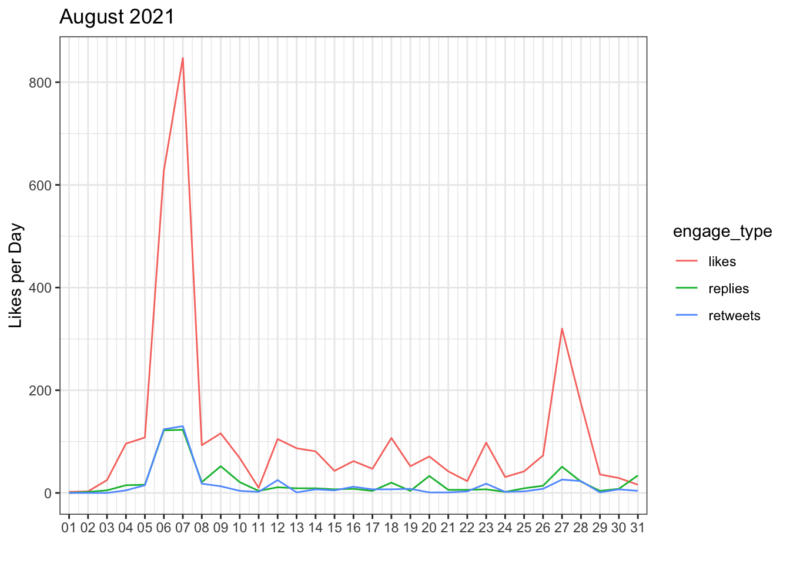
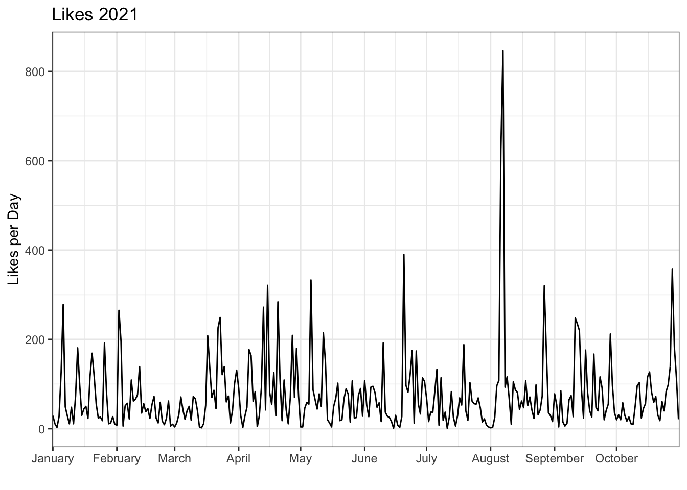
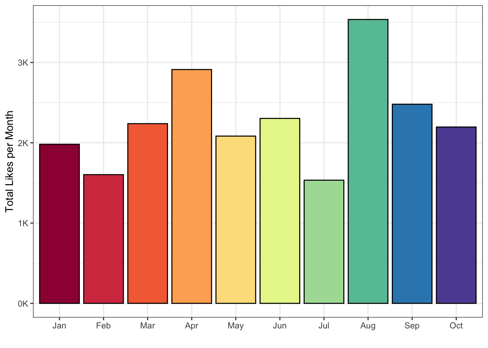
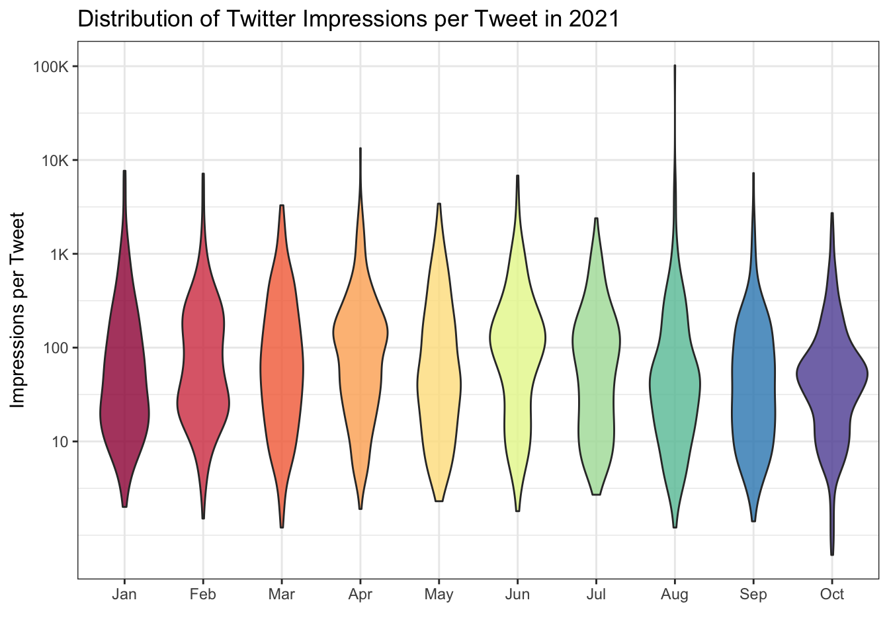

# Data Wrangling {#wrangle}

## Intended Learning Outcomes {#ilo-wrangle}

* Be able to select and filter data for relevance
* Be able to create new columns and edit existing ones


```r
library(tidyverse)   # data wrangling functions
library(lubridate)   # for handling dates and times
```

## Six main dplyr verbs

Most <a class='glossary' target='_blank' title='The process of preparing data for visualisation and statistical analysis.' href='https://psyteachr.github.io/glossary/d#data-wrangling'>data wrangling</a> involves the reshaping functions you learned in Chapter\ \@ref(tidy) and these six functions: `select`, `filter`, `arrange`, `mutate`, `summarise`, and `group_by`.


We'll use a small example table with the sales and expenses for two years from four regions over two products.


```r
budget <- read_csv("data/budget.csv", show_col_types = FALSE)
```

<div class="kable-table">

<table>
 <thead>
  <tr>
   <th style="text-align:left;"> region </th>
   <th style="text-align:left;"> product </th>
   <th style="text-align:right;"> sales_2019 </th>
   <th style="text-align:right;"> sales_2020 </th>
   <th style="text-align:right;"> expenses_2019 </th>
   <th style="text-align:right;"> expenses_2020 </th>
  </tr>
 </thead>
<tbody>
  <tr>
   <td style="text-align:left;"> North </td>
   <td style="text-align:left;"> widgets </td>
   <td style="text-align:right;"> 12029 </td>
   <td style="text-align:right;"> 9383 </td>
   <td style="text-align:right;"> 10722 </td>
   <td style="text-align:right;"> 9003 </td>
  </tr>
  <tr>
   <td style="text-align:left;"> North </td>
   <td style="text-align:left;"> gadgets </td>
   <td style="text-align:right;"> 5673 </td>
   <td style="text-align:right;"> 5027 </td>
   <td style="text-align:right;"> 5987 </td>
   <td style="text-align:right;"> 6065 </td>
  </tr>
  <tr>
   <td style="text-align:left;"> South </td>
   <td style="text-align:left;"> widgets </td>
   <td style="text-align:right;"> 11023 </td>
   <td style="text-align:right;"> 8450 </td>
   <td style="text-align:right;"> 10904 </td>
   <td style="text-align:right;"> 10572 </td>
  </tr>
  <tr>
   <td style="text-align:left;"> South </td>
   <td style="text-align:left;"> gadgets </td>
   <td style="text-align:right;"> 6972 </td>
   <td style="text-align:right;"> 4005 </td>
   <td style="text-align:right;"> 4340 </td>
   <td style="text-align:right;"> 5150 </td>
  </tr>
  <tr>
   <td style="text-align:left;"> East </td>
   <td style="text-align:left;"> widgets </td>
   <td style="text-align:right;"> 9172 </td>
   <td style="text-align:right;"> 9849 </td>
   <td style="text-align:right;"> 9099 </td>
   <td style="text-align:right;"> 9558 </td>
  </tr>
  <tr>
   <td style="text-align:left;"> East </td>
   <td style="text-align:left;"> gadgets </td>
   <td style="text-align:right;"> 4527 </td>
   <td style="text-align:right;"> 4596 </td>
   <td style="text-align:right;"> 5044 </td>
   <td style="text-align:right;"> 6986 </td>
  </tr>
  <tr>
   <td style="text-align:left;"> West </td>
   <td style="text-align:left;"> widgets </td>
   <td style="text-align:right;"> 10533 </td>
   <td style="text-align:right;"> 10690 </td>
   <td style="text-align:right;"> 10683 </td>
   <td style="text-align:right;"> 9585 </td>
  </tr>
  <tr>
   <td style="text-align:left;"> West </td>
   <td style="text-align:left;"> gadgets </td>
   <td style="text-align:right;"> 6154 </td>
   <td style="text-align:right;"> 5376 </td>
   <td style="text-align:right;"> 5383 </td>
   <td style="text-align:right;"> 4814 </td>
  </tr>
</tbody>
</table>

</div>


### select() {#select}

Select columns by name or number.

You can select each column individually, separated by commas (e.g., `region, sales_2019`). You can also select all columns between two columns by separating them with a colon (e.g., `sales_2019:expenses_2020`).


```r
budget2020 <- budget %>% select(region, sales_2020, expenses_2020)
names(budget2020)
```

```
## [1] "region"        "sales_2020"    "expenses_2020"
```

You can select columns by number, which is useful when the column names are long or complicated.


```r
regions <- budget %>% select(1, 3:6)
names(regions)
```

```
## [1] "region"        "sales_2019"    "sales_2020"    "expenses_2019"
## [5] "expenses_2020"
```

You can use a minus symbol to unselect columns, leaving all of the other columns. If you want to exclude a span of columns, put parentheses around the span first (e.g., `-(sales_2019:expenses_2020)`, not `-sales_2019:expenses_2020`).


```r
sales <- budget %>% select(-(expenses_2019:expenses_2020))
names(sales)
```

```
## [1] "region"     "product"    "sales_2019" "sales_2020"
```

You can select columns based on criteria about the column names.

| function | definition |
|----------|------------|
| `starts_with()` | select columns that start with a character string|
| `ends_with()` | elect columns that end with a character string |
| `contains()` | select columns that contain a character string |
| `num_range()` | select columns with a name that matches the pattern `prefix` |

::: {.info data-latex=""}
Use `width` to set the number of digits with leading
zeros. For example, `num_range('var_', 8:10, width=2)` selects columns `var_08`, `var_09`, and `var_10`.
:::


::: {.try data-latex=""}
What are the resulting columns for these four examples?

| code | columns |
|------|---------|
| `budget %>% select(starts_with("sales"))` | <select class='webex-select'><option value='blank'></option><option value='x'>sales_2019, sales_2020, expenses_2019, expenses_2020</option><option value='x'>expenses_2019, expenses_2020</option><option value='x'>sales_2020, expenses_2020</option><option value='answer'>sales_2019, sales_2020</option></select> |
| `budget %>% select(ends_with("2020"))` | <select class='webex-select'><option value='blank'></option><option value='x'>sales_2019, sales_2020</option><option value='answer'>sales_2020, expenses_2020</option><option value='x'>expenses_2019, expenses_2020</option><option value='x'>sales_2019, sales_2020, expenses_2019, expenses_2020</option></select> |
| `budget %>% select(contains("_"))` | <select class='webex-select'><option value='blank'></option><option value='x'>expenses_2019, expenses_2020</option><option value='x'>sales_2020, expenses_2020</option><option value='x'>sales_2019, sales_2020</option><option value='answer'>sales_2019, sales_2020, expenses_2019, expenses_2020</option></select> |
| `budget %>% select(num_range("expenses_", 2019:2020))` | <select class='webex-select'><option value='blank'></option><option value='answer'>expenses_2019, expenses_2020</option><option value='x'>sales_2019, sales_2020</option><option value='x'>sales_2020, expenses_2020</option><option value='x'>sales_2019, sales_2020, expenses_2019, expenses_2020</option></select> |

:::


### filter() {#filter}

Select rows by matching column criteria.

Select all rows from the North region.


```r
budget %>% filter(region == "North")
```

<div class="kable-table">

<table>
 <thead>
  <tr>
   <th style="text-align:left;"> region </th>
   <th style="text-align:left;"> product </th>
   <th style="text-align:right;"> sales_2019 </th>
   <th style="text-align:right;"> sales_2020 </th>
   <th style="text-align:right;"> expenses_2019 </th>
   <th style="text-align:right;"> expenses_2020 </th>
  </tr>
 </thead>
<tbody>
  <tr>
   <td style="text-align:left;"> North </td>
   <td style="text-align:left;"> widgets </td>
   <td style="text-align:right;"> 12029 </td>
   <td style="text-align:right;"> 9383 </td>
   <td style="text-align:right;"> 10722 </td>
   <td style="text-align:right;"> 9003 </td>
  </tr>
  <tr>
   <td style="text-align:left;"> North </td>
   <td style="text-align:left;"> gadgets </td>
   <td style="text-align:right;"> 5673 </td>
   <td style="text-align:right;"> 5027 </td>
   <td style="text-align:right;"> 5987 </td>
   <td style="text-align:right;"> 6065 </td>
  </tr>
</tbody>
</table>

</div>

::: {.warning data-latex=""}
Remember to use `==` and not `=` to check if two things are equivalent. A single `=` assigns the righthand value to the lefthand variable and (usually) evaluates to `TRUE`.
:::

You can select on multiple criteria by separating them with commas.


```r
budget %>% filter(
  region == "North",
  product == "widgets"
)
```

<div class="kable-table">

<table>
 <thead>
  <tr>
   <th style="text-align:left;"> region </th>
   <th style="text-align:left;"> product </th>
   <th style="text-align:right;"> sales_2019 </th>
   <th style="text-align:right;"> sales_2020 </th>
   <th style="text-align:right;"> expenses_2019 </th>
   <th style="text-align:right;"> expenses_2020 </th>
  </tr>
 </thead>
<tbody>
  <tr>
   <td style="text-align:left;"> North </td>
   <td style="text-align:left;"> widgets </td>
   <td style="text-align:right;"> 12029 </td>
   <td style="text-align:right;"> 9383 </td>
   <td style="text-align:right;"> 10722 </td>
   <td style="text-align:right;"> 9003 </td>
  </tr>
</tbody>
</table>

</div>

You can use the symbols `&`, `|`, and `!` to mean "and", "or", and "not". You can also use other operators to make equations.


```r
# regions and products with profit in 2019 or 2020
profit_either <- budget %>% 
  filter(
    sales_2019 > expenses_2019 |
    sales_2020 > expenses_2020
  )

# regions and products with profit in both 2019 and 2020
profit_both <- budget %>% 
  filter(
    sales_2019 > expenses_2019 &
    sales_2020 > expenses_2020
  )

# everything but the North
not_north <- budget %>%
  filter(region != "North")

# 2020 profit greater than 1000
profit_1000 <- budget %>%
  filter(sales_2020 - expenses_2020 > 1000)
```

#### Match operator (%in%) {#match-operator}

The match operator (`%in%`) is useful here for testing if a column value is in a list.


```r
budget %>%
  filter(region %in% c("North", "South") &
           product == "widgets")
```

<div class="kable-table">

<table>
 <thead>
  <tr>
   <th style="text-align:left;"> region </th>
   <th style="text-align:left;"> product </th>
   <th style="text-align:right;"> sales_2019 </th>
   <th style="text-align:right;"> sales_2020 </th>
   <th style="text-align:right;"> expenses_2019 </th>
   <th style="text-align:right;"> expenses_2020 </th>
  </tr>
 </thead>
<tbody>
  <tr>
   <td style="text-align:left;"> North </td>
   <td style="text-align:left;"> widgets </td>
   <td style="text-align:right;"> 12029 </td>
   <td style="text-align:right;"> 9383 </td>
   <td style="text-align:right;"> 10722 </td>
   <td style="text-align:right;"> 9003 </td>
  </tr>
  <tr>
   <td style="text-align:left;"> South </td>
   <td style="text-align:left;"> widgets </td>
   <td style="text-align:right;"> 11023 </td>
   <td style="text-align:right;"> 8450 </td>
   <td style="text-align:right;"> 10904 </td>
   <td style="text-align:right;"> 10572 </td>
  </tr>
</tbody>
</table>

</div>


### arrange() {#arrange}

Sort your dataset using `arrange()`. You will find yourself needing to sort data in R much less than you do in Excel, since you don't need to have rows next to each other in order to, for example, calculate group means. But `arrange()` can be useful when preparing data from display in tables. Reverse the order using `desc()`.


```r
budget %>%
  arrange(product, desc(region))
```

<div class="kable-table">

<table>
 <thead>
  <tr>
   <th style="text-align:left;"> region </th>
   <th style="text-align:left;"> product </th>
   <th style="text-align:right;"> sales_2019 </th>
   <th style="text-align:right;"> sales_2020 </th>
   <th style="text-align:right;"> expenses_2019 </th>
   <th style="text-align:right;"> expenses_2020 </th>
  </tr>
 </thead>
<tbody>
  <tr>
   <td style="text-align:left;"> West </td>
   <td style="text-align:left;"> gadgets </td>
   <td style="text-align:right;"> 6154 </td>
   <td style="text-align:right;"> 5376 </td>
   <td style="text-align:right;"> 5383 </td>
   <td style="text-align:right;"> 4814 </td>
  </tr>
  <tr>
   <td style="text-align:left;"> South </td>
   <td style="text-align:left;"> gadgets </td>
   <td style="text-align:right;"> 6972 </td>
   <td style="text-align:right;"> 4005 </td>
   <td style="text-align:right;"> 4340 </td>
   <td style="text-align:right;"> 5150 </td>
  </tr>
  <tr>
   <td style="text-align:left;"> North </td>
   <td style="text-align:left;"> gadgets </td>
   <td style="text-align:right;"> 5673 </td>
   <td style="text-align:right;"> 5027 </td>
   <td style="text-align:right;"> 5987 </td>
   <td style="text-align:right;"> 6065 </td>
  </tr>
  <tr>
   <td style="text-align:left;"> East </td>
   <td style="text-align:left;"> gadgets </td>
   <td style="text-align:right;"> 4527 </td>
   <td style="text-align:right;"> 4596 </td>
   <td style="text-align:right;"> 5044 </td>
   <td style="text-align:right;"> 6986 </td>
  </tr>
  <tr>
   <td style="text-align:left;"> West </td>
   <td style="text-align:left;"> widgets </td>
   <td style="text-align:right;"> 10533 </td>
   <td style="text-align:right;"> 10690 </td>
   <td style="text-align:right;"> 10683 </td>
   <td style="text-align:right;"> 9585 </td>
  </tr>
  <tr>
   <td style="text-align:left;"> South </td>
   <td style="text-align:left;"> widgets </td>
   <td style="text-align:right;"> 11023 </td>
   <td style="text-align:right;"> 8450 </td>
   <td style="text-align:right;"> 10904 </td>
   <td style="text-align:right;"> 10572 </td>
  </tr>
  <tr>
   <td style="text-align:left;"> North </td>
   <td style="text-align:left;"> widgets </td>
   <td style="text-align:right;"> 12029 </td>
   <td style="text-align:right;"> 9383 </td>
   <td style="text-align:right;"> 10722 </td>
   <td style="text-align:right;"> 9003 </td>
  </tr>
  <tr>
   <td style="text-align:left;"> East </td>
   <td style="text-align:left;"> widgets </td>
   <td style="text-align:right;"> 9172 </td>
   <td style="text-align:right;"> 9849 </td>
   <td style="text-align:right;"> 9099 </td>
   <td style="text-align:right;"> 9558 </td>
  </tr>
</tbody>
</table>

</div>


### mutate() {#mutate}

Add new columns or change existing ones. Refer to other columns by their names (unquoted). You can add more than one column in the same mutate function, just separate the columns with a comma. Once you make a new column, you can use it in further column definitions e.g., `profit` below).


```r
budget2 <- budget %>%
  mutate(
    sales = sales_2019 + sales_2020,
    expenses = expenses_2019 + expenses_2020,
    profit = sales - expenses,
    region = paste(region, "Office")
  )
```


::: {.warning data-latex=""}
You can overwrite a column by giving a new column the same name as the old column (see `region``) above. Make sure that you mean to do this and that you aren't trying to use the old column value after you redefine it.
:::


### summarise() {#summarise}

Create summary statistics for the dataset. Check the [Data Wrangling Cheat Sheet](https://www.rstudio.org/links/data_wrangling_cheat_sheet) or the [Data Transformation Cheat Sheet](https://www.rstudio.org/links/data_transformation_cheat_sheet) for various summary functions. Some common ones are: `mean()`, `sd()`, `n()`, `sum()`, and `quantile()`.


```r
budget2 %>%
  summarise(
    count = n(),
    median = quantile(profit, .50),
    average = mean(profit),
    minimum = min(profit),
    maximum = max(profit)
  )
```

<div class="kable-table">

<table>
 <thead>
  <tr>
   <th style="text-align:right;"> count </th>
   <th style="text-align:right;"> median </th>
   <th style="text-align:right;"> average </th>
   <th style="text-align:right;"> minimum </th>
   <th style="text-align:right;"> maximum </th>
  </tr>
 </thead>
<tbody>
  <tr>
   <td style="text-align:right;"> 8 </td>
   <td style="text-align:right;"> 659.5 </td>
   <td style="text-align:right;"> -54.5 </td>
   <td style="text-align:right;"> -2907 </td>
   <td style="text-align:right;"> 1687 </td>
  </tr>
</tbody>
</table>

</div>


::: {.info data-latex=""}
<a class='glossary' target='_blank' title='Cutoffs dividing the range of a distribution into continuous intervals with equal probabilities.' href='https://psyteachr.github.io/glossary/q#quantile'>Quantiles</a> are like percentiles. Use `quantile(x, .50)` to find the median (the number where 50% of values in `x` are above it and 50% are below it).
:::

### group_by() {#group_by}

Create subsets of the data. You can use this to create summaries, 
like the total profit for each region.

::: {.warning data-latex=""}
Make sure you call the `ungroup()` function when you are done with grouped functions. Failing to do this can cause all sorts of mysterious problems if you use that data table later assuming it isn't grouped.
:::


```r
budget2 %>%
  group_by(region) %>%
  summarise(
    n = n(),
    "Two-year profit" = sum(profit)
  ) %>%
  ungroup()
```

<div class="kable-table">

<table>
 <thead>
  <tr>
   <th style="text-align:left;"> region </th>
   <th style="text-align:right;"> n </th>
   <th style="text-align:right;"> Two-year profit </th>
  </tr>
 </thead>
<tbody>
  <tr>
   <td style="text-align:left;"> East Office </td>
   <td style="text-align:right;"> 2 </td>
   <td style="text-align:right;"> -2543 </td>
  </tr>
  <tr>
   <td style="text-align:left;"> North Office </td>
   <td style="text-align:right;"> 2 </td>
   <td style="text-align:right;"> 335 </td>
  </tr>
  <tr>
   <td style="text-align:left;"> South Office </td>
   <td style="text-align:right;"> 2 </td>
   <td style="text-align:right;"> -516 </td>
  </tr>
  <tr>
   <td style="text-align:left;"> West Office </td>
   <td style="text-align:right;"> 2 </td>
   <td style="text-align:right;"> 2288 </td>
  </tr>
</tbody>
</table>

</div>

::: {.warning data-latex=""}
If you get the following message: "`summarise()` ungrouping output (override with `.groups` argument)", please update tidyverse.
:::

You can use `filter` after `group_by`. The following example returns the highest profit region for each product (i.e., the row where the value in the column `profit` is equivalent to the maximum value for that group).


```r
budget2 %>%
  group_by(product) %>%
  filter(profit == max(profit)) %>%
  ungroup() %>%
  select(product, region, profit)
```

<div class="kable-table">

<table>
 <thead>
  <tr>
   <th style="text-align:left;"> product </th>
   <th style="text-align:left;"> region </th>
   <th style="text-align:right;"> profit </th>
  </tr>
 </thead>
<tbody>
  <tr>
   <td style="text-align:left;"> widgets </td>
   <td style="text-align:left;"> North Office </td>
   <td style="text-align:right;"> 1687 </td>
  </tr>
  <tr>
   <td style="text-align:left;"> gadgets </td>
   <td style="text-align:left;"> South Office </td>
   <td style="text-align:right;"> 1487 </td>
  </tr>
</tbody>
</table>

</div>


You can also use `mutate` after `group_by`. This doesn't return just one row per group, like `summarise()`, but lets you make calculations using grouped values, like the product-specific mean profit.


```r
budget2 %>%
  select(region, product, profit) %>%
  group_by(product) %>%
  mutate(adjusted_profit = profit - mean(profit)) %>% 
  ungroup()
```

<div class="kable-table">

<table>
 <thead>
  <tr>
   <th style="text-align:left;"> region </th>
   <th style="text-align:left;"> product </th>
   <th style="text-align:right;"> profit </th>
   <th style="text-align:right;"> adjusted_profit </th>
  </tr>
 </thead>
<tbody>
  <tr>
   <td style="text-align:left;"> North Office </td>
   <td style="text-align:left;"> widgets </td>
   <td style="text-align:right;"> 1687 </td>
   <td style="text-align:right;"> 1436.25 </td>
  </tr>
  <tr>
   <td style="text-align:left;"> North Office </td>
   <td style="text-align:left;"> gadgets </td>
   <td style="text-align:right;"> -1352 </td>
   <td style="text-align:right;"> -992.25 </td>
  </tr>
  <tr>
   <td style="text-align:left;"> South Office </td>
   <td style="text-align:left;"> widgets </td>
   <td style="text-align:right;"> -2003 </td>
   <td style="text-align:right;"> -2253.75 </td>
  </tr>
  <tr>
   <td style="text-align:left;"> South Office </td>
   <td style="text-align:left;"> gadgets </td>
   <td style="text-align:right;"> 1487 </td>
   <td style="text-align:right;"> 1846.75 </td>
  </tr>
  <tr>
   <td style="text-align:left;"> East Office </td>
   <td style="text-align:left;"> widgets </td>
   <td style="text-align:right;"> 364 </td>
   <td style="text-align:right;"> 113.25 </td>
  </tr>
  <tr>
   <td style="text-align:left;"> East Office </td>
   <td style="text-align:left;"> gadgets </td>
   <td style="text-align:right;"> -2907 </td>
   <td style="text-align:right;"> -2547.25 </td>
  </tr>
  <tr>
   <td style="text-align:left;"> West Office </td>
   <td style="text-align:left;"> widgets </td>
   <td style="text-align:right;"> 955 </td>
   <td style="text-align:right;"> 704.25 </td>
  </tr>
  <tr>
   <td style="text-align:left;"> West Office </td>
   <td style="text-align:left;"> gadgets </td>
   <td style="text-align:right;"> 1333 </td>
   <td style="text-align:right;"> 1692.75 </td>
  </tr>
</tbody>
</table>

</div>


## Twitter Example

This section takes a problem-based approach to teach you how to use the functions above, in combination with functions you learned in previous chapters, to summarise and visualise twitter data.

### Export Data

You can export your organisations' twitter data from <https://analytics.twitter.com/>. Go to the Tweets tab, choose a time period, and export the last month's data by day (or use the files from the class data).

### Import Data


```r
file <- "data/tweets/daily_tweet_activity_metrics_LisaDeBruine_20210801_20210901_en.csv"

daily_tweets <- read_csv(file, show_col_types = FALSE)
```

### Select Relevant Data

The file contains a bunch of columns about "promoted" tweets that will be blank unless your organisation pays for those. Let's get rid of them. We can use the select helper `dplyr::starts_with()` to get all the columns that start with "promoted" and remove them by prefacing the function with `!`. Now there should be 20 columns, which we can inspect with `glimpse()`. 


```r
daily_tweets <- read_csv(file) %>%
  select(!starts_with("promoted")) %>%
  glimpse()
```

```
## Rows: 31
## Columns: 20
## $ Date                  <date> 2021-08-01, 2021-08-02, 2021-08-03, 2021-08-04,…
## $ `Tweets published`    <dbl> 0, 2, 4, 15, 12, 11, 14, 17, 26, 17, 3, 9, 5, 17…
## $ impressions           <dbl> 1088, 1244, 3974, 22394, 23340, 316989, 694114, …
## $ engagements           <dbl> 13, 19, 76, 1290, 2051, 26249, 51494, 5988, 2964…
## $ `engagement rate`     <dbl> 0.01194853, 0.01527331, 0.01912431, 0.05760472, …
## $ retweets              <dbl> 0, 0, 0, 5, 15, 124, 130, 18, 13, 4, 2, 25, 1, 7…
## $ replies               <dbl> 0, 2, 5, 15, 16, 122, 123, 21, 52, 21, 4, 11, 9,…
## $ likes                 <dbl> 2, 3, 25, 96, 108, 628, 847, 93, 116, 68, 10, 10…
## $ `user profile clicks` <dbl> 1, 9, 10, 56, 36, 379, 550, 98, 78, 31, 17, 104,…
## $ `url clicks`          <dbl> 2, 0, 0, 45, 97, 10136, 19467, 1937, 681, 324, 1…
## $ `hashtag clicks`      <dbl> 0, 0, 0, 0, 0, 0, 1, 5, 1, 0, 0, 12, 1, 2, 3, 1,…
## $ `detail expands`      <dbl> 7, 5, 36, 412, 606, 10348, 21021, 2642, 1441, 79…
## $ `permalink clicks`    <dbl> 0, 0, 0, 0, 0, 0, 0, 0, 0, 0, 0, 0, 0, 0, 0, 0, …
## $ `app opens`           <dbl> 0, 0, 0, 0, 0, 0, 0, 0, 0, 0, 0, 0, 0, 0, 0, 0, …
## $ `app installs`        <dbl> 0, 0, 0, 0, 0, 0, 0, 0, 0, 0, 0, 0, 0, 0, 0, 0, …
## $ follows               <dbl> 0, 0, 0, 0, 0, 0, 0, 0, 0, 0, 0, 0, 0, 0, 0, 0, …
## $ `email tweet`         <dbl> 0, 0, 0, 0, 0, 0, 0, 0, 0, 0, 0, 0, 0, 0, 0, 0, …
## $ `dial phone`          <dbl> 0, 0, 0, 0, 0, 0, 0, 0, 0, 0, 0, 0, 0, 0, 0, 0, …
## $ `media views`         <dbl> 2, 2, 25, 710, 1187, 4474, 9356, 1176, 582, 334,…
## $ `media engagements`   <dbl> 1, 0, 0, 661, 1173, 4464, 9353, 1174, 582, 327, …
```

### Plot Likes per Day

Now let's plot likes per day. The `ggplot2::scale_x_date()` function lets you formats an x-axis with dates.


```r
ggplot(daily_tweets, aes(x = Date, y = likes)) +
  geom_line() +
  scale_x_date(name = "", 
               date_breaks = "1 day",
               date_labels = "%d",
               expand = expansion(add = c(.5, .5))) +
  ggtitle("Likes: August 2021")
```

<div class="figure" style="text-align: center">

<p class="caption">(\#fig:likes-per-day-plot)Likes per day.</p>
</div>


### Plot Multiple Engagements

What if we want to plot likes, retweets, and replies on the same plot? We need to get all of the numbers in the same columns so we have a column that contains the "engagement type" that we can use to determine different line colours. When you have data in different columns that you need to get into the same column, it's wide and you need to pivot the data longer.


```r
long_tweets <- daily_tweets %>%
  select(Date, likes, retweets, replies) %>%
  pivot_longer(cols = c(likes, retweets, replies),
               names_to = "engage_type",
               values_to = "n")

head(long_tweets)
```

<div class="kable-table">

<table>
 <thead>
  <tr>
   <th style="text-align:left;"> Date </th>
   <th style="text-align:left;"> engage_type </th>
   <th style="text-align:right;"> n </th>
  </tr>
 </thead>
<tbody>
  <tr>
   <td style="text-align:left;"> 2021-08-01 </td>
   <td style="text-align:left;"> likes </td>
   <td style="text-align:right;"> 2 </td>
  </tr>
  <tr>
   <td style="text-align:left;"> 2021-08-01 </td>
   <td style="text-align:left;"> retweets </td>
   <td style="text-align:right;"> 0 </td>
  </tr>
  <tr>
   <td style="text-align:left;"> 2021-08-01 </td>
   <td style="text-align:left;"> replies </td>
   <td style="text-align:right;"> 0 </td>
  </tr>
  <tr>
   <td style="text-align:left;"> 2021-08-02 </td>
   <td style="text-align:left;"> likes </td>
   <td style="text-align:right;"> 3 </td>
  </tr>
  <tr>
   <td style="text-align:left;"> 2021-08-02 </td>
   <td style="text-align:left;"> retweets </td>
   <td style="text-align:right;"> 0 </td>
  </tr>
  <tr>
   <td style="text-align:left;"> 2021-08-02 </td>
   <td style="text-align:left;"> replies </td>
   <td style="text-align:right;"> 2 </td>
  </tr>
</tbody>
</table>

</div>

Now we can plot the number of engagements per day by engagement type by making the line colour determined by the value of the `engage_type` column. 


```r
ggplot(long_tweets, aes(x = Date, y = n, colour = engage_type)) +
  geom_line() +
  scale_y_continuous(name = "Likes per Day") + 
  scale_x_date(name = "", 
               date_breaks = "1 day",
               date_labels = "%d",
               expand = expansion(add = c(.5, .5))) +
  ggtitle("August 2021")
```

<div class="figure" style="text-align: center">

<p class="caption">(\#fig:eng-per-day-plot)Engagements per day by engagement type.</p>
</div>


### Multiple Data Files

Maybe now you want to compare the data from several months. First, get a list of all the files you want to combine. It's easiest if they're all in the same directory, although you can use a pattern to select the files you want if they have a systematic naming structure.


```r
files <- list.files(
  path = "data/tweets", 
  pattern = "daily_tweet_activity_metrics_LisaDeBruine",
  full.names = TRUE
)
```

Then use `purrr::map_df()` to map over the list of file paths, open them with `read_csv()`, and return a big data frame with all the combined data. Then we can pipe that to the `select()` function to get rid of the "promoted" columns.


```r
all_daily_tweets <- purrr::map_df(files, read_csv) %>%
  select(!starts_with("promoted"))
```

Now you can make a plot of likes per day for all of the months.


```r
ggplot(all_daily_tweets, aes(x = Date, y = likes)) +
  geom_line() +
  scale_y_continuous(name = "Likes per Day") + 
  scale_x_date(name = "", 
               date_breaks = "1 month",
               date_labels = "%B",
               expand = expansion(add = c(.5, .5))) +
  ggtitle("Likes 2021")
```




::: {.info data-latex=""}
Notice that we changed the date breaks and labels for the x-axis. `%B` is the date code for the full month name. See `?strptime` for all of the date codes.
:::


### Likes by Month

If you want to plot likes by month, first you need a column for the month. Use `mutate()` to make a new column, using `lubridate::month()` to extract the month name from the `Date` column. 

Then group by the new `month` column and calculate the sum of `likes`. The `group_by()` function causes all of the subsequent functions to operate inside of groups, until you call `ungroup()`. In the example below, the `sum(likes)` function calculates the sum total of the `likes` column separately for each month.


```r
likes_by_month <- all_daily_tweets %>%
  mutate(month = month(Date, label = TRUE)) %>%
  group_by(month) %>%
  summarise(total_likes = sum(likes)) %>%
  ungroup()

likes_by_month
```

<div class="kable-table">

<table>
 <thead>
  <tr>
   <th style="text-align:left;"> month </th>
   <th style="text-align:right;"> total_likes </th>
  </tr>
 </thead>
<tbody>
  <tr>
   <td style="text-align:left;"> Jan </td>
   <td style="text-align:right;"> 1981 </td>
  </tr>
  <tr>
   <td style="text-align:left;"> Feb </td>
   <td style="text-align:right;"> 1603 </td>
  </tr>
  <tr>
   <td style="text-align:left;"> Mar </td>
   <td style="text-align:right;"> 2238 </td>
  </tr>
  <tr>
   <td style="text-align:left;"> Apr </td>
   <td style="text-align:right;"> 2912 </td>
  </tr>
  <tr>
   <td style="text-align:left;"> May </td>
   <td style="text-align:right;"> 2083 </td>
  </tr>
  <tr>
   <td style="text-align:left;"> Jun </td>
   <td style="text-align:right;"> 2303 </td>
  </tr>
  <tr>
   <td style="text-align:left;"> Jul </td>
   <td style="text-align:right;"> 1534 </td>
  </tr>
  <tr>
   <td style="text-align:left;"> Aug </td>
   <td style="text-align:right;"> 3535 </td>
  </tr>
  <tr>
   <td style="text-align:left;"> Sep </td>
   <td style="text-align:right;"> 2480 </td>
  </tr>
  <tr>
   <td style="text-align:left;"> Oct </td>
   <td style="text-align:right;"> 2196 </td>
  </tr>
</tbody>
</table>

</div>


A column plot might make more sense than a line plot for this summary.


```r
ggplot(likes_by_month, aes(x = month, y = total_likes, fill = month)) +
  geom_col(color = "black", show.legend = FALSE) +
  scale_fill_brewer(palette = "Spectral") +
  scale_y_continuous(name = "Total Likes per Month",
                     breaks = seq(0, 10000, 1000),
                     labels = paste0(0:10, "K")) +
  scale_x_discrete(name = "")
```

<div class="figure" style="text-align: center">

<p class="caption">(\#fig:likes-by-month-plot)Likes by month.</p>
</div>


::: {.try data-latex=""}
How would you change the code in this section to plot the number of tweets published per week? 

Hint: if the <code class='package'>lubridate</code> function for the month is `month()`, what is the function for getting the week likely to be?


<div class='webex-solution'><button>Summarise Data</button>

```r
tweets_by_week <- all_daily_tweets %>%
  mutate(week = week(Date)) %>%
  group_by(week) %>%
  summarise(start_date = min(Date),
            total_tweets = sum(`Tweets published`)) %>%
  ungroup()
```


</div>


<div class='webex-solution'><button>Plot Data</button>

```r
ggplot(tweets_by_week, aes(x = start_date, y = total_tweets)) +
  geom_col(fill = "hotpink") +
  scale_fill_brewer(palette = "Spectral") +
  scale_y_continuous(name = "Total Tweets per Week") +
  scale_x_date(name = "",
               date_breaks = "1 month", 
               date_labels = "%B")
```


</div>

:::


### Data by Tweet

You can also download your twitter data by tweet instead of by day. This usually takes a little longer to download. We can use the same pattern to read and combine all of the tweet data files.

The `^` at the start of the pattern means that the file name has to start with this. This means it won't match the "daily_tweet..." files.


```r
tweet_files <- list.files(
  path = "data/tweets", 
  pattern = "^tweet_activity_metrics_LisaDeBruine",
  full.names = TRUE
)
```

First, let's open only the first file and see if we need to do anything to it.


```r
tweets <- read_csv(tweet_files[1])
```

If you look at the file in the Viewer, you can set that the `Tweet id` column is using scientific notation (`1.355500e+18`) instead of the full 18-digit tweet ID. We won't ever want to *add* ID numbers, so it's safe to represent these as characters. Now we can set up the map over all the files, then get rid of all the promoted columns and add a `month` column (reading the date from the `time` column in these data).


```r
ct <- cols("Tweet id" = col_character())
all_tweets <- purrr::map_df(tweet_files, read_csv, col_types = ct) %>%
  select(!starts_with("promoted")) %>%
  mutate(month = lubridate::month(time, label = TRUE))
```

Now we can look at the distribution of impressions per tweet for each month.


```r
ggplot(all_tweets, aes(x = month, y = impressions, fill = month)) +
  geom_violin(show.legend = FALSE, alpha = 0.8) +
  scale_fill_brewer(palette = "Spectral") +
  scale_x_discrete(name = "") +
  scale_y_continuous(name = "Impressions per Tweet",
                     breaks = c(0, 10^(2:7)),
                     labels = c(0, 10, 100, "1K", "10K", "100K", "1M"),
                     trans = "pseudo_log") +
  ggtitle("Distribution of Twitter Impressions per Tweet in 2021")
```

<div class="figure" style="text-align: center">

<p class="caption">(\#fig:imp-month-plot)Impressions per tweet per month.</p>
</div>

::: {.try data-latex=""}
The y-axis has been transformed to "pseudo_log" to show very skewed data more clearly (most tweets get a few hundred impressions, but some a few can get thousands). See what the plot looks like if you change the y-axis transformation.
:::

You can display Lisa's top tweet for the year.


```r
top_tweet <- all_tweets %>%
  slice_max(order_by = likes, n = 1)

glue::glue("[Top tweet]({top_tweet$`Tweet permalink`}) with {top_tweet$likes} likes:

---------------------------
{top_tweet$`Tweet text`}
---------------------------
") %>% cat()
```

[Top tweet](https://twitter.com/LisaDeBruine/status/1423445172092866563) with 1190 likes:

---------------------------
Oh, this was fun! You think of the ten least-related nouns possible. I scored in the 94th percentile. 

https://t.co/FhR4DR38OU
---------------------------

Or you can make a word cloud of the top words they tweet about. (You'll learn how to do this in Chapter\ \@ref(custom)).


