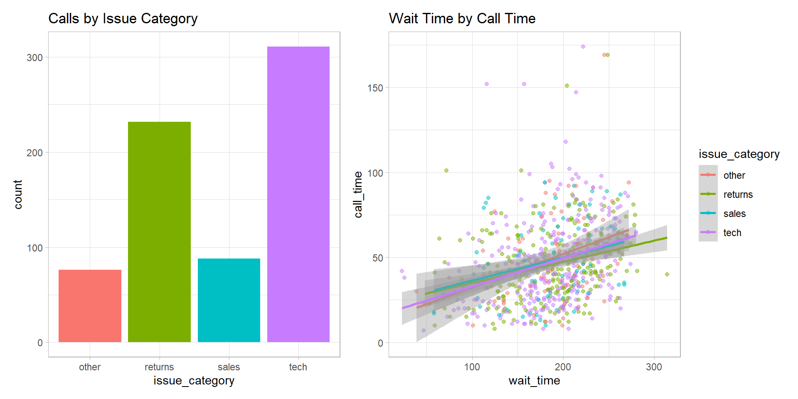

# Customising Visualisations {#custom}

## Intended Learning Outcomes {#ilo-custom}

* Customise plots with a consistent style
* Create high quality plots like BBC, NYT, 538


```r
library(tidyverse)
library(ggwordcloud) # for word clouds
library(tidytext) # for manipulating text for word clouds
library(patchwork) # for combining plots
```


## Word Clouds


```r
# https://www.kaggle.com/sid321axn/amazon-alexa-reviews
# extracted from Amazon by Manu Siddhartha & Anurag Bhatt
alexa <- rio::import("data/amazon_alexa.csv")
```

Next, we need to make a table of the number of times each individual word appears per rating  The function <code><span class='fu'>tidytext</span><span class='fu'>::</span><span class='fu'><a target='_blank' href='https://rdrr.io/pkg/tidytext/man/unnest_tokens.html'>unnest_tokens</a></span><span class='op'>(</span><span class='op'>)</span></code> does this for you by splitting the words in the `input` column into individual words in a new `output` column.

Then we can get rid of common "stop words" and integers by filtering only words that are not in our `omitted` list.

Then we group by rating and use <code><span class='fu'>dplyr</span><span class='fu'>::</span><span class='fu'><a target='_blank' href='https://dplyr.tidyverse.org/reference/slice.html'>slice_max</a></span><span class='op'>(</span><span class='op'>)</span></code> to get the top 25 words, ordered by the column `n`. 


```r
omitted <- c(stop_words$word, 0:9)

words <- alexa %>%
  unnest_tokens(output = "word", input = "verified_reviews") %>%
  count(word, rating) %>%
  filter(!word %in% omitted) %>%
  group_by(rating) %>%
  slice_max(order_by = n, n = 25, with_ties = FALSE)
```

Now we can make two word clouds and paste them together (word clouds don't play well with facets). So we filter the `words` table to get one rating, then set up a ggplot with the aesthetics `label`, `colour`, and `size`. The `label` will come from the `word` column, while the `colour` will be different for each `word` and the `size` of the word will be proportional to `n`, the number of times the word appeared.

The visualisation we'll use is <code><span class='fu'>ggwordcloud</span><span class='fu'>::</span><span class='fu'><a target='_blank' href='https://lepennec.github.io/ggwordcloud/reference/geom_text_wordcloud.html'>geom_text_wordcloud_area</a></span><span class='op'>(</span><span class='op'>)</span></code>. We can control how big the cloud is with <code><span class='fu'>ggwordcloud</span><span class='fu'>::</span><span class='fu'>scale_size_area</span><span class='op'>(</span><span class='op'>)</span></code> (this usually takes some trial-and-error). Then add a title and a minimal theme to get rid of the axes and grid lines. 


```r
rating1 <- filter(words, rating == 1) %>%
  ggplot(aes(label = word, colour = word, size = n)) +
  geom_text_wordcloud_area() +
  scale_size_area(max_size = 10) +
  ggtitle("Rating = 1") +
  theme_minimal(base_size = 14)
```

Make another plot for a different rating and paste them together with `+`.


```r
rating5 <- filter(words, rating == 5) %>%
  ggplot(aes(label = word, colour = word, size = n)) +
  geom_text_wordcloud_area() +
  scale_size_area(max_size = 10) +
  ggtitle("Rating = 5") +
  theme_minimal(base_size = 14)

rating1 + rating5
```




