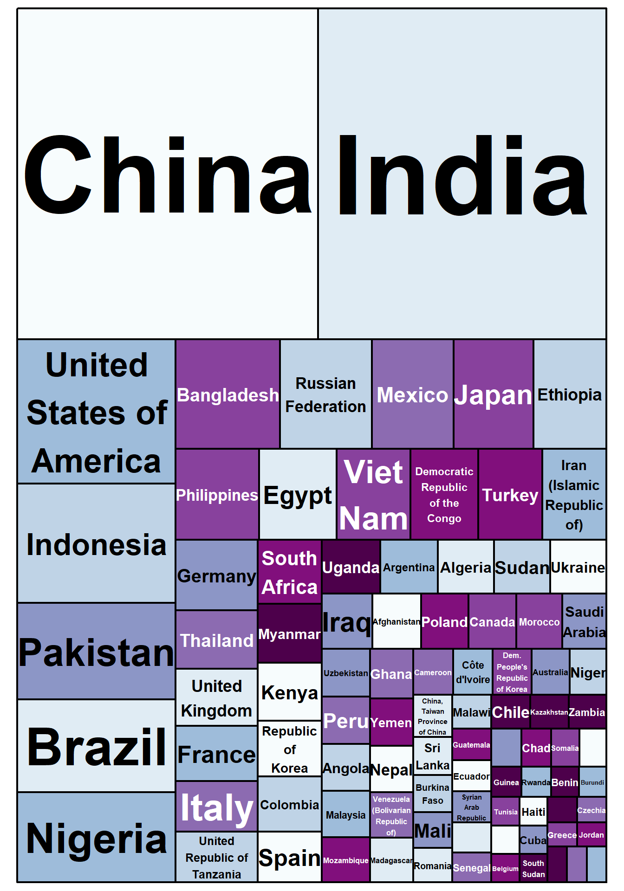

# Customising Visualisations {#custom}

## Intended Learning Outcomes {#ilo-custom}

* Customise plots with a consistent style
* Create high quality plots like BBC, NYT, 538


```r
library(tidyverse)   # data wrangling functions
library(ggwordcloud) # for word clouds
library(tidytext)    # for manipulating text for word clouds
library(patchwork)   # for combining plots
library(treemap)     # for treemap plots
library(ggthemes)    # for themes

theme_set(theme_light())
```


## Defaults

The code below creates two familiar plots from Chapter\ \@ref(viz), using the default (light) theme and palettes


```r
survey_data <- read_csv(file = "data/survey_data.csv")

bar <- ggplot(data = survey_data, 
              mapping = aes(x = issue_category,
                            fill = issue_category)) +
  geom_bar(show.legend = FALSE) +
  ggtitle("Calls by Issue Category")

point <- lm_plot <- ggplot(data = survey_data, 
                           mapping = aes(x = wait_time, 
                                         y = call_time,
                                         color = issue_category)) +
  geom_point(alpha = 0.5) +
  geom_smooth(method = lm, formula = y~x) +
  ggtitle("Wait Time by Call Time")
```


```r
bar + point
```

<div class="figure" style="text-align: center">

<p class="caption">(\#fig:unnamed-chunk-2)Default plot styles.</p>
</div>

## R Markdown Options

### Image Size

You can set the image size in the <a class='glossary' target='_blank' title='A section of code in an R Markdown file' href='https://psyteachr.github.io/glossary/c#chunk'>chunk</a> headers.

<div class='verbatim'><pre class='sourceCode r'><code class='sourceCode R'>&#96;&#96;&#96;{r, fig.width = 10, fig.height = 5}</code></pre>

```r
bar + point
```

<pre class='sourceCode r'><code class='sourceCode R'>&#96;&#96;&#96;</code></pre></div>

<div class="figure" style="text-align: center">

<p class="caption">(\#fig:unnamed-chunk-4)Image size altered to fig.width = 10, fig.height = 5</p>
</div>

### Output 

The option `out.width` controls how much space the figure takes up relative to the width of the output. The default value is "100%". You can also set alignment with `fig.alig`.

<div class='verbatim'><pre class='sourceCode r'><code class='sourceCode R'>&#96;&#96;&#96;{r, out.width = "75%", fig.align = "center"}</code></pre>

```r
bar
```

<pre class='sourceCode r'><code class='sourceCode R'>&#96;&#96;&#96;</code></pre></div>

<div class="figure" style="text-align: center">

<p class="caption">(\#fig:unnamed-chunk-6)Output display altered with out.width = "75%", fig.align = "center"</p>
</div>

### Captions

Figures should usually get a caption with `fig.cap` and alt text to describe the figure to people with impaired vision using `fig.alt`.

<div class='verbatim'><pre class='sourceCode r'><code class='sourceCode R'>&#96;&#96;&#96;{r, fig.cap = "As wait time increases, so does call time.", fig.alt = "Wait time on the x-axis and Call time on the y-axis. Shows scatterplots and regression lines for each of 4 issue categories: other, returns, sales, and tech. All 4 wait times increase with call time. At 50 seconds wait time, call time is about 25 seconds. At 250 seconds wait time, call time is about 60 seconds."}</code></pre>

```r
point
```

<pre class='sourceCode r'><code class='sourceCode R'>&#96;&#96;&#96;</code></pre></div>

<div class="figure" style="text-align: center">

<p class="caption">(\#fig:unnamed-chunk-8)As wait time increases, so does call time.</p>
</div>


### Setup Chunk

You can also set default values in the setup chunk like this.


```r
knitr::opts_chunk$set(
  fig.width = 10,
  fig.height = 5,
  out.width = "75%",
  fig.align = "center"
)
```

::: {.warning data-latex=""}
When you set the default figure width and height in the setup chunk, images you  make interactively while setting up your script will have the right aspect ratio, but you will only be able to see the `out.width`, `fig.align`, and `fig.cap` when you <a class='glossary' target='_blank' title='To create an HTML, PDF, or Word document from an R Markdown (Rmd) document' href='https://psyteachr.github.io/glossary/k#knit'>knit</a> the file.
:::


## Themes and Colours


```r
bar2 <- bar + 
  theme_classic() + 
  scale_fill_brewer(palette = "Dark2")

point2 <- point + 
  theme_classic() + 
  scale_color_brewer(palette = "Dark2")

bar2 + point2
```

<div class="figure" style="text-align: center">

<p class="caption">(\#fig:unnamed-chunk-10)Plots with the classic theme and Dark2 palette.</p>
</div>

You can download extra themes with packages like <code class='package'>ggthemes</code>.


```r
bar_econ <- bar + 
  theme_economist() +
  scale_fill_economist()

point_econ <- point + 
  theme_economist() +
  scale_color_economist()

bar_econ + point_econ
```

<div class="figure" style="text-align: center">

<p class="caption">(\#fig:unnamed-chunk-11)Plots with the economist styles from ggthemes.</p>
</div>

## Other Plots

### Treemap


```r
pop_data <- readxl::read_excel("data/WPP2019_POP_F01_1_TOTAL_POPULATION_BOTH_SEXES.xlsx",
                               skip = 16) %>%
  filter(Type == "Country/Area") %>%
  select(country = 3, population = `2020`) %>%
  mutate(population = round(as.numeric(population) * 1000)) %>%
  filter(population > 10000000)

treemap(pop_data,
  index="country",
  vSize="population",
  title = "",
  palette = "BuPu",
  inflate.labels = TRUE
)
```

<div class="figure" style="text-align: center">

<p class="caption">(\#fig:unnamed-chunk-12)Treemap plot of 2020 population by country, for countries with more than 10M.</p>
</div>


### Word Clouds


```r
# https://www.kaggle.com/sid321axn/amazon-alexa-reviews
# extracted from Amazon by Manu Siddhartha & Anurag Bhatt
alexa <- rio::import("data/amazon_alexa.csv")
```

Next, we need to make a table of the number of times each individual word appears per rating  The function `tidytext::unnest_tokens()` does this for you by splitting the words in the `input` column into individual words in a new `output` column.

Then we can get rid of common "stop words" and integers by filtering only words that are not in our `omitted` list.

Then we group by rating and use `dplyr::slice_max()` to get the top 25 words, ordered by the column `n`. 


```r
omitted <- c(stop_words$word, 0:9)

words <- alexa %>%
  unnest_tokens(output = "word", input = "verified_reviews") %>%
  count(word, rating) %>%
  filter(!word %in% omitted) %>%
  group_by(rating) %>%
  slice_max(order_by = n, n = 25, with_ties = FALSE)
```

Now we can make two word clouds and paste them together (word clouds don't play well with facets). So we filter the `words` table to get one rating, then set up a ggplot with the aesthetics `label`, `colour`, and `size`. The `label` will come from the `word` column, while the `colour` will be different for each `word` and the `size` of the word will be proportional to `n`, the number of times the word appeared.

The visualisation we'll use is <code><span class='fu'>ggwordcloud</span><span class='fu'>::</span><span class='fu'><a target='_blank' href='https://lepennec.github.io/ggwordcloud/reference/geom_text_wordcloud.html'>geom_text_wordcloud_area</a></span><span class='op'>(</span><span class='op'>)</span></code>. We can control how big the cloud is with <code><span class='fu'>ggwordcloud</span><span class='fu'>::</span><span class='fu'>scale_size_area</span><span class='op'>(</span><span class='op'>)</span></code> (this usually takes some trial-and-error). Then add a title and a minimal theme to get rid of the axes and grid lines. 


```r
rating1 <- filter(words, rating == 1) %>%
  ggplot(aes(label = word, colour = word, size = n)) +
  geom_text_wordcloud_area() +
  scale_size_area(max_size = 10) +
  ggtitle("Rating = 1") +
  theme_minimal(base_size = 14)
```

Make another plot for a different rating and paste them together with `+`.


```r
rating5 <- filter(words, rating == 5) %>%
  ggplot(aes(label = word, colour = word, size = n)) +
  geom_text_wordcloud_area() +
  scale_size_area(max_size = 10) +
  ggtitle("Rating = 5") +
  theme_minimal(base_size = 14)

rating1 + rating5
```


