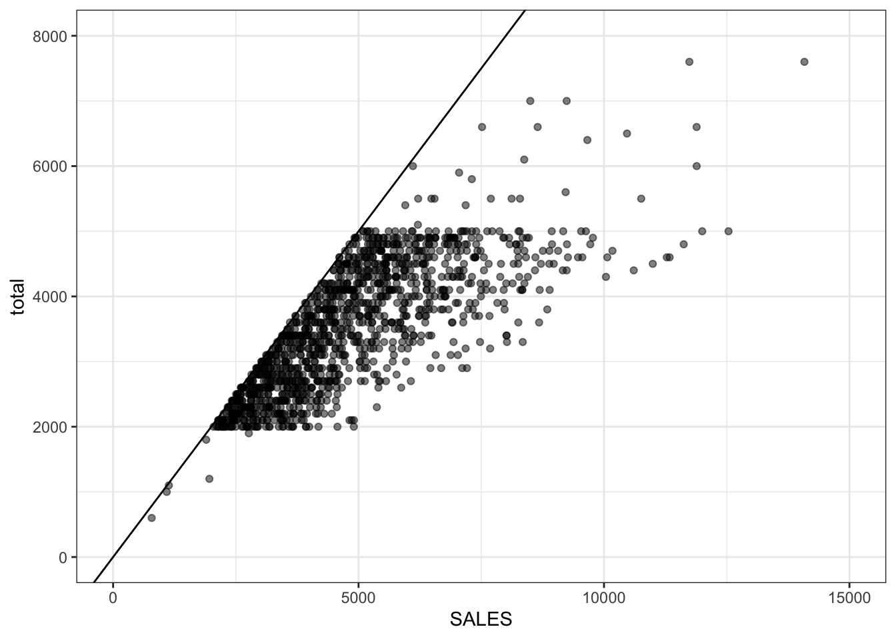

# Data Wrangling {#wrangle}

<div class="incomplete-chapter"></div>

## Intended Learning Outcomes {#ilo-wrangle}

* Be able to select and filter data for relevance
* Be able to create new columns and edit existing ones
* Be able to handle missing data


```r
library(tidyverse)   # data wrangling functions
```

## Wrangling functions

Most <a class='glossary' target='_blank' title='The process of preparing data for visualisation and statistical analysis.' href='https://psyteachr.github.io/glossary/d#data-wrangling'>data wrangling</a> involves the reshaping functions you learned in Chapter\ \@ref(tidy) and these six functions: `select`, `filter`, `arrange`, `mutate`, `summarise`, and `group_by`. You'll remember the last two from Chapter\ \@ref(summary), so we'll only cover them briefly.


We'll use a small example table with the sales and expenses for two years from four regions over two products.


```r
budget <- read_csv("data/budget.csv", show_col_types = FALSE)
```

<div class="kable-table">

<table>
 <thead>
  <tr>
   <th style="text-align:left;"> region </th>
   <th style="text-align:left;"> product </th>
   <th style="text-align:right;"> sales_2019 </th>
   <th style="text-align:right;"> sales_2020 </th>
   <th style="text-align:right;"> expenses_2019 </th>
   <th style="text-align:right;"> expenses_2020 </th>
  </tr>
 </thead>
<tbody>
  <tr>
   <td style="text-align:left;"> North </td>
   <td style="text-align:left;"> widgets </td>
   <td style="text-align:right;"> 12029 </td>
   <td style="text-align:right;"> 9383 </td>
   <td style="text-align:right;"> 10722 </td>
   <td style="text-align:right;"> 9003 </td>
  </tr>
  <tr>
   <td style="text-align:left;"> North </td>
   <td style="text-align:left;"> gadgets </td>
   <td style="text-align:right;"> 5673 </td>
   <td style="text-align:right;"> 5027 </td>
   <td style="text-align:right;"> 5987 </td>
   <td style="text-align:right;"> 6065 </td>
  </tr>
  <tr>
   <td style="text-align:left;"> South </td>
   <td style="text-align:left;"> widgets </td>
   <td style="text-align:right;"> 11023 </td>
   <td style="text-align:right;"> 8450 </td>
   <td style="text-align:right;"> 10904 </td>
   <td style="text-align:right;"> 10572 </td>
  </tr>
  <tr>
   <td style="text-align:left;"> South </td>
   <td style="text-align:left;"> gadgets </td>
   <td style="text-align:right;"> 6972 </td>
   <td style="text-align:right;"> 4005 </td>
   <td style="text-align:right;"> 4340 </td>
   <td style="text-align:right;"> 5150 </td>
  </tr>
  <tr>
   <td style="text-align:left;"> East </td>
   <td style="text-align:left;"> widgets </td>
   <td style="text-align:right;"> 9172 </td>
   <td style="text-align:right;"> 9849 </td>
   <td style="text-align:right;"> 9099 </td>
   <td style="text-align:right;"> 9558 </td>
  </tr>
  <tr>
   <td style="text-align:left;"> East </td>
   <td style="text-align:left;"> gadgets </td>
   <td style="text-align:right;"> 4527 </td>
   <td style="text-align:right;"> 4596 </td>
   <td style="text-align:right;"> 5044 </td>
   <td style="text-align:right;"> 6986 </td>
  </tr>
  <tr>
   <td style="text-align:left;"> West </td>
   <td style="text-align:left;"> widgets </td>
   <td style="text-align:right;"> 10533 </td>
   <td style="text-align:right;"> 10690 </td>
   <td style="text-align:right;"> 10683 </td>
   <td style="text-align:right;"> 9585 </td>
  </tr>
  <tr>
   <td style="text-align:left;"> West </td>
   <td style="text-align:left;"> gadgets </td>
   <td style="text-align:right;"> 6154 </td>
   <td style="text-align:right;"> 5376 </td>
   <td style="text-align:right;"> 5383 </td>
   <td style="text-align:right;"> 4814 </td>
  </tr>
</tbody>
</table>

</div>


### Select

Select columns by name or number.

You can select each column individually, separated by commas (e.g., `region, sales_2019`). You can also select all columns from one to another by separating them with a colon (e.g., `sales_2019:expenses_2020`).


```r
budget2020 <- budget %>% select(region, sales_2020, expenses_2020)
names(budget2020)
```

```
## [1] "region"        "sales_2020"    "expenses_2020"
```

You can select columns by number, which can be useful when the column names are long or complicated. You even rename them by setting `new_name = old_col`. 


```r
regions <- budget %>% select(`Sales Region` = 1, 3:6)
names(regions)
```

```
## [1] "Sales Region"  "sales_2019"    "sales_2020"    "expenses_2019"
## [5] "expenses_2020"
```

You can use a minus symbol to un-select columns, leaving all of the other columns. If you want to exclude a span of columns, put parentheses around the span first, e.g., `-(sales_2019:expenses_2020)`, not `-sales_2019:expenses_2020`.


```r
sales <- budget %>% select(-(expenses_2019:expenses_2020))
names(sales)
```

```
## [1] "region"     "product"    "sales_2019" "sales_2020"
```

You can select columns based on criteria about the column names.

| function | definition |
|----------|------------|
| `starts_with()` | select columns that start with a character string|
| `ends_with()` | elect columns that end with a character string |
| `contains()` | select columns that contain a character string |
| `num_range()` | select columns with a name that matches the pattern `prefix` |

::: {.info data-latex=""}
Use `width` to set the number of digits with leading
zeros. For example, `num_range('var_', 8:10, width=2)` selects columns `var_08`, `var_09`, and `var_10`.
:::


::: {.try data-latex=""}
What are the resulting columns for these four examples?

* `budget %>% select(starts_with("sales"))`
    <select class='webex-select'><option value='blank'></option><option value='x'>expenses_2019, expenses_2020</option><option value='x'>sales_2019, sales_2020, expenses_2019, expenses_2020</option><option value='answer'>sales_2019, sales_2020</option><option value='x'>sales_2020, expenses_2020</option></select> 
* `budget %>% select(ends_with("2020"))`
    <select class='webex-select'><option value='blank'></option><option value='x'>sales_2019, sales_2020</option><option value='x'>sales_2019, sales_2020, expenses_2019, expenses_2020</option><option value='answer'>sales_2020, expenses_2020</option><option value='x'>expenses_2019, expenses_2020</option></select>
* `budget %>% select(contains("_"))`
    <select class='webex-select'><option value='blank'></option><option value='x'>sales_2020, expenses_2020</option><option value='answer'>sales_2019, sales_2020, expenses_2019, expenses_2020</option><option value='x'>expenses_2019, expenses_2020</option><option value='x'>sales_2019, sales_2020</option></select>
* `budget %>% select(num_range("expenses_", 2019:2020))`
    <select class='webex-select'><option value='blank'></option><option value='x'>sales_2019, sales_2020, expenses_2019, expenses_2020</option><option value='x'>sales_2020, expenses_2020</option><option value='answer'>expenses_2019, expenses_2020</option><option value='x'>sales_2019, sales_2020</option></select>
:::


### Filter

Select rows by matching column criteria.


```r
# select all rows from the North region
budget %>% filter(region == "North")
```

<div class="kable-table">

<table>
 <thead>
  <tr>
   <th style="text-align:left;"> region </th>
   <th style="text-align:left;"> product </th>
   <th style="text-align:right;"> sales_2019 </th>
   <th style="text-align:right;"> sales_2020 </th>
   <th style="text-align:right;"> expenses_2019 </th>
   <th style="text-align:right;"> expenses_2020 </th>
  </tr>
 </thead>
<tbody>
  <tr>
   <td style="text-align:left;"> North </td>
   <td style="text-align:left;"> widgets </td>
   <td style="text-align:right;"> 12029 </td>
   <td style="text-align:right;"> 9383 </td>
   <td style="text-align:right;"> 10722 </td>
   <td style="text-align:right;"> 9003 </td>
  </tr>
  <tr>
   <td style="text-align:left;"> North </td>
   <td style="text-align:left;"> gadgets </td>
   <td style="text-align:right;"> 5673 </td>
   <td style="text-align:right;"> 5027 </td>
   <td style="text-align:right;"> 5987 </td>
   <td style="text-align:right;"> 6065 </td>
  </tr>
</tbody>
</table>

</div>

::: {.warning data-latex=""}
Remember to use `==` and not `=` to check if two things are equivalent. A single `=` assigns the right-hand value to the left-hand variable.
:::

You can select on multiple criteria by separating them with commas.


```r
budget %>% filter(
  region == "North",
  product == "widgets"
)
```

<div class="kable-table">

<table>
 <thead>
  <tr>
   <th style="text-align:left;"> region </th>
   <th style="text-align:left;"> product </th>
   <th style="text-align:right;"> sales_2019 </th>
   <th style="text-align:right;"> sales_2020 </th>
   <th style="text-align:right;"> expenses_2019 </th>
   <th style="text-align:right;"> expenses_2020 </th>
  </tr>
 </thead>
<tbody>
  <tr>
   <td style="text-align:left;"> North </td>
   <td style="text-align:left;"> widgets </td>
   <td style="text-align:right;"> 12029 </td>
   <td style="text-align:right;"> 9383 </td>
   <td style="text-align:right;"> 10722 </td>
   <td style="text-align:right;"> 9003 </td>
  </tr>
</tbody>
</table>

</div>

You can use the symbols `&`, `|`, and `!` to mean "and", "or", and "not". You can also use other operators to make equations. The equation is checked for each row, and if the result is FALSE, the row is removed.


```r
# regions and products with profit in both 2019 and 2020
profit_both <- budget %>% 
  filter(
    sales_2019 > expenses_2019 &
    sales_2020 > expenses_2020
  )

# regions and products with profit in 2019 or 2020
profit_either <- budget %>% 
  filter(
    sales_2019 > expenses_2019 |
    sales_2020 > expenses_2020
  )

# everything but the North
not_north <- budget %>%
  filter(region != "North")

# 2020 profit greater than 1000
profit_1000 <- budget %>%
  filter(sales_2020 - expenses_2020 > 1000)
```

The <a class='glossary' target='_blank' title='A binary operator (%in%) that returns a logical vector indicating if there is a match or not for its left operand.' href='https://psyteachr.github.io/glossary/m#match-operator'>match operator</a> (`%in%`) is useful here for testing if a column value is in a list.


```r
budget %>%
  filter(region %in% c("North", "South"),
         product == "widgets")
```

<div class="kable-table">

<table>
 <thead>
  <tr>
   <th style="text-align:left;"> region </th>
   <th style="text-align:left;"> product </th>
   <th style="text-align:right;"> sales_2019 </th>
   <th style="text-align:right;"> sales_2020 </th>
   <th style="text-align:right;"> expenses_2019 </th>
   <th style="text-align:right;"> expenses_2020 </th>
  </tr>
 </thead>
<tbody>
  <tr>
   <td style="text-align:left;"> North </td>
   <td style="text-align:left;"> widgets </td>
   <td style="text-align:right;"> 12029 </td>
   <td style="text-align:right;"> 9383 </td>
   <td style="text-align:right;"> 10722 </td>
   <td style="text-align:right;"> 9003 </td>
  </tr>
  <tr>
   <td style="text-align:left;"> South </td>
   <td style="text-align:left;"> widgets </td>
   <td style="text-align:right;"> 11023 </td>
   <td style="text-align:right;"> 8450 </td>
   <td style="text-align:right;"> 10904 </td>
   <td style="text-align:right;"> 10572 </td>
  </tr>
</tbody>
</table>

</div>


### Arrange

Sort your dataset using `arrange()`. You will find yourself needing to sort data in R much less than you do in Excel, since you don't need to have rows next to each other in order to, for example, calculate group means. But `arrange()` can be useful when preparing data for display in tables. Reverse the order using `desc()`.


```r
budget %>%
  arrange(product, desc(region))
```

<div class="kable-table">

<table>
 <thead>
  <tr>
   <th style="text-align:left;"> region </th>
   <th style="text-align:left;"> product </th>
   <th style="text-align:right;"> sales_2019 </th>
   <th style="text-align:right;"> sales_2020 </th>
   <th style="text-align:right;"> expenses_2019 </th>
   <th style="text-align:right;"> expenses_2020 </th>
  </tr>
 </thead>
<tbody>
  <tr>
   <td style="text-align:left;"> West </td>
   <td style="text-align:left;"> gadgets </td>
   <td style="text-align:right;"> 6154 </td>
   <td style="text-align:right;"> 5376 </td>
   <td style="text-align:right;"> 5383 </td>
   <td style="text-align:right;"> 4814 </td>
  </tr>
  <tr>
   <td style="text-align:left;"> South </td>
   <td style="text-align:left;"> gadgets </td>
   <td style="text-align:right;"> 6972 </td>
   <td style="text-align:right;"> 4005 </td>
   <td style="text-align:right;"> 4340 </td>
   <td style="text-align:right;"> 5150 </td>
  </tr>
  <tr>
   <td style="text-align:left;"> North </td>
   <td style="text-align:left;"> gadgets </td>
   <td style="text-align:right;"> 5673 </td>
   <td style="text-align:right;"> 5027 </td>
   <td style="text-align:right;"> 5987 </td>
   <td style="text-align:right;"> 6065 </td>
  </tr>
  <tr>
   <td style="text-align:left;"> East </td>
   <td style="text-align:left;"> gadgets </td>
   <td style="text-align:right;"> 4527 </td>
   <td style="text-align:right;"> 4596 </td>
   <td style="text-align:right;"> 5044 </td>
   <td style="text-align:right;"> 6986 </td>
  </tr>
  <tr>
   <td style="text-align:left;"> West </td>
   <td style="text-align:left;"> widgets </td>
   <td style="text-align:right;"> 10533 </td>
   <td style="text-align:right;"> 10690 </td>
   <td style="text-align:right;"> 10683 </td>
   <td style="text-align:right;"> 9585 </td>
  </tr>
  <tr>
   <td style="text-align:left;"> South </td>
   <td style="text-align:left;"> widgets </td>
   <td style="text-align:right;"> 11023 </td>
   <td style="text-align:right;"> 8450 </td>
   <td style="text-align:right;"> 10904 </td>
   <td style="text-align:right;"> 10572 </td>
  </tr>
  <tr>
   <td style="text-align:left;"> North </td>
   <td style="text-align:left;"> widgets </td>
   <td style="text-align:right;"> 12029 </td>
   <td style="text-align:right;"> 9383 </td>
   <td style="text-align:right;"> 10722 </td>
   <td style="text-align:right;"> 9003 </td>
  </tr>
  <tr>
   <td style="text-align:left;"> East </td>
   <td style="text-align:left;"> widgets </td>
   <td style="text-align:right;"> 9172 </td>
   <td style="text-align:right;"> 9849 </td>
   <td style="text-align:right;"> 9099 </td>
   <td style="text-align:right;"> 9558 </td>
  </tr>
</tbody>
</table>

</div>


::: {.try data-latex=""}
If you want to sort categories in a specific order, turn the column into a <a class='glossary' target='_blank' title='A data type where a specific set of values are stored with labels; An explanatory variable manipulated by the experimenter' href='https://psyteachr.github.io/glossary/f#factor'>factor</a> and set the `levels` in the desired order.


```r
budget %>%
  mutate(region = factor(region, levels = c("North", "South", "East", "West"))) %>%
  filter(product == "gadgets") %>%
  arrange(region)
```

<div class="kable-table">

<table>
 <thead>
  <tr>
   <th style="text-align:left;"> region </th>
   <th style="text-align:left;"> product </th>
   <th style="text-align:right;"> sales_2019 </th>
   <th style="text-align:right;"> sales_2020 </th>
   <th style="text-align:right;"> expenses_2019 </th>
   <th style="text-align:right;"> expenses_2020 </th>
  </tr>
 </thead>
<tbody>
  <tr>
   <td style="text-align:left;"> North </td>
   <td style="text-align:left;"> gadgets </td>
   <td style="text-align:right;"> 5673 </td>
   <td style="text-align:right;"> 5027 </td>
   <td style="text-align:right;"> 5987 </td>
   <td style="text-align:right;"> 6065 </td>
  </tr>
  <tr>
   <td style="text-align:left;"> South </td>
   <td style="text-align:left;"> gadgets </td>
   <td style="text-align:right;"> 6972 </td>
   <td style="text-align:right;"> 4005 </td>
   <td style="text-align:right;"> 4340 </td>
   <td style="text-align:right;"> 5150 </td>
  </tr>
  <tr>
   <td style="text-align:left;"> East </td>
   <td style="text-align:left;"> gadgets </td>
   <td style="text-align:right;"> 4527 </td>
   <td style="text-align:right;"> 4596 </td>
   <td style="text-align:right;"> 5044 </td>
   <td style="text-align:right;"> 6986 </td>
  </tr>
  <tr>
   <td style="text-align:left;"> West </td>
   <td style="text-align:left;"> gadgets </td>
   <td style="text-align:right;"> 6154 </td>
   <td style="text-align:right;"> 5376 </td>
   <td style="text-align:right;"> 5383 </td>
   <td style="text-align:right;"> 4814 </td>
  </tr>
</tbody>
</table>

</div>

:::

### Mutate

Add new columns or change existing ones. Refer to other columns by their names (unquoted). You can add more than one column in the same mutate function, just separate the columns with a comma. Once you make a new column, you can use it in further column definitions (e.g., `profit` below).


```r
budget2 <- budget %>%
  mutate(
    sales = sales_2019 + sales_2020,
    expenses = expenses_2019 + expenses_2020,
    profit = sales - expenses,
    region = paste(region, "Office")
  )
```


::: {.warning data-latex=""}
You can overwrite a column by giving a new column the same name as the old column (see `region`) above. Make sure that you mean to do this and that you aren't trying to use the old column value after you redefine it.
:::


### Summarise {#dplyr-summarise}

You were introduced to the `summarise()` function in Chapter\ @\ref({#summary-summarise}). This applies summary functions to an entire table (or groups, as you'll see in the next section).

Let's say we want to determine the mean sales and expenses, plus the minimum and maximum profit, for any region, product and year. First, we need to reshape the data like we learned in Chapter\ \@ref(tidy), so that there is a column for year and one column each for sales and expenses, instead of separate columns for each year.


```r
budget3 <- budget %>%
  pivot_longer(cols = sales_2019:expenses_2020,
               names_to = c("type", "year"),
               names_sep = "_",
               values_to = "value") %>%
  pivot_wider(names_from = type,
              values_from = value)

head(budget3) # check the format
```

<div class="kable-table">

<table>
 <thead>
  <tr>
   <th style="text-align:left;"> region </th>
   <th style="text-align:left;"> product </th>
   <th style="text-align:left;"> year </th>
   <th style="text-align:right;"> sales </th>
   <th style="text-align:right;"> expenses </th>
  </tr>
 </thead>
<tbody>
  <tr>
   <td style="text-align:left;"> North </td>
   <td style="text-align:left;"> widgets </td>
   <td style="text-align:left;"> 2019 </td>
   <td style="text-align:right;"> 12029 </td>
   <td style="text-align:right;"> 10722 </td>
  </tr>
  <tr>
   <td style="text-align:left;"> North </td>
   <td style="text-align:left;"> widgets </td>
   <td style="text-align:left;"> 2020 </td>
   <td style="text-align:right;"> 9383 </td>
   <td style="text-align:right;"> 9003 </td>
  </tr>
  <tr>
   <td style="text-align:left;"> North </td>
   <td style="text-align:left;"> gadgets </td>
   <td style="text-align:left;"> 2019 </td>
   <td style="text-align:right;"> 5673 </td>
   <td style="text-align:right;"> 5987 </td>
  </tr>
  <tr>
   <td style="text-align:left;"> North </td>
   <td style="text-align:left;"> gadgets </td>
   <td style="text-align:left;"> 2020 </td>
   <td style="text-align:right;"> 5027 </td>
   <td style="text-align:right;"> 6065 </td>
  </tr>
  <tr>
   <td style="text-align:left;"> South </td>
   <td style="text-align:left;"> widgets </td>
   <td style="text-align:left;"> 2019 </td>
   <td style="text-align:right;"> 11023 </td>
   <td style="text-align:right;"> 10904 </td>
  </tr>
  <tr>
   <td style="text-align:left;"> South </td>
   <td style="text-align:left;"> widgets </td>
   <td style="text-align:left;"> 2020 </td>
   <td style="text-align:right;"> 8450 </td>
   <td style="text-align:right;"> 10572 </td>
  </tr>
</tbody>
</table>

</div>

Now we can create summary statistics for the table.


```r
budget3 %>%
  summarise(
    mean_sales = mean(sales),
    mean_expenses = mean(expenses),
    min_profit = min(expenses - sales),
    max_profit = max(expenses - sales)
  )
```

<div class="kable-table">

<table>
 <thead>
  <tr>
   <th style="text-align:right;"> mean_sales </th>
   <th style="text-align:right;"> mean_expenses </th>
   <th style="text-align:right;"> min_profit </th>
   <th style="text-align:right;"> max_profit </th>
  </tr>
 </thead>
<tbody>
  <tr>
   <td style="text-align:right;"> 7716.188 </td>
   <td style="text-align:right;"> 7743.438 </td>
   <td style="text-align:right;"> -2632 </td>
   <td style="text-align:right;"> 2390 </td>
  </tr>
</tbody>
</table>

</div>


### Group By {#dplyr-groupby}

You were introduced to the `group_by()` function in Chapter\ \@ref(grouping). For example, you can break down the summary statistics above by year and product.


```r
year_prod <- budget3 %>%
  group_by(year, product) %>%
  summarise(
    mean_sales = mean(sales),
    mean_expenses = mean(expenses),
    min_profit = min(expenses - sales),
    max_profit = max(expenses - sales),
    .groups = "drop"
  )

year_prod
```

<div class="kable-table">

<table>
 <thead>
  <tr>
   <th style="text-align:left;"> year </th>
   <th style="text-align:left;"> product </th>
   <th style="text-align:right;"> mean_sales </th>
   <th style="text-align:right;"> mean_expenses </th>
   <th style="text-align:right;"> min_profit </th>
   <th style="text-align:right;"> max_profit </th>
  </tr>
 </thead>
<tbody>
  <tr>
   <td style="text-align:left;"> 2019 </td>
   <td style="text-align:left;"> gadgets </td>
   <td style="text-align:right;"> 5831.50 </td>
   <td style="text-align:right;"> 5188.50 </td>
   <td style="text-align:right;"> -2632 </td>
   <td style="text-align:right;"> 517 </td>
  </tr>
  <tr>
   <td style="text-align:left;"> 2019 </td>
   <td style="text-align:left;"> widgets </td>
   <td style="text-align:right;"> 10689.25 </td>
   <td style="text-align:right;"> 10352.00 </td>
   <td style="text-align:right;"> -1307 </td>
   <td style="text-align:right;"> 150 </td>
  </tr>
  <tr>
   <td style="text-align:left;"> 2020 </td>
   <td style="text-align:left;"> gadgets </td>
   <td style="text-align:right;"> 4751.00 </td>
   <td style="text-align:right;"> 5753.75 </td>
   <td style="text-align:right;"> -562 </td>
   <td style="text-align:right;"> 2390 </td>
  </tr>
  <tr>
   <td style="text-align:left;"> 2020 </td>
   <td style="text-align:left;"> widgets </td>
   <td style="text-align:right;"> 9593.00 </td>
   <td style="text-align:right;"> 9679.50 </td>
   <td style="text-align:right;"> -1105 </td>
   <td style="text-align:right;"> 2122 </td>
  </tr>
</tbody>
</table>

</div>

::: {.try data-latex=""}
How would you find out the maximum sales for each region?

<div class='webex-radiogroup' id='radio_COQTLWWMJT'><label><input type="radio" autocomplete="off" name="radio_COQTLWWMJT" value="answer"></input> <span><pre>budget3 %>%
  group_by(region) %>%
  summarise(max_sales = max(sales)</pre></span></label><label><input type="radio" autocomplete="off" name="radio_COQTLWWMJT" value="x"></input> <span><pre>budget3 %>%
  group_by(sales) %>%
  summarise(max_sales = max(region)</pre></span></label><label><input type="radio" autocomplete="off" name="radio_COQTLWWMJT" value="x"></input> <span><pre>budget3 %>%
  group_by(region) %>%
  summarise(max_sales = max(region)</pre></span></label><label><input type="radio" autocomplete="off" name="radio_COQTLWWMJT" value="x"></input> <span><pre>budget3 %>%
  group_by(sales) %>%
  summarise(max_sales = max(sales)</pre></span></label></div>

:::

## Complications

### Rounding

Let's say we want to round all the values to the nearest pound. The pattern below uses the `across()` function to apply the `round()` function to the columns from `mean_sales` to `max_profit`.


```r
year_prod %>%
  mutate(across(.cols = mean_sales:max_profit, 
                .fns = round))
```

<div class="kable-table">

<table>
 <thead>
  <tr>
   <th style="text-align:left;"> year </th>
   <th style="text-align:left;"> product </th>
   <th style="text-align:right;"> mean_sales </th>
   <th style="text-align:right;"> mean_expenses </th>
   <th style="text-align:right;"> min_profit </th>
   <th style="text-align:right;"> max_profit </th>
  </tr>
 </thead>
<tbody>
  <tr>
   <td style="text-align:left;"> 2019 </td>
   <td style="text-align:left;"> gadgets </td>
   <td style="text-align:right;"> 5832 </td>
   <td style="text-align:right;"> 5188 </td>
   <td style="text-align:right;"> -2632 </td>
   <td style="text-align:right;"> 517 </td>
  </tr>
  <tr>
   <td style="text-align:left;"> 2019 </td>
   <td style="text-align:left;"> widgets </td>
   <td style="text-align:right;"> 10689 </td>
   <td style="text-align:right;"> 10352 </td>
   <td style="text-align:right;"> -1307 </td>
   <td style="text-align:right;"> 150 </td>
  </tr>
  <tr>
   <td style="text-align:left;"> 2020 </td>
   <td style="text-align:left;"> gadgets </td>
   <td style="text-align:right;"> 4751 </td>
   <td style="text-align:right;"> 5754 </td>
   <td style="text-align:right;"> -562 </td>
   <td style="text-align:right;"> 2390 </td>
  </tr>
  <tr>
   <td style="text-align:left;"> 2020 </td>
   <td style="text-align:left;"> widgets </td>
   <td style="text-align:right;"> 9593 </td>
   <td style="text-align:right;"> 9680 </td>
   <td style="text-align:right;"> -1105 </td>
   <td style="text-align:right;"> 2122 </td>
  </tr>
</tbody>
</table>

</div>

If you compare this table to the one in Section\ \@ref(dplyr-groupby), you'll see that the 2019 gadgets mean sales rounded up from 5831.5 to 5832, while the mean expenses rounded from 5188.5 to 5188. What's going on!?

This may seem like a mistake, but R rounds .5 to the nearest even number, rather than always up, like you were probably taught in school. This prevents overestimation biases, since x.5 is *exactly* halfway between x and x+1, so there is no reason it should always round up.


```r
round(0.5)
round(1.5)
```

```
## [1] 0
## [1] 2
```

However, this might throw a monkey wrench into your own systems. For example, our school policy is to round up for course marks at x.5. The solution is to define your own version of `round()` (modified from [Andrew Landgraf's blog](http://andrewlandgraf.com/2012/06/15/rounding-in-r/){target="_blank"}). Put it in a hidden code block at the top of your script, with a clear warning that this is changing the way `round()` normally works. You don't need to understand how this function works, just how to use it.


```r
#!!!!!! redefining round so 5s round up !!!!!! 
round <- function(x, digits = 0) {
  posneg = sign(x)
  z = abs(x)*10^digits
  z = z + 0.5 + sqrt(.Machine$double.eps)
  z = trunc(z)
  z = z/10^digits
  z*posneg
}
```

Now `round()` should work as you'd expect.


```r
round(0.5)
round(1.5)
```

```
## [1] 1
## [1] 2
```

Just remove your version if you want R to go back to the original method. Remember that you have to define the new round method in any script that uses it, and run the definition code before you use it interactively. You can check your Environment pane to see whether `round` is listed under "Functions".


```r
# remove new round() method
rm(round)
```


### Missing values

What if the North region hasn't returned their sales data for 2020 yet?


```r
# set sales values to NA for North 2020 rows
budget_missing <- budget3 %>%
  mutate(sales = ifelse(region == "North" & year == 2020, NA, sales))

# check
filter(budget_missing, region == "North")
```

<div class="kable-table">

<table>
 <thead>
  <tr>
   <th style="text-align:left;"> region </th>
   <th style="text-align:left;"> product </th>
   <th style="text-align:left;"> year </th>
   <th style="text-align:right;"> sales </th>
   <th style="text-align:right;"> expenses </th>
  </tr>
 </thead>
<tbody>
  <tr>
   <td style="text-align:left;"> North </td>
   <td style="text-align:left;"> widgets </td>
   <td style="text-align:left;"> 2019 </td>
   <td style="text-align:right;"> 12029 </td>
   <td style="text-align:right;"> 10722 </td>
  </tr>
  <tr>
   <td style="text-align:left;"> North </td>
   <td style="text-align:left;"> widgets </td>
   <td style="text-align:left;"> 2020 </td>
   <td style="text-align:right;"> NA </td>
   <td style="text-align:right;"> 9003 </td>
  </tr>
  <tr>
   <td style="text-align:left;"> North </td>
   <td style="text-align:left;"> gadgets </td>
   <td style="text-align:left;"> 2019 </td>
   <td style="text-align:right;"> 5673 </td>
   <td style="text-align:right;"> 5987 </td>
  </tr>
  <tr>
   <td style="text-align:left;"> North </td>
   <td style="text-align:left;"> gadgets </td>
   <td style="text-align:left;"> 2020 </td>
   <td style="text-align:right;"> NA </td>
   <td style="text-align:right;"> 6065 </td>
  </tr>
</tbody>
</table>

</div>

Now, if we try to calculate the mean sales and profits, we get missing values for any summary value that used one of the North 2020 sales values.


```r
budget_missing %>%
  group_by(year, product) %>%
  summarise(
    mean_sales = mean(sales),
    mean_expenses = mean(expenses),
    min_profit = min(expenses - sales),
    max_profit = max(expenses - sales),
    .groups = "drop"
  )
```

<div class="kable-table">

<table>
 <thead>
  <tr>
   <th style="text-align:left;"> year </th>
   <th style="text-align:left;"> product </th>
   <th style="text-align:right;"> mean_sales </th>
   <th style="text-align:right;"> mean_expenses </th>
   <th style="text-align:right;"> min_profit </th>
   <th style="text-align:right;"> max_profit </th>
  </tr>
 </thead>
<tbody>
  <tr>
   <td style="text-align:left;"> 2019 </td>
   <td style="text-align:left;"> gadgets </td>
   <td style="text-align:right;"> 5831.50 </td>
   <td style="text-align:right;"> 5188.50 </td>
   <td style="text-align:right;"> -2632 </td>
   <td style="text-align:right;"> 517 </td>
  </tr>
  <tr>
   <td style="text-align:left;"> 2019 </td>
   <td style="text-align:left;"> widgets </td>
   <td style="text-align:right;"> 10689.25 </td>
   <td style="text-align:right;"> 10352.00 </td>
   <td style="text-align:right;"> -1307 </td>
   <td style="text-align:right;"> 150 </td>
  </tr>
  <tr>
   <td style="text-align:left;"> 2020 </td>
   <td style="text-align:left;"> gadgets </td>
   <td style="text-align:right;"> NA </td>
   <td style="text-align:right;"> 5753.75 </td>
   <td style="text-align:right;"> NA </td>
   <td style="text-align:right;"> NA </td>
  </tr>
  <tr>
   <td style="text-align:left;"> 2020 </td>
   <td style="text-align:left;"> widgets </td>
   <td style="text-align:right;"> NA </td>
   <td style="text-align:right;"> 9679.50 </td>
   <td style="text-align:right;"> NA </td>
   <td style="text-align:right;"> NA </td>
  </tr>
</tbody>
</table>

</div>

This is because `NA` basically means "I don't know", and the sum of 100 and "I don't know" is "I don't know", not 100. However, when you're calculating means, you often want to just ignore missing values. Set `na.rm = TRUE` in the summary function to remove missing values before calculating.


```r
budget_missing %>%
  group_by(year, product) %>%
  summarise(
    mean_sales = mean(sales, na.rm = TRUE),
    mean_expenses = mean(expenses, na.rm = TRUE),
    min_profit = min(expenses - sales, na.rm = TRUE),
    max_profit = max(expenses - sales, na.rm = TRUE),
    .groups = "drop"
  )
```

<div class="kable-table">

<table>
 <thead>
  <tr>
   <th style="text-align:left;"> year </th>
   <th style="text-align:left;"> product </th>
   <th style="text-align:right;"> mean_sales </th>
   <th style="text-align:right;"> mean_expenses </th>
   <th style="text-align:right;"> min_profit </th>
   <th style="text-align:right;"> max_profit </th>
  </tr>
 </thead>
<tbody>
  <tr>
   <td style="text-align:left;"> 2019 </td>
   <td style="text-align:left;"> gadgets </td>
   <td style="text-align:right;"> 5831.50 </td>
   <td style="text-align:right;"> 5188.50 </td>
   <td style="text-align:right;"> -2632 </td>
   <td style="text-align:right;"> 517 </td>
  </tr>
  <tr>
   <td style="text-align:left;"> 2019 </td>
   <td style="text-align:left;"> widgets </td>
   <td style="text-align:right;"> 10689.25 </td>
   <td style="text-align:right;"> 10352.00 </td>
   <td style="text-align:right;"> -1307 </td>
   <td style="text-align:right;"> 150 </td>
  </tr>
  <tr>
   <td style="text-align:left;"> 2020 </td>
   <td style="text-align:left;"> gadgets </td>
   <td style="text-align:right;"> 4659.00 </td>
   <td style="text-align:right;"> 5753.75 </td>
   <td style="text-align:right;"> -562 </td>
   <td style="text-align:right;"> 2390 </td>
  </tr>
  <tr>
   <td style="text-align:left;"> 2020 </td>
   <td style="text-align:left;"> widgets </td>
   <td style="text-align:right;"> 9663.00 </td>
   <td style="text-align:right;"> 9679.50 </td>
   <td style="text-align:right;"> -1105 </td>
   <td style="text-align:right;"> 2122 </td>
  </tr>
</tbody>
</table>

</div>

If you want to find out how many missing or non-missing values there are in a column, use the `is.na()` function to get a <a class='glossary' target='_blank' title='A data type representing TRUE or FALSE values.' href='https://psyteachr.github.io/glossary/l#logical'>logical</a> vector of whether or not each value is missing, and use `sum()` to count how many values are TRUE or `mean()` to calculate the proportion of TRUE values.


```r
budget_missing %>%
  group_by(year, product) %>%
  summarise(
    n_valid = sum(!is.na(sales)),
    n_missing = sum(is.na(sales)),
    prop_missing = mean(is.na(sales)),
    .groups = "drop"
  )
```

<div class="kable-table">

<table>
 <thead>
  <tr>
   <th style="text-align:left;"> year </th>
   <th style="text-align:left;"> product </th>
   <th style="text-align:right;"> n_valid </th>
   <th style="text-align:right;"> n_missing </th>
   <th style="text-align:right;"> prop_missing </th>
  </tr>
 </thead>
<tbody>
  <tr>
   <td style="text-align:left;"> 2019 </td>
   <td style="text-align:left;"> gadgets </td>
   <td style="text-align:right;"> 4 </td>
   <td style="text-align:right;"> 0 </td>
   <td style="text-align:right;"> 0.00 </td>
  </tr>
  <tr>
   <td style="text-align:left;"> 2019 </td>
   <td style="text-align:left;"> widgets </td>
   <td style="text-align:right;"> 4 </td>
   <td style="text-align:right;"> 0 </td>
   <td style="text-align:right;"> 0.00 </td>
  </tr>
  <tr>
   <td style="text-align:left;"> 2020 </td>
   <td style="text-align:left;"> gadgets </td>
   <td style="text-align:right;"> 3 </td>
   <td style="text-align:right;"> 1 </td>
   <td style="text-align:right;"> 0.25 </td>
  </tr>
  <tr>
   <td style="text-align:left;"> 2020 </td>
   <td style="text-align:left;"> widgets </td>
   <td style="text-align:right;"> 3 </td>
   <td style="text-align:right;"> 1 </td>
   <td style="text-align:right;"> 0.25 </td>
  </tr>
</tbody>
</table>

</div>


## Putting it together {#together-wrangle}

Load some demo data we first used in Chapter\ \@ref(data). Use `glimpse()` or another method to get familiar with the data set.


```r
# from https://www.kaggle.com/kyanyoga/sample-sales-data
sales <- read_csv("data/sales_data_sample.csv",
                  show_col_types = FALSE)
```


Double check that the `SALES` column does equal the `QUANTITYORDERED` column times the `PRICEEACH`. You can select just the columns you need and rename them when selecting to make the code more readable.


```r
sales_check <- sales %>%
  select(SALES, n = QUANTITYORDERED, price = PRICEEACH) %>%
  mutate(total = n * price)
```

Make a table of any rows where the value of `total` doesn't equal `SALES`.


```r
errors <- sales_check %>%
  filter(SALES != total)

head(errors)
```

<div class="kable-table">

<table>
 <thead>
  <tr>
   <th style="text-align:right;"> SALES </th>
   <th style="text-align:right;"> n </th>
   <th style="text-align:right;"> price </th>
   <th style="text-align:right;"> total </th>
  </tr>
 </thead>
<tbody>
  <tr>
   <td style="text-align:right;"> 2765.90 </td>
   <td style="text-align:right;"> 34 </td>
   <td style="text-align:right;"> 81.35 </td>
   <td style="text-align:right;"> 2765.90 </td>
  </tr>
  <tr>
   <td style="text-align:right;"> 3884.34 </td>
   <td style="text-align:right;"> 41 </td>
   <td style="text-align:right;"> 94.74 </td>
   <td style="text-align:right;"> 3884.34 </td>
  </tr>
  <tr>
   <td style="text-align:right;"> 3746.70 </td>
   <td style="text-align:right;"> 45 </td>
   <td style="text-align:right;"> 83.26 </td>
   <td style="text-align:right;"> 3746.70 </td>
  </tr>
  <tr>
   <td style="text-align:right;"> 5205.27 </td>
   <td style="text-align:right;"> 49 </td>
   <td style="text-align:right;"> 100.00 </td>
   <td style="text-align:right;"> 4900.00 </td>
  </tr>
  <tr>
   <td style="text-align:right;"> 3479.76 </td>
   <td style="text-align:right;"> 36 </td>
   <td style="text-align:right;"> 96.66 </td>
   <td style="text-align:right;"> 3479.76 </td>
  </tr>
  <tr>
   <td style="text-align:right;"> 5512.32 </td>
   <td style="text-align:right;"> 48 </td>
   <td style="text-align:right;"> 100.00 </td>
   <td style="text-align:right;"> 4800.00 </td>
  </tr>
</tbody>
</table>

</div>

If you check the `errors` table, you'll see that 1697 of the original 2823 rows have "errors", even though many of the values in the `SALES` and `sales_check` columns look identical. You can fix this by rounding the value of `total` to 2 decimal places.

::: {.info data-latex=""}
This is due to the way values with decimal places are represented by a computer. You use base 10 to count, and have to represent some numbers with a repeating decimal, like 1/3 is .0333 repeating, while a computer uses binary to count, and has to represent different numbers using repeats. This can lead to very small differences when you divide or multiply some numbers.


```r
options(scipen = 20) # avoids scientific notation
x = (1/49 * 49)
x # prints as 1
1-x # but is actually very slightly smaller
```

```
## [1] 1
## [1] 0.0000000000000001110223
```

:::


```r
errors <- sales_check %>%
  filter(SALES != round(total, 2))
```

There are still 1304 errors! Lets look at the 10 smallest. We can do this by calculating the difference, arranging from smallest to largest, and filtering for the first 10 rows. 


```r
errors %>%
  mutate(diff = SALES - total) %>%
  arrange(diff) %>%
  filter(row_number() <= 10)
```

Alternatively, we can use a `slice` function.


```r
errors %>%
  mutate(diff = SALES - total) %>%
  slice_min(order_by = diff, n = 10)
```

<div class="kable-table">

<table>
 <thead>
  <tr>
   <th style="text-align:right;"> SALES </th>
   <th style="text-align:right;"> n </th>
   <th style="text-align:right;"> price </th>
   <th style="text-align:right;"> total </th>
   <th style="text-align:right;"> diff </th>
  </tr>
 </thead>
<tbody>
  <tr>
   <td style="text-align:right;"> 2600.26 </td>
   <td style="text-align:right;"> 26 </td>
   <td style="text-align:right;"> 100 </td>
   <td style="text-align:right;"> 2600 </td>
   <td style="text-align:right;"> 0.26 </td>
  </tr>
  <tr>
   <td style="text-align:right;"> 3602.16 </td>
   <td style="text-align:right;"> 36 </td>
   <td style="text-align:right;"> 100 </td>
   <td style="text-align:right;"> 3600 </td>
   <td style="text-align:right;"> 2.16 </td>
  </tr>
  <tr>
   <td style="text-align:right;"> 2504.75 </td>
   <td style="text-align:right;"> 25 </td>
   <td style="text-align:right;"> 100 </td>
   <td style="text-align:right;"> 2500 </td>
   <td style="text-align:right;"> 4.75 </td>
  </tr>
  <tr>
   <td style="text-align:right;"> 4607.36 </td>
   <td style="text-align:right;"> 46 </td>
   <td style="text-align:right;"> 100 </td>
   <td style="text-align:right;"> 4600 </td>
   <td style="text-align:right;"> 7.36 </td>
  </tr>
  <tr>
   <td style="text-align:right;"> 3711.10 </td>
   <td style="text-align:right;"> 37 </td>
   <td style="text-align:right;"> 100 </td>
   <td style="text-align:right;"> 3700 </td>
   <td style="text-align:right;"> 11.10 </td>
  </tr>
  <tr>
   <td style="text-align:right;"> 3912.09 </td>
   <td style="text-align:right;"> 39 </td>
   <td style="text-align:right;"> 100 </td>
   <td style="text-align:right;"> 3900 </td>
   <td style="text-align:right;"> 12.09 </td>
  </tr>
  <tr>
   <td style="text-align:right;"> 2612.48 </td>
   <td style="text-align:right;"> 26 </td>
   <td style="text-align:right;"> 100 </td>
   <td style="text-align:right;"> 2600 </td>
   <td style="text-align:right;"> 12.48 </td>
  </tr>
  <tr>
   <td style="text-align:right;"> 4613.80 </td>
   <td style="text-align:right;"> 46 </td>
   <td style="text-align:right;"> 100 </td>
   <td style="text-align:right;"> 4600 </td>
   <td style="text-align:right;"> 13.80 </td>
  </tr>
  <tr>
   <td style="text-align:right;"> 4814.40 </td>
   <td style="text-align:right;"> 48 </td>
   <td style="text-align:right;"> 100 </td>
   <td style="text-align:right;"> 4800 </td>
   <td style="text-align:right;"> 14.40 </td>
  </tr>
  <tr>
   <td style="text-align:right;"> 2915.66 </td>
   <td style="text-align:right;"> 29 </td>
   <td style="text-align:right;"> 100 </td>
   <td style="text-align:right;"> 2900 </td>
   <td style="text-align:right;"> 15.66 </td>
  </tr>
</tbody>
</table>

</div>

If we plot the data, it looks like all of the errors are in one direction.


```r
ggplot(errors, aes(x = SALES, y = total)) + 
  geom_point(alpha = 0.5) +
  geom_abline(slope = 1, intercept = 0) +
  coord_cartesian(xlim = c(0, 15000), ylim = c(0, 8000))
```



Let's have a look at the data separately for products with a price of exactly 100 versus other products.


```r
sales_check %>%
  mutate(price100 = price == 100) %>%
  ggplot(aes(x = SALES, y = total, color = price100)) + 
  geom_point(alpha = 0.5) +
  geom_abline(slope = 1, intercept = 0) +
  coord_cartesian(xlim = c(0, 15000), ylim = c(0, 8000))
```


It looks like that's the problem with this dataset: the `PRICEEACH` column doesn't go above 100. Let's fix that by dividing the total sale price by the quantity ordered.


```r
fixed_sales <- sales %>%
  mutate(PRICEEACH = round(SALES / QUANTITYORDERED, 2))
```

Now we can re-run the code from before to find any errors. We're adding in the `ORDERNUMBER` for the next step.


```r
sales_check <- fixed_sales %>%
  select(ORDERNUMBER, 
         SALES, 
         n = QUANTITYORDERED, 
         price = PRICEEACH) %>%
  mutate(total = n * price)

errors <- sales_check %>%
  filter(SALES != round(total, 2))

errors
```

<div class="kable-table">

<table>
 <thead>
  <tr>
   <th style="text-align:right;"> ORDERNUMBER </th>
   <th style="text-align:right;"> SALES </th>
   <th style="text-align:right;"> n </th>
   <th style="text-align:right;"> price </th>
   <th style="text-align:right;"> total </th>
  </tr>
 </thead>
<tbody>
  <tr>
   <td style="text-align:right;"> 10304 </td>
   <td style="text-align:right;"> 10172.7 </td>
   <td style="text-align:right;"> 47 </td>
   <td style="text-align:right;"> 216.44 </td>
   <td style="text-align:right;"> 10172.68 </td>
  </tr>
  <tr>
   <td style="text-align:right;"> 10312 </td>
   <td style="text-align:right;"> 11623.7 </td>
   <td style="text-align:right;"> 48 </td>
   <td style="text-align:right;"> 242.16 </td>
   <td style="text-align:right;"> 11623.68 </td>
  </tr>
  <tr>
   <td style="text-align:right;"> 10405 </td>
   <td style="text-align:right;"> 11739.7 </td>
   <td style="text-align:right;"> 76 </td>
   <td style="text-align:right;"> 154.47 </td>
   <td style="text-align:right;"> 11739.72 </td>
  </tr>
  <tr>
   <td style="text-align:right;"> 10375 </td>
   <td style="text-align:right;"> 10039.6 </td>
   <td style="text-align:right;"> 43 </td>
   <td style="text-align:right;"> 233.48 </td>
   <td style="text-align:right;"> 10039.64 </td>
  </tr>
  <tr>
   <td style="text-align:right;"> 10388 </td>
   <td style="text-align:right;"> 10066.6 </td>
   <td style="text-align:right;"> 46 </td>
   <td style="text-align:right;"> 218.84 </td>
   <td style="text-align:right;"> 10066.64 </td>
  </tr>
</tbody>
</table>

</div>

There are 5 instances where the quantity ordered doesn't divide into the total price in a way that produces prices that round to the nearest cent. These might require further investigation, but let's just set the value of `SALES` to missing for the orders in the `errors` tables.


```r
fixed_sales <- fixed_sales %>%
  mutate(SALES = ifelse(
    test = ORDERNUMBER %in% errors$ORDERNUMBER,
    yes = NA,
    no = SALES)
  )
```


Now that you've fixed (most of) the problems with the dataset, see if you can figure out how to make the table below. It should take you 5 steps.

<div class="kable-table">

<table>
 <thead>
  <tr>
   <th style="text-align:left;"> PRODUCTLINE </th>
   <th style="text-align:right;"> 2003 </th>
   <th style="text-align:right;"> 2004 </th>
   <th style="text-align:right;"> 2005 </th>
  </tr>
 </thead>
<tbody>
  <tr>
   <td style="text-align:left;"> Planes </td>
   <td style="text-align:right;"> 272258 </td>
   <td style="text-align:right;"> 502672 </td>
   <td style="text-align:right;"> 159051 </td>
  </tr>
  <tr>
   <td style="text-align:left;"> Ships </td>
   <td style="text-align:right;"> 244821 </td>
   <td style="text-align:right;"> 341438 </td>
   <td style="text-align:right;"> 128178 </td>
  </tr>
  <tr>
   <td style="text-align:left;"> Trains </td>
   <td style="text-align:right;"> 72802 </td>
   <td style="text-align:right;"> 116524 </td>
   <td style="text-align:right;"> 36917 </td>
  </tr>
</tbody>
</table>

</div>


<div class='webex-solution'><button>Solution</button>

```r
fixed_sales %>%
  filter(PRODUCTLINE %in% c("Planes", "Ships", "Trains")) %>%
  group_by(YEAR_ID, PRODUCTLINE) %>%
  summarise(total = sum(SALES, na.rm = TRUE),
            .groups = "drop") %>%
  mutate(total = round(total)) %>%
  pivot_wider(names_from = YEAR_ID,
              values_from = total)
```


</div>

## Exercises

### Mutate

Load some data about the [population of the Scottish counties](https://psyteachr.github.io/ads-v1/data/scottish_population.csv). 


```r
scotpop <- read_csv("data/scottish_population.csv",
                    show_col_types = FALSE)
```

Transform the population value to the nearest thousands (e.g., 3433 would be "3K"), order from most to least populous, put the columns in the order `population` (in K) then `county`, and show only the counties with populations greater than 200K. 

<div class="kable-table">

<table>
 <thead>
  <tr>
   <th style="text-align:left;"> population </th>
   <th style="text-align:left;"> county </th>
  </tr>
 </thead>
<tbody>
  <tr>
   <td style="text-align:left;"> 593K </td>
   <td style="text-align:left;"> Glasgow </td>
  </tr>
  <tr>
   <td style="text-align:left;"> 486K </td>
   <td style="text-align:left;"> Edinburgh </td>
  </tr>
  <tr>
   <td style="text-align:left;"> 365K </td>
   <td style="text-align:left;"> Fife </td>
  </tr>
  <tr>
   <td style="text-align:left;"> 326K </td>
   <td style="text-align:left;"> North Lanarkshire </td>
  </tr>
  <tr>
   <td style="text-align:left;"> 312K </td>
   <td style="text-align:left;"> South Lanarkshire </td>
  </tr>
  <tr>
   <td style="text-align:left;"> 246K </td>
   <td style="text-align:left;"> Aberdeenshire </td>
  </tr>
  <tr>
   <td style="text-align:left;"> 222K </td>
   <td style="text-align:left;"> Highland </td>
  </tr>
  <tr>
   <td style="text-align:left;"> 217K </td>
   <td style="text-align:left;"> Aberdeen </td>
  </tr>
</tbody>
</table>

</div>

::: {.try data-latex=""}
There are several different ways you could make the table above. Some functions could be in a different order and some couldn't. See where you can move the `filter()` and `arrange()` functions.
:::


<div class='webex-solution'><button>Solution</button>

```r
scotpop %>%
  arrange(desc(population)) %>%
  filter(population > 200000) %>%
  mutate(kpop = round(population/1000) %>% paste0("K")) %>%
  select(population = kpop, 
         county = name)
```


</div>

## Glossary {#glossary-wrangle}

<table>
 <thead>
  <tr>
   <th style="text-align:left;"> term </th>
   <th style="text-align:left;"> definition </th>
  </tr>
 </thead>
<tbody>
  <tr>
   <td style="text-align:left;"> [data wrangling](https://psyteachr.github.io/glossary/d.html#data-wrangling){class="glossary" target="_blank"} </td>
   <td style="text-align:left;"> The process of preparing data for visualisation and statistical analysis. </td>
  </tr>
  <tr>
   <td style="text-align:left;"> [factor](https://psyteachr.github.io/glossary/f.html#factor){class="glossary" target="_blank"} </td>
   <td style="text-align:left;"> A data type where a specific set of values are stored with labels; An explanatory variable manipulated by the experimenter </td>
  </tr>
  <tr>
   <td style="text-align:left;"> [logical](https://psyteachr.github.io/glossary/l.html#logical){class="glossary" target="_blank"} </td>
   <td style="text-align:left;"> A data type representing TRUE or FALSE values. </td>
  </tr>
  <tr>
   <td style="text-align:left;"> [match operator](https://psyteachr.github.io/glossary/m.html#match-operator){class="glossary" target="_blank"} </td>
   <td style="text-align:left;"> A binary operator (%in%) that returns a logical vector indicating if there is a match or not for its left operand. </td>
  </tr>
</tbody>
</table>


## Further resources {#resources-wrangle}

* [Data transformation cheat sheet](https://raw.githubusercontent.com/rstudio/cheatsheets/main/data-transformation.pdf)
* [Chapter 5: Data Transformation ](http://r4ds.had.co.nz/transform.html) in *R for Data Science*


