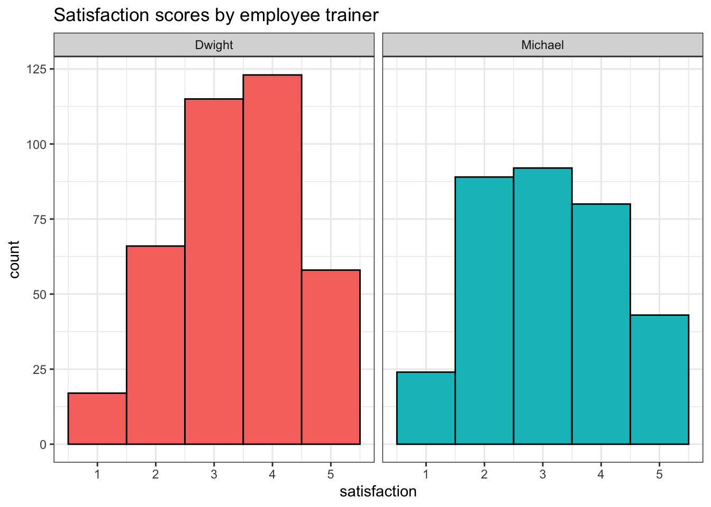
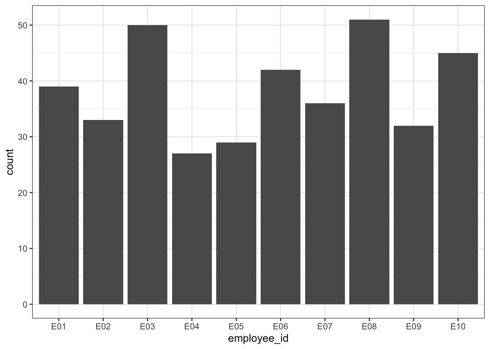

# Data Wrangling {#wrangle}

## Intended Learning Outcomes {#ilo-wrangle}

* Be able to select and filter data for relevance
* Be able to create new columns and edit existing ones
* Be able to handle missing data

## Walkthrough video {#walkthrough-wrangle}

There is a walkthrough video of this chapter available via [Echo360.](https://echo360.org.uk/media/dc1e2869-a6c2-45d8-ab40-cb85cdb67f43/public) Please note that there may have been minor edits to the book since the video was recorded. Where there are differences, the book should always take precedence.

## Set-up {#setup-wrangle}

First, create a new project for the work we'll do in this chapter named <code class='path'>09-wrangle</code>. Second, open and save and new R Markdown document named `wrangle.Rmd`, delete the welcome text and load the required packages for this chapter.


```r
library(tidyverse)   # data wrangling functions
```

You'll need to make a folder called "data" and download a data file into it: 
<a href="https://psyteachr.github.io/ads-v1/data/budget.csv" download>budget.csv</a>.

Download the [Data transformation cheat sheet](https://raw.githubusercontent.com/rstudio/cheatsheets/main/data-transformation.pdf).

## Wrangling functions

Data wrangling refers to the process of cleaning, transforming, and restructuring your data to get it into the format you need for analysis and it's something you will spend an awful lot of time doing. Most <a class='glossary' target='_blank' title='The process of preparing data for visualisation and statistical analysis.' href='https://psyteachr.github.io/glossary/d#data-wrangling'>data wrangling</a> involves the reshaping functions you learned in Chapter\ \@ref(tidy) and six functions from the <code class='package'>dplyr</code> package that is loaded as part of the <code class='package'>tidyverse</code>: `select`, `filter`, `arrange`, `mutate`, `summarise`, and `group_by`. You'll remember the last two from Chapter\ \@ref(summary), so we'll only cover them briefly.

It's worth highlighting that in this chapter we're going to cover these common functions and common uses of said functions. However, <code class='package'>dplyr</code> (and packages beyond it) has a huge number of additional wrangling functions and each function has many different arguments. Essentially, if you think you should be able to wrangle your data in a particular way that we haven't explicitly shown you, you almost certainly can, it might just take a bit of Googling to find out how. 


We'll use a small example table with the sales, expenses, and satisfaction for two years from four regions over two products. After you load the data, use `glimpse(budget)` or `View(budget)` to get familiar with the data.


```r
budget <- read_csv("data/budget.csv", show_col_types = FALSE)
```

<div class="kable-table">

<table>
 <thead>
  <tr>
   <th style="text-align:left;"> region </th>
   <th style="text-align:left;"> product </th>
   <th style="text-align:right;"> sales_2019 </th>
   <th style="text-align:right;"> sales_2020 </th>
   <th style="text-align:right;"> expenses_2019 </th>
   <th style="text-align:right;"> expenses_2020 </th>
   <th style="text-align:left;"> satisfaction_2019 </th>
   <th style="text-align:left;"> satisfaction_2020 </th>
  </tr>
 </thead>
<tbody>
  <tr>
   <td style="text-align:left;"> North </td>
   <td style="text-align:left;"> widgets </td>
   <td style="text-align:right;"> 2129 </td>
   <td style="text-align:right;"> -517 </td>
   <td style="text-align:right;"> 822 </td>
   <td style="text-align:right;"> -897 </td>
   <td style="text-align:left;"> high </td>
   <td style="text-align:left;"> very high </td>
  </tr>
  <tr>
   <td style="text-align:left;"> North </td>
   <td style="text-align:left;"> gadgets </td>
   <td style="text-align:right;"> 723 </td>
   <td style="text-align:right;"> 77 </td>
   <td style="text-align:right;"> 1037 </td>
   <td style="text-align:right;"> 1115 </td>
   <td style="text-align:left;"> very high </td>
   <td style="text-align:left;"> very high </td>
  </tr>
  <tr>
   <td style="text-align:left;"> South </td>
   <td style="text-align:left;"> widgets </td>
   <td style="text-align:right;"> 1123 </td>
   <td style="text-align:right;"> -1450 </td>
   <td style="text-align:right;"> 1004 </td>
   <td style="text-align:right;"> 672 </td>
   <td style="text-align:left;"> high </td>
   <td style="text-align:left;"> neutral </td>
  </tr>
  <tr>
   <td style="text-align:left;"> South </td>
   <td style="text-align:left;"> gadgets </td>
   <td style="text-align:right;"> 2022 </td>
   <td style="text-align:right;"> -945 </td>
   <td style="text-align:right;"> -610 </td>
   <td style="text-align:right;"> 200 </td>
   <td style="text-align:left;"> low </td>
   <td style="text-align:left;"> low </td>
  </tr>
  <tr>
   <td style="text-align:left;"> East </td>
   <td style="text-align:left;"> widgets </td>
   <td style="text-align:right;"> -728 </td>
   <td style="text-align:right;"> -51 </td>
   <td style="text-align:right;"> -801 </td>
   <td style="text-align:right;"> -342 </td>
   <td style="text-align:left;"> very low </td>
   <td style="text-align:left;"> very low </td>
  </tr>
  <tr>
   <td style="text-align:left;"> East </td>
   <td style="text-align:left;"> gadgets </td>
   <td style="text-align:right;"> -423 </td>
   <td style="text-align:right;"> -354 </td>
   <td style="text-align:right;"> 94 </td>
   <td style="text-align:right;"> 2036 </td>
   <td style="text-align:left;"> neutral </td>
   <td style="text-align:left;"> high </td>
  </tr>
  <tr>
   <td style="text-align:left;"> West </td>
   <td style="text-align:left;"> widgets </td>
   <td style="text-align:right;"> 633 </td>
   <td style="text-align:right;"> 790 </td>
   <td style="text-align:right;"> 783 </td>
   <td style="text-align:right;"> -315 </td>
   <td style="text-align:left;"> neutral </td>
   <td style="text-align:left;"> neutral </td>
  </tr>
  <tr>
   <td style="text-align:left;"> West </td>
   <td style="text-align:left;"> gadgets </td>
   <td style="text-align:right;"> 1204 </td>
   <td style="text-align:right;"> 426 </td>
   <td style="text-align:right;"> 433 </td>
   <td style="text-align:right;"> -136 </td>
   <td style="text-align:left;"> low </td>
   <td style="text-align:left;"> low </td>
  </tr>
</tbody>
</table>

</div>


### Select

You can select a subset of the columns (variables) in a table to make it easier to view or to prepare a table for display. You can also select columns in a new order.

#### By name or index

You can select columns by name or number (which is sometimes referred to as the column index). Selecting by number can be useful when the column names are long or complicated.


```r
# select single column by name
product_dat <- budget %>% select(product) 

# select single column by number
product_dat <- budget %>% select(2) 
```

You can select each column individually, separated by commas (e.g., `region, sales_2019`) but you can also select all columns from one to another by separating them with a colon (e.g., `sales_2019:expenses_2020`).

The colon notation can be much faster because you don't need to type out each individual variable name, but make sure that you know what order your columns are in and always check the output to make sure you have selected what you intended.


```r
# select columns individually
sales2019 <- budget %>% select(region, product, sales_2019)

# select columns with colon
sales2019 <- budget %>% select(region:sales_2019)
```

You can rename columns at the same time as selecting them by setting `new_name = old_col`. 


```r
regions <- budget %>% select(`Sales Region` = 1, 3:6)

head(regions, 2)
```

<div class="kable-table">

<table>
 <thead>
  <tr>
   <th style="text-align:left;"> Sales Region </th>
   <th style="text-align:right;"> sales_2019 </th>
   <th style="text-align:right;"> sales_2020 </th>
   <th style="text-align:right;"> expenses_2019 </th>
   <th style="text-align:right;"> expenses_2020 </th>
  </tr>
 </thead>
<tbody>
  <tr>
   <td style="text-align:left;"> North </td>
   <td style="text-align:right;"> 2129 </td>
   <td style="text-align:right;"> -517 </td>
   <td style="text-align:right;"> 822 </td>
   <td style="text-align:right;"> -897 </td>
  </tr>
  <tr>
   <td style="text-align:left;"> North </td>
   <td style="text-align:right;"> 723 </td>
   <td style="text-align:right;"> 77 </td>
   <td style="text-align:right;"> 1037 </td>
   <td style="text-align:right;"> 1115 </td>
  </tr>
</tbody>
</table>

</div>

#### Un-selecting columns

You can select columns either by telling R which ones you want to keep as in the previous examples, or by specifying which ones you want to exclude by using a minus symbol to un-select columns. You can also use the colon notation to de-select columns, but to do so you need to put parentheses around the span first, e.g., `-(sales_2019:expenses_2020)`, not `-sales_2019:expenses_2020`.


```r
# de-select individual columns
sales <- budget %>% select(-expenses_2019, -expenses_2020)

# de-select a range of columns
sales <- budget %>% select(-(expenses_2019:expenses_2020))
```

#### Select helpers

Finally, you can select columns based on criteria about the column names.

| function | definition |
|----------|------------|
| `starts_with()` | select columns that start with a character string|
| `ends_with()` | select columns that end with a character string |
| `contains()` | select columns that contain a character string |
| `num_range()` | select columns with a name that matches the pattern `prefix` |


::: {.try data-latex=""}
What are the resulting columns for these four examples?

* `budget %>% select(contains("_"))`
    <div class='webex-radiogroup' id='radio_WFYVAAYZPA'><label><input type="radio" autocomplete="off" name="radio_WFYVAAYZPA" value="x"></input> <span>sales_2019, sales_2020</span></label><label><input type="radio" autocomplete="off" name="radio_WFYVAAYZPA" value="x"></input> <span>sales_2020, expenses_2020, satisfaction_2020</span></label><label><input type="radio" autocomplete="off" name="radio_WFYVAAYZPA" value="answer"></input> <span>sales_2019, sales_2020, expenses_2019, expenses_2020, satisfaction_2019, satisfaction_2020</span></label><label><input type="radio" autocomplete="off" name="radio_WFYVAAYZPA" value="x"></input> <span>expenses_2019, expenses_2020</span></label></div>

* `budget %>% select(num_range("expenses_", 2019:2020))`
    <div class='webex-radiogroup' id='radio_LQJBCDEPEI'><label><input type="radio" autocomplete="off" name="radio_LQJBCDEPEI" value="x"></input> <span>sales_2019, sales_2020</span></label><label><input type="radio" autocomplete="off" name="radio_LQJBCDEPEI" value="x"></input> <span>sales_2020, expenses_2020, satisfaction_2020</span></label><label><input type="radio" autocomplete="off" name="radio_LQJBCDEPEI" value="x"></input> <span>sales_2019, sales_2020, expenses_2019, expenses_2020, satisfaction_2019, satisfaction_2020</span></label><label><input type="radio" autocomplete="off" name="radio_LQJBCDEPEI" value="answer"></input> <span>expenses_2019, expenses_2020</span></label></div>

* `budget %>% select(starts_with("sales"))`
    <div class='webex-radiogroup' id='radio_MGSSUNABBG'><label><input type="radio" autocomplete="off" name="radio_MGSSUNABBG" value="answer"></input> <span>sales_2019, sales_2020</span></label><label><input type="radio" autocomplete="off" name="radio_MGSSUNABBG" value="x"></input> <span>sales_2020, expenses_2020, satisfaction_2020</span></label><label><input type="radio" autocomplete="off" name="radio_MGSSUNABBG" value="x"></input> <span>sales_2019, sales_2020, expenses_2019, expenses_2020, satisfaction_2019, satisfaction_2020</span></label><label><input type="radio" autocomplete="off" name="radio_MGSSUNABBG" value="x"></input> <span>expenses_2019, expenses_2020</span></label></div>
 
* `budget %>% select(ends_with("2020"))`
    <div class='webex-radiogroup' id='radio_PISQBGWUAX'><label><input type="radio" autocomplete="off" name="radio_PISQBGWUAX" value="x"></input> <span>sales_2019, sales_2020</span></label><label><input type="radio" autocomplete="off" name="radio_PISQBGWUAX" value="answer"></input> <span>sales_2020, expenses_2020, satisfaction_2020</span></label><label><input type="radio" autocomplete="off" name="radio_PISQBGWUAX" value="x"></input> <span>sales_2019, sales_2020, expenses_2019, expenses_2020, satisfaction_2019, satisfaction_2020</span></label><label><input type="radio" autocomplete="off" name="radio_PISQBGWUAX" value="x"></input> <span>expenses_2019, expenses_2020</span></label></div>

:::


### Filter

Whilst `select()` chooses the columns you want to retain, `filter()` chooses the rows to retain by matching row or column criteria.

You can filter by a single criterion. This criterion can be rows where a certain column's value matches a character value (e.g., "North") or a number (e.g., 9003). It can also be the result of a logical equation (e.g., keep all rows with a specific column value larger than a certain value). The criterion is checked for each row, and if the result is FALSE, the row is removed. You can reverse equations by specifying `!=` where `!` means "not".


```r
# select all rows where region equals North
budget %>% filter(region == "North")

# select all rows where expenses_2020 were exactly equal to 200
budget %>% filter(expenses_2020 == 200)

# select all rows where sales_2019 was more than 100
budget %>% filter(sales_2019 > 100)

# everything but the North
budget %>% filter(region != "North")
```

::: {.warning data-latex=""}
Remember to use `==` and not `=` to check if two things are equivalent. A single `=` assigns the right-hand value to the left-hand variable (much like the `<-` operator).
:::


::: {.try data-latex=""}
Which IDs are kept from the table below?

<div class="kable-table">

<table>
 <thead>
  <tr>
   <th style="text-align:right;"> id </th>
   <th style="text-align:left;"> grade </th>
   <th style="text-align:right;"> score </th>
  </tr>
 </thead>
<tbody>
  <tr>
   <td style="text-align:right;"> 1 </td>
   <td style="text-align:left;"> A </td>
   <td style="text-align:right;"> 95 </td>
  </tr>
  <tr>
   <td style="text-align:right;"> 2 </td>
   <td style="text-align:left;"> A </td>
   <td style="text-align:right;"> 91 </td>
  </tr>
  <tr>
   <td style="text-align:right;"> 3 </td>
   <td style="text-align:left;"> C </td>
   <td style="text-align:right;"> 76 </td>
  </tr>
  <tr>
   <td style="text-align:right;"> 4 </td>
   <td style="text-align:left;"> B </td>
   <td style="text-align:right;"> 84 </td>
  </tr>
</tbody>
</table>

</div>

* `demo %>% filter(score < 80)`
    <select class='webex-select'><option value='blank'></option><option value='x'>1, 2</option><option value='x'>2</option><option value='answer'>3</option><option value='x'>3, 4</option></select>
* `demo %>% filter(grade == "A")`
    <select class='webex-select'><option value='blank'></option><option value='answer'>1, 2</option><option value='x'>2</option><option value='x'>3</option><option value='x'>3, 4</option></select>
* `demo %>% filter(grade != "A")`
    <select class='webex-select'><option value='blank'></option><option value='x'>1, 2</option><option value='x'>2</option><option value='x'>3</option><option value='answer'>3, 4</option></select>
* `demo %>% filter(score == 91)`
    <select class='webex-select'><option value='blank'></option><option value='x'>1, 2</option><option value='answer'>2</option><option value='x'>3</option><option value='x'>3, 4</option></select>
    

:::

You can also select on multiple criteria by separating them by commas (rows will be kept if they match *all* criteria). Additionally, you can use `&` ("and") and `|` ("or") to create complex criteria.


```r
# regions and products with profit in both 2019 and 2020
profit_both <- budget %>% 
  filter(
    sales_2019 > expenses_2019,
    sales_2020 > expenses_2020
  )

# the same as above, using & instead of a comma
profit_both <- budget %>% 
  filter(
    sales_2019 > expenses_2019 &
    sales_2020 > expenses_2020
  )

# regions and products with profit in 2019 or 2020
profit_either <- budget %>% 
  filter(
    sales_2019 > expenses_2019 |
    sales_2020 > expenses_2020
  )

# 2020 profit greater than 1000
profit_1000 <- budget %>%
  filter(sales_2020 - expenses_2020 > 1000)
```

If you want the filter to retain multiple specific values in the same variable, the <a class='glossary' target='_blank' title='A binary operator (%in%) that returns a logical vector indicating if there is a match or not for its left operand.' href='https://psyteachr.github.io/glossary/m#match-operator'>match operator</a> (`%in%`) should be used rather than `|` (or). The `!` can also be used in combination here, but it is placed before the variable name.


```r
# retain any rows where region is north or south, and where product equals widget
budget %>%
  filter(region %in% c("North", "South"),
         product == "widgets")

# retain any rows where the region is not east or west, and where the product does not equal gadgets
budget %>%
  filter(!region %in% c("East", "West"),
         product != "gadgets")
```

<a class='glossary' target='_blank' title='A symbol that performs a mathematical operation, such as +, -, *, /' href='https://psyteachr.github.io/glossary/o#operator'>Operator</a>	|Name   |is TRUE if and only if
-----------|----------------------|---------------------------------
`A < B`    |less than 	          |A is less than B
`A <= B`   |less than or equal    |A is less than or equal to B
`A > B`    |greater than 	        |A is greater than B
`A >= B`   |greater than or equal |A is greater than or equal to B
`A == B`   |equivalence 	        |A exactly equals B
`A != B`   |not equal 	          |A does not exactly equal B
`A %in% B` |in 	                  |A is an element of vector B

Finally, you can also pass many other functions to filter. For example, the package <code class='package'>stringr</code> that is loaded as part of the <code class='package'>tidyverse</code> contains many different functions for working with <a class='glossary' target='_blank' title='A piece of text inside of quotes.' href='https://psyteachr.github.io/glossary/s#string'>strings</a> (character data). For example, you you use `str_detect()` to only retain rows where the customer satisfaction rating includes the word "high"


```r
budget %>%
  filter(str_detect(satisfaction_2019, "high"))
```

<div class="kable-table">

<table>
 <thead>
  <tr>
   <th style="text-align:left;"> region </th>
   <th style="text-align:left;"> product </th>
   <th style="text-align:right;"> sales_2019 </th>
   <th style="text-align:right;"> sales_2020 </th>
   <th style="text-align:right;"> expenses_2019 </th>
   <th style="text-align:right;"> expenses_2020 </th>
   <th style="text-align:left;"> satisfaction_2019 </th>
   <th style="text-align:left;"> satisfaction_2020 </th>
  </tr>
 </thead>
<tbody>
  <tr>
   <td style="text-align:left;"> North </td>
   <td style="text-align:left;"> widgets </td>
   <td style="text-align:right;"> 2129 </td>
   <td style="text-align:right;"> -517 </td>
   <td style="text-align:right;"> 822 </td>
   <td style="text-align:right;"> -897 </td>
   <td style="text-align:left;"> high </td>
   <td style="text-align:left;"> very high </td>
  </tr>
  <tr>
   <td style="text-align:left;"> North </td>
   <td style="text-align:left;"> gadgets </td>
   <td style="text-align:right;"> 723 </td>
   <td style="text-align:right;"> 77 </td>
   <td style="text-align:right;"> 1037 </td>
   <td style="text-align:right;"> 1115 </td>
   <td style="text-align:left;"> very high </td>
   <td style="text-align:left;"> very high </td>
  </tr>
  <tr>
   <td style="text-align:left;"> South </td>
   <td style="text-align:left;"> widgets </td>
   <td style="text-align:right;"> 1123 </td>
   <td style="text-align:right;"> -1450 </td>
   <td style="text-align:right;"> 1004 </td>
   <td style="text-align:right;"> 672 </td>
   <td style="text-align:left;"> high </td>
   <td style="text-align:left;"> neutral </td>
  </tr>
</tbody>
</table>

</div>

Note that `str_detect()` is case sensitive so it would not return values of "High" or "HIGH". You can use the function `tolower()` or `toupper()` to convert a string to lowercase or uppercase before you search for substring if you need case-insensitive matching.

::: {.warning data-latex=""}
`filter()` is incredibly powerful and can allow you to select very specific subsets of data. But, it is also quite dangerous because when you start combining multiple criteria and operators, it's very easy to accidentally specify something slightly different than what you intended. **Always check your output**. If you have a small dataset, then you can eyeball it to see if it looks right. With a larger dataset, you may wish to compute summary statistics or count the number of groups/observations in each variable to verify your filter is correct. There is no level of expertise in coding that can substitute knowing and checking your data. 
:::

### Arrange

You can sort your dataset using `arrange()`. You will find yourself needing to sort data in R much less than you do in Excel, since you don't need to have rows next to each other in order to, for example, calculate group means. But `arrange()` can be useful when preparing data for display in tables. `arrange()` works on character data where it will sort alphabetically, as well as numeric data where the default is ascending order (smallest to largest). Reverse the order using `desc()`.


```r
# arranging the table 
# first by product in alphabetical order
# then by "region" in reverse alphabetical order
budget %>%
  arrange(product, desc(region))
```

<div class="kable-table">

<table>
 <thead>
  <tr>
   <th style="text-align:left;"> region </th>
   <th style="text-align:left;"> product </th>
   <th style="text-align:right;"> sales_2019 </th>
   <th style="text-align:right;"> sales_2020 </th>
   <th style="text-align:right;"> expenses_2019 </th>
   <th style="text-align:right;"> expenses_2020 </th>
   <th style="text-align:left;"> satisfaction_2019 </th>
   <th style="text-align:left;"> satisfaction_2020 </th>
  </tr>
 </thead>
<tbody>
  <tr>
   <td style="text-align:left;"> West </td>
   <td style="text-align:left;"> gadgets </td>
   <td style="text-align:right;"> 1204 </td>
   <td style="text-align:right;"> 426 </td>
   <td style="text-align:right;"> 433 </td>
   <td style="text-align:right;"> -136 </td>
   <td style="text-align:left;"> low </td>
   <td style="text-align:left;"> low </td>
  </tr>
  <tr>
   <td style="text-align:left;"> South </td>
   <td style="text-align:left;"> gadgets </td>
   <td style="text-align:right;"> 2022 </td>
   <td style="text-align:right;"> -945 </td>
   <td style="text-align:right;"> -610 </td>
   <td style="text-align:right;"> 200 </td>
   <td style="text-align:left;"> low </td>
   <td style="text-align:left;"> low </td>
  </tr>
  <tr>
   <td style="text-align:left;"> North </td>
   <td style="text-align:left;"> gadgets </td>
   <td style="text-align:right;"> 723 </td>
   <td style="text-align:right;"> 77 </td>
   <td style="text-align:right;"> 1037 </td>
   <td style="text-align:right;"> 1115 </td>
   <td style="text-align:left;"> very high </td>
   <td style="text-align:left;"> very high </td>
  </tr>
  <tr>
   <td style="text-align:left;"> East </td>
   <td style="text-align:left;"> gadgets </td>
   <td style="text-align:right;"> -423 </td>
   <td style="text-align:right;"> -354 </td>
   <td style="text-align:right;"> 94 </td>
   <td style="text-align:right;"> 2036 </td>
   <td style="text-align:left;"> neutral </td>
   <td style="text-align:left;"> high </td>
  </tr>
  <tr>
   <td style="text-align:left;"> West </td>
   <td style="text-align:left;"> widgets </td>
   <td style="text-align:right;"> 633 </td>
   <td style="text-align:right;"> 790 </td>
   <td style="text-align:right;"> 783 </td>
   <td style="text-align:right;"> -315 </td>
   <td style="text-align:left;"> neutral </td>
   <td style="text-align:left;"> neutral </td>
  </tr>
  <tr>
   <td style="text-align:left;"> South </td>
   <td style="text-align:left;"> widgets </td>
   <td style="text-align:right;"> 1123 </td>
   <td style="text-align:right;"> -1450 </td>
   <td style="text-align:right;"> 1004 </td>
   <td style="text-align:right;"> 672 </td>
   <td style="text-align:left;"> high </td>
   <td style="text-align:left;"> neutral </td>
  </tr>
  <tr>
   <td style="text-align:left;"> North </td>
   <td style="text-align:left;"> widgets </td>
   <td style="text-align:right;"> 2129 </td>
   <td style="text-align:right;"> -517 </td>
   <td style="text-align:right;"> 822 </td>
   <td style="text-align:right;"> -897 </td>
   <td style="text-align:left;"> high </td>
   <td style="text-align:left;"> very high </td>
  </tr>
  <tr>
   <td style="text-align:left;"> East </td>
   <td style="text-align:left;"> widgets </td>
   <td style="text-align:right;"> -728 </td>
   <td style="text-align:right;"> -51 </td>
   <td style="text-align:right;"> -801 </td>
   <td style="text-align:right;"> -342 </td>
   <td style="text-align:left;"> very low </td>
   <td style="text-align:left;"> very low </td>
  </tr>
</tbody>
</table>

</div>


::: {.try data-latex=""}
If you want to sort character data/categories in a specific order, turn the column into a <a class='glossary' target='_blank' title='A data type where a specific set of values are stored with labels; An explanatory variable manipulated by the experimenter' href='https://psyteachr.github.io/glossary/f#factor'>factor</a> and set the `levels` in the desired order.


```r
budget %>%
  mutate(region = factor(region, levels = c("North", "South", "East", "West"))) %>%
  filter(product == "gadgets") %>%
  arrange(region)
```

<div class="kable-table">

<table>
 <thead>
  <tr>
   <th style="text-align:left;"> region </th>
   <th style="text-align:left;"> product </th>
   <th style="text-align:right;"> sales_2019 </th>
   <th style="text-align:right;"> sales_2020 </th>
   <th style="text-align:right;"> expenses_2019 </th>
   <th style="text-align:right;"> expenses_2020 </th>
   <th style="text-align:left;"> satisfaction_2019 </th>
   <th style="text-align:left;"> satisfaction_2020 </th>
  </tr>
 </thead>
<tbody>
  <tr>
   <td style="text-align:left;"> North </td>
   <td style="text-align:left;"> gadgets </td>
   <td style="text-align:right;"> 723 </td>
   <td style="text-align:right;"> 77 </td>
   <td style="text-align:right;"> 1037 </td>
   <td style="text-align:right;"> 1115 </td>
   <td style="text-align:left;"> very high </td>
   <td style="text-align:left;"> very high </td>
  </tr>
  <tr>
   <td style="text-align:left;"> South </td>
   <td style="text-align:left;"> gadgets </td>
   <td style="text-align:right;"> 2022 </td>
   <td style="text-align:right;"> -945 </td>
   <td style="text-align:right;"> -610 </td>
   <td style="text-align:right;"> 200 </td>
   <td style="text-align:left;"> low </td>
   <td style="text-align:left;"> low </td>
  </tr>
  <tr>
   <td style="text-align:left;"> East </td>
   <td style="text-align:left;"> gadgets </td>
   <td style="text-align:right;"> -423 </td>
   <td style="text-align:right;"> -354 </td>
   <td style="text-align:right;"> 94 </td>
   <td style="text-align:right;"> 2036 </td>
   <td style="text-align:left;"> neutral </td>
   <td style="text-align:left;"> high </td>
  </tr>
  <tr>
   <td style="text-align:left;"> West </td>
   <td style="text-align:left;"> gadgets </td>
   <td style="text-align:right;"> 1204 </td>
   <td style="text-align:right;"> 426 </td>
   <td style="text-align:right;"> 433 </td>
   <td style="text-align:right;"> -136 </td>
   <td style="text-align:left;"> low </td>
   <td style="text-align:left;"> low </td>
  </tr>
</tbody>
</table>

</div>

:::

### Mutate

The function `mutate()` allows you to add new columns or change existing ones by overwriting them by using the syntax `new_column = operation`.  You can add more than one column in the same mutate function by separating the columns with a comma. Once you make a new column, you can use it in further column definitions. For example, the creation of `profit` below uses the column `expenses`, which is created above it.


```r
budget2 <- budget %>%
  mutate(
    sales = sales_2019 + sales_2020,
    expenses = expenses_2019 + expenses_2020,
    profit = sales - expenses,
    region = paste(region, "Office")
  )
```

`mutate()` can also be used in conjunction with other functions and Boolean operators. For example, we can add another column to `budget2` that states whether a profit was returned that year or overwrite our `product` variable as a factor. Just like when we used <a class='glossary' target='_blank' title='An expression that evaluates to TRUE or FALSE.' href='https://psyteachr.github.io/glossary/b#boolean-expression'>Boolean expressions</a> with filter, it will evaluate the equation and return TRUE or FALSE depending on whether the observation meets the criteria.


```r
budget2 <- budget2 %>%
  mutate(profit_category = profit > 0,
         product = as.factor(product))
```

::: {.warning data-latex=""}
You can overwrite a column by giving a new column the same name as the old column (see `region` or `product`) above. Make sure that you mean to do this and that you aren't trying to use the old column value after you redefine it.
:::

You can also use `case_when()` to specify what values to return, rather than defaulting to TRUE or FALSE:


```r
budget3 <- budget2 %>%
  mutate(profit_category = case_when(profit > 0 ~ "PROFIT",
                                     profit < 0 ~ "NO PROFIT"))
```

Use it to recode values:


```r
# create a column where people get a bonus if customer satisfaction was overall high or very high

bonus <- budget3 %>%
  mutate(bonus_2019 = case_when(satisfaction_2019 %in% c("very low", "low", "neutral") ~ "no bonus",
                                satisfaction_2019 %in% c("high", "very high") ~ "bonus"))
```

And combine different criteria:


```r
# new management takes over - people only get a bonus if customer satisfaction was overall high or very high AND if a profit was returned

bonus2 <- budget3 %>%
  mutate(bonus_2020 = case_when(satisfaction_2020 == "high" & 
                                  profit_category == "PROFIT" ~ "bonus",
                                satisfaction_2020 == "very high" & 
                                  profit_category == "PROFIT" ~ "bonus",
                                TRUE ~ "No bonus")) # set all other values to "no bonus"
```

Just like `filter()`, `mutate()` is incredibly powerful and the scope of what you can create is far beyond what we can cover in this book. 

### Summarise {#dplyr-summarise}

You were introduced to the `summarise()` function in Chapter\ \@ref({#summary-summarise}). This applies summary functions to an entire table (or groups, as you'll see in the next section).

Let's say we want to determine the mean sales and expenses, plus the minimum and maximum profit, for any region, product and year. First, we need to reshape the data like we learned in Chapter\ \@ref(tidy), so that there is a column for year and one column each for sales and expenses, instead of separate columns for each year. We'll also drop the satisfaction data as we don't need it for this analysis. 


```r
budget4 <- budget %>%
  select(-satisfaction_2019, -satisfaction_2020) %>%
  pivot_longer(cols = sales_2019:expenses_2020,
               names_to = c("type", "year"),
               names_sep = "_",
               values_to = "value") %>%
  pivot_wider(names_from = type,
              values_from = value)

head(budget4) # check the format
```

<div class="kable-table">

<table>
 <thead>
  <tr>
   <th style="text-align:left;"> region </th>
   <th style="text-align:left;"> product </th>
   <th style="text-align:left;"> year </th>
   <th style="text-align:right;"> sales </th>
   <th style="text-align:right;"> expenses </th>
  </tr>
 </thead>
<tbody>
  <tr>
   <td style="text-align:left;"> North </td>
   <td style="text-align:left;"> widgets </td>
   <td style="text-align:left;"> 2019 </td>
   <td style="text-align:right;"> 2129 </td>
   <td style="text-align:right;"> 822 </td>
  </tr>
  <tr>
   <td style="text-align:left;"> North </td>
   <td style="text-align:left;"> widgets </td>
   <td style="text-align:left;"> 2020 </td>
   <td style="text-align:right;"> -517 </td>
   <td style="text-align:right;"> -897 </td>
  </tr>
  <tr>
   <td style="text-align:left;"> North </td>
   <td style="text-align:left;"> gadgets </td>
   <td style="text-align:left;"> 2019 </td>
   <td style="text-align:right;"> 723 </td>
   <td style="text-align:right;"> 1037 </td>
  </tr>
  <tr>
   <td style="text-align:left;"> North </td>
   <td style="text-align:left;"> gadgets </td>
   <td style="text-align:left;"> 2020 </td>
   <td style="text-align:right;"> 77 </td>
   <td style="text-align:right;"> 1115 </td>
  </tr>
  <tr>
   <td style="text-align:left;"> South </td>
   <td style="text-align:left;"> widgets </td>
   <td style="text-align:left;"> 2019 </td>
   <td style="text-align:right;"> 1123 </td>
   <td style="text-align:right;"> 1004 </td>
  </tr>
  <tr>
   <td style="text-align:left;"> South </td>
   <td style="text-align:left;"> widgets </td>
   <td style="text-align:left;"> 2020 </td>
   <td style="text-align:right;"> -1450 </td>
   <td style="text-align:right;"> 672 </td>
  </tr>
</tbody>
</table>

</div>

Now we can create summary statistics for the table.


```r
budget4 %>%
  summarise(
    mean_sales = mean(sales),
    mean_expenses = mean(expenses),
    min_profit = min(expenses - sales),
    max_profit = max(expenses - sales)
  )
```

<div class="kable-table">

<table>
 <thead>
  <tr>
   <th style="text-align:right;"> mean_sales </th>
   <th style="text-align:right;"> mean_expenses </th>
   <th style="text-align:right;"> min_profit </th>
   <th style="text-align:right;"> max_profit </th>
  </tr>
 </thead>
<tbody>
  <tr>
   <td style="text-align:right;"> 291.1875 </td>
   <td style="text-align:right;"> 318.4375 </td>
   <td style="text-align:right;"> -2632 </td>
   <td style="text-align:right;"> 2390 </td>
  </tr>
</tbody>
</table>

</div>

### Group By {#dplyr-groupby}

You were introduced to the `group_by()` function in Chapter\ \@ref(grouping). For example, you can break down the summary statistics above by year and product.


```r
year_prod <- budget4 %>%
  group_by(year, product) %>%
  summarise(
    mean_sales = mean(sales),
    mean_expenses = mean(expenses),
    min_profit = min(expenses - sales),
    max_profit = max(expenses - sales)
  ) %>%
  ungroup()
```

```
## `summarise()` has grouped output by 'year'. You can override using the `.groups` argument.
```

```r
year_prod
```

<div class="kable-table">

<table>
 <thead>
  <tr>
   <th style="text-align:left;"> year </th>
   <th style="text-align:left;"> product </th>
   <th style="text-align:right;"> mean_sales </th>
   <th style="text-align:right;"> mean_expenses </th>
   <th style="text-align:right;"> min_profit </th>
   <th style="text-align:right;"> max_profit </th>
  </tr>
 </thead>
<tbody>
  <tr>
   <td style="text-align:left;"> 2019 </td>
   <td style="text-align:left;"> gadgets </td>
   <td style="text-align:right;"> 881.50 </td>
   <td style="text-align:right;"> 238.50 </td>
   <td style="text-align:right;"> -2632 </td>
   <td style="text-align:right;"> 517 </td>
  </tr>
  <tr>
   <td style="text-align:left;"> 2019 </td>
   <td style="text-align:left;"> widgets </td>
   <td style="text-align:right;"> 789.25 </td>
   <td style="text-align:right;"> 452.00 </td>
   <td style="text-align:right;"> -1307 </td>
   <td style="text-align:right;"> 150 </td>
  </tr>
  <tr>
   <td style="text-align:left;"> 2020 </td>
   <td style="text-align:left;"> gadgets </td>
   <td style="text-align:right;"> -199.00 </td>
   <td style="text-align:right;"> 803.75 </td>
   <td style="text-align:right;"> -562 </td>
   <td style="text-align:right;"> 2390 </td>
  </tr>
  <tr>
   <td style="text-align:left;"> 2020 </td>
   <td style="text-align:left;"> widgets </td>
   <td style="text-align:right;"> -307.00 </td>
   <td style="text-align:right;"> -220.50 </td>
   <td style="text-align:right;"> -1105 </td>
   <td style="text-align:right;"> 2122 </td>
  </tr>
</tbody>
</table>

</div>


Note that you can use the other wrangling functions on the summary table, for example: 


```r
# arrange by maximum profit
year_prod %>%
  arrange(desc(max_profit))

# filter out gadgets
year_prod %>%
  filter(product != "gadgets")
```


::: {.try data-latex=""}
How would you find out the maximum sales for each region?

<div class='webex-radiogroup' id='radio_DPXMDSLLEO'><label><input type="radio" autocomplete="off" name="radio_DPXMDSLLEO" value="answer"></input> <span><pre>budget3 %>%
  group_by(region) %>%
  summarise(max_sales = max(sales)</pre></span></label><label><input type="radio" autocomplete="off" name="radio_DPXMDSLLEO" value="x"></input> <span><pre>budget3 %>%
  group_by(sales) %>%
  summarise(max_sales = max(region)</pre></span></label><label><input type="radio" autocomplete="off" name="radio_DPXMDSLLEO" value="x"></input> <span><pre>budget3 %>%
  group_by(region) %>%
  summarise(max_sales = max(region)</pre></span></label><label><input type="radio" autocomplete="off" name="radio_DPXMDSLLEO" value="x"></input> <span><pre>budget3 %>%
  group_by(sales) %>%
  summarise(max_sales = max(sales)</pre></span></label></div>

:::

You can also use `group_by()` in combination with other functions. For example, `slice_max()` returns the top N rows, ordered by a specific variable.


```r
# return top 3 sales
budget4 %>%
  slice_max(n = 3, order_by = sales)
```

<div class="kable-table">

<table>
 <thead>
  <tr>
   <th style="text-align:left;"> region </th>
   <th style="text-align:left;"> product </th>
   <th style="text-align:left;"> year </th>
   <th style="text-align:right;"> sales </th>
   <th style="text-align:right;"> expenses </th>
  </tr>
 </thead>
<tbody>
  <tr>
   <td style="text-align:left;"> North </td>
   <td style="text-align:left;"> widgets </td>
   <td style="text-align:left;"> 2019 </td>
   <td style="text-align:right;"> 2129 </td>
   <td style="text-align:right;"> 822 </td>
  </tr>
  <tr>
   <td style="text-align:left;"> South </td>
   <td style="text-align:left;"> gadgets </td>
   <td style="text-align:left;"> 2019 </td>
   <td style="text-align:right;"> 2022 </td>
   <td style="text-align:right;"> -610 </td>
  </tr>
  <tr>
   <td style="text-align:left;"> West </td>
   <td style="text-align:left;"> gadgets </td>
   <td style="text-align:left;"> 2019 </td>
   <td style="text-align:right;"> 1204 </td>
   <td style="text-align:right;"> 433 </td>
  </tr>
</tbody>
</table>

</div>

But this can be combined with `group_by()` to return the top sales for each region:


```r
# return top sale for each region
budget4 %>%
  group_by(region) %>%
  slice_max(n = 1, order_by = sales)
```

<div class="kable-table">

<table>
 <thead>
  <tr>
   <th style="text-align:left;"> region </th>
   <th style="text-align:left;"> product </th>
   <th style="text-align:left;"> year </th>
   <th style="text-align:right;"> sales </th>
   <th style="text-align:right;"> expenses </th>
  </tr>
 </thead>
<tbody>
  <tr>
   <td style="text-align:left;"> East </td>
   <td style="text-align:left;"> widgets </td>
   <td style="text-align:left;"> 2020 </td>
   <td style="text-align:right;"> -51 </td>
   <td style="text-align:right;"> -342 </td>
  </tr>
  <tr>
   <td style="text-align:left;"> North </td>
   <td style="text-align:left;"> widgets </td>
   <td style="text-align:left;"> 2019 </td>
   <td style="text-align:right;"> 2129 </td>
   <td style="text-align:right;"> 822 </td>
  </tr>
  <tr>
   <td style="text-align:left;"> South </td>
   <td style="text-align:left;"> gadgets </td>
   <td style="text-align:left;"> 2019 </td>
   <td style="text-align:right;"> 2022 </td>
   <td style="text-align:right;"> -610 </td>
  </tr>
  <tr>
   <td style="text-align:left;"> West </td>
   <td style="text-align:left;"> gadgets </td>
   <td style="text-align:left;"> 2019 </td>
   <td style="text-align:right;"> 1204 </td>
   <td style="text-align:right;"> 433 </td>
  </tr>
</tbody>
</table>

</div>

## Complications

### Rounding

Let's say we want to round all the values to the nearest pound. The pattern below uses the `across()` function to apply the `round()` function to the columns from `mean_sales` to `max_profit`.


```r
year_prod %>%
  mutate(across(.cols = mean_sales:max_profit, 
                .fns = round))
```

<div class="kable-table">

<table>
 <thead>
  <tr>
   <th style="text-align:left;"> year </th>
   <th style="text-align:left;"> product </th>
   <th style="text-align:right;"> mean_sales </th>
   <th style="text-align:right;"> mean_expenses </th>
   <th style="text-align:right;"> min_profit </th>
   <th style="text-align:right;"> max_profit </th>
  </tr>
 </thead>
<tbody>
  <tr>
   <td style="text-align:left;"> 2019 </td>
   <td style="text-align:left;"> gadgets </td>
   <td style="text-align:right;"> 882 </td>
   <td style="text-align:right;"> 238 </td>
   <td style="text-align:right;"> -2632 </td>
   <td style="text-align:right;"> 517 </td>
  </tr>
  <tr>
   <td style="text-align:left;"> 2019 </td>
   <td style="text-align:left;"> widgets </td>
   <td style="text-align:right;"> 789 </td>
   <td style="text-align:right;"> 452 </td>
   <td style="text-align:right;"> -1307 </td>
   <td style="text-align:right;"> 150 </td>
  </tr>
  <tr>
   <td style="text-align:left;"> 2020 </td>
   <td style="text-align:left;"> gadgets </td>
   <td style="text-align:right;"> -199 </td>
   <td style="text-align:right;"> 804 </td>
   <td style="text-align:right;"> -562 </td>
   <td style="text-align:right;"> 2390 </td>
  </tr>
  <tr>
   <td style="text-align:left;"> 2020 </td>
   <td style="text-align:left;"> widgets </td>
   <td style="text-align:right;"> -307 </td>
   <td style="text-align:right;"> -220 </td>
   <td style="text-align:right;"> -1105 </td>
   <td style="text-align:right;"> 2122 </td>
  </tr>
</tbody>
</table>

</div>

If you compare this table to the one in Section\ \@ref(dplyr-groupby), you'll see that the 2019 gadgets mean sales rounded up from 881.5 to 882, while the mean expenses rounded down from 238.5 to 238. What's going on!?

This may seem like a mistake, but R rounds .5 to the nearest even number, rather than always up, like you were probably taught in school. This prevents overestimation biases, since x.5 is *exactly* halfway between x and x+1, so there is no reason it should always round up.


```r
round(0.5)
round(1.5)
```

```
## [1] 0
## [1] 2
```

However, this might throw a monkey wrench into your own systems. For example, our school policy is to round up for course marks at x.5. The solution is to define your own version of `round()` (modified from [Andrew Landgraf's blog](http://andrewlandgraf.com/2012/06/15/rounding-in-r/){target="_blank"}). Put it in a hidden code block at the top of your script, with a clear warning that this is changing the way `round()` normally works. You don't need to understand how this function works, just how to use it.

when you run this code, a new section will appear in the environment pane labelled "Functions". In addition to using functions from packages, you can also make your own. It's not something we are going to go into detail on in this course, but it's useful to know the functionality exists.


```r
#!!!!!! redefining round so 5s round up !!!!!! 
round <- function(x, digits = 0) {
  posneg = sign(x)
  z = abs(x)*10^digits
  z = z + 0.5 + sqrt(.Machine$double.eps)
  z = trunc(z)
  z = z/10^digits
  z*posneg
}
```

Now `round()` should work as you'd expect.


```r
round(0.5)
round(1.5)
```

```
## [1] 1
## [1] 2
```

Just remove your version if you want R to go back to the original method. Remember that you have to define the new round method in any script that uses it, and run the definition code before you use it interactively. You can check your Environment pane to see whether `round` is listed under "Functions".


```r
# remove new round() method
rm(round)
```

### Missing values

If you have control over your data, it is always best to keep missing values as empty cells rather than denoting missingness with a word or implausible number. If you used "missing" rather than leaving the cell empty, the entire variable would be read as character data, which means you wouldn't be able to perform mathematical operations like calculating the mean. If you use an implausible number (0 or 999 are common), then you risk these values being included in any calculations as real numbers.

However, we often don't have control over how the data come to us, so let's run through how to fix this.

#### Bad missing values

What if the South region hadn't returned their expenses (entered as 0) and the North region hadn't returned their sales data for 2020 yet, so someone entered it as "missing"?  We're going to show you two functions that you can use to recode or change values, `ifelse()` and `case_when()`. `ifelse()` is from Base R and can be slightly more intuitive to use initially. `case_when()` is from the <code class='package'>dplyr</code> and allows you to specify multiple criteria, although is slightly more difficult to use so it's good to be aware of both.

First, we're going to recode the data to add in the missing values

For the South data, we can use `ifelse()` to set the value of expenses to 0 if the year is 2020 and region is "South", otherwise use the value from the expenses column (i.e., don't change).


```r
missing_bad <- budget4 %>%
  mutate(expenses = ifelse(
    test = year == 2020 & region == "South", 
    yes = 0, # value if above conditions are met
    no = expenses # value if above conditions are not met
  ))
```

Alternatively, we can use `case_when()` to convert the expenses for 2020 to `0`. The last line of `TRUE ~ expenses` means that the default value is retrieved from the expenses column, if none of the previous criteria applied.


```r
missing_bad <- budget4 %>%
  mutate(expenses = case_when(
    # set to 0 when year is 2020 and region is North
    year == 2020 & region == "South" ~ 0, 
    # otherwise, set to the value in the expenses column
    TRUE ~ expenses   
  ))
```


<div class='webex-solution'><button>Using case_when() for multiple criteria</button>


The `case_when()` function allows allows you to set multiple criteria, although we're only using one non-default criterion here. It can be very useful, but takes a little practice.

The example below creates a label for each row. Notice how the label for the first row is "x < 2", even though this row also fits the second criterion "y < 4". This is because `case_when()` applies the first match to each row, even if other criteria in the function also match that row.


```r
data <- tibble(
  x = 1:5,
  y = 1:5
)

data %>%
  mutate(label = case_when(
    x < 2           ~ "x < 2",
    y < 4           ~ "y < 4",
    x == 5 & y == 5 ~ "both 5",
    TRUE            ~ "default"
  ))
```

<div class="kable-table">

<table>
 <thead>
  <tr>
   <th style="text-align:right;"> x </th>
   <th style="text-align:right;"> y </th>
   <th style="text-align:left;"> label </th>
  </tr>
 </thead>
<tbody>
  <tr>
   <td style="text-align:right;"> 1 </td>
   <td style="text-align:right;"> 1 </td>
   <td style="text-align:left;"> x &lt; 2 </td>
  </tr>
  <tr>
   <td style="text-align:right;"> 2 </td>
   <td style="text-align:right;"> 2 </td>
   <td style="text-align:left;"> y &lt; 4 </td>
  </tr>
  <tr>
   <td style="text-align:right;"> 3 </td>
   <td style="text-align:right;"> 3 </td>
   <td style="text-align:left;"> y &lt; 4 </td>
  </tr>
  <tr>
   <td style="text-align:right;"> 4 </td>
   <td style="text-align:right;"> 4 </td>
   <td style="text-align:left;"> default </td>
  </tr>
  <tr>
   <td style="text-align:right;"> 5 </td>
   <td style="text-align:right;"> 5 </td>
   <td style="text-align:left;"> both 5 </td>
  </tr>
</tbody>
</table>

</div>


</div>


For the North, we need to to recode these values as "missing". Since this is character data, and sales are numeric data, the result will be <a class='glossary' target='_blank' title='Changing the data type of values in a vector to a single compatible type.' href='https://psyteachr.github.io/glossary/c#coercion'>coerced</a> to a character.


```r
# set sales values to "missing" for North 2020 rows
missing_bad <- missing_bad %>%
  mutate(sales = ifelse(year == 2020 & region == "North", 
                        "missing", 
                        sales))

# check structure of data, sales now character
str(missing_bad)
```

```
## tibble [16 × 5] (S3: tbl_df/tbl/data.frame)
##  $ region  : chr [1:16] "North" "North" "North" "North" ...
##  $ product : chr [1:16] "widgets" "widgets" "gadgets" "gadgets" ...
##  $ year    : chr [1:16] "2019" "2020" "2019" "2020" ...
##  $ sales   : chr [1:16] "2129" "missing" "723" "missing" ...
##  $ expenses: num [1:16] 822 -897 1037 1115 1004 ...
```

If we're using `case_when()`, first we need to convert the sales column to a character, as this function is a little pickier and won't let you combine <a class='glossary' target='_blank' title='The kind of data represented by an object.' href='https://psyteachr.github.io/glossary/d#data-type'>data types</a>, since this almost always means that you're making a mistake.


```r
# set sales values to "missing" for North 2020 rows
missing_bad <- missing_bad %>%
  mutate(sales = as.character(sales),
         sales = case_when(year == 2020 & region == "North" ~ "missing", 
                           TRUE ~ sales))
```

Now, if you try to compute the mean sales, you will get an error message and the result will be `NA`.


```r
# try to compute mean sales
missing_bad %>%
  summarise(mean_sales = mean(sales))
```

```
## Warning in mean.default(sales): argument is not numeric or logical: returning NA
```

<div class="kable-table">

<table>
 <thead>
  <tr>
   <th style="text-align:right;"> mean_sales </th>
  </tr>
 </thead>
<tbody>
  <tr>
   <td style="text-align:right;"> NA </td>
  </tr>
</tbody>
</table>

</div>

#### Convert missing values to NA

To set the missing values to NA, you could use either `ifelse()` or `case_when()`. Because the `sales` column was converted to character, we also need to transform this back to numeric.


```r
missing_data <- missing_bad %>%
  mutate(
    # set "0" values to NA using ifelse
    expenses = ifelse(expenses == 0, NA, expenses),
    # set "missing" values to NA using case_when
    sales = case_when(sales == "missing" ~ NA_character_,
                      TRUE ~ sales),
    # convert to numeric
    sales = as.numeric(sales)
  )
```

::: {.warning data-latex=""}
Because `case_when()` is so picky about character types, you need to specify which type of NA you're using (there is a specific NA for each data type). If you change <code><span class='cn'>NA_character_</span></code> to <code><span class='cn'>NA</span></code> in the code above, you'll get the following error message:

```
Error: Problem with `mutate()` column `sales`. ℹ `sales = case_when(sales == "missing" ~ NA, TRUE ~ sales)`. x must be a logical vector, not a character vector.
```

Technically, `NA` has a <a class='glossary' target='_blank' title='A data type representing TRUE or FALSE values.' href='https://psyteachr.github.io/glossary/l#logical'>logical</a> data type, so functions that aren't as picky about combining data types will <a class='glossary' target='_blank' title='Changing the data type of values in a vector to a single compatible type.' href='https://psyteachr.github.io/glossary/c#coercion'>coerce</a> this to the NA version for the most compatible data type.
:::

Now, if we try to calculate the mean sales and profits, we get missing values for any summary value that used one of the North 2020 sales values or the South 2020 expenses.


```r
missing_data %>%
  group_by(region) %>%
  summarise(
    mean_sales = mean(sales),
    mean_expenses = mean(expenses),
    min_profit = min(expenses - sales),
    max_profit = max(expenses - sales),
    .groups = "drop")
```

<div class="kable-table">

<table>
 <thead>
  <tr>
   <th style="text-align:left;"> region </th>
   <th style="text-align:right;"> mean_sales </th>
   <th style="text-align:right;"> mean_expenses </th>
   <th style="text-align:right;"> min_profit </th>
   <th style="text-align:right;"> max_profit </th>
  </tr>
 </thead>
<tbody>
  <tr>
   <td style="text-align:left;"> East </td>
   <td style="text-align:right;"> -389.00 </td>
   <td style="text-align:right;"> 246.75 </td>
   <td style="text-align:right;"> -291 </td>
   <td style="text-align:right;"> 2390 </td>
  </tr>
  <tr>
   <td style="text-align:left;"> North </td>
   <td style="text-align:right;"> NA </td>
   <td style="text-align:right;"> 519.25 </td>
   <td style="text-align:right;"> NA </td>
   <td style="text-align:right;"> NA </td>
  </tr>
  <tr>
   <td style="text-align:left;"> South </td>
   <td style="text-align:right;"> 187.50 </td>
   <td style="text-align:right;"> NA </td>
   <td style="text-align:right;"> NA </td>
   <td style="text-align:right;"> NA </td>
  </tr>
  <tr>
   <td style="text-align:left;"> West </td>
   <td style="text-align:right;"> 763.25 </td>
   <td style="text-align:right;"> 191.25 </td>
   <td style="text-align:right;"> -1105 </td>
   <td style="text-align:right;"> 150 </td>
  </tr>
</tbody>
</table>

</div>

#### Ignore missing values

This is because `NA` basically means "I don't know", and the sum of 100 and "I don't know" is "I don't know", not 100. However, when you're calculating means, you often want to just ignore missing values. Set `na.rm = TRUE` in the summary function to remove missing values before calculating.


```r
missing_data %>%
  group_by(region) %>%
  summarise(
    mean_sales = mean(sales, na.rm = TRUE),
    mean_expenses = mean(expenses, na.rm = TRUE),
    min_profit = min(expenses - sales, na.rm = TRUE),
    max_profit = max(expenses - sales, na.rm = TRUE),
    .groups = "drop"
  )
```

<div class="kable-table">

<table>
 <thead>
  <tr>
   <th style="text-align:left;"> region </th>
   <th style="text-align:right;"> mean_sales </th>
   <th style="text-align:right;"> mean_expenses </th>
   <th style="text-align:right;"> min_profit </th>
   <th style="text-align:right;"> max_profit </th>
  </tr>
 </thead>
<tbody>
  <tr>
   <td style="text-align:left;"> East </td>
   <td style="text-align:right;"> -389.00 </td>
   <td style="text-align:right;"> 246.75 </td>
   <td style="text-align:right;"> -291 </td>
   <td style="text-align:right;"> 2390 </td>
  </tr>
  <tr>
   <td style="text-align:left;"> North </td>
   <td style="text-align:right;"> 1426.00 </td>
   <td style="text-align:right;"> 519.25 </td>
   <td style="text-align:right;"> -1307 </td>
   <td style="text-align:right;"> 314 </td>
  </tr>
  <tr>
   <td style="text-align:left;"> South </td>
   <td style="text-align:right;"> 187.50 </td>
   <td style="text-align:right;"> 197.00 </td>
   <td style="text-align:right;"> -2632 </td>
   <td style="text-align:right;"> -119 </td>
  </tr>
  <tr>
   <td style="text-align:left;"> West </td>
   <td style="text-align:right;"> 763.25 </td>
   <td style="text-align:right;"> 191.25 </td>
   <td style="text-align:right;"> -1105 </td>
   <td style="text-align:right;"> 150 </td>
  </tr>
</tbody>
</table>

</div>

#### Count missing values

If you want to find out how many missing or non-missing values there are in a column, use the `is.na()` function to get a <a class='glossary' target='_blank' title='A data type representing TRUE or FALSE values.' href='https://psyteachr.github.io/glossary/l#logical'>logical</a> vector of whether or not each value is missing, and use `sum()` to count how many values are TRUE or `mean()` to calculate the proportion of TRUE values.


```r
missing_data %>%
  group_by(year, product) %>%
  summarise(
    n_valid = sum(!is.na(sales)),
    n_missing = sum(is.na(sales)),
    prop_missing = mean(is.na(sales)),
    .groups = "drop"
  )
```

<div class="kable-table">

<table>
 <thead>
  <tr>
   <th style="text-align:left;"> year </th>
   <th style="text-align:left;"> product </th>
   <th style="text-align:right;"> n_valid </th>
   <th style="text-align:right;"> n_missing </th>
   <th style="text-align:right;"> prop_missing </th>
  </tr>
 </thead>
<tbody>
  <tr>
   <td style="text-align:left;"> 2019 </td>
   <td style="text-align:left;"> gadgets </td>
   <td style="text-align:right;"> 4 </td>
   <td style="text-align:right;"> 0 </td>
   <td style="text-align:right;"> 0.00 </td>
  </tr>
  <tr>
   <td style="text-align:left;"> 2019 </td>
   <td style="text-align:left;"> widgets </td>
   <td style="text-align:right;"> 4 </td>
   <td style="text-align:right;"> 0 </td>
   <td style="text-align:right;"> 0.00 </td>
  </tr>
  <tr>
   <td style="text-align:left;"> 2020 </td>
   <td style="text-align:left;"> gadgets </td>
   <td style="text-align:right;"> 3 </td>
   <td style="text-align:right;"> 1 </td>
   <td style="text-align:right;"> 0.25 </td>
  </tr>
  <tr>
   <td style="text-align:left;"> 2020 </td>
   <td style="text-align:left;"> widgets </td>
   <td style="text-align:right;"> 3 </td>
   <td style="text-align:right;"> 1 </td>
   <td style="text-align:right;"> 0.25 </td>
  </tr>
</tbody>
</table>

</div>

#### Omit missing values

You may also want to remove rows that have missing values and only work from complete datasets. `drop_na()` will remove any row that has a missing observation. You can use `drop_na()` on the entire dataset which will remove any row that has *any* missing value, or you can specify to only remove rows that are missing a specific value.


```r
# remove any rows with any missing values
complete_data <- missing_data %>%
  drop_na()

# remove any rows that are missing a value for sales
complete_sales <- missing_data %>%
  drop_na(sales)
```

Missing data can be quite difficult to deal with depending on how it is represented. As always, no amount of coding expertise can make up for not understanding the structure and idiosyncrasies of your data. 

## Exercises {#together-wrangle}

Let's try some exercises using a dataset you already encountered in Chapter\ \@ref(viz) so that you can see how much more you're able to do with the data now.

* Save your current Markdown, close it, and open a new Rmd named "survey_data_mad_skillz".
* In the set-up code chunk, load the tidyverse, then load the dataset from https://psyteachr.github.io/ads-v1/data/survey_data.csv into an object named `survey_data`.
* Use your method of choice to review the dataset and familiarise yourself with its structure.


<div class='webex-solution'><button>Solution</button>

```r
# from https://www.kaggle.com/kyanyoga/sample-sales-data
library(tidyverse)
survey_data <- read_csv("https://psyteachr.github.io/ads-v1/data/survey_data.csv")
```

```
## Rows: 707 Columns: 7
```

```
## ── Column specification ────────────────────────────────────────────────────────
## Delimiter: ","
## chr  (3): caller_id, employee_id, issue_category
## dbl  (3): wait_time, call_time, satisfaction
## dttm (1): call_start
```

```
## 
## ℹ Use `spec()` to retrieve the full column specification for this data.
## ℹ Specify the column types or set `show_col_types = FALSE` to quiet this message.
```


</div>

### Creating new categories

Employees 1-5 were trained by Michael and employees 6-10 were trained by Dwight. 

* Create a new column named `trainer` that lists the trainer for each employee.
* Then, calculate the average satisfaction scores for employees trained by each trainer and visualise the satisfaction scores for each in whatever way you think best.

` r hide("Hint")`
To add the trainer column you can either use `case_when()` and specify multiple criteria (e.g., if the employee is 1-5, Michael, if the employee is 6-10 Dwight), or you could use `ifelse()` and set the `test` to Michael's employees and return `Dwight` for all others.
` r unhide()`


<div class='webex-solution'><button>Solution</button>

```r
# case_when() method
survey_data <- survey_data %>%
  mutate(trainer = case_when(employee_id %in% c("E01", "E02", "E03", "E04", "E05") ~ "Michael",
                             employee_id %in% c("E06", "E07", "E08", "E09", "E10") ~ "Dwight"))

# ifelse() method

survey_data <- survey_data %>%
  mutate(trainer = ifelse(test = employee_id %in% c("E01", "E02", "E03", "E04", "E05"),
                           yes = "Michael",
                           no = "Dwight"))

# mean satisfaction scores
survey_data %>%
  group_by(trainer) %>%
  summarise(mean_satisfaction = mean(satisfaction))

# possible visualisation 

ggplot(survey_data, aes(x = satisfaction, fill = trainer)) +
  geom_histogram(binwidth = 1, show.legend = FALSE, colour = "black") +
  facet_wrap(~trainer) +
  labs(title = "Satisfaction scores by employee trainer")
```

<div class="kable-table">

<table>
 <thead>
  <tr>
   <th style="text-align:left;"> trainer </th>
   <th style="text-align:right;"> mean_satisfaction </th>
  </tr>
 </thead>
<tbody>
  <tr>
   <td style="text-align:left;"> Dwight </td>
   <td style="text-align:right;"> 3.366755 </td>
  </tr>
  <tr>
   <td style="text-align:left;"> Michael </td>
   <td style="text-align:right;"> 3.088415 </td>
  </tr>
</tbody>
</table>

</div>
</div>

### Filter by calculated score

First, calculate the average wait time and store this in an object named `mean_wait`. This should be a single value rather than a table.


<div class='webex-solution'><button>Hint</button>

There are multiple ways to achieve this. You could create the table and then pull out the single value, or just calculate the single value.

</div>


<div class='webex-solution'><button>Solution</button>

```r
# method 1 - tidyverse
mean_wait <- survey_data %>%
  summarise(mean_wait = mean(wait_time)) %>%
  pull(mean_wait)

# method 2 - base R
mean_wait <- mean(survey_data$wait_time)
```


</div>

Now create a dataset named `long_wait` that just contains data from customers who waited more than the average wait time.


<div class='webex-solution'><button>Solution</button>

```r
long_wait <- survey_data %>%
  filter(wait_time > mean_wait)
```


</div>

Create a visualisation that shows how many customers waited more than the average wait time for each employee.


<div class='webex-solution'><button>Solution</button>

```r
long_wait %>%
  ggplot(aes(x = employee_id)) +
  geom_bar()
```


</div>

### Multiple critera

Now, add a column to `survey_data` named `follow_up` that flags whether a customer should be followed up with a courtesy phone call. Your company is short-staffed so only customers that meet all three of the following criteria should be followed-up:

* Their wait time should be above the average **for all calls**
* Their call time should be above the average **for their category**
* Their satisfaction should be less than three 3. 

This is quite complicated and there are multiple ways to achieve the desired outcome. Some approaches may need other functions that were covered in previous chapters and you may need to create intermediate objects.

Call the final object `follow_data` and keep only the customer ID, employee ID, trainer, and follow up columns. 


<div class='webex-solution'><button>Solution</button>

```r
# this is one possible solution, there are many other valid approaches 

# calculate mean wait time across all calls
mean_wait <- mean(survey_data$wait_time)

# calculate mean call time for each category
follow_data <- survey_data %>%
  group_by(issue_category) %>%
  summarise(mean_call = mean(call_time)) %>%
#then join it to the survey data  
  left_join(survey_data, by = "issue_category") %>%
# then add on the column
  mutate(follow_up = case_when(wait_time > mean_wait & 
                               call_time > mean_call & 
                               satisfaction < 3 ~ "yes",
                               TRUE ~ "no")) %>%
  select(caller_id, employee_id, trainer, follow_up)
```


</div>

For all of the above, write code that stores the answer as a single value, so that you could easily use it in inline coding.

How many customers need to be followed up:

* In total? <input class='webex-solveme nospaces' size='3' data-answer='["120"]'/>
* From calls by employee 06? <input class='webex-solveme nospaces' size='2' data-answer='["16"]'/>
* From calls by employees trained by Michael <input class='webex-solveme nospaces' size='2' data-answer='["65"]'/>
* From calls by employees trained by Dwight <input class='webex-solveme nospaces' size='2' data-answer='["55"]'/>


<div class='webex-solution'><button>Hint</button>

`group_by %>% count() %>% filter() %>% pull()

</div>


Which employee needs to make the largest number of follow-up courtesy calls? <input class='webex-solveme nospaces' size='3' data-answer='["E02"]'/>


<div class='webex-solution'><button>Hint</button>

As above but add in an `ungroup()` and `slice_max()` along the way. 

</div>


<div class='webex-solution'><button>Solution</button>

```r
# in total
follow_data %>%
  group_by(follow_up) %>%
  count()%>%
  filter(follow_up == "yes") %>%
  pull(n)

# by employee 6
follow_data %>%
  group_by(follow_up, employee_id) %>%
  count() %>%
  filter(employee_id == "E06",
         follow_up == "yes") %>%
  pull(n)

# by michael
follow_data %>%
  group_by(follow_up, trainer) %>%
  count() %>%
  filter(trainer == "Michael",
         follow_up == "yes") %>%
  pull(n)

# by dwight
follow_data %>%
  group_by(follow_up, trainer) %>%
  count() %>%
  filter(trainer == "Dwight",
         follow_up == "yes") %>%
  pull(n)

# most follow-ups needed
follow_data %>%
  group_by(follow_up, employee_id) %>%
  count() %>%
  ungroup() %>%
  filter(follow_up == "yes") %>%
  slice_max(n = 1, order_by = n) %>%
  pull(employee_id)
```

```
## [1] 120
## [1] 16
## [1] 65
## [1] 55
## [1] "E02"
```


</div>

### Original insight

In preparation for the final summative assessment, explore the data to provide one original insight of your own.

### Report

Compile all the above into a visually appealing reproducible report that could be used to target employees and trainers for extra training (or depending on what mood you're in, to fire them). Use inline coding to report any numbers in the text. Once you're finished, post your Rmd and knitted html document on teams so that other learners can see your approach.


## Glossary {#glossary-wrangle}

<table class="table" style="margin-left: auto; margin-right: auto;">
 <thead>
  <tr>
   <th style="text-align:left;"> term </th>
   <th style="text-align:left;"> definition </th>
  </tr>
 </thead>
<tbody>
  <tr>
   <td style="text-align:left;"> [boolean expression](https://psyteachr.github.io/glossary/b.html#boolean-expression){class="glossary" target="_blank"} </td>
   <td style="text-align:left;"> An expression that evaluates to TRUE or FALSE. </td>
  </tr>
  <tr>
   <td style="text-align:left;"> [coercion](https://psyteachr.github.io/glossary/c.html#coercion){class="glossary" target="_blank"} </td>
   <td style="text-align:left;"> Changing the data type of values in a vector to a single compatible type. </td>
  </tr>
  <tr>
   <td style="text-align:left;"> [data type](https://psyteachr.github.io/glossary/d.html#data-type){class="glossary" target="_blank"} </td>
   <td style="text-align:left;"> The kind of data represented by an object. </td>
  </tr>
  <tr>
   <td style="text-align:left;"> [data wrangling](https://psyteachr.github.io/glossary/d.html#data-wrangling){class="glossary" target="_blank"} </td>
   <td style="text-align:left;"> The process of preparing data for visualisation and statistical analysis. </td>
  </tr>
  <tr>
   <td style="text-align:left;"> [factor](https://psyteachr.github.io/glossary/f.html#factor){class="glossary" target="_blank"} </td>
   <td style="text-align:left;"> A data type where a specific set of values are stored with labels; An explanatory variable manipulated by the experimenter </td>
  </tr>
  <tr>
   <td style="text-align:left;"> [logical](https://psyteachr.github.io/glossary/l.html#logical){class="glossary" target="_blank"} </td>
   <td style="text-align:left;"> A data type representing TRUE or FALSE values. </td>
  </tr>
  <tr>
   <td style="text-align:left;"> [match operator](https://psyteachr.github.io/glossary/m.html#match-operator){class="glossary" target="_blank"} </td>
   <td style="text-align:left;"> A binary operator (%in%) that returns a logical vector indicating if there is a match or not for its left operand. </td>
  </tr>
  <tr>
   <td style="text-align:left;"> [operator](https://psyteachr.github.io/glossary/o.html#operator){class="glossary" target="_blank"} </td>
   <td style="text-align:left;"> A symbol that performs a mathematical operation, such as +, -, *, / </td>
  </tr>
  <tr>
   <td style="text-align:left;"> [string](https://psyteachr.github.io/glossary/s.html#string){class="glossary" target="_blank"} </td>
   <td style="text-align:left;"> A piece of text inside of quotes. </td>
  </tr>
</tbody>
</table>


## Further resources {#resources-wrangle}

* [Data transformation cheat sheet](https://raw.githubusercontent.com/rstudio/cheatsheets/main/data-transformation.pdf)
* [Chapter 5: Data Transformation ](http://r4ds.had.co.nz/transform.html) in *R for Data Science*
* [Chapter 19: Functions](https://r4ds.had.co.nz/functions.html) in *R for Data Science*
* [Introduction to stringr](https://stringr.tidyverse.org/articles/stringr.html)


