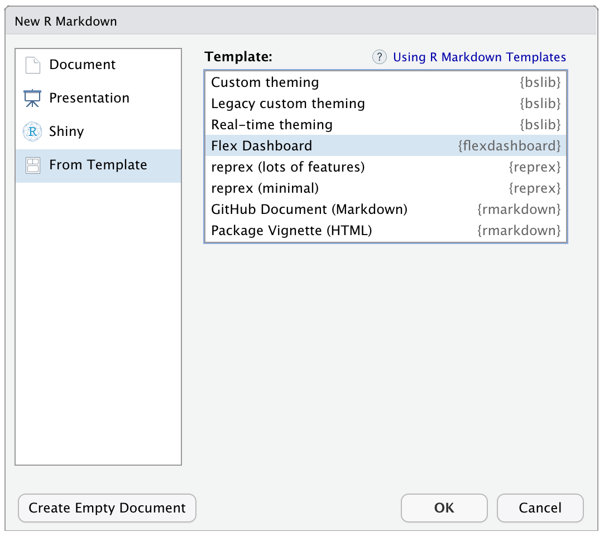

# Advanced Reports  {#present}

## Intended Learning Outcomes {#ilo-present}

* Structure data in report, dashboard, and presentation formats
* Include table of contents, figure and table captions, and references in longer reports


```r
library(tidyverse)     # data wrangling functions
library(flexdashboard) # for dashboards
```


## Reports


## Presentations


## Dashboards

After you install <code class='package'>flexdashboard</code>, you can choose a flexdashboard template when you create a new RMarkdown document. 

<div class="figure" style="text-align: center">

<p class="caption">(\#fig:img-flx-template)Flexdashbard RMarkdown template.</p>
</div>


````
Column {data-width=650}
-----------------------------------------------------------------------

### Chart A


Column {data-width=350}
-----------------------------------------------------------------------

### Chart B


### Chart C


````


## Resources {#resources-present}

* [RStudio Formats](https://rmarkdown.rstudio.com/formats.html)
* [Flexdashboard](https://pkgs.rstudio.com/flexdashboard/)

