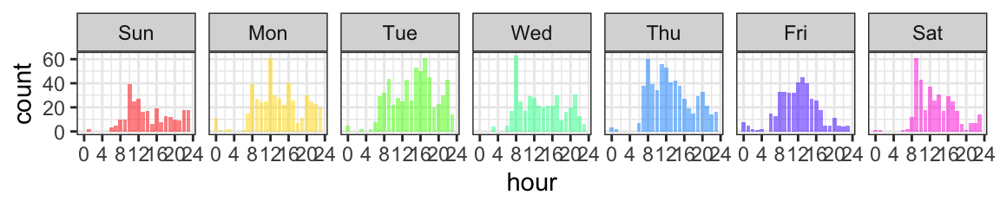
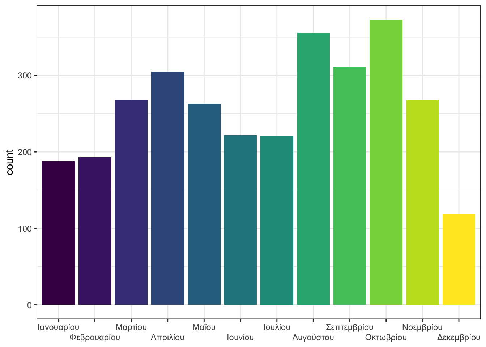

# Dates and Times {#dates-times}

Working with dates and times can be a little tricky, but the <code class='package'><a href='https://lubridate.tidyverse.org/' target='_blank'>lubridate</a></code> package is there to help. Their website has a helpful [cheatsheet](https://rawgit.com/rstudio/cheatsheets/main/lubridate.pdf) and you can view a tutorial by typing `vignette("lubridate")` in the console pane. The [Dates and Times](https://r4ds.had.co.nz/dates-and-times.html){target="_blank"} in R for Data Science also gives a helpful overview.

This appendix is a quick intro to some of the most useful functions for making reproducible reports.


```r
# packages needed for this appendix
library(tidyverse)
library(lubridate)
```

## Parsing

Dates can be in many formats. The `ymd` functions can deal with almost all of them, regardless of the punctuation used in the format. All of the examples below produce a date in the standard format "2022-01-03".


```r
# year-month-day orders
ymd("22 Jan 3")
ymd("2022 January 3rd")

# month-day-year orders
mdy("January 3, 2022")
mdy("Jan/03/22")

# day-month-year orders
dmy("3JAN22")
dmy("3rd of January in the year 2022")
```

::: {.try data-latex=""}
See if you can make a date format that one of the parsers *can't* handle.
:::

There are similar functions for date/times, too.


```r
ymd_hms("2022 Jan 3, 6:05 and 20s pm")
mdy_h("January 3rd, 2022 at 6pm")
```

```
## [1] "2022-01-03 18:05:20 UTC"
## [1] "2022-01-03 18:00:00 UTC"
```

The date/time functions can also take a timezone argument. If you don't specify it, it defaults to "UTC".


```r
ymd_hm("2022-01-03 18:05", tz = "GMT")
```

```
## [1] "2022-01-03 18:05:00 GMT"
```


## Get Parts

You frequently need to extract parts of a date/time for plotting. The following functions extract specific parts of a date or datetime object. This is a godsend for those of us who never have a clue what week of the year it is today.


```r
# get the date and time when this function is run
now <- now(tzone = "GMT")

# get separate parts
time_parts <- list(
  second  = second(now),
  minute  = minute(now),
  hour    = hour(now),
  day     = day(now),  # day of the month (same as mday())
  wday    = wday(now), # day of the week
  yday    = yday(now), # day of the year
  week    = week(now),
  isoweek = isoweek(now), # ISO 8501 week calendar (Monday start)
  epiweek = epiweek(now), # CDC epidemiological week (Sunday Start)
  month   = month(now),
  year    = year(now),
  tz      = tz(now)
)

str(time_parts)
```

```
## List of 12
##  $ second : num 13.1
##  $ minute : int 9
##  $ hour   : int 1
##  $ day    : int 7
##  $ wday   : num 2
##  $ yday   : num 38
##  $ week   : num 6
##  $ isoweek: num 6
##  $ epiweek: num 6
##  $ month  : num 2
##  $ year   : num 2022
##  $ tz     : chr "GMT"
```


The `month()` and `wday()` functions can return factor labels.


```r
jan1 <- ymd(20220101)
wday(jan1, label = TRUE)
wday(jan1, label = TRUE, abbr = TRUE)
month(jan1, label = TRUE)
month(jan1, label = TRUE, abbr = TRUE)
```

```
## [1] Sat
## Levels: Sun < Mon < Tue < Wed < Thu < Fri < Sat
## [1] Sat
## Levels: Sun < Mon < Tue < Wed < Thu < Fri < Sat
## [1] Jan
## 12 Levels: Jan < Feb < Mar < Apr < May < Jun < Jul < Aug < Sep < ... < Dec
## [1] Jan
## 12 Levels: Jan < Feb < Mar < Apr < May < Jun < Jul < Aug < Sep < ... < Dec
```

::: {.try data-latex=""}
What day of the week were you born?


<div class='webex-solution'><button>Solution</button>

```r
birthdate <- ymd(19761118) # put your own birthdate here
wday(birthdate, label = TRUE)
```

```
## [1] Thu
## Levels: Sun < Mon < Tue < Wed < Thu < Fri < Sat
```


</div>
:::


## Date Arithmetic

You can add and subtract dates. For example, you can get the dates two weeks from today by adding `weeks(2)` to `today()`. You can probably guess how to add and subtract seconds, minutes, days, months, and years.


```r
today() + weeks(1)
```

```
## [1] "2022-02-14"
```

::: {.try data-latex=""}
What day of the week will your 100th birthday be? 


<div class='webex-solution'><button>Solution</button>

```r
birthdate <- ymd(19761118) # put your own birthdate here
centennial <- birthdate + years(100)
wday(centennial, label = TRUE, abbr = FALSE)
```

```
## [1] Wednesday
## 7 Levels: Sunday < Monday < Tuesday < Wednesday < Thursday < ... < Saturday
```


</div>
:::

::: {.warning data-latex=""}
What do you think will happen if you subtract one month from March 31st? You get NA, since February doesn't have a 31st day.


```r
ymd(20220331) - months(1)
```

```
## [1] NA
```

Use the special date operators `%m+%` and `%m-%` to add and subtract months without risking an impossible date.


```r
ymd(20220331) %m-% months(1)
```

```
## [1] "2022-02-28"
```
:::

### First and last of month

For things like billing, you might need to find the first or last days of the current, previous, or next month. The `rollback()` and `rollforward()` functions are easier than trying to parse dates.


```r
d <- ymd("2022-01-24")
rollback(d)                          # last day of the previous month
rollforward(d)                       # last day of the current month
rollback(d, roll_to_first = TRUE)    # first day of the current month
rollforward(d, roll_to_first = TRUE) # first day of the next month
```

```
## [1] "2021-12-31"
## [1] "2022-01-31"
## [1] "2022-01-01"
## [1] "2022-02-01"
```


### Rounding

You can round dates and times to the nearest unit. This can be useful when you have, for example, time measured to the nearest second, but want to group data by the nearest hour, rather than extract the hour component. 


```r
ymd_hm("2022-01-24 10:25") %>% round_date(unit = "hour")
ymd_hm("2022-01-24 10:30") %>% round_date(unit = "hour")
ymd_hm("2022-01-24 10:35") %>% round_date(unit = "hour")
```

```
## [1] "2022-01-24 10:00:00 UTC"
## [1] "2022-01-24 11:00:00 UTC"
## [1] "2022-01-24 11:00:00 UTC"
```

## Internationalisation

You may need to work with dates from a different locale than your computer's defaults, such as dates written in French or Russian. Or your computer may have a non-English locale. Set the `locale` argument to the relevant language code.


```r
ymd("2022 January 24", locale = "en_GB")
ymd("2022 Janvier 24", locale = "fr_FR")
wday("2022-01-03", label = TRUE, locale = "ru_RU")
```

```
## [1] "2022-01-24"
## [1] "2022-01-24"
## [1] пн
## Levels: вс < пн < вт < ср < чт < пт < сб
```


```r
# check which locales are available on your computer
# doesn't work for Windows
system("locale -a")
```

## Example

Let's work through some examples with tweets from Appendix\ \@ref(twitter-data). Download the [class data](data/data.zip).


```r
# read all metrics files in data/tweets/
tweets <- list.files(
  path = "data/tweets", 
  pattern = "^tweet_activity_metrics",
  full.names = TRUE
) %>%
  map_df(read_csv) %>%
  select(!starts_with("promoted"))
```

The `time` column is already in date/time (POSIXct) format, but what if we wanted to plot tweets by hour for each day of the week? 


```r
tweets %>%
  mutate(weekday = wday(time, label = TRUE),
         hour = hour(time)) %>%
  ggplot(aes(x = hour, fill = weekday)) +
  geom_bar(size = 1, alpha = 0.5, show.legend = FALSE) +
  facet_grid(~weekday) +
  scale_fill_manual(values = rainbow(7)) +
  scale_x_continuous(breaks = seq(0, 24, 4))
```




A nice side-effect of using the lubridate function to get days of the week or months of the year is that the results are an ordered factor, so display correctly in a plot. Let's display the months in Greek (if that's available on your system).


```r
tweets %>%
  mutate(month = month(time, label = TRUE, abbr = FALSE, locale = "el_GR.UTF-8")) %>%
  ggplot(aes(x = month, fill = month)) +
  geom_bar(show.legend = FALSE) +
  scale_x_discrete(name = NULL, guide = guide_axis(n.dodge=2))
```




