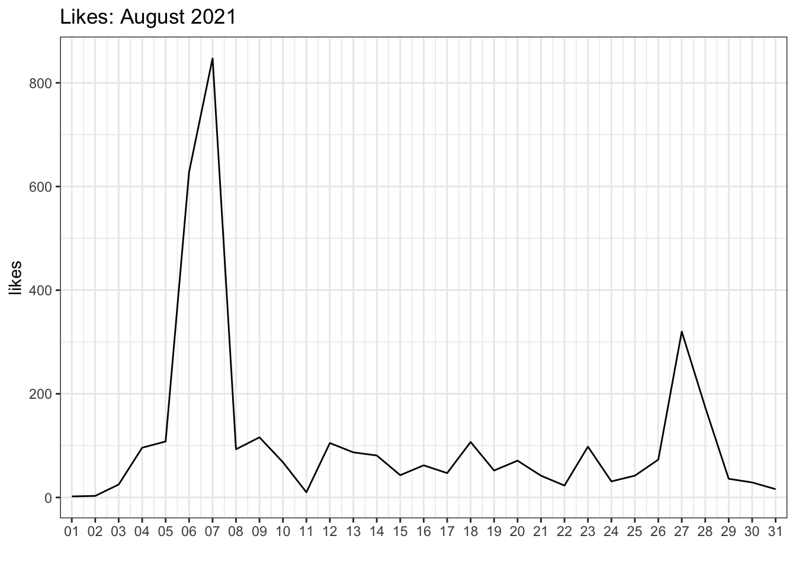
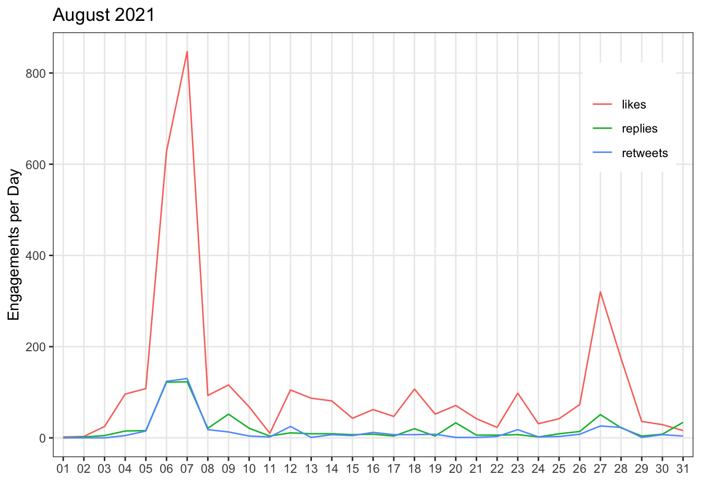
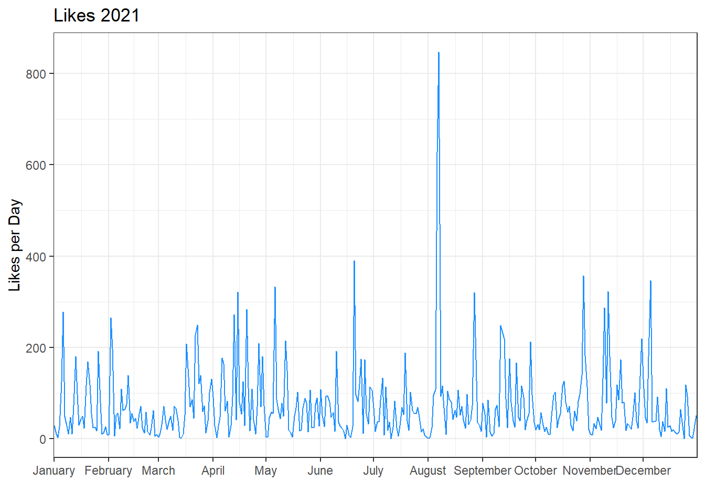
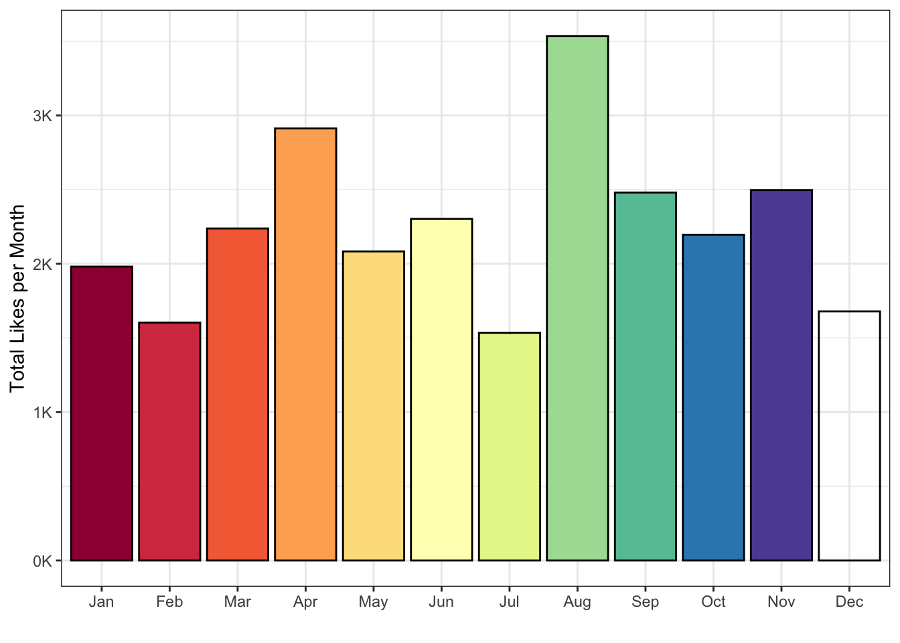
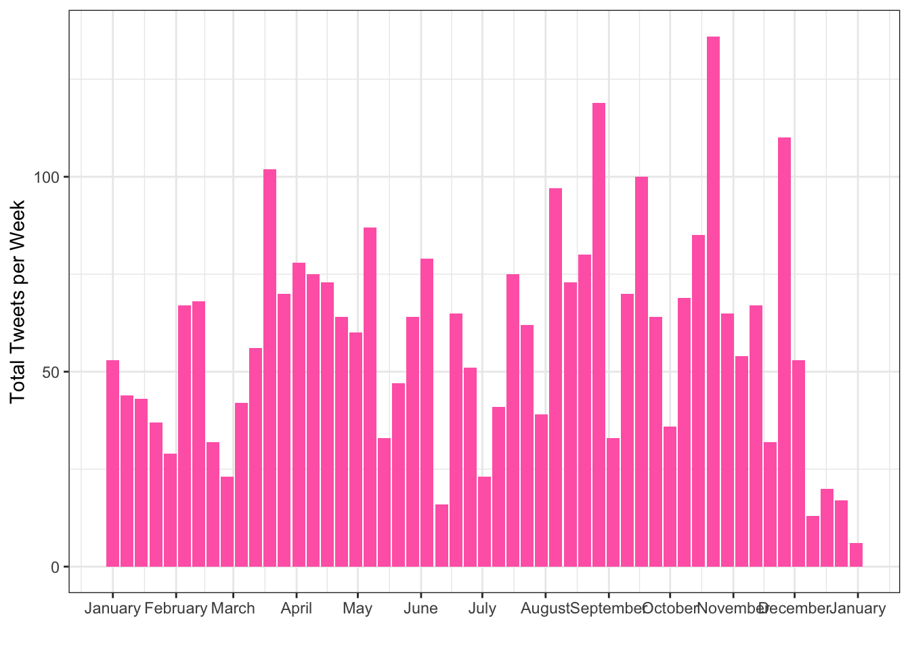
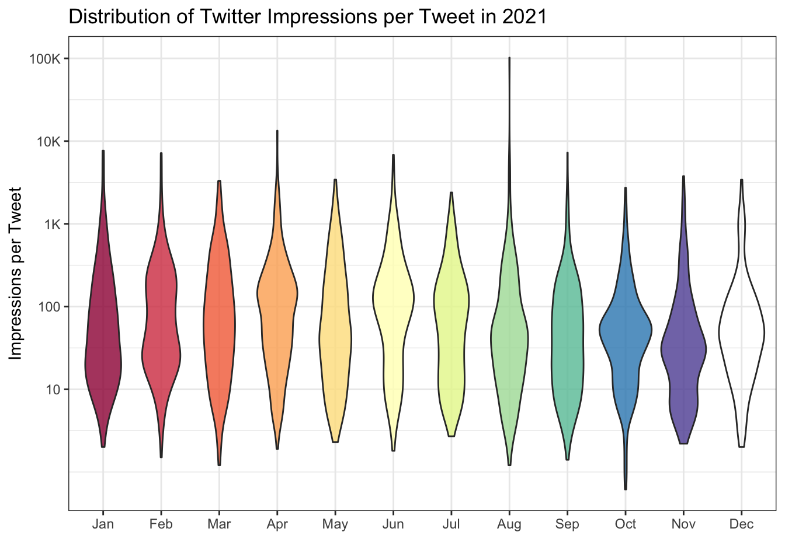
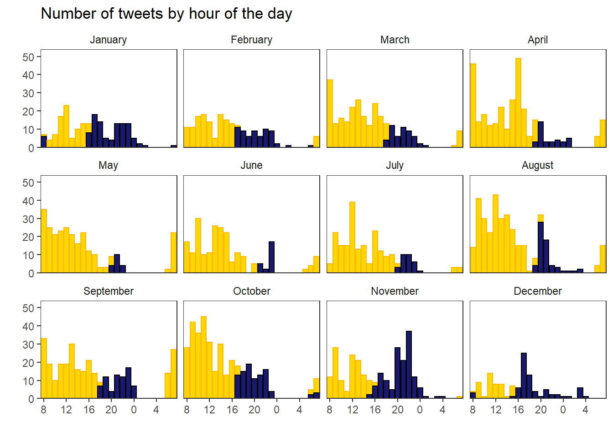

# Twitter Data

This appendix takes a problem-based approach to demonstrate how to use tidyverse functions to summarise and visualise twitter data.


```r
library(tidyverse)   # data wrangling functions
library(lubridate)   # for handling dates and times
```

## Single Data File

### Export Data

You can export your organisations' twitter data from <https://analytics.twitter.com/>. Go to the Tweets tab, choose a time period, and export the last month's data by day (or use the files from the [class data](data/data.zip)).

### Import Data


```r
file <- "data/tweets/daily_tweet_activity_metrics_LisaDeBruine_20210801_20210901_en.csv"

daily_tweets <- read_csv(file, show_col_types = FALSE)
```

### Select Relevant Data

The file contains a bunch of columns about "promoted" tweets that will be blank unless your organisation pays for those. Let's get rid of them. We can use the select helper `starts_with()` to get all the columns that start with <code><span class='st'>"promoted"</span></code> and remove them by prefacing the function with `!`. Now there should be 20 columns, which we can inspect with `glimpse()`. 


```r
daily_tweets <- read_csv(file) %>%
  select(!starts_with("promoted")) %>%
  glimpse()
```

```
## Rows: 31
## Columns: 20
## $ Date                  <date> 2021-08-01, 2021-08-02, 2021-08-03, 2021-08-04,…
## $ `Tweets published`    <dbl> 0, 2, 4, 15, 12, 11, 14, 17, 26, 17, 3, 9, 5, 17…
## $ impressions           <dbl> 1088, 1244, 3974, 22394, 23340, 316989, 694114, …
## $ engagements           <dbl> 13, 19, 76, 1290, 2051, 26249, 51494, 5988, 2964…
## $ `engagement rate`     <dbl> 0.01194853, 0.01527331, 0.01912431, 0.05760472, …
## $ retweets              <dbl> 0, 0, 0, 5, 15, 124, 130, 18, 13, 4, 2, 25, 1, 7…
## $ replies               <dbl> 0, 2, 5, 15, 16, 122, 123, 21, 52, 21, 4, 11, 9,…
## $ likes                 <dbl> 2, 3, 25, 96, 108, 628, 847, 93, 116, 68, 10, 10…
## $ `user profile clicks` <dbl> 1, 9, 10, 56, 36, 379, 550, 98, 78, 31, 17, 104,…
## $ `url clicks`          <dbl> 2, 0, 0, 45, 97, 10136, 19467, 1937, 681, 324, 1…
## $ `hashtag clicks`      <dbl> 0, 0, 0, 0, 0, 0, 1, 5, 1, 0, 0, 12, 1, 2, 3, 1,…
## $ `detail expands`      <dbl> 7, 5, 36, 412, 606, 10348, 21021, 2642, 1441, 79…
## $ `permalink clicks`    <dbl> 0, 0, 0, 0, 0, 0, 0, 0, 0, 0, 0, 0, 0, 0, 0, 0, …
## $ `app opens`           <dbl> 0, 0, 0, 0, 0, 0, 0, 0, 0, 0, 0, 0, 0, 0, 0, 0, …
## $ `app installs`        <dbl> 0, 0, 0, 0, 0, 0, 0, 0, 0, 0, 0, 0, 0, 0, 0, 0, …
## $ follows               <dbl> 0, 0, 0, 0, 0, 0, 0, 0, 0, 0, 0, 0, 0, 0, 0, 0, …
## $ `email tweet`         <dbl> 0, 0, 0, 0, 0, 0, 0, 0, 0, 0, 0, 0, 0, 0, 0, 0, …
## $ `dial phone`          <dbl> 0, 0, 0, 0, 0, 0, 0, 0, 0, 0, 0, 0, 0, 0, 0, 0, …
## $ `media views`         <dbl> 2, 2, 25, 710, 1187, 4474, 9356, 1176, 582, 334,…
## $ `media engagements`   <dbl> 1, 0, 0, 661, 1173, 4464, 9353, 1174, 582, 327, …
```


### Plot Likes per Day

Now let's plot likes per day. The `scale_x_date()` function lets you formats an x-axis with dates.


```r
ggplot(daily_tweets, aes(x = Date, y = likes)) +
  geom_line() +
  scale_x_date(name = "", 
               date_breaks = "1 day",
               date_labels = "%d",
               expand = expansion(add = c(.5, .5))) +
  ggtitle("Likes: August 2021")
```

<div class="figure" style="text-align: center">

<p class="caption">(\#fig:likes-per-day-plot)Likes per day.</p>
</div>


### Plot Multiple Engagements

What if we want to plot likes, retweets, and replies on the same plot? We need to get all of the numbers in the same column and a column that contains the "engagement type" that we can use to determine different line colours. When you have data in different columns that you need to get into the same column, it's wide and you need to pivot the data longer.


```r
long_tweets <- daily_tweets %>%
  select(Date, likes, retweets, replies) %>%
  pivot_longer(cols = c(likes, retweets, replies),
               names_to = "engage_type",
               values_to = "n")

head(long_tweets)
```

<div class="kable-table">

<table>
 <thead>
  <tr>
   <th style="text-align:left;"> Date </th>
   <th style="text-align:left;"> engage_type </th>
   <th style="text-align:right;"> n </th>
  </tr>
 </thead>
<tbody>
  <tr>
   <td style="text-align:left;"> 2021-08-01 </td>
   <td style="text-align:left;"> likes </td>
   <td style="text-align:right;"> 2 </td>
  </tr>
  <tr>
   <td style="text-align:left;"> 2021-08-01 </td>
   <td style="text-align:left;"> retweets </td>
   <td style="text-align:right;"> 0 </td>
  </tr>
  <tr>
   <td style="text-align:left;"> 2021-08-01 </td>
   <td style="text-align:left;"> replies </td>
   <td style="text-align:right;"> 0 </td>
  </tr>
  <tr>
   <td style="text-align:left;"> 2021-08-02 </td>
   <td style="text-align:left;"> likes </td>
   <td style="text-align:right;"> 3 </td>
  </tr>
  <tr>
   <td style="text-align:left;"> 2021-08-02 </td>
   <td style="text-align:left;"> retweets </td>
   <td style="text-align:right;"> 0 </td>
  </tr>
  <tr>
   <td style="text-align:left;"> 2021-08-02 </td>
   <td style="text-align:left;"> replies </td>
   <td style="text-align:right;"> 2 </td>
  </tr>
</tbody>
</table>

</div>

Now we can plot the number of engagements per day by engagement type by making the line colour determined by the value of the `engage_type` column. 


```r
ggplot(long_tweets, aes(x = Date, y = n, colour = engage_type)) +
  geom_line() +
  scale_x_date(name = "", 
               date_breaks = "1 day",
               date_labels = "%d",
               expand = expansion(add = c(.5, .5))) +
  scale_y_continuous(name = "Engagements per Day") + 
  scale_colour_discrete(name = "") +
  ggtitle("August 2021") +
  theme(legend.position = c(.9, .8),
        panel.grid.minor = element_blank())
```

<div class="figure" style="text-align: center">

<p class="caption">(\#fig:eng-per-day-plot)Engagements per day by engagement type.</p>
</div>


## Multiple Data Files

Maybe now you want to compare the data from several months. First, get a list of all the files you want to combine. It's easiest if they're all in the same directory, although you can use a pattern to select the files you want if they have a systematic naming structure.


```r
files <- list.files(
  path = "data/tweets", 
  pattern = "daily_tweet_activity_metrics",
  full.names = TRUE
)
```

Then use `map_df()` to iterate over the list of file paths, open them with `read_csv()`, and return a big data frame with all the combined data. Then we can pipe that to the `select()` function to get rid of the "promoted" columns.


```r
all_daily_tweets <- purrr::map_df(files, read_csv) %>%
  select(!starts_with("promoted"))
```

Now you can make a plot of likes per day for all of the months.


```r
ggplot(all_daily_tweets, aes(x = Date, y = likes)) +
  geom_line(colour = "dodgerblue") +
  scale_y_continuous(name = "Likes per Day") + 
  scale_x_date(name = "", 
               date_breaks = "1 month",
               date_labels = "%B",
               expand = expansion(add = c(.5, .5))) +
  ggtitle("Likes 2021")
```




::: {.info data-latex=""}
Notice that we changed the date breaks and labels for the x-axis. `%B` is the date code for the full month name. See `?strptime` for all of the date codes.
:::


### Likes by Month

If you want to plot likes by month, first you need a column for the month. Use `mutate()` to make a new column, using `lubridate::month()` to extract the month name from the `Date` column. 

Then group by the new `month` column and calculate the sum of `likes`. The `group_by()` function causes all of the subsequent functions to operate inside of groups, until you call `ungroup()`. In the example below, the `sum(likes)` function calculates the sum total of the `likes` column separately for each month.


```r
likes_by_month <- all_daily_tweets %>%
  mutate(month = month(Date, label = TRUE)) %>%
  group_by(month) %>%
  summarise(total_likes = sum(likes)) %>%
  ungroup()

likes_by_month
```

<div class="kable-table">

<table>
 <thead>
  <tr>
   <th style="text-align:left;"> month </th>
   <th style="text-align:right;"> total_likes </th>
  </tr>
 </thead>
<tbody>
  <tr>
   <td style="text-align:left;"> Jan </td>
   <td style="text-align:right;"> 1981 </td>
  </tr>
  <tr>
   <td style="text-align:left;"> Feb </td>
   <td style="text-align:right;"> 1603 </td>
  </tr>
  <tr>
   <td style="text-align:left;"> Mar </td>
   <td style="text-align:right;"> 2238 </td>
  </tr>
  <tr>
   <td style="text-align:left;"> Apr </td>
   <td style="text-align:right;"> 2912 </td>
  </tr>
  <tr>
   <td style="text-align:left;"> May </td>
   <td style="text-align:right;"> 2083 </td>
  </tr>
  <tr>
   <td style="text-align:left;"> Jun </td>
   <td style="text-align:right;"> 2303 </td>
  </tr>
  <tr>
   <td style="text-align:left;"> Jul </td>
   <td style="text-align:right;"> 1534 </td>
  </tr>
  <tr>
   <td style="text-align:left;"> Aug </td>
   <td style="text-align:right;"> 3535 </td>
  </tr>
  <tr>
   <td style="text-align:left;"> Sep </td>
   <td style="text-align:right;"> 2480 </td>
  </tr>
  <tr>
   <td style="text-align:left;"> Oct </td>
   <td style="text-align:right;"> 2196 </td>
  </tr>
  <tr>
   <td style="text-align:left;"> Nov </td>
   <td style="text-align:right;"> 2497 </td>
  </tr>
  <tr>
   <td style="text-align:left;"> Dec </td>
   <td style="text-align:right;"> 1679 </td>
  </tr>
</tbody>
</table>

</div>


A column plot might make more sense than a line plot for this summary.


```r
ggplot(likes_by_month, aes(x = month, y = total_likes, fill = month)) +
  geom_col(color = "black", show.legend = FALSE) +
  scale_x_discrete(name = "") +
  scale_y_continuous(name = "Total Likes per Month",
                     breaks = seq(0, 10000, 1000),
                     labels = paste0(0:10, "K")) +
  scale_fill_brewer(palette = "Spectral")
```

```
## Warning in RColorBrewer::brewer.pal(n, pal): n too large, allowed maximum for palette Spectral is 11
## Returning the palette you asked for with that many colors
```

<div class="figure" style="text-align: center">

<p class="caption">(\#fig:likes-by-month-plot)Likes by month.</p>
</div>


::: {.try data-latex=""}
How would you change the code in this section to plot the number of tweets published per week? 

Hint: if the <code class='package'>lubridate</code> function for the month is `month()`, what is the function for getting the week likely to be?


<div class='webex-solution'><button>Summarise Data</button>

```r
tweets_by_week <- all_daily_tweets %>%
  mutate(week = week(Date)) %>%
  group_by(week) %>%
  summarise(start_date = min(Date),
            total_tweets = sum(`Tweets published`)) %>%
  ungroup()
```


</div>


<div class='webex-solution'><button>Plot Data</button>

```r
ggplot(tweets_by_week, aes(x = start_date, y = total_tweets)) +
  geom_col(fill = "hotpink") +
  scale_x_date(name = "",
               date_breaks = "1 month", 
               date_labels = "%B") +
  scale_y_continuous(name = "Total Tweets per Week")
```


</div>

:::


## Data by Tweet

You can also download your twitter data by tweet instead of by day. This usually takes a little longer to download. We can use the same pattern to read and combine all of the tweet data files.

The `^` at the start of the pattern means that the file name has to start with this. This means it won't match the "daily_tweet..." files.


```r
tweet_files <- list.files(
  path = "data/tweets", 
  pattern = "^tweet_activity_metrics",
  full.names = TRUE
)
```

First, let's open only the first file and see if we need to do anything to it.


```r
tweets <- read_csv(tweet_files[1])
```

If you look at the file in the Viewer, you can set that the `Tweet id` column is using scientific notation (`1.355500e+18`) instead of the full 18-digit tweet ID, which gives different IDs the same value. We won't ever want to *add* ID numbers,so it's safe to represent these as characters. Set up the map over all the files with the `col_types` specified, then get rid of all the promoted columns and add `month` and `hour` columns (reading the date from the `time` column in these data).


```r
ct <- cols("Tweet id" = col_character())
all_tweets <- map_df(tweet_files, read_csv, col_types = ct) %>%
  select(!starts_with("promoted")) %>%
  mutate(month = lubridate::month(time, label = TRUE),
         hour = lubridate::hour(time))
```

### Impressions per Tweet

Now we can look at the distribution of impressions per tweet for each month.


```r
ggplot(all_tweets, aes(x = month, y = impressions, fill = month)) +
  geom_violin(show.legend = FALSE, alpha = 0.8) +
  scale_fill_brewer(palette = "Spectral") +
  scale_x_discrete(name = "") +
  scale_y_continuous(name = "Impressions per Tweet",
                     breaks = c(0, 10^(2:7)),
                     labels = c(0, 10, 100, "1K", "10K", "100K", "1M"),
                     trans = "pseudo_log") +
  ggtitle("Distribution of Twitter Impressions per Tweet in 2021")
```

```
## Warning in RColorBrewer::brewer.pal(n, pal): n too large, allowed maximum for palette Spectral is 11
## Returning the palette you asked for with that many colors
```

<div class="figure" style="text-align: center">

<p class="caption">(\#fig:imp-month-plot)Impressions per tweet per month.</p>
</div>

::: {.try data-latex=""}
The y-axis has been transformed to "pseudo_log" to show very skewed data more clearly (most tweets get a few hundred impressions, but some a few can get thousands). See what the plot looks like if you change the y-axis transformation.
:::

### Top Tweet

You can display Lisa's top tweet for the year.


```r
top_tweet <- all_tweets %>%
  slice_max(order_by = likes, n = 1)

glue::glue("[Top tweet]({top_tweet$`Tweet permalink`}) with {top_tweet$likes} likes:

---------------------------
{top_tweet$`Tweet text`}
---------------------------
") %>% cat()
```

[Top tweet](https://twitter.com/LisaDeBruine/status/1423445172092866563) with 1190 likes:

---------------------------
Oh, this was fun! You think of the ten least-related nouns possible. I scored in the 94th percentile. 

https://t.co/FhR4DR38OU
---------------------------

### Word Cloud

Or you can make a word cloud of the top words they tweet about. (You'll learn how to do this in Chapter\ \@ref(custom)).


### Tweets by Hour

In order to make a plot of tweets by hour, colouring the data by wherther or not the sun is up, we can join data from a table of sunrise and sunset times by day for Glasgow (or [download the table for your region](https://www.schoolsobservatory.org/learn/astro/nightsky/sunrs_set){target="_blank"}).

The `Day` column originally read in as a character column, so convert it to a date on import using the `col_types` argument.


```r
sun <- read_csv("data/sunfact2021.csv", 
                col_types = cols(
                  Day = col_date(format="%d/%m/%Y"),
                  RiseTime = col_double(),
                  SetTime = col_double()
                ))
```

Create a matching `Day` column for `all_tweets`, plus an `hour` column for plotting (the factor structure starts the day at 8:00), and a `tweet_time` column for comparing to the `RiseTime` and `SetTime` columns, which are decimal hours.

Then join the `sun` table and create a `timeofday` column that equals "day" if the sun is up and "night" if the sun has set.


```r
sun_tweets <- all_tweets %>%
  select(time) %>%
  mutate(Day = date(time),
         hour = factor(hour(time), 
                       levels = c(8:23, 0:7)),
         tweet_time = hour(time) + minute(time)/60) %>%
  left_join(sun, by = "Day") %>%
  mutate(timeofday = ifelse(tweet_time>RiseTime & 
                            tweet_time<SetTime, 
                            yes = "day", 
                            no = "night"))
```

Check a few random rows to make sure you did everything correctly.


```r
slice_sample(sun_tweets, n = 10)
```

<div class="kable-table">

<table>
 <thead>
  <tr>
   <th style="text-align:left;"> time </th>
   <th style="text-align:left;"> Day </th>
   <th style="text-align:left;"> hour </th>
   <th style="text-align:right;"> tweet_time </th>
   <th style="text-align:right;"> RiseTime </th>
   <th style="text-align:right;"> SetTime </th>
   <th style="text-align:left;"> timeofday </th>
  </tr>
 </thead>
<tbody>
  <tr>
   <td style="text-align:left;"> 2021-05-23 13:58:00 </td>
   <td style="text-align:left;"> 2021-05-23 </td>
   <td style="text-align:left;"> 13 </td>
   <td style="text-align:right;"> 13.966667 </td>
   <td style="text-align:right;"> 3.875 </td>
   <td style="text-align:right;"> 20.568 </td>
   <td style="text-align:left;"> day </td>
  </tr>
  <tr>
   <td style="text-align:left;"> 2021-12-31 15:21:00 </td>
   <td style="text-align:left;"> 2021-12-31 </td>
   <td style="text-align:left;"> 15 </td>
   <td style="text-align:right;"> 15.350000 </td>
   <td style="text-align:right;"> 8.736 </td>
   <td style="text-align:right;"> 15.902 </td>
   <td style="text-align:left;"> day </td>
  </tr>
  <tr>
   <td style="text-align:left;"> 2021-04-06 17:08:00 </td>
   <td style="text-align:left;"> 2021-04-06 </td>
   <td style="text-align:left;"> 17 </td>
   <td style="text-align:right;"> 17.133333 </td>
   <td style="text-align:right;"> 5.567 </td>
   <td style="text-align:right;"> 19.065 </td>
   <td style="text-align:left;"> day </td>
  </tr>
  <tr>
   <td style="text-align:left;"> 2021-04-20 07:33:00 </td>
   <td style="text-align:left;"> 2021-04-20 </td>
   <td style="text-align:left;"> 7 </td>
   <td style="text-align:right;"> 7.550000 </td>
   <td style="text-align:right;"> 4.986 </td>
   <td style="text-align:right;"> 19.531 </td>
   <td style="text-align:left;"> day </td>
  </tr>
  <tr>
   <td style="text-align:left;"> 2021-08-06 01:14:00 </td>
   <td style="text-align:left;"> 2021-08-06 </td>
   <td style="text-align:left;"> 1 </td>
   <td style="text-align:right;"> 1.233333 </td>
   <td style="text-align:right;"> 4.532 </td>
   <td style="text-align:right;"> 20.174 </td>
   <td style="text-align:left;"> night </td>
  </tr>
  <tr>
   <td style="text-align:left;"> 2021-09-01 08:22:00 </td>
   <td style="text-align:left;"> 2021-09-01 </td>
   <td style="text-align:left;"> 8 </td>
   <td style="text-align:right;"> 8.366667 </td>
   <td style="text-align:right;"> 5.359 </td>
   <td style="text-align:right;"> 19.150 </td>
   <td style="text-align:left;"> day </td>
  </tr>
  <tr>
   <td style="text-align:left;"> 2021-10-25 07:03:00 </td>
   <td style="text-align:left;"> 2021-10-25 </td>
   <td style="text-align:left;"> 7 </td>
   <td style="text-align:right;"> 7.050000 </td>
   <td style="text-align:right;"> 7.118 </td>
   <td style="text-align:right;"> 16.868 </td>
   <td style="text-align:left;"> night </td>
  </tr>
  <tr>
   <td style="text-align:left;"> 2021-09-18 11:47:00 </td>
   <td style="text-align:left;"> 2021-09-18 </td>
   <td style="text-align:left;"> 11 </td>
   <td style="text-align:right;"> 11.783333 </td>
   <td style="text-align:right;"> 5.899 </td>
   <td style="text-align:right;"> 18.416 </td>
   <td style="text-align:left;"> day </td>
  </tr>
  <tr>
   <td style="text-align:left;"> 2021-06-08 18:15:00 </td>
   <td style="text-align:left;"> 2021-06-08 </td>
   <td style="text-align:left;"> 18 </td>
   <td style="text-align:right;"> 18.250000 </td>
   <td style="text-align:right;"> 3.592 </td>
   <td style="text-align:right;"> 20.920 </td>
   <td style="text-align:left;"> day </td>
  </tr>
  <tr>
   <td style="text-align:left;"> 2021-09-29 17:08:00 </td>
   <td style="text-align:left;"> 2021-09-29 </td>
   <td style="text-align:left;"> 17 </td>
   <td style="text-align:right;"> 17.133333 </td>
   <td style="text-align:right;"> 6.251 </td>
   <td style="text-align:right;"> 17.937 </td>
   <td style="text-align:left;"> day </td>
  </tr>
</tbody>
</table>

</div>

Plot the `hour` along the x-axis and set the fill and colour by `timeofday`. Use `scale_*_manual()` functions to set custom colours for day and night.


```r
map <- aes(x = hour, 
           fill = timeofday, 
           colour = timeofday)

ggplot(sun_tweets, mapping = map) +
  geom_bar(show.legend = FALSE) +
  labs(x = "", 
       y = "",
       title = "Number of tweets by hour of the day") +
  scale_x_discrete(breaks = c(8:23, 0:7)[c(T, F, F, F)],
                   drop = FALSE) +
  scale_y_continuous(expand = c(0, 0, .1, 0)) +
  scale_fill_manual(values = c("gold", "midnightblue")) +
  scale_colour_manual(values = c("darkgoldenrod1", "black")) +
  facet_wrap(~month(time, label = TRUE, abbr = FALSE), nrow = 3) +
  theme(strip.background = element_rect(fill = "white", 
                                        color = "transparent"),
        panel.grid = element_blank())
```

<div class="figure" style="text-align: center">

<p class="caption">(\#fig:hour-tweet-plot)Tweets per hour of the day</p>
</div>

::: {.try data-latex=""}
Go through each line of the plot above and work out what each function and argument does by changing or removing it.
:::
