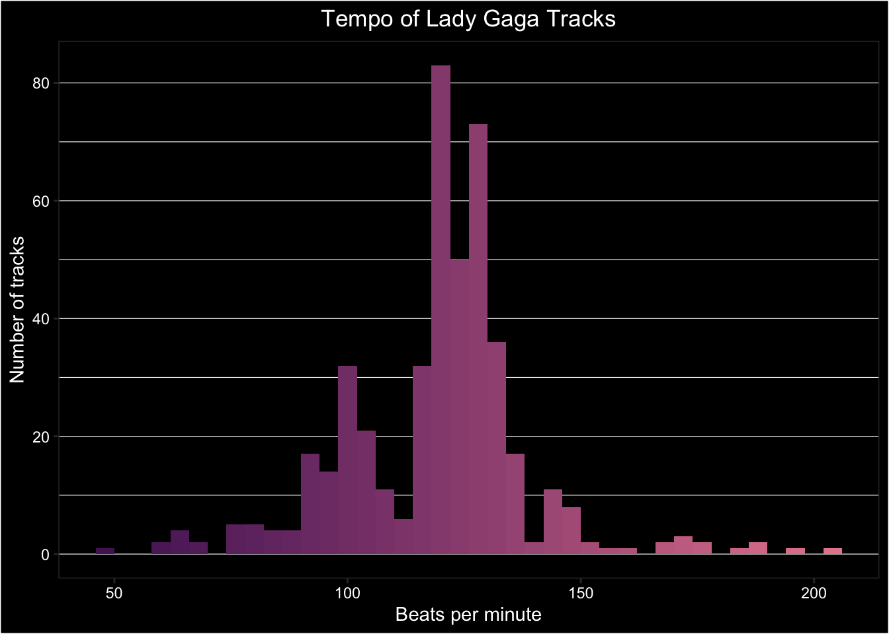

# Spotify Data

This appendix was inspired by [Michael Mullarkey's tutorial](https://mcmullarkey.github.io/mcm-blog/posts/2022-01-07-spotify-api-r/){target="_blank"}, which you can follow to make beautiful dot plots out of your own Spotify data. This tutorial doesn't require you to use Spotify; just to create a developer account so you can access their data API with <code class='package'><a href='https://www.rcharlie.com/spotifyr/' target='_blank'>spotifyr</a></code>.


```r
library(usethis)    # to set system environment variables
library(spotifyr)   # to access Spotify
library(tidyverse)  # for data wrangling
library(DT)         # for interactive tables
```

The package [spotifyr](https://www.rcharlie.com/spotifyr){target="_blank"} has instructions for setting up a developer account with Spotify and setting up an "app" so you can get authorisation codes.

Once you've set up the app, you can copy the client ID and secret to your R environment file. The easiest way to do this is with `edit_r_environ()` from <code class='package'>usethis</code>. Setting scope to "user" makes this available to any R project on your computer, while setting it to "project" makes it only available to this project.


```r
usethis::edit_r_environ(scope = "user")
```

Add the following text to your environment file (don't delete anything already there), replacing the zeros with your personal ID and secret. Save and close the file and restart R. 

```
SPOTIFY_CLIENT_ID="0000000000000000000000000000"
SPOTIFY_CLIENT_SECRET="0000000000000000000000000000"
```

Double check that it worked by typing the following into the console. Don't put it in your script unless you mean to share this confidential info.  You should see your values, not "", if it worked.


```r
# run in the console, don't save in a script
Sys.getenv("SPOTIFY_CLIENT_ID")
Sys.getenv("SPOTIFY_CLIENT_SECRET")
```

Now you're ready to get data from Spotify. There are several types of data that you can download. 


## By Artist

Choose your favourite artist and download their discography. Set `include_groups` to one or more of "album", "single", "appears_on", and "compilation".


```r
gaga <- get_artist_audio_features(
  artist = 'Lady Gaga',
  include_groups = "album"
)
```

Let's explore the data you get back. Use `glimpse()` to see what columns are available and what type of data they have. It looks like there is a row for each of this artist's tracks.

Let's answer a few simple questions first. 

### Tracks per Album

How many tracks are on each album? Some tracks have more than one entry in the table, so first select just the `album_name` and `track_name` columns and use `distinct()` to get rid of duplicates. Then `count()` the tracks per album. We're using `DT::datatable()` to make the table interactive. Try sorting the table by number of tracks. 


```r
gaga %>%
  select(album_name, track_name) %>%
  distinct() %>%
  count(album_name) %>%
  datatable(colnames = c("Albumn Name", "Number of Tracks"))
```

```{=html}
<div id="htmlwidget-9ff878dbbf18302a652f" style="width:100%;height:auto;" class="datatables html-widget"></div>
<script type="application/json" data-for="htmlwidget-9ff878dbbf18302a652f">{"x":{"filter":"none","vertical":false,"data":[["1","2","3","4","5","6","7","8","9","10","11","12","13","14","15","16","17","18","19","20","21","22","23","24","25"],["A Star Is Born Soundtrack","A Star Is Born Soundtrack (Without Dialogue)","ARTPOP","Born This Way","Born This Way - The Remix","Born This Way (International Special Edition Version)","Born This Way (International Standard Version)","Born This Way (Japan Special Edition Version)","Born This Way (Japan Standard Version)","Born This Way (Special Edition)","BORN THIS WAY THE TENTH ANNIVERSARY","Cheek To Cheek","Cheek To Cheek (Deluxe)","Chromatica","Dawn Of Chromatica","Joanne","Joanne (Deluxe)","Love For Sale (Deluxe)","The Fame","The Fame Monster","The Fame Monster (Deluxe Edition)","The Fame Monster (France FNAC Version)","The Fame Monster (France Virgin Version)","The Fame Monster (International Deluxe)","The Fame Monster (UK Deluxe)"],[36,19,17,14,16,23,15,24,16,22,15,11,17,16,14,14,14,12,15,8,23,25,25,24,24]],"container":"<table class=\"display\">\n  <thead>\n    <tr>\n      <th> <\/th>\n      <th>Albumn Name<\/th>\n      <th>Number of Tracks<\/th>\n    <\/tr>\n  <\/thead>\n<\/table>","options":{"columnDefs":[{"className":"dt-right","targets":2},{"orderable":false,"targets":0}],"order":[],"autoWidth":false,"orderClasses":false}},"evals":[],"jsHooks":[]}</script>
```

::: {.try data-latex=""}
Use `count()` to explore the columns `key_name`, `mode_name`, and any other non-numeric columns. 
:::

### Tempo

What sort of tempo is Lady Gaga's music? First, let's look at a very basic plot to get an overview.


```r
ggplot(gaga, aes(tempo)) +
  geom_histogram(binwidth = 1)
```


What's going on with the tracks with a tempo of 0?


```r
gaga %>% 
  filter(tempo == 0) %>%
  select(album_name, track_name)
```

<div class="kable-table">

<table>
 <thead>
  <tr>
   <th style="text-align:left;"> album_name </th>
   <th style="text-align:left;"> track_name </th>
  </tr>
 </thead>
<tbody>
  <tr>
   <td style="text-align:left;"> A Star Is Born Soundtrack </td>
   <td style="text-align:left;"> First Stop, Arizona - Dialogue </td>
  </tr>
  <tr>
   <td style="text-align:left;"> A Star Is Born Soundtrack </td>
   <td style="text-align:left;"> How Do You Hear It? - Dialogue </td>
  </tr>
  <tr>
   <td style="text-align:left;"> A Star Is Born Soundtrack </td>
   <td style="text-align:left;"> SNL - Dialogue </td>
  </tr>
  <tr>
   <td style="text-align:left;"> A Star Is Born Soundtrack </td>
   <td style="text-align:left;"> First Stop, Arizona - Dialogue </td>
  </tr>
  <tr>
   <td style="text-align:left;"> A Star Is Born Soundtrack </td>
   <td style="text-align:left;"> How Do You Hear It? - Dialogue </td>
  </tr>
  <tr>
   <td style="text-align:left;"> A Star Is Born Soundtrack </td>
   <td style="text-align:left;"> SNL - Dialogue </td>
  </tr>
</tbody>
</table>

</div>

Looks like it's all dialogue, so we should omit these. Let's also check how variable the tempo is for multiple instances of the same track. A quick way to do this is to group by album and track, then check the <a class='glossary' target='_blank' title='A descriptive statistic that measures how spread out data are relative to the mean.' href='https://psyteachr.github.io/glossary/s#standard-deviation'>standard deviation</a> of the tempo. If it's 0, this means that all of the values are identical. The bigger it is, the more the values vary. If you have a lot of data with a <a class='glossary' target='_blank' title='A symmetric distribution of data where values near the centre are most probable.' href='https://psyteachr.github.io/glossary/n#normal-distribution'>normal distribution</a> (like a bell curve), then about 68% of the data are within one SD of the mean, and about 95% are within 2 SDs.

If we filter to tracks with SD greater than 0 (so any variation at all), we see that most tracks have a little variation. However, if we filter to tracks with an SD greater than 1, we see a few songs with slightly different tempo, and a few with wildly different tempo. 


```r
gaga %>%
  # omit tracks with "Dialogue" in the name
  filter(!str_detect(track_name, "Dialogue")) %>%
  # check for varying tempos for same track
  group_by(album_name, track_name) %>%
  filter(sd(tempo) > 1) %>%
  ungroup() %>%
  select(album_name, track_name, tempo) %>%
  arrange(album_name, track_name)
```

<div class="kable-table">

<table>
 <thead>
  <tr>
   <th style="text-align:left;"> album_name </th>
   <th style="text-align:left;"> track_name </th>
   <th style="text-align:right;"> tempo </th>
  </tr>
 </thead>
<tbody>
  <tr>
   <td style="text-align:left;"> BORN THIS WAY THE TENTH ANNIVERSARY </td>
   <td style="text-align:left;"> The Edge Of Glory </td>
   <td style="text-align:right;"> 127.957 </td>
  </tr>
  <tr>
   <td style="text-align:left;"> BORN THIS WAY THE TENTH ANNIVERSARY </td>
   <td style="text-align:left;"> The Edge Of Glory </td>
   <td style="text-align:right;"> 124.004 </td>
  </tr>
  <tr>
   <td style="text-align:left;"> BORN THIS WAY THE TENTH ANNIVERSARY </td>
   <td style="text-align:left;"> Yoü And I </td>
   <td style="text-align:right;"> 127.073 </td>
  </tr>
  <tr>
   <td style="text-align:left;"> BORN THIS WAY THE TENTH ANNIVERSARY </td>
   <td style="text-align:left;"> Yoü And I </td>
   <td style="text-align:right;"> 124.428 </td>
  </tr>
  <tr>
   <td style="text-align:left;"> Cheek To Cheek </td>
   <td style="text-align:left;"> Sophisticated Lady </td>
   <td style="text-align:right;"> 75.221 </td>
  </tr>
  <tr>
   <td style="text-align:left;"> Cheek To Cheek </td>
   <td style="text-align:left;"> Sophisticated Lady </td>
   <td style="text-align:right;"> 138.475 </td>
  </tr>
  <tr>
   <td style="text-align:left;"> Joanne </td>
   <td style="text-align:left;"> Come To Mama </td>
   <td style="text-align:right;"> 179.911 </td>
  </tr>
  <tr>
   <td style="text-align:left;"> Joanne </td>
   <td style="text-align:left;"> Come To Mama </td>
   <td style="text-align:right;"> 179.911 </td>
  </tr>
  <tr>
   <td style="text-align:left;"> Joanne </td>
   <td style="text-align:left;"> Come To Mama </td>
   <td style="text-align:right;"> 119.962 </td>
  </tr>
  <tr>
   <td style="text-align:left;"> Joanne (Deluxe) </td>
   <td style="text-align:left;"> Come To Mama </td>
   <td style="text-align:right;"> 179.911 </td>
  </tr>
  <tr>
   <td style="text-align:left;"> Joanne (Deluxe) </td>
   <td style="text-align:left;"> Come To Mama </td>
   <td style="text-align:right;"> 119.962 </td>
  </tr>
</tbody>
</table>

</div>

You can deal with these in any way you choose. Filter out some versions of the songs or listen to them to see which value you agree with and change the others. Here, we'll deal with it by averaging the values for each track. This will also remove the tiny differences in the majority of duplicate tracks. Now we're ready to plot.


```r
gaga %>%
  filter(tempo > 0) %>%
  group_by(album_name, track_name) %>%
  summarise(tempo = round(mean(tempo)),
            .groups = "drop") %>%
  ungroup() %>%
  ggplot(aes(x = tempo, fill = ..x..)) +
  geom_histogram(binwidth = 4, show.legend = FALSE) +
  scale_fill_gradient(low = "#521F64", high = "#E8889C") +
  labs(x = "Beats per minute",
       y = "Number of tracks",
       title = "Tempo of Lady Gaga Tracks")
```


::: {.try data-latex=""}
Can you see how we made the gradient fill for the histograms? Since the x-value of each bar depends on the binwidth, you have to use the code `..x..` in the mapping (not `tempo`) to make the fill correspond to each bar's value. 
:::

This looks OK, but maybe we want a more striking plot. Let's make a custom plot style and assign it to `gaga_style` in case we want to use it again. Then add it to the shortcut function, `last_plot()` to avoid having to retype the code for the last plot we created.


```r
# define style
gaga_style <- theme(
  plot.background = element_rect(fill = "black"),
  text = element_text(color = "white", size = 11),
  panel.background = element_rect(fill = "black"),
  panel.grid.major.x = element_blank(),
  panel.grid.minor.x = element_blank(),
  panel.grid.major.y = element_line(colour = "white", size = 0.2),
  panel.grid.minor.y = element_line(colour = "white", size = 0.2),
  axis.text = element_text(color = "white"),
  plot.title = element_text(hjust = 0.5)
)

## add it to the last plot created
last_plot() + gaga_style
```




## By Playlist

You need to know the "uri" of a public playlist to access data on it. You can get this by copying the link to the playlist and selecting the 22 characters between "https://open.spotify.com/playlist/" and "?si=...". Let's have a look at the Eurovision 2021 playlist.


```r
eurovision2021 <- get_playlist_audio_features(
  playlist_uris = "37i9dQZF1DWVCKO3xAlT1Q"
)
```

Use `glimpse()` and `count()` to explore the structure of this table.

### Track ratings

Each track has several ratings: danceability, energy, speechiness, acousticness, instrumentalness, liveness, and valence. I'm not sure how these are determined (almost certainly by an algorithm). Let's select the track names and these columns to have a look.


```r
eurovision2021 %>%
  select(track.name, danceability, energy, speechiness:valence) %>%
  datatable()
```

```{=html}
<div id="htmlwidget-62605fd088476d979fc4" style="width:100%;height:auto;" class="datatables html-widget"></div>
<script type="application/json" data-for="htmlwidget-62605fd088476d979fc4">{"x":{"filter":"none","vertical":false,"data":[["1","2","3","4","5","6","7","8","9","10","11","12","13","14","15","16","17","18","19","20","21","22","23","24","25","26","27","28","29","30","31","32","33","34","35","36","37","38","39"],["ZITTI E BUONI","Je me casse - Eurovision Official Entry","El Diablo","Voilà","Discoteque","Voices","10 Years","Adrenalina","Set Me Free","Tout l'univers","Last Dance","Embers","Mata Hari","SHUM","RUSSIAN WOMAN","Sugar","Loco Loco","growing up is getting old - Eurovision Version","The Wrong Place","Voy a quedarme","Fallen Angel","Dark Side","Karma","Birth Of A New Age","I Don't Feel Hate","Love Is On My Side","Tick-Tock","Technicolour","Maps","Amnesia","The lucky one","Omaga","The Ride","Øve Os På Hinanden","The Moon Is Rising - Original","Amen","Amen","You","Here I Stand"],[0.62,0.767,0.66,0.447,0.826,0.503,0.798,0.665,0.752,0.534,0.533,0.678,0.706,0.527,0.89,0.694,0.655,0.413,0.491,0.517,0.542,0.571,0.515,0.718,0.827,0.285,0.765,0.665,0.543,0.582,0.403,0.717,0.69,0.678,0.656,0.448,0.442,0.497,0.322],[0.944,0.871,0.664,0.337,0.799,0.759,0.621,0.886,0.664,0.365,0.91,0.819,0.675,0.737,0.701,0.76,0.747,0.193,0.728,0.72,0.647,0.955,0.627,0.718,0.837,0.419,0.758,0.567,0.833,0.693,0.639,0.872,0.771,0.867,0.628,0.397,0.384,0.367,0.195],[0.0863,0.1,0.134,0.0631,0.0594,0.0423,0.0391,0.082,0.0775,0.033,0.0435,0.0577,0.0386,0.0642,0.194,0.0464,0.0841,0.0296,0.0428,0.0488,0.0277,0.105,0.0448,0.0609,0.214,0.0286,0.0352,0.0338,0.0416,0.135,0.0739,0.033,0.0262,0.0268,0.144,0.0478,0.0397,0.0245,0.0365],[0.0014,0.153,0.00395,0.773,0.0477,0.00237,0.0141,0.00319,0.28,0.81,0.0213,0.00283,0.0128,0.05,0.204,0.00495,0.294,0.796,0.0479,0.214,0.071,0.00254,0.00371,0.479,0.19,0.338,0.0503,0.0656,0.0212,0.125,0.0386,0.109,0.403,0.0128,0.0387,0.476,0.0102,0.238,0.512],[0,1.27e-06,0,0,0.00206,1.06e-06,0.000148,1.22e-06,0,2.52e-06,0,2.67e-06,0.000355,7.85e-05,0,0.00566,0,1.09e-06,1.38e-06,0,0,1.55e-06,0,8.8e-06,9.72e-06,3.26e-06,0.00068,0,0,1.38e-06,0,0.00156,0,3.19e-05,0,0.000272,6.51e-05,0.0432,0],[0.733,0.277,0.832,0.298,0.125,0.13,0.0926,0.387,0.102,0.158,0.0699,0.112,0.263,0.105,0.0741,0.134,0.243,0.095,0.16,0.0839,0.108,0.274,0.127,0.234,0.0346,0.197,0.343,0.269,0.36,0.158,0.0918,0.344,0.25,0.344,0.142,0.149,0.0831,0.189,0.318],[0.592,0.79,0.621,0.603,0.628,0.396,0.443,0.529,0.468,0.237,0.393,0.722,0.463,0.499,0.652,0.511,0.594,0.312,0.246,0.355,0.281,0.437,0.192,0.539,0.752,0.244,0.76,0.274,0.547,0.245,0.409,0.886,0.926,0.961,0.331,0.206,0.0843,0.12,0.133]],"container":"<table class=\"display\">\n  <thead>\n    <tr>\n      <th> <\/th>\n      <th>track.name<\/th>\n      <th>danceability<\/th>\n      <th>energy<\/th>\n      <th>speechiness<\/th>\n      <th>acousticness<\/th>\n      <th>instrumentalness<\/th>\n      <th>liveness<\/th>\n      <th>valence<\/th>\n    <\/tr>\n  <\/thead>\n<\/table>","options":{"columnDefs":[{"className":"dt-right","targets":[2,3,4,5,6,7,8]},{"orderable":false,"targets":0}],"order":[],"autoWidth":false,"orderClasses":false}},"evals":[],"jsHooks":[]}</script>
```

What was the general mood of Eurovision songs in 2021? Let's use plots to assess. First, we need to get the data into long format to make it easier to plot multiple attributes.


```r
playlist_attributes <- eurovision2021 %>%
  select(track.name, danceability, energy, speechiness:valence) %>%
  pivot_longer(cols = danceability:valence,
               names_to = "attribute",
               values_to = "rating")
```

When we plot everything on the same plot, instrumentalness has such a consistently low value that all the other attributes disappear, 


```r
ggplot(playlist_attributes, aes(x = rating, colour = attribute)) +
  geom_density()
```


You can solve this by putting each attribute into its own facet and letting the y-axis differ between plots by setting `scales = "free_y"`. Now it's easier to see that Eurovision songs tend to have pretty high danceability and energy.


```r
ggplot(playlist_attributes, aes(x = rating, colour = attribute)) +
  geom_density(show.legend = FALSE) +
  facet_wrap(~attribute, scales = "free_y", nrow = 2)
```

<div class="figure" style="text-align: center">

<p class="caption">(\#fig:playlist-attributes-facet)Seven track attributes for the playlist 'Eurovision 2021'</p>
</div>

### Popularity

Let's look at how these attributes relate to track popularity. We'll exclude instrumentalness, since it doesn't have much variation.


```r
popularity <- eurovision2021 %>%
  select(track.name, track.popularity,
         acousticness, danceability, energy, 
         liveness, speechiness, valence) %>%
  pivot_longer(cols = acousticness:valence,
               names_to = "attribute",
               values_to = "rating")
```


```r
ggplot(popularity, aes(x = rating, y = track.popularity, colour = attribute)) +
  geom_point(alpha = 0.5, show.legend = FALSE) +
  geom_smooth(method = lm, formula = y~x, show.legend = FALSE) +
  facet_wrap(~attribute, scales = "free_x", nrow = 2) +
  labs(x = "Attribute Value",
       y = "Track Popularity")
```

<div class="figure" style="text-align: center">

<p class="caption">(\#fig:playlist-popularity)The relationship between track attributes and popularity.</p>
</div>


### Nested data

Some of the columns in this table contain more tables. For example, each entry in the `track.artist` column contains a table with columns `href`, `id`, `name`, `type`, `uri`, and `external_urls.spotify`. Use `unnest()` to extract these tables. If there is more than one artist for a track, this will expand the table. For example, the track "Adrenalina" has two rows now, one for Senhit and one for Flo Rida.


```r
eurovision2021 %>%
  unnest(track.artists) %>%
  select(track = track.name, 
         artist = name, 
         popularity = track.popularity) %>%
  datatable()
```

```{=html}
<div id="htmlwidget-2ab0624599487df788bb" style="width:100%;height:auto;" class="datatables html-widget"></div>
<script type="application/json" data-for="htmlwidget-2ab0624599487df788bb">{"x":{"filter":"none","vertical":false,"data":[["1","2","3","4","5","6","7","8","9","10","11","12","13","14","15","16","17","18","19","20","21","22","23","24","25","26","27","28","29","30","31","32","33","34","35","36","37","38","39","40"],["ZITTI E BUONI","Je me casse - Eurovision Official Entry","El Diablo","Voilà","Discoteque","Voices","10 Years","Adrenalina","Adrenalina","Set Me Free","Tout l'univers","Last Dance","Embers","Mata Hari","SHUM","RUSSIAN WOMAN","Sugar","Loco Loco","growing up is getting old - Eurovision Version","The Wrong Place","Voy a quedarme","Fallen Angel","Dark Side","Karma","Birth Of A New Age","I Don't Feel Hate","Love Is On My Side","Tick-Tock","Technicolour","Maps","Amnesia","The lucky one","Omaga","The Ride","Øve Os På Hinanden","The Moon Is Rising - Original","Amen","Amen","You","Here I Stand"],["Måneskin","Destiny","Elena Tsagrinou","Barbara Pravi","THE ROOP","Tusse","Daði Freyr","Senhit","Flo Rida","Eden Alene","Gjon's Tears","Stefania","James Newman","Efendi","Go_A","Manizha","Natalia Gordienko","Hurricane","VICTORIA","Hooverphonic","Blas Cantó","TIX","Blind Channel","Anxhela Peristeri","Jeangu Macrooy","Jendrik","The Black Mamba","Albina","Montaigne","Lesley Roy","Roxen","Uku Suviste","Benny Cristo","Rafał Brzozowski","Fyr Og Flamme","Samanta Tina","Ana Soklič","Vincent Bueno","Tornike Kipiani","Vasil Garvanliev"],[70,23,42,68,59,63,65,54,54,56,63,56,54,60,22,58,51,0,48,54,54,61,9,45,48,2,50,49,50,48,53,44,45,43,51,44,40,40,38,37]],"container":"<table class=\"display\">\n  <thead>\n    <tr>\n      <th> <\/th>\n      <th>track<\/th>\n      <th>artist<\/th>\n      <th>popularity<\/th>\n    <\/tr>\n  <\/thead>\n<\/table>","options":{"columnDefs":[{"className":"dt-right","targets":3},{"orderable":false,"targets":0}],"order":[],"autoWidth":false,"orderClasses":false}},"evals":[],"jsHooks":[]}</script>
```


::: {.try data-latex=""}
If you're a Eurovision nerd (like Emily), try downloading playlists from several previous years and visualise trends. See if you can find lists of the [scores for each year](https://en.wikipedia.org/wiki/Eurovision_Song_Contest_2021){target="_blank"} and join the data to see what attributes are most related to points.
:::

## By Genre

Select the first 20 artists in the genre "eurovision". So that people don't spam the Spotify API, you are limited to up to 50 artists per request.


```r
euro_genre <- get_genre_artists(
  genre = "eurovision",
  limit = 20,
  offset = 0
)
```


```r
euro_genre %>%
  select(name, popularity, followers.total) %>%
  datatable()
```

```{=html}
<div id="htmlwidget-7f6d5f7a74cf6076ffe5" style="width:100%;height:auto;" class="datatables html-widget"></div>
<script type="application/json" data-for="htmlwidget-7f6d5f7a74cf6076ffe5">{"x":{"filter":"none","vertical":false,"data":[["1","2","3","4","5","6","7","8","9","10","11","12","13","14","15","16","17","18","19","20"],["Alexander Rybak","Go_A","Netta","Blind Channel","Lena","Getter Jaani","Natalia Lacunza","Amir","Roxen","Carla","Paul Rey","Polina Gagarina","Barbara Pravi","Dima Bilan","Loïc Nottet","KEiiNO","Gjon's Tears","Amaia","Loreen","TIX"],[65,58,56,61,64,48,63,65,55,50,54,56,59,58,55,54,52,60,56,64],[212934,129801,114062,142931,669688,11656,179226,597922,42421,50024,30159,647298,96600,339235,199642,44231,35912,259295,799438,198288]],"container":"<table class=\"display\">\n  <thead>\n    <tr>\n      <th> <\/th>\n      <th>name<\/th>\n      <th>popularity<\/th>\n      <th>followers.total<\/th>\n    <\/tr>\n  <\/thead>\n<\/table>","options":{"columnDefs":[{"className":"dt-right","targets":[2,3]},{"orderable":false,"targets":0}],"order":[],"autoWidth":false,"orderClasses":false}},"evals":[],"jsHooks":[]}</script>
```

Now you can select the next 20 artists, incrementing the offset by 20, join that to the first table, and process the data.


```r
euro_genre2 <- get_genre_artists(
  genre = "eurovision",
  limit = 20,
  offset = 20
)
```


```r
bind_rows(euro_genre, euro_genre2) %>%
  select(name, popularity, followers.total) %>%
  datatable()
```

```{=html}
<div id="htmlwidget-9a6875b126abed26db27" style="width:100%;height:auto;" class="datatables html-widget"></div>
<script type="application/json" data-for="htmlwidget-9a6875b126abed26db27">{"x":{"filter":"none","vertical":false,"data":[["1","2","3","4","5","6","7","8","9","10","11","12","13","14","15","16","17","18","19","20","21","22","23","24","25","26","27","28","29","30","31","32","33","34","35","36","37","38","39","40"],["Alexander Rybak","Go_A","Netta","Blind Channel","Lena","Getter Jaani","Natalia Lacunza","Amir","Roxen","Carla","Paul Rey","Polina Gagarina","Barbara Pravi","Dima Bilan","Loïc Nottet","KEiiNO","Gjon's Tears","Amaia","Loreen","TIX","Patrik Jean","Helena Paparizou","Sergey Lazarev","Måns Zelmerlöw","Blas Cantó","Jorn","Sevak","Sunstroke Project","Mikolas Josef","Brinck","Dotter","Mustasch","Senhit","Maléna","Kristian Kostov","Eden Alene","Timebelle","Dami Im","Jüri Pootsmann","Ryan O'Shaughnessy"],[65,58,56,61,64,48,63,65,55,50,54,56,59,58,55,54,52,60,56,64,46,52,55,56,56,46,49,42,52,35,50,50,43,49,43,44,41,45,41,38],[212934,129801,114062,142931,669688,11656,179226,597922,42421,50024,30159,647298,96600,339235,199642,44231,35912,259295,799438,198288,5339,98363,120274,152020,228398,70914,18700,21914,67383,2191,34594,110601,5412,4631,36119,13224,5059,52070,8802,30213]],"container":"<table class=\"display\">\n  <thead>\n    <tr>\n      <th> <\/th>\n      <th>name<\/th>\n      <th>popularity<\/th>\n      <th>followers.total<\/th>\n    <\/tr>\n  <\/thead>\n<\/table>","options":{"columnDefs":[{"className":"dt-right","targets":[2,3]},{"orderable":false,"targets":0}],"order":[],"autoWidth":false,"orderClasses":false}},"evals":[],"jsHooks":[]}</script>
```

### Repeated calls

There is a programmatic way to make several calls to a function that limits you. You usually want to set this up so that you are waiting a few seconds or minutes between calls so that you don't get locked out (depending on how strict the API is). Use `map_df()` to automatically join the results into one big table.


```r
# create a slow version of get_genre_artists 
# delays 2 seconds after running
slow_get_genre_artists <- slowly(get_genre_artists, 
                                 rate = rate_delay(2))

# set 4 offsets from 0 to 150 by 50
offsets <- seq(0, 150, 50)

# run the slow function once for each offset
euro_genre200 <- map_df(.x = offsets, 
                       .f = ~slow_get_genre_artists("eurovision", 
                                                    limit = 50,
                                                    offset = .x))
```


```r
euro_genre200 %>%
  select(name, popularity, followers.total) %>%
  arrange(desc(followers.total)) %>%
  datatable()
```

```{=html}
<div id="htmlwidget-9dc500327cabac22d4d1" style="width:100%;height:auto;" class="datatables html-widget"></div>
<script type="application/json" data-for="htmlwidget-9dc500327cabac22d4d1">{"x":{"filter":"none","vertical":false,"data":[["1","2","3","4","5","6","7","8","9","10","11","12","13","14","15","16","17","18","19","20","21","22","23","24","25","26","27","28","29","30","31","32","33","34","35","36","37","38","39","40","41","42","43","44","45","46","47","48","49","50","51","52","53","54","55","56","57","58","59","60","61","62","63","64","65","66","67","68","69","70","71","72","73","74","75","76","77","78","79","80","81","82","83","84","85","86","87","88","89","90","91","92","93","94","95","96","97","98","99","100","101","102","103","104","105","106","107","108","109","110","111","112","113","114","115","116","117","118","119","120","121","122","123","124","125","126","127","128","129","130","131","132","133","134","135","136","137","138","139","140","141","142","143","144","145","146","147","148","149","150","151","152","153","154","155","156","157","158","159","160","161","162","163","164","165","166","167","168","169","170","171","172","173","174","175","176","177","178","179","180","181","182","183","184","185","186","187","188","189","190","191","192","193","194","195","196","197","198","199","200"],["Loreen","Lena","Polina Gagarina","Amir","Can Bonomo","Dima Bilan","Amaia","Blas Cantó","Alexander Rybak","Loïc Nottet","TIX","Eric Saade","Natalia Lacunza","Viki Gabor","Måns Zelmerlöw","Blind Channel","Go_A","Sergey Lazarev","Netta","Miki Núñez","Mustasch","Helena Paparizou","Barbara Pravi","Shiri Maimon","Bilal Hassani","Ivi Adamou","Chiara Galiazzo","Harel Skaat","Jorn","Mikolas Josef","Teflon Brothers","Voltaj","Jamala","Lillasyster","Dami Im","Nadav Guedj","Carla","Conchita Wurst","KEiiNO","Michal Szpak","Julia Medina","Roxen","Laura Tesoro","Madame Monsieur","Tony Cetinski","Emil Assergård","Valentina","Kristian Kostov","Gjon's Tears","Ruth Lorenzo","Dotter","Jedward","Željko Joksimović","Ryan O'Shaughnessy","María Escarmiento","Paul Rey","ZOË","THE ROOP","Ace Wilder","Daneliya Tuleshova","Saara Aalto","Emmelie de Forest","Robin Bengtsson","Sofi Marinova","Stavangerkameratene","Mandinga","Nina Badric","Demy","Anna Bergendahl","MÉLOVIN","Marija Šerifović","Sunstroke Project","Blanche","Charlotte Perrelli","Famous Oberogo","Jessica Andersson","Donny Montell","Ruslana","VICTORIA","Sevak","Zlata Ognevich","Marilia Monzón","Ilta","Gabriella","Manel Navarro","Mariette","Eden Alene","zalagasper","Tooji","Lake Malawi","Efendi","Eleftheria Eleftheriou","Berkes Olivér","Getter Jaani","Alma","Philippine","Ulrikke","Kalomira","Sirusho","Elena Tsagrinou","Fyr Og Flamme","Rasmussen","Gaitana","AYDAN","Klara Hammarström","Jüri Pootsmann","Nathan Trent","LMK","Elina Born","Brendan Murray","Sara James","Poli Genova","Aminata","Florina","Dana International","Raylee","Rambo Amadeus","Cesar Sampson","Stina Talling","Iveta Mukuchyan","Gabrielius Vagelis","Ira Losco","Kadiatou","Ieva Zasimauskaitė","Senhit","Patrik Jean","Boggie","KOIT TOOME","Timebelle","Kaliopi","Ryan Dolan","Naestro","Jakub Ondra","Maléna","Elina Nechayeva","Yianna Terzi","Sona","Albina","Kasia Moś","Dihaj","Samanta Tina","Alvaro Estrella","Joan Franka","Equinox","Safura","Inga &amp; Anush","Uku Suviste","Seemone","Greta Salóme","Izabo","Mørland","Natalia Gordienko","Franka","Bella Paige","Filip Rudan","Marta Jandová","Nina Sublatti","Betty Missiego","Jordan Anthony","François Deguelt","Ilinca","Brinck","Elhaida Dani","Andrei Zevakin","Nina Kraljic","Athena Manoukian","Ole Hartz","DoReDoS","Tijana Bogicevic","Serhat","Roberto Bellarosa","Rykka","Christina","Frida Green","Ana Soklič","Enzo","Aksel","21 Juin Le Duo","Bacchelli","Karl Killing","River","Gebrasy","Pasha Parfeni","Mekado","Dajte Muzika","Jasmin Rose","Таня Меженцева","Niko Kajaia","Tara Mobee","Elsie Bay","Vincenzo Cantiello","Wiiralt","Elina Konstantopoulou","Olena Usenko","Chanel","Subwoolfer","Elisabetta Lizza","Dora","Blanca Paloma Ramos Baeza","Marianna"],[55,64,55,65,65,58,60,56,66,55,64,50,62,51,56,61,58,55,56,54,49,52,59,42,45,47,43,45,46,51,55,39,43,48,44,38,50,42,54,36,43,55,41,47,41,53,43,42,51,34,50,31,39,38,40,53,38,47,33,32,37,40,46,36,48,38,42,40,49,40,40,42,41,45,32,42,37,39,42,49,31,34,48,36,39,36,44,35,22,33,46,33,42,48,35,47,46,31,32,51,44,35,27,32,44,41,32,41,36,23,49,32,30,32,34,38,23,39,44,31,34,29,46,28,43,46,23,34,41,22,30,41,33,50,29,36,32,36,35,24,34,41,18,27,24,24,33,31,24,19,31,37,29,22,28,43,21,31,26,26,25,35,23,30,22,28,47,23,27,32,31,26,47,42,26,39,26,20,22,30,35,26,27,19,32,29,32,30,23,38,20,17,18,26,37,35,28,22,34,14],[799600,667930,634791,594177,525257,332404,258103,227377,210594,198856,196734,182088,178681,157739,151858,141921,128750,117692,113384,112022,110443,97117,95644,93593,89503,82642,72770,72071,70671,67344,60941,60741,56445,54108,51900,49649,49287,46770,44415,42915,42246,41682,40334,38989,37957,37683,36385,35998,35457,35132,34347,33881,32643,31516,31353,30137,29120,28790,28775,28592,28408,27948,27881,27714,26958,26691,26093,25718,24300,22567,21925,21880,21727,21571,19451,19128,18503,18469,18187,17256,17130,16612,15239,14018,13840,13752,13086,12985,12970,12945,12745,12641,12236,11626,11601,11418,11239,10723,10217,10168,10138,9387,8991,8853,8786,8779,8706,7994,7955,7654,7622,7362,7350,7327,7153,7058,6501,6096,6037,5938,5763,5436,5433,5411,5389,5306,5269,5107,5010,4695,4417,4360,4356,4346,4242,4234,4190,4184,4107,3963,3831,3655,3603,3415,3344,3265,3212,3174,3107,3031,2975,2934,2840,2818,2816,2802,2782,2769,2519,2510,2205,2188,2174,2172,2151,2144,2135,2064,2002,1838,1800,1754,1567,1566,1359,1243,1209,1191,1124,937,806,772,622,592,571,547,497,448,447,380,340,326,266,261,221,202,192,171,122,112]],"container":"<table class=\"display\">\n  <thead>\n    <tr>\n      <th> <\/th>\n      <th>name<\/th>\n      <th>popularity<\/th>\n      <th>followers.total<\/th>\n    <\/tr>\n  <\/thead>\n<\/table>","options":{"columnDefs":[{"className":"dt-right","targets":[2,3]},{"orderable":false,"targets":0}],"order":[],"autoWidth":false,"orderClasses":false}},"evals":[],"jsHooks":[]}</script>
```


## By Track

You can get even more info about a specific track if you know its Spotify ID. You can get this from an artist, album, or playlist tables. 


```r
# get the ID for Born This Way from the original album
btw_id <- gaga %>%
  filter(track_name == "Born This Way", 
         album_name == "Born This Way") %>%
  pull(track_id)
```

### Features

Features are a list of summary attributes of the track. These are also included in the previous tables, so this function isn't very useful unless you are getting track IDs directly.


```r
btw_features <- get_track_audio_features(btw_id)
```


```
## tibble [1 × 18] (S3: tbl_df/tbl/data.frame)
##  $ danceability    : num 0.586
##  $ energy          : num 0.827
##  $ key             : int 11
##  $ loudness        : num -5.1
##  $ mode            : int 1
##  $ speechiness     : num 0.15
##  $ acousticness    : num 0.0037
##  $ instrumentalness: int 0
##  $ liveness        : num 0.328
##  $ valence         : num 0.508
##  $ tempo           : num 124
##  $ type            : chr "audio_features"
##  $ id              : chr "6aDi4gOE2Cfc6ecynvP81R"
##  $ uri             : chr "spotify:track:6aDi4gOE2Cfc6ecynvP81R"
##  $ track_href      : chr "https://api.spotify.com/v1/tracks/6aDi4gOE2Cfc6ecynvP81R"
##  $ analysis_url    : chr "https://api.spotify.com/v1/audio-analysis/6aDi4gOE2Cfc6ecynvP81R"
##  $ duration_ms     : int 260253
##  $ time_signature  : int 4
```

### Analysis

The analysis gives you seven different tables of details about the track. Use the `names()` function to see their names and look at each object to see what information it contains.


```r
btw_analysis <- get_track_audio_analysis(btw_id)
```


```
## [1] "meta"     "track"    "bars"     "beats"    "sections" "segments" "tatums"
```

* `meta` gives you a list of some info about the analysis.
* `track` gives you a list of attributes, including `duration`, `loudness`, `end_of_fade_in`, `start_of_fade_out`, and `time_signature`. Some of this info was available in the previous tables.
* `bars`, `beats`, and `tatums` are tables with the start, duration and confidence for each bar, beat, or tatum of music (whatever a "tatum" is).
* `sections` is a table with the start, duration, loudness, tempo, key, mode, time signature for each section of music, along with confidence measures of each. 
* `segments` is a table with information about loudness, pitch and timbre of segments of analysis, which tend to be around 0.2 (seconds?)

You can use this data to map a song. 


```r
ggplot(btw_analysis$segments, aes(x = start, 
                                  y = loudness_start, 
                                  color = loudness_start)) +
  geom_point(show.legend = FALSE) +
  scale_colour_gradient(low = "red", high = "purple") +
  scale_x_continuous(breaks = seq(0, 300, 30)) +
  labs(x = "Seconds",
       y = "Loudness",
       title = "Loudness Map for 'Born This Way'") +
  gaga_style
```

<div class="figure" style="text-align: center">

<p class="caption">(\#fig:track-segment-map)Use data from the segments table of a track analysis to plot loudness over time.</p>
</div>


