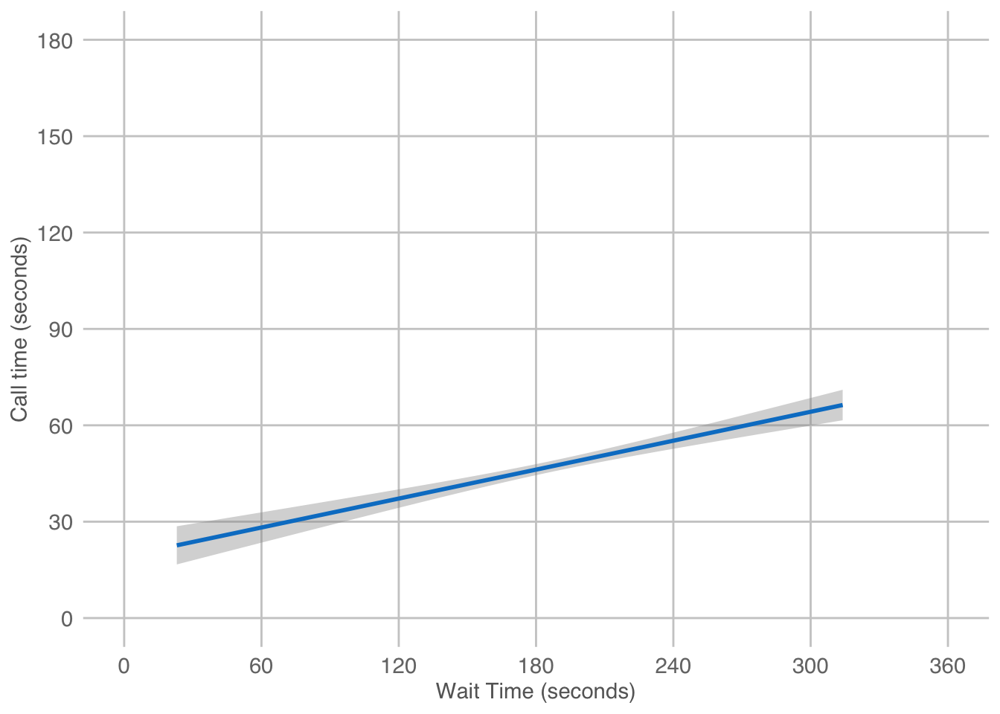
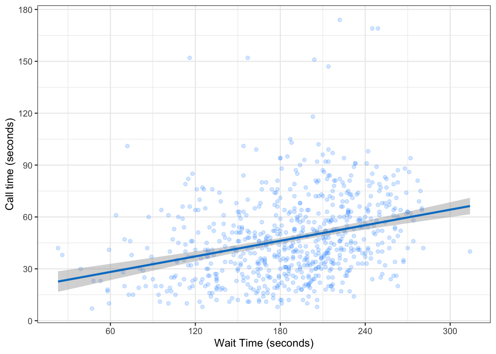
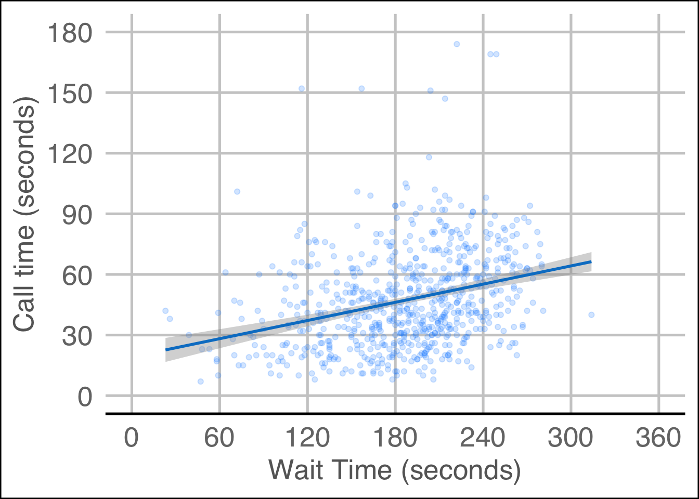
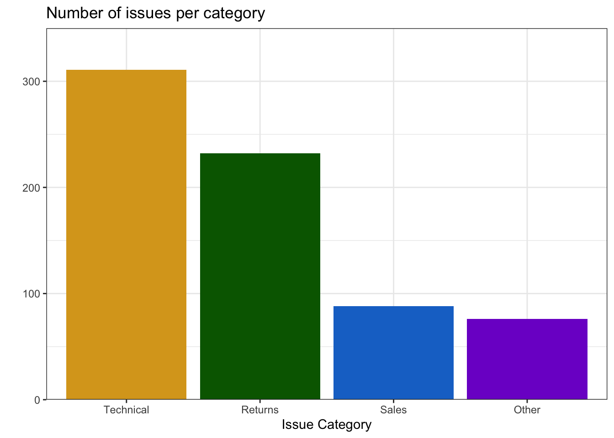
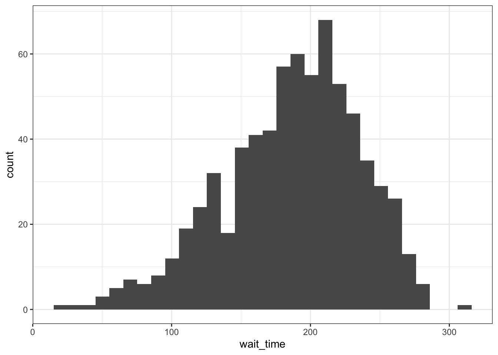
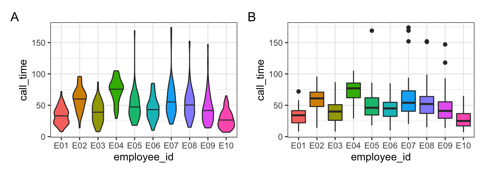
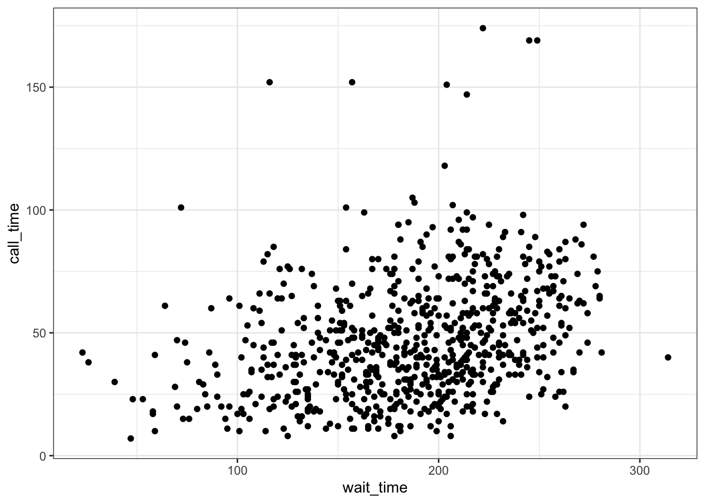
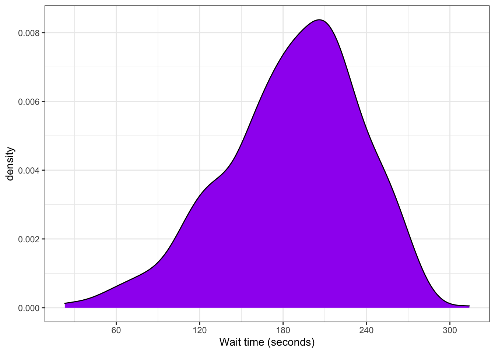
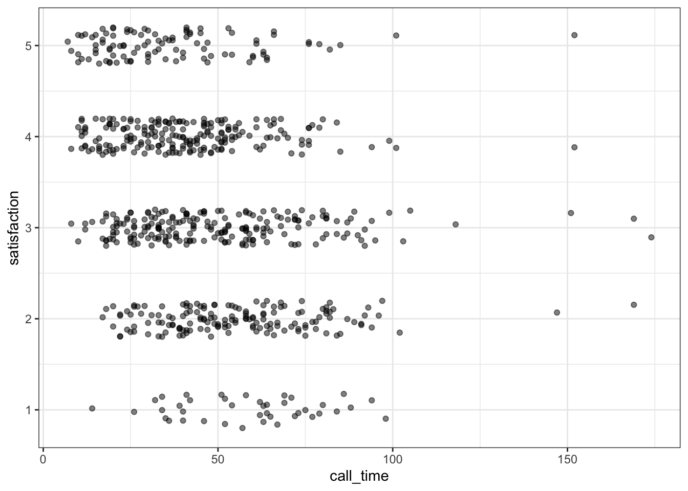

# Basic Data Visualisation {#viz}

## Intended Learning Outcomes {#ilo-viz}

* Be able to identify categorical versus continuous data
* Be able to create plots in layers using ggplot
* Be able to choose appropriate plots for data

In this chapter we'll use the following packages:


```r
library(tidyverse) # includes ggplot2
library(patchwork) # for multi-part plots
library(ggthemes)  # for plot themes
library(lubridate) # for manipulating dates
```

## Set-up

Create a new project for the work we'll do in this chapter:

-   **`File > New Project...`**
-   Name the project <code class='path'>03-visualisation</code>
-   Save it inside your ADS directory.

Then, create and save a new R Markdown document named `plots.Rmd`, get rid of the default template text, and load the above packages in the set-up code chunk. You should have all of these packages installed already but if you get the message `Error in library(x) : there is no package called ‘x’`, please refer to Chapter\ \@ref(install-package).

We'd recommend making a new code for each different activity, and using the white space to make notes on any errors you make, things you find interesting, or questions you'd like to ask the course team.

## Variable Types

If a spreadsheet is in a ` r glossary("tidy data")` format, each row is an <a class='glossary' target='_blank' title='All of the data about a single trial or question.' href='https://psyteachr.github.io/glossary/o#observation'>observation</a>, each column is a <a class='glossary' target='_blank' title='A word that identifies and stores the value of some data for later use.' href='https://psyteachr.github.io/glossary/v#variable'>variable</a>, and the information in each cell is a <a class='glossary' target='_blank' title='A single number or piece of data.' href='https://psyteachr.github.io/glossary/v#value'>value</a>. We'll learn more about how to get our data into this format in Chapter\ \@ref(tidy), but to get started we'll use built-in datasets with the right format.

For example, the table below lists pets owned by members of the psyTeachR team. Each row is an observation of one pet. There are 6 variables for each pet, their `name`, `owner`, `species`, `birthdate`, `weight` (in kg), and `rating` (on a 5-point scale from "very evil" to "very good").

<div class="kable-table">

<table>
 <thead>
  <tr>
   <th style="text-align:left;"> name </th>
   <th style="text-align:left;"> owner </th>
   <th style="text-align:left;"> species </th>
   <th style="text-align:left;"> birthdate </th>
   <th style="text-align:right;"> weight </th>
   <th style="text-align:left;"> rating </th>
  </tr>
 </thead>
<tbody>
  <tr>
   <td style="text-align:left;"> Darwin </td>
   <td style="text-align:left;"> Lisa </td>
   <td style="text-align:left;"> ferret </td>
   <td style="text-align:left;"> 1998-04-02 </td>
   <td style="text-align:right;"> 1.2 </td>
   <td style="text-align:left;"> a little evil </td>
  </tr>
  <tr>
   <td style="text-align:left;"> Oy </td>
   <td style="text-align:left;"> Lisa </td>
   <td style="text-align:left;"> ferret </td>
   <td style="text-align:left;"> NA </td>
   <td style="text-align:right;"> 2.9 </td>
   <td style="text-align:left;"> very good </td>
  </tr>
  <tr>
   <td style="text-align:left;"> Khaleesi </td>
   <td style="text-align:left;"> Emily </td>
   <td style="text-align:left;"> cat </td>
   <td style="text-align:left;"> 2014-10-01 </td>
   <td style="text-align:right;"> 4.5 </td>
   <td style="text-align:left;"> very good </td>
  </tr>
  <tr>
   <td style="text-align:left;"> Bernie </td>
   <td style="text-align:left;"> Phil </td>
   <td style="text-align:left;"> dog </td>
   <td style="text-align:left;"> 2017-06-01 </td>
   <td style="text-align:right;"> 32.0 </td>
   <td style="text-align:left;"> very good </td>
  </tr>
</tbody>
</table>

</div>

Variables can be classified as <a class='glossary' target='_blank' title='Data that can take on any values between other existing values.' href='https://psyteachr.github.io/glossary/c#continuous'>continuous</a> (numbers) or <a class='glossary' target='_blank' title='Data that can only take certain values, such as types of pet.' href='https://psyteachr.github.io/glossary/c#categorical'>categorical</a> (labels). When you're plotting data, it's important to know what kind of variables you have, which can help you decide what types of plots are most appropriate. Each variable also has a <a class='glossary' target='_blank' title='The kind of data represented by an object.' href='https://psyteachr.github.io/glossary/d#data-type'>data type</a>, such as <a class='glossary' target='_blank' title='A data type representing a real decimal number or integer.' href='https://psyteachr.github.io/glossary/n#numeric'>numeric</a> (numbers), <a class='glossary' target='_blank' title='A data type representing strings of text.' href='https://psyteachr.github.io/glossary/c#character'>character</a> (text), or <a class='glossary' target='_blank' title='A data type representing TRUE or FALSE values.' href='https://psyteachr.github.io/glossary/l#logical'>logical</a> (TRUE/FALSE values). Some plots can only work on some data types. Make sure you have watched the mini-lecture on types of data from last week before you work through this chapter. Additionally, Appendix\ \@ref(data-types) has more details, as this concept will be relevant repeatedly.

<div class="figure" style="text-align: center">

<p class="caption">(\#fig:excel-format-cells)Data types are like the categories when you format cells in Excel.</p>
</div>

### Continuous

<a class='glossary' target='_blank' title='Data that can take on any values between other existing values.' href='https://psyteachr.github.io/glossary/c#continuous'>Continuous</a> variables are properties you can measure, like weight. You can use continuous variables in mathematical operations, like calculating the sum total of a column of prices or the average number of social media likes per day. They may be rounded to the nearest whole number, but it should make sense to have a measurement halfway between.

Continuous variables always have a <a class='glossary' target='_blank' title='A data type representing a real decimal number or integer.' href='https://psyteachr.github.io/glossary/n#numeric'>numeric</a> data type. They are either <a class='glossary' target='_blank' title='A data type representing whole numbers.' href='https://psyteachr.github.io/glossary/i#integer'>integers</a> like <code><span class='fl'>42</span></code> or <a class='glossary' target='_blank' title='A data type representing a real decimal number' href='https://psyteachr.github.io/glossary/d#double'>doubles</a> like <code><span class='fl'>3.14159</span></code>. 

### Categorical

<a class='glossary' target='_blank' title='Data that can only take certain values, such as types of pet.' href='https://psyteachr.github.io/glossary/c#categorical'>Categorical</a> variables are properties you can count, like the species of pet. Categorical variables can be <a class='glossary' target='_blank' title='Categorical variables that don&#39;t have an inherent order, such as types of animal.' href='https://psyteachr.github.io/glossary/n#nominal'>nominal</a>, where the categories don't really have an order, like cats, dogs and ferrets (even though ferrets are obviously best), or <a class='glossary' target='_blank' title='Discrete variables that have an inherent order, such as number of legs' href='https://psyteachr.github.io/glossary/o#ordinal'>ordinal</a>, where they have a clear order but the distance between the categories isn't something you could exactly equate, like points on a <a class='glossary' target='_blank' title='A rating scale with a small number of discrete points in order' href='https://psyteachr.github.io/glossary/l#likert'>Likert</a> rating scale. Even if a data table uses numbers like 1-7 to represent ordinal variables, you shouldn't treat them like continuous variables.

Categorical data can have a <a class='glossary' target='_blank' title='A data type representing strings of text.' href='https://psyteachr.github.io/glossary/c#character'>character</a> data type, also called <a class='glossary' target='_blank' title='A piece of text inside of quotes.' href='https://psyteachr.github.io/glossary/s#string'>strings</a>. These are made by putting text inside of quotes. That text can be letters, punctuation, or even numbers. For example, <code><span class='st'>"January"</span></code> is a character string, but so is <code><span class='st'>"1"</span></code> if you put it in quotes. The character data type is best for variables that can have a lot of different values that you can't predict ahead of time.

Categorical data can also be <a class='glossary' target='_blank' title='A data type where a specific set of values are stored with labels; An explanatory variable manipulated by the experimenter' href='https://psyteachr.github.io/glossary/f#factor'>factors</a>, a specific type of integer that lets you specify the category names and their order. This is useful for making plots display with categories in the order you want (otherwise they default to alphabetical order). The factor data type is best for categories that have a specific number of levels.

Sometimes people represent categorical variables with numbers that correspond to names, like 0 = "no" and 1 = "yes", but values in between don't have a clear interpretation. If you have control over how the data are recorded, it's better to use the character names for clarity, but you'll learn how to recode columns in Chapter\ \@ref(wrangle).

### Dates and Times

Dates and times are a special case of variable. They can act like categorical or continuous variables, and there are special ways to plot them. Dates and times can be hard to work with, but the <code class='package'><a href='https://lubridate.tidyverse.org/' target='_blank'>lubridate</a></code> package provides functions to help you with this.


```r
lubridate::today()
lubridate::now(tzone = "GMT")
```

```
## [1] "2022-01-05"
## [1] "2022-01-05 11:42:29 GMT"
```

### Test your understanding

Coming back to the pets dataset, what type of variable is in each column? You can use the function `glimpse()` to show a list of the column names, their data types, and the first few values in each column - here is the output of running `glimpse()` on the pets dataset.


```r
glimpse(pets)
```

```
## Rows: 4
## Columns: 6
## $ name      <chr> "Darwin", "Oy", "Khaleesi", "Bernie"
## $ owner     <chr> "Lisa", "Lisa", "Emily", "Phil"
## $ species   <fct> ferret, ferret, cat, dog
## $ birthdate <date> 1998-04-02, NA, 2014-10-01, 2017-06-01
## $ weight    <dbl> 1.2, 2.9, 4.5, 32.0
## $ rating    <fct> a little evil, very good, very good, very good
```

::: {.try data-latex=""}


| Column      | Variable type | Data type     |
|:------------|:--------------|:--------------|
| `name`      | <select class='webex-select'><option value='blank'></option><option value='x'>continuous</option><option value='answer'>nominal</option><option value='x'>ordinal</option><option value='x'>date</option></select>  | <select class='webex-select'><option value='blank'></option><option value='x'>numeric</option><option value='answer'>character</option><option value='x'>factor</option><option value='x'>date</option></select>  |
| `owner`     | <select class='webex-select'><option value='blank'></option><option value='x'>continuous</option><option value='answer'>nominal</option><option value='x'>ordinal</option><option value='x'>date</option></select>  | <select class='webex-select'><option value='blank'></option><option value='x'>numeric</option><option value='answer'>character</option><option value='x'>factor</option><option value='x'>date</option></select>  |
| `species`   | <select class='webex-select'><option value='blank'></option><option value='x'>continuous</option><option value='answer'>nominal</option><option value='x'>ordinal</option><option value='x'>date</option></select>  | <select class='webex-select'><option value='blank'></option><option value='x'>numeric</option><option value='x'>character</option><option value='answer'>factor</option><option value='x'>date</option></select> |
| `birthdate` | <select class='webex-select'><option value='blank'></option><option value='x'>continuous</option><option value='x'>nominal</option><option value='x'>ordinal</option><option value='answer'>date</option></select> | <select class='webex-select'><option value='blank'></option><option value='x'>continuous</option><option value='x'>nominal</option><option value='x'>ordinal</option><option value='answer'>date</option></select> |
| `weight`    | <select class='webex-select'><option value='blank'></option><option value='answer'>continuous</option><option value='x'>nominal</option><option value='x'>ordinal</option><option value='x'>date</option></select> | <select class='webex-select'><option value='blank'></option><option value='answer'>numeric</option><option value='x'>character</option><option value='x'>factor</option><option value='x'>date</option></select>  |
| `rating`    | <select class='webex-select'><option value='blank'></option><option value='x'>continuous</option><option value='x'>nominal</option><option value='answer'>ordinal</option><option value='x'>date</option></select>  | <select class='webex-select'><option value='blank'></option><option value='x'>numeric</option><option value='x'>character</option><option value='answer'>factor</option><option value='x'>date</option></select> |

:::


## Building Plots


There are multiple approaches to data visualisation in R; in this course we will use the popular package <code class='package'>ggplot2</code> which is part of the larger `tidyverse` collection of packages. A grammar of graphics (the "gg" in "ggplot") is a standardised way to describe the components of a graphic. <code class='package'>ggplot2</code> uses a layered grammar of graphics, in which plots are built up in a series of layers. It may be helpful to think about any picture as having multiple elements that sit semi-transparently over each other. A good analogy is old Disney movies where artists would create a background and then add moveable elements on top of the background via transparencies.

### Layered Plots

Figure\ \@ref(fig:layers) displays the evolution of a simple scatterplot using this layered approach. First, the plot space is built (layer 1); the variables are specified (layer 2); the type of visualisation (known as a `geom`) that is desired for these variables is specified (layer 3) - in this case `geom_point()` is called to visualise individual data points; a second geom is added to include a line of best fit (layer 4), the axis labels are edited for readability (layer 5), and finally, a theme is applied to change the overall appearance of the plot (layer 6).

<div class="figure" style="text-align: center">

<p class="caption">(\#fig:layers)Evolution of a layered plot</p>
</div>

Importantly, each layer is independent and independently customisable. For example, the size, colour and position of each component can be adjusted, or one could, for example, remove the first geom (the data points) to only visualise the line of best fit, simply by removing the layer that draws the data points (Figure\ \@ref(fig:remove-layer)). The use of layers makes it easy to build up complex plots step-by-step, and to adapt or extend plots from existing code.

<div class="figure" style="text-align: center">

<p class="caption">(\#fig:remove-layer)Plot with scatterplot layer removed.</p>
</div>

### Loading Data {#plots-loading-data}

Let's build up the plot above, layer by layer. First we need to get the data. We'll learn how to load data from different sources in Chapter\ \@ref(data), but this time we'll use the same method as we did in Chapter\ \@ref(loading-online) and load it from an online source. 

When you load the data `read_csv()` will produce a message that gives you information about the data it has imported and what assumptions it has made. The "column specification" tells you what each column is named and what type of data R has categorised each variable as. The abbreviation "chr" is for <a class='glossary' target='_blank' title='A data type representing strings of text.' href='https://psyteachr.github.io/glossary/c#character'>character</a> columns, "dbl" is for <a class='glossary' target='_blank' title='A data type representing a real decimal number' href='https://psyteachr.github.io/glossary/d#double'>double</a> columns, and "dttm" is a date/time column.


```r
survey_data <- read_csv("https://raw.githubusercontent.com/PsyTeachR/ads-v1/master/book/data/survey_data.csv")
```

```
## Rows: 707 Columns: 7
```

```
## ── Column specification ────────────────────────────────────────────────────────
## Delimiter: ","
## chr  (3): caller_id, employee_id, issue_category
## dbl  (3): wait_time, call_time, satisfaction
## dttm (1): call_start
```

```
## 
## ℹ Use `spec()` to retrieve the full column specification for this data.
## ℹ Specify the column types or set `show_col_types = FALSE` to quiet this message.
```

This data is simulated data for a call centre customer satisfaction survey. The first thing you should do when you need to plot data is to get familiar with what all of the rows (observations) and columns (variables) mean. Sometimes this is obvious, and sometimes it requires help from the data provider. Here, each row represents one call to the centre.

* `caller_id` is a unique ID for each caller
* `employee_id` is a unique ID for each employee taking calls
* `call_start` is the date and time that the call arrived
* `wait_time` is the number of seconds the caller had to wait
* `call_time` is the number of seconds the call lasted after the employee picked up
* `issue_category` is whether the issue was tech, sales, returns, other
* `satisfaction` is the customer satisfaction rating on a scale from 1 (very unsatisfied) to 5 (very satisfied)

Unless you specify the column types, data importing functions will just guess the types and usually default to double for columns with numbers and character for columns with letters. Use the function `spec()` to find out all of the column types and edit them if needed.


```r
spec(survey_data)
```

```
## cols(
##   caller_id = col_character(),
##   employee_id = col_character(),
##   call_start = col_datetime(format = ""),
##   wait_time = col_double(),
##   call_time = col_double(),
##   issue_category = col_character(),
##   satisfaction = col_double()
## )
```

Let's set `issue_category` as a factor and set the order of the levels. By default, R will order the levels of a factor alphanumerically, however in many cases you will want or need to set your own order. For example, in this data, it makes most sense for the category "other" to come at the end of the list. After you update the column types, you have to re-import the data by adjusting the `read_csv()` code to set the `col_types` argument to the new column types.

Note that because `read_csv()` is going to use the object `survey_col_types`, you must create `survey_col_types` before you run the adjusted `read_csv()` code. If you ever need to adjust your code, try to think about the order that the code will run in if you start from scratch and make sure it's organised appropriately.


```r
# updated column types
survey_col_types <- cols(
  caller_id = col_character(),
  employee_id = col_character(),
  call_start = col_datetime(format = ""),
  wait_time = col_double(),
  call_time = col_double(),
  issue_category = col_factor(levels = c("tech", "sales", "returns", "other")),
  satisfaction = col_integer()
)

# re-import data with correct column  types
survey_data <- read_csv("https://raw.githubusercontent.com/PsyTeachR/ads-v1/master/book/data/survey_data.csv",
                        col_types = survey_col_types)
```


### Plot setup

Every plot starts with the `ggplot()` function and a data table. If your data are not loaded or you have a typo in your code, this will give you an error message. It's best to check your plot after each step so you can figure out where errors are more easily.


```r
ggplot(data = survey_data)
```

<div class="figure" style="text-align: center">

<p class="caption">(\#fig:build-plot-setup)A blank ggplot.</p>
</div>

### Mapping

The next <a class='glossary' target='_blank' title='A variable that provides input to a function.' href='https://psyteachr.github.io/glossary/a#argument'>argument</a> to `ggplot()` is the `mapping`. This tells the plot which columns in the data should be represented by, or "mapped" to, different "aesthetics" (`aes`) of the plot, such as the x-axis, y-axis, line colour, object fill, or line style.

Set the arguments `x` and `y` to the names of the columns you want to be plotted on those axes. Here, we want to plot the wait time on the x-axis and the call time on the y-axis.


```r
# set up the plot with mapping
ggplot(data = survey_data, mapping = aes(x = wait_time, y = call_time))
```

<div class="figure" style="text-align: center">

<p class="caption">(\#fig:build-plot-mapping)A blank plot with x- and y- axes mapped.</p>
</div>

### Geoms

Now we can add our plot elements in layers. These are referred to as <a class='glossary' target='_blank' title='The geometric style in which data are displayed, such as boxplot, density, or histogram.' href='https://psyteachr.github.io/glossary/g#geom'>geoms</a> and their functions start with `geom_`. You **add** layers onto the base plot created by `ggplot()` with a plus (`+`). 


```r
ggplot(data = survey_data, aes(x = wait_time, y = call_time)) +
  geom_point() # scatterplot
```

<div class="figure" style="text-align: center">

<p class="caption">(\#fig:build-plot-geoms)Adding a scatterplot with geom_point().</p>
</div>

::: {.warning data-latex=""}
Somewhat annoyingly, the plus has to be on the end of the previous line, not at the start of the next line. If you do make this mistake, it will run the first line of code to produce the base layer but then you will get the following error message rather than adding on `geom_point()`.


```r
ggplot(data = survey_data, aes(x = wait_time, y = call_time)) 
```


```r
+ geom_point() # scatterplot
```

```
## Error: Cannot use `+.gg()` with a single argument. Did you accidentally put + on a new line?
```
:::

### Multiple Geoms

Part of the power of <code class='package'>ggplot2</code> is that you can add more than one geom to a plot by adding on extra layers and so it quickly becomes possible to make complex and informative visualisation. Importantly, the layers display in the order you set them up. The code below uses the same geoms to produce a scatterplot with a line of best fit but orders them differently, we make two different plots and assign them to <a class='glossary' target='_blank' title='A word that identifies and stores the value of some data for later use.' href='https://psyteachr.github.io/glossary/o#object'>objects</a> that we can add together using the `plot_layout()` function from the <code class='package'>patchwork</code> package.


```r
# Points first
ggplot(data = survey_data, mapping = aes(x = wait_time, y = call_time)) +
  geom_point() + # scatterplot
  geom_smooth(method = lm) # line of best fit

# Line first
ggplot(data = survey_data, mapping = aes(x = wait_time, y = call_time)) +
  geom_smooth(method = lm) + # line of best fit
  geom_point() # scatterplot
```


<div class="figure" style="text-align: center">

<p class="caption">(\#fig:build-plot-geom2)Points first versus line first.</p>
</div>

### Saving and combining plots

Just like you can save numbers and data tables to objects, you can also save the output of `ggplot()` . The below code produces the same plots we created above but saves them to objects named `point_first` and `line_first`. If you run this code, the plots won't display like they have done before, instead, you'll see the object names appear in the environment pane. To view the plots, call the objects by name.


```r
point_first <- 
  ggplot(data = survey_data, mapping = aes(x = wait_time, y = call_time)) +
  geom_point() + # scatterplot
  geom_smooth(method = lm) # line of best fit
  
line_first <-
  ggplot(data = survey_data, mapping = aes(x = wait_time, y = call_time)) +
  geom_smooth(method = lm) + # line of best fit
  geom_point() # scatterplot

# view first plot
point_first
```

<div class="figure" style="text-align: center">

<p class="caption">(\#fig:build-plot-geom2b-1)Points first versus line first.</p>
</div>

```r
# view second plot
line_first
```

<div class="figure" style="text-align: center">

<p class="caption">(\#fig:build-plot-geom2b-2)Points first versus line first.</p>
</div>

One of the reasons to save your plots to object is so that you can combine multiple plots using functions from the `patchwork` package. The below code produces the above plot by combining the two plots with `+` and then specifying that  we want the plots produced on a single row with the `nrow` argument in `plot_layout()`. 


```r
# add plots together in 1 row
point_first + line_first + plot_layout(nrow = 1) # try changing nrow to 2
```

```
## `geom_smooth()` using formula 'y ~ x'
## `geom_smooth()` using formula 'y ~ x'
```


### Styling Geoms

We should definitely put the line in front of the points, but the points are still a bit dark. If you want to change the overall style of a geom (not use it to represent different levels of a variable), you can set arguments inside the geom function. 

There are many different values that you can set `colour`, `alpha`, `shape`, `size` and `linetype` to and Appendix\ \@ref(plotstyle) gives details of these.


```r
ggplot(data = survey_data, mapping = aes(x = wait_time, y = call_time)) +
  geom_point(colour = "dodgerblue", 
             alpha = 0.2, #transparency
             shape = 18,
             size = 2) + 
  geom_smooth(method = lm, 
              formula = y~x, # formula used to draw line, default value but avoids annoying message
              colour = rgb(0, .5, .8),
              linetype = 3) 
```

<div class="figure" style="text-align: center">

<p class="caption">(\#fig:build-plot-style)Changing geom styles.</p>
</div>


::: {.try data-latex=""}
Play around with different values for the aesthetics above. Figure out what the default values are for `shape` and `size`. 
:::

### Format Axes

Now we need to make the axes look neater. There are several functions you can use to change the axis labels, but the most powerful ones are the `scale_` functions. You need to use a scale function that matches the data you're plotting on that axis and this is where it becomes particularly important to know what type of data you're working with. Both of the axes here are <a class='glossary' target='_blank' title='Data that can take on any values between other existing values.' href='https://psyteachr.github.io/glossary/c#continuous'>continuous</a>, so we'll use `scale_x_continuous()` and `scale_y_continuous()`.

The `name` argument changes the axis label. The `breaks` argument sets the major units and needs a <a class='glossary' target='_blank' title='A type of data structure that collects values with the same data type, like T/F values, numbers, or strings.' href='https://psyteachr.github.io/glossary/v#vector'>vector</a> of possible values, which can extend beyond the range of the data (e.g., `wait time` only goes up to 350, but we can specify breaks up to 600 to make the maths easier). The `seq()` function creates a sequence of numbers `from` one `to` another `by` specified steps.


```r
ggplot(data = survey_data, mapping = aes(x = wait_time, y = call_time)) +
  geom_point(colour = "dodgerblue", 
             alpha = 0.2) + 
  geom_smooth(method = lm, 
              formula = y~x, 
              colour = rgb(0, .5, .8)) +
  scale_x_continuous(name = "Wait Time (seconds)", 
                     breaks = seq(from = 0, to = 600, by = 60)) +
  scale_y_continuous(name = "Call time (seconds)",
                     breaks = seq(from = 0, to = 600, by = 30))
```

<div class="figure" style="text-align: center">

<p class="caption">(\#fig:build-plot-axes)Formatting plot axes with scale_ functions.</p>
</div>

::: {.try data-latex=""}
Check the help for `?scale_x_continuous` to see how you would set the minor units or specify how many breaks you want instead.
:::


### Axis Limits

If you want to change the minimum and maximum values on an axis, use the `coord_cartesian()` function. Many plots make more sense if the minimum and maximum values represent the range of possible values, even if those values aren't present in the data. Here, wait and call times can't be less than 0 seconds, so we'll set the minimum values to 0 and the maximum values to the first breaks above the maximum values.


```r
ggplot(data = survey_data, mapping = aes(x = wait_time, y = call_time)) +
  geom_point(colour = "dodgerblue", 
             alpha = 0.2) + 
  geom_smooth(method = lm, 
              formula = y~x, 
              colour = rgb(0, .5, .8)) +
  scale_x_continuous(name = "Wait Time (seconds)", 
                     breaks = seq(from = 0, to = 600, by = 60)) +
  scale_y_continuous(name = "Call time (seconds)",
                     breaks = seq(from = 0, to = 600, by = 30))
```

<div class="figure" style="text-align: center">

<p class="caption">(\#fig:build-plot-limits)Changing the axis limits.</p>
</div>

```r
  coord_cartesian(xlim = c(0, 360), 
                  ylim = c(0, 180))
```

```
## <ggproto object: Class CoordCartesian, Coord, gg>
##     aspect: function
##     backtransform_range: function
##     clip: on
##     default: FALSE
##     distance: function
##     expand: TRUE
##     is_free: function
##     is_linear: function
##     labels: function
##     limits: list
##     modify_scales: function
##     range: function
##     render_axis_h: function
##     render_axis_v: function
##     render_bg: function
##     render_fg: function
##     setup_data: function
##     setup_layout: function
##     setup_panel_guides: function
##     setup_panel_params: function
##     setup_params: function
##     train_panel_guides: function
##     transform: function
##     super:  <ggproto object: Class CoordCartesian, Coord, gg>
```

::: {.dangerous data-latex=""}
You can also set the `limits` argument inside  the `scale_` functions, but this actually removes any data that falls outside these limits, rather than cropping your plot, and this can change the appearance of certain types of plots like violin plots and density plots.
:::

### Themes

<code class='package'>ggplot2</code> comes with several built-in themes, such as `theme_minimal()` and `theme_bw()`, but the <code class='package'><a href='https://yutannihilation.github.io/allYourFigureAreBelongToUs/ggthemes/' target='_blank'>ggthemes</a></code> package provides even more themes that match different software, such as GoogleDocs or Stata, or publications, such as the Economist or the Wall Street Journal. Let's add the GoogleDocs theme, but change the font size to 11 with the `base_size` argument and change the font to "Times" with the `base_family` argument.

It's also worth highlighting that this code is starting to look quite complicated because of the number of layers but because we've built it up slowly it should (hopefully!) make sense - if you see examples of <code class='package'>ggplot2</code> code online that you'd like to adapt, build the plot up layer by layer and it will make it easier to understand what each layer adds.


```r
ggplot(data = survey_data, mapping = aes(x = wait_time, y = call_time)) +
  geom_point(colour = "dodgerblue", 
             alpha = 0.2) + 
  geom_smooth(method = lm, 
              formula = y~x, 
              colour = rgb(0, .5, .8)) +
  scale_x_continuous(name = "Wait Time (seconds)", 
                     breaks = x_breaks) +
  scale_y_continuous(name = "Call time (seconds)",
                     breaks = y_breaks) +
  coord_cartesian(xlim = c(0, 360), 
                  ylim = c(0, 180)) +
  theme_gdocs(base_size = 11, base_family = "Times")
```

<div class="figure" style="text-align: center">

<p class="caption">(\#fig:build-plot-theme)Changing the theme.</p>
</div>

::: {.warning data-latex=""}
If you don't that the font "Times" on your computer, you'll get an error message. Try another font that you do have installed.
:::

### Theme Tweaks

If you're still not quite happy with a theme, you can customise it even further with the `themes()` function. Check the help for this function to see all of the possible options. The most common thing you'll want to do is to remove an element entirely. You do this by setting the relevant argument to `element_blank()`. Below, we're getting rid of the x-axis line and the plot background, which removes the line around the plot.


```r
ggplot(data = survey_data, mapping = aes(x = wait_time, y = call_time)) +
  geom_point(colour = "dodgerblue", 
             alpha = 0.2) + 
  geom_smooth(method = lm, 
              formula = y~x, 
              colour = rgb(0, .5, .8)) +
  scale_x_continuous(name = "Wait Time (seconds)", 
                     breaks = x_breaks) +
  scale_y_continuous(name = "Call time (seconds)",
                     breaks = y_breaks) +
  coord_cartesian(xlim = c(0, 360), 
                  ylim = c(0, 180)) +
  theme_gdocs(base_size = 11, base_family = "Times") +
  theme(axis.line.x = element_blank(),
        plot.background = element_blank())
```

<div class="figure" style="text-align: center">

<p class="caption">(\#fig:build-plot-custom-theme)Customising the theme.</p>
</div>


## Appropriate Plots

The [ggplot2 cheat sheet](https://github.com/rstudio/cheatsheets/raw/master/data-visualization-2.1.pdf) is a great resource to help you find plots appropriate to your data, based on how many variables you're plotting and what type they are. The examples below all use the same customer satisfaction data, but each plot communicates something different. 

We don't expect you to memorise all of the plot types or the methods for customising them, but it will be helpful to try out the code in the examples below for yourself, changing values to test your understanding.

### Counting Categories

#### Bar Plot

If you want to count the number of things per category, you can use `geom_bar()`. You only need to provide a `x` mapping to `geom_bar()` because by default `ggplot()` will count the number of observations in each group of `x` so you don't need to tell it what to put on the y-axis.


```r
ggplot(data = survey_data, mapping = aes(x = issue_category)) +
  geom_bar()
```


::: {.try data-latex=""}

You probably want to customise some things, like the colours, order of the columns, and their labels. Inspect the code below and try running it layer by layer to figure out where these things change. The functions `scale_fill_manual()` and `scale_x_discrete()` are new, but work in the same way as the other `scale_` functions. You'll learn more about this in Chapter\ \@ref(custom).


<div class='webex-solution'><button>Code</button>

```r
ggplot(data = survey_data, mapping = aes(x = issue_category, fill = issue_category) ) +
  geom_bar() +
  scale_x_discrete(
    name = "Issue Category", # change axis title
    limits = c("tech", "returns", "sales", "other"), # change order
    labels = c("Technical", "Returns", "Sales", "Other") # change labels
  ) +
  scale_fill_manual(
    values = c(tech = "goldenrod", 
                returns = "darkgreen", 
                sales = "dodgerblue3", 
                other = "purple3"), # change colours
    guide = "none" # remove the legend
  ) +
  scale_y_continuous(
    name = "", # remove axis title
    # remove the space above and below the y-axis
    expand = expansion(add = 0)
  ) +
  coord_cartesian(ylim = c(0, 350)) + # minimum = 0, maximum = 350
  ggtitle("Number of issues per category") # add a title
```


</div>
:::

#### Column Plot

If your data already have a column with the number you want to plot, you can use `geom_col()` to plot it. We can use the `count()` function to make a table with a row for each `issue_category` and a column called `n` with the number of observations in that category.


```r
count_data <- count(x = survey_data, issue_category)
```

<div class="kable-table">

<table>
 <thead>
  <tr>
   <th style="text-align:left;"> issue_category </th>
   <th style="text-align:right;"> n </th>
  </tr>
 </thead>
<tbody>
  <tr>
   <td style="text-align:left;"> tech </td>
   <td style="text-align:right;"> 311 </td>
  </tr>
  <tr>
   <td style="text-align:left;"> sales </td>
   <td style="text-align:right;"> 88 </td>
  </tr>
  <tr>
   <td style="text-align:left;"> returns </td>
   <td style="text-align:right;"> 232 </td>
  </tr>
  <tr>
   <td style="text-align:left;"> other </td>
   <td style="text-align:right;"> 76 </td>
  </tr>
</tbody>
</table>

</div>

The mapping for `geom_col()` requires you to set both the `x` and `y` aesthetics. Set `y = n` because we want to plot the number of issues in each category, and that information is in the column called `n`.


```r
ggplot(data = count_data, mapping = aes(x = issue_category, y = n)) +
  geom_col()
```


#### Pie Chart

Pie charts are a [misleading form of data visualisation](https://www.data-to-viz.com/caveat/pie.html){target="_blank"}, so we won't cover them. We'll cover options for visualising proportions, like waffle, lollipop and treemap plots, in Chapter\ \@ref(custom).


#### Test your understanding


Here is a small data table.

country             | population      | island
:-------------------|----------------:|:--------------
Northern Ireland    | 1,895,510       | Ireland
Wales               | 3,169,586       | Great Britain
Republic of Ireland | 4,937,786       | Ireland
Scotland            | 5,466,000       | Great Britain
England             | 56,550,138      | Great Britain

::: {.try data-latex=""}

* What geom would you use to plot the population for each of the 5 countries? <select class='webex-select'><option value='blank'></option><option value='x'>geom_bar</option><option value='answer'>geom_col</option></select>
* What mapping would you use?  <div class='webex-radiogroup' id='radio_IVXWBHTFIG'><label><input type="radio" autocomplete="off" name="radio_IVXWBHTFIG" value="answer"></input> <span>aes(x = country, y = population)</span></label><label><input type="radio" autocomplete="off" name="radio_IVXWBHTFIG" value="x"></input> <span>aes(x = population, y = country)</span></label><label><input type="radio" autocomplete="off" name="radio_IVXWBHTFIG" value="x"></input> <span>aes(x = country)</span></label><label><input type="radio" autocomplete="off" name="radio_IVXWBHTFIG" value="x"></input> <span>aes(x = island)</span></label><label><input type="radio" autocomplete="off" name="radio_IVXWBHTFIG" value="x"></input> <span>aes(y = population)</span></label></div>
* What geom would you use to plot the number of countries on each island? <select class='webex-select'><option value='blank'></option><option value='answer'>geom_bar</option><option value='x'>geom_col</option></select>
* What mapping would you use?  <div class='webex-radiogroup' id='radio_KQGYPIKVNE'><label><input type="radio" autocomplete="off" name="radio_KQGYPIKVNE" value="x"></input> <span>aes(x = country, y = population)</span></label><label><input type="radio" autocomplete="off" name="radio_KQGYPIKVNE" value="x"></input> <span>aes(x = population, y = country)</span></label><label><input type="radio" autocomplete="off" name="radio_KQGYPIKVNE" value="x"></input> <span>aes(x = country)</span></label><label><input type="radio" autocomplete="off" name="radio_KQGYPIKVNE" value="answer"></input> <span>aes(x = island)</span></label><label><input type="radio" autocomplete="off" name="radio_KQGYPIKVNE" value="x"></input> <span>aes(y = population)</span></label></div>
:::

### One Continuous Variable

If you have a continuous variable, like the number of seconds callers have to wait, you can use `geom_histogram()` or `geom_density()` to show the distribution. Just like `geom_bar()` you are only required to specify the `x` variable.

#### Histogram

A histogram splits the data into "bins" along the x-axis and shows the count of how many observations are in each bin along the y-axis.


```r
ggplot(data = survey_data, mapping = aes(x = wait_time)) +
  geom_histogram()
```

```
## `stat_bin()` using `bins = 30`. Pick better value with `binwidth`.
```

<div class="figure" style="text-align: center">

<p class="caption">(\#fig:unnamed-chunk-15)Histogram of wait times.</p>
</div>

You should always set the `binwidth` or number of `bins` to something meaningful for your data (otherwise you get that annoying message). You might need to try a few options before you find something that looks good and conveys the meaning of your plot - try changing the values of `binwidth` and `bins` below to see what works best.


```r
# adjust width of each bar
ggplot(data = survey_data, mapping = aes(x = wait_time)) +
  geom_histogram(binwidth = 15)

# adjust number of bars
ggplot(data = survey_data, mapping = aes(x = wait_time)) +
  geom_histogram(bins = 5)
```


By default, the bars start *centered* on 0, so if `binwidth` is set to 15, the first bar would include -7.5 to 7.5 seconds, which doesn't make much sense. We can set `boundary = 0` so that each bar represents increments of 15 seconds *starting* from 0. 


```r
ggplot(data = survey_data, mapping = aes(x = wait_time)) +
  geom_histogram(binwidth = 15, boundary = 0)
```


Finally, the default style of grey bars is ugly, so you can change that by setting the `fill` and `colour`, as well as using `scale_x_continuous()` to update the axis labels. 


```r
ggplot(data = survey_data, mapping = aes(x = wait_time)) +
  geom_histogram(binwidth = 15, 
                 boundary = 0, 
                 fill = "white", 
                 color = "black") +
  scale_x_continuous(name = "Wait time (seconds)",
                     breaks = seq(0, 600, 60))
```

<div class="figure" style="text-align: center">

<p class="caption">(\#fig:unnamed-chunk-18)Histogram with custom styles.</p>
</div>

#### Frequency Plot

Rather than plotting each bin as a bar, you can connect a line across the top of each bin using a frequency plot. The function `geom_freqpoly()` works the same as `geom_histogram()`, except it can't take a `fill` argument because it's just a line. 


```r
ggplot(data = survey_data, mapping = aes(x = wait_time)) +
  scale_x_continuous(name = "Wait time (seconds)",
                     breaks = seq(0, 600, 60)) +
  geom_freqpoly(boundary = 0, binwidth = 15, 
                color = "black")
```




#### Density Plot

If the distribution is smooth, a density plot is often a better way to show the distribution. A density plot doesn't need the `binwidth` or `boundary` arguments because it doesn't split the data into bins, but it can have `fill`.


```r
ggplot(data = survey_data, mapping = aes(x = wait_time)) +
  scale_x_continuous(name = "Wait time (seconds)",
                     breaks = seq(0, 600, 60)) +
  geom_density(fill = "purple", color = "black")
```


#### Test your understanding

Imagine you have a table of the [population for each country in the world](https://population.un.org/wpp/Download/Standard/Population/){target="_blank"} with the columns `country` and `population`. We'll just look at the 76 countries with populations of less than a million.


::: {.try data-latex=""}

* What kind of plot is A? <select class='webex-select'><option value='blank'></option><option value='x'>geom_histogram</option><option value='x'>geom_freqpoly</option><option value='answer'>geom_density</option></select>
* What kind of plot is B? <select class='webex-select'><option value='blank'></option><option value='answer'>geom_histogram</option><option value='x'>geom_freqpoly</option><option value='x'>geom_density</option></select>
* What kind of plot is C? <select class='webex-select'><option value='blank'></option><option value='x'>geom_histogram</option><option value='answer'>geom_freqpoly</option><option value='x'>geom_density</option></select>
* How would you set the mapping for these plots?  <div class='webex-radiogroup' id='radio_PGJXCZGPIK'><label><input type="radio" autocomplete="off" name="radio_PGJXCZGPIK" value="x"></input> <span>aes(x = country, y = population)</span></label><label><input type="radio" autocomplete="off" name="radio_PGJXCZGPIK" value="x"></input> <span>aes(x = population, y = country)</span></label><label><input type="radio" autocomplete="off" name="radio_PGJXCZGPIK" value="answer"></input> <span>aes(x = population)</span></label><label><input type="radio" autocomplete="off" name="radio_PGJXCZGPIK" value="x"></input> <span>aes(x = population, y = count)</span></label></div>
* What is the `binwidth` of the histogram? <select class='webex-select'><option value='blank'></option><option value=''>1</option><option value=''>100</option><option value='answer'>100K</option><option value=''>1M</option></select>
:::

### Grouped Continuous Variables

There are several ways to compare continuous data across groups. Which you choose depends on what point you are trying to make with the plot.

#### Subdividing Distributions

In previous plots, we have used `fill` purely for visual reasons, e.g., we have changed the colour of the histogram bars to make them look nicer. However, you can also use `fill` to represent another variable so that the colours become meaningful.

Setting the `fill` aesthetic in the mapping will produce different coloured bars for each category of the `fill` variable, in this case `issue_category`. By default, the categories are positioned stacked on top of each other. The function `geom_area()` gives a similar effect when `stat = "bin"`. 


```r
# stacked histogram
histogram_stack <- ggplot(data = survey_data, 
                          mapping = aes(x = wait_time, fill = issue_category)) +
  geom_histogram(boundary = 0, 
                 binwidth = 15, 
                 color = "black") +
  scale_x_continuous(name = "Wait time (seconds)",
                     breaks = seq(0, 600, 60)) +
  ggtitle("Stacked Histogram")

# area plot
area_plot <- ggplot(data = survey_data, 
                          mapping = aes(x = wait_time, fill = issue_category)) +
  geom_area(stat = "bin", 
            boundary = 0, 
            binwidth = 15, 
            color = "black") +
  scale_x_continuous(name = "Wait time (seconds)",
                     breaks = seq(0, 600, 60)) +
  ggtitle("Area")

# put plots together
histogram_stack + area_plot + 
  plot_layout(nrow = 1, guides = "collect")
```

<div class="figure" style="text-align: center">

<p class="caption">(\#fig:unnamed-chunk-22)Stacked histogram versus area plot.</p>
</div>

#### Comparing Distributions

If you want to compare more than one distribution, you can set the `position` argument of `geom_histogram()` to "dodge" to put the bars for each group next to each other instead of stacking them. However, this can look confusing with several categories. You can use`geom_freqpoly()` to plot a line connecting the top of each bin. 


```r
# dodged histogram
histogram_dodge <- ggplot(data = survey_data, mapping = aes(x = wait_time, 
                     fill = issue_category, 
                     colour = issue_category))+
  geom_histogram(boundary = 0, 
                 binwidth = 15, 
                 position = "dodge") +
  scale_x_continuous(name = "Wait time (seconds)",
                     breaks = seq(0, 600, 60)) +
  ggtitle("Dodged Histogram")

# frequency plot
freqpoly_plot <- ggplot(data = survey_data, mapping = aes(x = wait_time, 
                     fill = issue_category, 
                     colour = issue_category)) +
  geom_freqpoly(binwidth = 15, 
                boundary = 0,
                size = 1) +
  scale_x_continuous(name = "Wait time (seconds)",
                     breaks = seq(0, 600, 60)) +
  ggtitle("Frequency")

# put plots together
histogram_dodge + freqpoly_plot + 
  plot_layout(nrow = 1, guides = "collect") # collects the legends together, try removing this
```

<div class="figure" style="text-align: center">

<p class="caption">(\#fig:unnamed-chunk-23)Different ways to plot the distribution of a continuous variable for multiple groups.</p>
</div>

#### Violin Plot

Another way to compare groups of continuous variables is the violin plot. This is like a density plot, but rotated 90 degrees and mirrored - the fatter the violin, the more data points there are at that value.


```r
ggplot(data = survey_data, mapping = aes(x = issue_category, y = wait_time)) +
  geom_violin()
```

<div class="figure" style="text-align: center">

<p class="caption">(\#fig:violin-plot)Basic violin plot.</p>
</div>

#### Boxplot

Boxplots serve a similar purpose to violin plots (without the giggles from the back row). They don't show you the shape of the distribution, but rather some statistics about it. The middle line represents the <a class='glossary' target='_blank' title='The middle number in a distribution where half of the values are larger and half are smaller.' href='https://psyteachr.github.io/glossary/m#median'>median</a>; half the data are above this line and half below it. The box encloses the 25th to 75th percentiles of the data, so 50% of the data falls inside the box. The "whiskers" extending above and below the box extend 1.5 times the height of the box, although you can change this with the `coef` argument. The points show <a class='glossary' target='_blank' title='A data point that is extremely distant from most of the other data points' href='https://psyteachr.github.io/glossary/o#outlier'>outliers</a> -- individual data points that fall outside of this range.


```r
ggplot(data = survey_data, mapping = aes(x = issue_category, y = wait_time)) +
 geom_boxplot()
```

<div class="figure" style="text-align: center">

<p class="caption">(\#fig:box-plot)Basic boxplot.</p>
</div>


#### Combo Plots

Violin plots are frequently layered with other geoms that represent the mean or median values in the data. This is a lot of code, to help your understanding a) run it layer by layer to see how it builds up and b) change the values throughout the code


```r
# add fill and colour to the mapping

ggplot(data = survey_data, 
       mapping = aes(x = issue_category, 
                     y = wait_time,
                     fill = issue_category, # colours the inside of the bars
                     colour = issue_category)) + # colour the
  scale_x_discrete(name = "Issue Category") +
  scale_y_continuous(name = "Wait Time (seconds)",
                     breaks = seq(0, 600, 60)) +
  coord_cartesian(ylim = c(0, 360)) +
  guides(fill = "none", colour = "none") + 
  geom_violin(alpha = 0.4, 
              draw_quantiles = 0.5) + # adds line at median (50%) score
  geom_boxplot(width = 0.25, # adds a boxplot
               fill = "white", 
               alpha = 0.75, 
               outlier.alpha = 0) + 
  stat_summary(fun = mean, 
               geom = "point", 
               size = 2) + # adds a point that represents the mean
  ggtitle("ViolinBox")
```

<div class="figure" style="text-align: center">

<p class="caption">(\#fig:violin-combos)Violin plots combined with different methods to represent means and medians.</p>
</div>

::: {.dangerous data-latex=""}

A very common type of plot is to produce a bar chart of means, however, the example below demonstrates just how misleading this is. It communicates the mean value for each category, but the bars hide the distribution of the actual data. You can't tell if most wait times are close to 3 minutes, or spread from 0 to 6 minutes, or if the vast majority are less than 2 minutes, but the mean is pulled up by some very high outliers.


```r
ggplot(data = survey_data, 
       mapping = aes(x = issue_category, 
                     y = wait_time,
                     fill = issue_category)) +
  scale_x_discrete(name = "Issue Category") +
  scale_y_continuous(name = "Wait Time (seconds)",
                     breaks = seq(0, 600, 60)) +
  guides(fill = "none", colour = "none") +
  stat_summary(fun = "mean", 
               geom = "col") # draws a column representing the mean
```

<div class="figure" style="text-align: center">

<p class="caption">(\#fig:col-plot-bad)Don't plot continuous data with column plots.</p>
</div>
:::

#### Test your understanding



::: {.try data-latex=""}
* How would you create plot A? <select class='webex-select'><option value='blank'></option><option value='x'>geom_box()</option><option value='x'>geom_boxplot()</option><option value='answer'>geom_violin()</option><option value='x'>geom_violinplot()</option></select>
* How would you create plot B? <select class='webex-select'><option value='blank'></option><option value='x'>geom_box()</option><option value='answer'>geom_boxplot()</option><option value='x'>geom_violin()</option><option value='x'>geom_violinplot()</option></select>
* What does the mapping look like for both plots? <div class='webex-radiogroup' id='radio_XWEPEKHHCN'><label><input type="radio" autocomplete="off" name="radio_XWEPEKHHCN" value="x"></input> <span>aes(x = employee_id, y = call_time, colour = employee_id)</span></label><label><input type="radio" autocomplete="off" name="radio_XWEPEKHHCN" value="x"></input> <span>aes(x = employee_id, y = call_time, colour = call_time)</span></label><label><input type="radio" autocomplete="off" name="radio_XWEPEKHHCN" value="answer"></input> <span>aes(x = employee_id, y = call_time, fill = employee_id)</span></label><label><input type="radio" autocomplete="off" name="radio_XWEPEKHHCN" value="x"></input> <span>aes(x = employee_id, y = call_time, fill = call_time)</span></label></div>

* Which employee tends to have the longest calls? <select class='webex-select'><option value='blank'></option><option value='x'>e01</option><option value='x'>e02</option><option value='x'>e03</option><option value='answer'>e04</option><option value='x'>e05</option><option value='x'>e06</option><option value='x'>e07</option><option value='x'>e08</option><option value='x'>e09</option><option value='x'>e10</option></select>
* Which employee has the record longest call? <select class='webex-select'><option value='blank'></option><option value='x'>e01</option><option value='x'>e02</option><option value='x'>e03</option><option value='x'>e04</option><option value='x'>e05</option><option value='x'>e06</option><option value='answer'>e07</option><option value='x'>e08</option><option value='x'>e09</option><option value='x'>e10</option></select>
:::


### Two Continuous Variables

When you want to see how two continuous variables are related, set one as the x-axis and the other as the y-axis. Usually, if one variable causes the other, you plot the cause on the x-axis and the effect on the y-axis. Here, we want to see if longer wait times cause the calls to be longer. 

#### Scatterplot

The function to create a scatterplot is called `geom_point()`.


```r
ggplot(data = survey_data,
       mapping = aes(x = wait_time,
                    y = call_time)) +
  geom_point()
```

<div class="figure" style="text-align: center">

<p class="caption">(\#fig:demo-point)Scatterplot with geom_point().</p>
</div>

#### Trendlines

In Figure\ \@ref(fig:layers), we emphasised the relationship between wait time and call time with a trendline created by `geom_smooth()` using the argument `method = lm` ("lm" stands for "linear model" or a straight line relationship). You can also set `method = loess` to visualise a non-linear relationship.


```r
lm_plot <- g +
  geom_point(alpha = 0.2) +
  geom_smooth(method = lm, formula = y~x) +
  ggtitle("method = lm")

loess_plot <- g +
  geom_point(alpha = 0.2) +
  geom_smooth(method = "loess", formula = y~x) +
  ggtitle("method = loess")

lm_plot + loess_plot
```

<div class="figure" style="text-align: center">

<p class="caption">(\#fig:unnamed-chunk-24)Different ways to show the relationship between two continuous variables.</p>
</div>

::: {.warning data-latex=""}
If there isn't much data at the extremes of the x-axis, the curve can be very uncertain. This is represented by the wider shaded area, which means that the true relationship might be anywhere within that area.
:::


#### Dates

The `call_start` column contains both a date and a time, so use the `date()` function from <code class='package'>lubridate</code> to convert it to just a date. We'll need it in this format to be able to transform the x-axis below.


```r
ggplot(data = survey_data, 
       mapping = aes(x = lubridate::date(call_start), y = satisfaction)) + geom_smooth(method = lm, formula = y~x)
```


We can use `scale_x_date()` to set the `date_breaks` to be "1 month" apart. The `date_labels` use a code for different date formats, you can see the full list of possibilities in the help for `?strptime`. `%b` means "Abbreviated month name" whilst if you wanted to use a format like "2020/01/31" you could try `"%Y/%m/%d"`.


```r
ggplot(data = survey_data, 
       mapping = aes(x = lubridate::date(call_start), y = satisfaction)) +
  geom_smooth(method = lm, formula = y~x) +
  scale_x_date(name = "",
               date_breaks = "1 month", 
               date_labels = "%b") +
  scale_y_continuous(name = "Caller Satisfaction") +
  ggtitle("2020 Caller Satisfaction")
```


::: {.try data-latex=""}
It looks like customer satisfaction declined across the year, but is this change meaningful? See what the plot looks like when the y-axis spans the full range of possible satisfaction values from 1 to 5. You can also plot the individual data points to emphasise the range of values. 


<div class='webex-solution'><button>Solution</button>

```r
ggplot(data = survey_data, 
       mapping = aes(x = lubridate::date(call_start), y = satisfaction)) +   geom_jitter(width = 0,height = .1, alpha = 0.2) + # shows individual data
  geom_smooth(method = lm,  formula = y~x) +
  scale_x_date(name = "",
               date_breaks = "1 month", 
               date_labels = "%b") +
  scale_y_continuous(name = "Caller Satisfaction",
                     breaks = 1:5) +
  coord_cartesian(ylim = c(1, 5)) + # changes limits
  ggtitle("2020 Caller Satisfaction")
```


</div>

:::


### Ordinal Variables

When you have a limited range of numeric values, such as an ordinal rating scale, sometimes overlapping data makes it difficult to see what is going on in a point plot. For example, the plot below shows satisfaction ratings by call time but because all the ratings are 1, 2, 3, 4 or 5, it makes it hard to see exactly how many data points there are at each point.

In this section, we'll explore a few options for dealing with this.


```r
ggplot(data = survey_data, 
       mapping = aes(x = call_time, y = satisfaction)) + 
  geom_point()
```

<div class="figure" style="text-align: center">

<p class="caption">(\#fig:over-plot)Overlapping data.</p>
</div>

#### Jitter Plot

You can use `geom_jitter()` to move the points around a bit to make them easier to see. You can also set alpha transparency. Here, the x-axis is continuous, so there is no need to jitter the `width`, but the y-axis is ordinal categories, so the `height` is jittered between -0.2 and +0.2 away from the true y-value. It can help to play around with these values to understand what the jitter is doing.


```r
ggplot(data = survey_data, 
       mapping = aes(x = call_time, y = satisfaction)) +
  geom_jitter(width = 0, height = .2, alpha = 0.5)
```

<div class="figure" style="text-align: center">

<p class="caption">(\#fig:jitter-plot)Jitter plot.</p>
</div>

#### Facets

Alternatively, you can use `facet_wrap()` to create a separate plot for each level of satisfaction. `facet_wrap()` uses the tilde (~) symbol which you can roughly translate as "by", e.g., facet the plot by satisfaction rating. The `labeller` function controls the labels above each plot. `label_both` specifies that we want both the variable name (satisfaction) and the value (e.g., 1) printed on the plot to make it easier to read.


```r
ggplot(data = survey_data, mapping = aes(x = call_time)) +
  geom_histogram(binwidth = 10, 
                 boundary = 0, 
                 fill = "dodgerblue", 
                 color = "black") +
  facet_wrap(~satisfaction, 
             ncol = 1, # try changing this to 2 
             labeller = label_both) +
  scale_x_continuous(name = "Call Time (seconds)",
                     breaks = seq(0, 600, 30))
```

<div class="figure" style="text-align: center">

<p class="caption">(\#fig:fact-plot)A histogram with facets.</p>
</div>

::: {.info data-latex=""}
These are not, by any means, all the plot types that you can make in R. This chapter just gave you a basic overview, and we will go into more detail in Chapter\ \@ref(custom). The [further resources](#resources-viz) section at the end of this chapter lists many resources, but the [R Graph Gallery](http://www.r-graph-gallery.com/){target="_blank"} is an especially useful one to get inspiration for the kinds of beautiful plots you can make in R. 
:::

## R Markdown exercises

For the final step in this chapter, we will create a report of data visualisations. You may need to refer back to Chapter\ \@ref(reports) to help you complete these exercises and you may also want to take a break before you work through this section. We'd also recommend you knit at every step so that you can see how your output changes.

### New Markdown {#exercises-new-rmd-3}

Create and save a new R Markdown document named `plots_report.Rmd` and give it the title "Customer satisfaction report".Remove the default template text and then in the set-up code chunk, load the packages and code below:


```r
library(tidyverse) 
library(patchwork) 
library(ggthemes)  
library(lubridate) 
library(knitr)
library(kableExtra)

survey_data <- read_csv("https://raw.githubusercontent.com/PsyTeachR/ads-v1/master/book/data/survey_data.csv")
```

### Summary

Create a level 1 heading titled "Overview". Underneath this heading, write a short summary of what the data set contains and what each of the variables means (you can use the information from Section\ \@ref(plots-loading-data) if you like).

### Presenting plots

Pick your two favourites plots from all the examples we've made in this chapter. For each plot:

* Create a level 2 heading in your R Markdown document and give it an informative title.
* Write a short summary that interprets the data shown in the plots - it's not enough just to present visualisations, effective reports will also help the reader understand the conclusions they should draw from the plots you've presented.
* Look through the different themes available with [ggtheme](https://yutannihilation.github.io/allYourFigureAreBelongToUs/ggthemes/) and  choose one to apply to your plots.
* Make sure each plot has a figure caption (either by adding this to the `ggplot()` code or adding it to the code chunk options).
* Organise your Markdown so that the plots are shown **after** the text summary.

### Combining plots

Now, pick your two least favourite plots:

* Adjust the visual aesthetics to make them look as bad and as difficult to read as possible.
* Combine the plots using patchwork functions.
* Write a short summary that explains why you think these plots are so bad.
* Organise your Markdown so that the plots are shown **after** the text summary.

### Editing your Markdown display

Adjust the set-up of your Markdown so that your knitted report does not show any code, messages, or warnings, and all figures are 8 x 5 (see Chapter\ \@ref(rmd-setup)).

### Change the output

So far we've just knitted to html. To generate PDF reports, you need to install <code class='package'>tinytex</code> [@R-tinytex] and run the following code:


```r
# run this in the console
install.packages("tinytex")
tinytex::install_tinytex()
```

Once you've done this, update your YAML heading to include the following:

    ---
    title: "Customer Satisfaction Report"
    author: "Your name"
    output:
      pdf_document:
    ---

This will knit a PDF document. You will likely encounter errors - knitting to pdf really is the seventh circle of hell. If this happens, ask on Teams for help.

As an alternative, you can also knit to a Word document.

    ---
    title: "Customer Satisfaction Report"
    author: "Your name"
    output:
      word_document:
    ---

### Share your work

Once you've completed this activity, post it in the Week 3 channel on Teams so that you can compare which plots you chose and visual style with other learners on the course.

## Glossary {#glossary-viz}

<table>
 <thead>
  <tr>
   <th style="text-align:left;"> term </th>
   <th style="text-align:left;"> definition </th>
  </tr>
 </thead>
<tbody>
  <tr>
   <td style="text-align:left;"> [argument](https://psyteachr.github.io/glossary/a.html#argument){class="glossary" target="_blank"} </td>
   <td style="text-align:left;"> A variable that provides input to a function. </td>
  </tr>
  <tr>
   <td style="text-align:left;"> [categorical](https://psyteachr.github.io/glossary/c.html#categorical){class="glossary" target="_blank"} </td>
   <td style="text-align:left;"> Data that can only take certain values, such as types of pet. </td>
  </tr>
  <tr>
   <td style="text-align:left;"> [character](https://psyteachr.github.io/glossary/c.html#character){class="glossary" target="_blank"} </td>
   <td style="text-align:left;"> A data type representing strings of text. </td>
  </tr>
  <tr>
   <td style="text-align:left;"> [continuous](https://psyteachr.github.io/glossary/c.html#continuous){class="glossary" target="_blank"} </td>
   <td style="text-align:left;"> Data that can take on any values between other existing values. </td>
  </tr>
  <tr>
   <td style="text-align:left;"> [data type](https://psyteachr.github.io/glossary/d.html#data-type){class="glossary" target="_blank"} </td>
   <td style="text-align:left;"> The kind of data represented by an object. </td>
  </tr>
  <tr>
   <td style="text-align:left;"> [double](https://psyteachr.github.io/glossary/d.html#double){class="glossary" target="_blank"} </td>
   <td style="text-align:left;"> A data type representing a real decimal number </td>
  </tr>
  <tr>
   <td style="text-align:left;"> [factor](https://psyteachr.github.io/glossary/f.html#factor){class="glossary" target="_blank"} </td>
   <td style="text-align:left;"> A data type where a specific set of values are stored with labels; An explanatory variable manipulated by the experimenter </td>
  </tr>
  <tr>
   <td style="text-align:left;"> [geom](https://psyteachr.github.io/glossary/g.html#geom){class="glossary" target="_blank"} </td>
   <td style="text-align:left;"> The geometric style in which data are displayed, such as boxplot, density, or histogram. </td>
  </tr>
  <tr>
   <td style="text-align:left;"> [integer](https://psyteachr.github.io/glossary/i.html#integer){class="glossary" target="_blank"} </td>
   <td style="text-align:left;"> A data type representing whole numbers. </td>
  </tr>
  <tr>
   <td style="text-align:left;"> [likert](https://psyteachr.github.io/glossary/l.html#likert){class="glossary" target="_blank"} </td>
   <td style="text-align:left;"> A rating scale with a small number of discrete points in order </td>
  </tr>
  <tr>
   <td style="text-align:left;"> [logical](https://psyteachr.github.io/glossary/l.html#logical){class="glossary" target="_blank"} </td>
   <td style="text-align:left;"> A data type representing TRUE or FALSE values. </td>
  </tr>
  <tr>
   <td style="text-align:left;"> [median](https://psyteachr.github.io/glossary/m.html#median){class="glossary" target="_blank"} </td>
   <td style="text-align:left;"> The middle number in a distribution where half of the values are larger and half are smaller. </td>
  </tr>
  <tr>
   <td style="text-align:left;"> [nominal](https://psyteachr.github.io/glossary/n.html#nominal){class="glossary" target="_blank"} </td>
   <td style="text-align:left;"> Categorical variables that don&#39;t have an inherent order, such as types of animal. </td>
  </tr>
  <tr>
   <td style="text-align:left;"> [numeric](https://psyteachr.github.io/glossary/n.html#numeric){class="glossary" target="_blank"} </td>
   <td style="text-align:left;"> A data type representing a real decimal number or integer. </td>
  </tr>
  <tr>
   <td style="text-align:left;"> [object](https://psyteachr.github.io/glossary/o.html#object){class="glossary" target="_blank"} </td>
   <td style="text-align:left;"> A word that identifies and stores the value of some data for later use. </td>
  </tr>
  <tr>
   <td style="text-align:left;"> [observation](https://psyteachr.github.io/glossary/o.html#observation){class="glossary" target="_blank"} </td>
   <td style="text-align:left;"> All of the data about a single trial or question. </td>
  </tr>
  <tr>
   <td style="text-align:left;"> [ordinal](https://psyteachr.github.io/glossary/o.html#ordinal){class="glossary" target="_blank"} </td>
   <td style="text-align:left;"> Discrete variables that have an inherent order, such as number of legs </td>
  </tr>
  <tr>
   <td style="text-align:left;"> [outlier](https://psyteachr.github.io/glossary/o.html#outlier){class="glossary" target="_blank"} </td>
   <td style="text-align:left;"> A data point that is extremely distant from most of the other data points </td>
  </tr>
  <tr>
   <td style="text-align:left;"> [string](https://psyteachr.github.io/glossary/s.html#string){class="glossary" target="_blank"} </td>
   <td style="text-align:left;"> A piece of text inside of quotes. </td>
  </tr>
  <tr>
   <td style="text-align:left;"> [value](https://psyteachr.github.io/glossary/v.html#value){class="glossary" target="_blank"} </td>
   <td style="text-align:left;"> A single number or piece of data. </td>
  </tr>
  <tr>
   <td style="text-align:left;"> [variable](https://psyteachr.github.io/glossary/v.html#variable){class="glossary" target="_blank"} </td>
   <td style="text-align:left;"> A word that identifies and stores the value of some data for later use. </td>
  </tr>
  <tr>
   <td style="text-align:left;"> [vector](https://psyteachr.github.io/glossary/v.html#vector){class="glossary" target="_blank"} </td>
   <td style="text-align:left;"> A type of data structure that collects values with the same data type, like T/F values, numbers, or strings. </td>
  </tr>
</tbody>
</table>


## Further Resources {#resources-viz}

* [Data visualisation using R, for researchers who don't use R](https://psyteachr.github.io/introdataviz/) [@nordmann_2021]
* [Chapter 3: Data Visualisation](http://r4ds.had.co.nz/data-visualisation.html) of *R for Data Science*
* [ggplot2 cheat sheet](https://github.com/rstudio/cheatsheets/raw/master/data-visualization-2.1.pdf)
* [ggplot2 FAQs](https://ggplot2.tidyverse.org/articles/)
* [ggplot2 documentation](https://ggplot2.tidyverse.org/reference/)
* [Hack Your Data Beautiful](https://psyteachr.github.io/hack-your-data/) workshop by University of Glasgow postgraduate students
* [Chapter 28: Graphics for communication](http://r4ds.had.co.nz/graphics-for-communication.html) of *R for Data Science*
