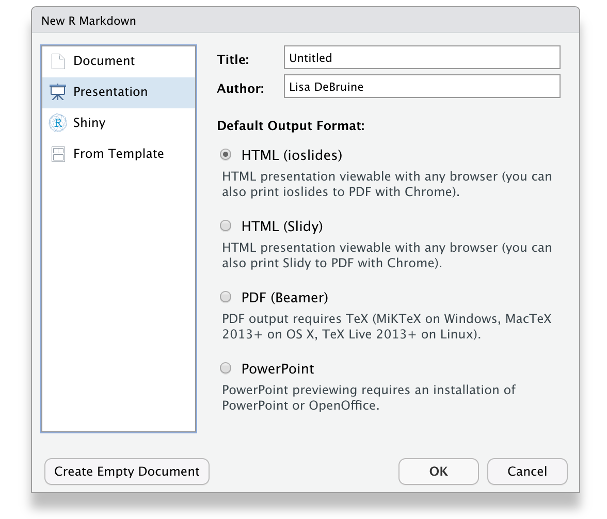
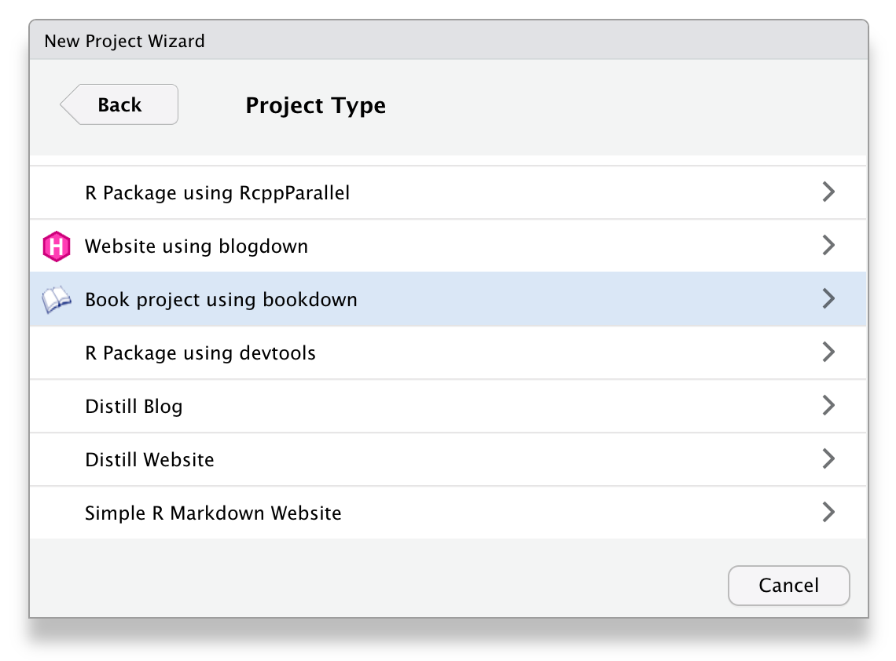

# Advanced Reports  {#present}

## Intended Learning Outcomes {#ilo-present}

* Structure data in report, presentation, and dashboard formats
* Include linked figure and table captions in longer reports


```r
library(tidyverse)     # data wrangling functions
library(bookdown)      # for chaptered reports
library(flexdashboard) # for dashboards
library(DT)            # for interactive tables
```

Until now, we've only used the default `html_document` output format in an <a class='glossary' target='_blank' title='The R-specific version of markdown: a way to specify formatting, such as headers, paragraphs, lists, bolding, and links, as well as code blocks and inline code.' href='https://psyteachr.github.io/glossary/r#r-markdown'>R markdown</a> report, but there are several other [output formats](https://rmarkdown.rstudio.com/formats.html){target="_blank"} that you can try.

## Reports

### Word documents

In the <a class='glossary' target='_blank' title='A structured format for information' href='https://psyteachr.github.io/glossary/y#yaml'>YAML</a> header of an R Markdown document, you can change output to `word_document` to create a Microsoft Word file. Make sure you carefully check your file; images and tables can often look odd or page breaks can happen in strange ways.

You can add page breaks by adding `\newpage` on a line by itself with blank lines above and below.

### PDF documents

If you have a latex installation (see Appendix\ \@ref(installing-r)), you can create a PDF by setting output to `pdf_document`. 

Note that this can sometimes cause problems with <code class='package'>kableExtra</code> tables and you can't use some elements like interactive plots. Additionally, the figures and tables are likely to shift from their position in text to the top or bottom of pages. 

See the [PDF section](https://bookdown.org/yihui/rmarkdown/pdf-document.html){target="_blank"} of *R Markdown: The Definitive Guide* [@rmarkdown_definitive] for more advanced customisation options.

### Linked documents

If you need to create longer reports with links between sections, you can use one of the bookdown formats. `bookdown::html_document2` is a useful one that adds figure and table numbers automatically to any figures or tables with a caption and allows you to link to these by reference.

Refer to figures and tables like the code below. Figures start with "fig:" and tables with "tab:", then the code <a class='glossary' target='_blank' title='A section of code in an R Markdown file' href='https://psyteachr.github.io/glossary/c#chunk'>chunk</a> name that created the figure or table.

```
See Table\ \@ref(tab:table-name) or Figure\ \@ref(fig:fig-name).
```

::: {.warning data-latex=""}
The code chunk names can only contain letters, numbers and dashes. If they contain other characters like spaces or underscores, the referencing will not work.
:::

The code below shows how to link text to figures or tables. You can see the [HTML output here](demos/html_document2.html).


<div class='webex-solution'><button>Linked Document Code</button>
<code style='font-size: smaller;'><pre>
---
title: "Linked Document Demo"
output: 
  bookdown::html_document2:
    number_sections: false
---

```{r setup, include=FALSE}
knitr::opts_chunk$set(echo = FALSE,
                      message = FALSE,
                      warning = FALSE)
library(tidyverse)
library(kableExtra)
theme_set(theme_minimal())
```

Diamond price depends on many features, such as:

- cut (See Table\ \@ref(tab:by-cut))
- colour (See Table\ \@ref(tab:by-colour))
- clarity (See Figure\ \@ref(fig:by-clarity))
- carats (See Figure\ \@ref(fig:by-carat))

## Tables

### Cut

```{r by-cut}
diamonds %>%
  group_by(cut) %>%
  summarise(avg = mean(price),
            .groups = "drop") %>%
  kable(digits = 0, 
        col.names = c("Cut", "Average Price"),
        caption = "Mean diamond price by cut.") %>%
  kable_material()
```

### Colour

```{r by-colour}
diamonds %>%
  group_by(color) %>%
  summarise(avg = mean(price),
            .groups = "drop") %>%
  kable(digits = 0, 
        col.names = c("Cut", "Average Price"),
        caption = "Mean diamond price by colour.") %>%
  kable_material()
```

## Plots

### Clarity

```{r by-clarity, fig.cap = "Diamond price by clarity"}
ggplot(diamonds, aes(x = clarity, y = price)) +
  geom_boxplot() 
```

### Carats

```{r by-carat, fig.cap = "Diamond price by carat"}
ggplot(diamonds, aes(x = carat, y = price)) +
  stat_smooth()
```

</pre></code>
</div>

This format defaults to numbered sections, so set `number_sections: false` in the <a class='glossary' target='_blank' title='A structured format for information' href='https://psyteachr.github.io/glossary/y#yaml'>YAML</a> header if you don't want this.


## Presentations

You can choose a presentation template when you create a new R Markdown document. We'll use ioslides for this example, but the other formats work similarly.

<div class="figure" style="text-align: center">

<p class="caption">(\#fig:img-ioslides-template)Ioslides RMarkdown template.</p>
</div>

The main differences between this and the Rmd files you've been working with until now are that the `output` type in the <a class='glossary' target='_blank' title='A structured format for information' href='https://psyteachr.github.io/glossary/y#yaml'>YAML</a> header is `ioslides_presentation` instead of `html_document` and this format requires a specific title structure. Each slide starts with a level-2 header.

The template provides you with examples of text, bullet point, code, and plot slides. You can knit this template to create an <a class='glossary' target='_blank' title='Hyper-Text Markup Language: A system for semantically tagging structure and information on web pages.' href='https://psyteachr.github.io/glossary/h#html'>HTML</a> document with your presentation. It often looks odd in the RStudio built-in browser, so click the button to open it in a web browser. You can use the space bar or arrow keys to advance slides.

The code below shows how to load some packages and display text, a table, and a plot. You can see the [HTML output here](demos/ioslides.html).


<div class='webex-solution'><button>Slide Code</button>
<code style='font-size: smaller;'><pre>
---
title: "Presentation Demo"
author: "Lisa DeBruine"
output: ioslides_presentation
---

```{r setup, include=FALSE}
knitr::opts_chunk$set(echo = FALSE)
library(tidyverse)
library(kableExtra)
```

## Slide with Markdown

The following slides will present some data from the `diamonds` dataset from **ggplot2**.

Diamond price depends on many features, such as:

- cut
- colour
- clarity
- carats

## Slide with a Table

```{r}
diamonds %>%
  group_by(cut, color) %>%
  summarise(avg_price = mean(price),
            .groups = "drop") %>%
  pivot_wider(names_from = cut, values_from = avg_price) %>%
  kable(digits = 0, caption = "Mean diamond price by cut and colour.") %>%
  kable_material()
```

## Slide with a Plot

```{r pressure}
ggplot(diamonds, aes(x = cut, y = price, color = color)) +
  stat_summary(fun = mean, geom = "point") +
  stat_summary(aes(x = as.integer(cut)), 
               fun = mean, geom = "line") +
  scale_x_discrete(position = "top") +
  scale_color_viridis_d(guide = guide_legend(reverse = TRUE)) +
  theme_minimal() 
```

</pre></code>
</div>


## Dashboards

Dashboards are a way to display text, tables, and plots with dynamic formatting. After you install <code class='package'>flexdashboard</code>, you can choose a flexdashboard template when you create a new R Markdown document. 

<div class="figure" style="text-align: center">

<p class="caption">(\#fig:img-flx-template)Flexdashboard RMarkdown template.</p>
</div>

The code below shows how to load some packages, display two tables in a tabset, and display two plots in a column. You can see the [HTML output here](demos/flexdashboard.html).


<div class='webex-solution'><button>Dashboard Code</button>
<code style='font-size: smaller;'><pre>
---
title: "Flexdashboard Demo"
output: 
  flexdashboard::flex_dashboard:
    social: [ "twitter", "facebook", "linkedin", "pinterest" ]
    source_code: embed
    orientation: columns
    vertical_layout: fill
---

```{r setup, include=FALSE}
library(flexdashboard)
library(tidyverse)
library(kableExtra)
library(DT) # for interactive tables
theme_set(theme_minimal())
```

Column {data-width=350, .tabset}
--------------------------------

### By Cut

This table uses `kableExtra` to render the table with a specific theme.

```{r}
diamonds %>%
  group_by(cut) %>%
  summarise(avg = mean(price),
            .groups = "drop") %>%
  kable(digits = 0, 
        col.names = c("Cut", "Average Price"),
        caption = "Mean diamond price by cut.") %>%
  kable_classic()
```

### By Colour

This table uses `DT::datatable()` to render the table with a searchable interface.

```{r}
diamonds %>%
  group_by(color) %>%
  summarise(avg = mean(price),
            .groups = "drop") %>%
  DT::datatable(colnames = c("Colour", "Average Price"), 
                caption = "Mean diamond price by colour",
                options = list(pageLength = 5),
                rownames = FALSE) %>%
  DT::formatRound(columns=2, digits=0)
```

Column {data-width=350}
-----------------------

### By Clarity

```{r by-clarity, fig.cap = "Diamond price by clarity"}
ggplot(diamonds, aes(x = clarity, y = price)) +
  geom_boxplot() 
```


### By Carats

```{r by-carat, fig.cap = "Diamond price by carat"}
ggplot(diamonds, aes(x = carat, y = price)) +
  stat_smooth()
```

</pre></code>
</div>

Change the size of your web browser to see how the boxes, tables and figures change.

The best way to figure out how to format a dashboard is trial and error, but you can also look at some [sample layouts](https://pkgs.rstudio.com/flexdashboard/articles/layouts.html){target="_blank"}.

## Other formats

### Books

You can create online books with <code class='package'>bookdown</code>. In fact, the book you're reading was created using bookdown. After you download the package, start a new project and choose "Book project using bookdown" from the list of project templates. 

<div class="figure" style="text-align: center">

<p class="caption">(\#fig:img-bookdown-template)Bookdown project template.</p>
</div>

Each chapter is written in a separate .Rmd file and the general book settings can be changed in the `_bookdown.yml` and `_output.yml` files. 

### Websites

You can create a simple website the same way you create any R Markdown document. Choose "Simple R Markdown Website" from the project templates to get started. See Appendix\ \@ref(webpages) for a step-by-step tutorial.

For more complex, blog-style websites, you can investigate [<code class='package'>blogdown</code>](https://bookdown.org/yihui/blogdown/). After you install this package, you will also be able to crate template blogdown projects to get you started.

### Shiny

To get truly interactive, you can take your R coding to the next level and learn Shiny. Shiny apps let your R code react to user input. You can do things like [make a word cloud](https://shiny.psy.gla.ac.uk/debruine/wordcloud/), [search a google spreadsheet](https://shiny.psy.gla.ac.uk/debruine/seen/), or [conduct a survey](https://shiny.psy.gla.ac.uk/debruine/question/).

This is well outside the scope of this class, but the skills you've learned here provide a good start. The free book [Building Web Apps with R Shiny](https://debruine.github.io/shinyintro/) by one of the authors of this book can get you started creating shiny apps.

## Resources {#resources-present}

* [RStudio Formats](https://rmarkdown.rstudio.com/formats.html)
* [R Markdown Cookbook](https://bookdown.org/yihui/rmarkdown-cookbook)
* [Flexdashboard](https://pkgs.rstudio.com/flexdashboard/)
* [Bookdown](https://bookdown.org/yihui/bookdown/)
* [Blogdown](https://bookdown.org/yihui/blogdown/)
* [Shiny](https://shiny.rstudio.com/)


