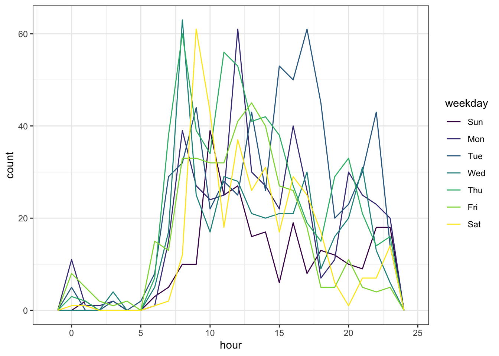
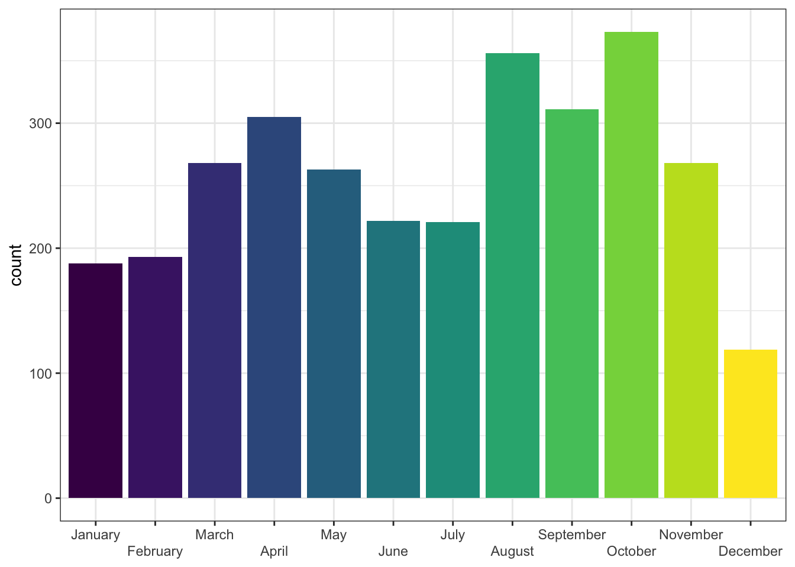

# Dates and Times

Working with dates can be a little tricky, but the <code class='package'><a href='https://lubridate.tidyverse.org/' target='_blank'>lubridate</a></code> package is there to help. Their website has a helpful [cheatsheet](https://rawgit.com/rstudio/cheatsheets/main/lubridate.pdf) and you can view a tutorial by typing `vignette("lubridate")` in the console pane. This appendix is a quick intro to some of the most useful functions for making reproducible reports.


```r
# packages needed for this appendix
library(tidyverse)
library(lubridate)
```

## Parsing

Dates can be in many formats. The `ymd` functions can deal with almost all of them, regardless of the punctuation used in the format. All of the examples below produce a date in the standard format "2022-01-03".


```r
# year-month-day orders
ymd("22 Jan 3")
ymd("2022 January 3rd")

# month-day-year orders
mdy("January 3, 2022")
mdy("Jan/03/22")

# day-month-year orders
dmy("3JAN22")
dmy("3rd of January in the year 2022")
```

::: {.try data-latex=""}
See if you can make a date format that one of the parsers *can't* handle.
:::

There are similar functions for date/times, too.


```r
ymd_hms("2022 Jan 3, 6:05 and 20s pm")
mdy_h("January 3rd, 2022 at 6pm")
```

```
## [1] "2022-01-03 18:05:20 UTC"
## [1] "2022-01-03 18:00:00 UTC"
```

The date/time functions can also take a timezone argument. If you don't specify it, it defaults to "UTC".


```r
ymd_hm("2022-01-03 18:05", tz = "GMT")
```

```
## [1] "2022-01-03 18:05:00 GMT"
```

## Get Parts

You frequently need to extract parts of a date/time for plotting. Let's work through some examples with tweets from Appendix\ \@ref(twitter-data).


```r
tweets <- list.files(
  path = "data/tweets", 
  pattern = "^tweet_activity_metrics",
  full.names = TRUE
) %>%
  map_df(read_csv) %>%
  select(!starts_with("promoted"))
```

The `time` column is already in date/time (POSIXct) format, but what if we wanted to plot tweets by hour for each day of the week? The following functions extract specific parts of a date or datetime object: `second()`, `minute()`, `hour()`, `day()`, `wday()`, `yday()`, `week()`, `month()`, `year()`, and `tz()`.


```r
tweets %>%
  mutate(weekday = wday(time, label = TRUE),
         hour = hour(time)) %>%
  ggplot(aes(x = hour, color = weekday)) +
  geom_freqpoly(binwidth = 1)
```



This is a godsend for people (like Lisa) who never have a clue what week of the year it is today.


```r
today() %>% week()
```

```
## [1] 5
```

A nice side-effect of using the lubridate function to get days of the week or months of the year is that the results are an ordered factor, so display correctly in a plot.


```r
tweets %>%
  mutate(month = month(time, label = TRUE, abbr = FALSE)) %>%
  ggplot(aes(x = month, fill = month)) +
  geom_bar(show.legend = FALSE) +
  scale_x_discrete(name = NULL, guide = guide_axis(n.dodge=2))
```




## Internationalisation

You may need to work with dates from a different locale than your computer's defaults, such as dates written in French or Russian. Or your computer may have a non-English locale. Set the `locale` argument to the relevant language code.


```r
ymd("2022 January 3", locale = "en_GB")
ymd("2022 Janvier 3", locale = "fr_FR")
wday("2022-01-03", label = TRUE, locale = "ru_RU")
```

```
## [1] "2022-01-03"
## [1] "2022-01-03"
## [1] пн
## Levels: вс < пн < вт < ср < чт < пт < сб
```


```r
# check which locales are available on your computer
# doesn't work for Windows
system("locale -a")
```

## Exercises

What day of the week is/was your 50th birthday?


<div class='webex-solution'><button>Solution</button>

```r
birthdate <- ymd(19761118) # put your own birthdate here
birthday50 <- birthdate + years(50)
wday(birthday50, label = TRUE)
```

```
## [1] Wed
## Levels: Sun < Mon < Tue < Wed < Thu < Fri < Sat
```


</div>


