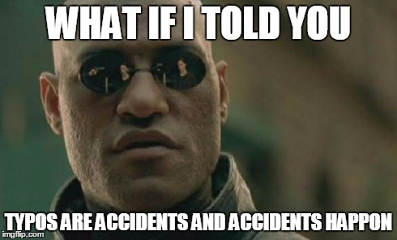

# Overview {.unnumbered}

This book provides an overview of the basic skills needed to turn raw data into informative summaries and visualisations presented in professional reports and presentations. The book will introduce learners to R [@R-base], a programming language that can help automate working with data. The book will cover importing and processing data from spreadsheets, producing data summaries of <a class='glossary' target='_blank' title='Statistics that describe an aspect of data (e.g., mean, median, mode, variance, range)' href='https://psyteachr.github.io/glossary/d#descriptive'>descriptive</a> statistics in tables, creating beautiful and informative visualisations, and constructing reports and presentations that automatically update when the underlying data changes.

::: {.small_right}

:::

By the end of this book, you will be able to use R to:

-   clean and process data
-   summarise data
-   informatively visualise data
-   create reusable report templates

## Structure of the course

This book accompanies a 10-week course, covering one chapter per week. Each chapter will introduce you to some new skills and concepts using concrete examples. At various points, there will be multiple-choice or fill-in-the-blank questions for you to check your understanding. Each chapter has accompanying walk-through videos, where an instructor demonstrates the skills covered in the chapter. Each chapter also has accompanying exercises that you should do to reinforce your learning.

## How to learn data skills

<!--
::: {.small_right}

:::
-->

Learning data skills is kind of like having a gym membership (thanks to [Phil McAleer](https://twitter.com/McAleerP) for the analogy). You'll be given state-of-the-art equipment to use and instructions for how to use them, but your data skills won't get any stronger unless you practice.

<!--
::: {.small_left}

:::
-->

Data skills do not require you to memorise lots of code. You will be introduced to many different functions, but the main skill to learn is how to efficiently find the information you need. This will require getting used to the structure of help files and [cheat sheets](https://www.rstudio.com/resources/cheatsheets/){target="_blank"}, learning how to Goggle your problem and choose a helpful solution, and learning how to read error messages.

<!--
::: {.small_right}

:::
-->

Learning to code involves making a **lot** of mistakes. These mistakes are completely essential to the process, so try not to feel too frustrated. Many of the chapter exercises will give you broken code to fix so you get experience seeing what common errors look like. As you become a more experienced coder, you might not make fewer errors, but you'll recover from them much faster.
