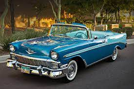

```{r setup, include=FALSE}
knitr::opts_chunk$set(
  echo       = FALSE,     # whether to show code chunks
  message    = FALSE,     # whether to show messages from your code
  warning    = FALSE,     # whether to show warnings from your code
  fig.width  = 8,         # figure width in inches (at 96 dpi)
  fig.height = 5,         # figure height in inches (at 96 dpi)
  out.width = "50%"      # figures should take up 50% of the page width
)
library(tidyverse)

library(kableExtra)
```

```{r}
# Data from https://www.kaggle.com/kyanyoga/sample-sales-data
sales_online <- readr::read_csv("https://psyteachr.github.io/ads-v1/data/sales_data_sample.csv")
```

```{r}
sales_counts<- sales_online %>%
  filter(PRODUCTLINE %in% c("Planes", "Motorcycles", "Classic Cars")) %>%
  group_by(PRODUCTLINE) %>%
  count()
```

# Sample sales report

This report summarises the sales data for different types of vehicles sold between 2003 and 2005. This data is from [Kaggle](https://www.kaggle.com/kyanyoga/sample-sales-data)

## Sales by type

The *total* number of **planes** sold was `r sales_counts$n[3]`

```{r}
knitr::include_graphics("https://cdn.britannica.com/q:60/69/155469-131-14083F59/airplane-flight.jpg")
```

The *total* number of **classic cars** sold was `r sales_counts$n[1]`.

```{r}

```


The *total* number of **motorcycles** sold was `r sales_counts$n[2]`.

```{r}
ggplot(data = sales_counts, 
       mapping = aes(x = PRODUCTLINE, y = n, fill = PRODUCTLINE)) +
  geom_bar(stat = "identity", show.legend = FALSE) +
  labs(x = "Type of vehicle",
       y = "Number of sales",
       title = "Sales by vehicle type",
       subtitle = "2003 - 2005")
```

## Data in table form


```{r}
sales_counts %>%
  kable(col.names = c("Product", "Number of sales"),
      caption = "Number of sales per product line.", 
      align = "c") %>% #try changing this to l or r
  kable_classic_2()
```

