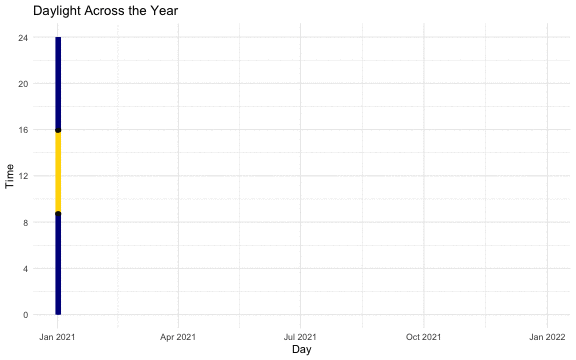

# Animated Plots

```{r}
library(tidyverse)
library(gganimate)
```


### Animated Plots

You can make animated plots with `r pkg("gganimate", "https://gganimate.com/")`. Their website has great learning materials, so we'll just give you a quick taste of what it can do.

The code below uses the [ncod_tweets.rds](data/ncod_tweets.rds){download} data from Appendix\ \@ref(twitter-hashtags). It's complex, but it's all functions you've learned how to use. 

```{r}
# get data for NCOD hashtags with >250 tweets
tweets <- readRDS("data/ncod_tweets.rds") %>%
  select(created_at, hashtags) %>%
  unnest(cols = hashtags) %>%
  # select hashtags with 250 - 10000 tweets
  group_by(hashtags) %>%
  filter(n() > 250, n() < 10000) %>%
  ungroup() %>%
  # round created_at down to the nearest hour
  mutate(time = lubridate::floor_date(created_at, unit = "hour")) %>%
  # count tweets per hour for each hashtag
  count(time, hashtags) %>%
  # make wide, replacing missing values with 0
  pivot_wider(names_from = hashtags, 
              values_from = n, 
              values_fill = 0) %>%
  # order by time 
  arrange(time) %>%
  # calculate the cumulative sum of tweets
  mutate(across(-time, cumsum)) %>%
  # put back in long format
  pivot_longer(cols = -time, names_to = "hashtags", values_to = "n")
```

First, make your static base plot.

```{r, fig.width = 8, fig.height = 5}
# make the base static plot
plot <- tweets %>%
  ggplot(aes(x = time, y = n, color = hashtags)) +
  geom_point() +
  scale_color_manual(values = c("red", "orange", "gold", "darkgreen", "blue", "purple")) +
  labs(x = NULL, y = "Total tweets") +
  scale_x_datetime(date_breaks = "12 hours",
                   date_labels = "%a %H:00") +
  theme(legend.position = c(0.2, 0.7))

plot
```

Next, add a gganimate function like `transition_time()` to animate the variable `time`. You can add the function `shadow_mark()` to determine wether you just see the points at the current time as the animation progresses, or whether past and/or future points will also be visible.


```{r}
anim <- plot +
  transition_time(time) +
  shadow_mark(past = TRUE, future = FALSE)
```

Saving or displaying the animation can take 10-20 seconds or more to render, so it's usually best to create the plot interactively, save it to a gif with `anim_save()`, and set the relative code chunk to `eval = FALSE` so you can load the gif as an image when you knit, rather than render it each time.

```{r, eval = FALSE}
# set this to eval = FALSE and run interactively
anim_save(filename = "images/gganimate_demo.gif",
          animation = anim,
          width = 8, height = 5, units = "in", res = 150)
```

```{r gganimate-demo, fig.cap = "Animated plot demo using gganimate."}
# load the gif from the file
knitr::include_graphics("images/gganimate_demo.gif")
```


```{r}
ct <- cols(
  Day = col_date(format = "%d/%m/%Y"),
  RiseTime = col_double(),
  SetTime = col_double()
)

sun <- read_csv("https://psyteachr.github.io/ads-v1/data/sunfact2021.csv", col_types = ct)
```


```{r, eval = FALSE}
anim <- ggplot(sun, aes(x = Day)) +
  geom_linerange(aes(ymin = RiseTime, ymax = SetTime), color = "gold", size = 2) +
  geom_linerange(aes(ymin = SetTime, ymax = 24), color = "darkblue", size = 2) +
  geom_linerange(aes(ymin = 0, ymax = RiseTime), color = "darkblue", size = 2) +
  geom_point(aes(y = RiseTime), color = "black") +
  geom_point(aes(y = SetTime), color = "black") +
  scale_y_continuous("Time", breaks = seq(0,24, 4), limits = c(0, 24)) +
  theme_minimal() +
  ggtitle("Daylight Across the Year") +
  transition_time(Day) +
  shadow_mark()

anim_save("sun.gif", anim, width = 8, height = 5, units = "in", res = 72)
```

```{r sun-demo, fig.cap = "Animated plot demo using gganimate."}
# load the gif from the file

```

